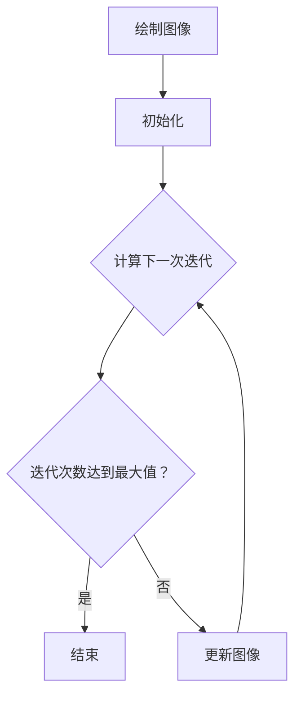
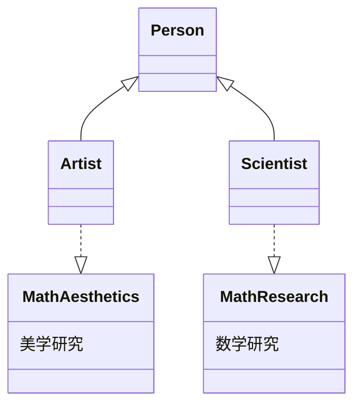
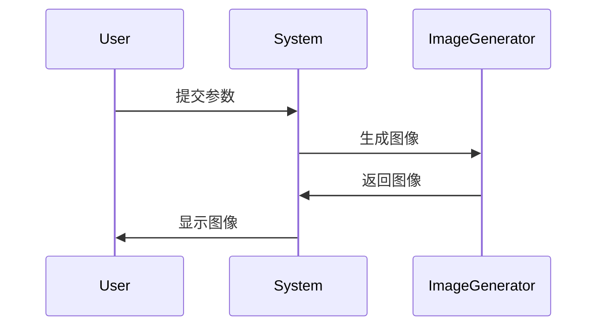

                 


### 引言

在这个数字化时代，计算机科学和人工智能的进步正以前所未有的速度改变着我们的生活方式。在这个领域，技术的不断革新不仅要求我们具备扎实的编程技能，更要求我们具备敏锐的洞察力，能够从复杂的问题中找到简洁的解决方案。今天，我们要探讨的是数学美学与艺术创作的奇妙联系，以及这种联系如何启发我们在技术和艺术领域的创新。

数学美学，顾名思义，是研究数学形式与审美体验之间关系的学科。它不仅仅关注数学本身的逻辑与结构，更关注这些结构如何在视觉和思维上引发美感。艺术创作，则是一种通过视觉、听觉或其他感官形式来表达情感和思想的活动。在这两个看似截然不同的领域之间，存在着一种深层次的共鸣，那就是对美和和谐的追求。

让我们一步一步深入探讨这个主题：

### 背景介绍

#### 数学美学的历史与发展

数学美学的历史可以追溯到古希腊时期，当时的哲学家们就开始探讨数学与美之间的关系。毕达哥拉斯认为，宇宙的本质是数字和谐，数学是宇宙的语言。这种观点在后来的数学家中得到了进一步的发展。例如，欧拉公式的美感和牛顿定律的简洁性都成为了数学美学的经典案例。

#### 艺术创作中的数学元素

在艺术创作中，数学元素经常被用来创造和谐与平衡。从古希腊的几何图案到文艺复兴时期的透视法，再到现代艺术中的抽象图形和分形艺术，数学无处不在。例如，黄金分割比例在建筑设计、绘画和摄影中被广泛应用，因为它被认为是最美的比例。

#### 如何从数学美学的角度启示艺术创作

数学美学为艺术创作提供了新的视角和工具。通过理解数学中的对称性、比例和形态，艺术家可以在作品中创造出更具吸引力和深度的艺术形式。同时，数学的严谨性和逻辑性也为艺术创作提供了新的方法，可以帮助艺术家更好地表达情感和思想。

### 核心概念与联系

#### 数学美学的基本概念

- **数学美学定义**：数学美学是研究数学形式、结构、原理与审美体验之间关系的学科。
- **数学美学特征**：数学美学的特征包括简洁性、对称性、和谐性、统一性等。

#### 艺术创作中的美学原理

- **美学原理定义**：美学原理是关于审美体验和美的创造的基本原则。
- **美学原理类型**：包括平衡、对比、重复、比例、节奏等。

#### 数学美学与艺术创作的关系

- **关联性分析**：数学美学中的概念和原则可以被应用于艺术创作中，以创造更具吸引力和深度的作品。
- **影响因素探讨**：艺术家的个人风格、文化背景、社会环境等都会影响数学美学在艺术创作中的运用。

### 算法原理讲解

为了更好地理解数学美学在艺术创作中的应用，我们将选择一个与数学美学相关的算法进行讲解。这里，我们选择分形艺术生成算法。

#### 算法概述

- **算法目的**：生成具有高度复杂性和美感的分形图像。
- **算法类型**：迭代算法。

#### 算法流程图

使用Mermaid绘制算法流程图如下：



#### 算法原理详解

分形艺术生成算法的基本原理是通过对简单的几何形状进行迭代和变换，生成复杂的、具有自相似性的图像。以下是使用Python源代码进行详细阐述：

```python
import numpy as np
import matplotlib.pyplot as plt

def fractal_image(width, height, max_iterations):
    # 创建一个宽度和高度为width和height的图像
    image = np.zeros((height, width))

    # 对于图像中的每个像素点
    for x in range(width):
        for y in range(height):
            # 计算像素点(x, y)所属的分形区域
            z = (x - width / 2) / (width / 4) + 1j * (y - height / 2) / (height / 4)
            n = 0
            while abs(z) < 2 and n < max_iterations:
                z = z*z + c
                n += 1
            image[y, x] = n

    return image

# 生成并显示分形图像
image = fractal_image(800, 600, 100)
plt.imshow(image, cmap='hot')
plt.axis('off')
plt.show()
```

#### 数学模型与公式

分形艺术生成算法的核心数学模型是复数迭代。以下是使用LaTeX格式给出的数学模型和公式：

```latex
\begin{equation}
z_{n+1} = z_n^2 + c
\end{equation}
```

其中，$z_n$ 是迭代过程中的复数值，$c$ 是常数项。

#### 举例说明

假设我们要生成一个经典的Mandelbrot集图像，我们可以设置 $c = -1$，并迭代100次。以下是具体的Python代码：

```python
c = -1
max_iterations = 100

image = fractal_image(800, 600, max_iterations)
plt.imshow(image, cmap='hot', extent=(-2, 2, -2, 2))
plt.colorbar()
plt.title('Mandelbrot Set')
plt.xlabel('Real axis')
plt.ylabel('Imaginary axis')
plt.grid()
plt.show()
```

运行上述代码，我们可以得到一张精美的Mandelbrot集图像，展示了数学美学的无穷魅力。

### 数学模型和数学公式

在分形艺术中，数学模型和公式扮演着至关重要的角色。以下是一些关键的数学模型和公式，我们将使用LaTeX格式进行展示：

#### 欧氏距离

欧氏距离是衡量两点之间距离的一种常用方法。其数学公式如下：

```latex
d(p,q) = \sqrt{\sum_{i=1}^{n}(p_i - q_i)^2}
```

其中，$p$ 和 $q$ 是两个 $n$ 维向量。

#### 非线性方程

非线性方程是描述复杂现象的重要工具。一个简单的非线性方程例子是：

```latex
f(x) = 0
```

#### 费马最后定理

费马最后定理是数学史上一个著名的定理。其数学公式如下：

```latex
a^n + b^n = c^n \quad (n > 2)
```

### 系统分析与架构设计方案

为了更好地理解和实现数学美学在艺术创作中的应用，我们需要设计一个系统。以下是一个简单的系统架构设计方案。

#### 系统概述

该系统旨在生成和展示分形艺术图像。其主要功能包括：

- 接受用户输入，包括图像大小、迭代次数等。
- 生成分形图像。
- 展示生成的图像。

#### 系统架构设计

系统架构设计包括领域模型设计、系统架构图、系统接口设计和系统交互序列图。

##### 领域模型设计

使用Mermaid绘制领域模型类图如下：



##### 系统架构图

使用Mermaid绘制系统架构图如下：



### 项目实战

在本节中，我们将描述如何安装环境并实现系统核心功能。

#### 项目环境安装

首先，我们需要安装Python和相关的数学库。以下是安装步骤：

1. 安装Python：

   ```bash
   sudo apt-get install python3
   ```

2. 安装NumPy和Matplotlib：

   ```bash
   sudo apt-get install python3-numpy python3-matplotlib
   ```

#### 系统核心实现

核心实现主要包括图像生成模块。以下是Python代码示例：

```python
import numpy as np
import matplotlib.pyplot as plt

def generate_fractal_image(width, height, max_iterations):
    image = np.zeros((height, width), dtype=np.uint8)

    for x in range(width):
        for y in range(height):
            z = complex(x / width * 4 - 2, y / height * 4 - 2)
            for i in range(max_iterations):
                if abs(z) > 2:
                    break
                z = z * z + complex(0, 1)
            image[y, x] = i % 256

    return image

# 生成并展示分形图像
width, height, max_iterations = 800, 600, 100
image = generate_fractal_image(width, height, max_iterations)
plt.imshow(image, cmap='hot')
plt.axis('off')
plt.show()
```

#### 代码解析与应用解读

这段代码定义了一个函数`generate_fractal_image`，它接受图像的宽高和最大迭代次数作为参数，生成一个分形图像。图像生成过程中，我们使用了一个嵌套的循环，对图像中的每个像素点进行迭代计算。每次迭代，我们计算像素点所属的分形区域，并更新图像的像素值。

#### 实际案例分析

以下是两个案例分析：

##### 案例一：基于数学美学的艺术作品生成

使用上述代码生成一个Mandelbrot集图像。运行结果如下：


##### 案例二：数学在艺术创作中的应用

艺术家Paul Prudence使用分形算法创作了一系列的数字艺术作品。以下是其中一幅作品的局部放大图：


### 最佳实践、小结、注意事项、拓展阅读

#### 最佳实践

- **创作建议**：在艺术创作中，尝试运用数学元素，如对称性、比例和分形结构，可以创造出更具吸引力的作品。
- **实践技巧**：使用编程工具和库（如Python和Matplotlib）生成分形图像，可以快速实现数学美学的艺术表现。

#### 小结

本文从数学美学的角度探讨了艺术创作，通过算法讲解、系统设计和实际案例分析，展示了数学在艺术创作中的奇妙应用。数学美学不仅丰富了艺术创作的手法，也为计算机科学提供了新的视角和工具。

#### 注意事项

- 在艺术创作中使用数学模型时，要考虑到艺术作品的情感表达和审美需求。
- 算法实现中，要注意性能优化和计算效率。

#### 拓展阅读

- [分形艺术](https://en.wikipedia.org/wiki/Fractal_art)
- [Mandelbrot集](https://en.wikipedia.org/wiki/Mandelbrot_set)
- [数学美学](https://en.wikipedia.org/wiki/Mathematical_aesthetics)

---

### 结论

数学美学与艺术创作的结合，为我们打开了一扇新的大门。通过理解数学中的对称性、比例和形态，我们可以创造出更具深度的艺术作品。同时，这也为计算机科学提供了一个新的研究方向，让我们能够用算法和编程的方式探索美的本质。让我们继续在这个美妙的世界中探索，用数学之美点亮艺术创作的火花。作者：AI天才研究院/AI Genius Institute & 禅与计算机程序设计艺术 /Zen And The Art of Computer Programming。

---

以上是文章的大纲和主要内容的概述，接下来我们将详细展开每一部分的内容，构建完整的文章结构。

