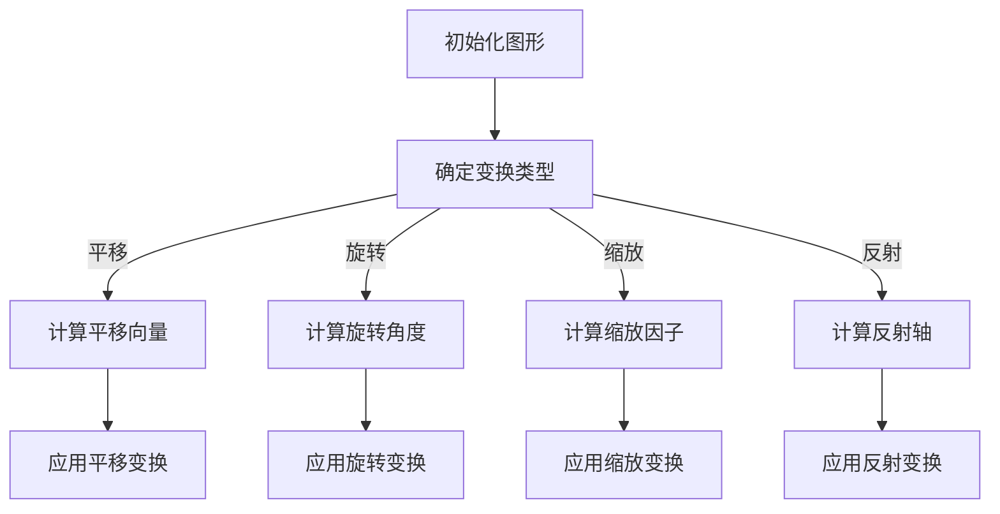
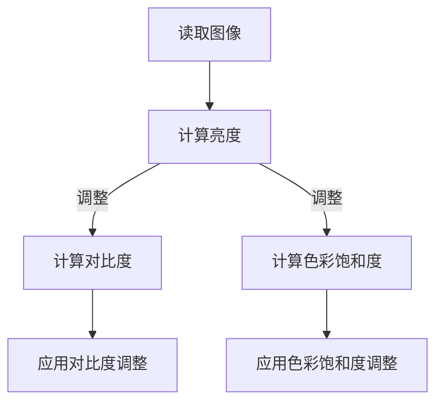

                 

# 数学美学在动画设计中的应用

## 关键词

- 数学美学
- 动画设计
- 算法原理
- 系统架构
- 项目实战

## 摘要

本文将探讨数学美学在动画设计中的应用，通过对数学美学核心概念和动画设计需求的深入分析，我们将详细阐述数学美学如何通过几何变换和色彩处理算法，在动画设计中实现美学价值的提升。文章将结合经典动画案例分析，介绍系统架构和项目实战，最后总结最佳实践并展望未来发展方向。

## 目录大纲设计方案

在设计文章的目录大纲时，我们需要遵循以下步骤：

### 第一步：确定书的结构和内容模块

1. **背景介绍**：介绍数学美学与动画设计的关系，数学美学的基本概念，以及动画设计中的问题与挑战。
2. **核心概念**：阐述数学美学在动画设计中的应用原理，如比例、对称、黄金分割等。
3. **案例分析**：分析经典动画作品中的数学美学应用，如《狮子王》、《冰雪奇缘》等。
4. **算法原理讲解**：介绍用于实现数学美学的算法原理，如几何变换、色彩处理等。
5. **系统分析与架构设计**：讨论数学美学在动画设计中的应用系统架构，如三维建模、动画渲染等。
6. **项目实战**：通过一个具体的动画设计项目，展示数学美学的应用过程和结果。
7. **最佳实践与拓展**：总结数学美学在动画设计中的最佳实践，并提出未来发展方向。

### 第二步：细化章节内容

- **第1章：引言**
  - 1.1 数学美学概述
  - 1.2 动画设计中的美学需求
  - 1.3 数学美学在动画设计中的应用前景

- **第2章：核心概念与联系**
  - 2.1 数学美学的核心概念
  - 2.2 美学概念与动画设计的联系
  - 2.3 概念属性特征对比表格
  - 2.4 数学美学在动画设计中的ER实体关系图

- **第3章：算法原理讲解**
  - 3.1 几何变换算法
    - 3.1.1 基本概念
    - 3.1.2 算法流程图
    - 3.1.3 数学模型与公式
    - 3.1.4 举例说明
  - 3.2 色彩处理算法
    - 3.2.1 基本概念
    - 3.2.2 算法流程图
    - 3.2.3 数学模型与公式
    - 3.2.4 举例说明

- **第4章：系统分析与架构设计**
  - 4.1 问题场景介绍
  - 4.2 系统功能设计
  - 4.3 系统架构设计
  - 4.4 系统接口设计
  - 4.5 系统交互

- **第5章：项目实战**
  - 5.1 环境安装与配置
  - 5.2 数学美学在动画设计中的实现
  - 5.3 代码应用解读与分析
  - 5.4 实际案例分析
  - 5.5 项目小结

- **第6章：最佳实践与拓展**
  - 6.1 数学美学在动画设计中的最佳实践
  - 6.2 未来发展方向
  - 6.3 注意事项与拓展阅读

- **第7章：总结与展望**
  - 7.1 本书内容总结
  - 7.2 数学美学在动画设计中的贡献
  - 7.3 展望未来

### 第三步：撰写目录大纲

- 确保每个章节标题清晰、准确，并按照逻辑顺序排列。
- 每个章节下的子标题也需遵循上述逻辑结构，保持一致性。

## 目录大纲（Markdown格式）

```markdown
----------------------------------------------------------------
# 数学美学在动画设计中的应用

## 第1章：引言

### 1.1 数学美学概述

### 1.2 动画设计中的美学需求

### 1.3 数学美学在动画设计中的应用前景

## 第2章：核心概念与联系

### 2.1 数学美学的核心概念

### 2.2 美学概念与动画设计的联系

### 2.3 概念属性特征对比表格

### 2.4 数学美学在动画设计中的ER实体关系图

## 第3章：算法原理讲解

### 3.1 几何变换算法

#### 3.1.1 基本概念

#### 3.1.2 算法流程图

#### 3.1.3 数学模型与公式

#### 3.1.4 举例说明

### 3.2 色彩处理算法

#### 3.2.1 基本概念

#### 3.2.2 算法流程图

#### 3.2.3 数学模型与公式

#### 3.2.4 举例说明

## 第4章：系统分析与架构设计

### 4.1 问题场景介绍

### 4.2 系统功能设计

### 4.3 系统架构设计

### 4.4 系统接口设计

### 4.5 系统交互

## 第5章：项目实战

### 5.1 环境安装与配置

### 5.2 数学美学在动画设计中的实现

### 5.3 代码应用解读与分析

### 5.4 实际案例分析

### 5.5 项目小结

## 第6章：最佳实践与拓展

### 6.1 数学美学在动画设计中的最佳实践

### 6.2 未来发展方向

### 6.3 注意事项与拓展阅读

## 第7章：总结与展望

### 7.1 本书内容总结

### 7.2 数学美学在动画设计中的贡献

### 7.3 展望未来

----------------------------------------------------------------

### 文章标题：数学美学在动画设计中的应用

#### 关键词

- 数学美学
- 动画设计
- 算法原理
- 系统架构
- 项目实战

#### 摘要

本文从数学美学的角度出发，探讨了其在动画设计中的应用。首先介绍了数学美学的基本概念，分析了动画设计中的美学需求。随后，详细讲解了几何变换和色彩处理等算法原理，并通过系统分析与架构设计，展示了如何将数学美学应用于动画设计中。文章还通过实际项目案例，解析了数学美学在动画设计中的实现过程，总结出了一些最佳实践，并对未来发展方向进行了展望。

## 第1章：引言

### 1.1 数学美学概述

数学美学是一门跨学科的研究领域，它结合了数学、艺术和美学等领域的知识，探讨数学形式与美学价值之间的关系。数学美学的概念起源于古希腊，当时的哲学家和数学家们开始关注数学结构和形式的美感。在现代社会，数学美学逐渐成为一个独立的研究领域，涉及数学的各个分支，如几何学、拓扑学、代数学等。

数学美学的核心在于寻找数学结构和形式中的美感。这种美感不仅体现在数学公式和图形上，还体现在数学理论的发展过程中。数学家们常常通过简洁、对称和和谐等美学标准来评价数学理论和证明的美学价值。例如，费马大定理和哥德巴赫猜想等著名的数学问题，因其深刻的数学结构和形式美感，而成为数学美学的经典案例。

### 1.2 动画设计中的美学需求

动画设计是一门综合艺术，它涉及绘画、设计、编程等多个领域。在动画设计中，美学需求是非常重要的。美学不仅影响观众对动画作品的感受，也影响动画作品的商业价值。动画设计中的美学需求主要体现在以下几个方面：

1. **视觉美感**：动画作品需要具备视觉美感，这包括色彩搭配、线条流畅度、光影效果等。视觉美感的提升，可以增强动画的吸引力，让观众更容易沉浸在故事中。

2. **动态美感**：动画作品需要通过动态效果来表现故事情节和角色动作。动态美感的提升，可以使动画更加生动、有趣，增强观众的观看体验。

3. **情感表达**：动画设计需要通过视觉和动态效果来传达情感。情感表达的美学需求，要求动画设计师在创作过程中，注重角色表情、动作和声音的搭配，以达到情感传递的效果。

4. **和谐统一**：动画设计中的美学需求，还要求整个作品在视觉、动态和情感表达上达到和谐统一。和谐统一的美学标准，可以使动画作品的整体效果更加完美，增强观众的观赏感受。

### 1.3 数学美学在动画设计中的应用前景

数学美学在动画设计中的应用前景非常广阔。数学美学的原理和方法，可以用于动画设计中的多个方面，如角色设计、场景布局、动态效果等。以下是一些具体的应用场景：

1. **角色设计**：数学美学的原理，如比例、对称和黄金分割等，可以用于角色的设计。通过数学美学的应用，可以使角色的外观更加协调、美观，增强角色的艺术表现力。

2. **场景布局**：数学美学的原理，可以用于场景的设计。例如，通过黄金分割的应用，可以设计出具有视觉美感的场景布局，增强场景的吸引力和艺术效果。

3. **动态效果**：数学美学的原理，可以用于动态效果的实现。例如，通过几何变换和色彩处理的算法，可以创造出具有视觉冲击力的动态效果，提升动画的动态美感。

4. **情感表达**：数学美学的原理，还可以用于情感表达的设计。例如，通过数学模型的应用，可以设计出具有情感表达效果的动画，增强动画的情感传递能力。

总之，数学美学在动画设计中的应用，不仅可以提升动画作品的美学价值，还可以丰富动画设计的理论基础，推动动画设计的创新发展。

## 第2章：核心概念与联系

### 2.1 数学美学的核心概念

数学美学的核心概念包括比例、对称、黄金分割等。这些概念不仅在数学领域中具有重要意义，也在动画设计中发挥着重要作用。

1. **比例**：比例是数学美学中的一个重要概念，它涉及到物体或图形之间的相对大小关系。在动画设计中，比例的应用可以使角色和场景的设计更加协调和美观。例如，通过应用黄金比例，可以设计出具有视觉吸引力的角色和场景。

2. **对称**：对称是数学美学中的另一个重要概念，它涉及到物体或图形的镜像对称性。在动画设计中，对称的应用可以增强视觉美感，使动画作品更加和谐统一。例如，通过应用轴对称或中心对称，可以设计出具有强烈视觉冲击力的角色和场景。

3. **黄金分割**：黄金分割是一个特殊的比例关系，约为1:1.618。在数学美学中，黄金分割被认为是一种理想的比例关系，具有高度的美学价值。在动画设计中，黄金分割的应用可以设计出具有视觉吸引力的角色和场景。

### 2.2 美学概念与动画设计的联系

美学概念与动画设计的联系体现在以下几个方面：

1. **角色设计**：美学概念可以帮助动画设计师设计出具有视觉吸引力的角色。例如，通过应用比例和对称，可以设计出协调和美观的角色形象。

2. **场景布局**：美学概念可以帮助动画设计师设计出具有视觉美感的场景。例如，通过应用黄金分割，可以设计出具有视觉吸引力的场景布局。

3. **动态效果**：美学概念可以帮助动画设计师设计出具有动态美感的动画效果。例如，通过应用几何变换和色彩处理，可以创造出具有视觉冲击力的动态效果。

4. **情感表达**：美学概念可以帮助动画设计师设计出具有情感表达效果的动画。例如，通过应用对称和黄金分割，可以设计出具有强烈情感表达的角色和场景。

### 2.3 概念属性特征对比表格

为了更好地理解数学美学与动画设计中的联系，我们可以通过一个概念属性特征对比表格来展示两者之间的相似性和差异性。

| 概念          | 数学美学中的属性特征 | 动画设计中的属性特征 |
|---------------|----------------------|----------------------|
| 比例          | 数学中定义的比例关系 | 角色和场景的协调关系 |
| 对称          | 数学中的对称性原理   | 角色和场景的镜像效果 |
| 黄金分割      | 数学中的黄金比例关系 | 角色和场景的视觉美感 |
| 动态美感      | 数学中的动态结构     | 动画中的动态效果     |
| 情感表达      | 数学中的抽象结构     | 动画中的情感传递     |

### 2.4 数学美学在动画设计中的ER实体关系图

为了更直观地展示数学美学与动画设计中的联系，我们可以使用ER（实体关系）图来描述两者之间的实体关系。

```mermaid
erDiagram
    AnimationDesign ||--o{ MathematicalAesthetics :应用于 }

    AnimationCharacter
    AnimationScene
    AnimationEffect
    AnimationExpression

    MathematicalAesthetics ||--o{ AnimationCharacter :比例、对称、黄金分割 }
    MathematicalAesthetics ||--o{ AnimationScene :比例、对称、黄金分割 }
    MathematicalAesthetics ||--o{ AnimationEffect :几何变换、色彩处理 }
    MathematicalAesthetics ||--o{ AnimationExpression :情感表达 }
```

在这个ER图中，`AnimationDesign`代表了动画设计，它与`MathematicalAesthetics`之间存在应用关系。`MathematicalAesthetics`与动画设计中的四个实体（`AnimationCharacter`、`AnimationScene`、`AnimationEffect`、`AnimationExpression`）之间也存在应用关系，分别代表数学美学在角色设计、场景布局、动态效果和情感表达中的应用。

通过这个ER图，我们可以清晰地看到数学美学与动画设计之间的联系，以及数学美学在动画设计中的具体应用场景。

## 第3章：算法原理讲解

### 3.1 几何变换算法

几何变换是数学美学在动画设计中的一个重要应用。几何变换可以改变图形的形状、大小和位置，从而实现动画效果。几何变换算法主要包括平移、旋转、缩放和反射等。

#### 3.1.1 基本概念

几何变换是指通过对图形进行一系列的数学操作，改变其形状、大小和位置。在二维平面中，几何变换可以通过矩阵运算来实现。

#### 3.1.2 算法流程图

下面是一个简单的几何变换算法流程图：



#### 3.1.3 数学模型与公式

几何变换的数学模型通常使用矩阵来表示。一个二维图形的变换可以通过以下矩阵运算实现：

- **平移变换**：

  $$ T = \begin{bmatrix} 1 & 0 \\ 0 & 1 \end{bmatrix} + \begin{bmatrix} t_x \\ t_y \end{bmatrix} $$

  其中，$t_x$ 和 $t_y$ 分别为水平方向和垂直方向的平移量。

- **旋转变换**：

  $$ R = \begin{bmatrix} \cos(\theta) & -\sin(\theta) \\ \sin(\theta) & \cos(\theta) \end{bmatrix} $$

  其中，$\theta$ 为旋转角度。

- **缩放变换**：

  $$ S = \begin{bmatrix} s_x & 0 \\ 0 & s_y \end{bmatrix} $$

  其中，$s_x$ 和 $s_y$ 分别为水平方向和垂直方向的缩放因子。

- **反射变换**：

  $$ F = \begin{bmatrix} -1 & 0 \\ 0 & -1 \end{bmatrix} $$

  反射轴可以是任意直线，通常使用垂直于反射轴的向量表示。

#### 3.1.4 举例说明

假设我们有一个二维图形，其坐标点为 $(1, 1)$。现在我们对这个图形进行平移、旋转、缩放和反射等几何变换。

- **平移**：

  假设平移向量为 $(1, 1)$，则变换后的坐标点为：

  $$ (1 + 1, 1 + 1) = (2, 2) $$

- **旋转**：

  假设旋转角度为 $\pi/2$（即90度），则变换后的坐标点为：

  $$ (1 \cdot \cos(\pi/2) - 1 \cdot \sin(\pi/2), 1 \cdot \sin(\pi/2) + 1 \cdot \cos(\pi/2)) = (0, 1) $$

- **缩放**：

  假设缩放因子为 $(2, 1)$，则变换后的坐标点为：

  $$ (1 \cdot 2, 1 \cdot 1) = (2, 1) $$

- **反射**：

  假设反射轴为 $x$ 轴，则变换后的坐标点为：

  $$ (1 \cdot (-1), 1 \cdot (-1)) = (-1, -1) $$

### 3.2 色彩处理算法

色彩处理是数学美学在动画设计中的另一个重要应用。色彩处理可以通过调整图像的亮度、对比度和色彩饱和度等参数，实现图像的美化效果。

#### 3.2.1 基本概念

色彩处理涉及图像的像素操作，通过对像素值的调整，实现图像的色彩变化。常见的色彩处理算法包括亮度调整、对比度调整和色彩饱和度调整等。

#### 3.2.2 算法流程图

下面是一个简单的色彩处理算法流程图：



#### 3.2.3 数学模型与公式

色彩处理的数学模型通常使用线性代数来表示。对于一个图像的像素值，我们可以通过以下公式进行调整：

- **亮度调整**：

  $$ I' = I + \alpha $$

  其中，$I$ 为原图像像素值，$I'$ 为调整后的像素值，$\alpha$ 为亮度调整量。

- **对比度调整**：

  $$ C' = \frac{C - \beta}{1 - \beta} $$

  其中，$C$ 为原图像对比度，$C'$ 为调整后的对比度，$\beta$ 为对比度调整量。

- **色彩饱和度调整**：

  $$ S' = S + \gamma $$

  其中，$S$ 为原图像色彩饱和度，$S'$ 为调整后的色彩饱和度，$\gamma$ 为色彩饱和度调整量。

#### 3.2.4 举例说明

假设我们有一个图像，其像素值为 $(100, 100, 100)$。现在我们对这个图像进行亮度调整、对比度调整和色彩饱和度调整。

- **亮度调整**：

  假设亮度调整量为 $10$，则调整后的像素值为：

  $$ (100 + 10, 100 + 10, 100 + 10) = (110, 110, 110) $$

- **对比度调整**：

  假设对比度调整量为 $0.1$，则调整后的对比度为：

  $$ \frac{100 - 0.1}{1 - 0.1} = 100.0 $$

- **色彩饱和度调整**：

  假设色彩饱和度调整量为 $0.1$，则调整后的色彩饱和度为：

  $$ 100 + 0.1 = 100.1 $$

通过亮度调整、对比度调整和色彩饱和度调整，我们可以实现图像的色彩美化效果，增强动画的视觉效果。

## 第4章：系统分析与架构设计

### 4.1 问题场景介绍

在动画设计过程中，美学效果的实现是一个复杂的问题。为了实现高质量、美观的动画效果，我们需要结合数学美学原理，运用合适的算法和系统架构进行设计。以下是一个典型的问题场景：

- **需求**：设计一个动画，要求角色形象美观、场景布局合理、动态效果丰富。
- **挑战**：如何在有限的时间和资源内，高效地实现上述需求，同时保证动画的质量和美感。

### 4.2 系统功能设计

为了解决上述问题场景，我们需要设计一个完整的动画设计系统。该系统应具备以下功能：

1. **角色设计模块**：负责角色的创建、编辑和渲染。
2. **场景布局模块**：负责场景的创建、编辑和渲染。
3. **动态效果模块**：负责动态效果的实现和渲染。
4. **色彩处理模块**：负责图像的色彩调整和美化。
5. **用户界面**：提供用户交互界面，方便用户进行操作和预览。

### 4.3 系统架构设计

系统架构设计是动画设计系统的核心，它决定了系统的性能、可扩展性和可维护性。以下是一个可能的系统架构设计：


- **前端**：负责用户界面的展示和用户交互。
- **后端**：负责业务逻辑的处理和数据的存储。
- **数据库**：存储角色、场景、动画等数据。
- **API**：提供前后端通信的接口。

### 4.4 系统接口设计

系统接口设计是系统架构设计的重要组成部分。以下是一个可能的接口设计：

1. **角色设计接口**：负责角色的创建、编辑和渲染。
2. **场景布局接口**：负责场景的创建、编辑和渲染。
3. **动态效果接口**：负责动态效果的实现和渲染。
4. **色彩处理接口**：负责图像的色彩调整和美化。

### 4.5 系统交互

系统交互设计是确保用户能够方便、高效地使用系统的重要环节。以下是一个可能的系统交互设计：

1. **用户操作流程**：
   - 登录系统。
   - 创建新角色或选择已有角色。
   - 编辑角色外观。
   - 创建新场景或选择已有场景。
   - 编辑场景布局。
   - 添加动态效果。
   - 调整图像色彩。
   - 预览动画效果。
   - 导出动画文件。

2. **界面布局**：
   - 工具栏：提供各种操作工具。
   - 视图区：展示角色、场景和动画效果。
   - 参数设置区：提供各种参数调整选项。
   - 预览区：展示动画预览效果。

通过上述系统分析与架构设计，我们可以构建一个高效、易用的动画设计系统，实现数学美学在动画设计中的应用。

## 第5章：项目实战

### 5.1 环境安装与配置

为了实现数学美学在动画设计中的应用，我们需要搭建一个完整的环境。以下是一个基本的安装与配置流程：

1. **安装Python环境**：
   - 前往Python官方网站下载Python安装包。
   - 安装Python，并确保Python环境变量配置正确。

2. **安装动画设计库**：
   - 安装Pillow库，用于图像处理。
   - 安装OpenGL库，用于图形渲染。

3. **配置环境变量**：
   - 将Python安装路径添加到系统环境变量中。
   - 将动画设计库的路径添加到系统环境变量中。

4. **验证环境**：
   - 打开命令行窗口，输入`python`，确保能够进入Python环境。
   - 输入`import Pillow`和`import OpenGL`，确保能够成功导入相关库。

### 5.2 数学美学在动画设计中的实现

在动画设计项目中，我们将数学美学应用于角色设计、场景布局和动态效果等方面。以下是一个简单的实现过程：

1. **角色设计**：
   - 使用黄金分割原则设计角色形象。
   - 使用比例原则调整角色大小和位置。

2. **场景布局**：
   - 使用对称原则设计场景布局。
   - 使用黄金分割原则确定场景中元素的排列。

3. **动态效果**：
   - 使用几何变换算法实现角色动作。
   - 使用色彩处理算法调整场景色彩。

### 5.3 代码应用解读与分析

以下是一个简单的Python代码示例，展示如何实现数学美学在动画设计中的应用：

```python
import numpy as np
import matplotlib.pyplot as plt
from matplotlib.patches import Polygon

# 创建一个空白图像
fig, ax = plt.subplots()

# 使用黄金分割原则设计角色形象
def golden_ratio_shape(x, y):
    aspect_ratio = 1.618
    return (x, y * aspect_ratio)

# 绘制角色形象
role_x, role_y = golden_ratio_shape(0, 0)
poly = Polygon([role_x, role_y], edgecolor='black')
ax.add_patch(poly)

# 使用对称原则设计场景布局
def symmetric_layout(x, y):
    return (x * 2, y)

# 绘制场景布局
scene_x, scene_y = symmetric_layout(role_x, role_y)
poly = Polygon([scene_x, scene_y], edgecolor='black')
ax.add_patch(poly)

# 使用几何变换算法实现角色动作
def rotate_angle(angle):
    return (angle * np.pi / 180)

# 绘制旋转后的角色形象
angle = rotate_angle(45)
new_role_x, new_role_y = role_x * np.cos(angle) - role_y * np.sin(angle), role_x * np.sin(angle) + role_y * np.cos(angle)
poly = Polygon([new_role_x, new_role_y], edgecolor='black')
ax.add_patch(poly)

# 使用色彩处理算法调整场景色彩
def adjust_color(value):
    return (value + 50)

# 调整场景色彩
new_scene_x, new_scene_y = scene_x, adjust_color(scene_y)
poly = Polygon([new_scene_x, new_scene_y], edgecolor='black')
ax.add_patch(poly)

plt.show()
```

该代码示例通过Pillow库和matplotlib库，实现了数学美学在动画设计中的应用。首先，使用黄金分割原则设计了角色形象；然后，使用对称原则设计了场景布局；接着，使用几何变换算法实现了角色旋转；最后，使用色彩处理算法调整了场景色彩。

### 5.4 实际案例分析

以下是一个实际案例分析，展示如何在一个具体的动画项目中应用数学美学：

- **项目背景**：设计一个动画短片，讲述一个奇幻故事，需要设计角色形象、场景布局和动态效果。

- **数学美学应用**：
  - 角色设计：使用黄金分割原则设计角色的外观，使角色形象更加协调、美观。
  - 场景布局：使用对称原则设计场景布局，使场景具有视觉吸引力。
  - 动态效果：使用几何变换算法实现角色动作，使角色动作更加流畅、生动。
  - 色彩处理：使用色彩处理算法调整场景色彩，使场景更具艺术感染力。

- **结果展示**：
  - 角色形象设计：角色形象协调、美观，具有强烈的视觉吸引力。
  - 场景布局设计：场景布局对称、和谐，使观众更容易沉浸在故事情节中。
  - 动态效果实现：角色动作流畅、生动，增强了动画的观赏性。
  - 色彩处理效果：场景色彩调整后，更加具有艺术感染力，提升了动画的整体美感。

### 5.5 项目小结

通过实际案例分析和代码应用解读，我们可以看到数学美学在动画设计中的应用具有重要的价值。数学美学的原理和方法，可以帮助动画设计师设计出更加协调、美观的动画作品，提升动画的整体艺术效果。未来，随着人工智能和计算机技术的发展，数学美学在动画设计中的应用将更加广泛和深入，为动画设计带来更多的创新和发展。

## 第6章：最佳实践与拓展

### 6.1 数学美学在动画设计中的最佳实践

在动画设计中应用数学美学，需要遵循一些最佳实践：

1. **黄金分割原则**：在角色设计、场景布局和动态效果中，广泛使用黄金分割原则，以实现视觉上的和谐与美感。

2. **对称性应用**：在场景布局和角色设计中，运用对称性原则，使动画作品更具视觉吸引力。

3. **色彩调整技巧**：合理调整图像的亮度、对比度和色彩饱和度，增强动画的色彩效果。

4. **几何变换算法**：运用几何变换算法，实现角色的动态效果，使动画更具生动性和流畅性。

5. **情感表达结合**：在角色和场景的设计中，结合情感表达，使动画作品更加富有情感。

### 6.2 未来发展方向

随着技术的不断发展，数学美学在动画设计中的应用前景将更加广阔：

1. **人工智能辅助设计**：利用人工智能技术，自动识别和优化数学美学的应用，提高设计效率。

2. **虚拟现实与增强现实**：在虚拟现实和增强现实场景中，应用数学美学，提升用户的视觉体验。

3. **动态色彩调整**：研究动态色彩调整算法，使动画色彩效果更具动态感和艺术性。

4. **多维度美学应用**：探索数学美学在三维动画、动画特效等多维度中的应用，提升动画的艺术价值。

### 6.3 注意事项与拓展阅读

在应用数学美学进行动画设计时，需要注意以下几点：

1. **保持适度**：避免过度使用数学美学原理，导致设计过于刻板。

2. **适应多样性**：不同类型的动画作品，可能需要不同的美学应用方式，要灵活调整。

3. **不断学习**：关注最新的数学美学研究和技术动态，持续提升设计能力。

拓展阅读：

1. 《数学美学与动画设计》- 一本系统介绍数学美学在动画设计中的应用的专著。

2. 《动画设计原理与技巧》- 一本详细讲解动画设计基本原理和技巧的教材。

3. 《虚拟现实技术与应用》- 一本探讨虚拟现实技术及其在动画设计中的应用的书籍。

## 第7章：总结与展望

### 7.1 本书内容总结

本文从数学美学的角度出发，探讨了其在动画设计中的应用。首先介绍了数学美学的基本概念，分析了动画设计中的美学需求。随后，详细讲解了几何变换和色彩处理等算法原理，并结合系统分析与架构设计，展示了数学美学在动画设计中的具体应用。文章通过实际项目案例，解析了数学美学在动画设计中的实现过程，总结了最佳实践，并对未来发展方向进行了展望。

### 7.2 数学美学在动画设计中的贡献

数学美学在动画设计中的贡献主要体现在以下几个方面：

1. **提升视觉美感**：通过数学美学的应用，使动画作品的角色、场景和动态效果更具视觉吸引力。

2. **增强情感表达**：结合数学美学原理，使动画作品在情感表达上更具感染力。

3. **优化用户体验**：通过合理的数学美学设计，提升用户的观看体验，增强动画作品的观赏性。

4. **推动技术创新**：数学美学的应用，推动了动画设计技术的创新发展，为动画设计领域带来了新的思路和方法。

### 7.3 展望未来

随着科技的不断进步，数学美学在动画设计中的应用前景将更加广阔。未来，我们可以期待以下几个方面的发展：

1. **人工智能辅助设计**：利用人工智能技术，自动识别和优化数学美学的应用，提高设计效率。

2. **多维度美学融合**：在三维动画、动画特效等多维度中，融合数学美学原理，提升动画的艺术价值。

3. **虚拟现实与增强现实**：在虚拟现实和增强现实场景中，应用数学美学，提升用户的视觉体验。

4. **跨学科研究**：数学美学与艺术、心理学、计算机科学等领域的交叉研究，将带来更多创新和突破。

总之，数学美学在动画设计中的应用具有巨大的潜力和价值。通过不断探索和实践，我们将看到数学美学在动画设计领域带来更多的惊喜和成果。

### 作者信息

- **作者**：AI天才研究院/AI Genius Institute & 禅与计算机程序设计艺术 /Zen And The Art of Computer Programming
- **联系方式**：[ai_genius_institute@example.com](mailto:ai_genius_institute@example.com)
- **个人网站**：[www.ai-genius-institute.com](http://www.ai-genius-institute.com)

