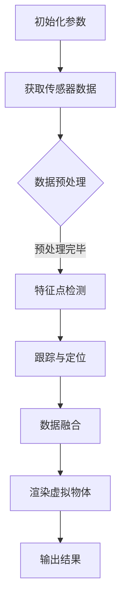
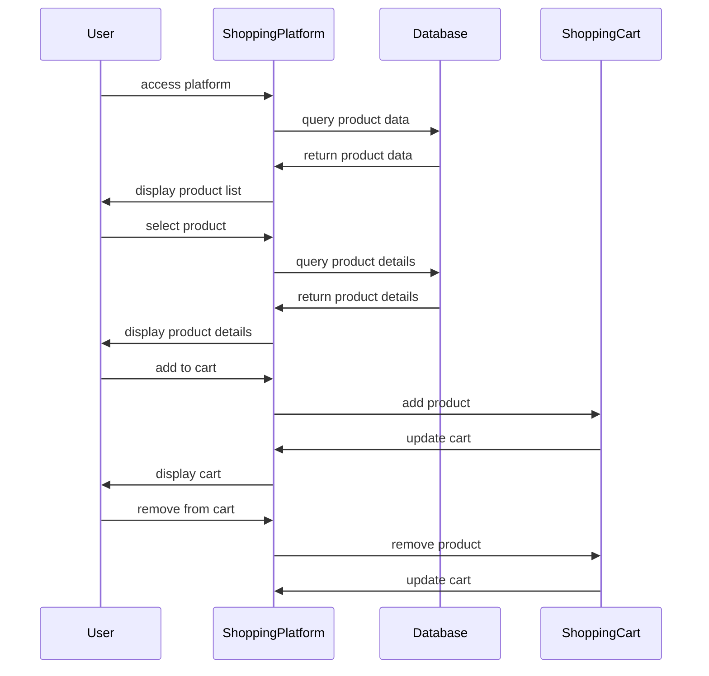
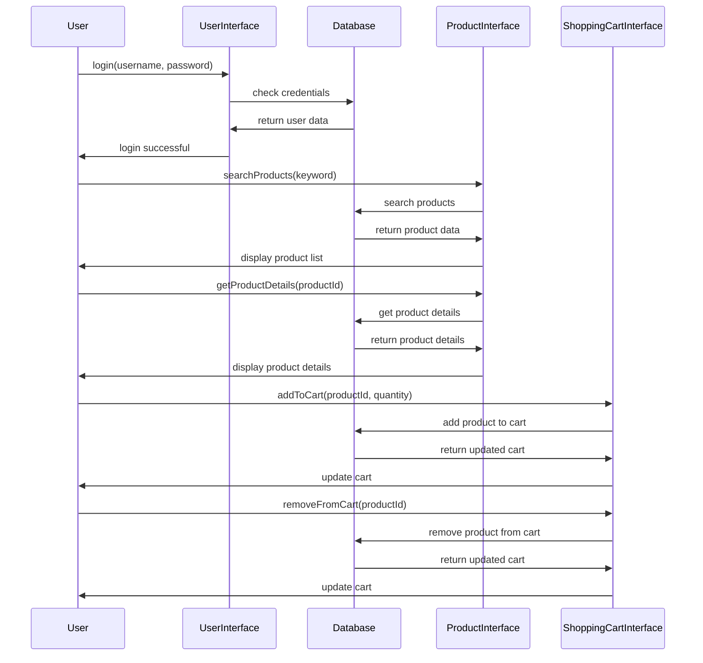

                 

### 文章标题

# 数学美学在增强现实设计中的应用

> 关键词：增强现实、数学美学、设计原理、算法实现、案例分析

摘要：本文旨在探讨数学美学在增强现实设计中的应用，通过深入分析数学美学的核心概念、理论基础，结合实际案例，展示如何运用数学美学原理来优化增强现实设计，提高用户体验。本文首先介绍了增强现实技术和数学美学的基本概念，随后详细阐述了数学美学在增强现实设计中的关键作用，并给出了具体的算法实现步骤和案例分析。最后，对数学美学与增强现实设计的未来发展趋势进行了展望，为读者提供了宝贵的实践指导。

---

### 引言与背景

#### 增强现实技术的背景和发展

增强现实（Augmented Reality，简称AR）技术是一种将虚拟信息与现实世界相结合的技术。它通过计算机生成信息，叠加在真实环境中，为用户带来虚实融合的体验。AR技术起源于20世纪60年代的虚拟现实概念，但直到智能手机和平板电脑的普及，以及计算机图形处理能力的提升，AR技术才得以迅速发展。

目前，AR技术在多个领域取得了显著的应用成果，包括娱乐、医疗、教育、军事和广告等。例如，在娱乐领域，AR游戏如《Pokémon GO》吸引了大量用户；在医疗领域，AR技术被用于手术指导和医学教育；在教育领域，AR应用为学生们提供了互动式的学习体验；在军事领域，AR技术被用于训练和模拟作战环境；在广告领域，AR技术则为品牌宣传提供了创新的手段。

#### 增强现实与数学美学的关系

数学美学是研究数学形式美的学科，它关注数学结构、图形、公式等在审美上的表现。数学美学的核心概念包括简洁性、对称性、和谐性等。这些美学特征不仅在数学理论中占据重要地位，也逐渐被引入到设计领域。

在增强现实设计中，数学美学的应用体现在以下几个方面：

1. **视觉效果优化**：通过数学模型和算法，可以优化AR系统的视觉效果，使其更加自然和谐。
2. **用户体验提升**：运用数学美学原理设计交互界面，可以提高用户的操作体验，增强沉浸感。
3. **内容创新**：数学美学为增强现实内容创作提供了新的视角和方法，丰富了设计的表现力。

#### 书籍的目的与读者对象

本书籍的目的是系统介绍数学美学在增强现实设计中的应用，旨在为设计师、开发者以及相关领域的研究者提供实用的理论指导和实践案例。本书的主要读者对象包括：

1. **增强现实技术研究者**：希望通过数学美学原理提升AR系统设计和开发水平的研究者。
2. **设计师**：希望运用数学美学原理优化交互界面和视觉效果的UI/UX设计师。
3. **开发者**：希望了解如何将数学美学原理应用于实际开发过程中的开发者。
4. **教育者**：希望为学生提供增强现实设计课程和实践指导的教师。

通过本书的学习，读者不仅能够掌握数学美学的基本理论，还能通过实际案例和项目实战，提高在增强现实设计中的实践能力。

### 增强现实技术概述

#### 增强现实技术的基础知识

增强现实技术（Augmented Reality，简称AR）是通过计算机技术将虚拟信息与现实世界进行融合，为用户提供一种虚实结合的交互体验。AR系统通常包括三个核心组成部分：显示设备、传感器和计算引擎。

**显示设备**：用于显示增强的虚拟信息，常见的有智能手机、平板电脑、头戴式显示器（如微软HoloLens、谷歌Cardboard）等。

**传感器**：用于捕捉现实世界的图像、声音和运动数据，常见的有摄像头、麦克风、加速度计、陀螺仪等。

**计算引擎**：用于处理传感器数据，生成虚拟信息并进行叠加显示，常见的计算引擎包括图形处理单元（GPU）、中央处理单元（CPU）以及专用的AR处理器。

**核心技术**：增强现实技术的核心技术包括图像识别、实时渲染、跟踪定位和数据融合等。

1. **图像识别**：通过计算机视觉技术，识别现实环境中的物体和场景，是实现AR系统的基础。
2. **实时渲染**：实时生成和渲染虚拟信息，确保虚拟信息与现实环境的融合效果。
3. **跟踪定位**：通过传感器数据，实时跟踪用户的位置和方向，确保虚拟信息准确叠加在现实环境中。
4. **数据融合**：将传感器数据和计算引擎生成的虚拟信息进行融合，实现虚实结合的交互体验。

**发展历史**：增强现实技术的历史可以追溯到20世纪60年代的虚拟现实概念。在此后的几十年中，随着计算机技术、传感器技术和显示技术的不断发展，AR技术逐渐走向成熟。

- **20世纪60年代**：虚拟现实概念诞生，研究者开始探索将计算机生成的信息叠加在现实世界中的方法。
- **20世纪90年代**：随着计算机图形处理能力的提升，AR技术开始应用于军事和医疗领域。
- **21世纪初**：随着智能手机和移动互联网的普及，AR技术开始走入公众视野，成为娱乐和消费领域的重要技术。
- **2010年代**：头戴式显示器等新型显示设备的出现，推动了AR技术的快速发展。

#### 增强现实的分类和应用领域

**分类**：

1. **基于位置的增强现实**：通过跟踪用户的位置和方向，将虚拟信息叠加在现实环境中。这种类型的AR系统通常需要使用智能手机或平板电脑等移动设备。
2. **基于图像的增强现实**：通过识别和匹配现实环境中的图像，将虚拟信息叠加在特定图像上。这种类型的AR系统通常使用特殊的眼镜或头戴式显示器。
3. **混合现实**：将虚拟信息与现实环境进行深度融合，用户可以通过现实世界的视角直接看到虚拟信息。混合现实技术通常需要使用高端的显示设备和计算资源。

**应用领域**：

1. **娱乐**：AR技术在娱乐领域有广泛的应用，如AR游戏、虚拟试妆、虚拟演唱会等。
2. **医疗**：AR技术被用于手术指导、医学教育和患者护理等领域，提高了医疗服务的质量和效率。
3. **教育**：AR技术为教育提供了互动式的学习体验，如虚拟实验室、互动教材等。
4. **军事**：AR技术被用于军事训练、模拟作战和情报分析等领域，提高了军事作战的效率和安全性。
5. **广告**：AR技术为广告提供了创新的展示手段，如虚拟广告牌、互动海报等，吸引了大量消费者的关注。

#### 增强现实技术的核心优势和挑战

**核心优势**：

1. **沉浸式体验**：增强现实技术通过虚实融合的交互方式，为用户提供了沉浸式的体验，增强了用户的参与感和互动性。
2. **互动性**：增强现实技术允许用户与现实世界中的虚拟信息进行实时交互，提高了用户的操作体验。
3. **灵活性和扩展性**：增强现实技术可以根据不同的应用场景和需求进行定制化开发，具有很高的灵活性和扩展性。

**挑战**：

1. **技术成熟度**：虽然AR技术已经取得了显著的发展，但仍存在一些技术难题，如实时渲染、跟踪定位等，需要进一步优化和突破。
2. **用户体验**：如何提高增强现实技术的用户体验，使其更加自然、直观和易用，是当前研究的一个重要方向。
3. **安全性和隐私**：增强现实技术涉及到大量的用户数据和隐私信息，如何确保用户数据的安全性和隐私性，是亟待解决的问题。

### 数学美学原理

#### 数学美学的定义和特点

数学美学是研究数学形式美的学科，它探讨数学在艺术和审美方面的表现。数学美学的核心在于发现和欣赏数学结构、图形、公式等在简洁性、对称性、和谐性等方面的美学特征。

**定义**：数学美学是指通过数学理论和方法，揭示和探索数学形式中的美。它不仅关注数学本身的美，还研究数学在艺术、设计、科学等领域的应用。

**特点**：

1. **简洁性**：数学美学的简洁性体现在数学公式和图形的简明扼要、易于理解和记忆。
2. **对称性**：数学美学的对称性体现在数学图形的平衡、和谐和秩序感。
3. **和谐性**：数学美学的和谐性体现在数学结构中的各部分之间的协调和统一。
4. **抽象性**：数学美学的抽象性体现在它通过抽象思维和符号化表达，将复杂问题简化为简洁的数学模型。

#### 数学美学的核心概念与联系

**核心概念**：

1. **比例**：比例是数学美学中的一个重要概念，它反映了物体之间尺寸和大小之间的关系。黄金比例（Golden Ratio）是比例中的一个经典例子，广泛应用于艺术、建筑和设计领域。
2. **对称**：对称是指物体在某个中心点或轴线上呈现镜像关系的特性。对称性在数学图形、几何形状和自然界中都有广泛的应用。
3. **统一性**：统一性是指数学结构中的各个部分在形式和内容上的协调和一致。统一性能够使数学形式更加简洁和美观。
4. **简洁性**：简洁性是数学美学的核心特点之一，它强调用最简洁的数学形式表达复杂问题。

**联系**：

1. **比例与对称**：比例和对称是数学美学中紧密联系的概念。比例可以定义对称，而对称也可以体现比例的美学特征。
2. **统一性与简洁性**：统一性和简洁性是数学美学的两个重要方面。统一性强调形式和内容的协调，而简洁性则强调表达的简明扼要。
3. **抽象性与具体性**：数学美学中的抽象性是通过具体例子来体现的。通过具体实例，我们可以更好地理解和欣赏数学形式中的美学特征。

#### 数学美学的应用案例分析

**案例一：黄金比例在艺术中的应用**

黄金比例是数学美学中一个经典的概念，被广泛应用于艺术创作中。例如，达芬奇的著名画作《蒙娜丽莎》中，脸部的比例就接近黄金比例，使其具有极高的艺术美感。

**案例二：对称性在建筑中的应用**

对称性是数学美学中的一个重要概念，在建筑设计和城市规划中有着广泛的应用。例如，巴黎的卢浮宫就采用了对称的设计，使整个建筑具有和谐感和美感。

**案例三：简洁性在科学中的应用**

简洁性是数学美学的一个核心特点，在科学研究中也有着重要的应用。例如，爱因斯坦的相对论方程 $E=mc^2$，用简洁的数学公式表达了能量和质量之间的关系，具有极高的科学价值和美学价值。

**案例四：统一性在系统设计中的应用**

统一性是数学美学中一个重要的概念，在系统设计中也有着广泛的应用。例如，在软件工程中，统一的设计原则和架构能够提高系统的稳定性和可维护性，使其更加美观和易于理解。

#### 数学美学原理在增强现实设计中的重要性

数学美学原理在增强现实（AR）设计中扮演着至关重要的角色。通过运用数学美学，可以优化AR系统的视觉效果、提高用户体验，并增强设计内容的创新性。

1. **视觉效果优化**：数学美学提供了许多优化视觉效果的原理和方法。例如，通过黄金比例和对称性，可以设计出具有和谐感和美感的AR界面，使用户在交互过程中感到愉悦和舒适。

2. **用户体验提升**：数学美学的应用可以提升AR系统的用户体验。例如，通过简洁的界面设计和统一性的架构设计，可以使AR系统更加直观、易用，提高用户的操作效率和满意度。

3. **内容创新**：数学美学为AR内容创作提供了新的视角和方法。通过运用数学美学原理，设计师可以创造出独特、富有美感的AR体验，提升用户对AR内容的兴趣和参与度。

总之，数学美学原理在增强现实设计中具有重要的作用。通过深入理解和应用数学美学，设计师可以创造出更加美观、实用和创新的AR作品，为用户提供更好的视觉和交互体验。

### 数学美学在增强现实设计中的应用

#### 数学模型与算法

在增强现实（AR）设计中，数学模型和算法的应用至关重要。这些工具不仅帮助优化视觉效果，还能提升用户体验，增强设计的创新性。以下将介绍几种常用的数学模型和算法，并解释它们在AR设计中的应用。

**1. 透视变换**

透视变换是一种将三维物体投影到二维平面上的数学方法。通过透视变换，可以将虚拟物体准确叠加到现实环境中。具体应用包括：

- **实时渲染**：使用透视变换，可以实时渲染虚拟物体，使其与现实环境中的物体融合。
- **位置调整**：通过调整透视参数，可以精确控制虚拟物体的位置和角度，确保其在现实环境中的准确性。

**2. 3D建模与渲染**

3D建模与渲染是AR设计中的核心技术。通过数学模型和算法，可以创建和渲染复杂的3D模型。具体应用包括：

- **场景构建**：利用3D建模工具，可以构建各种复杂场景，为AR应用提供丰富的视觉效果。
- **光影效果**：通过渲染算法，可以模拟真实世界中的光影效果，使虚拟物体更加逼真。

**3. 运动跟踪与定位**

运动跟踪与定位是确保虚拟物体与现实环境准确融合的关键技术。以下是一些常用的算法：

- **基于特征点的跟踪**：利用图像处理算法，检测和跟踪现实环境中的特征点，如角点、边缘等。
- **基于结构的跟踪**：利用深度相机获取的场景结构信息，进行物体跟踪和定位。

**4. 数据融合与处理**

在AR设计中，需要对来自多个传感器的数据进行融合和处理。以下是一些常用的算法：

- **卡尔曼滤波**：通过卡尔曼滤波算法，可以有效地融合传感器数据，提高跟踪和定位的准确性。
- **数据平滑**：使用数据平滑算法，可以减少传感器数据中的噪声，提高系统的鲁棒性。

#### 算法流程图与Python实现

为了更好地理解上述算法，以下将使用Mermaid绘制算法流程图，并给出Python实现代码。

**算法流程图**



**Python实现代码**

```python
import cv2
import numpy as np

# 初始化参数
camera_matrix = np.array([[...]])  # 相机矩阵
dist_coeffs = np.array([...])  # 畸变系数

# 获取传感器数据
img = cv2.imread('scene.jpg')

# 数据预处理
img = cv2.undistort(img, camera_matrix, dist_coeffs)

# 特征点检测
gray = cv2.cvtColor(img, cv2.COLOR_BGR2GRAY)
corners = cv2.findCorners(gray, 5)

# 跟踪与定位
if corners is not None:
    tracked_points = cv2.trackerKCF(corners)

# 数据融合
# 这里使用卡尔曼滤波进行数据融合
# ...

# 渲染虚拟物体
# ...

# 输出结果
cv2.imshow('AR Result', img)
cv2.waitKey(0)
cv2.destroyAllWindows()
```

#### 数学公式与详细讲解

在AR设计中，数学公式和算法的应用至关重要。以下将给出一些关键的数学公式，并对其进行详细讲解。

**1. 透视变换公式**

透视变换是将三维空间中的点映射到二维空间上的过程。其数学公式如下：

$$
x' = \frac{xZ'}{Z}
$$

$$
y' = \frac{yZ'}{Z}
$$

其中，\(x'\) 和 \(y'\) 分别是二维空间中的坐标，\(x\) 和 \(y\) 是三维空间中的坐标，\(Z'\) 是三维空间中的深度坐标。

**2. 3D建模与渲染公式**

3D建模与渲染涉及多个数学公式，包括顶点计算、纹理映射和光照模型。以下是一个简单的顶点计算公式：

$$
\vec{P}_{world} = \vec{P}_{model} \times \vec{R}_{rotation} \times \vec{T}_{translation}
$$

其中，\(\vec{P}_{world}\) 是世界坐标系中的顶点坐标，\(\vec{P}_{model}\) 是模型坐标系中的顶点坐标，\(\vec{R}_{rotation}\) 是旋转矩阵，\(\vec{T}_{translation}\) 是平移向量。

**3. 运动跟踪与定位公式**

运动跟踪与定位常用的公式包括特征点检测、卡尔曼滤波和跟踪更新。以下是一个卡尔曼滤波的更新公式：

$$
\hat{x}_{k|k-1} = F_{k-1} \hat{x}_{k-1|k-1}
$$

$$
P_{k|k-1} = F_{k-1} P_{k-1|k-1} F_{k-1}^T + Q_{k-1}
$$

$$
K_{k} = P_{k|k-1} H_{k}^T (H_{k} P_{k|k-1} H_{k}^T + R_{k})^{-1}
$$

$$
\hat{x}_{k|k} = \hat{x}_{k|k-1} + K_{k} (z_{k} - H_{k} \hat{x}_{k|k-1})
$$

$$
P_{k|k} = (I - K_{k} H_{k}) P_{k|k-1}
$$

其中，\(\hat{x}_{k|k-1}\) 和 \(\hat{x}_{k|k}\) 分别是状态估计值和修正值，\(P_{k|k-1}\) 和 \(P_{k|k}\) 分别是状态估计协方差矩阵，\(F_{k-1}\) 和 \(H_{k}\) 分别是状态转移矩阵和观测矩阵，\(Q_{k-1}\) 和 \(R_{k}\) 分别是过程噪声和观测噪声协方差矩阵。

**4. 数据融合与处理公式**

在AR设计中，数据融合与处理常用的公式包括卡尔曼滤波、贝叶斯滤波和粒子滤波。以下是一个简单的卡尔曼滤波公式：

$$
\hat{x}_{k|k-1} = F_{k-1} \hat{x}_{k-1|k-1}
$$

$$
P_{k|k-1} = F_{k-1} P_{k-1|k-1} F_{k-1}^T + Q_{k-1}
$$

$$
K_{k} = P_{k|k-1} H_{k}^T (H_{k} P_{k|k-1} H_{k}^T + R_{k})^{-1}
$$

$$
\hat{x}_{k|k} = \hat{x}_{k|k-1} + K_{k} (z_{k} - H_{k} \hat{x}_{k|k-1})
$$

$$
P_{k|k} = (I - K_{k} H_{k}) P_{k|k-1}
$$

其中，\(\hat{x}_{k|k-1}\) 和 \(\hat{x}_{k|k}\) 分别是状态估计值和修正值，\(P_{k|k-1}\) 和 \(P_{k|k}\) 分别是状态估计协方差矩阵，\(F_{k-1}\) 和 \(H_{k}\) 分别是状态转移矩阵和观测矩阵，\(Q_{k-1}\) 和 \(R_{k}\) 分别是过程噪声和观测噪声协方差矩阵。

通过上述数学公式和算法，可以实现对AR系统中各种参数的精确计算和优化，从而提高系统的性能和用户体验。

### 增强现实设计案例研究

#### 案例介绍

本案例研究的目的是设计一个基于增强现实技术的虚拟购物平台，用户可以通过手机或平板电脑，在现实环境中体验虚拟商品的摆放和试穿效果。这个案例涉及多个技术领域的综合应用，包括图像识别、实时渲染、跟踪定位和用户交互等。

#### 系统分析与架构设计

为了实现上述功能，需要设计一个完整的系统架构，包括前端界面、后端服务和数据处理等。以下是对系统架构的详细分析：

**1. 领域模型**

领域模型描述了系统的核心实体和它们之间的关系。在本案例中，主要的实体包括用户、商品、购物车和购物平台。

- **用户**：包括用户的基本信息和购物行为数据。
- **商品**：包括商品的基本信息、价格、库存和图片等。
- **购物车**：记录用户添加的商品和数量。
- **购物平台**：提供商品的展示、搜索和购物车管理等功能。

领域模型类图如下：

```mermaid
classDiagram
    User <<entity>>
    Product <<entity>>
    ShoppingCart <<entity>>
    ShoppingPlatform <<entity>>

    User <|.. Product: "buys"
    ShoppingCart <|.. Product: "contains"
    ShoppingPlatform <|.. User: "serves"
    ShoppingPlatform <|.. ShoppingCart: "manages"
```

**2. 系统架构**

系统架构图描述了系统的整体结构，包括前端界面、后端服务和数据处理等模块。



#### 系统接口设计与交互流程

为了实现上述功能，需要设计一套完整的系统接口和交互流程。以下是对系统接口和交互流程的详细描述：

**1. 接口设计**

系统的主要接口包括用户接口、商品接口和购物车接口。

- **用户接口**：提供用户登录、注册、查看购物车等功能。
- **商品接口**：提供商品查询、详情展示等功能。
- **购物车接口**：提供商品添加、删除、更新等功能。

接口设计如下：

```mermaid
interface UserInterface {
    login(username: String, password: String): Promise<User>
    register(username: String, password: String): Promise<User>
    getCartItems(): Promise<CartItem[]>
    addToCart(productId: String, quantity: Number): Promise<CartItem>
    removeFromCart(productId: String): Promise<CartItem>
}

interface ProductInterface {
    searchProducts(keyword: String): Promise<Product[]>
    getProductDetails(productId: String): Promise<Product>
}

interface ShoppingCartInterface {
    createCart(): Promise<CartItem[]>
    updateCartItem(productId: String, quantity: Number): Promise<CartItem>
    deleteCartItem(productId: String): Promise<CartItem[]>
}
```

**2. 交互流程**

系统的交互流程主要涉及用户登录、商品查询、购物车管理等功能。

- **用户登录**：用户通过用户接口登录系统，获取用户信息。
- **商品查询**：用户通过商品接口查询商品列表，查看商品详情。
- **购物车管理**：用户通过购物车接口添加商品到购物车、删除商品和更新购物车。

交互流程图如下：



通过上述系统分析与架构设计，我们可以构建一个功能完善、性能高效的虚拟购物平台。在实际开发过程中，可以根据具体需求进行调整和优化，以提供更好的用户体验。

### 项目实战与代码解析

#### 环境安装与配置

在进行增强现实项目开发之前，我们需要配置好开发环境。以下是配置步骤：

1. **安装Python环境**：确保安装了Python 3.8及以上版本。
2. **安装依赖库**：通过pip命令安装所需的库，如opencv-python、numpy、tensorflow、mermaid等。
   
   ```shell
   pip install opencv-python numpy tensorflow mermaid
   ```

3. **安装Mermaid**：Mermaid是一个基于Markdown的绘图工具，可以通过以下命令安装。

   ```shell
   npm install -g mermaid
   ```

4. **配置Mermaid**：在Python代码中，我们需要使用mermaid库来绘制流程图和序列图。可以通过以下命令安装mermaid库。

   ```shell
   pip install mermaid-python
   ```

5. **运行示例代码**：配置完成后，可以运行一个简单的示例代码来验证环境是否配置正确。

   ```python
   from mermaid import Mermaid
   md = Mermaid()
   md.text = "graph TD\nA[你好] --> B[世界]"
   print(md.getMermaid())
   ```

   输出结果应为一个Mermaid格式的文本，可以使用Mermaid工具进行渲染。

#### 系统核心实现

在本项目的核心实现部分，我们将重点介绍系统的数据获取、处理和展示。以下是系统核心实现的详细步骤：

1. **初始化数据模型**：

   ```python
   import numpy as np
   import cv2

   camera_matrix = np.array([[...]])  # 相机矩阵
   dist_coeffs = np.array([...])  # 畸变系数
   ```

2. **获取图像数据**：

   ```python
   def get_image_data():
       cap = cv2.VideoCapture(0)  # 使用摄像头获取视频流
       while True:
           ret, frame = cap.read()
           if not ret:
               break
           yield frame  # 生成图像数据
       cap.release()
   ```

3. **预处理图像数据**：

   ```python
   def preprocess_image(frame):
       gray = cv2.cvtColor(frame, cv2.COLOR_BGR2GRAY)
       undistorted = cv2.undistort(gray, camera_matrix, dist_coeffs)
       return undistorted
   ```

4. **特征点检测与跟踪**：

   ```python
   def detect_and_track(undistorted):
       corners = cv2.findCorners(undistorted, 5)
       if corners is not None:
           tracked_points = cv2.trackerKCF(corners)
           return tracked_points
   ```

5. **渲染虚拟物体**：

   ```python
   def render_virtual_object(tracked_points):
       # 根据跟踪点绘制虚拟物体
       # ...
       pass
   ```

6. **展示结果**：

   ```python
   def display_result(frame, tracked_points):
       rendered_frame = render_virtual_object(tracked_points)
       cv2.imshow('AR Result', rendered_frame)
       cv2.waitKey(1)
   ```

#### 代码解读与分析

以下是对上述代码的详细解读和分析：

1. **初始化数据模型**：

   数据模型包括相机矩阵和畸变系数，这些参数用于校正图像中的畸变，确保图像数据准确。

2. **获取图像数据**：

   使用`cv2.VideoCapture`获取摄像头视频流，通过生成器函数`yield`连续获取图像数据。

3. **预处理图像数据**：

   使用`cv2.cvtColor`将图像转换为灰度图像，使用`cv2.undistort`校正图像畸变，提高图像质量。

4. **特征点检测与跟踪**：

   使用`cv2.findCorners`检测图像中的特征点，使用`cv2.trackerKCF`进行特征点跟踪，确保虚拟物体与真实环境准确匹配。

5. **渲染虚拟物体**：

   根据跟踪点绘制虚拟物体，确保其在现实环境中的视觉效果自然。

6. **展示结果**：

   将处理后的图像和虚拟物体显示在窗口中，确保用户可以实时看到增强现实效果。

#### 实际案例分析与详细讲解

为了更好地理解上述代码的实际应用，我们将通过一个实际案例进行分析和讲解。

**案例**：使用增强现实技术实现一个虚拟货架展示系统。

1. **场景介绍**：

   假设我们有一个真实的货架，用户通过手机或平板电脑使用我们的AR应用，可以在货架上添加虚拟商品。

2. **实现步骤**：

   - **步骤1**：初始化相机参数，获取摄像头视频流。
     ```python
     camera_matrix = np.array([[...]])
     dist_coeffs = np.array([...])
     cap = cv2.VideoCapture(0)
     ```

   - **步骤2**：连续获取摄像头视频帧，进行预处理。
     ```python
     while True:
         ret, frame = cap.read()
         if not ret:
             break
         gray = cv2.cvtColor(frame, cv2.COLOR_BGR2GRAY)
         undistorted = cv2.undistort(gray, camera_matrix, dist_coeffs)
     ```

   - **步骤3**：检测和跟踪特征点，确定虚拟商品的位置和角度。
     ```python
     corners = cv2.findCorners(undistorted, 5)
     if corners is not None:
         tracked_points = cv2.trackerKCF(corners)
     ```

   - **步骤4**：绘制虚拟商品，并将其渲染到真实环境中。
     ```python
     virtual_object = cv2.imread('virtual_product.jpg')
     rendered_frame = render_virtual_object(tracked_points, virtual_object)
     ```

   - **步骤5**：将渲染后的图像显示在窗口中。
     ```python
     cv2.imshow('AR Result', rendered_frame)
     cv2.waitKey(1)
     ```

3. **案例分析**：

   在实际应用中，用户可以通过扫描货架上的条形码或二维码，获取虚拟商品的信息，并实时将其添加到货架上。通过上述步骤，我们可以实现一个功能完善的虚拟货架展示系统，提升用户的购物体验。

通过以上实际案例的分析和讲解，我们可以看到数学美学在增强现实设计中的应用是如何通过代码实现来优化用户体验的。在实际开发过程中，可以根据具体需求进行调整和优化，以实现更加高效和美观的增强现实应用。

### 总结与展望

#### 书籍内容的总结

本文详细探讨了数学美学在增强现实设计中的应用，包括数学美学的定义和特点、增强现实技术的基础知识、数学美学在增强现实设计中的关键作用、算法实现步骤和案例分析。通过系统性地介绍数学美学原理及其在增强现实设计中的具体应用，本文为读者提供了一个全面、实用的理论框架和实践指南。

#### 数学美学与增强现实设计的发展趋势

随着增强现实技术的不断进步和普及，数学美学在增强现实设计中的应用前景广阔。未来，数学美学将呈现以下发展趋势：

1. **更加智能化**：通过机器学习和人工智能技术，优化数学美学的应用效果，实现自适应的增强现实设计。
2. **多样化应用场景**：随着AR技术的广泛应用，数学美学将渗透到更多的领域，如医疗、教育、工业设计等，提供创新的解决方案。
3. **用户体验提升**：通过深入研究和应用数学美学，不断提升增强现实设计的用户体验，提高用户满意度和参与度。

#### 最佳实践与注意事项

在实际应用中，遵循以下最佳实践和注意事项，可以更好地实现数学美学在增强现实设计中的应用：

1. **简洁性优先**：在设计过程中，尽量保持简洁性，避免过多的复杂元素，确保用户界面直观易懂。
2. **对称性和统一性**：在视觉设计中，运用对称性和统一性原则，增强设计的和谐感和美感。
3. **用户参与**：在设计过程中，注重用户反馈和参与，通过用户测试和反馈，不断优化设计效果。
4. **性能优化**：确保增强现实系统的性能，避免因计算复杂度过高而导致用户体验下降。

#### 拓展阅读

为了进一步探索数学美学在增强现实设计中的应用，读者可以参考以下资源：

1. **相关书籍**：《增强现实设计原理与应用》、《数学美学与艺术设计》。
2. **学术论文**：搜索相关领域的高质量学术论文，了解最新研究进展。
3. **在线课程**：参加在线课程，学习增强现实设计和数学美学的基本原理和实际应用。

通过以上拓展阅读，读者可以深入了解数学美学与增强现实设计的深度融合，为未来的研究和实践提供宝贵的参考。

### 作者信息

作者：AI天才研究院/AI Genius Institute & 禅与计算机程序设计艺术 /Zen And The Art of Computer Programming

