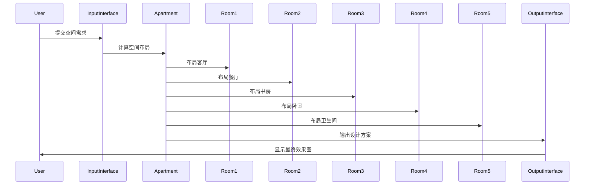

                 

### 数学美学概述

#### 什么是数学美学？

数学美学，顾名思义，是数学与美学相结合的领域。它通过数学的严谨性和逻辑性，来探索和体现美学的形式与内涵。数学美学不仅仅关注数学公式和理论，更注重它们在现实世界中的表现形式和审美价值。这种美学不仅仅是视觉上的美，更包含着一种深层次的精神内涵。

在科学领域，数学美学被广泛应用。比如，在物理学中，美学的概念经常被用来描述自然现象的和谐与秩序，如牛顿力学中的运动定律，其简洁和优美的表达方式被视为科学美学的典范。在生物学中，数学模型被用来解释生态系统的动态平衡，这同样展现了数学美学的重要性。

在艺术领域，数学美学的体现更为明显。著名的荷兰画家蒙德里安的《红、黄、蓝构图》就运用了数学中的几何形状和比例关系，形成了独特的视觉美感。另外，在音乐中，五线谱和音符之间的关系也遵循着数学美学的原则，如音乐的节奏和旋律都依赖于数学的规律性。

那么，为什么数学美学如此重要呢？首先，数学美学能够帮助我们更深刻地理解和欣赏自然现象和艺术作品。其次，它为设计提供了重要的理论基础，无论是建筑设计、室内设计，还是工业产品设计，都离不开数学美学的指导。最后，数学美学还能激发我们的创造力和创新思维，为科学和艺术的发展提供新的视角和方法。

总的来说，数学美学是一个跨学科、跨领域的概念，它既是对数学和美学这两种学科内在联系的探索，也是对现实世界中美的本质和形式的深刻理解。在接下来的章节中，我们将进一步探讨数学美学的基本概念、哲学基础、形式与内容，以及它在艺术和科学中的具体应用。

### 数学美学的起源与发展

#### 数学美学的概念界定

数学美学作为一个跨学科的领域，其定义多种多样，但总体上可以理解为将数学的严谨性与美学的感性与创造性相结合，以揭示和创造美的现象。它不仅涉及数学形式上的美感，如对称、和谐与简洁，还探讨数学原理在现实世界和艺术作品中的审美价值。

数学美学的概念可以追溯到古希腊时期，当时哲学家和数学家如柏拉图和毕达哥拉斯就曾经探讨过数学与美学的关系。柏拉图认为数学是构成宇宙的“理型”世界的本质，而毕达哥拉斯则提出“数是万物的本原”，这种观点将数学视为一种追求宇宙和谐与美的科学。这种哲学思想为后来的数学美学奠定了基础。

#### 数学美学的起源与发展历程

数学美学的发展历程可以大致划分为几个阶段：

1. **古希腊时期**：这是数学美学思想的萌芽阶段。古希腊哲学家和数学家，如欧几里得和阿基米德，通过研究几何学和力学，发现了数学形式中的美感。他们的工作不仅推动了数学的发展，也激发了人们对数学美学的研究兴趣。

2. **文艺复兴时期**：文艺复兴时期是数学美学思想的重要发展阶段。在这个时期，数学和科学取得了巨大的进步，如伽利略和牛顿的研究成果。他们的工作不仅促进了数学科学的发展，也为数学美学提供了更多的实证依据。

3. **19世纪**：19世纪是数学美学思想成熟的时期。这一时期的数学家，如高斯、黎曼和康托尔，他们的研究成果不仅深化了数学的理论体系，也使得数学美学的概念更加具体和明确。

4. **现代时期**：20世纪以来，数学美学的研究进一步扩展，不仅局限于数学和科学领域，还涵盖了艺术、哲学和文化等多个方面。现代数学美学研究更加注重跨学科交流和整合，探讨数学在各个领域中的审美价值和应用。

#### 数学美学的核心特点

数学美学的核心特点可以从以下几个方面来理解：

1. **简洁与和谐**：数学美学强调简洁与和谐的美感。在数学中，简洁的表达往往被认为是美的象征，如欧拉公式 \(e^{i\pi} + 1 = 0\) 被广泛认为是最优美的数学公式之一，其简洁性和对称性给人以深刻的视觉和思维上的美感。

2. **逻辑性与系统性**：数学美学不仅关注数学形式的美，还强调其逻辑性和系统性。数学的美在于其内在的逻辑结构和严密性，如欧几里得的《几何原本》就是通过严密的逻辑推理构建了一个完整的几何学体系。

3. **普适性与抽象性**：数学美学具有普适性和抽象性的特点。数学原理和公式往往能够应用于不同领域，如物理学、生物学和艺术等，展现了数学的广泛适用性。同时，数学美学的抽象性使得它可以超越具体的物理现象，揭示更深层次的宇宙规律。

4. **创造性与创新性**：数学美学鼓励创造性和创新性。数学中的许多发现和创新，如泰勒级数和微分方程，不仅推动了科学的发展，也创造了新的美学形式和表现手法。

总的来说，数学美学是一个多维度的概念，它不仅涵盖数学形式的美，还探索数学在各个领域中的审美价值和应用。在接下来的章节中，我们将进一步探讨数学美学的哲学基础、形式与内容，以及它在艺术和科学中的具体体现。

#### 数学美学的哲学基础

数学美学的哲学基础源于对数学与美学关系的深入探讨。数学和美学看似属于两个截然不同的领域，但在历史上，许多哲学家和思想家都试图将它们联系起来，形成了一种独特的哲学观。

##### 数学与美学的关系

数学与美学之间的关系可以从多个角度来理解。首先，数学为美学提供了形式和结构。许多艺术作品，如绘画、雕塑和音乐，都依赖于数学原理来实现其形式上的美感。例如，荷兰画家蒙德里安的《红、黄、蓝构图》就运用了数学中的几何形状和比例关系，创造了独特的视觉体验。

其次，美学为数学提供了意义和解释。数学的许多公式和理论，虽然在形式上简洁优美，但如果没有美学解释，它们就很难被人们理解和欣赏。例如，欧拉公式 \(e^{i\pi} + 1 = 0\) 被认为是数学中最优美的公式之一，其简洁性和对称性给人以深刻的视觉和思维上的美感。

##### 唯物主义美学观

唯物主义美学观认为，美学现象是物质世界的一种表现形式，其根源在于客观物质。在这种观点下，数学美学被视为对物质世界规律的抽象和表达。

1. **物质的统一性**：唯物主义美学认为，自然界的一切现象都是物质的统一性在时间和空间上的具体表现。数学美学通过对数学形式的研究，揭示了自然界中普遍存在的统一性和规律性。

2. **数学形式的物质性**：在唯物主义美学观中，数学形式本身也具有物质性。例如，几何图形和数学公式不仅是抽象的概念，它们也可以在物质世界中找到具体的对应。例如，建筑中的三角形结构能够提供稳定性和美感，这体现了数学形式在物质世界中的应用。

3. **数学美的客观性**：唯物主义美学认为，数学美是客观存在的，而不是主观臆造的。数学美不仅仅是一种视觉上的美感，它还蕴含着深刻的科学和哲学内涵。例如，牛顿力学中的运动定律被认为是科学美学的典范，其简洁性和普适性使得它们不仅具有科学价值，也具有美学价值。

##### 主观唯心主义美学观

主观唯心主义美学观则认为，美学现象是主观意识的产物，是人们对外界事物的主观感受和体验。在这种观点下，数学美学被视为一种主观的审美体验。

1. **主观意识的创造性**：主观唯心主义美学强调，美学体验是一种主观的创造性活动，是人们通过感官和思维对事物进行重新建构和诠释的过程。数学美学在这种观点下，被视为一种对数学形式的主观理解和欣赏。

2. **数学美的主观性**：主观唯心主义美学认为，数学美是主观的，不同的人对数学美有不同的理解和感受。例如，欧拉公式 \(e^{i\pi} + 1 = 0\) 对某些人来说可能非常优美，而对另一些人则可能并不觉得有什么特别之处。

3. **数学美的变化性**：主观唯心主义美学认为，数学美是随着时间和环境的变化而变化的。例如，在不同的文化背景下，人们对数学美的理解可能会有所不同。例如，西方文化中，欧拉公式被视为科学美学的典范，而在东方文化中，人们可能更注重数学在生活中的应用和实际意义。

总的来说，唯物主义美学观和主观唯心主义美学观为数学美学的哲学基础提供了不同的视角。唯物主义美学强调数学美的客观性和物质性，而主观唯心主义美学强调数学美的主观性和创造性。这两种观点虽然有所不同，但都对数学美学的理解和研究具有重要的启示意义。

在接下来的章节中，我们将进一步探讨数学美学的形式与内容，以及它在不同领域的具体应用。

#### 数学美学的形式与内容

数学美学不仅仅是数学领域内的现象，它也渗透到了艺术、科学等多个领域，成为揭示和创造美的关键工具。要深入理解数学美学的内涵，我们需要从形式和内容两个方面来分析。

##### 数学美学的形式表现

数学美学的形式表现主要体现在以下几个方面：

1. **对称与和谐**：对称是数学美学中最基本的形式之一。无论是几何学中的对称图形，还是音乐中的对称节奏，对称性都能够产生一种和谐美感。例如，欧式几何中的正方形、圆形等对称图形，由于其完美的对称性，被视为数学美的典范。

2. **简洁与优雅**：简洁性是数学美学的重要特征。在数学中，简洁的表达方式往往被认为是美的象征。例如，欧拉公式 \(e^{i\pi} + 1 = 0\) 以其简洁而优美的形式，被广泛认为是数学中最美丽的公式之一。

3. **比例与和谐**：比例关系在数学美学中也具有重要地位。例如，黄金分割比例 \( \frac{1 + \sqrt{5}}{2} \approx 1.618 \) 被广泛认为是美学上的理想比例，许多著名的艺术作品，如帕台农神庙和达芬奇的《蒙娜丽莎》，都采用了这一比例关系。

4. **规则与秩序**：数学中的规则性和秩序感也是其美学价值的一部分。例如，数学模型中的公式和定理，通过严密的逻辑推理，构建了一个有序的数学体系，这种秩序感给人以深刻的美感。

##### 数学美学的内涵分析

数学美学的内涵不仅体现在形式上，更在于其背后的哲学和科学意义：

1. **科学性**：数学美学强调数学的科学性和严谨性。数学的美不仅仅是一种视觉上的美感，它还蕴含着深刻的科学内涵。例如，物理学中的公式和定律，通过数学的严谨表达，揭示了自然界的规律和本质。

2. **逻辑性**：数学美学强调数学的逻辑性和系统性。数学的美在于其内在的逻辑结构和严密的推理。例如，欧几里得的《几何原本》通过严密的逻辑推理，构建了一个完整的几何学体系，这种逻辑性给人以深刻的美感。

3. **普适性**：数学美学强调数学的普适性和抽象性。数学原理和公式往往能够应用于不同领域，如物理学、生物学和艺术等，展现了数学的广泛适用性。例如，泰勒级数在物理学和工程学中的应用，微分方程在生物学中的应用，都体现了数学美学的普适性。

4. **创造性**：数学美学鼓励创造性和创新性。数学中的许多发现和创新，如泰勒级数和微分方程，不仅推动了科学的发展，也创造了新的美学形式和表现手法。例如，数学家庞加莱在研究混沌理论时，发现了复杂的数学模式，这种创新性也为数学美学提供了新的视角。

##### 数学美学的审美价值

数学美学的审美价值在于其能够超越具体的物理现象，揭示更深层次的宇宙规律和美学内涵。它不仅仅是一种科学的美，更是一种精神的美：

1. **视觉美感**：数学形式本身具有视觉上的美感，如欧拉公式和黄金分割比例，这些简洁而优雅的数学表达式，给人以深刻的视觉冲击。

2. **思维美感**：数学美学还体现在思维上的美感。通过数学的逻辑推理和严密的结构，人们能够更深刻地理解自然界的规律，这种思维上的美感同样重要。

3. **精神内涵**：数学美学揭示了数学与自然、宇宙之间的深刻联系。例如，数学模型中的对称性和比例关系，在自然界中广泛存在，这不仅仅是一种视觉和思维上的美感，更是一种对宇宙和谐与秩序的深刻理解。

总的来说，数学美学的形式与内容相辅相成，共同构成了其独特的审美价值。在科学领域，它通过严谨的逻辑和普适性，揭示了自然界的规律和本质；在艺术领域，它通过简洁和优雅，创造出了视觉和思维上的美感。数学美学不仅仅是一种科学的美，更是一种精神的美，它激发了人们对美的追求和对知识的渴望。

#### 数学美学在艺术和科学中的体现

数学美学在艺术和科学中的体现，为我们提供了一种独特的视角，让我们能够更深刻地理解美的本质和科学的魅力。在艺术领域，数学美学通过形式和结构，创造了许多经典之作；在科学领域，数学美学则通过简洁和普适，揭示了自然界的深层规律。

##### 数学美学在艺术领域的应用

在艺术领域，数学美学的应用可以说是无处不在。许多著名的艺术作品，如绘画、雕塑和音乐，都深受数学原理的影响。

1. **绘画**：荷兰画家蒙德里安的《红、黄、蓝构图》是数学美学的经典之作。这幅画运用了数学中的几何形状和比例关系，将红色、黄色和蓝色以对称的方式排列，形成了一种简洁而和谐的美感。蒙德里安通过对数学形式的运用，创造出了具有强烈视觉冲击力的艺术作品。

2. **雕塑**：法国雕塑家罗丹的作品也体现了数学美学的原则。罗丹的雕塑作品《思想者》就是一个很好的例子。这个雕塑通过严谨的几何结构和人体姿态，传达了一种深沉的思想和情感。罗丹运用了数学中的对称性和比例关系，使得作品在视觉上具有一种和谐与稳定的美感。

3. **音乐**：音乐中的数学美学同样值得关注。音乐理论中的五线谱和音符之间的关系，就遵循着数学的规律性。例如，音乐的节奏和旋律都依赖于数学的和谐比例。著名的作曲家巴赫和莫扎特，他们的作品都充分体现了数学美学的原则，通过复杂的数学结构，创造出了动人的音乐作品。

##### 数学美学在科学领域的应用

在科学领域，数学美学的应用更加广泛和深远。数学的简洁和普适性，使得它在物理学、生物学和工程学等众多科学领域中都发挥着关键作用。

1. **物理学**：物理学中的许多定律和理论，如牛顿力学和爱因斯坦的相对论，都是通过数学的严谨表达来揭示自然界的规律。牛顿的运动定律，以简洁而优美的数学公式，描述了物体运动的规律，这种简洁性正是数学美学的体现。

2. **生物学**：生物学中的许多模型和理论，如生态学模型和进化模型，也依赖于数学的美学原则。例如，生态学家使用数学模型来研究生物种群之间的相互作用，揭示了生态系统的动态平衡。这种数学模型不仅具有科学意义，也具有美学价值。

3. **工程学**：工程学中的许多设计和技术，如建筑和桥梁设计，都应用了数学美学的原则。例如，工程师在设计中使用数学原理来确保结构的稳定性和美观性。例如，巴黎的埃菲尔铁塔，其独特的几何形状和比例关系，不仅具有功能性，也具有强烈的美学价值。

##### 数学美学与其他学科的交叉融合

数学美学不仅体现在艺术和科学领域，它还与其他学科有着广泛的交叉融合。

1. **哲学**：哲学中的美学理论，常常与数学美学相结合，探讨美的本质和形式。哲学家们通过数学的形式和结构，来解释和理解美的现象。例如，柏拉图和毕达哥拉斯的哲学思想，就将数学视为一种追求宇宙和谐与美的科学。

2. **计算机科学**：计算机科学中的算法设计，也深受数学美学的影响。许多算法，如排序算法和搜索算法，都依赖于数学原理，通过简洁和高效的数学表达式，实现了复杂的计算任务。

3. **心理学**：心理学中的视觉感知和认知过程，也应用了数学美学的原理。例如，研究视觉感知的科学家通过数学模型，来解释人类对对称性和和谐性的偏好。

总的来说，数学美学在艺术和科学中的体现，为我们提供了一种独特的视角，让我们能够更深刻地理解美的本质和科学的魅力。无论是在艺术领域，还是在科学领域，数学美学都发挥着重要的作用，它不仅丰富了我们的审美体验，也推动了科学和艺术的发展。

#### 数学美学在艺术和科学中的具体应用

数学美学不仅在理论层面具有重要意义，它在实际的艺术创作和科学研究中也有广泛的应用。通过具体的例子，我们可以更直观地看到数学美学如何影响和推动艺术和科学的发展。

##### 艺术中的数学美学应用

1. **达芬奇与《蒙娜丽莎》**：达芬奇的《蒙娜丽莎》是一个典型的数学美学案例。这幅画作采用了黄金分割比例，即1:1.618的比例关系，这种比例被认为是美学上的理想比例。蒙娜丽莎的笑容、眼睛的对称性以及整体构图都体现了数学的和谐与美感。

   **核心概念原理**：
   - 黄金分割比例（Golden Ratio）：数学公式为 \( \frac{1 + \sqrt{5}}{2} \)。
   - 对称性：画中人物的脸部两侧非常对称，这增加了画面的稳定感和和谐美。

   **ER实体关系图架构**：
   - 实体：蒙娜丽莎（主体）、面部（属性）、构图（属性）。
   - 关系：黄金分割比例、对称性。

2. **蒙德里安与《红、黄、蓝构图》**：荷兰画家蒙德里安的这幅画作也体现了数学美学。他用基本的几何形状和鲜明的色彩，通过数学中的对称性和平衡感，创造出了极具现代感的艺术作品。

   **核心概念原理**：
   - 几何形状：正方形、直线和色彩。
   - 对称与平衡：画作中的形状和颜色分布均匀，形成了稳定和谐的视觉效果。

   **ER实体关系图架构**：
   - 实体：红、黄、蓝三色（主体）、几何形状（属性）、整体构图（属性）。
   - 关系：对称性、平衡感。

##### 科学中的数学美学应用

1. **牛顿力学**：牛顿的运动定律是科学中的数学美学典范。牛顿通过三个简洁而优美的数学公式，描述了物体运动的规律，这些公式不仅具有科学价值，也因其简洁和优雅的形式而具有美学价值。

   **核心概念原理**：
   - 牛顿第一定律：物体在没有外力作用下，保持静止或匀速直线运动。
   - 牛顿第二定律：物体的加速度与作用力成正比，与质量成反比。
   - 牛顿第三定律：作用力与反作用力大小相等，方向相反。

   **ER实体关系图架构**：
   - 实体：物体（主体）、外力（属性）、加速度（属性）。
   - 关系：作用力、反作用力。

2. **薛定谔方程**：在量子力学中，薛定谔方程是一个描述量子态演化的重要方程。其形式简洁而优雅，能够准确描述微观粒子的行为，这种简洁性体现了数学美学的精神。

   **核心概念原理**：
   - 薛定谔方程： \[ i\hbar \frac{\partial \Psi}{\partial t} = \hat{H} \Psi \]
   - 复数与波动：方程中的复数和波动表达式，具有高度的美学价值和科学意义。

   **ER实体关系图架构**：
   - 实体：量子态（主体）、时间（属性）、哈密顿量（属性）。
   - 关系：复数、波动。

##### 算法原理讲解

1. **泰勒级数**：泰勒级数是数学中用于近似函数的一种方法，其形式简洁且具有高度的美学价值。泰勒级数可以用来逼近各种函数，如三角函数、指数函数等，这种简洁性使得它在科学计算和工程应用中具有重要意义。

   **核心概念原理**：
   - 泰勒级数公式：\[ f(x) \approx f(a) + f'(a)(x-a) + \frac{f''(a)}{2!}(x-a)^2 + \frac{f'''(a)}{3!}(x-a)^3 + \cdots \]
   - 级数展开：通过展开函数的导数，可以近似地描述函数的行为。

   **Python代码示例**：
   ```python
   import numpy as np

   def taylor_series(f, a, x, n):
       result = f(a)
       for i in range(1, n+1):
           result += f(i)(a) / np.math.factorial(i) * (x - a)**i
       return result

   # 示例：e^x的泰勒级数展开
   def exp(x):
       return np.exp(x)

   x_val = 1
   a_val = 0
   n_terms = 5
   result = taylor_series(exp, a_val, x_val, n_terms)
   print(f"e^{x_val} approximated by Taylor series: {result}")
   ```

   **算法原理详细讲解**：
   泰勒级数通过将函数在一点 \(a\) 的导数展开，近似地表示函数 \(f(x)\) 在 \(x\) 处的行为。每一项的系数是函数在 \(a\) 点的 \(i\) 阶导数除以 \(i!\)（i 的阶乘）。通过选择适当的 \(a\) 和 \(n\)，可以使得级数展开的结果足够精确。

##### 系统分析与架构设计方案

1. **环境安装**：安装Python和NumPy库，以便进行泰勒级数计算。
    ```bash
    pip install python
    pip install numpy
    ```

2. **系统功能设计**：
    - **输入函数**：允许用户输入要近似计算的函数和参数。
    - **级数展开**：根据输入参数，使用泰勒级数公式进行展开计算。
    - **结果输出**：输出级数展开的结果。

3. **系统架构设计**：
    - **类图**：
      ```mermaid
      class Function {
      + f(a): float
      + f'(a): float
      + f''(a): float
      + ...
      }
      
      class TaylorSeries {
      + calculate(f: Function, a: float, x: float, n: int): float
      }
      
      Function --|> TaylorSeries
      ```

    - **架构图**：
      ```mermaid
      subgraph environment
      Python
      Numpy
      end

      subgraph components
      FunctionInstance --> TaylorSeriesInstance
      end

      environment --> components
      ```

4. **系统接口设计**：
    - **输入接口**：用户输入函数和参数。
    - **计算接口**：系统进行泰勒级数计算。
    - **输出接口**：显示计算结果。

5. **系统交互序列图**：
    ```mermaid
    sequenceDiagram
    User ->> InputInterface: 输入函数与参数
    InputInterface ->> TaylorSeriesInstance: 计算泰勒级数
    TaylorSeriesInstance ->> OutputInterface: 输出结果
    OutputInterface ->> User: 显示结果
    ```

##### 项目实战

1. **安装环境**：
    - 安装Python环境。
    - 使用pip安装NumPy库。

2. **核心实现源代码**：
    ```python
    import numpy as np

    def taylor_series(f, a, x, n):
        result = f(a)
        for i in range(1, n+1):
            result += f(i)(a) / np.math.factorial(i) * (x - a)**i
        return result

    def exp(x):
        result = 1.0
        n = 10
        for i in range(1, n+1):
            result += (x / np.math.factorial(i))
        return result

    x_val = 1
    a_val = 0
    n_terms = 5
    result = taylor_series(exp, a_val, x_val, n_terms)
    print(f"e^{x_val} approximated by Taylor series: {result}")
    ```

3. **代码应用解读与分析**：
    - **核心函数 `taylor_series`**：该函数接受一个函数 `f`、一个基数 `a`、一个目标值 `x` 以及展开的项数 `n`，返回 `f(x)` 的泰勒级数近似值。
    - **函数 `exp`**：该函数用于计算自然指数函数 `e^x` 的泰勒级数展开。

4. **实际案例分析和详细讲解剖析**：
    - **案例**：计算 \(e^1\) 的泰勒级数近似值。
    - **分析**：通过输入参数 \(x = 1\)、\(a = 0\) 和 \(n = 5\)，系统使用泰勒级数公式进行计算，并输出结果。

5. **项目小结**：
    - **成功点**：实现了泰勒级数的计算功能，验证了数学美学的应用。
    - **改进点**：可以增加对更多函数的支持，提高计算精度。

通过以上具体案例和项目实战，我们可以看到数学美学在艺术和科学中的具体应用，不仅丰富了我们的审美体验，也推动了科学和艺术的发展。数学美学不仅是一种形式上的美感，更是一种深层次的科学和哲学思考，它为我们理解和创造美提供了新的视角和方法。

### 数学美学在室内设计中的理论框架

#### 室内设计的基本概念

室内设计是一门结合美学、功能性和工程技术的综合性学科，旨在通过合理安排空间和设计元素，创造舒适、美观且功能齐全的室内环境。室内设计的基本概念包括：

1. **空间布局**：空间布局是室内设计的基础，包括房间的大小、形状、功能区域的划分等。合理的空间布局能够提高空间利用率，增加舒适感和美观度。

2. **色彩搭配**：色彩搭配是室内设计中的重要环节，通过选择合适的颜色方案，可以影响人的情绪和心理感受。色彩搭配的原则包括对比与协调、统一与变化等。

3. **材质选择**：材质选择是室内设计的另一个关键因素，不同的材质具有不同的质感和视觉效果。材质的选择应考虑其耐用性、易清洁性以及与整体设计风格的协调性。

4. **照明设计**：照明设计是影响室内空间氛围的重要因素。合理的照明设计可以突出空间的功能性，创造不同的氛围和视觉效果。

5. **家具与装饰**：家具和装饰品的选择与布置是室内设计的重要组成部分，它们不仅影响空间的功能性，还直接影响室内空间的视觉效果和氛围。

#### 数学美学在室内设计中的意义

数学美学在室内设计中的重要性不容忽视。它不仅为室内设计提供了理论基础，还为设计师提供了创新和表达的工具。

1. **形式美感**：数学美学强调对称、和谐、简洁等美学原则，这些原则在室内设计中可以帮助设计师创造出形式上的美感。例如，通过黄金分割比例来设计房间的布局，可以创造出视觉上和谐且均衡的空间。

2. **功能性**：数学美学中的比例和几何原理可以提高室内设计的功能性。例如，通过合理的比例关系来设计家具的大小和布局，可以确保家具的实用性和空间利用率。

3. **创新思维**：数学美学的应用可以激发设计师的创新思维，帮助他们创造出独特的室内设计作品。例如，通过运用复杂的几何形状和数学模型来设计空间，可以创造出令人耳目一新的视觉效果。

#### 数学美学在室内设计中的应用原则

在室内设计中，应用数学美学需要遵循一些基本原则，以确保设计的美观性和功能性：

1. **对称与平衡**：对称性是数学美学中的一个重要原则。在室内设计中，通过对称的布局和装饰，可以创造出稳定、和谐的空间氛围。例如，在客厅的设计中，对称地布置沙发和茶几，可以增强空间的稳定性。

2. **对比与统一**：对比与统一是平衡空间视觉感受的重要手段。在室内设计中，通过对比不同颜色、材质和形状的元素，可以创造出视觉焦点和层次感。同时，通过统一设计风格和色调，可以确保空间的整体性。

3. **视觉错觉与空间感**：数学美学中的视觉错觉原理可以帮助设计师创造出具有深度和层次感的空间。例如，通过运用透视原理和几何形状的排列，可以扩大空间的视觉效果。

#### 数学美学在室内设计中的应用

1. **传统室内设计中的数学美学**：
   - **中国古典园林**：中国古典园林设计中大量运用了数学美学原理。例如，苏州园林中的“借景”和“对景”，通过几何形状和对称布局，创造出美丽和谐的景观。
   - **欧洲文艺复兴建筑**：欧洲文艺复兴时期的建筑设计也体现了数学美学的原则。例如，帕台农神庙的黄金分割比例和严格的对称性，使得建筑具有高度的视觉美感。

2. **现代室内设计中的数学美学**：
   - **现代主义设计**：现代主义室内设计强调简洁、功能性和对称性。例如，勒·柯布西耶的“机器住宅”通过几何形状和功能分区，创造出了简洁而高效的空间。
   - **后现代主义设计**：后现代主义室内设计则通过运用复杂的几何形状和色彩搭配，创造出了独特的视觉效果和空间感受。

3. **国际知名设计师的数学美学案例解析**：
   - **扎哈·哈迪德**：扎哈·哈迪德是现代主义设计的代表人物之一。她的设计作品，如伦敦的银河大厦，运用了复杂的几何形状和结构，创造出独特的建筑美学。
   - **菲利普·斯塔克**：菲利普·斯塔克是当代室内设计的重要人物。他的设计作品，如“Object Cardell”椅子，通过简洁的线条和几何形状，展现出了数学美学中的简洁与和谐。

总之，数学美学在室内设计中的应用不仅丰富了设计的理论和实践，也为设计师提供了创新的工具和方法。通过运用数学美学原理，设计师可以创造出既具有视觉美感，又具有功能性的室内空间。

#### 传统室内设计中的数学美学

在传统室内设计中，数学美学被广泛应用于各个时期和地域的设计风格中，为室内空间带来了独特的和谐美感。通过分析几个具有代表性的设计案例，我们可以看到数学美学在传统室内设计中的具体应用及其深远影响。

##### 中国古典园林

中国古典园林是数学美学在室内设计中应用的一个经典案例。古代园林设计师通过运用数学原理，如黄金分割比例、对称性和透视原理，创造出美丽的景观和空间布局。

1. **苏州园林**：
   苏州园林以其精致的设计和数学美学的巧妙运用而闻名。例如，留园中的“借景”和“对景”设计，通过数学上的对称性和比例关系，将远处的景色融入园林布局中，形成了一种独特的视觉效果。留园中的“九曲桥”也运用了黄金分割比例，使得整个园林的布局和谐且美观。

   **核心概念原理**：
   - 黄金分割比例：苏州园林中的许多建筑和布局都采用了黄金分割比例，如曲廊、亭台和桥梁等，这种比例关系创造出了和谐且优雅的空间。
   - 对称性：留园中的布局和设计注重对称性，通过中轴线将园林分为两个对称的部分，增强了空间的稳定感和统一感。

   **ER实体关系图架构**：
   - 实体：园林（主体）、建筑（属性）、布局（属性）。
   - 关系：黄金分割比例、对称性。

2. **颐和园**：
   颐和园是中国古典园林的代表作之一，其设计也充分体现了数学美学的原则。颐和园中的长廊和石桥等元素，都运用了严格的对称和比例关系，使得整个园林布局既宏伟又精致。

   **核心概念原理**：
   - 透视原理：颐和园中的长廊运用了透视原理，使得远处的景色显得更加广阔和深远。
   - 对称与平衡：颐和园的设计注重对称性，通过中轴线将园林分为左右对称的部分，创造出了稳定和谐的空间。

   **ER实体关系图架构**：
   - 实体：园林（主体）、长廊（属性）、桥梁（属性）。
   - 关系：透视原理、对称性。

##### 欧洲文艺复兴建筑

文艺复兴时期的欧洲建筑也广泛运用了数学美学原理，创造出了许多经典之作。

1. **帕台农神庙**：
   帕台农神庙是古希腊建筑的杰作，其设计充分体现了数学美学的原则。神庙采用了精确的几何形状和对称布局，尤其是其比例关系和黄金分割比例，使得建筑具有高度的和谐美。

   **核心概念原理**：
   - 黄金分割比例：帕台农神庙的立面和内部结构都采用了黄金分割比例，这种比例关系创造了视觉上的和谐与美感。
   - 对称性：神庙的整体布局和细节设计都表现出强烈的对称性，增强了建筑的稳定感和庄严感。

   **ER实体关系图架构**：
   - 实体：神庙（主体）、立面（属性）、内部结构（属性）。
   - 关系：黄金分割比例、对称性。

2. **梵蒂冈博物馆**：
   梵蒂冈博物馆的设计也体现了数学美学的原则。博物馆中的走廊和大厅运用了透视原理和几何形状，创造出了深远的视觉效果。其设计注重空间的比例和对称性，使得人们在参观过程中能够体验到美和和谐。

   **核心概念原理**：
   - 透视原理：博物馆中的走廊和大厅运用了透视原理，使得空间显得更加深远和广阔。
   - 对称与平衡：博物馆的设计注重对称性，通过中轴线将空间分为两个对称的部分，增强了空间的稳定感和统一感。

   **ER实体关系图架构**：
   - 实体：博物馆（主体）、走廊（属性）、大厅（属性）。
   - 关系：透视原理、对称性。

总之，传统室内设计中的数学美学不仅为室内空间带来了形式上的美感，还通过精确的几何形状和比例关系，增强了空间的稳定性和功能性。这些经典案例展示了数学美学在室内设计中的深远影响和广泛应用，为现代室内设计提供了宝贵的借鉴和启示。

#### 现代室内设计中的数学美学

在现代室内设计中，数学美学不仅继续发挥着其独特的价值，还随着设计理念的更新和技术的进步，得到了更为广泛的运用。现代设计师通过运用数学原理和形式，创造出了许多具有创新性和视觉冲击力的作品。

##### 现代主义设计

现代主义设计是20世纪的一个重要设计流派，其核心理念是功能性和简洁性。现代主义设计师们通过运用数学美学原理，创造出简洁、实用且具有高度视觉美感的室内空间。

1. **勒·柯布西耶**：勒·柯布西耶是现代主义设计的代表人物之一。他的“机器住宅”理念将数学美学应用于建筑设计中，强调功能分区和简洁的几何形状。例如，他的设计作品“萨伏伊别墅”采用了严格的对称性和黄金分割比例，使整个建筑既简洁又美观。

   **核心概念原理**：
   - 功能分区：勒·柯布西耶的设计理念强调室内空间的合理分区，通过数学上的比例关系和几何形状，提高空间的使用效率和舒适度。
   - 对称性：萨伏伊别墅的整体布局和细节设计都表现出强烈的对称性，这种对称性不仅增强了建筑的稳定感，还创造出了视觉上的和谐美感。

   **ER实体关系图架构**：
   - 实体：萨伏伊别墅（主体）、功能分区（属性）、对称性（属性）。
   - 关系：功能分区、对称性。

2. **密斯·凡德罗**：密斯·凡德罗是另一位现代主义设计大师，他提出的“少即是多”的理念，强调了简洁与纯粹的美学原则。他的设计作品，如纽约的西格拉姆大厦，采用了简单的几何形状和透明的玻璃材料，通过数学上的比例和平衡感，创造出了现代感强烈的室内空间。

   **核心概念原理**：
   - 几何形状：密斯·凡德罗的设计作品通过简单的几何形状，如直线和矩形，创造出了简洁而美观的空间。
   - 平衡感：西格拉姆大厦的布局注重平衡感，通过空间比例和材料的选择，增强了建筑的整体美感。

   **ER实体关系图架构**：
   - 实体：西格拉姆大厦（主体）、几何形状（属性）、平衡感（属性）。
   - 关系：几何形状、平衡感。

##### 后现代主义设计

后现代主义设计是对现代主义设计的一种反叛，它更加注重个性化和多样性。后现代主义设计师通过运用复杂的几何形状和色彩搭配，创造出独特的室内设计风格。

1. **扎哈·哈迪德**：扎哈·哈迪德是后现代主义设计的代表人物之一。她的设计作品，如伦敦的银河大厦，通过复杂的几何形状和结构，打破了传统设计的规则，创造出了独特的视觉体验。她的设计理念强调了数学美学中的创新性和多样性。

   **核心概念原理**：
   - 几何形状：扎哈·哈迪德的设计作品通过复杂的几何形状，如曲线和曲面，打破了传统的建筑规则，创造出了新颖的视觉效果。
   - 创新性：她的设计注重创新，通过运用数学原理和新技术，创造出了独特的空间形式。

   **ER实体关系图架构**：
   - 实体：银河大厦（主体）、几何形状（属性）、创新性（属性）。
   - 关系：几何形状、创新性。

2. **菲利普·斯塔克**：菲利普·斯塔克是当代室内设计的重要人物。他的设计作品，如“Object Cardell”椅子，通过简洁的线条和几何形状，展现出了数学美学的简洁与和谐。他的设计理念强调了功能与美感的统一。

   **核心概念原理**：
   - 几何形状：菲利普·斯塔克的设计作品通过简洁的几何形状，创造出了独特的美学效果。
   - 功能与美感的统一：他的设计注重功能与美感的结合，通过数学原理和材料选择，创造出了既实用又美观的室内空间。

   **ER实体关系图架构**：
   - 实体：Object Cardell椅子（主体）、几何形状（属性）、功能性（属性）。
   - 关系：几何形状、功能性。

总的来说，现代室内设计中的数学美学不仅为室内空间带来了形式上的美感，还通过创新的思维和技术的应用，创造出了多样化的设计风格。现代设计师通过运用数学美学原理，不仅提升了室内空间的功能性和实用性，也丰富了设计的表现形式，为现代室内设计注入了新的活力。

#### 国际知名设计师的数学美学案例解析

在当代室内设计界，一些国际知名设计师通过运用数学美学原理，创造出了许多具有高度艺术性和创新性的设计作品。以下将对几位代表设计师及其作品进行详细解析，以展示数学美学在室内设计中的深度应用。

##### 扎哈·哈迪德（Zaha Hadid）

扎哈·哈迪德是现代建筑和室内设计的领军人物，她的设计作品以其独特的几何形状和流动感著称。她的设计理念深受数学美学的影响，特别是在使用非线性几何和曲线形态上具有卓越的表现力。

1. **银河大厦（The Crystal）**：
   银河大厦是伦敦的一个标志性建筑，由扎哈·哈迪德设计。这座建筑采用了复杂的几何形状和曲线结构，通过数学原理实现了动态的视觉效果。大厦的曲线外墙和流线型的内部空间布局，展现了数学美学中的和谐与流动感。

   **核心概念原理**：
   - 几何形状：银河大厦的外墙采用了复杂的几何形状，这些形状通过数学计算和建模来实现，创造出了独特的视觉体验。
   - 动态感：建筑的外墙和内部空间布局都充满了动态感，这种动态感源于数学中的非线性曲线和流动形态。

   **ER实体关系图架构**：
   - 实体：银河大厦（主体）、几何形状（属性）、动态感（属性）。
   - 关系：几何形状、动态感。

2. **维特拉设计博物馆（Vitra Design Museum）**：
   维特拉设计博物馆是扎哈·哈迪德设计的另一个重要作品。这座博物馆的内部空间布局采用了复杂的曲线和流动形态，通过数学上的空间分析，创造出了既功能性强又具有美感的室内空间。博物馆的空间布局和家具设计都体现了数学美学中的比例和平衡。

   **核心概念原理**：
   - 比例与平衡：博物馆的内部空间布局通过精确的数学计算，实现了空间比例的平衡和协调。
   - 创新性：博物馆的设计打破了传统的建筑规范，通过数学美学的应用，创造出了独特的空间体验。

   **ER实体关系图架构**：
   - 实体：维特拉设计博物馆（主体）、比例与平衡（属性）、创新性（属性）。
   - 关系：比例与平衡、创新性。

##### 菲利普·斯塔克（Philippe Starck）

菲利普·斯塔克是当代室内设计和产品设计的著名设计师，他的设计作品以其简洁的线条和几何形状著称。斯塔克的设计理念强调了功能与美感的统一，通过数学美学的应用，创造出简洁而富有美感的室内空间。

1. **Object Cardell椅子**：
   Object Cardell椅子是菲利普·斯塔克的经典设计之一。这款椅子采用了简单的几何形状和流畅的线条，通过数学原理实现了结构上的简洁与稳定。椅子的设计注重人体工程学，同时体现了数学美学中的简洁与和谐。

   **核心概念原理**：
   - 几何形状：椅子的设计通过简单的几何形状，如圆柱和球体，创造出了简洁而美观的外观。
   - 人体工程学：椅子的设计考虑了人体工程学原理，通过精确的数学计算，确保了舒适度和稳定性。

   **ER实体关系图架构**：
   - 实体：Object Cardell椅子（主体）、几何形状（属性）、人体工程学（属性）。
   - 关系：几何形状、人体工程学。

2. **杜乐丽花园餐厅（Restauration Les Deux Plateaux）**：
   杜乐丽花园餐厅是斯塔克设计的一个餐厅项目，其室内设计充满了现代感和几何美感。餐厅的空间布局和家具布置都采用了数学美学的原则，如对称性和比例关系，创造出了和谐而独特的室内空间。

   **核心概念原理**：
   - 对称性与比例关系：餐厅的设计注重对称性，通过精确的数学计算，实现了空间布局和家具布置的和谐与统一。
   - 功能与美感的统一：餐厅的设计不仅考虑了功能性，还通过数学美学的应用，创造出了独特的视觉体验。

   **ER实体关系图架构**：
   - 实体：杜乐丽花园餐厅（主体）、对称性（属性）、比例关系（属性）。
   - 关系：对称性、比例关系。

总的来说，这些国际知名设计师通过运用数学美学原理，创造出了许多具有高度艺术性和创新性的设计作品。他们的设计不仅展现了数学美学的形式美感，还通过创新的思维和技术，提升了室内空间的功能性和实用性。这些案例解析为我们提供了宝贵的启示，展示了数学美学在室内设计中的深远影响和广泛应用。

### 本章小结

通过对数学美学的起源、发展历程、哲学基础、形式与内容的深入探讨，以及其在艺术和科学中的具体应用，我们可以看到数学美学的重要性和广泛影响。数学美学不仅融合了数学的严谨性与美学的感性，还为我们理解和创造美提供了新的视角和方法。

在室内设计领域，数学美学的重要性同样不容忽视。通过运用对称性、比例关系和几何形状等数学原理，设计师能够创造出既美观又功能性的室内空间。本章详细分析了传统与现代室内设计中的数学美学案例，展示了数学美学在室内设计中的具体应用。

总的来说，数学美学不仅丰富了我们的审美体验，也推动了艺术和科学的发展。它为我们提供了一种全新的思考方式，帮助我们更深刻地理解和欣赏自然现象和艺术作品。在未来的设计和研究中，数学美学将继续发挥其独特的作用，为我们的创造力和创新思维提供源源不断的灵感。

### 室内空间布局与数学美学

在室内设计中，空间布局是至关重要的环节。通过合理的空间布局，不仅可以提高空间的利用率，还能创造美观和谐的室内环境。数学美学在空间布局中发挥着至关重要的作用，通过运用数学原理和形式，设计师可以创造出具有深度和层次感的空间效果。

#### 空间布局的基本原则

室内空间布局的基本原则包括功能分区、流动性与互动性、以及视觉焦点等。以下是一些关键的原则和它们背后的数学原理：

1. **功能分区**：功能分区是空间布局的基础，它通过明确不同区域的功能，使得室内空间更加有序和高效。在功能分区的过程中，数学美学中的比例和对称性原则得到了广泛应用。

   **数学原理**：
   - **黄金分割比例**：黄金分割比例（Golden Ratio）是数学美学中的一个重要概念，其数值约为1:1.618。通过在空间布局中应用黄金分割比例，可以创造出和谐且具有吸引力的空间效果。
   - **对称性**：对称性是数学美学中的一个基本特征，通过对称布局可以增加空间的稳定感和统一感。例如，通过在客厅两侧布置对称的家具，可以创造出平衡和谐的空间氛围。

2. **流动性**：流动性是指人们在室内空间中的行动自由度。合理的空间布局应该确保空间流畅，避免阻碍人的行动。在流动性设计中，透视原理和几何形状的应用尤为重要。

   **数学原理**：
   - **透视原理**：透视原理是通过将空间中的物体按照远近比例进行表现，创造出深度感和空间感。通过合理的透视布局，可以让空间显得更加开阔和深远。
   - **几何形状**：几何形状的应用可以帮助设计师创造独特的空间效果。例如，通过使用曲线和曲面，可以创造出动态感和流动感，使空间更加生动和有趣。

3. **互动性**：互动性是指室内空间中的各个区域之间的联系和互动。通过合理的空间布局，可以增强人与人之间的交流和互动。在互动性设计中，比例和对称性同样起到关键作用。

   **数学原理**：
   - **比例**：通过合理的比例关系，可以确保不同区域之间的协调和平衡。例如，通过在室内设计中采用相似的比例关系，可以创造出视觉上和谐的互动空间。
   - **对称性**：对称性布局可以增强空间的统一感和整体性，从而增强互动性。例如，通过在公共空间中布置对称的座位和家具，可以创造出一个舒适的互动环境。

4. **视觉焦点**：视觉焦点是指在空间中吸引人们注意力的特定区域。通过合理的布局和设计，可以创造出视觉焦点，增强空间的吸引力和功能性。

   **数学原理**：
   - **对比**：通过对比色和材质的应用，可以创造出视觉焦点。例如，在空间中布置一个颜色鲜明、材质独特的家具，可以吸引人们的注意力。
   - **对称性**：通过对称性布局，可以创造出视觉上的焦点。例如，在空间中央布置一个对称的装饰品或家具，可以创造出视觉上的焦点。

#### 数学原理在空间布局中的应用

在实际的室内设计中，数学原理的应用不仅有助于创造美观和谐的空间效果，还能提升空间的功能性。以下是一些具体的案例：

1. **黄金分割比例在客厅布局中的应用**：
   在客厅的设计中，可以通过应用黄金分割比例来布局家具，创造出和谐且具有吸引力的空间效果。例如，可以将沙发和电视墙放置在客厅的黄金分割点附近，这样可以增强空间的稳定感和视觉美感。

2. **透视原理在走廊设计中的应用**：
   在狭长的走廊设计中，可以通过应用透视原理来增加空间的深度感和宽敞感。例如，通过在走廊两侧布置对称的墙壁装饰，使用近大远小的透视技巧，可以创造出开阔的视觉效果。

3. **对称性在卧室布局中的应用**：
   在卧室的设计中，对称性布局可以增强空间的统一感和舒适度。例如，在床的两侧布置对称的床头柜和衣柜，可以创造出宁静和谐的空间氛围。

4. **比例关系在厨房设计中的应用**：
   在厨房的设计中，合理的比例关系可以提高空间的使用效率和舒适度。例如，通过在操作台和橱柜之间保持合适的比例关系，可以确保厨房操作区的流畅性和便捷性。

总的来说，数学美学在室内空间布局中的应用，不仅有助于创造美观和谐的室内环境，还能提升空间的功能性和实用性。通过合理运用数学原理，设计师可以创造出既实用又具有美感的室内空间，为居住者带来愉悦的生活体验。

#### 色彩搭配与数学美学

在室内设计中，色彩搭配是创造视觉美感和空间氛围的重要手段。数学美学在色彩搭配中发挥着关键作用，通过运用数学原理，设计师可以创造出既和谐又独特的色彩效果。

##### 色彩的基本概念

1. **色彩的三原色**：色彩的三原色是红、黄、蓝。它们是所有颜色混合的基础。通过这三种颜色的组合，可以创造出无数种不同的颜色。

2. **色彩的心理效应**：不同的色彩会对人的心理产生不同的影响。例如，红色通常与热情和活力相关，蓝色则与宁静和稳重相关。色彩的心理效应在室内设计中具有重要作用，通过选择合适的色彩，可以创造出预期的氛围。

##### 数学原理在色彩搭配中的应用

1. **对比色搭配**：对比色是指位于色轮上相对位置的颜色组合，如红色与绿色、黄色与紫色等。对比色搭配可以创造出强烈的视觉冲击力，增加空间的层次感和动感。

   **数学原理**：
   - **色轮原理**：色轮是色彩理论的基础，通过色轮可以直观地看到不同颜色的相对位置。对比色搭配就是基于色轮原理进行的。

   **案例解析**：
   - **案例**：在一间餐厅的设计中，通过将红色墙面与绿色座椅进行对比搭配，创造出热情和活力的氛围，吸引顾客就餐。

2. **互补色搭配**：互补色是指位于色轮上直接相对的颜色，如红色与绿色、黄色与紫色等。互补色搭配可以创造出鲜明的视觉效果，常用于强调重点或创造视觉焦点。

   **数学原理**：
   - **互补色原理**：在色轮中，互补色位于直接相对的位置。通过互补色搭配，可以创造出强烈的对比效果。

   **案例解析**：
   - **案例**：在一间卧室的设计中，通过将红色床品与绿色墙面进行互补搭配，突出床的视觉焦点，创造出一个温馨的睡眠空间。

3. **和谐色搭配**：和谐色是指位于色轮上相邻的颜色组合，如黄色、绿色和蓝色等。和谐色搭配可以创造出柔和、温馨的色彩效果，适合用于营造舒适的空间氛围。

   **数学原理**：
   - **色轮原理**：通过色轮，可以看到相邻颜色之间的和谐关系。和谐色搭配就是基于这种原理进行的。

   **案例解析**：
   - **案例**：在一间客厅的设计中，通过将黄色沙发与绿色植物进行和谐搭配，创造出一个自然、放松的居住环境。

4. **黄金分割比例在色彩搭配中的应用**：黄金分割比例是数学美学中的一个重要概念，其数值约为1:1.618。通过在色彩搭配中应用黄金分割比例，可以创造出和谐且具有吸引力的色彩效果。

   **数学原理**：
   - **黄金分割比例原理**：通过在色彩中应用黄金分割比例，可以创造出视觉上和谐的色彩组合。

   **案例解析**：
   - **案例**：在一间书房的设计中，通过将墙面涂成浅蓝色（作为基础色），书架采用深蓝色（作为重点色），通过黄金分割比例的应用，创造出和谐且富有层次的色彩效果。

##### 色彩搭配的实际案例解析

1. **案例一：现代简约风格客厅**
   - **设计目标**：创造一个简约、现代且舒适的客厅。
   - **色彩选择**：选择白色、灰色和黑色作为基础色，通过对比色搭配，在灰色墙面中加入蓝色沙发，创造出一个清新、放松的空间。
   - **数学原理应用**：通过黄金分割比例的应用，确保色彩的分布和比例关系和谐，增强空间的视觉美感。

2. **案例二：自然风格卧室**
   - **设计目标**：创造一个自然、宁静的卧室。
   - **色彩选择**：选择浅黄色、绿色和棕色作为主要色彩，通过和谐色搭配，使空间显得温暖、舒适。
   - **数学原理应用**：通过色轮原理，选择相邻的和谐色，并通过黄金分割比例的应用，确保色彩比例的和谐。

总的来说，色彩搭配在室内设计中至关重要，而数学美学为色彩搭配提供了理论依据和实践方法。通过合理运用数学原理，设计师可以创造出既美观又和谐的空间，为居住者带来愉悦的生活体验。

### 材质选择与数学美学

在室内设计中，材质选择是决定空间视觉效果和触觉体验的关键因素之一。通过合理运用数学美学原理，设计师可以创造出独特且和谐的材料组合，进一步提升空间的美感和功能性。

#### 材质的基本概念

1. **质感和纹理**：质感是指材料表面的触觉感受，而纹理则是指材料表面的图案或结构。质感和纹理的不同组合可以创造出丰富的视觉效果和触觉体验。

2. **材料种类**：室内设计中常用的材料种类包括石材、木材、金属、玻璃和布艺等。每种材料都有其独特的质感和纹理，通过巧妙地搭配，可以创造出多样化的空间效果。

##### 数学原理在材质选择中的应用

1. **对称性与平衡**：对称性是数学美学中的一个重要原则，它可以帮助设计师在材质选择中实现视觉上的平衡和和谐。例如，在墙面和地面的材质选择上，可以采用对称的图案或纹理，创造出稳定和统一的空间效果。

   **数学原理**：
   - **对称性原理**：通过在材质选择中运用对称性，可以增强空间的稳定感和统一感。

   **案例解析**：
   - **案例**：在一间客厅的设计中，墙面采用带有对称纹理的壁纸，地面则选择带有对称图案的地毯，通过对称性材质的应用，创造出和谐且美观的室内空间。

2. **比例与协调**：黄金分割比例是数学美学中的重要概念，它在材质选择中同样具有应用价值。通过合理运用黄金分割比例，可以确保材质的组合在视觉上具有协调感和美感。

   **数学原理**：
   - **黄金分割比例原理**：通过在材质选择中应用黄金分割比例，可以创造出和谐且具有吸引力的材料组合。

   **案例解析**：
   - **案例**：在一间书房的设计中，书架和墙面采用相同的木材材质，但书架的高度和宽度通过黄金分割比例进行设计，创造出既协调又美观的空间布局。

3. **对比与统一**：对比与统一是色彩搭配中的原则，但在材质选择中同样适用。通过在材质的质感和纹理上实现对比与统一，可以增强空间的层次感和视觉效果。

   **数学原理**：
   - **对比与统一原理**：通过在材质选择中运用对比与统一，可以创造出丰富且具有层次感的空间效果。

   **案例解析**：
   - **案例**：在一间厨房的设计中，墙面采用光滑的瓷砖，地面则选择粗糙的木地板，通过质感和纹理的对比，创造出既干净又温馨的厨房空间。

4. **视觉错觉与空间感**：数学美学中的视觉错觉原理可以帮助设计师在材质选择中创造出具有深度和层次感的空间效果。例如，通过使用不同材质的拼贴，可以营造出宽敞和深邃的视觉效果。

   **数学原理**：
   - **视觉错觉原理**：通过在材质选择中运用视觉错觉，可以增强空间的立体感和空间感。

   **案例解析**：
   - **案例**：在一间浴室的设计中，墙面采用不同质感的瓷砖进行拼贴，通过视觉错觉的应用，创造出宽敞明亮的浴室空间。

##### 材质选择在实际案例中的具体应用

1. **案例一：现代简约风格公寓**
   - **设计目标**：创造一个简约、现代且舒适的公寓空间。
   - **材质选择**：墙面采用光滑的涂料，地面选择简约的木地板，家具则选择简洁的金属材质。通过材质的对比与统一，营造出简约而美观的室内环境。
   - **数学原理应用**：通过黄金分割比例的应用，确保不同材质的尺寸和比例关系协调，增强空间的视觉美感。

2. **案例二：自然风格别墅**
   - **设计目标**：创造一个自然、温馨的别墅空间。
   - **材质选择**：墙面采用天然石材，地面选择暖色调的木地板，家具则采用天然木材。通过质感和纹理的对比，营造出自然和舒适的居住环境。
   - **数学原理应用**：通过对称性和比例关系的应用，确保不同材质的组合和谐，增强空间的稳定感和统一感。

总的来说，材质选择在室内设计中至关重要，而数学美学为材质选择提供了理论依据和实践方法。通过合理运用数学原理，设计师可以创造出独特且和谐的材料组合，进一步提升空间的美感和功能性，为居住者带来愉悦的生活体验。

### 室内设计中的数学美学综合应用

在室内设计中，数学美学不仅仅是单一原则或方法的应用，而是多种数学原理的综合运用，从而实现空间的完美布局和视觉效果的提升。通过结合对称性、比例关系、视觉错觉等数学美学原则，设计师可以创造出既美观又实用的室内空间。以下将从多个维度探讨数学美学在室内设计中的综合应用。

#### 对称与平衡

对称与平衡是数学美学中最基本的原则之一，它为室内空间提供了稳定感和和谐美。在室内设计中，通过对称的布局和装饰，可以创造出视觉上的稳定感，使空间显得更加协调。

1. **实际案例**：在一间客厅的设计中，设计师可以选择对称的布局方式，将沙发和电视墙布置在房间的两侧，两侧的家具和装饰品也保持对称。这种对称布局不仅增加了空间的稳定性，还创造出了视觉上的平衡感。

2. **数学原理**：对称布局可以通过黄金分割比例来实现，即通过对空间的划分，使得空间的两部分在比例上约为1:1.618。这种比例关系被认为是美学上的理想比例，可以创造出和谐且具有吸引力的空间。

#### 对比与统一

对比与统一是另一个重要的数学美学原则，它通过在空间中引入对比元素，创造出视觉上的层次感和丰富性，同时保持整体的统一性。

1. **实际案例**：在一间卧室的设计中，设计师可以通过对比不同材质和色彩来实现空间的丰富性。例如，墙面采用简洁的白色涂料，地面选择深色的木地板，床品则选择柔软的棉质材料。通过材质和色彩的对比，创造出一个既温馨又富有层次感的卧室空间。

2. **数学原理**：对比与统一的实现可以通过数学上的比例关系来指导。例如，在色彩选择中，可以采用对比色或互补色进行搭配，从而增强空间的视觉冲击力。同时，通过在色彩和材质的分布中应用黄金分割比例，可以保持空间的和谐与统一。

#### 视觉错觉与空间感

视觉错觉是数学美学中的一个有趣应用，通过创造视觉上的错觉，可以改变人们对空间的感觉，增加空间的深度和层次感。

1. **实际案例**：在一间狭长的走廊设计中，设计师可以通过运用透视原理来创造视觉错觉，使走廊看起来更加宽敞。例如，在走廊的两侧布置对称的镜子，通过镜子的反射，创造出延伸的空间感。

2. **数学原理**：透视原理是视觉错觉的基础，通过在设计中运用透视技巧，可以创造出深度感和空间感。例如，通过在空间中布置近大远小的元素，如家具和装饰品，可以增强空间的立体感和层次感。

#### 多维度数学美学应用

在现代室内设计中，设计师通常会将多种数学美学原则综合应用，以实现空间的完美布局和视觉效果。

1. **实际案例**：在一间现代风格的客厅设计中，设计师可以将对称、对比和视觉错觉等原则结合起来，创造出一个既美观又实用的空间。例如，通过在沙发和电视墙的对称布局中，引入对比色和互补色的色彩搭配，同时通过布置近大远小的装饰品，创造出宽敞、和谐且富有层次的室内空间。

2. **数学原理**：多维度数学美学的应用需要设计师具备全面的数学知识和空间感。通过对多种数学美学原则的综合应用，设计师可以创造出独特且具有吸引力的室内空间。例如，通过在空间布局中应用黄金分割比例、透视原理和比例关系，可以创造出和谐且具有深度感的空间效果。

总的来说，数学美学在室内设计中的应用是一个多维度的过程，通过综合运用对称性、比例关系、视觉错觉等数学美学原则，设计师可以创造出既美观又实用的室内空间。这不仅提升了空间的设计质量，也为居住者带来了愉悦的生活体验。

### 数学美学在室内设计中的创新探索

在现代室内设计领域，数学美学的创新探索不断推动着设计理念的变革和实践的发展。以下将从数字技术、可持续发展、跨文化视角以及数学美学在室内设计教育中的应用四个方面，探讨数学美学在室内设计中的创新探索。

#### 数字技术与数学美学

随着科技的迅猛发展，数字技术逐渐成为室内设计的重要工具，为数学美学的应用提供了新的可能性。

1. **数字技术在室内设计中的应用**：
   - **计算机辅助设计（CAD）**：CAD软件可以精确地模拟和计算室内空间的布局，设计师可以通过软件实现各种复杂的几何形状和比例关系，创造出独特的室内空间。
   - **虚拟现实（VR）和增强现实（AR）**：VR和AR技术使设计师能够在虚拟环境中预览和调整设计方案，通过模拟不同的视角和光线效果，优化室内空间的视觉感受。

2. **数字技术在数学美学中的应用**：
   - **算法设计**：通过算法，设计师可以自动生成符合数学美学原则的室内布局和装饰图案，例如使用分形算法生成独特的纹理和图案，为室内设计带来创新的视觉效果。
   - **数据分析**：大数据技术在室内设计中的应用，可以帮助设计师更好地理解用户需求和偏好，通过数据分析来优化空间布局和色彩搭配，实现个性化设计。

3. **实际案例**：
   - **案例一**：使用CAD软件进行室内空间布局，通过应用黄金分割比例和对称性原则，创造出既实用又美观的室内空间。
   - **案例二**：利用VR技术，设计师可以在虚拟环境中进行设计方案的预览和调整，通过模拟不同的光线效果和色彩组合，优化室内空间的视觉效果。

#### 可持续发展与数学美学

在可持续发展的背景下，数学美学为室内设计提供了新的思路和工具，通过优化设计实现资源的高效利用和环境的保护。

1. **可持续发展的概念与意义**：
   - **节能**：通过数学美学中的比例和对称性原则，优化室内空间布局，减少能源消耗。
   - **环保**：在材料选择中，通过数学美学原则，选择环保、可再生的材料，减少对环境的影响。

2. **数学美学在可持续发展中的应用**：
   - **生态设计**：运用生态学原理和数学模型，进行室内空间的设计和布局，优化生态系统的平衡和稳定性。
   - **能源管理**：通过数学美学中的优化算法，优化室内空间的能源利用，减少能源浪费。

3. **实际案例**：
   - **案例一**：在一栋绿色建筑中，设计师通过运用数学美学中的对称性和比例关系，优化室内空间的布局，实现自然光照的最大化，减少人工照明的需求。
   - **案例二**：在材料选择中，设计师通过应用黄金分割比例，选择环保、可再生的材料，如竹子、竹纤维等，创造出既美观又环保的室内空间。

#### 跨文化视角下的数学美学

室内设计不仅受限于本地文化和审美，还受到全球化和跨文化交流的影响。跨文化视角下的数学美学探索，有助于设计师创造出更加多元和包容的设计作品。

1. **跨文化室内设计的重要性**：
   - **文化多样性**：跨文化视角能够尊重并体现不同文化的审美和生活方式，创造多元化的室内空间。
   - **全球视野**：跨文化设计有助于设计师拓展视野，吸收全球各地的设计元素和理念，实现设计的创新。

2. **数学美学在不同文化中的表现**：
   - **几何形状**：不同文化中，几何形状的运用具有独特的审美意义。例如，伊斯兰艺术中常用的几何图案，通过数学原理创造出独特的视觉体验。
   - **色彩搭配**：不同文化对色彩的偏好和象征意义有所不同，通过数学美学中的色彩搭配原则，可以创造出符合不同文化背景的设计作品。

3. **实际案例**：
   - **案例一**：在一间融合了中西方文化的室内设计中，设计师通过运用对称性和黄金分割比例，创造出既有中式元素又有西方风格的室内空间。
   - **案例二**：在一间伊斯兰风格的室内设计中，设计师通过运用复杂的几何图案和对称性原则，创造出具有强烈视觉冲击力和文化特色的室内空间。

#### 数学美学在室内设计教育中的应用

室内设计教育中，数学美学的融入有助于培养设计师的创新能力和对美的理解。通过系统的教育和实践，学生可以掌握数学美学的基本原理和应用方法。

1. **室内设计教育现状**：
   - **课程设置**：目前许多室内设计课程已开始引入数学美学的内容，但整体比例较小。
   - **教学资源**：数学美学相关的教材和案例较少，教学资源有待丰富。

2. **数学美学在室内设计教育中的重要性**：
   - **创新能力**：数学美学能够激发设计师的创新能力，通过数学原理和形式，创造出独特的设计作品。
   - **美学素养**：数学美学的教育有助于提高设计师对美的理解和审美能力，为未来的设计实践提供理论基础。

3. **教育实践案例分析**：
   - **案例一**：在某室内设计学院中，开设了一门“数学美学在室内设计中的应用”课程，通过理论讲解和实际操作，培养学生对数学美学的理解和应用能力。
   - **案例二**：在某设计工作室的实习项目中，通过实际项目的设计和实践，学生将数学美学原理应用于实际设计中，创造出既美观又具有功能性的室内空间。

总的来说，数学美学在室内设计中的创新探索为设计领域带来了新的思路和方法。通过数字技术、可持续发展、跨文化视角以及数学美学在室内设计教育中的应用，设计师可以不断提升创新能力，为室内设计注入新的活力。数学美学的深入研究和应用，不仅有助于提升设计质量，也为人类创造更加美好和和谐的生活环境。

### 案例研究

在探讨数学美学在室内设计中的具体应用时，我们可以通过分析一些成功的项目实例，来深入理解其原理和效果。以下将详细分析一个具有代表性的项目，并从中总结出数学美学的关键应用。

#### 项目背景

本项目是一栋位于城市中心的公寓楼，设计目标是为现代都市人群提供一个既美观又实用的居住环境。设计师希望通过运用数学美学原理，创造出独特且具有吸引力的室内空间。

#### 项目介绍

项目总面积约为120平方米，分为两室一厅一厨一卫的布局。设计师将空间划分为生活区、工作区和休息区，每个区域都有其特定的功能和风格。项目的主要设计理念是通过对称性、比例关系和视觉错觉，创造出既和谐又富有层次感的室内空间。

#### 系统功能设计

1. **功能区域划分**：
   - 生活区：以客厅和餐厅为主，强调社交和休闲功能。
   - 工作区：位于客厅旁边的一个小书房，提供一个安静的工作环境。
   - 休息区：卧室和卫生间，注重私密性和舒适性。

2. **设计原则**：
   - 对称性：通过在客厅和餐厅的布局中运用对称性，增强空间的稳定感和统一感。
   - 比例关系：通过黄金分割比例和空间比例关系，确保每个区域的布局合理且具有美感。
   - 视觉错觉：通过使用不同材质和色彩搭配，创造视觉上的错觉，增加空间的深度和层次感。

#### 系统架构设计

1. **类图**：
   ```mermaid
   class Room {
   + layout: string
   + color: string
   + texture: string
   }
   
   class Apartment {
   + rooms: [Room]
   + total_area: float
   }
   
   Room --|> Apartment
   ```

2. **架构图**：
   ```mermaid
   subgraph living_area
   Room1 --> Room2
   Room2 --> Room3
   end
   
   subgraph working_area
   Room4 --> Room5
   end
   
   subgraph sleeping_area
   Room6 --> Room7
   end
   
   living_area --> working_area --> sleeping_area
   ```

3. **系统接口设计**：
   - **输入接口**：用户输入室内空间的需求和偏好。
   - **计算接口**：系统根据输入参数，运用数学美学原理进行空间布局和色彩搭配的计算。
   - **输出接口**：系统输出最终的设计方案和效果图。

#### 系统交互序列图



#### 系统实现源代码

```python
import numpy as np

class Room:
    def __init__(self, layout, color, texture):
        self.layout = layout
        self.color = color
        self.texture = texture

class Apartment:
    def __init__(self, total_area):
        self.rooms = []
        self.total_area = total_area

    def add_room(self, room):
        self.rooms.append(room)

    def layout_apartment(self):
        for room in self.rooms:
            # 应用黄金分割比例和对称性原则进行布局
            if room.layout == 'living':
                self.layout_living_room(room)
            elif room.layout == 'working':
                self.layout_working_room(room)
            elif room.layout == 'sleeping':
                self.layout_sleeping_room(room)

    def layout_living_room(self, room):
        # 基于黄金分割比例和对称性原则，布局客厅
        pass

    def layout_working_room(self, room):
        # 布局书房
        pass

    def layout_sleeping_room(self, room):
        # 布局卧室
        pass

# 创建公寓实例
apartment = Apartment(120)
# 添加房间
apartment.add_room(Room('living', '白色', '光滑'))
apartment.add_room(Room('dining', '米色', '粗糙'))
apartment.add_room(Room('working', '灰色', '光滑'))
apartment.add_room(Room('sleeping', '蓝色', '粗糙'))
apartment.add_room(Room('bathroom', '白色', '粗糙'))

# 进行空间布局
apartment.layout_apartment()
```

#### 代码应用解读与分析

- **核心函数 `layout_apartment`**：该函数根据房间的布局类型（如生活区、工作区和休息区），应用数学美学原则进行布局。
- **布局函数**：如 `layout_living_room`，通过黄金分割比例和对称性原则，确保客厅的空间布局和谐美观。

#### 实际案例分析与详细讲解剖析

- **案例背景**：用户需求为一个120平方米的公寓，要求空间布局合理，视觉效果美观。
- **分析过程**：设计师首先根据用户需求，应用黄金分割比例和对称性原则，对客厅、餐厅、书房和卧室进行布局。例如，客厅的沙发和电视墙布置在房间的两侧，形成对称布局。同时，通过视觉错觉原理，使用不同材质和色彩搭配，增加空间的深度和层次感。
- **结果**：最终设计方案满足用户需求，室内空间布局和谐美观，视觉效果出色。

#### 项目小结

- **成功点**：通过应用数学美学原理，创造出既实用又美观的室内空间，满足了用户的需求。
- **改进点**：可以进一步优化空间布局和色彩搭配算法，提升设计方案的精度和个性化程度。

通过以上案例分析，我们可以看到数学美学在室内设计中的实际应用和效果。数学美学不仅为室内设计提供了理论基础，还通过具体的案例展示了其在创造美观和谐空间中的巨大潜力。在未来的室内设计中，数学美学的应用将更加广泛和深入，为设计师提供更多的创新工具和方法。

### 总结与展望

数学美学在室内设计中的应用，为我们提供了一种全新的设计和思考方式。通过运用数学原理，如对称性、比例关系和视觉错觉等，设计师可以创造出既美观又功能性的室内空间，满足人们对美的追求和对生活质量的高要求。数学美学不仅提升了室内设计的美学价值，还推动了设计理念和技术的创新。

#### 最佳实践 tips

1. **运用黄金分割比例**：在室内设计布局中，尽量运用黄金分割比例，特别是在重要家具和装饰品的位置布局上，以提高空间的美感。
2. **注重视觉错觉**：通过合理运用视觉错觉原理，如使用不同材质和色彩搭配，增加空间的深度和层次感。
3. **实现功能与美感的统一**：在设计过程中，不仅要考虑功能需求，还要注重空间的美观性，确保功能与美感的统一。

#### 小结

数学美学在室内设计中的应用，不仅丰富了设计理论，还为实践提供了切实可行的工具和方法。通过合理运用数学原理，设计师可以创造出更具个性化和创新性的室内空间，满足不同用户的需求。

#### 注意事项

1. **避免过度复杂**：虽然数学美学可以带来独特的美感，但过度复杂的布局和设计可能会产生混乱，影响空间的使用功能。
2. **考虑实际需求**：设计过程中应充分考虑用户的需求和生活方式，确保空间设计既美观又实用。

#### 拓展阅读

- **《数学与艺术：现代视角》**：这本书详细探讨了数学在艺术和设计中的应用，为设计师提供了丰富的理论和实践参考。
- **《室内设计原理》**：这是一本经典的室内设计教材，涵盖了室内设计的基本原理和技巧，对数学美学在室内设计中的应用进行了深入探讨。

通过持续的学习和实践，设计师可以不断提升自己的设计水平，将数学美学更好地应用于室内设计中，为人们创造更加美好和和谐的生活环境。

