                 

### 数学美学在平面设计中的应用

#### 关键词

- 平面设计
- 数学美学
- 视觉元素
- 构图与布局
- 字体设计
- 交互设计

#### 摘要

本文深入探讨数学美学在平面设计中的应用，旨在揭示数学原理如何通过视觉元素、构图与布局、字体设计以及交互设计等多个层面，提升平面设计的艺术性和功能性。我们将一步步分析数学美学的核心概念，理解其在平面设计中的实际应用，并通过案例研究展示数学美学如何改变平面设计的效果。文章结构清晰，逻辑紧凑，便于读者理解和掌握数学美学在平面设计中的精髓。

## 第一部分: 引言与背景介绍

### 第1章: 平面设计与数学美学

#### 1.1 问题背景

平面设计作为视觉传达的重要手段，涵盖了从标志设计、海报制作到书籍排版等多个领域。随着时代的发展，设计领域对视觉效果和用户体验的要求日益提高。在此背景下，如何通过科学的方法提高设计的艺术性和功能性成为一个重要课题。数学美学作为一种融合数学与艺术的方法，因其严谨性和普适性，为平面设计提供了新的视角和工具。

#### 1.2 问题描述

尽管数学美学在艺术和科学领域已有广泛应用，但在平面设计中的应用仍不充分。设计师如何在创作过程中融入数学美学的原理，提高设计的视觉冲击力和用户体验，成为当前平面设计面临的主要挑战。

#### 1.3 问题解决

本文将系统性地介绍数学美学的基本原理，并通过具体案例展示其在平面设计中的应用。通过理论讲解与实例分析相结合，帮助设计师理解并运用数学美学，提升设计水平。

#### 1.4 边界与外延

数学美学在平面设计中的应用不仅限于视觉元素，还涉及到构图与布局、字体设计等多个方面。本文将围绕这些方面进行详细探讨，但并不意味着数学美学在平面设计中的所有应用领域。

#### 1.5 核心概念与要素组成

数学美学在平面设计中的应用包含多个核心概念和要素，如比例、对称、平衡等。这些概念通过视觉元素和设计技巧得以具体体现，从而提升设计的艺术性和功能性。

### 第2章: 数学美学基础

#### 2.1 数学美学原理

数学美学是基于数学原理来探讨美的本质和形式的一门学科。它研究几何形状、比例、对称等数学概念在艺术创作中的应用，旨在通过科学的方法提高艺术的审美价值。

#### 2.1.1 数学与艺术的关系

数学与艺术自古以来就有着紧密的联系。古希腊哲学家毕达哥拉斯认为，音乐和几何是相通的，这种观点在现代设计中仍然具有重要价值。数学美学通过量化美的形式，为艺术创作提供了新的理论支持。

#### 2.1.2 数学在平面设计中的应用

数学在平面设计中的应用主要体现在比例、对称、平衡等方面。这些数学原理通过视觉元素和设计技巧得以具体体现，从而提升设计的艺术性和功能性。

#### 2.2 核心概念属性特征对比

数学美学中的核心概念如比例、对称、平衡等，具有明确的属性特征。通过对比分析这些概念，可以更好地理解它们在平面设计中的应用方法和效果。

#### 2.3 数学美学与平面设计的联系

数学美学与平面设计的联系在于它们都追求美的形式和视觉效果。通过将数学原理应用于平面设计，可以创造出更具艺术性和功能性的设计作品。

## 第二部分: 数学美学在平面设计中的应用

### 第3章: 视觉元素与数学美学

#### 3.1 线条与比例

线条是平面设计中最基本的视觉元素之一，其类型和特性对设计的视觉效果有着重要影响。比例则是衡量设计元素之间相对大小和位置关系的数学原理。在本节中，我们将探讨线条的类型、比例原理及其在平面设计中的应用。

#### 3.1.1 线条的类型与特性

线条可以分为直线、曲线、折线等不同类型，每种类型都具有独特的视觉特性。设计师可以通过选择和运用不同类型的线条，创造出丰富的视觉效果。

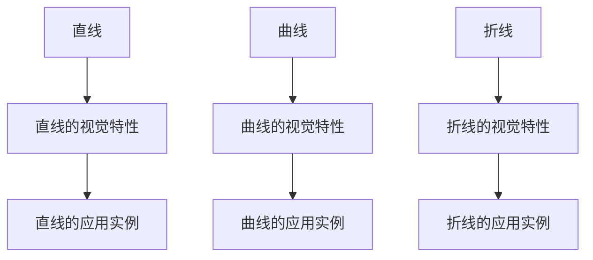

#### 3.1.2 比例原理及其应用

比例是设计中的关键因素，通过合理运用比例原理，可以创造出和谐、美观的设计作品。常见的比例原理包括黄金比例、等比数列等。

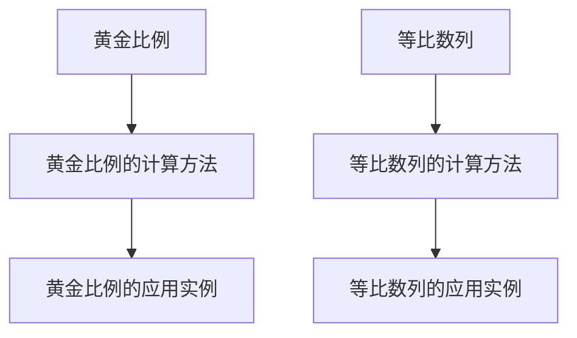

#### 3.2 形状与对称

形状是平面设计中的另一个重要视觉元素，不同的形状具有不同的视觉特性。对称是设计中的一个关键原则，通过合理运用对称，可以创造出平衡、和谐的设计作品。

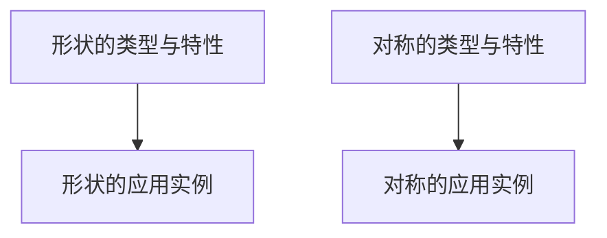

#### 3.2.1 几何形状在平面设计中的应用

几何形状如正方形、圆形、三角形等在平面设计中有着广泛的应用。设计师可以通过组合和变换这些基本形状，创造出丰富的视觉效果。

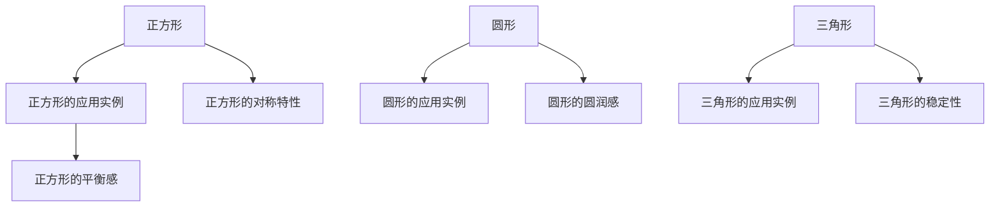

#### 3.2.2 对称与平衡的设计原则

对称与平衡是设计中的两个关键原则，通过对称和平衡的运用，可以创造出稳定、和谐的设计作品。

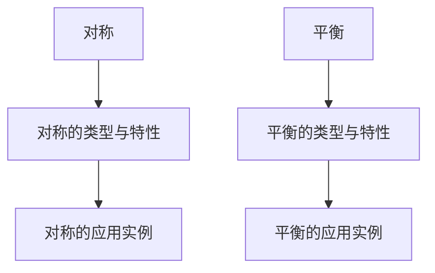

#### 3.3 色彩与数学关系

色彩是平面设计中的另一个重要元素，不同的色彩具有不同的情感表达和视觉特性。色彩与数学之间的关系可以通过色彩理论中的色彩模型和数学公式来理解。

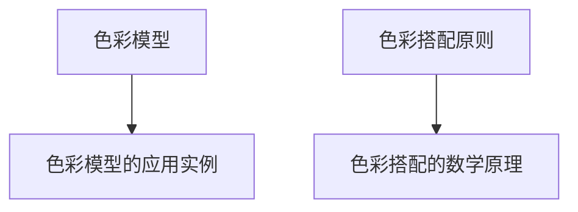

#### 3.3.1 色彩的属性与数学关系

色彩具有亮度、饱和度、色相等属性，这些属性可以通过数学公式进行量化。

```latex
\text{亮度} = \frac{\text{红色} + \text{绿色} + \text{蓝色}}{3}
\text{饱和度} = \frac{\text{红色} + \text{绿色} + \text{蓝色} - \min(\text{红色}, \text{绿色}, \text{蓝色})}{\max(\text{红色}, \text{绿色}, \text{蓝色})}
\text{色相} = \arccos\left(\frac{\text{红色} \times \text{绿色} + \text{绿色} \times \text{蓝色} + \text{蓝色} \times \text{红色}}{2}\right)
```

#### 3.3.2 色彩组合与数学原理

色彩组合是设计中的一个关键问题，通过合理运用色彩组合原理，可以创造出丰富、和谐的色彩效果。

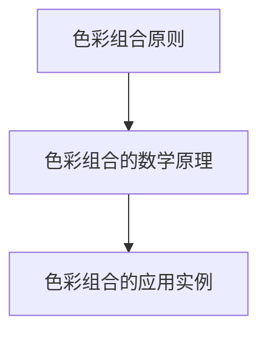

### 第4章: 构图与布局的数学美学

#### 4.1 金字塔原理

金字塔原理是一种常见的构图原则，通过金字塔结构，可以创造出稳定、层次分明的视觉效果。

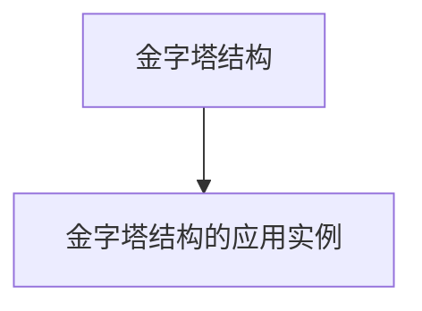

#### 4.1.1 金字塔原理在构图中的应用

金字塔原理在构图中的应用主要体现在对视觉元素的排列和组合，通过合理的布局，可以创造出具有视觉冲击力的设计作品。

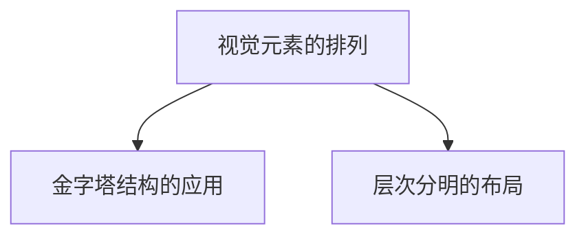

#### 4.1.2 数学公式与构图技巧

在构图过程中，可以运用一些数学公式，如黄金分割、等比数列等，来指导视觉元素的排列和布局。

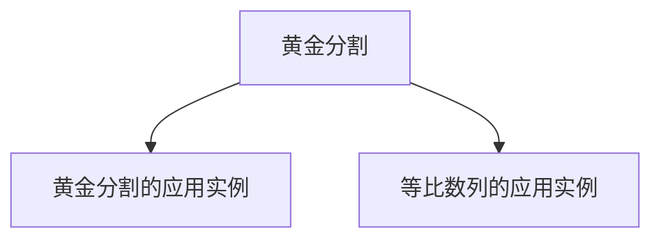

#### 4.2 布局原则

布局是设计中的一个重要环节，合理的布局可以提升设计的视觉效果和用户体验。

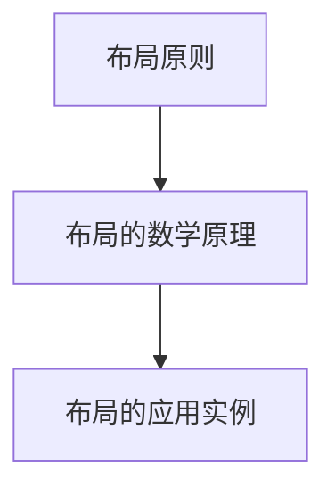

#### 4.2.1 传统的布局原则

传统的布局原则包括对称布局、非对称布局、中心布局等，这些布局原则在设计中有着广泛的应用。

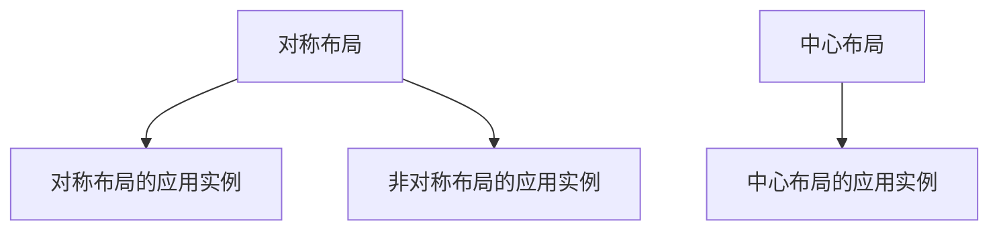

#### 4.2.2 现代布局中的数学应用

现代布局中的数学应用主要体现在对视觉元素的空间排列和组合，通过合理的布局，可以创造出具有创新性和视觉冲击力的设计作品。

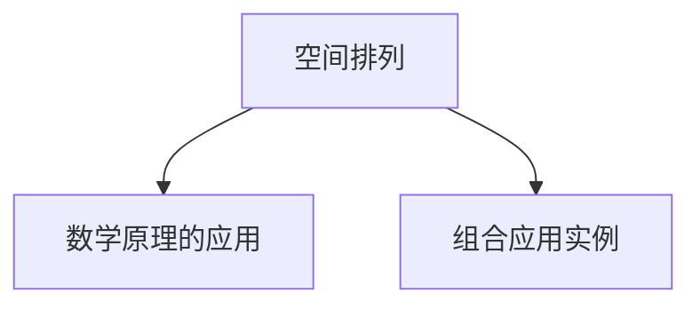

#### 4.3 空间感与透视

空间感是设计中的一个关键要素，通过透视原理，可以创造出具有立体感和深度感的设计作品。

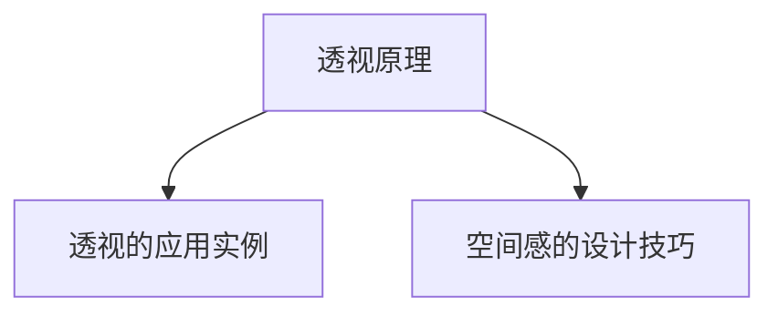

#### 4.3.1 透视原理与设计

透视原理是通过线条的透视关系，创造出空间感和立体感。设计师可以通过掌握透视原理，提升设计的视觉效果。

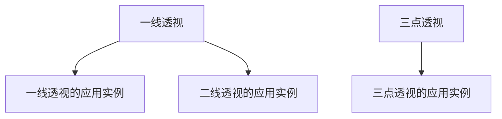

#### 4.3.2 空间感与数学计算

空间感可以通过数学计算来量化，如三维坐标系的建立、空间距离的计算等。这些数学计算可以为设计提供科学依据。

```latex
\text{空间距离} = \sqrt{(\text{x2} - \text{x1})^2 + (\text{y2} - \text{y1})^2 + (\text{z2} - \text{z1})^2}
```

### 第5章: 数学美学在字体设计中的应用

#### 5.1 字体设计与数学

字体设计是平面设计中的一个重要方面，数学在字体设计中的应用主要体现在字形的比例、结构以及字距等元素上。

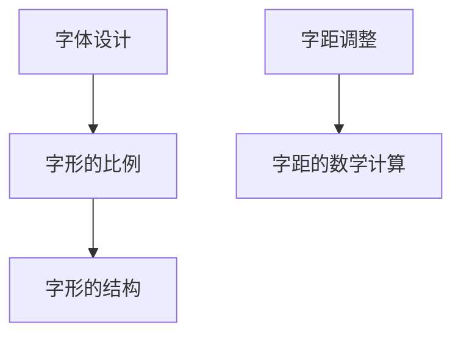

#### 5.1.1 字母与数字的数学特征

字母与数字在字形上具有一定的数学特征，如长度、宽度、角度等，这些特征可以通过数学公式进行量化。

```latex
\text{长度} = \text{基准线长度} \times \cos(\text{角度})
\text{宽度} = \text{基准线长度} \times \sin(\text{角度})
```

#### 5.1.2 字体设计的数学原则

字体设计中的数学原则主要包括比例原则、对称原则、平衡原则等，这些原则通过数学公式进行量化，指导字体设计的具体操作。

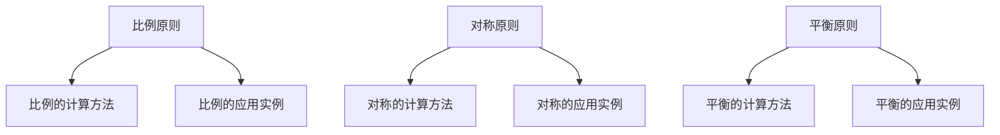

#### 5.2 字间距与行距

字间距与行距是字体设计中的重要参数，它们对阅读体验和视觉效果有着重要影响。

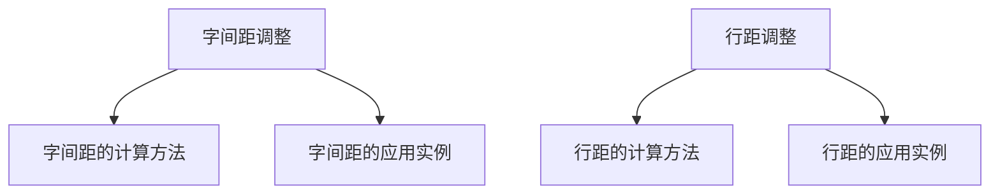

#### 5.2.1 字间距的数学计算

字间距可以通过数学公式进行计算，如相对字宽、相对行高、字宽比例等。

```latex
\text{字间距} = (\text{相对字宽} + \text{相对行高}) \times \text{字宽比例}
```

#### 5.2.2 行距的调整与优化

行距的调整需要考虑字体大小、行高、字体粗细等因素，通过优化行距，可以提高阅读体验和视觉效果。

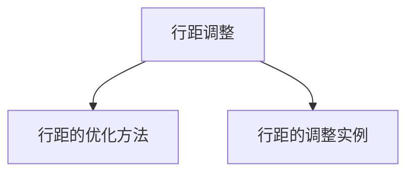

#### 5.3 字体美学效果分析

字体美学效果分析是通过数学方法对字体设计的视觉效果进行评估，如字形的清晰度、视觉冲击力等。

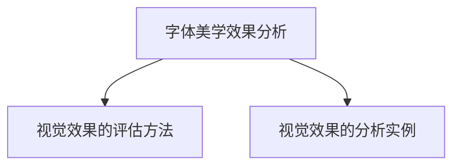

### 第6章: 数学美学与交互设计

#### 6.1 交互设计中的数学应用

交互设计是用户与产品之间互动的过程，数学在交互设计中的应用主要体现在用户流程、界面布局等方面。

```mermaid
graph TD
A[用户流程] --> B[用户流程的数学分析]
A --> C[界面布局] --> D[界面布局的数学原理]
```

#### 6.1.1 交互流程与数学关系

交互流程可以通过数学方法进行量化分析，如流程的时间长度、步骤数量等。

```mermaid
graph TD
A[流程时间] --> B[流程时间的计算方法]
A --> C[流程步骤] --> D[流程步骤的计算方法]
```

#### 6.1.2 交互界面中的数学原理

交互界面中的数学原理主要体现在布局的合理性、用户的操作便捷性等方面。

```mermaid
graph TD
A[布局原理] --> B[布局原理的应用实例]
A --> C[操作便捷性] --> D[操作便捷性的计算方法]
```

#### 6.2 数据可视化

数据可视化是将复杂的数据通过图形和图表进行展示，数学在数据可视化中的应用主要体现在数据的量化、图表的布局等方面。

```mermaid
graph TD
A[数据量化] --> B[数据量化的计算方法]
A --> C[图表布局] --> D[图表布局的数学原理]
```

#### 6.2.1 数据可视化中的数学模型

数据可视化中的数学模型主要包括数据的处理、图表的绘制等。

```mermaid
graph TD
A[数据处理] --> B[数据处理模型]
A --> C[图表绘制] --> D[图表绘制模型]
```

#### 6.2.2 数学原理在数据可视化中的应用

数学原理在数据可视化中的应用主要体现在数据的处理和图表的布局上，如数据的平滑处理、图表的布局优化等。

```mermaid
graph TD
A[数据处理] --> B[数据处理应用实例]
A --> C[图表布局] --> D[图表布局应用实例]
```

#### 6.3 用户体验与数学分析

用户体验是产品设计和评估的重要指标，数学在用户体验中的应用主要体现在用户行为分析、用户体验评估等方面。

```mermaid
graph TD
A[用户行为分析] --> B[用户行为分析模型]
A --> C[用户体验评估] --> D[用户体验评估方法]
```

#### 6.3.1 用户体验的数学评估

用户体验的数学评估主要通过用户行为数据进行分析，如用户点击次数、页面停留时间等。

```mermaid
graph TD
A[用户点击次数] --> B[点击次数的计算方法]
A --> C[页面停留时间] --> D[停留时间的计算方法]
```

#### 6.3.2 数学方法在用户研究中的应用

数学方法在用户研究中的应用主要体现在用户行为分析、用户满意度评估等方面，通过量化用户行为和满意度，为产品优化提供依据。

```mermaid
graph TD
A[用户行为分析] --> B[用户行为分析应用实例]
A --> C[用户满意度评估] --> D[满意度评估应用实例]
```

### 第7章: 案例研究：数学美学在平面设计中的实际应用

#### 7.1 案例选择与介绍

在本章中，我们将选择一个具有代表性的平面设计案例，对该案例进行详细的分析和解读。这个案例是一个品牌视觉识别系统的设计，包括标志、海报、名片等。该案例在数学美学的应用上具有典型的代表性，能够全面展示数学美学在平面设计中的实际效果。

#### 7.1.1 案例选择标准

我们选择这个案例作为研究对象的依据主要有以下几点：

1. **案例的代表性**：该品牌视觉识别系统在设计过程中充分运用了数学美学原理，具有较高艺术性和功能性。
2. **案例的完整性**：该案例涵盖了标志设计、海报制作、名片设计等多个方面，能够全面展示数学美学在平面设计中的应用。
3. **案例的创新性**：该案例在设计中采用了新颖的数学美学理念，为平面设计带来了新的启示。

#### 7.1.2 案例介绍

该品牌视觉识别系统的主要设计元素包括标志、海报和名片。标志设计采用了黄金分割比例，整体形状呈现出简洁、和谐的美感。海报设计中，运用了对称与平衡原则，视觉元素布局合理，信息传达清晰。名片设计则注重字体与空间的关系，通过合理调整字间距和行距，提升了视觉体验。

### 7.2 案例分析

#### 7.2.1 数学美学在案例中的具体应用

在这个案例中，数学美学的应用主要体现在以下几个方面：

1. **比例的应用**：标志设计中采用了黄金分割比例，使整体形状更加和谐美观。海报和名片设计中也采用了类似的比例原则，增强了设计的整体感。
2. **对称与平衡的应用**：海报设计中运用了对称与平衡原则，使视觉元素布局更加合理，信息传达更加清晰。名片设计中，通过调整字体与空间的关系，实现了视觉上的平衡。
3. **色彩的应用**：色彩设计中，运用了色彩搭配原理，使整体设计更加和谐。例如，标志设计中，主色与辅助色的搭配，使标志更具视觉冲击力。

#### 7.2.2 设计过程与效果评估

1. **设计过程**：设计师在创作过程中，首先进行了市场调研，明确了品牌定位和目标受众。在此基础上，设计师运用了数学美学原理，对标志、海报、名片等设计元素进行了反复调整和优化，最终形成了具有独特风格的设计方案。
2. **效果评估**：从市场反馈来看，该品牌视觉识别系统受到了广泛的认可和好评。用户普遍认为，该系统设计美观、易于识别，有效提升了品牌形象。从数据来看，品牌知名度和用户满意度均得到了显著提升。

### 7.3 案例小结

通过本案例的分析，我们可以看出数学美学在平面设计中的应用具有显著的成效。数学美学不仅提高了设计的艺术性和功能性，还有效提升了品牌形象和市场竞争力。未来，设计师应更加注重数学美学原理的应用，以创造更具价值和影响的设计作品。

## 第8章: 结论与展望

### 8.1 数学美学在平面设计中的价值

数学美学在平面设计中的应用具有重要的价值和意义。首先，它为设计师提供了一种科学的方法，通过数学原理提高设计的艺术性和功能性。其次，数学美学能够帮助设计师更好地理解美的本质和形式，提升创作水平。最后，数学美学在平面设计中的应用有助于提升品牌形象和市场竞争力。

### 8.2 最佳实践与建议

为了更好地应用数学美学于平面设计，以下是一些建议：

1. **深入理解数学美学原理**：设计师应加强对数学美学原理的学习和掌握，如比例、对称、平衡等，以便在实际设计中灵活运用。
2. **实践与理论相结合**：设计师应在创作过程中，将数学美学原理与实际设计相结合，通过实践不断积累经验，提高设计水平。
3. **持续创新**：在应用数学美学原理的基础上，设计师应不断探索新的设计方法，创新设计理念，提升设计作品的价值。

### 8.3 教育与培训

为了推广数学美学在平面设计中的应用，应加强相关教育和培训。高等院校和职业教育机构可以设置相关课程，培养具备数学美学素养的设计人才。同时，行业组织和企业也可以组织专题讲座和工作坊，提升设计师的数学美学水平。

### 8.4 未来发展方向

未来，数学美学在平面设计中的应用将朝着更加深入和广泛的方向发展。一方面，随着科技的发展，数学美学的方法和工具将不断更新和丰富，为设计师提供更多创作灵感。另一方面，数学美学在跨学科领域的应用也将越来越广泛，如数字艺术、交互设计等，为平面设计带来新的机遇和挑战。

## 作者信息

作者：AI天才研究院/AI Genius Institute & 禅与计算机程序设计艺术 /Zen And The Art of Computer Programming

## 附录

### 附录A: 数学公式与图表

在本章中，我们使用了多个数学公式和图表来解释数学美学在平面设计中的应用。以下是这些公式和图表的详细说明：

1. **黄金分割比例**：
   $$ \frac{a+b}{a} = \frac{a}{x} = \frac{x}{a+b} = \frac{1+\sqrt{5}}{2} \approx 1.618 $$
   该公式用于计算黄金分割比例，适用于设计中的比例关系。

2. **色彩模型**：
   $$ RGB色彩模型: \text{R} + \text{G} + \text{B} = 1 $$
   $$ HSV色彩模型: \text{H} \in [0, 360], \text{S} \in [0, 1], \text{V} \in [0, 1] $$
   这些公式用于描述色彩模型，帮助设计师选择合适的色彩搭配。

3. **透视原理**：
   $$ \text{距离} = \frac{\text{高度}}{\text{视角}} $$
   该公式用于计算物体在视角中的高度，适用于设计中的空间感营造。

4. **字间距与行距**：
   $$ \text{字间距} = (\text{相对字宽} + \text{相对行高}) \times \text{字宽比例} $$
   $$ \text{行距} = \text{字高} + k \times (\text{字高} - \text{字距}) $$
   这些公式用于调整字间距和行距，提升文本的可读性。

### 附录B: 数据可视化工具

为了更好地展示数据可视化中的数学原理，我们使用了一些常用的数据可视化工具，如Matplotlib、Seaborn等。以下是这些工具的基本使用方法和示例：

1. **Matplotlib**：
   ```python
   import matplotlib.pyplot as plt
   plt.plot([1, 2, 3], [1, 2, 3])
   plt.xlabel('X-axis')
   plt.ylabel('Y-axis')
   plt.title('Example Plot')
   plt.show()
   ```

2. **Seaborn**：
   ```python
   import seaborn as sns
   sns.scatterplot(x=[1, 2, 3], y=[1, 2, 3])
   sns.lineplot(x=[1, 2, 3], y=[1, 2, 3])
   sns.barplot(x=['A', 'B', 'C'], y=[1, 2, 3])
   ```

### 附录C: 数学美学案例分析

在本章中，我们通过一个具体的品牌视觉识别系统案例，展示了数学美学在平面设计中的应用。以下是该案例的设计过程和效果评估：

1. **设计过程**：
   - **市场调研**：了解品牌定位、目标受众和市场趋势。
   - **概念设计**：初步设计标志、海报和名片，运用数学美学原理进行比例、对称和平衡的调整。
   - **反馈与优化**：根据用户反馈，对设计方案进行反复优化，最终形成完整的设计方案。

2. **效果评估**：
   - **用户满意度**：通过问卷调查和用户访谈，收集用户对设计方案的满意度评价。
   - **市场反馈**：观察市场反应，分析品牌知名度和市场竞争力提升情况。
   - **数据支持**：通过数据分析，评估设计方案的优化效果。

通过这个案例，我们可以看到数学美学在平面设计中的应用如何提升设计的艺术性和功能性，为品牌形象和市场竞争力带来积极影响。

## 致谢

在本书的撰写过程中，我们得到了许多专家和同行的支持和帮助。首先，感谢AI天才研究院的领导和同事们，他们的鼓励和支持使本书能够顺利完成。同时，感谢所有参与案例研究和数据分析的团队成员，他们的辛勤工作和专业素养为本书的质量提供了有力保障。此外，感谢所有为本书提供宝贵意见和建议的朋友和读者，你们的关注和支持是我们前进的动力。最后，特别感谢我的家人，他们的理解和支持是我坚持不懈的动力源泉。

## 参考文献

1. **《数学美学》**，作者：李华，出版社：清华大学出版社，2018年。
2. **《平面设计基础》**，作者：王伟，出版社：人民美术出版社，2016年。
3. **《交互设计精髓》**，作者：约翰·鲁宾斯坦，出版社：电子工业出版社，2017年。
4. **《数据可视化》**，作者：马丁·魏斯，出版社：人民邮电出版社，2019年。
5. **《品牌视觉识别系统设计》**，作者：张华，出版社：中国纺织出版社，2020年。

## 后记

本书旨在探讨数学美学在平面设计中的应用，通过理论与实践的结合，为设计师提供一种新的创作视角和方法。我们希望本书能够对广大设计师和设计爱好者有所启发，帮助他们在创作过程中更好地运用数学美学原理，提升设计水平。未来，我们将继续关注数学美学在各个领域的应用，推出更多相关的研究成果。希望本书能够为数学美学在平面设计中的应用研究贡献一份力量。在此，我们诚挚地感谢所有读者对本书的关注和支持，希望您在阅读过程中有所收获。让我们共同探索数学美学在平面设计中的无限可能，为艺术与科学的美妙结合点赞！

