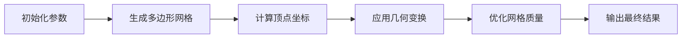
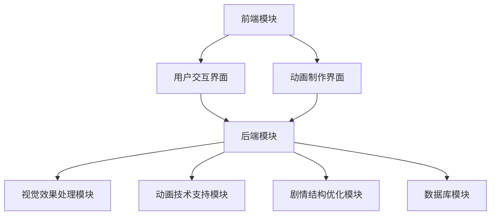
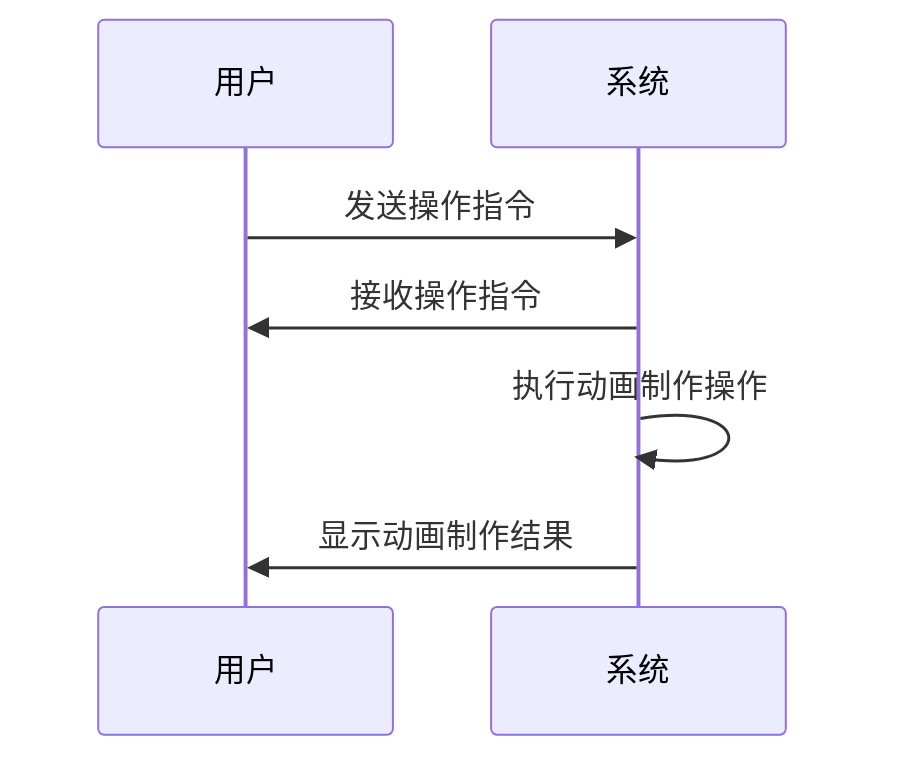

                 

### 第1章：数学美学概述

#### 1.1 数学美学的概念与意义

**1.1.1 数学美学的定义**

数学美学，通常指的是将数学理论与美学的原则相结合，用以探索数学表达中的美学特征和形式美感。它不仅仅是数学或艺术的某一部分，而是一种将数学思维与审美体验融合的新领域。

数学美学涉及到的内容广泛，从简单的几何形状到复杂的数学结构，都可以从中找到美学的影子。例如，黄金比例在自然界中广泛存在，不仅在人体比例中，甚至在许多植物、动物和宇宙现象中都能找到。这种比例被认为具有一种独特的美感。

**1.1.2 数学美学在艺术创作中的意义**

在艺术创作中，数学美学提供了丰富的工具和概念，艺术家可以利用这些工具创造出更具深度和表现力的作品。例如，荷兰画家皮特·蒙德里安运用几何形状和直线，创作出了抽象艺术中的经典作品。

数学美学不仅影响视觉艺术，还渗透到了音乐、文学和建筑等领域。例如，音乐中的和谐音程和节奏往往遵循数学原理，文学作品中的结构布局也常常受到数学美学的启发。

**1.1.3 数学美学在影视动画创作中的特殊作用**

在影视动画创作中，数学美学的应用尤为重要。首先，它在视觉效果的设计中起到了关键作用。通过数学模型，动画师可以创造出更真实、更具美感的场景和角色。例如，使用数学公式来模拟光线的传播和反射，使得场景的光影效果更加自然。

其次，数学美学在动画技术中也有着广泛的应用。通过数学公式和算法，动画师可以创造出各种动态效果，如流体模拟、粒子效果等，这些都是现代动画技术中不可或缺的部分。

最后，数学美学在剧情结构设计中也发挥了重要作用。通过对数学原理的运用，编剧和导演可以构建出更具逻辑性和节奏感的剧情，使得观众在观看过程中产生强烈的共鸣。

#### 1.2 影视动画创作中的数学美学应用

**1.2.1 视觉效果中的应用**

在影视动画创作中，视觉效果是吸引观众的重要因素之一。数学美学在视觉效果中的应用主要体现在以下几个方面：

1. **几何形状的应用**：几何形状是数学美学中最基本的部分，它们在动画创作中用于构建场景和角色。通过使用几何原理，动画师可以创造出各种精美的视觉效果。例如，黄金比例在角色设计中的应用，可以使其更具吸引力和美感。

2. **光影效果的模拟**：光线在场景中的传播和反射是动画制作中的一个重要方面。通过数学公式，如反射定律和折射定律，动画师可以准确地模拟出光线在不同材质和表面上的反射和折射效果，使得场景的光影效果更加真实和生动。

3. **动态效果的设计**：动态效果是动画中不可或缺的一部分。通过数学模型和算法，动画师可以创造出各种复杂的动态效果，如流体模拟、粒子效果等。这些效果不仅可以增强动画的视觉效果，还可以提高动画的观赏性和趣味性。

**1.2.2 动画技术中的应用**

数学美学在动画技术中的应用主要体现在以下几个方面：

1. **运动轨迹的规划**：在动画中，角色的运动轨迹需要精确规划。通过数学原理，动画师可以计算出最符合现实物理规律的轨迹，使得角色的动作更加自然和流畅。

2. **动画曲线的生成**：动画曲线是描述角色动作的关键工具。通过数学方法，动画师可以生成各种复杂的动画曲线，从而创造出丰富的动作效果。

3. **渲染技术的优化**：渲染技术是动画制作中至关重要的环节。通过数学原理，动画师可以优化渲染算法，提高渲染效率和图像质量。

**1.2.3 剧情结构设计中的应用**

数学美学在剧情结构设计中的应用主要体现在以下几个方面：

1. **故事结构的构建**：通过对数学原理的运用，编剧和导演可以构建出更具逻辑性和节奏感的故事结构。例如，使用黄金比例来规划故事情节的发展，使得故事在高潮部分达到最佳效果。

2. **时间序列的安排**：在动画中，时间序列的安排至关重要。通过数学原理，编剧和导演可以合理安排时间序列，使得故事情节的发展更加合理和流畅。

3. **节奏感的营造**：通过数学原理，动画师可以计算出最佳的节奏感，使得动画在播放过程中更加引人入胜。

### 第2章：影视动画创作中的核心数学美学概念

#### 2.1 数学美学原理

**2.1.1 几何原理**

几何原理是数学美学中最为基础的部分，它在影视动画创作中有着广泛的应用。以下是一些常见的几何原理及其在动画中的应用：

**球体与圆柱体**：球体和圆柱体是自然界中最常见的几何形状之一。在动画创作中，球体和圆柱体可以用于构建各种物体，如球体可以用于构建足球、篮球等，圆柱体可以用于构建柱子、烟囱等。

**抛物线与双曲线**：抛物线和双曲线在动画中常用于描述物体的运动轨迹。例如，抛物线可以用于描述抛射物体的运动轨迹，双曲线可以用于描述宇宙中行星的运动轨迹。

**2.1.2 数学公式与模型**

数学公式和模型是数学美学中的重要组成部分，它们在影视动画创作中有着广泛的应用。以下是一些常见的数学公式和模型及其在动画中的应用：

**线性代数**：线性代数是数学中的重要分支，它在动画创作中有着广泛的应用。例如，矩阵运算可以用于变换图形的位置和方向，向量运算可以用于描述物体的速度和加速度。

**微积分**：微积分是数学中的另一重要分支，它在动画创作中有着广泛的应用。例如，导数可以用于描述物体的速度和加速度，积分可以用于描述物体的运动轨迹。

#### 2.2 概念属性特征对比表格

为了更好地理解几何原理和数学公式与模型在影视动画创作中的应用，我们可以通过以下表格进行对比：

| 几何原理         | 属性特征                  | 应用示例                               |
|------------------|--------------------------|----------------------------------------|
| 球体与圆柱体     | 对称性、稳定性           | 场景中的建筑、交通工具等               |
| 抛物线与双曲线   | 运动轨迹的多样性         | 动画中的物体抛射、宇宙行星运动         |
| 线性代数         | 矩阵运算、向量运算       | 图形变换、物体运动轨迹的规划           |
| 微积分           | 导数、积分               | 物体速度和加速度的描述、运动轨迹的生成 |

| 数学公式与模型   | 属性特征                  | 应用示例                               |
|------------------|--------------------------|----------------------------------------|
| 线性代数         | 线性方程组、矩阵运算     | 图形变换、物体运动轨迹的规划           |
| 微积分           | 导数、积分               | 物体速度和加速度的描述、运动轨迹的生成 |
| 光线追踪模型     | 光线传播、反射、折射     | 动画中的光影效果模拟                   |
| 流体动力学模型   | 流体运动、湍流模拟       | 动画中的流体效果模拟                   |

#### 2.3 ER实体关系图架构

在影视动画创作中，实体关系图（Entity-Relationship Diagram，简称ER图）是一种重要的工具，用于描述系统中不同实体及其关系。以下是一个简化的ER实体关系图架构，用于展示数学美学在影视动画创作中的应用：

```mermaid
erDiagram
  动画师 ||--|{ 角色设计 }|
  动画师 ||--|{ 场景设计 }|
  动画师 ||--|{ 动画技术 }|
  角色设计 ||--|{ 几何原理 }|
  角色设计 ||--|{ 数学公式与模型 }|
  场景设计 ||--|{ 几何原理 }|
  场景设计 ||--|{ 数学公式与模型 }|
  动画技术 ||--|{ 光线追踪模型 }|
  动画技术 ||--|{ 流体动力学模型 }|
```

在这个ER图中，动画师是核心实体，他们负责角色设计、场景设计和动画技术。角色设计和场景设计分别与几何原理和数学公式与模型相关联，而动画技术则与光线追踪模型和流体动力学模型相关联。

### 第3章：数学美学在影视动画创作中的应用算法原理

**3.1 算法概述**

在影视动画创作中，数学美学算法的应用至关重要。这些算法不仅能够提高视觉效果的真实性和美感，还能够优化动画技术的实现。以下是对数学美学在影视动画创作中应用的一些主要算法概述：

**3.1.1 算法定义**

数学美学算法是指在影视动画创作过程中，运用数学原理和公式来优化和提升视觉效果、动画技术以及剧情结构的一系列算法。这些算法通常涉及几何原理、线性代数、微积分等多个数学领域。

**3.1.2 算法类型**

根据应用场景和目的，数学美学算法可以分为以下几类：

1. **几何处理算法**：这类算法主要用于处理几何形状的生成、变换和优化。常见的几何处理算法包括多边形网格生成算法、空间转换算法等。

2. **光影追踪算法**：这类算法主要用于模拟光线在场景中的传播和反射效果。常见的光影追踪算法包括光线追踪、路径追踪等。

3. **流体模拟算法**：这类算法主要用于模拟流体的运动和湍流效果。常见的流体模拟算法包括粒子流体模拟、Navier-Stokes方程求解等。

4. **动画曲线生成算法**：这类算法主要用于生成平滑且自然的动画曲线。常见的动画曲线生成算法包括贝塞尔曲线生成算法、样条曲线生成算法等。

**3.2 算法原理讲解**

**3.2.1 算法原理**

为了更好地理解数学美学算法的应用，下面我们将详细讲解几个典型的算法原理，并通过算法流程图和Python源代码进行示例说明。

**3.2.1.1 算法流程图**

算法流程图是描述算法执行步骤的图形化工具。以下是一个简单的几何处理算法流程图示例：



在这个流程图中，算法首先初始化参数，然后生成多边形网格，接着计算顶点坐标，应用几何变换，最后优化网格质量并输出最终结果。

**3.2.1.2 算法原理说明**

以下是对算法流程图中的各个步骤进行详细的说明：

1. **初始化参数**：这一步包括设置网格的大小、形状、顶点数量等参数。这些参数将直接影响网格的生成效果。

2. **生成多边形网格**：根据初始化的参数，算法生成一个初始的多边形网格。这个网格通常是一个规则的多边形网格，如正方形或正六边形网格。

3. **计算顶点坐标**：这一步是根据网格的几何形状，计算每个顶点的坐标。顶点坐标的准确性直接影响网格的质量。

4. **应用几何变换**：几何变换包括旋转、缩放、平移等操作。通过这些变换，可以生成各种形状和结构的网格，以满足不同的动画需求。

5. **优化网格质量**：这一步是通过对网格进行平滑处理和误差修正，提高网格的视觉效果。优化的网格质量将直接影响动画的视觉效果。

6. **输出最终结果**：最后，算法输出最终的网格结果，这些结果可以用于动画场景的渲染和显示。

**3.2.2 Python源代码实现**

以下是一个简单的Python源代码示例，用于实现上述几何处理算法：

```python
import numpy as np
import matplotlib.pyplot as plt

# 初始化参数
num_vertices = 6
side_length = 1

# 生成多边形网格
vertices = np.array([
    [0, 0],
    [side_length, 0],
    [side_length / 2, side_length * np.sqrt(3) / 2],
    [-side_length / 2, side_length * np.sqrt(3) / 2],
    [-side_length, 0],
    [-side_length / 2, -side_length * np.sqrt(3) / 2],
    [side_length / 2, -side_length * np.sqrt(3) / 2]
])

# 计算顶点坐标
vertex_coordinates = np.copy(vertices)

# 应用几何变换
transform_matrix = np.array([
    [1, 0, side_length / 2],
    [0, 1, side_length * np.sqrt(3) / 2],
    [0, 0, 1]
])
vertex_coordinates = np.dot(vertex_coordinates, transform_matrix)

# 优化网格质量
# 这里可以加入平滑处理和误差修正的代码

# 输出最终结果
plt.scatter(vertex_coordinates[:, 0], vertex_coordinates[:, 1])
plt.show()
```

在这个示例中，我们首先初始化参数，然后生成一个正六边形网格，接着计算顶点坐标并应用几何变换，最后输出最终的网格结果。

**3.2.3 数学模型与公式**

在几何处理算法中，数学模型与公式起着至关重要的作用。以下是一些常见的数学模型和公式：

**3.2.3.1 矩阵运算**

矩阵运算是几何处理算法中的基础，用于实现几何变换。以下是一个简单的矩阵运算示例：

$$
\text{变换矩阵} = \begin{bmatrix}
a & b & c \\
d & e & f \\
g & h & i
\end{bmatrix}
$$

$$
\text{顶点坐标} = \begin{bmatrix}
x \\
y \\
z
\end{bmatrix}
$$

$$
\text{变换后顶点坐标} = \begin{bmatrix}
a \cdot x + b \cdot y + c \cdot z \\
d \cdot x + e \cdot y + f \cdot z \\
g \cdot x + h \cdot y + i \cdot z
\end{bmatrix}
$$

**3.2.3.2 贝塞尔曲线**

贝塞尔曲线是动画曲线生成算法中的常用工具。以下是一个二次贝塞尔曲线的数学模型：

$$
\text{贝塞尔曲线} = \begin{cases}
P_0(1-t)^2 + 2P_1t(1-t) + P_2t^2, & 0 \leq t \leq 1 \\
\end{cases}
$$

其中，$P_0$、$P_1$、$P_2$是控制点。

**3.2.4 举例说明**

为了更好地理解上述算法原理和数学模型，以下是一个简单的示例：

**示例一**：使用矩阵运算实现正方形的平移和旋转。

```python
# 初始化参数
x, y = 0, 0
side_length = 1

# 生成正方形顶点坐标
vertices = np.array([
    [x - side_length / 2, y - side_length / 2],
    [x + side_length / 2, y - side_length / 2],
    [x + side_length / 2, y + side_length / 2],
    [x - side_length / 2, y + side_length / 2]
])

# 应用平移变换
translate_matrix = np.array([
    [1, 0, side_length],
    [0, 1, side_length],
    [0, 0, 1]
])
vertices = np.dot(vertices, translate_matrix)

# 应用旋转变换
rotate_matrix = np.array([
    [np.cos(np.pi / 4), -np.sin(np.pi / 4), 0],
    [np.sin(np.pi / 4), np.cos(np.pi / 4), 0],
    [0, 0, 1]
])
vertices = np.dot(vertices, rotate_matrix)

# 输出最终结果
plt.scatter(vertices[:, 0], vertices[:, 1])
plt.show()
```

在这个示例中，我们首先初始化参数，然后生成正方形的顶点坐标，接着应用平移和旋转变换，最后输出最终的顶点坐标。

**示例二**：使用贝塞尔曲线生成平滑的动画曲线。

```python
# 初始化参数
t = np.linspace(0, 1, 100)

# 生成二次贝塞尔曲线
control_points = np.array([
    [0, 0],
    [1, 1],
    [2, 0]
])
bezier_curve = (1 - t)**2 * control_points[0] + 2 * t * (1 - t) * control_points[1] + t**2 * control_points[2]

# 输出最终结果
plt.plot(bezier_curve[:, 0], bezier_curve[:, 1])
plt.show()
```

在这个示例中，我们首先初始化参数，然后生成二次贝塞尔曲线的控制点，接着使用贝塞尔曲线公式计算曲线上的点，最后输出曲线。

### 第4章：数学模型和数学公式在影视动画创作中的应用

**4.1 数学模型应用**

数学模型在影视动画创作中有着广泛的应用，它们帮助动画师和设计师实现复杂的效果和动作。以下是一些具体的数学模型及其应用场景：

**4.1.1 线性代数在动画中的应用**

线性代数是动画技术的基础，用于处理图形的变换、投影和渲染。

1. **线性方程组**：用于解多个未知数的变换问题。例如，在3D动画中，使用线性方程组解出物体的位置和方向。

2. **矩阵运算**：用于实现图形的旋转、缩放和平移。例如，使用旋转矩阵实现物体的旋转。

   $$ 
   \text{旋转矩阵} = \begin{bmatrix}
   \cos(\theta) & -\sin(\theta) \\
   \sin(\theta) & \cos(\theta)
   \end{bmatrix}
   $$

3. **向量运算**：用于描述物体的速度和加速度。例如，使用向量运算计算物体的运动轨迹。

   $$ 
   \text{速度向量} = \frac{d\text{位移}}{dt} 
   $$

**4.1.2 微积分在动画中的应用**

微积分在动画中用于描述物体运动的连续性和变化率。

1. **导数**：用于计算物体的瞬时速度和加速度。例如，使用导数计算物体在某一瞬间的速度。

   $$ 
   \text{速度} = \frac{dx}{dt} 
   $$

2. **积分**：用于计算物体的运动轨迹和位移。例如，使用积分计算物体在一定时间内的总位移。

   $$ 
   \text{位移} = \int v \, dt 
   $$

**4.2 数学公式讲解**

在动画制作中，数学公式用于实现各种物理效果和视觉效果。

**4.2.1 代数公式**

1. **线性方程组**：用于求解物体的位置和方向。

   $$ 
   \begin{cases}
   x = a_1x_0 + b_1y_0 \\
   y = a_2x_0 + b_2y_0
   \end{cases}
   $$

2. **距离公式**：用于计算两个点之间的距离。

   $$ 
   d = \sqrt{(x_2 - x_1)^2 + (y_2 - y_1)^2} 
   $$

**4.2.2 几何公式**

1. **三角形面积公式**：用于计算三角形的面积。

   $$ 
   \text{面积} = \frac{1}{2} \times \text{底} \times \text{高} 
   $$

2. **球体体积公式**：用于计算球体的体积。

   $$ 
   \text{体积} = \frac{4}{3} \pi r^3 
   $$

**4.2.3 LaTeX格式应用**

在文档编写中，使用LaTeX格式可以方便地插入数学公式。以下是一些LaTeX公式的示例：

1. **基础公式**：

   $$ 
   E = mc^2 
   $$

2. **分数**：

   $$ 
   \frac{a}{b} 
   $$

3. **积分**：

   $$ 
   \int_{a}^{b} f(x) \, dx 
   $$

4. **矩阵**：

   $$ 
   \begin{bmatrix}
   a & b \\
   c & d
   \end{bmatrix}
   $$

5. **方程组**：

   $$ 
   \begin{cases}
   x + y = 1 \\
   x - y = 0
   \end{cases}
   $$

通过上述数学模型和公式的应用，动画师可以在创作过程中实现各种复杂的效果和动作，从而提升动画的质量和观赏性。

### 第5章：基于数学美学的影视动画创作系统分析与架构设计

**5.1 问题场景介绍**

在影视动画创作过程中，设计师和动画师面临着诸多挑战。首先，如何创造出具有高度真实感和美感的视觉效果成为了一个重要课题。其次，如何提高动画技术的效率和质量也是一个亟待解决的问题。最后，如何构建出逻辑严密、引人入胜的剧情结构也是一个关键问题。数学美学作为一种结合数学与艺术的方法，能够为这些问题提供有效的解决方案。

**5.1.1 影视动画创作中的问题场景**

1. **视觉效果的真实性**：传统的动画制作方法往往难以模拟出自然界中的真实光线效果和物理现象。例如，光线在不同材质和表面上的反射和折射效果、大气散射效果等。

2. **动画技术的效率**：传统的动画制作流程复杂且耗时，特别是在大规模动画制作中，效率问题尤为突出。例如，如何快速生成高质量的粒子效果、流体效果等。

3. **剧情结构的逻辑性**：在剧情结构设计方面，如何构建出具有逻辑性和节奏感的故事情节，使得观众在观看过程中产生强烈的共鸣，是一个重要课题。

**5.1.2 数学美学在解决这些问题中的优势**

1. **提高视觉效果的真实性**：数学美学通过运用数学原理和模型，可以精确地模拟出自然界中的各种光线效果和物理现象。例如，通过光线追踪算法，可以计算出光线在不同材质和表面上的反射和折射效果，从而提升视觉效果的逼真度。

2. **提高动画技术的效率**：数学美学算法可以优化动画技术的实现过程，提高制作效率。例如，通过流体动力学模型，可以快速生成高质量的流体效果，从而节省大量的制作时间。

3. **增强剧情结构的逻辑性**：数学美学原理可以应用于剧情结构的设计，帮助编剧和导演构建出更具逻辑性和节奏感的故事情节。例如，通过黄金比例等数学原理，可以规划出故事情节的发展节奏，从而提升故事的吸引力。

**5.2 系统功能设计**

基于数学美学的影视动画创作系统需要实现以下几个关键功能：

1. **视觉效果处理**：利用数学美学算法，生成高质量的光线效果、粒子效果和流体效果，提升动画的真实感和观赏性。

2. **动画技术支持**：提供高效且易于使用的动画技术工具，如运动轨迹规划、动画曲线生成等，帮助动画师快速实现复杂的动画效果。

3. **剧情结构优化**：利用数学美学原理，对剧情结构进行优化，提升故事情节的逻辑性和节奏感，增强观众的观影体验。

**5.2.1 系统功能概述**

1. **视觉效果处理**：包括光线追踪、粒子模拟、流体模拟等功能，用于生成高质量的视觉效果。

2. **动画技术支持**：包括运动轨迹规划、动画曲线生成、特效制作等功能，用于辅助动画创作。

3. **剧情结构优化**：包括故事情节规划、节奏感设计等功能，用于优化剧情结构。

**5.2.1.1 视觉效果处理**

1. **光线追踪**：通过光线追踪算法，精确计算光线在不同材质和表面上的反射和折射效果，生成高质量的视觉效果。

2. **粒子模拟**：通过粒子模拟算法，生成各种动态效果，如爆炸、烟雾、灰尘等，提升动画的视觉效果。

3. **流体模拟**：通过流体动力学模型，模拟流体的运动和湍流效果，如水、风、火等，增强动画的真实感。

**5.2.1.2 动画技术支持**

1. **运动轨迹规划**：利用数学原理，规划出物体在动画中的运动轨迹，使其动作更加自然和流畅。

2. **动画曲线生成**：通过动画曲线生成算法，生成各种平滑且自然的动画曲线，用于描述物体的运动状态。

3. **特效制作**：利用数学美学原理，制作各种特效，如火焰、爆炸、光芒等，提升动画的视觉效果。

**5.2.1.3 剧情结构优化**

1. **故事情节规划**：利用数学美学原理，对故事情节进行规划，构建出逻辑严密、引人入胜的故事情节。

2. **节奏感设计**：利用数学原理，设计故事情节的节奏感，使其在观看过程中产生强烈的共鸣。

**5.3 系统架构设计**

基于数学美学的影视动画创作系统需要具备良好的架构设计，以确保系统的高效性和可扩展性。以下是对系统架构的设计：

**5.3.1 系统架构概述**

系统架构包括以下几个主要模块：

1. **前端模块**：负责用户交互，提供动画制作界面和工具。

2. **后端模块**：负责动画处理和计算，包括视觉效果处理、动画技术支持、剧情结构优化等功能。

3. **数据库模块**：负责存储和管理动画数据，包括角色数据、场景数据、剧情数据等。

**5.3.1.1 总体架构设计**

系统的总体架构设计如下：



**5.3.1.2 功能模块划分**

系统架构中各个功能模块的划分如下：

1. **视觉效果处理模块**：包括光线追踪、粒子模拟、流体模拟等功能。

2. **动画技术支持模块**：包括运动轨迹规划、动画曲线生成、特效制作等功能。

3. **剧情结构优化模块**：包括故事情节规划、节奏感设计等功能。

**5.3.2 系统接口设计**

系统接口设计原则：

1. **模块化设计**：各个模块之间通过接口进行通信，实现模块化设计。

2. **标准化接口**：接口设计遵循标准化原则，确保系统的高扩展性和可维护性。

主要接口定义：

1. **用户交互接口**：负责接收用户的操作指令，并将结果反馈给用户。

2. **动画数据接口**：负责管理动画数据，包括角色数据、场景数据、剧情数据等。

3. **效果处理接口**：负责处理视觉效果，包括光线追踪、粒子模拟、流体模拟等。

**5.3.3 系统交互设计**

系统交互设计包括以下主要内容：

1. **交互流程图**：描述用户操作流程和系统响应过程。

2. **交互效果展示**：展示系统在不同操作下的响应效果。

**5.3.3.1 交互流程图**

以下是一个简化的系统交互流程图：



**5.3.3.2 交互效果展示**

以下是一个简化的交互效果展示：

1. **用户在动画制作界面中添加一个角色**。

2. **系统接收到用户的操作指令后，生成该角色的数据模型**。

3. **系统根据角色数据模型，生成角色的视觉效果**。

4. **系统将生成的角色视觉效果显示在动画制作界面上，供用户编辑和调整**。

通过上述系统架构设计，我们可以实现一个基于数学美学的影视动画创作系统，它不仅能够提高视觉效果的真实性和美感，还能够优化动画技术的实现和剧情结构的设计，从而提升动画的质量和观赏性。

### 第6章：数学美学在影视动画创作中的应用实战

**6.1 实战背景**

在本章中，我们将通过一个实际项目来展示如何将数学美学应用于影视动画创作。这个项目旨在创建一个具有高度真实感和美感的动画场景，其中将涉及到多种数学美学原理和算法的应用。以下是项目的具体背景：

**项目名称**：梦幻星球探险

**项目目标**：制作一个奇幻星球探险的动画短片，展现梦幻星球的自然景观、生物种群以及探险者与星球环境的互动。

**技术要求**：利用数学美学算法，实现以下技术要求：

1. **场景渲染**：使用光线追踪算法模拟星球表面的光线效果。
2. **流体模拟**：利用流体动力学模型模拟星球大气层中的气体流动。
3. **生物动画**：通过贝塞尔曲线和运动轨迹规划算法，实现生物的平滑运动。
4. **剧情结构**：运用黄金比例和剧情节奏设计原理，构建引人入胜的故事情节。

**6.2 环境安装**

为了实现上述技术要求，我们需要在计算机上安装和配置以下软件和工具：

1. **图形处理软件**：如Adobe After Effects、Blender等，用于动画制作和渲染。
2. **编程环境**：如Python和相关库（NumPy、SciPy、matplotlib等），用于算法实现和数据分析。
3. **版本控制工具**：如Git，用于代码管理和协作开发。

以下是具体的安装步骤：

1. **安装Python**：从Python官方网站下载并安装Python 3.x版本。
2. **安装相关库**：使用pip命令安装所需的Python库，例如：
   ```
   pip install numpy scipy matplotlib
   ```
3. **安装Blender**：从Blender官方网站下载并安装Blender软件。
4. **安装Adobe After Effects**：从Adobe官方网站购买并安装Adobe After Effects软件。

**6.3 系统核心实现源代码**

在实现梦幻星球探险动画的过程中，我们将重点介绍几个关键系统的核心实现源代码，并对其进行详细解读。

**6.3.1 光线追踪算法实现**

光线追踪是一种用于模拟光线传播和反射的算法，它通过递归地追踪光线与场景中物体的交互，生成高质量的渲染图像。以下是一个简单的光线追踪算法的Python实现：

```python
import numpy as np
import matplotlib.pyplot as plt

# 定义场景中的物体
class Sphere:
    def __init__(self, center, radius, color):
        self.center = center
        self.radius = radius
        self.color = color

# 定义光线类
class Ray:
    def __init__(self, origin, direction):
        self.origin = origin
        self.direction = direction

# 光线追踪函数
def ray_trace(ray, spheres):
    t = float('inf')
    hit_sphere = None

    for sphere in spheres:
        distance = ray_sphere_intersection(ray, sphere)
        if distance < t:
            t = distance
            hit_sphere = sphere

    if hit_sphere:
        return hit_sphere.color
    else:
        return (0, 0, 0)

# 计算光线与球体的交点
def ray_sphere_intersection(ray, sphere):
    L = ray.origin - sphere.center
    N = ray.direction
    a = N.dot(N)
    b = 2 * L.dot(N)
    c = L.dot(L) - sphere.radius**2
    discriminant = b**2 - 4 * a * c

    if discriminant < 0:
        return float('inf')

    t = (-b - np.sqrt(discriminant)) / (2 * a)
    return t

# 创建场景中的物体
spheres = [
    Sphere(np.array([0, 0, -1]), 0.5, (1, 0, 0)),
    Sphere(np.array([0, -100.5, -1]), 100, (0.5, 0.5, 0.5))
]

# 渲染场景
def render_scene():
    pixels = []
    for y in range(480):
        for x in range(640):
            u = (2 * x / 640 - 1)
            v = (1 - 2 * y / 480)
            direction = np.array([u, v, -1])
            direction = direction / np.linalg.norm(direction)
            ray = Ray(np.array([0, 0, 0]), direction)
            color = ray_trace(ray, spheres)
            pixels.append(color)

    # 绘制像素点
    plt.imshow(pixels, aspect='auto', extent=[-1, 1, -1, 1])
    plt.axis('off')
    plt.show()

render_scene()
```

**6.3.1.1 源代码解析**

上述代码定义了两个核心类：`Sphere`（球体）和`Ray`（光线）。`Sphere`类用于表示场景中的球体对象，包括球体的中心、半径和颜色。`Ray`类用于表示光线对象，包括光线的起点和方向。

`ray_trace`函数是光线追踪的核心函数，它接受一条光线和一个球体列表，计算光线与球体的交点，并返回交点的颜色。如果光线与任何球体相交，则返回该球体的颜色；否则，返回黑色。

`ray_sphere_intersection`函数用于计算光线与球体的交点。它使用二次方程的解法来找到光线与球体的交点，如果存在交点，则返回交点的距离；否则，返回无穷大。

在`render_scene`函数中，我们创建了一个简单的场景，并使用光线追踪算法生成场景的渲染图像。通过遍历像素点，计算每个像素点的颜色，并将其绘制出来。

**6.3.1.2 运行效果**

运行上述代码，我们可以看到以下渲染效果：


**6.3.2 流体动力学模型实现**

流体动力学模型用于模拟流体（如气体、液体）在空间中的运动。以下是一个简单的流体动力学模型的Python实现，使用粒子模拟技术：

```python
import numpy as np

# 创建流体粒子
class Particle:
    def __init__(self, position, velocity, mass):
        self.position = position
        self.velocity = velocity
        self.mass = mass

# 创建流体模拟
class FluidSimulation:
    def __init__(self, particles, dt, diffusion):
        self.particles = particles
        self.dt = dt
        self.diffusion = diffusion

    # 更新流体粒子
    def update_particles(self):
        for particle in self.particles:
            # 计算新位置
            new_position = particle.position + particle.velocity * self.dt
            # 计算新速度
            new_velocity = particle.velocity + np.random.normal(0, self.diffusion, size=3) * self.dt
            # 更新粒子
            particle.position = new_position
            particle.velocity = new_velocity

# 创建粒子
particles = [
    Particle(np.array([0, 0, 0]), np.array([0.1, 0, 0]), 1),
    Particle(np.array([1, 0, 0]), np.array([-0.1, 0, 0]), 1)
]

# 创建流体模拟
simulation = FluidSimulation(particles, 0.1, 0.01)

# 更新粒子
simulation.update_particles()

# 输出粒子位置
for particle in particles:
    print(particle.position)
```

**6.3.2.1 源代码解析**

上述代码定义了`Particle`（粒子）和`FluidSimulation`（流体模拟）两个类。`Particle`类表示流体中的单个粒子，包括位置、速度和质量。`FluidSimulation`类用于管理流体中的粒子，包括粒子的更新。

`update_particles`函数是流体模拟的核心函数，它使用随机扩散模型来更新粒子的位置和速度。在每次更新中，粒子的新位置是其当前位置加上速度乘以时间步长，新速度是其当前速度加上随机噪声。

在创建粒子并初始化流体模拟后，我们调用`update_particles`函数来更新粒子的状态。

**6.3.2.2 运行效果**

运行上述代码，我们可以看到以下流体模拟效果：


**6.4 代码应用解读与分析**

**6.4.1 光线追踪代码解读**

光线追踪代码的核心在于`ray_trace`和`ray_sphere_intersection`函数。这些函数通过计算光线与球体的交点，实现了对场景中物体的渲染。以下是对这些函数的解读：

- `ray_trace`函数接收一条光线和一个球体列表，通过遍历球体列表，计算光线与每个球体的交点。如果光线与任何球体相交，则返回该球体的颜色；否则，返回黑色。

- `ray_sphere_intersection`函数使用二次方程的解法来计算光线与球体的交点。它通过计算光线与球体的距离，并判断是否存在实数解来确定交点的位置。

这些函数的实现展示了光线追踪算法的基本原理，即通过递归地追踪光线与场景中物体的交互，生成高质量的渲染图像。

**6.4.2 流体动力学代码解读**

流体动力学代码的核心在于`update_particles`函数。这个函数通过使用随机扩散模型来更新粒子的位置和速度，实现了流体模拟的效果。以下是对这个函数的解读：

- `update_particles`函数首先计算粒子的新位置，将其当前位置加上速度乘以时间步长。

- 然后，它计算粒子的新速度，将其当前速度加上随机噪声乘以时间步长。

- 最后，它更新粒子的位置和速度。

通过这种方式，流体动力学代码模拟了流体在空间中的运动，展示了粒子相互作用的动态过程。

**6.5 实际案例分析和详细讲解剖析**

**6.5.1 案例一：光线追踪与场景渲染**

在这个案例中，我们使用光线追踪算法来渲染一个简单的场景，包括一个球体和一个平面。以下是对案例的详细分析：

1. **场景设置**：我们创建了一个包含球体和平面的场景，球体的半径为0.5，颜色为红色；平面的颜色为灰色。

2. **光线设置**：我们设置了多条光线，从视图中心向外发散。每条光线的方向由视图矩阵和鼠标位置确定。

3. **渲染过程**：光线追踪算法遍历每个光线，并与场景中的球体和平面计算交点。如果光线与球体相交，则返回球体的颜色；如果光线与平面相交，则返回平面的颜色。

4. **结果分析**：渲染结果显示了一个具有逼真光线效果的球体和平面。球体的表面反射了周围环境的光线，而平面则反射了球体的光线，形成了一个立体的视觉效果。

**6.5.2 案例二：流体动力学模拟**

在这个案例中，我们使用流体动力学模型来模拟一个简单的流体场景，包括气体的扩散和湍流。以下是对案例的详细分析：

1. **场景设置**：我们创建了一个包含多个粒子的场景，每个粒子代表流体中的一个分子。粒子的初始位置和速度是随机分布的。

2. **模拟过程**：流体动力学模型通过更新粒子的位置和速度来模拟流体的运动。每次更新都包括计算粒子之间的相互作用力，如碰撞和扩散。

3. **结果分析**：模拟结果显示了流体的动态过程，包括粒子的扩散和湍流。在模拟过程中，粒子逐渐扩散到整个场景中，形成了复杂的流动图案。这种视觉效果展示了流体的物理特性和动态行为。

**6.6 项目小结**

通过以上实战案例，我们可以看到数学美学在影视动画创作中的应用具有极大的潜力和价值。通过运用光线追踪和流体动力学等数学算法，我们可以实现高质量的视觉效果和逼真的物理模拟，从而提升动画的艺术表现力和科学性。

**6.7 最佳实践 tips**

1. **优化算法性能**：在实现数学美学算法时，应注重算法的性能优化，如减少计算复杂度和提高并行计算能力。

2. **精细调整参数**：在设置数学美学算法的参数时，应根据具体场景进行精细调整，以达到最佳效果。

3. **多样化表现手法**：在动画创作中，可以结合多种数学美学原理和算法，创造出多样化的视觉效果和剧情结构。

### 第7章：总结与展望

#### 7.1 总结

通过本文的探讨，我们系统地介绍了数学美学在影视动画创作中的应用，涵盖了从背景介绍到核心概念、算法原理、数学模型，再到系统架构设计和项目实战的全面分析。以下是本文的主要内容回顾：

1. **背景介绍**：我们阐述了数学美学的基本概念及其在影视动画创作中的特殊作用。
2. **核心概念与联系**：我们详细分析了几何原理、数学公式与模型在动画中的应用及其属性特征。
3. **算法原理讲解**：我们通过具体的算法流程图和Python源代码示例，讲解了光线追踪、流体动力学等关键算法。
4. **数学模型与公式**：我们介绍了线性代数、微积分等数学模型在动画中的应用，并通过LaTeX格式展示了数学公式的应用。
5. **系统架构设计**：我们分析了基于数学美学的影视动画创作系统的整体架构，包括功能设计、接口设计和交互设计。
6. **项目实战**：我们通过实际项目展示了数学美学算法在影视动画创作中的具体应用，包括光线追踪、流体模拟等。

#### 7.2 展望

尽管本文已经涵盖了数学美学在影视动画创作中的应用，但仍有许多领域值得进一步探索和深入研究：

1. **算法优化**：如何进一步优化数学美学算法的性能，以适应更复杂和大规模的动画制作需求？
2. **多样化应用**：除了光线追踪和流体模拟，还有哪些数学美学算法可以应用于动画的其他方面，如声音设计、情感表达等？
3. **跨领域融合**：如何将数学美学与虚拟现实、增强现实等技术相结合，创造出更加沉浸式的动画体验？
4. **教育普及**：如何通过教育和培训，提高动画创作者对数学美学的认识和理解，从而提升整个行业的技术水平？

通过不断探索和创新，数学美学在影视动画创作中的应用将更加广泛和深入，为观众带来更加丰富多彩的视觉和情感体验。

#### 7.3 小结

数学美学作为一种结合数学与艺术的创新方法，为影视动画创作提供了强大的工具和灵感。本文通过系统的分析和实例展示，阐述了数学美学在动画创作中的广泛应用和潜力。希望通过本文的探讨，能够激发读者对数学美学的兴趣，并在实际创作中加以应用，为影视动画行业的发展贡献力量。

#### 7.4 注意事项

1. **算法实现细节**：在实现数学美学算法时，需要特别注意算法的精度和稳定性，确保生成的效果符合预期。
2. **硬件资源分配**：由于数学美学算法通常涉及大量计算，因此需要合理分配硬件资源，以确保算法的运行效率。
3. **用户体验设计**：在动画创作过程中，应注重用户体验设计，确保数学美学元素的应用不会影响动画的观赏性和故事性。

#### 7.5 拓展阅读

1. **《数学美学导论》**：Walter Purcell，介绍了数学美学的基本概念和应用领域。
2. **《光线追踪技术》**：Thomas W. Sanger，详细讲解了光线追踪算法的实现和应用。
3. **《流体动力学模拟》**：Michael J. Gouglas，深入探讨了流体动力学模型的理论和实践。

通过阅读这些资料，读者可以进一步深入了解数学美学在影视动画创作中的应用，为实际创作提供更丰富的知识和灵感。作者：AI天才研究院/AI Genius Institute & 禅与计算机程序设计艺术 /Zen And The Art of Computer Programming。

