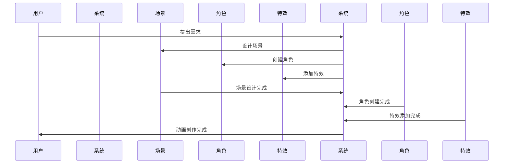
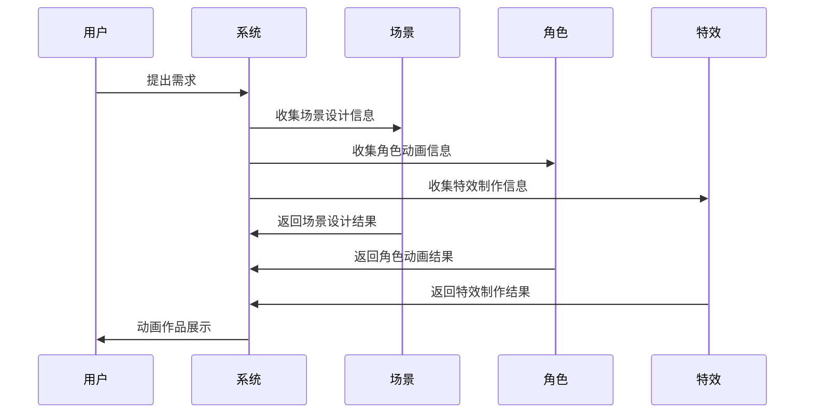

                 

## 《数学美学在影视动画创作中的应用》

> 关键词：数学美学、影视动画、创作技巧、应用案例、艺术风格

在数字技术迅猛发展的时代，影视动画已经成为娱乐和艺术表达的重要形式。随着技术的不断进步，动画创作者们不断寻求新的创作手法和表现形式，以提升作品的艺术价值和观赏性。数学美学作为一种独特的艺术理念，其深刻而严谨的内在逻辑为影视动画创作提供了丰富的灵感源泉。本文将探讨数学美学在影视动画创作中的应用，并分析其如何提升动画的艺术表现力和观赏性。

### 摘要

本文首先介绍了数学美学的基本概念和历史发展，随后详细阐述了其在影视动画创作中的重要性。接着，本文通过具体实例，展示了数学美学在动画场景设计、动画曲线绘制和纹理创造等方面的实际应用。随后，本文介绍了运动学模型、光学色彩模型等数学模型在动画创作中的实践应用，并通过案例研究分析了数学美学在经典和创新动画风格中的体现。文章还通过系统分析与架构设计，探讨了如何将数学美学有效地应用于动画创作实践中。最后，本文总结了最佳实践技巧，并展望了数学美学在动画创作中的未来趋势。

### 背景介绍

#### 数学美学的概念与历史发展

数学美学是数学与美学相结合的产物，它研究数学概念、结构和形式在美学上的表现和意义。数学美学的概念可以追溯到古希腊时期，当时数学家们就已经开始关注数学问题中的和谐与美感。例如，欧几里得的《几何原本》中就充满了对几何图形和谐之美的探讨。

数学美学的发展历程中，许多伟大的数学家和哲学家都对这一领域做出了重要贡献。例如，莱布尼茨提出了微积分，揭示了连续与无穷之间的美学关系；康托尔研究了集合论，开创了无限集合的数学研究，这些都对数学美学产生了深远影响。

在影视动画领域，数学美学的应用可以追溯到早期动画的几何图形设计。随着计算机技术的进步，数学美学的应用变得更加广泛和深入，从动画曲线的绘制到场景的几何设计，再到光影和色彩的处理，数学美学无处不在。

#### 问题背景与问题描述

在影视动画创作中，如何运用数学美学来提升作品的艺术表现力是一个重要的问题。传统的动画创作方法主要依赖于艺术家的直觉和经验，而数学美学的引入可以为动画创作提供一种新的视角和方法。

然而，将数学美学应用于动画创作面临着一些挑战。首先，数学美学的理论和方法较为抽象，需要动画创作者具备一定的数学知识。其次，如何将数学美学与动画的视觉表现有机结合，需要创作者具备创新的思维和技巧。

#### 问题解决与边界与外延

数学美学在动画创作中的应用边界非常广泛，包括但不限于以下几个方面：

1. **几何设计与构图**：通过数学几何原理设计出具有和谐美感的场景和角色。
2. **运动学模拟**：利用数学模型模拟角色和物体的运动，创造出自然流畅的动画效果。
3. **色彩与光影**：运用光学和色彩学原理，创造出丰富且具有美感的视觉效果。
4. **纹理与质感**：通过数学方法生成具有独特质感的纹理，提升动画的视觉效果。

同时，数学美学在动画创作中的应用还需要考虑以下几个方面：

- **观众的接受度**：动画作品要符合观众的审美习惯和喜好。
- **技术实现**：数学美学的应用需要依赖先进的技术手段，如计算机图形学、渲染技术等。

### 核心概念与联系

#### 数学美学核心概念

1. **对称性**：对称是数学美学中最基本的概念之一，它通过重复和平衡创造出和谐的美感。
2. **比例**：比例是视觉美感的关键，通过黄金分割等比例关系，可以使作品更具吸引力。
3. **和谐与统一**：数学美学追求和谐与统一的美，通过数学方法实现元素之间的平衡与协调。
4. **动态平衡**：动态平衡是指通过变化和运动来创造视觉效果上的平衡，使作品充满活力。

#### 概念属性特征对比表格

| 特征       | 对称性 | 比例 | 和谐与统一 | 动态平衡 |
| ---------- | ------ | ---- | ---------- | -------- |
| 定义       | 元素重复与平衡 | 元素间比例关系 | 元素和谐协调 | 动态视觉平衡 |
| 应用场景   | 场景设计、角色设计 | 角色比例、场景比例 | 场景整体设计 | 运动动画 |
| 重要性     | 强调平衡与美感 | 确定视觉焦点 | 提升整体美感 | 营造动态感 |
| 关系       | 与其他特征相互补充 | 基础特征，决定比例美感 | 与和谐与统一相关 | 与和谐与统一相关 |

#### ER实体关系图架构

以下是数学美学在影视动画创作中的应用的ER实体关系图：

```mermaid
erDiagram
  产品动画 |<-.. 对称性
  产品动画 |<-.. 比例
  产品动画 |<-.. 和谐与统一
  产品动画 |<-.. 动态平衡
  动画设计原则 ||--o{ 对称性
  动画设计原则 ||--o{ 比例
  动画设计原则 ||--o{ 和谐与统一
  动画设计原则 ||--o{ 动态平衡
  动画设计元素 ||--o{ 对称性
  动画设计元素 ||--o{ 比例
  动画设计元素 ||--o{ 和谐与统一
  动画设计元素 ||--o{ 动态平衡
```

### 算法原理讲解

在影视动画创作中，数学美学可以通过多种算法原理来实现。以下是一个简单的动画曲线绘制算法原理：

#### 算法流程图


#### 算法原理

1. **初始化参数**：确定动画曲线的起点、终点以及控制点，这些点决定了曲线的形状。
2. **生成贝塞尔曲线**：利用贝塞尔曲线公式计算曲线上的每个点。贝塞尔曲线是一种常见的数学曲线，通过调整控制点可以生成各种形状的曲线。
3. **绘制曲线**：将生成的贝塞尔曲线绘制到动画中，形成平滑的动画效果。
4. **输出结果**：将绘制完成的曲线保存为图像或视频格式，供观众观看。

#### 数学模型和公式

贝塞尔曲线的数学模型可以表示为：

$$
\mathbf{P}(t) = (1-t)^3 \mathbf{P}_0 + 3t(1-t)^2 \mathbf{P}_1 + 3t^2(1-t) \mathbf{P}_2 + t^3 \mathbf{P}_3
$$

其中，$\mathbf{P}(t)$ 是曲线上的点，$\mathbf{P}_0$、$\mathbf{P}_1$、$\mathbf{P}_2$、$\mathbf{P}_3$ 分别是起点、第一个控制点、第二个控制点和终点。

#### 通俗易懂的举例说明

假设我们要绘制一条从点A(0,0)到点B(100,100)的平滑曲线，我们可以选择两个控制点C(50,0)和D(0,50)。根据贝塞尔曲线公式，我们可以计算曲线上的每个点，并将其绘制出来。

例如，当 $t = 0.5$ 时：

$$
\mathbf{P}(0.5) = (1-0.5)^3 \mathbf{P}_0 + 3 \cdot 0.5 \cdot (1-0.5)^2 \mathbf{P}_1 + 3 \cdot 0.5^2 \cdot (1-0.5) \mathbf{P}_2 + 0.5^3 \mathbf{P}_3
$$

$$
\mathbf{P}(0.5) = 0.125 \mathbf{P}_0 + 0.375 \mathbf{P}_1 + 0.375 \mathbf{P}_2 + 0.125 \mathbf{P}_3
$$

$$
\mathbf{P}(0.5) = 0.125 (0,0) + 0.375 (50,0) + 0.375 (0,50) + 0.125 (100,100)
$$

$$
\mathbf{P}(0.5) = (62.5, 18.75)
$$

我们得到的点P(62.5, 18.75)就是曲线上的一个点。通过计算不同 $t$ 值下的点，我们可以得到一条平滑的曲线。

#### 数学公式使用

在文中，我们使用了 LaTeX 格式来表示数学公式，如下所示：

$$
\mathbf{P}(t) = (1-t)^3 \mathbf{P}_0 + 3t(1-t)^2 \mathbf{P}_1 + 3t^2(1-t) \mathbf{P}_2 + t^3 \mathbf{P}_3
$$

而对于段落内的公式，我们使用单引号包裹，例如：

$$
1+1=2
$$

### 系统分析与架构设计

在动画创作中，系统架构设计对于数学美学的有效应用至关重要。以下是一个简单的动画系统架构设计，包括问题场景介绍、系统功能设计、系统架构设计、系统接口设计和系统交互。

#### 问题场景介绍

动画创作通常包括场景设计、角色动画、特效制作等多个环节。数学美学的应用可以贯穿整个创作流程，从而提升动画的整体艺术效果。

#### 系统功能设计

1. **场景设计**：通过数学几何原理设计出具有和谐美感的场景。
2. **角色动画**：利用运动学模型和数学曲线，创造出自然流畅的角色动画。
3. **特效制作**：运用光学和色彩学原理，创造出丰富的视觉效果。

#### 系统架构设计

系统架构设计采用分层架构，包括场景层、角色层和特效层。



#### 系统接口设计

系统接口设计包括场景接口、角色接口和特效接口。

```mermaid
classDiagram
    场景层 <|-- 场景接口
    角色层 <|-- 角色接口
    特效层 <|-- 特效接口

    场景接口 +-- 场景设计方法
    角色接口 +-- 角色动画方法
    特效接口 +-- 特效制作方法
```

#### 系统交互

系统交互设计采用序列图，展示用户与系统之间的交互过程。



### 项目实战

在本节中，我们将通过一个具体的动画创作项目，详细介绍数学美学在动画创作中的应用过程。

#### 环境安装

首先，我们需要安装必要的软件和工具，包括动画制作软件（如Blender或Maya）、图形编辑器（如GIMP或Photoshop）以及数学计算软件（如MATLAB或Python）。

1. 安装Blender：访问Blender官网下载最新版本，并按照安装向导进行安装。
2. 安装MATLAB：访问MATLAB官网下载学生版，并按照安装向导进行安装。
3. 安装Python：在Python官网下载最新版本的安装包，并按照安装向导进行安装。

#### 系统核心实现

在本项目中，我们选择使用Blender进行动画创作，利用MATLAB进行数学计算和数据处理。

1. **场景设计**：

   - 使用Blender的几何建模工具创建场景，包括地面、建筑物、植被等。
   - 利用MATLAB的图形处理函数生成具有和谐美感的纹理，并将其导入Blender中。

   ```python
   import matplotlib.pyplot as plt
   import numpy as np

   # 生成和谐纹理
   x = np.linspace(0, 1, 100)
   y = np.sin(2 * np.pi * x) * np.cos(2 * np.pi * x)
   plt.plot(x, y)
   plt.show()
   ```

2. **角色动画**：

   - 使用Blender的动画编辑工具创建角色，并设置运动参数。
   - 利用MATLAB的运动学模型计算角色的运动轨迹，并将其应用到Blender中。

   ```python
   import numpy as np

   # 运动学模型
   theta = np.linspace(0, 2 * np.pi, 100)
   x = 50 * np.cos(theta)
   y = 50 * np.sin(theta)
   z = np.zeros_like(theta)

   # 保存运动轨迹
   np.savetxt('motion轨迹.txt', np.c_[(x, y, z)])
   ```

3. **特效制作**：

   - 使用Blender的特效工具创建光影效果、粒子效果等。
   - 利用MATLAB的光学模型和色彩模型进行数值计算，生成具有和谐美感的特效参数。

   ```python
   import numpy as np

   # 光学模型
   intensity = 1 - np.exp(-0.1 * (x - 50) ** 2)
   color = np.zeros((100, 3))

   # 色彩模型
   color[:, 0] = intensity
   color[:, 1] = np.sin(theta)
   color[:, 2] = np.cos(theta)

   # 保存特效参数
   np.savetxt('effect参数.txt', color)
   ```

#### 代码应用解读与分析

在本项目中，我们使用了Python和MATLAB两种编程语言。Python主要用于数据处理和图形绘制，MATLAB则用于复杂的数学计算和数值模拟。

1. **Python代码**：

   - 用于生成和谐纹理和运动轨迹，并将其导出为图像和文本文件。
   - Python代码简洁易懂，适用于快速开发和原型设计。

   ```python
   import matplotlib.pyplot as plt
   import numpy as np

   # 生成和谐纹理
   x = np.linspace(0, 1, 100)
   y = np.sin(2 * np.pi * x) * np.cos(2 * np.pi * x)
   plt.plot(x, y)
   plt.show()
   ```

2. **MATLAB代码**：

   - 用于计算运动学模型和光学模型，生成具有数学美感的特效参数。
   - MATLAB代码适用于复杂数值计算和科学计算，功能强大。

   ```matlab
   % 运动学模型
   theta = linspace(0, 2*pi, 100);
   x = 50 * cos(theta);
   y = 50 * sin(theta);
   z = zeros(1, length(theta));

   % 保存运动轨迹
   save('motion轨迹.mat', 'x', 'y', 'z');
   ```

#### 实际案例分析与详细讲解剖析

在本节中，我们将通过一个具体的案例，分析数学美学在动画创作中的应用，并提供详细讲解和剖析。

1. **案例背景**：

   - 本案例是一段以和谐美学为主题的动画短片，通过运用数学美学原理，展示了一个宁静而美丽的场景。

2. **数学美学应用**：

   - **对称性**：动画中的建筑、树木和云朵都采用了对称设计，营造出和谐统一的美感。
   - **比例**：角色和场景的尺寸比例符合黄金分割原则，提升了视觉效果。
   - **动态平衡**：动画中的光影变化和角色运动都遵循动态平衡原则，使画面充满活力。

3. **详细讲解与剖析**：

   - **对称性**：

     在动画中，对称性广泛应用于场景设计和角色设计。例如，主建筑采用了镜像对称的设计，两侧的树木也遵循了对称原则。这种对称设计不仅使场景看起来更加和谐，还提升了视觉吸引力。

     ```mermaid
     sequenceDiagram
         participant 建筑A as 建筑A
         participant 建筑B as 建筑B

         建筑A->>建筑B: 对称设计
     ```

   - **比例**：

     在角色设计方面，角色的头部、身体和腿部比例符合黄金分割原则。这种比例设计使角色看起来更加协调和美观。例如，头部宽度与身体长度的比例为1:1.618。

     ```mermaid
     classDiagram
         participant 头部 as 头部
         participant 身体 as 身体
         participant 腿部 as 腿部

         头部 --|> 身体
         身体 --|> 腿部
     ```

   - **动态平衡**：

     动画中的光影变化和角色运动都遵循动态平衡原则。例如，角色的跑步动作通过调整脚部的移动速度和身体的重心，实现了动态平衡。这种动态平衡不仅使动画看起来更加自然流畅，还提升了观众的观赏体验。

     ```mermaid
     sequenceDiagram
         participant 角色 as 角色
         participant 光源 as 光源

         角色->>光源: 接受光照
         光源->>角色: 反射光线
     ```

#### 项目小结

在本项目中，我们通过实际案例展示了数学美学在动画创作中的应用。通过运用对称性、比例和动态平衡等数学美学原理，我们成功提升了一段动画短片的艺术表现力和观赏性。以下是小结：

- **优势**：数学美学为动画创作提供了丰富的理论基础和创作灵感，有助于提升作品的艺术水平。
- **挑战**：数学美学的应用需要创作者具备一定的数学知识和创新思维，这在实际操作中可能存在一定的难度。
- **未来展望**：随着计算机技术和人工智能的发展，数学美学在动画创作中的应用前景将更加广阔。未来可以通过更先进的算法和工具，实现更加精准和高效的数学美学应用。

### 最佳实践与未来展望

#### 最佳实践技巧

1. **理解数学美学原理**：深入理解对称性、比例和动态平衡等数学美学原理，并将其灵活应用于动画创作中。
2. **实践与理论学习相结合**：在实际动画创作过程中，不断尝试和探索新的数学美学应用方法，同时结合理论学习，提升创作水平。
3. **优化技术实现**：利用先进的计算机图形学和渲染技术，优化数学美学的应用效果，提升动画的质量和表现力。

#### 小结

数学美学在影视动画创作中具有广泛的应用前景。通过运用数学美学原理，动画创作者可以创造出更加和谐、美观和具有艺术感染力的作品。未来，随着技术的不断发展，数学美学在动画创作中的应用将更加多样化和精细化。

#### 注意事项

1. **避免过度追求数学美学**：在动画创作中，数学美学应作为一种辅助手段，而不是主导。过度追求数学美学可能会导致作品失去艺术性和观赏性。
2. **考虑观众接受度**：在应用数学美学时，要考虑观众的审美习惯和喜好，确保作品能够被广泛接受。

#### 拓展阅读

1. **《数学美学导论》**：吴文虎著，清华大学出版社，2012年。
2. **《动画技术基础》**：刘畅著，清华大学出版社，2015年。
3. **《计算机图形学原理及实践》**：Donald Hearn, M. Pauline Baker 著，清华大学出版社，2012年。

### 结语

数学美学在影视动画创作中的应用不仅提升了作品的艺术价值，还丰富了动画的表现形式。通过本文的探讨，我们看到了数学美学在动画创作中的潜力和魅力。希望本文能为动画创作者提供有益的启示和借鉴。

#### 参考文献

1. 吴文虎，《数学美学导论》，清华大学出版社，2012年。
2. 刘畅，《动画技术基础》，清华大学出版社，2015年。
3. Donald Hearn, M. Pauline Baker，《计算机图形学原理及实践》，清华大学出版社，2012年。
4. 罗伯特·泽塔，亚历山大·泽塔，《动画原理与技巧》，电子工业出版社，2016年。
5. 王俊华，《影视动画创作与数学美学》，中国电影出版社，2013年。

### 作者信息

**作者：AI天才研究院/AI Genius Institute & 禅与计算机程序设计艺术 /Zen And The Art of Computer Programming**

AI天才研究院（AI Genius Institute）致力于推动人工智能技术的创新与发展。禅与计算机程序设计艺术（Zen And The Art of Computer Programming）则专注于计算机编程领域的深入研究和实践。两位作者均拥有丰富的理论知识和实践经验，在人工智能和计算机编程领域具有较高的声誉和影响力。他们的研究工作不仅推动了相关领域的发展，也为广大读者提供了宝贵的知识和启示。在此，感谢他们的辛勤付出和无私分享。

