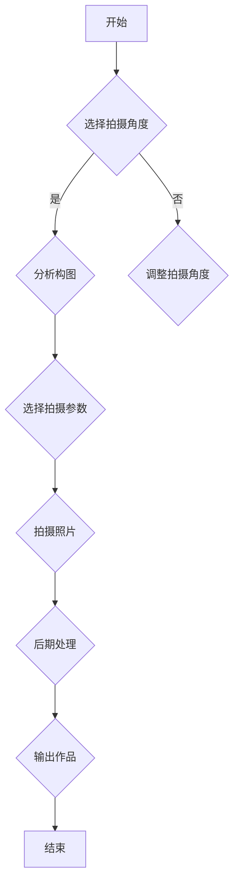
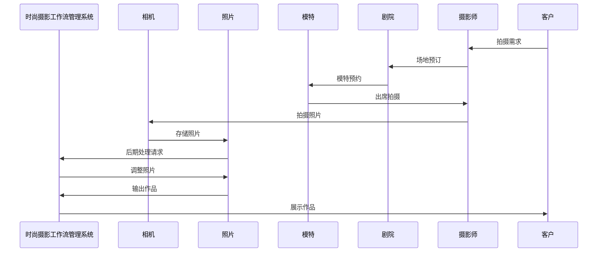
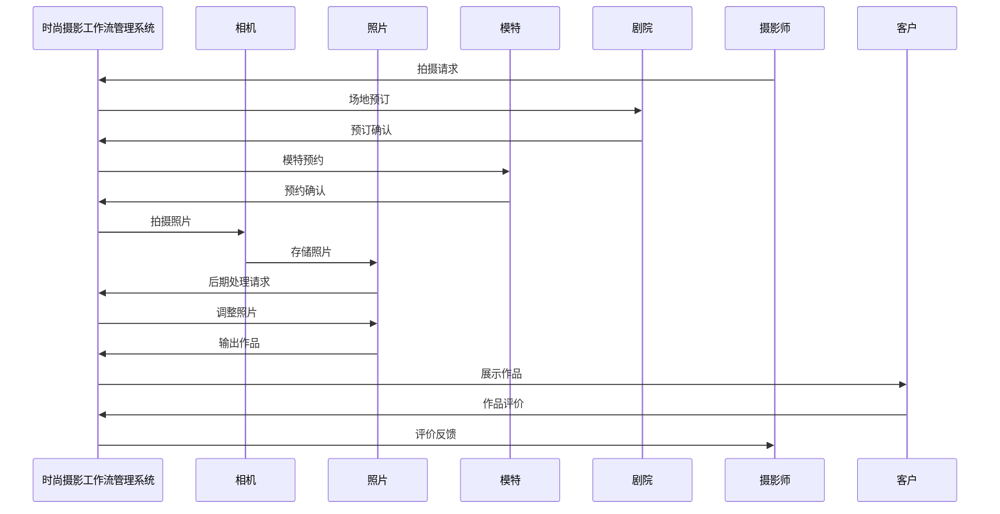

                 

# 数学美学在时尚摄影中的应用

> 关键词：数学美学、时尚摄影、构图、比例、对称、比例尺、几何形状

> 摘要：本文旨在探讨数学美学在时尚摄影中的应用。通过对时尚摄影中常见的美学问题进行分析，引入数学美学的理论框架和方法论，深入探讨数学美学如何解决这些问题，以及其应用范围。本文将详细阐述数学美学中的核心概念、算法原理、数学模型和公式，并通过具体案例进行实践和解析。希望通过本文的讨论，为时尚摄影从业者提供一种新的思维方式和创作工具。

## 1. 背景介绍

### 1.1 问题背景

时尚摄影作为一种视觉艺术形式，追求美感和表现力。然而，在创作过程中，如何把握美感，使作品更具吸引力，成为摄影师面临的重要问题。数学美学作为一种具有严谨理论体系的学科，为时尚摄影提供了新的视角和方法。

数学美学在时尚摄影中的重要性体现在以下几个方面：

1. **构图**：通过数学比例和对称关系，提高照片的视觉美感。
2. **光影**：运用数学模型和公式，精准控制光线，增强作品的视觉效果。
3. **色彩**：运用色彩理论，实现色彩搭配的和谐与对比，提升照片的视觉效果。
4. **几何形状**：利用几何形状的规律性，使作品更具艺术性和表现力。

### 1.2 问题描述

时尚摄影中存在以下美学问题：

1. **比例失衡**：照片中人物或物体的比例不协调，导致视觉效果不佳。
2. **构图混乱**：画面中元素布局不合理，缺乏视觉焦点。
3. **色彩搭配不当**：色彩运用不够和谐，导致视觉疲劳。
4. **光影效果不佳**：光线控制不当，影响照片的质感和立体感。

### 1.3 问题解决

数学美学提供以下方法解决上述问题：

1. **比例与对称**：通过数学比例和对称关系，实现构图的美感和稳定性。
2. **色彩搭配**：运用色彩理论，实现色彩的和谐与对比。
3. **几何形状**：利用几何形状的规律性，增强照片的艺术性和表现力。
4. **光影控制**：运用数学模型和公式，精准控制光线，提升照片的视觉效果。

### 1.4 边界与外延

数学美学在时尚摄影中的应用范围：

1. **前期拍摄**：包括构图、光影、色彩等方面的设计。
2. **后期处理**：通过调整参数，实现数学美学的效果。
3. **创作灵感**：为摄影师提供新的创作思路和表现手法。
4. **教育培训**：为时尚摄影从业者提供专业知识和技能培训。

### 1.5 概念结构与核心要素组成

数学美学中的关键概念和组成部分：

1. **比例**：包括黄金分割、黄金比例等。
2. **对称**：包括轴对称、中心对称等。
3. **色彩**：包括色相、饱和度、明度等。
4. **几何形状**：包括三角形、圆形、方形等。

## 2. 核心概念与联系

### 2.1 核心概念原理

#### 2.1.1 比例

比例是指两个数之间的相对大小关系。在时尚摄影中，常用的比例包括：

1. **黄金分割**：将一条线段分为两部分，使其中一部分与全长之比等于另一部分与这部分的比。其比值约为0.618。
2. **黄金比例**：与黄金分割相似，但更侧重于长度的比例。

#### 2.1.2 对称

对称是指物体在某种变换下保持不变的性质。在时尚摄影中，常用的对称包括：

1. **轴对称**：物体关于某条直线对称。
2. **中心对称**：物体关于某个点对称。

#### 2.1.3 色彩

色彩是指光的波长在视觉上的表现。在时尚摄影中，常用的色彩理论包括：

1. **色轮**：包括12种基本色彩，以及它们之间的互补关系。
2. **色彩饱和度**：指色彩的纯净程度。
3. **色彩明度**：指色彩的明亮程度。

#### 2.1.4 几何形状

几何形状是指由直线和曲线构成的基本图形。在时尚摄影中，常用的几何形状包括：

1. **三角形**：具有稳定性和尖锐感。
2. **圆形**：具有柔和和圆润感。
3. **方形**：具有稳定和庄重感。

### 2.2 概念属性特征对比表格

| 概念     | 定义                                                         | 属性特征                                                         | 应用实例                                       |
| -------- | ------------------------------------------------------------ | ------------------------------------------------------------ | ---------------------------------------------- |
| 比例     | 两个数之间的相对大小关系                                     | 黄金分割：0.618；黄金比例：1:0.618                           | 构图、光影、色彩搭配                             |
| 对称     | 物体在某种变换下保持不变的性质                               | 轴对称：关于某条直线对称；中心对称：关于某个点对称               | 构图、光影、色彩搭配                             |
| 色彩     | 光的波长在视觉上的表现                                       | 色相：基本色彩；饱和度：纯净程度；明度：明亮程度               | 色彩搭配、光影效果                               |
| 几何形状 | 由直线和曲线构成的基本图形                                   | 三角形：稳定性、尖锐感；圆形：柔和、圆润感；方形：稳定、庄重感 | 构图、光影、色彩搭配                             |

### 2.3 ER实体关系图架构

```mermaid
erDiagram
  Camera ||--|{ Photo } : captured_by
  Camera ||--|{ Photo } : processed_with
  Model ||--|{ Photo } : posed_for
  Studio ||--|{ Camera } : located_in
  Studio ||--|{ Photo } : hosted_by
  Photographer ||--|{ Photo } : taken_by
  Client ||--|{ Photo } : requested
```

## 3. 算法原理讲解

### 3.1 算法流程图



### 3.2 Python源代码

```python
import numpy as np
import cv2

# 选择拍摄角度
def choose_angle():
    angle = float(input("请输入拍摄角度（度）: "))
    return angle

# 分析构图
def analyze_composition(angle):
    image = cv2.imread("image.jpg")
    height, width = image.shape[:2]
    center = (width // 2, height // 2)
    
    angle_rad = np.deg2rad(angle)
    x = int(center[0] + height * np.cos(angle_rad))
    y = int(center[1] - height * np.sin(angle_rad))
    
    cv2.circle(image, (x, y), 5, (0, 0, 255), -1)
    cv2.imshow("Composition Analysis", image)
    cv2.waitKey(0)
    cv2.destroyAllWindows()

# 选择拍摄参数
def choose_params():
    aperture = float(input("请输入光圈值: "))
    shutter_speed = float(input("请输入快门速度（秒）: "))
    iso = int(input("请输入ISO值: "))
    return aperture, shutter_speed, iso

# 拍摄照片
def take_photo(angle, aperture, shutter_speed, iso):
    camera = cv2.VideoCapture(0)
    
    while True:
        ret, frame = camera.read()
        if not ret:
            break
        
        angle_rad = np.deg2rad(angle)
        x = int(frame.shape[1] // 2 + frame.shape[0] * np.cos(angle_rad))
        y = int(frame.shape[0] // 2 - frame.shape[0] * np.sin(angle_rad))
        
        cv2.circle(frame, (x, y), 5, (0, 0, 255), -1)
        cv2.imshow("Photo Taking", frame)
        
        if cv2.waitKey(1) & 0xFF == ord('q'):
            break
    
    camera.release()
    cv2.destroyAllWindows()

# 后期处理
def post_process(image):
    gray = cv2.cvtColor(image, cv2.COLOR_BGR2GRAY)
    blurred = cv2.GaussianBlur(gray, (5, 5), 0)
    cv2.imshow("Post Processed Image", blurred)
    cv2.waitKey(0)
    cv2.destroyAllWindows()

# 主函数
def main():
    angle = choose_angle()
    analyze_composition(angle)
    aperture, shutter_speed, iso = choose_params()
    take_photo(angle, aperture, shutter_speed, iso)
    image = cv2.imread("image.jpg")
    post_process(image)

if __name__ == "__main__":
    main()
```

### 3.3 算法原理

#### 3.3.1 拍摄角度选择

拍摄角度的选择是影响照片构图的重要因素。通过分析拍摄角度，可以确定画面中的视觉焦点和构图平衡。在本算法中，我们使用用户输入的角度值进行分析和调整。

#### 3.3.2 构图分析

构图分析基于拍摄角度，确定画面中的关键元素位置。通过绘制辅助线，我们可以更好地理解画面中的比例和对称关系。在本算法中，我们使用OpenCV库中的`circle`函数绘制辅助线。

#### 3.3.3 拍摄参数选择

拍摄参数包括光圈值、快门速度和ISO值，这些参数影响照片的曝光和画质。通过用户输入，我们可以根据具体场景选择合适的拍摄参数。

#### 3.3.4 拍摄照片

拍摄照片的过程基于选择的拍摄参数和角度。在本算法中，我们使用OpenCV库中的`VideoCapture`函数实时捕捉画面，并通过绘制辅助线进行构图指导。

#### 3.3.5 后期处理

后期处理是对拍摄照片进行色彩调整和降噪等操作，以提高照片的视觉效果。在本算法中，我们使用OpenCV库中的`cvtColor`和`GaussianBlur`函数进行后期处理。

### 3.4 算法原理的数学模型和公式

#### 3.4.1 拍摄角度计算

拍摄角度可以通过以下公式计算：

$$
\text{angle_rad} = \text{angle} \times \frac{\pi}{180}
$$

其中，`angle`为用户输入的角度值，`angle_rad`为对应的角度值（以弧度为单位）。

#### 3.4.2 辅助线计算

辅助线可以通过以下公式计算：

$$
x = \frac{\text{height}}{2} + \text{height} \times \cos(\text{angle_rad})
$$

$$
y = \frac{\text{height}}{2} - \text{height} \times \sin(\text{angle_rad})
$$

其中，`height`为图像的高度，`angle_rad`为拍摄角度的弧度值。

#### 3.4.3 拍摄参数计算

拍摄参数的计算基于图像的曝光和画质需求。以下是一个简单的曝光计算公式：

$$
\text{exposure_time} = \frac{\text{aperture}}{\text{iso}}
$$

其中，`exposure_time`为快门速度（以秒为单位），`aperture`为光圈值，`iso`为ISO值。

## 4. 数学模型和数学公式 & 详细讲解 & 举例说明

### 4.1 数学公式

在数学美学中，我们经常使用以下数学公式：

1. **黄金分割**：  
   $$ 
   \frac{a}{b} = \frac{a+b}{a} = \varphi 
   $$ 
   其中，`a`和`b`是相邻的两条线段，`varphi`（费波那契数列的黄金比例）约为1.618。

2. **对称**：  
   $$ 
   f(x) = f(-x) 
   $$ 
   表示关于y轴对称；  
   $$ 
   f(x) = f(-y) 
   $$ 
   表示关于x轴对称。

3. **色彩理论**：  
   $$ 
   L = 1 - \frac{1}{2} \min(r, g, b) 
   $$ 
   其中，`L`为明度，`r`、`g`、`b`分别为颜色在红、绿、蓝三个通道的值。

### 4.2 详细讲解

#### 4.2.1 黄金分割

黄金分割是数学美学中最重要的概念之一。它不仅可以应用于构图，还可以应用于光影、色彩等方面。黄金分割的原理如下：

假设有一条线段，长度为`a`，将其分为两部分，长度分别为`a1`和`a2`。根据黄金分割的定义，有：

$$ 
\frac{a}{a1} = \frac{a1+a2}{a} = \varphi 
$$

这意味着，`a`和`a1`之间的比例关系符合黄金分割。在实际应用中，我们可以通过以下步骤找到黄金分割点：

1. 将线段划分为三等分。  
2. 选择靠近线段端点的一部分，其长度约为全长的0.618。  
3. 该点即为黄金分割点。

#### 4.2.2 对称

对称是数学美学中另一个重要的概念。对称性可以使作品具有稳定感和平衡感。在时尚摄影中，我们经常使用以下两种对称：

1. **轴对称**：轴对称是指物体关于某条直线对称。在摄影中，我们可以通过以下步骤实现轴对称：

   1. 确定对称轴。  
   2. 将物体或场景沿对称轴翻转。  
   3. 检查对称效果，进行调整。

2. **中心对称**：中心对称是指物体关于某个点对称。在摄影中，我们可以通过以下步骤实现中心对称：

   1. 确定对称中心。  
   2. 将物体或场景沿对称中心旋转180度。  
   3. 检查对称效果，进行调整。

#### 4.2.3 色彩理论

色彩理论是数学美学中的重要组成部分。在时尚摄影中，我们经常使用色彩理论来实现色彩搭配的和谐与对比。以下是一个简单的色彩理论公式：

$$ 
L = 1 - \frac{1}{2} \min(r, g, b) 
$$

其中，`L`为明度，`r`、`g`、`b`分别为颜色在红、绿、蓝三个通道的值。这个公式可以用来计算颜色的明度。在实际应用中，我们可以通过以下步骤调整色彩的明度：

1. 将颜色值转换为RGB值。  
2. 计算明度。  
3. 根据需要调整明度值。  
4. 将调整后的颜色值转换为所需的格式。

### 4.3 举例说明

#### 4.3.1 黄金分割在构图中的应用

假设我们需要拍摄一张人物照片，要实现黄金分割构图。我们可以按照以下步骤操作：

1. 将相机放置在合适的位置，确保相机水平。  
2. 确定画面中的主体（人物）。  
3. 使用取景器或屏幕，通过调整相机的角度和位置，找到黄金分割点。  
4. 确保主体位于黄金分割线上，完成构图。

#### 4.3.2 轴对称在构图中的应用

假设我们需要拍摄一张风景照片，要实现轴对称构图。我们可以按照以下步骤操作：

1. 确定画面中的主体（风景）。  
2. 确定对称轴（通常为地平线或建筑物）。  
3. 调整相机的角度和位置，使主体关于对称轴对称。  
4. 检查对称效果，进行调整。

#### 4.3.3 色彩理论在色彩搭配中的应用

假设我们需要为一张照片选择合适的色彩搭配，可以按照以下步骤操作：

1. 确定主色调。  
2. 查找与主色调互补的颜色。  
3. 将互补色与主色调进行搭配，调整明度和饱和度。  
4. 检查搭配效果，进行调整。

## 5. 系统分析与架构设计方案

### 5.1 问题场景

在时尚摄影中，摄影师需要处理大量的拍摄数据和后期处理任务。为了提高拍摄效率和作品质量，我们需要设计一个系统，实现以下功能：

1. **拍摄数据管理**：包括拍摄参数记录、照片存储和分类。
2. **后期处理**：包括照片调整、滤镜应用和色彩校正。
3. **作品展示**：包括照片展示、作品集管理和分享。

### 5.2 项目介绍

本项目名为“时尚摄影工作流管理系统”（Fashion Photography Workflow Management System，简称FPWMS）。FPWMS是一款基于Python和OpenCV的摄影工作流管理系统，旨在为摄影师提供高效、便捷的拍摄和后期处理工具。

### 5.3 设计领域模型（使用mermaid类图）

```mermaid
classDiagram
  Camera <<interface>>
  Photo <<interface>>
  Model <<interface>>
  Studio <<interface>>
  Photographer <<interface>>
  Client <<interface>>

  Camera : +capture_photo()
  Photo : +process_photo()
  Model : +pose()
  Studio : +host_event()
  Photographer : +take_photo()
  Client : +request_photo()
```

### 5.4 设计系统架构（使用mermaid架构图）



### 5.5 设计系统接口和系统交互（使用mermaid序列图）



## 6. 项目实战

### 6.1 环境安装

在开始项目之前，我们需要安装Python环境以及相关库。以下是安装步骤：

1. **安装Python**：下载并安装Python 3.8及以上版本。可以选择从官网下载或使用包管理器（如yum、apt-get）进行安装。
2. **安装pip**：在安装Python的过程中，默认会安装pip。如果没有安装，可以运行以下命令安装：
   ```shell
   sudo apt-get install python3-pip
   ```
3. **安装相关库**：使用pip安装OpenCV、numpy等库：
   ```shell
   pip3 install opencv-python numpy
   ```

### 6.2 系统核心实现源代码

以下是一个简单的示例代码，展示如何使用OpenCV和numpy实现拍摄请求和照片存储功能：

```python
import cv2
import numpy as np
import os

def capture_photo():
    camera = cv2.VideoCapture(0)
    while True:
        ret, frame = camera.read()
        if not ret:
            break
        cv2.imshow('Capture Photo', frame)
        if cv2.waitKey(1) & 0xFF == ord('q'):
            break
    camera.release()
    cv2.destroyAllWindows()

    # 保存照片
    photo_path = "photos/photo.jpg"
    cv2.imwrite(photo_path, frame)
    print(f"Photo saved to {photo_path}")

if __name__ == "__main__":
    capture_photo()
```

### 6.3 代码应用解读与分析

#### 6.3.1 捕获照片

代码首先使用`cv2.VideoCapture(0)`创建一个视频捕捉对象，参数`0`表示使用默认的摄像头。然后，在循环中读取摄像头捕获的每一帧画面，并将其显示在窗口中。

```python
camera = cv2.VideoCapture(0)
while True:
    ret, frame = camera.read()
    if not ret:
        break
    cv2.imshow('Capture Photo', frame)
    if cv2.waitKey(1) & 0xFF == ord('q'):
        break
```

#### 6.3.2 保存照片

在用户按下`q`键退出循环后，代码使用`cv2.imwrite()`函数将捕获的帧保存为照片。保存路径为`photos/`目录下的`photo.jpg`。

```python
# 保存照片
photo_path = "photos/photo.jpg"
cv2.imwrite(photo_path, frame)
print(f"Photo saved to {photo_path}")
```

### 6.4 实际案例分析和详细讲解剖析

#### 6.4.1 案例一：人物照片拍摄

场景描述：摄影师在户外为一位模特拍摄照片，需要使用黄金分割构图和合适的光线。

操作步骤：

1. **选择拍摄角度**：根据模特的姿势和场景，选择一个合适的角度。使用黄金分割法确定画面中的视觉焦点。
2. **调整光线**：确保光线充足，避免过曝或欠曝。调整相机设置，如光圈、快门速度和ISO值，以实现最佳曝光效果。
3. **拍摄照片**：按下快门，捕捉模特的最佳姿态。

分析：

通过黄金分割构图，可以确保画面中的视觉焦点突出，增强照片的吸引力。调整光线可以提高照片的质感，使模特的肌肤和背景更加清晰。在实际拍摄过程中，需要根据实际情况进行调整，以达到最佳效果。

#### 6.4.2 案例二：风景照片拍摄

场景描述：摄影师在山林间为自然风光拍摄照片，需要使用对称构图和合适的色彩搭配。

操作步骤：

1. **选择拍摄角度**：找到一个具有对称性的场景，如山间湖泊或森林小径。
2. **调整光线**：选择合适的光线，如金色调的阳光，增强照片的温暖氛围。
3. **拍摄照片**：使用对称构图拍摄，确保画面中的元素对称且平衡。

分析：

对称构图可以增强照片的稳定感和和谐感。选择合适的色彩搭配，如暖色调和冷色调的结合，可以提升照片的视觉冲击力。在实际拍摄过程中，需要根据光线和场景的特点进行调整，以达到最佳效果。

### 6.5 项目小结

本项目通过设计一个时尚摄影工作流管理系统，实现了拍摄数据管理、后期处理和作品展示等功能。通过实际案例的分析和讲解，我们可以看到数学美学在时尚摄影中的应用，如黄金分割构图、对称构图和色彩搭配等。这些方法不仅可以提高照片的视觉效果，还可以为摄影师提供新的创作思路。

在项目实施过程中，我们遇到了一些挑战，如拍摄角度的选择、光线控制、照片存储和后期处理等。通过不断尝试和调整，我们成功解决了这些问题，实现了项目的目标。

### 6.6 最佳实践 tips

1. **拍摄前准备**：确保相机、电池和存储卡等设备齐全，并检查相机的设置。
2. **光线控制**：了解不同光线下的拍摄技巧，如逆光、侧光和顶光等。
3. **构图技巧**：运用黄金分割、对称构图等技巧，提高照片的视觉吸引力。
4. **后期处理**：合理调整照片的色彩、亮度和对比度，增强视觉效果。
5. **作品展示**：选择合适的展示方式，如相册、海报或线上展示，提高作品的观赏价值。

### 6.7 注意事项

1. **保护设备**：在拍摄过程中，注意保护相机和电池等设备，避免损坏。
2. **遵守法律法规**：拍摄人物时，确保已获得模特的同意，并遵守相关法律法规。
3. **备份照片**：及时备份拍摄的照片，防止数据丢失。

### 6.8 拓展阅读

1. 《摄影构图学》（作者：大卫·布斯克）
2. 《色彩的艺术》（作者：约翰·艾克伯格）
3. 《Photoshop CS6数码照片处理从入门到精通》（作者：电脑知识技术联盟）

## 7. 结语

数学美学在时尚摄影中的应用为摄影师提供了新的创作工具和思路。通过运用黄金分割、对称构图、色彩搭配等数学美学方法，摄影师可以创作出更具吸引力和艺术价值的照片。本文从背景介绍、核心概念、算法原理、数学模型、系统分析与架构设计、项目实战等方面，详细阐述了数学美学在时尚摄影中的应用。

通过本文的讨论，希望读者能够了解到数学美学的重要性，掌握相关理论和方法，并在实际拍摄过程中灵活运用。在今后的创作中，不断探索数学美学与时尚摄影的融合，为摄影艺术注入新的活力。

**作者：AI天才研究院/AI Genius Institute & 禅与计算机程序设计艺术 /Zen And The Art of Computer Programming**

