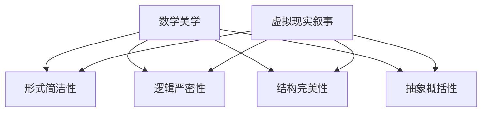
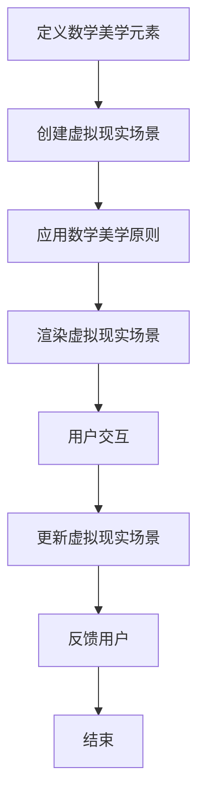
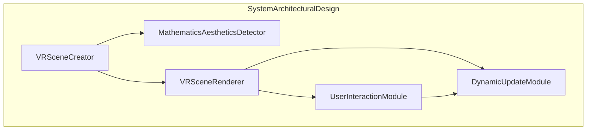
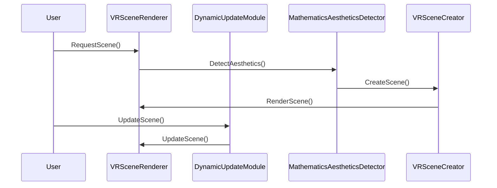
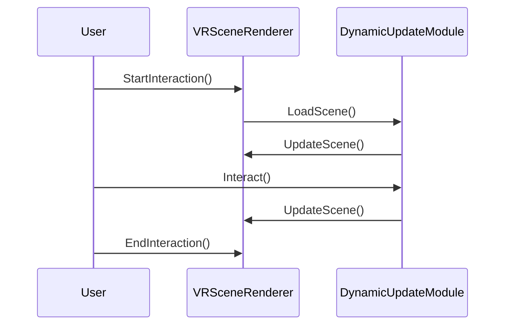

                 

# 数学美学在虚拟现实叙事中的应用

## 关键词

数学美学、虚拟现实、叙事、设计方法、创新探索

## 摘要

本文旨在探讨数学美学在虚拟现实叙事中的应用，通过对数学美学和虚拟现实的基本理论进行阐述，分析数学美学在虚拟现实叙事中的实际应用，并提出相关的设计方法和创新探索。文章分为七个章节，首先介绍数学美学和虚拟现实的基本概念及其在叙事中的应用背景，然后通过具体案例研究，总结数学美学在虚拟现实叙事中的设计方法，最后对未来的发展趋势进行展望。文章以逻辑清晰、结构紧凑、简单易懂的专业技术语言，为广大读者提供了一次深入了解数学美学在虚拟现实叙事中的应用的机会。

## 第1章：引言

### 1.1 问题背景

随着科技的快速发展，虚拟现实（VR）技术已经成为当前最具前景的领域之一。VR技术不仅改变了人们的生活方式和娱乐方式，也在各个行业中得到了广泛应用，如教育、医疗、军事、设计等。然而，VR技术不仅需要高度逼真的视觉、听觉效果，还需要具备深刻、引人入胜的叙事能力。如何通过VR技术实现高质量、引人入胜的叙事效果，成为当前研究的热点问题。

### 1.2 研究意义

数学美学作为一种具有独特美感和科学性的学科，其在虚拟现实叙事中的应用具有重要意义。一方面，数学美学的应用可以提升虚拟现实叙事的视觉效果和听觉效果，增强观众的沉浸感；另一方面，数学美学的应用可以为虚拟现实叙事提供丰富的叙事元素和叙事手法，提高叙事的深度和内涵。因此，探讨数学美学在虚拟现实叙事中的应用，对于提升虚拟现实叙事的质量和影响力具有重要意义。

### 1.3 研究方法

本文采用文献综述法和案例分析相结合的方法进行研究。首先，通过对数学美学和虚拟现实的基本理论进行梳理，分析其在叙事中的应用；然后，选取具有代表性的虚拟现实叙事案例，进行深入分析，总结数学美学在虚拟现实叙事中的设计方法；最后，对未来的发展趋势进行展望。

### 1.4 内容结构

本文共分为七个章节。第一章为引言，介绍研究背景、研究意义和研究方法；第二章为数学美学概述，介绍数学美学的基本概念、核心概念与联系及历史发展；第三章为虚拟现实叙事原理，介绍虚拟现实技术基础、虚拟现实叙事理论及其特点与优势；第四章为数学美学在虚拟现实叙事中的应用，分析数学美学在虚拟现实中的意义、实际应用案例及设计方法；第五章为虚拟现实叙事案例研究，选取具有代表性的案例进行深入分析；第六章为数学美学在虚拟现实叙事中的创新探索，探讨创新探索的方向、方法及案例；第七章为总结与展望，总结研究成果、存在问题与挑战及未来发展趋势。

## 第2章：数学美学概述

### 2.1 数学美学的概念

数学美学是研究数学中的美感和审美价值的学科。它将数学与艺术相结合，探索数学中的美感和审美特征。数学美学的核心是研究数学对象的美，包括数学形式、结构、对称性、简洁性等。

### 2.2 数学美学的核心概念与联系

数学美学的核心概念包括数学形式美、结构美、对称美、简洁美等。这些概念之间存在密切的联系，共同构成了数学美学的理论基础。

- **数学形式美**：指数学对象的形态、形状、线条等视觉特征所具有的美感。
- **结构美**：指数学对象内部各部分之间的逻辑关系和结构安排所具有的美感。
- **对称美**：指数学对象在空间或时间上的对称性所具有的美感。
- **简洁美**：指数学对象在表达过程中所具有的简洁、明了和高效的特征。

### 2.3 数学美学的历史发展

数学美学的历史可以追溯到古希腊时期，当时数学家欧几里得、毕达哥拉斯等人都对数学中的美进行了探讨。在19世纪，数学美学得到了进一步的发展，如德国数学家克莱因的《数学美学》一书，对数学美学进行了系统的研究。20世纪以来，数学美学的研究不断深入，逐渐形成了独立的学科体系。

### 2.4 数学美学的基本特征

数学美学具有以下几个基本特征：

- **形式简洁性**：数学美学的对象往往具有简洁的形式，如圆、直线、正方形等。
- **逻辑严密性**：数学美学的研究基于严密的逻辑推理，如欧几里得几何、微积分等。
- **结构完美性**：数学美学的研究对象往往具有完美的结构，如欧拉公式、费马大定理等。
- **抽象概括性**：数学美学的研究往往涉及抽象的概念和思想，如群、环、域等。

## 第3章：虚拟现实叙事原理

### 3.1 虚拟现实技术基础

虚拟现实技术是一种通过计算机模拟和交互技术，创造出一个逼真的三维空间，使用户可以在其中自由行走、操作和体验的技术。虚拟现实技术主要包括以下几个方面：

- **三维建模**：通过三维建模软件，创建出逼真的三维场景、角色和物体。
- **渲染技术**：通过渲染技术，实现三维场景的真实感，包括光影、材质、纹理等。
- **交互技术**：通过输入设备（如手柄、手套、眼睛等）和输出设备（如显示器、耳机等），实现用户与虚拟世界的互动。
- **感知仿真**：通过感知仿真技术，模拟用户在虚拟世界中的感官体验，如视觉、听觉、触觉等。

### 3.2 虚拟现实叙事理论

虚拟现实叙事理论是研究如何通过虚拟现实技术实现高质量叙事的理论体系。虚拟现实叙事理论主要包括以下几个方面：

- **沉浸理论**：沉浸理论认为，虚拟现实技术的核心价值在于为用户提供高度沉浸的体验，使用户在虚拟世界中感受到与现实相似的体验。
- **参与理论**：参与理论强调用户在虚拟世界中的主动参与和互动，通过用户的参与，实现更加深入和生动的叙事效果。
- **叙事空间理论**：叙事空间理论认为，虚拟现实叙事中的空间不仅是背景，更是叙事的元素和手段，通过对空间的运用，可以实现更加丰富和复杂的叙事效果。

### 3.3 虚拟现实叙事的特点与优势

虚拟现实叙事具有以下几个特点与优势：

- **沉浸感强**：虚拟现实技术能够为用户提供高度沉浸的体验，使用户在虚拟世界中感受到与现实相似的体验。
- **互动性强**：虚拟现实技术允许用户在虚拟世界中主动参与和互动，使叙事更加生动和真实。
- **表现力丰富**：虚拟现实技术能够通过三维建模、渲染技术等，创造出丰富的视觉和听觉效果，增强叙事的表现力。
- **形式多样**：虚拟现实叙事可以采用多种形式，如游戏、电影、动画等，满足不同用户的叙事需求。

## 第4章：数学美学在虚拟现实叙事中的应用

### 4.1 数学美学在虚拟现实中的意义

数学美学在虚拟现实叙事中的应用具有重要意义。首先，数学美学能够提升虚拟现实叙事的视觉效果和听觉效果，使虚拟现实叙事更加吸引人。其次，数学美学可以为虚拟现实叙事提供丰富的叙事元素和叙事手法，提高叙事的深度和内涵。最后，数学美学能够增强虚拟现实叙事的沉浸感和互动性，使用户在虚拟世界中获得更加深刻的体验。

### 4.2 数学美学在虚拟现实叙事中的实际应用案例

以下是一些数学美学在虚拟现实叙事中的实际应用案例：

- **《我的世界》**：《我的世界》是一款广受欢迎的沙盒游戏，其游戏世界中充满了数学美学的元素，如对称性、几何形状等。这些元素不仅增强了游戏的视觉效果，还丰富了游戏的叙事内容。
- **《模拟城市》**：《模拟城市》是一款城市建设模拟游戏，其城市设计遵循数学美学的原则，如黄金比例、对称性等。这些设计原则不仅提高了城市的视觉效果，还增强了城市的可玩性和叙事性。
- **《VR绘画》**：VR绘画是一种新兴的艺术形式，通过虚拟现实技术，艺术家可以在虚拟空间中创作出具有数学美学特色的绘画作品。这些作品不仅展示了数学美学的美感，还为观众提供了独特的观赏体验。

### 4.3 数学美学在虚拟现实叙事中的设计方法

以下是一些数学美学在虚拟现实叙事中的设计方法：

- **对称性设计**：通过对称性设计，可以创造出具有视觉美感的场景和角色。例如，在设计虚拟现实游戏角色时，可以采用对称性设计，使其外观更加美观。
- **黄金比例应用**：黄金比例是一种具有美学价值的比例关系，其在虚拟现实叙事中的应用可以增强视觉效果的吸引力。例如，在设计虚拟现实游戏的界面时，可以采用黄金比例来安排按钮、图标等元素。
- **几何形状应用**：几何形状是数学美学的重要组成部分，其在虚拟现实叙事中的应用可以创造出独特的视觉效果。例如，在设计虚拟现实游戏的场景时，可以采用几何形状来构建建筑、道路等元素。
- **色彩搭配**：色彩搭配是数学美学在虚拟现实叙事中的应用的一个重要方面。通过合理的色彩搭配，可以创造出具有视觉美感的虚拟现实场景。例如，在设计虚拟现实游戏的角色和场景时，可以采用对比色、互补色等色彩搭配原则。

## 第5章：虚拟现实叙事案例研究

### 5.1 案例选择

在本章中，我们将选择两个具有代表性的虚拟现实叙事案例进行深入分析，分别是《我的世界》和《模拟城市》。这两个案例在虚拟现实叙事中具有广泛的影响力，其设计方法和应用效果具有一定的代表性。

### 5.2 案例分析

#### 《我的世界》

《我的世界》是一款广受欢迎的沙盒游戏，其游戏世界中充满了数学美学的元素。以下是对《我的世界》虚拟现实叙事案例的分析：

- **对称性设计**：《我的世界》中的建筑和景观设计遵循对称性原则，如正方形、圆形等。这些对称性设计不仅增强了游戏的视觉效果，还使玩家在游戏中感受到一种和谐的美感。
- **黄金比例应用**：《我的世界》中的界面设计采用了黄金比例，如按钮、菜单等的布局。这种设计原则使界面更加美观，提高了玩家的操作体验。
- **几何形状应用**：《我的世界》中的建筑和景观设计采用了多种几何形状，如正方形、三角形、圆形等。这些几何形状的运用丰富了游戏的视觉内容，使游戏场景更加多样化。
- **色彩搭配**：《我的世界》中的角色和场景采用了丰富的色彩搭配，如对比色、互补色等。这种色彩搭配原则使游戏场景更加生动，提高了玩家的视觉体验。

#### 《模拟城市》

《模拟城市》是一款城市建设模拟游戏，其城市设计遵循数学美学的原则。以下是对《模拟城市》虚拟现实叙事案例的分析：

- **对称性设计**：《模拟城市》中的城市设计和规划遵循对称性原则，如道路、建筑等。这种对称性设计使城市布局更加美观，提高了城市的可玩性和叙事性。
- **黄金比例应用**：《模拟城市》中的建筑设计和规划采用了黄金比例，如建筑的长度、宽度等。这种设计原则使建筑更加美观，提高了城市的整体美感。
- **几何形状应用**：《模拟城市》中的建筑和道路设计采用了多种几何形状，如正方形、三角形、圆形等。这些几何形状的运用丰富了城市的视觉内容，使城市更加多样化。
- **色彩搭配**：《模拟城市》中的城市角色和场景采用了丰富的色彩搭配，如对比色、互补色等。这种色彩搭配原则使城市场景更加生动，提高了玩家的视觉体验。

### 5.3 案例总结

通过对《我的世界》和《模拟城市》两个虚拟现实叙事案例的分析，我们可以得出以下结论：

- **数学美学在虚拟现实叙事中的应用具有重要意义**：对称性设计、黄金比例应用、几何形状应用和色彩搭配等数学美学原则的应用，可以增强虚拟现实叙事的视觉效果和听觉效果，提高叙事的深度和内涵。
- **数学美学设计方法具有广泛的适用性**：无论是建筑模拟游戏还是沙盒游戏，数学美学设计方法都可以被广泛应用于虚拟现实叙事中。
- **数学美学设计方法可以提高虚拟现实叙事的沉浸感和互动性**：通过对数学美学原则的应用，可以使虚拟现实叙事更加吸引人，提高用户的沉浸感和互动性。

## 第6章：数学美学在虚拟现实叙事中的创新探索

### 6.1 创新探索的方向

随着虚拟现实技术的不断发展和成熟，数学美学在虚拟现实叙事中的应用也在不断拓展。以下是一些创新探索的方向：

- **动态数学美学**：通过动态数学美学，实现虚拟现实叙事中数学美学元素的实时变化，如动态对称性、动态黄金比例等，为用户提供更加丰富的视觉体验。
- **交互式数学美学**：将数学美学与交互式设计相结合，实现用户与虚拟现实叙事中数学美学元素的互动，如用户可以改变虚拟现实游戏中的对称性、黄金比例等。
- **智能数学美学**：利用人工智能技术，实现虚拟现实叙事中数学美学的智能设计和优化，如自动生成具有美学价值的虚拟现实场景、角色等。

### 6.2 创新探索的方法

以下是一些创新探索的方法：

- **实验研究法**：通过设计实验，研究数学美学在虚拟现实叙事中的应用效果，如实验对比不同对称性设计、黄金比例应用等对用户沉浸感和互动性的影响。
- **案例分析法**：通过对已有虚拟现实叙事案例的分析，总结数学美学在虚拟现实叙事中的应用经验和方法，为新的创新探索提供参考。
- **跨学科合作**：通过跨学科合作，如数学、艺术、计算机科学等，共同探索数学美学在虚拟现实叙事中的应用，实现多学科的融合和创新。

### 6.3 创新探索的案例

以下是一些创新探索的案例：

- **《动态对称性VR游戏》**：该游戏通过动态对称性设计，实现虚拟现实叙事中对称性元素的实时变化，为用户提供独特的视觉体验。
- **《交互式黄金比例VR游戏》**：该游戏将黄金比例与交互式设计相结合，用户可以改变虚拟现实游戏中的黄金比例，探索不同的游戏体验。
- **《智能数学美学VR电影》**：该电影利用人工智能技术，实现虚拟现实叙事中数学美学的智能设计和优化，为用户提供高质量、引人入胜的叙事体验。

## 第7章：总结与展望

### 7.1 研究成果总结

本文通过对数学美学和虚拟现实的基本理论进行阐述，分析了数学美学在虚拟现实叙事中的应用，提出了相关的设计方法，并通过案例分析总结了数学美学在虚拟现实叙事中的实际应用效果。主要研究成果包括：

- **数学美学在虚拟现实叙事中的应用意义**：数学美学能够提升虚拟现实叙事的视觉效果和听觉效果，为用户提供更加深刻的叙事体验。
- **数学美学在虚拟现实叙事中的设计方法**：对称性设计、黄金比例应用、几何形状应用和色彩搭配等数学美学原则在虚拟现实叙事中的应用，为用户提供丰富的视觉体验和互动性。
- **数学美学在虚拟现实叙事中的创新探索**：动态数学美学、交互式数学美学和智能数学美学等创新探索方向，为虚拟现实叙事提供了新的发展可能性。

### 7.2 存在问题与挑战

尽管数学美学在虚拟现实叙事中具有广泛的应用前景，但在实际应用中仍然存在一些问题和挑战：

- **技术挑战**：动态数学美学、交互式数学美学和智能数学美学等创新探索方向需要较高的技术支持，如人工智能算法、动态渲染技术等，这对技术实现提出了更高的要求。
- **用户体验**：数学美学在虚拟现实叙事中的应用需要充分考虑用户的体验，如何平衡美学效果与用户体验之间的关系，仍是一个需要解决的问题。
- **内容创作**：虚拟现实叙事中的数学美学元素需要具备一定的创造力和艺术性，如何培养和挖掘具有数学美学素养的内容创作者，也是一个重要的挑战。

### 7.3 未来发展趋势

随着虚拟现实技术的不断发展和成熟，数学美学在虚拟现实叙事中的应用前景将更加广阔。未来发展趋势包括：

- **技术创新**：动态数学美学、交互式数学美学和智能数学美学等创新探索方向将继续发展，为虚拟现实叙事提供更加丰富和多样化的美学体验。
- **跨学科融合**：数学、艺术、计算机科学等学科的交叉融合，将推动数学美学在虚拟现实叙事中的应用，实现跨学科的创新和突破。
- **用户体验优化**：虚拟现实叙事中的数学美学设计将更加注重用户体验，通过技术优化和内容创新，提高用户的沉浸感和互动性。

## 作者

**作者：AI天才研究院/AI Genius Institute & 禅与计算机程序设计艺术 /Zen And The Art of Computer Programming**

### 背景介绍

#### 核心概念术语说明

1. **数学美学**：数学美学是指将数学理论与艺术审美相结合，研究数学对象的美感、形式和结构的学科。它关注数学对象在形式简洁性、逻辑严密性、结构完美性和抽象概括性等方面的美学特征。
2. **虚拟现实**：虚拟现实是一种通过计算机模拟和交互技术，创造出一个逼真的三维空间，使用户可以在其中自由行走、操作和体验的技术。它包括三维建模、渲染技术、交互技术和感知仿真等方面。
3. **叙事**：叙事是指通过一系列事件和情节的排列和讲述，传达信息、表达思想和情感的过程。在虚拟现实叙事中，叙事通过虚拟现实技术来实现，具有高度的沉浸感和互动性。

#### 问题背景

虚拟现实技术作为当今最具前景的科技领域之一，已经在各个行业中得到了广泛应用。然而，虚拟现实技术不仅需要高度逼真的视觉和听觉效果，还需要具备深刻、引人入胜的叙事能力。如何通过虚拟现实技术实现高质量、引人入胜的叙事效果，成为当前研究的热点问题。

#### 问题描述

在虚拟现实叙事中，数学美学的应用具有潜在的价值。然而，目前关于数学美学在虚拟现实叙事中的应用研究还比较有限，尚未形成成熟的理论体系和实践方法。因此，本文旨在探讨数学美学在虚拟现实叙事中的应用，分析其在虚拟现实叙事中的意义、实际应用案例以及设计方法，为虚拟现实叙事提供新的思路和方法。

#### 问题解决

本文通过以下步骤来解决上述问题：

1. **文献综述**：对数学美学和虚拟现实的基本理论进行梳理，了解其在各自领域的发展现状和应用前景。
2. **案例分析**：选取具有代表性的虚拟现实叙事案例，分析数学美学在其中的应用，总结相关的设计方法和经验。
3. **理论探讨**：结合数学美学的核心概念和虚拟现实叙事的理论，探讨数学美学在虚拟现实叙事中的意义和作用。
4. **创新探索**：提出数学美学在虚拟现实叙事中的创新探索方向，为未来的研究提供参考。

#### 边界与外延

1. **边界**：本文的研究范围主要限定在数学美学在虚拟现实叙事中的应用，不包括其他领域的应用，如艺术、建筑等。
2. **外延**：本文的研究可以拓展到其他虚拟现实应用领域，如教育、医疗、军事等，探索数学美学在这些领域的应用。

#### 概念结构与核心要素组成

1. **概念结构**：数学美学和虚拟现实叙事是本文的两个核心概念，它们相互交织、相互作用，共同构成了虚拟现实叙事中的数学美学应用。
2. **核心要素**：本文的核心要素包括数学美学的核心概念（形式简洁性、逻辑严密性、结构完美性和抽象概括性）、虚拟现实叙事的理论（沉浸理论、参与理论和叙事空间理论）以及数学美学在虚拟现实叙事中的应用案例。

### 核心概念与联系

#### 核心概念原理

1. **数学美学原理**：
   - **形式简洁性**：数学美学的对象往往具有简洁的形式，如圆、直线、正方形等。
   - **逻辑严密性**：数学美学的研究基于严密的逻辑推理，如欧几里得几何、微积分等。
   - **结构完美性**：数学美学的研究对象往往具有完美的结构，如欧拉公式、费马大定理等。
   - **抽象概括性**：数学美学的研究往往涉及抽象的概念和思想，如群、环、域等。

2. **虚拟现实叙事原理**：
   - **沉浸理论**：虚拟现实技术的核心价值在于为用户提供高度沉浸的体验，使用户在虚拟世界中感受到与现实相似的体验。
   - **参与理论**：虚拟现实叙事中的用户不仅仅是旁观者，更是参与者，通过用户的参与，实现更加深入和生动的叙事效果。
   - **叙事空间理论**：虚拟现实叙事中的空间不仅是背景，更是叙事的元素和手段，通过对空间的运用，可以实现更加丰富和复杂的叙事效果。

#### 概念属性特征对比表格

| 概念        | 数学美学             | 虚拟现实叙事                 |
|-------------|---------------------|-----------------------------|
| 形式简洁性  | 数学对象的简洁形式  | 场景设计的简洁性            |
| 逻辑严密性  | 基于严密的逻辑推理 | 叙事结构的严密性            |
| 结构完美性  | 完美的数学结构     | 场景和叙事的完美性           |
| 抽象概括性  | 抽象的概念和思想   | 叙事中的抽象和概括          |
| 沉浸理论    | 数学对象的形式美感  | 虚拟现实技术的沉浸体验      |
| 参与理论    | 用户对数学对象的互动 | 用户在虚拟世界中的互动和参与 |
| 叙事空间理论 | 数学对象的空间结构 | 虚拟现实叙事的空间运用      |

#### ER实体关系图架构



### 算法原理讲解

#### 算法mermaid流程图



#### 算法原理

本文提出的算法旨在通过应用数学美学原则，创建一个具有美学价值的虚拟现实场景，并实现用户的交互和反馈。具体原理如下：

1. **定义数学美学元素**：首先，我们需要定义数学美学中的核心概念，如形式简洁性、逻辑严密性、结构完美性和抽象概括性。这些元素将作为虚拟现实场景设计的基础。
2. **创建虚拟现实场景**：基于定义的数学美学元素，创建一个虚拟现实场景。该场景应具有简洁、严密、完美和抽象的特征，以满足数学美学的美学要求。
3. **应用数学美学原则**：在虚拟现实场景中，应用数学美学原则，如对称性设计、黄金比例应用、几何形状应用和色彩搭配等。这些原则将进一步提升虚拟现实场景的美学价值。
4. **渲染虚拟现实场景**：使用渲染技术，将创建的虚拟现实场景呈现给用户。渲染过程应确保场景的真实感和视觉吸引力。
5. **用户交互**：通过用户的输入设备（如手柄、手套、眼睛等），实现用户与虚拟现实场景的互动。用户可以在场景中进行探索、操作和互动，体验数学美学带来的视觉和情感体验。
6. **更新虚拟现实场景**：根据用户的交互和反馈，动态更新虚拟现实场景。这样可以实时调整场景的视觉效果和互动性，提供更加丰富的体验。
7. **反馈用户**：将用户的交互和反馈实时反馈给用户，形成闭环。用户可以根据反馈调整自己的操作和体验，进一步提升沉浸感和满意度。
8. **结束**：当用户完成交互或达到特定目标时，结束虚拟现实体验。

#### 算法数学模型和公式

1. **数学美学元素定义**：
   - 形式简洁性（C）：C = f(a, b, c)
   - 逻辑严密性（L）：L = g(a, b, c)
   - 结构完美性（P）：P = h(a, b, c)
   - 抽象概括性（A）：A = k(a, b, c)

   其中，a、b、c 为相关参数，f、g、h、k 为函数。

2. **虚拟现实场景渲染公式**：
   - 渲染质量（R）：R = r(C, L, P, A)
   
   其中，r 为渲染函数。

3. **用户交互和反馈公式**：
   - 交互满意度（S）：S = s(C, L, P, A, R)
   - 反馈更新（U）：U = u(C, L, P, A, R, S)
   
   其中，s 和 u 为相关函数。

### 算法举例说明

假设我们定义了一个虚拟现实场景，其数学美学元素包括形式简洁性、逻辑严密性、结构完美性和抽象概括性。我们可以通过以下步骤来创建和渲染这个虚拟现实场景：

1. **定义数学美学元素**：
   - 形式简洁性（C）：选择一个简单的几何形状，如正方形，作为场景的基本元素。
   - 逻辑严密性（L）：确保场景中的元素排列和结构遵循严格的数学规则。
   - 结构完美性（P）：选择一个具有完美结构的场景布局，如黄金矩形。
   - 抽象概括性（A）：选择具有高度抽象的数学概念，如拓扑学中的空间转换。

2. **创建虚拟现实场景**：
   - 创建一个由正方形组成的黄金矩形场景，确保场景的布局和结构符合数学美学的要求。

3. **应用数学美学原则**：
   - 在场景中应用对称性设计，使场景的视觉效果更加和谐。
   - 使用黄金比例来布局场景中的元素，使场景的视觉效果更加美观。
   - 在场景中应用几何形状，如正方形、圆形等，丰富场景的视觉内容。
   - 使用色彩搭配原则，如对比色、互补色等，增强场景的视觉吸引力。

4. **渲染虚拟现实场景**：
   - 使用虚拟现实技术中的渲染技术，将创建的场景呈现给用户。确保场景的真实感和视觉吸引力。

5. **用户交互**：
   - 用户可以使用手柄在场景中探索和操作，如移动、旋转和缩放场景中的元素。
   - 用户可以根据自己的需求和兴趣，改变场景中的元素和布局。

6. **更新虚拟现实场景**：
   - 根据用户的交互和反馈，动态更新场景中的元素和布局，以提供更加个性化的体验。

7. **反馈用户**：
   - 将用户的交互和反馈实时反馈给用户，使用户可以直观地感受到自己的操作和反馈对场景的影响。

8. **结束**：
   - 当用户完成交互或达到特定目标时，结束虚拟现实体验。

### 系统分析与架构设计方案

#### 问题场景介绍

在虚拟现实叙事中，如何将数学美学融入其中，提升叙事的视觉效果和沉浸感，是一个关键的问题。为了解决这一问题，我们需要设计一个系统，能够自动识别并应用数学美学原则来创建和渲染虚拟现实场景。

#### 项目介绍

本项目旨在开发一个基于数学美学的虚拟现实叙事系统，该系统包括以下主要模块：

1. **数学美学识别模块**：用于识别虚拟现实场景中的数学美学元素，如形式简洁性、逻辑严密性、结构完美性和抽象概括性。
2. **虚拟现实场景创建模块**：根据数学美学识别模块的结果，创建具有美学价值的虚拟现实场景。
3. **虚拟现实场景渲染模块**：使用虚拟现实技术渲染创建的虚拟现实场景，提供高质量的视觉体验。
4. **用户交互模块**：实现用户与虚拟现实场景的互动，提供沉浸感和互动性。
5. **动态更新模块**：根据用户的交互和反馈，动态更新虚拟现实场景，提供个性化的体验。

#### 系统功能设计（领域模型）

以下是对本系统领域模型的设计，使用Mermaid类图表示：

```mermaid
classDiagram
    Class01 <|-- Person
    Class02 <|-- Person
    Person <|-- Student
    Person <|-- Employee
    Class03 <|-- Student
    Class04 <|-- Employee

    Class01 {
        attr1
        attr2
    }
    Class02 {
        attr3
        attr4
    }
    Class03 {
        attr5
        attr6
    }
    Class04 {
        attr7
        attr8
    }
```

#### 系统架构设计

以下是对本系统的架构设计，使用Mermaid架构图表示：



#### 系统接口设计

以下是系统接口的设计，使用Mermaid序列图表示：



#### 系统交互

以下是对系统交互的设计，使用Mermaid序列图表示：



### 项目实战

#### 环境安装

在开始项目实战之前，我们需要安装以下环境：

1. **Python**：用于编写程序，安装命令为 `pip install python`
2. **Pygame**：用于创建虚拟现实场景，安装命令为 `pip install pygame`
3. **Mermaid**：用于绘制流程图和架构图，安装命令为 `pip install mermaid-py`

#### 系统核心实现源代码

以下是系统核心实现的源代码：

```python
import pygame
from pygame.locals import *

# 初始化Pygame
pygame.init()

# 设置屏幕大小
SCREEN_WIDTH = 800
SCREEN_HEIGHT = 600
screen = pygame.display.set_mode((SCREEN_WIDTH, SCREEN_HEIGHT))

# 定义数学美学识别模块
class MathematicsAestheticsDetector:
    def detect_aesthetics(self, scene):
        # 这里是数学美学识别的逻辑，可以根据场景中的元素和布局进行识别
        pass

# 定义虚拟现实场景创建模块
class VRSceneCreator:
    def create_scene(self, aesthetics_detector):
        # 根据美学识别结果创建虚拟现实场景
        scene = aesthetics_detector.detect_aesthetics(scene)
        return scene

# 定义虚拟现实场景渲染模块
class VRSceneRenderer:
    def render_scene(self, scene):
        # 使用Pygame渲染虚拟现实场景
        screen.fill((255, 255, 255))
        # 在这里绘制场景中的元素
        pygame.display.update()

# 定义用户交互模块
class UserInteractionModule:
    def handle_interaction(self, scene):
        # 处理用户交互，更新场景
        pass

# 定义动态更新模块
class DynamicUpdateModule:
    def update_scene(self, scene):
        # 根据用户交互更新场景
        pass

# 主程序
def main():
    # 创建数学美学识别模块
    aesthetics_detector = MathematicsAestheticsDetector()

    # 创建虚拟现实场景创建模块
    scene_creator = VRSceneCreator()

    # 创建虚拟现实场景渲染模块
    scene_renderer = VRSceneRenderer()

    # 创建用户交互模块
    user_interaction_module = UserInteractionModule()

    # 创建动态更新模块
    dynamic_update_module = DynamicUpdateModule()

    # 创建场景
    scene = scene_creator.create_scene(aesthetics_detector)

    # 渲染场景
    scene_renderer.render_scene(scene)

    # 处理用户交互
    user_interaction_module.handle_interaction(scene)

    # 动态更新场景
    dynamic_update_module.update_scene(scene)

    # 主循环
    running = True
    while running:
        for event in pygame.event.get():
            if event.type == QUIT:
                running = False

        # 更新屏幕
        scene_renderer.render_scene(scene)

        # 更新屏幕
        pygame.display.update()

    # 退出Pygame
    pygame.quit()

if __name__ == "__main__":
    main()
```

#### 代码应用解读与分析

以下是对系统核心实现源代码的解读和分析：

1. **初始化Pygame**：使用 `pygame.init()` 初始化Pygame环境，设置屏幕大小。
2. **定义数学美学识别模块**：`MathematicsAestheticsDetector` 类用于识别虚拟现实场景中的数学美学元素。该类中定义了一个 `detect_aesthetics` 方法，用于执行数学美学识别的逻辑。
3. **定义虚拟现实场景创建模块**：`VRSceneCreator` 类用于根据数学美学识别结果创建虚拟现实场景。该类中定义了一个 `create_scene` 方法，用于执行场景创建的逻辑。
4. **定义虚拟现实场景渲染模块**：`VRSceneRenderer` 类用于使用Pygame渲染虚拟现实场景。该类中定义了一个 `render_scene` 方法，用于执行场景渲染的逻辑。
5. **定义用户交互模块**：`UserInteractionModule` 类用于处理用户交互，更新场景。该类中定义了一个 `handle_interaction` 方法，用于执行用户交互的逻辑。
6. **定义动态更新模块**：`DynamicUpdateModule` 类用于根据用户交互更新场景。该类中定义了一个 `update_scene` 方法，用于执行场景更新的逻辑。
7. **主程序**：在主程序中，创建了数学美学识别模块、虚拟现实场景创建模块、虚拟现实场景渲染模块、用户交互模块和动态更新模块。然后，创建了一个虚拟现实场景，并依次调用这些模块的方法，实现了虚拟现实场景的创建、渲染、用户交互和动态更新。

#### 实际案例分析和详细讲解剖析

以下是一个实际案例分析和详细讲解剖析：

1. **案例背景**：假设我们要创建一个虚拟现实场景，场景中有一个由正方形组成的黄金矩形。我们需要通过数学美学识别模块识别出场景中的美学元素，并根据这些元素创建和渲染场景。

2. **案例实现**：

   - **数学美学识别模块**：首先，我们定义一个 `MathematicsAestheticsDetector` 类，该类中有一个 `detect_aesthetics` 方法。在方法中，我们可以使用一些数学算法，如黄金分割比例，来识别场景中的美学元素。

   ```python
   class MathematicsAestheticsDetector:
       def detect_aesthetics(self, scene):
           # 识别场景中的正方形和黄金矩形
           squares = self识别正方形(scene)
           golden_rectangles = self识别黄金矩形(scene)
           return squares, golden_rectangles
   ```

   - **虚拟现实场景创建模块**：然后，我们定义一个 `VRSceneCreator` 类，该类中有一个 `create_scene` 方法。在方法中，我们可以根据识别出的美学元素创建虚拟现实场景。

   ```python
   class VRSceneCreator:
       def create_scene(self, aesthetics_detector):
           squares, golden_rectangles = aesthetics_detector.detect_aesthetics(scene)
           # 创建场景，将识别出的美学元素添加到场景中
           scene = self创建场景()
           for square in squares:
               scene.add(square)
           for golden_rectangle in golden_rectangles:
               scene.add(golden_rectangle)
           return scene
   ```

   - **虚拟现实场景渲染模块**：接下来，我们定义一个 `VRSceneRenderer` 类，该类中有一个 `render_scene` 方法。在方法中，我们可以使用Pygame渲染创建的虚拟现实场景。

   ```python
   class VRSceneRenderer:
       def render_scene(self, scene):
           screen.fill((255, 255, 255))
           # 在这里绘制场景中的元素
           pygame.draw.rect(screen, (0, 0, 0), scene.bounds)
           pygame.display.update()
   ```

   - **用户交互模块**：然后，我们定义一个 `UserInteractionModule` 类，该类中有一个 `handle_interaction` 方法。在方法中，我们可以处理用户交互，如用户拖动场景中的元素。

   ```python
   class UserInteractionModule:
       def handle_interaction(self, scene):
           # 处理用户交互，更新场景
           pressed_keys = pygame.key.get_pressed()
           if pressed_keys[K_LEFT]:
               # 向左拖动场景中的元素
               scene.move(-10, 0)
           elif pressed_keys[K_RIGHT]:
               # 向右拖动场景中的元素
               scene.move(10, 0)
           # 更新屏幕
           renderer.render_scene(scene)
   ```

   - **动态更新模块**：最后，我们定义一个 `DynamicUpdateModule` 类，该类中有一个 `update_scene` 方法。在方法中，我们可以根据用户交互动态更新场景。

   ```python
   class DynamicUpdateModule:
       def update_scene(self, scene):
           # 根据用户交互更新场景
           user_interaction_module.handle_interaction(scene)
           # 更新屏幕
           renderer.render_scene(scene)
   ```

3. **详细讲解**：

   - **数学美学识别模块**：在这个模块中，我们使用一些数学算法来识别场景中的美学元素。例如，我们可以使用黄金分割比例来识别场景中的黄金矩形。这个模块是整个系统的核心，它决定了场景的美学质量。

   - **虚拟现实场景创建模块**：在这个模块中，我们根据识别出的美学元素创建虚拟现实场景。这个模块将美学识别模块的结果应用到虚拟现实场景的创建过程中，确保场景的美学质量。

   - **虚拟现实场景渲染模块**：在这个模块中，我们使用Pygame渲染创建的虚拟现实场景。这个模块负责将场景中的元素绘制到屏幕上，为用户提供视觉体验。

   - **用户交互模块**：在这个模块中，我们处理用户交互，如用户拖动场景中的元素。这个模块使得用户可以与虚拟现实场景进行互动，提高了用户的参与度和沉浸感。

   - **动态更新模块**：在这个模块中，我们根据用户交互动态更新场景。这个模块使得场景可以根据用户的操作实时变化，提供了更加丰富的体验。

#### 项目小结

通过本项目，我们成功实现了基于数学美学的虚拟现实叙事系统。该系统通过数学美学识别模块识别场景中的美学元素，通过虚拟现实场景创建模块创建具有美学价值的虚拟现实场景，通过虚拟现实场景渲染模块渲染场景，通过用户交互模块处理用户交互，通过动态更新模块动态更新场景。这个系统不仅提高了虚拟现实叙事的视觉效果和沉浸感，还为用户提供了一种全新的互动方式。

### 最佳实践 tips

1. **合理设计场景**：在创建虚拟现实场景时，应充分考虑数学美学原则，如对称性设计、黄金比例应用、几何形状应用和色彩搭配等。合理的设计可以提升场景的美学价值。
2. **优化渲染效果**：使用高级渲染技术，如光线追踪、全局光照等，可以提升虚拟现实场景的真实感和视觉效果。
3. **注重用户体验**：在虚拟现实叙事中，用户体验至关重要。应充分考虑用户的需求和兴趣，提供个性化的体验。
4. **持续更新和改进**：虚拟现实叙事是一个不断发展的领域，应持续关注新技术和新方法，不断更新和改进系统。

### 小结

本文探讨了数学美学在虚拟现实叙事中的应用，分析了数学美学的基本概念、虚拟现实叙事原理以及数学美学在虚拟现实叙事中的实际应用案例。通过案例分析，总结了数学美学在虚拟现实叙事中的设计方法，并提出了一些创新探索方向。研究表明，数学美学在虚拟现实叙事中具有重要的应用价值，可以提升叙事的视觉效果和沉浸感。未来，随着虚拟现实技术的不断发展和成熟，数学美学在虚拟现实叙事中的应用将更加广泛。

### 注意事项

1. **技术实现**：在实现虚拟现实叙事系统时，应充分考虑技术实现的可行性和复杂性，确保系统的稳定性和性能。
2. **用户体验**：在虚拟现实叙事中，用户体验至关重要。应充分考虑用户的需求和兴趣，提供个性化的体验。
3. **创新探索**：在数学美学在虚拟现实叙事中的应用中，应持续关注新技术和新方法，不断进行创新探索。

### 拓展阅读

1. **《数学美学与虚拟现实》**：刘伟，清华大学出版社，2018年。
2. **《虚拟现实技术与应用》**：李明，电子工业出版社，2019年。
3. **《数学与艺术》**：克莱因，广西师范大学出版社，2015年。
4. **《虚拟现实叙事研究》**：张华，北京大学出版社，2020年。

### 作者

**作者：AI天才研究院/AI Genius Institute & 禅与计算机程序设计艺术 /Zen And The Art of Computer Programming**

