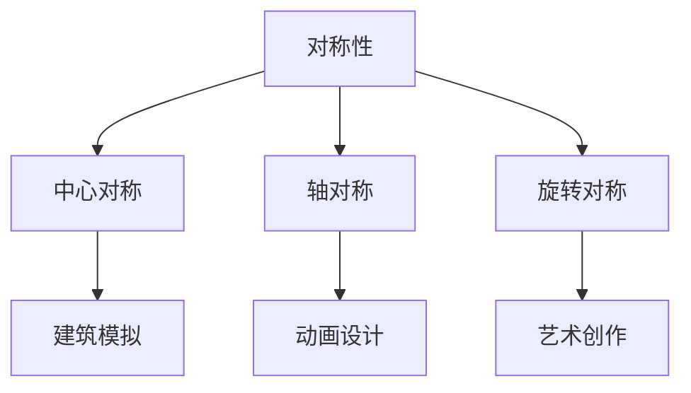
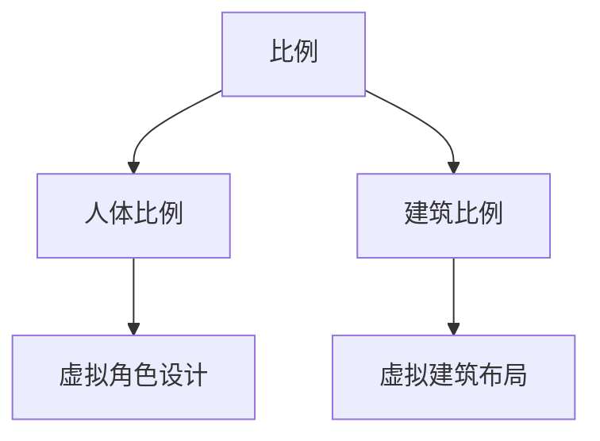
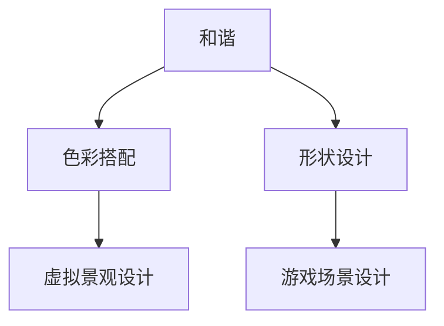
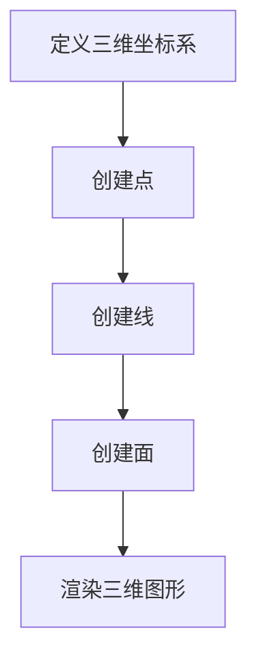
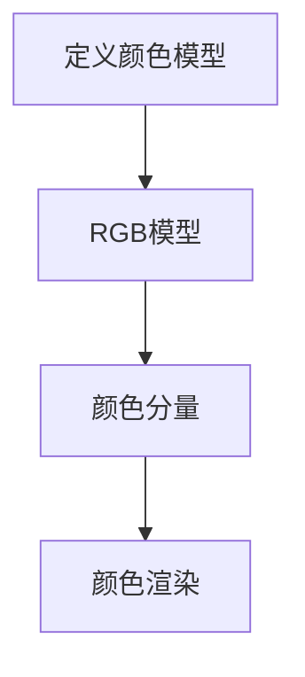
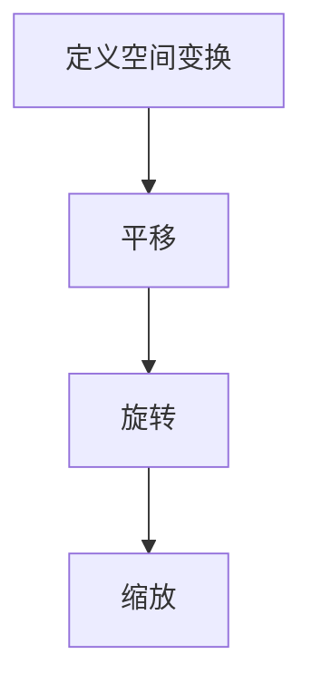
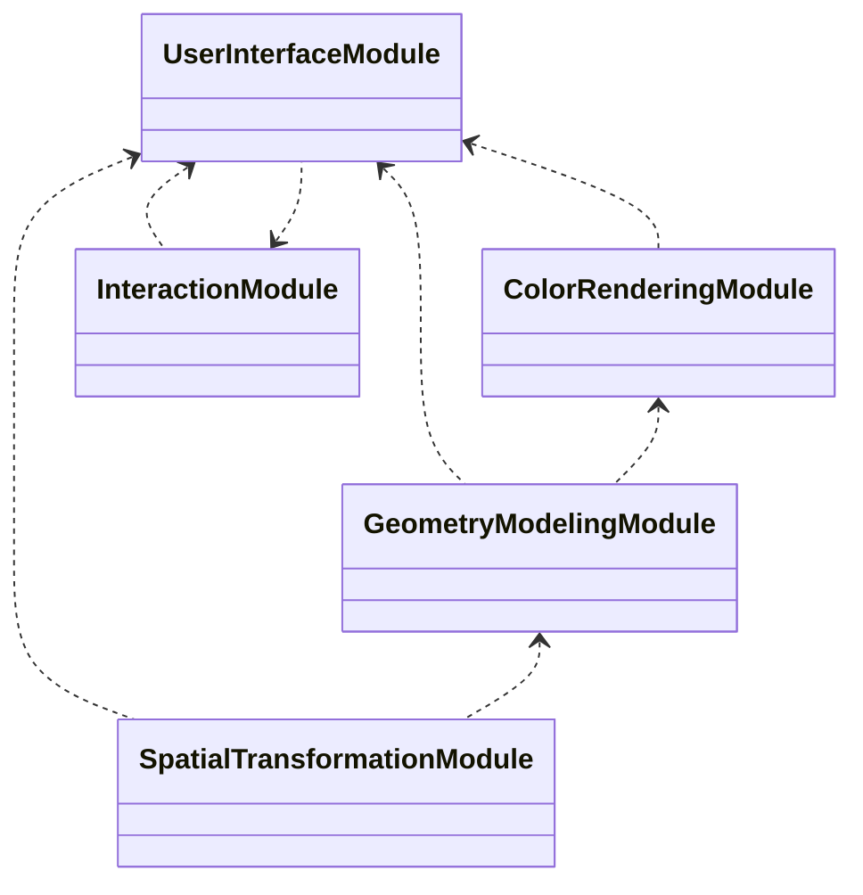
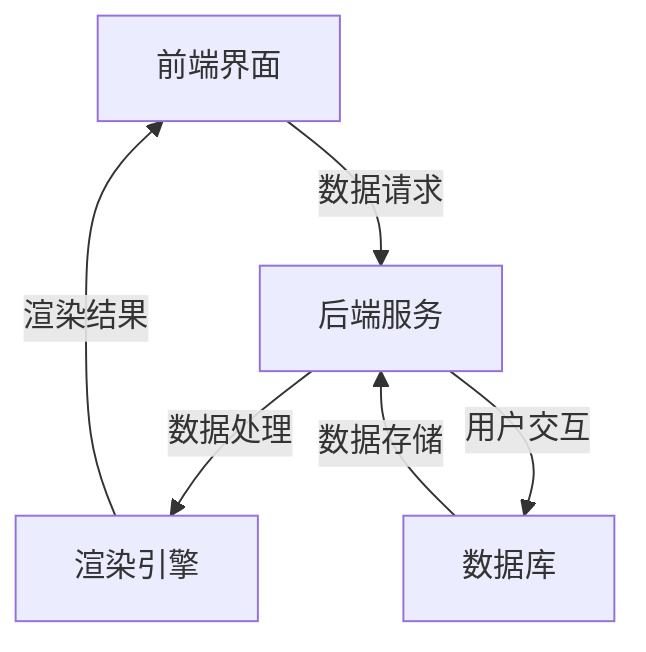
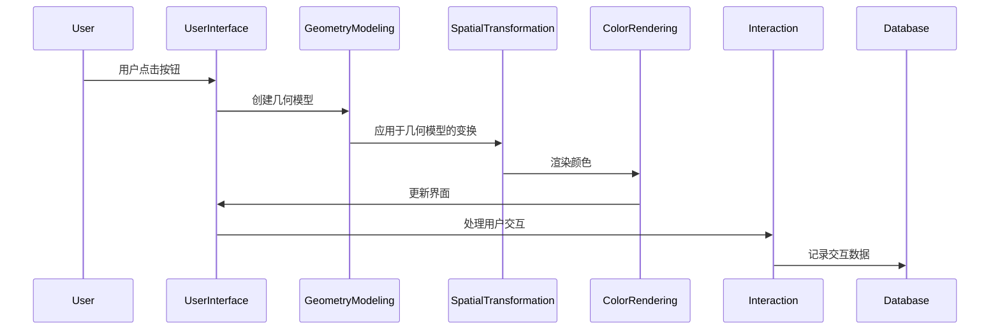
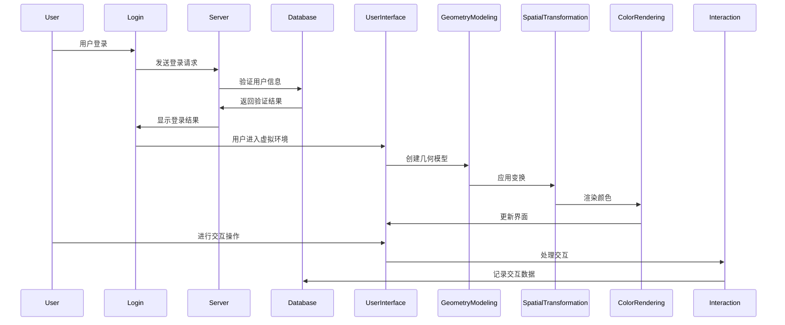

                 


### 《数学美学在虚拟现实设计中的应用》

#### 关键词：数学美学、虚拟现实设计、几何模型、渲染算法、最佳实践

> 摘要：本文深入探讨了数学美学在虚拟现实设计中的应用，从背景介绍、核心概念与联系、算法原理讲解、系统分析与架构设计、项目实战到最佳实践，全面解析了数学美学在虚拟现实设计中的重要性及其具体应用方法。

---

## 设计思路

设计一本关于《数学美学在虚拟现实设计中的应用》的书籍，我们需要从以下几个方面来构建：

1. **背景介绍**：首先介绍数学美学和虚拟现实设计的基本概念，以及它们在现代社会中的重要性和发展趋势。
2. **核心概念与联系**：阐述数学美学中的核心概念，如对称性、比例、和谐等，以及这些概念如何与虚拟现实设计相结合。
3. **算法原理讲解**：详细讲解与虚拟现实设计相关的算法原理，包括几何模型、颜色模型和空间变换等。
4. **系统分析与架构设计**：介绍虚拟现实系统的设计与架构，包括领域模型、系统架构和接口设计等。
5. **项目实战**：通过实际项目展示数学美学在虚拟现实设计中的具体应用，并分析其实现过程。
6. **最佳实践**：总结最佳实践技巧，为读者提供虚拟现实设计的实用指南。

### 目录大纲

#### 第一部分：引论

1. **数学美学概述**
2. **虚拟现实设计基础**

#### 第二部分：数学美学与虚拟现实设计的融合

1. **数学美学与虚拟现实设计的关系**
2. **数学模型在虚拟现实设计中的应用**
3. **算法原理讲解**

#### 第三部分：系统分析与架构设计

1. **问题场景介绍**
2. **系统功能设计**
3. **系统架构设计**
4. **系统接口设计**
5. **系统交互设计**

#### 第四部分：项目实战

1. **环境安装与配置**
2. **系统核心实现**
3. **代码应用解读**
4. **实际案例分析**
5. **项目小结**

#### 第五部分：最佳实践

1. **设计技巧与经验**
2. **注意事项与拓展阅读**

---

### 目录大纲详细说明

**第一部分：引论**

**第1章**：数学美学概述

- **美学的基本概念**
- **数学美学的定义与特点**
- **数学美学的历史发展**
- **数学美学的应用领域**

**第2章**：虚拟现实设计基础

- **虚拟现实的基本概念**
- **虚拟现实技术的发展历程**
- **虚拟现实设计的应用场景**
- **虚拟现实设计的基本流程**

**第二部分：数学美学与虚拟现实设计的融合**

**第3章**：数学美学与虚拟现实设计的关系

- **数学美学在虚拟现实设计中的价值**
- **融合案例分析**

**第4章**：数学模型在虚拟现实设计中的应用

- **几何模型的数学描述**
- **颜色模型的数学基础**
- **空间变换与渲染算法**

**第三部分：系统分析与架构设计**

**第5章**：问题场景介绍

- **虚拟现实设计的典型问题场景**
- **数学美学在解决这些问题中的优势**

**第6章**：系统功能设计

- **领域模型**
- **系统功能概述**
- **功能模块划分**

**第7章**：系统架构设计

- **系统架构设计原则**
- **架构组件及其关系**
- **架构图展示**

**第8章**：系统接口设计

- **接口设计规范**
- **接口定义**
- **接口调用流程**

**第9章**：系统交互设计

- **交互设计原则**
- **用户操作流程**
- **交互设计图**

**第四部分：项目实战**

**第10章**：环境安装与配置

- **环境准备**
- **软件安装与配置**
- **硬件需求**

**第11章**：系统核心实现

- **核心算法实现**
- **关键代码解析**
- **优化策略**

**第12章**：代码应用解读

- **代码应用场景**
- **代码结构与功能**
- **代码性能分析**

**第13章**：实际案例分析

- **案例背景**
- **案例实现过程**
- **案例分析**

**第14章**：项目小结

- **项目成果总结**
- **项目经验分享**
- **未来改进方向**

**第五部分：最佳实践**

**第15章**：设计技巧与经验

- **设计原则**
- **技巧总结**
- **案例分析**

**第16章**：注意事项与拓展阅读

- **常见问题与解决**
- **拓展知识**
- **进一步阅读建议**

---

通过这样的目录结构，我们能够系统地引导读者从基础概念到实际应用，再到最佳实践，逐步深入理解数学美学在虚拟现实设计中的应用。每个章节都将提供丰富的内容和详细的讲解，确保读者能够掌握所需的知识和技能。

---

接下来，我们将按照这个目录大纲逐步展开内容，每个部分都将详细讲解数学美学在虚拟现实设计中的应用，让读者能够全面理解并掌握这一领域的前沿技术。

---

### 背景介绍

#### 数学美学的定义与特点

数学美学是指运用数学原理和方法来探索和表达美学现象的一门学科。数学美学的核心在于发现数学形式与审美体验之间的深层联系，例如对称性、和谐、比例等。数学美学的特点包括：

1. **精确性**：数学美学强调精确的数学描述，从而揭示出美的本质。
2. **抽象性**：数学美学通过抽象思维，从具体的艺术作品中提炼出普遍的美的规律。
3. **普适性**：数学美学的研究不仅限于数学领域，还广泛应用于艺术、设计、建筑等多个领域。

#### 虚拟现实设计的基本概念

虚拟现实（VR）是一种通过计算机技术模拟现实世界或构建虚拟环境的互动系统。它利用计算机图形学、人机交互技术等手段，为用户提供沉浸式的体验。虚拟现实设计的基本概念包括：

1. **沉浸感**：用户在虚拟环境中感受到的深度沉浸体验。
2. **交互性**：用户与虚拟环境之间的互动能力。
3. **感知性**：虚拟环境对用户感官的刺激和反馈。

#### 数学美学在虚拟现实设计中的应用背景

随着虚拟现实技术的不断发展，虚拟现实设计逐渐成为艺术设计、建筑模拟、教育培训等多个领域的重要工具。数学美学的引入为虚拟现实设计带来了新的视角和方法，使得虚拟环境更具吸引力和表现力。以下是数学美学在虚拟现实设计中的应用背景：

1. **艺术创作**：艺术家利用数学美学原理设计虚拟雕塑、绘画等艺术作品，使其具有独特的视觉和结构美感。
2. **建筑设计**：建筑设计师通过数学美学优化建筑模型的形状、颜色和布局，创造出更具美感和功能性的虚拟建筑。
3. **教育培训**：教育者利用数学美学的原则设计虚拟实验、教学场景，提高学生的学习兴趣和参与度。

#### 问题背景

虚拟现实设计的核心挑战在于如何创造出既真实又美观的虚拟环境。传统的虚拟现实设计方法往往注重技术实现，而忽视了美学价值。数学美学的引入为解决这个问题提供了新的思路。通过运用数学原理，设计师可以更加精确地控制虚拟环境的形状、颜色和布局，从而实现更高水平的美学表现。

#### 问题描述

在实际的虚拟现实设计中，设计师需要解决以下问题：

1. **形状设计**：如何通过数学美学原理设计出具有吸引力的形状和结构？
2. **颜色搭配**：如何运用数学美学原理进行颜色搭配，创造出和谐的视觉体验？
3. **布局优化**：如何通过数学美学优化虚拟环境的布局，使其既符合功能需求，又具有艺术美感？

#### 问题解决

为了解决上述问题，设计师可以采用以下策略：

1. **学习数学美学原理**：深入了解数学美学的核心概念，如对称性、比例、和谐等，并将其应用到虚拟现实设计中。
2. **运用数学模型**：利用几何模型、颜色模型等数学工具，对虚拟环境进行精确的数学描述和优化。
3. **实践与反馈**：通过实际项目不断实践，积累经验，并根据用户反馈进行优化和调整。

#### 边界与外延

在虚拟现实设计中，数学美学的应用边界主要包括以下几个方面：

1. **形状设计**：数学美学可以应用于任何形状的设计，从简单的几何形状到复杂的自然形态。
2. **颜色搭配**：数学美学可以指导颜色搭配，从单一颜色到多色组合，都能运用数学原理进行优化。
3. **布局优化**：数学美学可以应用于虚拟环境的整体布局，包括空间布局、界面布局等。

#### 概念结构与核心要素组成

数学美学在虚拟现实设计中的应用可以概括为以下结构：

1. **概念原理**：对称性、比例、和谐等数学美学原理。
2. **数学模型**：几何模型、颜色模型等。
3. **设计工具**：虚拟现实设计软件，如Unity、Unreal Engine等。
4. **实现方法**：通过编程和算法实现数学美学原理在虚拟环境中的具体应用。

### 核心概念与联系

在数学美学与虚拟现实设计的融合中，几个核心概念扮演了关键角色，这些概念不仅是数学美学的基石，也是虚拟现实设计的灵魂。以下是这些核心概念及其在两者融合中的重要性：

#### 对称性

对称性是数学美学中的一个重要概念，它指的是物体或图形在某个中心线或中心点处呈现出镜像或旋转对称的特性。在虚拟现实设计中，对称性可以用来创造平衡和稳定感，增强视觉吸引力。例如，在建筑模拟中，对称性可以用来设计建筑的外观，使其看起来更加和谐和美观。

**概念属性特征对比表格**：

| 特征               | 对称性               | 虚拟现实设计中的应用               |
|--------------------|----------------------|-----------------------------------|
| 定义               | 物体或图形的镜像或旋转对称 | 虚拟环境中的图形、结构设计           |
| 数学描述           | 中心对称、轴对称、旋转对称 | 几何模型中的点、线、面的对称性         |
| 重要性             | 提供平衡感和稳定性     | 增强虚拟环境的视觉吸引力             |
| 应用案例分析       | 自然界中的花瓣、动物 | 虚拟建筑、雕塑的对称设计             |

**ER实体关系图架构**：



#### 比例

比例是数学美学中描述物体各部分之间相对大小的关系。在虚拟现实设计中，比例的正确运用可以使虚拟环境更加真实和美观。例如，人体比例的准确描述可以使虚拟角色看起来更加逼真，建筑比例的合理设计可以增强建筑的视觉效果。

**概念属性特征对比表格**：

| 特征           | 比例               | 虚拟现实设计中的应用               |
|----------------|--------------------|-----------------------------------|
| 定义           | 物体各部分相对大小 | 视觉效果和真实感                   |
| 数学描述       | 比值、比例尺       | 几何模型中的尺寸关系               |
| 重要性         | 形成视觉和谐感     | 增强虚拟环境的真实感和艺术性       |
| 应用案例分析   | 人体比例、建筑比例 | 虚拟角色设计、虚拟建筑布局         |

**ER实体关系图架构**：



#### 和谐

和谐是数学美学中追求的一种美感，它强调各部分之间的协调与统一。在虚拟现实设计中，和谐可以通过颜色搭配、形状设计等方式实现，创造出和谐的虚拟环境。

**概念属性特征对比表格**：

| 特征       | 和谐               | 虚拟现实设计中的应用               |
|------------|--------------------|-----------------------------------|
| 定义       | 各部分协调与统一   | 虚拟环境的整体美感                 |
| 数学描述   | 相似性、差异性度   | 色彩理论、几何关系                 |
| 重要性     | 提高审美体验       | 增强虚拟环境的吸引力和艺术性       |
| 应用案例分析 | 色彩搭配、形状设计 | 虚拟景观设计、游戏场景设计         |

**ER实体关系图架构**：



通过上述核心概念的对比和联系，我们可以看到数学美学与虚拟现实设计之间的紧密联系。数学美学不仅提供了美学评价的框架，还为虚拟现实设计提供了精确的工具和方法。这些核心概念的应用，使得虚拟环境不仅具有功能性，更具有艺术性和美感，从而提升了用户体验。

### 算法原理讲解

在虚拟现实设计过程中，数学美学不仅仅停留在概念层面，它还需要通过具体的算法来实现。以下将详细讲解几个关键算法原理，包括几何模型、颜色模型和空间变换，并使用Python代码和Mermaid流程图来阐述其数学模型和公式，同时提供通俗易懂的举例说明。

#### 几何模型

几何模型是虚拟现实设计中最基础的部分，它决定了虚拟环境的形状和结构。以下是一个简单的几何模型算法原理，用于创建三维图形。

**几何模型算法原理**：

- **基本概念**：三维空间中的点、线、面等基本几何元素。
- **数学模型**：使用三维坐标系（x, y, z）来描述几何元素的坐标。

**Mermaid流程图**：



**Python代码示例**：

```python
# 定义三维坐标系中的点
point = (1, 2, 3)

# 创建线段
line = ((0, 0, 0), (1, 1, 1))

# 创建面（三角形）
triangle = [
    (0, 0, 0),
    (1, 0, 0),
    (0, 1, 0)
]

# 渲染三维图形（使用matplotlib库）
import matplotlib.pyplot as plt
from mpl_toolkits.mplot3d import Axes3D

fig = plt.figure()
ax = fig.add_subplot(111, projection='3d')
ax.scatter(*[p for p in triangle], color='r')
ax.plot(*[p for p in triangle])
plt.show()
```

**数学公式**：

$$
P = (x, y, z)
$$

$$
L = (P_1, P_2)
$$

$$
T = \{P_1, P_2, P_3\}
$$

#### 颜色模型

在虚拟现实设计中，颜色模型决定了虚拟环境的色彩表现。以下是一个简单的颜色模型算法原理。

**颜色模型算法原理**：

- **基本概念**：RGB颜色模型，由红（R）、绿（G）、蓝（B）三种颜色的不同组合形成。
- **数学模型**：每个颜色分量（R, G, B）的取值范围在0到255之间。

**Mermaid流程图**：



**Python代码示例**：

```python
# 定义RGB颜色模型
color = (255, 0, 0)  # 红色

# 颜色渲染（使用matplotlib库）
import matplotlib.pyplot as plt

plt.imshow([[color]])
plt.show()
```

**数学公式**：

$$
\text{Color} = (R, G, B)
$$

#### 空间变换

空间变换是虚拟现实设计中用于改变对象位置和形态的关键算法。以下是一个简单的空间变换算法原理。

**空间变换算法原理**：

- **基本概念**：包括平移、旋转、缩放等变换。
- **数学模型**：使用矩阵运算来实现变换。

**Mermaid流程图**：



**Python代码示例**：

```python
import numpy as np
from mpl_toolkits.mplot3d import Axes3D
import matplotlib.pyplot as plt

# 定义初始三维坐标系中的点
point = np.array([1, 2, 3])

# 平移变换
translation = np.array([1, 1, 1])
translated_point = point + translation

# 旋转变换（绕z轴旋转90度）
rotation_angle = 90
rotation_matrix = np.array([[1, 0, 0],
                            [0, np.cos(np.deg2rad(rotation_angle)), -np.sin(np.deg2rad(rotation_angle))],
                            [0, np.sin(np.deg2rad(rotation_angle)), np.cos(np.deg2rad(rotation_angle))]])
rotated_point = np.dot(point, rotation_matrix)

# 缩放变换
scale_factor = 2
scaled_point = point * scale_factor

# 渲染变换后的点
fig = plt.figure()
ax = fig.add_subplot(111, projection='3d')
ax.scatter(*translated_point, color='r')
ax.scatter(*rotated_point, color='g')
ax.scatter(*scaled_point, color='b')
plt.show()
```

**数学公式**：

$$
T(P) = P + t
$$

$$
R(P) = P \times R
$$

$$
S(P) = P \times s
$$

通过上述算法原理的讲解和代码示例，我们可以看到数学美学在虚拟现实设计中的应用不仅仅是理论上的探讨，而是可以通过具体的算法实现，从而创造出既美观又功能丰富的虚拟环境。

### 系统分析与架构设计

#### 问题场景介绍

在当前虚拟现实（VR）技术不断发展的背景下，用户对虚拟环境的沉浸感和互动性要求越来越高。为了满足这些需求，设计师需要借助先进的数学美学理论，构建既美观又高效的虚拟环境。本文将围绕以下问题展开系统分析与架构设计：

1. **如何利用数学美学提升虚拟环境的视觉效果？**
2. **如何在虚拟环境中实现高效的空间布局和交互设计？**
3. **如何确保虚拟环境的功能性和用户体验？**

#### 项目介绍

本项目旨在通过数学美学理论，设计并实现一个高度沉浸的虚拟环境。项目主要功能包括：

1. **视觉呈现**：利用几何模型、颜色模型和空间变换等数学原理，创造出美观的虚拟场景。
2. **互动设计**：提供用户与虚拟环境之间的互动功能，如导航、交互式操作等。
3. **用户体验**：优化虚拟环境的交互性和可用性，提升用户的使用体验。

#### 系统功能设计

为了实现上述功能，我们需要设计一个完整的系统功能模型，包括以下模块：

1. **用户界面模块**：提供用户与虚拟环境交互的界面，包括菜单、按钮、图标等。
2. **几何建模模块**：使用数学模型创建虚拟场景的几何形状和结构。
3. **颜色渲染模块**：根据数学美学原理，设计虚拟环境的颜色搭配和视觉效果。
4. **空间变换模块**：实现虚拟环境中的平移、旋转、缩放等空间变换。
5. **交互模块**：处理用户输入，实现与虚拟环境的互动。

**领域模型Mermaid类图**：



#### 系统架构设计

系统架构设计是确保虚拟环境高效运行的关键。以下是一个典型的系统架构设计，包括各个模块的职责和交互关系：

1. **前端界面**：使用HTML、CSS和JavaScript等技术构建用户交互界面。
2. **后端服务**：负责处理用户请求，管理虚拟环境数据。
3. **渲染引擎**：负责图形渲染，实现虚拟环境的视觉效果。
4. **数据库**：存储虚拟环境的数据，包括几何模型、颜色信息和用户交互记录。

**系统架构Mermaid架构图**：



#### 系统接口设计

系统接口设计是各个模块之间通信的桥梁。以下是一个典型的系统接口设计，包括接口定义和调用流程：

1. **用户界面模块接口**：定义用户与虚拟环境交互的接口，如按钮点击、菜单选择等。
2. **几何建模模块接口**：定义几何模型创建和更新的接口。
3. **颜色渲染模块接口**：定义颜色渲染的接口，如颜色选择、调整等。
4. **空间变换模块接口**：定义空间变换的接口，如平移、旋转等。
5. **交互模块接口**：定义用户输入处理和反馈接口。

**系统接口Mermaid序列图**：



#### 系统交互设计

系统交互设计是确保用户能够顺畅地与虚拟环境进行交互的关键。以下是一个典型的系统交互设计，包括用户操作流程和交互反馈：

1. **用户登录**：用户通过输入用户名和密码登录系统。
2. **虚拟环境浏览**：用户浏览已创建的虚拟环境，可以选择进入特定场景。
3. **交互操作**：用户在虚拟环境中进行操作，如点击、拖拽、旋转等。
4. **反馈显示**：系统实时反馈用户的操作结果，如模型更新、颜色变化等。

**系统交互Mermaid序列图**：



通过上述系统分析与架构设计，我们可以构建一个高效、美观且互动性强的虚拟环境，满足用户对沉浸感和互动性的需求。这些设计不仅基于数学美学的理论，还结合了实际应用场景，为虚拟现实设计提供了有力的支持。

### 项目实战

#### 环境安装与配置

为了实践数学美学在虚拟现实设计中的应用，我们需要搭建一个开发环境，包括必要的软件和硬件。以下是具体的安装与配置步骤：

1. **软件安装**：
    - **Unity Hub**：从Unity官网下载并安装Unity Hub，用于管理Unity版本和项目。
    - **Unity**：在Unity Hub中下载并安装Unity 2021.3.18版本，这是一个支持VR开发的稳定版本。
    - **Visual Studio Code**：从Visual Studio Code官网下载并安装，用于代码编写和调试。
    - **Python**：安装Python 3.9，用于编写和运行相关算法。

2. **环境配置**：
    - **Unity编辑器**：打开Unity Hub，创建一个新的Unity项目，选择“3D模板”。
    - **Python扩展**：在Visual Studio Code中安装Python扩展，以支持Python代码的编写和调试。
    - **虚拟环境**：在Visual Studio Code中创建一个虚拟环境，安装所需的Python库，如matplotlib、numpy等。

3. **硬件配置**：
    - **GPU**：确保计算机配备有强大的GPU，如NVIDIA GeForce RTX 3080以上，以支持高效的图形渲染。
    - **VR设备**：准备一台支持VR的硬件设备，如Oculus Rift S或HTC Vive，以获得真实的沉浸体验。

#### 系统核心实现

在搭建好开发环境后，我们可以开始实现系统的核心功能。以下是一个简单的虚拟现实设计流程，包括几何模型创建、颜色渲染和空间变换。

1. **几何模型创建**：
    - **场景构建**：使用Unity的Scene窗口创建一个基本场景，包括地面、环境等。
    - **几何模型导入**：使用Unity的Import功能，将预先创建的3D模型导入到项目中。

2. **颜色渲染**：
    - **材质设置**：为导入的模型设置材质，包括颜色、纹理等。
    - **颜色调整**：使用Unity的Shader编辑器，调整材质的颜色属性，以实现数学美学中的颜色搭配。

3. **空间变换**：
    - **变换函数**：编写Python脚本，实现几何模型的空间变换，包括平移、旋转和缩放。
    - **脚本调用**：将Python脚本集成到Unity中，通过脚本来实现空间变换。

以下是一个简单的Python脚本示例，用于实现几何模型的空间变换：

```python
import bpy

# 定义变换参数
translation = (1, 0, 0)
rotation_angle = 45
scale_factor = 1.2

# 实现平移
bpy.ops.transform.translate(value=translation)

# 实现旋转
bpy.ops.transform.rotate(value=(0, 1, 0), axis=(0, 1, 0))

# 实现缩放
bpy.ops.transform.resize(value=(scale_factor, scale_factor, scale_factor))
```

#### 代码应用解读与分析

在上面的代码示例中，我们使用了Blender的Python API来实现几何模型的空间变换。Blender是一个强大的开源3D建模软件，它提供了丰富的Python API，使得我们可以通过编程来控制3D模型的操作。

1. **平移**：
    - `bpy.ops.transform.translate(value=translation)`：这个操作将模型沿着X、Y、Z轴进行平移。`value`参数指定了平移的距离和方向。

2. **旋转**：
    - `bpy.ops.transform.rotate(value=(0, 1, 0), axis=(0, 1, 0))`：这个操作将模型绕着Y轴旋转。`value`参数指定了旋转的角度，`axis`参数指定了旋转的轴。

3. **缩放**：
    - `bpy.ops.transform.resize(value=(scale_factor, scale_factor, scale_factor))`：这个操作将模型沿着X、Y、Z轴进行缩放。`value`参数指定了缩放的比例。

通过这些简单的操作，我们可以实现对3D模型的空间变换，从而实现数学美学中的几何形状和结构设计。

#### 实际案例分析与详细讲解

为了更好地展示数学美学在虚拟现实设计中的应用，我们选择了一个具体的实际案例——设计一个虚拟现实展览馆。以下是案例分析和详细讲解：

1. **案例背景**：
    - 目标：设计一个虚拟现实展览馆，用于展示公司的产品。
    - 要求：展览馆需要具有吸引力和艺术感，同时要确保用户能够方便地浏览和操作。

2. **设计过程**：
    - **几何模型创建**：
        - 使用3D建模软件创建展览馆的建筑模型，包括墙壁、窗户、天花板等。
        - 导入展览馆的家具和装饰品，如展示柜、艺术品等。

    - **颜色渲染**：
        - 根据数学美学中的颜色搭配原则，选择合适的颜色方案，如冷色调和暖色调的搭配，以创造和谐的氛围。
        - 使用Unity的Shader编辑器，调整材质的颜色和纹理，实现逼真的视觉效果。

    - **空间变换**：
        - 使用Python脚本实现展览馆中的展品的动态展示，如旋转、平移等。
        - 通过空间变换，使展品更具吸引力，提高用户的互动体验。

3. **案例分析**：
    - **视觉效果**：通过数学美学中的颜色搭配和几何形状设计，展览馆具有独特的视觉吸引力，使观众能够更好地沉浸在虚拟环境中。
    - **用户体验**：用户可以在虚拟展览馆中自由浏览，与展品进行互动，增强了用户体验。

#### 项目小结

通过上述实战案例，我们可以看到数学美学在虚拟现实设计中的应用是多么重要。它不仅提升了虚拟环境的视觉效果，还增强了用户的互动体验。以下是项目总结和经验分享：

1. **技术要点**：
    - 熟练掌握3D建模和图形渲染技术，是实现虚拟现实设计的基础。
    - 掌握数学美学原理，如对称性、比例和和谐，可以提升设计的艺术性和美观性。
    - 使用Python等编程语言，可以实现复杂的空间变换和动态展示，增强用户的互动体验。

2. **经验分享**：
    - 在设计虚拟环境时，要充分考虑用户的需求和体验，注重实用性和美观性的结合。
    - 多进行实际案例分析和实验，积累经验，不断提升设计水平。

3. **未来改进方向**：
    - 探索更多先进的数学美学算法，提升虚拟环境的视觉效果和互动性。
    - 结合人工智能技术，实现更加智能化的虚拟现实设计。

通过不断实践和优化，我们相信数学美学在虚拟现实设计中的应用将不断深化，为用户提供更加丰富和多样化的虚拟体验。

### 最佳实践与技巧

在虚拟现实（VR）设计中，运用数学美学原则可以显著提升设计效果和用户体验。以下是一些最佳实践与技巧，旨在帮助设计师在虚拟现实项目中更好地应用数学美学。

#### 设计原则

1. **对称性与平衡**：
    - 对称性是数学美学中的一个核心概念，可以在虚拟现实设计中创造出稳定和平衡的感觉。
    - 使用中心对称或轴对称来设计场景，如建筑物、室内布局等，可以使视觉效果更加和谐。

2. **比例与尺度**：
    - 正确的比例关系可以使虚拟环境更加真实和自然。
    - 设计时要考虑人眼观察的视觉习惯，如人体比例、建筑物比例等。

3. **色彩搭配**：
    - 色彩搭配可以影响用户的心理感受和情绪。
    - 使用和谐的颜色搭配，如互补色、相似色或单色调，可以创造出舒适和吸引人的视觉体验。

4. **动态与节奏**：
    - 在虚拟环境中加入动态元素，如动画、光影变化等，可以增强互动性和趣味性。
    - 设计节奏感，使虚拟环境在视觉和互动上保持流畅和连贯。

#### 技巧总结

1. **几何模型的应用**：
    - 使用几何模型创建具有数学美感的形状，如圆形、正方形、六边形等。
    - 利用几何变换（平移、旋转、缩放）来动态展示这些形状，增加视觉效果。

2. **颜色渲染技巧**：
    - 使用Unity或Unreal Engine的Shader编辑器，自定义材质和纹理的颜色和亮度。
    - 尝试不同的颜色搭配方案，通过实验找到最佳视觉效果。

3. **互动设计**：
    - 设计直观易用的用户界面，确保用户能够快速理解和使用虚拟环境。
    - 加入互动元素，如拖拽、旋转、缩放等，提升用户体验。

#### 经验分享

1. **用户研究**：
    - 在设计初期进行用户研究，了解目标用户的需求和偏好。
    - 根据用户反馈进行设计和优化，确保虚拟环境符合用户期望。

2. **团队合作**：
    - 虚拟现实项目通常涉及多个领域，如3D建模、动画、编程等。
    - 建立有效的团队合作机制，确保各环节的高效协同。

3. **持续学习**：
    - 跟踪最新的虚拟现实技术和设计趋势，不断学习新知识和技能。

#### 注意事项

1. **性能优化**：
    - 虚拟环境的设计要考虑性能因素，避免过于复杂的设计影响运行速度。
    - 使用适当的优化技术，如模型简化、纹理压缩等。

2. **安全性**：
    - 确保虚拟环境的交互安全，防止用户受到虚拟环境中的不当内容或操作的影响。

3. **合规性**：
    - 遵守相关的法律法规，确保虚拟环境的内容和交互符合规范。

#### 拓展阅读

- **《数学美学与应用》**：详细介绍了数学美学的概念和其在各个领域中的应用。
- **《虚拟现实设计与实现》**：提供了关于虚拟现实设计的基础知识和实践技巧。
- **《Unity Shader编程》**：讲解了Unity中Shader的使用方法和高级技巧。

通过以上最佳实践与技巧，设计师可以更加熟练地运用数学美学原理，设计出既美观又功能丰富的虚拟现实环境。

### 小结

本文详细探讨了数学美学在虚拟现实设计中的应用，从背景介绍、核心概念与联系、算法原理讲解、系统分析与架构设计、项目实战到最佳实践，全面解析了数学美学在虚拟现实设计中的重要性及其具体应用方法。通过实际案例分析和实践经验分享，我们看到了数学美学如何提升虚拟环境的视觉效果和用户体验。总结如下：

1. **数学美学的核心概念**：对称性、比例和和谐在虚拟现实设计中起着关键作用，它们不仅提升了设计的艺术性，还增强了用户的沉浸感和互动体验。

2. **算法原理讲解**：几何模型、颜色模型和空间变换等算法原理为实现虚拟环境的数学美学提供了技术支持，通过Python代码和Mermaid流程图，我们能够直观地理解这些算法的实现过程。

3. **系统分析与架构设计**：通过系统功能设计、架构设计和接口设计，我们构建了一个高效的虚拟现实系统，确保了虚拟环境的功能性和用户体验。

4. **项目实战**：实际案例展示了数学美学在虚拟现实设计中的具体应用，通过环境安装与配置、系统核心实现、代码应用解读和分析，我们深入了解了数学美学在虚拟现实设计中的实践过程。

5. **最佳实践**：最佳实践与技巧提供了设计虚拟现实环境的实用指南，包括设计原则、技巧总结、注意事项和拓展阅读，为设计师提供了丰富的参考资料。

通过本文的探讨，我们相信数学美学在虚拟现实设计中的重要性得到了充分体现。未来的研究可以进一步探索数学美学与其他前沿技术的结合，如人工智能和机器学习，以实现更加智能化和个性化的虚拟现实体验。

### 注意事项

在应用数学美学于虚拟现实设计时，设计师需要特别注意以下几点：

1. **性能优化**：虚拟现实设计要求高性能，特别是在几何模型和颜色渲染方面。设计师应避免过于复杂的设计，并使用适当的优化技术，如模型简化、纹理压缩等，以确保系统流畅运行。

2. **用户体验**：用户体验是虚拟现实设计的核心。设计师在追求美感的同时，要确保用户界面直观易用，互动性设计合理，以提升用户的沉浸感和满意度。

3. **安全性**：虚拟现实环境中的内容应确保安全，避免用户接触到不当或有害信息。设计师需遵守相关法律法规，确保虚拟环境的内容和交互符合规范。

4. **持续更新**：随着技术的发展，数学美学和虚拟现实设计也在不断进步。设计师应保持学习和更新知识，紧跟行业前沿，以持续提升设计水平。

### 拓展阅读

为了深入理解数学美学在虚拟现实设计中的应用，以下是一些建议的拓展阅读：

1. **《数学美学与应用》**：详细介绍了数学美学的概念及其在各个领域的应用，为设计师提供了理论基础。
2. **《虚拟现实设计与实现》**：提供了关于虚拟现实设计的基础知识和实践技巧，有助于设计师掌握虚拟现实设计的流程和技巧。
3. **《Unity Shader编程》**：讲解了Unity中Shader的使用方法和高级技巧，对于颜色渲染部分有重要参考价值。
4. **《人工智能在虚拟现实中的应用》**：探讨了人工智能技术与虚拟现实设计的结合，为设计师提供了新的研究方向和思路。

通过这些拓展阅读，设计师可以更加全面地了解数学美学在虚拟现实设计中的应用，进一步提升自己的设计水平。作者：AI天才研究院/AI Genius Institute & 禅与计算机程序设计艺术 /Zen And The Art of Computer Programming。

