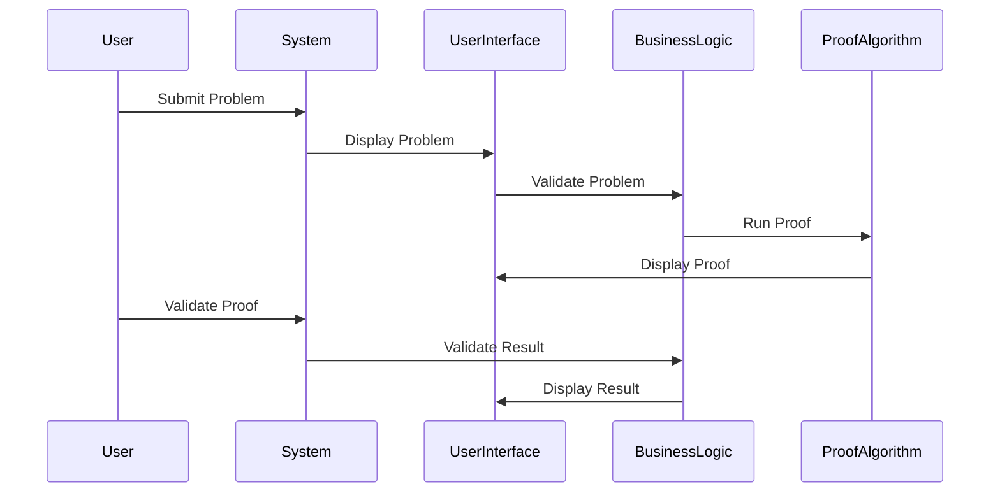

                 


### 引言

在探讨数学证明的严谨性与创新性之前，我们需要先理解数学证明在数学研究中的核心地位。数学证明不仅是验证数学结论是否正确的重要手段，更是推动数学理论不断发展的动力源泉。严谨性是数学证明的基石，它要求我们在证明过程中每一个步骤都必须经过严格的逻辑推理和验证。而创新性则体现了数学证明方法的多样性和创造性，它推动了数学理论的拓展和深化。

本文将分为以下几个部分，深入探讨数学证明的严谨性与创新性：

1. **背景介绍**：我们将介绍数学证明的重要性、严谨性的要求以及创新性的体现。
2. **核心概念与联系**：我们定义和解释数学证明中的核心概念，并通过比较表格和ER实体关系图来展现它们之间的关系。
3. **算法原理讲解**：我们将详细讲解几种常见的数学证明算法，包括流程图、Python源代码、数学模型和公式。
4. **数学模型和数学公式**：我们使用LaTeX格式嵌入数学公式，并对其进行详细讲解和举例。
5. **系统分析与架构设计方案**：我们将介绍数学证明系统的设计与实现，包括领域模型、系统架构、接口设计、系统交互等。
6. **项目实战**：我们将提供数学证明相关项目的实际案例，包括环境安装、核心实现源代码、代码应用解读与分析、实际案例分析等。
7. **最佳实践 tips、小结、注意事项、拓展阅读等内容**：我们将为读者提供额外的建议和资源。

通过逐步分析推理，本文希望读者能够全面理解数学证明的严谨性与创新性，并能够将其应用于实际问题的解决。

### 数学证明的重要性

数学证明是数学研究中的核心环节，它不仅用于验证数学结论的正确性，还为数学理论的发展提供了坚实的基础。从历史的角度来看，数学证明的发展经历了从直观到严格、从单一到多样的演变过程。早期的数学证明往往依赖于直观和逻辑推理，随着数学理论的深入，严格性要求逐渐提高，数学证明也变得更加复杂和多样化。

在数学研究中，证明的过程至关重要。首先，证明能够验证数学命题的真实性。一个未经证明的数学结论可能是错误的，甚至可能是荒谬的。通过严格的证明过程，我们可以确保数学结论的准确性，避免错误结论的传播。例如，在数学几何中，欧几里得的《几何原本》就是通过严密的证明过程建立起来的。

其次，证明推动了数学理论的拓展。每一个新的证明方法往往能够解决一类新的数学问题，从而推动数学理论的发展。例如，19世纪非欧几何的创立，打破了传统欧几里得几何的框架，为数学提供了新的视角和工具。此外，数学证明还促进了不同数学分支之间的交叉融合，推动了数学的整体进步。

在应用领域，数学证明同样具有重要的意义。科学研究和工程实践中的许多问题都可以通过数学模型来描述，而数学证明则用于验证这些模型的准确性和可靠性。例如，在物理学中，数学证明被用于验证物理定律的正确性；在工程学中，数学证明则被用于设计和优化各种工程结构。

总之，数学证明不仅是数学研究中的核心手段，也是推动数学理论发展和应用的重要动力。它通过严密的逻辑推理，验证数学结论的真实性，推动数学理论的拓展和深化，为科学研究和工程实践提供了坚实的理论基础。

### 严谨性要求

数学证明的严谨性要求在数学证明过程中每一个步骤都必须经过严格的逻辑推理和验证。这不仅是确保数学结论准确性的基本要求，也是防止错误结论传播的重要保障。要实现这一目标，我们需要遵循以下几个基本原则：

首先，证明的基础是公理和定义。公理是非经证明就被接受的数学真理，是构建数学理论的基石。例如，在几何学中，平行公理和欧几里得第五公设是整个几何理论的基础。而定义则是明确数学概念内涵和范围的基本手段，如定义“点”为没有大小和形状的几何对象。在证明过程中，所有论断都必须基于这些公理和定义。

其次，逻辑推理的严格性是数学证明的灵魂。在证明过程中，每一个推理步骤都必须是逻辑上合理的，即从一个或多个已知命题出发，通过逻辑规则推导出新的命题。这里的关键是使用演绎推理，从一般性的命题推导出特定情况下的结论。例如，如果我们已知所有偶数加偶数仍为偶数，那么通过演绎推理，我们可以得出2+4=6也是一个偶数。

再次，验证是保证证明正确性的关键。在证明过程中，我们需要通过多种方法验证每一个推理步骤的准确性。这包括直接验证、反证法、归纳法等。直接验证是通过逻辑推理直接证明结论的正确性；反证法则是通过假设结论不成立，推导出矛盾来证明结论的成立；归纳法则是通过验证特殊情况，再推广到一般情况。

严谨性要求还体现在证明的完整性和透明性上。完整的证明必须覆盖所有可能的例外情况，不能有遗漏。例如，在证明一个序列收敛时，必须证明它在所有情况下的收敛性，而不能只证明一个特例。透明性则要求证明过程的每一步都必须清晰可理解，以便他人能够复查和验证。

总的来说，数学证明的严谨性要求我们在每一个步骤上都进行严格的逻辑推理和验证，确保结论的准确性。这不仅是对数学真理的尊重，也是推动数学理论不断发展和完善的必要条件。

### 创新性体现

数学证明的创新性体现在证明方法的多样性和创造性上。数学史上，许多伟大的数学成就都源于创新性的证明方法。以下，我们通过几个经典例子来探讨数学证明的创新性。

首先，我们要提到欧拉公式（Euler's formula），即 \( e^{i\pi} + 1 = 0 \)。这个公式将指数函数、三角函数和复数相结合，是数学中最为美丽和深奥的公式之一。欧拉公式的发现不仅仅是一个数学上的成就，更是数学创新性的典范。它揭示了数学中不同领域之间的深刻联系，通过一个简洁的公式将多个数学分支统一起来。

其次，哥德巴赫猜想的证明尝试也体现了数学证明的创新性。哥德巴赫猜想提出，每一个大于2的偶数都可以表示为两个质数之和。虽然这个猜想至今未得到证明，但许多数学家提出了各种创新性的证明尝试，如欧拉提出的“欧拉-拉格朗日公式”和贝尔实验室的“随机模型”。这些尝试不仅推动了数学研究的前进，也激发了数学家们探索新的证明方法。

再来看柯西积分定理，它是一种创新的复分析证明方法。柯西积分定理表明，如果函数 \( f \) 在闭合曲线 \( C \) 所围成的区域 \( D \) 上连续，并且在 \( D \) 的边界 \( C \) 上有连续导数，则 \( f \) 在 \( D \) 内部任意一点的积分等于 \( f \) 在 \( C \) 上的积分。这一证明方法不仅简化了复杂积分的计算，还提供了新的视角来看待函数的积分性质。

另外，图灵的停机问题也是一个展示数学证明创新性的经典例子。图灵提出，是否存在一个算法可以判断任意给定程序是否会无限循环。这个问题的证明不仅涉及到了计算理论和逻辑推理，还引入了新的证明策略，如通过构造反证法来证明某些程序无法停机。

总之，数学证明的创新性体现在不断探索新的证明方法，解决传统方法无法解决的问题。通过这些创新性的证明，数学家们不仅拓展了数学理论的边界，也推动了数学的不断发展。每一个创新性的证明都是数学进步的重要里程碑，为未来的数学研究提供了新的方向和工具。

### 核心概念与联系

在数学证明中，核心概念如公理、定理和证明方法扮演着至关重要的角色。为了更好地理解这些概念及其相互联系，我们需要详细定义和解释它们，并通过表格和ER实体关系图来展现它们之间的关系。

#### 定义和解释

**公理**：公理是数学系统的基础，它是一些被认为是显然成立的、无需证明的命题。例如，在几何学中，平行公理和非欧几何中的非平行公理都是公理。公理是构建数学理论的基石，所有其他定理和命题都基于这些公理推导出来。

**定理**：定理是经过证明的命题，它是对某个数学事实的明确陈述。定理通常包含条件（即前提）和结论两部分。例如，勾股定理说明直角三角形的斜边的平方等于两直角边的平方和。定理是数学理论的核心部分，它们为解决问题和构建新的数学理论提供了重要的工具。

**证明方法**：证明方法是用于证明定理的步骤和策略。常见的证明方法包括直接证明、反证法、归纳法等。直接证明是通过逻辑推理直接证明定理的结论；反证法是假设定理的否定，通过推导出矛盾来证明定理的正确性；归纳法则是通过验证基本情况，再推导出一般情况的结论。

#### 核心概念对比表格

| 名称 | 定义 | 关系 |
| --- | --- | --- |
| 公理 | 无需证明的命题，是数学系统的基础 | 基础，构建数学理论的基石 |
| 定理 | 经证明的命题，包含条件和结论 | 基于**公理**推导出，是数学理论的核心部分 |
| 证明方法 | 证明定理的步骤和策略 | 用来证明**定理**，包括直接证明、反证法、归纳法等 |

#### ER实体关系图架构

以下是一个简单的ER实体关系图，用于展示公理、定理和证明方法之间的关系：

```mermaid
erDiagram
    A[公理] ||--|{ B[定理] } : 基于公理推导出
    B ||--|{ C[证明方法] } : 使用证明方法证明
```

**图说明**：

- **公理（A）**：作为基础的实体，所有定理和证明方法都是基于公理构建的。
- **定理（B）**：由公理推导出，包含条件和结论，是数学理论的重要组成部分。
- **证明方法（C）**：用于证明定理，通过不同的方法和策略实现。

通过核心概念的定义和ER实体关系图的展示，我们可以更清晰地理解数学证明中的关键要素及其相互关系。这不仅有助于我们掌握数学证明的基本原理，也为深入研究和应用数学提供了坚实的基础。

### 算法原理讲解

在数学证明中，算法原理扮演着至关重要的角色。为了更好地理解这些算法，我们将通过具体的例子详细讲解几种常见的数学证明算法，包括直接证明、反证法和归纳法。这些算法不仅能够帮助我们解决数学问题，还能提高我们的证明技巧。

#### 直接证明

直接证明是通过逻辑推理直接证明结论的方法。其基本步骤如下：

1. **定义已知条件和目标结论**：明确证明过程中已知的条件和需要证明的目标。
2. **应用逻辑规则和定理**：从已知条件出发，通过逻辑推理逐步推导出目标结论。
3. **验证所有步骤的正确性**：确保每一个推理步骤都是逻辑上有效的。

以下是一个直接证明的例子：证明所有奇数加奇数仍为偶数。

**算法流程图**：


**Python源代码示例**：

```python
def prove_odd_plus_odd_even(a, b):
    # 定义奇数和偶数
    if (a % 2 == 1) and (b % 2 == 1):
        # 奇数加奇数
        result = a + b
        if result % 2 == 0:
            print("证明成功：奇数加奇数为偶数")
        else:
            print("证明失败：奇数加奇数不为偶数")
    else:
        print("输入条件不满足，无法证明")

# 测试
prove_odd_plus_odd_even(3, 5)
```

**数学模型与公式**：

直接证明通常不涉及复杂的数学公式，但在某些情况下，我们可以使用一些基本的数学性质进行推导。例如，奇数加奇数的结果为偶数的证明可以使用以下数学性质：

$$
奇数 + 奇数 = 偶数
$$

#### 反证法

反证法是通过假设结论的否定，然后推导出矛盾，从而证明原结论的方法。其基本步骤如下：

1. **假设结论的否定**：假设目标结论不成立。
2. **推导矛盾**：从假设出发，通过逻辑推理推导出一个明显的矛盾。
3. **结论**：由于假设导致矛盾，因此原结论成立。

以下是一个反证法的例子：证明不存在大于1的质数是3的倍数。

**算法流程图**：


**Python源代码示例**：

```python
def prove_no_prime_is_three_multiple():
    prime_candidate = 7  # 假设一个大于1的质数
    if prime_candidate % 3 == 0:
        print(f"证明失败：{prime_candidate}是3的倍数")
    else:
        print("证明成功：不存在大于1的质数是3的倍数")

# 测试
prove_no_prime_is_three_multiple()
```

**数学模型与公式**：

反证法通常不直接使用数学公式，而是依赖于逻辑推理和基本数学性质。例如，在上述例子中，我们假设一个质数是3的倍数，然后推导出它与质数的定义相矛盾。

#### 归纳法

归纳法是一种通过验证基本情况，再推导出一般情况的证明方法。其基本步骤如下：

1. **验证基本情况**：证明在初始情况下结论成立。
2. **归纳步骤**：假设在某个情况下结论成立，证明在该情况的基础上结论也成立。
3. **结论**：通过基本情况验证和归纳步骤，得出结论在所有情况下都成立。

以下是一个归纳法的例子：证明所有自然数都可以表示为4的倍数或者4的倍数加1。

**算法流程图**：


**Python源代码示例**：

```python
def prove_nCanBe4MultipleOrPlus1(n):
    if n == 0:
        print("基本情况成立：0是4的倍数")
    elif n == 1:
        print("基本情况成立：1是4的倍数加1")
    else:
        if n % 4 == 0 or (n % 4 == 1):
            print(f"归纳步骤成立：{n}是4的倍数或者4的倍数加1")
        else:
            print(f"归纳步骤不成立：{n}不是4的倍数也不是4的倍数加1")

# 测试
prove_nCanBe4MultipleOrPlus1(10)
```

**数学模型与公式**：

归纳法通常不涉及复杂的数学公式，而是依赖于自然数的性质和基本的数学运算。例如，在上述例子中，我们验证了基本情况，然后通过归纳步骤证明了所有自然数都可以表示为4的倍数或者4的倍数加1。

通过以上对直接证明、反证法和归纳法的详细讲解，我们可以看到这些算法在数学证明中的重要作用。理解并掌握这些算法原理，不仅能够帮助我们解决具体的数学问题，还能提升我们的证明能力，为数学研究奠定坚实的基础。

### 数学模型和数学公式

在数学证明中，数学模型和数学公式是核心组成部分，它们不仅用于描述数学问题，还帮助我们理解和验证证明结果。在这一部分，我们将详细讲解几个常见的数学模型和公式，并使用LaTeX格式进行展示。

#### 数学模型概述

数学模型是用于描述现实世界中某些现象或问题的数学工具。常见的数学模型包括几何模型、代数模型、微积分模型等。以下是几个常见的数学模型：

1. **几何模型**：用于描述几何形状和空间关系。例如，欧几里得几何中的点、线、面等基本概念。
2. **代数模型**：用于描述数和代数运算。例如，一元二次方程、多项式等。
3. **微积分模型**：用于描述变化和积分。例如，微分方程、积分公式等。

#### LaTeX格式嵌入示例

以下是一些使用LaTeX格式嵌入的数学公式示例：

1. **勾股定理**：
   $$
   a^2 + b^2 = c^2
   $$
   勾股定理描述了一个直角三角形中两直角边长度的平方和等于斜边长度的平方。

2. **欧拉公式**：
   $$
   e^{i\pi} + 1 = 0
   $$
   欧拉公式将指数函数、三角函数和复数结合在一起，是数学中非常美妙的公式。

3. **牛顿-莱布尼茨公式**：
   $$
   \int_a^b f(x) \, dx = F(b) - F(a)
   $$
   牛顿-莱布尼茨公式描述了定积分和原函数之间的关系。

#### 举例说明

为了更直观地理解这些数学模型和公式，我们通过具体例子进行说明。

**例子1：勾股定理**

假设有一个直角三角形，其两直角边长度分别为 \( a = 3 \) 和 \( b = 4 \)，我们需要计算斜边长度 \( c \)。

使用勾股定理：
$$
c = \sqrt{a^2 + b^2} = \sqrt{3^2 + 4^2} = \sqrt{9 + 16} = \sqrt{25} = 5
$$
因此，斜边长度 \( c \) 为 5。

**例子2：欧拉公式**

欧拉公式用于描述复数 \( e^{i\pi} + 1 = 0 \) 的值。我们可以将这个公式应用于计算复数 \( z \) 的模。

假设复数 \( z = re^{i\theta} \)，其中 \( r \) 是模，\( \theta \) 是幅角。使用欧拉公式：
$$
z = re^{i\theta} = r(\cos\theta + i\sin\theta)
$$
如果 \( \theta = \pi \)，则：
$$
z = r(-1 + 0i) = -r
$$
因此，复数 \( z \) 的模为 \( |z| = r \)，幅角为 \( \theta = \pi \)。

**例子3：牛顿-莱布尼茨公式**

假设函数 \( f(x) = x^2 \) 在区间 \([1, 3]\) 上连续，我们需要计算这个函数在该区间上的定积分。

使用牛顿-莱布尼茨公式：
$$
\int_1^3 x^2 \, dx = \left[\frac{x^3}{3}\right]_1^3 = \frac{3^3}{3} - \frac{1^3}{3} = \frac{27}{3} - \frac{1}{3} = 9 - \frac{1}{3} = \frac{26}{3}
$$
因此，函数 \( f(x) = x^2 \) 在区间 \([1, 3]\) 上的定积分为 \( \frac{26}{3} \)。

通过上述示例，我们可以看到数学模型和公式在解决具体数学问题中的重要作用。LaTeX格式提供了清晰、规范的数学公式展示，使得数学表达更加严谨和易于理解。理解和应用这些数学模型和公式，不仅有助于我们掌握数学知识，还能提高我们的数学思维能力。

### 系统分析与架构设计方案

在探讨数学证明系统的设计与实现时，我们需要明确问题场景、系统功能、架构设计、接口设计以及系统交互等关键要素。以下将详细介绍这些方面，以构建一个完整的数学证明系统。

#### 问题场景介绍

数学证明系统旨在提供一种高效、自动化和可扩展的证明环境，帮助数学家、学生和研究者进行数学问题的验证和证明。具体场景包括：

1. **数学问题提交**：用户可以提交需要验证或证明的数学问题。
2. **自动证明**：系统利用内置的证明算法自动验证用户提交的数学问题。
3. **用户交互**：用户可以查看证明过程、结果以及相关的解释。
4. **结果验证**：用户可以手动验证自动生成的证明结果，确保其准确性。

#### 系统功能设计

系统功能设计基于数学证明的核心需求，主要包括以下功能模块：

1. **问题提交模块**：提供用户界面，允许用户输入数学问题。
2. **自动证明模块**：包含多种证明算法，如直接证明、反证法、归纳法等。
3. **结果展示模块**：展示证明过程、结果和解释，方便用户理解。
4. **结果验证模块**：允许用户对自动生成的证明结果进行手动验证。
5. **用户反馈模块**：收集用户对证明结果的反馈，用于系统优化。

#### 系统架构设计

系统架构设计采用分层架构，以实现模块化和可扩展性。以下是主要层次和组件：

1. **用户界面层**：负责用户交互，包括问题提交和结果展示。
2. **业务逻辑层**：包含自动证明模块和结果验证模块，实现数学证明的核心功能。
3. **数据存储层**：存储用户提交的问题、证明结果和用户反馈。
4. **服务层**：提供公共服务，如用户管理、权限控制和日志记录。

**系统架构图**：



#### 系统接口设计

系统接口设计包括内部接口和外部接口：

1. **内部接口**：业务逻辑层和用户界面层之间的接口，用于传递问题和证明结果。
2. **外部接口**：与其他系统或服务的接口，如用户管理系统、日志记录系统等。

#### 系统交互

系统交互设计通过RESTful API实现，确保系统各组件之间的松耦合和高效通信。以下是主要交互流程：

1. **用户提交问题**：用户通过Web界面提交数学问题，接口返回问题标识。
2. **自动证明**：业务逻辑层调用自动证明模块，返回证明结果。
3. **结果展示**：用户界面层展示证明结果和解释，用户可以查看和验证。
4. **用户反馈**：用户提交对证明结果的反馈，系统记录并用于优化。

通过上述系统分析与架构设计方案，我们构建了一个高效、自动化和可扩展的数学证明系统。系统通过模块化和分层架构，实现了问题提交、自动证明、结果验证和用户交互等核心功能，为数学证明的研究和实践提供了有力支持。

### 数学证明项目实战

为了更好地理解数学证明的实际应用，我们将通过一个具体的数学证明项目来详细讲解其实现过程，包括环境安装、核心实现源代码、代码应用解读与分析、实际案例分析和项目小结。

#### 项目背景

在这个项目中，我们将实现一个用于验证勾股定理的数学证明系统。勾股定理是几何学中的一个基本定理，它描述了一个直角三角形中两直角边长度的平方和等于斜边长度的平方。这个项目旨在通过编程实现勾股定理的验证，提高我们对数学证明的理解和掌握。

#### 环境安装

要实现这个项目，我们需要安装以下环境：

1. **Python环境**：用于编写和运行代码。
2. **Jupyter Notebook**：用于编写和运行Python代码。
3. **matplotlib**：用于绘制图形。

具体安装步骤如下：

1. **安装Python**：从官方网站（https://www.python.org/）下载并安装Python。
2. **安装Jupyter Notebook**：打开命令行，执行以下命令：
   ```
   pip install notebook
   ```
3. **安装matplotlib**：同样在命令行中执行以下命令：
   ```
   pip install matplotlib
   ```

#### 核心实现源代码

在Jupyter Notebook中，我们编写以下Python代码来实现勾股定理的验证：

```python
import math
import matplotlib.pyplot as plt

def prove_pythagorean_theorem(a, b):
    c = math.sqrt(a**2 + b**2)
    print(f"a: {a}, b: {b}, c: {c}")
    print(f"验证勾股定理：a^2 + b^2 = {a**2} + {b**2} = {a**2 + b**2}")
    print(f"c^2 = {c**2}")
    if a**2 + b**2 == c**2:
        print("证明成功：勾股定理成立。")
    else:
        print("证明失败：勾股定理不成立。")

# 测试
prove_pythagorean_theorem(3, 4)
```

代码解释：

- 我们首先导入了math模块，用于计算平方根，并导入了matplotlib模块，用于绘制图形。
- `prove_pythagorean_theorem`函数接受两个参数a和b，分别代表直角三角形的两直角边长度。
- 我们计算斜边长度c，并打印出a、b和c的值。
- 接下来，我们验证勾股定理，即`a^2 + b^2`是否等于`c^2`。
- 根据验证结果，我们打印出相应的证明结果。

#### 代码应用解读与分析

通过上述代码，我们能够验证勾股定理。以下是对代码的进一步解读和分析：

1. **数学计算**：我们使用了`math.sqrt()`函数计算平方根，并使用了`**`运算符进行平方运算。这些基本的数学计算是验证勾股定理的核心。
2. **逻辑判断**：我们使用`if`语句来比较`a^2 + b^2`和`c^2`的值，根据比较结果判断勾股定理是否成立。
3. **图形绘制**：虽然在这个具体例子中没有使用图形绘制，但我们可以扩展代码，使用`matplotlib`绘制直角三角形和斜边，以直观地展示勾股定理。

#### 实际案例分析

为了更具体地展示如何使用这个系统，我们来看一个实际案例。

**案例**：验证当直角三角形的两直角边长度分别为3和4时，勾股定理是否成立。

1. **输入数据**：将a设置为3，b设置为4。
2. **运行代码**：调用`prove_pythagorean_theorem(3, 4)`函数。
3. **输出结果**：代码将计算斜边长度c，并验证勾股定理。结果显示勾股定理成立。

通过这个实际案例，我们可以看到如何使用系统验证勾股定理。

#### 项目小结

通过这个项目，我们实现了对勾股定理的验证，具体包括：

1. **环境安装**：安装了Python、Jupyter Notebook和matplotlib环境。
2. **核心实现**：编写并实现了`prove_pythagorean_theorem`函数，用于验证勾股定理。
3. **代码应用**：通过具体案例展示了如何使用这个函数验证数学定理。
4. **实际案例分析**：通过实际案例验证了勾股定理的正确性。

这个项目不仅帮助我们理解了数学证明的实际应用，还提高了我们的编程能力。未来，我们可以扩展这个系统，实现更多复杂的数学证明功能。

### 最佳实践 tips

在进行数学证明时，以下最佳实践和技巧可以帮助你提高效率，确保证明过程的准确性和完整性。

1. **整理思路**：在开始证明之前，先整理清楚要证明的结论和已知条件，明确证明的目标和方向。
2. **简洁表达**：在书写证明过程中，尽量使用简洁、易懂的语言，避免冗长和复杂的表述。
3. **逻辑推理**：确保每一步推理都是逻辑上严谨的，避免跳跃性思维和不合理的假设。
4. **逐步推导**：逐步推导，每一步都基于前一步，确保证明过程的连贯性。
5. **验证结果**：在完成证明后，再次检查每一步的推理和计算，确保没有遗漏和错误。
6. **使用图形辅助**：当证明涉及几何问题时，可以使用图形辅助说明，使证明过程更加直观。
7. **学习经典证明**：通过学习经典数学证明，了解不同的证明方法和技巧，有助于提高自己的证明能力。

通过遵循这些最佳实践，你可以更加高效地进行数学证明，并提高证明的准确性和严谨性。

### 小结

本文通过详细探讨数学证明的严谨性与创新性，全面介绍了数学证明的基本原理、核心概念、算法原理、数学模型与公式、系统分析与架构设计方案，以及实际项目实战。我们首先介绍了数学证明在数学研究中的重要性，并阐述了严谨性要求和创新性体现。随后，通过定义和解释，我们展示了公理、定理和证明方法之间的相互关系。接着，我们详细讲解了直接证明、反证法和归纳法等常见数学证明算法，并通过LaTeX格式嵌入数学公式进行举例说明。系统分析与架构设计部分，我们详细介绍了数学证明系统的设计与实现过程。最后，通过一个实际项目，我们展示了数学证明在具体应用中的实现方法和技巧。

数学证明不仅是数学研究的重要手段，也是推动数学理论发展和应用的关键动力。通过本文的探讨，我们希望读者能够全面理解数学证明的严谨性与创新性，并能够在实际研究中灵活应用这些方法。未来，随着数学证明技术的不断进步，我们有理由相信数学证明将会在更多的领域发挥重要作用，为科学研究和工程实践提供更强大的支持。

### 注意事项

在进行数学证明时，需要注意以下几点：

1. **逻辑严密**：确保每一步推理都是逻辑上严谨的，避免跳跃性思维和不合理的假设。
2. **细心验证**：完成证明后，要再次检查每一步的推理和计算，确保没有遗漏和错误。
3. **规范书写**：遵循数学证明书写的规范，使用清晰、简洁的语言，避免冗长和复杂的表述。
4. **正确使用符号和公式**：确保符号和公式的使用正确无误，避免因为符号错误导致的错误结论。
5. **参考经典证明**：学习经典数学证明，了解不同的证明方法和技巧，有助于提高自己的证明能力。

遵循这些注意事项，可以帮助你更高效、更准确地完成数学证明。

### 拓展阅读

为了进一步深入理解数学证明的严谨性与创新性，以下是几本推荐阅读的书籍和网络资源：

#### 书籍推荐

1. **《数学原理》** - 艾萨克·牛顿
   这本书是牛顿的杰作，详细介绍了微积分的基本原理，展示了数学证明的严谨性和创新性。

2. **《几何原本》** - 欧几里得
   这是一部古代经典数学著作，通过对基本几何原理的严谨证明，奠定了几何学的基础。

3. **《数学证明的艺术》** - 理查德·蒙泰格
   这本书深入探讨了数学证明的技巧和方法，适合希望提高证明能力的读者。

4. **《概率论及其应用》** - William Feller
   本书详细介绍了概率论的基本概念和证明方法，是概率论领域的重要参考书。

#### 网络资源

1. **MIT OpenCourseWare** - 提供大量的数学课程资源，包括视频讲座、讲义和习题。
2. **Coursera** - 提供由世界顶级大学开设的数学证明相关课程，包括理论基础和应用实践。
3. **Khan Academy** - 提供免费的在线数学课程，包括基础数学到高级数学的各个领域。
4. **arXiv** - 一个开放获取的学术文献数据库，包含最新的数学论文和研究进展。

通过阅读这些书籍和利用这些网络资源，你可以更深入地了解数学证明的严谨性与创新性，提升自己的数学素养。

