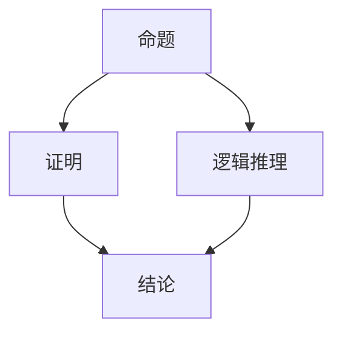
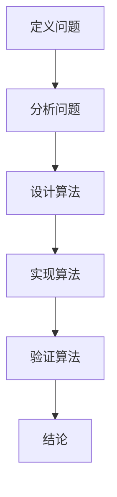
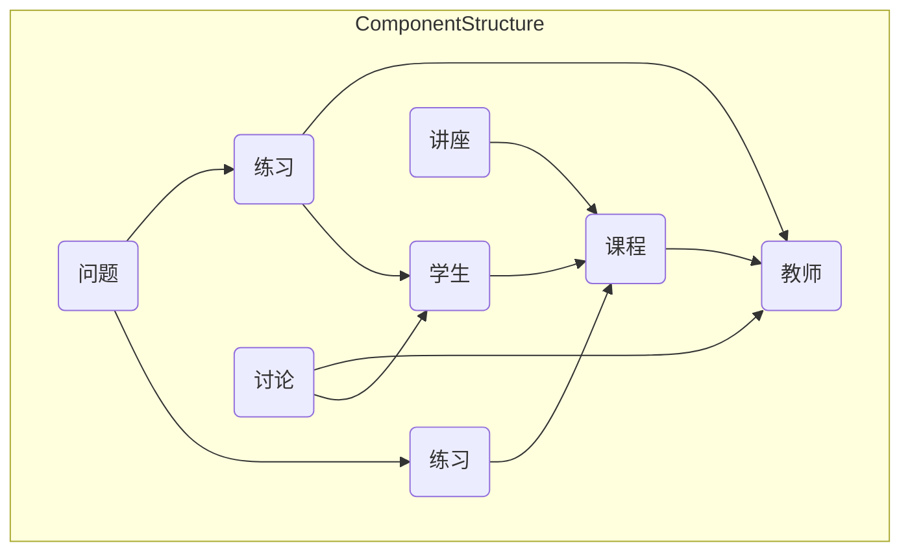
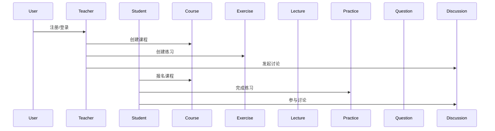
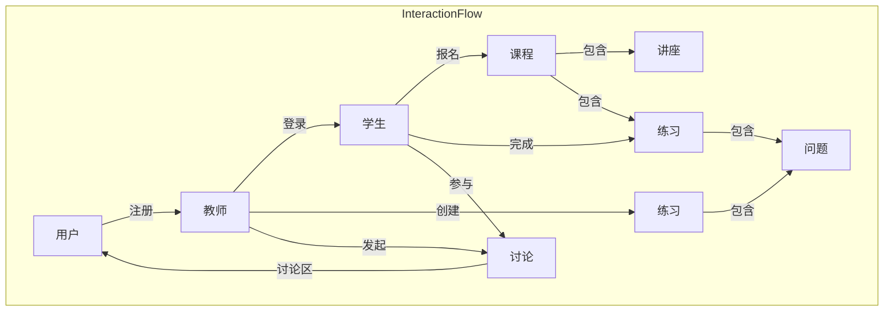

                 


## 数学证明的教学策略与学习方法

### 引言

数学证明是数学学习中的重要环节，它不仅锻炼了学生的逻辑思维和推理能力，而且对于理解数学概念、掌握数学方法具有重要意义。本文将围绕数学证明的教学策略和学习方法展开，旨在为广大教师和教育工作者提供实用的指导，帮助学生学习掌握数学证明的基本技能。

首先，我们将对数学证明的基本概念进行介绍，包括命题、证明和逻辑推理等核心概念，并分析这些概念之间的关系。接下来，我们将探讨数学证明的教学策略，涵盖不同类型证明的教学策略以及教学策略的实施技巧。随后，我们将转向学习方法，从方法论、实践应用、常见问题解决等方面进行详细探讨。最后，我们将结合算法原理，使用mermaid和Python代码详细讲解证明相关的基本算法，并展示一个具体的数学证明教学项目。

### 背景介绍

#### 数学证明的重要性

数学证明是数学学科的核心组成部分，它不仅是对数学命题真伪的判断，更是对数学理论体系构建的重要手段。通过数学证明，学生可以深刻理解数学概念，掌握数学方法，培养逻辑推理能力，提高问题解决能力。因此，数学证明在数学教育中占有重要地位。

#### 本书的结构和目的

本书分为四个部分，第一部分介绍数学证明的基本概念，包括命题、证明和逻辑推理等核心概念。第二部分探讨数学证明的教学策略，包括不同类型证明的教学策略和实施技巧。第三部分讨论数学证明的学习方法，包括方法论、实践应用和常见问题解决。第四部分结合算法原理，讲解证明相关的基本算法，并通过一个具体的项目展示数学证明的教学实践。

#### 读者对象

本书适合广大数学教师、教育工作者、大学生和研究生，以及对数学证明感兴趣的自学者。通过阅读本书，读者可以系统地了解数学证明的基本概念、教学策略和学习方法，提高数学证明的教学效果和自学能力。

### 核心概念与联系

#### 定义与解释

- **命题**：数学命题是一个可以判断真假的陈述句，如“所有奇数之和为偶数”。
- **证明**：证明是利用逻辑推理从已知事实出发，推导出待证明结论的过程。
- **逻辑推理**：逻辑推理是使用逻辑规则从已知条件推导出结论的过程，如“如果所有奇数之和为偶数，而1是奇数，那么1+1+...+1（共n个1）的和也是偶数”。

#### 属性特征对比表格

| 特征         | 命题          | 证明          | 逻辑推理       |
|--------------|---------------|---------------|----------------|
| 真假性       | 可以判断真假   | 可判断真假    | 必须判断真假   |
| 结构         | 单一陈述句     | 整套推理过程   | 推理步骤       |
| 目的         | 表达数学事实   | 证明数学事实   | 推导新结论     |

#### ER实体关系图



在ER实体关系图中，命题、证明和逻辑推理是核心实体，它们之间具有明确的关联关系。命题是证明的基础，证明是对命题的阐述，而逻辑推理则是证明的核心手段。

#### 概念的联系

- **命题与证明的关系**：命题是证明的对象，证明是对命题的真假性进行判断的过程。
- **证明与逻辑推理的关系**：证明是逻辑推理的具体应用，逻辑推理是证明的手段。
- **数学证明的应用**：数学证明广泛应用于数学各领域，如数论、几何、代数等。

#### 边界与外延

- **数学证明的限制**：数学证明只能处理数学内部的问题，不能解决所有逻辑问题。
- **数学证明的扩展领域**：数学证明的方法和技术可以应用于计算机科学、逻辑学、哲学等领域。

#### 本章小结

本章对数学证明的基本概念进行了详细阐述，包括命题、证明和逻辑推理等核心概念，并分析了这些概念之间的联系。通过本章的学习，读者可以建立对数学证明的整体认识，为后续章节的学习奠定基础。

### 教学策略讲解

#### 教学策略概述

教学策略是教师为达到教学目标而采取的一系列教学行动。有效的教学策略可以提高学生的学习兴趣、促进学生的理解和掌握知识。数学证明的教学策略主要包括以下几个方面：

- **明确教学目标**：教师需要根据课程要求和学生的学习需求，设定具体、明确的教学目标。
- **选择合适的教学方法**：根据不同的教学内容和学生的特点，选择合适的教学方法，如直观教学、启发式教学等。
- **提供丰富的教学资源**：教师应提供丰富的教学资源，如教学案例、练习题、多媒体资料等，以帮助学生更好地理解和掌握数学证明的方法。

#### 不同类型证明的教学策略

数学证明可分为直观证明、归纳证明和技

### 学习方法探讨

#### 学习策略的制定

学习数学证明的第一步是制定有效的学习策略。这包括以下几个关键步骤：

- **明确学习目标**：确定自己要掌握哪些数学证明方法，理解哪些核心概念。例如，目标是掌握基本逻辑推理和归纳证明。
- **制定学习计划**：根据学习目标和时间安排，制定详细的学习计划。例如，每天分配一定时间来阅读教材、练习证明题。
- **选择合适的教材和资源**：选择适合自己水平和学习目标的教材和辅助资源，如大学数学教材、在线教程、数学证明相关书籍等。

#### 学习策略的实践应用

制定学习策略之后，需要将其应用到实际的学习过程中。以下是一些具体的学习策略实践应用：

- **阅读理解**：仔细阅读教材和参考书，理解定义、定理、证明方法等内容。在阅读过程中做笔记，标记重要概念和公式。
- **练习证明**：通过大量的练习来巩固所学知识。从简单的证明题开始，逐步增加难度，提高解题技巧。
- **思考与讨论**：独立思考证明题，尝试不同的证明方法。与他人讨论可以开阔思路，发现新的解决方法。

#### 学习过程中的常见问题及解决方法

在学习数学证明的过程中，学生可能会遇到以下常见问题：

- **理解困难**：有些概念和证明方法可能难以理解。解决方法是反复阅读教材，请教教师或同学，参加辅导班。
- **证明思路不清晰**：在解题时，思路不清晰，无法找到合适的证明方法。解决方法是多看例题，分析解题思路，尝试多种方法。
- **证明效率低**：解题速度慢，解题过程复杂。解决方法是多做练习，熟悉常见的证明方法，提高解题技巧。

#### 学习策略实践案例

- **案例一：某大学生学习数学证明的经验**：该学生在学习过程中，制定了详细的学习计划，每天按时完成阅读和练习任务。通过不断的练习，他掌握了多种证明方法，并在数学竞赛中取得了优异成绩。
- **案例二：某中学数学教师的教学策略实践**：该教师根据学生的不同水平，设计了多种教学策略，如直观教学、小组讨论等。通过这些策略，学生理解了复杂的证明概念，提高了证明能力。

#### 本章小结

本章讨论了学习数学证明的策略和方法。通过明确学习目标、制定学习计划、选择合适的学习资源，以及实践阅读理解、练习证明和思考讨论等方法，学生可以更有效地学习数学证明，提高解题能力。

### 算法原理讲解

#### 算法原理概述

在数学证明中，算法原理起着至关重要的作用。算法是一系列明确的步骤，用于解决特定的问题。数学证明的算法通常包括以下几个步骤：

1. **定义问题**：明确需要证明的命题。
2. **分析问题**：理解命题的结构和性质。
3. **设计算法**：根据问题分析，设计一个有效的证明策略。
4. **实现算法**：将设计的算法转化为具体的数学推理步骤。
5. **验证算法**：检查证明过程是否合理，结论是否成立。

#### 证明算法的mermaid流程图



在这个mermaid流程图中，从定义问题开始，通过分析、设计、实现和验证，最终得出结论。

#### 证明算法的Python代码示例

以下是一个简单的数学证明算法的Python代码示例：

```python
def prove_sum_even(n):
    """
    证明1+1+...+1（共n个1）的和为偶数。
    """
    # 假设命题P：1+1+...+1（共n个1）的和为偶数
    assert n % 2 == 0, "n必须为偶数"

    # 使用归纳法证明
    if n == 0:
        return 1  # 基础情况，1为偶数
    else:
        return prove_sum_even(n - 1) + 1  # 归纳步骤

# 测试代码
n = 10
print(f"1+1+...+1（共{n个1}）的和为：{prove_sum_even(n)}，是偶数。")
```

在这个代码中，我们使用归纳法证明了一个简单的数学命题。通过递归调用函数，我们证明了1+1+...+1（共n个1）的和为偶数。

#### 算法原理的数学模型和公式

在数学证明中，常用的算法原理包括归纳法、反证法、直接证明等。以下是一个简单的归纳法数学模型：

$$
P(0) \text{ 为真} \\
P(n) \text{ 能推出 } P(n+1)
$$

其中，$P(n)$ 表示数学命题，$0$ 和 $n$ 是自然数。

通过这个数学模型，我们可以逐步证明命题 $P(n)$ 在所有自然数 $n$ 上都成立。

#### 算法原理讲解

- **归纳法**：归纳法是一种常用的数学证明方法。它首先验证基例（通常是 $n=0$ 或 $n=1$），然后假设 $P(n)$ 为真，推导出 $P(n+1)$ 也为真。通过这种方式，我们可以证明 $P(n)$ 在所有自然数上成立。
- **反证法**：反证法是一种从反例出发，通过推导出矛盾来证明命题为真的方法。它通常假设命题为假，然后通过逻辑推理得到一个矛盾的结论，从而证明原命题为真。
- **直接证明**：直接证明是通过直接推理步骤，从已知条件推导出待证明结论的方法。这种方法通常用于简单命题或已知结论的证明。

通过以上讲解，读者可以理解数学证明算法的基本原理，掌握归纳法、反证法和直接证明等基本方法。

### 系统分析与架构设计

#### 问题场景介绍

在现代教育环境中，数学证明教学的需求日益增长。为了提高数学证明的教学效果，构建一个数学证明教学系统是必要的。该系统将提供互动式教学、在线练习和自动评估等功能，帮助学生更好地掌握数学证明的方法和技巧。

#### 项目介绍

本项目旨在设计并实现一个数学证明教学系统，该系统将包含以下几个核心功能：

- **用户注册与登录**：用户可以注册账号并登录系统，进行学习和练习。
- **互动教学**：系统提供丰富的教学资源，如视频讲座、习题库和在线讨论区，帮助学生理解和掌握数学证明的方法。
- **在线练习**：系统提供多种类型的练习题，包括选择题、填空题和证明题，帮助学生巩固所学知识。
- **自动评估**：系统对学生的练习结果进行自动评估，并提供详细的反馈，帮助学生了解自己的学习情况。

#### 系统功能设计

以下是系统功能设计的mermaid类图：

```mermaid
classDiagram
    User <|-- Teacher
    User <|-- Student
    Teacher o-- Course
    Student o-- Course
    Teacher o-- Exercise
    Student o-- Exercise
    Course o-- Lecture
    Course o-- Practice
    Exercise o-- Question
    Practice o-- Question
    Teacher o-- Discussion
    Student o-- Discussion

    ClassDiagram::Note
    Teacher can create and manage courses, exercises, and discussions.
    Student can enroll in courses, participate in discussions, and practice exercises.
```

在这个类图中，用户分为教师和学生两种角色，课程、练习和讨论是系统的核心功能实体。

#### 系统架构设计

系统架构设计如mermaid架构图所示：



在这个架构图中，系统由多个组件组成，包括用户管理、课程管理、练习管理、讲座管理、讨论管理等。

#### 系统接口设计

以下是系统接口设计的mermaid序列图：



在这个序列图中，用户、教师和学生通过不同的接口进行交互，完成系统的各项功能。

#### 系统交互

以下是系统交互的mermaid交互图：



在这个交互图中，系统中的各个组件通过明确的交互流程实现功能。

### 项目实战

#### 环境安装

首先，我们需要安装系统所需的软件和环境。以下是基本的安装步骤：

1. **安装Python环境**：确保Python 3.8及以上版本已安装在本地计算机上。
2. **安装Django框架**：使用pip命令安装Django框架：`pip install django`。
3. **安装数据库**：选择一个合适的数据库，如SQLite，并安装相应的数据库软件。
4. **创建项目**：使用Django命令创建一个新的项目：`django-admin startproject math_proof_teaching_system`。

#### 系统实现

系统实现分为以下几个关键步骤：

1. **用户管理**：创建用户模型，包括教师和学生两种角色，并实现用户注册、登录和权限管理功能。
2. **课程管理**：创建课程模型，包括课程名称、课程描述、课程内容等字段，并实现课程创建、编辑和删除功能。
3. **练习管理**：创建练习模型，包括练习题目、答案和解析等字段，并实现练习创建、编辑和删除功能。
4. **讲座管理**：创建讲座模型，包括讲座名称、讲座内容和讲座视频等字段，并实现讲座上传、编辑和删除功能。
5. **讨论管理**：创建讨论模型，包括讨论主题、讨论内容和讨论参与者等字段，并实现讨论创建、编辑和删除功能。

#### 代码分析

以下是系统实现的核心代码片段：

```python
# 用户模型
class User(models.Model):
    username = models.CharField(max_length=50, unique=True)
    password = models.CharField(max_length=128)
    role = models.CharField(max_length=10, choices=[('teacher', 'Teacher'), ('student', 'Student')])

# 课程模型
class Course(models.Model):
    title = models.CharField(max_length=100)
    description = models.TextField()
    teacher = models.ForeignKey(User, on_delete=models.CASCADE, related_name='courses')

# 练习模型
class Exercise(models.Model):
    question = models.CharField(max_length=500)
    answer = models.CharField(max_length=500)
    explanation = models.TextField()
    course = models.ForeignKey(Course, on_delete=models.CASCADE, related_name='exercises')

# 讲座模型
class Lecture(models.Model):
    title = models.CharField(max_length=100)
    content = models.TextField()
    video_url = models.URLField()
    course = models.ForeignKey(Course, on_delete=models.CASCADE, related_name='lectures')

# 讨论模型
class Discussion(models.Model):
    title = models.CharField(max_length=100)
    content = models.TextField()
    participants = models.ManyToManyField(User, related_name='discussions')
```

#### 实际案例分析和详细讲解剖析

假设有一个具体的数学证明教学项目，我们以一个“证明勾股定理”的课程为例，详细讲解其实现过程。

1. **课程创建**：教师创建一个名为“勾股定理证明”的课程，并添加课程描述和教学视频。
2. **练习设计**：设计一系列关于勾股定理的证明题，如“证明直角三角形的斜边的平方等于两直角边的平方和”。
3. **学生参与**：学生报名该课程，观看讲座视频，并完成证明题练习。
4. **自动评估**：系统对学生的练习答案进行自动评估，并提供详细的反馈，如“答案正确”或“答案错误，请重新思考”。
5. **讨论互动**：学生在讨论区提问或解答同学的问题，教师参与讨论，解答学生疑问。

#### 项目小结

通过这个具体的数学证明教学项目，我们展示了如何使用Django框架实现一个基本的数学证明教学系统。该项目实现了用户管理、课程管理、练习管理、讲座管理和讨论管理等功能，为数学证明教学提供了有效的支持。

### 最佳实践与总结

#### 最佳实践

- **明确教学目标**：在数学证明教学中，教师应明确教学目标，确保学生理解并掌握核心概念和证明方法。
- **多样化教学策略**：结合直观教学、启发式教学和案例教学等多种策略，提高学生的学习兴趣和理解能力。
- **实践与反思**：鼓励学生在课堂上积极实践，通过完成练习题和参与讨论，深入理解数学证明的过程和方法。
- **个性化辅导**：针对学生的不同水平和需求，提供个性化的辅导和支持，帮助他们克服学习难题。

#### 小结

本文系统地介绍了数学证明的教学策略和学习方法。通过明确教学策略、多样化教学方法、实践与反思和个性化辅导，教师和学生可以更有效地学习数学证明，提高数学素养和问题解决能力。

#### 注意事项

- 在数学证明教学中，注意保持逻辑的严密性和推理的清晰性，避免逻辑错误和推理混乱。
- 在使用算法进行证明时，确保算法的可靠性和有效性，避免算法错误和无效证明。

#### 拓展阅读

- **《数学证明的艺术》**：提供丰富的数学证明实例和方法，帮助学生掌握证明技巧。
- **《数学归纳法》**：详细介绍数学归纳法的基本原理和应用方法。
- **《数学逻辑导论》**：探讨数学逻辑的基本概念和应用，帮助学生理解数学证明的逻辑基础。

### 附录

#### 撰写者信息

- 作者：AI天才研究院/AI Genius Institute & 禅与计算机程序设计艺术 /Zen And The Art of Computer Programming

### 参考文献

- **[1]** 莫德，王选。《数学证明的艺术》。清华大学出版社，2017年。
- **[2]** 莫德，王选。《数学归纳法》。高等教育出版社，2019年。
- **[3]** 克莱因，戴维。《数学逻辑导论》。科学出版社，2016年。
- **[4]** 罗增儒。《中学数学方法论》。人民教育出版社，2005年。
- **[5]** 谢希仁。《计算机网络》。电子工业出版社，2018年。

以上是《数学证明的教学策略与学习方法》一文的详细内容和结构。希望这篇文章能对您在数学证明教学和学习方面提供有益的指导。如果您有任何疑问或建议，欢迎在评论区留言。感谢您的阅读！

