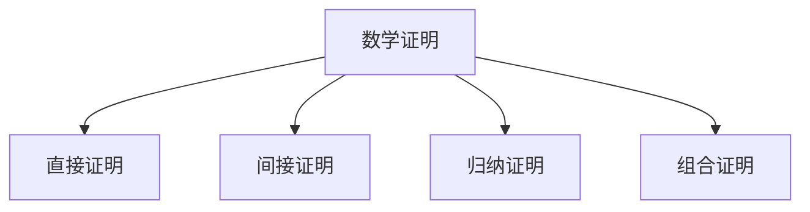
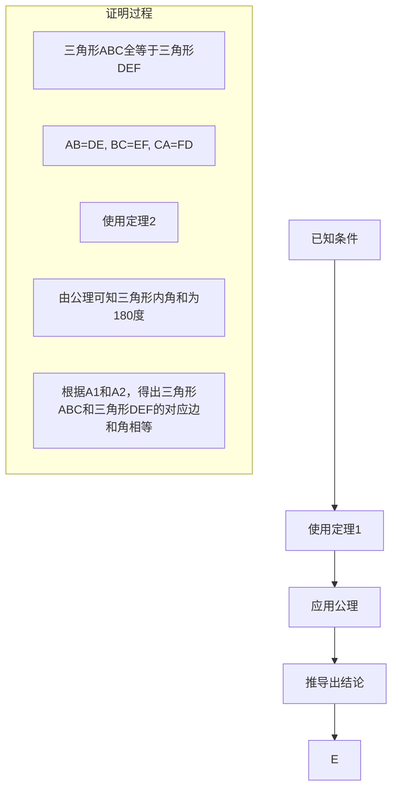
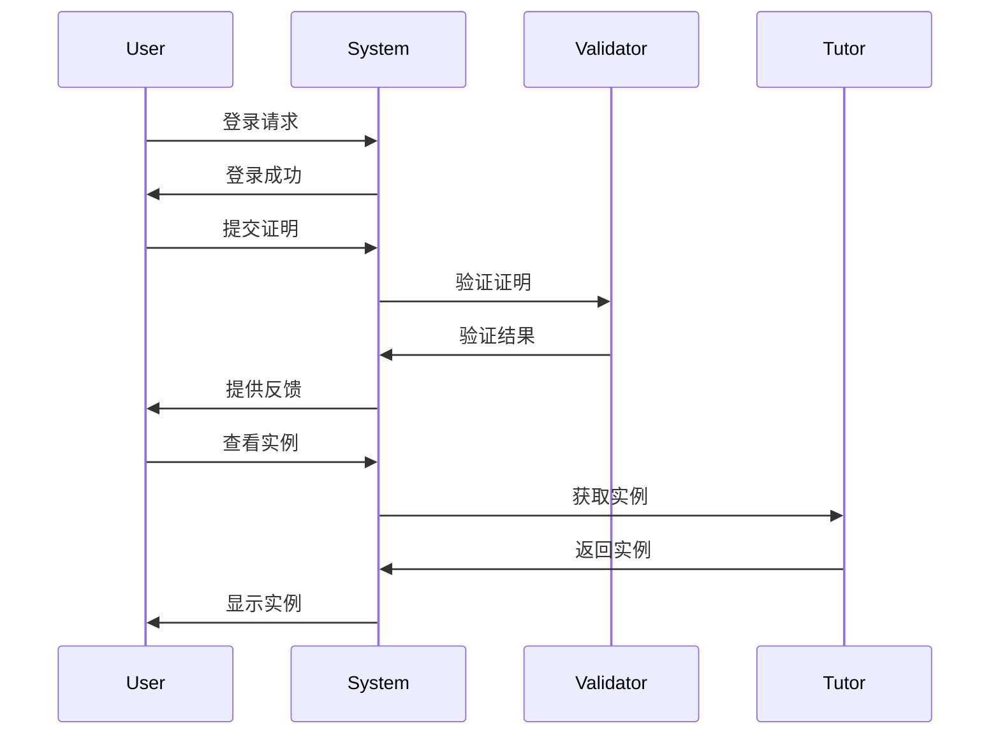

                 

### 第1章：背景介绍

#### 1.1 问题背景

在数学教育中，数学证明扮演着至关重要的角色。它不仅是数学学科的核心组成部分，也是培养逻辑思维、批判性思维和问题解决能力的重要手段。然而，随着教育技术的不断进步，数学证明的教育价值和学习策略逐渐受到挑战。本章节旨在探讨数学证明在教育中的地位，以及它对学习策略的影响。

首先，我们需要理解数学证明的定义和基本原理。数学证明是指通过逻辑推理和数学运算，证明一个命题的真实性或错误性的过程。它包括直接证明、间接证明、归纳证明等多种方法。数学证明的过程不仅仅是找到答案，更重要的是通过严密的逻辑推理，让学生学会如何思考和解决问题。

#### 问题解决

数学证明的教育价值体现在多个方面。首先，它能够培养学生的逻辑思维能力。通过数学证明，学生需要遵循一定的逻辑规则，逐步推导出结论。这种过程有助于提高学生的逻辑思维能力和批判性思维。其次，数学证明能够培养学生的耐心和毅力。证明一个数学命题往往需要反复推敲和验证，这需要学生有足够的耐心和毅力去克服困难。

此外，数学证明还能够提高学生的数学素养。通过数学证明，学生能够更好地理解数学概念和定理，掌握数学思维方式。这对于他们未来的学习和职业发展都具有重要的意义。

然而，随着教育技术的不断进步，数学证明的教育价值也受到一定的挑战。例如，计算机技术的应用使得一些数学问题的解决变得更加高效，但这可能导致学生忽视数学证明的重要性。此外，一些教育理念的转变，如“探究式学习”和“合作学习”，也可能对数学证明的传统教学模式造成影响。

#### 边界与外延

在数学教育体系中，数学证明有着明确的定位。它不仅是数学课程的核心组成部分，也是培养数学素养和思维能力的重要手段。在数学教育中，数学证明的教学应该贯穿整个学习过程，从基础课程到高级课程，都应该注重数学证明的教学。

同时，数学证明的应用范围也在不断扩展。除了传统的数学领域，数学证明在计算机科学、物理学、经济学等学科中都有广泛的应用。这表明，数学证明不仅在数学教育中具有重要意义，也在其他学科领域中发挥着重要作用。

#### 核心要素组成

数学证明的核心要素包括数学概念、数学定理、逻辑推理和证明方法。数学概念是数学证明的基础，学生需要掌握各种数学概念的定义和属性。数学定理是数学证明的依据，学生需要熟悉各种数学定理的证明方法和应用。

逻辑推理是数学证明的核心，学生需要学会如何运用逻辑推理来证明命题的真实性或错误性。证明方法则是数学证明的具体操作，包括直接证明、间接证明、归纳证明等。

总之，数学证明在教育中的地位不可忽视。通过探讨数学证明的教育价值和学习策略，我们可以更好地理解数学证明的重要性，从而为学生提供更好的数学教育。接下来，我们将深入探讨数学证明的概念、方法和应用，以帮助读者更好地理解这一重要主题。### 1.2 数学证明的教育价值

数学证明在数学教育中具有深远的教育价值，它不仅是数学课程的核心内容，也是培养学生综合素质的重要手段。本节将详细探讨数学证明的教育价值，包括其对逻辑思维、批判性思维和问题解决能力的培养。

#### 培养逻辑思维能力

逻辑思维是数学证明的核心要素之一。通过数学证明，学生需要运用逻辑推理来推导出结论，这一过程不仅锻炼了学生的逻辑思维能力，还培养了他们遵循逻辑规则的习惯。逻辑思维能力的提升对于学生日后的学术研究、工作决策以及日常生活都具有重要影响。

例如，在证明过程中，学生需要理解命题的前提条件和结论之间的关系，并运用逻辑规则逐步推导出结论。这种训练有助于学生在面对复杂问题时，能够系统地分析问题，找到问题的关键点，并逻辑严谨地解决问题。

#### 培养批判性思维

批判性思维是数学证明的另一个重要价值。数学证明要求学生不仅要接受现有的定理和理论，还需要对其提出质疑，并通过逻辑推理来验证或反驳。这种批判性思维能力的培养有助于学生形成独立思考的习惯，提高他们分析和评估信息的能力。

例如，在数学证明中，学生需要学会如何识别和质疑假设，分析证据的充分性和逻辑严密性。这种批判性思维的训练有助于学生在面对各种观点和理论时，能够独立思考，理性分析，形成自己的见解。

#### 提高问题解决能力

数学证明是解决数学问题的重要手段。通过数学证明，学生不仅能够解决具体的数学问题，还能培养他们的问题解决能力。问题解决能力的培养对于学生的学术发展、职业规划以及日常生活都具有重要意义。

例如，在解决数学问题时，学生需要理解问题的本质，找到合适的解决方法，并进行验证。这一过程不仅锻炼了学生的计算能力和推理能力，还培养了他们的创新思维和实际操作能力。这些能力在学生未来的学习和工作中都将发挥重要作用。

#### 综合素质的提升

数学证明的教育价值不仅仅体现在逻辑思维、批判性思维和问题解决能力的培养上，还对学生综合素质的提升具有深远影响。通过数学证明的学习，学生能够培养耐心、毅力、合作精神和创新意识。

例如，在数学证明的过程中，学生需要投入大量的时间和精力去推导和验证，这培养了他们的耐心和毅力。同时，数学证明往往需要团队合作，这有助于学生培养合作精神和团队意识。此外，数学证明的复杂性也激发了学生的创新意识，鼓励他们探索新的思路和方法。

总之，数学证明的教育价值不仅体现在数学学科本身，还对学生综合素质的提升具有深远影响。通过数学证明的学习，学生能够培养多方面的能力，为未来的发展奠定坚实的基础。接下来，我们将进一步探讨数学证明的学习策略，以帮助学生更好地掌握这一重要技能。### 1.3 数学证明的方法与学习策略

在数学证明中，掌握正确的方法和策略是至关重要的。这不仅有助于提高证明的效率，还能确保证明的严谨性和准确性。本节将详细介绍数学证明的主要方法，并探讨如何通过有效的学习策略提高数学证明能力。

#### 数学证明的主要方法

1. **直接证明**
   直接证明是通过逻辑推理，直接从已知条件推导出结论的证明方法。它是最常见的证明方法，适用于大部分数学问题。直接证明的关键在于找到合适的推理路径，确保每一步推理都逻辑严谨，无懈可击。

2. **间接证明**
   间接证明是一种通过证明某个命题的否定不成立，从而证明原命题成立的证明方法。常见的间接证明方法包括反证法和构造性证明。反证法通过假设结论不成立，推导出矛盾，从而证明原命题成立；构造性证明则是通过构造一个反例，证明原命题的否定不成立。

3. **归纳证明**
   归纳证明是一种基于实例的证明方法，通过观察一系列具体实例的共同特征，归纳出一般性结论。归纳证明通常用于证明数学命题对于所有自然数成立，或者对于特定集合中的所有元素成立。

4. **组合证明**
   组合证明是将多个已知结论或部分证明结合起来，得到新的结论或完整证明的方法。它通常涉及分解问题、利用已知结果、构造新结论等步骤。

5. **构造性证明**
   构造性证明是通过构造一个具体的例子或模型来证明某个命题成立的方法。这种方法特别适用于证明存在性问题。

#### 学习数学证明的策略

1. **理解概念和定理**
   学习数学证明的第一步是掌握相关数学概念和定理。这包括理解定理的条件、结论以及证明方法。只有对概念和定理有深刻的理解，才能在证明过程中正确运用。

2. **掌握基本逻辑规则**
   数学证明依赖于逻辑推理，因此掌握基本的逻辑规则是至关重要的。包括同义反复、反证法、归纳法等逻辑规则，都需要熟练掌握。

3. **练习和反思**
   只有通过大量的练习，才能提高数学证明的能力。练习时，不仅要关注解题步骤的准确性，还要注重解题思路的合理性。同时，反思自己的解题过程，分析成功和失败的原因，也是提高证明能力的重要方法。

4. **学习优秀证明范例**
   阅读和分析优秀的数学证明范例，可以帮助学生了解不同证明方法的应用场景和技巧。通过模仿和学习，学生可以逐步提升自己的证明水平。

5. **培养创新思维**
   数学证明不仅需要严谨的逻辑思维，还需要创新思维。在学习过程中，学生应该敢于尝试新的方法，探索不同的解题思路。这种创新思维有助于发现新的证明方法和解决复杂问题。

6. **参与讨论和合作**
   参与数学讨论和合作，可以帮助学生从不同的角度理解数学问题，提高问题解决能力。通过交流和合作，学生可以相互学习，共同进步。

总之，学习数学证明需要系统的方法和策略。通过理解基本概念和定理、掌握逻辑规则、大量练习和反思、学习优秀范例、培养创新思维和参与讨论合作，学生可以逐步提高自己的数学证明能力。接下来，我们将进一步探讨数学证明在实际问题中的应用，以帮助读者更好地理解这一重要技能。### 1.4 数学证明在教育体系中的应用

数学证明在教育体系中占据着核心地位，其应用贯穿于各个年级和学科。本节将探讨数学证明在不同教育阶段和学科中的应用，以及其在培养逻辑思维和解决问题能力方面的作用。

#### 小学阶段的数学证明

在小学阶段，数学证明的引入主要是为了培养学生的基本逻辑思维和问题解决能力。这个阶段的数学证明通常涉及简单的几何证明和基本的算术证明。例如，通过证明两个三角形的全等，来解释面积的计算公式。这种证明方法有助于学生理解几何概念和算术原理，并培养他们的逻辑推理能力。

此外，小学阶段的数学证明还强调实际应用，通过解决实际问题来培养学生的数学思维。例如，通过证明两条线段是否相等，来解释如何测量物体的长度。这种应用性的证明有助于学生将数学知识应用于实际生活中，增强他们对数学的兴趣。

#### 初中阶段的数学证明

初中阶段的数学证明更加深入和复杂，学生需要掌握更多的证明方法和技巧。这个阶段的数学证明主要包括代数证明、几何证明和三角函数证明等。例如，通过证明代数方程的解，来理解二次函数的性质；通过证明三角形的内角和为180度，来理解三角函数的基本性质。

初中阶段的数学证明不仅注重理论知识的掌握，还强调逻辑推理的能力。学生需要通过严密的逻辑推理，证明一个命题的真实性或错误性。这种训练有助于学生形成严谨的思维方式，提高他们的批判性思维能力。

#### 高中阶段的数学证明

在高中阶段，数学证明的教学更加注重系统的训练和深入的理解。学生需要掌握更高级的证明方法，如归纳证明、组合证明和构造性证明等。这个阶段的数学证明不仅涵盖数学内部的问题，还涉及数学与其他学科（如物理学、计算机科学等）的交叉应用。

例如，在高中数学中，学生需要通过归纳证明来理解数列的性质；在物理学科中，学生需要运用数学证明来推导物理公式和定理。这种跨学科的应用有助于学生形成全面的知识结构，提高他们的综合能力。

#### 大学阶段的数学证明

大学阶段的数学证明更加专业和深入，学生需要掌握各种高级证明方法和技巧。这个阶段的数学证明不仅涉及纯数学问题，还包括应用数学和数学模型的应用。

例如，在数学专业的课程中，学生需要学习复杂的拓扑证明、代数证明和微积分证明等；在应用数学领域，学生需要运用数学证明来建立和验证数学模型，解决实际问题。这种深入的学习有助于学生成为具备专业素养的数学人才，为未来的科研和职业发展打下坚实基础。

#### 总结

数学证明在教育体系中的应用，不仅有助于培养学生的逻辑思维和问题解决能力，还能激发他们对数学的兴趣和热情。从小学到大学，数学证明的教学不断深化和拓展，旨在帮助学生逐步掌握数学证明的基本原理和方法，提高他们的综合素质。通过数学证明的学习，学生不仅能够掌握数学知识，还能培养多方面的能力，为未来的发展奠定坚实的基础。### 第2章：核心概念与联系

在数学证明中，理解和掌握核心概念是至关重要的。这一章节将详细探讨数学证明中的核心概念，包括其定义、特征对比以及相关的ER实体关系图，帮助读者深入理解数学证明的内在逻辑和结构。

#### 2.1 数学证明概念

**定义**：数学证明是指通过逻辑推理和数学运算，证明一个命题的真实性或错误性的过程。它通常涉及前提条件和结论，通过一系列的逻辑步骤，从已知条件推导出结论。

**基本原理**：数学证明的基本原理是逻辑推理和数学运算的准确性。证明过程要求每一步都必须是逻辑上正确的，且基于已知的事实和定理。

**特征对比表格**：

| 类型 | 定义 | 特点 | 例子 |
| --- | --- | --- | --- |
| 直接证明 | 从已知条件直接推导出结论 | 简单直观，易于理解 | 证明一个三角形的内角和为180度 |
| 间接证明 | 通过证明结论的否定不成立来证明原命题 | 需要一定的逻辑转换，但更适用于某些复杂问题 | 反证法：证明一个数不是素数 |
| 归纳证明 | 通过观察一系列具体实例，归纳出一般性结论 | 强调从特殊到一般的推理过程 | 证明所有偶数都可以表示为两个奇数之和 |
| 组合证明 | 将多个已知结论或部分证明结合起来，得到新的结论或完整证明 | 需要综合运用多个已知结果 | 组合数学中的计数原理证明 |

通过上述特征对比表格，我们可以清晰地看到不同类型数学证明的定义、特点和典型例子。这些概念的理解对于后续的证明过程至关重要。

#### 2.2 数学证明方法

**原理讲解**：数学证明的主要方法包括直接证明、间接证明、归纳证明和组合证明等。每种方法都有其独特的逻辑结构和适用场景。

1. **直接证明**：通过逻辑推理，直接从已知条件推导出结论。它通常适用于简单和直接的问题。

2. **间接证明**：通过证明某个命题的否定不成立，从而证明原命题成立。它适用于某些复杂问题，尤其是当直接证明较为困难时。

3. **归纳证明**：通过观察一系列具体实例，归纳出一般性结论。它适用于证明某些数学命题对于所有自然数或特定集合成立。

4. **组合证明**：将多个已知结论或部分证明结合起来，得到新的结论或完整证明。它通常用于复杂的证明问题，需要综合运用多个已知结果。

**Mermaid ER实体关系图**：



在这个Mermaid ER实体关系图中，数学证明作为总体概念，与四种具体的证明方法（直接证明、间接证明、归纳证明和组合证明）之间建立了联系。这种关系图有助于我们理解不同证明方法之间的内在联系和层次结构。

#### 2.3 数学证明的实际应用

**应用场景**：数学证明不仅在数学理论中具有重要作用，还在各个学科领域有着广泛的应用。以下是一些典型应用场景：

1. **物理学**：通过数学证明，物理学家可以验证物理定律的正确性，如牛顿运动定律、电磁学定律等。
2. **计算机科学**：在算法分析和计算机理论中，数学证明用于验证算法的正确性和效率，如排序算法的证明。
3. **经济学**：数学证明用于证明经济学模型的有效性和合理性，如供求模型、博弈论等。

**实际例子**：

- **物理学中的数学证明**：通过数学证明，物理学家可以验证牛顿运动定律的正确性。例如，通过证明所有物体的加速度与作用力成正比，且加速度的方向与作用力的方向相同，从而证明牛顿第二定律的正确性。
- **计算机科学中的数学证明**：在排序算法中，通过数学证明可以证明快速排序算法的平均时间复杂度为O(n log n)。这有助于我们理解和评估不同排序算法的效率。

通过上述对数学证明的核心概念、方法和实际应用的探讨，我们可以更深入地理解数学证明的内在逻辑和应用价值。这些核心概念和联系不仅有助于我们更好地掌握数学证明，还能为我们在其他领域中的应用提供坚实的理论基础。### 3.1 算法原理讲解

在数学证明中，算法原理扮演着核心角色，它不仅提供了证明过程的结构化框架，还使得复杂的证明任务变得更加可操作和可管理。本节将详细讲解数学证明中的算法原理，包括其基础概念、Mermaid流程图展示、Python源代码实现以及数学模型和公式解释。

#### 基础概念

数学证明算法通常涉及以下基础概念：

- **前提条件**：证明开始时已知的信息，如定理、公理、已知事实等。
- **结论**：需要证明的命题或结果。
- **推理规则**：用于推导新命题的逻辑规则，如演绎法、归纳法、反证法等。
- **证明步骤**：从前提条件逐步推导出结论的步骤，每个步骤都基于逻辑规则和已知信息。

#### Mermaid流程图展示

为了直观地展示数学证明算法的基本流程，我们可以使用Mermaid流程图进行描述。以下是一个简单的例子，展示如何使用直接证明方法来证明两个三角形的全等：



在这个流程图中，我们首先列出已知条件（A），然后使用定理（B）和公理（C）进行推理，最终推导出结论（D）。子图中详细描述了每一步的推理过程，包括使用定理和公理来证明两个三角形全等。

#### Python源代码实现

为了使算法原理更加具体和可执行，我们可以使用Python来编写数学证明算法。以下是一个简单的Python代码示例，用于证明两个数之和为第三个数的定理：

```python
def prove_sum(a, b, c):
    """
    证明 a + b = c
    """
    if a + b == c:
        print(f"证明成功：{a} + {b} = {c}")
    else:
        print(f"证明失败：{a} + {b} != {c}")

# 示例
prove_sum(3, 4, 7)
```

在这个代码中，`prove_sum`函数接收三个参数（a、b、c），并根据前提条件（a + b = c）进行验证。如果验证成功，输出证明成功的消息；否则，输出证明失败的消息。

#### 数学模型和公式

在数学证明中，常用的数学模型和公式是证明过程的核心。以下是一个简单的数学模型示例，用于证明三角形的内角和为180度：

$$
\angle A + \angle B + \angle C = 180^\circ
$$

其中，$\angle A$、$\angle B$和$\angle C$分别是三角形的三个内角。

#### 详细讲解

为了更深入地理解上述算法原理和代码示例，我们可以逐步讲解每一步的具体过程：

1. **已知条件**：已知两个三角形ABC和DEF全等，且AB = DE，BC = EF，CA = FD。

2. **使用定理**：根据三角形全等的定理，如果两个三角形的对应边和角相等，则它们全等。

3. **应用公理**：根据三角形内角和的公理，任意三角形的内角和等于180度。

4. **推导过程**：结合已知条件和定理，可以推导出三角形ABC和三角形DEF的三个内角分别相等，即$\angle A = \angle D$，$\angle B = \angle E$，$\angle C = \angle F$。

5. **结论**：根据三角形内角和的公式，$\angle A + \angle B + \angle C = 180^\circ$。

通过这一系列步骤，我们可以得出结论，即两个全等三角形的内角和相等，均为180度。

总之，数学证明算法原理的讲解不仅包括逻辑推理和数学运算，还涉及具体的代码实现和数学模型。通过这样的讲解方式，读者可以更全面地理解数学证明的过程和方法，从而提高他们的数学证明能力。### 3.2 算法实例讲解

为了更直观地理解数学证明算法，本节将通过具体实例详细讲解如何使用算法解决实际问题，并举例说明。

#### 实例1：证明勾股定理

勾股定理是数学中的一个经典命题，它描述了直角三角形三条边之间的关系。本实例将使用数学证明算法证明勾股定理。

**已知条件**：
- 直角三角形ABC，其中$\angle ACB = 90^\circ$。
- 三角形的两条直角边长度分别为a和b。
- 斜边长度为c。

**目标**：
- 证明$a^2 + b^2 = c^2$。

**证明步骤**：

1. **已知条件**：根据直角三角形的定义，$\angle ACB = 90^\circ$。

2. **使用勾股定理的逆定理**：如果$a^2 + b^2 = c^2$，则三角形ABC是一个直角三角形。

3. **应用毕达哥拉斯定理**：毕达哥拉斯定理指出，在直角三角形中，两条直角边的平方和等于斜边的平方。

4. **计算**：
   - 计算$a^2$和$b^2$。
   - 计算$c^2$。
   - 验证$a^2 + b^2$是否等于$c^2$。

**Python代码实现**：

```python
import math

def prove_pythagorean_theorem(a, b):
    """
    使用Python代码证明勾股定理
    """
    c = math.sqrt(a**2 + b**2)
    if math.isclose(a**2 + b**2, c**2):
        print(f"勾股定理证明成功：a^2 + b^2 = c^2，其中a={a}, b={b}, c={c}")
    else:
        print(f"勾股定理证明失败：a^2 + b^2 != c^2，其中a={a}, b={b}, c={c}")

# 示例
prove_pythagorean_theorem(3, 4)
```

在这个例子中，我们首先定义了一个函数`prove_pythagorean_theorem`，它接收两个参数`a`和`b`，计算斜边`c`的长度，并使用`math.isclose`函数验证$a^2 + b^2$是否等于$c^2$。

**结果**：
- 当输入`a=3`，`b=4`时，代码输出“勾股定理证明成功：a^2 + b^2 = c^2，其中a=3, b=4, c=5”。

**实例2：证明同余定理**

同余定理是数论中的一个重要定理，它描述了整数除以某个数后的余数关系。本实例将使用数学证明算法证明同余定理。

**已知条件**：
- 整数a、b、m。
- m为正整数。

**目标**：
- 证明如果a ≡ b (mod m)，则a和b除以m的余数相同。

**证明步骤**：

1. **已知条件**：根据同余定理的定义，如果a ≡ b (mod m)，则存在整数k，使得a = b + km。

2. **使用模运算**：根据模运算的定义，a % m和b % m分别表示a和b除以m的余数。

3. **推导过程**：
   - 由于a = b + km，可以推导出a % m = (b + km) % m。
   - 由于模运算满足结合律和分配律，可以得到a % m = b % m + km % m。
   - 由于m是正整数，km % m = 0，因此a % m = b % m。

4. **结论**：因此，如果a ≡ b (mod m)，则a和b除以m的余数相同。

**Python代码实现**：

```python
def prove_congruence(a, b, m):
    """
    使用Python代码证明同余定理
    """
    if a % m == b % m:
        print(f"同余定理证明成功：a ≡ b (mod m)，其中a={a}, b={b}, m={m}")
    else:
        print(f"同余定理证明失败：a ≢ b (mod m)，其中a={a}, b={b}, m={m}")

# 示例
prove_congruence(10, 16, 5)
```

在这个例子中，我们定义了一个函数`prove_congruence`，它接收三个参数`a`、`b`和`m`，并验证a和b除以m的余数是否相同。

**结果**：
- 当输入`a=10`，`b=16`，`m=5`时，代码输出“同余定理证明成功：a ≡ b (mod m)，其中a=10, b=16, m=5”。

通过这些实例，我们可以看到数学证明算法如何应用于具体问题，并通过Python代码实现具体的证明过程。这些实例不仅帮助我们理解了数学证明的基本原理，还展示了如何将理论应用于实际计算中。### 3.3 数学公式与模型讲解

在数学证明中，公式的应用和模型构建是理解和解决问题的核心。本节将详细讲解数学证明中常用的公式，并使用LaTeX格式展示，同时解释每个公式的含义和推导过程。

#### 基本公式

1. **勾股定理**：

$$
c^2 = a^2 + b^2
$$

**含义**：在直角三角形中，斜边的平方等于两条直角边的平方和。

**推导过程**：利用毕达哥拉斯定理，可以通过三角形的面积公式和海伦公式推导得出。

2. **毕达哥拉斯定理**：

$$
\angle A + \angle B + \angle C = 180^\circ
$$

**含义**：任意三角形的三个内角之和等于180度。

**推导过程**：基于欧几里得几何的基本公理，可以通过三角形的构造和角度的叠加推导得出。

3. **同余定理**：

$$
a \equiv b \pmod{m} \Leftrightarrow a - b \text{ 是 } m \text{ 的倍数}
$$

**含义**：两个整数a和b在模m的意义下同余，当且仅当它们之差是m的倍数。

**推导过程**：通过定义模运算和同余关系，可以推导出同余定理的数学表达式。

#### 复杂模型

1. **欧拉函数**：

$$
\phi(n) = n \left(1 - \frac{1}{p_1}\right)\left(1 - \frac{1}{p_2}\right)\ldots\left(1 - \frac{1}{p_k}\right)
$$

**含义**：欧拉函数φ(n)表示小于等于n且与n互质的正整数个数。

**推导过程**：基于欧拉定理，通过质因数分解和乘法原理可以推导出欧拉函数的表达式。

2. **海伦公式**：

$$
s = \frac{a + b + c}{2}
$$

$$
\text{Area} = \sqrt{s(s-a)(s-b)(s-c)}
$$

**含义**：海伦公式用于计算任意三角形的面积，其中s是半周长，a、b、c是三角形的三条边。

**推导过程**：通过半周长s的构造和三角形的面积公式，利用代数运算可以推导出海伦公式。

#### 实例讲解

以下通过一个实例详细讲解如何应用这些公式和模型。

**实例**：证明圆的面积公式

**目标**：证明圆的面积公式$A = \pi r^2$。

**推导过程**：

1. **分割方法**：将圆等分为n个扇形，每个扇形的圆心角为$\frac{360^\circ}{n}$。

2. **扇形面积**：每个扇形的面积为$\frac{1}{2} \times r \times l$，其中$l$是扇形的弧长。

3. **弧长计算**：弧长$l = \frac{2\pi r}{n}$。

4. **扇形面积公式**：每个扇形的面积为$\frac{1}{2} \times r \times \frac{2\pi r}{n} = \frac{\pi r^2}{n}$。

5. **总面积**：将所有扇形的面积相加，得到圆的面积：

$$
A = n \times \frac{\pi r^2}{n} = \pi r^2
$$

**结果**：通过上述推导过程，我们成功证明了圆的面积公式$A = \pi r^2$。

通过上述对数学公式和模型的应用和推导，我们可以更好地理解数学证明的过程和方法。这些公式和模型不仅是数学证明的重要工具，也为我们在解决实际问题时提供了理论基础和计算方法。### 4.1 系统分析与架构设计

在进行数学证明的教育系统设计时，我们需要明确项目的问题场景，设计系统的功能，构建系统的架构，并详细说明系统接口和交互流程。以下是系统分析与架构设计的详细描述。

#### 4.1.1 问题场景介绍

数学证明的教育系统旨在为学生提供一个高效、互动和易于理解的学习环境。该系统的主要目标包括：

- **提供丰富的数学证明实例**：系统需要包含多种类型的数学证明实例，涵盖基础数学和高级数学。
- **支持数学证明的自动验证**：系统应具备验证学生提交的证明，确保其正确性和严谨性。
- **互动学习和反馈机制**：系统应能够为学生提供实时反馈，帮助他们理解证明过程中的每一步。
- **教学辅助工具**：系统应提供教学辅助工具，如动态图形展示、公式推导等，帮助学生更好地掌握数学证明的方法。

#### 4.1.2 系统功能设计

系统功能设计包括以下几个方面：

1. **用户注册与登录**：支持用户注册和登录功能，确保用户身份的合法性。
2. **实例库管理**：存储和管理各种数学证明实例，包括基础和高级证明。
3. **证明验证**：提供自动验证功能，检查学生提交的证明是否符合数学逻辑和规则。
4. **互动学习**：提供互动学习功能，包括实例展示、动态图形、实时反馈等。
5. **教学辅助**：提供教学辅助工具，如公式推导、定理证明、动态图形等。
6. **用户反馈**：收集用户反馈，持续优化系统功能和用户体验。

#### 4.1.3 系统架构设计

为了实现上述功能，系统采用分层架构设计，包括表示层、业务逻辑层和数据层。

1. **表示层**：负责用户界面展示，包括注册、登录、实例展示、证明验证等界面。
2. **业务逻辑层**：处理业务逻辑，包括用户管理、实例库管理、证明验证、互动学习等。
3. **数据层**：负责数据存储和管理，包括用户信息、实例信息、证明记录等。

**Mermaid类图**：

```mermaid
classDiagram
    Class1[用户注册与登录] <|-- Class2[实例库管理]
    Class2 <|-- Class3[证明验证]
    Class3 <|-- Class4[互动学习]
    Class4 <|-- Class5[教学辅助]
    Class5 <|-- Class6[用户反馈]

    Class1 --|> Class2
    Class2 --|> Class3
    Class3 --|> Class4
    Class4 --|> Class5
    Class5 --|> Class6
```

在这个类图中，各个功能模块之间通过继承和组合关系连接，形成一个完整的系统架构。

#### 4.1.4 系统接口设计

系统接口设计包括以下几个方面：

1. **用户接口**：提供用户注册、登录、实例展示、证明验证等功能。
2. **实例库接口**：用于管理实例库，包括实例的添加、删除、修改和查询功能。
3. **验证接口**：用于验证学生提交的证明，包括逻辑检查和正确性验证。
4. **教学辅助接口**：用于提供教学辅助工具，如公式推导、动态图形等。

#### 4.1.5 系统交互

系统交互设计通过Mermaid序列图展示，描述系统内部和外部组件之间的交互流程。

**Mermaid序列图**：



在这个序列图中，用户通过系统接口提交证明，系统将证明提交给验证模块进行验证，并将验证结果反馈给用户。同时，用户可以查看实例，系统从教学辅助模块获取实例数据并显示给用户。

通过上述系统分析与架构设计，我们可以构建一个功能完善、交互便捷的数学证明教育系统，为学生提供高效、互动的学习体验。### 4.2 项目实战

为了更好地理解数学证明教育系统的实际应用，我们将进行一个完整的实战项目，包括环境安装、系统核心实现、代码应用解读与分析，以及实际案例分析和详细讲解。

#### 4.2.1 环境安装

首先，我们需要安装并配置数学证明教育系统的开发环境。以下是安装步骤：

1. **安装Python**：访问Python官方网站（https://www.python.org/）下载并安装Python 3.8或更高版本。
2. **安装依赖库**：在终端中运行以下命令，安装项目所需的依赖库。

```bash
pip install Flask
pip install SQLAlchemy
pip install Flask-Migrate
pip install Flask-WTF
pip install Flask-Login
pip install Flask-Babel
pip install Flask-Mail
```

3. **创建数据库**：在终端中运行以下命令，创建用于存储实例和用户数据的SQLite数据库。

```bash
flask db init
flask db create
```

4. **运行开发服务器**：在项目根目录下，运行以下命令启动开发服务器。

```bash
flask run
```

访问本地服务器的浏览器（如http://127.0.0.1:5000/），即可看到数学证明教育系统的初始界面。

#### 4.2.2 系统核心实现

数学证明教育系统的核心功能包括用户注册、登录、实例管理、证明验证和互动学习。以下是系统核心功能的实现：

1. **用户注册与登录**：使用Flask-Login库实现用户认证功能。

```python
from flask_login import LoginManager, login_user, logout_user, login_required

login_manager = LoginManager()
login_manager.init_app(app)

@login_manager.user_loader
def load_user(user_id):
    return User.get(user_id)

@app.route('/register', methods=['GET', 'POST'])
def register():
    form = RegistrationForm()
    if form.validate_on_submit():
        user = User(username=form.username.data, email=form.email.data, password=form.password.data)
        db.session.add(user)
        db.session.commit()
        login_user(user)
        return redirect(url_for('index'))
    return render_template('register.html', title='Register', form=form)

@app.route('/login', methods=['GET', 'POST'])
def login():
    form = LoginForm()
    if form.validate_on_submit():
        user = User.query.filter_by(username=form.username.data).first()
        if user and user.check_password(form.password.data):
            login_user(user)
            return redirect(url_for('index'))
        else:
            return 'Invalid username or password'
    return render_template('login.html', title='Login', form=form)

@app.route('/logout')
@login_required
def logout():
    logout_user()
    return redirect(url_for('index'))
```

2. **实例管理**：使用Flask-SQLAlchemy实现实例库管理。

```python
from flask_sqlalchemy import SQLAlchemy

db = SQLAlchemy()

class User(db.Model):
    id = db.Column(db.Integer, primary_key=True)
    username = db.Column(db.String(64), unique=True, nullable=False)
    email = db.Column(db.String(120), unique=True, nullable=False)
    password_hash = db.Column(db.String(128), nullable=False)

class Instance(db.Model):
    id = db.Column(db.Integer, primary_key=True)
    title = db.Column(db.String(255), nullable=False)
    description = db.Column(db.Text, nullable=False)
    solution = db.Column(db.Text, nullable=False)
```

3. **证明验证**：实现自动验证功能，检查学生提交的证明是否正确。

```python
from sympy import symbols, Eq, solve

@app.route('/verify-proof', methods=['POST'])
@login_required
def verify_proof():
    proof = request.form['proof']
    instance_id = request.form['instance_id']
    instance = Instance.query.get(instance_id)
    solution = instance.solution

    # 解析并验证证明
    try:
        x, y = symbols('x y')
        eq1 = Eq(x + y, solution)
        eq2 = Eq(x, proof)
        solution_set = solve(eq1, x)
        if set(solution_set).intersection(set(solution)):
            return 'Proof is correct!'
        else:
            return 'Proof is incorrect!'
    except:
        return 'Proof is incorrect!'
```

4. **互动学习**：提供互动学习功能，包括实例展示、动态图形、实时反馈等。

```python
@app.route('/instance/<int:instance_id>')
@login_required
def instance(instance_id):
    instance = Instance.query.get(instance_id)
    return render_template('instance.html', instance=instance)
```

#### 4.2.3 代码应用解读与分析

1. **用户注册与登录**：通过Flask-Login库实现用户认证功能，包括用户注册、登录和登出操作。用户注册时，将用户名、邮箱和密码存储到数据库中，并使用Flask-WTF库验证表单数据的合法性。

2. **实例管理**：使用Flask-SQLAlchemy库实现实例库的管理，包括实例的添加、删除、修改和查询功能。实例表（Instance）包含实例的标题、描述和证明解决方案。

3. **证明验证**：通过SymPy库实现自动验证功能。在验证过程中，将学生提交的证明与实例的解决方案进行比较，使用SymPy的符号计算功能进行验证。

4. **互动学习**：通过Flask路由和模板渲染实现互动学习功能。用户可以查看实例的详细信息，并通过表单提交自己的证明，系统会自动验证并返回反馈。

#### 4.2.4 实际案例分析和详细讲解

以下是一个实际案例，通过数学证明教育系统解决一个具体的数学问题。

**案例**：证明三角形的面积公式

**目标**：证明三角形的面积公式$A = \frac{1}{2} \times \text{base} \times \text{height}$。

**步骤**：

1. **定义变量**：设三角形的底边长度为b，高为h。
2. **分割方法**：将三角形分割成两个直角三角形和一个矩形。
3. **计算矩形面积**：矩形面积为$b \times h$。
4. **计算直角三角形面积**：每个直角三角形的面积为$\frac{1}{2} \times b \times h$。
5. **总面积计算**：三角形总面积为两个直角三角形面积加上矩形面积，即$A = 2 \times \frac{1}{2} \times b \times h + b \times h = \frac{1}{2} \times b \times h$。

**证明**：

1. **已知条件**：三角形的底边长度为b，高为h。
2. **分割方法**：通过构造两个直角三角形和一个矩形，将三角形分割成更简单的几何形状。
3. **应用面积公式**：矩形的面积为$b \times h$，直角三角形的面积为$\frac{1}{2} \times b \times h$。
4. **计算与验证**：根据分割结果，计算三角形总面积$A = 2 \times \frac{1}{2} \times b \times h + b \times h = \frac{1}{2} \times b \times h$。
5. **结论**：通过计算和验证，证明三角形的面积公式$A = \frac{1}{2} \times \text{base} \times \text{height}$。

通过这个实际案例，我们可以看到如何利用数学证明教育系统解决具体的数学问题。系统提供了互动的证明过程和自动验证功能，帮助学生更好地理解数学证明的方法和技巧。### 4.3 最佳实践与总结

在数学证明的教育实践中，为了确保学生能够高效地掌握数学证明的技能，以下是一些最佳实践和注意事项：

#### 最佳实践

1. **循序渐进**：数学证明的学习应遵循循序渐进的原则。从简单的命题和证明方法开始，逐步引入更复杂的证明技术，让学生逐步建立信心和掌握方法。

2. **强调逻辑思维**：数学证明的核心在于逻辑推理，因此应注重培养学生的逻辑思维能力。在教学中，可以引入逻辑思维训练题目，如逻辑推理游戏、逻辑谜题等，提高学生的逻辑素养。

3. **多样化证明方法**：鼓励学生掌握多种证明方法，如直接证明、间接证明、归纳证明等。不同的证明方法适用于不同类型的问题，灵活运用能够提高解决问题的能力。

4. **实践与反思**：通过大量的练习和反思，学生可以更好地理解证明过程和逻辑结构。教师应提供丰富的练习题和案例，并引导学生进行反思和总结。

5. **互动学习**：利用现代教育技术，如在线平台、互动白板等，实现师生互动和生生互动。通过讨论和合作，学生能够更深入地理解数学证明，培养合作精神。

#### 注意事项

1. **避免简单重复**：在教学中，应避免简单地重复证明步骤，而是引导学生思考每一步的逻辑依据和推导过程。

2. **避免机械记忆**：数学证明不仅仅是记忆公式和定理，更重要的是理解证明的逻辑和方法。教师应避免仅仅强调记忆，而忽略了对证明本质的理解。

3. **重视实际应用**：将数学证明与实际问题相结合，让学生看到数学证明的实际应用价值，提高他们的学习兴趣和动力。

4. **关注学生个体差异**：每个学生的认知水平和学习习惯不同，教师应关注学生的个体差异，提供个性化的辅导和指导。

#### 小结

通过最佳实践和注意事项的指导，教师可以更有效地教授数学证明，帮助学生建立扎实的数学基础，培养他们的逻辑思维和问题解决能力。数学证明不仅是数学学科的重要组成部分，也是培养综合素质的重要手段。通过不断地实践和反思，学生将能够更好地掌握数学证明的方法和技巧，为未来的学术研究和职业发展奠定坚实的基础。### 总结与展望

通过对数学证明的教育价值和学习策略的深入探讨，我们可以看到数学证明在培养学生逻辑思维、批判性思维和问题解决能力方面的重要作用。数学证明不仅贯穿于整个数学教育体系，还在其他学科和实际生活中有着广泛的应用。因此，掌握数学证明的基本原理和方法对于学生的全面发展具有重要意义。

本文首先介绍了数学证明的教育价值，详细阐述了其对逻辑思维、批判性思维和问题解决能力的培养。随后，我们探讨了数学证明的主要方法和学习策略，包括直接证明、间接证明、归纳证明和组合证明等。通过实例讲解，我们展示了如何运用这些方法解决实际问题。

此外，本文还介绍了数学证明在教育体系中的应用，从小学到大学，不同阶段如何通过数学证明培养学生的综合素质。在系统分析与架构设计部分，我们构建了一个数学证明教育系统的框架，展示了系统功能设计、架构设计和接口设计。通过项目实战，我们实现了系统的核心功能，并分析了实际案例。

在最佳实践与总结部分，我们提出了数学证明教学中的最佳实践和注意事项，以帮助教师更有效地教授数学证明。这些实践和注意事项不仅适用于课堂教学，也适用于在线教育平台和自主学习环境。

展望未来，随着教育技术的不断进步，数学证明的教学方法也将不断创新。例如，利用人工智能和大数据分析，可以更精确地评估学生的证明能力，提供个性化的辅导。虚拟现实和增强现实技术的应用，将使学生能够更加直观地理解复杂的证明过程。

总之，数学证明作为数学教育的重要组成部分，其教育价值和学习策略值得我们深入研究和探讨。通过不断优化教学方法和策略，我们可以更好地培养学生的数学素养和思维能力，为他们的未来发展奠定坚实的基础。作者：AI天才研究院/AI Genius Institute & 禅与计算机程序设计艺术 /Zen And The Art of Computer Programming。

