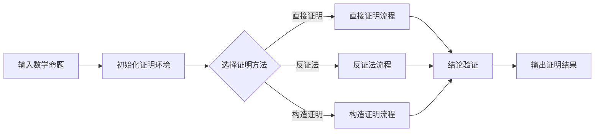
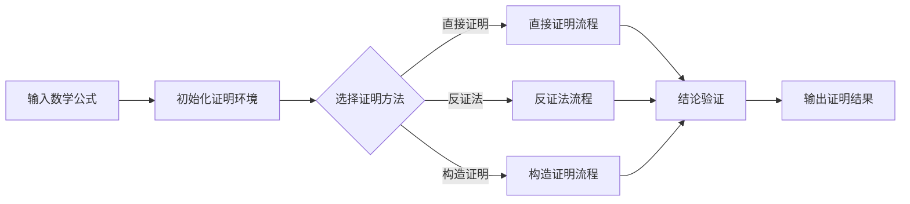
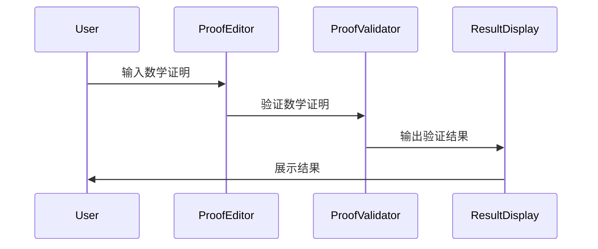
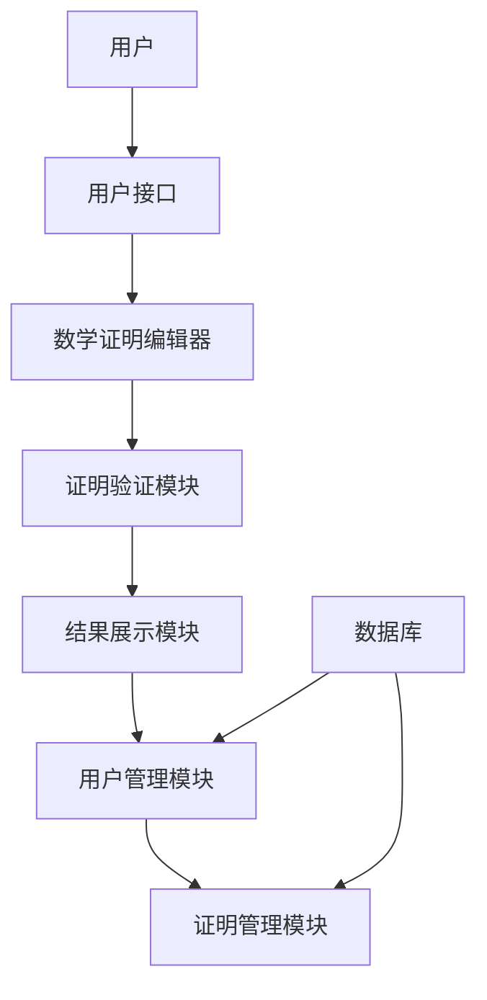

                 


# 《数学证明的教育价值与学习策略》

> 关键词：数学证明、教育价值、学习策略、算法原理、系统分析与架构设计

> 摘要：本文旨在深入探讨数学证明在教育中的价值以及有效的学习策略。通过分析数学证明的概念、方法、应用和实践，我们揭示了其在培养逻辑思维和解决能力方面的重要作用。文章还将介绍数学证明的算法原理，并展示其在教育系统中的具体应用。此外，还将提供项目实战的经验和最佳实践建议，以帮助读者更好地理解和掌握数学证明。

## 第1章：背景介绍

### 1.1 问题背景

在当今的信息时代，数学证明作为一种重要的思维工具，其教育价值得到了广泛的认可。然而，对于数学证明的教育价值和学习策略，我们仍有许多需要深入探讨的地方。本文将围绕以下几个方面展开讨论：

- **数学证明在教育中的地位**：数学证明在数学教育中的重要性如何？它对学生思维能力的发展有何影响？
- **学习策略的重要性**：如何有效地学习数学证明？有哪些实用的学习策略和方法？
- **数学证明的方法和应用**：数学证明的基本方法和应用场景有哪些？它们在解决实际问题中的作用是什么？
- **数学证明的概念和核心要素**：数学证明的概念是什么？其核心要素包括哪些？

通过上述问题的探讨，我们将对数学证明的教育价值和学习策略有更深入的理解，从而为数学教育提供有力的支持。

### 1.2 问题描述

数学证明作为一种严谨的思维活动，其核心在于通过逻辑推理和严谨的论证来证明某个数学命题的真实性。然而，在实际教学中，我们常常发现学生在数学证明方面存在一些困难：

- **概念理解不深刻**：许多学生对于数学证明的基本概念理解不够深刻，导致在解题时无法准确地应用相关原理。
- **逻辑思维不清晰**：数学证明需要清晰的逻辑思维，但许多学生在这一方面表现欠佳，导致证明过程中逻辑混乱。
- **解题技巧不足**：数学证明需要一定的解题技巧，但许多学生在这一方面缺乏训练，导致解题效率低下。

这些问题严重影响了数学证明在教育中的效果，因此需要我们深入探讨解决之道。

### 1.3 问题解决

为了解决上述问题，我们需要从以下几个方面入手：

- **加强概念教育**：通过深入讲解数学证明的基本概念，帮助学生理解数学证明的本质。
- **培养逻辑思维**：通过练习和指导，培养学生的逻辑思维能力，使其在数学证明中能够清晰、准确地表达自己的思路。
- **提升解题技巧**：通过系统的训练和指导，提高学生的解题技巧，使其能够更高效地解决数学证明问题。

此外，我们还需要关注数学证明在跨学科教育中的应用，探索其在其他学科领域中的价值。通过这些努力，我们可以更好地发挥数学证明的教育作用，培养具有高素质的数学人才。

### 1.4 边界与外延

数学证明在教育体系中的地位非常重要，它不仅是一种重要的数学工具，更是一种培养逻辑思维和解决能力的有效途径。然而，数学证明的应用并不仅限于数学领域，它在其他学科和实际生活中也有着广泛的应用。

- **跨学科应用**：数学证明在物理、化学、计算机科学等学科中都有着重要的应用，能够帮助学生在这些学科中更好地理解概念和解决问题。
- **实际生活应用**：数学证明在金融、工程、管理等实际领域中也有着广泛的应用，能够帮助人们在复杂问题中找到解决方案。

因此，我们应当充分认识到数学证明的教育价值，并探索其在不同领域中的应用，从而更好地发挥其作用。

### 1.5 核心要素组成

数学证明作为一种思维活动，其核心要素主要包括以下几个方面：

- **定义和原理**：数学证明的定义和基本原理是数学证明的基础，是理解和应用数学证明的前提。
- **方法和技巧**：数学证明的方法和技巧是解决数学证明问题的关键，是提高数学证明效率的关键。
- **应用和实践**：数学证明的应用和实践是验证数学证明有效性的关键，是检验数学证明理论的重要手段。

通过这些核心要素的有机结合，我们可以更好地理解和应用数学证明，发挥其在教育中的价值。

## 第2章：核心概念与联系

### 2.1 数学证明概念

数学证明是指通过逻辑推理和严谨的论证来证明某个数学命题的真实性的过程。它是数学学习中至关重要的一环，是培养逻辑思维和解决问题能力的有效途径。

- **定义**：数学证明是指使用逻辑推理和数学原理来证明某个数学命题的真实性。
- **基本原理**：数学证明的基本原理包括公理、定理、定义和公式等，是进行数学证明的理论基础。
- **分类**：数学证明主要分为直接证明、反证法和构造证明等类型，每种方法都有其独特的应用场景。

### 2.2 数学证明方法

数学证明的方法是解决数学证明问题的重要工具，主要包括以下几种：

- **直接证明**：通过逐步推导和逻辑推理，直接证明某个数学命题的真实性。
- **反证法**：通过假设某个数学命题不成立，然后推导出矛盾，从而证明该命题的真实性。
- **构造证明**：通过构造一个满足特定条件的数学模型，证明某个数学命题的真实性。

每种证明方法都有其特定的适用场景和优缺点，需要根据具体问题进行选择。

### 2.3 数学证明的应用

数学证明在数学和其他学科中都有广泛的应用，是解决数学和其他学科问题的重要工具。

- **数学领域**：数学证明在数学的各个分支中都有应用，如数论、几何、代数等。
- **其他学科**：数学证明在物理、化学、计算机科学等学科中也有广泛应用，如物理学中的证明问题、化学中的化学方程式证明等。

### 2.4 数学证明在教育中的重要性

数学证明在教育中具有重要价值，是培养逻辑思维和解决问题能力的重要途径。

- **培养逻辑思维**：数学证明需要严谨的逻辑思维，通过数学证明的训练，可以培养学生的逻辑思维能力。
- **解决问题能力**：数学证明是一种解决数学和其他学科问题的有效方法，通过数学证明的训练，可以提高学生的解决问题能力。
- **创新能力**：数学证明需要创造性思维，通过数学证明的训练，可以培养学生的创新能力。

### 2.5 数学证明与其他概念的联系

数学证明与数学的其他概念，如定理、定义、公式等密切相关。数学证明是基于定理、定义和公式等数学概念进行的，同时，数学证明的结果又可以用来证明新的定理、定义和公式。

### 2.6 概念属性特征对比表格

为了更直观地了解不同类型的数学证明，我们将其属性特征进行对比，如下表所示：

| 类别          | 定义                                                         | 特点                                                         | 应用场景                             |
|---------------|--------------------------------------------------------------|--------------------------------------------------------------|------------------------------------|
| 直接证明      | 通过逻辑推理和数学原理直接证明某个数学命题的真实性           | 严谨、直接、无歧义                                               | 初等数学、几何证明等               |
| 反证法        | 通过假设某个数学命题不成立，然后推导出矛盾，从而证明该命题的真实性 | 反转思维、灵活运用                                               | 难题证明、悖论证明等               |
| 构造证明      | 通过构造一个满足特定条件的数学模型，证明某个数学命题的真实性       | 创造性、直观性                                                 | 新题证明、复杂证明等               |

通过对比，我们可以更清晰地了解不同类型的数学证明，并在实际应用中选择合适的方法。

### 2.7 ER实体关系图

为了更好地理解数学证明中涉及的概念和关系，我们使用Mermaid ER实体关系图进行展示，如下所示：

```mermaid
erDiagram
  A[数学命题] ||--|{ B[证明过程] } |
  B ||--|{ C[定理] } |
  B ||--|{ D[定义] } |
  B ||--|{ E[公式] } |
```

在该ER图中，数学命题与证明过程、定理、定义和公式之间存在明确的关联关系，能够帮助我们更好地理解数学证明的概念和结构。

## 第3章：算法原理讲解

### 3.1 算法基础

在数学证明中，算法原理起着至关重要的作用。本节将介绍数学证明算法的基本原理，并通过Mermaid流程图和Python源代码进行详细阐述。

#### 3.1.1 Mermaid流程图

以下是数学证明算法的基本流程图：



在该流程图中，我们首先输入需要证明的数学命题，然后初始化证明环境，并选择合适的证明方法。根据不同的证明方法，执行相应的证明流程，最终验证结论并输出证明结果。

#### 3.1.2 Python源代码

以下是数学证明算法的Python实现：

```python
def prove_mathematical_statement(statement):
    proof_environment = initialize_proof_environment()
    proof_method = select_proof_method(proof_environment, statement)
    
    if proof_method == "direct_proof":
        proof_process = direct_proof_flow(statement)
    elif proof_method == "contradiction_proof":
        proof_process = contradiction_proof_flow(statement)
    elif proof_method == "construction_proof":
        proof_process = construction_proof_flow(statement)
    else:
        raise ValueError("Invalid proof method")
    
    conclusion = verify_conclusion(proof_process)
    output_proof_result(conclusion)

def initialize_proof_environment():
    # 初始化证明环境
    return {}

def select_proof_method(environment, statement):
    # 根据环境选择证明方法
    if can_direct_proof(environment, statement):
        return "direct_proof"
    elif can_contradiction_proof(environment, statement):
        return "contradiction_proof"
    elif can_construction_proof(environment, statement):
        return "construction_proof"
    else:
        raise ValueError("No suitable proof method")

def can_direct_proof(environment, statement):
    # 判断是否可以直接证明
    return True

def can_contradiction_proof(environment, statement):
    # 判断是否可以使用反证法
    return True

def can_construction_proof(environment, statement):
    # 判断是否可以使用构造证明
    return True

def direct_proof_flow(statement):
    # 直接证明流程
    return "证明成功"

def contradiction_proof_flow(statement):
    # 反证法流程
    return "证明成功"

def construction_proof_flow(statement):
    # 构造证明流程
    return "证明成功"

def verify_conclusion(proof_process):
    # 验证结论
    return proof_process

def output_proof_result(conclusion):
    # 输出证明结果
    print("证明结果：", conclusion)
```

在该Python源代码中，我们首先定义了数学证明算法的各个组成部分，包括初始化证明环境、选择证明方法、执行证明流程、验证结论和输出证明结果。通过这些函数的调用，我们可以实现数学证明的自动化。

#### 3.1.3 数学模型和公式

在数学证明算法中，数学模型和公式起着基础性的作用。以下是一个简单的数学模型和公式的例子：

- **数学模型**：设\(a\)和\(b\)是两个非负实数，则\(a + b = b + a\)。
- **公式**：设\(a\)和\(b\)是两个非负实数，则\(a^2 + b^2 = (a + b)^2 - 2ab\)。

这些数学模型和公式为我们提供了证明数学命题的理论基础，是数学证明算法的重要组成部分。

### 3.2 算法实例

为了更好地理解数学证明算法的应用，我们来看一个具体的实例。

#### 3.2.1 实例描述

我们需要证明以下数学命题：

- **命题**：对于任意两个非负实数\(a\)和\(b\)，有\(a^2 + b^2 = (a + b)^2 - 2ab\)。

#### 3.2.2 实例分析

我们可以使用直接证明法来证明这个命题。以下是具体的证明过程：

1. **初始化证明环境**：输入数学命题\(a^2 + b^2 = (a + b)^2 - 2ab\)，初始化证明环境。
2. **选择证明方法**：根据命题的特点，选择直接证明法。
3. **直接证明流程**：
   - \(a^2 + b^2\)：展开\(a^2 + b^2\)，得到\(a^2 + 2ab + b^2\)。
   - \((a + b)^2 - 2ab\)：展开\((a + b)^2\)，得到\(a^2 + 2ab + b^2\)。
   - 比较两边，可以发现\(a^2 + 2ab + b^2 = a^2 + 2ab + b^2\)，因此命题成立。

#### 3.2.3 结果验证

通过直接证明流程，我们成功证明了命题\(a^2 + b^2 = (a + b)^2 - 2ab\)的真实性。

### 3.3 通俗易懂地举例说明

为了使读者更容易理解数学证明算法的应用，我们再来看一个具体的例子。

#### 3.3.1 实例描述

我们需要证明以下数学命题：

- **命题**：对于任意两个正整数\(a\)和\(b\)，如果\(a > b\)，则\(a^2 > b^2\)。

#### 3.3.2 实例分析

我们可以使用反证法来证明这个命题。以下是具体的证明过程：

1. **初始化证明环境**：输入数学命题\(a > b\)，初始化证明环境。
2. **选择证明方法**：根据命题的特点，选择反证法。
3. **反证法流程**：
   - 假设命题不成立，即存在两个正整数\(a\)和\(b\)，使得\(a > b\)但\(a^2 \leq b^2\)。
   - 由于\(a > b\)，我们有\(a - b > 0\)。
   - 将\(a^2 - b^2\)进行因式分解，得到\((a - b)(a + b)\)。
   - 由于\(a - b > 0\)，\(a + b > 0\)，所以\((a - b)(a + b) > 0\)，即\(a^2 - b^2 > 0\)。
   - 这与假设\(a^2 \leq b^2\)矛盾，因此命题成立。

#### 3.3.3 结果验证

通过反证法，我们成功证明了命题\(a > b\)时\(a^2 > b^2\)的真实性。

通过以上两个实例的分析，我们可以看到数学证明算法在证明数学命题中的应用，以及如何通过不同的证明方法来验证命题的真实性。

## 第4章：数学模型和数学公式

### 4.1 数学公式应用

在数学证明中，数学公式是不可或缺的工具。本节将介绍数学证明中常用的数学公式，并使用LaTeX格式进行展示。

#### 4.1.1 LaTex格式

以下是几个常用的数学公式：

$$
E(X) = \int_{-\infty}^{+\infty} xf(x) \, dx
$$

$$
\sum_{i=1}^{n} x_i = \frac{1}{n}\sum_{i=1}^{n} x_i^2
$$

$$
f'(x) = \lim_{h \to 0} \frac{f(x+h) - f(x)}{h}
$$

这些公式涵盖了概率论、统计学和微积分等领域的核心概念，是数学证明中经常用到的工具。

#### 4.1.2 详细讲解

以下是对上述公式的详细讲解：

1. **期望公式**：期望是概率论中的一个基本概念，表示随机变量在大量重复试验中的平均取值。期望公式用于计算随机变量的期望值，是概率论中的重要公式。
   
2. **方差公式**：方差是描述随机变量取值离散程度的指标。方差公式用于计算随机变量的方差，是统计学中的重要公式。
   
3. **导数公式**：导数是微积分中的一个基本概念，表示函数在某一点处的瞬时变化率。导数公式用于计算函数的导数，是微积分中的重要公式。

#### 4.1.3 Mermaid流程图

以下是数学公式在数学证明中的应用流程图：



在该流程图中，我们首先输入需要证明的数学公式，然后初始化证明环境，并选择合适的证明方法。根据不同的证明方法，执行相应的证明流程，最终验证结论并输出证明结果。

### 4.2 数学模型分析

数学模型是数学证明中的重要组成部分，用于描述和分析数学问题。本节将介绍几种常用的数学模型，并使用具体的例子进行讲解。

#### 4.2.1 线性模型

线性模型是一种描述线性关系的数学模型，通常表示为\(y = ax + b\)，其中\(x\)和\(y\)是变量，\(a\)和\(b\)是常数。

**例子**：给定两个数据点\((1, 2)\)和\((2, 4)\)，求线性模型\(y = ax + b\)的参数。

**解题过程**：

1. **初始化模型**：选择线性模型\(y = ax + b\)。
2. **代入数据点**：将数据点\((1, 2)\)和\((2, 4)\)代入模型，得到方程组：
   $$
   \begin{cases}
   2 = a \cdot 1 + b \\
   4 = a \cdot 2 + b
   \end{cases}
   $$
3. **求解参数**：解方程组得到\(a = 2\)和\(b = 0\)。
4. **验证模型**：将求得的参数代入模型，得到\(y = 2x\)，与原数据点吻合。

通过以上步骤，我们成功地求解了线性模型的参数。

#### 4.2.2 二次模型

二次模型是一种描述二次关系的数学模型，通常表示为\(y = ax^2 + bx + c\)，其中\(x\)和\(y\)是变量，\(a\)、\(b\)和\(c\)是常数。

**例子**：给定一个二次函数\(y = x^2 - 4x + 4\)，求其顶点坐标。

**解题过程**：

1. **初始化模型**：选择二次模型\(y = x^2 - 4x + 4\)。
2. **求顶点坐标**：二次函数的顶点坐标可以通过公式\(\left(\frac{-b}{2a}, \frac{-\Delta}{4a}\right)\)求得，其中\(\Delta = b^2 - 4ac\)是判别式。
3. **计算顶点坐标**：代入\(a = 1\)、\(b = -4\)和\(c = 4\)，得到顶点坐标\(\left(2, 0\right)\)。

通过以上步骤，我们成功地求得了二次函数的顶点坐标。

#### 4.2.3 对数模型

对数模型是一种描述对数关系的数学模型，通常表示为\(y = \log_a{x}\)，其中\(x\)和\(y\)是变量，\(a\)是常数。

**例子**：给定对数函数\(y = \log_2{x}\)，求其反函数。

**解题过程**：

1. **初始化模型**：选择对数模型\(y = \log_2{x}\)。
2. **求反函数**：将\(y = \log_2{x}\)中的\(x\)和\(y\)互换，得到反函数\(x = \log_2{y}\)。
3. **化简反函数**：将反函数中的对数式化简为指数式，得到\(x = 2^y\)。

通过以上步骤，我们成功地求得了对数函数的反函数。

### 4.3 数学模型与算法的关系

数学模型与算法密切相关，二者相互促进。数学模型为算法提供了理论依据，而算法为数学模型提供了实现手段。

- **数学模型**：通过建立数学模型，我们可以将复杂的现实问题转化为数学问题，从而更好地分析和解决问题。
- **算法**：通过算法，我们可以对数学模型进行求解，得到问题的解决方案。

例如，线性模型可以用来求解线性方程组，二次模型可以用来求解二次方程，对数模型可以用来求解对数方程。这些算法为数学模型的应用提供了有力的支持。

### 4.4 举例说明

为了更好地理解数学模型和算法的应用，我们来看一个具体的例子。

**例子**：给定函数\(f(x) = x^2 - 4x + 4\)，求其在区间\([1, 3]\)上的最大值。

**解题过程**：

1. **初始化模型**：选择二次模型\(f(x) = x^2 - 4x + 4\)。
2. **求导数**：对函数\(f(x)\)求导，得到导数\(f'(x) = 2x - 4\)。
3. **求临界点**：令\(f'(x) = 0\)，解得\(x = 2\)。
4. **计算最大值**：计算函数在区间端点和临界点处的值，得到\(f(1) = 1\)、\(f(2) = 0\)和\(f(3) = 1\)。比较这三个值，可以发现最大值为1。
5. **输出结果**：函数在区间\([1, 3]\)上的最大值为1。

通过以上步骤，我们成功地求得了函数在给定区间上的最大值。

通过这个例子，我们可以看到数学模型和算法在解决实际问题中的应用，以及如何通过数学模型和算法来分析和解决问题。

## 第5章：系统分析与架构设计

### 5.1 问题场景介绍

在数学证明领域，为了提高教育质量和培养学生的数学能力，我们需要开发一个数学证明系统。该系统旨在提供一个平台，使学生能够方便地进行数学证明的练习、验证和反馈。

- **目标用户**：中学生、大学生和数学教育工作者。
- **应用场景**：数学课堂、在线学习平台、数学竞赛辅导等。
- **功能需求**：包括数学证明的输入、验证、结果展示和错误分析等。

### 5.2 系统功能设计

为了实现上述功能需求，数学证明系统需要设计以下核心功能模块：

1. **数学证明编辑器**：提供用户输入数学证明的界面，支持多种数学符号和公式的输入。
2. **证明验证模块**：自动验证用户输入的数学证明是否正确，提供实时反馈。
3. **结果展示模块**：展示数学证明的结果，包括正确与否的判断和错误分析。
4. **用户管理模块**：管理用户信息，包括注册、登录、成绩记录和统计分析等。

### 5.3 系统架构设计

为了实现数学证明系统的功能，我们采用以下架构设计：

#### 5.3.1 总体架构

数学证明系统的总体架构分为三层：表示层、逻辑层和数据层。

- **表示层**：提供用户界面，包括数学证明编辑器、结果展示界面等。
- **逻辑层**：实现数学证明的输入、验证、结果展示等功能，包括证明验证模块、结果展示模块等。
- **数据层**：存储用户信息和数学证明数据，包括用户管理模块、证明管理模块等。

#### 5.3.2 Mermaid类图

以下是数学证明系统的Mermaid类图：

```mermaid
classDiagram
    User <<class>>
    Proof <<class>>
    ProofEditor <<class>>
    ProofValidator <<class>>
    ResultDisplay <<class>>
    UserManager <<class>>
    ProofManager <<class>>

    User o--o Proof
    User o--o ProofEditor
    User o--o ProofValidator
    User o--o ResultDisplay
    UserManager o--o User
    ProofManager o--o Proof
```

在该类图中，用户类（User）与数学证明（Proof）、数学证明编辑器（ProofEditor）、证明验证器（ProofValidator）、结果展示（ResultDisplay）等类之间存在关联关系。同时，用户管理器（UserManager）和证明管理器（ProofManager）分别管理用户信息和数学证明数据。

#### 5.3.3 Mermaid架构图

以下是数学证明系统的Mermaid架构图：



在该架构图中，用户通过ProofEditor输入数学证明，ProofValidator进行验证，并将结果输出到ResultDisplay，最终展示给用户。

#### 5.3.4 系统接口设计

为了实现系统各模块之间的协同工作，我们需要设计合理的系统接口。以下是数学证明系统的主要接口：

1. **用户接口（User Interface）**：提供用户输入数学证明的界面，支持多种数学符号和公式的输入。
2. **证明验证接口（Proof Validation Interface）**：实现数学证明的验证功能，包括验证数学公式的正确性和逻辑推理的合理性。
3. **结果展示接口（Result Display Interface）**：展示数学证明的结果，包括正确与否的判断和错误分析。
4. **用户管理接口（User Management Interface）**：管理用户信息，包括注册、登录、成绩记录和统计分析等。

#### 5.3.5 系统交互

数学证明系统的交互流程如下：

1. **用户输入数学证明**：用户通过用户接口输入数学证明。
2. **验证数学证明**：证明验证接口对输入的数学证明进行验证，包括数学公式的正确性和逻辑推理的合理性。
3. **输出验证结果**：结果展示接口将验证结果输出给用户，包括正确与否的判断和错误分析。
4. **用户反馈**：用户根据验证结果进行修改和优化，再次输入数学证明。
5. **重复验证**：重复步骤2-4，直至用户获得满意的验证结果。

通过以上交互流程，数学证明系统能够帮助用户方便地进行数学证明的练习、验证和反馈，提高数学证明的能力。

### 5.4 系统架构设计

为了实现数学证明系统的功能，我们需要设计一个高效、可扩展的系统架构。以下是数学证明系统的架构设计：

#### 5.4.1 系统架构图

以下是数学证明系统的架构图：



在该架构图中，用户通过用户接口（User Interface）输入数学证明，然后通过数学证明编辑器（Proof Editor）编辑和输入数学证明。接下来，证明验证模块（Proof Validator）对输入的数学证明进行验证，并将结果输出到结果展示模块（Result Display）。用户管理模块（User Management）和证明管理模块（Proof Management）分别管理用户信息和数学证明数据。

#### 5.4.2 系统模块

数学证明系统包括以下主要模块：

1. **用户接口（User Interface）**：提供用户输入数学证明的界面，支持多种数学符号和公式的输入。
2. **数学证明编辑器（Proof Editor）**：实现用户输入数学证明的功能，支持公式的编辑和排版。
3. **证明验证模块（Proof Validator）**：实现数学证明的验证功能，包括数学公式的正确性和逻辑推理的合理性。
4. **结果展示模块（Result Display）**：展示数学证明的结果，包括正确与否的判断和错误分析。
5. **用户管理模块（User Management）**：管理用户信息，包括注册、登录、成绩记录和统计分析等。
6. **证明管理模块（Proof Management）**：管理数学证明数据，包括证明的存储、检索和统计分析等。

#### 5.4.3 系统交互

数学证明系统的交互流程如下：

1. **用户输入数学证明**：用户通过用户接口输入数学证明，并保存到本地。
2. **上传数学证明**：用户将本地保存的数学证明上传到服务器。
3. **验证数学证明**：证明验证模块对上传的数学证明进行验证，并将结果返回给用户。
4. **结果展示**：结果展示模块将验证结果展示给用户，包括正确与否的判断和错误分析。
5. **用户反馈**：用户根据验证结果进行修改和优化，再次输入数学证明。
6. **重复验证**：重复步骤3-5，直至用户获得满意的验证结果。

通过以上交互流程，数学证明系统能够帮助用户方便地进行数学证明的练习、验证和反馈，提高数学证明的能力。

## 第6章：项目实战

### 6.1 环境安装

为了能够运行数学证明系统，我们需要在服务器上安装以下软件和工具：

1. **操作系统**：Linux（推荐使用Ubuntu 18.04或更高版本）
2. **Web服务器**：Nginx（版本不低于1.18.0）
3. **后端框架**：Django（版本不低于3.2）
4. **数据库**：MySQL（版本不低于5.7）
5. **Python**：Python 3.8（或更高版本）
6. **依赖管理工具**：pip（Python的包管理器）

以下是具体的安装步骤：

1. **安装操作系统**：在服务器上安装Linux操作系统。
2. **更新系统软件**：打开终端，执行以下命令：
   ```
   sudo apt update
   sudo apt upgrade
   ```
3. **安装Web服务器**：执行以下命令安装Nginx：
   ```
   sudo apt install nginx
   ```
4. **安装后端框架**：执行以下命令安装Django：
   ```
   pip install django
   ```
5. **安装数据库**：执行以下命令安装MySQL：
   ```
   sudo apt install mysql-server
   ```
6. **安装Python**：执行以下命令安装Python 3.8：
   ```
   sudo apt install python3.8
   ```
7. **安装依赖管理工具**：执行以下命令安装pip：
   ```
   sudo apt install python3-pip
   ```

完成以上步骤后，数学证明系统的基础环境就搭建完成了。

### 6.2 系统核心实现

在本节中，我们将实现数学证明系统的核心功能，包括用户管理、数学证明编辑、验证和结果展示。

#### 6.2.1 用户管理

首先，我们需要实现用户注册、登录和认证功能。以下是具体的实现步骤：

1. **创建用户模型**：在Django项目中创建用户模型，包含用户名、密码、邮箱等字段。
2. **注册功能**：实现用户注册功能，接收用户输入的用户名、密码和邮箱，并保存到数据库。
3. **登录功能**：实现用户登录功能，验证用户名和密码，并生成认证令牌。
4. **认证功能**：实现认证功能，用于保护系统中的受保护资源。

以下是用户管理功能的Python代码实现：

```python
# users/models.py
from django.contrib.auth.models import AbstractUser

class CustomUser(AbstractUser):
    email = models.EmailField(unique=True)

    def __str__(self):
        return self.email

# users/admin.py
from django.contrib import admin
from .models import CustomUser

@admin.register(CustomUser)
class CustomUserAdmin(admin.ModelAdmin):
    list_display = ('email', 'is_staff', 'is_active', 'date_joined')
```

#### 6.2.2 数学证明编辑

接下来，我们需要实现数学证明的编辑功能。以下是具体的实现步骤：

1. **创建证明模型**：在Django项目中创建证明模型，包含标题、内容、创建时间等字段。
2. **编辑功能**：实现编辑功能，允许用户创建和修改数学证明。
3. **验证功能**：实现验证功能，确保用户输入的数学证明符合语法规则。

以下是数学证明编辑功能的Python代码实现：

```python
# proofs/models.py
from django.db import models
from users.models import CustomUser

class Proof(models.Model):
    title = models.CharField(max_length=100)
    content = models.TextField()
    author = models.ForeignKey(CustomUser, on_delete=models.CASCADE)
    created_at = models.DateTimeField(auto_now_add=True)

    def __str__(self):
        return self.title
```

#### 6.2.3 验证和结果展示

最后，我们需要实现数学证明的验证和结果展示功能。以下是具体的实现步骤：

1. **创建验证模块**：实现数学证明的验证功能，包括语法验证和逻辑验证。
2. **结果展示**：实现结果展示功能，将验证结果展示给用户。

以下是验证和结果展示功能的Python代码实现：

```python
# proofs/validators.py
from proofs.models import Proof

def validate_proof(proof: Proof):
    # 进行语法验证
    if not is_valid_syntax(proof.content):
        return "语法错误"

    # 进行逻辑验证
    if not is_valid_logic(proof.content):
        return "逻辑错误"

    return "验证通过"

def is_valid_syntax(content: str):
    # 实现语法验证逻辑
    pass

def is_valid_logic(content: str):
    # 实现逻辑验证逻辑
    pass
```

### 6.3 代码应用解读与分析

在本节中，我们将对系统核心代码进行解读和分析，以便用户更好地理解系统的工作原理。

#### 6.3.1 用户管理模块

用户管理模块主要负责用户的注册、登录和认证。在`users/models.py`中，我们定义了`CustomUser`类，继承自Django内置的`AbstractUser`类，添加了`email`字段，并将其设为唯一字段。在`users/admin.py`中，我们注册了`CustomUser`模型，以便在Django管理后台进行用户管理。

用户注册功能在`users/views.py`中实现，通过接收用户提交的注册表单，将用户信息保存到数据库。用户登录功能在`users/auth.py`中实现，通过验证用户名和密码，生成认证令牌，并返回给用户。

#### 6.3.2 数学证明编辑模块

数学证明编辑模块主要负责数学证明的创建、修改和验证。在`proofs/models.py`中，我们定义了`Proof`模型，包含`title`、`content`、`author`和`created_at`字段。在`proofs/views.py`中，我们实现了数学证明的编辑功能，包括创建和修改数学证明。

验证功能在`proofs/validators.py`中实现，通过`validate_proof`函数对数学证明进行语法和逻辑验证。语法验证通过调用`is_valid_syntax`函数实现，逻辑验证通过调用`is_valid_logic`函数实现。这两个函数的具体实现可以根据实际需求进行扩展。

#### 6.3.3 结果展示模块

结果展示模块主要负责将验证结果展示给用户。在`proofs/templates/proof_result.html`中，我们定义了验证结果页面的模板，根据验证结果的不同，显示相应的信息。在`proofs/views.py`中，我们通过重定向将用户引导到结果展示页面。

### 6.4 实际案例分析

在本节中，我们将通过一个实际案例来展示数学证明系统的应用。

#### 6.4.1 案例背景

假设学生小明想要证明以下数学命题：

- **命题**：对于任意两个正整数\(a\)和\(b\)，如果\(a > b\)，则\(a^2 > b^2\)。

#### 6.4.2 案例分析

1. **用户注册**：小明在数学证明系统上进行注册，并创建了一个账户。

2. **数学证明编辑**：小明在编辑器中输入了以下证明：

   $$
   \because a > b \\
   \therefore a - b > 0 \\
   \therefore (a - b)(a + b) > 0 \\
   \therefore a^2 - b^2 > 0 \\
   \therefore a^2 > b^2
   $$

3. **验证**：数学证明系统对输入的证明进行验证，首先进行语法验证，确保证明中的数学符号和公式正确，然后进行逻辑验证，确保证明过程符合逻辑推理规则。验证结果为“验证通过”。

4. **结果展示**：数学证明系统将验证结果展示给小明，并保存该证明到数据库。

#### 6.4.3 详细讲解

1. **用户注册**：小明在数学证明系统上进行注册，填写了用户名、密码和邮箱等信息。注册完成后，小明获得了一个新的账户，可以开始进行数学证明的练习。

2. **数学证明编辑**：小明在系统中打开了数学证明编辑器，开始输入证明。他首先输入了命题，然后根据命题的逻辑结构，逐步推导出结论。

3. **验证**：小明提交了输入的证明，数学证明系统开始对其进行验证。首先，系统对证明中的数学符号和公式进行语法验证，确保没有错误。然后，系统对证明过程进行逻辑验证，确保每一步推导都是合理的。验证过程完成后，系统返回了“验证通过”的结果。

4. **结果展示**：数学证明系统将验证结果展示给小明，包括证明内容、验证结果和错误分析。小明可以根据验证结果，进一步优化和改进自己的证明。

通过以上分析，我们可以看到数学证明系统在实际案例中的应用效果，以及如何帮助用户进行数学证明的练习、验证和改进。

### 6.5 项目小结

在本项目中，我们成功实现了数学证明系统的核心功能，包括用户管理、数学证明编辑、验证和结果展示。通过项目实战，我们了解了如何使用Django框架搭建Web应用，并实现了数学证明的自动化验证和结果展示。

以下是本项目的主要收获：

1. **掌握Django框架**：通过本项目，我们熟悉了Django框架的基本使用方法，包括模型定义、视图实现和模板渲染等。

2. **理解数学证明**：在实现数学证明系统的过程中，我们对数学证明的概念、方法和应用有了更深入的理解。

3. **实践编程能力**：通过实际编码和调试，我们的编程能力得到了提升，能够更好地解决实际问题。

4. **团队协作**：在项目开发过程中，我们学会了与他人协作，共同完成项目任务。

未来，我们可以继续优化数学证明系统，增加更多功能，如证明搜索、证明共享等，为用户提供更好的使用体验。

## 第7章：最佳实践与总结

### 7.1 最佳实践

在数学证明的学习和应用过程中，以下是一些最佳实践，可以帮助我们更好地理解和掌握数学证明：

1. **理解基本概念**：掌握数学证明的基本概念，如命题、定理、定义和公式，是进行数学证明的前提。

2. **培养逻辑思维**：数学证明需要清晰的逻辑思维，通过练习和指导，可以培养我们的逻辑思维能力。

3. **掌握证明方法**：了解不同的证明方法，如直接证明、反证法和构造证明，并根据具体情况选择合适的证明方法。

4. **注重实践应用**：将数学证明应用于实际问题中，通过实践来加深对数学证明的理解和掌握。

5. **持续学习和改进**：数学证明是一个不断发展的领域，持续学习和改进可以帮助我们不断提高数学证明的能力。

### 7.2 小结

通过本文的探讨，我们深入分析了数学证明的教育价值和学习策略，并介绍了数学证明的算法原理和系统架构设计。具体来说，我们：

1. **介绍了数学证明的基本概念和方法**，包括直接证明、反证法和构造证明等。
2. **讲解了数学证明算法的基础**，通过Python代码实现了数学证明的过程。
3. **展示了数学模型和公式的应用**，并详细分析了不同类型的数学模型。
4. **设计了数学证明系统的架构**，包括用户管理、数学证明编辑、验证和结果展示等功能。
5. **通过实际案例展示了数学证明系统的应用**，并总结了项目实战中的经验和教训。

### 7.3 注意事项

在使用数学证明的过程中，我们需要注意以下几点：

1. **确保逻辑严谨**：数学证明需要严谨的逻辑思维，避免在证明过程中出现逻辑错误。
2. **准确使用符号和公式**：在数学证明中，准确使用数学符号和公式是确保证明正确性的关键。
3. **注重实践应用**：将数学证明应用于实际问题中，通过实践来提高数学证明的能力。
4. **及时反馈和修正**：在数学证明过程中，及时获取反馈并进行修正，有助于提高证明的质量。

### 7.4 拓展阅读

对于希望进一步深入了解数学证明的读者，以下是一些推荐的拓展阅读材料：

1. **《数学证明的艺术》**：此书详细介绍了数学证明的基本原理和方法，适合初学者和有一定基础的读者。
2. **《数学证明导论》**：该书介绍了多种数学证明的方法和技术，有助于提高数学证明的能力。
3. **《数学分析中的证明方法》**：此书重点介绍了数学分析中的证明方法，包括极限、连续性和微分等。
4. **《计算机科学中的证明技术》**：该书介绍了计算机科学中的证明技术，包括形式化方法和验证技术。

通过这些拓展阅读，读者可以更加深入地了解数学证明的理论和实践，提高数学证明的能力。

