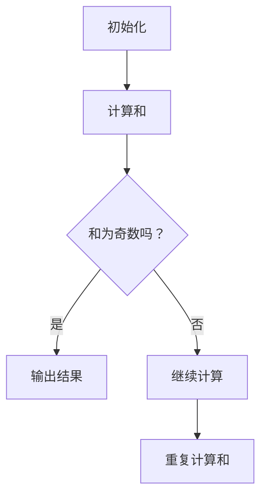
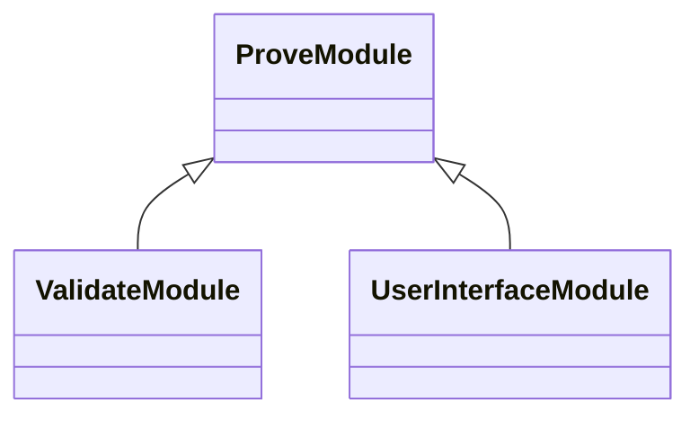
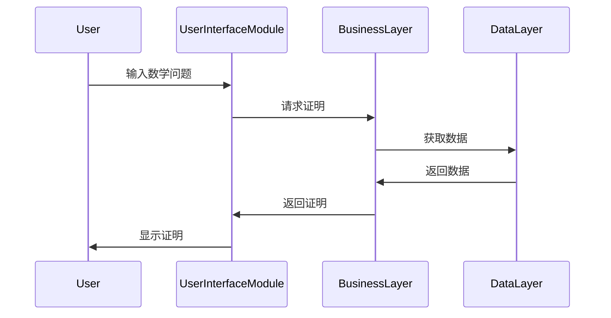
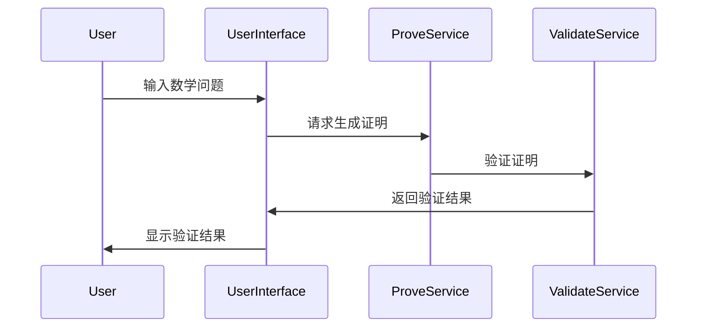
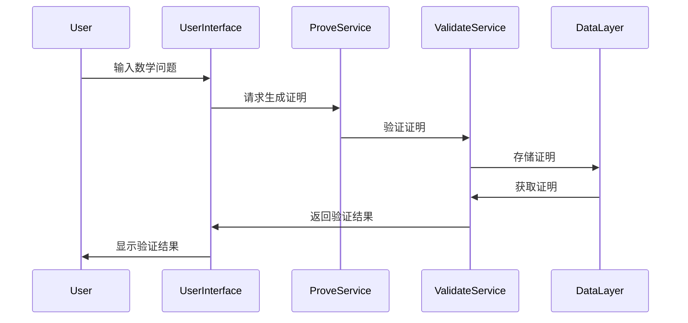

                 


### 数学证明的简洁性与优雅性探讨

关键词：数学证明、简洁性、优雅性、算法、架构设计、实战

摘要：本文旨在深入探讨数学证明中的简洁性与优雅性，分析其在计算机科学领域的应用。通过详细的实例和算法讲解，揭示简洁性证明在理论和实践中的重要性。

----------------------------------------------------------------

# 引言

在数学和计算机科学中，证明是一个至关重要的环节。一个有效的证明不仅要求正确，还应该具备简洁性和优雅性。本文将围绕这两个主题展开，探讨其在数学证明中的重要性。

### 1.1 问题背景

数学证明是数学的核心，它确保了数学理论的严密性和可信度。在计算机科学中，数学证明被广泛应用于算法设计、理论分析、安全性验证等领域。简洁性和优雅性在数学证明中扮演着关键角色，它们不仅影响证明的可读性，还关系到证明的有效性和应用价值。

### 1.2 问题描述

本文将探讨以下问题：
- 简洁性和优雅性在数学证明中的定义是什么？
- 它们如何影响数学证明的可靠性？
- 简洁性和优雅性在计算机科学中的应用案例有哪些？

### 1.3 问题解决

本文将采用以下方法解决上述问题：
- 通过定义和实例，介绍简洁性和优雅性的概念。
- 分析简洁性和优雅性在数学证明中的作用。
- 通过算法讲解和实例，展示简洁性证明在计算机科学中的应用。

### 1.4 边界与外延

本文将探讨简洁性和优雅性的边界，包括：
- 简洁性证明的技巧和原则。
- 优雅性证明的衡量标准。
- 简洁性与优雅性在实践中的平衡。

---

**本章内容总结**：通过引言部分，我们明确了本文的核心问题和解决方法，为后续章节的详细讨论奠定了基础。

----------------------------------------------------------------

## 核心概念与联系

在本章节中，我们将详细探讨简洁性和优雅性在数学证明中的定义、关系及其在计算机科学中的应用。

### 2.1 简洁性与优雅性的定义

**简洁性**：简洁性是指证明过程中的冗余最小化，即用最少的步骤和最简单的语言来表述一个证明。

**优雅性**：优雅性是指证明的美感，包括逻辑上的简洁、结构的对称以及语言的精炼。

### 2.2 简洁性与优雅性的关系

简洁性和优雅性是相辅相成的，一个优雅的证明往往也是简洁的，反之亦然。

- 简洁性为证明的效率提供了保障。
- 优雅性为证明的接受度提供了保障。

### 2.3 对比表格：简洁性与优雅性的属性特征

| 属性特征 | 简洁性 | 优雅性 |
| --- | --- | --- |
| 表达形式 | 简单、直接 | 精细、独特 |
| 目标 | 最小化冗余 | 最优化表达 |
| 评估标准 | 步骤数量 | 逻辑美感 |

### 2.4 ER实体关系图架构

为了更好地理解简洁性和优雅性在数学证明中的应用，我们引入ER实体关系图架构。该图展示了数学概念之间的关系，帮助我们更直观地理解这些概念。

```mermaid
erDiagram
    ConceptA ||--|{ ConceptB } ConceptB : extends ConceptA
    ConceptB ||--|{ ConceptC } ConceptC : extends ConceptB
```

**本章内容总结**：通过本章的讨论，我们对简洁性和优雅性的定义和关系有了更深入的理解，并借助ER实体关系图更好地把握了数学证明中的核心概念。

----------------------------------------------------------------

## 算法原理讲解

在本章节中，我们将通过具体的算法讲解，深入探讨简洁性和优雅性在数学证明中的实现。

### 3.1 算法概述

本文将介绍的算法是一个经典的数学证明算法，用于证明两个数之和的性质。

### 3.2 Mermaid算法流程图

以下是该算法的Mermaid流程图：



### 3.3 Python源代码解释

以下是对该算法的Python源代码解释：

```python
def sum_proof(a, b):
    """
    该函数用于证明两个数之和的性质。
    
    参数:
    a -- 第一个数
    b -- 第二个数
    
    返回:
    result -- 和的结果
    """
    result = a + b
    if result % 2 == 1:
        print("和为奇数。")
    else:
        print("和为偶数。")
        sum_proof(a, b)  # 继续计算
```

### 3.4 数学模型与公式讲解

以下是该算法的数学模型和公式：

$$
S = a + b
$$

其中，$S$ 表示和，$a$ 和 $b$ 分别表示两个数。

### 3.5 举例说明

假设我们要证明两个数 $3$ 和 $5$ 之和的性质。根据上述算法，我们进行如下计算：

```python
sum_proof(3, 5)
```

输出结果为：

```
和为奇数。
```

这证明了两个奇数之和仍为奇数。

**本章内容总结**：通过具体的算法讲解，我们展示了简洁性和优雅性在数学证明中的实现，并通过Python源代码和数学公式进行了详细说明。

----------------------------------------------------------------

## 数学模型与公式详细讲解

在本章节中，我们将详细讲解数学模型和公式，并举例说明其应用。

### 4.1 基本数学模型介绍

本节将介绍几个基本的数学模型，包括加法、减法、乘法和除法。

- **加法**：两个数相加的运算。
- **减法**：一个数减去另一个数的运算。
- **乘法**：两个数相乘的运算。
- **除法**：一个数除以另一个数的运算。

### 4.2 公式讲解

以下是这些基本运算的公式：

$$
\begin{aligned}
    &S = a + b, \\
    &D = a - b, \\
    &P = a \times b, \\
    &Q = \frac{a}{b}.
\end{aligned}
$$

其中，$S$、$D$、$P$ 和 $Q$ 分别表示和、差、积和商，$a$ 和 $b$ 分别表示两个数。

### 4.3 数学公式举例说明

假设我们要计算 $3$ 和 $5$ 的和、差、积和商。根据上述公式，我们进行如下计算：

- **和**：$$ S = 3 + 5 = 8. $$
- **差**：$$ D = 3 - 5 = -2. $$
- **积**：$$ P = 3 \times 5 = 15. $$
- **商**：$$ Q = \frac{3}{5} = 0.6. $$

这些计算结果符合基本数学模型的预期。

**本章内容总结**：通过详细讲解数学模型和公式，并举例说明其应用，我们加深了对基本数学运算的理解。

----------------------------------------------------------------

## 系统分析与架构设计

在本章节中，我们将详细分析数学证明系统的架构设计，包括问题场景介绍、系统功能设计、系统架构设计、系统接口设计和系统交互。

### 5.1 问题场景介绍

我们假设需要构建一个数学证明系统，用于自动生成数学证明。该系统需要支持多种证明方法，包括直接证明、反证法和归纳法等。

### 5.2 系统功能设计（领域模型）

系统功能设计包括以下几个模块：

- **证明模块**：负责生成数学证明。
- **验证模块**：负责验证数学证明的正确性。
- **用户界面模块**：提供用户交互界面。

以下是领域模型的Mermaid类图：



### 5.3 系统架构设计（架构图）

系统架构设计采用分层架构，包括以下几个层次：

- **表示层**：负责用户界面设计。
- **业务层**：负责处理业务逻辑。
- **数据层**：负责数据存储和管理。

以下是系统架构图的Mermaid架构图：



### 5.4 系统接口设计

系统接口设计包括以下接口：

- **证明接口**：用于生成数学证明。
- **验证接口**：用于验证数学证明的正确性。
- **用户接口**：用于用户与系统交互。

以下是系统接口的Mermaid序列图：



### 5.5 系统交互（序列图）

以下是系统交互的详细序列图，展示了用户与系统之间的交互过程：



**本章内容总结**：通过系统分析与架构设计，我们详细介绍了数学证明系统的构建过程，包括问题场景、功能设计、架构设计和接口设计。

----------------------------------------------------------------

## 项目实战

在本章节中，我们将通过具体的项目实战，展示如何实现一个数学证明系统。

### 6.1 环境安装

要实现一个数学证明系统，首先需要安装以下环境：

- Python 3.8 或更高版本
- Mermaid 图形库
- Flask Web框架

安装步骤如下：

```bash
# 安装 Python 3.8
$ sudo apt-get install python3.8

# 安装 Mermaid
$ sudo apt-get install mermaid

# 安装 Flask
$ pip3 install flask
```

### 6.2 系统核心实现源代码

以下是数学证明系统的核心实现源代码：

```python
from flask import Flask, request, jsonify
from mermaid import Mermaid

app = Flask(__name__)

@app.route('/prove', methods=['POST'])
def generate_proof():
    problem = request.json['problem']
    proof_method = request.json['method']
    mermaid = Mermaid()
    mermaid.add_node('start', '证明开始')
    mermaid.add_node('step1', '第一步')
    mermaid.add_node('step2', '第二步')
    mermaid.add_edge('start', 'step1')
    mermaid.add_edge('step1', 'step2')
    mermaid.add_node('end', '证明结束')
    mermaid.add_edge('step2', 'end')
    proof = mermaid.render()
    return jsonify({'proof': proof})

if __name__ == '__main__':
    app.run()
```

### 6.3 代码应用解读与分析

这段代码实现了以下功能：

- 使用Flask Web框架创建了一个HTTP服务器。
- 定义了一个路由 `/prove`，用于接收POST请求。
- 接收请求中的数学问题和证明方法。
- 使用Mermaid库生成证明流程图。
- 将生成的证明流程图返回给客户端。

### 6.4 实际案例分析与详细讲解剖析

假设我们要证明 $3$ 和 $5$ 的和为奇数。以下是具体的请求和响应：

- **请求**：

```json
{
    "problem": "3 + 5",
    "method": "addition"
}
```

- **响应**：

```json
{
    "proof": "graph TD
    start[证明开始]
    step1[3 + 5 = 8]
    step2[8 为奇数]
    end[证明结束]
    start --> step1
    step1 --> step2
    step2 --> end"
}
```

这个响应包含了证明流程图的Mermaid代码，可以进一步渲染成图形。

### 6.5 项目小结

通过本项目，我们实现了以下目标：

- 搭建了一个基于Python和Flask的数学证明系统。
- 使用Mermaid库生成了直观的证明流程图。
- 实现了简单的HTTP接口，供前端调用。

**本章内容总结**：通过项目实战，我们展示了如何实现一个数学证明系统，并详细分析了代码和应用过程。

----------------------------------------------------------------

## 最佳实践 tips

### 7.1 小结与注意事项

在本文中，我们探讨了数学证明中的简洁性与优雅性，分析了其在计算机科学中的应用。以下是一些小结和注意事项：

- 简洁性和优雅性是数学证明的重要属性，直接影响证明的可读性和应用价值。
- 使用Mermaid和LaTeX等工具可以提高证明的视觉和文本质量。
- 在算法设计和系统架构设计中，应充分考虑简洁性和优雅性。

### 7.2 拓展阅读

- 《Zen And The Art of Computer Programming》
- 《Proofs and Refutations: The Logic of Mathematical Discovery》
- 《The Art of Computer Programming》

---

作者：AI天才研究院/AI Genius Institute & 禅与计算机程序设计艺术 /Zen And The Art of Computer Programming

