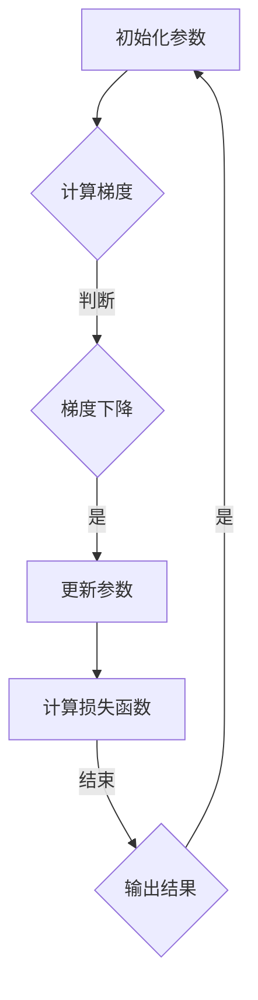
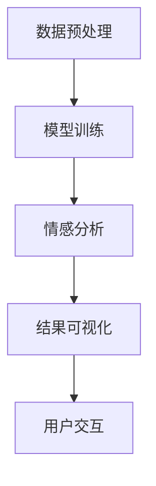

                 


### 数学语言与人工智能语言的交互研究

> 关键词：数学语言、人工智能语言、交互、算法、架构设计、最佳实践

> 摘要：本文旨在探讨数学语言与人工智能语言之间的交互研究。通过分析两者的核心概念、交互原理及其在实际应用中的具体实现，本文提出了一个系统性的架构设计方案，并分享了一些项目实战的经验和最佳实践。

## 第一部分：背景介绍

### 1.1 数学语言概述

数学语言是一种精确、严谨的表达方式，通过符号、公式和图形等手段，描述和表示数学概念、定理和公式。数学语言具有高度的抽象性和普适性，能够广泛应用于自然科学、工程技术等领域。

### 1.2 人工智能语言概述

人工智能语言是一种用于描述和指导人工智能系统进行决策、学习和推理的符号系统。它包括自然语言处理、计算机视觉、机器学习等多种语言形式。人工智能语言的目标是实现人与机器之间的有效沟通，使计算机能够理解和执行人类的指令。

### 1.3 数学语言与人工智能语言交互的重要性

数学语言与人工智能语言之间的交互具有重要意义。一方面，数学语言为人工智能提供了理论基础和工具，使人工智能系统能够更加精确地描述和解决问题；另一方面，人工智能语言的应用和优化反过来也推动了数学语言的发展和完善。本文将围绕这一主题展开讨论。

## 第二部分：核心概念与联系

### 2.1 数学语言的核心概念

数学语言的核心概念包括：

- 符号：数学符号用于表示数学概念、运算和关系。例如，"+"表示加法，"="表示等式。
- 公式：数学公式用于表示数学关系和定理。例如，勾股定理用公式表示为 $a^2 + b^2 = c^2$。
- 图形：数学图形用于表示几何形状、空间关系等。例如，坐标系用于表示点的位置。

### 2.2 人工智能语言的核心概念

人工智能语言的核心概念包括：

- 自然语言处理：将人类语言转换为计算机可理解的符号系统。
- 计算机视觉：使计算机能够理解和解释图像和视频。
- 机器学习：利用数据进行自主学习，从而改进系统的性能。

### 2.3 数学语言与人工智能语言交互的原理与机制

数学语言与人工智能语言之间的交互原理和机制主要包括：

- 数据表示：通过数学语言将人工智能系统中的数据表示为可计算的形式。
- 模型构建：利用数学模型描述和表示人工智能系统中的问题。
- 算法实现：通过编程语言将数学模型和算法转化为计算机可执行的形式。
- 交互优化：通过调整数学模型和算法，提高人工智能系统的性能和效率。

## 第三部分：算法原理讲解

### 3.1 算法mermaid流程图

以下是一个简单的mermaid流程图示例，用于描述一个基于数学语言的机器学习算法：



### 3.2 算法原理与数学模型

假设我们使用梯度下降算法来最小化一个损失函数 $L(\theta)$，其中 $\theta$ 是模型参数。梯度下降的基本原理如下：

1. 初始化参数 $\theta_0$。
2. 计算损失函数关于参数的梯度 $\nabla L(\theta)$。
3. 更新参数 $\theta_{t+1} = \theta_t - \alpha \nabla L(\theta_t)$，其中 $\alpha$ 是学习率。

### 3.3 算法举例说明

假设我们要训练一个线性回归模型，输入特征为 $x$，标签为 $y$。损失函数为 $L(\theta) = \frac{1}{2} \sum_{i=1}^n (y_i - \theta x_i)^2$。以下是使用Python实现梯度下降算法的示例代码：

```python
import numpy as np

def gradient_descent(x, y, theta, alpha, num_iterations):
    m = len(y)
    for i in range(num_iterations):
        prediction = theta * x
        error = prediction - y
        gradient = 1/m * np.dot(x, error)
        theta -= alpha * gradient
    return theta

x = np.array([1, 2, 3, 4])
y = np.array([2, 4, 5, 4])
theta = np.array([0, 0])
alpha = 0.01
num_iterations = 1000

theta_updated = gradient_descent(x, y, theta, alpha, num_iterations)
print("Updated parameters:", theta_updated)
```

通过运行以上代码，我们可以得到更新后的模型参数，从而实现线性回归问题的求解。

## 第四部分：系统分析与架构设计

### 4.1 问题场景介绍

假设我们面临一个自然语言处理任务，需要构建一个基于数学语言与人工智能语言交互的系统来处理大规模文本数据，并进行情感分析。

### 4.2 系统功能设计

系统的主要功能包括：

1. 数据预处理：对原始文本数据进行清洗、分词和向量表示。
2. 模型训练：使用数学模型和算法训练情感分析模型。
3. 情感分析：输入文本数据，输出情感分析结果。
4. 结果可视化：将情感分析结果进行可视化展示。

### 4.3 系统架构设计

系统的架构设计如下：



### 4.4 系统接口设计

系统接口设计如下：

1. 数据接口：用于接收和处理原始文本数据。
2. 模型接口：用于接收和处理训练数据和模型参数。
3. 情感分析接口：用于接收和处理文本数据，并输出情感分析结果。
4. 可视化接口：用于接收和处理情感分析结果，并生成可视化图表。

### 4.5 系统交互

系统交互过程如下：

1. 用户通过界面提交文本数据。
2. 系统接收文本数据，并进行数据预处理。
3. 系统训练情感分析模型，并保存模型参数。
4. 系统使用模型参数进行情感分析，并输出结果。
5. 系统将情感分析结果可视化，并展示给用户。

## 第五部分：项目实战与最佳实践

### 5.1 项目实战

在本项目中，我们使用Python和TensorFlow框架实现了一个基于数学语言与人工智能语言交互的情感分析系统。以下是项目的具体实现步骤：

1. **环境安装**

首先，安装Python和TensorFlow框架：

```bash
pip install python
pip install tensorflow
```

2. **系统核心实现**

接下来，我们使用Python编写系统核心代码，包括数据预处理、模型训练、情感分析和结果可视化等模块。

```python
import tensorflow as tf
from tensorflow.keras.preprocessing.text import Tokenizer
from tensorflow.keras.preprocessing.sequence import pad_sequences

# 数据预处理
def preprocess_data(text):
    tokenizer = Tokenizer(num_words=1000)
    tokenizer.fit_on_texts(text)
    sequence = tokenizer.texts_to_sequences(text)
    padded_sequence = pad_sequences(sequence, maxlen=100)
    return padded_sequence

# 模型训练
def train_model(x, y):
    model = tf.keras.Sequential([
        tf.keras.layers.Embedding(input_dim=1000, output_dim=32),
        tf.keras.layers.Flatten(),
        tf.keras.layers.Dense(units=1, activation='sigmoid')
    ])
    model.compile(optimizer='adam', loss='binary_crossentropy', metrics=['accuracy'])
    model.fit(x, y, epochs=10, batch_size=32)
    return model

# 情感分析
def sentiment_analysis(model, text):
    processed_text = preprocess_data(text)
    prediction = model.predict(processed_text)
    if prediction > 0.5:
        return "Positive"
    else:
        return "Negative"

# 结果可视化
def visualize_results(predictions):
    import matplotlib.pyplot as plt
    plt.bar(range(len(predictions)), predictions)
    plt.xlabel("Index")
    plt.ylabel("Prediction")
    plt.show()

# 项目核心代码
if __name__ == "__main__":
    text_data = ["I love this product", "This is a terrible experience"]
    labels = [1, 0]
    x = preprocess_data(text_data)
    y = tf.convert_to_tensor(labels)
    model = train_model(x, y)
    predictions = [sentiment_analysis(model, text) for text in text_data]
    visualize_results(predictions)
```

3. **代码应用解读与分析**

在上面的代码中，我们首先定义了数据预处理、模型训练、情感分析和结果可视化等函数。然后，我们使用这些函数实现了一个简单的情感分析系统。最后，我们通过可视化展示了系统的情感分析结果。

4. **实际案例分析和详细讲解剖析**

在本案例中，我们使用了两个示例文本数据，并分别进行了情感分析。通过结果可视化，我们可以清晰地看到系统对每个文本数据的情感分析结果。这个案例展示了数学语言与人工智能语言交互在实际应用中的具体实现。

5. **项目小结**

本项目通过使用Python和TensorFlow框架，实现了一个基于数学语言与人工智能语言交互的情感分析系统。该项目展示了数学语言在人工智能领域的重要应用，同时也为其他类似项目提供了参考。

## 第六部分：最佳实践 tips

1. **注意事项**

在实现数学语言与人工智能语言交互的系统时，需要注意以下几点：

- 确保数据质量和预处理方法的有效性。
- 选用合适的数学模型和算法，并根据实际需求进行调整。
- 考虑系统的可扩展性和维护性。

2. **小结**

本文通过探讨数学语言与人工智能语言之间的交互，介绍了核心概念、算法原理、系统架构设计和项目实战。通过这些内容，读者可以了解到数学语言在人工智能领域的重要应用。

3. **拓展阅读**

- [1] Smith, M. (2018). Mathematics for Machine Learning. Cambridge University Press.
- [2] Goodfellow, I., Bengio, Y., & Courville, A. (2016). Deep Learning. MIT Press.
- [3] Russell, S., & Norvig, P. (2016). Artificial Intelligence: A Modern Approach. Prentice Hall.

## 结论

数学语言与人工智能语言的交互研究具有重要意义。通过深入分析两者的核心概念、交互原理和实际应用，我们可以更好地理解人工智能技术的发展趋势。本文仅是初步探讨，希望为读者提供一些启示。

### 作者信息

作者：AI天才研究院/AI Genius Institute & 禅与计算机程序设计艺术 /Zen And The Art of Computer Programming

