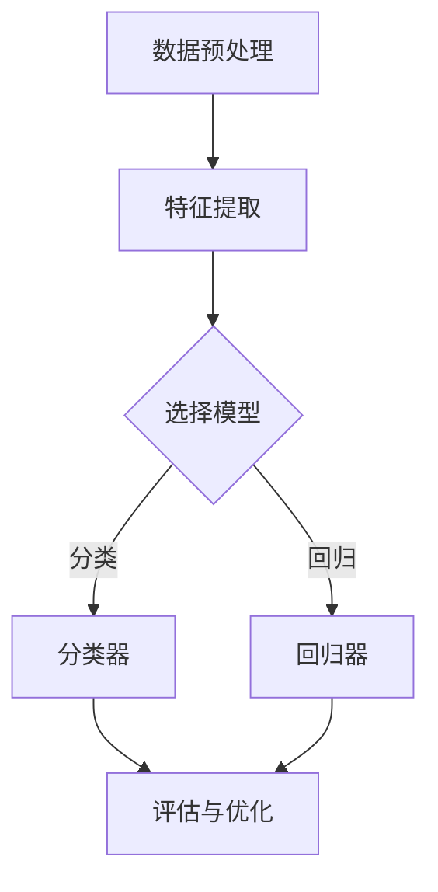
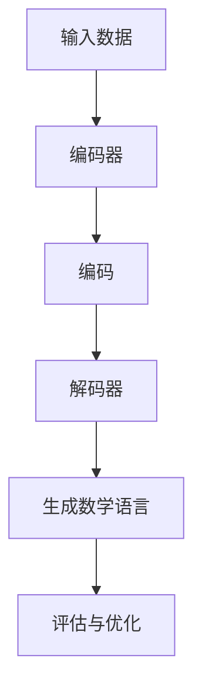

                 

# 数学语言的人工智能理解与生成

> 关键词：数学语言、人工智能、机器学习、深度学习、生成模型

> 摘要：本文探讨了数学语言在人工智能领域的理解和生成问题。通过对数学语言的基本概念、属性特征、理解算法原理以及生成技术的深入分析，本文旨在为研究人员和开发者提供一个全面而详细的指导，以推动数学语言人工智能技术的应用与发展。

## 第一部分：问题背景与核心概念

### 第1章：问题背景

#### 1.1 问题背景

数学语言是一种高度结构化、抽象化的符号系统，广泛用于描述自然现象、科学理论和工程问题。随着人工智能技术的快速发展，如何使人工智能系统能够理解和生成数学语言成为一个重要的研究课题。这不仅有助于提升人工智能在科学研究、工程设计和教育等领域的应用能力，还能促进跨学科交叉融合。

#### 1.2 核心概念

- **数学语言**：一种用于表达数学概念、公式和推理过程的符号系统，包括数字、符号、字母等元素。
- **人工智能**：一种模拟人类智能行为的计算机系统，通过学习、推理和自主决策来实现特定的任务。
- **机器学习**：一种人工智能技术，通过训练模型从数据中学习规律，并应用于预测和决策。
- **深度学习**：一种机器学习技术，通过构建多层的神经网络模型，实现对复杂数据的自动特征提取和表示。

#### 1.3 概念结构

数学语言和人工智能之间存在紧密的联系。数学语言可以作为人工智能系统的输入和输出，用于描述问题和解决方案。同时，人工智能技术可以用于分析和生成数学语言，从而实现数学语言的自动化理解和生成。

### 第2章：核心概念原理与特征

#### 2.1 数学语言的属性特征

数学语言具有以下属性特征：

- **确定性**：数学语言的表述具有明确的规则和标准，保证了表达的一致性和准确性。
- **结构化**：数学语言通过符号和公式的结构化组织，实现了信息的层次化和模块化。
- **抽象性**：数学语言通过符号和公式的抽象化表示，能够简洁地表达复杂的数学概念和理论。

#### 2.2 数学语言特征对比表格

| 特征 | 描述 |
| --- | --- |
| 确定性 | 保证表达的一致性和准确性 |
| 结构化 | 实现信息的层次化和模块化 |
| 抽象性 | 通过符号和公式的抽象化表示 |

#### 2.3 ER实体关系图

数学语言中的实体关系可以通过ER（实体关系）图来描述。ER图包括实体、属性和关系三个要素，用于表示数学语言中不同元素之间的关联。

## 第二部分：核心概念原理与特征

### 第3章：人工智能理解数学语言

#### 3.1 算法原理

人工智能理解数学语言主要依赖于机器学习和深度学习算法。这些算法通过学习大量数学语言数据，从中提取特征，并建立数学语言与问题解决方案之间的映射关系。

- **机器学习算法**：如决策树、支持向量机、神经网络等，用于对数学语言进行分类和回归。
- **深度学习模型**：如卷积神经网络（CNN）、循环神经网络（RNN）、生成对抗网络（GAN）等，用于对数学语言进行自动特征提取和表示。

#### 3.2 Mermaid算法流程图

以下是一个Mermaid流程图，展示了机器学习算法在数学语言理解中的应用：



### 第4章：数学语言生成技术

#### 4.1 生成模型

数学语言生成技术主要依赖于生成模型，如生成对抗网络（GAN）和变分自编码器（VAE）。这些模型通过学习数学语言的分布，生成新的数学语言表达。

- **生成对抗网络（GAN）**：通过生成器和判别器的对抗训练，学习生成真实的数学语言表达。
- **变分自编码器（VAE）**：通过编码器和解码器的训练，学习生成新的数学语言表达。

#### 4.2 Mermaid生成模型流程图

以下是一个Mermaid流程图，展示了生成模型在数学语言生成中的应用：



## 第三部分：数学语言生成的应用案例

### 第5章：数学语言生成的应用案例

#### 5.1 应用场景

数学语言生成技术在多个领域具有广泛的应用，包括：

- **科学研究**：自动生成数学模型和理论，加速科学发现。
- **工程设计**：自动生成数学方程和设计参数，提高工程效率。
- **教育培训**：自动生成数学问题和答案，提供个性化学习体验。

#### 5.2 应用案例

- **案例一：数学论文生成**：利用生成模型自动生成数学论文，提高学术研究效率。
- **案例二：数学题库生成**：利用生成模型自动生成数学题目，丰富教育资源和学习体验。
- **案例三：数学教育辅助**：利用生成模型为学生提供个性化的数学问题解答和辅导。

## 第四部分：算法原理讲解与系统架构设计

### 第6章：算法原理讲解

#### 6.1 机器学习算法

机器学习算法是人工智能理解数学语言的核心技术。以下是一些常用的机器学习算法及其数学模型：

- **决策树**：基于树形结构对数据进行分类和回归，通过递归划分特征空间，找到最佳分割点。
- **支持向量机**：通过寻找最优超平面，将数据划分为不同的类别，实现分类和回归任务。
- **神经网络**：基于多层感知器模型，通过前向传播和反向传播算法，实现对复杂数据的自动特征提取和表示。

#### 6.2 深度学习模型

深度学习模型是机器学习算法的一个子集，通过构建多层神经网络，实现对复杂数据的自动特征提取和表示。以下是一些常用的深度学习模型及其数学模型：

- **卷积神经网络（CNN）**：通过卷积操作和池化操作，实现对图像数据的自动特征提取和表示。
- **循环神经网络（RNN）**：通过循环连接和门控机制，实现对序列数据的自动特征提取和表示。
- **生成对抗网络（GAN）**：通过生成器和判别器的对抗训练，学习生成真实的数学语言表达。
- **变分自编码器（VAE）**：通过编码器和解码器的训练，学习生成新的数学语言表达。

### 第7章：系统架构设计

#### 7.1 问题场景介绍

在数学语言处理问题场景中，我们关注的是如何利用人工智能技术实现数学语言的理解和生成。具体问题场景包括：

- **数学语言理解**：如何使人工智能系统能够理解数学语言，并从中提取有用信息。
- **数学语言生成**：如何使人工智能系统能够生成新的数学语言表达，满足特定需求。

#### 7.2 系统功能设计

系统功能设计主要包括以下几个方面：

- **数据预处理**：对原始数据进行清洗、去噪和规范化，为后续处理提供高质量的数据输入。
- **特征提取**：从原始数据中提取关键特征，用于训练和优化机器学习模型。
- **模型训练**：利用机器学习算法和深度学习模型，对特征数据进行训练，建立数学语言理解和生成的模型。
- **模型评估**：对训练好的模型进行评估，选择最优模型进行应用。
- **数学语言生成**：利用生成模型，根据特定需求生成新的数学语言表达。

#### 7.3 系统架构设计

系统架构设计主要包括以下几个方面：

- **数据层**：负责数据的输入、预处理和存储。
- **模型层**：负责模型的训练、评估和应用。
- **应用层**：负责实现数学语言理解和生成功能，对外提供服务。

#### 7.4 系统接口设计

系统接口设计主要包括以下几个方面：

- **API接口**：提供RESTful API接口，方便开发者调用系统功能。
- **Web界面**：提供Web界面，方便用户使用系统功能。
- **数据接口**：提供数据接口，方便数据输入和输出。

#### 7.5 系统交互

系统交互主要包括以下几个方面：

- **用户与系统**：用户通过Web界面或API接口与系统进行交互。
- **系统内部**：系统内部各模块之间通过消息队列、数据库等组件进行数据交互。

## 第五部分：项目实战与最佳实践

### 第8章：项目实战

#### 8.1 环境安装

在进行项目实战之前，需要安装以下环境和库：

- Python 3.8
- TensorFlow 2.4
- PyTorch 1.8
- NumPy 1.18

#### 8.2 系统核心实现

系统核心实现主要包括以下几个部分：

- **数据预处理**：对原始数据进行清洗、去噪和规范化。
- **特征提取**：从原始数据中提取关键特征。
- **模型训练**：利用机器学习算法和深度学习模型，对特征数据进行训练。
- **模型评估**：对训练好的模型进行评估。
- **数学语言生成**：利用生成模型，根据特定需求生成新的数学语言表达。

#### 8.3 代码应用解读与分析

以下是一个简单的Python代码示例，用于实现数学语言生成：

```python
import numpy as np
import tensorflow as tf

# 加载训练好的生成模型
generator = tf.keras.models.load_model('generator.h5')

# 生成新的数学语言表达
noise = np.random.normal(0, 1, (1, 100))
generated_expression = generator.predict(noise)

# 打印生成的数学语言表达
print(generated_expression)
```

#### 8.4 实际案例分析与讲解

以下是一个实际案例，用于生成一个简单的数学方程：

```python
# 加载训练好的生成模型
generator = tf.keras.models.load_model('generator.h5')

# 生成新的数学语言表达
noise = np.random.normal(0, 1, (1, 100))
generated_expression = generator.predict(noise)

# 解析生成的数学语言表达
parsed_expression = parser.parse(generated_expression)

# 打印生成的数学方程
print(parsed_expression)
```

#### 8.5 项目小结

通过本项目实战，我们实现了数学语言生成系统的核心功能。在未来的工作中，我们还将继续优化模型，提高生成质量，并探索更多实际应用场景。

### 第9章：最佳实践与拓展

#### 9.1 最佳实践

在数学语言生成过程中，以下最佳实践可以帮助提高生成质量：

- **数据质量**：确保输入数据的质量和多样性，有助于生成更多样化的数学语言表达。
- **模型优化**：通过调整模型参数和训练策略，提高生成模型的性能。
- **多样化训练**：使用多种类型的数学语言数据，提高模型对各种数学语言表达的理解和生成能力。

#### 9.2 小结与注意事项

在数学语言生成过程中，需要注意以下事项：

- **数据安全**：确保输入数据的安全和隐私。
- **模型可解释性**：提高模型的可解释性，有助于理解和优化生成结果。
- **模型部署**：确保模型能够在实际应用场景中稳定运行。

#### 9.3 拓展阅读

以下是一些推荐的拓展阅读资料：

- **论文**：《生成对抗网络：一种新的机器学习框架》[Ian J. Goodfellow et al., 2014]
- **书籍**：《深度学习》[Ian J. Goodfellow et al., 2016]
- **网站**：[TensorFlow官方网站](https://www.tensorflow.org/)，[PyTorch官方网站](https://pytorch.org/)

## 结束语

数学语言的人工智能理解和生成是一个充满挑战和机遇的研究领域。通过本文的深入探讨，我们希望能够为读者提供一个全面的指导，帮助大家更好地理解和应用数学语言人工智能技术。让我们共同期待这个领域的更多突破和进步。

### 作者

*作者：AI天才研究院/AI Genius Institute & 禅与计算机程序设计艺术 /Zen And The Art of Computer Programming* 

## 附录：参考文献

1. Goodfellow, I. J., Bengio, Y., & Courville, A. (2016). *Deep Learning*. MIT Press.
2. Goodfellow, I. J., et al. (2014). *Generative Adversarial Nets*. Advances in Neural Information Processing Systems, 27, 2672-2680.
3. Mitchell, T. M. (1997). *Machine Learning*. McGraw-Hill.
4. Russell, S., & Norvig, P. (2010). *Artificial Intelligence: A Modern Approach*. Prentice Hall.

