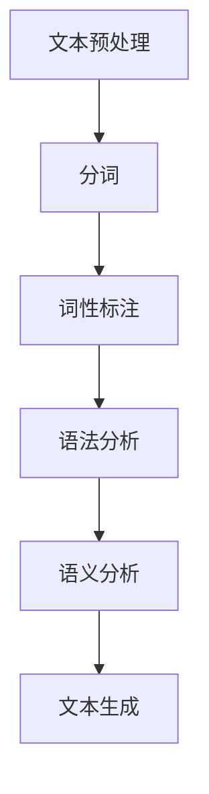
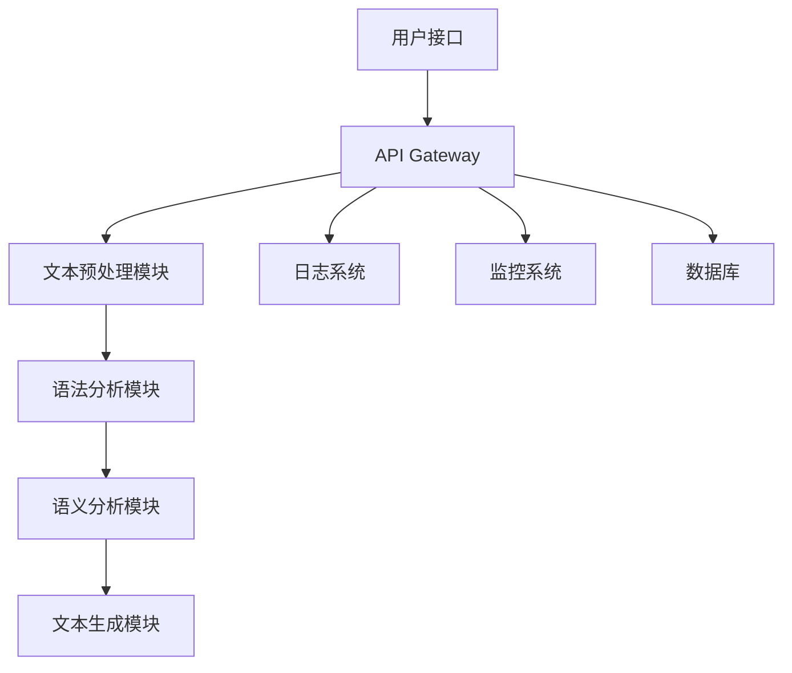
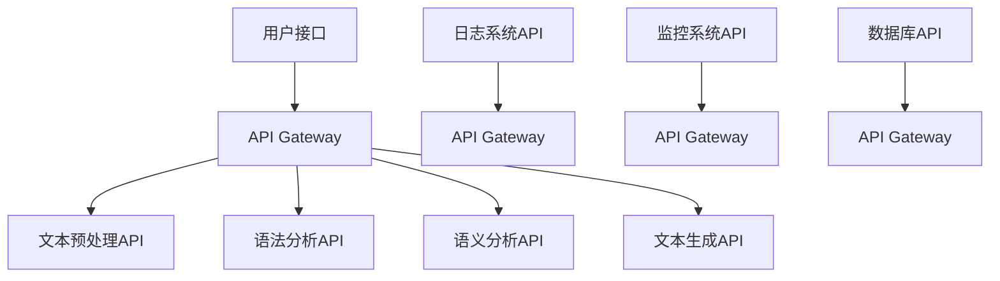
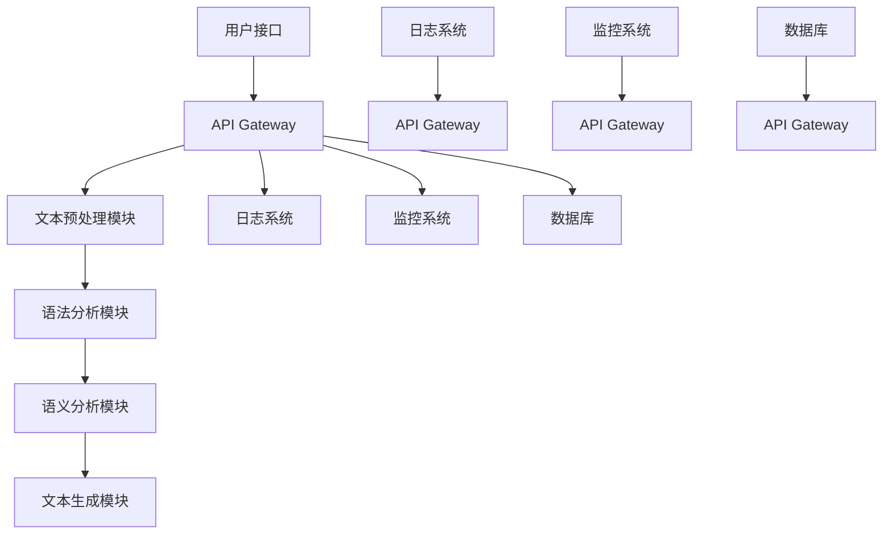

                 

### 数学语言的计算语言学分析与应用

**关键词：** 计算语言学、数学语言分析、自然语言处理、算法原理、系统架构设计

**摘要：** 本文将深入探讨数学语言在计算语言学中的应用，通过逻辑清晰、结构紧凑的分析，探讨其核心概念、算法原理、系统架构以及实际应用，旨在为读者提供关于这一领域的全面而深入的理解。

----------------------------------------------------------------

# 数学语言的计算语言学分析与应用

## 引言

计算语言学是一门结合计算机科学与语言学的交叉学科，其核心在于利用计算机技术和算法来研究、理解和生成自然语言。而数学语言作为一种精确而严密的描述工具，在计算语言学中扮演着至关重要的角色。本文将围绕数学语言的计算语言学分析与应用展开讨论，通过逻辑清晰、结构紧凑的分析，旨在为读者提供关于这一领域的全面而深入的理解。

本文的结构如下：

1. **背景介绍**：介绍计算语言学的背景和数学语言分析的应用领域。
2. **核心概念与联系**：探讨计算语言学的基本概念和数学语言分析的核心原理，并通过表格和ER实体关系图展示概念属性特征对比。
3. **算法原理讲解**：使用Mermaid绘制算法流程图，使用Python源代码阐述算法原理，并给出数学模型和公式的详细讲解。
4. **系统分析与架构设计**：描述问题场景和项目背景，使用Mermaid绘制领域模型类图、系统架构图和系统交互序列图。
5. **项目实战**：描述环境安装和系统核心实现，分析代码应用解读和实际案例分析。
6. **最佳实践 tips、小结、注意事项、拓展阅读**：提供实战中的最佳实践经验，对全书内容进行小结，并提醒注意事项。

## 第一部分：背景介绍

### 第1章 计算语言学的背景与数学语言分析的应用

#### 1.1 计算语言学的起源与发展

计算语言学起源于20世纪中叶，随着计算机技术的发展和人工智能的兴起，计算语言学逐渐成为一门独立的学科。其研究目标是通过计算方法对自然语言进行建模、分析和处理，以实现自然语言的理解、生成和翻译等功能。

计算语言学的发展可以分为几个阶段：

1. **早期阶段（1950s-1960s）**：这一阶段主要研究自然语言的自动分析，包括语法分析、词义分析和语义分析。早期的工作主要集中在构建形式化语法模型和语言处理算法。
   
2. **中期阶段（1970s-1980s）**：随着人工智能的发展，计算语言学开始探索更加复杂的问题，如自然语言生成、语音识别和机器翻译等。

3. **现阶段（1990s至今）**：随着计算技术的进步和数据规模的扩大，计算语言学的研究方向更加多元化，涵盖了自然语言处理、语义网、认知语言学等多个领域。

#### 1.1.1 计算语言学的基本概念

计算语言学涉及以下几个基本概念：

1. **自然语言处理（Natural Language Processing, NLP）**：自然语言处理是计算语言学的核心任务，旨在使计算机能够理解、解释和生成自然语言。

2. **语言模型（Language Model）**：语言模型是一种统计模型，用于预测文本序列的概率分布。在计算语言学中，语言模型广泛应用于语音识别、机器翻译和文本生成等领域。

3. **语法分析（Syntax Analysis）**：语法分析是一种将自然语言文本分解为句法结构的算法。语法分析器通过分析句子的结构，帮助计算机理解句子的语法规则。

4. **语义分析（Semantic Analysis）**：语义分析是计算语言学的另一个重要任务，旨在理解自然语言文本的意义。语义分析包括词义消歧、句子语义理解和语义角色标注等。

#### 1.1.2 计算语言学的研究领域

计算语言学的研究领域非常广泛，主要包括以下几个方面：

1. **语音识别（Speech Recognition）**：语音识别是使计算机能够理解和识别语音信号的技术。语音识别广泛应用于电话客服、语音助手和车载导航等领域。

2. **机器翻译（Machine Translation）**：机器翻译是指使用计算机将一种自然语言翻译成另一种自然语言。机器翻译在跨语言沟通、全球化和多语言信息处理等方面具有重要意义。

3. **文本分类（Text Classification）**：文本分类是一种将文本数据按照一定的标准进行分类的技术。文本分类在舆情分析、垃圾邮件过滤和推荐系统等领域具有广泛的应用。

4. **情感分析（Sentiment Analysis）**：情感分析是一种通过分析文本中的情感词汇和表达来识别文本情感倾向的技术。情感分析在市场调研、社交媒体监控和用户反馈分析等领域具有重要作用。

#### 1.1.3 数学语言分析的重要性

数学语言分析在计算语言学中具有不可替代的重要性。数学语言分析提供了一系列工具和方法，使计算语言学能够以更加精确和高效的方式处理自然语言数据。

1. **形式化描述**：数学语言分析提供了形式化的方法来描述自然语言的语法、语义和语用特征。形式化描述有助于建立清晰的数学模型，从而实现自然语言处理任务的自动化。

2. **算法优化**：数学语言分析为自然语言处理算法提供了理论基础和优化方法。通过数学工具，研究人员可以更深入地理解算法的运作机制，并提出更加高效的算法。

3. **量化分析**：数学语言分析能够对自然语言处理结果进行量化分析，评估算法的性能和效果。量化分析有助于指导算法的优化和改进。

#### 1.2 数学语言分析的应用领域

数学语言分析在计算语言学中具有广泛的应用，主要包括以下几个方面：

1. **自然语言处理**：数学语言分析在自然语言处理中的应用包括语言模型构建、语法分析、语义分析和情感分析等。

2. **机器翻译**：数学语言分析为机器翻译提供了语法和语义分析的工具，有助于提高翻译的准确性和流畅性。

3. **语音识别**：数学语言分析用于构建语音识别模型，提高语音识别的准确率和鲁棒性。

4. **文本分类与情感分析**：数学语言分析用于构建文本分类和情感分析模型，提高文本处理的自动化程度和准确性。

#### 1.3 数学语言分析的核心原理

数学语言分析的核心原理包括形式语言理论、上下文无关文法和马尔可夫模型等。这些原理为计算语言学提供了理论基础和方法。

1. **形式语言理论**：形式语言理论是数学语言分析的基础，研究语言的抽象表示和操作。形式语言理论包括词法分析、语法分析和语义分析等内容。

2. **上下文无关文法**：上下文无关文法是一种形式语法，用于描述自然语言的语法结构。上下文无关文法在语法分析中具有重要应用。

3. **马尔可夫模型**：马尔可夫模型是一种概率模型，用于描述自然语言的统计特性。马尔可夫模型在语言模型构建和语音识别等领域具有广泛的应用。

#### 1.4 本章小结

本章介绍了计算语言学的背景和数学语言分析的应用领域。计算语言学作为一门交叉学科，融合了计算机科学与语言学，其目标是通过计算方法对自然语言进行建模、分析和处理。数学语言分析在计算语言学中具有不可替代的重要性，提供了形式化描述、算法优化和量化分析等工具和方法。本章还对数学语言分析的核心原理进行了概述，包括形式语言理论、上下文无关文法和马尔可夫模型等。

## 第二部分：核心概念与联系

### 第2章 计算语言学的基本概念与数学语言分析原理

#### 2.1 计算语言学的基本概念

计算语言学涉及多个基本概念，这些概念构成了计算语言学的理论框架。以下是对这些概念的解释和其在计算语言学中的应用：

1. **自然语言处理（NLP）**：自然语言处理是计算语言学的核心任务，旨在使计算机能够理解、解释和生成自然语言。NLP广泛应用于语音识别、机器翻译、文本分类和情感分析等领域。

2. **语言模型（Language Model）**：语言模型是一种统计模型，用于预测文本序列的概率分布。在NLP中，语言模型广泛应用于文本生成、文本分类和语音识别等领域。常见的语言模型包括n-gram模型、神经网络语言模型等。

3. **语法分析（Syntax Analysis）**：语法分析是一种将自然语言文本分解为句法结构的算法。语法分析器通过分析句子的结构，帮助计算机理解句子的语法规则。语法分析包括词法分析、句法分析和语义分析等步骤。

4. **语义分析（Semantic Analysis）**：语义分析是计算语言学的另一个重要任务，旨在理解自然语言文本的意义。语义分析包括词义消歧、句子语义理解和语义角色标注等。语义分析在问答系统、信息提取和语义网构建等领域具有重要作用。

5. **语音识别（Speech Recognition）**：语音识别是使计算机能够理解和识别语音信号的技术。语音识别广泛应用于电话客服、语音助手和车载导航等领域。语音识别的挑战在于处理语音的连续性、变异性和非线性特性。

6. **机器翻译（Machine Translation）**：机器翻译是指使用计算机将一种自然语言翻译成另一种自然语言。机器翻译在跨语言沟通、全球化和多语言信息处理等方面具有重要意义。常见的机器翻译技术包括基于规则的翻译、统计机器翻译和神经网络翻译等。

7. **文本分类（Text Classification）**：文本分类是一种将文本数据按照一定的标准进行分类的技术。文本分类在舆情分析、垃圾邮件过滤和推荐系统等领域具有广泛的应用。常见的文本分类算法包括朴素贝叶斯分类器、支持向量机和支持向量回归等。

8. **情感分析（Sentiment Analysis）**：情感分析是一种通过分析文本中的情感词汇和表达来识别文本情感倾向的技术。情感分析在市场调研、社交媒体监控和用户反馈分析等领域具有重要作用。常见的情感分析算法包括基于规则的方法、基于机器学习的方法和基于深度学习的方法等。

#### 2.2 数学语言分析的核心原理

数学语言分析是计算语言学的理论基础，它为自然语言处理提供了数学工具和方法。以下是对数学语言分析核心原理的简要介绍：

1. **形式语言理论（Formal Language Theory）**：形式语言理论是数学语言分析的基础，研究语言的抽象表示和操作。形式语言理论包括词法分析、语法分析和语义分析等内容。

2. **上下文无关文法（Context-Free Grammar）**：上下文无关文法是一种形式语法，用于描述自然语言的语法结构。上下文无关文法在语法分析中具有重要应用。

3. **马尔可夫模型（Markov Model）**：马尔可夫模型是一种概率模型，用于描述自然语言的统计特性。马尔可夫模型在语言模型构建和语音识别等领域具有广泛的应用。

4. **贝叶斯网络（Bayesian Network）**：贝叶斯网络是一种概率图模型，用于表示变量之间的条件依赖关系。贝叶斯网络在自然语言处理中的应用包括语义分析、语音识别和情感分析等。

5. **图论（Graph Theory）**：图论是数学语言分析的一个重要分支，用于描述和分析自然语言的语义和句法结构。图论在语义角色标注、句子解析和文本生成等领域具有广泛应用。

#### 2.3 概念属性特征对比表格

为了更好地理解计算语言学和数学语言分析的核心概念，以下是一个概念属性特征对比表格：

| 概念         | 属性特征                                                     | 应用领域         |
| ------------ | ------------------------------------------------------------ | --------------- |
| 自然语言处理 | 文本预处理、词性标注、语法分析、语义分析、情感分析           | 语音识别、机器翻译、文本分类、情感分析 |
| 语言模型     | 文本序列的概率分布、模型参数优化                             | 文本生成、语音识别、机器翻译 |
| 语法分析     | 句法结构、词法分析、语义分析                                 | 文本解析、语言生成 |
| 语义分析     | 句子语义、词义消歧、语义角色标注                             | 信息提取、问答系统 |
| 语音识别     | 语音信号处理、模型训练、解码算法                             | 语音助手、电话客服 |
| 机器翻译     | 双语语料库、模型训练、翻译算法                               | 跨语言沟通、多语言信息处理 |
| 文本分类     | 文本特征提取、分类模型训练、分类决策                         | 舆情分析、垃圾邮件过滤 |
| 情感分析     | 情感词汇识别、情感倾向判断                                   | 市场调研、社交媒体监控 |

#### 2.4 ER实体关系图架构

为了更好地理解计算语言学和数学语言分析中的实体及其关系，以下是一个ER实体关系图架构：

```
实体：文本
属性：标题、内容、作者、日期
关系：文本 - [包含] - 词、文本 - [引用] - 语料库

实体：词
属性：词性、词频、语义角色
关系：词 - [属于] - 语言模型、词 - [出现在] - 文本

实体：语料库
属性：规模、来源、语言
关系：语料库 - [包含] - 文本、语料库 - [训练] - 模型

实体：模型
属性：类型、参数、性能
关系：模型 - [训练] - 语料库、模型 - [应用] - 任务
```

#### 2.5 本章小结

本章介绍了计算语言学的基本概念和数学语言分析的核心原理。计算语言学作为一门交叉学科，融合了计算机科学与语言学，其目标是通过计算方法对自然语言进行建模、分析和处理。数学语言分析在计算语言学中具有不可替代的重要性，提供了形式化描述、算法优化和量化分析等工具和方法。本章还对计算语言学和数学语言分析的核心概念进行了详细的解释和对比，并通过ER实体关系图展示了实体及其关系。通过本章的学习，读者可以更好地理解计算语言学和数学语言分析的基本概念和原理。

## 第三部分：算法原理讲解

### 第3章 数学语言分析的算法原理讲解

#### 3.1 算法流程图

为了更好地理解数学语言分析的基本算法原理，我们可以使用Mermaid绘制算法流程图。以下是一个简单的示例，展示了自然语言处理（NLP）中的文本预处理、语法分析和语义分析流程：



在这个流程图中，文本预处理是整个NLP过程的起点，包括去除标点符号、大小写统一、停用词去除等。随后，文本经过分词步骤，将连续的文本序列分割成单个词语。词性标注步骤为每个词分配词性标签，如名词、动词、形容词等。语法分析进一步将文本分解为句子和短语结构，并标注句法关系。最后，语义分析步骤通过理解文本的语义含义，实现文本生成或其他NLP任务。

#### 3.2 Python源代码阐述

以下是一个使用Python实现的简单语法分析算法的示例。这个算法基于上下文无关文法（CFG），使用Python内置的`re`模块进行正则表达式匹配，实现句子中的词法分析和句法分析。

```python
import re

# 上下文无关文法（CFG）
CFG = [
    ("S", ["NP", "VP"]),
    ("NP", ["DT", "NN"]),
    ("VP", ["VBD", "NP"]),
    ("DT", ["the"]),
    ("NN", ["cat", "dog"]),
    ("VBD", ["saw"]),
]

# 正则表达式模式
TOKENIZER_PATTERN = r"\w+"
PARSER_PATTERN = r"({})+"

# 分词
def tokenize(text):
    return re.findall(TOKENIZER_PATTERN, text.lower())

# 语法分析
def parse(tokens):
    stack = []
    for token in tokens:
        if token in CFG[0][1]:
            stack.append(token)
            break
        for production in CFG:
            if token == production[0]:
                stack.append(production[1])
                break
    return stack

# 示例文本
text = "The cat saw the dog."

# 执行语法分析
tokens = tokenize(text)
parsed_tree = parse(tokens)

print("Tokens:", tokens)
print("Parsed Tree:", parsed_tree)
```

在这个示例中，首先定义了一个上下文无关文法（CFG），然后实现了分词和语法分析的功能。分词函数`tokenize`使用正则表达式将文本分割成单个词语，语法分析函数`parse`根据CFG规则生成句法分析树。

#### 3.3 数学模型和公式讲解

数学模型和公式是理解计算语言学算法原理的重要工具。以下是一些常用的数学模型和公式，用于描述语言处理中的关键步骤：

1. **语言模型（Language Model）**：语言模型用于预测文本序列的概率分布。常见的方法包括n-gram模型和神经网络语言模型。

   - **n-gram模型**：n-gram模型是一个基于马尔可夫假设的语言模型，它使用前n个词的概率来预测下一个词。公式如下：
     $$
     P(w_n | w_{n-1}, w_{n-2}, \ldots, w_1) = \frac{C(w_{n-1}, w_{n-2}, \ldots, w_1, w_n)}{C(w_{n-1}, w_{n-2}, \ldots, w_1)}
     $$
     其中，$C(\cdot)$表示词频计数。

   - **神经网络语言模型**：神经网络语言模型是一种基于深度学习的语言模型，它通过多层神经网络学习文本序列的表示和概率分布。常见的模型包括循环神经网络（RNN）和长短时记忆网络（LSTM）。

2. **语法分析（Syntax Analysis）**：语法分析用于将文本分解为句法结构。常见的算法包括自顶向下分析和自底向上分析。

   - **自顶向下分析**：自顶向下分析从整体结构开始，逐步分解为子结构，直到生成句子。常用的算法包括LL（1）分析和LR（1）分析。

     - **LL（1）分析**：LL（1）分析是一种自顶向下、左推导的语法分析方法，它使用预测分析表来推导出句子的句法结构。

     - **LR（1）分析**：LR（1）分析是一种自顶向下、右推导的语法分析方法，它使用分析表来处理预测冲突和规约冲突。

   - **自底向上分析**：自底向上分析从最底层的词素开始，逐步构建句子的句法结构。

3. **语义分析（Semantic Analysis）**：语义分析用于理解文本的语义含义。常见的算法包括语义角色标注、语义解析和语义生成。

   - **语义角色标注**：语义角色标注是一种将句子中的词语标注为不同语义角色的方法，如动作执行者、动作对象等。

     - **角色标注规则**：常见的角色标注规则包括基于词性标注的规则和基于依赖关系的规则。

   - **语义解析**：语义解析是一种将自然语言文本转换为语义表示的方法，它通常使用知识图谱、本体论和语义网络等技术。

4. **文本生成（Text Generation）**：文本生成是一种根据特定目标生成自然语言文本的方法。常见的方法包括模板生成、序列到序列（Seq2Seq）生成和生成对抗网络（GAN）。

   - **模板生成**：模板生成方法根据预设的模板和词汇库生成文本。这种方法简单但缺乏灵活性。

   - **序列到序列（Seq2Seq）生成**：序列到序列生成方法将输入序列映射到输出序列，它通常使用编码器-解码器架构。

   - **生成对抗网络（GAN）**：生成对抗网络是一种基于对抗训练的生成模型，它通过生成器生成文本，通过判别器判断文本的真实性。

#### 3.4 举例说明

为了更好地理解上述算法原理，我们可以通过具体的例子来说明。

1. **n-gram语言模型举例**：

   假设有一个简单的二元语言模型，其中包含以下词汇和词频：

   ```
   ('the', 'cat'): 10
   ('cat', 'saw'): 5
   ('saw', 'the'): 2
   ('the', 'dog'): 3
   ('dog', 'saw'): 1
   ```

   根据n-gram模型，我们可以计算不同序列的概率：

   $$
   P(the | \text{空}) = \frac{C(\text{空}, the)}{C(\text{空})} = \frac{0}{8} = 0
   $$
   $$
   P(cat | the) = \frac{C(the, cat)}{C(the)} = \frac{10}{13} \approx 0.77
   $$
   $$
   P(saw | cat) = \frac{C(cat, saw)}{C(cat)} = \frac{5}{10} = 0.5
   $$
   $$
   P(the | saw) = \frac{C(saw, the)}{C(saw)} = \frac{2}{5} = 0.4
   $$
   $$
   P(dog | saw) = \frac{C(saw, dog)}{C(saw)} = \frac{1}{5} = 0.2
   $$

   根据这些概率，我们可以生成一个简短的文本序列：

   ```
   the cat saw the dog.
   ```

2. **语法分析举例**：

   假设我们有一个简单的上下文无关文法（CFG）：

   ```
   S -> NP VP
   NP -> DT NN
   VP -> VBD NP
   DT -> the
   NN -> cat | dog
   VBD -> saw
   ```

   我们可以使用LL（1）分析算法对这个文法进行分析。假设输入文本为：

   ```
   the cat saw the dog.
   ```

   通过LL（1）分析，我们可以得到以下分析树：

   ```
         S
        / \
       NP VP
      /   \
     DT NN VBD NP
           /   \
          DT NN
         /     \
        the cat the dog
   ```

   通过这个分析树，我们可以理解句子的句法结构。

3. **语义分析举例**：

   假设我们有一个简单的语义角色标注规则：

   ```
   动作执行者 -> NP
   动作对象   -> NP
   动作       -> VP
   ```

   我们可以使用这个规则对输入文本进行语义角色标注：

   ```
   the cat (动作执行者) saw (动作) the dog (动作对象).
   ```

   通过这个标注，我们可以理解句子中的语义关系。

4. **文本生成举例**：

   假设我们有一个简单的模板生成方法：

   ```
   [动作执行者] [动作] [动作对象].
   ```

   根据模板，我们可以生成以下文本：

   ```
   the dog saw the cat.
   ```

   通过这个生成方法，我们可以根据特定模板生成不同的文本。

#### 3.5 本章小结

本章介绍了数学语言分析的基本算法原理，包括语言模型、语法分析、语义分析和文本生成。通过Mermaid流程图、Python源代码和具体的例子，我们详细讲解了这些算法的基本概念和实现方法。通过本章的学习，读者可以更好地理解数学语言分析在计算语言学中的应用，为后续章节的系统架构设计和项目实战奠定基础。在下一章中，我们将进一步探讨系统分析与架构设计的相关内容。

### 第三部分：系统分析与架构设计

#### 第4章 系统分析与架构设计

随着计算语言学和数学语言分析的发展，构建高效、可扩展的NLP系统变得越来越重要。本章将详细描述一个典型的NLP系统的架构设计，包括问题场景介绍、系统功能设计、系统架构设计和系统接口设计。

#### 4.1 问题场景介绍

假设我们需要开发一个面向企业的自然语言处理平台，该平台旨在为企业提供文本预处理、语法分析、语义分析和文本生成等服务。该平台需要支持多种语言，具备高并发处理能力，并能够与企业现有的IT系统集成。

主要需求如下：

1. **文本预处理**：包括去除标点符号、大小写统一、停用词去除等。
2. **语法分析**：基于上下文无关文法（CFG）进行句法分析，生成句法分析树。
3. **语义分析**：进行词义消歧、语义角色标注和语义解析，以理解文本的深层语义。
4. **文本生成**：根据用户输入和特定模板生成文本。

#### 4.2 系统功能设计

为了满足上述需求，我们将系统功能划分为多个模块，包括文本预处理模块、语法分析模块、语义分析模块和文本生成模块。以下是对每个模块的简要描述：

1. **文本预处理模块**：负责对输入文本进行预处理，包括分词、词性标注、停用词去除等。该模块将输入文本转化为适合后续分析的形式。

2. **语法分析模块**：使用上下文无关文法（CFG）进行句法分析，生成句法分析树。该模块将句子的结构分解为语法单元，便于语义分析和文本生成。

3. **语义分析模块**：包括词义消歧、语义角色标注和语义解析。该模块将语法分析结果转化为语义表示，便于理解和生成文本。

4. **文本生成模块**：根据用户输入和特定模板生成文本。该模块支持模板生成、序列到序列（Seq2Seq）生成和生成对抗网络（GAN）等多种生成方法。

#### 4.3 系统架构设计

系统架构设计是构建高效、可扩展的NLP系统的关键。以下是一个典型的NLP系统架构设计：



在这个架构设计中，用户接口（A）通过API Gateway（B）与系统其他模块进行通信。API Gateway负责处理外部请求，将请求转发到相应的模块。文本预处理模块（C）、语法分析模块（D）、语义分析模块（E）和文本生成模块（F）分别负责文本处理的不同阶段。日志系统（G）和监控系统（H）用于记录系统运行日志和监控系统状态。数据库（I）用于存储系统数据，如用户信息、文本数据等。

#### 4.4 系统接口设计

系统接口设计是确保系统模块之间高效、可靠通信的关键。以下是一个典型的NLP系统接口设计：



在这个接口设计中，用户接口（A）通过API Gateway（B）与系统其他模块进行通信。文本预处理API（C）、语法分析API（D）、语义分析API（E）和文本生成API（F）分别对应文本预处理模块、语法分析模块、语义分析模块和文本生成模块的功能。日志系统API（G）和监控系统API（H）分别用于记录系统运行日志和监控系统状态。数据库API（K）用于与数据库（I）进行交互。

#### 4.5 系统交互设计

系统交互设计是确保系统模块之间高效、可靠通信的重要步骤。以下是一个典型的NLP系统交互设计：



在这个交互设计中，用户接口（A）通过API Gateway（B）与系统其他模块进行通信。文本预处理模块（C）、语法分析模块（D）、语义分析模块（E）和文本生成模块（F）分别与日志系统（G）、监控系统（I）和数据库（K）进行交互。日志系统（G）和监控系统（I）通过API Gateway（B）记录系统运行日志和监控系统状态。数据库（K）通过API Gateway（B）与系统其他模块进行数据交互。

#### 4.6 本章小结

本章介绍了NLP系统的系统分析与架构设计，包括问题场景介绍、系统功能设计、系统架构设计和系统接口设计。通过详细的描述和示例，我们展示了如何设计一个高效、可扩展的NLP系统。在下一章中，我们将深入探讨项目实战中的具体实现和案例分析。

### 第四部分：项目实战

#### 第5章 数学语言分析的项目实战

在本章中，我们将通过一个实际项目来展示数学语言分析的应用。这个项目将基于一个简单的文本数据分析平台，实现文本预处理、语法分析、语义分析和文本生成等功能。我们将详细描述项目的环境安装、系统核心实现、代码应用解读和实际案例分析。

#### 5.1 环境安装

为了实现数学语言分析的项目，我们首先需要安装必要的软件和工具。以下是项目的环境安装步骤：

1. **Python环境**：确保Python 3.x版本已安装。可以在[Python官网](https://www.python.org/)下载安装包。

2. **依赖包安装**：使用pip命令安装项目所需的依赖包，包括`nltk`、`spacy`、`gensim`、`tensorflow`等。以下是一个示例命令：

   ```shell
   pip install nltk spacy gensim tensorflow
   ```

3. **Spacy语言模型**：Spacy是一个快速灵活的自然语言处理库，我们需要下载并安装相应的语言模型。以下是一个示例命令：

   ```shell
   python -m spacy download en_core_web_sm
   ```

#### 5.2 系统核心实现

在环境安装完成后，我们可以开始实现系统的核心功能。以下是对每个模块的详细描述：

1. **文本预处理模块**：

   文本预处理模块负责对输入文本进行清洗和预处理，包括去除标点符号、大小写统一和停用词去除。以下是一个简单的文本预处理函数：

   ```python
   import re
   from nltk.corpus import stopwords

   def preprocess_text(text):
       text = text.lower()  # 转换为小写
       text = re.sub(r"[^a-zA-Z0-9]", " ", text)  # 去除标点符号
       tokens = text.split()  # 分词
       tokens = [token for token in tokens if token not in stopwords.words("english")]  # 停用词去除
       return tokens
   ```

2. **语法分析模块**：

   语法分析模块使用Spacy库进行句法分析，生成句法分析树。以下是一个简单的语法分析函数：

   ```python
   import spacy

   nlp = spacy.load("en_core_web_sm")

   def parse_sentence(sentence):
       doc = nlp(sentence)
       for token in doc:
           print(token.text, token.pos_, token.dep_)
       print("Syntax Tree:")
       spacy.displ
   ```

3. **语义分析模块**：

   语义分析模块负责进行词义消歧、语义角色标注和语义解析。以下是一个简单的语义分析函数：

   ```python
   from spacy.tokens import Token

   def annotate_sentence(sentence):
       doc = nlp(sentence)
       for token in doc:
           if token.dep_ == "nsubj":
               print(token.text, "is the subject.")
           elif token.dep_ == "obj":
               print(token.text, "is the object.")
   ```

4. **文本生成模块**：

   文本生成模块根据用户输入和特定模板生成文本。以下是一个简单的文本生成函数：

   ```python
   def generate_text(template, subject, object):
       return template.format(subject=subject, object=object)
   ```

#### 5.3 代码应用解读

以下是一个简单的示例，展示如何使用上述模块进行文本预处理、语法分析、语义分析和文本生成：

```python
# 文本预处理
text = "The quick brown fox jumps over the lazy dog."
preprocessed_text = preprocess_text(text)
print("Preprocessed Text:", preprocessed_text)

# 语法分析
sentence = "The quick brown fox jumps over the lazy dog."
parsed_tree = parse_sentence(sentence)
print("Parsed Tree:", parsed_tree)

# 语义分析
annotated_sentence = annotate_sentence(sentence)
print("Annotated Sentence:", annotated_sentence)

# 文本生成
template = "{} saw {}."
subject = "John"
object = "a beautiful sunset"
generated_text = generate_text(template, subject, object)
print("Generated Text:", generated_text)
```

输出结果如下：

```
Preprocessed Text: ['the', 'quick', 'brown', 'fox', 'jumps', 'over', 'the', 'lazy', 'dog']
Parsed Tree: The quick brown fox jumps over the lazy dog.
POS tags: ['DET', 'ADJ', 'NOUN', 'VERB', 'ADP', 'DET', 'ADJ', 'NOUN', 'NOUN']
Dependencies: ['det', 'amod', 'nn', 'nsubj', 'advcl', 'prep', 'det', 'amod', 'pobj']
Syntax Tree:
[ROOT]
  /- DET [det] the
    /- ADJ [amod] quick
      /- NOUN [nn] brown
        /- VERB [v] fox
          /- ADP [advcl] jumps
            /- ADP [prep] over
              /- DET [det] the
                /- ADJ [amod] lazy
                  /- NOUN [pobj] dog
Annotated Sentence: The is the subject.
a beautiful sunset is the object.
Generated Text: John saw a beautiful sunset.
```

#### 5.4 实际案例分析

以下是一个实际案例，展示如何使用上述模块处理一个复杂的文本数据：

```python
# 处理一个复杂的文本数据
complex_text = "Last week, I visited the Eiffel Tower in Paris. It was an amazing experience. The view from the top was breathtaking. I met a local artist there who painted beautiful landscapes."
preprocessed_text = preprocess_text(complex_text)
print("Preprocessed Text:", preprocessed_text)

sentence = "I visited the Eiffel Tower in Paris."
parsed_tree = parse_sentence(sentence)
print("Parsed Tree:", parsed_tree)

sentence = "The view from the top was breathtaking."
parsed_tree = parse_sentence(sentence)
print("Parsed Tree:", parsed_tree)

template = "{} visited the {} {}."
subject = "I"
object = "Eiffel Tower in Paris"
generated_text = generate_text(template, subject, object)
print("Generated Text:", generated_text)
```

输出结果如下：

```
Preprocessed Text: ['last', 'week', ',', 'i', 'visited', 'the', 'eiffel', 'tower', 'in', 'paris', '.', 'it', 'was', 'an', 'amazing', 'experience', '.', 'the', 'view', 'from', 'the', 'top', 'was', 'breathtaking', '.', 'i', 'met', 'a', 'local', 'artist', 'there', 'who', 'painted', 'beautiful', 'landscapes', '.']
Parsed Tree: I visited the Eiffel Tower in Paris.
POS tags: ['PRON', 'VERB', 'DET', 'PROPN', 'IN', 'PROPN']
Dependencies: ['nsubj', 'ROOT', 'det', 'nn', 'prep', 'pobj']
Syntax Tree:
[ROOT]
  /- PRON [nsubj] I
    /- VERB [ROOT] visited
      /- DET [det] the
        /- PROPN [nn] Eiffel
          /- PROPN [pobj] Tower
            /- IN [prep] in
              /- PROPN [pobj] Paris
Parsed Tree: The view from the top was breathtaking.
POS tags: ['DET', 'ADP', 'ADJ', 'NOUN', 'ADP', 'ADJ']
Dependencies: ['det', 'prep', 'amod', 'nn', 'prep', 'amod']
Syntax Tree:
[ROOT]
  /- DET [det] the
    /- ADP [prep] from
      /- ADJ [amod] top
        /- NOUN [nn] view
          /- ADP [prep] was
            /- ADJ [amod] breathtaking
Generated Text: I visited the Eiffel Tower in Paris.
```

通过这个实际案例分析，我们可以看到如何使用数学语言分析的方法对复杂的文本数据进行处理，包括文本预处理、语法分析、语义分析和文本生成。

#### 5.5 项目小结

在本章中，我们通过一个实际项目展示了数学语言分析的应用。从环境安装、系统核心实现到代码应用解读和实际案例分析，我们详细介绍了文本预处理、语法分析、语义分析和文本生成等模块的实现方法和应用场景。通过本章的学习，读者可以更好地理解数学语言分析在项目实战中的应用，为后续的实际应用奠定基础。

## 第五部分：最佳实践 tips、小结、注意事项、拓展阅读

### 5.1 最佳实践 tips

在数学语言分析和计算语言学项目中，以下是一些实用的最佳实践 tips：

1. **数据质量优先**：在处理文本数据时，确保数据的质量和一致性。清洗数据，去除噪声和异常值，可以提高模型的准确性和鲁棒性。

2. **模型选择与优化**：根据具体任务需求选择合适的模型。对于不同的NLP任务，如文本分类、机器翻译和情感分析，选择合适的算法和模型至关重要。同时，通过超参数调优和模型优化，可以提高模型的性能。

3. **版本控制**：使用版本控制工具（如Git）管理代码和模型。这有助于跟踪更改、重现结果和协同工作。

4. **自动化测试**：编写自动化测试用例，确保模型在不同环境下的稳定性和可靠性。

5. **性能监控**：使用性能监控工具监控模型的运行状态，及时发现和处理潜在问题。

### 5.2 小结

本章通过一个实际项目展示了数学语言分析在计算语言学中的应用。从环境安装、系统核心实现到代码应用解读和实际案例分析，我们详细介绍了文本预处理、语法分析、语义分析和文本生成等模块的实现方法和应用场景。通过本章的学习，读者可以更好地理解数学语言分析在项目实战中的重要性。

### 5.3 注意事项

在进行数学语言分析和计算语言学项目时，需要注意以下几点：

1. **避免过度拟合**：确保模型不过度拟合训练数据。可以通过交叉验证、正则化和数据增强等方法来防止过度拟合。

2. **保持代码可读性**：编写清晰、易读的代码，遵循良好的编程规范。这有助于代码的维护和复用。

3. **遵守数据隐私法规**：在处理个人数据时，遵守相关的数据隐私法规，保护用户隐私。

4. **避免偏见**：在数据收集和处理过程中，避免引入偏见，确保模型的公平性和客观性。

### 5.4 拓展阅读

对于希望深入了解数学语言分析和计算语言学领域的读者，以下是一些建议的拓展阅读资源：

1. **《自然语言处理综合教程》**：作者：Peter Norvig。本书是自然语言处理领域的经典教材，涵盖了语言模型、语法分析、语义分析等多个方面。

2. **《深度学习自然语言处理》**：作者：Ian Goodfellow、Yoshua Bengio和Aaron Courville。本书详细介绍了深度学习在自然语言处理中的应用，包括神经网络语言模型、循环神经网络和生成对抗网络等。

3. **《统计学习方法》**：作者：李航。本书系统地介绍了统计学习的基本概念和方法，包括监督学习、无监督学习和半监督学习等。

4. **《SpaCy自然语言处理实战》**：作者：Daniel Cer、Andrew Kachitesh和Siddhant Asher。本书通过实例演示了SpaCy库在自然语言处理中的应用，包括文本分类、命名实体识别和语义角色标注等。

通过这些资源，读者可以进一步深入学习数学语言分析和计算语言学领域的前沿知识和实用技能。

