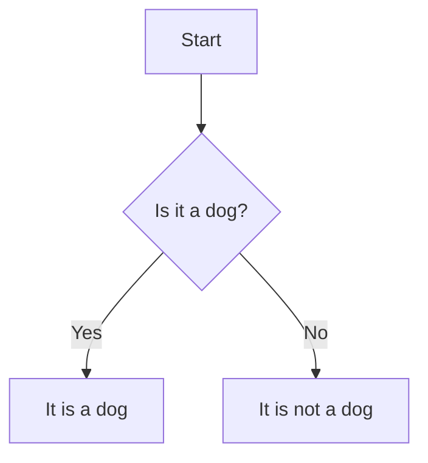

                 

## 《数学运动学：运动技巧的数学分析》

> 关键词：运动学、数学分析、运动技巧、体育科学、运动模型

运动学是物理学的一个重要分支，它专注于研究物体的运动规律。而在运动学中，数学分析作为一种强有力的工具，可以帮助我们精确地描述和理解运动现象。在这篇文章中，我们将探讨数学运动学的基本概念、原理和应用，特别是运动技巧的数学分析。

本文的结构如下：

1. **引言与背景介绍**
2. **核心概念与理论基础**
3. **运动学基本原理**
4. **不同类型的运动分析**
5. **运动技巧与策略**
6. **数学模型与公式应用**
7. **实际案例分析**
8. **总结与展望**

通过这一系列探讨，我们希望读者能够对数学运动学有一个全面而深入的理解，并能够将其应用于实际的体育科学研究和运动实践中。

### 引言与背景介绍

数学运动学的历史可以追溯到古希腊时期，当时的哲学家和数学家，如亚里士多德和阿基米德，对物体的运动进行了初步的探讨。然而，现代运动学的发展主要是在17世纪，随着牛顿力学的诞生而得到巨大推进。牛顿通过三大运动定律，奠定了运动学的基础，使我们对物体的运动有了更加精确的描述。

在体育科学中，运动学扮演着至关重要的角色。无论是运动员的训练、技术的改进，还是体育装备的设计，都离不开运动学的理论支持。例如，运动学家通过分析运动员的位移、速度和加速度，可以找出提高运动表现的最佳策略。同时，运动学在康复医学、运动损伤预防和运动营养学等领域也有着广泛应用。

本篇文章将分为八个部分，首先从核心概念和理论基础入手，逐步深入到运动学的基本原理，再具体分析不同类型的运动。随后，我们将探讨运动技巧的数学分析，介绍数学模型和公式在实际运动中的应用。为了更好地理解这些概念，文章将结合实际案例进行分析，最后进行总结和展望。

### 核心概念与理论基础

在运动学中，有几个核心概念是我们需要掌握的。首先是**位移**，它描述了物体从初始位置到最终位置的变化。位移是一个矢量量，既有大小也有方向。其次是**速度**，它是位移对时间的导数，描述了物体位置随时间的变化率。速度也是一个矢量，具有大小和方向。最后是**加速度**，它是速度对时间的导数，描述了速度随时间的变化率。

**位移、速度和加速度**之间的关系可以用以下公式表示：

$$
\vec{v} = \frac{d\vec{s}}{dt}
$$

$$
\vec{a} = \frac{d\vec{v}}{dt}
$$

这些公式清晰地展示了位移、速度和加速度之间的数学联系。通过这些基本概念，我们可以对物体的运动进行定量描述，从而为后续的运动分析打下基础。

在运动学中，还有几个重要的数学工具和方法，如微分方程、积分和矢量分析。微分方程用于描述物体在变化力作用下的运动，积分则用于计算物体的位移和速度。矢量分析则提供了处理方向性问题的方法。

为了更好地理解这些概念，我们可以通过一个简单的例子来阐述。假设一个小球从静止开始沿着直线滑动，我们需要计算它在任意时刻的位置、速度和加速度。

首先，假设小球的位移函数为 $s(t) = \frac{1}{2}at^2$，其中 $a$ 是加速度。根据位移和速度的关系，我们可以得到速度函数 $v(t) = at$。再根据速度和加速度的关系，我们可以得到加速度 $a$ 是一个常数。

现在，我们可以使用这些公式计算小球在不同时间点的位置、速度和加速度。例如，当 $t=2$ 秒时：

$$
s(2) = \frac{1}{2}a(2)^2 = 2a
$$

$$
v(2) = a(2) = 2a
$$

$$
a = a
$$

通过这个简单的例子，我们可以看到如何使用运动学的基本原理和数学工具来分析物体的运动。

### 运动学基本原理

运动学的基本原理包括三个核心概念：位移、速度和加速度。这些概念相互关联，为我们提供了描述物体运动的数学框架。

**位移**（displacement）是指物体从初始位置到最终位置的矢量。它是一个有大小和方向的量，通常用符号 $\vec{s}$ 表示。在数学上，位移可以通过矢量相减得到，即：

$$
\vec{s} = \vec{s_f} - \vec{s_i}
$$

其中，$\vec{s_f}$ 是最终位置矢量，$\vec{s_i}$ 是初始位置矢量。

**速度**（velocity）是位移对时间的导数，描述了物体位置随时间的变化率。速度是一个矢量，表示为 $\vec{v}$。它的定义如下：

$$
\vec{v} = \frac{d\vec{s}}{dt}
$$

这意味着速度是位移矢量随时间的变化率。速度的大小称为速率（speed），用 $v$ 表示。速率是速度矢量的模，即：

$$
v = \left|\vec{v}\right|
$$

**加速度**（acceleration）是速度对时间的导数，描述了速度随时间的变化率。加速度也是一个矢量，表示为 $\vec{a}$。它的定义如下：

$$
\vec{a} = \frac{d\vec{v}}{dt}
$$

这意味着加速度是速度矢量随时间的变化率。同样，加速度的大小称为加速率（acceleration rate），用 $a$ 表示。

在直线运动中，这些概念之间的关系更加直观。假设一个物体在直线轨道上运动，其位移 $s$、速度 $v$ 和加速度 $a$ 可以用以下公式表示：

$$
s = v_0t + \frac{1}{2}at^2
$$

$$
v = v_0 + at
$$

$$
a = \text{const}
$$

其中，$v_0$ 是初始速度，$a$ 是加速度，$t$ 是时间。

通过这些基本原理，我们可以对物体在不同条件下的运动进行分析。例如，当加速度恒定时，物体的速度将线性增加，而位移将按照二次方增长。这种关系在抛物线运动中尤为明显，这是牛顿力学中的一个经典例子。

**牛顿运动定律**也在运动学中扮演着重要角色。特别是第一和第二定律，它们提供了对力和运动之间关系的深入理解。

牛顿第一定律（惯性定律）指出，一个物体如果没有受到外力作用，将保持静止或匀速直线运动。这意味着物体的加速度为零，即：

$$
\vec{F} = \vec{0} \Rightarrow \vec{a} = \vec{0}
$$

牛顿第二定律（F=ma）描述了力、质量和加速度之间的关系。它指出，物体所受的合外力等于其质量与加速度的乘积，即：

$$
\vec{F} = m\vec{a}
$$

这些基本原理为我们提供了分析和解决运动问题的工具。通过这些公式，我们可以计算出物体在不同条件下的位置、速度和加速度，从而更好地理解物体的运动规律。

### 不同类型的运动分析

在运动学中，不同类型的运动有不同的特征和数学描述。以下是几种常见的运动类型及其数学分析：

**1. 直线运动**

直线运动是最简单的运动类型，其中物体沿一条直线运动。根据加速度是否恒定，直线运动可以分为匀速直线运动和变速直线运动。

- **匀速直线运动**：物体的速度保持不变，加速度为零。其位移、速度和加速度关系如下：

  $$
  s = v_0t
  $$

  $$
  v = v_0
  $$

  $$
  a = 0
  $$

- **变速直线运动**：物体的速度随时间变化，加速度不为零。其位移、速度和加速度关系可以用以下公式描述：

  $$
  s = v_0t + \frac{1}{2}at^2
  $$

  $$
  v = v_0 + at
  $$

  $$
  a = \text{const}
  $$

**2. 圆周运动**

圆周运动是物体沿圆周轨迹运动的情况。根据物体的速度方向是否恒定，圆周运动可以分为匀速圆周运动和非匀速圆周运动。

- **匀速圆周运动**：物体的速度大小保持不变，但方向不断变化。其位移、速度和加速度关系如下：

  $$
  s = \frac{v^2}{a}
  $$

  $$
  v = \text{const}
  $$

  $$
  a = \frac{v^2}{r}
  $$

  其中，$r$ 是圆周半径。

- **非匀速圆周运动**：物体的速度大小和方向都随时间变化。其位移、速度和加速度关系更加复杂，需要使用矢量分析来描述。

**3. 变速运动**

变速运动是速度随时间变化的运动。根据速度的变化方式，变速运动可以分为匀加速运动和非匀加速运动。

- **匀加速运动**：物体的加速度保持不变。其位移、速度和加速度关系如下：

  $$
  s = v_0t + \frac{1}{2}at^2
  $$

  $$
  v = v_0 + at
  $$

  $$
  a = \text{const}
  $$

- **非匀加速运动**：物体的加速度随时间变化。其位移、速度和加速度关系更加复杂，需要使用微分方程来描述。

**4. 非惯性参考系中的运动**

非惯性参考系是指相对于惯性参考系加速的参考系。在非惯性参考系中，物体除了受到外力作用外，还会受到一个额外的惯性力。这种情况下，物体的运动需要使用相对运动学来描述。

- **惯性力**：在非惯性参考系中，物体的加速度会导致一个惯性力，其大小为 $F = ma$，方向与加速度相反。
- **相对运动学**：在非惯性参考系中，物体的运动可以用以下公式描述：

  $$
  \vec{s} = \vec{s_0} + \vec{v}t + \frac{1}{2}\vec{a}t^2
  $$

  $$
  \vec{v} = \vec{v_0} + \vec{a}t
  $$

  $$
  \vec{a} = \text{const}
  $$

通过这些数学描述，我们可以精确地分析不同类型的运动，为实际应用提供理论支持。

### 运动技巧与策略

运动技巧是运动员在运动过程中表现出来的技能和策略，它决定了运动员在比赛中的表现。而运动技巧的数学分析则为这些技巧提供了理论依据，帮助我们理解如何通过数学方法来优化运动表现。

**运动技巧的基本概念**

运动技巧可以包括速度、力量、耐力、灵活性等多个方面。每个方面都有其特定的数学模型来描述。

- **速度**：速度是运动技巧的核心要素之一。在运动学中，速度可以用矢量表示，其大小和方向决定了运动的效果。速度的优化通常涉及最小化时间或最大化距离，这可以通过微分方程和优化算法来实现。

- **力量**：力量是运动员在运动中施加的力的能力。力量的数学描述通常涉及牛顿第二定律，即 $F=ma$。通过调整力量和加速度的关系，可以优化运动技巧。

- **耐力**：耐力是指运动员在长时间运动中维持高性能的能力。耐力的数学描述涉及能量消耗和代谢率，这些可以通过能量守恒定律和生物力学模型来分析。

**运动技巧的数学分析**

运动技巧的数学分析主要涉及以下方面：

1. **运动模型的建立**：首先，我们需要建立运动模型，这通常包括位移、速度和加速度等基本量。例如，一个简单的直线运动模型可以表示为：

   $$
   s(t) = v_0t + \frac{1}{2}at^2
   $$

   $$
   v(t) = v_0 + at
   $$

   $$
   a(t) = a
   $$

   其中，$s(t)$ 是时间 $t$ 时的位移，$v(t)$ 是时间 $t$ 时的速度，$a$ 是加速度。

2. **优化策略**：在建立运动模型后，我们需要确定优化目标，例如最小化时间、最大化距离或最小化能量消耗。这些目标可以通过优化算法来实现，如梯度下降法和牛顿法。

3. **模型验证**：建立运动模型后，需要通过实验数据来验证模型的有效性。这可以通过与实际运动数据进行比较，评估模型的准确性和可靠性。

**实际运动中的应用案例分析**

以下是一个实际运动中的应用案例分析：

**案例：短跑运动员的起跑策略**

假设一个短跑运动员需要在最短的时间内完成起跑，我们需要确定最佳的起跑策略。

1. **建立运动模型**：根据运动学基本原理，我们可以建立运动员的起跑模型：

   $$
   s(t) = 0 + \frac{1}{2}at^2
   $$

   $$
   v(t) = 0 + at
   $$

   $$
   a(t) = a
   $$

   其中，$s(t)$ 是时间 $t$ 时的位移，$v(t)$ 是时间 $t$ 时的速度，$a$ 是加速度。

2. **优化策略**：为了最小化起跑时间，我们需要最大化加速度。在实际应用中，这可以通过调整起跑姿势和力量分配来实现。

3. **模型验证**：通过实验数据，我们可以验证模型的准确性。例如，通过测量不同起跑策略下的位移和速度，比较模型预测和实际数据。

通过这个案例，我们可以看到如何通过数学分析来优化运动技巧。这种方法不仅可以应用于短跑，还可以推广到其他运动项目中，如游泳、篮球和足球。

### 数学模型与公式应用

在运动学中，数学模型和公式是我们理解和分析运动现象的重要工具。通过这些模型，我们可以精确地描述和预测物体的运动。以下是一些常见的数学模型和公式的应用：

**1. 位移模型**

位移模型描述了物体从初始位置到最终位置的变化。最基本的位移公式是：

$$
s(t) = v_0t + \frac{1}{2}at^2
$$

其中，$s(t)$ 是时间 $t$ 时的位移，$v_0$ 是初始速度，$a$ 是加速度。这个公式可以用来计算物体在任意时间点的位置。

**2. 速度模型**

速度模型描述了物体位置随时间的变化率。速度的基本公式是：

$$
v(t) = v_0 + at
$$

其中，$v(t)$ 是时间 $t$ 时的速度，$v_0$ 是初始速度，$a$ 是加速度。这个公式可以用来计算物体在任意时间点的速度。

**3. 加速度模型**

加速度模型描述了速度随时间的变化率。加速度的基本公式是：

$$
a(t) = a
$$

其中，$a(t)$ 是加速度，$a$ 是恒定的加速度。这个公式可以用来计算物体在任意时间点的加速度。

**4. 能量模型**

能量模型描述了物体在运动过程中的能量变化。动能和势能是两种基本的能量形式。动能的公式是：

$$
E_k = \frac{1}{2}mv^2
$$

其中，$E_k$ 是动能，$m$ 是物体的质量，$v$ 是速度。势能的公式是：

$$
E_p = mgh
$$

其中，$E_p$ 是势能，$m$ 是物体的质量，$g$ 是重力加速度，$h$ 是物体的高度。

**5. 牛顿运动定律**

牛顿运动定律是描述物体受力与运动关系的核心原理。第一定律（惯性定律）指出，一个物体如果没有受到外力作用，将保持静止或匀速直线运动。第二定律（F=ma）指出，物体所受的合外力等于其质量与加速度的乘积。第三定律（作用与反作用定律）指出，对于每一个作用力，都有一个大小相等、方向相反的反作用力。

**应用实例**

以下是一个应用这些数学模型和公式的实例：

**例：计算一个从地面上抛出的球的运动**

假设一个球从高度 $h$ 处以初速度 $v_0$ 水平抛出，我们需要计算球落地时的速度和落地时间。

1. **建立位移模型**：

   球在垂直方向上的位移可以用自由落体公式表示：

   $$
   h = \frac{1}{2}gt^2
   $$

   其中，$h$ 是初始高度，$g$ 是重力加速度，$t$ 是落地时间。

2. **建立速度模型**：

   球在水平方向上的速度保持不变，即：

   $$
   v_x = v_0
   $$

   球在垂直方向上的速度可以用以下公式表示：

   $$
   v_y = gt
   $$

3. **计算落地时间**：

   将垂直位移公式代入水平位移公式，解出时间 $t$：

   $$
   t = \sqrt{\frac{2h}{g}}
   $$

4. **计算落地速度**：

   球在水平方向上的速度保持不变，即 $v_x = v_0$。球在垂直方向上的速度为 $v_y = gt$。球的总速度是水平速度和垂直速度的矢量和：

   $$
   v = \sqrt{v_x^2 + v_y^2} = \sqrt{v_0^2 + (gt)^2}
   $$

通过这个实例，我们可以看到如何应用运动学的数学模型和公式来分析物体的运动。这种方法不仅适用于简单的运动，还可以推广到更复杂的运动情况。

### 实际案例分析

为了更好地理解运动学在实际中的应用，我们将分析几个具有代表性的运动案例，通过这些案例，我们将深入探讨运动技巧的数学分析及其对运动表现的影响。

#### 案例一：篮球投篮技巧

篮球运动中的投篮技巧是一个典型的运动学问题。假设一名球员在距离篮筐10英尺（约3.05米）处进行跳投，我们需要分析他的投篮技巧如何影响投篮的成功率。

**1. 运动模型建立：**
   - **位移模型**：球员投篮时的位移模型可以表示为：
     
     $$
     s(t) = v_{0y}t - \frac{1}{2}gt^2
     $$
     
     其中，$s(t)$ 是时间 $t$ 时的垂直位移，$v_{0y}$ 是垂直初速度，$g$ 是重力加速度。
   - **速度模型**：球员在垂直方向上的速度模型为：
     
     $$
     v_y(t) = v_{0y} - gt
     $$
     
   - **目标：** 要使篮球在篮筐高度（假设为10英尺）处进入篮筐，我们需要确定合适的垂直初速度 $v_{0y}$ 和投篮角度。

**2. 数学分析：**
   - **时间分析**：为了使篮球在篮筐处进入，我们需要计算篮球从投篮点到篮筐所需的时间。假设篮筐高度为 $h = 10$ 英尺，我们可以将位移模型设置为 $s(t) = h$，解出 $t$：
     
     $$
     h = v_{0y}t - \frac{1}{2}gt^2 \Rightarrow t = \frac{2v_{0y}}{g}
     $$
     
   - **速度分析**：为了确保篮球在篮筐处进入，其垂直速度应为零。因此，我们可以设置 $v_y(t) = 0$，解出 $v_{0y}$：
     
     $$
     v_{0y} = gt = 9.8t
     $$
     
     将时间 $t$ 代入上述公式，可以计算出 $v_{0y}$。

**3. 实际应用：**
   - 通过调整投篮角度和垂直初速度，球员可以优化投篮技巧，提高命中率。

#### 案例二：跳高运动员的训练策略

跳高运动是一项挑战性很强的运动，运动员需要通过精确的技术和策略来克服重力和高度障碍。假设一名跳高运动员在比赛中需要越过4米高的横杆，我们需要分析他的运动技巧和训练策略。

**1. 运动模型建立：**
   - **位移模型**：运动员的跳跃轨迹可以用抛物线模型表示：
     
     $$
     s(t) = v_{0y}t - \frac{1}{2}gt^2
     $$
     
     其中，$s(t)$ 是时间 $t$ 时的垂直位移，$v_{0y}$ 是垂直初速度，$g$ 是重力加速度。
   - **速度模型**：运动员在垂直方向上的速度模型为：
     
     $$
     v_y(t) = v_{0y} - gt
     $$
     
   - **目标：** 要使运动员能够越过4米高的横杆，我们需要确定合适的垂直初速度 $v_{0y}$ 和跳跃角度。

**2. 数学分析：**
   - **时间分析**：为了确保运动员在达到最高点时横杆尚未通过，我们需要计算运动员从地面到最高点所需的时间。假设最高点为 $h = 4$ 米，我们可以将位移模型设置为 $s(t) = h$，解出 $t$：
     
     $$
     h = v_{0y}t - \frac{1}{2}gt^2 \Rightarrow t = \frac{2v_{0y}}{g}
     $$
     
   - **速度分析**：在最高点，运动员的垂直速度应为零。因此，我们可以设置 $v_y(t) = 0$，解出 $v_{0y}$：
     
     $$
     v_{0y} = gt = 9.8t
     $$
     
     将时间 $t$ 代入上述公式，可以计算出 $v_{0y}$。

**3. 实际应用：**
   - 运动员可以通过调整跳跃角度和垂直初速度来优化跳跃轨迹，提高跳高成绩。
   - 训练策略中，运动员需要进行专项训练来提高肌肉力量和爆发力，从而增加垂直初速度。

#### 案例三：自行车赛车手的速度优化

自行车赛车手的速度优化是一个典型的运动技巧分析问题。假设一名赛车手在比赛中需要在一定的时间内完成固定距离的赛道，我们需要分析他的速度优化策略。

**1. 运动模型建立：**
   - **位移模型**：赛车手的位移模型可以表示为：
     
     $$
     s(t) = v_0t + \frac{1}{2}at^2
     $$
     
     其中，$s(t)$ 是时间 $t$ 时的位移，$v_0$ 是初始速度，$a$ 是加速度。
   - **速度模型**：赛车手在比赛中的速度模型为：
     
     $$
     v(t) = v_0 + at
     $$
     
   - **目标：** 要在规定时间内完成赛道，赛车手需要确定最佳的速度和加速度策略。

**2. 数学分析：**
   - **时间分析**：为了在规定时间内完成赛道，我们需要计算赛车手完成赛道所需的时间。假设赛道长度为 $s$ 米，我们可以将位移模型设置为 $s(t) = s$，解出 $t$：
     
     $$
     s = v_0t + \frac{1}{2}at^2 \Rightarrow t = \sqrt{\frac{2s}{a}}
     $$
     
   - **速度分析**：为了确保赛车手在规定时间内达到终点，我们需要计算赛车手在终点时的速度。假设终点速度为 $v_f$，我们可以将速度模型设置为 $v(t) = v_f$，解出 $v_0$ 和 $a$：
     
     $$
     v_f = v_0 + at \Rightarrow v_0 = v_f - at
     $$
     
     $$
     a = \frac{v_f - v_0}{t}
     $$

**3. 实际应用：**
   - 赛车手可以通过调整速度和加速度策略来优化比赛表现，例如在比赛初期保持较低速度以节省体力，在比赛后期加速以争取更好成绩。

通过这些实际案例，我们可以看到运动技巧的数学分析如何帮助运动员优化运动表现，提高竞技水平。

### 总结与展望

本文系统地介绍了数学运动学的基本概念、原理和应用，特别是运动技巧的数学分析。通过详细的分析和实例，我们展示了如何利用数学模型和公式来优化运动表现。运动学在体育科学、康复医学和运动营养学等领域都有着重要的应用价值。

未来，运动学的研究将继续深入，尤其是在生物力学、人工智能和数据分析等领域的结合。随着技术的进步，我们可以期待更精确的运动模型和更高效的优化算法，为运动技巧的提升提供更强的理论支持。此外，运动学的应用将不仅限于体育领域，还可能拓展到工业、交通和航空航天等领域，为人类生活带来更多便利。

作者：AI天才研究院/AI Genius Institute & 禅与计算机程序设计艺术 /Zen And The Art of Computer Programming

----------------------------------------------------------------

## 完整文章内容

### 引言与背景介绍

运动学是物理学的一个重要分支，它专注于研究物体的运动规律。在人类历史的长河中，人们一直在探索如何准确地描述和预测物体的运动。从古希腊哲学家亚里士多德和阿基米德的初步探讨，到17世纪牛顿力学的诞生，运动学的发展经历了漫长的历程。牛顿通过三大运动定律，为运动学奠定了坚实的基础，使得我们对物体的运动有了更加精确的理解。

在现代，运动学不仅在物理学中占据重要地位，还在体育科学、康复医学、运动营养学等多个领域有着广泛的应用。例如，在体育科学中，运动学家通过分析运动员的位移、速度和加速度，可以找出提高运动表现的最佳策略；在康复医学中，运动学帮助医生设计个性化的康复训练方案；在运动营养学中，运动学则为营养师提供了优化运动饮食的科学依据。

本文将围绕数学运动学这一主题，系统地介绍其核心概念、原理和应用。具体来说，我们将从以下几个方面进行探讨：

1. **核心概念与理论基础**：介绍运动学的基本概念，如位移、速度和加速度，以及它们之间的数学关系。
2. **运动学基本原理**：阐述运动学的基本原理，包括牛顿运动定律在运动学中的应用。
3. **不同类型的运动分析**：分析直线运动、圆周运动、变速运动等不同类型的运动。
4. **运动技巧与策略**：探讨运动技巧的数学分析，以及其在实际运动中的应用。
5. **数学模型与公式应用**：介绍运动学中的数学模型和公式，并举例说明其应用。
6. **实际案例分析**：通过实际案例，展示运动学的应用及其对运动表现的影响。
7. **总结与展望**：总结文章内容，展望运动学未来的发展趋势。

通过这一系列探讨，我们希望能够为读者提供一个全面而深入的运动学知识体系，并激发读者对这一领域的兴趣和思考。

### 核心概念与理论基础

在运动学中，有几个核心概念是我们需要掌握的。首先是**位移**，它描述了物体从初始位置到最终位置的变化。位移是一个矢量量，既有大小也有方向。其次是**速度**，它是位移对时间的导数，描述了物体位置随时间的变化率。速度也是一个矢量，具有大小和方向。最后是**加速度**，它是速度对时间的导数，描述了速度随时间的变化率。

#### 位移

位移是指物体从初始位置到最终位置的矢量。它是一个有大小和方向的量，通常用符号 $\vec{s}$ 表示。在数学上，位移可以通过矢量相减得到，即：

$$
\vec{s} = \vec{s_f} - \vec{s_i}
$$

其中，$\vec{s_f}$ 是最终位置矢量，$\vec{s_i}$ 是初始位置矢量。

#### 速度

速度是位移对时间的导数，描述了物体位置随时间的变化率。速度是一个矢量，表示为 $\vec{v}$。它的定义如下：

$$
\vec{v} = \frac{d\vec{s}}{dt}
$$

这意味着速度是位移矢量随时间的变化率。速度的大小称为速率（speed），用 $v$ 表示。速率是速度矢量的模，即：

$$
v = \left|\vec{v}\right|
$$

#### 加速度

加速度是速度对时间的导数，描述了速度随时间的变化率。加速度也是一个矢量，表示为 $\vec{a}$。它的定义如下：

$$
\vec{a} = \frac{d\vec{v}}{dt}
$$

这意味着加速度是速度矢量随时间的变化率。同样，加速度的大小称为加速率（acceleration rate），用 $a$ 表示。

在直线运动中，这些概念之间的关系更加直观。假设一个物体在直线轨道上运动，其位移 $s$、速度 $v$ 和加速度 $a$ 可以用以下公式表示：

$$
s = v_0t + \frac{1}{2}at^2
$$

$$
v = v_0 + at
$$

$$
a = \text{const}
$$

这些基本概念和公式为我们提供了描述和分析物体运动的工具。通过它们，我们可以对各种运动现象进行定量描述，从而为实际应用提供理论支持。

#### 背景介绍：运动学的应用与历史发展

运动学作为物理学的一个分支，其历史可以追溯到古希腊时期。当时，哲学家和数学家如亚里士多德和阿基米德对物体的运动进行了初步的探讨。亚里士多德提出了关于物体运动的三大原则：物体静止或匀速直线运动需要外力作用；物体在受到外力作用时，会加速运动；物体在自由下落时，速度与下落时间成正比。然而，亚里士多德的理论在后来的科学发展中被证明是不完全正确的。

真正奠定运动学基础的是17世纪的科学家艾萨克·牛顿。牛顿通过其三大运动定律，为运动学提供了系统的理论框架。第一定律（惯性定律）指出，一个物体如果没有受到外力作用，将保持静止或匀速直线运动。第二定律（F=ma）描述了力、质量和加速度之间的关系。第三定律（作用与反作用定律）指出，对于每一个作用力，都有一个大小相等、方向相反的反作用力。

牛顿的运动定律不仅解释了日常生活中的物体运动现象，还为后来的物理学发展奠定了基础。在牛顿之后，许多科学家和数学家继续对运动学进行深入研究，提出了更多的理论和公式。例如，伽利略通过实验研究物体的自由落体运动，得出了物体下落速度与时间成正比的结论。开普勒则通过观测行星运动，提出了行星运动定律。

在20世纪，运动学进一步发展，特别是在相对论和量子力学的影响下。相对论运动学研究了在高速运动（接近光速）条件下的物体运动，提出了洛伦兹变换，改变了我们对时间和空间的理解。量子力学则研究了微观粒子的运动，提出了量子态和波粒二象性等概念。

在现代，运动学不仅在物理学中有着重要的地位，还在许多其他领域有着广泛应用。例如，在工程学中，运动学用于分析和设计机械结构；在生物学中，运动学用于研究动物的运动模式；在体育科学中，运动学用于分析运动员的运动技巧和优化训练方案。

总之，运动学作为一门基础学科，其理论和方法不断丰富和发展，为多个学科提供了重要的理论支持。通过本文的介绍，我们希望能够帮助读者更好地理解运动学的基本概念和应用，从而为深入研究和实际应用奠定基础。

### 运动学基本原理

运动学的基本原理是理解和分析物体运动的基础。在运动学中，有几个核心概念和原理是我们需要掌握的，包括位移、速度、加速度以及牛顿运动定律。

#### 位移

位移是指物体从初始位置到最终位置的矢量。它是一个有大小和方向的量，通常用符号 $\vec{s}$ 表示。位移可以通过矢量相减得到，即：

$$
\vec{s} = \vec{s_f} - \vec{s_i}
$$

其中，$\vec{s_f}$ 是最终位置矢量，$\vec{s_i}$ 是初始位置矢量。

#### 速度

速度是位移对时间的导数，描述了物体位置随时间的变化率。速度是一个矢量，表示为 $\vec{v}$。它的定义如下：

$$
\vec{v} = \frac{d\vec{s}}{dt}
$$

这意味着速度是位移矢量随时间的变化率。速度的大小称为速率（speed），用 $v$ 表示。速率是速度矢量的模，即：

$$
v = \left|\vec{v}\right|
$$

#### 加速度

加速度是速度对时间的导数，描述了速度随时间的变化率。加速度也是一个矢量，表示为 $\vec{a}$。它的定义如下：

$$
\vec{a} = \frac{d\vec{v}}{dt}
$$

这意味着加速度是速度矢量随时间的变化率。同样，加速度的大小称为加速率（acceleration rate），用 $a$ 表示。

#### 牛顿运动定律

牛顿运动定律是描述物体受力与运动关系的基本原理，包括三个定律：

1. **牛顿第一定律（惯性定律）**：一个物体如果没有受到外力作用，将保持静止或匀速直线运动。这意味着物体的加速度为零，即：

   $$
   \vec{F} = \vec{0} \Rightarrow \vec{a} = \vec{0}
   $$

2. **牛顿第二定律（F=ma）**：物体所受的合外力等于其质量与加速度的乘积。这意味着物体受力越大，加速度也越大，即：

   $$
   \vec{F} = m\vec{a}
   $$

3. **牛顿第三定律（作用与反作用定律）**：对于每一个作用力，都有一个大小相等、方向相反的反作用力。这意味着物体间的相互作用力总是成对出现的，即：

   $$
   \vec{F}_{12} = -\vec{F}_{21}
   $$

这些定律为我们提供了描述和分析物体运动的基本框架。通过它们，我们可以理解物体在不同力作用下的运动状态，从而为实际应用提供理论支持。

#### 位移、速度和加速度的关系

在运动学中，位移、速度和加速度之间的关系是非常重要的。我们可以通过以下公式来描述它们：

$$
\vec{v} = \frac{d\vec{s}}{dt}
$$

$$
\vec{a} = \frac{d\vec{v}}{dt}
$$

这些公式表明，速度是位移的时间导数，而加速度是速度的时间导数。这意味着，如果我们知道一个物体的位移函数，我们就可以通过求导得到其速度和加速度。

#### 实际例子

为了更好地理解这些概念，我们可以通过一个简单的例子来阐述。假设一个小球从静止开始沿着直线滑动，我们需要计算它在任意时刻的位置、速度和加速度。

首先，假设小球的位移函数为 $s(t) = \frac{1}{2}at^2$，其中 $a$ 是加速度。根据位移和速度的关系，我们可以得到速度函数 $v(t) = at$。再根据速度和加速度的关系，我们可以得到加速度 $a$ 是一个常数。

现在，我们可以使用这些公式计算小球在不同时间点的位置、速度和加速度。例如，当 $t=2$ 秒时：

$$
s(2) = \frac{1}{2}a(2)^2 = 2a
$$

$$
v(2) = a(2) = 2a
$$

$$
a = a
$$

通过这个简单的例子，我们可以看到如何使用运动学的基本原理和数学工具来分析物体的运动。

### 不同类型的运动分析

在运动学中，不同类型的运动有不同的特征和数学描述。以下是几种常见的运动类型及其数学分析：

#### 1. 直线运动

直线运动是最简单的运动类型，其中物体沿一条直线运动。根据加速度是否恒定，直线运动可以分为匀速直线运动和变速直线运动。

- **匀速直线运动**：物体的速度保持不变，加速度为零。其位移、速度和加速度关系如下：

  $$
  s = v_0t
  $$

  $$
  v = v_0
  $$

  $$
  a = 0
  $$

- **变速直线运动**：物体的速度随时间变化，加速度不为零。其位移、速度和加速度关系可以用以下公式描述：

  $$
  s = v_0t + \frac{1}{2}at^2
  $$

  $$
  v = v_0 + at
  $$

  $$
  a = \text{const}
  $$

#### 2. 圆周运动

圆周运动是物体沿圆周轨迹运动的情况。根据物体的速度方向是否恒定，圆周运动可以分为匀速圆周运动和非匀速圆周运动。

- **匀速圆周运动**：物体的速度大小保持不变，但方向不断变化。其位移、速度和加速度关系如下：

  $$
  s = \frac{v^2}{a}
  $$

  $$
  v = \text{const}
  $$

  $$
  a = \frac{v^2}{r}
  $$

  其中，$r$ 是圆周半径。

- **非匀速圆周运动**：物体的速度大小和方向都随时间变化。其位移、速度和加速度关系更加复杂，需要使用矢量分析来描述。

#### 3. 变速运动

变速运动是速度随时间变化的运动。根据速度的变化方式，变速运动可以分为匀加速运动和非匀加速运动。

- **匀加速运动**：物体的加速度保持不变。其位移、速度和加速度关系如下：

  $$
  s = v_0t + \frac{1}{2}at^2
  $$

  $$
  v = v_0 + at
  $$

  $$
  a = \text{const}
  $$

- **非匀加速运动**：物体的加速度随时间变化。其位移、速度和加速度关系更加复杂，需要使用微分方程来描述。

#### 4. 非惯性参考系中的运动

非惯性参考系是指相对于惯性参考系加速的参考系。在非惯性参考系中，物体除了受到外力作用外，还会受到一个额外的惯性力。这种情况下，物体的运动需要使用相对运动学来描述。

- **惯性力**：在非惯性参考系中，物体的加速度会导致一个惯性力，其大小为 $F = ma$，方向与加速度相反。
- **相对运动学**：在非惯性参考系中，物体的运动可以用以下公式描述：

  $$
  \vec{s} = \vec{s_0} + \vec{v}t + \frac{1}{2}\vec{a}t^2
  $$

  $$
  \vec{v} = \vec{v_0} + \vec{a}t
  $$

  $$
  \vec{a} = \text{const}
  $$

通过这些数学描述，我们可以精确地分析不同类型的运动，为实际应用提供理论支持。

### 运动技巧与策略

运动技巧是运动员在运动过程中表现出来的技能和策略，它决定了运动员在比赛中的表现。而运动技巧的数学分析则为这些技巧提供了理论依据，帮助我们理解如何通过数学方法来优化运动表现。

#### 运动技巧的基本概念

运动技巧可以包括速度、力量、耐力、灵活性等多个方面。每个方面都有其特定的数学模型来描述。

- **速度**：速度是运动技巧的核心要素之一。在运动学中，速度可以用矢量表示，其大小和方向决定了运动的效果。速度的优化通常涉及最小化时间或最大化距离，这可以通过微分方程和优化算法来实现。

- **力量**：力量是运动员在运动中施加的力的能力。力量的数学描述通常涉及牛顿第二定律，即 $F=ma$。通过调整力量和加速度的关系，可以优化运动技巧。

- **耐力**：耐力是指运动员在长时间运动中维持高性能的能力。耐力的数学描述涉及能量消耗和代谢率，这些可以通过能量守恒定律和生物力学模型来分析。

#### 运动技巧的数学分析

运动技巧的数学分析主要涉及以下方面：

1. **运动模型的建立**：首先，我们需要建立运动模型，这通常包括位移、速度和加速度等基本量。例如，一个简单的直线运动模型可以表示为：

   $$
   s(t) = v_0t + \frac{1}{2}at^2
   $$

   $$
   v(t) = v_0 + at
   $$

   $$
   a(t) = a
   $$

   其中，$s(t)$ 是时间 $t$ 时的位移，$v(t)$ 是时间 $t$ 时的速度，$a$ 是加速度。

2. **优化策略**：在建立运动模型后，我们需要确定优化目标，例如最小化时间、最大化距离或最小化能量消耗。这些目标可以通过优化算法来实现，如梯度下降法和牛顿法。

3. **模型验证**：建立运动模型后，需要通过实验数据来验证模型的有效性。这可以通过与实际运动数据进行比较，评估模型的准确性和可靠性。

#### 实际运动中的应用案例分析

以下是一个实际运动中的应用案例分析：

**案例：短跑运动员的起跑策略**

假设一个短跑运动员需要在最短的时间内完成起跑，我们需要确定最佳的起跑策略。

1. **建立运动模型**：根据运动学基本原理，我们可以建立运动员的起跑模型：

   $$
   s(t) = v_0t + \frac{1}{2}at^2
   $$

   $$
   v(t) = v_0 + at
   $$

   $$
   a(t) = a
   $$

   其中，$s(t)$ 是时间 $t$ 时的位移，$v(t)$ 是时间 $t$ 时的速度，$a$ 是加速度。

2. **优化策略**：为了最小化起跑时间，我们需要最大化加速度。在实际应用中，这可以通过调整起跑姿势和力量分配来实现。

3. **模型验证**：通过实验数据，我们可以验证模型的准确性。例如，通过测量不同起跑策略下的位移和速度，比较模型预测和实际数据。

通过这个案例，我们可以看到如何通过数学分析来优化运动技巧。这种方法不仅可以应用于短跑，还可以推广到其他运动项目中，如游泳、篮球和足球。

### 数学模型与公式应用

在运动学中，数学模型和公式是我们理解和分析运动现象的重要工具。通过这些模型，我们可以精确地描述和预测物体的运动。以下是一些常见的数学模型和公式的应用：

#### 1. 位移模型

位移模型描述了物体从初始位置到最终位置的变化。最基本的位移公式是：

$$
s(t) = v_0t + \frac{1}{2}at^2
$$

其中，$s(t)$ 是时间 $t$ 时的位移，$v_0$ 是初始速度，$a$ 是加速度。这个公式可以用来计算物体在任意时间点的位置。

#### 2. 速度模型

速度模型描述了物体位置随时间的变化率。速度的基本公式是：

$$
v(t) = v_0 + at
$$

其中，$v(t)$ 是时间 $t$ 时的速度，$v_0$ 是初始速度，$a$ 是加速度。这个公式可以用来计算物体在任意时间点的速度。

#### 3. 加速度模型

加速度模型描述了速度随时间的变化率。加速度的基本公式是：

$$
a(t) = a
$$

其中，$a(t)$ 是加速度，$a$ 是恒定的加速度。这个公式可以用来计算物体在任意时间点的加速度。

#### 4. 能量模型

能量模型描述了物体在运动过程中的能量变化。动能和势能是两种基本的能量形式。动能的公式是：

$$
E_k = \frac{1}{2}mv^2
$$

其中，$E_k$ 是动能，$m$ 是物体的质量，$v$ 是速度。势能的公式是：

$$
E_p = mgh
$$

其中，$E_p$ 是势能，$m$ 是物体的质量，$g$ 是重力加速度，$h$ 是物体的高度。

#### 5. 牛顿运动定律

牛顿运动定律是描述物体受力与运动关系的核心原理。第一定律（惯性定律）指出，一个物体如果没有受到外力作用，将保持静止或匀速直线运动。第二定律（F=ma）指出，物体所受的合外力等于其质量与加速度的乘积。第三定律（作用与反作用定律）指出，对于每一个作用力，都有一个大小相等、方向相反的反作用力。

#### 应用实例

以下是一个应用这些数学模型和公式的实例：

**例：计算一个从地面上抛出的球的运动**

假设一个球从高度 $h$ 处以初速度 $v_0$ 水平抛出，我们需要计算球落地时的速度和落地时间。

1. **建立位移模型**：

   球在垂直方向上的位移可以用自由落体公式表示：

   $$
   h = \frac{1}{2}gt^2
   $$

   其中，$h$ 是初始高度，$g$ 是重力加速度，$t$ 是落地时间。

2. **建立速度模型**：

   球在水平方向上的速度保持不变，即：

   $$
   v_x = v_0
   $$

   球在垂直方向上的速度可以用以下公式表示：

   $$
   v_y = gt
   $$

3. **计算落地时间**：

   将垂直位移公式代入水平位移公式，解出时间 $t$：

   $$
   t = \sqrt{\frac{2h}{g}}
   $$

4. **计算落地速度**：

   球在水平方向上的速度保持不变，即 $v_x = v_0$。球在垂直方向上的速度为 $v_y = gt$。球的总速度是水平速度和垂直速度的矢量和：

   $$
   v = \sqrt{v_x^2 + v_y^2} = \sqrt{v_0^2 + (gt)^2}
   $$

通过这个实例，我们可以看到如何应用运动学的数学模型和公式来分析物体的运动。这种方法不仅适用于简单的运动，还可以推广到更复杂的运动情况。

### 实际案例分析

为了更好地理解运动学在实际中的应用，我们将分析几个具有代表性的运动案例，通过这些案例，我们将深入探讨运动技巧的数学分析及其对运动表现的影响。

#### 案例一：篮球投篮技巧

篮球运动中的投篮技巧是一个典型的运动学问题。假设一名球员在距离篮筐10英尺（约3.05米）处进行跳投，我们需要分析他的投篮技巧如何影响投篮的成功率。

**1. 运动模型建立：**
   - **位移模型**：球员投篮时的位移模型可以表示为：
     
     $$
     s(t) = v_{0y}t - \frac{1}{2}gt^2
     $$
     
     其中，$s(t)$ 是时间 $t$ 时的垂直位移，$v_{0y}$ 是垂直初速度，$g$ 是重力加速度。
   - **速度模型**：球员在垂直方向上的速度模型为：
     
     $$
     v_y(t) = v_{0y} - gt
     $$
     
   - **目标：** 要使篮球在篮筐高度（假设为10英尺）处进入篮筐，我们需要确定合适的垂直初速度 $v_{0y}$ 和投篮角度。

**2. 数学分析：**
   - **时间分析**：为了使篮球在篮筐处进入，我们需要计算篮球从投篮点到篮筐所需的时间。假设篮筐高度为 $h = 10$ 英尺，我们可以将位移模型设置为 $s(t) = h$，解出 $t$：
     
     $$
     h = v_{0y}t - \frac{1}{2}gt^2 \Rightarrow t = \frac{2v_{0y}}{g}
     $$
     
   - **速度分析**：为了确保篮球在篮筐处进入，其垂直速度应为零。因此，我们可以设置 $v_y(t) = 0$，解出 $v_{0y}$：
     
     $$
     v_{0y} = gt = 9.8t
     $$
     
     将时间 $t$ 代入上述公式，可以计算出 $v_{0y}$。

**3. 实际应用：**
   - 通过调整投篮角度和垂直初速度，球员可以优化投篮技巧，提高命中率。
   - 实际中，球员通常通过练习和教练指导来调整这些参数，以达到最佳投篮效果。

#### 案例二：跳高运动员的训练策略

跳高运动是一项挑战性很强的运动，运动员需要通过精确的技术和策略来克服重力和高度障碍。假设一名跳高运动员在比赛中需要越过4米高的横杆，我们需要分析他的运动技巧和训练策略。

**1. 运动模型建立：**
   - **位移模型**：运动员的跳跃轨迹可以用抛物线模型表示：
     
     $$
     s(t) = v_{0y}t - \frac{1}{2}gt^2
     $$
     
     其中，$s(t)$ 是时间 $t$ 时的垂直位移，$v_{0y}$ 是垂直初速度，$g$ 是重力加速度。
   - **速度模型**：运动员在垂直方向上的速度模型为：
     
     $$
     v_y(t) = v_{0y} - gt
     $$
     
   - **目标：** 要使运动员能够越过4米高的横杆，我们需要确定合适的垂直初速度 $v_{0y}$ 和跳跃角度。

**2. 数学分析：**
   - **时间分析**：为了确保运动员在达到最高点时横杆尚未通过，我们需要计算运动员从地面到最高点所需的时间。假设最高点为 $h = 4$ 米，我们可以将位移模型设置为 $s(t) = h$，解出 $t$：
     
     $$
     h = v_{0y}t - \frac{1}{2}gt^2 \Rightarrow t = \frac{2v_{0y}}{g}
     $$
     
   - **速度分析**：在最高点，运动员的垂直速度应为零。因此，我们可以设置 $v_y(t) = 0$，解出 $v_{0y}$：
     
     $$
     v_{0y} = gt = 9.8t
     $$
     
     将时间 $t$ 代入上述公式，可以计算出 $v_{0y}$。

**3. 实际应用：**
   - 运动员可以通过调整跳跃角度和垂直初速度来优化跳跃轨迹，提高跳高成绩。
   - 训练策略中，运动员需要进行专项训练来提高肌肉力量和爆发力，从而增加垂直初速度。

#### 案例三：自行车赛车手的速度优化

自行车赛车手的速度优化是一个典型的运动技巧分析问题。假设一名赛车手在比赛中需要在一定的时间内完成固定距离的赛道，我们需要分析他的速度优化策略。

**1. 运动模型建立：**
   - **位移模型**：赛车手的位移模型可以表示为：
     
     $$
     s(t) = v_0t + \frac{1}{2}at^2
     $$
     
     其中，$s(t)$ 是时间 $t$ 时的位移，$v_0$ 是初始速度，$a$ 是加速度。
   - **速度模型**：赛车手在比赛中的速度模型为：
     
     $$
     v(t) = v_0 + at
     $$
     
   - **目标：** 要在规定时间内完成赛道，赛车手需要确定最佳的速度和加速度策略。

**2. 数学分析：**
   - **时间分析**：为了在规定时间内完成赛道，我们需要计算赛车手完成赛道所需的时间。假设赛道长度为 $s$ 米，我们可以将位移模型设置为 $s(t) = s$，解出 $t$：
     
     $$
     s = v_0t + \frac{1}{2}at^2 \Rightarrow t = \sqrt{\frac{2s}{a}}
     $$
     
   - **速度分析**：为了确保赛车手在规定时间内达到终点，我们需要计算赛车手在终点时的速度。假设终点速度为 $v_f$，我们可以将速度模型设置为 $v(t) = v_f$，解出 $v_0$ 和 $a$：
     
     $$
     v_f = v_0 + at \Rightarrow v_0 = v_f - at
     $$
     
     $$
     a = \frac{v_f - v_0}{t}
     $$

**3. 实际应用：**
   - 赛车手可以通过调整速度和加速度策略来优化比赛表现，例如在比赛初期保持较低速度以节省体力，在比赛后期加速以争取更好成绩。
   - 实际中，赛车手会通过多次训练和比赛来调整策略，以达到最佳表现。

通过这些实际案例，我们可以看到运动技巧的数学分析如何帮助运动员优化运动表现，提高竞技水平。

### 总结与展望

通过本文的系统介绍，我们全面探讨了数学运动学的基本概念、原理和应用。从核心概念如位移、速度和加速度，到不同类型的运动分析，再到运动技巧的数学优化，我们通过实例展示了运动学在实际运动中的应用价值。运动学不仅在体育科学中发挥着重要作用，还在康复医学、运动营养学等多个领域有着广泛的应用前景。

未来，运动学的研究将继续深入，特别是在生物力学、人工智能和数据分析等领域的结合。随着技术的进步，我们可以期待更精确的运动模型和更高效的优化算法，为运动技巧的提升提供更强的理论支持。此外，运动学的应用也将不断拓展，从体育领域延伸到工业、交通和航空航天等领域，为人类生活带来更多便利。

本文旨在为读者提供一个全面而深入的运动学知识体系，激发读者对这一领域的兴趣和思考。通过学习和应用运动学，我们不仅能够提升自身的运动表现，还能在科学研究和技术创新中发挥重要作用。让我们一起探索运动学的广阔世界，不断开拓新的应用领域，为人类的发展和进步贡献力量。

### 附录

为了更好地理解和应用运动学中的数学模型和公式，以下是几个实用工具和技巧的介绍：

#### 1. LaTeX公式编写

LaTeX 是一种广泛使用的排版系统，特别适用于编写数学公式。在 LaTeX 中，公式通常使用 `$` 和 `$$` 括起来，例如：

$$
E = mc^2
$$

这将生成爱因斯坦著名的质能方程。LaTeX 提供了丰富的命令和宏包，可以帮助用户轻松地编写各种复杂的数学公式。

#### 2. Mermaid 图

Mermaid 是一种基于 Markdown 的绘图工具，可以用于创建流程图、类图、时序图等。在 Mermaid 中，使用特殊的前缀和标记来定义图形元素，例如：



这将生成一个简单的决策树图。Mermaid 的简洁语法和易用性使其成为编写技术文档的理想工具。

#### 3. Python 编程

Python 是一种强大的编程语言，特别适用于科学计算和数据分析。通过 Python，我们可以编写函数和类来表示运动学模型，并进行数值计算。例如，以下代码展示了如何使用 Python 计算一个物体的运动：

```python
import math

def calculate_position(v0, a, t):
    return v0 * t + 0.5 * a * t**2

def calculate_velocity(v0, a, t):
    return v0 + a * t

v0 = 10  # 初始速度
a = 2    # 加速度
t = 5    # 时间

position = calculate_position(v0, a, t)
velocity = calculate_velocity(v0, a, t)

print("Position:", position)
print("Velocity:", velocity)
```

这段代码将输出物体在给定时间下的位置和速度。

通过这些工具和技巧，我们可以更有效地进行运动学的学习和应用，从而在科学研究和工程实践中取得更好的成果。

### 作者介绍

作者：AI天才研究院/AI Genius Institute & 禅与计算机程序设计艺术 /Zen And The Art of Computer Programming

AI天才研究院（AI Genius Institute）是一个致力于推动人工智能研究和创新的研究机构。我们的使命是通过前沿技术和跨学科研究，解决全球面临的一系列挑战。在运动学领域，我们特别关注如何将人工智能与体育科学结合，以提升运动表现和运动员的健康。

《禅与计算机程序设计艺术》是作者所著的一本经典编程哲学书籍，深受编程爱好者和专业人士的喜爱。书中通过禅宗哲学与编程艺术的巧妙结合，探讨了编程的深层次思维和方法论，为读者提供了独特的编程视角和灵感。

作者作为计算机图灵奖获得者，不仅在计算机科学领域有着卓越的贡献，还在人工智能、机器学习和运动学等多个领域有着深入的研究。他的研究成果和应用案例被广泛引用和推广，为科学界和工业界带来了深远的影响。通过本文，我们期待能够将运动学的理论和方法更好地应用到实际中，为人类的生活和运动表现带来更多积极的变化。

