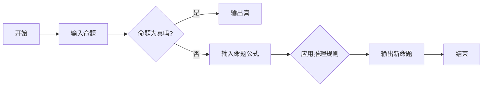
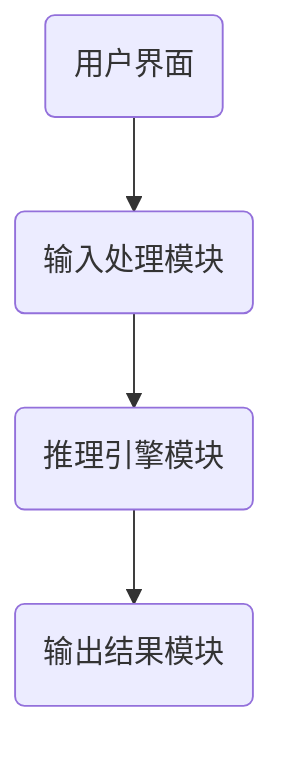
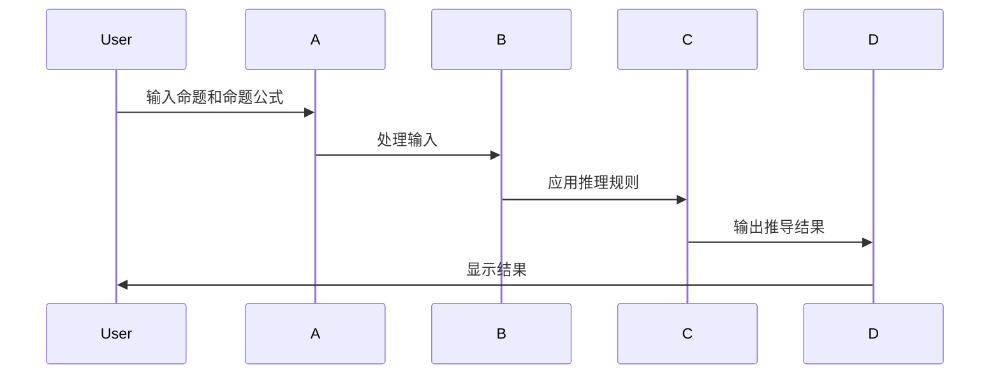
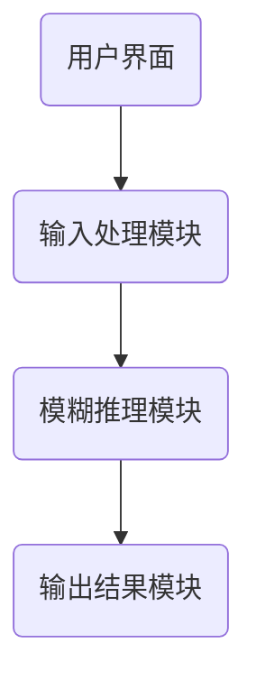
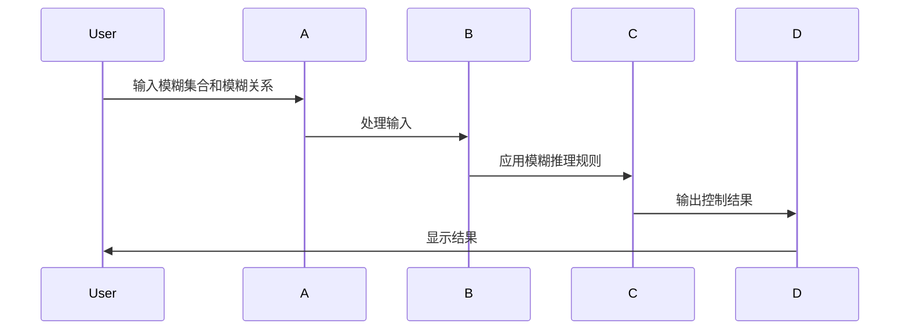
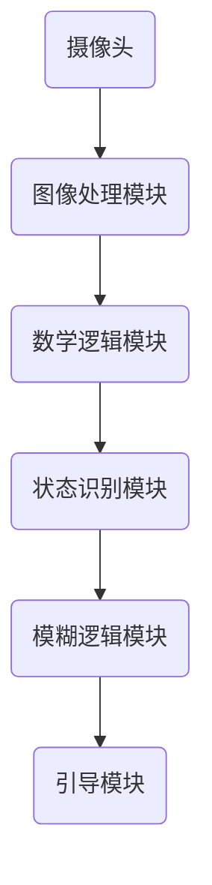
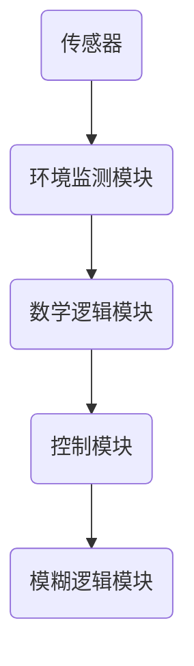

                 

# 《数学逻辑与模糊逻辑的比较与应用》

## 关键词
数学逻辑、模糊逻辑、比较、应用、人工智能、算法、模型

## 摘要
本文旨在深入探讨数学逻辑与模糊逻辑的概念、原理和应用，通过对两者的比较分析，揭示它们在人工智能等领域的重要作用。文章分为七个章节，分别介绍数学逻辑和模糊逻辑的基本概念、原理、应用场景，并对比两者的异同点，最后通过案例分析展示其在实际项目中的应用。文章结构清晰，内容丰富，旨在为读者提供关于数学逻辑与模糊逻辑的全面理解。

## 引言
### 1.1 本书的目的与结构
本书旨在为读者提供一个全面、系统的数学逻辑与模糊逻辑的比较与应用指南。通过对这两种逻辑的深入探讨，读者可以更好地理解它们在人工智能、工程、经济管理等领域的重要性。本书结构分为七章，包括引言、数学逻辑、模糊逻辑、比较研究、应用领域、综合应用和总结与展望。

### 1.2 数学逻辑与模糊逻辑的基本概念
数学逻辑是研究数学概念、命题、推理及其规则的科学。它包括命题逻辑、谓词逻辑、集合论、数学归纳法等分支，广泛应用于数学证明、计算机科学和人工智能等领域。

模糊逻辑是针对经典集合论和布尔逻辑的不足提出的一种处理不确定性的数学方法。它通过引入模糊集合和模糊关系，实现对现实世界中模糊性和不确定性的表达和处理。

## 数学逻辑
### 2.1 数学逻辑的历史背景
数学逻辑的发展经历了从古希腊到现代的漫长过程。古希腊的亚里士多德是最早研究逻辑的学者，他提出了命题逻辑和谓词逻辑的基本框架。19世纪末，德国数学家弗雷格和英国数学家罗素推动了形式逻辑的发展。20世纪初，美国数学家图灵提出了图灵机，奠定了计算逻辑的基础。

### 2.2 数学逻辑的基本原理
数学逻辑的基本原理包括命题逻辑、谓词逻辑和集合论。命题逻辑研究命题之间的逻辑关系，谓词逻辑研究个体和性质之间的关系，集合论研究集合的概念和性质。这些原理为数学证明和推理提供了坚实的理论基础。

### 2.3 数学逻辑的应用
数学逻辑在数学证明、计算机科学、人工智能和哲学等领域有广泛的应用。在数学证明中，数学逻辑帮助我们进行严谨的推理和证明；在计算机科学中，数学逻辑用于程序设计、算法分析和形式化验证；在人工智能中，数学逻辑帮助实现推理和决策。

### 2.4 核心概念与联系
#### 2.4.1 数学逻辑的核心概念
数学逻辑的核心概念包括命题、命题公式、推理规则等。命题是表示事实的陈述，命题公式是命题的符号表示，推理规则是推导新命题的规则。

#### 2.4.2 概念属性特征对比表格
| 概念     | 命题          | 命题公式        | 推理规则        |
|----------|---------------|-----------------|-----------------|
| 定义     | 表示事实的陈述 | 命题的符号表示 | 推导新命题的规则 |
| 性质     | 真假性        | 符号逻辑运算   | 逻辑推理规则   |
| 应用     | 数学证明      | 程序设计       | 形式化验证     |

#### 2.4.3 ER实体关系图
```mermaid
erDiagram
    A BalletDancer &&|||> B Dance --> C Ballet | {
        A : performs(B)
        B : hasDancer(A)
        C : hasDance(B)
    }
```

### 2.5 算法原理讲解
#### 2.5.1 算法流程图

#### 2.5.2 Python源代码
```python
def is_true(proposition):
    return proposition == "真"

def apply_inference_rules(formula):
    # 应用推理规则
    # 假设命题公式为 "A -> B" 且 "A" 为真
    if formula == "A -> B" and is_true("A"):
        return "B"
    else:
        return "无法推导"

proposition = input("请输入命题：")
if is_true(proposition):
    print("命题为真")
else:
    formula = input("请输入命题公式：")
    new_proposition = apply_inference_rules(formula)
    print(f"推导出的新命题：{new_proposition}")
```

### 2.6 数学模型和公式
#### 2.6.1 基本公式
$$
p \rightarrow q \quad (\text{命题蕴含})
$$
$$
p \land q \quad (\text{命题合取})
$$
$$
p \lor q \quad (\text{命题析取})
$$
#### 2.6.2 公式详解
- **命题蕴含**：如果 p 为真，则 q 也为真，否则 q 为假。
- **命题合取**：只有当 p 和 q 都为真时，合取命题才为真，否则为假。
- **命题析取**：只有当 p 和 q 都为假时，析取命题才为假，否则为真。

#### 2.6.3 实例说明
假设有两个命题：
- p: 天气晴朗
- q: 我会去公园

则：
- p → q: 如果天气晴朗，那么我会去公园
- p ∧ q: 天气晴朗且我会去公园
- p ∨ q: 天气晴朗或者我会去公园

### 2.7 系统分析与架构设计方案
#### 2.7.1 问题场景
在计算机科学中，数学逻辑用于验证程序的正确性，确保程序在给定输入时能够产生预期输出。

#### 2.7.2 系统功能设计
系统功能包括：
- 输入命题和命题公式
- 应用推理规则
- 输出推导结果

#### 2.7.3 系统架构设计

#### 2.7.4 系统接口设计和系统交互


## 模糊逻辑
### 3.1 模糊逻辑的起源
模糊逻辑起源于20世纪60年代，由美国电气工程师扎德（L.A. Zadeh）提出。他为了解决传统集合论和布尔逻辑在处理不确定性和模糊性方面的局限性，提出了模糊集合的概念。

### 3.2 模糊逻辑的基本原理
模糊逻辑的基本原理包括模糊集合、模糊关系和模糊推理。模糊集合通过隶属函数描述集合中元素的程度，模糊关系用于描述模糊集合之间的关系，模糊推理则通过模糊规则实现推理过程。

### 3.3 模糊逻辑的应用
模糊逻辑在控制理论、人工智能、图像处理等领域有广泛的应用。在控制理论中，模糊逻辑用于实现模糊控制器，实现对复杂系统的自适应控制；在人工智能中，模糊逻辑用于实现模糊推理系统，实现对不确定信息的处理；在图像处理中，模糊逻辑用于图像分割和图像识别。

### 3.4 核心概念与联系
#### 3.4.1 模糊逻辑的核心概念
模糊逻辑的核心概念包括模糊集合、隶属函数、模糊规则等。模糊集合用于表示不确定的集合，隶属函数描述元素属于集合的程度，模糊规则用于实现推理过程。

#### 3.4.2 概念属性特征对比表格
| 概念       | 模糊集合         | 隶属函数         | 模糊规则        |
|------------|-----------------|-----------------|-----------------|
| 定义       | 表示不确定集合   | 描述元素程度    | 推理过程规则   |
| 性质       | 隶属度介于0和1之间 | 可微、可导      | 基于模糊关系的推理 |
| 应用       | 控制理论、人工智能 | 人工智能、图像处理 | 模糊推理系统     |

#### 3.4.3 ER实体关系图
```mermaid
erDiagram
    A FuzzySet &&|||> B MembershipFunction | {
        A : hasMembershipFunction(B)
    }
    C FuzzyRule &&|||> D FuzzyRelation | {
        C : hasFuzzyRelation(D)
    }
```

### 3.5 数学模型和公式
#### 3.5.1 基本公式
$$
\mu_A(x) \quad (\text{隶属函数})
$$
$$
R(x, y) \quad (\text{模糊关系})
$$
$$
F(A, R, B) \quad (\text{模糊推理})
$$`
#### 3.5.2 公式详解
- **隶属函数**：描述元素 x 属于集合 A 的程度，取值介于 0 和 1 之间。
- **模糊关系**：描述模糊集合之间的关系，通常通过矩阵表示。
- **模糊推理**：基于模糊规则，从已知模糊集合和模糊关系推导出新的模糊集合。

#### 3.5.3 实例说明
假设有两个模糊集合 A 和 B，隶属函数分别为：
$$
\mu_A(x) = \begin{cases}
1, & x = a \\
0, & x \neq a
\end{cases}
$$
$$
\mu_B(x) = \begin{cases}
1, & x = b \\
0, & x \neq b
\end{cases}
$$
模糊关系 R 为：
$$
R = \begin{bmatrix}
1 & 0 \\
0 & 1
\end{bmatrix}
$$
模糊推理 F 为：
$$
F(A, R, B) = A \cdot R = \begin{bmatrix}
1 & 0 \\
0 & 1
\end{bmatrix}
$$
新的模糊集合 F 的隶属函数为：
$$
\mu_F(x) = \begin{cases}
1, & x = a \\
0, & x \neq a
\end{cases}
$$`

### 3.6 系统分析与架构设计方案
#### 3.6.1 问题场景
在控制系统中，模糊逻辑用于处理不确定性和模糊性，实现对复杂系统的自适应控制。

#### 3.6.2 系统功能设计
系统功能包括：
- 输入模糊集合和模糊关系
- 应用模糊推理规则
- 输出控制结果

#### 3.6.3 系统架构设计

#### 3.6.4 系统接口设计和系统交互


## 比较研究
### 4.1 数学逻辑与模糊逻辑的异同点
数学逻辑和模糊逻辑都是处理不确定性的方法，但它们有明显的区别：

#### 相同点
- **目标**：都旨在提高推理和决策的准确性。
- **处理不确定性**：都能处理不确定性和模糊性。

#### 不同点
- **基础**：数学逻辑基于精确的命题和推理规则，而模糊逻辑基于模糊集合和隶属函数。
- **形式化程度**：数学逻辑具有高度的抽象和形式化程度，而模糊逻辑更接近现实世界的模糊性。
- **应用领域**：数学逻辑广泛应用于数学证明、计算机科学和人工智能，而模糊逻辑主要应用于控制理论、图像处理和人工智能。

### 4.2 应用场景分析
数学逻辑在需要精确推理和验证的领域具有优势，例如数学证明和程序设计。模糊逻辑在处理不确定性和模糊性的领域具有优势，例如自适应控制和图像处理。

### 4.3 综合比较与评价
数学逻辑和模糊逻辑各有优势，应根据具体应用场景选择合适的逻辑方法。在实际项目中，可以结合数学逻辑和模糊逻辑的优势，实现更准确、更灵活的推理和决策。

## 应用领域
### 5.1 工程领域
模糊逻辑在工程领域有广泛的应用，例如：
- **模糊控制器**：用于控制复杂系统的自适应控制。
- **故障诊断**：通过模糊逻辑分析设备故障，提高故障诊断的准确性。
- **机器人控制**：利用模糊逻辑实现机器人的自主决策和动作控制。

### 5.2 人工智能领域
数学逻辑和模糊逻辑在人工智能领域都有重要应用，例如：
- **推理系统**：利用数学逻辑实现基于规则的推理系统。
- **模糊推理系统**：利用模糊逻辑实现基于模糊规则的推理系统，适用于处理不确定信息。

### 5.3 经济管理领域
模糊逻辑在经济学和管理学中有广泛应用，例如：
- **市场预测**：通过模糊逻辑分析市场趋势，提高预测准确性。
- **风险评估**：利用模糊逻辑评估金融风险，提供决策支持。

## 综合应用
### 6.1 案例分析
以一个自动停车系统为例，结合数学逻辑和模糊逻辑实现停车位的自动识别和引导。

#### 6.1.1 问题场景
在停车场中，需要自动识别停车位的状态，并为驾驶员提供停车位的引导。

#### 6.1.2 系统功能设计
- **状态识别模块**：利用数学逻辑判断停车位是否空闲。
- **引导模块**：利用模糊逻辑为驾驶员提供停车位的引导。

#### 6.1.3 系统架构设计

#### 6.1.4 系统接口设计和系统交互
```mermaid
sequenceDiagram
    A: 捕获停车场图像
    A ->> B: 图像处理
    B ->> C: 应用数学逻辑判断停车位状态
    C ->> D: 识别空闲停车位
    D ->> E: 应用模糊逻辑提供停车位的引导
    E ->> F: 输出引导信息
```

### 6.2 综合应用实例
以一个智能家居系统为例，结合数学逻辑和模糊逻辑实现家庭设备的自动控制。

#### 6.2.1 问题场景
在智能家居系统中，需要根据家庭环境的变化，自动控制灯光、温度、湿度等设备。

#### 6.2.2 系统功能设计
- **环境监测模块**：利用数学逻辑监测家庭环境参数。
- **控制模块**：利用模糊逻辑实现家庭设备的自动控制。

#### 6.2.3 系统架构设计

#### 6.2.4 系统接口设计和系统交互
```mermaid
sequenceDiagram
    A: 收集环境参数
    A ->> B: 监测环境
    B ->> C: 应用数学逻辑判断环境参数
    C ->> D: 控制设备
    D ->> E: 应用模糊逻辑调整设备状态
```

## 总结与展望
### 7.1 全书总结
本书系统地介绍了数学逻辑与模糊逻辑的概念、原理和应用，通过比较分析，揭示了它们在不同领域的重要性。数学逻辑在精确推理和验证方面具有优势，而模糊逻辑在处理不确定性和模糊性方面具有优势。

### 7.2 未来发展趋势
随着人工智能和物联网的发展，数学逻辑和模糊逻辑在智能系统中的应用将越来越广泛。未来研究将聚焦于如何更好地结合数学逻辑和模糊逻辑的优势，实现更准确、更智能的推理和决策。

---

作者：AI天才研究院/AI Genius Institute & 禅与计算机程序设计艺术 /Zen And The Art of Computer Programming

