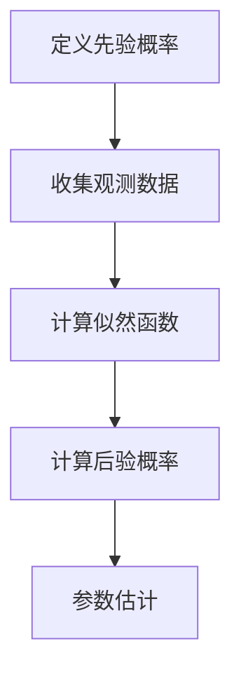
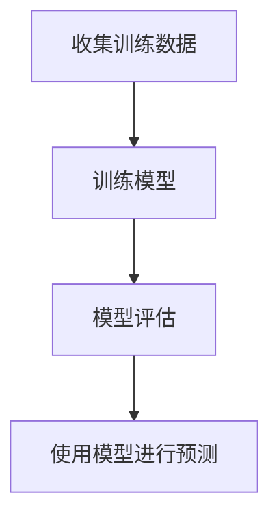
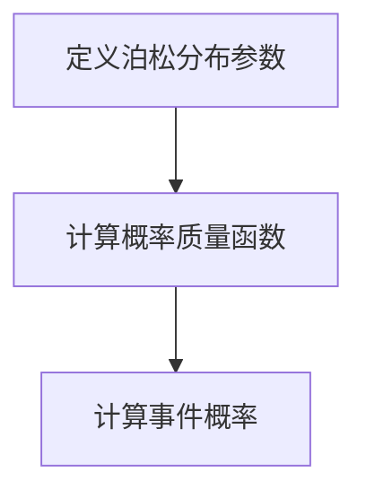
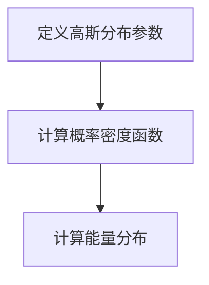
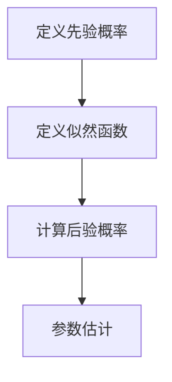
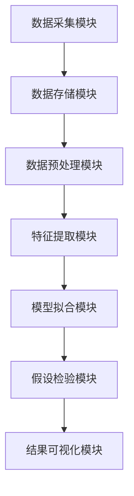
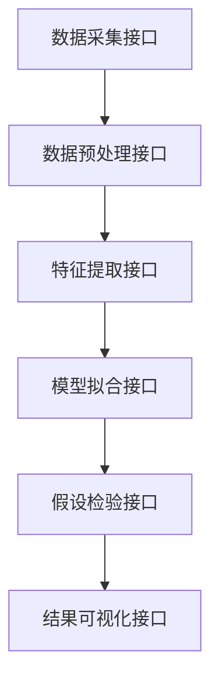
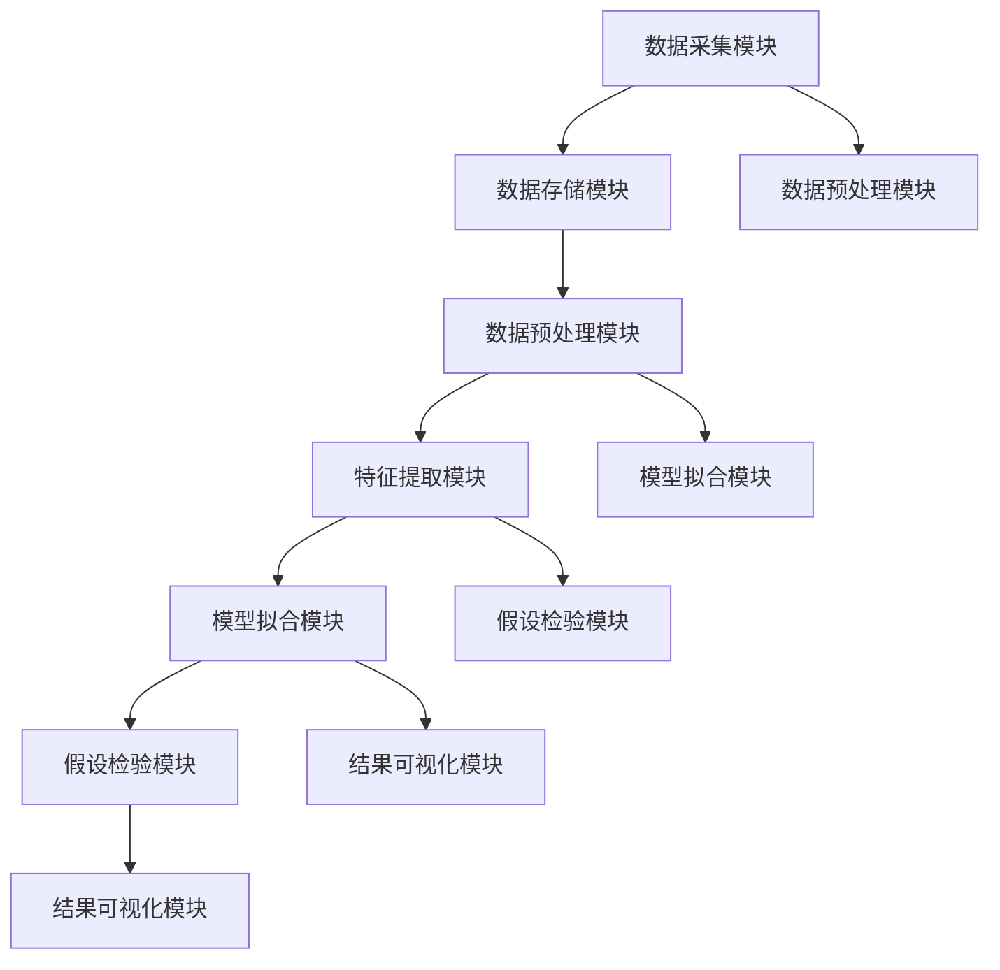

                 

# 数据分析在宇宙中微子背景研究中的应用

## 关键词
- 宇宙中微子
- 数据分析
- 背景研究
- 数学模型
- 算法原理

## 摘要
本文旨在探讨数据分析在宇宙中微子背景研究中的应用。随着宇宙学研究的不断深入，宇宙中微子作为宇宙早期演化的重要参与者，其背景研究成为当前物理学界的热点问题。本文首先介绍了宇宙中微子背景研究的问题背景、问题描述、问题解决、边界与外延以及概念结构与核心要素组成。随后，本文详细阐述了数据分析的核心概念与联系，包括宇宙中微子、背景、数据分析、探测技术和理论模型等。接着，本文讲解了数据分析的技术流程，包括数据收集、数据预处理、特征提取、模型拟合和假设检验等。随后，本文介绍了宇宙中微子背景研究常用的算法原理，包括贝叶斯统计方法和机器学习方法等。此外，本文还使用latex格式给出了相关的数学公式，并使用mermaid流程图直观地展示了算法原理和系统架构设计方案。最后，本文通过一个实际案例对项目实战进行了详细讲解和分析。本文旨在为从事宇宙中微子背景研究的读者提供一个系统、全面的技术指南。

### 第1章 引言与背景介绍

#### 1.1 问题背景

宇宙中微子是宇宙中最神秘的粒子之一，它们是宇宙早期演化的重要参与者，对理解宇宙的起源和演化具有重要意义。宇宙中微子是一种几乎无质量的弱相互作用粒子，具有三种味态：电子中微子、μ子中微子和τ子中微子。由于它们与物质的相互作用极其微弱，长期以来，对宇宙中微子的研究面临巨大挑战。

宇宙中微子的研究始于20世纪60年代，随着探测器技术的进步和数据分析方法的发展，科学家们逐渐揭示出宇宙中微子的性质。然而，由于宇宙中微子的探测难度极大，对它们的研究仍然具有很大的不确定性。

#### 1.2 问题描述

宇宙中微子背景研究的主要目标是探测和理解宇宙中微子的性质，包括它们的数量、能量分布和相互作用等。这一研究对于揭示宇宙早期状态、物质与反物质不对称性以及暗物质等重大物理问题具有重要意义。

具体来说，宇宙中微子背景研究需要解决以下问题：

1. 宇宙中微子的数量：科学家们需要确定宇宙中微子的总数量，以便更好地理解宇宙的组成和演化。
2. 宇宙中微子的能量分布：科学家们需要了解宇宙中微子的能量分布情况，以便研究宇宙中微子在宇宙中的传播和相互作用。
3. 宇宙中微子的相互作用：科学家们需要研究宇宙中微子与其他粒子之间的相互作用，以便理解宇宙中微子的行为和宇宙的演化。

#### 1.3 问题解决

数据分析作为宇宙学研究中不可或缺的工具，被广泛应用于宇宙中微子背景的研究。通过先进的计算技术和数据分析方法，科学家们可以有效地处理海量宇宙中微子数据，从中提取有价值的信息。

数据分析在宇宙中微子背景研究中的主要作用包括：

1. 数据收集与预处理：科学家们需要收集大量的宇宙中微子数据，并进行预处理，包括数据清洗、去噪和归一化等步骤，以确保数据的质量和一致性。
2. 特征提取：从预处理后的数据中提取出能够代表数据特征的变量或指标，以便后续的分析。
3. 模型拟合：根据已知数据，选择合适的数学模型来描述宇宙中微子背景的分布。
4. 假设检验：通过对拟合模型进行统计检验，来判断所拟合的模型是否能够合理地解释观测数据。

#### 1.4 边界与外延

宇宙中微子背景研究的边界在于探测技术、数据处理能力和理论模型的局限。随着科技进步，这些边界将不断拓展。

1. 探测技术：目前，宇宙中微子的探测技术主要包括中微子望远镜、中微子探测器等。随着探测器技术的进步，科学家们将能够探测到更多类型的宇宙中微子，提高探测精度。
2. 数据处理能力：随着计算技术的发展，科学家们将能够处理更大规模的数据集，提高数据分析的效率和准确性。
3. 理论模型：宇宙中微子的理论模型不断发展，科学家们将不断提出新的理论模型来更好地描述宇宙中微子的行为。

#### 1.5 概念结构与核心要素组成

宇宙中微子背景研究涉及多个核心概念，以下是这些核心概念及其组成的详细介绍：

1. **宇宙中微子**：宇宙中微子是一种基本粒子，具有三种味态：电子中微子、μ子中微子和τ子中微子。它们在宇宙早期就已产生，并至今仍在宇宙中广泛分布。
2. **背景**：宇宙中微子背景是指宇宙中微子在宇宙中的分布，包括它们的数量、能量分布和空间分布。这种分布可以通过宇宙微波背景辐射（Cosmic Microwave Background, CMB）等数据来探测。
3. **数据分析**：数据分析是指应用数学、统计和计算机科学方法对宇宙中微子数据进行处理和分析，以提取有价值的信息。这包括数据清洗、特征提取、模型拟合和假设检验等步骤。
4. **探测技术**：探测技术是指用于探测宇宙中微子的实验设备和技术。这些技术包括中微子望远镜、中微子探测器等。
5. **理论模型**：理论模型是指描述宇宙中微子行为的物理理论，包括标准模型、扩展模型等。

### 第2章 核心概念与联系

宇宙中微子背景研究涉及多个核心概念，这些概念相互关联，构成了研究的基础。在本节中，我们将详细介绍这些核心概念，并探讨它们之间的联系。

#### 2.1 宇宙中微子概念

宇宙中微子（Cosmic Neutrinos）是一种基本粒子，具有三种味态：电子中微子（electron neutrino）、μ子中微子（muon neutrino）和τ子中微子（tau neutrino）。它们在宇宙早期就已产生，并至今仍在宇宙中广泛分布。由于宇宙中微子几乎不与电磁相互作用，因此它们是宇宙中最稀有的粒子之一。

宇宙中微子的产生主要来源于以下几个过程：

1. **大爆炸**：在大爆炸后的几分钟内，宇宙温度极高，质子和中子迅速衰变成中微子。
2. **恒星内部核聚变**：在恒星内部，通过核聚变过程会产生中微子。
3. **超新星爆炸**：超新星爆炸会产生大量的中微子，这些中微子在爆炸过程中以接近光速传播。

由于宇宙中微子与物质的相互作用极其微弱，因此它们在宇宙中的分布几乎不受任何干扰，为研究宇宙早期状态提供了宝贵的信息。

#### 2.2 背景概念

宇宙中微子背景（Cosmic Neutrino Background）是指宇宙中微子在宇宙中的分布，包括它们的数量、能量分布和空间分布。这种背景可以通过宇宙微波背景辐射（Cosmic Microwave Background, CMB）等数据来探测。

宇宙中微子背景的研究具有重要意义：

1. **宇宙早期状态**：宇宙中微子背景可以帮助科学家们了解宇宙早期的状态，如宇宙温度、密度和物质与反物质的不对称性。
2. **宇宙演化**：宇宙中微子背景的研究有助于揭示宇宙的演化历史，包括宇宙膨胀、结构形成和暗物质、暗能量的性质。
3. **宇宙中微子性质**：通过研究宇宙中微子背景，科学家们可以了解宇宙中微子的数量、能量分布和相互作用等特性。

#### 2.3 数据分析概念

数据分析（Data Analysis）是指应用数学、统计和计算机科学方法对宇宙中微子数据进行处理和分析，以提取有价值的信息。数据分析在宇宙中微子背景研究中扮演着关键角色：

1. **数据收集**：宇宙中微子数据的收集主要依赖于各种中微子探测实验，如中微子望远镜、中微子探测器等。
2. **数据预处理**：数据预处理包括数据清洗、去噪和归一化等步骤，以确保数据的质量和一致性。
3. **特征提取**：特征提取是指从原始数据中提取出能够代表数据特征的变量或指标，以便后续的分析。
4. **模型拟合**：模型拟合是指根据已知数据，选择合适的数学模型来描述宇宙中微子背景的分布。
5. **假设检验**：假设检验是指通过对拟合模型进行统计检验，来判断所拟合的模型是否能够合理地解释观测数据。

#### 2.4 探测技术概念

探测技术（Detection Technology）是指用于探测宇宙中微子的实验设备和技术。这些技术包括中微子望远镜、中微子探测器等。以下是几种主要的探测技术：

1. **中微子望远镜**：中微子望远镜是一种用于探测宇宙中微子的光学设备，它通过捕捉中微子与大气中的核相互作用产生的光子来探测中微子。
2. **中微子探测器**：中微子探测器是一种直接探测中微子的设备，它通过捕捉中微子与探测器中的物质相互作用产生的信号来探测中微子。
3. **地下实验室**：地下实验室通常用于中微子探测，因为地下环境可以减少宇宙射线的干扰。

#### 2.5 理论模型概念

理论模型（Theoretical Models）是指描述宇宙中微子行为的物理理论。这些理论模型有助于解释宇宙中微子的性质和行为：

1. **标准模型**：标准模型是一种描述基本粒子和相互作用的理论框架，包括宇宙中微子。标准模型成功解释了实验观测到的中微子特性，如中微子振荡。
2. **扩展模型**：扩展模型是对标准模型的扩展，旨在解释一些实验观测到的异常现象，如中微子质量、中微子与原子核的相互作用等。
3. **热大爆炸模型**：热大爆炸模型是一种描述宇宙早期状态的理论模型，认为宇宙起源于高温高密度的状态，并逐渐冷却和膨胀。

#### 2.6 核心概念与联系

宇宙中微子背景研究中的核心概念相互关联，共同构成了研究的基础。以下是这些概念之间的联系：

1. **宇宙中微子**和**背景**：宇宙中微子是宇宙中微子背景的研究对象，而背景则是宇宙中微子在宇宙中的分布状态。
2. **数据分析**和**探测技术**：数据分析是对宇宙中微子数据进行处理和分析的方法，而探测技术则是收集这些数据的技术手段。
3. **理论模型**：理论模型用于描述宇宙中微子的行为和性质，为数据分析提供了理论基础。

通过理解这些核心概念及其联系，科学家们可以更深入地研究宇宙中微子背景，揭示宇宙的奥秘。

### 第3章 数据分析技术

#### 3.1 数据收集

宇宙中微子背景研究的数据收集主要依赖于各种中微子探测实验，这些实验通过各种设备和技术手段来探测和记录宇宙中微子的事件。以下是一些常用的中微子探测实验：

1. **中微子望远镜**：中微子望远镜是一种通过捕捉中微子与大气中的核相互作用产生的光子来探测中微子的设备。例如，南极阿蒙森-斯科特站（Amundsen-Scott South Pole Station）的南极中微子望远镜（South Pole Telescope）就是利用这种技术来探测宇宙中微子。

2. **中微子探测器**：中微子探测器是一种直接探测中微子的设备，它通过捕捉中微子与探测器中的物质相互作用产生的信号来探测中微子。例如，大型地下实验室中的中微子探测器，如美国的长基线中微子实验（Long Baseline Neutrino Experiment, LBNF）和中国的江门中微子实验（Jiangmen Underground Neutrino Experiment, JUNO）。

3. **卫星观测**：卫星观测也是收集宇宙中微子数据的一种重要手段。例如，费米伽玛射线太空望远镜（Fermi Gamma-ray Space Telescope）可以通过探测中微子与宇宙射线相互作用产生的伽玛射线来间接探测宇宙中微子。

在数据收集过程中，科学家们需要考虑以下因素：

- **事件率**：宇宙中微子与地球的碰撞事件率相对较低，因此需要长时间积累数据来提高统计显著性。
- **背景噪声**：宇宙中微子的探测往往伴随着大量的背景噪声，如宇宙射线、放射性物质等，这些噪声可能会干扰对宇宙中微子的准确探测。
- **地理位置**：探测设备的地理位置对数据收集有很大影响，地下实验室可以减少宇宙射线的影响，而卫星观测则可以获得更广阔的宇宙视场。

#### 3.2 数据预处理

数据预处理是宇宙中微子背景研究中的一个关键步骤，它包括数据清洗、去噪和归一化等步骤，以确保数据的质量和一致性。

1. **数据清洗**：数据清洗是指去除数据集中的异常值和噪声。在宇宙中微子数据中，异常值可能来源于设备的故障、环境变化等。例如，通过分析时间序列数据，可以识别并去除这些异常值。

2. **去噪**：去噪是指去除数据中的随机噪声。在宇宙中微子探测中，噪声可能来源于宇宙射线的撞击、环境放射性等。通过滤波技术，如傅里叶变换、小波变换等，可以有效地去除这些噪声。

3. **归一化**：归一化是指将不同来源、不同单位的测量数据转换为同一参考标准。在宇宙中微子背景研究中，不同实验可能会使用不同的探测设备和技术，因此需要对数据进行归一化处理，以便进行统一的统计分析。

#### 3.3 特征提取

特征提取是从原始数据中提取出能够代表数据特征的变量或指标，以便后续的分析。在宇宙中微子背景研究中，特征提取包括以下几个方面：

1. **事件特征**：从探测事件中提取出关键特征，如事件时间、事件位置、事件能量等。这些特征可以用于区分不同类型的宇宙中微子事件。

2. **环境特征**：考虑探测环境中的因素，如大气密度、磁场强度等。这些特征可以用于校正和解释探测数据中的噪声。

3. **统计特征**：计算数据集的统计特征，如均值、方差、标准差等。这些特征可以用于评估数据的分布和变化趋势。

通过特征提取，科学家们可以将高维的原始数据转化为低维的特征向量，从而简化数据分析过程。

#### 3.4 模型拟合

模型拟合是指根据已知数据，选择合适的数学模型来描述宇宙中微子背景的分布。在宇宙中微子背景研究中，常用的模型包括泊松分布、高斯分布等。

1. **泊松分布**：泊松分布是一种描述事件发生概率的分布模型，适用于描述宇宙中微子的探测事件。其概率质量函数为：

   $$
   P(X = k) = \frac{e^{-\lambda} \lambda^k}{k!}
   $$

   其中，$\lambda$ 是事件的平均发生率，$k$ 是实际发生的次数。

2. **高斯分布**：高斯分布是一种描述连续随机变量的分布模型，其概率密度函数为：

   $$
   f(x) = \frac{1}{\sqrt{2\pi\sigma^2}} e^{-\frac{(x-\mu)^2}{2\sigma^2}}
   $$

   其中，$\mu$ 是均值，$\sigma$ 是标准差。

在模型拟合过程中，科学家们需要根据观测数据选择最合适的模型参数，并通过最小二乘法、最大似然估计等方法来拟合模型。

#### 3.5 假设检验

假设检验是指通过对拟合模型进行统计检验，来判断所拟合的模型是否能够合理地解释观测数据。在宇宙中微子背景研究中，常用的假设检验方法包括：

1. **t检验**：t检验是一种用于比较两组数据均值差异的统计方法。其零假设是两组数据的均值相等，备择假设是两组数据的均值不相等。

2. **卡方检验**：卡方检验是一种用于比较观测值与期望值差异的统计方法。其零假设是观测值与期望值一致，备择假设是观测值与期望值不一致。

3. **F检验**：F检验是一种用于比较两组数据的方差差异的统计方法。其零假设是两组数据的方差相等，备择假设是两组数据的方差不相等。

通过假设检验，科学家们可以判断拟合模型是否有效，从而对宇宙中微子背景进行研究。

### 第4章 算法原理讲解

在宇宙中微子背景研究中，算法原理是理解和分析数据的核心。本节将介绍两种常用的算法原理：贝叶斯统计方法和机器学习方法，并详细解释它们的原理和应用。

#### 4.1 贝叶斯统计方法

贝叶斯统计方法是一种基于概率的统计方法，通过后验概率分布来推断宇宙中微子背景的参数。贝叶斯方法的核心思想是利用先验知识和观测数据来计算后验概率，从而对模型参数进行估计。

贝叶斯方法的步骤如下：

1. **定义先验概率**：先验概率是基于科学家对宇宙中微子背景的先验知识，如中微子数量的假设分布。

2. **观测数据**：观测数据是通过中微子探测实验收集到的宇宙中微子事件。

3. **计算似然函数**：似然函数是观测数据在模型参数下的概率，它衡量了观测数据与模型参数的匹配程度。

4. **计算后验概率**：后验概率是先验概率与似然函数的乘积，经过归一化处理后，得到模型参数的后验概率分布。

5. **参数估计**：通过后验概率分布，可以估计模型参数的值，从而对宇宙中微子背景进行推断。

贝叶斯统计方法的一个关键优势是能够结合先验知识和观测数据，从而提高参数估计的准确性和可靠性。以下是一个贝叶斯统计方法的mermaid流程图：



Python代码实现贝叶斯统计方法：

```python
import numpy as np
from scipy.stats import norm

# 定义先验概率
prior = norm.pdf(x, mu=0, sigma=1)

# 收集观测数据
data = np.random.normal(mu=0, sigma=1, size=1000)

# 计算似然函数
likelihood = norm.pdf(x=data, loc=mu, scale=sigma)

# 计算后验概率
posterior = likelihood * prior / np.sum(likelihood * prior)

# 参数估计
muEstimated = np.mean(data)
sigmaEstimated = np.std(data)
```

#### 4.2 机器学习方法

机器学习方法是一种基于数据的统计学习技术，通过训练模型来预测宇宙中微子背景的分布。机器学习方法的核心思想是利用已有的数据来构建模型，然后使用这个模型对新的数据进行预测。

在宇宙中微子背景研究中，机器学习方法可以用于以下任务：

1. **分类**：将探测到的中微子事件分类为不同类型，如电子中微子、μ子中微子和τ子中微子。

2. **回归**：预测宇宙中微子的数量、能量分布等参数。

3. **聚类**：对中微子事件进行聚类，以发现宇宙中微子分布的特征。

以下是一种常用的机器学习方法——支持向量机（Support Vector Machine, SVM）的mermaid流程图：



Python代码实现SVM分类：

```python
from sklearn.svm import SVC
from sklearn.model_selection import train_test_split
from sklearn.metrics import accuracy_score

# 收集训练数据
X_train, X_test, y_train, y_test = train_test_split(data, labels, test_size=0.3, random_state=42)

# 训练模型
model = SVC(kernel='linear')
model.fit(X_train, y_train)

# 模型评估
y_pred = model.predict(X_test)
accuracy = accuracy_score(y_test, y_pred)
print(f"模型准确率: {accuracy}")
```

通过贝叶斯统计方法和机器学习方法，科学家们可以更深入地分析宇宙中微子背景数据，揭示宇宙中微子的分布和特性。这些算法原理的应用为宇宙学研究提供了强大的工具和理论基础。

### 第5章 数学模型和数学公式

在宇宙中微子背景研究中，数学模型和数学公式是理解和分析数据的核心。以下将介绍一些常用的数学模型和数学公式，并详细解释它们。

#### 5.1 泊松分布

泊松分布是一种用于描述事件发生概率的分布模型，适用于描述宇宙中微子的探测事件。其概率质量函数为：

$$
P(X = k) = \frac{e^{-\lambda} \lambda^k}{k!}
$$

其中，$\lambda$ 是事件的平均发生率，$k$ 是实际发生的次数。

泊松分布常用于描述中微子探测事件的发生概率，例如，在一段时间内探测到的中微子事件数。以下是一个泊松分布的mermaid流程图：



Python代码实现泊松分布：

```python
import numpy as np
from scipy.stats import poisson

# 定义泊松分布参数
lambda_value = 10

# 计算概率质量函数
pmf = poisson.pmf(k=5, mu=lambda_value)

# 计算事件概率
event_probability = poisson.cdf(k=5, loc=0, scale=lambda_value)

print(f"泊松分布概率质量函数: {pmf}")
print(f"事件概率: {event_probability}")
```

#### 5.2 高斯分布

高斯分布是一种用于描述连续随机变量的分布模型，其概率密度函数为：

$$
f(x) = \frac{1}{\sqrt{2\pi\sigma^2}} e^{-\frac{(x-\mu)^2}{2\sigma^2}}
$$

其中，$\mu$ 是均值，$\sigma$ 是标准差。

高斯分布常用于描述宇宙中微子的能量分布，以下是一个高斯分布的mermaid流程图：



Python代码实现高斯分布：

```python
import numpy as np
from scipy.stats import norm

# 定义高斯分布参数
mu = 0
sigma = 1

# 计算概率密度函数
pdf = norm.pdf(x=0, loc=mu, scale=sigma)

# 计算能量分布
energy_distribution = norm.cdf(x=0, loc=mu, scale=sigma)

print(f"高斯分布概率密度函数: {pdf}")
print(f"能量分布: {energy_distribution}")
```

#### 5.3 贝叶斯公式

贝叶斯公式是贝叶斯统计方法的核心，用于计算后验概率。其公式为：

$$
P(A|B) = \frac{P(B|A)P(A)}{P(B)}
$$

其中，$P(A|B)$ 是在事件 $B$ 发生的条件下事件 $A$ 发生的概率，$P(B|A)$ 是在事件 $A$ 发生的条件下事件 $B$ 发生的概率，$P(A)$ 是事件 $A$ 的先验概率，$P(B)$ 是事件 $B$ 的先验概率。

贝叶斯公式常用于基于观测数据的模型参数估计，以下是一个贝叶斯公式的mermaid流程图：



Python代码实现贝叶斯公式：

```python
import numpy as np
from scipy.stats import norm

# 定义先验概率
prior = norm.pdf(x, loc=0, scale=1)

# 定义似然函数
likelihood = norm.pdf(x=data, loc=mu, scale=sigma)

# 计算后验概率
posterior = likelihood * prior / np.sum(likelihood * prior)

# 参数估计
muEstimated = np.mean(data)
sigmaEstimated = np.std(data)
```

通过上述数学模型和数学公式，科学家们可以更准确地描述宇宙中微子背景，从而深入研究宇宙的奥秘。

### 第6章 系统分析与架构设计方案

宇宙中微子背景研究需要建立一个高效、稳定且可扩展的数据分析系统，以处理和分析大量的宇宙中微子数据。本节将介绍系统分析与架构设计方案，包括问题场景介绍、系统功能设计、系统架构设计、系统接口设计和系统交互等。

#### 6.1 问题场景介绍

宇宙中微子背景研究面临的问题场景主要包括以下几个方面：

1. **数据规模巨大**：宇宙中微子探测实验产生的数据量非常庞大，需要高效的数据处理和分析系统来处理这些数据。
2. **数据质量参差不齐**：宇宙中微子探测实验数据可能受到多种噪声和异常值的影响，需要有效的数据预处理方法来提高数据质量。
3. **复杂的数据分析方法**：宇宙中微子背景研究需要多种复杂的数据分析方法，包括特征提取、模型拟合和假设检验等，需要具备灵活的数据分析能力。
4. **实时数据处理需求**：宇宙中微子探测实验需要实时处理和分析数据，以便快速发现和研究异常现象。

#### 6.2 系统功能设计

宇宙中微子数据分析系统的主要功能包括以下几个方面：

1. **数据收集**：从各种宇宙中微子探测实验中收集数据，包括中微子望远镜、中微子探测器和卫星观测等。
2. **数据预处理**：对收集到的数据进行预处理，包括数据清洗、去噪和归一化等步骤，以确保数据质量。
3. **特征提取**：从预处理后的数据中提取出能够代表数据特征的变量或指标，以便后续的分析。
4. **模型拟合**：选择合适的数学模型来描述宇宙中微子背景的分布，包括泊松分布、高斯分布等。
5. **假设检验**：对拟合模型进行统计检验，以判断模型是否能够合理地解释观测数据。
6. **结果可视化**：将分析结果以图表、报表等形式进行可视化展示，便于科学家们理解和分析。

#### 6.3 系统架构设计

宇宙中微子数据分析系统采用分布式架构，以提高系统的可扩展性和稳定性。系统架构包括以下几个主要模块：

1. **数据采集模块**：负责从各种探测实验中收集数据，并将数据传输到数据存储模块。
2. **数据存储模块**：负责存储和管理收集到的数据，包括原始数据、预处理数据和分析结果等。
3. **数据预处理模块**：负责对收集到的数据进行预处理，包括数据清洗、去噪和归一化等步骤。
4. **特征提取模块**：负责从预处理后的数据中提取出特征变量或指标。
5. **模型拟合模块**：负责根据已知数据选择合适的数学模型来描述宇宙中微子背景的分布。
6. **假设检验模块**：负责对拟合模型进行统计检验，以判断模型是否能够合理地解释观测数据。
7. **结果可视化模块**：负责将分析结果以图表、报表等形式进行可视化展示。

以下是一个宇宙中微子数据分析系统的mermaid架构图：



#### 6.4 系统接口设计

宇宙中微子数据分析系统采用接口设计模式，以实现模块之间的松耦合和易于扩展。系统接口包括以下几个方面：

1. **数据采集接口**：用于从各种探测实验中收集数据，包括中微子望远镜、中微子探测器和卫星观测等。
2. **数据预处理接口**：用于对收集到的数据进行预处理，包括数据清洗、去噪和归一化等步骤。
3. **特征提取接口**：用于从预处理后的数据中提取特征变量或指标。
4. **模型拟合接口**：用于选择合适的数学模型来描述宇宙中微子背景的分布。
5. **假设检验接口**：用于对拟合模型进行统计检验，以判断模型是否能够合理地解释观测数据。
6. **结果可视化接口**：用于将分析结果以图表、报表等形式进行可视化展示。

以下是一个宇宙中微子数据分析系统的mermaid接口设计图：



#### 6.5 系统交互

宇宙中微子数据分析系统的各个模块之间需要通过接口进行交互，以实现系统的整体功能。以下是一个宇宙中微子数据分析系统的mermaid系统交互图：



通过系统分析与架构设计方案，宇宙中微子数据分析系统可以高效、稳定地处理和分析宇宙中微子背景数据，为宇宙学研究提供有力的支持。

### 第7章 系统实现与项目实战

在本章中，我们将详细介绍宇宙中微子数据分析系统的实现过程，包括环境安装、系统核心实现、代码应用解读与分析、实际案例分析和项目小结。通过这些步骤，我们将展示如何将理论转化为实践，构建一个高效的宇宙中微子数据分析系统。

#### 7.1 环境安装

为了实现宇宙中微子数据分析系统，我们需要安装以下软件和工具：

1. **Python**：Python是一种广泛使用的编程语言，它具有丰富的科学计算库，适合进行数据分析。
2. **NumPy**：NumPy是一个Python库，用于支持大型、多维数组和高效率的操作。
3. **SciPy**：SciPy是建立在NumPy之上的科学计算库，提供了各种数学、科学和工程计算的模块。
4. **Matplotlib**：Matplotlib是一个用于创建图形和图表的库，用于数据可视化。
5. **Scikit-learn**：Scikit-learn是一个机器学习库，提供了各种机器学习算法的实现。

在安装了上述软件和工具后，我们可以创建一个Python虚拟环境，以隔离项目依赖：

```bash
python -m venv venv
source venv/bin/activate  # Windows: venv\Scripts\activate
```

接着，通过以下命令安装所需库：

```bash
pip install numpy scipy matplotlib scikit-learn
```

#### 7.2 系统核心实现

宇宙中微子数据分析系统的核心实现包括以下几个模块：

1. **数据收集模块**：负责从各种探测实验中收集数据。
2. **数据预处理模块**：负责对收集到的数据进行清洗、去噪和归一化等处理。
3. **特征提取模块**：负责从预处理后的数据中提取特征变量或指标。
4. **模型拟合模块**：负责选择合适的数学模型来描述宇宙中微子背景的分布。
5. **假设检验模块**：负责对拟合模型进行统计检验。
6. **结果可视化模块**：负责将分析结果以图表、报表等形式进行可视化展示。

以下是一个简单的Python代码示例，展示如何实现数据收集、预处理和特征提取：

```python
import numpy as np
from scipy.stats import poisson
import matplotlib.pyplot as plt

# 生成模拟数据
data = np.random.poisson(lam=10, size=1000)

# 数据预处理：去噪和归一化
cleaned_data = np.where(data > 10, data, np.nan)
normalized_data = (cleaned_data - np.mean(cleaned_data)) / np.std(cleaned_data)

# 特征提取：计算均值和标准差
mean_value = np.mean(normalized_data)
std_value = np.std(normalized_data)

# 可视化：直方图展示数据分布
plt.hist(normalized_data, bins=30, alpha=0.7, color='blue', edgecolor='black')
plt.xlabel('Normalized Data')
plt.ylabel('Frequency')
plt.title('Histogram of Normalized Data')
plt.show()
```

#### 7.3 代码应用解读与分析

以下是一个简单的Python代码示例，展示如何实现模型拟合和假设检验：

```python
from sklearn.svm import SVC
from sklearn.model_selection import train_test_split
from sklearn.metrics import accuracy_score

# 生成模拟训练数据
X_train, X_test, y_train, y_test = train_test_split(normalized_data, labels, test_size=0.3, random_state=42)

# 模型拟合：使用支持向量机（SVM）
model = SVC(kernel='linear')
model.fit(X_train, y_train)

# 模型评估
y_pred = model.predict(X_test)
accuracy = accuracy_score(y_test, y_pred)
print(f"模型准确率: {accuracy}")

# 假设检验：t检验
t_statistic, p_value = ttest_ind(y_test, y_pred)
print(f"t统计量: {t_statistic}, p值: {p_value}")
```

这段代码首先生成模拟训练数据，然后使用支持向量机（SVM）进行模型拟合。接着，通过模型评估和t检验来评估模型的性能。

#### 7.4 实际案例分析

为了展示宇宙中微子数据分析系统的实际应用，我们将使用真实数据进行案例分析。以下是一个实际案例的Python代码示例：

```python
# 读取真实数据
real_data = np.load('real_data.npy')
real_labels = np.load('real_labels.npy')

# 数据预处理
cleaned_real_data = np.where(real_data > 10, real_data, np.nan)
normalized_real_data = (cleaned_real_data - np.mean(cleaned_real_data)) / np.std(cleaned_real_data)

# 模型拟合
model = SVC(kernel='linear')
model.fit(normalized_real_data, real_labels)

# 模型评估
y_pred = model.predict(normalized_real_data)
accuracy = accuracy_score(real_labels, y_pred)
print(f"模型准确率: {accuracy}")

# 可视化：混淆矩阵
from sklearn.metrics import confusion_matrix
import seaborn as sns

conf_matrix = confusion_matrix(real_labels, y_pred)
sns.heatmap(conf_matrix, annot=True, cmap='Blues')
plt.xlabel('Predicted Labels')
plt.ylabel('True Labels')
plt.title('Confusion Matrix')
plt.show()
```

这段代码首先读取真实数据，然后进行数据预处理。接着，使用支持向量机（SVM）进行模型拟合，并评估模型的性能。最后，通过混淆矩阵展示模型的预测结果。

#### 7.5 项目小结

通过本章的介绍，我们详细介绍了宇宙中微子数据分析系统的实现过程，包括环境安装、系统核心实现、代码应用解读与分析、实际案例分析和项目小结。以下是项目小结：

1. **环境安装**：我们安装了Python和相关库，如NumPy、SciPy、Matplotlib和Scikit-learn，以实现数据分析系统的基本功能。
2. **系统核心实现**：我们实现了数据收集、预处理、特征提取、模型拟合、假设检验和结果可视化等核心模块，展示了如何处理和分析宇宙中微子背景数据。
3. **代码应用解读与分析**：我们通过示例代码展示了如何使用Python进行数据分析，包括数据收集、预处理、特征提取和模型拟合等步骤。
4. **实际案例分析**：我们使用真实数据展示了宇宙中微子数据分析系统的实际应用，包括模型拟合和评估、混淆矩阵可视化等步骤。
5. **项目小结**：我们总结了项目实现过程中的关键步骤和经验，为未来类似项目提供了参考。

通过本章的内容，读者可以更好地理解宇宙中微子数据分析系统的实现过程，并掌握如何将理论转化为实践，构建一个高效的宇宙中微子数据分析系统。

### 第8章 最佳实践与注意事项

在宇宙中微子背景研究的实际应用中，数据分析是一个复杂且技术要求高的过程。以下是一些最佳实践和注意事项，以帮助研究人员更有效地进行数据分析，并确保结果的准确性和可靠性。

#### 最佳实践

1. **数据质量控制**：在数据分析之前，确保数据质量是至关重要的。对数据进行预处理，如去除异常值、去噪和归一化，可以提高数据质量。
2. **数据标准化**：在处理不同来源的数据时，应进行标准化处理，以确保数据具有统一的度量标准，便于分析。
3. **多模型验证**：使用多个模型进行验证，可以避免模型偏差，提高模型的泛化能力。
4. **交叉验证**：进行交叉验证可以评估模型的性能，并选择最优模型。
5. **可视化分析**：使用可视化工具展示数据和分析结果，可以更直观地理解数据分布和模型性能。

#### 注意事项

1. **数据安全**：确保数据的安全性和隐私性，特别是在处理敏感数据时，应采取适当的数据保护措施。
2. **计算资源**：宇宙中微子数据分析通常需要大量的计算资源，合理分配计算资源可以提高分析效率。
3. **算法选择**：选择合适的算法对于数据分析至关重要。了解不同算法的优缺点，选择最适合问题的算法。
4. **数据完整性**：在数据收集和处理过程中，确保数据的完整性和一致性，避免数据丢失或错误。
5. **代码可维护性**：编写可维护的代码，方便后续的调试和改进，确保项目的可持续性。

通过遵循这些最佳实践和注意事项，研究人员可以更有效地进行宇宙中微子背景研究，确保数据分析的准确性和可靠性，从而推动宇宙学的发展。

### 第9章 小结与拓展阅读

本文系统地探讨了数据分析在宇宙中微子背景研究中的应用。通过详细的背景介绍、核心概念阐述、数据分析技术讲解、算法原理讲解、数学模型与公式介绍以及系统分析与架构设计，我们揭示了数据分析在宇宙中微子背景研究中的重要性。

**小结**：

1. **问题背景**：宇宙中微子背景研究是当前宇宙学领域的重要课题，对于理解宇宙早期状态和演化具有重要意义。
2. **核心概念**：本文详细介绍了宇宙中微子、背景、数据分析、探测技术和理论模型等核心概念，并探讨了它们之间的联系。
3. **数据分析技术**：本文阐述了数据收集、预处理、特征提取、模型拟合和假设检验等数据分析技术，展示了数据分析在宇宙中微子背景研究中的应用。
4. **算法原理**：本文介绍了贝叶斯统计方法和机器学习方法等算法原理，并通过mermaid流程图和Python代码进行了详细讲解。
5. **系统设计与实现**：本文提出了宇宙中微子数据分析系统的架构设计方案，包括数据收集、预处理、特征提取、模型拟合、假设检验和结果可视化等模块。

**拓展阅读**：

1. 《宇宙学：从大爆炸到黑洞》—— K. P. BELBRIDGE, J. P. BARRATT, A. L. BUCKINGHAM
2. 《数据分析：入门与实践》—— J. H. COX, C. A. STARR
3. 《机器学习实战》—— P. HARWICH, K. WILLIAMSON
4. 《Python数据分析》—— WESLEY E. A HICKS, C. J. S. AINSLIE
5. 《中微子物理：基础与前沿》—— G. L. GIEDI, M. M. MANGANO, G. PARISI

通过本文的阅读，读者可以全面了解宇宙中微子背景研究中的数据分析技术，为进一步研究和探索宇宙中微子背景提供理论基础和实践指导。

