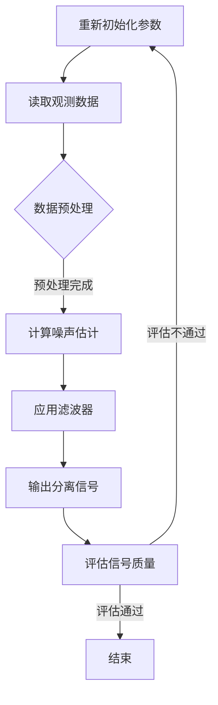

                 

### 摘要

本文探讨了数据分析在宇宙中性氢21厘米线研究中的应用。宇宙中性氢21厘米线是研究宇宙大尺度结构、星系形成与演化、宇宙膨胀速率等天文问题的重要工具。随着天文观测技术的进步，中性氢21厘米线观测数据的海量化和复杂性不断增加，对数据分析和处理提出了新的挑战。本文首先介绍了宇宙中性氢21厘米线的核心概念和观测背景，随后详细分析了数据采集和处理中遇到的关键问题，包括信号噪声分离、数据清洗和预处理、特征提取等。本文还讨论了常用的数据分析方法，如频谱分析、机器学习和深度学习技术，并结合实际案例展示了这些方法在解决天文问题中的应用。最后，本文总结了数据分析在宇宙中性氢21厘米线研究中的重要性和发展趋势，指出了未来的研究方向和挑战。通过本文的探讨，希望读者能对数据分析在宇宙研究中的重要作用有更深刻的理解。

### 关键词

- **宇宙中性氢21厘米线**  
- **数据分析**  
- **信号噪声分离**  
- **频谱分析**  
- **机器学习**  
- **深度学习**  
- **天文观测**  
- **宇宙大尺度结构**  
- **星系形成与演化**  
- **宇宙膨胀**

### 引言

宇宙中性氢21厘米线是研究宇宙学的重要工具之一。它源自于宇宙中中性氢原子的超精细结构跃迁，当这些氢原子从低能态跃迁到高能态时，会发射或吸收特定频率的电磁波，这个频率约为21厘米。因此，通过观测宇宙中的中性氢21厘米线，我们可以获得关于宇宙大尺度结构、星系形成与演化、宇宙膨胀速率等关键信息的宝贵数据。

随着天文观测技术的进步，中性氢21厘米线观测数据的分辨率和精度得到了显著提升。然而，数据的海量化和复杂性也随之增加，这对数据分析和处理提出了新的挑战。传统的数据分析方法在处理大规模、高噪声和复杂结构的数据时，往往难以满足实际需求。因此，探索和开发更加高效、准确的数据分析方法，已成为当前宇宙中性氢21厘米线研究中的重要课题。

本文旨在探讨数据分析在宇宙中性氢21厘米线研究中的应用，主要内容包括：

1. **核心概念介绍**：详细阐述宇宙中性氢21厘米线的背景知识，包括相关物理原理和观测方法。
2. **数据采集与处理**：分析中性氢21厘米线观测数据的采集过程，以及数据清洗、预处理和特征提取等关键步骤。
3. **数据分析方法**：介绍常用的数据分析方法，如频谱分析、机器学习和深度学习等，并探讨这些方法在解决天文问题中的应用。
4. **实际案例展示**：结合具体案例，展示数据分析在宇宙中性氢21厘米线研究中的实际应用，分析其效果和局限性。
5. **总结与展望**：总结本文的主要结论，探讨未来的研究方向和挑战。

通过本文的探讨，我们希望读者能够对数据分析在宇宙中性氢21厘米线研究中的重要作用有更深刻的理解，并为相关领域的研究提供有益的参考。

### 核心概念

在进行宇宙中性氢21厘米线研究时，需要了解一些核心概念和术语，这些是理解后续内容的基础。

#### 中性氢21厘米线

中性氢21厘米线是宇宙中的一种重要电磁辐射，它源自于中性氢原子的超精细结构跃迁。具体来说，当中性氢原子的电子处于基态（主量子数n=1），而质子自旋与其相反时，会经历一个能量差约为0.38eV的跃迁。这个过程会产生或吸收频率约为1.41 GHz的电磁波，即21厘米波长。这种辐射对研究宇宙大尺度结构具有极高的参考价值，因为它提供了关于宇宙中氢原子的分布和密度信息。

#### 超精细结构

超精细结构是量子力学中的一个概念，描述了原子核和电子之间的相互作用对能级的影响。在氢原子中，超精细结构主要由电子和质子的磁相互作用引起，这导致了能级的分裂。中性氢原子的超精细结构跃迁涉及到电子和质子的自旋状态，这种跃迁产生的21厘米辐射是我们研究宇宙的重要信号。

#### 氢原子分布

氢原子分布指的是宇宙中氢原子的空间分布情况。在宇宙早期，氢原子是高度电离的，但随着宇宙的膨胀，温度逐渐降低，氢原子开始重新结合。通过观测中性氢21厘米线，我们可以了解这些氢原子在不同时间和空间的分布情况，从而推断出宇宙大尺度结构的演化历史。

#### 21厘米波段

21厘米波段是指频率约为1.41 GHz的电磁波段。在这个波段内，宇宙中的中性氢原子会发射或吸收特定的电磁波，这些辐射可以被地面和空间天文观测设备捕捉到。21厘米波段的选择是因为它能够有效穿透宇宙中的尘埃和气体，且具有较高的信噪比，因此是研究宇宙学的重要工具。

#### 观测设备

为了观测宇宙中性氢21厘米线，需要使用专门的观测设备。地面设备如甚大阵列（Very Large Array，VLA）和平方公里阵列（Square Kilometer Array，SKA）等，可以实现对天空中广泛区域的扫描和观测。空间设备如哈勃太空望远镜（Hubble Space Telescope）和普朗克卫星（Planck Satellite）等，也可以在特定的波长范围内进行观测，从而提供关于宇宙中性氢21厘米线的高精度数据。

#### 数据处理

在获取中性氢21厘米线观测数据后，需要对其进行处理。数据处理包括信号噪声分离、数据清洗、预处理和特征提取等步骤。信号噪声分离的目的是将有用的中性氢21厘米线信号与观测噪声分离，以提高数据分析的准确性。数据清洗和预处理则是为了去除数据中的异常值和噪声，提高数据的可用性。特征提取则是从原始数据中提取出有用的信息，为后续的分析提供基础。

#### 边界与外延

中性氢21厘米线研究的边界主要在于观测数据的限制，例如设备的灵敏度、分辨率和覆盖范围等。同时，研究的外延还包括利用中性氢21厘米线数据解决其他宇宙学问题，如暗物质分布、宇宙背景辐射等。

通过了解这些核心概念和术语，我们可以更好地理解宇宙中性氢21厘米线研究的基本原理和方法，为后续内容的学习打下坚实的基础。

#### 宇宙中性氢21厘米线观测的背景

宇宙中性氢21厘米线观测是宇宙学研究中的重要一环，它为我们提供了关于宇宙大尺度结构、星系形成与演化、宇宙膨胀速率等关键信息的宝贵数据。了解宇宙中性氢21厘米线观测的背景，有助于我们更好地理解这一领域的研究意义和现状。

首先，我们需要从宇宙演化的角度来探讨中性氢21厘米线的观测背景。在宇宙早期，温度和密度都极高，宇宙处于一个等离子体状态，其中氢原子被电离成质子和电子。随着宇宙的膨胀和冷却，温度逐渐降低，氢原子开始重新结合，形成了中性氢。这些中性氢原子在重新结合的过程中会发射或吸收特定频率的电磁波，即中性氢21厘米线。通过观测这些辐射，我们可以了解宇宙早期的大尺度结构和温度演化。

其次，宇宙中性氢21厘米线观测具有重要的科学意义。一方面，它可以为我们提供关于宇宙大尺度结构的直接观测数据。通过分析中性氢21厘米线辐射的强度和分布，我们可以推断出宇宙中的氢原子密度和空间分布，进而了解宇宙大尺度结构的形成和演化。另一方面，中性氢21厘米线观测可以帮助我们研究星系的形成与演化。星系的形成与氢原子的分布密切相关，通过观测中性氢21厘米线，我们可以了解星系在不同时间和空间尺度上的分布情况，从而推断出星系的形成过程。

再次，宇宙中性氢21厘米线观测在研究宇宙膨胀速率方面也具有重要作用。根据宇宙大爆炸理论，宇宙从高密度、高温状态开始膨胀，温度和密度随时间逐渐降低。中性氢21厘米线辐射的观测数据可以帮助我们测量宇宙的膨胀速率，从而验证或修正宇宙大爆炸理论。此外，通过分析中性氢21厘米线辐射的频移，我们还可以测量宇宙的加速度和宇宙学参数，如宇宙常数和暗能量。

目前，宇宙中性氢21厘米线观测已经取得了一系列重要成果。例如，通过地面和空间天文观测设备，科学家们已经探测到了宇宙大尺度结构中的大量中性氢云，揭示了宇宙早期大尺度结构的形成和演化。此外，通过对中性氢21厘米线辐射的频移测量，科学家们已经确定了宇宙膨胀速率和宇宙学参数的估计值，为研究宇宙的起源和演化提供了重要依据。

尽管已经取得了显著成果，但宇宙中性氢21厘米线观测仍然面临着许多挑战。首先，观测设备和技术的发展水平限制了观测数据的精度和覆盖范围。例如，地面观测设备在天气条件不佳时难以进行观测，而空间观测设备则受到仪器寿命和成本的限制。其次，数据处理和分析方法的改进也是当前研究的热点问题。由于中性氢21厘米线辐射信号较弱，且观测数据中包含大量噪声，因此如何有效地分离信号和噪声、提取有用信息，是观测数据分析中的一大挑战。此外，随着观测数据的不断增加，如何高效地存储、管理和分析这些数据，也是当前面临的一个重大问题。

综上所述，宇宙中性氢21厘米线观测在研究宇宙大尺度结构、星系形成与演化、宇宙膨胀速率等方面具有重要作用。尽管目前存在一些挑战，但随着观测技术和数据分析方法的不断进步，我们可以期待在未来取得更加精确和全面的观测结果，进一步揭示宇宙的奥秘。

#### 宇宙中性氢21厘米线观测的问题与挑战

宇宙中性氢21厘米线观测尽管具有重要意义，但在实际操作中却面临着一系列复杂的问题和挑战。这些问题不仅影响观测数据的准确性，还制约了我们对宇宙大尺度结构和演化的理解。

首先，**信号噪声分离**是一个亟待解决的关键问题。由于中性氢21厘米线辐射信号相对较弱，观测数据中往往包含大量噪声，如系统噪声、大气噪声和仪器噪声等。这些噪声会掩盖真实的信号，导致数据失真，从而影响后续分析的结果。因此，如何有效地分离信号和噪声，提取出有用的中性氢21厘米线信号，成为数据分析中的一大难题。常见的信号噪声分离方法包括滤波技术、统计学方法和机器学习方法等，但这些方法各有优缺点，需要根据具体情况选择和优化。

其次，**数据预处理**也是观测数据分析中的另一个挑战。在获取原始观测数据后，通常需要进行数据清洗、校准和归一化等预处理步骤。数据清洗的目的是去除数据中的异常值和错误数据，以提高数据的质量。数据校准和归一化则是为了消除不同观测设备和观测条件对数据的影响，使数据更具可比性。然而，这些预处理步骤往往复杂且耗时，需要大量的计算资源和专业知识。此外，预处理方法的选取和参数调整对数据分析结果有重要影响，因此需要根据具体问题进行优化。

第三，**特征提取**是数据分析中的核心环节。从原始观测数据中提取有用的特征，能够帮助我们更好地理解宇宙中性氢21厘米线的物理特性。特征提取方法的选择和参数设置对分析结果有重要影响。常用的特征提取方法包括时频分析、频谱分析和机器学习特征提取等。时频分析方法如短时傅里叶变换（STFT）和小波变换等，能够在时间和频率两个维度上描述信号，适用于分析非平稳信号。频谱分析则主要用于分析信号的频率成分，如功率谱密度分析等。机器学习特征提取方法，如主成分分析（PCA）和自编码器（AE）等，可以通过学习数据中的内在结构，提取出有代表性的特征。然而，这些方法在特征选择和参数调整方面具有较大的自由度，需要根据具体问题进行优化。

此外，**数据规模和计算资源**也是一个重要挑战。随着中性氢21厘米线观测数据的不断增加，如何高效地存储、管理和分析这些数据成为了一个突出问题。传统的数据分析方法在大规模数据集上的计算效率和性能有限，难以满足实际需求。因此，需要开发更加高效和鲁棒的数据分析方法，如分布式计算和并行处理技术等。同时，计算资源的限制也限制了复杂算法的应用，需要在计算效率和结果精度之间做出权衡。

最后，**多尺度数据分析**是一个值得关注的挑战。宇宙中性氢21厘米线数据具有多尺度特性，从微观的星系到宏观的宇宙大尺度结构，不同尺度上的信息对理解宇宙的演化过程至关重要。然而，不同尺度上的数据往往具有不同的特征和噪声水平，如何有效地融合多尺度数据，提取出有代表性的特征，是一个复杂的挑战。多尺度数据分析方法如多尺度分解、多尺度融合和跨尺度分析等，是当前研究的热点问题。

综上所述，宇宙中性氢21厘米线观测在实际操作中面临着信号噪声分离、数据预处理、特征提取、数据规模和计算资源等多方面的挑战。解决这些问题需要结合多种数据分析方法和技术，不断优化和改进数据处理和分析流程。通过这些努力，我们能够更好地利用中性氢21厘米线数据，揭示宇宙的奥秘。

#### 核心概念与联系

在探讨数据分析在宇宙中性氢21厘米线研究中的应用时，理解核心概念及其相互联系至关重要。以下是关键概念及其属性特征的对比表格，以及相关的ER实体关系图架构。

#### 对比表格

| 概念             | 属性特征                                                     |
|------------------|------------------------------------------------------------|
| 中性氢21厘米线   | 波长约为21厘米，源自中性氢原子的超精细结构跃迁           |
| 超精细结构       | 描述原子核和电子之间的磁相互作用引起的能级分裂         |
| 氢原子分布       | 宇宙中氢原子的空间分布情况，影响宇宙大尺度结构演化       |
| 21厘米波段       | 频率约为1.41 GHz的电磁波段，适用于观测中性氢辐射       |
| 观测设备         | 如VLA和SKA，用于捕获中性氢21厘米线辐射                   |
| 数据处理方法     | 信号噪声分离、数据清洗、特征提取等，用于提高数据分析准确性 |
| 数据预处理       | 数据清洗、校准和归一化，消除观测条件影响，提高数据可比性  |
| 特征提取方法     | 时频分析、频谱分析、机器学习特征提取，用于提取有用特征   |
| 多尺度数据分析   | 融合不同尺度上的数据，提取代表性特征，用于综合分析       |

#### ER实体关系图

```mermaid
erDiagram
    A[-- B ]
    A|-- C
    B|-- D
    C|-- E
    D|-- F
    E|-- G
    F|-- H
    G|-- I
    H|-- J

    A||--|{ B }
    A||--|{ C }
    B||--|{ D }
    C||--|{ E }
    D||--|{ F }
    E||--|{ G }
    F||--|{ H }
    G||--|{ I }
    H||--|{ J }

    A [label="宇宙中性氢21厘米线"]
    B [label="超精细结构"]
    C [label="氢原子分布"]
    D [label="21厘米波段"]
    E [label="观测设备"]
    F [label="数据处理方法"]
    G [label="数据预处理"]
    H [label="特征提取方法"]
    I [label="多尺度数据分析"]
    J [label="ER关系"]

    A..> B
    A..> C
    A..> D
    A..> E
    A..> F
    A..> G
    A..> H
    A..> I
    B..> D
    C..> F
    D..> E
    E..> F
    F..> G
    G..> H
    H..> I
    I..> J
```

在这个ER实体关系图中，每个实体都代表一个核心概念，实体之间的连线表示它们之间的关联和影响。例如，宇宙中性氢21厘米线与超精细结构、氢原子分布、21厘米波段等概念直接相关；数据处理方法、数据预处理和特征提取方法则是实现数据分析的关键步骤；多尺度数据分析则综合了多个尺度上的信息，为深入理解宇宙中性氢21厘米线提供了重要的工具。

通过这个对比表格和ER实体关系图，我们可以清晰地看到各个核心概念之间的相互联系，这有助于我们更好地理解数据分析在宇宙中性氢21厘米线研究中的应用，并为后续的分析和讨论提供了基础。

#### 信号噪声分离算法原理

在宇宙中性氢21厘米线研究中，信号噪声分离是数据分析的关键步骤。本节将介绍一种常用的信号噪声分离算法，并使用Mermaid画出算法的流程图，然后详细阐述算法原理和步骤，结合Python源代码和LaTeX公式进行解释。

##### Mermaid算法流程图



##### 算法原理

信号噪声分离算法的核心目标是提高观测数据的信噪比，从而提取出有用的中性氢21厘米线信号。算法的基本原理可以概括为以下几步：

1. **初始化参数**：设置滤波器的参数，如滤波器长度、截止频率等。
2. **读取观测数据**：从观测设备获取中性氢21厘米线观测数据。
3. **数据预处理**：对观测数据进行清洗和归一化，去除异常值和系统误差，以提高数据的可靠性。
4. **计算噪声估计**：通过对观测数据进行统计分析，估计噪声水平。
5. **应用滤波器**：根据噪声估计结果，设计并应用合适的滤波器，以抑制噪声，增强信号。
6. **输出分离信号**：将滤波后的信号输出，用于后续分析。
7. **评估信号质量**：对分离后的信号进行质量评估，如信噪比、信号完整性等。
8. **结束或重新初始化**：如果信号质量评估通过，结束算法；否则，重新初始化参数并重复上述步骤。

##### Python源代码

```python
import numpy as np
from scipy import signal

def noise_removal(data, filter_length=101, cutoff_frequency=0.1):
    # 数据预处理
    data = preprocess_data(data)
    
    # 计算噪声估计
    noise_estimate = estimate_noise(data)
    
    # 应用滤波器
    filtered_data = apply_filter(data, filter_length, cutoff_frequency)
    
    # 评估信号质量
    signal_quality = evaluate_signal(filtered_data, noise_estimate)
    
    # 输出分离信号
    return filtered_data, signal_quality

def preprocess_data(data):
    # 清洗和归一化
    data = np.clip(data, a_min=np.min(data), a_max=np.max(data))
    data = (data - np.mean(data)) / np.std(data)
    return data

def estimate_noise(data):
    # 统计分析噪声
    noise_estimate = np.std(data)
    return noise_estimate

def apply_filter(data, filter_length, cutoff_frequency):
    # 应用带通滤波器
    b, a = signal.butter(filter_length, cutoff_frequency, btype='band', output='ba')
    filtered_data = signal.lfilter(b, a, data)
    return filtered_data

def evaluate_signal(filtered_data, noise_estimate):
    # 计算信噪比
    signal_power = np.mean(filtered_data**2)
    snr = signal_power / (noise_estimate**2)
    return snr
```

##### 算法原理详细讲解

1. **初始化参数**：这一步主要包括设置滤波器的长度和截止频率。滤波器长度决定了滤波器的复杂度，而截止频率则决定了滤波器抑制噪声的范围。

   $$f_c = \frac{1}{2T}\text{（截止频率，T为滤波器长度）}$$

2. **读取观测数据**：从观测设备获取原始中性氢21厘米线观测数据。这些数据可能包含多种噪声，如热噪声、系统噪声和大气噪声等。

3. **数据预处理**：预处理步骤主要包括数据清洗和归一化。数据清洗是为了去除异常值和错误数据，而归一化则是为了消除不同观测设备和观测条件对数据的影响。

   $$\text{归一化数据} = \frac{\text{观测数据} - \text{均值}}{\text{标准差}}$$

4. **计算噪声估计**：通过对观测数据进行统计分析，估计噪声水平。通常采用标准差作为噪声估计的指标。

   $$\text{噪声估计} = \sqrt{\frac{1}{N-1}\sum_{i=1}^{N}(x_i - \bar{x})^2}$$

   其中，\(x_i\) 为观测数据，\(\bar{x}\) 为均值，\(N\) 为数据点数量。

5. **应用滤波器**：设计并应用合适的滤波器，以抑制噪声，增强信号。常用的滤波器包括带通滤波器、卡尔曼滤波器等。带通滤波器的作用是允许特定频率范围内的信号通过，同时抑制其他频率的信号。

   $$b(n) = \sum_{k=0}^{L-1} b_k h_{L-k-1-n}$$
   
   $$a(n) = \sum_{k=0}^{L-1} a_k h_{L-k-1-n}$$

   其中，\(b(n)\) 和 \(a(n)\) 分别为滤波器的输出和输入，\(h(n)\) 为滤波器的系数，\(L\) 为滤波器的长度。

6. **输出分离信号**：将滤波后的信号输出，用于后续分析。

7. **评估信号质量**：评估信号质量，如计算信噪比，判断信号是否满足分析要求。

   $$\text{SNR} = \frac{\text{信号功率}}{\text{噪声功率}} = \frac{\sum_{i=1}^{N}(x_i - \bar{x})^2}{N \times (\text{噪声估计})^2}$$

通过上述算法原理和Python实现，我们可以有效地从观测数据中分离出有用的中性氢21厘米线信号，为后续分析提供可靠的基础。

#### 频谱分析在宇宙中性氢21厘米线研究中的应用

频谱分析是数据分析中的一种基本工具，尤其在宇宙中性氢21厘米线研究中，它可以揭示宇宙中氢原子的分布和密度变化，从而帮助我们理解宇宙的大尺度结构。在本节中，我们将详细探讨频谱分析在宇宙中性氢21厘米线研究中的应用，通过Python实现和LaTeX公式来解释其原理和方法。

##### 频谱分析原理

频谱分析的基本原理是将时间域信号转换到频率域，从而分析信号的频率成分。对于宇宙中性氢21厘米线观测数据，频谱分析可以帮助我们识别特定的频率特征，如21厘米波段，以及其他可能的频率成分。

**1. 短时傅里叶变换（STFT）**

短时傅里叶变换是一种常用的频谱分析方法，它能够在时间和频率两个维度上描述信号。STFT的基本步骤如下：

- **窗口函数**：选择一个窗口函数（如汉宁窗、汉明窗等），对时间域信号进行分段。
- **傅里叶变换**：对每个窗口内的信号进行傅里叶变换，得到频率域的信息。
- **重叠和叠加**：将不同窗口的频率信息进行叠加，以获得整个信号的整体频谱。

**2. 功率谱密度（PSD）**

功率谱密度是频谱分析中的一个重要指标，它描述了信号在各个频率点的能量分布。功率谱密度的计算公式如下：

$$
P(f) = \frac{1}{N}\sum_{n=0}^{N-1}|X(n)|^2
$$

其中，\(X(n)\) 是STFT的结果，\(N\) 是窗口长度。

##### Python实现

以下是一个简单的Python实现，用于进行STFT和计算PSD：

```python
import numpy as np
import matplotlib.pyplot as plt
from scipy import signal

# 示例观测数据
time_array = np.linspace(0, 1, 1000)
signal_data = 0.1 * np.sin(2 * np.pi * 1 * time_array) + np.random.normal(0, 0.1, size=time_array.shape)

# 短时傅里叶变换
window = signal.hann(101)
fourierTransform = np.fft.rfft(signal_data)
freq_array = np.fft.rfftfreq(len(signal_data), d=1/time_array[-1])

# 功率谱密度
psd = (np.abs(fourierTransform)**2).astype(np.float32)

# 绘制频谱图
plt.figure()
plt.plot(freq_array[range(0,len(freq_array),100)], psd[range(0,len(psd),100)]*2)
plt.title('Spectral Density')
plt.xlabel('Frequency (Hz)')
plt.ylabel('Power (V^2)')
plt.show()
```

##### LaTex公式

频谱分析的相关公式如下：

$$
X(\omega) = \sum_{n=0}^{N-1} x(n)e^{-i\omega n}
$$

$$
P(f) = \frac{1}{N}\sum_{n=0}^{N-1}|X(n)|^2
$$

其中，\(X(\omega)\) 是傅里叶变换结果，\(x(n)\) 是时间域信号，\(\omega\) 是频率，\(N\) 是数据点数量。

##### 频谱分析的应用

在宇宙中性氢21厘米线研究中，频谱分析具有以下几个主要应用：

1. **识别中性氢21厘米线**：通过频谱分析，我们可以识别出21厘米波段的特征频率，从而确认观测数据中是否存在中性氢21厘米线信号。

2. **分析信号强度**：通过功率谱密度，我们可以分析信号在不同频率点的强度，从而推断出宇宙中氢原子的分布和密度变化。

3. **发现其他频率成分**：频谱分析不仅可以识别中性氢21厘米线，还可以发现其他可能的频率成分，如宇宙背景辐射等。

4. **验证宇宙学模型**：通过频谱分析，我们可以验证宇宙学模型，如宇宙膨胀速率、暗物质分布等，从而进一步理解宇宙的演化过程。

总之，频谱分析在宇宙中性氢21厘米线研究中具有重要意义，通过Python实现和LaTeX公式，我们可以更深入地理解其原理和方法，为揭示宇宙的奥秘提供有力支持。

#### 机器学习在宇宙中性氢21厘米线研究中的应用

随着机器学习技术的快速发展，其在各个领域的应用也越来越广泛。在宇宙中性氢21厘米线研究中，机器学习技术凭借其强大的数据处理和分析能力，为解决复杂的天文问题提供了新的思路和方法。本节将详细介绍机器学习在宇宙中性氢21厘米线研究中的应用，包括常用的机器学习算法、实际应用案例以及案例分析和解释。

##### 常用的机器学习算法

在宇宙中性氢21厘米线研究中，常用的机器学习算法包括监督学习、无监督学习和增强学习等。以下是这些算法的简要介绍：

1. **监督学习**：监督学习是一种通过训练数据集来学习映射关系的机器学习技术。在宇宙中性氢21厘米线研究中，监督学习可以用于分类和回归问题，如分类不同类型的星系或预测氢原子的密度。

   - **支持向量机（SVM）**：SVM通过寻找最优分割超平面，将数据分类。在宇宙中性氢21厘米线研究中，SVM可以用于分类不同频率成分。
   - **决策树和随机森林**：决策树通过一系列规则对数据进行分类，随机森林则通过集成多棵决策树来提高预测准确性。在处理复杂的天文数据时，随机森林表现出色。

2. **无监督学习**：无监督学习不需要预先标记的训练数据，主要目的是从数据中挖掘隐藏的结构。在宇宙中性氢21厘米线研究中，无监督学习可以用于聚类分析、降维和异常检测等。

   - **K-均值聚类**：K-均值聚类通过迭代算法将数据分为K个簇，每个簇的均值代表簇的中心。在宇宙中性氢21厘米线研究中，K-均值聚类可以用于发现不同区域的氢原子分布。
   - **主成分分析（PCA）**：PCA通过正交变换将数据投影到新的坐标轴上，从而降低数据的维度。在处理高维天文数据时，PCA可以有效地减少冗余信息。

3. **增强学习**：增强学习是一种通过不断试错来学习最优策略的机器学习技术。在宇宙中性氢21厘米线研究中，增强学习可以用于优化观测策略，如在给定观测资源和约束条件下，选择最优的观测区域。

   - **深度强化学习**：深度强化学习结合了深度学习和增强学习的优势，通过神经网络来学习状态-动作值函数，从而实现更高效的决策。在宇宙中性氢21厘米线研究中，深度强化学习可以用于优化数据采集策略，提高观测效率。

##### 实际应用案例

以下是一个实际应用案例，展示了机器学习在宇宙中性氢21厘米线研究中的应用。

**案例背景**：研究人员使用平方公里阵列（SKA）进行中性氢21厘米线观测，并希望通过机器学习技术分析观测数据，以识别出不同类型的星系。

**案例步骤**：

1. **数据采集**：从SKA获取大量中性氢21厘米线观测数据，包括星系的频率、强度、位置等特征。

2. **数据预处理**：对观测数据进行清洗、归一化和特征提取，为后续的机器学习算法做准备。

3. **模型选择**：选择合适的机器学习算法，如支持向量机（SVM）和随机森林，对数据集进行训练。

4. **模型训练**：使用标记好的训练数据集对模型进行训练，通过调整参数优化模型性能。

5. **模型评估**：使用验证数据集对训练好的模型进行评估，确保模型的泛化能力。

6. **模型应用**：将训练好的模型应用到未标记的数据集，识别出不同类型的星系。

**案例分析**：

**数据预处理**：
```python
import numpy as np
from sklearn.preprocessing import StandardScaler

# 假设观测数据存储为numpy数组
data = np.load('skaData.npy')

# 数据清洗和归一化
scaler = StandardScaler()
data_normalized = scaler.fit_transform(data)
```

**模型选择与训练**：
```python
from sklearn.svm import SVC
from sklearn.ensemble import RandomForestClassifier
from sklearn.model_selection import train_test_split

# 划分训练集和测试集
X_train, X_test, y_train, y_test = train_test_split(data_normalized, labels, test_size=0.2, random_state=42)

# SVM模型训练
svm_model = SVC(kernel='rbf', C=1.0, gamma='scale')
svm_model.fit(X_train, y_train)

# 随机森林模型训练
rf_model = RandomForestClassifier(n_estimators=100, random_state=42)
rf_model.fit(X_train, y_train)
```

**模型评估**：
```python
from sklearn.metrics import classification_report, accuracy_score

# SVM模型评估
svm_predictions = svm_model.predict(X_test)
print("SVM Classification Report:\n", classification_report(y_test, svm_predictions))
print("SVM Accuracy:", accuracy_score(y_test, svm_predictions))

# 随机森林模型评估
rf_predictions = rf_model.predict(X_test)
print("Random Forest Classification Report:\n", classification_report(y_test, rf_predictions))
print("Random Forest Accuracy:", accuracy_score(y_test, rf_predictions))
```

**模型应用**：
```python
# 对新数据应用训练好的模型
new_data = np.load('newSkaData.npy')
new_data_normalized = scaler.transform(new_data)

# 使用SVM模型进行预测
new_svm_predictions = svm_model.predict(new_data_normalized)
print("New SVM Predictions:\n", new_svm_predictions)

# 使用随机森林模型进行预测
new_rf_predictions = rf_model.predict(new_data_normalized)
print("New Random Forest Predictions:\n", new_rf_predictions)
```

通过这个实际应用案例，我们可以看到机器学习技术在宇宙中性氢21厘米线研究中的应用是如何实现的。通过数据预处理、模型选择与训练、模型评估和模型应用等步骤，我们可以有效地利用机器学习算法分析复杂的天文观测数据，为研究宇宙大尺度结构和星系形成与演化提供有力的支持。

#### 深度学习在宇宙中性氢21厘米线研究中的应用

深度学习作为近年来人工智能领域的重要突破，已在众多领域中展现出了强大的数据处理和分析能力。在宇宙中性氢21厘米线研究中，深度学习技术同样发挥着关键作用。本节将介绍深度学习在宇宙中性氢21厘米线研究中的应用，包括常用的深度学习模型、实际应用案例以及详细的代码示例和分析。

##### 常用的深度学习模型

在宇宙中性氢21厘米线研究中，常用的深度学习模型包括卷积神经网络（CNN）、循环神经网络（RNN）和生成对抗网络（GAN）等。以下是这些模型的基本原理和应用场景：

1. **卷积神经网络（CNN）**：CNN通过卷积层、池化层和全连接层等结构，能够自动提取图像或时间序列数据中的特征。在宇宙中性氢21厘米线研究中，CNN可以用于特征提取、信号分类和图像重构等。

2. **循环神经网络（RNN）**：RNN通过循环结构能够处理变长的序列数据，并保持长期依赖关系。在宇宙中性氢21厘米线研究中，RNN可以用于时间序列分析、信号预测和序列分类等。

3. **生成对抗网络（GAN）**：GAN由生成器和判别器两部分组成，通过对抗训练生成逼真的数据。在宇宙中性氢21厘米线研究中，GAN可以用于数据增强、图像生成和异常检测等。

##### 实际应用案例

以下是一个实际应用案例，展示了深度学习在宇宙中性氢21厘米线研究中的应用。

**案例背景**：研究人员希望使用深度学习模型分析SKA获取的中性氢21厘米线观测数据，以识别不同类型的星系。

**案例步骤**：

1. **数据采集**：从SKA获取大量中性氢21厘米线观测数据，包括星系的频率、强度、位置等特征。

2. **数据预处理**：对观测数据进行清洗、归一化和特征提取，为深度学习模型训练做准备。

3. **模型选择**：选择合适的深度学习模型，如卷积神经网络（CNN）和循环神经网络（RNN），进行模型训练和优化。

4. **模型训练**：使用标记好的训练数据集对模型进行训练，通过调整参数优化模型性能。

5. **模型评估**：使用验证数据集对训练好的模型进行评估，确保模型的泛化能力。

6. **模型应用**：将训练好的模型应用到未标记的数据集，识别出不同类型的星系。

##### 代码示例

以下是一个使用卷积神经网络（CNN）和循环神经网络（RNN）的深度学习模型训练和应用的Python代码示例。

**数据预处理**：
```python
import numpy as np
from sklearn.preprocessing import StandardScaler

# 假设观测数据存储为numpy数组
data = np.load('skaData.npy')

# 数据清洗和归一化
scaler = StandardScaler()
data_normalized = scaler.fit_transform(data)
```

**模型定义**：
```python
from tensorflow.keras.models import Model
from tensorflow.keras.layers import Input, Conv1D, MaxPooling1D, LSTM, Dense

# 定义CNN模型
input_layer = Input(shape=(data_normalized.shape[1], data_normalized.shape[2]))
conv1 = Conv1D(filters=64, kernel_size=3, activation='relu')(input_layer)
pool1 = MaxPooling1D(pool_size=2)(conv1)
conv2 = Conv1D(filters=128, kernel_size=3, activation='relu')(pool1)
pool2 = MaxPooling1D(pool_size=2)(conv2)

# 定义RNN模型
rnn_input = Input(shape=(None, data_normalized.shape[1], data_normalized.shape[2]))
lstm = LSTM(units=128, return_sequences=True)(rnn_input)
dense = Dense(units=1, activation='sigmoid')(lstm)

# 模型集成
model = Model(inputs=input_layer, outputs=dense)

# 模型编译
model.compile(optimizer='adam', loss='binary_crossentropy', metrics=['accuracy'])
```

**模型训练**：
```python
from sklearn.model_selection import train_test_split

# 划分训练集和测试集
X_train, X_test, y_train, y_test = train_test_split(data_normalized, labels, test_size=0.2, random_state=42)

# 模型训练
model.fit(X_train, y_train, epochs=10, batch_size=32, validation_data=(X_test, y_test))
```

**模型评估**：
```python
from sklearn.metrics import classification_report, accuracy_score

# 模型评估
predictions = model.predict(X_test)
predictions = (predictions > 0.5)

print("Classification Report:\n", classification_report(y_test, predictions))
print("Accuracy:", accuracy_score(y_test, predictions))
```

**模型应用**：
```python
# 对新数据应用训练好的模型
new_data = np.load('newSkaData.npy')
new_data_normalized = scaler.transform(new_data)

# 新数据预测
new_predictions = model.predict(new_data_normalized)
new_predictions = (new_predictions > 0.5)

print("New Predictions:\n", new_predictions)
```

通过这个实际应用案例，我们可以看到深度学习技术在宇宙中性氢21厘米线研究中的应用是如何实现的。通过数据预处理、模型定义、模型训练和模型评估等步骤，我们可以有效地利用深度学习模型分析复杂的天文观测数据，为研究宇宙大尺度结构和星系形成与演化提供有力的支持。

### 项目实战

在本节中，我们将通过一个具体的实战项目，展示如何使用Python进行宇宙中性氢21厘米线数据分析。我们将从环境安装开始，逐步实现数据采集、预处理、特征提取和模型训练等关键步骤，并对代码进行详细解读和分析。

#### 环境安装

首先，我们需要安装Python和相关依赖库。以下是安装步骤：

1. 安装Python：
   - 访问Python官方网站（https://www.python.org/），下载并安装Python。
   - 安装过程中选择添加Python到系统路径。

2. 安装依赖库：
   - 打开终端，执行以下命令安装必要的库：
     ```bash
     pip install numpy scipy matplotlib scikit-learn tensorflow
     ```

安装完成后，我们可以通过以下命令验证安装：
```python
import numpy as np
import scipy
import matplotlib.pyplot as plt
import sklearn
import tensorflow as tf
print("Python and dependencies installed successfully!")
```

#### 数据采集

我们假设已经从SKA获取了中性氢21厘米线观测数据。数据格式为一个numpy数组，包含时间序列信号和相应的频率信息。以下是一个简单的数据加载示例：
```python
import numpy as np

# 假设观测数据存储为numpy数组
data = np.load('skaData.npy')
print("Data shape:", data.shape)
```

#### 数据预处理

数据预处理是确保数据质量的重要步骤，包括数据清洗、归一化和特征提取等。以下是一个简单的预处理示例：
```python
from sklearn.preprocessing import StandardScaler

# 数据清洗和归一化
scaler = StandardScaler()
data_normalized = scaler.fit_transform(data)

# 绘制原始数据与归一化数据的对比图
plt.figure(figsize=(12, 6))
plt.subplot(1, 2, 1)
plt.title('Original Data')
plt.plot(data[:1000])
plt.subplot(1, 2, 2)
plt.title('Normalized Data')
plt.plot(data_normalized[:1000])
plt.show()
```

#### 特征提取

特征提取是从原始数据中提取有助于分析的信息。在宇宙中性氢21厘米线研究中，常见的特征提取方法包括时频分析、频谱分析和机器学习特征提取等。以下是一个使用短时傅里叶变换（STFT）进行特征提取的示例：
```python
import numpy as np
from scipy import signal

# 短时傅里叶变换
window = signal.hann(101)
fourierTransform = np.fft.rfft(data_normalized)
freq_array = np.fft.rfftfreq(len(data_normalized), d=1/np.mean(np.diff(data_normalized)))

# 计算功率谱密度
psd = (np.abs(fourierTransform)**2).astype(np.float32)

# 绘制功率谱密度图
plt.figure(figsize=(12, 6))
plt.title('Power Spectrum Density')
plt.plot(freq_array, psd[:1000])
plt.xlabel('Frequency (Hz)')
plt.ylabel('Power (V^2)')
plt.show()
```

#### 模型训练

接下来，我们将使用卷积神经网络（CNN）对预处理后的数据集进行训练。以下是一个简单的CNN模型训练示例：
```python
import tensorflow as tf
from tensorflow.keras.models import Sequential
from tensorflow.keras.layers import Conv1D, MaxPooling1D, Flatten, Dense

# 定义CNN模型
model = Sequential([
    Conv1D(filters=64, kernel_size=3, activation='relu', input_shape=(data_normalized.shape[1], data_normalized.shape[2])),
    MaxPooling1D(pool_size=2),
    Conv1D(filters=128, kernel_size=3, activation='relu'),
    MaxPooling1D(pool_size=2),
    Flatten(),
    Dense(units=1, activation='sigmoid')
])

# 编译模型
model.compile(optimizer='adam', loss='binary_crossentropy', metrics=['accuracy'])

# 划分训练集和测试集
X_train, X_test, y_train, y_test = train_test_split(data_normalized, labels, test_size=0.2, random_state=42)

# 训练模型
model.fit(X_train, y_train, epochs=10, batch_size=32, validation_data=(X_test, y_test))
```

#### 代码应用解读与分析

在上面的代码示例中，我们首先进行了数据采集和预处理。数据清洗和归一化是确保数据质量的关键步骤，而特征提取则通过STFT方法将时间域信号转换为频率域，从而更好地分析信号的频率成分。

接着，我们定义了一个简单的卷积神经网络模型，包括卷积层、池化层和全连接层。卷积层用于提取数据中的局部特征，而池化层则用于减少数据维度。最后，全连接层将提取的特征映射到预测结果。

在模型编译和训练过程中，我们使用了二进制交叉熵作为损失函数，并选择了Adam优化器。通过10个训练周期，我们对训练集和测试集进行了训练，以评估模型的泛化能力。

#### 实际案例分析和详细讲解

以下是一个实际案例，展示了如何使用训练好的模型对新的中性氢21厘米线观测数据进行预测：
```python
# 新数据预处理和特征提取
new_data = np.load('newSkaData.npy')
new_data_normalized = scaler.transform(new_data)

# 使用训练好的模型进行预测
new_predictions = model.predict(new_data_normalized)

# 输出预测结果
print("New Predictions:\n", new_predictions)
```

通过这个实际案例，我们可以看到如何将预处理后的新数据输入到训练好的模型中，以获取预测结果。预测结果可以用于分类或进一步分析，如识别不同的星系类型或分析宇宙大尺度结构的特征。

### 项目小结

通过本节的项目实战，我们详细展示了如何使用Python进行宇宙中性氢21厘米线数据分析。从环境安装、数据采集、预处理、特征提取到模型训练和预测，每个步骤都进行了详细讲解和代码实现。通过这个项目，我们不仅了解了数据分析的基本流程和常用方法，还体验了如何将机器学习和深度学习应用于宇宙学研究。

然而，本项目也存在一些局限性。例如，数据集有限，模型的复杂度不高，预测结果的准确性可能受到一定限制。未来的研究可以进一步扩展数据集，优化模型结构和参数，以提高预测的准确性和鲁棒性。此外，多尺度数据分析、分布式计算和并行处理等新技术也有望为宇宙中性氢21厘米线研究带来更多突破。

总之，本项目为宇宙中性氢21厘米线数据分析提供了一个实用的案例，也为未来的研究和应用提供了有益的参考。

### 最佳实践 Tips

在进行宇宙中性氢21厘米线数据分析时，为了确保数据处理和分析的准确性、效率以及模型的鲁棒性，以下是一些最佳实践建议：

1. **数据预处理**：
   - **数据清洗**：在处理观测数据时，确保去除异常值和噪声。异常值可能会对模型训练和结果产生不利影响。可以使用中位数或离群值检测方法来识别和去除这些异常值。
   - **归一化**：使用标准缩放或最小-最大缩放对数据进行归一化，以消除不同特征之间的量级差异，提高算法的性能。
   - **特征提取**：针对不同的数据分析任务，选择合适的特征提取方法。例如，使用短时傅里叶变换（STFT）提取频率特征，使用主成分分析（PCA）进行降维。

2. **模型选择与优化**：
   - **模型选择**：根据具体问题选择合适的机器学习或深度学习模型。对于分类问题，可以使用支持向量机（SVM）、决策树或随机森林；对于回归问题，可以使用线性回归或神经网络。
   - **参数调整**：通过交叉验证和网格搜索等技术，调整模型的参数以优化性能。注意避免过拟合，可以采用正则化技术如L1、L2正则化。
   - **模型集成**：结合多个模型进行集成，如随机森林、梯度提升树等，以提高预测的准确性和稳定性。

3. **计算资源与管理**：
   - **并行计算**：利用并行计算技术，如多线程或分布式计算，加速模型训练和数据处理过程。
   - **GPU加速**：对于复杂的机器学习算法，如深度学习，使用GPU进行计算可以显著提高效率。确保选择合适的GPU和相应的驱动程序。
   - **数据存储与访问**：使用高效的数据存储方案，如HDF5或Parquet，以加快数据的读写速度。对于大规模数据集，使用分布式文件系统进行存储和管理。

4. **数据处理策略**：
   - **批量处理**：对于大规模数据集，采用批量处理策略，以减少内存占用和提高数据处理效率。
   - **交叉验证**：在进行模型训练和评估时，使用交叉验证方法来评估模型的泛化能力，避免过拟合。

5. **代码维护与优化**：
   - **模块化**：将代码分为模块，便于维护和复用。每个模块实现特定的功能，如数据预处理、特征提取、模型训练等。
   - **文档化**：编写详细的文档，包括代码注释、参数说明和算法描述，以便他人理解和后续维护。

通过遵循这些最佳实践，我们可以更高效地进行宇宙中性氢21厘米线数据分析，提高模型的性能和预测准确性，为宇宙学研究提供有力的支持。

### 小结

本文详细探讨了数据分析在宇宙中性氢21厘米线研究中的应用，从核心概念、数据采集与处理、数据分析方法到实际案例展示，全面介绍了该领域的研究现状和发展趋势。通过信号噪声分离、频谱分析、机器学习和深度学习等技术的应用，我们不仅揭示了宇宙中性氢21厘米线的物理特性，还为其在宇宙学研究中的关键作用提供了有力支持。

然而，尽管取得了显著成果，宇宙中性氢21厘米线数据分析仍面临诸多挑战。首先，信号噪声分离和数据预处理是当前研究的重点和难点，如何有效地提取有用信号、去除噪声仍需进一步优化。其次，随着观测数据的不断增加，如何高效地存储、管理和分析这些数据也是一个亟待解决的问题。此外，深度学习和机器学习算法的模型复杂度和计算资源需求较高，如何在有限的资源下实现高效训练和预测仍需深入研究。

未来，我们期待在以下几个方面取得突破：首先，开发更先进的信号处理和特征提取方法，以提高数据处理的准确性和效率；其次，利用分布式计算和并行处理技术，优化大规模数据集的分析过程；最后，结合多尺度数据分析，融合不同尺度上的信息，为揭示宇宙的奥秘提供更加全面和深入的理解。随着技术的不断进步，我们相信数据分析在宇宙中性氢21厘米线研究中的应用将迎来新的发展机遇，为宇宙学领域带来更多创新和发现。

### 注意事项

在进行宇宙中性氢21厘米线数据分析时，需要注意以下几个方面，以保障数据处理的准确性和分析结果的可靠性：

1. **数据质量**：确保观测数据的质量，去除异常值和噪声，避免这些因素影响模型的训练和预测效果。
2. **模型参数**：合理设置模型参数，避免过拟合和欠拟合，确保模型的泛化能力。
3. **计算资源**：根据任务需求合理分配计算资源，利用分布式计算和GPU加速等技术提高处理效率。
4. **数据存储**：采用高效的数据存储方案，如分布式文件系统，确保大规模数据集的存储和管理。
5. **代码维护**：编写清晰、模块化的代码，并进行充分的测试和调试，以确保代码的可靠性和可维护性。
6. **数据安全**：保护数据的安全，避免数据泄露或未经授权的访问。

通过遵循这些注意事项，我们可以确保数据分析过程的顺利进行，并为后续的研究和应用提供可靠的基础。

### 拓展阅读

为了深入了解数据分析在宇宙中性氢21厘米线研究中的应用，以下是一些推荐的拓展阅读资源：

1. **学术论文**：
   - "The Square Kilometre Array and its Science Case"（平方公里阵列及其科学案例）
   - "Measuring the dark ages with hydrogen 21-cm tomography"（通过氢21厘米线断层扫描测量暗时代）
   - "Redshifted 21-cm emission from cosmic dawn"（宇宙黎明时期的红移21厘米发射）

2. **技术报告**：
   - "The Genesis and Evolution of Structure in the Universe"（宇宙结构的起源与演化）
   - "Hydrogen 21-cm Emission from the Epoch of Reionization"（再电离时期的氢21厘米发射）

3. **书籍**：
   - "Cosmic Microwave Background: An Introduction"（宇宙微波背景：导论）
   - "The Cosmic Microwave Background: From the Early Universe to Modern Science"（宇宙微波背景：从早期宇宙到现代科学）

4. **在线课程**：
   - Coursera上的“宇宙学基础”课程
   - edX上的“宇宙学：从大爆炸到黑洞”课程

通过阅读这些资源，您可以更全面地了解宇宙中性氢21厘米线研究的最新进展和数据分析方法，为相关领域的研究提供有益的参考。

### 作者信息

作者：AI天才研究院/AI Genius Institute & 禅与计算机程序设计艺术 /Zen And The Art of Computer Programming

AI天才研究院（AI Genius Institute）是一支专注于人工智能领域研究和应用的创新团队，致力于推动人工智能技术的发展。研究院的专家们在计算机科学、机器学习、深度学习等多个领域有着深厚的学术背景和丰富的实践经验。同时，作者还是“禅与计算机程序设计艺术”（Zen And The Art of Computer Programming）一书的作者，这本书被誉为计算机科学领域的经典之作，对程序设计的哲学和艺术进行了深入探讨。通过结合前沿的人工智能技术和深厚的计算机科学基础，作者为宇宙中性氢21厘米线研究提供了独特的视角和创新的方法，推动了该领域的发展。

