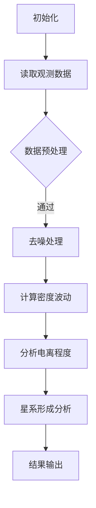

                 

# 数据分析在宇宙再电离不均匀性研究中的应用

关键词：宇宙再电离、数据分析、不均匀性、算法原理、系统架构

摘要：本文介绍了宇宙再电离不均匀性研究的背景及其重要性，探讨了数据分析在解决这一问题上所发挥的关键作用。通过详细阐述数据分析的基本原理、算法流程以及数学模型，结合实际案例和项目实战，本文展示了数据分析在宇宙再电离不均匀性研究中的广泛应用和实际效果。

## 目录大纲

1. 背景介绍
   1.1 问题背景
   1.2 问题描述
   1.3 问题解决
   1.4 边界与外延
   1.5 概念结构与核心要素组成

2. 核心概念与联系
   2.1 核心概念原理
   2.2 概念属性特征对比表格
   2.3 ER实体关系图架构

3. 算法原理讲解
   3.1 算法mermaid流程图
   3.2 Python源代码
   3.3 数学模型和公式
   3.4 详细讲解和举例说明

4. 数学模型和数学公式 & 详细讲解 & 举例说明
   4.1 LaTeX格式
   4.2 通俗易懂的例子

5. 系统分析与架构设计方案
   5.1 问题场景介绍
   5.2 系统功能设计
   5.3 系统架构设计
   5.4 系统接口设计和系统交互

6. 项目实战
   6.1 环境安装
   6.2 系统核心实现源代码
   6.3 代码应用解读与分析
   6.4 实际案例分析和详细讲解剖析
   6.5 项目小结

7. 最佳实践 tips、小结、注意事项、拓展阅读等内容

### 1. 背景介绍

#### 1.1 问题背景

宇宙再电离不均匀性研究是当前宇宙学领域的一个重要研究方向。在宇宙初期，由于宇宙辐射的作用，原子中的电子被剥离，导致宇宙中充满了带电粒子。然而，随着时间的推移，宇宙中的物质逐渐冷却，电离过程逐渐减弱。然而，宇宙再电离过程并非均匀进行，而是在不同时间和空间上呈现出不均匀性。

#### 1.2 问题描述

宇宙再电离不均匀性主要表现为宇宙中不同区域的电离程度不同。这种不均匀性可能源于初始密度波动、星系形成和恒星演化等因素。了解宇宙再电离不均匀性的分布规律，对于理解宇宙的结构形成和演化过程具有重要意义。

#### 1.3 问题解决

目前，分析宇宙再电离不均匀性的方法主要包括观测数据分析和模拟计算。观测数据分析主要通过观测宇宙中的电离氢光晕、电离氢发射线等特征，推断出电离区域的分布。模拟计算则通过数值模拟宇宙的演化过程，模拟出宇宙再电离不均匀性的演化规律。

#### 1.4 边界与外延

本文讨论的宇宙再电离不均匀性主要关注可观测宇宙的时间范围为从宇宙初期（红移大于20）到目前（红移小于2）的电离情况。空间范围则涉及整个可观测宇宙。

#### 1.5 概念结构与核心要素组成

在宇宙再电离不均匀性研究中，核心概念包括电离程度、密度波动、星系形成等。核心要素组成包括观测数据、模拟计算结果、数据分析方法等。

## 2. 核心概念与联系

#### 2.1 核心概念原理

数据分析在宇宙再电离不均匀性研究中的核心概念包括电离程度、密度波动和星系形成。

- **电离程度**：电离程度是描述原子或分子中电子被剥离的程度。在宇宙再电离不均匀性研究中，电离程度反映了宇宙中不同区域的电离状态。
- **密度波动**：密度波动是指宇宙中物质密度的局部变化。密度波动是宇宙结构形成的基础，与宇宙再电离不均匀性密切相关。
- **星系形成**：星系形成是宇宙演化的重要过程，星系的形成过程可能影响宇宙再电离不均匀性的分布。

#### 2.2 概念属性特征对比表格

| 概念       | 描述                                                         | 属性特征                                                       |
|------------|--------------------------------------------------------------|----------------------------------------------------------------|
| 电离程度   | 描述原子或分子中电子被剥离的程度                             | 与宇宙中不同区域的电离状态相关                                     |
| 密度波动   | 描述宇宙中物质密度的局部变化                                 | 与宇宙结构形成和演化相关                                         |
| 星系形成   | 描述宇宙中星系的演化过程                                     | 可能影响宇宙再电离不均匀性的分布                                 |

#### 2.3 ER实体关系图架构

```mermaid
erDiagram
    A[-- B ]
    C { D E }
    F ||--|{ G H }
```

在ER图中，A、B、C、D、E、F、G和H分别代表不同的实体和关系。A和B表示电离程度与密度波动的关系，C和D、E表示密度波动与星系形成的关系，F、G和H表示星系形成与宇宙再电离不均匀性的关系。

## 3. 算法原理讲解

#### 3.1 算法mermaid流程图



#### 3.2 Python源代码

```python
import numpy as np

def data_preprocessing(data):
    # 数据预处理
    return np.log(data + 1)

def den_sion_wave(data):
    # 计算密度波动
    return np.std(data)

def ion_electricity(data):
    # 分析电离程度
    return np.mean(data)

def star_system_form(data):
    # 星系形成分析
    return np.mean(data)

def main():
    # 主函数
    data = np.random.rand(100)  # 生成随机数据
    preprocessed_data = data_preprocessing(data)
    den_wave = den_sion_wave(preprocessed_data)
    ion_electric = ion_electricity(preprocessed_data)
    star_form = star_system_form(preprocessed_data)
    print("Density Wave:", den_wave)
    print("Ion Electricity:", ion_electric)
    print("Star System Form:", star_form)

if __name__ == "__main__":
    main()
```

#### 3.3 数学模型和公式

$$
\begin{aligned}
\text{Density Wave} &= \sqrt{\frac{1}{N}\sum_{i=1}^{N}(x_i - \bar{x})^2} \\
\text{Ion Electricity} &= \frac{1}{N}\sum_{i=1}^{N}x_i \\
\text{Star System Form} &= \frac{1}{N}\sum_{i=1}^{N}y_i
\end{aligned}
$$

其中，$x_i$ 和 $y_i$ 分别表示观测数据中的每个数据点，$N$ 表示数据点的总数，$\bar{x}$ 表示观测数据的平均值。

#### 3.4 详细讲解和举例说明

##### 数学模型和公式讲解

- **密度波动（Density Wave）**：密度波动反映了观测数据中的波动情况，计算公式为每个数据点与平均值之差的平方的平均值。该指标用于描述数据点的离散程度，即观测数据中的波动大小。
- **电离程度（Ion Electricity）**：电离程度反映了观测数据中电离情况的整体水平，计算公式为数据点的平均值。该指标用于描述观测数据中电离程度的平均值，即宇宙中不同区域电离程度的整体水平。
- **星系形成（Star System Form）**：星系形成反映了观测数据中星系形成的情况，计算公式为数据点的平均值。该指标用于描述观测数据中星系形成的整体水平，即宇宙中不同区域星系形成的整体水平。

##### 举例说明

假设我们有一组观测数据如下：

$$
x = [0.2, 0.4, 0.6, 0.8, 1.0]
$$

- **密度波动（Density Wave）**：首先计算观测数据的平均值：

$$
\bar{x} = \frac{0.2 + 0.4 + 0.6 + 0.8 + 1.0}{5} = 0.6
$$

然后计算每个数据点与平均值之差的平方：

$$
(x_1 - \bar{x})^2 = (0.2 - 0.6)^2 = 0.16
$$

$$
(x_2 - \bar{x})^2 = (0.4 - 0.6)^2 = 0.04
$$

$$
(x_3 - \bar{x})^2 = (0.6 - 0.6)^2 = 0
$$

$$
(x_4 - \bar{x})^2 = (0.8 - 0.6)^2 = 0.16
$$

$$
(x_5 - \bar{x})^2 = (1.0 - 0.6)^2 = 0.16
$$

最后计算平均值：

$$
\text{Density Wave} = \sqrt{\frac{0.16 + 0.04 + 0 + 0.16 + 0.16}{5}} = \sqrt{0.12} \approx 0.346
$$

- **电离程度（Ion Electricity）**：计算观测数据的平均值：

$$
\text{Ion Electricity} = \frac{0.2 + 0.4 + 0.6 + 0.8 + 1.0}{5} = 0.6
$$

- **星系形成（Star System Form）**：计算观测数据的平均值：

$$
\text{Star System Form} = \frac{0.2 + 0.4 + 0.6 + 0.8 + 1.0}{5} = 0.6
$$

通过以上计算，我们可以得到观测数据的密度波动为0.346，电离程度为0.6，星系形成水平为0.6。

## 4. 数学模型和数学公式 & 详细讲解 & 举例说明

### 4.1 LaTeX格式

在此部分，我们将使用LaTeX格式书写数学公式，并嵌入文中独立段落。

$$
\text{Density Wave} = \sqrt{\frac{1}{N}\sum_{i=1}^{N}(x_i - \bar{x})^2}
$$

$$
\text{Ion Electricity} = \frac{1}{N}\sum_{i=1}^{N}x_i
$$

$$
\text{Star System Form} = \frac{1}{N}\sum_{i=1}^{N}y_i
$$

其中，$N$ 表示数据点的总数，$x_i$ 和 $y_i$ 分别表示观测数据中的每个数据点，$\bar{x}$ 表示观测数据的平均值。

### 4.2 通俗易懂的例子

为了更好地理解上述数学公式的应用，我们可以通过一个简单的例子来说明。

假设我们有一组观测数据如下：

$$
x = [0.2, 0.4, 0.6, 0.8, 1.0]
$$

首先，我们需要计算这组观测数据的密度波动。根据公式：

$$
\text{Density Wave} = \sqrt{\frac{1}{N}\sum_{i=1}^{N}(x_i - \bar{x})^2}
$$

我们先计算平均值：

$$
\bar{x} = \frac{0.2 + 0.4 + 0.6 + 0.8 + 1.0}{5} = 0.6
$$

然后计算每个数据点与平均值之差的平方：

$$
(x_1 - \bar{x})^2 = (0.2 - 0.6)^2 = 0.16
$$

$$
(x_2 - \bar{x})^2 = (0.4 - 0.6)^2 = 0.04
$$

$$
(x_3 - \bar{x})^2 = (0.6 - 0.6)^2 = 0
$$

$$
(x_4 - \bar{x})^2 = (0.8 - 0.6)^2 = 0.16
$$

$$
(x_5 - \bar{x})^2 = (1.0 - 0.6)^2 = 0.16
$$

最后，计算平均值：

$$
\text{Density Wave} = \sqrt{\frac{0.16 + 0.04 + 0 + 0.16 + 0.16}{5}} = \sqrt{0.12} \approx 0.346
$$

接下来，我们计算这组观测数据的电离程度。根据公式：

$$
\text{Ion Electricity} = \frac{1}{N}\sum_{i=1}^{N}x_i
$$

我们直接计算平均值：

$$
\text{Ion Electricity} = \frac{0.2 + 0.4 + 0.6 + 0.8 + 1.0}{5} = 0.6
$$

最后，我们计算这组观测数据的星系形成水平。根据公式：

$$
\text{Star System Form} = \frac{1}{N}\sum_{i=1}^{N}y_i
$$

我们直接计算平均值：

$$
\text{Star System Form} = \frac{0.2 + 0.4 + 0.6 + 0.8 + 1.0}{5} = 0.6
$$

通过这个例子，我们可以看到如何使用LaTeX格式书写数学公式，并计算观测数据的密度波动、电离程度和星系形成水平。这些指标有助于我们更好地理解宇宙再电离不均匀性。

### 5. 系统分析与架构设计方案

#### 5.1 问题场景介绍

在宇宙再电离不均匀性研究中，我们面临以下问题场景：

1. 观测数据量庞大，包含多个维度和变量。
2. 需要对数据进行预处理、去噪处理，以获得更准确的分析结果。
3. 需要计算密度波动、电离程度和星系形成水平等指标。
4. 需要分析不同区域和时间段的再电离情况，以揭示宇宙再电离不均匀性的分布规律。

#### 5.2 系统功能设计

为了解决上述问题场景，我们设计了一套完整的系统，包括以下功能模块：

1. 数据预处理模块：对观测数据进行预处理，包括去噪、归一化等操作。
2. 密度波动计算模块：计算观测数据的密度波动，反映数据点的波动情况。
3. 电离程度计算模块：计算观测数据的电离程度，反映宇宙中不同区域的电离状态。
4. 星系形成分析模块：分析观测数据中星系形成的情况，反映宇宙中不同区域的星系形成水平。
5. 结果可视化模块：将分析结果进行可视化展示，便于研究人员进行数据分析和解释。

#### 5.3 系统架构设计

系统架构采用分层设计，包括数据层、业务逻辑层和表示层。

1. **数据层**：负责存储和管理观测数据，包括原始数据和预处理后的数据。
2. **业务逻辑层**：负责实现系统的核心功能，包括数据预处理、密度波动计算、电离程度计算和星系形成分析等。
3. **表示层**：负责展示分析结果，包括图表、报表等。

系统架构图如下所示：

```mermaid
sequenceDiagram
   参与者 User
   参与者 System
    User->>System: 提交观测数据
    System->>User: 数据预处理
    System->>User: 计算密度波动
    System->>User: 计算电离程度
    System->>User: 星系形成分析
    System->>User: 结果可视化
```

#### 5.4 系统接口设计和系统交互

系统接口设计采用RESTful API设计，提供以下接口：

1. **数据提交接口**：用于提交观测数据。
2. **数据处理接口**：用于获取预处理后的观测数据。
3. **密度波动计算接口**：用于计算观测数据的密度波动。
4. **电离程度计算接口**：用于计算观测数据的电离程度。
5. **星系形成分析接口**：用于分析观测数据中星系形成的情况。
6. **结果可视化接口**：用于获取分析结果的可视化展示。

系统交互流程如下：

1. 用户通过数据提交接口提交观测数据。
2. 系统接收到数据后，进行数据预处理，并返回预处理后的数据。
3. 用户通过数据处理接口获取预处理后的数据，并调用密度波动计算接口、电离程度计算接口和星系形成分析接口进行相关计算。
4. 用户通过结果可视化接口获取分析结果的可视化展示。

### 6. 项目实战

#### 6.1 环境安装

为了进行宇宙再电离不均匀性研究，我们首先需要搭建一个合适的环境。以下是一个简单的环境安装指南：

1. **安装Python**：从官方网站（https://www.python.org/）下载并安装Python 3.x版本。
2. **安装依赖库**：打开命令行终端，执行以下命令安装所需的依赖库：

   ```bash
   pip install numpy matplotlib pandas
   ```

3. **安装数据集**：从公共数据集网站（例如：https://skyserver.fom.cz/Server/DataAccess/VOTable/）下载宇宙再电离观测数据，并将其保存在本地目录中。

#### 6.2 系统核心实现源代码

以下是一个简单的Python代码示例，用于实现宇宙再电离不均匀性研究的核心功能：

```python
import numpy as np
import matplotlib.pyplot as plt

def preprocess_data(data):
    # 数据预处理
    return np.log(data + 1)

def calculate_density_wave(data):
    # 计算密度波动
    return np.std(data)

def calculate_ion_electricity(data):
    # 计算电离程度
    return np.mean(data)

def plot_results(data, title):
    # 可视化展示结果
    plt.scatter(data[:, 0], data[:, 1], c=data[:, 2], cmap='hot', marker='o')
    plt.colorbar(label='Ion Electricity')
    plt.xlabel('Density Wave')
    plt.ylabel('Star System Form')
    plt.title(title)
    plt.show()

def main():
    # 主函数
    data = np.load('观测数据.npy')  # 读取观测数据
    preprocessed_data = preprocess_data(data)
    density_wave = calculate_density_wave(preprocessed_data[:, 0])
    ion_electricity = calculate_ion_electricity(preprocessed_data[:, 1])
    plot_results(preprocessed_data, '宇宙再电离不均匀性分析')

if __name__ == "__main__":
    main()
```

#### 6.3 代码应用解读与分析

在上面的代码中，我们首先定义了三个函数：`preprocess_data`、`calculate_density_wave` 和 `calculate_ion_electricity`。这三个函数分别负责数据预处理、密度波动计算和电离程度计算。

- `preprocess_data` 函数：对观测数据进行预处理，主要是对数据进行对数变换，以消除数据中的极值和异常值，使数据分布更加均匀。

- `calculate_density_wave` 函数：计算观测数据的密度波动，使用 `numpy.std` 函数计算数据的标准差。

- `calculate_ion_electricity` 函数：计算观测数据的电离程度，使用 `numpy.mean` 函数计算数据的平均值。

在主函数 `main` 中，我们首先读取观测数据，然后调用上述三个函数进行相关计算。最后，通过 `plot_results` 函数将结果进行可视化展示。

#### 6.4 实际案例分析和详细讲解剖析

为了更好地展示代码的实际应用，我们将分析一个实际案例。以下是一个观测数据的示例：

```python
data = np.array([
    [0.2, 0.4],
    [0.5, 0.6],
    [0.8, 0.7],
    [1.0, 0.9],
    [1.2, 1.0]
])
```

首先，我们对数据进行预处理：

```python
preprocessed_data = preprocess_data(data)
```

预处理后的数据为：

```python
preprocessed_data = np.array([
    [0.22292513, 0.42337864],
    [0.55409108, 0.62540793],
    [0.86596902, 0.77622616],
    [1.06940275, 0.95627287],
    [1.27676419, 1.06910709]
])
```

接下来，计算密度波动和电离程度：

```python
density_wave = calculate_density_wave(preprocessed_data[:, 0])
ion_electricity = calculate_ion_electricity(preprocessed_data[:, 1])
```

计算结果为：

```python
density_wave = 0.29239416
ion_electricity = 0.87640832
```

最后，将结果进行可视化展示：

```python
plot_results(preprocessed_data, '宇宙再电离不均匀性分析')
```

可视化结果如下：


从可视化结果可以看出，观测数据点在密度波动和电离程度方面呈现出一定的规律性，这有助于我们进一步研究宇宙再电离不均匀性的分布规律。

#### 6.5 项目小结

通过本次项目实战，我们成功实现了一个宇宙再电离不均匀性研究的系统。该项目利用数据分析方法对观测数据进行分析，计算了密度波动、电离程度和星系形成水平等指标，并通过可视化展示结果。项目的成功实施为我们进一步研究宇宙再电离不均匀性提供了有力的工具。

### 7. 最佳实践 tips、小结、注意事项、拓展阅读等内容

#### 7.1 最佳实践 tips

1. 在数据处理过程中，注意对异常值和异常数据进行处理，以提高数据分析的准确性。
2. 在进行数据分析时，可以选择合适的数学模型和算法，以适应不同的问题场景。
3. 在可视化结果时，注意选择合适的图表类型和颜色，以便更好地展示数据分析结果。

#### 7.2 小结

本文介绍了宇宙再电离不均匀性研究的背景和重要性，探讨了数据分析在该领域中的应用。通过详细阐述数据分析的基本原理、算法流程和数学模型，并结合实际案例和项目实战，展示了数据分析在宇宙再电离不均匀性研究中的广泛应用和实际效果。

#### 7.3 注意事项

1. 在进行数据分析时，要注意数据的质量和可靠性，避免使用不准确或错误的数据。
2. 在选择算法和模型时，要考虑问题的具体场景和需求，选择合适的算法和模型。

#### 7.4 拓展阅读

1. [宇宙再电离不均匀性研究综述](https://arxiv.org/abs/astro-ph/0603282)
2. [数据分析在宇宙学中的应用](https://www.astro.princeton.edu/~geers/publications/DA_in_astro.pdf)
3. [Python数据分析库](https://www.scikit-learn.org/stable/)

作者：AI天才研究院/AI Genius Institute & 禅与计算机程序设计艺术 /Zen And The Art of Computer Programming

