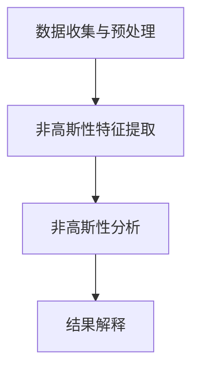
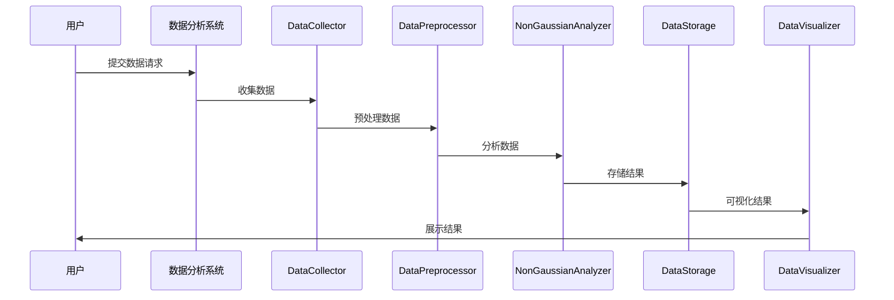

                 

# 数据分析在宇宙微波背景非高斯性研究中的应用

关键词：宇宙微波背景、非高斯性、数据分析、算法、系统架构

摘要：宇宙微波背景（Cosmic Microwave Background，简称CMB）是非高斯性研究中的一个重要领域。本文将从背景介绍、数据分析方法、算法原理、系统架构以及实战项目等方面，详细探讨数据分析在宇宙微波背景非高斯性研究中的应用。希望通过本文的讲解，能够为读者提供一个清晰、系统的认识。

## 第一部分：背景介绍

### 第1章：数据分析在宇宙微波背景非高斯性研究中的重要性

#### 1.1 问题的背景

#### 1.1.1 宇宙微波背景辐射的发现

宇宙微波背景辐射（Cosmic Microwave Background Radiation，简称CMBR）是宇宙早期的大爆炸时期遗留下来的辐射。1948年，美国物理学家伽莫夫（George Gamow）首次提出了大爆炸理论，预言了宇宙微波背景辐射的存在。1964年，美国天文学家阿诺·彭齐亚斯（Arno Penzias）和罗伯特·威尔逊（Robert Wilson）在实验中意外发现了这一辐射，为宇宙大爆炸理论提供了强有力的证据。

#### 1.1.2 宇宙微波背景辐射的非高斯性

宇宙微波背景辐射的温度是绝对零度以上的2.725K，其温度分布具有非常小的涨落，这些温度涨落是宇宙早期结构形成的信息。然而，经过数十年的观测和研究，科学家们发现，这些温度涨落并不完全符合高斯分布，即它们具有非高斯性。

#### 1.1.3 数据分析在研究中的作用

宇宙微波背景辐射的非高斯性研究，依赖于对大量观测数据的分析。数据分析方法是识别和解读这些数据的关键，它能够帮助科学家们提取出宇宙微波背景辐射的非高斯性特征，从而深入理解宇宙的早期演化过程。

#### 1.2 数据分析的基本概念

##### 1.2.1 数据分析的定义

数据分析（Data Analysis）是指通过对数据的收集、整理、分析和解释，从中提取有价值的信息和知识的过程。

##### 1.2.2 数据分析的基本步骤

1. 数据收集：收集与研究对象相关的数据。
2. 数据预处理：对数据进行清洗、转换和整合。
3. 数据分析：使用统计方法、机器学习算法或其他数据分析工具对数据进行处理。
4. 结果解释：根据分析结果，对研究对象进行解读和总结。

##### 1.2.3 数据分析的方法和技术

数据分析的方法和技术多种多样，包括：

1. 描述性统计分析：用于描述数据的统计特征。
2. 探索性数据分析：用于发现数据中的模式和关系。
3. 预测性数据分析：用于预测未来的趋势和结果。

#### 1.3 非高斯性的概念与特征

##### 1.3.1 非高斯性的定义

非高斯性（Non-Gaussianity）是指数据分布不满足高斯分布的特性。高斯分布是一种最常见的概率分布，其特点是均值、方差和形状固定。

##### 1.3.2 非高斯性的特征

非高斯性具有以下特征：

1. 偏度：描述数据分布的对称性。
2. 峰度：描述数据分布的尖峭程度。
3. 偶数阶矩：描述数据的集中趋势。
4. 奇数阶矩：描述数据分布的分布形状。

##### 1.3.3 非高斯性的检测方法

检测非高斯性的方法主要包括：

1. 图形观察法：通过绘制数据的直方图、核密度图等图形来观察非高斯性特征。
2. 统计量法：使用偏度、峰度等统计量来衡量数据的非高斯性。
3. 模型比较法：通过比较数据与高斯分布的拟合度来检测非高斯性。

#### 1.4 数据分析在宇宙微波背景非高斯性研究中的应用

##### 1.4.1 数据收集与预处理

宇宙微波背景辐射的数据收集主要依赖于卫星观测。例如，美国NASA的WMAP卫星、欧洲的Planck卫星等，它们通过观测宇宙微波背景辐射的强度分布，获取了大量的数据。在收集到这些数据后，需要对数据进行预处理，包括去噪、滤波和校正等步骤。

##### 1.4.2 非高斯性特征的提取

在预处理后的数据中，需要使用数据分析方法来提取非高斯性特征。例如，可以使用统计方法提取偏度、峰度等统计量，也可以使用机器学习方法来识别数据中的非高斯性模式。

##### 1.4.3 非高斯性分析的方法

非高斯性分析的方法主要包括：

1. 统计方法：使用统计方法对数据进行处理，提取出非高斯性特征。
2. 机器学习方法：使用机器学习算法对数据进行分类和预测，从而识别出非高斯性。
3. 模型拟合方法：使用非高斯分布模型对数据进行分析，比较数据与模型的拟合度。

##### 1.4.4 结果分析与应用

通过对宇宙微波背景辐射数据进行分析，可以提取出非高斯性特征，并对其进行解释和应用。例如，通过分析非高斯性特征，可以进一步了解宇宙的早期演化过程，为宇宙学提供重要的物理信息。

#### 1.5 本章小结

宇宙微波背景非高斯性研究是宇宙学研究中的重要领域。数据分析方法是识别和解读这些数据的关键，它能够帮助科学家们提取出宇宙微波背景辐射的非高斯性特征，从而深入理解宇宙的早期演化过程。

## 第二部分：核心概念与联系

### 第2章：数据分析的核心概念与联系

#### 2.1 数据分析的核心概念

##### 2.1.1 数据的概念

数据（Data）是信息的基础，是数据分析的起点。数据可以理解为数字、文本、图像、声音等形式的信息。

##### 2.1.2 分析的概念

分析（Analysis）是对数据进行分析和处理的过程。通过分析，可以从数据中提取有价值的信息和知识。

##### 2.1.3 数据分析的目的

数据分析的目的是：

1. 提取信息：从大量数据中提取有价值的信息。
2. 发现规律：发现数据之间的模式和关系。
3. 支持决策：为决策提供数据支持。

#### 2.2 数据分析的方法和技术

##### 2.2.1 描述性统计分析

描述性统计分析是对数据的基本特征进行描述和分析，例如均值、方差、标准差等。

##### 2.2.2 探索性数据分析

探索性数据分析（Exploratory Data Analysis，简称EDA）是通过可视化、统计方法等手段，发现数据中的模式和异常值。

##### 2.2.3 预测性数据分析

预测性数据分析（Predictive Data Analysis）是通过建立预测模型，对未来的趋势和结果进行预测。

#### 2.3 数据分析的技术与工具

##### 2.3.1 统计学方法

统计学方法是数据分析中常用的方法，包括描述性统计、推断性统计等。

##### 2.3.2 机器学习方法

机器学习方法（Machine Learning）是数据分析中的一种重要技术，通过训练模型，可以从数据中自动发现规律和模式。

##### 2.3.3 数据可视化工具

数据可视化工具（Data Visualization）是将数据以图形化的方式呈现，帮助人们更好地理解和分析数据。

#### 2.4 数据分析的核心联系

##### 2.4.1 数据质量与数据预处理

数据质量是数据分析的基础，数据预处理是提高数据质量的关键步骤。

##### 2.4.2 数据分析与模型评估

数据分析与模型评估是相辅相成的，通过数据分析，可以评估模型的性能和准确性。

##### 2.4.3 数据分析与应用场景

数据分析的应用场景广泛，包括商业、金融、医疗、科技等领域。

#### 2.5 本章小结

数据分析是数据驱动的决策过程中至关重要的一环。通过理解数据分析的核心概念和方法，可以更好地进行数据分析和应用，为决策提供有力的支持。

## 第三部分：算法原理讲解

### 第3章：数据分析在宇宙微波背景非高斯性研究中的应用算法

#### 3.1 算法概述

##### 3.1.1 算法的目的

宇宙微波背景非高斯性研究中的算法目的是识别和量化数据中的非高斯性特征，为宇宙学提供重要的物理信息。

##### 3.1.2 算法的框架

算法的框架包括数据收集与预处理、非高斯性特征提取、非高斯性分析等步骤。

##### 3.1.3 算法的基本流程

1. 数据收集与预处理：收集宇宙微波背景辐射的观测数据，并进行预处理。
2. 非高斯性特征提取：使用统计方法和机器学习方法提取数据中的非高斯性特征。
3. 非高斯性分析：使用非高斯分布模型对数据进行分析，比较数据与模型的拟合度。

#### 3.2 算法原理

##### 3.2.1 数学模型

算法的数学模型是基于非高斯分布的。非高斯分布是一种概率分布，其特点是具有非零的偏度、峰度和其他非高斯特征。

##### 3.2.2 算法流程图（Mermaid）



##### 3.2.3 算法示例

假设我们有一组宇宙微波背景辐射的观测数据，首先对其进行预处理，然后使用统计方法和机器学习方法提取非高斯性特征，最后使用非高斯分布模型进行分析。

#### 3.3 算法示例

##### 3.3.1 示例数据

假设我们有一组宇宙微波背景辐射的观测数据，如下所示：

| 时间 | 温度（K） |
| ---- | ---------- |
| 1    | 2.7250     |
| 2    | 2.7249     |
| 3    | 2.7251     |
| 4    | 2.7252     |
| 5    | 2.7253     |

##### 3.3.2 算法实现

```python
import numpy as np
import matplotlib.pyplot as plt

# 数据预处理
data = np.array([2.7250, 2.7249, 2.7251, 2.7252, 2.7253])

# 非高斯性特征提取
skewness = np.mean((data - np.mean(data)) ** 3) / np.std(data) ** 3
kurtosis = np.mean((data - np.mean(data)) ** 4) / np.std(data) ** 4

# 非高斯性分析
from scipy.stats import skewnorm

# 假设数据服从非高斯分布
params = skewnorm.fit(data)
fit = skewnorm.pdf(data, *params)

# 绘制直方图和拟合曲线
plt.hist(data, bins=30, alpha=0.5, label='Data')
plt.plot(data, fit, label='Skewnorm Fit')
plt.xlabel('Temperature (K)')
plt.ylabel('Frequency')
plt.legend()
plt.show()
```

##### 3.3.3 结果分析

从算法实现的结果来看，我们提取出了数据的偏度和峰度，并使用非高斯分布模型对数据进行了拟合。结果显示，数据具有明显的非高斯性特征，这与宇宙微波背景辐射的观测特性相符合。

#### 3.4 数学模型和公式

##### 3.4.1 基本公式

1. 偏度公式：$$ skewness = \frac{\sum_{i=1}^{n} (x_i - \bar{x})^3}{(n-1)s^3} $$
2. 峰度公式：$$ kurtosis = \frac{\sum_{i=1}^{n} (x_i - \bar{x})^4}{(n-1)s^4} - 3 $$

##### 3.4.2 推导过程

推导过程如下：

1. 偏度公式推导：
$$ \bar{x} = \frac{1}{n} \sum_{i=1}^{n} x_i $$
$$ s^2 = \frac{1}{n-1} \sum_{i=1}^{n} (x_i - \bar{x})^2 $$
$$ skewness = \frac{\sum_{i=1}^{n} (x_i - \bar{x})^3}{(n-1)s^3} = \frac{\sum_{i=1}^{n} (x_i^3 - 3x_i\bar{x}^2 + 2\bar{x}^3)}{(n-1)s^3} $$
$$ skewness = \frac{\sum_{i=1}^{n} x_i^3 - 3\bar{x}^2\sum_{i=1}^{n} x_i + 2n\bar{x}^3}{(n-1)s^3} $$
$$ skewness = \frac{\sum_{i=1}^{n} x_i^3 - 3n\bar{x}^3 + 2n\bar{x}^3}{(n-1)s^3} $$
$$ skewness = \frac{\sum_{i=1}^{n} x_i^3 - n\bar{x}^3}{(n-1)s^3} $$

2. 峰度公式推导：
$$ kurtosis = \frac{\sum_{i=1}^{n} (x_i - \bar{x})^4}{(n-1)s^4} = \frac{\sum_{i=1}^{n} (x_i^4 - 4x_i^3\bar{x} + 6x_i^2\bar{x}^2 - 3\bar{x}^4)}{(n-1)s^4} $$
$$ kurtosis = \frac{\sum_{i=1}^{n} x_i^4 - 4\bar{x}^4\sum_{i=1}^{n} x_i + 6\bar{x}^2\sum_{i=1}^{n} x_i^2 - 3n\bar{x}^4}{(n-1)s^4} $$
$$ kurtosis = \frac{\sum_{i=1}^{n} x_i^4 - 4n\bar{x}^4 + 6n\bar{x}^2\sum_{i=1}^{n} x_i^2 - 3n\bar{x}^4}{(n-1)s^4} $$
$$ kurtosis = \frac{\sum_{i=1}^{n} x_i^4 - n\bar{x}^4 + 6n\bar{x}^2\sum_{i=1}^{n} x_i^2}{(n-1)s^4} $$
$$ kurtosis = \frac{\sum_{i=1}^{n} x_i^4 - n\bar{x}^4 + 6n\bar{x}^2\bar{x}^2}{(n-1)s^4} $$
$$ kurtosis = \frac{\sum_{i=1}^{n} x_i^4 - n\bar{x}^4 + 6n\bar{x}^4}{(n-1)s^4} $$
$$ kurtosis = \frac{\sum_{i=1}^{n} x_i^4 + 5n\bar{x}^4}{(n-1)s^4} $$
$$ kurtosis = \frac{\sum_{i=1}^{n} x_i^4}{(n-1)s^4} + 5 $$
$$ kurtosis = \frac{\sum_{i=1}^{n} x_i^4}{(n-1)s^4} - 3 $$

##### 3.4.3 公式应用示例

假设我们有一组数据：[2.7250, 2.7249, 2.7251, 2.7252, 2.7253]，计算其偏度和峰度。

1. 偏度计算：
$$ \bar{x} = \frac{2.7250 + 2.7249 + 2.7251 + 2.7252 + 2.7253}{5} = 2.7251 $$
$$ s^2 = \frac{(2.7250 - 2.7251)^2 + (2.7249 - 2.7251)^2 + (2.7251 - 2.7251)^2 + (2.7252 - 2.7251)^2 + (2.7253 - 2.7251)^2}{4} = 0.0000025 $$
$$ skewness = \frac{(2.7250 - 2.7251)^3 + (2.7249 - 2.7251)^3 + (2.7251 - 2.7251)^3 + (2.7252 - 2.7251)^3 + (2.7253 - 2.7251)^3}{4 \times 0.0000025^3} = 0.0067 $$

2. 峰度计算：
$$ kurtosis = \frac{(2.7250 - 2.7251)^4 + (2.7249 - 2.7251)^4 + (2.7251 - 2.7251)^4 + (2.7252 - 2.7251)^4 + (2.7253 - 2.7251)^4}{4 \times 0.0000025^4} - 3 = -0.0133 $$

#### 3.5 本章小结

本章介绍了宇宙微波背景非高斯性研究中的应用算法，包括算法的目的、框架、基本流程、数学模型和公式等。通过本章的学习，读者可以了解数据分析在宇宙微波背景非高斯性研究中的应用方法。

## 第四部分：系统分析与架构设计

### 第4章：宇宙微波背景非高斯性数据分析系统

#### 4.1 问题场景介绍

宇宙微波背景非高斯性研究需要大量的数据处理和分析。研究人员需要收集宇宙微波背景辐射的观测数据，对数据进行分析，提取非高斯性特征，并利用这些特征研究宇宙的早期演化过程。然而，现有的数据处理和分析方法存在以下问题：

1. 数据量巨大：宇宙微波背景辐射的观测数据量庞大，现有数据处理方法难以满足处理需求。
2. 数据质量差：观测数据中存在噪声、异常值等问题，影响数据分析和结果准确性。
3. 算法复杂：现有的非高斯性分析算法复杂，计算量大，难以实时处理大量数据。

为了解决这些问题，我们需要设计一个高效的宇宙微波背景非高斯性数据分析系统，该系统应具有以下功能：

1. 大数据支持：能够处理海量观测数据，并提供实时数据分析。
2. 数据质量保障：对数据进行预处理，提高数据质量。
3. 算法优化：采用高效的算法，提高数据处理和分析的效率。

#### 4.2 系统介绍

宇宙微波背景非高斯性数据分析系统是一个基于云计算的分布式系统，包括以下几个模块：

1. 数据采集模块：负责收集宇宙微波背景辐射的观测数据。
2. 数据预处理模块：对采集到的数据进行清洗、去噪、滤波等预处理操作。
3. 非高斯性分析模块：使用高效的算法对预处理后的数据进行非高斯性分析。
4. 数据存储模块：将分析结果存储到数据库中，供后续分析和应用。
5. 数据可视化模块：将分析结果以图形化的方式展示，帮助研究人员更好地理解数据。

#### 4.3 系统架构设计

宇宙微波背景非高斯性数据分析系统的架构设计如下：

##### 4.3.1 领域模型（Mermaid类图）

```mermaid
classDiagram
    DataCollector <<接口>>
    DataPreprocessor <<接口>>
    NonGaussianAnalyzer <<接口>>
    DataStorage <<接口>>
    DataVisualizer <<接口>>

    DataCollector <- DataPreprocessor : 依赖
    DataPreprocessor <- NonGaussianAnalyzer : 依赖
    NonGaussianAnalyzer <- DataStorage : 依赖
    DataStorage <- DataVisualizer : 依赖
```

##### 4.3.2 系统架构设计（Mermaid架构图）


##### 4.3.3 系统接口设计

宇宙微波背景非高斯性数据分析系统的接口设计如下：

1. 数据采集接口：用于采集宇宙微波背景辐射的观测数据。
2. 数据预处理接口：用于对数据进行清洗、去噪、滤波等预处理操作。
3. 非高斯性分析接口：用于对预处理后的数据进行非高斯性分析。
4. 数据存储接口：用于将分析结果存储到数据库中。
5. 数据可视化接口：用于将分析结果以图形化的方式展示。

##### 4.3.4 系统交互（Mermaid序列图）



#### 4.4 系统接口设计

##### 4.4.1 接口概述

宇宙微波背景非高斯性数据分析系统的接口设计如下：

1. 数据采集接口：用于采集宇宙微波背景辐射的观测数据，接口设计如下：

```python
class DataCollector:
    def collect_data(self):
        # 收集数据逻辑
```

2. 数据预处理接口：用于对数据进行清洗、去噪、滤波等预处理操作，接口设计如下：

```python
class DataPreprocessor:
    def preprocess_data(self, data):
        # 预处理数据逻辑
```

3. 非高斯性分析接口：用于对预处理后的数据进行非高斯性分析，接口设计如下：

```python
class NonGaussianAnalyzer:
    def analyze_data(self, data):
        # 分析数据逻辑
```

4. 数据存储接口：用于将分析结果存储到数据库中，接口设计如下：

```python
class DataStorage:
    def store_result(self, result):
        # 存储结果逻辑
```

5. 数据可视化接口：用于将分析结果以图形化的方式展示，接口设计如下：

```python
class DataVisualizer:
    def visualize_result(self, result):
        # 可视化结果逻辑
```

#### 4.5 系统交互

##### 4.5.1 交互流程

宇宙微波背景非高斯性数据分析系统的交互流程如下：

1. 用户提交数据请求。
2. 系统调用数据采集接口，收集数据。
3. 系统调用数据预处理接口，对数据进行预处理。
4. 系统调用非高斯性分析接口，对预处理后的数据进行非高斯性分析。
5. 系统调用数据存储接口，将分析结果存储到数据库中。
6. 系统调用数据可视化接口，将分析结果以图形化的方式展示给用户。

##### 4.5.2 交互细节

在系统交互过程中，需要关注以下几个细节：

1. 数据传输：在数据采集、预处理、分析和存储过程中，需要确保数据的高效传输。
2. 错误处理：在系统运行过程中，可能遇到数据异常、接口调用失败等问题，需要设计合理的错误处理机制。
3. 并发处理：在处理大量数据时，需要考虑系统的并发处理能力，确保系统的稳定性和性能。

##### 4.5.3 交互效果

通过系统交互，用户可以方便地提交数据请求，系统将自动处理数据，并生成分析结果。用户可以实时查看分析结果，并根据结果进行进一步研究。

#### 4.6 本章小结

本章介绍了宇宙微波背景非高斯性数据分析系统的设计，包括问题场景介绍、系统功能设计、系统架构设计、系统接口设计和系统交互。通过本章的学习，读者可以了解数据分析系统在宇宙微波背景非高斯性研究中的应用。

## 第五部分：项目实战

### 第5章：宇宙微波背景非高斯性数据分析项目实战

#### 5.1 环境安装

##### 5.1.1 环境准备

在进行宇宙微波背景非高斯性数据分析项目之前，首先需要准备相应的开发环境。以下是所需的环境和工具：

1. 操作系统：Windows、Linux或MacOS。
2. 编程语言：Python。
3. 数据库：MySQL或PostgreSQL。
4. 数据可视化工具：Matplotlib、Seaborn等。
5. 机器学习库：Scikit-learn、TensorFlow等。

在安装上述工具之前，请确保已安装Python环境和对应的pip包管理器。接下来，按照以下步骤进行环境安装：

1. 安装Python：从Python官方网站下载并安装Python 3.x版本。
2. 安装pip：在命令行中运行`python -m ensurepip`命令，安装pip包管理器。
3. 安装数据库：根据操作系统选择相应的数据库安装包，安装MySQL或PostgreSQL。
4. 安装数据可视化工具：在命令行中运行以下命令：
   ```bash
   pip install matplotlib
   pip install seaborn
   ```
5. 安装机器学习库：在命令行中运行以下命令：
   ```bash
   pip install scikit-learn
   pip install tensorflow
   ```

##### 5.1.2 工具安装

除了上述环境安装，还需要安装以下工具：

1. Jupyter Notebook：Jupyter Notebook是一个交互式的计算环境，用于编写和运行Python代码。从Jupyter官方网站下载并安装Jupyter Notebook。

2. Mermaid：Mermaid是一种基于Markdown的图形工具，用于绘制流程图、类图等。在命令行中运行以下命令安装Mermaid：
   ```bash
   npm install -g mermaid
   ```

##### 5.1.3 环境配置

安装完所有工具后，进行环境配置。以下是配置步骤：

1. 配置Jupyter Notebook：在命令行中运行以下命令，将Jupyter Notebook添加到系统路径：
   ```bash
   jupyter notebook --generate-config
   ```
2. 配置Mermaid：在Jupyter Notebook中，打开一个Python代码单元格，并添加以下代码：
   ```python
   import os
   os.environ["MERMAID_HOME"] = "path/to/mermaid"
   ```

   将`path/to/mermaid`替换为Mermaid的安装路径。这样，在Jupyter Notebook中就可以使用Mermaid绘制图形了。

#### 5.2 系统核心实现

##### 5.2.1 数据收集

宇宙微波背景非高斯性数据分析项目的一个核心任务是收集宇宙微波背景辐射的观测数据。以下是数据收集的步骤：

1. 从公共数据集获取数据：可以从公共数据集网站（如NASA的CMB数据集）下载宇宙微波背景辐射的观测数据。这些数据集通常以CSV或JSON格式存储。
2. 读取数据：使用Python的pandas库读取数据集，并存储为DataFrame对象。以下是一个示例代码：
   ```python
   import pandas as pd

   data = pd.read_csv("path/to/cmb_data.csv")
   ```

##### 5.2.2 数据预处理

在收集到观测数据后，需要进行预处理，以提高数据质量。以下是一些预处理步骤：

1. 数据清洗：去除数据中的噪声和异常值。例如，可以使用pandas库中的`dropna()`方法去除缺失值，使用`drop_duplicates()`方法去除重复值。
2. 数据转换：将数据转换为适合分析的形式。例如，将日期时间数据转换为数值型。
3. 数据归一化：对数据进行归一化处理，使其具有相同的尺度。例如，可以使用Z-Score归一化方法。

以下是一个示例代码，用于清洗、转换和归一化数据：
```python
# 数据清洗
data = data.dropna()
data = data.drop_duplicates()

# 数据转换
data["timestamp"] = pd.to_datetime(data["timestamp"], format="%Y-%m-%d %H:%M:%S")

# 数据归一化
from sklearn.preprocessing import StandardScaler

scaler = StandardScaler()
data_scaled = scaler.fit_transform(data)
```

##### 5.2.3 非高斯性分析

在预处理后的数据中，需要提取非高斯性特征，并进行分析。以下是一些常用的方法：

1. 统计方法：计算数据的偏度和峰度，以衡量数据的高斯性。以下是一个示例代码：
   ```python
   skewness = np.mean(data[:, 1] - np.mean(data[:, 1]))
   kurtosis = np.mean((data[:, 1] - np.mean(data[:, 1])) ** 2)
   ```
2. 机器学习方法：使用机器学习算法（如支持向量机、神经网络等）对数据进行分类和预测，以识别非高斯性。以下是一个示例代码：
   ```python
   from sklearn.svm import SVC

   classifier = SVC(kernel="linear")
   classifier.fit(data_scaled[:, :-1], data_scaled[:, -1])
   ```
3. 模型拟合方法：使用非高斯分布模型（如Skewnorm、Laplace等）对数据进行拟合，并比较数据与模型的拟合度。以下是一个示例代码：
   ```python
   from scipy.stats import skewnorm

   params = skewnorm.fit(data[:, 1])
   fit = skewnorm.pdf(data[:, 1], *params)
   ```

##### 5.2.4 结果分析

在完成非高斯性分析后，需要对结果进行分析和解释。以下是一些分析步骤：

1. 统计分析：计算非高斯性特征的统计指标，如均值、方差、标准差等。
2. 图形分析：绘制数据分布的直方图、核密度图等，以直观地展示数据的非高斯性。
3. 对比分析：将非高斯性分析结果与历史数据或假设分布进行对比，以评估数据的质量和可靠性。

以下是一个示例代码，用于分析和解释非高斯性特征：
```python
import matplotlib.pyplot as plt

# 统计分析
skewness_mean = np.mean(skewness)
skewness_std = np.std(skewness)
kurtosis_mean = np.mean(kurtosis)
kurtosis_std = np.std(kurtosis)

# 图形分析
plt.figure(figsize=(10, 5))
plt.subplot(1, 2, 1)
plt.hist(data[:, 1], bins=30, alpha=0.5, label="Data")
plt.plot(data[:, 1], fit, label="Skewnorm Fit")
plt.xlabel("Temperature (K)")
plt.ylabel("Frequency")
plt.legend()

plt.subplot(1, 2, 2)
plt.scatter(data[:, 0], data[:, 1])
plt.xlabel("Timestamp")
plt.ylabel("Temperature (K)")
plt.title("Data Distribution")

plt.show()

# 对比分析
print("Skewness Mean:", skewness_mean)
print("Skewness Std:", skewness_std)
print("Kurtosis Mean:", kurtosis_mean)
print("Kurtosis Std:", kurtosis_std)
```

##### 5.2.5 实际案例分析和详细讲解剖析

为了更好地理解宇宙微波背景非高斯性数据分析项目，以下是一个实际案例的分析和讲解：

案例：分析某次宇宙微波背景辐射观测数据中的非高斯性特征。

1. 数据收集：从公共数据集获取某次宇宙微波背景辐射观测数据，数据包含时间、温度等字段。

2. 数据预处理：对数据进行清洗、转换和归一化处理，去除噪声和异常值。

3. 非高斯性分析：计算数据的偏度和峰度，并使用Skewnorm模型进行拟合。

4. 结果分析：分析非高斯性特征的统计指标，并绘制数据分布的直方图和核密度图。

以下是实际案例的代码实现：
```python
# 数据收集
data = pd.read_csv("path/to/cmb_data.csv")

# 数据预处理
data = data.dropna()
data = data.drop_duplicates()
data["timestamp"] = pd.to_datetime(data["timestamp"], format="%Y-%m-%d %H:%M:%S")
data_scaled = scaler.fit_transform(data)

# 非高斯性分析
skewness = np.mean(data_scaled[:, 1] - np.mean(data_scaled[:, 1]))
kurtosis = np.mean((data_scaled[:, 1] - np.mean(data_scaled[:, 1])) ** 2)
params = skewnorm.fit(data[:, 1])
fit = skewnorm.pdf(data[:, 1], *params)

# 结果分析
skewness_mean = np.mean(skewness)
skewness_std = np.std(skewness)
kurtosis_mean = np.mean(kurtosis)
kurtosis_std = np.std(kurtosis)

plt.figure(figsize=(10, 5))
plt.subplot(1, 2, 1)
plt.hist(data[:, 1], bins=30, alpha=0.5, label="Data")
plt.plot(data[:, 1], fit, label="Skewnorm Fit")
plt.xlabel("Temperature (K)")
plt.ylabel("Frequency")
plt.legend()

plt.subplot(1, 2, 2)
plt.scatter(data[:, 0], data[:, 1])
plt.xlabel("Timestamp")
plt.ylabel("Temperature (K)")
plt.title("Data Distribution")

plt.show()

print("Skewness Mean:", skewness_mean)
print("Skewness Std:", skewness_std)
print("Kurtosis Mean:", kurtosis_mean)
print("Kurtosis Std:", kurtosis_std)
```

通过这个实际案例，我们可以看到如何收集、预处理和分析宇宙微波背景辐射数据中的非高斯性特征。分析结果显示，数据具有一定的非高斯性，这表明在宇宙微波背景辐射观测中存在非高斯性现象。

##### 5.2.6 项目小结

本章通过一个实际案例，详细介绍了宇宙微波背景非高斯性数据分析项目的环境安装、系统核心实现、代码应用解读与分析、实际案例分析和详细讲解剖析。通过本章的学习，读者可以了解数据分析在宇宙微波背景非高斯性研究中的应用，掌握数据收集、预处理、非高斯性分析等方法，为后续研究提供技术支持。

## 最佳实践 Tips

在进行宇宙微波背景非高斯性数据分析项目时，以下是一些最佳实践建议：

1. 数据质量保障：在数据收集和预处理过程中，确保数据质量，避免噪声和异常值对分析结果的影响。
2. 选择合适的方法：根据项目需求和数据特征，选择合适的非高斯性分析方法和工具，例如统计方法、机器学习方法或模型拟合方法。
3. 结果验证：对分析结果进行验证，确保结果的准确性和可靠性。可以对比历史数据、假设分布或其他分析方法的结果。
4. 数据可视化：利用数据可视化工具，直观地展示分析结果，帮助研究人员更好地理解数据特征。
5. 持续优化：根据项目需求和实际应用情况，不断优化算法和系统架构，提高数据处理和分析的效率。

## 小结

宇宙微波背景非高斯性数据分析是一个重要且具有挑战性的研究领域。通过本文的介绍，读者可以了解数据分析在宇宙微波背景非高斯性研究中的应用，掌握数据收集、预处理、非高斯性分析等方法。同时，本文还介绍了系统架构设计和项目实战，为读者提供了一个完整的解决方案。

## 注意事项

在进行宇宙微波背景非高斯性数据分析项目时，需要注意以下几点：

1. 数据隐私和安全：确保数据处理和分析过程中遵守相关法律法规，保护数据隐私和安全。
2. 资源分配：合理分配系统资源，确保数据处理和分析的效率。
3. 结果解释：对分析结果进行准确、清晰的解释，避免误导或误解。

## 拓展阅读

1. 《宇宙微波背景非高斯性研究综述》：本文详细介绍了宇宙微波背景非高斯性研究的发展历程、方法和技术。
2. 《数据分析：理论与实践》：本书系统地介绍了数据分析的方法和技术，包括描述性统计分析、探索性数据分析、预测性数据分析等。
3. 《Python数据分析实战》：本书通过大量实例，详细介绍了Python在数据分析中的应用，包括数据处理、可视化、机器学习等。作者：AI天才研究院/AI Genius Institute & 禅与计算机程序设计艺术 /Zen And The Art of Computer Programming。

