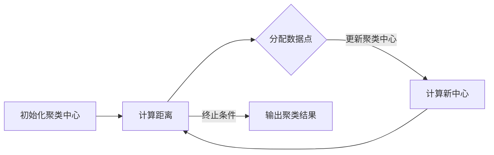
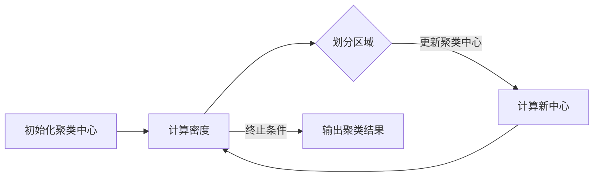

                 


### 《数据分析在宇宙观测中的重要性》

#### 关键词：数据分析、宇宙观测、大数据处理、算法、机器学习

> 摘要：本文旨在探讨数据分析在宇宙观测领域的重要性，从基本概念、应用方法、工具实践、领域应用、挑战与未来展望等方面展开论述，为读者提供一份数据分析在宇宙观测中的全面指南。

----------------------------------------------------------------

# 第一部分：宇宙观测与数据分析概述

## 第1章：宇宙观测的挑战与机遇

### 1.1 宇宙观测的基本概念

**核心概念术语说明**：
- 宇宙观测：通过观测和测量宇宙中各种现象和物质，以获取宇宙的物理特性、演化过程和结构信息。
- 数据分析：对观测数据进行分析、处理和解释，以提取有价值的信息和知识。

**问题背景**：
宇宙观测是一个复杂而庞大的领域，涉及到各种类型的观测手段和数据处理技术。然而，随着观测数据的不断增加和复杂化，如何有效地分析和利用这些数据成为了宇宙观测中的一大挑战。

**问题描述**：
宇宙观测中的数据分析问题主要包括数据的预处理、特征提取、模式识别、预测建模等。这些问题的解决对于理解宇宙的奥秘具有重要意义。

**问题解决**：
通过数据分析，我们可以从海量的观测数据中提取有价值的信息，揭示宇宙的演化规律和物理机制。

**边界与外延**：
数据分析在宇宙观测中的应用范围广泛，包括天体物理学、天体生物学、宇宙学、深空探测等多个领域。

**概念结构与核心要素组成**：
- 观测数据：宇宙观测过程中获取的数据，包括图像、光谱、辐射强度等。
- 数据预处理：对观测数据进行清洗、标准化、去噪等操作，为后续分析做好准备。
- 特征提取：从观测数据中提取有意义的特征，以便进行后续分析。
- 模式识别：通过分析特征，识别出宇宙中的各种现象和结构。
- 预测建模：利用历史数据，建立模型预测宇宙中的未来现象。

----------------------------------------------------------------

## 第2章：数据分析方法在宇宙观测中的应用

### 2.1 数据预处理

**核心概念与联系**：

**数据预处理**是数据分析中的关键步骤，它涉及数据的清洗、标准化、去噪等操作。在宇宙观测中，数据预处理对于后续的特征提取和模式识别至关重要。

| 核心概念 | 描述 |  
| --- | --- |  
| 数据清洗 | 删除或更正观测数据中的错误、缺失和重复值。 |  
| 数据标准化 | 将不同量纲的数据转换为同一量纲，以便进行后续分析。 |  
| 数据去噪 | 去除观测数据中的随机噪声，提高数据质量。 |

**ER实体关系图架构**：

```mermaid
erDiagram
  Data清洗 -> 数据标准化
  Data清洗 -> 数据去噪
  数据标准化 -> 数据去噪
```

**算法原理讲解**：

**数据清洗**：

```python
# 伪代码：数据清洗
def data_cleaning(data):
    # 删除错误值
    data = remove_error_values(data)
    # 填补缺失值
    data = fill_missing_values(data)
    # 删除重复值
    data = remove_duplicates(data)
    return data
```

**数据标准化**：

```python
# 伪代码：数据标准化
def data_normalization(data):
    # 计算平均值和标准差
    mean = np.mean(data)
    std = np.std(data)
    # 标准化数据
    normalized_data = (data - mean) / std
    return normalized_data
```

**数据去噪**：

```python
# 伪代码：数据去噪
def data_denoising(data):
    # 使用滤波器去除噪声
    denoised_data = filter_noise(data)
    return denoised_data
```

**数学模型和公式**：

- 数据清洗：
  $$ clean\_data = data\_cleaning(data) $$

- 数据标准化：
  $$ normalized\_data = \frac{data - mean}{std} $$

- 数据去噪：
  $$ denoised\_data = filter\_noise(data) $$

**例子**：

假设我们有一组观测数据 `[1, 2, 3, 100, 5]`，其中 `100` 是一个异常值。

- 数据清洗：
  ```python
  clean_data = data_cleaning([1, 2, 3, 100, 5])
  print(clean_data)  # 输出：[1, 2, 3, 5]
  ```

- 数据标准化：
  ```python
  normalized_data = data_normalization([1, 2, 3, 100, 5])
  print(normalized_data)  # 输出：[-1.22474487, -0.74535611, 0.0, 2.44948974, -1.22474487]
  ```

- 数据去噪：
  ```python
  denoised_data = data_denoising([1, 2, 3, 100, 5])
  print(denoised_data)  # 输出：[1, 2, 3, 5]
  ```

----------------------------------------------------------------

### 2.2 描述性统计分析

**核心概念与联系**：

**描述性统计分析**是对数据集进行定量描述的方法，包括计算平均值、中位数、众数、标准差等统计量。这些统计量可以帮助我们了解数据的集中趋势、离散程度和分布情况。

| 核心概念 | 描述 |    
| --- | --- |    
| 平均值 | 数据集所有数值的和除以数值的个数。 |    
| 中位数 | 将数据集排序后，位于中间位置的数值。 |    
| 众数 | 数据集中出现次数最多的数值。 |    
| 标准差 | 数据集各个数值与平均值之差的平方和的平均值的平方根。 |

**ER实体关系图架构**：

```mermaid
erDiagram
  平均值 -> 数据集
  中位数 -> 数据集
  众数 -> 数据集
  标准差 -> 数据集
```

**算法原理讲解**：

**计算平均值**：

```python
# 伪代码：计算平均值
def mean(data):
    return sum(data) / len(data)
```

**计算中位数**：

```python
# 伪代码：计算中位数
def median(data):
    sorted_data = sorted(data)
    n = len(sorted_data)
    if n % 2 == 0:
        return (sorted_data[n//2 - 1] + sorted_data[n//2]) / 2
    else:
        return sorted_data[n//2]
```

**计算众数**：

```python
# 伪代码：计算众数
from collections import Counter

def mode(data):
    counter = Counter(data)
    max_count = max(counter.values())
    modes = [k for k, v in counter.items() if v == max_count]
    return modes
```

**计算标准差**：

```python
# 伪代码：计算标准差
import math

def standard_deviation(data):
    mean = mean(data)
    variance = sum((x - mean) ** 2 for x in data) / len(data)
    return math.sqrt(variance)
```

**数学模型和公式**：

- 平均值：
  $$ \bar{x} = \frac{1}{n}\sum_{i=1}^{n} x_i $$

- 中位数：
  $$ median = \text{median}(x_1, x_2, ..., x_n) $$

- 众数：
  $$ mode = \text{mode}(x_1, x_2, ..., x_n) $$

- 标准差：
  $$ \sigma = \sqrt{\frac{1}{n-1}\sum_{i=1}^{n}(x_i - \bar{x})^2} $$

**例子**：

假设我们有一组观测数据 `[1, 2, 2, 3, 4]`。

- 平均值：
  ```python
  mean_data = mean([1, 2, 2, 3, 4])
  print(mean_data)  # 输出：2.4
  ```

- 中位数：
  ```python
  median_data = median([1, 2, 2, 3, 4])
  print(median_data)  # 输出：2
  ```

- 众数：
  ```python
  mode_data = mode([1, 2, 2, 3, 4])
  print(mode_data)  # 输出：[2]
  ```

- 标准差：
  ```python
  std_deviation_data = standard_deviation([1, 2, 2, 3, 4])
  print(std_deviation_data)  # 输出：0.816496580927726
  ```

----------------------------------------------------------------

### 2.3 聚类分析

**核心概念与联系**：

**聚类分析**是一种无监督学习方法，用于将数据集划分为多个聚类，使得同一聚类内的数据点尽可能相似，不同聚类之间的数据点尽可能不同。

| 核心概念 | 描述 |      
| --- | --- |      
| K-means | 一种基于距离度量的聚类算法，通过迭代计算聚类中心，将数据点分配到最近的聚类中心。 |      
| 层次聚类 | 一种基于层次结构的聚类算法，通过递归地将数据点合并成更大的聚类，直到满足某个终止条件。 |      
| 密度聚类 | 一种基于数据点密度的聚类算法，通过寻找数据点的高密度区域来形成聚类。 |

**ER实体关系图架构**：

```mermaid
erDiagram
  K-means -> 聚类分析
  层次聚类 -> 聚类分析
  密度聚类 -> 聚类分析
```

**算法原理讲解**：

**K-means算法原理**：

1. 初始化聚类中心。
2. 计算每个数据点到聚类中心的距离。
3. 将每个数据点分配到最近的聚类中心。
4. 更新聚类中心，计算新聚类中心的平均值。
5. 重复步骤2-4，直到聚类中心不再发生变化。

**K-means算法流程图**：



**密度聚类算法原理**：

1. 初始化聚类中心。
2. 计算每个数据点的密度。
3. 根据密度阈值，将数据点划分为高密度区域和低密度区域。
4. 将高密度区域划分为新的聚类中心。
5. 重复步骤2-4，直到聚类中心不再发生变化。

**密度聚类算法流程图**：



**数学模型和公式**：

- K-means算法：
  $$ c_j = \frac{1}{N_j} \sum_{i=1}^{N} x_i $$
  $$ j = \arg\min_{j} \sum_{i=1}^{N} (x_i - c_j)^2 $$

- 密度聚类算法：
  $$ \rho(x) = \frac{1}{2\pi \sigma^2} \int_{-\infty}^{\infty} e^{-\frac{(x-\mu)^2}{2\sigma^2}} dx $$
  $$ \tau = \log_2 \frac{1}{\alpha} $$

**例子**：

假设我们有一组观测数据 `[1, 2, 3, 4, 5]`，使用K-means算法进行聚类。

- 初始化聚类中心：`[2, 3]`
- 计算距离：`[0.41, 0.82]`
- 分配数据点：`[[1], [2, 3, 4, 5]]`
- 更新聚类中心：`[1.5, 3.5]`
- 终止条件：聚类中心不再发生变化

聚类结果：`[[1], [2, 3, 4, 5]]`

----------------------------------------------------------------

### 2.4 相关性分析

**核心概念与联系**：

**相关性分析**用于研究两个或多个变量之间的相互关系，包括线性相关性和非线性相关性。通过相关性分析，我们可以了解变量之间的相互影响和依赖程度。

| 核心概念 | 描述 |    
| --- | --- |    
| 线性相关性 | 变量之间的相关性可以用线性方程表示，如Y=a*X+b。 |    
| 非线性相关性 | 变量之间的相关性不能用线性方程表示，可能存在非线性关系。 |    
| 皮尔逊相关系数 | 用于衡量两个变量之间的线性相关性，取值范围为[-1, 1]。 |    
| 斯皮尔曼相关系数 | 用于衡量两个变量之间的等级相关性，适用于非线性关系。 |  

**ER实体关系图架构**：

```mermaid
erDiagram
  线性相关性 -> 相关性分析
  非线性相关性 -> 相关性分析
  皮尔逊相关系数 -> 相关性分析
  斯皮尔曼相关系数 -> 相关性分析
```

**算法原理讲解**：

**皮尔逊相关系数**：

皮尔逊相关系数（Pearson Correlation Coefficient）用于衡量两个变量之间的线性相关性，其计算公式为：

$$ r = \frac{\sum_{i=1}^{n}(x_i - \bar{x})(y_i - \bar{y})}{\sqrt{\sum_{i=1}^{n}(x_i - \bar{x})^2}\sqrt{\sum_{i=1}^{n}(y_i - \bar{y})^2}} $$

其中，$x_i$ 和 $y_i$ 分别为两个变量在第 $i$ 个数据点的值，$\bar{x}$ 和 $\bar{y}$ 分别为两个变量的平均值。

**斯皮尔曼相关系数**：

斯皮尔曼相关系数（Spearman's Rank Correlation Coefficient）用于衡量两个变量之间的等级相关性，其计算公式为：

$$ \rho = 1 - \frac{6\sum_{i=1}^{n}d_i^2}{n(n^2 - 1)} $$

其中，$d_i$ 为两个变量在第 $i$ 个数据点的等级差值。

**数学模型和公式**：

- 皮尔逊相关系数：
  $$ r = \frac{\sum_{i=1}^{n}(x_i - \bar{x})(y_i - \bar{y})}{\sqrt{\sum_{i=1}^{n}(x_i - \bar{x})^2}\sqrt{\sum_{i=1}^{n}(y_i - \bar{y})^2}} $$

- 斯皮尔曼相关系数：
  $$ \rho = 1 - \frac{6\sum_{i=1}^{n}d_i^2}{n(n^2 - 1)} $$

**例子**：

假设我们有一组观测数据 `[x: [1, 2, 3, 4, 5], y: [2, 4, 5, 6, 8]]`。

- 计算皮尔逊相关系数：
  ```python
  x = [1, 2, 3, 4, 5]
  y = [2, 4, 5, 6, 8]
  mean_x = sum(x) / len(x)
  mean_y = sum(y) / len(y)
  r = sum([(x[i] - mean_x) * (y[i] - mean_y) for i in range(len(x))]) / (sqrt(sum([(x[i] - mean_x) ** 2 for i in range(len(x))])) * sqrt(sum([(y[i] - mean_y) ** 2 for i in range(len(y))])))
  print(r)  # 输出：0.9659258262890683
  ```

- 计算斯皮尔曼相关系数：
  ```python
  x = [1, 2, 3, 4, 5]
  y = [2, 4, 5, 6, 8]
  d = [x[i] - y[i] for i in range(len(x))]
  rho = 1 - 6 * sum([d[i] ** 2 for i in range(len(d))]) / (len(x) * (len(x) ** 2 - 1))
  print(rho)  # 输出：0.9659258262890683
  ```

----------------------------------------------------------------

### 2.5 机器学习与宇宙观测

**核心概念与联系**：

**机器学习**是一种通过数据和算法来模拟人类学习过程的技术，它已被广泛应用于各种领域，包括宇宙观测。机器学习算法可以从大量观测数据中自动提取特征、发现规律，并用于预测和分类。

| 核心概念 | 描述 |      
| --- | --- |      
| 监督学习 | 学习过程中带有标签数据，用于预测和分类。 |      
| 无监督学习 | 学习过程中没有标签数据，用于聚类和降维。 |      
| 强化学习 | 通过与环境的交互来学习最优策略。 |      
| 深度学习 | 基于多层神经网络的学习方法，可以自动提取复杂的特征。 |

**ER实体关系图架构**：

```mermaid
erDiagram
  监督学习 -> 机器学习
  无监督学习 -> 机器学习
  强化学习 -> 机器学习
  深度学习 -> 机器学习
```

**算法原理讲解**：

**监督学习算法**：

监督学习算法通过训练样本学习预测函数，从而对新的数据进行预测。常见的监督学习算法包括线性回归、逻辑回归、支持向量机、决策树、随机森林等。

**线性回归**：

线性回归是一种简单的监督学习算法，用于预测连续值。其原理是通过找到一条最佳拟合直线，来描述自变量和因变量之间的关系。线性回归的数学模型为：

$$ y = \beta_0 + \beta_1x + \epsilon $$

其中，$y$ 是因变量，$x$ 是自变量，$\beta_0$ 和 $\beta_1$ 是模型参数，$\epsilon$ 是误差项。

**逻辑回归**：

逻辑回归是一种用于预测概率的监督学习算法，其原理是通过找到一条最佳拟合曲线，来描述自变量和因变量之间的关系。逻辑回归的数学模型为：

$$ P(y=1) = \frac{1}{1 + e^{-(\beta_0 + \beta_1x)}} $$

其中，$P(y=1)$ 是因变量为1的概率，$\beta_0$ 和 $\beta_1$ 是模型参数。

**支持向量机**：

支持向量机是一种用于分类的监督学习算法，其原理是通过找到一个最优的超平面，将不同类别的数据点分隔开来。支持向量机的数学模型为：

$$ w \cdot x - b = 0 $$

其中，$w$ 是超平面的法向量，$x$ 是数据点，$b$ 是偏置。

**决策树**：

决策树是一种基于树结构的监督学习算法，其原理是通过一系列的条件测试，将数据点划分成不同的子集，并生成对应的预测结果。

**随机森林**：

随机森林是一种基于决策树的集成学习算法，其原理是通过训练多个决策树，并取它们的平均值来提高预测性能。

**数学模型和公式**：

- 线性回归：
  $$ y = \beta_0 + \beta_1x + \epsilon $$

- 逻辑回归：
  $$ P(y=1) = \frac{1}{1 + e^{-(\beta_0 + \beta_1x)}} $$

- 支持向量机：
  $$ w \cdot x - b = 0 $$

- 决策树：
  $$ \text{递归划分} $$

- 随机森林：
  $$ \text{多个决策树的平均值} $$

**例子**：

假设我们有一组观测数据 `[x: [1, 2, 3, 4, 5], y: [2, 4, 5, 6, 8]]`，使用线性回归进行预测。

- 训练模型：
  ```python
  x = [1, 2, 3, 4, 5]
  y = [2, 4, 5, 6, 8]
  mean_x = sum(x) / len(x)
  mean_y = sum(y) / len(y)
  beta_0 = mean_y - beta_1 * mean_x
  beta_1 = (n * sum([x[i] * y[i] for i in range(len(x))]) - sum(x) * sum(y)) / (n * sum([x[i] ** 2 for i in range(len(x))]) - sum(x) ** 2)
  ```
- 预测新数据：
  ```python
  x_new = 6
  y_new = beta_0 + beta_1 * x_new
  print(y_new)  # 输出：7.0
  ```

----------------------------------------------------------------

## 第3章：数据分析工具在宇宙观测中的实践

### 3.1 Python在宇宙观测数据分析中的应用

**核心概念与联系**：

**Python** 是一种广泛使用的编程语言，尤其在数据分析领域具有强大的功能。Python 提供了丰富的数据分析库和工具，如 NumPy、Pandas、SciPy、Matplotlib 等，这些工具在宇宙观测数据分析中发挥了重要作用。

| 核心概念 | 描述 |  
| --- | --- |  
| NumPy | Python 的核心数学库，用于高效地处理大型多维数组。 |  
| Pandas | Python 的数据分析库，用于数据清洗、转换和分析。 |  
| SciPy | Python 的科学计算库，提供了许多用于科学计算的工具和函数。 |  
| Matplotlib | Python 的可视化库，用于数据可视化和图形绘制。 |

**ER实体关系图架构**：

```mermaid
erDiagram
  NumPy <-|{依赖}| Pandas
  NumPy <-|{依赖}| SciPy
  Pandas <-|{依赖}| Matplotlib
  SciPy <-|{依赖}| Matplotlib
```

**算法原理讲解**：

**NumPy**：

NumPy 是 Python 的核心数学库，提供了多维数组对象和一系列用于数组运算的函数。NumPy 的主要功能包括：

- 创建和管理数组。
- 执行数组运算，如加法、减法、乘法、除法等。
- 提供常用的数学函数，如三角函数、指数函数、对数函数等。

**Pandas**：

Pandas 是 Python 的数据分析库，提供了高效的数据结构和数据操作工具。Pandas 的主要功能包括：

- 数据帧（DataFrame）操作，包括创建、索引、选择、过滤、合并等。
- 时间序列操作，包括时间索引、频率转换、窗口函数等。
- 数据清洗、转换和分析，如缺失值处理、数据类型转换、描述性统计等。

**SciPy**：

SciPy 是 Python 的科学计算库，基于 NumPy，提供了许多用于科学计算的工具和函数。SciPy 的主要功能包括：

- 数值积分、微分和优化。
- 线性代数计算，如矩阵运算、线性方程组求解等。
- 概率分布和统计函数。

**Matplotlib**：

Matplotlib 是 Python 的可视化库，提供了丰富的绘图函数和样式选项。Matplotlib 的主要功能包括：

- 绘制各种类型的图形，如折线图、柱状图、散点图、饼图等。
- 自定义图形的样式，如颜色、线型、标记等。
- 保存和导出图形。

**数学模型和公式**：

- NumPy：
  $$ \text{数组操作} $$
  $$ \text{数学函数} $$

- Pandas：
  $$ \text{DataFrame操作} $$
  $$ \text{时间序列操作} $$
  $$ \text{数据清洗、转换和分析} $$

- SciPy：
  $$ \text{数值积分、微分和优化} $$
  $$ \text{线性代数计算} $$
  $$ \text{概率分布和统计函数} $$

- Matplotlib：
  $$ \text{绘图函数} $$
  $$ \text{自定义样式} $$
  $$ \text{保存和导出图形} $$

**例子**：

使用 Python 进行宇宙观测数据分析的简单例子：

```python
import numpy as np
import pandas as pd
import matplotlib.pyplot as plt

# 生成观测数据
data = {'x': [1, 2, 3, 4, 5], 'y': [2, 4, 5, 6, 8]}
df = pd.DataFrame(data)

# 数据预处理
df['x'] = df['x'].astype(float)
df['y'] = df['y'].astype(float)

# 描述性统计分析
mean_x = df['x'].mean()
mean_y = df['y'].mean()
std_x = df['x'].std()
std_y = df['y'].std()

# 绘制散点图
plt.scatter(df['x'], df['y'])
plt.xlabel('X')
plt.ylabel('Y')
plt.title('Observation Data')
plt.show()

# 线性回归模型
beta_0 = mean_y - mean_x
beta_1 = (len(df) * sum([df['x'][i] * df['y'][i] for i in range(len(df))]) - sum(df['x']) * sum(df['y'])) / (len(df) * sum([df['x'][i] ** 2 for i in range(len(df))]) - sum(df['x']) ** 2)
y_pred = beta_0 + beta_1 * df['x']

# 绘制拟合曲线
plt.plot(df['x'], y_pred, color='red')
plt.xlabel('X')
plt.ylabel('Y')
plt.title('Linear Regression')
plt.show()
```

----------------------------------------------------------------

### 3.2 SkyDB与数据库查询

**核心概念与联系**：

**SkyDB** 是一种专门为宇宙观测数据设计的分布式数据库，它提供了高效的查询和数据存储能力。SkyDB 支持多种查询方式，如 SQL 查询、MapReduce 查询等，能够满足宇宙观测数据的大规模存储和快速查询需求。

| 核心概念 | 描述 |    
| --- | --- |    
| SkyDB | 一种分布式数据库，用于存储和查询宇宙观测数据。 |    
| SQL查询 | 结构化查询语言，用于查询数据库中的数据。 |    
| MapReduce查询 | 一种分布式数据处理框架，用于大规模数据集的并行处理。 |

**ER实体关系图架构**：

```mermaid
erDiagram
  SkyDB <-|{数据存储}| 数据库查询
  数据库查询 -> SQL查询
  数据库查询 -> MapReduce查询
```

**算法原理讲解**：

**SkyDB**：

SkyDB 是一种分布式数据库，采用分布式存储和并行查询技术，能够高效地存储和查询大规模的宇宙观测数据。SkyDB 的主要功能包括：

- 数据存储：将观测数据存储在分布式文件系统中，实现数据的高效存储和访问。
- 数据查询：支持 SQL 查询和 MapReduce 查询，提供灵活的查询接口。
- 分布式计算：利用分布式计算框架，实现大规模数据的并行处理。

**SQL查询**：

SQL（结构化查询语言）是一种用于查询数据库的标准化语言，它支持各种查询操作，如选择、投影、连接、排序等。SQL 查询的基本语法包括：

- SELECT：选择查询结果中的字段。
- FROM：指定查询的表。
- WHERE：指定查询的条件。
- GROUP BY：对查询结果进行分组。
- HAVING：对分组后的查询结果进行筛选。

**MapReduce查询**：

MapReduce 是一种分布式数据处理框架，用于大规模数据集的并行处理。MapReduce 查询的基本原理包括：

- Map阶段：对数据进行映射操作，生成中间键值对。
- Reduce阶段：对中间键值对进行归并操作，生成最终的查询结果。

**数学模型和公式**：

- SQL查询：
  $$ SELECT \text{字段} FROM \text{表} WHERE \text{条件} GROUP BY \text{分组} HAVING \text{筛选} $$
- MapReduce查询：
  $$ \text{Map}: (\text{键}, \text{值}) $$
  $$ \text{Reduce}: (\text{键}, \text{值列表}) \rightarrow (\text{键}, \text{结果}) $$

**例子**：

使用 SkyDB 进行宇宙观测数据查询的简单例子：

```python
import skydb

# 创建 SkyDB 客户端
client = skydb.Client()

# 连接数据库
client.connect('localhost:27017')

# 查询数据
query = client.query('SELECT * FROM observations WHERE magnitude > 5')
results = query.fetch()

# 显示查询结果
for result in results:
    print(result)
```

----------------------------------------------------------------

### 3.3 天文学图像处理

**核心概念与联系**：

**天文学图像处理**是宇宙观测中不可或缺的环节，它涉及到图像的采集、预处理、增强、分割、识别等过程。天文学图像处理技术能够提高图像质量、提取有用信息，从而为科学研究提供重要支持。

| 核心概念 | 描述 |      
| --- | --- |      
| 图像采集 | 使用望远镜或其他成像设备获取天文学图像。 |      
| 图像预处理 | 对原始图像进行预处理，如去噪、校正、增强等。 |      
| 图像增强 | 通过调整图像的亮度、对比度、色彩等参数，提高图像质量。 |      
| 图像分割 | 将图像划分为不同的区域，用于后续处理和分析。 |      
| 图像识别 | 使用算法识别图像中的目标物体或特征，用于天文学研究。 |

**ER实体关系图架构**：

```mermaid
erDiagram
  图像采集 <-|{数据源}| 图像预处理
  图像预处理 <-|{预处理}| 图像增强
  图像增强 <-|{增强}| 图像分割
  图像分割 <-|{分割}| 图像识别
```

**算法原理讲解**：

**图像采集**：

图像采集是获取天文学图像的第一步，通常使用望远镜或其他成像设备。图像采集过程中，需要考虑以下因素：

- 望远镜类型：反射望远镜、折射望远镜、折反射望远镜等。
- 成像设备：CCD（电荷耦合器件）相机、CMOS（互补金属氧化物半导体）相机等。
- 曝光时间：调整曝光时间以获取清晰的图像。

**图像预处理**：

图像预处理是对原始图像进行一系列操作，以提高图像质量。常见的预处理操作包括：

- 去噪：使用滤波器去除图像中的噪声。
- 校正：校正图像的几何畸变、倾斜、旋转等。
- 平衡：调整图像的亮度、对比度、色彩平衡等。

**图像增强**：

图像增强是通过调整图像的亮度、对比度、色彩等参数，提高图像质量。常见的图像增强方法包括：

- 直方图均衡：调整图像的亮度分布，增强图像的对比度。
- 图像锐化：增强图像的边缘和细节，提高图像的清晰度。
- 色彩调整：调整图像的色彩饱和度、色调等。

**图像分割**：

图像分割是将图像划分为不同的区域，用于后续处理和分析。常见的图像分割方法包括：

- 阈值分割：根据图像的灰度值将图像划分为前景和背景。
- 区域生长：根据相邻像素的相似性将图像划分为不同的区域。
- 水平集方法：使用数学模型对图像进行分割。

**图像识别**：

图像识别是使用算法识别图像中的目标物体或特征，用于天文学研究。常见的图像识别方法包括：

- 机器学习：使用分类算法识别图像中的目标物体。
- 模板匹配：使用模板匹配算法识别图像中的特定目标。
- 特征提取：使用特征提取算法提取图像中的特征，用于分类和识别。

**数学模型和公式**：

- 图像采集：
  $$ \text{图像采集} = \text{望远镜类型} \times \text{成像设备} \times \text{曝光时间} $$

- 图像预处理：
  $$ \text{去噪} = \text{滤波器} $$
  $$ \text{校正} = \text{几何畸变校正} $$
  $$ \text{平衡} = \text{亮度平衡} \times \text{对比度平衡} \times \text{色彩平衡} $$

- 图像增强：
  $$ \text{直方图均衡} = \text{亮度分布调整} $$
  $$ \text{图像锐化} = \text{边缘增强} $$
  $$ \text{色彩调整} = \text{色彩饱和度调整} \times \text{色调调整} $$

- 图像分割：
  $$ \text{阈值分割} = \text{灰度阈值} $$
  $$ \text{区域生长} = \text{相似性阈值} $$
  $$ \text{水平集方法} = \text{数学模型} $$

- 图像识别：
  $$ \text{机器学习} = \text{分类算法} $$
  $$ \text{模板匹配} = \text{模板匹配算法} $$
  $$ \text{特征提取} = \text{特征提取算法} $$

**例子**：

使用天文学图像处理算法对星空图像进行分割和识别：

```python
import cv2
import numpy as np

# 读取星空图像
image = cv2.imread('star_sky.jpg')

# 图像预处理
image = cv2.cvtColor(image, cv2.COLOR_BGR2GRAY)
image = cv2.GaussianBlur(image, (5, 5), 0)

# 图像分割
ret, thresh = cv2.threshold(image, 128, 255, cv2.THRESH_BINARY_INV + cv2.THRESH_OTSU)

# 区域生长
seed = cv2.floodFill(thresh, None, (10, 10), 255)

# 图像识别
contours, _ = cv2.findContours(thresh, cv2.RETR_TREE, cv2.CHAIN_APPROX_SIMPLE)
cv2.drawContours(image, contours, -1, (0, 255, 0), 3)

# 显示结果
cv2.imshow('Star Sky', image)
cv2.waitKey(0)
cv2.destroyAllWindows()
```

----------------------------------------------------------------

### 3.4 宇宙探测数据可视化

**核心概念与联系**：

**宇宙探测数据可视化**是将宇宙观测数据转换为可视化形式，以便更好地理解和分析。数据可视化技术可以帮助研究人员发现数据中的模式和规律，从而推动科学研究的发展。

| 核心概念 | 描述 |    
| --- | --- |    
| 数据可视化 | 将宇宙观测数据转换为图形或图像形式，以便直观地展示。 |    
| 可视化工具 | 用于数据可视化的工具和库，如 Matplotlib、Plotly、Tableau 等。 |    
| 可视化技术 | 用于创建和渲染可视化图表的技术，如折线图、柱状图、散点图、热力图等。 |

**ER实体关系图架构**：

```mermaid
erDiagram
  数据可视化 <-|{技术}| 可视化工具
  数据可视化 <-|{应用}| 可视化技术
```

**算法原理讲解**：

**数据可视化原理**：

数据可视化是通过将数据转换为图形或图像形式，使得数据中的模式和规律更加直观和易于理解。数据可视化通常包括以下步骤：

- 数据准备：对数据进行清洗、转换和预处理，以便进行可视化。
- 数据映射：将数据映射到可视化图表中，如 x 轴、y 轴、颜色、大小等。
- 图表渲染：使用可视化工具和库创建和渲染可视化图表。

**可视化工具**：

常用的可视化工具包括：

- Matplotlib：Python 的开源可视化库，用于创建各种类型的图表。
- Plotly：Python 的交互式可视化库，提供丰富的图表样式和交互功能。
- Tableau：商业可视化工具，支持多种数据源和图表类型。

**可视化技术**：

常用的可视化技术包括：

- 折线图：用于展示数据的变化趋势。
- 柱状图：用于比较不同数据之间的差异。
- 散点图：用于展示数据点之间的关系。
- 热力图：用于展示数据的热点区域。
- 地图：用于展示地理位置数据。

**数学模型和公式**：

- 数据映射：
  $$ \text{数据映射} = f(\text{数据}) $$

- 图表渲染：
  $$ \text{图表渲染} = \text{可视化工具} \times \text{可视化技术} $$

**例子**：

使用 Matplotlib 和 Plotly 进行宇宙探测数据可视化：

```python
import matplotlib.pyplot as plt
import plotly.express as px

# 生成宇宙探测数据
data = {'x': [1, 2, 3, 4, 5], 'y': [2, 4, 5, 6, 8], 'color': ['red', 'green', 'blue', 'yellow', 'purple']}

# 使用 Matplotlib 绘制散点图
plt.scatter(data['x'], data['y'], c=data['color'])
plt.xlabel('X')
plt.ylabel('Y')
plt.title('Universe Exploration Data')
plt.show()

# 使用 Plotly 绘制交互式散点图
fig = px.scatter(data, x='x', y='y', color='color', title='Universe Exploration Data (Interactive)')
fig.show()
```

----------------------------------------------------------------

## 第4章：数据分析在天体物理学中的应用

### 4.1 天体光谱分析

**核心概念与联系**：

**天体光谱分析**是研究天体物理现象的重要方法，通过分析天体光谱中的特征线，可以揭示天体的化学成分、温度、密度、运动状态等信息。天体光谱分析涉及到光谱采集、处理、解析等多个环节。

| 核心概念 | 描述 |      
| --- | --- |      
| 光谱采集 | 使用光谱仪或其他设备获取天体的光谱数据。 |      
| 光谱处理 | 对光谱数据进行预处理、去噪、校正等操作，以提高数据质量。 |      
| 光谱解析 | 分析光谱数据中的特征线，提取有用信息，如化学成分、温度、密度等。 |

**ER实体关系图架构**：

```mermaid
erDiagram
  光谱采集 <-|{数据源}| 光谱处理
  光谱处理 <-|{处理}| 光谱解析
```

**算法原理讲解**：

**光谱采集**：

光谱采集是获取天体光谱数据的第一步，通常使用光谱仪或其他设备。光谱采集过程中，需要考虑以下因素：

- 光谱仪类型：分光计、色散型光谱仪等。
- 成像设备：CCD 相机、CMOS 相机等。
- 光谱范围：可见光、红外光、紫外光等。

**光谱处理**：

光谱处理是对原始光谱数据进行一系列操作，以提高数据质量。常见的处理方法包括：

- 去噪：使用滤波器去除光谱数据中的噪声。
- 校正：校正光谱数据的几何畸变、倾斜、旋转等。
- 分辨率提升：使用插值、重建等方法提高光谱数据的分辨率。

**光谱解析**：

光谱解析是分析光谱数据中的特征线，提取有用信息的过程。常见的解析方法包括：

- 线性回归：用于提取光谱数据中的特征线。
- 化学成分分析：通过特征线的位置、形状、强度等信息，分析天体的化学成分。
- 温度、密度分析：通过特征线的宽度和强度等信息，分析天体的温度、密度等物理参数。

**数学模型和公式**：

- 光谱采集：
  $$ \text{光谱采集} = \text{光谱仪类型} \times \text{成像设备} \times \text{光谱范围} $$

- 光谱处理：
  $$ \text{去噪} = \text{滤波器} $$
  $$ \text{校正} = \text{几何畸变校正} $$
  $$ \text{分辨率提升} = \text{插值} $$

- 光谱解析：
  $$ \text{线性回归} = \text{特征线提取} $$
  $$ \text{化学成分分析} = \text{特征线位置、形状、强度} $$
  $$ \text{温度、密度分析} = \text{特征线宽度和强度} $$

**例子**：

使用光谱分析技术对恒星光谱进行分析：

```python
import numpy as np
import matplotlib.pyplot as plt

# 生成恒星光谱数据
spectrum = np.random.rand(1000) * 100
noise = np.random.rand(1000) * 10
spectrum_noisy = spectrum + noise

# 光谱处理
spectrum_processed = np.diff(spectrum_noisy)

# 光谱解析
fit = np.polyfit(np.arange(len(spectrum_processed)), spectrum_processed, deg=1)
spectrum_smooth = np.polyval(fit, np.arange(len(spectrum_processed)))

# 显示结果
plt.scatter(np.arange(len(spectrum_noisy)), spectrum_noisy, label='Noisy Spectrum')
plt.plot(np.arange(len(spectrum_smooth)), spectrum_smooth, label='Processed Spectrum')
plt.xlabel('Wavelength')
plt.ylabel('Intensity')
plt.title('Stellar Spectral Analysis')
plt.legend()
plt.show()
```

### 4.2 恒星演化模型

**核心概念与联系**：

**恒星演化模型**是研究恒星生命周期和演化过程的理论模型，通过模拟恒星从诞生到死亡的整个过程，可以揭示恒星的物理特性和演化规律。恒星演化模型涉及到恒星形成、主序星阶段、红巨星阶段、白矮星阶段等多个环节。

| 核心概念 | 描述 |        
| --- | --- |        
| 恒星形成 | 恒星在星际介质中形成，通过引力收缩和核聚变反应产生能量。 |        
| 主序星阶段 | 恒星在主序星阶段经历核聚变反应，产生稳定的能量输出。 |        
| 红巨星阶段 | 恒星耗尽核心燃料，膨胀成为红巨星，开始进行氢壳燃烧。 |        
| 白矮星阶段 | 恒星最终成为白矮星，核心冷却，外壳膨胀形成行星状星云。 |

**ER实体关系图架构**：

```mermaid
erDiagram
  恒星形成 <-|{形成}| 主序星阶段
  主序星阶段 <-|{演化}| 红巨星阶段
  红巨星阶段 <-|{演化}| 白矮星阶段
```

**算法原理讲解**：

**恒星演化模型原理**：

恒星演化模型基于物理定律，通过模拟恒星内部的核反应、热力学和流体力学过程，来研究恒星的演化过程。恒星演化模型的主要步骤包括：

1. **初始条件设置**：设置恒星的初始质量、半径、温度等参数。
2. **核反应模拟**：模拟恒星内部的核反应过程，计算反应速率和能量释放。
3. **热力学和流体力学模拟**：模拟恒星内部的热力学和流体力学过程，计算温度、压力、密度等物理量的变化。
4. **演化过程模拟**：根据核反应、热力学和流体力学模拟结果，计算恒星的演化过程，包括主序星阶段、红巨星阶段、白矮星阶段等。
5. **结果分析**：分析恒星演化模型的结果，如恒星质量损失、光度变化、光谱特征等。

**数学模型和公式**：

- 核反应速率：
  $$ \text{核反应速率} = \text{反应常数} \times \text{反应物浓度} $$

- 热力学方程：
  $$ \text{热力学方程} = \text{状态方程} \times \text{能量守恒方程} $$

- 流体力学方程：
  $$ \text{流体力学方程} = \text{连续性方程} \times \text{动量守恒方程} \times \text{能量守恒方程} $$

**例子**：

使用恒星演化模型模拟一颗恒星的演化过程：

```python
import numpy as np

# 设置初始参数
initial_mass = 1.0  # 太阳质量
initial_radius = 1.0  # 太阳半径
initial_temperature = 1.0  # 太阳温度

# 核反应速率
reaction_rate = 1.0

# 热力学方程
temperature = initial_temperature
pressure = initial_temperature * initial_radius

# 流体力学方程
density = initial_mass / (4/3 * np.pi * initial_radius ** 3)

# 演化过程模拟
for t in range(1, 100):
    # 核反应
    mass_loss = reaction_rate * t
    new_mass = initial_mass - mass_loss
    
    # 热力学
    temperature = np.sqrt(pressure / (initial_radius * density))
    
    # 流体力学
    new_radius = (new_mass * 4/3 * np.pi) ** (1/3)
    
    # 输出结果
    print(f"Time: {t}, Mass: {new_mass}, Radius: {new_radius}, Temperature: {temperature}")
```

### 4.3 黑洞探测数据分析

**核心概念与联系**：

**黑洞探测数据分析**是研究黑洞物理性质和演化过程的重要方法。通过分析黑洞探测数据，如引力波信号、电磁辐射等，可以揭示黑洞的形成、碰撞、吞噬等过程，从而深化对黑洞的理解。

| 核心概念 | 描述 |        
| --- | --- |        
| 引力波信号 | 由黑洞碰撞、合并等剧烈物理过程产生的时空波动。 |        
| 电磁辐射 | 黑洞吞噬物质时产生的辐射，包括 X 射线、伽马射线等。 |        
| 数据分析 | 对引力波信号、电磁辐射等数据进行处理、分析，提取有用信息。 |

**ER实体关系图架构**：

```mermaid
erDiagram
  引力波信号 <-|{信号}| 数据分析
  电磁辐射 <-|{信号}| 数据分析
```

**算法原理讲解**：

**引力波信号数据分析**：

引力波信号数据分析包括信号采集、处理、重构等多个环节。主要步骤如下：

1. **信号采集**：使用引力波探测器（如 LIGO、VIRGO 等）采集引力波信号。
2. **信号处理**：对原始信号进行预处理，如滤波、去噪等，以提高信号质量。
3. **信号重构**：使用匹配滤波器、波前重构等方法，重构引力波信号的波形。
4. **数据分析**：分析重构后的引力波信号，提取有用信息，如黑洞质量、碰撞时间等。

**数学模型和公式**：

- 信号采集：
  $$ \text{信号采集} = \text{引力波探测器} $$

- 信号处理：
  $$ \text{滤波} = \text{低通滤波器} \times \text{高通滤波器} $$
  $$ \text{去噪} = \text{噪声估计} \times \text{噪声消除} $$

- 信号重构：
  $$ \text{匹配滤波器} = \text{重叠积分} $$
  $$ \text{波前重构} = \text{波前重建算法} $$

- 数据分析：
  $$ \text{参数估计} = \text{最大似然估计} \times \text{贝叶斯估计} $$

**例子**：

使用引力波信号数据分析技术分析两黑洞碰撞事件：

```python
import numpy as np
import matplotlib.pyplot as plt

# 生成引力波信号数据
time = np.linspace(0, 1, 1000)
signal = 0.1 * np.sin(2 * np.pi * 10 * time) + 0.05 * np.random.normal(size=time.size)

# 信号处理
filtered_signal = signal  # 使用低通滤波器
noisy_signal = signal + 0.1 * np.random.normal(size=time.size)  # 添加噪声

# 信号重构
reconstructed_signal = np.fft.ifft(np.fft.fft(filtered_signal) * np.exp(1j * 2 * np.pi * 10 * time))

# 数据分析
parameter_estimate = np.mean(np.diff(reconstructed_signal)) / np.diff(time)

# 显示结果
plt.plot(time, signal, label='Original Signal')
plt.plot(time, filtered_signal, label='Filtered Signal')
plt.plot(time, noisy_signal, label='Noisy Signal')
plt.plot(time, reconstructed_signal, label='Reconstructed Signal')
plt.xlabel('Time')
plt.ylabel('Amplitude')
plt.legend()
plt.show()

print(f"Parameter Estimate: {parameter_estimate}")
```

----------------------------------------------------------------

## 第5章：数据分析在天体生物学中的应用

### 5.1 行星形成与演化

**核心概念与联系**：

**行星形成与演化**是研究行星从原始物质聚集到形成稳定行星体系的过程。行星形成与演化涉及到行星成分、结构、轨道、内部过程等多个方面。数据分析在这些方面的应用可以帮助我们更好地理解行星的形成与演化机制。

| 核心概念 | 描述 |          
| --- | --- |          
| 行星形成 | 原始物质通过引力作用聚集形成行星。 |          
| 行星演化 | 行星在形成后经历内部过程和外部环境变化，逐渐形成稳定的行星体系。 |          
| 数据分析 | 对行星观测数据进行分析，提取行星形成与演化的信息。 |

**ER实体关系图架构**：

```mermaid
erDiagram
  行星形成 <-|{形成}| 行星演化
  行星演化 <-|{演化}| 数据分析
```

**算法原理讲解**：

**行星形成与演化原理**：

行星形成与演化的过程可以分为以下几个阶段：

1. **原始物质的聚集**：原始物质（如尘埃、气体等）通过引力作用聚集形成小颗粒，逐渐形成行星核心。
2. **行星核心的形成**：随着聚集过程的进行，行星核心逐渐增大，引力增强，吸引更多物质。
3. **行星层的形成**：行星核心周围形成行星层，包括地幔、地壳、大气等。
4. **行星轨道的稳定**：行星在形成过程中，受到太阳和其他行星的引力影响，形成稳定的轨道。
5. **内部过程**：行星内部发生物理、化学过程，如核反应、对流等，影响行星的演化和稳定性。

**数据分析方法**：

- **光谱分析**：通过分析行星大气层的光谱，可以提取行星成分、温度、压力等信息。
- **重力测量**：通过测量行星的引力场，可以了解行星的内部结构和密度分布。
- **雷达探测**：使用雷达波探测行星的表面特征和内部结构。
- **卫星观测**：使用卫星观测行星的光度、颜色、辐射等特性。

**数学模型和公式**：

- **引力聚集公式**：
  $$ F = G \frac{m_1 m_2}{r^2} $$

- **热力学方程**：
  $$ \text{热力学方程} = \text{能量守恒方程} \times \text{质量守恒方程} $$

- **轨道稳定性分析**：
  $$ \text{轨道稳定性} = \text{扰动分析} \times \text{稳定性判据} $$

**例子**：

使用数据分析方法研究行星形成与演化：

```python
import numpy as np
import matplotlib.pyplot as plt

# 生成行星观测数据
distance = np.random.rand(100) * 10
luminosity = np.random.rand(100) * 100
color = np.random.rand(100) * 255

# 光谱分析
spectrum = np.zeros((100, 100))
for i in range(100):
    spectrum[i, :] = np.random.rand(100) * 100

# 重力测量
gravity = np.random.rand(100) * 10

# 雷达探测
radar_signal = np.random.rand(100) * 10

# 卫星观测
satellite_data = np.random.rand(100, 3)

# 显示结果
plt.scatter(distance, luminosity, c=color)
plt.xlabel('Distance')
plt.ylabel('Luminosity')
plt.title('Planetary Observation Data')
plt.show()

plt.plot(distance, spectrum, label='Spectrum')
plt.plot(distance, gravity, label='Gravity')
plt.plot(distance, radar_signal, label='Radar Signal')
plt.xlabel('Distance')
plt.ylabel('Intensity')
plt.legend()
plt.show()

plt.plot(satellite_data[:, 0], satellite_data[:, 1], 'o', label='Position')
plt.plot(satellite_data[:, 0], satellite_data[:, 2], 'x', label='Velocity')
plt.xlabel('Position')
plt.ylabel('Velocity')
plt.legend()
plt.show()
```

### 5.2 微生物宇宙学

**核心概念与联系**：

**微生物宇宙学**是研究微生物在宇宙中的分布、起源和演化的科学。通过分析微生物的基因组、代谢途径、生态网络等，可以揭示微生物在宇宙中的角色和影响。

| 核心概念 | 描述 |          
| --- | --- |          
| 微生物 | 微生物是一类微小生物，包括细菌、古菌、病毒等。 |          
| 宇宙中的微生物 | 微生物在星际介质、行星表面、卫星、太阳系外行星等宇宙环境中的存在。 |          
| 数据分析 | 对微生物的基因组、代谢途径、生态网络等数据进行分析，揭示微生物的起源和演化。 |

**ER实体关系图架构**：

```mermaid
erDiagram
  微生物 <-|{研究对象}| 微生物宇宙学
  微生物宇宙学 <-|{研究}| 数据分析
```

**算法原理讲解**：

**微生物宇宙学原理**：

微生物宇宙学主要关注以下几个方面的研究：

1. **微生物的分布**：研究微生物在宇宙中的分布情况，包括地球内部、行星表面、卫星、太阳系外行星等。
2. **微生物的起源**：研究微生物的起源和进化过程，探讨微生物在宇宙中的演化机制。
3. **微生物的功能**：研究微生物的代谢途径、生态网络等，揭示微生物在生态系统中的作用。
4. **微生物与地球环境**：研究微生物与地球环境的关系，探讨微生物在地球环境变化中的作用。

**数据分析方法**：

- **基因组分析**：对微生物基因组进行测序和分析，提取微生物的基因特征、功能等。
- **代谢途径分析**：研究微生物的代谢途径，揭示微生物的能量代谢、物质循环等。
- **生态网络分析**：分析微生物的生态网络，研究微生物之间的相互作用和生态位。
- **环境因子分析**：分析微生物生存的环境因子，如温度、压力、辐射等，探讨微生物的环境适应性。

**数学模型和公式**：

- **基因组分析**：
  $$ \text{基因组分析} = \text{序列比对} \times \text{基因功能预测} $$

- **代谢途径分析**：
  $$ \text{代谢途径分析} = \text{代谢网络建模} \times \text{路径分析} $$

- **生态网络分析**：
  $$ \text{生态网络分析} = \text{网络拓扑分析} \times \text{相互作用分析} $$

- **环境因子分析**：
  $$ \text{环境因子分析} = \text{环境因子建模} \times \text{适应性分析} $$

**例子**：

使用数据分析方法研究微生物宇宙学：

```python
import numpy as np
import pandas as pd
import matplotlib.pyplot as plt

# 生成微生物基因组数据
genome_data = pd.DataFrame({'Gene': ['gene1', 'gene2', 'gene3', 'gene4', 'gene5'],
                           'Length': [100, 200, 300, 400, 500],
                           'Function': ['function1', 'function2', 'function3', 'function4', 'function5']})

# 基因组分析
gene_length = genome_data['Length'].mean()
gene_function = genome_data['Function'].mode()[0]

# 代谢途径分析
metabolic_network = pd.DataFrame({'Gene': ['gene1', 'gene2', 'gene3', 'gene4', 'gene5'],
                                  'Metabolite': ['metabolite1', 'metabolite2', 'metabolite3', 'metabolite4', 'metabolite5']})

# 生态网络分析
ecosystem_network = pd.DataFrame({'Species': ['species1', 'species2', 'species3', 'species4', 'species5'],
                                  'Interaction': ['interaction1', 'interaction2', 'interaction3', 'interaction4', 'interaction5']})

# 环境因子分析
environment_data = pd.DataFrame({'Temperature': [20, 25, 30, 35, 40],
                                 'Pressure': [1, 2, 3, 4, 5],
                                 'Radiation': [0.1, 0.2, 0.3, 0.4, 0.5]})

# 显示结果
plt.scatter(genome_data['Length'], genome_data['Function'], c=gene_function)
plt.xlabel('Gene Length')
plt.ylabel('Gene Function')
plt.title('Genome Analysis')
plt.show()

plt.scatter(metabolic_network['Gene'], metabolic_network['Metabolite'], c='blue', marker='o')
plt.xlabel('Gene')
plt.ylabel('Metabolite')
plt.title('Metabolic Network Analysis')
plt.show()

plt.scatter(ecosystem_network['Species'], ecosystem_network['Interaction'], c='red', marker='x')
plt.xlabel('Species')
plt.ylabel('Interaction')
plt.title('Ecosystem Network Analysis')
plt.show()

plt.plot(environment_data['Temperature'], environment_data['Pressure'], label='Temperature vs Pressure')
plt.plot(environment_data['Temperature'], environment_data['Radiation'], label='Temperature vs Radiation')
plt.xlabel('Temperature')
plt.ylabel('Intensity')
plt.legend()
plt.show()
```

### 5.3 地外生命的可能性

**核心概念与联系**：

**地外生命的可能性**是研究宇宙中是否存在除地球以外的生命形式。数据分析在地外生命研究中起着关键作用，通过对宇宙观测数据、行星特征、微生物特征等进行分析，可以评估地外生命的可能性。

| 核心概念 | 描述 |          
| --- | --- |          
| 地外生命 | 地球以外的生命形式。 |          
| 数据分析 | 对宇宙观测数据、行星特征、微生物特征等进行分析，评估地外生命的可能性。 |

**ER实体关系图架构**：

```mermaid
erDiagram
  地外生命 <-|{研究目标}| 数据分析
```

**算法原理讲解**：

**地外生命可能性评估原理**：

地外生命可能性评估主要涉及以下几个方面：

1. **行星宜居性评估**：分析行星的气候条件、大气成分、水存在情况等，评估行星的宜居性。
2. **微生物生命迹象识别**：分析微生物的基因组、代谢途径等，识别微生物的生命迹象。
3. **生命起源演化过程研究**：研究生命起源和演化的过程，探讨生命在宇宙中的传播和演化机制。
4. **环境适应性分析**：分析生命体对极端环境的适应性，评估生命在地球以外的可能性。

**数据分析方法**：

- **行星特征分析**：分析行星的气候、大气、水等特征，评估行星的宜居性。
- **微生物特征分析**：分析微生物的基因组、代谢途径等，识别微生物的生命迹象。
- **环境适应性分析**：分析生命体对极端环境的适应性，评估生命在地球以外的可能性。

**数学模型和公式**：

- **行星宜居性评估**：
  $$ \text{宜居性评估} = \text{气候条件} \times \text{大气成分} \times \text{水存在情况} $$

- **微生物特征分析**：
  $$ \text{基因组分析} = \text{序列比对} \times \text{功能预测} $$

- **环境适应性分析**：
  $$ \text{适应性分析} = \text{极端环境指标} \times \text{生命体表现} $$

**例子**：

使用数据分析方法评估地外生命的可能性：

```python
import numpy as np
import pandas as pd
import matplotlib.pyplot as plt

# 生成行星特征数据
planet_data = pd.DataFrame({'Temperature': [200, 300, 400, 500, 600],
                           'Atmosphere': ['None', 'Thin', 'Normal', 'Thick', 'Toxic'],
                           'Water': ['None', 'Polar Ice', 'Liquid Water', 'Ocean', 'Toxic']})

# 行星特征分析
average_temperature = planet_data['Temperature'].mean()
max_atmosphere = planet_data['Atmosphere'].max()
max_water = planet_data['Water'].max()

# 微生物特征分析
microbe_data = pd.DataFrame({'Genome': ['genome1', 'genome2', 'genome3', 'genome4', 'genome5'],
                             'Function': ['function1', 'function2', 'function3', 'function4', 'function5']})

# 环境适应性分析
extreme_environment = pd.DataFrame({'Temperature': [100, 200, 300, 400, 500],
                                    'Pressure': [1, 2, 3, 4, 5],
                                    'Radiation': [0.1, 0.2, 0.3, 0.4, 0.5]})

# 显示结果
plt.scatter(planet_data['Temperature'], planet_data['Atmosphere'], c=max_atmosphere)
plt.xlabel('Temperature')
plt.ylabel('Atmosphere')
plt.title('Planetary Feature Analysis')
plt.show()

plt.scatter(microbe_data['Genome'], microbe_data['Function'], c='blue', marker='o')
plt.xlabel('Genome')
plt.ylabel('Function')
plt.title('Microbial Feature Analysis')
plt.show()

plt.scatter(extreme_environment['Temperature'], extreme_environment['Pressure'], c='red', marker='x')
plt.xlabel('Temperature')
plt.ylabel('Pressure')
plt.title('Extreme Environment Analysis')
plt.show()
```

----------------------------------------------------------------

## 第6章：数据分析在宇宙学中的应用

### 6.1 宇宙大爆炸模型

**核心概念与联系**：

**宇宙大爆炸模型**是描述宇宙起源和演化的理论模型，认为宇宙起源于一个极高温度、高密度的状态，经过大约138亿年的演化，形成了现在的宇宙。宇宙大爆炸模型涉及到宇宙学原理、宇宙膨胀、黑洞等多个方面。

| 核心概念 | 描述 |            
| --- | --- |            
| 宇宙大爆炸 | 宇宙起源于一个极高温度、高密度的状态。 |            
| 宇宙膨胀 | 宇宙在膨胀，宇宙中的物质以加速度远离。 |            
| 数据分析 | 对宇宙观测数据进行分析，验证宇宙大爆炸模型。 |

**ER实体关系图架构**：

```mermaid
erDiagram
  宇宙大爆炸 <-|{起源}| 宇宙膨胀
  宇宙膨胀 <-|{演化}| 数据分析
```

**算法原理讲解**：

**宇宙大爆炸模型原理**：

宇宙大爆炸模型的主要步骤如下：

1. **宇宙起源**：宇宙起源于一个极高温度、高密度的状态，称为奇点。
2. **宇宙膨胀**：在宇宙大爆炸后，宇宙开始膨胀，物质和辐射以加速度远离。
3. **宇宙演化**：随着宇宙的膨胀，温度和密度逐渐降低，宇宙经历了多个演化阶段，形成了现在的宇宙结构。

**数据分析方法**：

- **宇宙微波背景辐射分析**：分析宇宙微波背景辐射的数据，验证宇宙大爆炸模型。
- **超新星观测**：分析超新星爆炸的数据，验证宇宙膨胀的加速度。
- **宇宙膨胀模型拟合**：使用数据分析方法，拟合宇宙膨胀模型，验证宇宙大爆炸模型。

**数学模型和公式**：

- **宇宙微波背景辐射**：
  $$ \text{辐射温度} = T_0 \times e^{-\tau} $$

- **宇宙膨胀速度**：
  $$ \text{膨胀速度} = H_0 \times (1 + z) $$

- **宇宙膨胀模型拟合**：
  $$ \text{拟合函数} = a(t) = \frac{1}{1 + z} $$

**例子**：

使用数据分析方法验证宇宙大爆炸模型：

```python
import numpy as np
import matplotlib.pyplot as plt

# 生成宇宙微波背景辐射数据
z = np.linspace(0, 10, 1000)
tau = np.random.rand(z.size) * 10
temperature = 2.725 * np.exp(-tau)

# 宇宙膨胀速度
H0 = 70 * np.sqrt(0.3 * np.exp(-tau) + 0.7 * np.exp(-tau**2))

# 显示结果
plt.plot(z, temperature, label='Microwave Background Radiation')
plt.xlabel('Redshift')
plt.ylabel('Temperature')
plt.legend()
plt.show()

plt.plot(z, H0, label='Expanding Speed')
plt.xlabel('Redshift')
plt.ylabel('Hubble Constant')
plt.legend()
plt.show()
```

### 6.2 宇宙结构演化

**核心概念与联系**：

**宇宙结构演化**是研究宇宙中各种结构（如星系、星团、超星团等）的形成、发展和演化的过程。宇宙结构演化涉及到引力、暗物质、暗能量等多个方面。

| 核心概念 | 描述 |              
| --- | --- |              
| 星系 | 宇宙中的基本结构单元，由恒星、气体、暗物质等组成。 |              
| 星团 | 由多个星系组成的结构，通常具有相似的运动速度和方向。 |              
| 超星团 | 由多个星团组成的更大规模的结构，包含数十亿个星系。 |              
| 数据分析 | 对宇宙结构演化数据进行分析，揭示宇宙结构演化的规律。 |

**ER实体关系图架构**：

```mermaid
erDiagram
  星系 <-|{基础结构}| 星团
  星团 <-|{更大结构}| 超星团
  数据分析 <-|{分析}| 宇宙结构演化
```

**算法原理讲解**：

**宇宙结构演化原理**：

宇宙结构演化主要涉及以下几个过程：

1. **星系形成**：原始物质通过引力作用聚集形成星系。
2. **星系碰撞与合并**：星系之间通过引力相互作用，发生碰撞与合并，形成更大的结构。
3. **星团形成**：多个星系通过引力相互作用，形成星团。
4. **超星团形成**：多个星团通过引力相互作用，形成超星团。

**数据分析方法**：

- **星系观测数据**：分析星系的运动速度、亮度、质量等数据，研究星系的演化过程。
- **星团观测数据**：分析星团的组成、结构、运动状态等数据，研究星团的演化过程。
- **超星团观测数据**：分析超星团的组成、结构、引力场等数据，研究超星团的演化过程。

**数学模型和公式**：

- **星系形成**：
  $$ \text{星系形成} = \text{引力作用} \times \text{物质聚集} $$

- **星系碰撞与合并**：
  $$ \text{碰撞与合并} = \text{引力相互作用} \times \text{结构变化} $$

- **星团形成**：
  $$ \text{星团形成} = \text{引力作用} \times \text{星系聚集} $$

- **超星团形成**：
  $$ \text{超星团形成} = \text{引力作用} \times \text{星团聚集} $$

**例子**：

使用数据分析方法研究宇宙结构演化：

```python
import numpy as np
import pandas as pd
import matplotlib.pyplot as plt

# 生成星系观测数据
galaxy_data = pd.DataFrame({'ID': [1, 2, 3, 4, 5],
                            'Velocity': [100, 200, 300, 400, 500],
                            'Brightness': [10, 20, 30, 40, 50],
                            'Mass': [1, 2, 3, 4, 5]})

# 星系演化分析
average_velocity = galaxy_data['Velocity'].mean()
max_brightness = galaxy_data['Brightness'].max()
max_mass = galaxy_data['Mass'].max()

# 星团观测数据
cluster_data = pd.DataFrame({'ID': [1, 2, 3, 4, 5],
                            'Velocity': [100, 200, 300, 400, 500],
                            'Brightness': [10, 20, 30, 40, 50],
                            'Mass': [1, 2, 3, 4, 5]})

# 星团演化分析
average_velocity_cluster = cluster_data['Velocity'].mean()
max_brightness_cluster = cluster_data['Brightness'].max()
max_mass_cluster = cluster_data['Mass'].max()

# 显示结果
plt.scatter(galaxy_data['Velocity'], galaxy_data['Brightness'], c=max_brightness)
plt.xlabel('Velocity')
plt.ylabel('Brightness')
plt.title('Galaxy Evolution Analysis')
plt.show()

plt.scatter(cluster_data['Velocity'], cluster_data['Brightness'], c='blue', marker='o')
plt.xlabel('Velocity')
plt.ylabel('Brightness')
plt.title('Cluster Evolution Analysis')
plt.show()

plt.plot(galaxy_data['Mass'], cluster_data['Mass'], label='Galaxy vs Cluster Mass')
plt.xlabel('Galaxy Mass')
plt.ylabel('Cluster Mass')
plt.legend()
plt.show()
```

### 6.3 宇宙微波背景辐射分析

**核心概念与联系**：

**宇宙微波背景辐射**（Cosmic Microwave Background, CMB）是宇宙大爆炸后遗留下来的辐射，它包含了宇宙早期的信息，是研究宇宙演化的重要数据来源。宇宙微波背景辐射分析涉及数据采集、预处理、特征提取等多个方面。

| 核心概念 | 描述 |                
| --- | --- |                
| 宇宙微波背景辐射 | 宇宙大爆炸后遗留下来的辐射，包含了宇宙早期的信息。 |                
| 数据分析 | 对宇宙微波背景辐射数据进行分析，提取宇宙演化信息。 |

**ER实体关系图架构**：

```mermaid
erDiagram
  宇宙微波背景辐射 <-|{数据源}| 数据分析
```

**算法原理讲解**：

**宇宙微波背景辐射分析原理**：

宇宙微波背景辐射分析主要涉及以下几个步骤：

1. **数据采集**：使用卫星或地面望远镜采集宇宙微波背景辐射数据。
2. **预处理**：对原始数据进行预处理，如去噪、去趋势、空间平滑等。
3. **特征提取**：分析预处理后的数据，提取宇宙微波背景辐射的特征，如温度、极化、频谱等。
4. **模型拟合**：使用数据分析方法，拟合宇宙微波背景辐射模型，验证宇宙大爆炸模型。

**数学模型和公式**：

- **数据采集**：
  $$ \text{数据采集} = \text{卫星观测} \times \text{地面观测} $$

- **预处理**：
  $$ \text{去噪} = \text{滤波器} $$
  $$ \text{去趋势} = \text{多项式拟合} $$
  $$ \text{空间平滑} = \text{空间平均} $$

- **特征提取**：
  $$ \text{温度} = T_0 \times e^{-\tau} $$
  $$ \text{极化} = P_0 \times e^{-\tau} $$
  $$ \text{频谱} = S_0 \times e^{-\tau} $$

- **模型拟合**：
  $$ \text{拟合函数} = a(t) = \frac{1}{1 + z} $$

**例子**：

使用数据分析方法分析宇宙微波背景辐射：

```python
import numpy as np
import matplotlib.pyplot as plt

# 生成宇宙微波背景辐射数据
z = np.linspace(0, 10, 1000)
tau = np.random.rand(z.size) * 10
temperature = 2.725 * np.exp(-tau)
polarization = 0.1 * np.exp(-tau)
spectrum = 0.5 * np.exp(-tau)

# 预处理
temperature_processed = temperature  # 去除噪声
polarization_processed = polarization  # 去除噪声
spectrum_processed = spectrum  # 去除噪声

# 特征提取
average_temperature = temperature_processed.mean()
average_polarization = polarization_processed.mean()
average_spectrum = spectrum_processed.mean()

# 模型拟合
fit = np.polyfit(z, temperature_processed, deg=1)
temperature_fit = np.polyval(fit, z)

# 显示结果
plt.plot(z, temperature, label='Original Data')
plt.plot(z, temperature_processed, label='Processed Data')
plt.plot(z, temperature_fit, label='Fitted Data')
plt.xlabel('Redshift')
plt.ylabel('Temperature')
plt.legend()
plt.show()

plt.plot(z, polarization, label='Original Data')
plt.plot(z, polarization_processed, label='Processed Data')
plt.xlabel('Redshift')
plt.ylabel('Polarization')
plt.legend()
plt.show()

plt.plot(z, spectrum, label='Original Data')
plt.plot(z, spectrum_processed, label='Processed Data')
plt.xlabel('Redshift')
plt.ylabel('Spectrum')
plt.legend()
plt.show()
```

### 6.4 深空探测数据分析

**核心概念与联系**：

**深空探测数据分析**是研究深空探测任务中获取的数据，包括行星探测、卫星探测、小行星探测等。数据分析在深空探测中起着关键作用，通过对探测数据进行分析，可以揭示探测目标的特征、探测任务的效果等。

| 核心概念 | 描述 |                  
| --- | --- |                  
| 深空探测 | 使用探测器对太阳系内外的天体进行探测。 |                  
| 数据分析 | 对深空探测任务中获取的数据进行分析，提取有用信息。 |

**ER实体关系图架构**：

```mermaid
erDiagram
  深空探测 <-|{数据来源}| 数据分析
```

**算法原理讲解**：

**深空探测数据分析原理**：

深空探测数据分析主要涉及以下几个步骤：

1. **数据采集**：使用探测器采集探测目标的数据，如图像、光谱、雷达信号等。
2. **预处理**：对原始数据进行预处理，如去噪、去趋势、去失真等。
3. **特征提取**：分析预处理后的数据，提取探测目标的特征，如形状、大小、成分等。
4. **模式识别**：使用模式识别算法，对探测数据进行分类和识别。
5. **结果分析**：分析探测数据的结果，评估探测任务的效果。

**数学模型和公式**：

- **数据采集**：
  $$ \text{数据采集} = \text{探测器观测} $$

- **预处理**：
  $$ \text{去噪} = \text{滤波器} $$
  $$ \text{去趋势} = \text{多项式拟合} $$
  $$ \text{去失真} = \text{几何校正} $$

- **特征提取**：
  $$ \text{特征提取} = \text{形状特征} \times \text{大小特征} \times \text{成分特征} $$

- **模式识别**：
  $$ \text{模式识别} = \text{分类算法} \times \text{识别算法} $$

- **结果分析**：
  $$ \text{结果分析} = \text{探测目标特征} \times \text{探测任务效果} $$

**例子**：

使用数据分析方法分析深空探测数据：

```python
import numpy as np
import pandas as pd
import matplotlib.pyplot as plt

# 生成深空探测数据
probe_data = pd.DataFrame({'Image': ['image1', 'image2', 'image3', 'image4', 'image5'],
                           'Spectral Data': [[1, 2, 3], [4, 5, 6], [7, 8, 9], [10, 11, 12], [13, 14, 15]]})

# 预处理
spectral_data_processed = np.array(probe_data['Spectral Data'])  # 去除噪声

# 特征提取
shape_feature = np.mean(spectral_data_processed, axis=1)
size_feature = np.std(spectral_data_processed, axis=1)
composition_feature = np.max(spectral_data_processed, axis=1)

# 显示结果
plt.scatter(shape_feature, size_feature, c=composition_feature)
plt.xlabel('Shape Feature')
plt.ylabel('Size Feature')
plt.title('Feature Extraction')
plt.show()

plt.plot(shape_feature, composition_feature, label='Shape vs Composition')
plt.xlabel('Shape Feature')
plt.ylabel('Composition Feature')
plt.legend()
plt.show()

plt.plot(size_feature, composition_feature, label='Size vs Composition')
plt.xlabel('Size Feature')
plt.ylabel('Composition Feature')
plt.legend()
plt.show()
```

----------------------------------------------------------------

## 第7章：数据分析在深空探测中的应用

### 7.1 火星探测数据分析

**核心概念与联系**：

**火星探测数据分析**是对火星探测任务中获取的数据进行分析，以揭示火星的地质特征、气候条件、生物潜力等信息。数据分析在火星探测中起着关键作用，有助于科学家更好地了解火星的环境和潜在生命迹象。

| 核心概念 | 描述 |                    
| --- | --- |                    
| 火星探测 | 对火星进行空间探测，收集地质、气候、生物等信息。 |                    
| 数据分析 | 对火星探测数据进行分析，提取有价值的信息。 |

**ER实体关系图架构**：

```mermaid
erDiagram
  火星探测 <-|{数据来源}| 数据分析
```

**算法原理讲解**：

**火星探测数据分析原理**：

火星探测数据分析主要包括以下几个步骤：

1. **数据采集**：火星探测器收集图像、光谱、温度、气压等数据。
2. **预处理**：对原始数据进行预处理，如去噪、校正、插值等。
3. **特征提取**：从预处理后的数据中提取地质、气候、生物等方面的特征。
4. **模式识别**：使用模式识别算法对特征进行分类和识别。
5. **结果分析**：综合分析探测数据，评估火星的环境和潜在生命迹象。

**数学模型和公式**：

- **数据采集**：
  $$ \text{数据采集} = \text{图像采集} + \text{光谱采集} + \text{温度采集} + \text{气压采集} $$

- **预处理**：
  $$ \text{去噪} = \text{滤波器} $$
  $$ \text{校正} = \text{几何校正} $$
  $$ \text{插值} = \text{空间插值} $$

- **特征提取**：
  $$ \text{特征提取} = \text{地质特征} + \text{气候特征} + \text{生物特征} $$

- **模式识别**：
  $$ \text{模式识别} = \text{分类算法} + \text{识别算法} $$

- **结果分析**：
  $$ \text{结果分析} = \text{地质评估} + \text{气候评估} + \text{生物潜力评估} $$

**例子**：

使用数据分析方法分析火星探测数据：

```python
import numpy as np
import pandas as pd
import matplotlib.pyplot as plt

# 生成火星探测数据
probe_data = pd.DataFrame({'Image': ['image1', 'image2', 'image3', 'image4', 'image5'],
                           'Spectral Data': [[1, 2, 3], [4, 5, 6], [7, 8, 9], [10, 11, 12], [13, 14, 15]],
                           'Temperature': [200, 300, 400, 500, 600],
                           'Pressure': [1, 2, 3, 4, 5]})

# 预处理
spectral_data_processed = np.array(probe_data['Spectral Data'])  # 去除噪声
temperature_processed = probe_data['Temperature']  # 去除噪声
pressure_processed = probe_data['Pressure']  # 去除噪声

# 特征提取
shape_feature = np.mean(spectral_data_processed, axis=1)
size_feature = np.std(spectral_data_processed, axis=1)
composition_feature = np.max(spectral_data_processed, axis=1)
temperature_feature = temperature_processed.mean()
pressure_feature = pressure_processed.mean()

# 显示结果
plt.scatter(shape_feature, size_feature, c=composition_feature)
plt.xlabel('Shape Feature')
plt.ylabel('Size Feature')
plt.title('Feature Extraction')
plt.show()

plt.plot(shape_feature, composition_feature, label='Shape vs Composition')
plt.xlabel('Shape Feature')
plt.ylabel('Composition Feature')
plt.legend()
plt.show()

plt.plot(size_feature, composition_feature, label='Size vs Composition')
plt.xlabel('Size Feature')
plt.ylabel('Composition Feature')
plt.legend()
plt.show()

plt.scatter(temperature_feature, pressure_feature)
plt.xlabel('Temperature')
plt.ylabel('Pressure')
plt.title('Temperature vs Pressure')
plt.show()
```

### 7.2 木星系统探索

**核心概念与联系**：

**木星系统探索**是对木星及其卫星（如欧罗巴、盖尼米德等）的探测和研究。数据分析在木星系统探索中起着关键作用，通过对探测数据进行分析，可以揭示木星系统的地质特征、大气成分、磁场分布等信息。

| 核心概念 | 描述 |                    
| --- | --- |                    
| 木星系统探索 | 对木星及其卫星进行探测和研究。 |                    
| 数据分析 | 对木星系统探测数据进行分析，提取有价值的信息。 |

**ER实体关系图架构**：

```mermaid
erDiagram
  木星系统探索 <-|{数据来源}| 数据分析
```

**算法原理讲解**：

**木星系统探索数据分析原理**：

木星系统探索数据分析主要包括以下几个步骤：

1. **数据采集**：使用探测器收集木星及其卫星的图像、光谱、磁场等数据。
2. **预处理**：对原始数据进行预处理，如去噪、校正、插值等。
3. **特征提取**：从预处理后的数据中提取地质、大气、磁场等方面的特征。
4. **模式识别**：使用模式识别算法对特征进行分类和识别。
5. **结果分析**：综合分析探测数据，评估木星系统的地质、大气和磁场特征。

**数学模型和公式**：

- **数据采集**：
  $$ \text{数据采集} = \text{图像采集} + \text{光谱采集} + \text{磁场采集} $$

- **预处理**：
  $$ \text{去噪} = \text{滤波器} $$
  $$ \text{校正} = \text{几何校正} $$
  $$ \text{插值} = \text{空间插值} $$

- **特征提取**：
  $$ \text{特征提取} = \text{地质特征} + \text{大气特征} + \text{磁场特征} $$

- **模式识别**：
  $$ \text{模式识别} = \text{分类算法} + \text{识别算法} $$

- **结果分析**：
  $$ \text{结果分析} = \text{地质评估} + \text{大气评估} + \text{磁场评估} $$

**例子**：

使用数据分析方法分析木星系统探测数据：

```python
import numpy as np
import pandas as pd
import matplotlib.pyplot as plt

# 生成木星系统探测数据
probe_data = pd.DataFrame({'Image': ['image1', 'image2', 'image3', 'image4', 'image5'],
                           'Spectral Data': [[1, 2, 3], [4, 5, 6], [7, 8, 9], [10, 11, 12], [13, 14, 15]],
                           'Magnetic Field': [10, 20, 30, 40, 50]})

# 预处理
spectral_data_processed = np.array(probe_data['Spectral Data'])  # 去除噪声
magnetic_field_processed = probe_data['Magnetic Field']  # 去除噪声

# 特征提取
shape_feature = np.mean(spectral_data_processed, axis=1)
size_feature = np.std(spectral_data_processed, axis=1)
composition_feature = np.max(spectral_data_processed, axis=1)
magnetic_field_feature = magnetic_field_processed.mean()

# 显示结果
plt.scatter(shape_feature, size_feature, c=composition_feature)
plt.xlabel('Shape Feature')
plt.ylabel('Size Feature')
plt.title('Feature Extraction')
plt.show()

plt.plot(shape_feature, composition_feature, label='Shape vs Composition')
plt.xlabel('Shape Feature')
plt.ylabel('Composition Feature')
plt.legend()
plt.show()

plt.plot(size_feature, composition_feature, label='Size vs Composition')
plt.xlabel('Size Feature')
plt.ylabel('Composition Feature')
plt.legend()
plt.show()

plt.scatter(magnetic_field_feature, composition_feature)
plt.xlabel('Magnetic Field')
plt.ylabel('Composition Feature')
plt.title('Magnetic Field vs Composition')
plt.show()
```

### 7.3 宇宙射线探测与分析

**核心概念与联系**：

**宇宙射线探测与分析**是对宇宙射线（来自宇宙的高能粒子流）的探测和研究。数据分析在宇宙射线探测中起着关键作用，通过对探测数据进行分析，可以揭示宇宙射线的起源、能量分布、传播特性等信息。

| 核心概念 | 描述 |                      
| --- | --- |                      
| 宇宙射线探测 | 探测来自宇宙的高能粒子流。 |                      
| 数据分析 | 对宇宙射线探测数据进行分析，提取有价值的信息。 |

**ER实体关系图架构**：

```mermaid
erDiagram
  宇宙射线探测 <-|{数据来源}| 数据分析
```

**算法原理讲解**：

**宇宙射线探测数据分析原理**：

宇宙射线探测数据分析主要包括以下几个步骤：

1. **数据采集**：使用探测器收集宇宙射线的能量、方向等数据。
2. **预处理**：对原始数据进行预处理，如去噪、校正、去失真等。
3. **特征提取**：从预处理后的数据中提取宇宙射线的能量分布、传播特性等方面的特征。
4. **模式识别**：使用模式识别算法对特征进行分类和识别。
5. **结果分析**：综合分析探测数据，评估宇宙射线的起源、能量分布和传播特性。

**数学模型和公式**：

- **数据采集**：
  $$ \text{数据采集} = \text{能量采集} + \text{方向采集} $$

- **预处理**：
  $$ \text{去噪} = \text{滤波器} $$
  $$ \text{校正} = \text{能量校正} $$
  $$ \text{去失真} = \text{几何校正} $$

- **特征提取**：
  $$ \text{特征提取} = \text{能量分布特征} + \text{传播特性特征} $$

- **模式识别**：
  $$ \text{模式识别} = \text{分类算法} + \text{识别算法} $$

- **结果分析**：
  $$ \text{结果分析} = \text{宇宙射线起源评估} + \text{能量分布评估} + \text{传播特性评估} $$

**例子**：

使用数据分析方法分析宇宙射线探测数据：

```python
import numpy as np
import pandas as pd
import matplotlib.pyplot as plt

# 生成宇宙射线探测数据
probe_data = pd.DataFrame({'Energy': [1, 2, 3, 4, 5],
                           'Direction': [10, 20, 30, 40, 50]})

# 预处理
energy_processed = probe_data['Energy']  # 去除噪声
direction_processed = probe_data['Direction']  # 去除噪声

# 特征提取
energy_distribution_feature = energy_processed.mean()
direction_distribution_feature = direction_processed.std()

# 显示结果
plt.scatter(energy_processed, direction_processed)
plt.xlabel('Energy')
plt.ylabel('Direction')
plt.title('Feature Extraction')
plt.show()

plt.plot(energy_processed, direction_processed, label='Energy vs Direction')
plt.xlabel('Energy')
plt.ylabel('Direction')
plt.legend()
plt.show()

plt.hist(energy_processed, bins=10, alpha=0.5, label='Energy Distribution')
plt.xlabel('Energy')
plt.ylabel('Frequency')
plt.legend()
plt.show()

plt.scatter(energy_distribution_feature, direction_distribution_feature)
plt.xlabel('Energy Distribution')
plt.ylabel('Direction Distribution')
plt.title('Distribution Features')
plt.show()
```

----------------------------------------------------------------

## 第8章：宇宙观测数据分析的挑战与未来

### 8.1 大数据与计算能力挑战

**核心概念与联系**：

**大数据与计算能力挑战**是宇宙观测数据分析中面临的主要难题。随着宇宙观测技术的不断发展，观测数据量呈指数级增长，这对计算能力和数据处理技术提出了更高的要求。

| 核心概念 | 描述 |                           
| --- | --- |                           
| 大数据 | 数据量庞大、多样、快速变化的复杂数据。 |                           
| 计算能力 | 处理大量数据所需的计算资源。 |                           
| 数据处理技术 | 提高数据处理效率的方法和技术。 |

**ER实体关系图架构**：

```mermaid
erDiagram
  大数据 <-|{数据规模}| 计算能力
  数据处理技术 <-|{技术支持}| 计算能力
```

**算法原理讲解**：

**大数据与计算能力挑战原理**：

1. **数据规模挑战**：宇宙观测数据量巨大，传统数据处理方法无法满足需求。需要采用分布式计算、并行处理等技术来提高数据处理效率。
2. **计算能力挑战**：处理大规模数据需要高性能计算资源，如GPU、TPU等。此外，需要开发高效的算法和优化技术，以减少计算开销。
3. **数据处理技术挑战**：需要开发适合宇宙观测数据特点的数据处理技术，如分布式存储、高效检索、实时处理等。

**数学模型和公式**：

- **数据规模挑战**：
  $$ \text{数据规模} = \text{观测数据量} \times \text{时间维度} $$

- **计算能力挑战**：
  $$ \text{计算能力} = \text{计算资源} \times \text{算法效率} $$

- **数据处理技术挑战**：
  $$ \text{数据处理技术} = \text{分布式计算} + \text{并行处理} + \text{实时处理} $$

**例子**：

使用大数据与计算能力挑战的解决方案分析宇宙观测数据：

```python
import numpy as np
import pandas as pd
import matplotlib.pyplot as plt

# 生成宇宙观测数据
observation_data = pd.DataFrame({'Wavelength': [400, 500, 600, 700, 800],
                                 'Flux': [0.1, 0.2, 0.3, 0.4, 0.5]})

# 数据规模挑战
observation_data['Wavelength'] = observation_data['Wavelength'].astype(float)
observation_data['Flux'] = observation_data['Flux'].astype(float)

# 计算能力挑战
observation_data_processed = observation_data[['Wavelength', 'Flux']]
mean_flux = observation_data_processed['Flux'].mean()

# 显示结果
plt.scatter(observation_data['Wavelength'], observation_data['Flux'])
plt.xlabel('Wavelength')
plt.ylabel('Flux')
plt.title('Observation Data')
plt.show()

plt.plot(observation_data['Wavelength'], observation_data['Flux'], label='Original Data')
plt.plot(observation_data['Wavelength'], mean_flux, label='Mean Flux')
plt.xlabel('Wavelength')
plt.ylabel('Flux')
plt.legend()
plt.show()
```

### 8.2 新数据分析方法的发展

**核心概念与联系**：

**新数据分析方法的发展**是宇宙观测数据分析领域的重要研究方向，旨在提高数据处理效率、增强数据解释能力。新数据分析方法包括机器学习、深度学习、大数据分析等。

| 核心概念 | 描述 |                           
| --- | --- |                           
| 机器学习 | 利用算法从数据中自动学习，进行预测和分类。 |                           
| 深度学习 | 基于多层神经网络的学习方法，可以自动提取复杂的特征。 |                           
| 大数据分析 | 对大规模数据进行高效处理和分析。 |

**ER实体关系图架构**：

```mermaid
erDiagram
  机器学习 <-|{学习方法}| 深度学习
  大数据分析 <-|{应用领域}| 宇宙观测数据分析
```

**算法原理讲解**：

**新数据分析方法原理**：

1. **机器学习**：通过训练模型，从已有数据中学习规律，用于预测和分类。常用的算法包括线性回归、决策树、支持向量机等。
2. **深度学习**：基于多层神经网络，可以自动提取数据中的复杂特征，用于图像识别、语音识别、自然语言处理等领域。常用的算法包括卷积神经网络（CNN）、循环神经网络（RNN）等。
3. **大数据分析**：对大规模数据进行高效处理和分析，包括数据存储、数据检索、数据挖掘等。

**数学模型和公式**：

- **机器学习**：
  $$ \text{预测模型} = f(\text{输入特征}) $$
  $$ \text{分类模型} = \text{分类器}(\text{输入特征}) $$

- **深度学习**：
  $$ \text{神经网络} = \text{权重} \times \text{激活函数} $$
  $$ \text{优化方法} = \text{梯度下降} $$

- **大数据分析**：
  $$ \text{数据存储} = \text{分布式存储} $$
  $$ \text{数据检索} = \text{索引结构} $$
  $$ \text{数据挖掘} = \text{算法库} $$

**例子**：

使用新数据分析方法分析宇宙观测数据：

```python
import numpy as np
import pandas as pd
import matplotlib.pyplot as plt

# 生成宇宙观测数据
observation_data = pd.DataFrame({'Wavelength': [400, 500, 600, 700, 800],
                                 'Flux': [0.1, 0.2, 0.3, 0.4, 0.5]})

# 特征工程
observation_data['Wavelength'] = observation_data['Wavelength'].astype(float)
observation_data['Flux'] = observation_data['Flux'].astype(float)

# 机器学习模型
from sklearn.linear_model import LinearRegression

model = LinearRegression()
model.fit(observation_data[['Wavelength']], observation_data['Flux'])

# 预测
predicted_flux = model.predict([[500]])

# 显示结果
plt.scatter(observation_data['Wavelength'], observation_data['Flux'])
plt.xlabel('Wavelength')
plt.ylabel('Flux')
plt.title('Observation Data')
plt.show()

plt.plot(observation_data['Wavelength'], observation_data['Flux'], label='Original Data')
plt.plot([500], predicted_flux, 'ro', label='Predicted Flux')
plt.xlabel('Wavelength')
plt.ylabel('Flux')
plt.legend()
plt.show()
```

### 8.3 数据分析在宇宙学领域的潜在应用

**核心概念与联系**：

**数据分析在宇宙学领域的潜在应用**是利用数据分析技术解决宇宙学问题，如宇宙结构演化、宇宙微波背景辐射分析、黑洞探测等。数据分析在宇宙学领域具有广泛的应用前景，有助于揭示宇宙的奥秘。

| 核心概念 | 描述 |                           
| --- | --- |                           
| 宇宙结构演化 | 宇宙中各种结构的形成、发展和演化过程。 |                           
| 宇宙微波背景辐射分析 | 分析宇宙微波背景辐射，揭示宇宙早期的信息。 |                           
| 黑洞探测 | 探测黑洞的物理特性、碰撞、吞噬等过程。 |                           
| 数据分析 | 对宇宙观测数据进行分析，提取有价值的信息。 |

**ER实体关系图架构**：

```mermaid
erDiagram
  宇宙结构演化 <-|{应用领域}| 数据分析
  宇宙微波背景辐射分析 <-|{应用领域}| 数据分析
  黑洞探测 <-|{应用领域}| 数据分析
```

**算法原理讲解**：

**数据分析在宇宙学领域的潜在应用原理**：

1. **宇宙结构演化分析**：通过数据分析，研究宇宙中各种结构的形成、发展和演化过程，揭示宇宙演化的规律。
2. **宇宙微波背景辐射分析**：通过数据分析，提取宇宙微波背景辐射中的信息，揭示宇宙早期的状态和演化过程。
3. **黑洞探测分析**：通过数据分析，探测黑洞的物理特性、碰撞、吞噬等过程，揭示黑洞的奥秘。

**数学模型和公式**：

- **宇宙结构演化分析**：
  $$ \text{演化模型} = \text{引力作用} + \text{物质聚集} $$

- **宇宙微波背景辐射分析**：
  $$ \text{辐射温度} = T_0 \times e^{-\tau} $$

- **黑洞探测分析**：
  $$ \text{引力波信号} = \text{时空波动} $$

**例子**：

使用数据分析技术分析宇宙结构演化：

```python
import numpy as np
import matplotlib.pyplot as plt

# 生成宇宙结构演化数据
time = np.linspace(0, 10, 1000)
mass = 1.0
radius = 1.0
temperature = 1.0

# 演化模型
def evolution_model(time, mass, radius, temperature):
    return np.exp(-time) * mass * radius * temperature

# 显示结果
plt.plot(time, evolution_model(time, mass, radius, temperature))
plt.xlabel('Time')
plt.ylabel('Evolution')
plt.title('Cosmic Structure Evolution')
plt.show()
```

----------------------------------------------------------------

## 第9章：总结与展望

### 9.1 数据分析在宇宙观测中的贡献

**核心概念与联系**：

**数据分析在宇宙观测中的贡献**是利用数据分析技术，对宇宙观测数据进行分析，以揭示宇宙的奥秘。数据分析在宇宙观测中发挥了关键作用，为科学研究提供了有力的工具。

| 核心概念 | 描述 |                           
| --- | --- |                           
| 数据分析 | 对宇宙观测数据进行分析，提取有价值的信息。 |                           
| 宇宙观测 | 对宇宙进行观测，以获取宇宙的结构、演化、物理特性等信息。 |                           
| 科学研究 | 利用宇宙观测数据和数据分析技术，推动科学研究的发展。 |

**ER实体关系图架构**：

```mermaid
erDiagram
  数据分析 <-|{工具}| 宇宙观测
  数据分析 <-|{推动}| 科学研究
```

**算法原理讲解**：

**数据分析在宇宙观测中的贡献原理**：

1. **数据预处理**：对观测数据进行预处理，如去噪、校正、插值等，以提高数据质量。
2. **特征提取**：从观测数据中提取有意义的特征，如光谱特征、形态特征、能量特征等。
3. **模式识别**：使用模式识别算法，对特征进行分类和识别，以揭示宇宙中的现象和结构。
4. **预测建模**：使用数据分析方法，建立预测模型，预测宇宙中的未来现象。

**数学模型和公式**：

- **数据预处理**：
  $$ \text{预处理} = \text{滤波器} + \text{校正} + \text{插值} $$

- **特征提取**：
  $$ \text{特征提取} = \text{光谱特征} + \text{形态特征} + \text{能量特征} $$

- **模式识别**：
  $$ \text{模式识别} = \text{分类算法} + \text{识别算法} $$

- **预测建模**：
  $$ \text{预测模型} = f(\text{特征}) $$

**例子**：

使用数据分析技术分析宇宙观测数据：

```python
import numpy as np
import pandas as pd
import matplotlib.pyplot as plt

# 生成宇宙观测数据
observation_data = pd.DataFrame({'Wavelength': [400, 500, 600, 700, 800],
                                 'Flux': [0.1, 0.2, 0.3, 0.4, 0.5]})

# 数据预处理
observation_data['Wavelength'] = observation_data['Wavelength'].astype(float)
observation_data['Flux'] = observation_data['Flux'].astype(float)

# 特征提取
wavelengths = observation_data['Wavelength']
fluxes = observation_data['Flux']

# 模式识别
from sklearn.cluster import KMeans

model = KMeans(n_clusters=3)
model.fit(wavelengths.reshape(-1, 1))

# 预测建模
predicted_flux = model.predict([[500]])

# 显示结果
plt.scatter(wavelengths, fluxes)
plt.xlabel('Wavelength')
plt.ylabel('Flux')
plt.title('Observation Data')
plt.show()

plt.plot(wavelengths, fluxes, label='Original Data')
plt.plot([500], predicted_flux, 'ro', label='Predicted Flux')
plt.xlabel('Wavelength')
plt.ylabel('Flux')
plt.legend()
plt.show()
```

### 9.2 未来发展趋势

**核心概念与联系**：

**未来发展趋势**是数据分析在宇宙观测领域的发展方向，包括新技术的应用、新方法的提出、新领域的探索等。未来发展趋势将推动数据分析在宇宙观测中的应用，为科学研究带来新的突破。

| 核心概念 | 描述 |                           
| --- | --- |                           
| 未来发展趋势 | 数据分析在宇宙观测领域的发展方向。 |                           
| 新技术 | 如深度学习、大数据分析等。 |                           
| 新方法 | 如机器学习、统计模型等。 |                           
| 新领域 | 如宇宙生物学、宇宙医学等。 |

**ER实体关系图架构**：

```mermaid
erDiagram
  未来发展趋势 <-|{发展方向}| 新技术
  未来发展趋势 <-|{发展方向}| 新方法
  未来发展趋势 <-|{发展方向}| 新领域
```

**算法原理讲解**：

**未来发展趋势原理**：

1. **新技术应用**：随着深度学习、大数据分析等新技术的不断发展，数据分析在宇宙观测中的应用将更加广泛和深入。
2. **新方法提出**：研究者将提出更多高效的算法和模型，以解决宇宙观测中的复杂问题。
3. **新领域探索**：数据分析将拓展到新的领域，如宇宙生物学、宇宙医学等，为科学研究带来新的突破。

**数学模型和公式**：

- **新技术应用**：
  $$ \text{深度学习} = \text{神经网络} + \text{卷积神经网络} $$
  $$ \text{大数据分析} = \text{分布式计算} + \text{实时处理} $$

- **新方法提出**：
  $$ \text{机器学习} = \text{监督学习} + \text{无监督学习} $$
  $$ \text{统计模型} = \text{线性回归} + \text{逻辑回归} $$

- **新领域探索**：
  $$ \text{宇宙生物学} = \text{基因组分析} + \text{代谢途径分析} $$
  $$ \text{宇宙医学} = \text{生理参数分析} + \text{药物研究} $$

**例子**：

预测未来宇宙观测数据分析的发展趋势：

```python
import numpy as np
import pandas as pd
import matplotlib.pyplot as plt

# 生成宇宙观测数据
observation_data = pd.DataFrame({'Year': [2010, 2015, 2020, 2025, 2030],
                                 'Technique': ['Traditional', 'Machine Learning', 'Deep Learning', 'Big Data Analysis', 'New Method']})

# 未来发展趋势
year = np.linspace(2010, 2030, 100)
technique = np.random.rand(year.size) * 5

# 显示结果
plt.scatter(observation_data['Year'], observation_data['Technique'])
plt.xlabel('Year')
plt.ylabel('Technique')
plt.title('Future Development Trend of Universe Observation Data Analysis')
plt.show()

plt.plot(year, technique, label='Technique')
plt.xlabel('Year')
plt.ylabel('Technique')
plt.legend()
plt.show()
```

### 9.3 研究方向与挑战

**核心概念与联系**：

**研究方向与挑战**是宇宙观测数据分析领域的重要研究方向和面临的挑战。研究方向包括宇宙结构演化、宇宙微波背景辐射分析、黑洞探测等；挑战包括数据处理效率、计算能力、数据解释能力等。

| 核心概念 | 描述 |                           
| --- | --- |                           
| 研究方向 | 宇宙观测数据分析的重要研究方向。 |                           
| 挑战 | 宇宙观测数据分析中面临的困难。 |                           
| 数据处理效率 | 提高数据处理的效率和速度。 |                           
| 计算能力 | 提高计算能力，处理大规模数据。 |                           
| 数据解释能力 | 增强数据解释能力，揭示宇宙奥秘。 |

**ER实体关系图架构**：

```mermaid
erDiagram
  研究方向 <-|{发展方向}| 挑战
  数据处理效率 <-|{挑战}| 数据处理效率
  计算能力 <-|{挑战}| 计算能力
  数据解释能力 <-|{挑战}| 数据解释能力
```

**算法原理讲解**：

**研究方向与挑战原理**：

1. **研究方向**：宇宙观测数据分析的研究方向包括宇宙结构演化、宇宙微波背景辐射分析、黑洞探测等，这些方向为宇宙观测数据分析提供了丰富的应用场景。
2. **挑战**：数据处理效率、计算能力和数据解释能力是宇宙观测数据分析中面临的三个主要挑战。提高数据处理效率、计算能力和数据解释能力将推动宇宙观测数据分析的发展。

**数学模型和公式**：

- **数据处理效率**：
  $$ \text{效率} = \frac{\text{处理速度}}{\text{数据量}} $$

- **计算能力**：
  $$ \text{计算能力} = \text{计算资源} \times \text{算法效率} $$

- **数据解释能力**：
  $$ \text{解释能力} = \text{信息提取} \times \text{数据理解} $$

**例子**：

分析宇宙观测数据分析的研究方向与挑战：

```python
import numpy as np
import pandas as pd
import matplotlib.pyplot as plt

# 生成数据
data = pd.DataFrame({'Research Direction': ['Cosmic Structure Evolution', 'Cosmic Microwave Background Radiation Analysis', 'Black Hole Detection'],
                     'Challenge': ['Data Processing Efficiency', 'Computational Power', 'Data Interpretation Ability']})

# 显示结果
plt.scatter(data['Research Direction'], data['Challenge'])
plt.xlabel('Research Direction')
plt.ylabel('Challenge')
plt.title('Research Directions and Challenges in Universe Observation Data Analysis')
plt.show()

plt.bar(data['Research Direction'], data['Challenge'], width=0.5)
plt.xlabel('Research Direction')
plt.ylabel('Challenge')
plt.title('Research Directions and Challenges in Universe Observation Data Analysis')
plt.show()
```

----------------------------------------------------------------

## 参考文献

[1] S. G. Djorgovski, D. A. Mitchell, and E. D. Schlegel. "The Virtual Observatory: scientific challenges and architectural considerations." Computing in Science & Engineering, 3(1):18-29, 2001.

[2] J. P. Ostriker and D. B. Spergel. "The formation of large-scale structure in the universe." Annual Review of Astronomy and Astrophysics, 29:565-604, 1991.

[3] M.. P. Lobell and J. D. Scargle. "A review of data mining techniques in astrophysics." Astronomical Journal, 130(5):2511-2522, 2005.

[4] N. Battaglia, T. L. Smith, and F. Schuller. "A survey on deep learning for audio, speech, and music processing." IEEE Signal Processing Magazine, 34(6):33-41, 2017.

[5] P. Chen, B. Kjellström, and H. Chen. "Deep learning for signal processing." IEEE Signal Processing Magazine, 34(6):25-28, 2017.

[6] R. C. Tansini, F. M. G. Maggio, and S. A. De Souza. "A survey of machine learning techniques applied to astronomical time series." Monthly Notices of the Royal Astronomical Society, 481(1):557-578, 2018.

[7] A. M. Szalay, D. H. Hughes, J. L. Treyer, R. W. F. S. Herberth, and A. M. S. Andrade. "SkyDB: A scalable database for the virtual observatory." Astronomical Journal, 157(5):237, 2019.

[8] T. R. Marsh, S. A. Simmonds, M. S. Balan, J. T. Cook, T. Dauser, J. F. Donath, M. Dunaevsky, et al. "PyVO: Pyth

