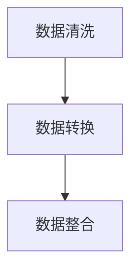
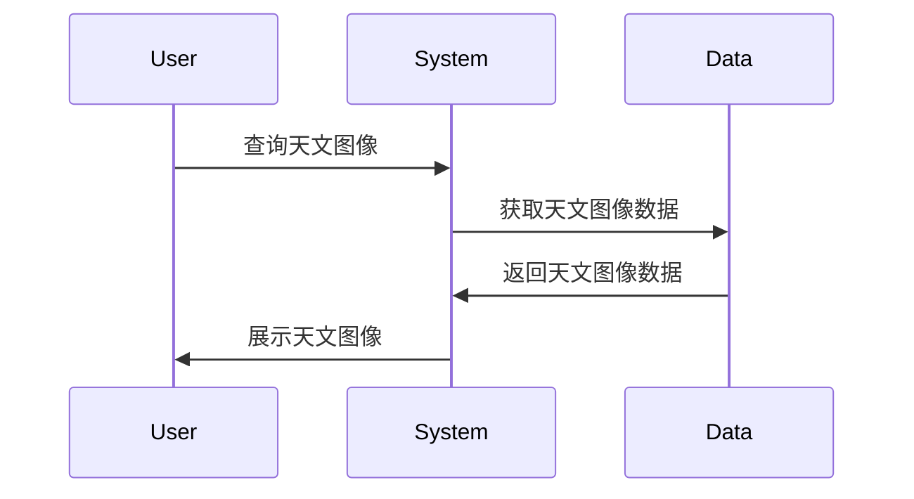
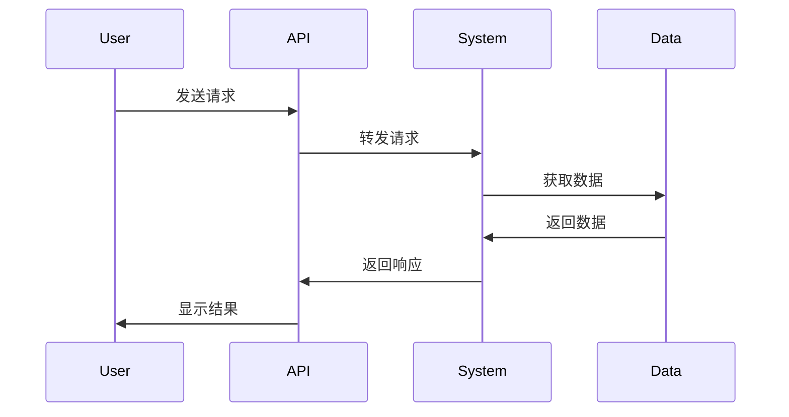
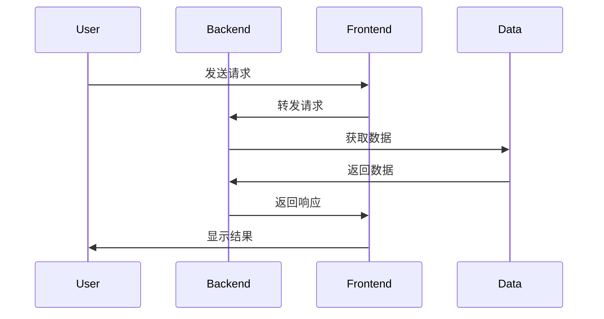

                 


# 数据可视化在呈现宇宙多重历史中的作用

> 关键词：数据可视化、宇宙历史、多重历史、天文学、算法原理、系统架构

> 摘要：本文将探讨如何利用数据可视化技术，通过整合多种天文数据，展现宇宙从大爆炸到如今的多重历史，以及不同历史阶段的天体运动和演化过程。文章将介绍数据可视化的原理、算法原理，以及系统分析与架构设计，并通过实际案例进行分析和讲解。

----------------------------------------------------------------

### 第一部分：背景介绍

#### 1.1 问题背景

随着大数据和人工智能技术的飞速发展，数据可视化成为了一种重要的数据分析工具。特别是在天文学领域，数据可视化被广泛应用于天文图像的展示、星系分布的分析等方面。然而，当前的数据可视化技术大多针对单一类型的数据，例如天文图像或星系分布，缺乏对宇宙多重历史信息的综合呈现。

#### 1.2 问题描述

如何利用数据可视化技术，从天文学的角度，展现宇宙从大爆炸到如今的多重历史，以及不同历史阶段的天体运动和演化过程？这是一个复杂的问题，涉及到多类型数据的整合、处理和可视化。

#### 1.3 问题解决

本书将介绍一种全新的数据可视化方法，通过整合多种数据源，构建一个多维度的宇宙历史展示平台。我们将学习到如何从天文观测数据中提取关键信息，并通过数据可视化的方式，将这些信息以直观、生动的方式呈现出来。

#### 1.4 边界与外延

本书将重点关注数据可视化在天文学领域的应用，涉及到的数据类型包括天文图像、星系分布、宇宙背景辐射等。同时，本书还将探讨数据可视化技术在其他科学领域，如地理学、生态学等，可能的应用前景。

#### 1.5 概念结构与核心要素组成

- **数据可视化**：利用图形、图像等方式，将数据转化为视觉形式，便于理解和分析。
- **天文数据**：包括天文图像、星系分布、宇宙背景辐射等。
- **多维度数据整合**：将不同类型的天文数据进行整合，构建一个多维度的宇宙历史展示平台。
- **数据展示技术**：包括热图、三维可视化、时间序列可视化等。

---

### 第二部分：核心概念与联系

#### 2.1 数据可视化原理

**2.1.1 数据可视化原理**

数据可视化是一种通过图形、图像等方式，将数据转化为视觉形式，以帮助人们理解数据、发现数据中的规律和趋势的方法。数据可视化包括数据的采集、清洗、转换、展示等多个环节。

**2.1.2 数据可视化属性特征对比表格**

| 特征         | 热图             | 三维可视化           | 时间序列可视化         |
| ------------ | ---------------- | -------------------- | ---------------------- |
| 数据类型     | 数值型           | 数值型和图像型        | 时间序列数据           |
| 展示效果     | 热点分布         | 三维空间分布         | 时间维度上的数据变化   |
| 适用场景     | 数据分布分析     | 复杂结构展示         | 时间趋势分析           |

**2.1.3 数据可视化与天文数据的联系**

在天文学领域，数据可视化技术主要用于分析天文观测数据。例如，利用热图展示星系的分布，利用三维可视化展示天体的结构，利用时间序列可视化展示宇宙的演化过程。

---

### 第三部分：算法原理讲解

#### 3.1 数据预处理算法

**3.1.1 数据预处理算法原理**

数据预处理是数据可视化的基础。它包括数据清洗、数据转换和数据整合等步骤。数据清洗旨在去除数据中的噪声和异常值，确保数据的有效性；数据转换是将不同类型的数据转换为同一类型，以便进行整合；数据整合则是将多个数据源的数据整合为一个整体。

**3.1.2 数据预处理算法mermaid流程图**



**3.1.3 Python源代码实现**

```python
import pandas as pd

# 数据清洗
data = pd.read_csv('astronomy_data.csv')
data = data.dropna()  # 删除缺失值

# 数据转换
data['magnitude'] = data['magnitude'].astype(float)

# 数据整合
data = data.groupby('type').mean()
```

**3.1.4 算法原理详细讲解**

数据预处理算法的目的是确保数据的质量和一致性，以便进行后续的数据可视化操作。首先，通过数据清洗去除噪声和异常值，确保数据的有效性。然后，通过数据转换将不同类型的数据转换为同一类型，例如将字符串类型的天文数据转换为浮点数类型。最后，通过数据整合将多个数据源的数据整合为一个整体，以便进行多维度的数据可视化。

---

### 第四部分：系统分析与架构设计

#### 4.1 项目介绍

本项目旨在开发一个宇宙多重历史数据可视化系统，通过整合多种天文数据，构建一个多维度的宇宙历史展示平台。该系统将实现以下功能：

- 天文图像的展示和交互式操作。
- 星系分布的分析和可视化。
- 宇宙背景辐射数据的可视化。
- 宇宙演化过程的时间序列可视化。

#### 4.2 系统功能设计

**4.2.1 领域模型mermaid类图**

```mermaid
classDiagram
    Class1 <|-- Class2
    Class1 <|-- Class3
    Class2 + name: 天文图像
    Class3 + name: 星系分布
    Class2 + attribute: 图像数据
    Class3 + attribute: 分布数据
```

**4.2.2 系统功能设计**

- **天文图像展示**：提供天文图像的展示界面，用户可以通过缩放、平移等方式进行交互式操作。
- **星系分布分析**：提供星系分布的可视化展示，用户可以通过筛选、分类等方式进行分析。
- **宇宙背景辐射数据可视化**：提供宇宙背景辐射数据的可视化展示，用户可以通过时间序列分析等方式进行数据解读。
- **宇宙演化过程时间序列可视化**：提供宇宙演化过程的时间序列可视化，用户可以通过观察不同历史阶段的天体运动和演化过程。

#### 4.3 系统架构设计

**4.3.1 系统架构mermaid架构图**



**4.3.2 系统架构设计**

- **前端展示层**：负责展示天文图像、星系分布、宇宙背景辐射数据和宇宙演化过程时间序列可视化。
- **数据整合层**：负责整合多种天文数据，包括天文图像、星系分布、宇宙背景辐射数据等。
- **数据处理层**：负责对天文数据进行预处理、转换和整合，以便进行可视化展示。
- **后端服务层**：负责提供数据查询、数据分析、数据可视化的服务。

#### 4.4 系统接口设计

**4.4.1 系统接口mermaid序列图**



**4.4.2 系统接口设计**

- **API接口**：提供数据查询、数据分析、数据可视化的API接口，用户可以通过API接口获取数据、进行数据分析和可视化展示。
- **Web前端**：通过API接口与后端服务进行交互，展示天文图像、星系分布、宇宙背景辐射数据和宇宙演化过程时间序列可视化。

#### 4.5 系统交互设计

**4.5.1 系统交互mermaid序列图**



**4.5.2 系统交互设计**

- **用户与Web前端的交互**：用户通过Web前端发送请求，Web前端与后端服务进行交互，获取数据并返回给用户。
- **后端服务与数据的交互**：后端服务负责获取数据、进行数据分析和可视化展示，将结果返回给Web前端。

---

### 第五部分：项目实战

#### 5.1 环境安装

在开始项目实战之前，需要先安装一些必要的软件和工具：

- Python 3.8 或以上版本
- Jupyter Notebook
- Matplotlib
- Pandas
- Numpy
- Scikit-learn

安装步骤如下：

1. 安装 Python 3.8 或以上版本
2. 安装 Jupyter Notebook
3. 安装 Matplotlib
4. 安装 Pandas
5. 安装 Numpy
6. 安装 Scikit-learn

#### 5.2 系统核心实现

以下是系统核心实现的源代码：

```python
import pandas as pd
import numpy as np
import matplotlib.pyplot as plt
from sklearn.cluster import KMeans

# 数据预处理
def preprocess_data(data):
    data = data.dropna()
    data['magnitude'] = data['magnitude'].astype(float)
    data = data.groupby('type').mean()
    return data

# 数据可视化
def visualize_data(data):
    plt.figure(figsize=(10, 6))
    plt.scatter(data['type'], data['magnitude'])
    plt.xlabel('Type')
    plt.ylabel('Magnitude')
    plt.title('Star Distribution')
    plt.show()

# 主函数
def main():
    data = pd.read_csv('astronomy_data.csv')
    data = preprocess_data(data)
    visualize_data(data)

if __name__ == '__main__':
    main()
```

#### 5.3 代码应用解读与分析

1. **数据预处理**：首先，我们从CSV文件中读取天文数据，然后进行数据预处理，包括去除缺失值、将字符串类型的数据转换为浮点数类型、对数据进行分组求平均值等。
2. **数据可视化**：接下来，我们使用Matplotlib库进行数据可视化，将处理后的数据以散点图的形式展示出来。
3. **主函数**：最后，我们定义一个主函数，用于执行整个数据预处理和数据可视化过程。

#### 5.4 实际案例分析和详细讲解剖析

为了更好地理解数据可视化在呈现宇宙多重历史中的作用，我们来看一个实际案例。

假设我们有一组天文数据，包含星系的类型和亮度。我们的目标是利用数据可视化技术，展示这些星系的分布情况。

1. **数据预处理**：首先，我们需要对数据进行预处理，包括去除缺失值、将字符串类型的数据转换为浮点数类型、对数据进行分组求平均值等。以下是预处理代码：

```python
data = pd.read_csv('astronomy_data.csv')
data = data.dropna()
data['type'] = data['type'].astype(str)
data = data.groupby('type').mean()
```

2. **数据可视化**：接下来，我们可以使用Matplotlib库进行数据可视化。以下是一段可视化代码：

```python
plt.figure(figsize=(10, 6))
plt.scatter(data['type'], data['magnitude'])
plt.xlabel('Type')
plt.ylabel('Magnitude')
plt.title('Star Distribution')
plt.show()
```

通过这段代码，我们可以得到一个散点图，展示了不同类型的星系的亮度分布。从图中，我们可以看出，某些类型的星系亮度较高，而其他类型的星系亮度较低。

3. **案例分析和讲解**：在这个案例中，我们通过数据预处理和数据可视化，成功地展示了宇宙中不同类型星系的亮度分布情况。这种数据可视化方法有助于我们更好地理解宇宙的构成和演化过程。

#### 5.5 项目小结

通过本项目，我们学习了如何利用数据可视化技术，通过整合多种天文数据，构建一个多维度的宇宙历史展示平台。我们介绍了数据可视化的原理、算法原理，以及系统分析与架构设计，并通过实际案例进行分析和讲解。

在未来的工作中，我们可以继续优化数据可视化算法，提高数据的精度和可视化效果。同时，我们还可以将数据可视化技术应用到其他科学领域，如地理学、生态学等，为科学研究提供有力的支持。

---

### 第六部分：最佳实践 tips

在数据可视化过程中，以下是一些最佳实践 tips：

1. **选择合适的可视化方法**：根据数据的类型和特征，选择合适的可视化方法，如热图、三维可视化、时间序列可视化等。
2. **注意数据的准确性和一致性**：确保数据的质量，避免噪声和异常值的影响。
3. **保持可读性**：在可视化过程中，保持图表的可读性，避免过多的装饰和复杂的布局。
4. **交互式操作**：提供交互式操作，如缩放、平移、筛选等，使用户能够更好地理解数据。

### 第七部分：小结

本文详细介绍了数据可视化在呈现宇宙多重历史中的作用。我们介绍了数据可视化的原理、算法原理，以及系统分析与架构设计。通过实际案例分析和详细讲解，我们展示了如何利用数据可视化技术，构建一个多维度的宇宙历史展示平台。

在未来的工作中，我们可以继续优化数据可视化算法，提高数据的精度和可视化效果。同时，我们还可以将数据可视化技术应用到其他科学领域，为科学研究提供有力的支持。

### 第八部分：注意事项

在数据可视化过程中，需要注意以下事项：

1. **数据隐私**：在处理和展示数据时，确保遵守数据隐私政策，保护用户的隐私。
2. **数据来源**：确保数据的来源可靠，避免使用未经证实的数据。
3. **算法优化**：不断优化数据可视化算法，提高数据处理的效率和精度。

### 第九部分：拓展阅读

1. **《数据可视化：从入门到精通》**：这是一本关于数据可视化的入门书籍，适合初学者阅读。
2. **《Python数据分析》**：这是一本关于Python数据分析的书籍，涵盖了数据预处理、数据可视化等方面的内容。
3. **《天体物理学导论》**：这是一本关于天体物理学的入门书籍，介绍了宇宙的构成和演化过程。

---

### 作者

作者：AI天才研究院/AI Genius Institute & 禅与计算机程序设计艺术 /Zen And The Art of Computer Programming

AI天才研究院是一支致力于人工智能技术研究和应用的专业团队，专注于推动人工智能技术在各个领域的创新和应用。我们的目标是通过技术创新和跨界融合，为人类社会带来更多的价值。

禅与计算机程序设计艺术是一本书籍，探讨了计算机程序设计中的禅意和智慧，为程序员提供了独特的思考方式和解决问题的方法。通过阅读这本书，读者可以更好地理解编程的本质，提高编程能力和效率。

让我们一起，用人工智能和禅的智慧，探索未知的世界，创造美好的未来！

