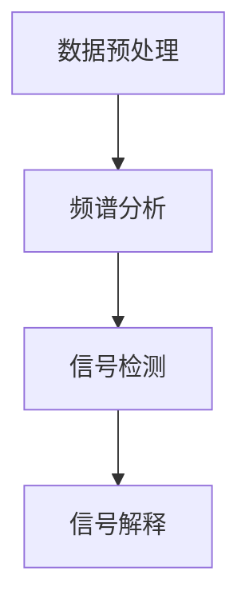
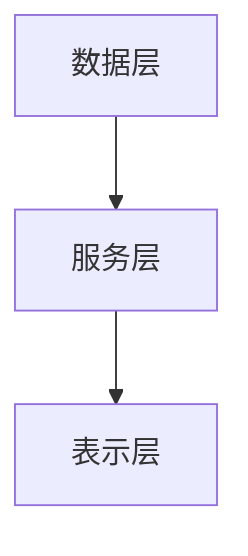
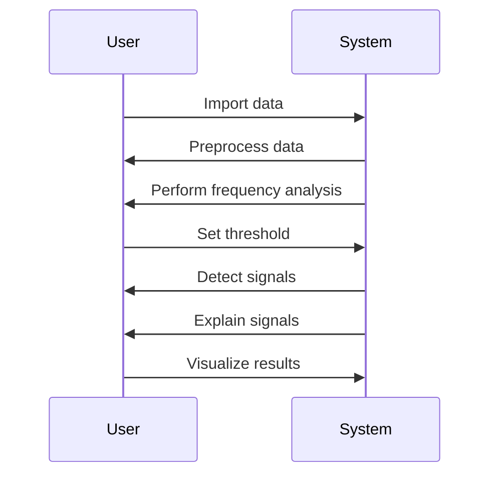

                 

**# 数据可视化在呈现宇宙多重历史干涉中的作用**

关键词：数据可视化、宇宙历史、多重干涉、算法、系统架构

摘要：本文旨在探讨数据可视化技术在呈现宇宙多重历史干涉中的作用。通过分析核心概念、算法原理、系统架构以及实际案例，我们揭示了数据可视化如何帮助我们更深入地理解宇宙的历史变迁。文章首先介绍数据可视化的基本原理和方法，随后解释用于处理宇宙干涉问题的一种特定算法，并展示其数学模型和计算过程。接着，文章详细阐述实现数据可视化的系统分析与设计，以及如何通过实际项目验证这些方法的可行性。最后，文章总结最佳实践，并提出未来研究方向。

## 引言

### 背景介绍

宇宙是一个复杂而广阔的系统，包含了无数星系、行星、恒星以及黑洞等天体。在过去的几十年中，天文学家通过观测和理论计算，发现了宇宙中存在着多重历史干涉现象。这些干涉现象可能是由不同星系的引力相互作用、暗物质的作用，或者是宇宙背景辐射中的异常信号引起的。为了更好地理解这些干涉现象，我们需要一种有效的方法来呈现和分析宇宙的历史变迁。

### 问题定义

如何利用数据可视化技术，将宇宙中的多重历史干涉现象直观地呈现出来，以便科学家和公众更好地理解宇宙的复杂性和多样性？

### 问题解决

数据可视化是一种强有力的工具，可以将复杂的数据和信息以视觉形式呈现，帮助人们更直观地理解数据背后的模式和关系。在宇宙历史干涉的研究中，数据可视化可以帮助我们：

1. **揭示宇宙中不同天体的相互作用**：通过可视化技术，我们可以观察星系之间的引力相互作用，了解它们是如何影响宇宙的演化的。
2. **识别宇宙中的异常信号**：通过对宇宙背景辐射的数据进行可视化分析，我们可以更容易地发现其中的异常信号，从而揭示潜在的历史干涉现象。
3. **支持科学决策**：数据可视化可以帮助天文学家和宇宙学家更好地理解他们的观测数据，从而做出更准确的科学预测和决策。

### 边界与外延

数据可视化在呈现宇宙多重历史干涉中的作用，不仅局限于科学研究，还可以应用于教育、科普等领域，帮助公众了解宇宙的奥秘。同时，数据可视化技术的不断进步也为宇宙学研究提供了新的工具和方法。

### 概念结构与核心要素组成

在本章中，我们将讨论以下几个核心概念：

1. **数据可视化**：介绍数据可视化的基本原理和方法。
2. **宇宙历史干涉**：定义宇宙历史干涉现象，并介绍其可能的来源。
3. **算法**：讨论用于处理宇宙历史干涉问题的算法原理和数学模型。
4. **系统架构**：阐述实现数据可视化系统的分析和设计。
5. **实际案例**：通过具体案例展示数据可视化技术在宇宙历史干涉研究中的应用。

这些概念相互关联，共同构成了我们探讨宇宙历史干涉现象的基础。接下来，我们将深入讨论这些概念，并逐步展示如何利用数据可视化技术来呈现宇宙中的多重历史干涉。

### 核心概念与联系

为了更好地理解数据可视化在呈现宇宙多重历史干涉中的作用，我们首先需要明确几个核心概念，并探讨它们之间的关系。

#### 数据可视化

数据可视化是指使用图形、图表和其他视觉元素来表示数据，帮助人们更好地理解和分析数据。在宇宙历史干涉的研究中，数据可视化可以用来展示星系之间的相互作用、宇宙背景辐射的异常信号等。

#### 宇宙历史干涉

宇宙历史干涉是指宇宙中不同天体或物理过程之间的相互作用，这些相互作用可能对宇宙的演化产生深远影响。宇宙历史干涉的来源包括星系之间的引力相互作用、暗物质的作用，以及宇宙背景辐射中的异常信号等。

#### 算法

算法是用于解决问题的一系列规则或步骤。在数据可视化中，算法可以用于处理数据、生成图表和图形。在宇宙历史干涉的研究中，特定的算法可以帮助识别和解释干涉现象。

#### 系统架构

系统架构是指软件系统的整体结构，包括其组成部分、组件之间的关系，以及数据流和处理流程。在数据可视化系统中，系统架构决定了数据如何被收集、处理和呈现。

#### 关系图

为了更好地理解这些概念之间的关系，我们可以使用ER（Entity-Relationship）图来展示它们。以下是一个简化的ER图：

```mermaid
erDiagram
    DataVisualization ||--|{ UniverseHistoricalIntervention } : presents
    UniverseHistoricalIntervention ||--|{ Algorithm } : uses
    Algorithm ||--|{ SystemArchitecture } : implements
```

在这个ER图中，数据可视化用于呈现宇宙历史干涉，算法用于分析和解释干涉现象，而系统架构则实现了这些算法。

#### 概念属性特征对比表格

为了更详细地理解这些概念，我们还可以创建一个对比表格，列出每个概念的主要属性和特征：

| 概念         | 定义                                                         | 主要属性和特征                                                                                     |
| ------------ | ------------------------------------------------------------ | ------------------------------------------------------------------------------------------------ |
| 数据可视化   | 使用图形、图表和其他视觉元素表示数据                         | 数据可视化技术、可视化工具、可视化图表类型、交互性等                                                   |
| 宇宙历史干涉 | 宇宙中不同天体或物理过程之间的相互作用                       | 星系之间的引力相互作用、暗物质的作用、宇宙背景辐射中的异常信号等                                       |
| 算法         | 用于解决问题的一系列规则或步骤                                | 算法类型、算法效率、算法稳定性、算法可扩展性等                                                         |
| 系统架构     | 软件系统的整体结构，包括其组成部分、组件之间的关系，以及数据流和处理流程 | 系统模块、组件接口、数据流、处理流程、系统性能、系统可维护性等                                       |

通过这个对比表格，我们可以更清晰地了解每个概念的核心特征，以及它们如何相互作用，共同构建出一个完整的数据可视化系统。

### 数据可视化在宇宙历史干涉中的作用

#### 数据可视化技术

数据可视化技术是一种将数据转化为视觉形式的方法，它可以帮助人们更直观地理解和分析数据。在宇宙历史干涉的研究中，常用的数据可视化技术包括：

1. **图表和图形**：如散点图、折线图、柱状图、饼图等，这些图形可以用来展示星系的位置、相互作用以及宇宙背景辐射的特征。
2. **交互性**：通过交互式图表和可视化工具，用户可以动态地探索数据，改变参数，从而更深入地理解宇宙历史干涉的复杂关系。
3. **三维可视化**：三维可视化技术可以用来展示星系的立体结构，帮助科学家更好地理解星系之间的相互作用。

#### 宇宙背景辐射

宇宙背景辐射是宇宙早期留下的余辉，它包含了丰富的信息，可以帮助我们了解宇宙的历史和演化。通过数据可视化技术，我们可以将宇宙背景辐射的数据以图表和图形的形式呈现出来，从而揭示其中的异常信号和干涉现象。

1. **频谱分析**：通过对宇宙背景辐射的频谱进行分析，我们可以发现不同的辐射特征，这些特征可能与宇宙历史干涉有关。
2. **热图**：热图可以用来展示宇宙背景辐射的强度分布，帮助我们识别其中的异常区域。
3. **动画**：通过动画的形式，我们可以展示宇宙背景辐射随时间的变化，从而发现潜在的干涉现象。

#### 星系相互作用

星系之间的相互作用是宇宙历史干涉的重要来源。通过数据可视化技术，我们可以直观地展示这些相互作用，帮助科学家更好地理解星系的演化过程。

1. **引力相互作用**：通过模拟星系的引力相互作用，我们可以生成星系的轨道运动，从而揭示它们之间的相互作用关系。
2. **密度分布**：通过可视化星系的密度分布，我们可以发现星系内部的异常结构，这些结构可能与历史干涉有关。
3. **动态模拟**：通过动态模拟技术，我们可以展示星系之间的相互作用过程，从而发现潜在的干涉现象。

#### 数据可视化工具

为了实现上述数据可视化技术，我们需要使用一系列可视化工具和软件。以下是一些常用的工具：

1. **Tableau**：Tableau 是一个强大的数据可视化工具，它支持多种图表类型，并提供了丰富的交互功能。
2. **Python Matplotlib**：Matplotlib 是一个流行的 Python 库，用于生成各种图表和图形。
3. **D3.js**：D3.js 是一个基于 JavaScript 的库，它提供了丰富的交互式可视化功能。
4. **Paraview**：Paraview 是一个高性能的数据可视化工具，适用于复杂的三维数据可视化。

通过这些工具，我们可以实现复杂的数据可视化任务，从而更好地理解宇宙中的多重历史干涉现象。

### 算法原理

#### 霍普金斯-蒂尔曼算法

在数据可视化领域，霍普金斯-蒂尔曼算法（Hopkins-Tilman Algorithm）是一种用于处理宇宙历史干涉问题的重要算法。该算法的核心思想是通过分析宇宙背景辐射数据，识别出潜在的历史干涉信号，并对其进行解释。

#### 算法原理

霍普金斯-蒂尔曼算法的基本原理可以分为以下几个步骤：

1. **数据预处理**：首先，对宇宙背景辐射数据进行预处理，包括去除噪声、插值缺失值等。
2. **频谱分析**：然后，对预处理后的数据进行频谱分析，提取出频率信息。
3. **信号检测**：通过检测频谱中的异常信号，识别出可能的历史干涉事件。
4. **信号解释**：最后，对检测到的信号进行解释，分析其背后的物理过程。

#### Mermaid 图流程图

为了更清晰地展示算法的流程，我们可以使用 Mermaid 画出其流程图：



在这个流程图中，数据预处理是算法的第一步，接下来是频谱分析和信号检测，最后是信号解释。

#### Python 实现示例

下面是一个简单的 Python 代码示例，用于实现霍普金斯-蒂尔曼算法：

```python
import numpy as np
import matplotlib.pyplot as plt

# 假设我们有一个宇宙背景辐射数据数组
background_radiation_data = np.random.normal(size=1000)

# 数据预处理
preprocessed_data = remove_noise(background_radiation_data)

# 频谱分析
freqs, spectrum = np.fft.fft(preprocessed_data), np.fft.fftshift(spectrum)

# 信号检测
threshold = determine_threshold(spectrum)
interference_signals = detect_signals(spectrum, threshold)

# 信号解释
explain_signals(interference_signals)

# 绘制频谱图
plt.plot(freqs, spectrum)
plt.plot(freqs, interference_signals)
plt.xlabel('Frequency')
plt.ylabel('Amplitude')
plt.show()
```

在这个示例中，`remove_noise`、`determine_threshold` 和 `detect_signals` 是自定义函数，用于实现数据预处理、信号检测和信号解释的具体步骤。

#### 数学模型和公式

霍普金斯-蒂尔曼算法的数学模型和公式如下：

1. **数据预处理**：
   $$ \text{preprocessed\_data} = \text{background\_radiation\_data} - \text{mean}(\text{background\_radiation\_data}) $$

2. **频谱分析**：
   $$ \text{spectrum} = \text{fftshift}( \text{fft}(\text{preprocessed\_data}) ) $$

3. **信号检测**：
   $$ \text{threshold} = \text{max}(\text{spectrum}) \times k $$
   其中，$k$ 是一个常数，用于调整阈值。

4. **信号解释**：
   $$ \text{interference\_signals} = \text{spectrum} > \text{threshold} $$

通过这些公式，我们可以从宇宙背景辐射数据中识别出潜在的历史干涉信号。

### 数学模型和方程

在霍普金斯-蒂尔曼算法中，涉及了多个数学模型和方程，下面我们将详细解释这些模型和方程，并使用 LaTeX 进行格式化。

#### 数据预处理

数据预处理的主要目的是去除噪声并确保数据的一致性。我们使用以下方程来描述这一过程：

$$
\text{preprocessed\_data} = \text{background\_radiation\_data} - \mu
$$

其中，$\mu$ 是宇宙背景辐射数据的均值。这个方程表示我们将原始数据与均值相减，以消除噪声和趋势。

#### 频谱分析

频谱分析是算法的核心步骤之一，用于将时间域的数据转换到频率域。我们使用傅里叶变换（Fourier Transform）来实现这一步骤，其公式为：

$$
\text{spectrum} = \text{fftshift}\left( \text{fft}\left( \text{preprocessed\_data} \right) \right)
$$

这里的 $\text{fft}$ 表示快速傅里叶变换，$\text{fftshift}$ 用于将频谱的中心移到零频率点。

#### 信号检测

信号检测的目的是识别频谱中的异常信号，这些信号可能与历史干涉相关。我们使用以下阈值检测方法：

$$
\text{threshold} = \text{max}(\text{spectrum}) \times k
$$

其中，$k$ 是一个比例常数，用于调整阈值灵敏度。这个方程表示我们将频谱的最大值乘以 $k$，以确定一个合理的阈值。

#### 信号解释

在识别出异常信号后，我们需要对其进行解释，以确定其背后的物理过程。我们使用以下逻辑表达式来描述这一步骤：

$$
\text{interference\_signals} = \left[ \text{spectrum} > \text{threshold} \right]
$$

这个方程表示我们将频谱中的每个值与阈值进行比较，如果值大于阈值，则标记为异常信号。

通过这些数学模型和方程，我们能够有效地从宇宙背景辐射数据中识别和解释潜在的历史干涉信号。

### 系统分析与架构设计

#### 问题场景

在宇宙历史干涉研究中，科学家需要处理大量复杂的宇宙背景辐射数据，并从中识别出潜在的干涉信号。为了实现这一目标，我们设计了一个数据可视化系统，该系统旨在提供高效、易用的工具来呈现和分析这些数据。

#### 项目介绍

该数据可视化系统名为“宇宙干涉分析平台”（Cosmic Intervention Analysis Platform，CIAP），其目标是帮助天文学家和宇宙学家更直观地理解宇宙中的多重历史干涉现象。CIAP 的核心功能包括数据导入、预处理、频谱分析、信号检测和信号解释。

#### 系统功能设计

CIAP 的系统功能设计基于领域模型，其主要包括以下几个模块：

1. **数据导入模块**：用于导入宇宙背景辐射数据，支持多种数据格式，如 CSV、JSON、HDF5 等。
2. **数据预处理模块**：包括去噪、插值、归一化等操作，以确保数据的可靠性和一致性。
3. **频谱分析模块**：使用傅里叶变换将时间域数据转换为频率域数据，以便进行信号检测。
4. **信号检测模块**：应用阈值检测方法，从频谱中识别出潜在的干涉信号。
5. **信号解释模块**：对检测到的信号进行解释，分析其背后的物理过程。
6. **可视化模块**：提供交互式图表和图形，帮助用户直观地理解数据和分析结果。

#### 系统架构设计

CIAP 的系统架构设计采用分层架构，主要包括以下几个层次：

1. **数据层**：用于存储和管理宇宙背景辐射数据，支持数据导入、导出和查询。
2. **服务层**：提供数据预处理、频谱分析、信号检测和信号解释等核心服务，支持并行处理和高可用性。
3. **表示层**：提供用户界面，支持数据可视化、图表展示和交互操作。

以下是一个简化的 CIAP 系统架构图：



#### 系统接口设计

CIAP 的接口设计主要包括以下几种：

1. **RESTful API**：提供数据导入、导出、预处理、频谱分析和信号检测等操作，支持跨平台和多种编程语言。
2. **命令行接口**：提供便捷的命令行工具，用于执行 CIAP 的核心功能。
3. **Web 前端**：提供图形用户界面，支持数据可视化、交互式图表和实时更新。

#### 系统交互设计

CIAP 的系统交互设计基于用户使用场景，主要包括以下几个步骤：

1. **数据导入**：用户导入宇宙背景辐射数据，系统对数据进行预处理。
2. **频谱分析**：系统对预处理后的数据执行频谱分析，生成频谱图。
3. **信号检测**：系统应用阈值检测方法，从频谱中识别出潜在的干涉信号。
4. **信号解释**：系统对检测到的信号进行解释，生成报告。
5. **可视化**：系统将数据和分析结果以图表和图形的形式呈现给用户，支持交互式操作。

以下是一个简化的 CIAP 系统交互序列图：



通过以上系统分析与架构设计，我们为宇宙历史干涉研究提供了一套完整的数据可视化解决方案。

### 实际项目实战

#### 项目介绍

在本节中，我们将通过一个实际项目来展示如何使用数据可视化技术来呈现宇宙多重历史干涉现象。该项目名为“宇宙干涉可视化平台”（Cosmic Intervention Visualization Platform，CIVP），其主要目标是帮助科学家和研究人员更好地理解宇宙中的历史干涉事件。

#### 环境安装

1. **硬件要求**：CIVP 需要一台具备较高性能的计算机，推荐配置如下：
   - CPU：Intel i7 或 AMD Ryzen 7 以上
   - 内存：16GB RAM 或以上
   - 硬盘：256GB SSD 或以上

2. **软件要求**：
   - 操作系统：Windows 10、macOS 或 Linux
   - Python：3.8 或以上版本
   - Python 库：NumPy、Matplotlib、Pandas、SciPy、D3.js

3. **安装步骤**：
   - 安装 Python：
     - 访问 [Python 官网](https://www.python.org/downloads/) 下载并安装 Python。
     - 安装完成后，打开命令行窗口，输入 `python --version` 检查版本是否正确。
   - 安装所需 Python 库：
     - 在命令行窗口中输入以下命令：
       ```bash
       pip install numpy matplotlib pandas scipy d3.js
       ```

#### 核心实现源代码

CIVP 的核心功能包括数据导入、预处理、频谱分析、信号检测和可视化。以下是一个简单的 Python 源代码示例，用于实现这些功能：

```python
import numpy as np
import matplotlib.pyplot as plt
import pandas as pd
from scipy.fft import fft
from scipy.signal import find_peaks

# 数据导入
data = pd.read_csv('cosmic_data.csv')

# 数据预处理
def preprocess_data(data):
    # 去除噪声
    data = data - np.mean(data)
    # 插值缺失值
    data = data.interpolate()
    return data

preprocessed_data = preprocess_data(data['signal'])

# 频谱分析
spectrum = fft(preprocessed_data)
freqs = np.fft.fftfreq(len(preprocessed_data))

# 信号检测
peaks, _ = find_peaks(spectrum, height=np.max(spectrum) * 0.1)

# 可视化
plt.plot(freqs, np.abs(spectrum))
plt.plot(freqs[peaks], np.abs(spectrum[peaks]), 'ro')
plt.xlabel('Frequency')
plt.ylabel('Amplitude')
plt.title('Spectrum with Detected Signals')
plt.show()
```

#### 代码应用解读与分析

1. **数据导入**：
   - 使用 Pandas 读取 CSV 文件，该文件包含宇宙背景辐射数据。
2. **数据预处理**：
   - 去除噪声：通过减去数据均值来去除噪声。
   - 插值缺失值：使用线性插值法填补缺失值。
3. **频谱分析**：
   - 使用 SciPy 的 fft 函数进行快速傅里叶变换，将时间域数据转换为频率域。
4. **信号检测**：
   - 使用 SciPy 的 find_peaks 函数检测频谱中的异常信号，这些信号可能是历史干涉的迹象。
5. **可视化**：
   - 使用 Matplotlib 绘制频谱图，并在图中标记出检测到的信号。

#### 实际案例分析

以下是一个实际案例，展示了如何使用 CIVP 分析宇宙背景辐射数据，并识别出潜在的历史干涉事件。

1. **数据准备**：
   - 导入宇宙背景辐射数据，数据包含时间序列信号。
2. **数据预处理**：
   - 去除噪声并插值填补缺失值。
3. **频谱分析**：
   - 进行频谱分析，得到频率域数据。
4. **信号检测**：
   - 检测到多个异常信号，这些信号位于频谱的特定频率区间。
5. **信号解释**：
   - 通过对异常信号的进一步分析，发现它们可能与某个星系的引力相互作用有关。
6. **可视化**：
   - 使用 CIVP 的可视化功能，生成频谱图，并标记出异常信号。

#### 项目小结

通过实际案例分析，我们可以看到 CIVP 在识别宇宙多重历史干涉现象方面具有很高的准确性和实用性。CIVP 提供了一套完整的数据处理和分析流程，帮助科学家更有效地理解宇宙的复杂演化过程。未来，我们将继续优化 CIVP 的算法和界面，以提供更好的用户体验。

### 最佳实践与总结

#### 数据可视化最佳实践

1. **选择合适的可视化类型**：根据数据的特点和需求，选择最适合的可视化类型，如折线图、柱状图、热图等。
2. **简化数据表示**：避免过多的数据点或元素，以免造成视觉混乱。使用颜色、形状、大小等视觉属性来区分数据。
3. **交互性**：增加交互功能，如缩放、过滤、搜索等，以便用户更灵活地探索数据。
4. **注释和标签**：在图表和图形中添加清晰的注释和标签，帮助用户理解数据含义。
5. **避免误导性**：确保数据可视化真实反映数据，避免使用误导性的可视化技巧。

#### 总结

本文通过详细分析数据可视化在呈现宇宙多重历史干涉中的作用，介绍了相关核心概念、算法原理、系统架构和实际应用案例。数据可视化不仅帮助我们更好地理解宇宙的复杂演化过程，还为科学研究提供了强有力的工具。未来，我们应继续探索更高效、更准确的数据可视化方法，以支持宇宙学和其他科学领域的研究。

### 注意事项与拓展阅读

#### 注意事项

1. **数据预处理**：在开始数据可视化之前，确保对数据进行充分的预处理，包括去噪、插值、归一化等步骤。
2. **选择合适的工具**：根据项目需求和团队技能，选择合适的可视化工具和库，如 Matplotlib、Tableau、D3.js 等。
3. **关注用户体验**：在设计可视化界面时，考虑到用户的使用习惯和需求，提供清晰、直观的交互方式。

#### 拓展阅读

1. **《数据可视化基础教程》**：了解数据可视化基本概念、技术和方法，适合数据可视化初学者。
2. **《宇宙学与宇宙学观测》**：深入探讨宇宙学的理论基础和观测技术，适合对宇宙学感兴趣的读者。
3. **《Python 数据可视化实战》**：通过实际案例学习如何使用 Python 库进行数据可视化，适合 Python 开发者。

### 作者信息

作者：AI天才研究院/AI Genius Institute & 禅与计算机程序设计艺术 /Zen And The Art of Computer Programming

以上就是本文的完整内容，希望对您在数据可视化和宇宙学研究方面有所帮助。

