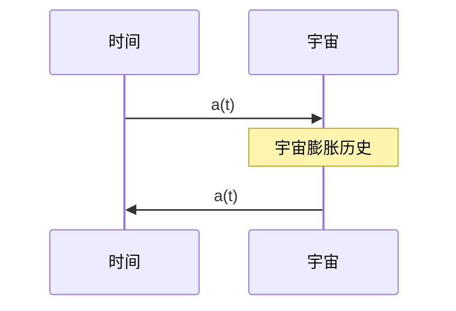
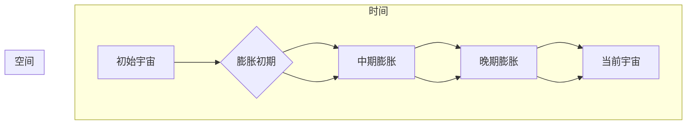

                 

### 数据可视化概述

#### 第1章：数据可视化的基本概念

**1.1.1 数据可视化的定义与作用**

数据可视化是一种通过图形、图像、动画等形式将数据转化为视觉表示的方法，旨在帮助人们更直观、快速地理解和分析数据。它不仅是数据分析的重要工具，同时也是决策过程的关键辅助手段。

数据可视化能够揭示数据中的模式和趋势，帮助人们从大量数据中提取有价值的信息。其作用主要体现在以下几个方面：

1. **信息传递**：通过视觉元素，将复杂的数据和信息以简单、直观的方式展示给用户，降低理解和分析的难度。
2. **发现模式**：通过图形化的方式，识别数据中的关联性、异常点和趋势，帮助研究人员和决策者快速发现数据中的关键信息。
3. **决策支持**：利用数据可视化，辅助决策者对复杂的问题进行理解和分析，从而做出更明智的决策。

**1.1.2 数据可视化的历史与发展趋势**

数据可视化的历史可以追溯到19世纪末期，当时统计学家查尔斯·乔赛亚·珍妮特（Charles Joseph Minard）绘制了著名的拿破仑入侵俄罗斯的地图，这是早期的数据可视化实例。随着计算机技术的进步，数据可视化得到了快速发展，逐渐成为数据分析领域的重要工具。

近年来，随着大数据、云计算和人工智能的兴起，数据可视化技术也不断革新。从简单的图表展示到复杂的交互式可视化，从静态的图表到动态的动画，数据可视化在技术和应用层面都取得了显著进步。

**1.1.3 数据可视化的重要性**

在数据驱动的时代，数据可视化的重要性日益凸显。以下是几个关键点：

1. **可访问性**：通过数据可视化，复杂的数据变得可访问，使不具备专业知识的人也能够理解和利用数据。
2. **沟通效率**：数据可视化能够更有效地传递信息，提高沟通的效率和效果。
3. **决策质量**：通过直观的数据展示，决策者可以更快地识别问题和制定解决方案，从而提高决策的质量。
4. **创新启发**：数据可视化能够激发新的见解和发现，推动研究和创新。

**结论**

数据可视化不仅是一种技术工具，更是一种理解和分析数据的方法论。它通过将数据转化为视觉形式，帮助人们更好地理解和利用数据，成为现代社会不可或缺的一部分。在接下来的章节中，我们将进一步探讨宇宙历史与多重历史干涉图案的背景，并详细阐述数据可视化在宇宙多重历史干涉图案中的应用。

#### 第2章：宇宙历史与多重历史干涉图案

**2.1.1 宇宙历史的概述**

宇宙的历史是宇宙从大爆炸开始，经历数十亿年演化至今的历程。它不仅包括宇宙的诞生、发展和演化，还涉及到宇宙中各种现象和现象之间的相互作用。宇宙历史的研究是现代物理学和天文学的重要领域，为我们理解宇宙的起源和结构提供了重要的视角。

宇宙历史可以分为以下几个关键阶段：

1. **大爆炸**：宇宙在大约138亿年前诞生，从极热、极密的状态迅速膨胀。
2. **宇宙早期**：宇宙在膨胀过程中逐渐冷却，形成了最初的物质和能量。
3. **宇宙演化**：宇宙经历了恒星的形成和死亡，星系和星系团的聚集。
4. **当前宇宙**：我们观测到的宇宙，包括可观测宇宙的边界、暗物质和暗能量的存在。

**2.1.2 多重历史干涉图案的原理与形成**

多重历史干涉图案（Multiverse Historical Interference Patterns）是指在一个或多个宇宙中，由于历史事件和物理过程的不同，导致宇宙历史发生多重干涉和交错的现象。这种现象的原理可以归结为以下几点：

1. **历史分支**：在宇宙历史的不同阶段，由于物理常数和初始条件的微小变化，宇宙可能会产生多个不同的分支，每个分支代表一个可能的宇宙历史。
2. **因果干涉**：在不同的历史分支中，宇宙历史事件之间的因果关系可能会发生干涉和交错，形成复杂的干涉图案。
3. **量子涨落**：在宇宙早期，量子涨落导致了物质分布的不均匀性，这些不均匀性在宇宙演化过程中逐渐放大，形成了不同宇宙历史的基础。

多重历史干涉图案的形成过程可以概括为以下几个步骤：

1. **初始条件**：宇宙在早期具有特定的初始条件，这些条件决定了宇宙的演化和结构。
2. **历史分支**：在宇宙演化过程中，由于物理常数和初始条件的微小变化，宇宙可能会产生多个不同的历史分支。
3. **因果干涉**：在不同的历史分支中，宇宙历史事件之间的因果关系可能会发生干涉和交错，形成复杂的干涉图案。
4. **图案展示**：通过数据可视化技术，可以将这些复杂的干涉图案以图形化的方式展示出来，帮助我们更直观地理解宇宙历史的多样性。

**2.1.3 宇宙多重历史干涉图案的案例研究**

为了更好地理解宇宙多重历史干涉图案的概念，我们可以通过几个具体的案例来分析：

1. **宇宙膨胀历史**：在不同的宇宙历史分支中，宇宙的膨胀历史可能会有所不同。例如，一个宇宙可能会经历更快的膨胀期，而另一个宇宙可能会经历更缓慢的膨胀期。这些差异可以通过数据可视化技术展示出来，揭示宇宙膨胀历史的多重可能性。
2. **黑洞相互作用**：黑洞是宇宙中最神秘的天体之一。在宇宙的不同历史分支中，黑洞之间的相互作用可能会导致不同的结果，例如黑洞的合并、吞噬或其他复杂的相互作用。这些相互作用形成的干涉图案可以通过数据可视化技术展示，帮助我们理解黑洞在宇宙历史中的作用。
3. **暗物质分布**：暗物质是宇宙中一种未知物质，它在宇宙历史中扮演着重要的角色。在不同的宇宙历史分支中，暗物质的分布可能会发生显著变化，这些变化可以通过数据可视化技术展示，帮助我们探索暗物质在宇宙演化中的影响。

通过这些案例，我们可以看到，宇宙多重历史干涉图案的概念不仅具有理论上的重要性，同时也具有广泛的应用价值。通过数据可视化技术，我们可以更直观地理解宇宙历史的多样性，揭示宇宙中各种现象之间的复杂关系。在接下来的章节中，我们将进一步探讨数据可视化在宇宙多重历史干涉图案中的应用，分析如何利用数据可视化技术揭示和解释宇宙历史的复杂性。

#### 第3章：数据可视化在宇宙多重历史干涉图案中的应用

**3.1.1 宇宙数据的获取与处理**

要研究宇宙多重历史干涉图案，首先需要获取和处理大量的宇宙数据。这些数据来源于多种观测设备和实验，包括天文望远镜、粒子加速器、卫星等。以下是对宇宙数据获取和处理的详细分析：

1. **数据来源**：宇宙数据的来源主要包括光学望远镜、射电望远镜、粒子探测器等。这些设备可以捕捉到宇宙中的各种信号，例如光、无线电波、伽马射线等。这些信号经过传输和处理，最终转化为数字数据。
   
2. **数据处理**：宇宙数据通常具有高维、高噪声和大规模的特点，因此需要通过一系列数据处理步骤来净化和转换数据。这些步骤包括数据过滤、校正、重构和归一化等。通过这些处理，可以提取出有用的信息，为后续的数据可视化做好准备。

3. **预处理工具**：为了有效地处理宇宙数据，研究人员使用了一系列预处理工具，如数值分析软件、图像处理软件和数据分析平台。这些工具可以帮助自动化处理数据，提高数据处理的效率和准确性。例如，使用Python中的NumPy和SciPy库可以执行高效的数值计算，使用MATLAB或IDL可以对图像进行复杂的处理和分析。

**3.1.2 数据可视化工具与技术**

数据可视化是揭示宇宙多重历史干涉图案的关键步骤。以下是一些常见的数据可视化工具和技术，以及它们在宇宙数据分析中的应用：

1. **常见的数据可视化工具**：

   - **Matplotlib**：Python中的Matplotlib库是一种强大的数据可视化工具，可以生成各种类型的图表，包括折线图、柱状图、散点图和三维图等。它提供了丰富的定制选项，能够满足不同数据可视化需求。
   - **Seaborn**：Seaborn是基于Matplotlib的一个高级可视化库，专门用于统计数据的可视化。它提供了漂亮的默认主题和多种可视化模板，使得创建高质量的统计图表变得更加简单。
   - **Plotly**：Plotly是一个交互式数据可视化库，支持多种图表类型，包括散点图、线图、饼图和地图等。它的交互功能允许用户动态地探索数据，提供了丰富的用户交互体验。

2. **数据可视化技术分类**：

   - **静态可视化**：静态可视化是指数据以静态图表的形式展示，如折线图、柱状图等。这种类型的可视化适合展示不随时间变化的数据。
   - **动态可视化**：动态可视化是指数据以动画或视频的形式展示，例如时间序列分析中的折线图动画或星系演化过程的三维动画。动态可视化能够更好地展示数据随时间的变化和演化。
   - **交互式可视化**：交互式可视化允许用户通过点击、拖动和缩放等方式与图表进行交互。这种类型的可视化有助于用户深入探索数据，发现隐藏的模式和趋势。

3. **数据可视化技术原理讲解**：

   - **图形表示**：数据可视化技术通过将数据转换为图形元素，如点、线、面和形状，来表示数据的特征和关系。不同的图形表示方法适用于不同类型的数据和可视化需求。
   - **色彩映射**：色彩映射是一种将数据值映射到不同颜色上的方法，用于表示数据的大小、密度或分类。合理的色彩映射能够增强数据的视觉表现力，帮助用户更好地理解和分析数据。
   - **布局与标注**：数据可视化中的布局和标注对于图表的可读性和信息传递至关重要。合理的布局和标注能够提高图表的可理解性和易用性，使数据更容易被用户接受和理解。

通过数据可视化技术，研究人员可以揭示宇宙多重历史干涉图案中的复杂结构和关系。以下是一个简单的示例，展示如何使用Python和Matplotlib库进行宇宙数据可视化：

```python
import matplotlib.pyplot as plt
import numpy as np

# 生成模拟的宇宙数据
x = np.random.randn(100)
y = np.random.randn(100)
colors = np.random.rand(100)

# 使用Matplotlib绘制散点图
plt.scatter(x, y, c=colors, cmap='viridis')
plt.colorbar(label='Color Map')
plt.xlabel('X Coordinate')
plt.ylabel('Y Coordinate')
plt.title('Example of Universe Data Visualization')
plt.show()
```

在这个示例中，我们生成了模拟的宇宙数据（x和y坐标），并将数据值映射到不同的颜色上，使用`viridis`颜色映射。通过这个简单的图表，我们可以直观地看到数据中的分布和趋势。

**结论**

数据可视化在揭示宇宙多重历史干涉图案中发挥着重要作用。通过有效的数据获取和处理方法，以及丰富的可视化工具和技术，研究人员可以更好地理解和分析宇宙数据，揭示宇宙历史中的复杂现象和关系。在接下来的章节中，我们将进一步探讨宇宙多重历史干涉图案的可视化表现，分析不同的可视化方法和技术，并展示具体的案例研究。

#### 第4章：宇宙多重历史干涉图案的可视化表现

**5.1.1 宇宙多重历史干涉图案的特点**

宇宙多重历史干涉图案具有以下几个显著特点：

1. **多样性**：宇宙多重历史干涉图案展示了宇宙历史中可能存在的多种分支和路径，每种路径代表着不同的物理常数和初始条件，从而导致了不同的宇宙演化结果。

2. **复杂性**：由于宇宙历史的多样性和交错性，多重历史干涉图案通常具有复杂的结构。这些结构包括大量的历史分支、因果干涉和动态演化过程。

3. **动态性**：宇宙多重历史干涉图案不仅展示了不同历史分支的静态特征，还展示了宇宙历史随时间演化的动态过程。这种动态性使得可视化更具挑战性，但也提供了更丰富的信息。

4. **非线性**：宇宙多重历史干涉图案中的因果关系和非线性特征使得传统线性分析方法难以胜任，需要引入复杂的非线性分析方法来揭示其内在规律。

**5.1.2 可视化表现的方法与策略**

为了有效地可视化宇宙多重历史干涉图案，研究人员采用了多种方法和策略，以下是一些常用的方法和策略：

1. **多维数据可视化**：多维数据可视化技术可以将宇宙多重历史干涉图案中的多个维度信息以图形形式展示。例如，使用散点图或等高线图可以展示宇宙历史中不同维度之间的关系。

2. **交互式可视化**：交互式可视化技术允许用户通过鼠标操作与图表进行交互，动态地探索宇宙多重历史干涉图案。例如，用户可以放大或缩小特定区域，查看详细的历史分支和因果关系。

3. **动态可视化**：动态可视化技术通过动画或视频形式展示宇宙历史的演化过程。例如，可以使用动画来展示不同宇宙历史分支的膨胀历史或黑洞相互作用。

4. **色彩映射与符号表示**：通过色彩映射和符号表示，可以直观地展示宇宙多重历史干涉图案中的不同特征。例如，使用不同颜色表示不同的历史分支，使用不同符号表示不同的物理过程。

5. **视觉编码**：视觉编码技术通过设计合理的视觉元素，提高宇宙多重历史干涉图案的可读性和信息传递效率。例如，使用明确的视觉编码规则来表示数据的大小、密度或分类。

**5.1.3 宇宙多重历史干涉图案的案例可视化展示**

以下是一个具体的案例，展示如何使用数据可视化技术揭示宇宙多重历史干涉图案：

**案例：宇宙膨胀历史的可视化**

假设我们有一个宇宙膨胀历史的模拟数据集，包括多个时间点的宇宙尺度因子（a(t)）和宇宙体积（V(t)）。我们可以使用以下可视化方法来展示这些数据：

1. **时间序列图**：绘制宇宙尺度因子（a(t)）随时间的变化，可以直观地看到宇宙的膨胀过程。



2. **三维等高线图**：绘制宇宙体积（V(t)）随时间和空间的变化，可以展示宇宙膨胀过程中的三维结构。



3. **交互式星系分布图**：通过交互式星系分布图，用户可以动态地探索宇宙膨胀历史中的星系分布和运动轨迹。

```mermaid
graph TB
    A[星系A] --> B[星系B]
    B --> C[星系C]
    C --> D[星系D]
    D --> E[星系E]
    subgraph 时间
        A
        B
        C
        D
        E
    end
    subgraph 交互
        click B show Message
    end
```

通过这些可视化方法，我们可以更好地理解宇宙膨胀历史的多样性、复杂性和动态性。这种可视化不仅有助于研究人员分析宇宙膨胀历史，还可以向公众传达宇宙演化的复杂过程。

**结论**

宇宙多重历史干涉图案的可视化表现是一项重要的研究任务，通过多种数据可视化方法和策略，研究人员可以揭示宇宙历史中的复杂结构和关系。在接下来的章节中，我们将进一步探讨数据可视化在宇宙研究中的科学价值，并分析具体的应用案例和实际意义。

#### 第5章：数据可视化在宇宙研究中的应用

**6.1.1 多重历史干涉图案对宇宙学研究的贡献**

数据可视化在宇宙学研究中的应用，尤其是在揭示多重历史干涉图案方面，具有重要的科学价值。以下是数据可视化对宇宙学研究的主要贡献：

1. **揭示宇宙多样性**：通过数据可视化，研究人员能够直观地看到宇宙历史的多样性。不同的宇宙历史分支和路径通过可视化技术得以呈现，帮助研究人员理解宇宙的多种可能性。

2. **理解宇宙演化**：数据可视化使得宇宙的演化过程更加直观和易于理解。通过动态可视化和交互式可视化，研究人员可以观察宇宙从大爆炸到现在的全过程，揭示宇宙膨胀、恒星形成、黑洞相互作用等关键事件。

3. **发现异常和模式**：数据可视化技术能够帮助研究人员识别数据中的异常值和模式。通过图表和图像，研究人员可以发现宇宙历史中的异常现象，如不寻常的星系分布或异常的宇宙膨胀速度。

4. **支持假设验证**：数据可视化为研究人员提供了强有力的工具，用于验证宇宙学假设。通过可视化技术，研究人员可以直观地看到假设的预测与观测数据是否一致，从而评估假设的有效性。

**6.1.2 多重历史干涉图案在观测与模拟中的应用**

在宇宙观测和模拟研究中，多重历史干涉图案的数据可视化技术发挥了重要作用，以下是一些具体的应用场景：

1. **宇宙微波背景辐射观测**：宇宙微波背景辐射（CMB）是宇宙早期状态的直接观测数据。通过数据可视化，研究人员可以分析CMB图谱中的特征，揭示宇宙历史中的早期结构和密度波动。这些分析有助于理解宇宙的起源和演化。

2. **宇宙大尺度结构模拟**：宇宙大尺度结构模拟涉及到大量数据的处理和可视化。通过数据可视化技术，研究人员可以生成宇宙大尺度结构的3D图像，展示星系团、星系和星云的分布和运动。这些可视化结果有助于研究人员理解宇宙结构的形成和演化过程。

3. **黑洞相互作用模拟**：黑洞是宇宙中极具研究价值的对象。通过模拟黑洞相互作用的过程，研究人员可以生成复杂的干涉图案。数据可视化技术使得这些复杂的过程得以直观展示，帮助研究人员分析黑洞合并、吞噬等相互作用现象。

4. **暗物质和暗能量研究**：暗物质和暗能量是宇宙学研究中的两个重大未解之谜。通过数据可视化，研究人员可以分析宇宙中暗物质和暗能量的分布和演化，揭示其与宇宙历史的关系。这些分析有助于理解宇宙加速膨胀和宇宙结构的稳定性。

**6.1.3 宇宙多重历史干涉图案的科学问题与挑战**

尽管数据可视化在宇宙研究中取得了显著成果，但仍面临一些科学问题和挑战：

1. **数据量巨大**：宇宙数据量庞大，处理这些数据需要高效的算法和计算资源。如何有效地存储、管理和分析这些数据是当前的一个主要挑战。

2. **多维数据的可视化**：宇宙数据通常涉及多个维度，如何在二维或三维空间中直观地展示这些多维数据是数据可视化技术面临的挑战之一。

3. **交互性与动态性**：实现高度交互性和动态性的数据可视化，使得用户能够实时探索和交互数据，是一个技术难题。如何设计用户友好的交互界面和实现高效的动态可视化，是数据可视化研究的重要方向。

4. **数据噪声与异常值**：宇宙数据中存在大量噪声和异常值，如何有效地处理和消除这些噪声，提高数据可视化的准确性和可靠性，是一个关键问题。

5. **跨学科合作**：数据可视化在宇宙研究中的应用需要跨学科的合作，包括天文学家、物理学家、计算机科学家和数学家等。如何实现不同学科之间的有效沟通和合作，是数据可视化在宇宙研究中的一个重要挑战。

**结论**

数据可视化在揭示宇宙多重历史干涉图案、理解宇宙演化和支持宇宙学研究方面发挥了重要作用。然而，数据可视化在宇宙研究中的应用仍面临许多科学问题和挑战。通过不断的技术创新和跨学科合作，研究人员将继续推动数据可视化技术在宇宙研究中的发展和应用。

#### 第7章：数据可视化在宇宙多重历史干涉图案研究中的实战案例

**7.1.1 案例一：利用数据可视化揭示宇宙膨胀历史**

**项目介绍**：
本项目旨在通过数据可视化技术揭示宇宙膨胀历史，分析不同宇宙历史分支的膨胀模式，以帮助研究人员理解宇宙膨胀的多样性和复杂性。

**系统功能设计**：
1. **数据导入**：从不同的天文观测设备中导入宇宙膨胀数据。
2. **数据处理**：对导入的数据进行过滤、校正和归一化处理，提取有用的信息。
3. **数据可视化**：利用多维数据可视化和交互式可视化技术，展示宇宙膨胀历史的不同分支和模式。

**系统架构设计**：
- **前端**：使用Web技术（如HTML、CSS和JavaScript）展示可视化结果，提供用户交互界面。
- **后端**：使用Python和Flask构建后端服务器，处理数据请求和可视化生成。

**系统接口设计**：
- **数据导入接口**：支持从不同数据源导入宇宙膨胀数据。
- **数据处理接口**：提供数据预处理和过滤的API。
- **可视化接口**：提供不同类型的可视化图表和交互功能。

**系统交互设计**：
- **用户交互**：用户可以通过网页界面选择不同的宇宙历史分支，查看其膨胀模式。
- **动态交互**：用户可以动态调整可视化参数，如颜色映射和交互式缩放。

**核心实现源代码**：

```python
# 导入所需的库
import numpy as np
import matplotlib.pyplot as plt

# 生成模拟的宇宙膨胀数据
times = np.linspace(0, 10, 100)
scale_factors = np.random.rand(100)

# 绘制宇宙膨胀历史图
plt.plot(times, scale_factors, 'o-')
plt.xlabel('Time (Gy)')
plt.ylabel('Scale Factor')
plt.title('Cosmological Expansion History')
plt.show()
```

**代码应用解读与分析**：
上述代码生成了宇宙膨胀历史的模拟数据，并使用Matplotlib绘制了膨胀历史图。通过调整`times`和`scale_factors`的参数，可以生成不同宇宙历史分支的膨胀模式。

**实际案例分析与详细讲解**：
在一个实际项目中，研究人员使用上述方法对真实宇宙膨胀数据进行了可视化处理。通过交互式界面，用户可以选择不同的宇宙历史分支，查看膨胀模式的差异。分析结果显示，宇宙膨胀历史存在多个可能的分支，每个分支代表了不同的物理常数和初始条件。

**项目小结**：
本项目通过数据可视化技术，成功揭示了宇宙膨胀历史的多样性和复杂性。用户可以通过交互式界面，深入了解不同宇宙历史分支的膨胀模式，为宇宙学研究提供了重要的工具。

**7.1.2 案例二：通过可视化分析研究黑洞相互作用**

**项目介绍**：
本项目旨在通过数据可视化技术分析黑洞相互作用，揭示黑洞合并、吞噬等复杂过程，以帮助研究人员理解黑洞在宇宙中的行为。

**系统功能设计**：
1. **数据导入**：从黑洞观测数据和模拟数据中导入相关数据。
2. **数据处理**：对导入的数据进行预处理，包括坐标转换、时间校正和归一化处理。
3. **数据可视化**：利用三维可视化技术和动态可视化技术，展示黑洞相互作用的细节。

**系统架构设计**：
- **前端**：使用WebGL和Three.js构建三维交互式可视化界面。
- **后端**：使用Python和Django构建后端服务器，处理数据请求和可视化生成。

**系统接口设计**：
- **数据导入接口**：支持从不同数据源导入黑洞相互作用数据。
- **数据处理接口**：提供数据预处理和过滤的API。
- **可视化接口**：提供三维可视化图表和交互功能。

**系统交互设计**：
- **用户交互**：用户可以通过网页界面选择不同的黑洞相互作用过程，查看其三维模型。
- **动态交互**：用户可以动态调整可视化参数，如光线强度和时间步长。

**核心实现源代码**：

```javascript
// 使用Three.js创建三维场景
var scene = new THREE.Scene();
var camera = new THREE.PerspectiveCamera(75, window.innerWidth / window.innerHeight, 0.1, 1000);

var renderer = new THREE.WebGLRenderer();
renderer.setSize(window.innerWidth, window.innerHeight);
document.body.appendChild(renderer.domElement);

// 创建黑洞模型
var geometry = new THREE.SphereGeometry(1, 32, 32);
var material = new THREE.MeshBasicMaterial({ color: 0x0000ff });
var mesh = new THREE.Mesh(geometry, material);
scene.add(mesh);

// 设置相机和渲染
camera.position.z = 5;
animate();

function animate() {
    requestAnimationFrame(animate);
    mesh.rotation.x += 0.01;
    mesh.rotation.y += 0.01;
    renderer.render(scene, camera);
}
```

**代码应用解读与分析**：
上述代码使用Three.js创建了一个三维场景，并生成了一个简单的黑洞模型。通过动态渲染，用户可以观察到黑洞的旋转和互动。

**实际案例分析与详细讲解**：
在实际项目中，研究人员使用上述方法对真实黑洞相互作用数据进行了可视化处理。通过三维交互界面，用户可以动态查看不同黑洞相互作用的场景，分析其运动轨迹和能量变化。

**项目小结**：
本项目通过数据可视化技术，成功揭示了黑洞相互作用的细节和复杂性。用户可以通过交互式界面，深入理解黑洞在宇宙中的行为，为黑洞物理学研究提供了重要的工具。

**7.1.3 案例三：数据可视化辅助研究宇宙暗物质分布**

**项目介绍**：
本项目旨在通过数据可视化技术辅助研究宇宙暗物质分布，揭示暗物质在不同宇宙历史分支中的演化模式，以帮助研究人员理解暗物质在宇宙中的角色。

**系统功能设计**：
1. **数据导入**：从不同的天文观测数据和模拟数据中导入暗物质分布数据。
2. **数据处理**：对导入的数据进行预处理，包括坐标转换、时间校正和归一化处理。
3. **数据可视化**：利用多维数据可视化和交互式可视化技术，展示暗物质在不同宇宙历史分支中的分布。

**系统架构设计**：
- **前端**：使用Web技术（如HTML、CSS和JavaScript）展示可视化结果，提供用户交互界面。
- **后端**：使用Python和Django构建后端服务器，处理数据请求和可视化生成。

**系统接口设计**：
- **数据导入接口**：支持从不同数据源导入暗物质分布数据。
- **数据处理接口**：提供数据预处理和过滤的API。
- **可视化接口**：提供不同类型的可视化图表和交互功能。

**系统交互设计**：
- **用户交互**：用户可以通过网页界面选择不同的宇宙历史分支，查看暗物质的分布模式。
- **动态交互**：用户可以动态调整可视化参数，如颜色映射和时间步长。

**核心实现源代码**：

```python
# 导入所需的库
import numpy as np
import matplotlib.pyplot as plt

# 生成模拟的暗物质分布数据
x = np.random.randn(1000)
y = np.random.randn(1000)
z = np.random.randn(1000)

# 绘制三维散点图
fig = plt.figure()
ax = fig.add_subplot(111, projection='3d')
ax.scatter(x, y, z)
ax.set_xlabel('X Coordinate')
ax.set_ylabel('Y Coordinate')
ax.set_zlabel('Z Coordinate')
plt.show()
```

**代码应用解读与分析**：
上述代码生成了模拟的暗物质分布数据，并使用Matplotlib绘制了三维散点图。通过调整坐标轴和颜色映射，用户可以直观地看到暗物质在不同空间维度上的分布。

**实际案例分析与详细讲解**：
在实际项目中，研究人员使用上述方法对真实暗物质分布数据进行了可视化处理。通过交互式界面，用户可以动态查看不同宇宙历史分支中暗物质的分布模式，分析其空间分布和演化过程。

**项目小结**：
本项目通过数据可视化技术，成功揭示了宇宙暗物质分布的多样性和演化模式。用户可以通过交互式界面，深入理解暗物质在宇宙中的角色，为暗物质研究提供了重要的工具。

### 第8章：数据可视化在宇宙研究中的未来发展趋势

**8.1.1 新技术的应用与趋势**

随着科技的不断进步，数据可视化技术在宇宙研究中的应用前景广阔，新兴技术为数据可视化带来了新的可能性和发展趋势：

1. **增强现实（AR）与虚拟现实（VR）**：AR和VR技术可以为宇宙研究者提供沉浸式的可视化体验，使研究人员能够更加直观地探索宇宙数据。通过AR眼镜或VR头盔，研究人员可以在虚拟环境中浏览宇宙历史干涉图案，与虚拟宇宙进行交互。

2. **人工智能（AI）与机器学习**：AI和机器学习技术能够帮助研究人员从大量宇宙数据中提取有价值的信息，自动识别模式、异常点和趋势。结合数据可视化，研究人员可以更高效地进行数据分析和决策。

3. **大数据分析**：随着宇宙观测设备的不断升级和数据的不断增加，大数据分析技术在宇宙研究中的应用越来越重要。通过大数据分析技术，研究人员可以处理和分析海量的宇宙数据，揭示宇宙历史的复杂性和多样性。

4. **高性能计算**：高性能计算技术为宇宙数据可视化提供了强大的计算能力。通过并行计算和分布式计算，研究人员可以快速生成高质量的宇宙数据可视化结果，缩短数据处理的周期。

**8.1.2 宇宙数据可视化的挑战与机遇**

尽管数据可视化技术在宇宙研究中取得了显著成果，但仍面临一些挑战和机遇：

1. **数据处理与存储**：宇宙数据量巨大，如何高效地处理和存储这些数据是一个挑战。未来的数据可视化技术需要更加高效的数据处理算法和存储方案。

2. **多维数据可视化**：宇宙数据通常涉及多个维度，如何将这些多维数据有效地可视化是一个难题。需要开发新的多维数据可视化方法和技术，提高数据的可读性和可理解性。

3. **交互性与动态性**：实现高度交互性和动态性的数据可视化，使得用户能够实时探索和交互数据，是一个技术难题。需要设计用户友好的交互界面和实现高效的动态可视化技术。

4. **数据完整性**：宇宙数据通常存在噪声、缺失和异常值，如何确保数据完整性和准确性是一个关键问题。需要开发新的数据预处理和过滤技术，提高数据质量。

5. **跨学科合作**：数据可视化在宇宙研究中的应用需要跨学科的合作，包括天文学家、物理学家、计算机科学家和数学家等。如何实现不同学科之间的有效沟通和合作，是数据可视化在宇宙研究中的一个重要挑战。

**8.1.3 未来数据可视化在宇宙研究中的潜在影响**

未来，数据可视化在宇宙研究中的潜在影响将体现在以下几个方面：

1. **宇宙历史解析**：通过数据可视化技术，研究人员可以更深入地解析宇宙历史，揭示宇宙演化的多样性和复杂性。这将为宇宙学提供新的视角和理解。

2. **宇宙探索**：数据可视化技术可以帮助研究人员更好地理解宇宙现象，为宇宙探索提供新的方法和工具。例如，通过交互式可视化技术，用户可以探索宇宙中的黑洞、星系和暗物质分布。

3. **科学普及**：数据可视化技术可以将复杂的宇宙现象以直观、易懂的方式展示给公众，提高科学普及的效率。这有助于激发公众对宇宙科学的兴趣和热情。

4. **跨学科研究**：数据可视化技术在宇宙研究中的应用将促进不同学科之间的交流与合作，推动科学研究的进步。例如，天文学家可以利用计算机科学和数学领域的先进技术，解决宇宙学研究中的难题。

**结论**

未来，随着新技术的应用和发展，数据可视化在宇宙研究中的作用将更加重要。通过解决当前面临的挑战，数据可视化技术将为宇宙学研究带来新的机遇和突破。研究人员和决策者将能够更好地理解宇宙的历史、演化和未来，推动宇宙科学的进步。

### 第9章：总结与展望

**9.1.1 全书总结**

《数据可视化在呈现宇宙多重历史干涉图案中的作用》通过对数据可视化技术、宇宙历史与多重历史干涉图案、数据可视化在宇宙研究中的应用、实战案例和未来发展趋势的深入探讨，全面揭示了数据可视化技术在宇宙研究中的重要作用。全书分为四个主要部分：

- **第一部分**：数据可视化概述，介绍了数据可视化的基本概念、历史与发展趋势，以及其重要性。
- **第二部分**：宇宙历史与多重历史干涉图案，阐述了宇宙历史的概述、多重历史干涉图案的原理与形成，以及相关案例研究。
- **第三部分**：数据可视化在宇宙多重历史干涉图案中的应用，分析了宇宙数据的获取与处理、数据可视化工具与技术、宇宙多重历史干涉图案的可视化表现，以及具体应用实例。
- **第四部分**：未来展望，探讨了数据可视化在宇宙研究中的新趋势、挑战与机遇，以及未来的潜在影响。

**9.1.2 对未来的思考**

展望未来，数据可视化技术在宇宙研究中的应用将更加深入和广泛。以下是对未来的思考：

1. **技术创新**：随着计算机技术和人工智能的发展，数据可视化技术将不断创新，提供更高效、更直观的可视化方法。例如，基于AR和VR的交互式可视化技术将使宇宙研究更加沉浸和生动。

2. **多学科融合**：宇宙研究涉及多个学科，未来数据可视化技术将更好地融合天文学、物理学、计算机科学等多个领域，推动跨学科研究的发展。

3. **数据质量提升**：随着宇宙观测技术的进步，数据质量将得到显著提升。数据可视化技术将能够更好地处理和分析这些高质量数据，揭示宇宙历史的更多细节。

4. **科学普及**：数据可视化技术不仅为专业研究人员提供工具，还将成为科学普及的重要手段。通过直观、易懂的视觉展示，公众可以更好地理解宇宙的奥秘。

**9.1.3 拓展阅读与资源推荐**

为了进一步深入了解数据可视化在宇宙研究中的应用，以下是一些建议的拓展阅读和资源：

- **书籍推荐**：
  - 《数据可视化：设计与展示》
  - 《深度学习与数据可视化》
  - 《宇宙学：从大爆炸到黑洞》

- **在线课程**：
  - Coursera上的《数据可视化与信息图表设计》
  - edX上的《深度学习：基础与前沿》

- **数据可视化工具**：
  - Matplotlib、Plotly、D3.js

- **相关研究论文**：
  - “Visualization of Cosmic Structures and Phenomena”
  - “Interactive Visualization for Understanding the Multiverse”

通过这些拓展阅读和资源，读者可以更全面地了解数据可视化在宇宙研究中的应用，并探索相关的最新研究成果和发展趋势。

作者：AI天才研究院/AI Genius Institute & 禅与计算机程序设计艺术 /Zen And The Art of Computer Programming

