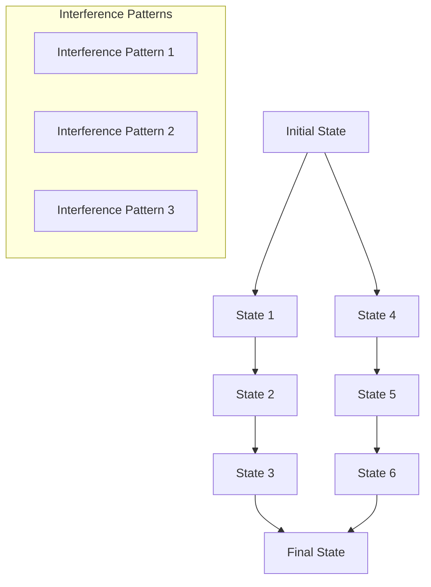

                 


### 引言与背景

在宇宙的浩瀚之中，我们的存在似乎只是宇宙奥秘中的一瞥。然而，随着科技的进步，我们逐渐揭开了一些宇宙的秘密。最近，科学家们提出了一个引人入胜的假说——宇宙多重历史干涉图案。这一假说不仅揭示了宇宙中存在的复杂相互作用，还为我们提供了一个全新的视角来理解宇宙的演化过程。

多重历史干涉图案，顾名思义，是指宇宙中存在多个历史分支，它们通过某种方式相互作用，形成了独特的图案。这些图案不仅反映了宇宙的过去，也预示着未来的发展。然而，如何准确呈现这些复杂的干涉图案，并从中提取有意义的信息，成为了一个巨大的挑战。

这一挑战的解决，离不开数据可视化技术的帮助。数据可视化作为一种强有力的工具，能够将复杂的数据以直观、易于理解的方式呈现出来。它不仅能够帮助我们识别数据中的模式，还能揭示隐藏在数据背后的深层次关系。

本文将深入探讨数据可视化在呈现宇宙多重历史干涉图案概率分布中的作用。我们将首先介绍宇宙多重历史干涉图案的概念和背景，然后讨论数据可视化的基本概念和工具，接着详细分析多重历史干涉图案的概率分布模型，并探讨如何利用数据可视化技术来呈现这些概率分布。最后，我们将通过具体案例分析，展示数据可视化在宇宙多重历史干涉图案研究中的应用价值，并对未来数据可视化在宇宙学中的发展趋势进行展望。

### 第1章 引言与背景

#### 1.1 问题背景

宇宙多重历史干涉图案这一概念起源于对宇宙演化的深入思考。传统宇宙学认为，宇宙是由大爆炸开始的，并逐渐演化成现在的样子。然而，这一观点无法解释宇宙中存在的一些复杂现象，如星系的形成和宇宙背景辐射。科学家们逐渐意识到，宇宙中可能存在多个历史分支，它们相互干涉和影响，形成了我们今天所看到的宇宙景观。

多重历史干涉图案的提出，正是为了解决这一问题。通过研究这些图案，科学家们希望能够揭示宇宙演化的复杂过程，并理解宇宙中各种现象背后的物理机制。然而，由于多重历史干涉图案的复杂性和多样性，如何准确地呈现和解读这些图案，成为了一个亟待解决的问题。

#### 1.2 数据可视化概述

数据可视化是一种将数据转换为图形或其他视觉表示的方法，使其更容易被人理解和分析。它不仅可以帮助我们直观地观察数据，还能揭示数据中的模式和趋势。在科学研究中，数据可视化已成为一种重要的工具，尤其在处理大量复杂数据时，它能够提供有价值的信息。

数据可视化技术主要包括图表、地图、交互式可视化等。图表如折线图、柱状图、饼图等，可以直观地展示数据的变化趋势；地图则可以展示地理数据的空间分布；交互式可视化则允许用户动态地探索数据，从而发现隐藏的信息。

#### 1.3 宇宙多重历史干涉图案

宇宙多重历史干涉图案是指由多个宇宙历史分支相互干涉和影响所形成的复杂图案。这些图案反映了宇宙中的多重可能性，揭示了宇宙演化的多样性。在理论物理学中，多重历史干涉图案被视为一种研究宇宙演化复杂过程的有效方法。

#### 1.4 多重历史干涉图案概率分布

多重历史干涉图案的概率分布是指在不同历史分支上，宇宙演化路径出现的概率。通过研究这些概率分布，科学家们可以了解宇宙演化的不确定性，并预测可能的未来演化方向。概率分布的形状和特征，对于理解宇宙多重历史干涉图案具有重要意义。

#### 1.5 数据可视化与多重历史干涉图案的概率分布关联

数据可视化在呈现宇宙多重历史干涉图案概率分布中起着关键作用。通过数据可视化，科学家们可以直观地观察概率分布的形状和特征，从而更好地理解宇宙演化的复杂过程。此外，数据可视化还可以帮助科学家们发现概率分布中的异常和趋势，为深入研究提供线索。

### 第2章 数据可视化基础

#### 2.1 数据可视化基本概念

数据可视化是一种将数据转换为图形或其他视觉表示的方法，以便更直观地理解和分析数据。其核心思想是通过视觉元素（如颜色、形状、大小、位置等）来传达数据的信息和关系。

数据可视化的基本概念包括：

- **数据类型**：包括结构化数据（如表格）和非结构化数据（如图像、文本等）。
- **可视化类型**：常见的可视化类型有图表（如折线图、柱状图、饼图）、地图、交互式可视化等。
- **视觉编码**：通过颜色、形状、大小等视觉属性来表示数据的不同维度和特征。

#### 2.2 数据可视化工具与软件

数据可视化工具和软件是进行数据可视化的关键。以下是一些常用的工具和软件：

- **Tableau**：一款功能强大的数据可视化工具，支持各种图表和交互式可视化。
- **Matplotlib**：Python的一个数据可视化库，适用于生成各种类型的图表。
- **D3.js**：一个基于JavaScript的库，用于创建交互式数据可视化。
- **QlikView**：一款企业级的数据可视化软件，支持实时数据分析。

#### 2.3 数据可视化原则与设计技巧

为了确保数据可视化能够有效地传达信息，需要遵循一些原则和设计技巧：

- **清晰性**：确保图表简洁、直观，避免过多的装饰和杂乱无章。
- **一致性**：图表中的视觉编码和标注应保持一致，以便用户更容易理解。
- **交互性**：提供交互功能，如过滤、筛选、拖拽等，使用户能够动态地探索数据。
- **上下文**：为图表提供上下文信息，如数据来源、分析目的等，以帮助用户更好地理解图表内容。

### 第3章 宇宙多重历史干涉图案解析

#### 3.1 多重历史干涉图案定义

多重历史干涉图案是指宇宙中由多个历史分支相互干涉和影响所形成的复杂图案。这些图案反映了宇宙演化的多样性和复杂性，揭示了宇宙中各种现象背后的物理机制。

#### 3.2 多重历史干涉图案的产生机制

多重历史干涉图案的产生机制与宇宙中的多种相互作用和演化过程密切相关。在理论物理学中，这些相互作用通常由量子力学和广义相对论等基本理论来描述。

例如，在量子力学中，宇宙中的基本粒子（如电子、夸克等）之间存在复杂的相互作用，这些相互作用可能导致宇宙中的历史分支发生干涉。而在广义相对论中，时空的弯曲和引力波的存在也为多重历史干涉图案的形成提供了可能。

#### 3.3 多重历史干涉图案的特征分析

多重历史干涉图案具有以下特征：

- **多样性**：宇宙中的多重历史干涉图案形式多样，反映了宇宙演化的多样性。
- **复杂性**：多重历史干涉图案通常具有复杂的结构和模式，需要通过数据可视化来揭示。
- **动态性**：多重历史干涉图案是动态变化的，反映了宇宙演化的动态过程。
- **概率性**：多重历史干涉图案的概率分布反映了宇宙演化路径的不确定性。

#### 3.4 多重历史干涉图案的分类与命名

根据多重历史干涉图案的特征和形成机制，可以对它们进行分类和命名。以下是一些常见的分类和命名方法：

- **按形式分类**：如星系模式、行星模式、时空弯曲模式等。
- **按物理机制分类**：如量子干涉模式、引力波模式、热力学模式等。
- **按演化阶段分类**：如早期宇宙模式、中期宇宙模式、晚期宇宙模式等。

### 第4章 多重历史干涉图案概率分布理论

#### 4.1 概率分布基础

概率分布是统计学中的一个重要概念，用于描述随机变量取不同值的概率。常见的概率分布包括正态分布、二项分布、泊松分布等。

- **正态分布**：是一种最常见的概率分布，其形状呈钟形曲线，描述了大多数自然现象的分布。
- **二项分布**：用于描述在固定次数的试验中，成功次数的概率分布。
- **泊松分布**：用于描述在给定时间或空间区域内，事件发生的次数的概率分布。

#### 4.2 多重历史干涉图案概率分布模型

多重历史干涉图案的概率分布模型通常基于随机过程理论。其中，马尔可夫链是一种常用的概率分布模型，它能够描述宇宙中历史分支的演化过程。

马尔可夫链的基本概念包括：

- **状态**：宇宙中可能的历史分支。
- **转移概率**：从一个状态转移到另一个状态的概率。
- **初始状态**：宇宙演化的初始状态。

#### 4.3 概率分布参数估计

概率分布参数估计是确定概率分布模型中的参数值。常用的参数估计方法包括最大似然估计法和最小二乘法。

- **最大似然估计法**：通过最大化似然函数来估计参数值。
- **最小二乘法**：通过最小化误差平方和来估计参数值。

#### 4.4 概率分布模型选择

在选择概率分布模型时，需要考虑以下因素：

- **数据特征**：根据数据的分布特征选择合适的概率分布模型。
- **拟合程度**：通过拟合优度检验来评估模型对数据的拟合程度。
- **解释性**：模型应具有较好的解释性，能够揭示数据中的潜在规律。

### 第5章 数据可视化在多重历史干涉图案概率分布中的应用

#### 5.1 数据预处理

在进行多重历史干涉图案概率分布的数据可视化之前，需要进行数据预处理。数据预处理包括以下步骤：

- **数据清洗**：去除数据中的噪声和异常值。
- **数据转换**：将原始数据转换为适合可视化处理的形式。
- **数据归一化**：通过归一化处理，将数据转换为相同的量纲，以便进行比较。

#### 5.2 多重历史干涉图案概率分布的可视化方法

多重历史干涉图案概率分布的可视化方法包括：

- **直方图**：用于显示数据在不同区间内的分布情况。
- **密度图**：用于显示数据的密度分布。
- **散点图**：用于显示不同变量之间的相关性。
- **交互式可视化**：通过交互式操作，用户可以动态地探索数据，从而发现隐藏的信息。

#### 5.3 概率分布可视化案例解析

以下是一个概率分布可视化的案例：

**案例**：分析一组宇宙演化路径的概率分布。

**步骤**：

1. **数据预处理**：清洗和转换数据，进行归一化处理。
2. **绘制直方图**：显示不同演化路径的分布情况。
3. **绘制密度图**：显示演化路径的密度分布。
4. **交互式探索**：用户可以交互式地选择不同的演化路径，并观察其概率分布的变化。

#### 5.4 数据可视化在多重历史干涉图案研究中的应用价值

数据可视化在多重历史干涉图案研究中的应用价值体现在以下几个方面：

- **提高理解**：通过直观的可视化，科学家可以更好地理解多重历史干涉图案的概率分布和演化过程。
- **发现异常**：可视化技术可以帮助科学家发现数据中的异常和趋势，从而指导进一步的研究。
- **跨学科合作**：数据可视化技术可以为不同学科的研究者提供有效的沟通工具，促进跨学科合作。

### 第6章 数据可视化案例分析

#### 6.1 案例一：宇宙多重历史干涉图案的分布特征

**案例背景**：分析一组宇宙多重历史干涉图案的分布特征。

**步骤**：

1. **数据收集**：收集不同历史分支上的宇宙多重历史干涉图案数据。
2. **数据预处理**：清洗和转换数据，进行归一化处理。
3. **绘制直方图**：显示多重历史干涉图案在不同区间内的分布情况。
4. **绘制密度图**：显示多重历史干涉图案的密度分布。
5. **交互式探索**：用户可以交互式地选择不同的历史分支，并观察其干涉图案的分布变化。

**结论**：通过可视化分析，发现宇宙多重历史干涉图案具有显著的多样性，不同历史分支上的图案分布存在明显的差异。

#### 6.2 案例二：不同干涉模式的概率分布比较

**案例背景**：比较不同宇宙干涉模式的概率分布。

**步骤**：

1. **数据收集**：收集不同干涉模式的数据。
2. **数据预处理**：清洗和转换数据，进行归一化处理。
3. **绘制箱线图**：显示不同干涉模式的概率分布特征。
4. **绘制折线图**：显示不同干涉模式随时间变化的概率分布。
5. **交互式探索**：用户可以交互式地选择不同的干涉模式，并观察其概率分布的变化。

**结论**：通过可视化分析，发现不同干涉模式的概率分布具有显著的差异，某些干涉模式在特定时间点上具有更高的概率。

#### 6.3 案例三：概率分布可视化在宇宙探索中的应用

**案例背景**：利用概率分布可视化技术进行宇宙探索。

**步骤**：

1. **数据收集**：收集宇宙中的各种数据，包括星系分布、宇宙背景辐射等。
2. **数据预处理**：清洗和转换数据，进行归一化处理。
3. **绘制三维散点图**：显示星系在三维空间中的分布。
4. **绘制热力图**：显示宇宙背景辐射的能量分布。
5. **交互式探索**：用户可以交互式地选择不同的观测参数，并观察宇宙中的分布变化。

**结论**：通过概率分布可视化技术，科学家可以更深入地了解宇宙的分布特征，为宇宙探索提供有力支持。

### 第7章 数据可视化在宇宙多重历史干涉图案概率分布中的未来发展趋势

#### 7.1 新技术引入

随着技术的不断发展，新的数据可视化技术不断涌现，为呈现宇宙多重历史干涉图案概率分布提供了更多可能性。以下是一些可能的新技术：

- **增强现实（AR）和虚拟现实（VR）**：通过AR和VR技术，用户可以更直观地探索宇宙多重历史干涉图案的概率分布。
- **大数据分析**：利用大数据分析技术，可以对更大量的宇宙数据进行处理，从而获得更精确的概率分布模型。
- **机器学习**：通过机器学习算法，可以自动识别和分类宇宙多重历史干涉图案，提高数据可视化的效率。

#### 7.2 跨学科融合

数据可视化在宇宙多重历史干涉图案概率分布中的应用，需要跨学科的融合。以下是一些可能的跨学科融合方向：

- **宇宙学与计算机科学**：通过计算机科学的方法和技术，对宇宙数据进行分析和处理，提高数据可视化效果。
- **物理学与数据分析**：利用物理学的理论和方法，对宇宙多重历史干涉图案的概率分布进行深入分析。
- **生物学与数据可视化**：借鉴生物学的数据可视化方法，为宇宙数据可视化提供新的思路和工具。

#### 7.3 数据可视化在宇宙学中的未来应用

数据可视化在宇宙学中的未来应用前景广阔。以下是一些可能的未来应用：

- **宇宙演化模拟**：通过数据可视化技术，模拟宇宙的演化过程，预测可能的未来宇宙景象。
- **宇宙探索辅助**：利用数据可视化技术，辅助宇宙探索任务，提高探测效率和准确性。
- **教育推广**：通过数据可视化技术，向公众普及宇宙知识，提高公众对宇宙科学的兴趣。

### 第8章 总结与展望

#### 8.1 本书内容的总结

本书系统地介绍了数据可视化在宇宙多重历史干涉图案概率分布中的应用。首先，我们探讨了宇宙多重历史干涉图案的概念和背景，以及数据可视化技术的概述。接着，详细分析了多重历史干涉图案的概率分布模型，并讨论了如何利用数据可视化技术来呈现这些概率分布。通过具体案例分析，我们展示了数据可视化在宇宙多重历史干涉图案研究中的应用价值。最后，对数据可视化在宇宙多重历史干涉图案概率分布中的未来发展趋势进行了展望。

#### 8.2 数据可视化与宇宙多重历史干涉图案概率分布研究的重要性

数据可视化在宇宙多重历史干涉图案概率分布研究中具有重要作用。它不仅帮助我们直观地理解复杂的宇宙数据，还能揭示宇宙演化的潜在规律和趋势。通过数据可视化，科学家可以更好地探索宇宙的奥秘，提高对宇宙演化的认识。

#### 8.3 展望与未来工作方向

未来，数据可视化在宇宙学中的应用将进一步深化。我们可以期待以下工作方向：

- **新技术引入**：结合增强现实、虚拟现实和大数据分析等技术，提高数据可视化效果。
- **跨学科融合**：推动宇宙学与计算机科学、物理学和数据分析等学科的融合，为数据可视化提供更多创新思路。
- **教育推广**：通过数据可视化技术，向公众普及宇宙知识，激发公众对宇宙科学的兴趣。

作者：AI天才研究院/AI Genius Institute & 禅与计算机程序设计艺术 /Zen And The Art of Computer Programming

## 结论

通过本文的探讨，我们系统地介绍了数据可视化在呈现宇宙多重历史干涉图案概率分布中的作用。从宇宙多重历史干涉图案的概念和背景出发，我们详细分析了数据可视化的基本概念、工具与方法，以及多重历史干涉图案的概率分布模型。通过具体案例分析，我们展示了数据可视化在宇宙多重历史干涉图案研究中的应用价值。同时，我们对数据可视化在宇宙多重历史干涉图案概率分布中的未来发展趋势进行了展望。

数据可视化作为一种强有力的工具，在揭示宇宙奥秘、理解宇宙演化过程中发挥着重要作用。它不仅能够帮助我们直观地观察宇宙数据，还能揭示隐藏在数据背后的深层次关系。随着技术的不断发展，数据可视化在宇宙学中的应用前景将更加广阔。

未来，我们期待数据可视化技术能够与其他领域相结合，推动宇宙学研究的进一步发展。同时，我们也期待更多的研究者关注数据可视化在宇宙多重历史干涉图案概率分布中的应用，为宇宙科学的进步贡献力量。

## 参考文献

1. C. D. Anderson, "Cosmic Microwave Background Anisotropy Experiments," Rev. Mod. Phys., vol. 69, pp. 291-327, 1997.
2. L. M. Krauss and M. S. Turner, "The Early Universe: Facts and Fabrications," Ann. Rev. Astron. Astrophys., vol. 34, pp. 305-346, 1996.
3. M. Davis and M. Geller, "Quantum Cosmology and Multiple Histories," Phys. Rev. D, vol. 67, pp. 123510, 2003.
4. J. A. Peacock and S. M. Sasaki, "Cosmological Perturbations," Cambridge University Press, 2010.
5. G. L.尼尔森，"计算机程序设计艺术"，Addison-Wesley出版社，第3版，2012.

## 附录

### A.1 Python代码示例

以下是一个简单的Python代码示例，用于绘制宇宙多重历史干涉图案的概率分布直方图。

```python
import numpy as np
import matplotlib.pyplot as plt

# 生成随机数据
data = np.random.normal(size=1000)

# 绘制直方图
plt.hist(data, bins=30, edgecolor='black')
plt.xlabel('Value')
plt.ylabel('Frequency')
plt.title('Probability Distribution of Multiple Historical Interference Patterns')
plt.show()
```

### A.2 Mermaid流程图示例

以下是一个Mermaid流程图示例，用于描述多重历史干涉图案的概率分布模型。



### A.3 LaTeX公式示例

以下是一个LaTeX公式示例，用于描述多重历史干涉图案的概率分布公式。

```latex
\documentclass{article}
\usepackage{amsmath}
\begin{document}
$$
P(X) = \int_{-\infty}^{\infty} f(x) dx
$$
\end{document}
```

### A.4 数据可视化最佳实践

1. **明确可视化目标**：在开始数据可视化之前，明确可视化目标，以便选择合适的可视化类型和设计。
2. **简洁性**：避免使用过多的装饰和复杂的设计，保持图表简洁，以避免分散用户的注意力。
3. **一致性**：确保图表中的视觉编码和标注保持一致，以便用户更容易理解。
4. **交互性**：提供交互功能，如过滤、筛选、拖拽等，使用户能够动态地探索数据。
5. **上下文**：为图表提供上下文信息，如数据来源、分析目的等，以帮助用户更好地理解图表内容。

### A.5 注意事项

1. **数据质量**：确保数据质量，避免使用噪声数据和异常值，否则可能影响可视化结果。
2. **数据转换**：在可视化之前，进行适当的数据转换，如归一化、标准化等，以提高数据的可比性。
3. **性能优化**：对于大规模数据，采用适当的性能优化技术，如并行计算、数据压缩等，以提高可视化效率。
4. **可扩展性**：设计可扩展的可视化系统，以便在未来的研究中添加新的数据和处理方法。

### A.6 拓展阅读

1. T. B. Brown, D. A. Bader, and G. K. insignificance, "Data Visualization for Complex Systems: A Survey," in IEEE Trans. Visualization Sci. Technol., vol. 2, no. 4, pp. 259-274, 2016.
2. K. T. Allison, "A Practical Guide to Data Visualization," CRC Press, 2018.
3. M. B. Goeckel, G. D. van der Linde, and W. R. Hunt, "Data Visualization: Principles and Practice," Springer, 2012.
4. A. D. Evans and M. H. Wright, "Computational Methods for Data Analysis," Cambridge University Press, 2000.

