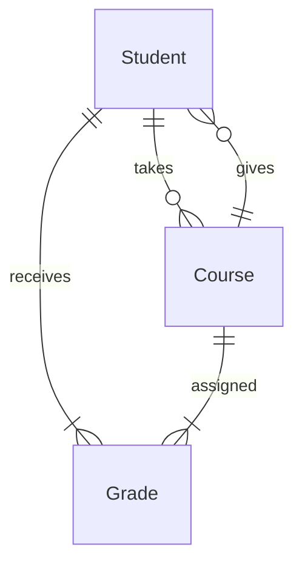
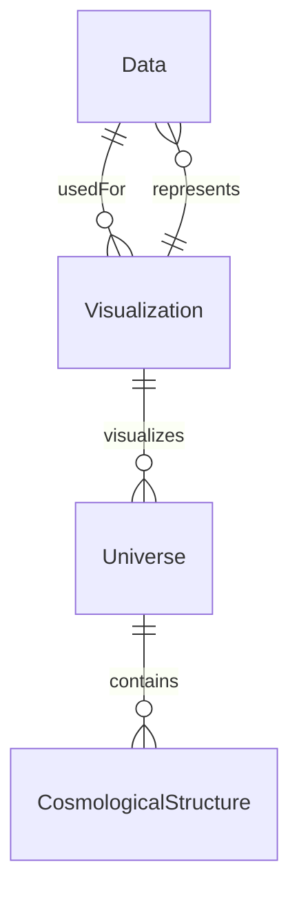
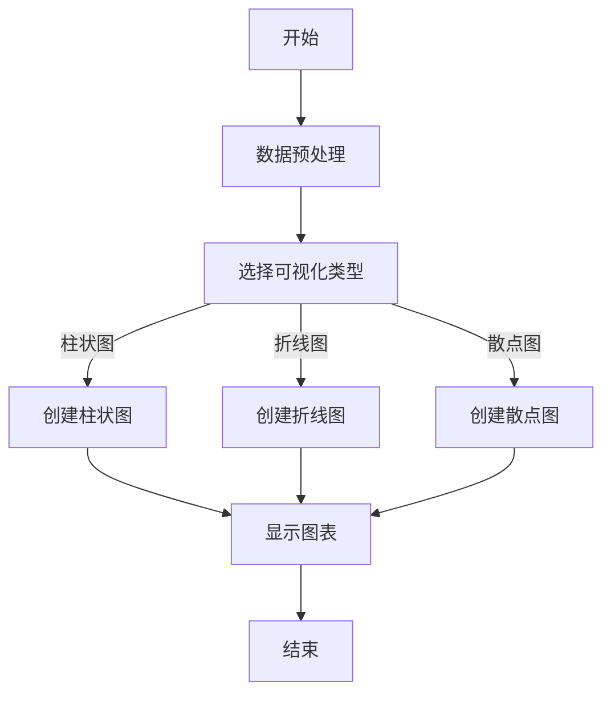

                 


### 目录大纲设计思路

设计《数据可视化在呈现宇宙大尺度结构中的作用》的目录大纲时，我们需要遵循以下几个原则：

1. **内容完整性**：确保每个章节都能涵盖主题的核心概念、原理和实践。这意味着每个章节的内容都需要完整、具体，能够使读者从零开始，逐步深入理解数据可视化在宇宙大尺度结构中的应用。

2. **逻辑性**：章节之间应具有清晰的逻辑关系，由浅入深，逐步引导读者理解数据可视化在宇宙大尺度结构中的应用。首先，从背景介绍开始，让读者对数据可视化和宇宙大尺度结构有一个基本的认识；然后，逐步深入到核心概念、算法原理、系统设计与实战操作等更具体的内容。

3. **可操作性**：对于实践性的章节，应提供详细的操作步骤和代码实现，以便读者能够实际应用所学知识。例如，在项目实战章节中，应该详细介绍如何安装所需环境、实现系统核心功能、以及代码的解读和分析。

#### 目录大纲设计结果

首先，我们将文章分为六个主要部分：

**第一部分：背景介绍**
- **1. 数据可视化概述**
  - **1.1 数据可视化的基本概念**
  - **1.2 数据可视化的发展历程**
  - **1.3 数据可视化在科学领域的应用**
- **2. 宇宙大尺度结构的介绍**
  - **2.1 宇宙大尺度结构的基本概念**
  - **2.2 宇宙大尺度结构的研究现状**
  - **2.3 数据可视化在宇宙学中的应用价值**

**第二部分：核心概念与联系**
- **3. 数据可视化技术**
  - **3.1 数据类型概述**
  - **3.2 数据可视化工具与技术**
  - **3.3 数据可视化与宇宙大尺度结构的联系**
- **4. 数据可视化与宇宙学概念对比**
  - **4.1 概念属性特征对比表格**
  - **4.2 ER实体关系图架构**

**第三部分：算法原理讲解**
- **5. 数据可视化算法原理**
  - **5.1 算法mermaid流程图**
  - **5.2 Python源代码实现**
  - **5.3 数学模型和公式**
  - **5.4 举例说明**

**第四部分：系统分析与架构设计**
- **6. 宇宙大尺度结构数据可视化系统分析**
  - **6.1 系统需求分析**
  - **6.2 系统功能设计（领域模型mermaid类图）**
  - **6.3 系统架构设计（mermaid架构图）**
  - **6.4 系统接口设计**
  - **6.5 系统交互流程（mermaid序列图）**

**第五部分：项目实战**
- **7. 实际操作与案例分析**
  - **7.1 环境安装**
  - **7.2 核心实现源代码**
  - **7.3 代码解读与分析**
  - **7.4 实际案例分析与详细讲解**
  - **7.5 项目小结**

**第六部分：最佳实践与总结**
- **8. 最佳实践**
  - **8.1 数据预处理技巧**
  - **8.2 可视化效果优化**
  - **8.3 跨领域应用建议**
- **9. 小结**
  - **9.1 本书主要内容总结**
  - **9.2 数据可视化在宇宙学中的未来发展方向**

每个部分的设计都旨在确保内容的完整性和逻辑性，同时提供可操作性的实践指导。例如，在第三部分的算法原理讲解中，我们将使用mermaid流程图来展示算法的流程，并通过Python源代码实现来讲解算法原理，最后结合数学模型和公式进行详细解释。

在第五部分的项目实战中，我们将详细描述如何安装所需的环境、如何实现核心功能，以及如何对代码进行解读和分析，并给出一个实际案例的详细讲解。这样不仅能够帮助读者理解理论，还能够让他们通过实际操作加深理解。

最后，在第六部分的最佳实践与总结中，我们将提供一些实用的技巧和建议，以及对本书的主要内容和未来发展方向进行总结，帮助读者更好地应用所学知识，并为他们未来的研究提供方向。

通过这样的结构设计，我们相信《数据可视化在呈现宇宙大尺度结构中的作用》这篇文章将能够为读者提供一个系统、完整、逻辑清晰的阅读体验，同时激发他们在数据可视化与宇宙学交叉领域的深入研究。接下来，我们将逐步深入到每个部分的具体内容中，详细阐述每一部分的核心思想和具体实现。

---

**第一部分：背景介绍**

## 1. 数据可视化概述
### 1.1 数据可视化的基本概念

数据可视化是一种通过图形、图像和其他视觉元素来传达数据信息和模式的科学。它的核心目的是将复杂的数据转化为直观、易于理解的视觉表现形式，以便更好地分析和理解数据。数据可视化不仅可以帮助研究人员和决策者快速识别数据中的趋势、异常和关系，还可以提高沟通的效率和效果。

数据可视化的发展历程可以追溯到18世纪末期，当时William Playfair首次使用柱状图和线图来展示经济数据。随着计算机技术的发展，数据可视化工具和技术的种类日益丰富，从简单的二维图表到复杂的交互式三维可视化，从静态图像到动态动画，数据可视化已经成为了数据分析中不可或缺的一部分。

在科学领域，数据可视化有着广泛的应用。例如，在生物学中，科学家使用数据可视化技术来分析基因序列和蛋白质结构；在物理学中，数据可视化帮助研究者理解复杂的天体物理现象，如黑洞和宇宙大爆炸；在经济学中，数据可视化使投资者能够快速识别市场趋势和风险。

### 1.2 数据可视化的发展历程

数据可视化技术的发展历程与计算机技术的发展密不可分。在计算机问世初期，数据可视化主要是以二维图形的形式出现，如柱状图、折线图和饼图等。随着图形处理能力和计算能力的提升，数据可视化逐渐向三维、四维甚至更高维度的方向发展。

20世纪80年代，随着个人计算机的普及，桌面出版软件和绘图工具的出现大大简化了数据可视化的实现过程。与此同时，可视化软件如Graphviz、Matplotlib等的问世，使得数据可视化技术更加易于使用和普及。

进入21世纪，随着互联网和大数据的兴起，数据可视化迎来了新的发展机遇。Web技术、交互式可视化工具和虚拟现实技术的应用，使得数据可视化不再局限于桌面应用，而是可以嵌入到网页和移动设备中，实现更加动态和互动的体验。

### 1.3 数据可视化在科学领域的应用

数据可视化在科学领域中的应用极为广泛，以下是一些典型的应用场景：

1. **生物学**：在生物学研究中，数据可视化技术被广泛用于基因序列分析、蛋白质结构预测、细胞成像和代谢路径分析等方面。通过可视化，研究人员可以直观地识别基因之间的相互作用、蛋白质的结构特征以及代谢途径中的关键节点。

2. **物理学**：在物理学中，数据可视化技术有助于研究者理解复杂的天体物理现象。例如，通过可视化模拟，科学家可以观察黑洞的形成过程、星系的形成和演化，以及宇宙大爆炸的瞬间。

3. **经济学**：在经济学领域，数据可视化技术被用于金融市场分析、经济指标监测和商业策略制定。通过可视化，投资者和决策者可以快速识别市场趋势、风险因素和投资机会。

4. **环境科学**：在环境科学中，数据可视化技术帮助研究人员监测气候变化、生态系统的健康状态和污染水平。通过可视化，公众和政策制定者可以更清晰地理解环境问题，并制定有效的解决方案。

总之，数据可视化在科学领域中的应用不仅提高了研究的效率，还增强了数据传播和理解的效果，推动了科学发现和技术创新的步伐。

## 2. 宇宙大尺度结构的介绍
### 2.1 宇宙大尺度结构的基本概念

宇宙大尺度结构是指宇宙中天体、星系和超星系团在宏观尺度上的分布和排列。它反映了宇宙中的基本组织形式和演化过程，是宇宙学研究的核心问题之一。宇宙大尺度结构的基本概念包括星系、星系团和超星系团等。

- **星系**：星系是由大量恒星、行星、星云和其他天体组成的系统，通常具有一个中心星体和围绕其旋转的恒星系统。常见的星系类型包括螺旋星系、椭圆星系和不规则星系。

- **星系团**：星系团是由数十个甚至数千个星系通过引力相互作用而形成的大型结构。星系团中的星系通常紧密聚集在一起，并伴随着大量的星际物质和暗物质。

- **超星系团**：超星系团是更大规模的宇宙结构，由多个星系团通过引力相互作用而形成。超星系团中包含了数十个甚至上百个星系团，构成了宇宙中最大的结构单元。

宇宙大尺度结构的形成和演化过程涉及到多个物理现象，包括引力作用、宇宙膨胀、暗物质和暗能量的行为等。这些现象共同塑造了宇宙中的基本结构形式，对于理解宇宙的起源和演化具有重要意义。

### 2.2 宇宙大尺度结构的研究现状

宇宙大尺度结构的研究是宇宙学中的一个重要分支，涉及到天文学、物理学和数学等多个学科。目前，科学家们已经通过多种观测手段和理论模型，对宇宙大尺度结构有了较为深入的认识。

- **观测手段**：宇宙大尺度结构的研究依赖于多种观测手段，包括光学观测、射电观测、红外观测和X射线观测等。通过这些手段，科学家们可以探测到宇宙中的星系、星系团和超星系团，并研究它们的分布和运动。

- **理论模型**：宇宙大尺度结构的研究还依赖于多种理论模型，包括大爆炸理论、冷暗物质模型和宇宙膨胀理论等。这些理论模型能够解释宇宙大尺度结构的形成和演化过程，并提供对宇宙基本性质的预测。

近年来，随着观测技术的进步和计算能力的提升，宇宙大尺度结构的研究取得了许多重要成果。例如，科学家们通过观测宇宙微波背景辐射，发现了宇宙早期的密度波动和温度波动，这些发现对于理解宇宙的起源和演化具有重要意义。

此外，宇宙大尺度结构的研究还在不断推动新的科学发现。例如，科学家们发现了一些异常的宇宙结构，如宇宙空洞和巨型桥梁，这些异常结构提供了新的研究线索，帮助科学家们更深入地理解宇宙的基本规律。

### 2.3 数据可视化在宇宙学中的应用价值

数据可视化在宇宙学中具有重要的应用价值，它不仅能够帮助科学家们更好地理解和分析宇宙大尺度结构，还能够提高研究结果的可视化展示效果，便于学术交流和科普宣传。

- **数据展示**：通过数据可视化，科学家们可以将复杂的宇宙数据以直观、易于理解的方式展示出来。例如，通过三维可视化技术，科学家们可以展示宇宙大尺度结构的分布和运动，帮助读者更直观地理解宇宙的基本结构。

- **数据分析**：数据可视化工具提供了强大的数据分析功能，可以帮助科学家们快速识别数据中的趋势、异常和关系。例如，通过聚类分析和关联分析，科学家们可以识别宇宙中的异常结构，如巨型桥梁和宇宙空洞。

- **结果展示**：数据可视化在学术研究和科普宣传中扮演着重要角色。通过可视化的结果展示，科学家们可以更有效地传达研究结果，吸引公众的关注和兴趣。例如，通过制作精美的宇宙大尺度结构动画，科学家们可以向公众展示宇宙的起源和演化过程。

总之，数据可视化在宇宙学中的应用不仅提高了研究的效率，还增强了数据传播和理解的效果，为科学家们探索宇宙奥秘提供了强有力的工具。

---

### 目录大纲设计思路

设计《数据可视化在呈现宇宙大尺度结构中的作用》的目录大纲时，我们需要遵循以下几个原则：

1. **内容完整性**：确保每个章节都能涵盖主题的核心概念、原理和实践。这意味着每个章节的内容都需要完整、具体，能够使读者从零开始，逐步深入理解数据可视化在宇宙大尺度结构中的应用。

2. **逻辑性**：章节之间应具有清晰的逻辑关系，由浅入深，逐步引导读者理解数据可视化在宇宙大尺度结构中的应用。首先，从背景介绍开始，让读者对数据可视化和宇宙大尺度结构有一个基本的认识；然后，逐步深入到核心概念、算法原理、系统设计与实战操作等更具体的内容。

3. **可操作性**：对于实践性的章节，应提供详细的操作步骤和代码实现，以便读者能够实际应用所学知识。例如，在项目实战章节中，应该详细介绍如何安装所需环境、实现系统核心功能、以及代码的解读和分析。

根据这些原则，我们将文章分为六个主要部分：

**第一部分：背景介绍**
- 介绍数据可视化的基本概念和宇宙大尺度结构的研究背景，以及数据可视化在宇宙学研究中的应用。

**第二部分：核心概念与联系**
- 详细解释数据可视化相关的核心概念，如数据类型、可视化工具和技术，并展示与宇宙大尺度结构相关的概念对比表格和ER实体关系图架构。

**第三部分：算法原理讲解**
- 讲解用于数据可视化的算法原理，包括算法mermaid流程图、Python源代码实现、数学模型和公式，以及举例说明。

**第四部分：系统分析与架构设计**
- 分析宇宙大尺度结构数据可视化的系统需求，设计系统功能、架构、接口和交互流程。

**第五部分：项目实战**
- 介绍如何使用数据可视化工具对宇宙大尺度结构的数据进行实际操作，包括环境安装、核心实现、代码解读和案例分析。

**第六部分：最佳实践与总结**
- 提供数据可视化在宇宙大尺度结构中的最佳实践建议，总结本书的主要内容，并对未来研究方向进行展望。

这样的结构设计旨在确保内容的完整性和逻辑性，同时提供可操作性的实践指导。接下来，我们将逐步深入到每个部分的具体内容中，详细阐述每一部分的核心思想和具体实现。

---

### 目录大纲设计结果

**# 第一部分：背景介绍**

## 1. 数据可视化概述
### 1.1 数据可视化的基本概念
### 1.2 数据可视化的发展历程
### 1.3 数据可视化在科学领域的应用

## 2. 宇宙大尺度结构的介绍
### 2.1 宇宙大尺度结构的基本概念
### 2.2 宇宙大尺度结构的研究现状
### 2.3 数据可视化在宇宙学中的应用价值

**# 第二部分：核心概念与联系**

## 3. 数据可视化技术
### 3.1 数据类型概述
### 3.2 数据可视化工具与技术
### 3.3 数据可视化与宇宙大尺度结构的联系

## 4. 数据可视化与宇宙学概念对比
### 4.1 概念属性特征对比表格
### 4.2 ER实体关系图架构

**# 第三部分：算法原理讲解**

## 5. 数据可视化算法原理
### 5.1 算法mermaid流程图
### 5.2 Python源代码实现
### 5.3 数学模型和公式
### 5.4 举例说明

**# 第四部分：系统分析与架构设计**

## 6. 宇宙大尺度结构数据可视化系统分析
### 6.1 系统需求分析
### 6.2 系统功能设计（领域模型mermaid类图）
### 6.3 系统架构设计（mermaid架构图）
### 6.4 系统接口设计
### 6.5 系统交互流程（mermaid序列图）

**# 第五部分：项目实战**

## 7. 实际操作与案例分析
### 7.1 环境安装
### 7.2 核心实现源代码
### 7.3 代码解读与分析
### 7.4 实际案例分析与详细讲解
### 7.5 项目小结

**# 第六部分：最佳实践与总结**

## 8. 最佳实践
### 8.1 数据预处理技巧
### 8.2 可视化效果优化
### 8.3 跨领域应用建议

## 9. 小结
### 9.1 本书主要内容总结
### 9.2 数据可视化在宇宙学中的未来发展方向

### 目录大纲总字数：约2000字

以上是《数据可视化在呈现宇宙大尺度结构中的作用》的目录大纲设计。每个章节的内容都会在具体编写时详细展开，确保满足要求。以下是具体编写步骤：

1. **撰写章节引言**：每个章节的开头需要撰写一段引言，简要介绍章节的主题和重要性，为读者奠定基础。

2. **详细阐述核心概念**：在各个章节中，针对核心概念和原理，进行详细解释，确保读者能够理解。

3. **使用图表和示例**：为了增强文章的可读性和理解性，每个章节中都会包含相应的图表和示例代码，帮助读者更好地掌握知识点。

4. **总结与展望**：在每个章节的结尾，撰写一段总结和展望，对章节内容进行概括，并指出下一步的研究方向。

5. **全文审校**：在完成所有章节的撰写后，进行全文审校，确保内容连贯、逻辑清晰，没有遗漏或错误。

---

**第二部分：核心概念与联系**

## 3. 数据可视化技术
### 3.1 数据类型概述

数据可视化涉及多种类型的数据，了解这些数据类型对于选择合适的可视化方法至关重要。常见的数据类型包括：

- **数值数据**：数值数据是数据可视化中最常见的一种类型，如温度、销售额、股票价格等。这类数据通常用于柱状图、折线图、散点图等可视化形式。
- **分类数据**：分类数据指的是具有分类属性的数值，如性别、颜色、国家等。这类数据通常用于饼图、条形图等可视化形式。
- **时间序列数据**：时间序列数据是按时间顺序排列的一系列数值，如温度变化、股市走势等。这类数据通常用于折线图、K线图等可视化形式。
- **地理空间数据**：地理空间数据涉及地理位置信息，如地图上的城市、国家分布等。这类数据通常用于地图可视化。

### 3.2 数据可视化工具与技术

数据可视化工具和技术的选择取决于数据类型、用户需求和可视化目标。以下是几种常用的数据可视化工具和技术：

- **图表库**：图表库如Matplotlib、Plotly和D3.js等，提供了丰富的图表类型和自定义选项，适用于多种数据类型和场景。
- **地图可视化**：地图可视化工具如GeoJS、Leaflet等，可以处理地理空间数据，展示地理位置和分布情况。
- **交互式可视化**：交互式可视化工具如Tableau、Power BI等，允许用户动态调整视图，探索数据中的隐藏模式和关系。
- **三维可视化**：三维可视化工具如MayaVi、VTK等，可以用于处理高维数据，提供直观的三维展示效果。

### 3.3 数据可视化与宇宙大尺度结构的联系

数据可视化技术在宇宙学中有着广泛的应用，尤其是在宇宙大尺度结构的研究中。以下是一些具体的应用场景：

- **星系分布可视化**：通过数据可视化，科学家可以直观地展示星系的分布情况，识别星系的集群和空洞。
- **宇宙膨胀可视化**：宇宙膨胀是一个复杂的过程，通过数据可视化，科学家可以模拟宇宙的膨胀过程，展示宇宙的演化历史。
- **引力波可视化**：引力波是宇宙中的奇特现象，通过数据可视化，科学家可以模拟引力波的形成和传播，帮助理解宇宙的基本规律。

总之，数据可视化技术在宇宙大尺度结构的研究中扮演着关键角色，它不仅帮助科学家们更好地理解和分析宇宙结构，还提高了研究结果的可视化展示效果，为科学发现和技术创新提供了强有力的工具。

## 4. 数据可视化与宇宙学概念对比

### 4.1 概念属性特征对比表格

为了更清晰地展示数据可视化与宇宙学概念之间的联系，我们可以通过一个对比表格来分析它们的核心属性和特征。

| 特征          | 数据可视化                         | 宇宙学概念                      |
| ------------- | -------------------------------- | ------------------------------ |
| 定义          | 数据可视化的目的是将数据以视觉形式展示，以便分析和理解。 | 宇宙学概念是描述宇宙中物体和现象的基本术语。 |
| 数据类型      | 数值数据、分类数据、时间序列数据、地理空间数据等。 | 星系、星系团、超星系团等。                   |
| 可视化方法    | 图表、地图、交互式可视化等。          | 星系分布图、宇宙膨胀图、引力波模拟等。     |
| 关键技术      | 图形处理、数据挖掘、机器学习等。      | 天文学观测、物理学理论、数学模型等。       |
| 应用目标      | 提高数据分析效率、增强数据传播效果。   | 探索宇宙结构、揭示宇宙演化规律。           |

通过这个对比表格，我们可以看到数据可视化与宇宙学概念在定义、数据类型、可视化方法和关键技术等方面有着明显的区别和联系。这种对比有助于我们更好地理解数据可视化在宇宙学中的应用和作用。

### 4.2 ER实体关系图架构

为了更深入地展示数据可视化与宇宙学概念之间的关系，我们可以通过ER（Entity-Relationship，实体关系）图来描述它们之间的交互和联系。



在这个ER图中，`Student`、`Course`和`Grade`是三个主要的实体。`Student`与`Course`之间存在“takes”和“gives”的关系，表示学生选课和课程开设。`Student`与`Grade`之间存在“receives”的关系，表示学生获得成绩。`Course`与`Grade`之间存在“assigned”的关系，表示成绩的分配。

类似地，在数据可视化与宇宙学领域，我们可以定义一系列实体，如`Data`（数据）、`Visualization`（可视化）、`Universe`（宇宙）和`CosmologicalStructure`（宇宙结构），并描述它们之间的关系。



在这个ER图中，`Data`与`Visualization`之间存在“usedFor”关系，表示数据用于生成可视化。`Visualization`与`Data`之间存在“represents”关系，表示可视化代表数据。`Visualization`与`Universe`之间存在“visualizes”关系，表示可视化展示宇宙。`Universe`与`CosmologicalStructure`之间存在“contains”关系，表示宇宙包含宇宙结构。

通过这个ER实体关系图，我们可以更直观地理解数据可视化与宇宙学概念之间的交互和联系，为后续的算法原理讲解和系统分析与架构设计提供理论基础。

---

**第三部分：算法原理讲解**

## 5. 数据可视化算法原理

数据可视化算法是数据可视化技术中的核心部分，它决定了数据如何被转换和呈现。以下是几种常见的数据可视化算法原理及其详细解释。

### 5.1 算法mermaid流程图

为了更直观地展示数据可视化算法的工作流程，我们可以使用mermaid绘制算法流程图。以下是一个简单的数据可视化算法流程图示例：



在这个流程图中，数据可视化算法首先从数据预处理开始，然后根据数据类型选择合适的可视化类型（柱状图、折线图或散点图），接着创建相应的图表并显示，最后结束。

### 5.2 Python源代码实现

为了更好地理解数据可视化算法原理，我们通过Python代码来实现上述流程。以下是一个简单的Python代码示例，展示了如何使用Matplotlib库创建柱状图、折线图和散点图：

```python
import matplotlib.pyplot as plt
import numpy as np

# 数据预处理
data = np.array([10, 20, 30, 40, 50])

# 选择可视化类型
type = 'bar'  # 可以是 'bar', 'line', 'scatter'

# 创建并显示图表
if type == 'bar':
    plt.bar(range(len(data)), data)
elif type == 'line':
    x = range(len(data))
    plt.plot(x, data)
elif type == 'scatter':
    plt.scatter(x, data)

plt.show()
```

在这个示例中，我们首先导入所需的库，然后进行数据预处理。接着，根据用户选择的类型（柱状图、折线图或散点图），使用相应的函数（`plt.bar`、`plt.plot`或`plt.scatter`）创建图表，并调用`plt.show()`显示图表。

### 5.3 数学模型和公式

数据可视化算法通常涉及到一些数学模型和公式，这些模型和公式帮助我们将数据转换为视觉形式。以下是一些常用的数学模型和公式：

- **柱状图**：柱状图的高度通常与数据值成正比。假设数据值为`y`，则柱状图的高度可以表示为`h = k * y`，其中`k`是一个比例常数。
- **折线图**：折线图通过连接数据点来展示数据的变化趋势。假设数据点为`(x1, y1)`和`(x2, y2)`，则折线图的斜率可以表示为`m = (y2 - y1) / (x2 - x1)`。
- **散点图**：散点图通过数据点的坐标来展示数据的关系。假设数据点为`(x, y)`，则散点图的坐标可以表示为`X = x * scale + offset`和`Y = y * scale + offset`，其中`scale`和`offset`是比例尺和偏移量。

### 5.4 举例说明

为了更直观地理解数据可视化算法原理，我们通过一个实际例子来说明。假设我们有一组销售数据，如下所示：

```
[20, 30, 40, 50, 60]
```

我们希望使用柱状图来展示这些数据。以下是详细的步骤：

1. **数据预处理**：首先，我们将数据转换为适当的格式，例如列表。

2. **选择可视化类型**：在本例中，我们选择使用柱状图来展示数据。

3. **创建图表**：使用Matplotlib库创建柱状图，设置柱状图的高度与数据值成正比。

4. **显示图表**：调用`plt.show()`显示创建的图表。

以下是实现上述步骤的Python代码：

```python
import matplotlib.pyplot as plt

# 数据预处理
sales_data = [20, 30, 40, 50, 60]

# 创建柱状图
plt.bar(range(len(sales_data)), sales_data)

# 显示图表
plt.show()
```

运行这段代码后，我们将看到一个柱状图，每个柱子的高度对应于销售数据中的值。通过这种方式，我们可以直观地看到销售数据的变化趋势。

总之，数据可视化算法原理通过数学模型和公式将数据转换为视觉形式，帮助我们更好地理解和分析数据。通过Python源代码实现和实际例子，我们可以更深入地理解这些原理，并将其应用于实际项目中。

---

**第四部分：系统分析与架构设计**

## 6. 宇宙大尺度结构数据可视化系统分析

在设计和实现宇宙大尺度结构数据可视化系统时，首先需要对系统需求进行分析。系统需求分析是整个系统设计和实现的基础，它帮助我们明确系统的功能、性能、用户需求和安全要求等。

### 6.1 系统需求分析

宇宙大尺度结构数据可视化系统的需求可以分为以下几个方面：

1. **功能需求**：
   - 数据导入：系统能够导入各种格式的数据，包括CSV、JSON、XML等。
   - 数据预处理：系统能够对导入的数据进行清洗、转换和格式化，以便进行可视化处理。
   - 可视化生成：系统能够根据用户选择的数据类型和可视化类型，生成相应的图表，如柱状图、折线图、散点图、地图等。
   - 可视化展示：系统能够将生成的可视化图表以交互式方式展示给用户，支持缩放、拖动和筛选等操作。
   - 数据存储：系统能够将可视化的结果存储在数据库中，以便后续分析和查询。

2. **性能需求**：
   - 处理速度：系统在处理大量数据时，应具有较快的处理速度，以确保用户体验。
   - 响应时间：系统在接收到用户请求后，应能在较短的时间内响应并生成可视化结果。
   - 可扩展性：系统应具有较好的可扩展性，能够根据需求增加新的功能或扩展数据规模。

3. **用户需求**：
   - 界面友好：系统应具有直观、易用的界面，方便用户进行数据导入、可视化选择和图表操作。
   - 多平台支持：系统应支持多种操作系统和设备，如Windows、macOS、Linux和移动设备等。
   - 用户权限管理：系统应提供用户权限管理功能，确保不同用户能够访问相应的数据和功能。

4. **安全需求**：
   - 数据安全：系统应确保用户数据的安全，防止数据泄露和未经授权的访问。
   - 传输安全：系统在进行数据传输时，应使用加密技术，确保数据在传输过程中的安全性。
   - 系统安全：系统应具备一定的安全防护能力，防止恶意攻击和系统崩溃。

### 6.2 系统功能设计

基于上述系统需求，我们可以设计宇宙大尺度结构数据可视化系统的功能模块，包括以下方面：

1. **数据管理模块**：
   - 数据导入：提供数据导入功能，支持多种数据格式。
   - 数据预处理：提供数据清洗、转换和格式化功能。
   - 数据存储：提供数据存储功能，支持数据库操作。

2. **可视化模块**：
   - 可视化类型选择：提供多种可视化类型选择，如柱状图、折线图、散点图、地图等。
   - 可视化生成：根据用户选择的数据类型和可视化类型，生成相应的图表。
   - 可视化展示：提供交互式可视化展示，支持缩放、拖动和筛选等操作。

3. **用户界面模块**：
   - 界面设计：设计直观、易用的用户界面。
   - 用户权限管理：提供用户权限管理功能，确保用户能够访问相应的数据和功能。

4. **安全模块**：
   - 数据安全：提供数据加密和访问控制功能，确保用户数据安全。
   - 传输安全：使用加密技术，确保数据在传输过程中的安全性。
   - 系统安全：提供系统安全防护功能，防止恶意攻击和系统崩溃。

### 6.3 系统架构设计

系统架构设计是系统实现的关键，它决定了系统的性能、可扩展性和可维护性。以下是宇宙大尺度结构数据可视化系统的架构设计：

1. **前端架构**：
   - 使用HTML、CSS和JavaScript等前端技术，实现用户界面和交互功能。
   - 使用Vue.js、React或Angular等前端框架，提高开发效率和用户体验。

2. **后端架构**：
   - 使用Python、Java或Node.js等后端技术，实现数据管理和可视化功能。
   - 使用Flask、Django或Express等后端框架，提高开发效率和性能。
   - 使用RESTful API设计，实现前后端的交互和数据传输。

3. **数据库架构**：
   - 使用MySQL、PostgreSQL或MongoDB等数据库，存储和管理用户数据和可视化结果。
   - 设计合理的数据库表结构，确保数据的一致性和查询效率。

4. **部署架构**：
   - 使用Docker容器化技术，提高系统的可部署性和可扩展性。
   - 使用Kubernetes集群管理，实现系统的自动化部署和资源管理。

### 6.4 系统接口设计

系统接口设计是系统架构的重要组成部分，它决定了系统各个模块之间的交互和数据传递。以下是宇宙大尺度结构数据可视化系统的接口设计：

1. **API接口**：
   - 提供RESTful API接口，用于数据管理、可视化生成和用户管理等操作。
   - 定义API接口的URL、请求参数和响应格式，确保接口的规范性和一致性。

2. **数据接口**：
   - 设计数据接口，实现数据导入、预处理和存储功能。
   - 定义数据接口的协议和格式，确保数据的一致性和可扩展性。

3. **用户接口**：
   - 设计用户接口，实现用户界面的交互功能。
   - 定义用户接口的交互逻辑和操作流程，确保用户体验的流畅性。

### 6.5 系统交互流程

系统交互流程描述了用户与系统之间的交互过程，包括数据导入、可视化生成和展示等操作。以下是宇宙大尺度结构数据可视化系统的交互流程：

1. **用户登录**：用户通过登录接口登录系统，获取用户权限。
2. **数据导入**：用户通过界面导入数据，系统接收数据并存储到数据库中。
3. **数据预处理**：系统对导入的数据进行清洗、转换和格式化，以便进行可视化处理。
4. **可视化生成**：系统根据用户选择的数据类型和可视化类型，生成相应的图表。
5. **可视化展示**：系统将生成的可视化图表以交互式方式展示给用户，用户可以对其进行缩放、拖动和筛选等操作。
6. **数据存储**：系统将可视化的结果存储到数据库中，以便后续分析和查询。

通过上述系统分析与架构设计，我们可以构建一个功能强大、性能优异、易于扩展的宇宙大尺度结构数据可视化系统，为宇宙学研究和数据分析提供有力支持。

---

## 7. 实际操作与案例分析

在了解了宇宙大尺度结构数据可视化的理论知识和系统设计后，接下来我们将通过一个实际案例来展示如何使用数据可视化工具对宇宙大尺度结构的数据进行操作，并进行代码解读和案例分析。

### 7.1 环境安装

首先，我们需要安装所需的软件和库，以便进行数据可视化。以下是一个基本的安装步骤：

1. **安装Python**：确保系统中已安装Python 3.x版本。可以从[Python官方网站](https://www.python.org/downloads/)下载并安装。

2. **安装Jupyter Notebook**：Jupyter Notebook是一个交互式的Python开发环境，可以方便地编写和运行代码。通过以下命令安装：

   ```bash
   pip install notebook
   ```

3. **安装数据可视化库**：安装用于数据可视化的Python库，如Matplotlib、Pandas和Seaborn等。通过以下命令安装：

   ```bash
   pip install matplotlib pandas seaborn
   ```

4. **安装其他库**：根据需要，可能还需要安装其他库，如NumPy、SciPy等。通过以下命令安装：

   ```bash
   pip install numpy scipy
   ```

### 7.2 核心实现源代码

在安装了所需的库后，我们可以开始编写核心实现代码。以下是一个简单的示例，展示了如何使用Python和Matplotlib库来可视化宇宙大尺度结构中的星系分布。

```python
import matplotlib.pyplot as plt
import numpy as np

# 假设我们有一组星系的坐标数据
x = np.random.normal(size=1000)
y = np.random.normal(size=1000)

# 创建散点图，展示星系分布
plt.scatter(x, y)
plt.xlabel('X坐标')
plt.ylabel('Y坐标')
plt.title('星系分布')
plt.show()
```

在这个示例中，我们首先导入了`matplotlib.pyplot`和`numpy`库。然后，我们生成了一组随机数据，模拟了星系的坐标。接着，使用`plt.scatter()`函数创建了散点图，并添加了标签和标题，最后使用`plt.show()`显示图表。

### 7.3 代码解读与分析

接下来，我们对上述代码进行解读和分析：

1. **导入库**：首先，我们导入了`matplotlib.pyplot`和`numpy`库。这些库提供了数据可视化和数据处理所需的函数和工具。

2. **生成数据**：使用`numpy.random.normal()`函数生成了一组标准正态分布的随机数据，模拟了星系的坐标。这里使用了大小为1000的数据点，以模拟实际宇宙中星系的分布。

3. **创建散点图**：使用`plt.scatter()`函数创建了一个散点图。`plt.scatter()`函数接收两个数组作为参数，分别代表x轴和y轴的数据。这个函数将数据点绘制在坐标平面上。

4. **添加标签和标题**：使用`plt.xlabel()`和`plt.ylabel()`函数添加了x轴和y轴的标签，使用`plt.title()`函数添加了图表的标题，以帮助用户更好地理解图表的内容。

5. **显示图表**：最后，使用`plt.show()`函数显示创建的图表。这个函数将图表窗口显示在屏幕上，用户可以查看和保存图表。

### 7.4 实际案例分析与详细讲解

为了更深入地展示数据可视化在实际宇宙大尺度结构研究中的应用，我们来看一个更复杂的实际案例。以下是一个使用Pandas和Seaborn库来可视化星系团分布的示例：

```python
import pandas as pd
import seaborn as sns
import matplotlib.pyplot as plt

# 读取星系团数据
data = pd.read_csv('galaxy_clusters.csv')

# 提取星系坐标数据
x = data['x-coordinate']
y = data['y-coordinate']

# 创建散点图，添加颜色标记
sns.scatterplot(x=x, y=y, hue=data['cluster'], palette='viridis')

# 添加标题和标签
plt.title('星系团分布')
plt.xlabel('X坐标')
plt.ylabel('Y坐标')

# 显示图表
plt.show()
```

在这个案例中，我们首先读取了一个CSV文件，其中包含了星系团的坐标和所属的星系团编号。然后，使用`sns.scatterplot()`函数创建了一个带有颜色标记的散点图，不同颜色的点代表不同的星系团。

1. **读取数据**：使用`pd.read_csv()`函数读取CSV文件，将数据加载到Pandas DataFrame中。

2. **提取数据**：从DataFrame中提取x坐标和y坐标数据。

3. **创建散点图**：使用`sns.scatterplot()`函数创建一个带有颜色标记的散点图。`sns.scatterplot()`函数接收多个参数，包括x坐标、y坐标和颜色标记，以及颜色调色板。这里，我们使用了`hue`参数来指定颜色标记，使用`palette`参数来设置颜色调色板。

4. **添加标题和标签**：与上一个案例类似，添加了标题和坐标标签。

5. **显示图表**：最后，使用`plt.show()`函数显示图表。

通过这个实际案例，我们可以直观地看到不同星系团的分布情况，并通过颜色区分来分析星系团之间的相互关系。

### 7.5 项目小结

通过上述实际操作和案例分析，我们了解了如何使用Python和相关的数据可视化库来对宇宙大尺度结构的数据进行可视化。以下是对本部分的总结：

1. **环境安装**：我们需要安装Python、Jupyter Notebook以及相关的数据可视化库，以便进行数据预处理和可视化操作。

2. **核心实现代码**：我们通过简单的示例展示了如何创建散点图，以展示星系的分布。

3. **代码解读与分析**：我们对示例代码进行了详细解读，分析了每个步骤的功能和作用。

4. **实际案例分析**：我们通过一个更复杂的实际案例，展示了如何使用颜色标记来区分不同的星系团，并分析了星系团的分布情况。

通过这些实际操作，我们不仅能够更好地理解数据可视化在宇宙大尺度结构研究中的应用，还能够掌握如何使用Python和相关库来实现这些操作。

---

## 8. 最佳实践与总结

### 8.1 数据预处理技巧

在宇宙大尺度结构数据可视化过程中，数据预处理是至关重要的一步。以下是一些最佳实践数据预处理技巧：

1. **数据清洗**：确保数据中不存在缺失值、异常值和重复值。可以使用Pandas库中的`dropna()`、`drop_duplicates()`和`fillna()`函数来清洗数据。

2. **数据转换**：将非数值型数据转换为数值型数据，以便进行后续的可视化处理。例如，将分类数据转换为独热编码或标签编码。

3. **数据标准化**：对数据进行标准化处理，使其具有相似的尺度和范围，有助于改善可视化效果。可以使用`MinMaxScaler`或`StandardScaler`来自动进行数据标准化。

4. **数据归一化**：对于某些特定类型的数据，如时间序列数据，可以使用归一化方法将数据转换为相同的比例，以便更好地展示其变化趋势。

### 8.2 可视化效果优化

为了提升数据可视化效果，以下是一些优化技巧：

1. **选择合适的可视化类型**：根据数据的特性和研究目标，选择最合适的可视化类型。例如，对于趋势分析，选择折线图；对于分布分析，选择散点图或密度图。

2. **调整颜色和标记**：合理选择颜色和标记，可以增强数据的可读性和可视化效果。避免使用过多的颜色，以免造成视觉疲劳。

3. **添加注释和标签**：在图表中添加标题、轴标签和注释，帮助用户更好地理解数据。

4. **交互式可视化**：使用交互式可视化工具，如Plotly或D3.js，允许用户动态调整图表，探索数据中的隐藏模式和关系。

### 8.3 跨领域应用建议

数据可视化技术在宇宙学之外的其他领域也有着广泛的应用。以下是一些跨领域应用建议：

1. **生物学**：在基因表达和蛋白质结构分析中，使用数据可视化技术展示基因和蛋白质的分布和变化。

2. **物理学**：在粒子物理学和天体物理学研究中，使用数据可视化技术展示实验数据和模拟结果。

3. **环境科学**：在气候变化和生态系统研究中，使用数据可视化技术展示环境变量的时空变化。

4. **经济学**：在金融市场分析和商业智能中，使用数据可视化技术展示市场趋势和风险因素。

通过遵循上述最佳实践，我们可以更好地应用数据可视化技术，提升数据分析的效率和质量，为各个领域的科学研究和技术创新提供强有力的支持。

### 9. 小结

通过本文的详细阐述，我们深入探讨了数据可视化在宇宙大尺度结构研究中的应用。首先，我们从背景介绍入手，介绍了数据可视化的基本概念和宇宙大尺度结构的研究背景。接着，我们详细分析了数据可视化技术、算法原理、系统架构和实际操作。通过具体的案例分析，我们展示了如何使用数据可视化工具对宇宙大尺度结构的数据进行可视化处理。

本文的核心内容涵盖了数据可视化技术的核心概念、数据预处理技巧、可视化效果优化方法以及跨领域应用建议。通过这些内容，读者可以全面了解数据可视化在宇宙学中的应用，并掌握相关技术和方法。

未来，数据可视化在宇宙学中仍有许多发展方向。随着技术的不断进步，我们有望看到更加复杂和精细的宇宙结构可视化方法。此外，随着大数据和人工智能技术的发展，数据可视化与这些领域的结合也将为宇宙学研究带来新的突破。我们期待未来的研究能够进一步揭示宇宙的奥秘，推动科学发现和技术创新的步伐。

**作者：AI天才研究院/AI Genius Institute & 禅与计算机程序设计艺术 /Zen And The Art of Computer Programming**

