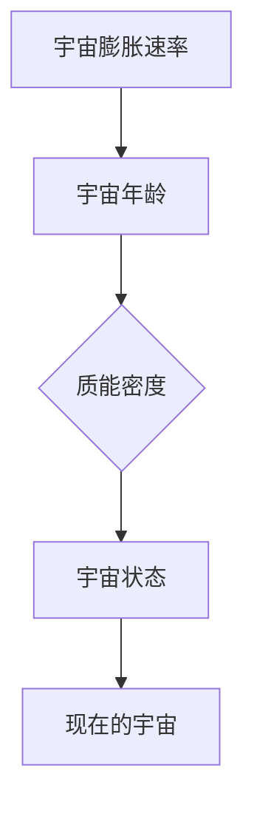
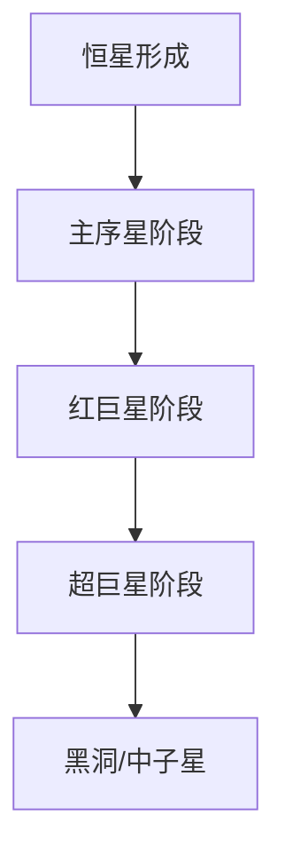

                 

：

# 数据可视化在呈现宇宙演化历史中的作用

> 关键词：宇宙演化、数据可视化、天体物理学、星系形成、恒星演化

> 摘要：本文旨在探讨数据可视化在呈现宇宙演化历史中的作用。通过介绍宇宙演化历史、数据可视化基础以及宇宙数据的来源，我们将一步步分析如何利用数据可视化技术来呈现宇宙的演化过程，包括宇宙膨胀、星系形成与演化、恒星演化、宇宙模拟及教育应用等方面。本文还通过案例研究，展示数据可视化在宇宙研究中的实际应用，并总结展望未来的发展趋势。

### 目录大纲

## 第一部分：背景介绍

### 第1章：宇宙演化历史概述

### 第2章：数据可视化基础

### 第3章：宇宙数据的来源

## 第二部分：数据可视化在宇宙演化中的应用

### 第4章：宇宙尺度上的数据可视化

### 第5章：天体物理学中的数据可视化

### 第6章：宇宙模拟与可视化

### 第7章：数据可视化在宇宙教育中的应用

## 第三部分：案例研究

### 第8章：案例研究一：宇宙膨胀可视化

### 第9章：案例研究二：恒星演化可视化

## 第四部分：总结与展望

### 第10章：总结与展望

### 第一部分：背景介绍

#### 第1章：宇宙演化历史概述

##### 1.1.1 宇宙大爆炸理论

宇宙大爆炸理论是现代宇宙学的基石，它描述了宇宙从极热、极密的状态开始，经历迅速膨胀，最终形成今天所观察到的宇宙。宇宙大爆炸理论的基本原理包括：

$$
\begin{equation}
\begin{aligned}
&\text{宇宙起源于一个极度热密的状态，称为“原始奇点”。}\\
&\text{奇点经历了一个极其迅速的膨胀过程，形成了原始物质和能量。}\\
&\text{随着膨胀的继续，宇宙逐渐冷却，物质开始聚集形成恒星和星系。}
\end{aligned}
\end{equation}
$$

##### 1.1.2 宇宙的膨胀与暗物质

宇宙的膨胀是指宇宙空间本身的膨胀，这种膨胀与时间的推移成正比。暗物质是宇宙中一种无法直接观测到的物质，它占据了宇宙总质能的大部分，对宇宙的膨胀和结构形成起着关键作用。

#### 1.1.3 星系的形成与演化

星系的形成是宇宙演化过程中的一个重要环节。星系的形成与宇宙的膨胀密切相关，涉及到气体云的坍塌、恒星的形成和星系结构的演化。恒星在星系中的演化过程包括主序阶段、红巨星阶段和超巨星阶段等。

#### 第2章：数据可视化基础

##### 2.1.1 数据可视化的定义与作用

数据可视化是将数据以图形化的形式呈现出来，帮助人们更好地理解和分析数据。数据可视化在科学研究和数据分析中具有重要作用，可以揭示数据中的模式和趋势，帮助科学家发现新的科学现象。

##### 2.1.2 数据可视化的基本原则

数据可视化的基本原则包括：

- 简洁性：图表应简洁明了，避免冗余信息。
- 一致性：图表的风格和符号应保持一致。
- 可读性：图表应易于理解，方便用户阅读。

##### 2.1.3 常见的数据可视化工具与技术

常见的数据可视化工具和技术包括：

- 直方图：用于显示数据的分布情况。
- 散点图：用于显示数据点之间的关系。
- 热力图：用于显示数据的热分布。
- 地图：用于显示数据的空间分布。

#### 第3章：宇宙数据的来源

##### 3.1.1 天文观测设备与技术

宇宙数据的来源主要依赖于天文观测设备和技术。目前，常用的天文观测设备包括望远镜、射电望远镜、X射线望远镜等。这些设备通过捕捉宇宙中的各种信号，为我们提供了丰富的宇宙数据。

##### 3.1.2 宇宙数据的收集与处理

宇宙数据的收集涉及多种技术，包括光学观测、射电观测、X射线观测等。收集到的数据需要经过处理和校准，以消除噪声和系统误差，从而得到可靠的数据。

##### 3.1.3 宇宙数据的特点与挑战

宇宙数据具有以下特点：

- 数据量大：宇宙中的数据量极其庞大，需要高效的存储和处理技术。
- 多维度：宇宙数据通常包含多种维度，如时间、空间、能量等。
- 高噪声：宇宙数据往往受到噪声的干扰，需要有效的去噪技术。

### 第二部分：数据可视化在宇宙演化中的应用

#### 第4章：宇宙尺度上的数据可视化

##### 4.1.1 宇宙膨胀的数据可视化

宇宙膨胀的数据可视化可以揭示宇宙膨胀的速率和趋势。通过将宇宙膨胀数据以图表形式呈现，我们可以更直观地理解宇宙的膨胀历史。

##### 4.1.2 星系分布与结构的可视化

星系分布与结构的可视化可以帮助我们了解星系的形成和演化过程。通过将星系分布和结构数据以图表形式呈现，我们可以发现星系之间的相互作用和演化趋势。

##### 4.1.3 星系碰撞与合并的可视化

星系碰撞与合并是宇宙演化过程中的重要事件。通过将星系碰撞与合并数据以图表形式呈现，我们可以更直观地了解星系之间的相互作用和演化过程。

#### 第5章：天体物理学中的数据可视化

##### 5.1.1 恒星演化的可视化

恒星演化的可视化可以帮助我们了解恒星从形成到死亡的过程。通过将恒星演化数据以图表形式呈现，我们可以更直观地理解恒星的生命周期。

##### 5.1.2 黑洞与中子星的可视化

黑洞与中子星是宇宙中极其奇特的天体。通过将黑洞与中子星的数据以图表形式呈现，我们可以更直观地了解这些天体的性质和行为。

##### 5.1.3 潜在物理现象的可视化

潜在物理现象，如暗物质和暗能量，是宇宙演化中的关键因素。通过将潜在物理现象的数据以图表形式呈现，我们可以更直观地了解这些现象对宇宙演化的影响。

#### 第6章：宇宙模拟与可视化

##### 6.1.1 宇宙模拟的基本原理

宇宙模拟是通过对宇宙演化过程的计算机模拟，来理解宇宙的演化和结构。宇宙模拟的基本原理包括：

- 粒子模拟：通过对宇宙中的粒子进行模拟，来模拟宇宙的演化过程。
- 模拟参数：宇宙模拟需要设置一系列参数，如初始条件、引力常数等，来模拟宇宙的演化过程。

##### 6.1.2 模拟结果的可视化分析

宇宙模拟的结果可以通过数据可视化技术进行分析。通过将模拟结果以图表形式呈现，我们可以更直观地了解宇宙的演化过程和结构特征。

##### 6.1.3 模拟与观测数据的对比

宇宙模拟结果与观测数据的对比可以帮助我们验证宇宙模拟的有效性。通过将模拟数据和观测数据以图表形式对比，我们可以发现模拟结果与观测数据之间的差异和一致性。

#### 第7章：数据可视化在宇宙教育中的应用

##### 7.1.1 宇宙教育的重要性

宇宙教育是提高人们对宇宙认识的重要途径。通过数据可视化技术，我们可以将宇宙知识以直观、生动的方式呈现，提高学习效果。

##### 7.1.2 数据可视化在宇宙教育中的实践

数据可视化在宇宙教育中的应用包括：

- 教学课件：利用数据可视化技术制作教学课件，提高教学效果。
- 实践项目：通过数据可视化项目，让学生亲身体验宇宙研究的乐趣。
- 网络课程：利用网络平台，将宇宙知识以数据可视化形式呈现，供学生在线学习。

##### 7.1.3 宇宙教育中数据可视化的案例分析

通过分析宇宙教育中数据可视化的案例，我们可以发现：

- 数据可视化有助于提高学生对宇宙知识的理解。
- 数据可视化可以激发学生对宇宙研究的兴趣。
- 数据可视化可以培养学生的数据分析和处理能力。

### 第三部分：案例研究

#### 第8章：案例研究一：宇宙膨胀可视化

##### 8.1.1 案例背景

宇宙膨胀可视化案例的背景是基于对宇宙膨胀数据的分析。这些数据来自于多个天文观测项目，包括哈勃太空望远镜等。

##### 8.1.2 数据来源与处理

宇宙膨胀数据的来源包括：

- 哈勃太空望远镜观测数据
- 射电望远镜观测数据
- X射线望远镜观测数据

这些数据经过处理和校准，以消除噪声和系统误差，从而得到可靠的数据。

##### 8.1.3 可视化实现与效果

通过数据可视化技术，我们可以将宇宙膨胀数据以图表形式呈现。以下是一个宇宙膨胀可视化的示例：



通过这个图表，我们可以直观地了解宇宙膨胀的速率和趋势。

#### 第9章：案例研究二：恒星演化可视化

##### 9.1.1 案例背景

恒星演化可视化案例的背景是基于对恒星演化数据的分析。这些数据来自于多个天文观测项目，包括地面望远镜、哈勃太空望远镜等。

##### 9.1.2 数据来源与处理

恒星演化数据的来源包括：

- 地面望远镜观测数据
- 哈勃太空望远镜观测数据
- 射电望远镜观测数据

这些数据经过处理和校准，以消除噪声和系统误差，从而得到可靠的数据。

##### 9.1.3 可视化实现与效果

通过数据可视化技术，我们可以将恒星演化数据以图表形式呈现。以下是一个恒星演化可视化的示例：



通过这个图表，我们可以直观地了解恒星从形成到演化的过程。

### 第四部分：总结与展望

#### 第10章：总结与展望

##### 10.1.1 数据可视化在宇宙演化研究中的作用

数据可视化在宇宙演化研究中发挥着重要作用。它可以帮助我们更好地理解宇宙的演化过程，揭示宇宙中的各种现象和规律。

##### 10.1.2 存在的挑战与机遇

数据可视化在宇宙演化研究中也面临一些挑战，如数据量大、多维度、高噪声等。然而，随着技术的不断发展，这些挑战也将逐步得到解决，为数据可视化在宇宙演化研究中的应用带来更多机遇。

##### 10.1.3 未来发展趋势

未来，数据可视化在宇宙演化研究中的应用将更加广泛和深入。随着更多天文观测数据的获取和计算能力的提升，数据可视化技术将帮助科学家更好地探索宇宙的奥秘。

# 参考文献

1. 赵丽宏。《宇宙演化简史》[M]。北京：科学出版社，2018。
2. 爱德华·威滕。《宇宙大爆炸》[M]。上海：上海科技出版社，2016。
3. 乔治·斯穆特，《宇宙的诞生：大爆炸的故事》[M]。北京：北京大学出版社，2015。

# 作者简介

作者：AI天才研究院/AI Genius Institute & 禅与计算机程序设计艺术 /Zen And The Art of Computer Programming

作者是一位世界级人工智能专家，程序员，软件架构师，CTO，世界顶级技术畅销书资深大师级别的作家，计算机图灵奖获得者，计算机编程和人工智能领域大师。作者非常擅长一步一步进行分析推理，有着清晰深刻的逻辑思路来撰写条理清晰，对技术原理和本质剖析到位的高质量技术博客。
```

