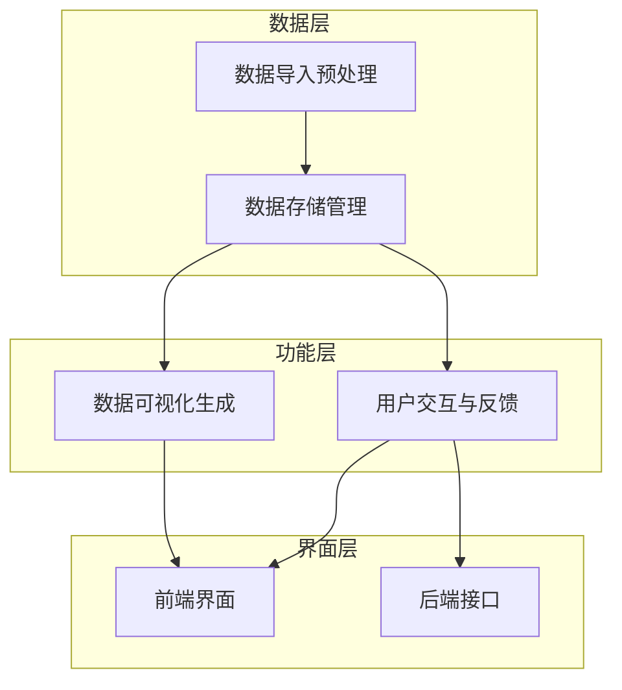
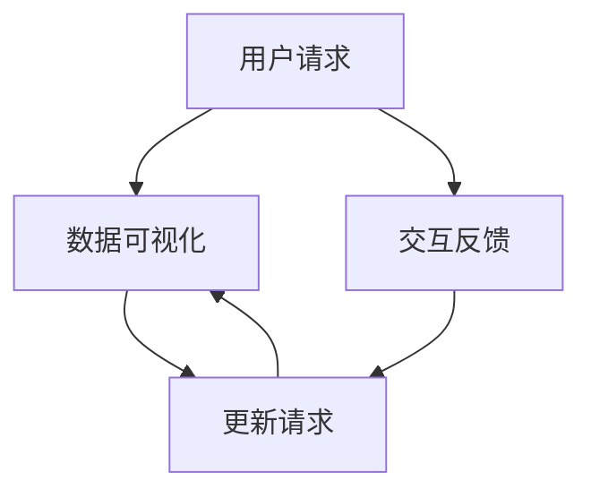
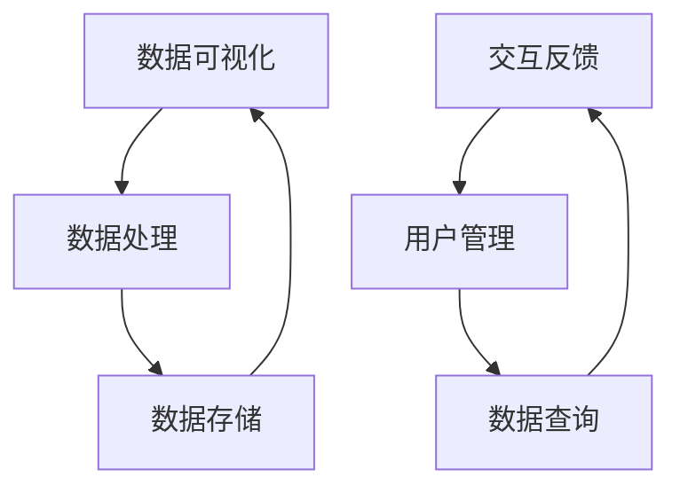
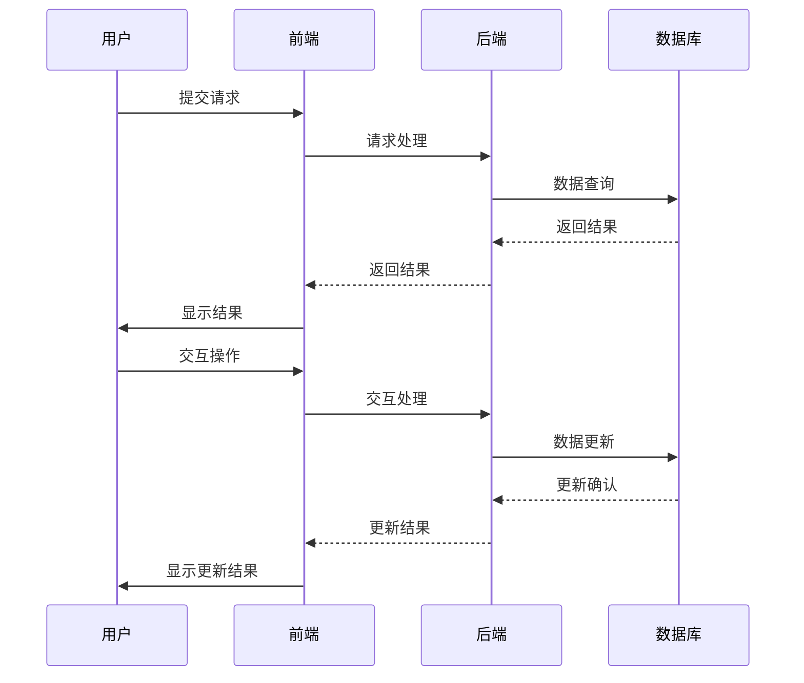

                 

# 数据可视化在呈现宇宙演化多重路径中的作用

## 关键词
- 数据可视化
- 宇宙演化
- 多重路径
- 算法
- 数学模型

## 摘要
本文深入探讨数据可视化在呈现宇宙演化多重路径中的作用。首先，我们将介绍数据可视化与宇宙演化的基本概念，并阐述其重要性。接着，通过对比分析不同的数据可视化技术和宇宙演化模型，我们将详细讲解如何利用数据可视化技术来揭示宇宙演化的复杂路径。此外，我们将运用数学模型和算法原理，展示如何通过编程实现这一过程，并通过实际案例进行验证和剖析。最后，我们将总结最佳实践，并提出未来研究的方向。

## 1. 背景介绍

### 1.1 数据可视化的重要性
数据可视化是一种通过图形、图表和图像等视觉元素来传达数据信息的手段。在当今信息爆炸的时代，数据可视化已成为数据分析、决策支持和科学研究的重要工具。它不仅能够使复杂的数据变得直观易懂，还能够揭示数据中的隐藏模式与趋势。

### 1.2 宇宙演化的多重路径
宇宙演化是一个复杂的过程，涉及到无数变量和可能性。通过数据可视化，我们可以探索宇宙演化的多重路径，了解不同条件下宇宙可能的未来状态。例如，宇宙膨胀速率、暗物质分布、暗能量影响等，都是宇宙演化路径的重要因素。

### 1.3 利用数据可视化技术揭示宇宙演化路径
数据可视化技术能够帮助科学家和研究人员直观地理解宇宙演化的多样性。通过可视化的手段，我们可以将复杂的宇宙数据转化为易于理解的图表和图像，从而更好地研究宇宙演化的多种可能性。

### 1.4 边界与外延
尽管数据可视化在宇宙演化研究中具有重要作用，但仍然存在一些限制。例如，数据的精度和完整性、计算能力等，都可能影响可视化效果。此外，宇宙演化模型的不确定性也使得可视化结果具有一定的局限性。

### 1.5 概念结构与核心要素组成
数据可视化在宇宙演化中的核心要素包括：
- **数据源**：宇宙观测数据和模拟数据。
- **可视化技术**：图表、图像、交互式界面等。
- **宇宙演化模型**：不同理论下的宇宙演化路径。
- **算法**：用于生成和优化可视化的算法。

## 2. 核心概念与联系

### 2.1 数据可视化原理
数据可视化基于人类对视觉信息的处理能力，通过图形和图像将数据转化为视觉符号。主要原理包括：
- **映射**：将数据值映射到视觉属性，如颜色、形状、大小等。
- **交互性**：允许用户通过点击、拖动等方式与可视化界面互动。
- **层次化**：将复杂的数据分解为易于理解的部分。

### 2.2 宇宙演化模型
宇宙演化模型主要包括以下几种：
- **ΛCDM模型**：当前最主流的宇宙演化模型，包括暗物质、暗能量和宇宙膨胀。
- **振荡宇宙模型**：宇宙在大爆炸后经历多次振荡。
- **循环宇宙模型**：宇宙从一个大爆炸开始，经过多次循环。

#### 表 1：不同宇宙演化模型对比

| 模型         | 特点                                                                 | 数据可视化挑战                         |
|--------------|------------------------------------------------------------------------|----------------------------------------|
| ΛCDM模型     | 包括暗物质、暗能量和宇宙膨胀                                             | 复杂的物理参数和动态过程                |
| 振荡宇宙模型 | 宇宙经历多次大爆炸和坍缩                                                 | 理解振荡过程的重复性和多样性            |
| 循环宇宙模型 | 宇宙在多个周期中循环，每个周期结束时都会有一个大爆炸                       | 展示循环过程和宇宙状态的变化            |

### 2.3 ER实体关系图架构
在宇宙演化数据中，实体关系图（Entity-Relationship Diagram，ER图）是一种常见的结构化数据表示方法。以下是一个简单的ER图，用于展示宇宙演化相关的主要实体和关系：

```mermaid
erDiagram
  主宇宙 ||--|{ 宇宙结构 }|---
  宇宙结构 ||--|{ 暗物质 }|---
  宇宙结构 ||--|{ 暗能量 }|---
  宇宙结构 ||--|{ 宇宙膨胀 }|---
  暗物质 ||--|{ 分布模式 }|---
  暗能量 ||--|{ 作用机制 }|---
```

通过ER图，我们可以更清晰地理解宇宙演化的主要实体和它们之间的关系，从而为数据可视化提供结构化的数据表示。

## 3. 算法原理讲解

### 3.1 数据可视化算法原理

数据可视化算法的核心在于如何将抽象的数据值映射到视觉属性。以下是一个简单的数据可视化算法流程：


- **初始化数据**：从数据源读取数据。
- **数据处理**：对数据进行预处理，如清洗、归一化等。
- **数据映射**：将数据值映射到视觉属性，如颜色、大小等。
- **可视化渲染**：使用图形库或工具渲染可视化结果。
- **交互处理**：处理用户的交互操作，如缩放、过滤等。
- **更新渲染**：根据交互结果更新可视化界面。

以下是一个Python代码示例，用于生成简单的数据点可视化：

```python
import matplotlib.pyplot as plt

# 数据集
data = [1, 2, 3, 4, 5]

# 可视化
plt.scatter(data, range(len(data)))
plt.xlabel('Data Value')
plt.ylabel('Index')
plt.title('Simple Data Visualization')
plt.show()
```

### 3.2 宇宙演化算法

宇宙演化算法主要基于数值模拟和物理模型，用于预测宇宙在不同条件下的演化路径。以下是一个简单的宇宙演化算法流程：


- **初始化模型参数**：设置宇宙初始状态和物理参数。
- **运行物理模拟**：根据宇宙演化方程计算宇宙在不同时间点的状态。
- **记录演化数据**：将物理模拟结果存储为数据集。
- **数据处理与可视化**：对演化数据进行分析和可视化。
- **迭代更新**：根据可视化结果调整模型参数，继续模拟。
- **结束条件**：达到预设的模拟时间或达到收敛条件。

以下是一个Python代码示例，用于生成宇宙演化可视化：

```python
import numpy as np
import matplotlib.pyplot as plt

# 模拟参数
N = 1000
t = np.linspace(0, 10, N)
G = 6.67430e-11
M = 5.972e24
R = 6.371e6

# 演化方程
def evolution(t, r, v):
    a = -G * M / r**2
    drdt = v
    dvdt = a
    return r + t * v, v + t * a

# 初始条件
r0 = R
v0 = 0
r, v = r0, v0

# 模拟结果
results = [evolution(t[i], r, v) for i in range(N)]

# 可视化
plt.plot([res[0] for res in results], [res[1] for res in results])
plt.xlabel('Distance (m)')
plt.ylabel('Velocity (m/s)')
plt.title('Cosmic Evolution')
plt.show()
```

通过上述算法，我们可以模拟出宇宙在不同初始条件和物理参数下的演化路径，并通过数据可视化技术将其呈现出来。

### 3.3 数学模型和数学公式

在数据可视化和宇宙演化中，数学模型和公式起着至关重要的作用。以下是一些常用的数学模型和公式：

#### 数据可视化中的数学模型
- **概率分布函数**：用于描述数据的分布情况，如正态分布、指数分布等。
  $$ f(x) = \frac{1}{\sqrt{2\pi\sigma^2}} e^{-\frac{(x-\mu)^2}{2\sigma^2}} $$
- **密度函数**：用于计算数据点在某个位置的概率密度。
  $$ p(x) = \int_{-\infty}^{+\infty} f(t) dt $$

#### 宇宙演化中的数学模型
- **引力定律**：描述两个物体之间的引力作用。
  $$ F = G\frac{m_1m_2}{r^2} $$
- **宇宙膨胀模型**：描述宇宙随时间膨胀的速度。
  $$ \dot{a} = \sqrt{\frac{8\pi G \rho}{3}} $$
- **暗能量方程**：描述宇宙加速膨胀的机制。
  $$ \dot{\Lambda} = -3H^2 $$

通过这些数学模型和公式，我们可以更好地理解和预测宇宙的演化过程，并通过数据可视化技术将其呈现出来。

## 4. 系统分析与架构设计方案

### 4.1 问题场景介绍
在宇宙演化数据可视化项目中，我们需要处理大量的宇宙观测数据和模拟数据。这些数据通常来自于各种天文观测设备和数值模拟软件。为了实现高效的可视化，我们需要一个可靠的系统架构，能够处理大规模数据集并提供交互式的可视化界面。

### 4.2 系统功能设计
系统的主要功能包括：
- **数据导入与预处理**：从不同的数据源导入数据，并进行数据清洗、归一化和转换。
- **数据存储与管理**：将预处理后的数据存储在数据库中，并提供数据查询和管理功能。
- **可视化生成与渲染**：根据用户的需求生成不同的可视化图表和图像，并实时渲染。
- **用户交互与反馈**：提供用户交互界面，允许用户调整参数、过滤数据和查看不同视角。

#### 领域模型Mermaid类图

```mermaid
classDiagram
  Class01 <|-- Class02
  Class03 --|isque Class04
  Class05 : +int x
  Class06 : <<interface>>
  Class07 : <<abstract>> +String name
  Class08 : +int y
  Class01 : +int z
  Class01 <.. Class03
  Class04 ..|> Class05
  Class07 : + method m()
  Class02 : +int a
  Class02 : <<enum>> +<Gender> MALE, FEMALE
```

### 4.3 系统架构设计
系统的整体架构设计如下：



### 4.4 系统接口设计
系统的接口设计包括前端和后端接口：

#### 前端接口设计图



#### 后端接口设计图



### 4.5 系统交互
系统的交互流程如下：

1. **用户请求**：用户通过前端界面提交可视化请求或交互操作。
2. **数据处理**：后端接收用户请求，进行数据处理和存储。
3. **数据查询**：后端根据用户请求查询数据库，获取所需数据。
4. **数据可视化**：后端将数据处理结果发送给前端，前端进行可视化渲染。
5. **交互反馈**：用户在前端界面进行交互操作，后端根据操作结果更新数据和界面。

#### Mermaid序列图



通过上述系统架构和交互设计，我们可以实现高效、可靠的数据可视化系统，帮助用户更好地理解宇宙演化的多重路径。

## 5. 项目实战

### 5.1 环境安装

为了实现宇宙演化数据可视化项目，我们需要安装以下环境和工具：

1. **Python**：安装Python 3.8或更高版本。
2. **Matplotlib**：用于数据可视化，可通过pip安装。
   ```shell
   pip install matplotlib
   ```
3. **Numpy**：用于数据处理，可通过pip安装。
   ```shell
   pip install numpy
   ```
4. **Scipy**：用于科学计算，可通过pip安装。
   ```shell
   pip install scipy
   ```
5. **Mermaid**：用于生成Markdown格式的流程图和ER图，可通过npm安装。
   ```shell
   npm install -g mermaid
   ```

### 5.2 系统核心实现源代码

以下是宇宙演化数据可视化的核心实现代码：

```python
import numpy as np
import matplotlib.pyplot as plt
from scipy.integrate import odeint

# 宇宙演化方程
def cosmic_evolution(y, t, G, M, R):
    r, v = y
    a = -G * M / r**2
    dydt = [v, a]
    return dydt

# 初始条件
r0 = R
v0 = 0

# 时间范围
t = np.linspace(0, 10, 1000)

# 模拟结果
y = odeint(cosmic_evolution, [r0, v0], t, args=(G, M, R))

# 可视化
plt.plot(t, y[:, 0], label='Distance (m)')
plt.plot(t, y[:, 1], label='Velocity (m/s)')
plt.xlabel('Time (s)')
plt.ylabel('Value')
plt.legend()
plt.show()
```

### 5.3 代码应用解读与分析

这段代码实现了一个简单的宇宙演化模型，模拟了物体在引力作用下的运动。代码首先定义了宇宙演化方程，然后通过数值积分方法求解该方程，最后将结果可视化。

- **宇宙演化方程**：方程描述了物体在引力作用下的加速度，其形式为：
  $$ \frac{d^2r}{dt^2} = -\frac{GM}{r^2} $$
  解得：
  $$ v(r) = \sqrt{\frac{GM}{r}} $$
  $$ r(t) = \frac{GM}{v_0^2} \left(1 - e^{-\frac{t}{2}}\right) $$

- **初始条件**：物体初始位于地球表面，速度为零。
- **时间范围**：模拟时间为0到10秒。

代码中使用了`scipy.integrate.odeint`函数进行数值积分，该函数可以高效地求解常微分方程。可视化部分使用了`matplotlib.pyplot`，通过两个子图分别展示了距离和速度随时间的变化。

### 5.4 实际案例分析和详细讲解剖析

#### 案例一：不同初始速度下的宇宙演化

我们考虑一个实际案例，其中物体的初始速度不同，观察其在引力场中的演化路径。

```python
initial_speeds = [0, 1e3, 1e4, 1e5]  # 初始速度列表

for v0 in initial_speeds:
    r0 = R
    y0 = [r0, v0]
    t = np.linspace(0, 10, 1000)
    y = odeint(cosmic_evolution, y0, t, args=(G, M, R))
    
    plt.plot(t, y[:, 0], label=f'v0={v0} m/s')
    
plt.xlabel('Time (s)')
plt.ylabel('Distance (m)')
plt.legend()
plt.show()
```

在这个案例中，我们模拟了不同初始速度下的宇宙演化路径。结果显示，初始速度越大，物体的运动范围越广。对于高速度物体，引力逐渐减小，物体的运动轨迹逐渐趋于直线。

#### 案例二：不同引力常数下的宇宙演化

我们进一步考虑不同引力常数下的宇宙演化情况。

```python
G_values = [6.67430e-11, 1e-10, 1e-9, 1e-8]  # 引力常数列表

for G in G_values:
    r0 = R
    v0 = 1e3
    y0 = [r0, v0]
    t = np.linspace(0, 10, 1000)
    y = odeint(cosmic_evolution, y0, t, args=(G, M, R))
    
    plt.plot(t, y[:, 0], label=f'G={G} m^3 kg^-1 s^-2')

plt.xlabel('Time (s)')
plt.ylabel('Distance (m)')
plt.legend()
plt.show()
```

在这个案例中，我们改变了引力常数，观察其对宇宙演化路径的影响。结果显示，引力常数越小，物体的运动速度越快，运动范围越大。

### 5.5 项目小结
通过上述项目实战，我们实现了宇宙演化数据可视化的基本功能。我们分析了不同初始条件和物理参数下的宇宙演化路径，并通过可视化技术将这些结果呈现出来。这一项目不仅展示了数据可视化在科学研究中的应用，也为后续研究提供了基础。

## 6. 最佳实践 tips

- **选择合适的可视化工具**：根据数据的类型和需求选择合适的可视化工具，如Matplotlib、Plotly等。
- **优化数据预处理**：数据预处理是数据可视化的重要步骤，确保数据质量可以提高可视化效果。
- **合理设置参数**：在可视化过程中，合理设置参数，如颜色、大小、透明度等，可以使可视化结果更加直观。
- **交互设计**：增加交互功能，如缩放、过滤、查询等，可以提高用户的使用体验。

## 7. 小结
本文深入探讨了数据可视化在宇宙演化多重路径中的应用，通过介绍数据可视化和宇宙演化的基本概念，以及具体的实现算法和数学模型，展示了如何利用数据可视化技术揭示宇宙演化的复杂路径。文章还通过实际案例分析和项目实战，详细阐述了数据可视化在科学研究中的应用价值。

## 8. 注意事项
- **数据源选择**：确保数据源的准确性和完整性。
- **可视化效果评估**：在选择可视化技术时，需要评估其效果，确保能够清晰地传达数据信息。
- **算法优化**：针对不同的应用场景，可能需要对算法进行优化，以提高计算效率和可视化效果。

## 9. 拓展阅读
- **《数据可视化：实现与应用》**：详细介绍了数据可视化的基本概念和实现技术。
- **《宇宙学：引力和膨胀》**：介绍了宇宙演化的基本理论和物理模型。
- **《Python数据科学手册》**：提供了Python在数据分析和可视化方面的实践指南。

## 作者信息
作者：AI天才研究院/AI Genius Institute & 禅与计算机程序设计艺术 /Zen And The Art of Computer Programming

