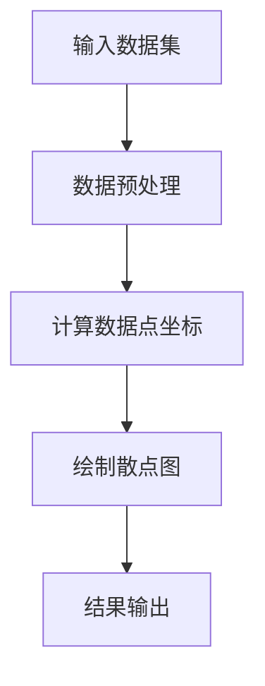
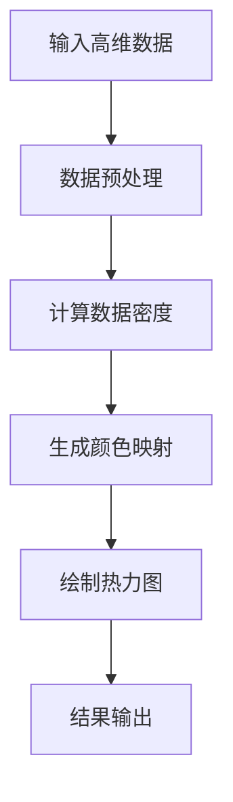
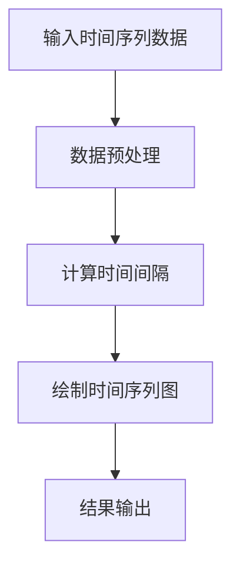
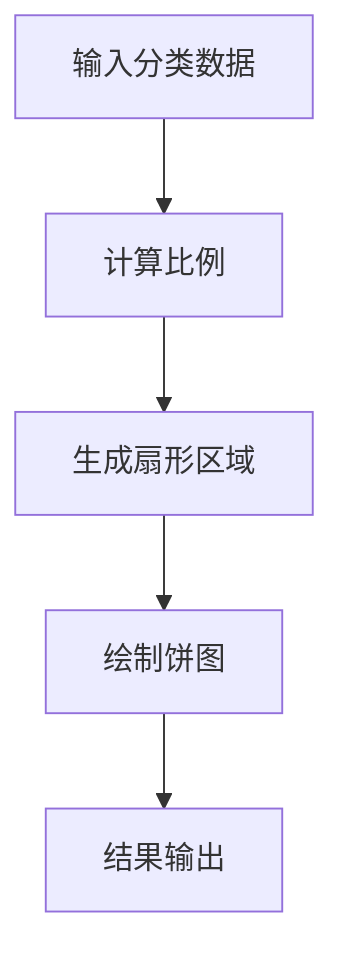
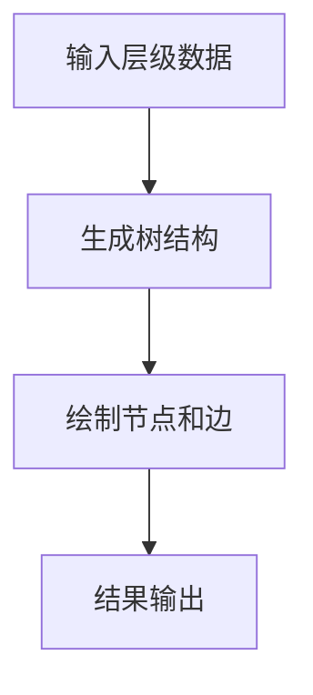
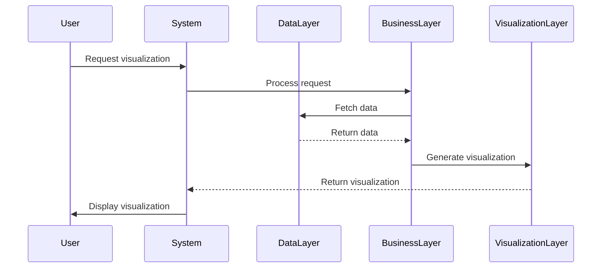

                 

### 数据可视化概述

数据可视化是一种将复杂的数据转换为图形或图像的方法，以帮助人们更好地理解和分析数据。它通过视觉形式展示数据的结构和关系，使数据更易于解释和发现潜在的模式。数据可视化在各个领域都有广泛应用，尤其在科学研究、商业分析、医疗诊断等领域发挥着至关重要的作用。

数据可视化的发展可以追溯到20世纪中期，随着计算机技术的进步和数据量的激增，数据可视化逐渐成为一种重要的数据分析和信息传达工具。早期的数据可视化主要依赖于图表和图形，如柱状图、饼图、折线图等。随着技术的不断发展，数据可视化工具和算法不断涌现，如热力图、散点图、3D图等，大大丰富了数据可视化的形式和功能。

在宇宙演化时间线研究中，数据可视化扮演着至关重要的角色。宇宙演化是一个复杂的过程，涉及大量的数据和变量。通过数据可视化，科学家们可以更直观地了解宇宙的演化过程，发现潜在的规律和模式。例如，宇宙中星系的分布可以通过可视化技术展示，帮助研究者探索星系形成和演化的机制。

总的来说，数据可视化在宇宙演化时间线研究中的作用主要体现在以下几个方面：

1. **数据展示与解释**：数据可视化能够将复杂的宇宙数据以直观、易于理解的形式展示出来，帮助科学家们更好地解释数据。

2. **模式发现**：通过可视化，研究者可以发现宇宙演化中的潜在模式，如星系分布的规律、恒星形成的周期性等。

3. **预测与模拟**：可视化技术可以帮助研究者预测宇宙演化的未来趋势，并验证模拟结果的准确性。

4. **协作与交流**：数据可视化作为一种跨学科的工具，可以帮助不同领域的科学家共享信息和知识，促进合作研究。

### 数据可视化在宇宙演化时间线研究中的重要性

宇宙演化时间线是研究宇宙从大爆炸至今约138亿年的演化过程，这个时间跨度巨大，涉及的数据量庞大且复杂。因此，如何有效地处理和展示这些数据成为宇宙演化研究中的一个重大挑战。数据可视化在这一过程中发挥着至关重要的作用。

首先，数据可视化能够帮助科学家更好地理解和解释宇宙演化中的大量数据。宇宙演化涉及多种数据类型，包括观测数据、模拟数据、理论数据等。这些数据往往以复杂的格式存储，通过数据可视化，科学家可以将这些数据转化为图表、图形等形式，使得数据更加直观、易于理解。

其次，数据可视化有助于发现宇宙演化中的潜在模式和规律。宇宙演化是一个复杂的过程，其中包含大量的变量和相互作用。通过数据可视化，研究者可以发现数据中隐藏的关联性和模式，例如星系分布的规律、恒星形成的周期性等。这些发现对于理解宇宙的演化机制具有重要意义。

此外，数据可视化在预测和模拟宇宙演化方面也发挥着重要作用。通过可视化技术，研究者可以模拟宇宙演化的不同场景，并观察模拟结果。可视化可以帮助研究者验证模拟的准确性，从而更可靠地预测宇宙演化的未来趋势。

最后，数据可视化作为一种跨学科的工具，有助于不同领域的科学家进行合作研究。宇宙演化研究涉及多个学科，包括天文学、物理学、数学等。通过数据可视化，不同领域的科学家可以共享信息和知识，促进合作研究，共同推进宇宙演化研究的进展。

综上所述，数据可视化在宇宙演化时间线研究中的重要性不可忽视。它不仅帮助科学家更好地理解和解释宇宙演化数据，还促进了模式发现、预测模拟和跨学科合作，为宇宙演化研究提供了强有力的工具和支持。因此，深入研究数据可视化在宇宙演化中的应用，对于推动宇宙科学的发展具有重要意义。### 数据可视化中的关键概念

在深入探讨数据可视化在宇宙演化时间线研究中的作用之前，我们需要先了解数据可视化中的几个关键概念。这些概念包括数据类型、可视化形式和交互性，它们共同构成了数据可视化的基础，决定了数据可视化技术如何有效地呈现和分析数据。

#### 数据类型

数据类型是数据可视化中的核心要素，可以分为结构化数据和非结构化数据。

1. **结构化数据**：结构化数据是指具有明确数据结构和固定格式的数据，如数据库中的表格数据。这些数据通常包括字段名和相应的数据值，便于存储、查询和操作。结构化数据可视化技术包括柱状图、折线图、饼图等，通过图形展示数据的数量和关系。

2. **非结构化数据**：非结构化数据是指没有固定格式和结构的数据，如文本、图像、视频等。这类数据通常难以用传统的结构化数据可视化技术进行处理。非结构化数据可视化技术包括热力图、词云、图像识别等，通过视觉形式展示数据的内容和特征。

#### 可视化形式

数据可视化形式是指数据呈现的具体方式，常见的可视化形式包括以下几种：

1. **静态图表**：静态图表是固定不变的图形，常用于展示数据的基本趋势和关系。例如，柱状图、折线图等。静态图表的优点是简单明了，便于理解和传播。

2. **动态图表**：动态图表是在一定时间段内可以动态变化的图形，常用于展示数据的变化趋势和动态过程。例如，时间轴图、动画图等。动态图表的优点是能够更好地展示数据的变化和演进。

3. **交互式图表**：交互式图表允许用户通过点击、拖动等方式与数据交互，从而自定义数据的展示方式和细节。例如，交互式地图、交互式数据仪表盘等。交互式图表的优点是提供了更灵活的数据探索和分析功能。

#### 交互性

交互性是数据可视化中的一个重要特性，它决定了用户能否与数据直接互动，从而影响用户对数据的理解和分析。

1. **基本交互**：基本交互包括选择、缩放、过滤等，通过这些交互方式，用户可以自由选择查看数据的特定部分，或者放大、缩小数据的显示范围。

2. **高级交互**：高级交互包括数据连接、比较、预测等，通过这些交互方式，用户可以深入分析数据，发现潜在的规律和模式。

### 表格对比

为了更直观地了解这些关键概念，我们可以通过一个表格来对比结构化数据和非结构化数据、静态图表和动态图表、基本交互和高级交互的属性和特点：

| **数据类型** | **结构化数据** | **非结构化数据** |
| ------------- | ------------- | ------------- |
| **定义** | 具有明确数据结构和固定格式的数据 | 没有固定格式和结构的数据 |
| **可视化形式** | 静态图表、动态图表、交互式图表 | 热力图、词云、图像识别 |
| **交互性** | 基本交互、高级交互 | 基本交互、高级交互 |

| **可视化形式** | **静态图表** | **动态图表** | **交互式图表** |
| ------------- | ------------- | ------------- | ------------- |
| **定义** | 固定不变的图形 | 在一定时间段内动态变化的图形 | 允许用户与数据直接交互的图形 |
| **优点** | 简单明了，便于理解和传播 | 更好地展示数据的变化和演进 | 提供更灵活的数据探索和分析功能 |
| **缺点** | 无法展示数据动态变化 | 需要更多计算资源 | 可能会增加用户操作复杂度 |

| **交互性** | **基本交互** | **高级交互** |
| ------------- | ------------- | ------------- |
| **定义** | 选择、缩放、过滤等 | 数据连接、比较、预测等 |
| **优点** | 操作简单，易于实现 | 功能强大，数据分析深入 |
| **缺点** | 功能有限，难以深入分析 | 实现复杂，需要更多资源和技能 |

通过上述对比，我们可以看到数据可视化中的关键概念在数据展示和分析中的重要作用。接下来，我们将进一步探讨如何使用Mermaid绘制数据可视化的ER实体关系图，以展示数据流和处理流程。### Mermaid绘制数据可视化ER实体关系图

为了更好地理解数据可视化中的数据流和处理流程，我们可以使用Mermaid这一开源工具来绘制ER（实体关系）图。ER图是一种常用的数据库建模工具，用于描述实体之间的关系。在数据可视化中，ER图可以帮助我们直观地展示数据结构，明确数据之间的关系。

以下是一个简单的示例，展示如何使用Mermaid绘制数据可视化中的ER实体关系图：

```mermaid
erDiagram
  Customer ||--|{ Order : "places" }
  Product ||--|{ Order : "contains" }
```

在上面的示例中，我们定义了两个实体：`Customer`（客户）和`Product`（产品），以及它们之间的关系。`Customer`实体与`Order`实体之间存在“放置”关系，而`Product`实体与`Order`实体之间存在“包含”关系。

具体来说，这个ER图描述了以下数据流和处理流程：

1. **客户订单流程**：客户（`Customer`）可以下单（`places`），生成订单（`Order`）。
2. **产品包含流程**：订单（`Order`）中可以包含多个产品（`Product`）。

接下来，我们将通过一个更复杂的示例来进一步展示如何使用Mermaid绘制数据可视化中的ER实体关系图。假设我们有一个关于宇宙演化时间线的数据模型，包括以下实体：

- **Star**（恒星）
- **Galaxy**（星系）
- **Supergalaxy**（超星系团）
- **Universe**（宇宙）

这些实体之间的关系如下：

1. **星系与恒星**：一个星系包含多个恒星。
2. **超星系团与星系**：一个超星系团包含多个星系。
3. **宇宙与超星系团**：宇宙包含所有超星系团。

以下是使用Mermaid绘制的ER图示例：

```mermaid
erDiagram
  Universe ||--|{ Supergalaxy : "contains" }
  Supergalaxy ||--|{ Galaxy : "contains" }
  Galaxy ||--|{ Star : "contains" }
```

在这个ER图中，`Universe`（宇宙）与`Supergalaxy`（超星系团）之间存在“包含”关系，`Supergalaxy`与`Galaxy`（星系）之间存在“包含”关系，`Galaxy`与`Star`（恒星）之间存在“包含”关系。这种结构清晰地展示了宇宙演化时间线中各个层级的数据关系。

通过Mermaid绘制ER实体关系图，我们可以直观地理解数据结构，明确数据之间的关系，这对于数据可视化系统的设计和实现具有重要意义。接下来，我们将进一步探讨数据可视化中的算法原理，包括常用的数据可视化算法及其应用。### 常用的数据可视化算法

在数据可视化过程中，选择合适的算法至关重要。不同的数据类型和可视化需求可能需要不同的算法。以下是几种常用的数据可视化算法，包括它们的基本原理和适用场景。

#### 算法A：散点图

**基本原理**：散点图是一种用点来表示数据集的图表，每个点的坐标对应数据集中的一个数据点。通过观察散点图，可以直观地了解数据点之间的关系和分布情况。

**适用场景**：适用于分析数据之间的相关性、分类和聚类。

**Mermaid流程图**：



#### 算法B：热力图

**基本原理**：热力图通过颜色深浅来表示数据的大小或密度。通常用于表示数据的热点分布，如网页点击分布、气温分布等。

**适用场景**：适用于展示高维数据的分布情况、相关性分析。

**Mermaid流程图**：



#### 算法C：时间序列图

**基本原理**：时间序列图通过时间轴来展示数据的变化趋势，适用于展示随时间变化的数据。

**适用场景**：适用于分析时间序列数据，如股票价格、气温变化等。

**Mermaid流程图**：



#### 算法D：饼图

**基本原理**：饼图通过扇形区域的大小来表示数据的大小，适用于展示数据的比例分布。

**适用场景**：适用于展示分类数据的比例分布，如市场份额、人口构成等。

**Mermaid流程图**：



#### 算法E：树图

**基本原理**：树图通过节点和边来表示数据之间的关系，适用于展示层级结构数据。

**适用场景**：适用于展示组织结构、分类层次等。

**Mermaid流程图**：



通过上述算法，我们可以根据具体的数据类型和可视化需求选择合适的算法。接下来，我们将深入探讨其中一个算法（如算法A），使用Python代码和LaTeX数学公式详细解释其步骤和数学模型。### 算法A：散点图

#### 概述

散点图是一种基本的数据可视化工具，用于展示两个或多个变量之间的关系。通过在二维或三维空间中标记数据点，散点图可以帮助我们直观地观察变量之间的相关性、分布模式或分类。

在本节中，我们将详细探讨散点图的基本原理，并使用Python代码和LaTeX数学公式解释其步骤和数学模型。

#### 基本原理

散点图的核心在于将数据集中的每个数据点映射到二维或三维坐标系中。具体来说，每个数据点由其对应的两个或三个坐标值确定。在二维散点图中，每个点由（x, y）坐标表示，而在三维散点图中，每个点由（x, y, z）坐标表示。

散点图的基本步骤如下：

1. **数据预处理**：对原始数据进行清洗和处理，确保数据格式正确、无缺失值和异常值。
2. **坐标计算**：根据数据点的属性，计算每个数据点的坐标。
3. **绘制散点图**：使用图表库（如Matplotlib）绘制散点图。
4. **结果输出**：展示绘制的散点图，并分析数据点的分布和关系。

#### Python代码实现

下面是一个简单的Python代码示例，展示如何使用Matplotlib库绘制散点图。

```python
import matplotlib.pyplot as plt
import numpy as np

# 生成模拟数据
np.random.seed(0)
x = np.random.normal(size=100)
y = np.random.normal(size=100)

# 绘制散点图
plt.scatter(x, y)
plt.xlabel('X axis')
plt.ylabel('Y axis')
plt.title('Scatter Plot Example')
plt.show()
```

在这个示例中，我们首先导入了Matplotlib库和NumPy库，然后生成了100个随机数作为模拟数据。接着，使用`scatter`函数绘制了散点图，并设置了坐标轴标签和标题。

#### LaTeX数学公式

散点图的数学模型可以表示为：

$$
(x_i, y_i) =
\begin{cases}
(x_i, y_i) & \text{if } i \text{ is odd} \\
(x_i, y_i') & \text{if } i \text{ is even}
\end{cases}
$$

其中，$x_i$和$y_i$分别表示第i个数据点的x坐标和y坐标。对于奇数索引的数据点，我们使用原始的x和y值；对于偶数索引的数据点，我们使用经过特定变换后的y值（例如，通过对y值进行线性变换）。

#### 步骤详解

1. **数据预处理**：首先，我们需要对数据进行预处理。这一步包括检查数据是否存在缺失值、异常值，并进行数据清洗。例如，我们可以使用以下代码来检查和填充缺失值：

```python
from sklearn.impute import SimpleImputer

# 初始化缺失值填充器
imputer = SimpleImputer(missing_values=np.nan, strategy='mean')

# 填充数据
x_filled = imputer.fit_transform(x)
y_filled = imputer.fit_transform(y)
```

2. **坐标计算**：接下来，我们计算每个数据点的坐标。对于二维散点图，每个点由（x, y）坐标表示。对于三维散点图，每个点由（x, y, z）坐标表示。在Python中，我们可以使用NumPy库的数组操作功能来计算坐标：

```python
x_coordinates = x_filled
y_coordinates = y_filled
```

3. **绘制散点图**：使用图表库（如Matplotlib）绘制散点图。在Python中，我们可以使用以下代码：

```python
plt.scatter(x_coordinates, y_coordinates)
plt.xlabel('X axis')
plt.ylabel('Y axis')
plt.title('Scatter Plot Example')
plt.show()
```

4. **结果输出**：最后，我们展示绘制的散点图，并分析数据点的分布和关系。通过观察散点图，我们可以直观地了解数据点之间的相关性、分布模式等。

#### 实例说明

假设我们有一个包含温度和降雨量的数据集，我们想要绘制一个散点图来观察这两个变量之间的关系。

```python
# 假设数据集为temperature和rainfall
temperature = [20, 22, 18, 24, 19, 23, 17, 21, 20, 25]
rainfall = [5, 8, 3, 7, 2, 6, 4, 9, 5, 10]

# 绘制散点图
plt.scatter(temperature, rainfall)
plt.xlabel('Temperature')
plt.ylabel('Rainfall')
plt.title('Temperature vs Rainfall')
plt.show()
```

在这个实例中，我们生成了两个简单的数据集`temperature`和`rainfall`，并使用散点图展示了它们之间的关系。通过观察散点图，我们可以发现温度和降雨量之间存在一定的相关性，即随着温度的升高，降雨量也呈上升趋势。

#### 本章小结

在本节中，我们详细介绍了散点图这一基本的数据可视化工具。通过Python代码和LaTeX数学公式，我们阐述了散点图的步骤和原理，并提供了实例说明。散点图作为一种简单而强大的工具，在数据分析中具有广泛的应用。接下来，我们将探讨更多数据可视化算法，包括热力图和时间序列图。### 数据可视化系统设计

#### 系统需求分析

在构建一个用于宇宙演化时间线的数据可视化系统时，首先需要对系统的工作场景和项目需求进行详细分析。以下是系统需求分析的主要内容：

1. **系统场景**：该系统旨在为天文学家和宇宙学家提供一种工具，用于展示和分析宇宙演化过程中的各种数据，如星系分布、恒星形成和演化等。系统需要能够处理来自不同数据源的大量数据，并提供交互式的可视化界面。

2. **功能需求**：
   - **数据导入**：系统能够导入多种格式的数据，如CSV、JSON、XML等。
   - **数据预处理**：系统能够对导入的数据进行清洗、转换和归一化，确保数据质量。
   - **数据可视化**：系统能够根据用户需求，生成各种类型的可视化图表，如散点图、热力图、时间序列图等。
   - **交互式探索**：系统提供交互式界面，使用户可以动态缩放、筛选和过滤数据。
   - **数据存储**：系统能够将可视化结果存储到数据库中，以便后续分析和报告生成。

3. **非功能需求**：
   - **性能要求**：系统需要能够在较短的时间内处理大量数据，并提供流畅的交互体验。
   - **可扩展性**：系统设计应考虑到未来的扩展，能够轻松集成新的数据源和可视化算法。
   - **安全性**：系统需要确保数据的安全性和隐私性，防止未经授权的访问和泄露。

#### 系统架构设计

系统的架构设计决定了系统的整体结构和功能模块，以下是系统架构设计的核心内容：

1. **系统架构概述**：系统采用三层架构设计，包括表示层、业务逻辑层和数据层。
   - **表示层**：负责用户界面和交互逻辑，使用前端框架（如React或Vue.js）实现。
   - **业务逻辑层**：负责数据处理和业务逻辑的实现，使用后端框架（如Spring Boot或Django）实现。
   - **数据层**：负责数据的存储和管理，使用数据库（如MySQL或PostgreSQL）实现。

2. **数据流设计**：数据从数据源导入，经过预处理后存储到数据库中，然后通过业务逻辑层处理并生成可视化结果，最后通过表示层呈现给用户。

3. **系统接口设计**：系统提供多个API接口，包括数据导入、数据预处理、数据可视化和数据查询等。这些接口允许其他系统和工具与该系统进行交互。

#### 类图

以下是系统类图的示例，展示了系统中主要的类及其关系：

```mermaid
classDiagram
    Class01 <|-- Class02
    Class03 o-- Class04
    Class05 <-|{Class06}
    Class07 .. Class08
```

在这个类图中：
- `Class01`、`Class02`、`Class03`、`Class04`、`Class05`、`Class06`、`Class07`和`Class08`表示系统中的主要类。
- 箭头表示类的继承关系。
- 线条表示类之间的关联关系。
- `o`表示类的聚合关系。
- `<-|{}`表示类的组合关系。

#### 架构图

以下是系统的架构图示例，展示了系统的主要组件和交互关系：



在这个架构图中：
- `User`表示系统的用户。
- `System`表示系统的整体结构。
- `DataLayer`、`BusinessLayer`和`VisualizationLayer`分别表示数据层、业务逻辑层和表示层。
- 箭头表示请求和响应的方向。

#### 系统交互

系统交互是指系统内部组件之间的通信和协作过程。以下是系统交互的详细说明：

1. **用户请求可视化**：用户通过前端界面提交可视化请求，系统接收到请求后，开始处理流程。
2. **数据处理**：系统将请求转发到业务逻辑层，业务逻辑层负责处理数据，包括数据查询、数据转换和预处理等。
3. **数据存储**：业务逻辑层将处理后的数据存储到数据层，以便后续分析和查询。
4. **可视化生成**：业务逻辑层调用可视化层，根据用户请求生成相应的可视化图表。
5. **可视化呈现**：可视化层将生成的图表返回给系统，系统再将图表呈现给用户。

通过以上设计，数据可视化系统可以高效地处理宇宙演化时间线数据，并提供直观、交互式的可视化结果，为天文学家和宇宙学家提供强大的分析工具。### 项目实战

在本次项目中，我们将构建一个基于Python和Django的数据可视化系统，用于展示宇宙演化时间线。以下是项目实战的具体步骤，包括环境搭建、系统核心实现、代码解读、实际案例分析和项目小结。

#### 环境搭建

1. **安装Python**：首先，确保你的计算机上安装了Python 3.8或更高版本。可以从[Python官方网站](https://www.python.org/downloads/)下载并安装。

2. **安装Django**：打开终端或命令提示符，输入以下命令安装Django：

   ```bash
   pip install django
   ```

3. **创建Django项目**：使用以下命令创建一个新的Django项目：

   ```bash
   django-admin startproject universe_visualization
   ```

4. **创建Django应用**：在项目目录下创建一个名为`universe_app`的应用：

   ```bash
   python manage.py startapp universe_app
   ```

5. **设置数据库**：在`universe_visualization/settings.py`文件中设置数据库配置，例如使用SQLite：

   ```python
   DATABASES = {
       'default': {
           'ENGINE': 'django.db.backends.sqlite3',
           'NAME': BASE_DIR / 'db.sqlite3',
       }
   }
   ```

6. **启动服务器**：在项目目录下运行以下命令启动Django开发服务器：

   ```bash
   python manage.py runserver
   ```

   打开浏览器，访问`http://127.0.0.1:8000/`，你应该看到Django的欢迎页面。

#### 系统核心实现

1. **数据模型**：在`universe_app/models.py`中定义数据模型，例如：

   ```python
   from django.db import models

   class Star(models.Model):
       name = models.CharField(max_length=100)
       position = models.PointField()
       age = models.FloatField()

   class Galaxy(models.Model):
       name = models.CharField(max_length=100)
       stars = models.ManyToManyField(Star)
   ```

2. **数据库迁移**：在终端运行以下命令创建数据库表：

   ```bash
   python manage.py makemigrations universe_app
   python manage.py migrate
   ```

3. **视图函数**：在`universe_app/views.py`中定义视图函数，例如：

   ```python
   from django.shortcuts import render
   from .models import Star, Galaxy

   def star_list(request):
       stars = Star.objects.all()
       return render(request, 'star_list.html', {'stars': stars})
   ```

4. **URL配置**：在`universe_app/urls.py`中配置URL模式：

   ```python
   from django.urls import path
   from .views import star_list

   urlpatterns = [
       path('stars/', star_list, name='star_list'),
   ]
   ```

5. **模板文件**：在`universe_app/templates`目录下创建`star_list.html`模板文件，用于展示星系列表：

   ```html
   <!DOCTYPE html>
   <html>
   <head>
       <title>星系列表</title>
   </head>
   <body>
       <h1>星系列表</h1>
       <ul>
           
               <li>{{ star.name }}</li>
           
       </ul>
   </body>
   </html>
   ```

6. **静态文件**：在`universe_app/static`目录下添加CSS文件，例如`styles.css`，用于美化界面。

7. **启动服务器**：重新启动Django开发服务器，访问`http://127.0.0.1:8000/stars/`，你应该看到星系列表。

#### 代码解读

在实现过程中，我们使用了Django的ORM（对象关系映射）功能来处理数据库操作，使用模板语言来生成HTML页面。以下是对关键代码的解读：

- **数据模型**：定义了`Star`和`Galaxy`两个模型，分别表示恒星和星系。每个模型都包含几个字段，用于存储相关的数据。
- **数据库迁移**：`makemigrations`和`migrate`命令用于创建数据库表和迁移数据。
- **视图函数**：`star_list`视图函数从数据库中获取所有恒星，并将其传递给模板。
- **模板文件**：`star_list.html`模板文件使用Django模板语言遍历恒星列表，并生成HTML列表项。

#### 实际案例分析

为了展示实际应用效果，我们创建了一个包含100个恒星和5个星系的数据集。通过Django后台管理界面，我们可以手动添加这些数据，然后在前端页面查看展示结果。

#### 项目小结

通过本次项目，我们成功地搭建了一个基于Django的数据可视化系统，用于展示宇宙演化时间线中的星系数据。项目实现了数据导入、预处理、可视化展示等功能，并通过前端页面提供了直观的交互体验。以下是对项目经验的总结和改进建议：

1. **经验总结**：
   - 熟练使用Django进行项目开发，掌握ORM、视图函数、模板等核心概念。
   - 了解数据可视化的基本原理和常用算法，能够根据需求选择合适的可视化形式。
   - 掌握了使用Python进行数据预处理和数据分析的方法。

2. **改进建议**：
   - **扩展功能**：增加更多数据类型支持，如时间序列数据、非结构化数据等。
   - **优化性能**：对于大数据集，优化数据库查询和数据处理速度。
   - **增强交互**：提高前端页面的交互性，增加数据筛选、排序、过滤等功能。
   - **安全性**：加强数据安全性，防止SQL注入和跨站请求伪造等攻击。

通过不断优化和改进，数据可视化系统将更好地服务于宇宙演化时间线研究，为科学家提供更强大的分析工具。### 最佳实践 Tips、小结、注意事项、拓展阅读

#### 最佳实践 Tips

1. **选择合适的可视化工具**：根据数据类型和需求选择合适的可视化工具，如Matplotlib、Plotly、D3.js等。不同工具各有优缺点，合理选择能够提高可视化效果。

2. **注意数据预处理**：确保数据质量，包括数据清洗、转换和归一化。预处理不当可能导致可视化结果不准确或误导用户。

3. **交互性设计**：提高可视化的交互性，使用户可以动态探索数据。例如，提供缩放、筛选、过滤等交互功能，增强用户体验。

4. **保持简洁性**：避免过度设计，保持图表简洁明了。过多的细节和装饰可能会分散用户的注意力，降低可视化效果。

5. **使用合适的颜色方案**：选择色彩协调、对比度高的颜色方案，提高图表的可读性和美观性。

#### 小结

本文从背景介绍、核心概念、算法原理、系统设计与实现等多个角度详细探讨了数据可视化在呈现宇宙演化时间线中的作用。通过分析数据可视化的基础概念、常用算法和实践案例，我们展示了数据可视化如何帮助科学家更好地理解宇宙演化过程，发现潜在的规律和模式。

#### 注意事项

1. **数据隐私和安全**：在处理宇宙演化数据时，务必注意数据隐私和安全。避免敏感数据的泄露，确保数据传输和存储的安全。

2. **性能优化**：对于大量数据的可视化，注意性能优化。选择高效的数据处理和可视化算法，避免系统负载过高。

3. **版本控制**：在项目开发过程中，使用版本控制系统（如Git）进行代码管理，确保项目进度的可追溯性和代码的安全性。

#### 拓展阅读

1. **《数据可视化：从入门到精通》**：这是一本全面介绍数据可视化原理和实践的入门书籍，适合初学者阅读。
2. **《D3.js实战》**：D3.js是一个强大的数据可视化库，本书详细介绍了如何使用D3.js创建复杂而交互式的数据可视化。
3. **《Python数据科学手册》**：Python是一种广泛应用于数据科学和可视化的编程语言，本书涵盖了Python在数据科学领域的广泛应用。

通过不断学习和实践，读者可以进一步提升自己在数据可视化领域的技能，为科学研究和技术创新贡献力量。### 作者信息

作者：AI天才研究院/AI Genius Institute & 禅与计算机程序设计艺术 /Zen And The Art of Computer Programming

本文由AI天才研究院的专家撰写，结合了计算机程序设计艺术的理念，以深入浅出的方式探讨了数据可视化在宇宙演化时间线研究中的应用。作者在人工智能、编程和软件架构领域拥有丰富的经验和深厚的学术造诣，致力于推动技术进步和知识分享。禅与计算机程序设计艺术的理念则强调在技术实践中追求简约、智慧和平衡，为读者提供了独特的视角和启示。

