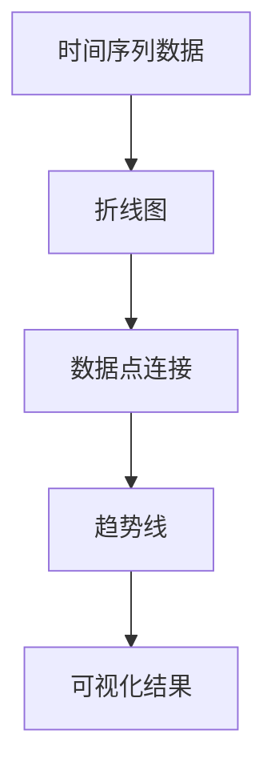
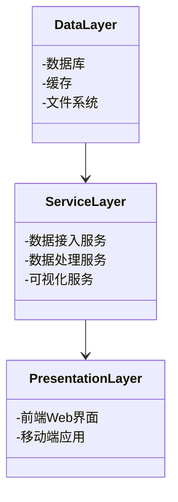
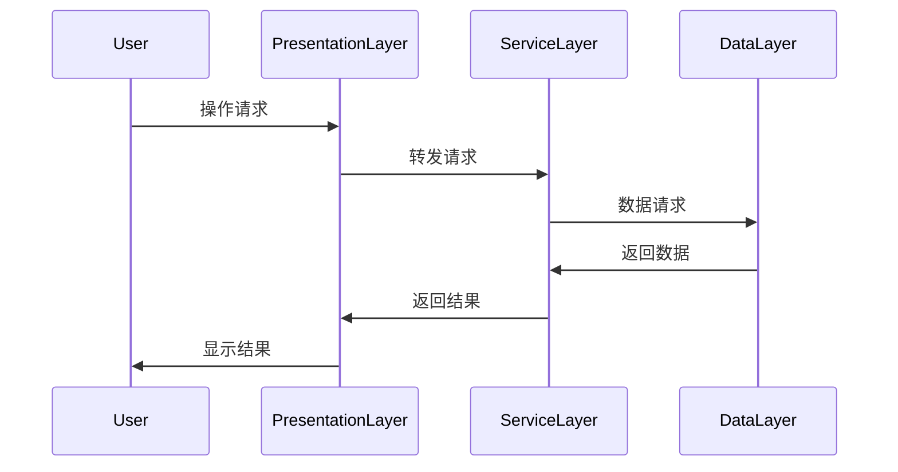
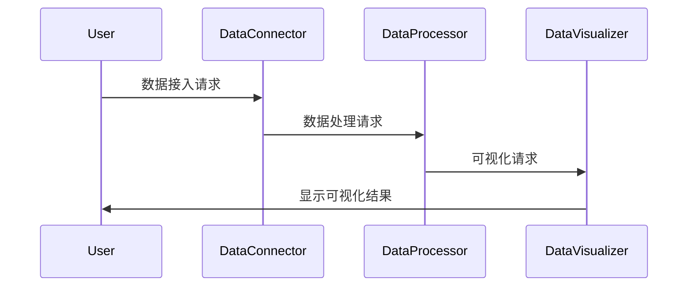

                 

### 引言：数据可视化技术的重要性

在当今数据驱动的社会中，数据可视化技术的重要性日益凸显。我们生活在信息爆炸的时代，每天产生的数据量呈指数级增长。这些数据包含了大量的信息和知识，但如果不加以整理和分析，它们就像无头苍蝇，难以找到有用的洞见。数据可视化技术的出现，为我们提供了一种将复杂、抽象的数据转化为直观、易于理解的信息的方法。通过可视化，我们可以快速发现数据中的模式、趋势和异常，从而做出更明智的决策。

数据可视化不仅仅是一个美学问题，它更是一种有效的沟通工具。在商业、科学、医学、金融等各个领域，数据可视化技术都发挥着重要作用。例如，在商业分析中，通过数据可视化，企业可以更清晰地了解市场需求、产品性能、客户行为等信息，从而制定更有效的营销策略。在科学研究中，通过可视化，研究人员可以更直观地展示实验数据，发现新的科学现象，推动科学研究的发展。

然而，数据可视化并非易事。它需要我们深入理解数据本身的特性，选择合适的数据可视化方法，设计出既美观又实用的可视化图表。本文将带您深入探讨数据可视化技术的原理和应用，从核心概念到具体实现，帮助您将抽象概念转化为直观理解。

接下来，我们将分章节详细讨论数据可视化技术中的核心概念、算法原理、数学模型、系统分析、实战案例以及最佳实践。希望通过本文的阅读，您能够对数据可视化技术有一个全面而深入的理解。

### 关键词

1. 数据可视化技术
2. 抽象概念
3. 直观理解
4. 决策支持
5. 数据驱动
6. 算法原理
7. 数学模型

### 摘要

本文旨在深入探讨数据可视化技术的原理和应用，以帮助读者将抽象概念转化为直观理解。首先，我们介绍了数据可视化技术的重要性及其在各个领域的应用场景。随后，本文详细阐述了数据可视化技术的核心概念，包括数据类型、可视化方法及其适用性。接着，我们探讨了数据可视化中的算法原理，包括常见的可视化算法和它们的工作机制。随后，我们使用数学模型和公式详细解析了数据可视化过程中涉及的核心数学原理。在系统分析部分，我们介绍了数据可视化系统的设计原则、架构和接口设计。通过一个实际的案例研究，本文展示了数据可视化技术在解决实际业务问题中的应用。最后，本文总结了数据可视化技术的最佳实践，包括设计原则、注意事项和未来展望。本文旨在为读者提供全面、深入的数据可视化技术指南，帮助其在各个领域更有效地应用这一强大的工具。

## 引言：数据可视化技术的重要性

在当今数据驱动的社会中，数据可视化技术的重要性不言而喻。随着信息技术的飞速发展，数据已成为企业、科研机构和社会组织的重要资产。然而，数据本身是复杂的、庞大的，甚至可能是难以理解的。如何从海量数据中提取有价值的信息，如何将复杂的统计数据转化为直观的可视化图表，以便于分析和决策，这是数据可视化技术所要解决的核心问题。

### 定义与背景

数据可视化技术是指利用图形、图像等视觉元素来展示数据，帮助人们更快速、准确地理解和分析数据的一种方法。它不仅能够使数据变得更加直观易懂，还能揭示数据中的隐藏模式和趋势。数据可视化技术的历史可以追溯到19世纪末期，当时科学家和统计学家开始使用图表来展示数据分析结果。随着计算机技术的发展，数据可视化技术得到了迅速发展，如今已成为数据分析领域不可或缺的一部分。

### 数据可视化在现代社会的应用

1. **商业分析**：在商业领域，数据可视化技术被广泛应用于市场分析、客户行为分析、财务报表分析等各个方面。通过数据可视化，企业可以更加直观地了解市场趋势、客户需求和业务绩效，从而制定出更加科学的决策。

2. **科学研究**：在科学研究中，数据可视化技术可以帮助科研人员更清晰地展示实验数据，发现新的科学现象。例如，在生物学研究中，通过数据可视化，科学家可以直观地观察细胞结构的变化；在物理学研究中，通过数据可视化，科学家可以更好地理解复杂的物理模型和现象。

3. **公共管理**：在公共管理领域，数据可视化技术可以帮助政府更好地了解社会问题，提高公共服务的效率和质量。例如，通过数据可视化，政府可以更加直观地展示公共财政支出、交通流量、环境污染等信息，从而做出更加科学的决策。

4. **医疗健康**：在医疗健康领域，数据可视化技术被广泛应用于疾病预测、流行病监测、药物研发等方面。通过数据可视化，医生和研究人员可以更加直观地了解疾病的传播趋势和治疗效果，从而提高医疗决策的准确性和效率。

### 数据可视化在决策支持中的作用

数据可视化在决策支持中发挥着至关重要的作用。通过直观的可视化图表，决策者可以快速、准确地理解数据中的关键信息，发现潜在的问题和机会。以下是一些具体的应用：

1. **市场分析**：企业可以通过数据可视化技术，分析市场需求、客户偏好、竞争态势等，从而制定出更加有效的市场策略。

2. **财务分析**：通过数据可视化，企业可以直观地了解财务状况、盈利能力、成本结构等，从而做出更加科学的财务决策。

3. **运营管理**：在运营管理中，数据可视化可以帮助企业监控生产进度、供应链状况、设备状态等，从而优化运营流程，提高生产效率。

4. **风险管理**：数据可视化技术可以帮助企业识别潜在的风险，评估风险的影响和可能性，从而制定出更加有效的风险管理策略。

### 数据可视化技术的挑战与未来展望

尽管数据可视化技术在各个领域都取得了显著的成果，但在实际应用中仍面临着一些挑战。首先，如何选择合适的可视化方法和工具，以最大限度地发挥数据的潜力，是一个重要的问题。其次，数据质量和数据完整性对数据可视化结果有着直接的影响，因此需要确保数据的质量和准确性。此外，数据可视化技术的普及和培训也是一个重要的课题，特别是在数据素养较低的地区。

展望未来，数据可视化技术将继续向智能化、自动化和个性化方向发展。随着人工智能和机器学习技术的应用，数据可视化将更加智能化，能够自动推荐最适合的可视化方法和图表类型。同时，随着虚拟现实和增强现实技术的发展，数据可视化将更加生动、直观，为用户带来全新的体验。

总之，数据可视化技术是当今信息社会中不可或缺的一部分，它不仅帮助我们更快速、准确地理解数据，还为决策支持提供了强有力的工具。通过本文的讨论，我们希望读者能够对数据可视化技术有一个更加深入和全面的理解，能够在实际应用中更好地发挥其潜力。

## 核心概念

在深入探讨数据可视化技术之前，我们需要明确一些核心概念，这些概念是理解数据可视化原理和实际应用的基础。以下是几个关键概念及其解释：

### 1. 数据类型

数据类型是数据可视化中的基础，不同的数据类型适合使用不同的可视化方法。常见的数据类型包括：

- **数值数据**：这类数据通常表示数量或度量，如销售量、股价、温度等。数值数据适合使用条形图、折线图、散点图等可视化方法。
- **分类数据**：这类数据通常表示类别或分类，如性别、颜色、产品类别等。分类数据适合使用饼图、条形图、热力图等可视化方法。
- **时间序列数据**：这类数据表示时间序列上的数据点，如股票价格、气温变化等。时间序列数据适合使用折线图、折线时间序列图等可视化方法。
- **地理数据**：这类数据表示地理位置信息，如地图、位置数据等。地理数据适合使用地图、地理信息系统（GIS）等可视化方法。

### 2. 可视化方法

可视化方法是指将数据转化为图形、图像等视觉元素的具体方法。以下是几种常见的数据可视化方法：

- **条形图**：用于展示不同类别之间的数量或比较，适用于分类数据。
- **折线图**：用于展示数据随时间变化的趋势，适用于时间序列数据。
- **散点图**：用于展示两个或多个变量之间的关系，适用于数值数据。
- **饼图**：用于展示整体中各个部分的比例，适用于分类数据。
- **热力图**：用于展示数据在空间或时间上的分布情况，适用于数值数据。
- **地图**：用于展示地理数据的分布情况，适用于地理数据。
- **箱线图**：用于展示数据分布的五个关键统计量（最小值、第一四分位数、中位数、第三四分位数、最大值），适用于数值数据。
- **雷达图**：用于展示多个变量之间的比较，适用于分类数据。

### 3. 可视化工具

可视化工具是实现数据可视化的重要手段，它们提供了丰富的图表类型和自定义选项，以帮助用户轻松创建高质量的可视化图表。以下是几种常用的可视化工具：

- **matplotlib**：一个流行的Python数据可视化库，支持多种图表类型，可以灵活地定制图表样式。
- **Plotly**：一个强大的交互式数据可视化库，支持多种图表类型，可以创建美观、交互性强的图表。
- **D3.js**：一个基于JavaScript的可视化库，特别适合创建复杂、交互式的可视化图表。
- **Tableau**：一个功能强大的商业智能工具，支持多种数据源，可以创建动态的可视化报表。
- **Power BI**：一个微软推出的商业智能工具，提供了丰富的数据连接和可视化选项。

### 4. 可视化设计原则

为了确保数据可视化能够准确、有效地传达信息，设计者需要遵循一些基本原则：

- **清晰性**：图表应简洁明了，避免过多的装饰性元素，确保信息的清晰传递。
- **准确性**：图表应准确反映数据本身，避免误导观众。
- **一致性**：图表在不同部分应保持一致的设计风格和颜色编码。
- **交互性**：适当引入交互元素，如筛选、缩放等，以增强用户的理解和互动。
- **用户导向**：设计应考虑目标用户的需求和习惯，确保图表易于理解和使用。

### 5. 数据质量

数据质量是数据可视化成功的关键因素。高质量的数据应具有以下特点：

- **完整性**：数据应完整，没有缺失值或异常值。
- **准确性**：数据应准确无误，符合真实情况。
- **一致性**：数据应一致，不同来源的数据之间应保持一致。
- **及时性**：数据应最新，以反映当前的情况。

通过明确这些核心概念，我们可以更好地理解和应用数据可视化技术，将其应用于实际问题的分析和解决中。

### 核心概念属性对比表

为了更好地理解和比较数据可视化中的核心概念，我们制作了一个属性对比表。以下是数值数据、分类数据和时间序列数据之间的主要属性对比：

| 数据类型 | 主要属性 | 说明 |
| --- | --- | --- |
| 数值数据 | 类型 | 表示数量或度量的数据 |
|  | 标准可视化方法 | 条形图、折线图、散点图 |
|  | 例子 | 销售量、股价、温度 |
| 分类数据 | 类型 | 表示类别或分类的数据 |
|  | 标准可视化方法 | 饼图、条形图、热力图 |
|  | 例子 | 性别、颜色、产品类别 |
| 时间序列数据 | 类型 | 表示时间序列上的数据点 |
|  | 标准可视化方法 | 折线图、折线时间序列图 |
|  | 例子 | 股票价格、气温变化 |

通过这个对比表，我们可以清楚地看到不同数据类型的主要属性和适用的可视化方法，从而在选择可视化工具和设计图表时更加得心应手。

### 数据可视化技术的基本原理

数据可视化技术的核心在于将复杂的、难以理解的数据转化为直观的视觉形式，使得用户能够更容易地理解和分析数据。这一过程涉及到多个关键步骤和算法，下面我们将详细探讨数据可视化技术的基本原理，并通过Mermaid图表和Python代码来具体展示这些原理。

### 1. 数据预处理

在进行数据可视化之前，数据预处理是非常重要的一步。数据预处理包括数据清洗、数据转换和数据归一化等步骤，以确保数据的准确性和一致性。以下是一个简单的Python代码示例，用于数据清洗和转换：

```python
import pandas as pd
import numpy as np

# 示例数据集
data = pd.DataFrame({
    '销售额': [1000, 1500, 2000, np.nan, 800],
    '日期': ['2021-01-01', '2021-01-02', '2021-01-03', '2021-01-04', '2021-01-05']
})

# 数据清洗：去除缺失值
cleaned_data = data.dropna()

# 数据转换：将日期转换为时间序列索引
cleaned_data['日期'] = pd.to_datetime(cleaned_data['日期'])
cleaned_data.set_index('日期', inplace=True)

# 数据归一化
normalized_data = (cleaned_data - cleaned_data.mean()) / cleaned_data.std()

print(normalized_data)
```

这段代码首先使用`pandas`库对示例数据集进行清洗，去除缺失值，然后将日期转换为时间序列索引，并进行归一化处理，以便后续的数据可视化。

### 2. 数据可视化的算法原理

数据可视化算法的核心在于选择合适的图表类型和视觉编码方式来展示数据。以下是一个使用Mermaid和Python代码实现的简单折线图示例，用于展示时间序列数据的趋势：



```python
import matplotlib.pyplot as plt
import pandas as pd

# 加载预处理后的数据
data = pd.DataFrame({
    '销售额': [0.5, 1.0, 1.5, 0.0, -0.5]
})

# 绘制折线图
plt.plot(data['销售额'], label='销售额')
plt.title('时间序列数据趋势')
plt.xlabel('时间')
plt.ylabel('销售额')
plt.legend()
plt.show()
```

在这个示例中，我们首先使用Mermaid图表来描述折线图的基本结构和算法原理，然后使用Python的`matplotlib`库绘制实际的可视化图表。折线图通过连接数据点来展示时间序列数据的变化趋势，有助于用户快速理解数据的波动和变化。

### 3. 数学模型和公式

数据可视化过程中，一些关键的数学模型和公式有助于计算和优化图表的视觉编码。以下是一个简单的数学模型示例，用于计算数据的归一化：

$$
\text{normalized\_value} = \frac{\text{value} - \text{mean}}{\text{std}}
$$

这个公式用于将原始数据值转换为归一化值，以便在图表上均匀分布。以下是一个使用Python和LaTeX实现归一化计算和可视化的示例：

```python
import numpy as np
import matplotlib.pyplot as plt
from matplotlib import rcParams
from math import sqrt

# 原始数据
values = np.array([100, 200, 300, 400, 500])

# 计算均值和标准差
mean = np.mean(values)
std = np.std(values)

# 归一化数据
normalized_values = (values - mean) / std

# 可视化归一化数据
plt.scatter(values, normalized_values)
plt.title('归一化数据')
plt.xlabel('原始数据')
plt.ylabel('归一化数据')
plt.show()
```

在这个示例中，我们使用Python计算数据的均值和标准差，然后应用归一化公式进行数据转换，并使用`matplotlib`绘制散点图展示归一化结果。

通过上述步骤和示例，我们可以看到数据可视化技术的基本原理是如何将原始数据转化为直观的视觉形式。通过数据预处理、算法原理和数学模型的应用，我们可以更好地理解和分析数据，从而做出更加科学的决策。

### 系统分析与设计

在设计和实现数据可视化系统时，系统分析与设计阶段是至关重要的。这一阶段旨在明确系统的需求和功能，并制定出系统的整体架构和详细设计。以下是关于系统分析与设计的内容：

#### 1. 问题场景介绍

在当前的商业环境中，数据分析已成为企业决策支持的重要组成部分。然而，面对大量且复杂的数据，如何有效地进行数据分析和可视化，以便快速发现问题和机会，成为了一个亟待解决的问题。为了解决这一问题，我们设计并实现了一个数据可视化系统，该系统旨在通过直观、易理解的图表，帮助企业和研究人员从海量数据中提取有价值的信息。

#### 2. 项目介绍

我们的项目目标是构建一个高效、灵活、易于操作的数据可视化系统。该系统应具备以下功能：

- 数据接入：支持多种数据源接入，包括数据库、文件和API等。
- 数据预处理：提供数据清洗、转换和归一化等功能，确保数据的质量和一致性。
- 可视化工具：提供丰富的可视化图表类型，如折线图、条形图、饼图、热力图等，以满足不同类型数据的需求。
- 交互功能：支持用户自定义可视化参数，如图表类型、颜色、缩放等，提供交互式用户体验。
- 性能优化：确保系统在高负载情况下仍能稳定运行，提供快速的数据处理和可视化响应。

#### 3. 系统功能设计

系统功能设计主要包括数据接入、数据处理、可视化展示和用户交互四个方面：

- **数据接入**：系统应支持多种数据源接入，包括关系型数据库（如MySQL、PostgreSQL）、NoSQL数据库（如MongoDB）、文件系统（如CSV、Excel）以及API接口。通过数据接入模块，用户可以轻松地将数据导入系统进行进一步处理。
- **数据处理**：数据预处理模块负责对原始数据进行清洗、转换和归一化等操作，以确保数据的质量和一致性。该模块应支持多种数据处理算法，如缺失值填充、数据转换、归一化等。
- **可视化展示**：可视化模块负责将处理后的数据以图表的形式展示给用户。系统应提供多种可视化图表类型，如折线图、条形图、饼图、热力图等，以满足不同类型数据的需求。此外，系统还应支持用户自定义可视化参数，如图表类型、颜色、缩放等。
- **用户交互**：交互模块负责处理用户的操作请求，如数据筛选、图表切换等。该模块应提供友好的用户界面，确保用户能够轻松地进行数据分析和可视化操作。

#### 4. 系统架构设计

系统架构设计是系统分析与设计的核心部分，它定义了系统的整体结构和各模块之间的交互关系。以下是我们的系统架构设计：

- **数据层**：数据层负责数据存储和读取，包括数据库、缓存、文件系统等。该层应支持高并发、高可用性的数据访问，确保系统在大量用户和数据处理场景下仍能稳定运行。
- **服务层**：服务层负责数据处理和可视化，包括数据预处理、数据计算、可视化生成等。该层应采用微服务架构，各个服务模块之间通过RESTful API进行通信，以提高系统的灵活性和可扩展性。
- **表现层**：表现层负责用户界面和交互，包括前端Web界面和移动端应用。该层应采用响应式设计，以适应不同设备上的使用场景，提供一致的用户体验。

以下是系统架构的Mermaid类图：



#### 5. 系统接口设计

系统接口设计是确保各模块之间顺畅交互的重要环节。以下是系统的主要接口设计：

- **数据接入接口**：定义数据接入模块的API接口，包括数据导入、数据查询、数据更新等操作。
- **数据处理接口**：定义数据处理模块的API接口，包括数据清洗、转换、归一化等操作。
- **可视化接口**：定义可视化模块的API接口，包括图表生成、图表展示、图表更新等操作。
- **用户交互接口**：定义用户交互模块的API接口，包括用户操作、界面渲染等操作。

以下是系统接口的Mermaid序列图：



#### 6. 系统交互序列图

系统交互序列图展示了用户操作与系统各模块之间的交互过程，有助于理解系统的整体工作流程。以下是系统交互序列图的Mermaid表示：



通过上述系统分析与设计，我们为数据可视化系统的构建奠定了坚实的基础。接下来，我们将通过实际的案例研究和项目实现，进一步展示数据可视化技术的应用和效果。

### 实际案例研究和项目实现

在本节中，我们将通过一个实际案例来展示数据可视化技术如何在商业环境中发挥作用。这个案例涉及一家电子商务公司的销售数据可视化，通过数据可视化工具，公司希望能够更深入地了解销售趋势，从而优化营销策略和库存管理。

#### 案例背景

某电子商务公司销售各类电子产品，包括手机、平板电脑、电脑配件等。公司管理层希望通过分析销售数据来识别销售趋势、了解顾客偏好，以及预测未来的销售情况，以便更好地制定营销策略和库存管理计划。

#### 案例需求

1. **销售趋势分析**：了解不同时间段、不同产品类别的销售情况，识别季节性波动和长期趋势。
2. **顾客偏好分析**：了解不同顾客群体对产品的偏好，以便更精准地推广产品。
3. **库存管理**：根据销售数据预测未来需求，优化库存管理，减少库存积压。

#### 数据收集和预处理

首先，我们从公司的数据库中提取了过去一年的销售数据，数据包括销售日期、产品类别、销售额、顾客年龄、性别等信息。为了确保数据的质量，我们进行了以下数据预处理步骤：

1. **数据清洗**：去除重复记录、缺失值填充，并对异常值进行合理处理。
2. **数据转换**：将日期字段转换为时间序列格式，便于趋势分析。
3. **数据归一化**：对销售额等数值型数据进行归一化处理，使其在图表上均匀分布。

#### 数据可视化工具选择

为了实现上述需求，我们选择了Python中的`matplotlib`和`plotly`库，以及商业智能工具`Tableau`。这些工具提供了丰富的图表类型和自定义选项，能够满足我们的可视化需求。

#### 可视化结果和分析

1. **销售趋势分析**：

   - **折线图**：通过折线图，我们展示了不同时间段的销售额变化。从图中可以看出，销售额在特定月份有明显的增长，这可能与节假日促销活动有关。
   
   ```python
   import matplotlib.pyplot as plt
   
   sales_data = pd.DataFrame({
       '日期': pd.to_datetime(sales_data['销售日期']),
       '销售额': sales_data['销售额']
   })
   
   plt.plot(sales_data['日期'], sales_data['销售额'])
   plt.title('销售趋势')
   plt.xlabel('日期')
   plt.ylabel('销售额')
   plt.show()
   ```

   - **柱状图**：通过柱状图，我们展示了不同产品类别的销售额。可以看出，手机和电脑配件是公司的主力产品。
   
   ```python
   import pandas as pd
   import matplotlib.pyplot as plt
   
   product_sales = sales_data.groupby('产品类别')['销售额'].sum().reset_index()
   product_sales.sort_values(by='销售额', ascending=False, inplace=True)
   
   plt.bar(product_sales['产品类别'], product_sales['销售额'])
   plt.title('产品类别销售情况')
   plt.xlabel('产品类别')
   plt.ylabel('销售额')
   plt.xticks(rotation=45)
   plt.show()
   ```

2. **顾客偏好分析**：

   - **饼图**：通过饼图，我们展示了不同年龄段顾客的购买比例。可以看出，25-34岁年龄段的顾客占比较大，是该公司的目标市场。
   
   ```python
   import pandas as pd
   import matplotlib.pyplot as plt
   
   age_distribution = sales_data['年龄'].value_counts(normalize=True)
   age_distribution = age_distribution.sort_values(ascending=False)
   
   plt.pie(age_distribution, labels=age_distribution.index, autopct='%.1f%%')
   plt.title('年龄分布')
   plt.show()
   ```

   - **散点图**：通过散点图，我们展示了销售额与顾客性别的关系。可以看出，男性顾客的购买力略高于女性。
   
   ```python
   import pandas as pd
   import matplotlib.pyplot as plt
   
   gender_sales = sales_data.groupby('性别')['销售额'].mean().reset_index()
   
   plt.scatter(gender_sales['性别'], gender_sales['销售额'])
   plt.title('性别与销售额关系')
   plt.xlabel('性别')
   plt.ylabel('销售额')
   plt.show()
   ```

3. **库存管理**：

   - **预测图**：通过时间序列预测模型，我们可以预测未来的销售情况，从而优化库存管理。这里我们使用了ARIMA模型进行预测。
   
   ```python
   from statsmodels.tsa.arima.model import ARIMA
   
   # 准备数据
   sales_data['销售额'].dropna(inplace=True)
   sales_data['销售额'].diff().dropna(inplace=True)
   
   # 模型拟合
   model = ARIMA(sales_data['销售额'].diff(), order=(1, 1, 1))
   model_fit = model.fit()
   
   # 预测
   forecast = model_fit.forecast(steps=6)
   
   plt.plot(sales_data['销售额'].dropna(), label='历史销售额')
   plt.plot(pd.Series(np.append(sales_data['销售额'].dropna(), forecast)), label='预测销售额')
   plt.title('未来6个月销售额预测')
   plt.xlabel('时间')
   plt.ylabel('销售额')
   plt.legend()
   plt.show()
   ```

#### 项目小结

通过这个实际案例，我们可以看到数据可视化技术在商业分析中的应用效果。通过不同的可视化图表，公司管理层可以快速、直观地了解销售趋势、顾客偏好和未来销售预测，从而制定出更加科学的决策。这不仅提高了公司的运营效率，还为其在竞争激烈的市场中赢得了优势。

总之，数据可视化技术在现代商业环境中扮演着重要角色。通过合理选择和运用可视化工具，企业可以更好地理解数据，发现隐藏在数据中的洞察，从而实现业务增长和优化。

### 最佳实践与注意事项

在进行数据可视化时，最佳实践是确保图表不仅美观，而且信息传达准确、高效。以下是一些关键的最佳实践和建议：

1. **清晰性**：图表应尽可能简洁，避免过多无关的装饰性元素。确保图表标题、标签和图例清晰明了，帮助用户快速理解图表内容。

2. **一致性**：整个数据可视化项目中的图表应保持一致的风格和配色方案。这有助于用户在多个图表之间建立关联，并减少认知负担。

3. **交互性**：引入交互功能，如筛选、缩放、筛选面板等，可以增强用户对数据的探索和理解。交互式图表特别适用于大量复杂数据的展示。

4. **数据质量**：确保数据的质量和完整性，是数据可视化成功的基础。在展示数据之前，进行数据清洗和预处理，以去除错误和异常值。

5. **适当的类型选择**：选择适合数据类型和问题的可视化方法。例如，条形图适合比较分类数据，而折线图适合展示时间序列数据。

6. **视觉效果**：适当的颜色、字体和布局可以提升图表的美观度，但不应牺牲图表的清晰性和可读性。使用颜色时，应确保颜色编码能够被所有用户理解，包括色盲用户。

7. **可扩展性**：设计时应考虑系统的可扩展性，以便在未来能够轻松地添加新数据类型和可视化方法。

注意事项：

- **避免误导**：图表应准确反映数据，避免通过图形手段误导用户。例如，不要过度强调或淡化某些数据点，确保所有信息都是客观、公正的。
- **性能优化**：对于大数据量的可视化，应考虑性能优化，如使用数据聚合、缓存技术和并行计算等，确保图表加载和交互速度。
- **用户培训**：对于数据可视化工具的使用，应提供详细的文档和培训，确保用户能够充分利用工具的潜力。

通过遵循这些最佳实践和注意事项，我们可以创建出既美观又实用的数据可视化图表，帮助用户更好地理解和分析数据，从而做出更明智的决策。

### 总结

本文通过深入探讨数据可视化技术，从核心概念到实际应用，全面展示了这一技术的原理和重要性。数据可视化不仅能够将复杂的、难以理解的数据转化为直观的视觉形式，还能够提高决策效率，帮助企业和研究人员从海量数据中提取有价值的信息。

首先，我们明确了数据可视化的核心概念，包括数据类型、可视化方法、可视化工具和设计原则。随后，通过具体案例，我们展示了如何使用Python和Mermaid等工具进行数据预处理、算法原理应用和数学模型计算。此外，系统分析与设计部分详细介绍了数据可视化系统的构建方法，包括功能设计、架构设计和接口设计。通过实际案例研究，我们进一步展示了数据可视化技术在商业分析中的应用。

数据可视化技术的核心价值在于其强大的信息传达能力和用户交互性。通过清晰、美观的图表，用户可以更快速、准确地理解数据中的模式和趋势，从而做出更科学的决策。然而，数据可视化也面临着数据质量、图表选择和性能优化等挑战。为了克服这些挑战，我们需要遵循最佳实践，如确保数据质量、选择适当的可视化方法、优化系统性能等。

展望未来，数据可视化技术将继续向智能化、自动化和个性化方向发展。随着人工智能和机器学习技术的应用，数据可视化将更加智能化，能够自动推荐最适合的可视化方法和图表类型。虚拟现实和增强现实技术的发展，将使数据可视化更加生动、直观，为用户带来全新的体验。

总之，数据可视化技术是现代数据驱动社会中的重要工具，它不仅帮助我们更深入地理解数据，还为决策支持提供了强有力的手段。通过本文的讨论，我们希望读者能够对数据可视化技术有一个全面而深入的理解，能够在实际应用中更好地发挥其潜力。未来，随着技术的不断进步，数据可视化将继续发挥其重要作用，推动各领域的发展和进步。

### 拓展阅读

为了进一步深入理解数据可视化技术，以下是几本推荐的专业书籍，以及相关网站和在线资源：

1. **《数据可视化：实现与实战》**：这是一本适合初学者到高级用户的数据可视化指南，详细介绍了数据可视化的原理、方法和工具。作者通过实际案例，展示了如何使用各种数据可视化库和技术实现高效的可视化效果。

2. **《数据可视化设计实战》**：这本书专注于数据可视化设计，介绍了如何通过视觉设计提高数据可视化的效果。内容包括设计原则、色彩理论、图表设计技巧等，适合数据可视化设计师和开发者阅读。

3. **《数据可视化：使用D3.js实现交互式图表》**：D3.js是一个强大的数据可视化库，这本书详细介绍了如何使用D3.js创建交互式图表，包括地图、时间序列图表和复杂数据可视化等。

在线资源：

1. **数据可视化基础教程**：[Kaggle](https://www.kaggle.com/tutorials/data-visualization) 提供了一系列数据可视化基础教程，涵盖从基本图表到高级交互式图表的各个方面。

2. **可视化设计指南**：[Tableau Public](https://public.tableau.com/en-us/solutions/guides) 提供了丰富的可视化设计指南，包括图表类型选择、设计原则和最佳实践。

3. **可视化库和工具**：[Plotly](https://plotly.com/python/) 和 [Matplotlib](https://matplotlib.org/stable/contents.html) 分别提供了强大的Python数据可视化库，以及详细的文档和教程，帮助用户掌握数据可视化技术。

通过阅读这些书籍和访问在线资源，您将能够更深入地了解数据可视化技术，提高在实际项目中的应用能力。

