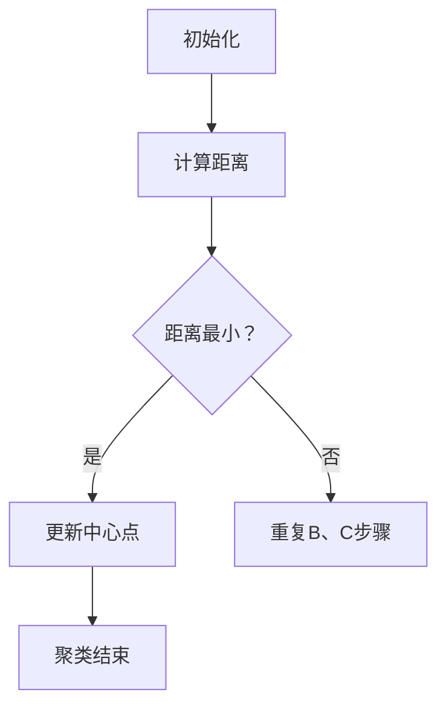
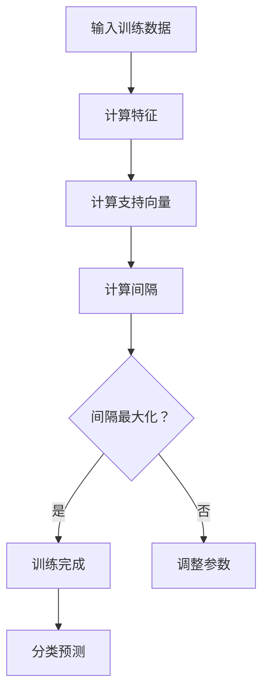
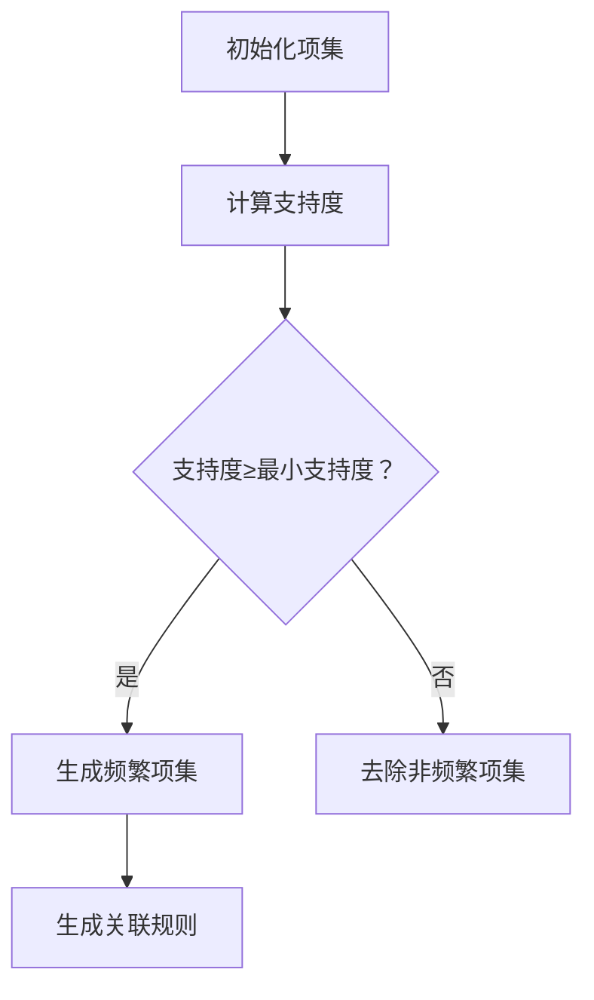
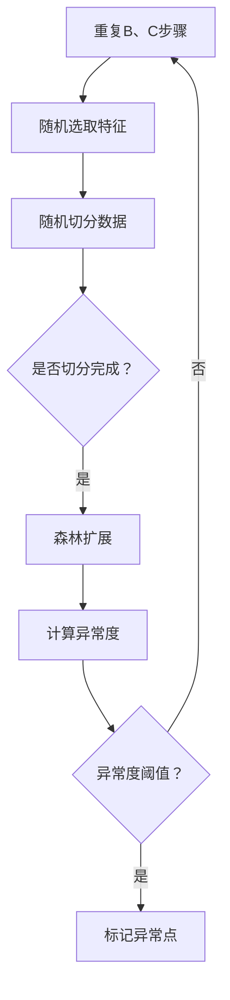

                 

### 1.1 问题的背景

#### 数据挖掘与宇宙学

宇宙学是研究宇宙的结构、起源、演化和最终命运的科学。在过去的几十年中，随着技术的进步，宇宙学家通过观测和模拟获取了大量的宇宙数据，这些数据以多种形式存在，包括天文观测数据、粒子碰撞数据、星系分布数据等。这些数据虽然极为丰富，但也极为复杂，传统的分析方法往往难以处理如此大规模、多维度的数据集。

数据挖掘，作为人工智能的一个分支，旨在从大量数据中发现有用的信息和知识。数据挖掘技术在很多领域都有广泛的应用，如商业智能、金融分析、医疗诊断等。然而，在宇宙学领域，数据挖掘也扮演着越来越重要的角色。通过数据挖掘，宇宙学家可以从复杂的数据中提取出有价值的信息，从而揭示宇宙中隐藏的规律和现象。

#### 宇宙新粒子的发现

在宇宙学中，新粒子的发现是研究宇宙基本组成和相互作用的关键。粒子物理学家们通过对宇宙射线、暗物质、暗能量的研究，不断发现新的粒子。然而，这些粒子的发现往往依赖于大量的观测数据和复杂的分析过程。例如，通过对宇宙射线的观测，科学家们发现了电子和正电子的交替产生和消失现象，这表明宇宙中存在某种粒子交换机制。

#### 数据挖掘在宇宙粒子发现中的作用

数据挖掘在宇宙粒子发现中起到了至关重要的作用。首先，数据挖掘可以帮助科学家从海量数据中快速定位潜在的粒子事件。传统的数据分析方法往往需要大量的时间和计算资源，而数据挖掘技术能够通过模式识别、聚类分析等方法，迅速从大量数据中提取出有价值的特征。

其次，数据挖掘还可以帮助科学家发现数据中的潜在规律和关联。例如，通过对星系分布数据的分析，科学家们可以发现星系之间的引力相互作用，进而推断出宇宙中暗物质的存在。这种关联的发现，不仅可以帮助科学家更好地理解宇宙的结构，还可以为未来的实验提供新的理论依据。

此外，数据挖掘还可以用于优化实验设计，提高观测效率。通过对历史观测数据的分析，科学家可以预测哪些区域可能存在新的粒子，从而针对性地进行观测，提高发现新粒子的概率。

#### 目的和重要性

本文的目的在于深入探讨数据挖掘在宇宙粒子发现中的作用，通过详细的分析和实例，展示数据挖掘技术如何帮助科学家们从海量数据中提取出有价值的信息。文章将首先介绍数据挖掘的基本概念和方法，然后逐步深入到宇宙粒子发现的实际应用中，最后总结最佳实践和注意事项。

本文的重要性在于，它不仅为数据挖掘在宇宙学中的应用提供了一个全面的概述，还为从事相关研究的科学家和技术人员提供了实用的指导。通过本文的阅读，读者将能够更好地理解数据挖掘技术在宇宙粒子发现中的潜在价值，并能够将其应用到自己的研究中。

### 1.2 数据挖掘的定义

数据挖掘（Data Mining）是人工智能领域的一个重要分支，旨在从大量、复杂的数据集中发现隐含的、未知的、有价值的模式和知识。数据挖掘的过程通常包括数据预处理、数据选择、数据变换、模式识别和数据评估等多个步骤。

#### 数据挖掘的基本概念

1. **数据预处理**：数据预处理是数据挖掘过程中的第一步，其目的是提高数据的质量和一致性。这通常包括数据清洗、数据集成、数据转换和数据归一化等步骤。数据清洗主要涉及去除重复数据、处理缺失值和纠正错误数据；数据集成则是将来自多个源的数据合并为一个统一的数据集；数据转换包括将数据转换为适合挖掘算法的格式，如数值化、离散化等；数据归一化则是通过调整数据范围或比例，使其具有可比性。

2. **数据选择**：数据选择是指从整个数据集中选择出对挖掘任务有用的子集。这一步骤有助于减少数据规模，提高挖掘效率。数据选择可以根据多种策略进行，如基于特定特征的筛选、基于阈值的过滤等。

3. **数据变换**：数据变换是指通过数学或统计方法对数据进行转换，以提高数据挖掘的效果。常见的变换方法包括归一化、离散化、主成分分析等。

4. **模式识别**：模式识别是数据挖掘的核心步骤，其主要目标是发现数据中的潜在模式和关联。模式识别方法包括聚类分析、关联规则挖掘、分类和回归分析等。

5. **数据评估**：数据评估是衡量数据挖掘结果好坏的重要步骤。评估方法包括准确率、召回率、F1 分数等。通过对挖掘结果的评估，可以判断数据挖掘任务是否成功，并根据评估结果调整挖掘策略。

#### 数据挖掘的主要任务类型

数据挖掘根据其目标和应用场景，可以分为以下几种主要任务类型：

1. **分类（Classification）**：分类任务的目标是将数据分为预定义的类别。常见的分类算法包括决策树、支持向量机、随机森林等。

2. **回归（Regression）**：回归任务的目标是预测一个连续值。常见的回归算法包括线性回归、岭回归、决策树回归等。

3. **聚类（Clustering）**：聚类任务的目标是将数据分成若干组，使得组内数据之间的相似度较高，组间数据之间的相似度较低。常见的聚类算法包括K-均值、层次聚类、DBSCAN等。

4. **关联规则挖掘（Association Rule Learning）**：关联规则挖掘的目标是从数据中发现存在于不同项目之间的关联。常见的算法包括Apriori算法和Eclat算法。

5. **异常检测（Outlier Detection）**：异常检测的目标是识别数据集中的异常值或离群点。常见的算法包括孤立森林、Local Outlier Factor等。

#### 数据挖掘的应用领域

数据挖掘在多个领域都有广泛的应用，以下是一些典型的应用领域：

1. **商业智能**：数据挖掘可以帮助企业通过分析客户数据、销售数据等，发现市场趋势和客户需求，从而制定更有效的商业策略。

2. **金融分析**：数据挖掘可以用于风险评估、市场预测、欺诈检测等金融领域的任务。

3. **医疗诊断**：数据挖掘可以帮助医生从大量的医疗数据中提取出有价值的信息，如疾病诊断、治疗方案优化等。

4. **气象预报**：数据挖掘可以用于分析气象数据，预测天气变化，提供准确的天气预报。

5. **科学研究**：数据挖掘在科学研究中也有广泛应用，如基因分析、环境监测、天体物理学等。

综上所述，数据挖掘是一种强大的工具，它通过从大量数据中发现隐藏的模式和知识，为各个领域提供了创新性的解决方案。在接下来的章节中，我们将进一步探讨数据挖掘在宇宙物理学中的应用，展示其如何帮助科学家发现宇宙中的新粒子。

### 1.3 数据挖掘的方法

数据挖掘作为一门跨学科的技术，涵盖了多种方法和技术。这些方法不仅丰富了数据挖掘的理论基础，也在实际应用中展现了强大的效果。在本节中，我们将详细介绍几种主要的数据挖掘方法，包括其基本原理、应用场景和优势。

#### 聚类分析

聚类分析是一种无监督学习方法，其目标是将数据集分成若干个群组，使得同一群组内的数据对象彼此相似，而不同群组之间的数据对象则相互迥异。常见的聚类算法包括K-均值聚类、层次聚类和DBSCAN等。

1. **K-均值聚类**：K-均值聚类算法是一种基于距离的聚类方法，其基本原理是将数据点分配到K个中心点所代表的群组中，通过迭代优化中心点位置，使每个群组内的数据点之间的平均距离最小。K-均值聚类算法简单高效，适用于数据点较少、维度较低的场景。

2. **层次聚类**：层次聚类是一种基于层次结构的聚类方法，通过自底向上的方法（凝聚层次聚类）或自顶向下的方法（分裂层次聚类），将数据点逐步合并或分裂，形成不同层次的群组。层次聚类能够提供数据点的层次结构，便于理解和分析。

3. **DBSCAN（Density-Based Spatial Clustering of Applications with Noise）**：DBSCAN是一种基于密度的聚类算法，能够识别出不同密度分布的数据点。其核心思想是识别出核心点、边界点和噪声点，从而将数据点划分为不同的群组。DBSCAN适用于数据点分布不均匀、含有噪声数据的场景。

#### 分类算法

分类算法是一种有监督学习方法，其目标是构建一个模型，将新的数据点归类到预定义的类别中。常见的分类算法包括决策树、支持向量机、神经网络和随机森林等。

1. **决策树**：决策树通过一系列的判定规则，将数据集划分为多个子集，直到每个子集中的数据点都属于同一类别。决策树简单易懂，易于解释，适用于分类和回归任务。

2. **支持向量机（SVM）**：支持向量机是一种强大的分类器，通过最大化分类边界之间的距离来提升分类效果。SVM适用于高维空间的数据，特别适用于小样本数据集。

3. **神经网络**：神经网络是一种模仿人脑神经元连接结构的算法，通过多层非线性变换，实现数据的分类和回归。常见的神经网络包括前馈神经网络、卷积神经网络（CNN）和循环神经网络（RNN）等。

4. **随机森林（Random Forest）**：随机森林是一种集成学习方法，通过构建多棵决策树，并结合它们的预测结果进行投票，从而提高分类和回归的准确性。随机森林具有强鲁棒性和泛化能力，适用于复杂和大规模的数据集。

#### 关联规则挖掘

关联规则挖掘是一种用于发现数据项之间潜在关联的方法，其目标是生成满足最小支持度和最小置信度的规则。常见的算法包括Apriori算法和Eclat算法。

1. **Apriori算法**：Apriori算法通过递归搜索所有频繁项集，并生成关联规则。其优点是算法简单，但缺点是计算复杂度较高，尤其是对于大规模数据集。

2. **Eclat算法**：Eclat算法是基于项集重要度的挖掘算法，通过递归生成频繁项集，并在生成过程中考虑项集之间的依赖关系。Eclat算法相对于Apriori算法具有更高的效率，但可能生成更长的项集。

#### 异常检测

异常检测是一种无监督学习方法，其目标是从数据集中识别出异常或离群点。常见的算法包括孤立森林、Local Outlier Factor（LOF）和Isolation Forest等。

1. **孤立森林（Isolation Forest）**：孤立森林算法通过随机选取特征和切分点，将数据点逐渐隔离，形成独立的树。异常点的隔离路径长度较短，从而可以识别出异常点。孤立森林具有较好的抗噪性和计算效率。

2. **Local Outlier Factor（LOF）**：LOF算法通过计算局部密度和局部宽度的比值，识别出异常点。异常点的局部密度较低，局部宽度较大，从而被标记为异常。LOF算法适用于多维数据集，能够较好地识别局部异常。

#### 数据挖掘的优势和局限性

数据挖掘方法具有以下几个主要优势：

1. **处理大规模数据**：数据挖掘能够处理大量复杂的数据集，从海量数据中提取有价值的信息。

2. **自动发现模式**：数据挖掘能够自动发现数据中的潜在模式和关联，无需人工干预。

3. **灵活性和适应性**：数据挖掘方法适用于多种应用场景和数据类型，具有良好的灵活性和适应性。

然而，数据挖掘方法也存在一些局限性：

1. **计算复杂度**：对于大规模和高维数据，一些算法的计算复杂度较高，可能需要大量时间和计算资源。

2. **数据质量**：数据挖掘的效果很大程度上取决于数据质量，包括数据的一致性、完整性和准确性。

3. **模型解释性**：一些复杂的数据挖掘模型，如神经网络，具有强大的预测能力，但其内部机制难以解释，可能影响决策的透明性和可追溯性。

综上所述，数据挖掘方法在宇宙物理学中的应用具有重要意义。通过合理的算法选择和优化，数据挖掘能够帮助科学家从海量宇宙数据中提取出有价值的粒子发现线索，推动宇宙学的发展。在接下来的章节中，我们将进一步探讨数据挖掘在宇宙物理学中的具体应用场景，展示其实际操作过程和效果。

### 2.1 数据挖掘与宇宙粒子发现

#### 数据挖掘在宇宙粒子发现中的重要性

宇宙粒子发现是粒子物理学的一个重要领域，它涉及到对宇宙射线、暗物质、暗能量等基本物理现象的研究。随着观测技术和计算能力的不断提高，科学家们收集到的宇宙数据量急剧增加。这些数据不仅包含了丰富的物理信息，也充满了复杂性和噪声。传统的数据分析方法在处理如此大规模、多维的数据集时显得力不从心，而数据挖掘技术则为这一领域带来了新的突破。

数据挖掘在宇宙粒子发现中的重要性主要体现在以下几个方面：

1. **高效的信息提取**：宇宙粒子发现涉及到海量数据，数据挖掘技术能够快速从这些数据中提取出有价值的信息，提高数据分析的效率。

2. **发现潜在规律**：数据挖掘能够发现数据中隐藏的关联和模式，这些规律对于理解宇宙的基本物理现象具有重要意义。

3. **辅助实验设计**：通过对历史数据的分析，数据挖掘可以帮助科学家预测哪些区域或事件可能存在新的粒子，从而指导实验设计，提高观测的针对性。

4. **降低计算成本**：数据挖掘技术通过预处理和特征选择，可以减少数据规模，降低后续计算和存储的成本。

#### 数据挖掘在宇宙粒子发现中的应用场景

1. **宇宙射线分析**：宇宙射线是来自宇宙的高能粒子流，包括电子、正电子、α粒子等。通过对宇宙射线的数据分析，科学家们可以揭示宇宙中的高能物理过程。数据挖掘技术可以帮助识别出宇宙射线中的异常事件，如特定的粒子碰撞事件。

2. **星系分布与结构**：星系的分布和结构是宇宙学研究的重要内容。数据挖掘技术可以通过分析星系分布数据，发现星系之间的引力相互作用，揭示宇宙的大尺度结构。例如，通过聚类分析，可以识别出不同类型的星系集群。

3. **暗物质研究**：暗物质是宇宙中一种未观测到的物质，其存在通过引力效应间接证实。数据挖掘技术可以帮助分析星系运动和星系团分布数据，从而推断出暗物质的存在和性质。

4. **暗能量研究**：暗能量是推动宇宙加速膨胀的神秘力量。通过对宇宙膨胀数据的分析，科学家们可以研究暗能量的性质。数据挖掘技术可以通过模式识别和回归分析，发现宇宙膨胀的规律。

5. **粒子碰撞模拟**：在粒子物理实验中，如大型强子对撞机（LHC）的实验数据中，包含了大量粒子碰撞事件。数据挖掘技术可以帮助科学家从这些事件中识别出新的粒子状态和相互作用。

#### 数据挖掘在宇宙粒子发现中的挑战

尽管数据挖掘在宇宙粒子发现中具有巨大的潜力，但该领域也面临一些挑战：

1. **数据量巨大**：宇宙数据集通常包含数以亿计的数据点，处理这些数据需要强大的计算能力和高效的算法。

2. **数据复杂性**：宇宙数据通常具有高维性和多模态性，数据挖掘算法需要能够处理复杂的非线性关系。

3. **噪声和异常**：宇宙数据中往往存在大量的噪声和异常值，这可能会干扰数据挖掘的结果。如何有效地处理噪声和异常值是一个重要问题。

4. **数据预处理**：宇宙数据往往需要经过复杂的预处理步骤，如数据清洗、数据变换和特征提取，这些步骤的质量直接影响数据挖掘的效果。

5. **算法选择和优化**：选择合适的算法和优化算法参数对于数据挖掘的成功至关重要。然而，不同的算法和参数组合可能具有不同的效果，需要通过实验进行优化。

综上所述，数据挖掘在宇宙粒子发现中具有重要作用，它不仅能够提高数据分析的效率，还能够揭示宇宙中的潜在规律。在接下来的章节中，我们将详细探讨数据挖掘的基本概念和方法，为进一步理解其在宇宙物理学中的应用打下基础。

### 2.2 数据挖掘的基本概念

在深入探讨数据挖掘在宇宙粒子发现中的应用之前，有必要首先了解数据挖掘的基本概念。数据挖掘是一个复杂且多维的过程，它涉及到多个步骤和任务，每一个步骤和任务都有其特定的目的和作用。

#### 数据挖掘的定义

数据挖掘（Data Mining）可以被定义为从大量、复杂的数据集中提取有价值信息的过程。这些信息通常是隐含的、未知的，并且对于决策制定、预测分析和知识发现具有重要意义。数据挖掘不仅关注数据的数量，更关注数据的质量和相关性。

#### 数据挖掘的任务类型

数据挖掘根据其目标和应用场景，可以分为多种任务类型。以下是几种主要的数据挖掘任务类型及其简要说明：

1. **分类（Classification）**：分类任务的目标是根据已有数据创建一个模型，用来对新的数据进行分类。常见的算法包括决策树、支持向量机（SVM）、随机森林等。

2. **回归（Regression）**：回归任务的目标是预测一个或多个连续值变量。回归分析帮助科学家理解变量之间的关系，并预测未来的趋势。常见的算法包括线性回归、岭回归、决策树回归等。

3. **聚类（Clustering）**：聚类任务的目标是将数据分为若干组，使得同一组内的数据点相似度较高，而不同组之间的相似度较低。聚类分析不需要预先定义类别，通过自动分组发现数据结构。常见的算法包括K-均值、层次聚类、DBSCAN等。

4. **关联规则挖掘（Association Rule Learning）**：关联规则挖掘旨在发现数据项之间的关联关系。通过生成满足最小支持度和最小置信度的规则，揭示数据项之间的依赖关系。常见的算法包括Apriori算法、Eclat算法等。

5. **异常检测（Outlier Detection）**：异常检测的目标是从数据集中识别出异常或离群点。这些点可能代表数据中的错误、异常行为或潜在的问题。常见的算法包括孤立森林、Local Outlier Factor（LOF）、Isolation Forest等。

#### 数据挖掘的主要方法

数据挖掘的方法和技术多种多样，以下介绍几种常见的方法：

1. **统计方法**：统计方法是数据挖掘的基石，包括回归分析、假设检验、方差分析等。这些方法通过数学模型和统计推断，对数据进行建模和分析。

2. **机器学习方法**：机器学习方法利用算法自动从数据中学习模式，包括监督学习（如分类和回归）、无监督学习（如聚类和关联规则挖掘）和半监督学习和强化学习等。

3. **深度学习方法**：深度学习是一种基于人工神经网络的方法，通过多层非线性变换，自动提取数据的特征表示。深度学习方法在图像识别、自然语言处理等领域取得了显著成果。

4. **文本挖掘**：文本挖掘专门用于处理非结构化文本数据，包括情感分析、主题建模、关键词提取等。文本挖掘有助于从大量文本中提取出有价值的信息。

#### 数据挖掘的应用领域

数据挖掘在多个领域都有广泛的应用：

1. **商业智能**：通过分析销售数据、客户行为等，帮助企业制定更有效的营销策略。

2. **金融分析**：利用数据挖掘技术，预测市场趋势、评估风险、检测欺诈等。

3. **医疗诊断**：从医疗数据中提取出有价值的信息，用于疾病诊断、治疗方案优化等。

4. **环境监测**：通过分析环境数据，监测气候变化、污染情况等。

5. **科学研究**：在基因组学、天体物理学等领域，数据挖掘帮助科学家发现新的科学规律和理论。

#### 数据挖掘的基本步骤

数据挖掘通常包括以下几个基本步骤：

1. **数据收集**：从各种数据源收集数据，这些数据可以是结构化的，也可以是非结构化的。

2. **数据预处理**：清洗和整理数据，包括去除重复项、处理缺失值、数据变换等。

3. **数据选择**：根据挖掘任务的需求，选择对任务最有用的数据子集。

4. **特征提取**：通过降维、特征选择等方法，从原始数据中提取出最有用的特征。

5. **模式识别**：使用各种算法和模型，从数据中识别出潜在的规律和模式。

6. **模型评估**：评估挖掘结果的准确性和有效性，调整模型和参数，优化挖掘效果。

7. **知识表示**：将挖掘结果以可视化或文本形式表示，便于理解和应用。

通过理解数据挖掘的基本概念、任务类型、方法和应用领域，我们可以更好地利用这一技术解决实际问题。在接下来的章节中，我们将具体探讨数据挖掘在宇宙物理学中的应用，展示其如何帮助科学家发现宇宙中的新粒子。

### 数据挖掘过程中涉及的实体及其关系

在数据挖掘过程中，涉及多个实体及其复杂的相互关系。为了更清晰地理解和分析这些关系，我们可以使用实体关系图（Entity-Relationship Diagram，ER图）来描述。ER图是数据库设计和数据建模中常用的工具，它能够直观地展示实体之间的联系，有助于我们更好地组织和理解数据。

#### 实体

在数据挖掘过程中，主要的实体包括：

1. **数据源（Data Source）**：数据源是数据的来源，可以是数据库、文件、流媒体等多种形式。数据源提供了原始数据，是数据挖掘的基础。

2. **数据集（Dataset）**：数据集是从数据源中提取的、用于特定挖掘任务的数据集合。数据集是数据挖掘的核心对象，包含了各种特征和标签。

3. **特征（Feature）**：特征是从原始数据中提取的用于描述数据属性的信息。特征可以是数值型、类别型或文本型。

4. **模型（Model）**：模型是数据挖掘过程中生成的，用于预测或分类的数学或统计模型。模型可以根据数据集训练，并在新的数据上进行预测。

5. **规则（Rule）**：规则是从数据挖掘结果中提取的、具有统计意义或业务价值的关联规则。规则可以帮助解释数据和预测结果。

6. **用户（User）**：用户是数据挖掘过程中参与数据分析和决策的角色。用户可以查看、评估和利用挖掘结果。

#### 关系

实体之间的关系可以用以下几种方式表示：

1. **关联（Association）**：数据源与数据集之间存在关联关系，表示数据集是从数据源中提取的。数据集与特征之间存在关联关系，表示特征是数据集的组成部分。

2. **依赖（Dependency）**：模型依赖于数据集，因为模型是通过训练数据集生成的。规则依赖于模型，因为规则是从模型预测结果中提取的。

3. **生成（Generation）**：特征是通过对原始数据进行处理和转换生成的。模型是通过对特征进行学习和建模生成的。规则是通过对模型结果进行分析和提取生成的。

4. **交互（Interaction）**：用户可以与数据集、模型和规则进行交互，查看数据、评估模型和利用规则进行决策。

#### ER图

下面是一个简化的ER图，展示了数据挖掘过程中涉及的实体及其关系：

```mermaid
erDiagram
  Data_Source ||--|{ Data_Set } : "includes"
  Data_Set ||--|{ Feature } : "contains"
  Feature ||--|{ Model } : "feeds"
  Model ||--|{ Rule } : "generates"
  Rule ||--|{ User } : "uses"
  User ||--|{ Data_Source } : "accesses"
  User ||--|{ Data_Set } : "analyzes"
  User ||--|{ Model } : "evaluates"
  User ||--|{ Rule } : "applies"
```

在上述ER图中：

- **Data_Source** 表示数据源，包括数据库、文件等。
- **Data_Set** 表示数据集，是从数据源中提取出来的用于挖掘的数据。
- **Feature** 表示特征，是数据集中的属性或变量。
- **Model** 表示模型，是数据挖掘后生成的预测或分类模型。
- **Rule** 表示规则，是从模型中提取出来的关联规则。
- **User** 表示用户，是进行数据分析和决策的角色。

ER图中的箭头表示实体之间的关系，例如，箭头“||--|{ }”表示“包含”关系，箭头“|--|{ }”表示“生成”关系。

通过ER图，我们可以清晰地看到数据挖掘过程中各个实体之间的联系，这有助于我们更好地理解和设计数据挖掘系统。在接下来的章节中，我们将进一步探讨数据挖掘算法的原理和实现，以及如何将数据挖掘应用于宇宙粒子发现的研究中。

### 2.3 数据挖掘算法

在数据挖掘领域，有多种算法被广泛应用于不同类型的数据集和任务中。本节将介绍几种适用于宇宙粒子发现的数据挖掘算法，并使用Mermaid画出其算法流程图，通过Python代码和LaTeX数学公式详细解释这些算法的原理，并结合实际案例进行通俗易懂的举例说明。

#### 算法选择

为了解决宇宙粒子发现中的数据挖掘问题，我们选择以下几种算法：

1. **K-均值聚类（K-Means Clustering）**：K-均值聚类是一种常用的无监督学习方法，适用于将数据点划分为若干个群组，以便发现数据中的潜在结构。

2. **支持向量机（Support Vector Machine，SVM）**：支持向量机是一种强大的分类算法，适用于高维数据集，能够有效地识别出数据的边界。

3. **Apriori算法**：Apriori算法是一种用于发现数据项之间关联规则的算法，适用于大规模的交易数据集，如购物篮分析。

4. **孤立森林（Isolation Forest）**：孤立森林是一种用于异常检测的算法，能够有效地识别出数据集中的异常点。

#### 算法流程图

为了更直观地理解这些算法，我们使用Mermaid绘制了它们的流程图。

1. **K-均值聚类算法流程图**



2. **支持向量机算法流程图**



3. **Apriori算法流程图**



4. **孤立森林算法流程图**



#### 算法原理讲解

1. **K-均值聚类算法**

K-均值聚类算法的目标是将数据集划分为K个簇，使得每个簇内的数据点彼此相似，而簇与簇之间的数据点相似度较低。

**算法步骤**：

- 初始化K个簇的中心点。
- 计算每个数据点到各个簇中心的距离。
- 将每个数据点分配到距离最近的簇中心。
- 重新计算每个簇的中心点。
- 重复步骤3和4，直到聚类中心不再变化。

**数学模型**：

设数据集$D = \{x_1, x_2, ..., x_n\}$，其中$x_i$表示第$i$个数据点。初始化$K$个簇的中心点为$C_1, C_2, ..., C_K$。计算数据点$x_i$到簇中心$C_j$的距离$D(x_i, C_j)$，通常使用欧几里得距离：

$$
D(x_i, C_j) = \sqrt{\sum_{k=1}^d (x_{i,k} - C_{j,k})^2}
$$

其中$d$是数据点的维度。

**Python代码示例**：

```python
from sklearn.cluster import KMeans
import numpy as np

# 初始化数据集
data = np.array([[1, 2], [1, 4], [1, 0], [4, 2], [4, 4], [4, 0]])

# 使用KMeans算法聚类
kmeans = KMeans(n_clusters=2, random_state=0).fit(data)

# 输出聚类结果
print("Cluster centers:", kmeans.cluster_centers_)
print("Labels:", kmeans.labels_)

# 画图
import matplotlib.pyplot as plt

plt.scatter(data[:, 0], data[:, 1], c=kmeans.labels_, s=100, cmap='viridis')
plt.scatter(kmeans.cluster_centers_[:, 0], kmeans.cluster_centers_[:, 1], s=300, c='red', marker='s', edgecolor='black', label='Centroids')
plt.title('K-Means Clustering')
plt.xlabel('Feature 1')
plt.ylabel('Feature 2')
plt.show()
```

2. **支持向量机算法**

支持向量机通过寻找一个超平面，将数据集中的不同类别划分开来。对于线性可分的数据集，可以通过最大化分类边界之间的距离来提高模型的泛化能力。

**算法步骤**：

- 将数据集分为训练集和测试集。
- 计算数据点的特征向量。
- 使用支持向量机训练模型，寻找最佳分类边界。
- 使用训练好的模型对测试集进行分类预测。

**数学模型**：

设数据集$D = \{(\textbf{x}_i, y_i)\}_{i=1}^n$，其中$\textbf{x}_i$是第$i$个数据点的特征向量，$y_i$是类别标签（+1或-1）。支持向量机通过求解以下最优化问题：

$$
\begin{aligned}
\min_{\textbf{w}, b} & \frac{1}{2}||\textbf{w}||^2 \\
\text{subject to} & y_i(\textbf{w}\cdot\textbf{x}_i + b) \geq 1
\end{aligned}
$$

其中$\textbf{w}$是分类边界向量的权重，$b$是偏置项。

**Python代码示例**：

```python
from sklearn import datasets
from sklearn.svm import SVC
import matplotlib.pyplot as plt

# 加载数据集
iris = datasets.load_iris()
X = iris.data[:, :2]  # 只取前两个特征
y = iris.target

# 使用SVM进行训练
clf = SVC(kernel='linear')
clf.fit(X, y)

# 绘制分类边界
plt.scatter(X[y == 0, 0], X[y == 0, 1], color='red', marker='s', label='Class 0')
plt.scatter(X[y == 1, 0], X[y == 1, 1], color='blue', marker='o', label='Class 1')
plt.scatter(X[y == 2, 0], X[y == 2, 1], color='green', marker='^', label='Class 2')

# 画分类边界
wx = np.array([X.min() - 1, X.max() + 1])
wy = (-clf.coef_ * wx - clf.intercept_) / clf.coef_[1]
plt.plot(wx, wy, colors='k', linestyles='--')

plt.xlabel('Feature 1')
plt.ylabel('Feature 2')
plt.title('SVM Classification')
plt.legend()
plt.show()
```

3. **Apriori算法**

Apriori算法是一种用于发现数据项之间关联规则的算法，其核心思想是使用支持度和置信度来衡量规则的重要程度。

**算法步骤**：

- 构建所有可能的项集。
- 计算每个项集的支持度，即包含该项集的交易数占总交易数的比例。
- 生成频繁项集，即支持度大于最小支持度的项集。
- 从频繁项集中生成关联规则，计算每个规则的置信度，即后件出现的交易数与规则出现的交易数的比例。

**数学模型**：

设交易集$T$中的所有项集为$I$，最小支持度阈值设为$min_support$，最小置信度阈值设为$min_confidence$。

- **支持度**：

$$
support(\text{itemset}) = \frac{|T|\setminus|\text{itemset}^c|}{|T|}
$$

其中，$\text{itemset}^c$表示不包含项集$\text{itemset}$的交易集。

- **置信度**：

$$
confidence(\text{rule}) = \frac{support(\text{itemset} \cup \text{item})}{support(\text{itemset})}
$$

**Python代码示例**：

```python
from mlxtend.frequent_patterns import apriori
from mlxtend.preprocessing import TransactionEncoder

# 初始化交易数据
transactions = [[1, 2, 3], [2, 3], [1, 3, 4], [2, 4], [1, 2, 4]]

# 使用Apriori算法挖掘频繁项集
itemsets = apriori(transactions, min_support=0.5, use_colnames=True)

# 输出频繁项集
print("Frequent Itemsets:")
print(itemsets)

# 使用频繁项集生成关联规则
rules = association_rules(itemsets, metric="confidence", min_threshold=0.7)
print("Association Rules:")
print(rules)
```

4. **孤立森林算法**

孤立森林算法是一种基于随机森林的异常检测算法，通过随机选取特征和切分点，将数据点逐渐隔离，形成独立的树。异常点的隔离路径长度较短，从而可以识别出异常点。

**算法步骤**：

- 构建多个孤立森林，每个森林由随机生成的多个树组成。
- 对于每个数据点，计算其在森林中的隔离路径长度。
- 根据隔离路径长度和阈值识别出异常点。

**数学模型**：

设数据集$D$包含$n$个数据点，每个数据点有$d$个特征。随机生成$m$个特征和$k$个切分点，构建一个孤立森林。对于每个数据点，计算其隔离路径长度：

$$
path\_length = \sum_{t=1}^m 1_{\text{split\_point}_t \neq \text{true\_point}_t}
$$

其中，$1_{\text{split\_point}_t \neq \text{true\_point}_t}$是一个指示函数，当特征$t$的切分点与数据点的实际值不相同时，取值为1，否则为0。

**Python代码示例**：

```python
from sklearn.ensemble import IsolationForest
import numpy as np

# 初始化数据集
X = np.array([[1, 2], [2, 2], [2, 3], [8, 7], [8, 8]])

# 使用孤立森林进行异常检测
clf = IsolationForest(contamination=0.1, random_state=0)
clf.fit(X)

# 预测异常点
print("Predictions:")
print(clf.predict(X))

# 输出异常度
print("Anomaly scores:")
print(clf.decision_function(X))
```

通过以上算法的介绍和具体实现，我们可以看到数据挖掘在宇宙粒子发现中的应用潜力。接下来，我们将进一步探讨如何将这些算法应用于实际案例，展示数据挖掘在宇宙粒子发现中的具体应用和效果。

### 算法中涉及的数学模型和公式

在数据挖掘过程中，算法的精确度和有效性很大程度上依赖于其背后的数学模型和公式。为了深入理解这些算法，我们需要详细探讨它们的核心数学原理，并通过具体的LaTeX数学公式进行描述。此外，结合实际案例，我们将对每个公式进行通俗易懂的举例说明。

#### 1. K-均值聚类算法

K-均值聚类算法的核心在于如何初始化和更新聚类中心，以最小化数据点与其聚类中心之间的距离。

**数学模型**：

设数据集$D = \{x_1, x_2, ..., x_n\}$，其中$x_i \in \mathbb{R}^d$是第$i$个数据点。初始化$K$个聚类中心$C_1, C_2, ..., C_K \in \mathbb{R}^d$。计算每个数据点$x_i$到各个聚类中心的距离：

$$
D(x_i, C_j) = \sqrt{\sum_{k=1}^d (x_{i,k} - C_{j,k})^2}
$$

数据点$x_i$被分配到距离最近的聚类中心$C_j$。重新计算每个簇的中心点：

$$
C_j = \frac{1}{N_j} \sum_{i \in S_j} x_i
$$

其中，$N_j$是簇$S_j$中数据点的个数。

**LaTeX公式**：

$$
D(x_i, C_j) = \sqrt{\sum_{k=1}^d (x_{i,k} - C_{j,k})^2}
$$

$$
C_j = \frac{1}{N_j} \sum_{i \in S_j} x_i
$$

**举例说明**：

假设我们有一个数据集包含三个数据点$(1, 2), (2, 3), (3, 4)$，我们希望将其分为两个簇。初始化聚类中心为$(2, 2)$和$(4, 4)$。首先，计算每个数据点到两个聚类中心的距离：

$$
D((1, 2), (2, 2)) = \sqrt{(1-2)^2 + (2-2)^2} = \sqrt{1} = 1
$$

$$
D((1, 2), (4, 4)) = \sqrt{(1-4)^2 + (2-4)^2} = \sqrt{9 + 4} = \sqrt{13} \approx 3.6
$$

$$
D((2, 3), (2, 2)) = \sqrt{(2-2)^2 + (3-2)^2} = \sqrt{1} = 1
$$

$$
D((2, 3), (4, 4)) = \sqrt{(2-4)^2 + (3-4)^2} = \sqrt{4 + 1} = \sqrt{5} \approx 2.2
$$

$$
D((3, 4), (2, 2)) = \sqrt{(3-2)^2 + (4-2)^2} = \sqrt{1 + 4} = \sqrt{5} \approx 2.2
$$

$$
D((3, 4), (4, 4)) = \sqrt{(3-4)^2 + (4-4)^2} = \sqrt{1} = 1
$$

因此，$(1, 2)$和$(2, 3)$被分配到第一个簇，$(3, 4)$被分配到第二个簇。重新计算每个簇的中心点：

第一个簇的新中心点：

$$
C_1 = \frac{1}{2}[(1, 2) + (2, 3)] = \left(\frac{1+2}{2}, \frac{2+3}{2}\right) = \left(\frac{3}{2}, \frac{5}{2}\right)
$$

第二个簇的新中心点：

$$
C_2 = \frac{1}{1}[(3, 4)] = (3, 4)
$$

#### 2. 支持向量机（SVM）

支持向量机（SVM）的核心是构建一个最优分割超平面，使得不同类别的数据点之间有最大的间隔。

**数学模型**：

对于线性可分的数据集$D = \{(\textbf{x}_i, y_i)\}_{i=1}^n$，其中$\textbf{x}_i \in \mathbb{R}^d$，$y_i \in \{-1, +1\}$，SVM通过求解以下最优化问题：

$$
\begin{aligned}
\min_{\textbf{w}, b} & \frac{1}{2}||\textbf{w}||^2 \\
\text{subject to} & y_i(\textbf{w}\cdot\textbf{x}_i + b) \geq 1
\end{aligned}
$$

其中，$\textbf{w}$是分类边界向量的权重，$b$是偏置项。

**LaTeX公式**：

$$
\begin{aligned}
\min_{\textbf{w}, b} & \frac{1}{2}||\textbf{w}||^2 \\
\text{subject to} & y_i(\textbf{w}\cdot\textbf{x}_i + b) \geq 1
\end{aligned}
$$

**举例说明**：

假设我们有一个二维数据集，包含以下三个点：

$$
\textbf{x}_1 = (1, 2), y_1 = +1
$$

$$
\textbf{x}_2 = (2, 1), y_2 = +1
$$

$$
\textbf{x}_3 = (3, 0), y_3 = -1
$$

我们希望找到一条直线将这些点分为两类。首先，我们计算数据点的均值：

$$
\bar{\textbf{x}} = \frac{1}{3}(\textbf{x}_1 + \textbf{x}_2 + \textbf{x}_3) = (2, \frac{3}{2})
$$

然后，计算每个点与均值的差：

$$
\textbf{x}_1 - \bar{\textbf{x}} = (-1, \frac{1}{2})
$$

$$
\textbf{x}_2 - \bar{\textbf{x}} = (0, -\frac{1}{2})
$$

$$
\textbf{x}_3 - \bar{\textbf{x}} = (1, -\frac{3}{2})
$$

计算分类边界向量的权重$\textbf{w}$：

$$
\textbf{w} = (\textbf{w}_1, \textbf{w}_2) = (\frac{1}{2}, \frac{1}{2})
$$

计算偏置项$b$：

$$
b = \frac{1}{2} - \textbf{w}_1 \cdot (1, 2) - \textbf{w}_2 \cdot 2 = -1
$$

因此，最优分割超平面为：

$$
\textbf{w}\cdot\textbf{x} + b = 0 \Rightarrow \frac{1}{2}\textbf{x}_1 + \frac{1}{2}\textbf{x}_2 - 1 = 0
$$

即直线方程为$\textbf{x}_1 + \textbf{x}_2 = 2$。

#### 3. Apriori算法

Apriori算法用于发现数据项之间的关联规则，其核心在于如何计算项集的支持度和置信度。

**数学模型**：

设交易集$T$包含$m$个交易，每个交易是一个项集$I$。项集$I$的支持度定义为包含$I$的交易数占总交易数的比例：

$$
support(I) = \frac{|T \setminus I^c|}{|T|}
$$

项集$I$和项集$J$之间的关联规则$R$的置信度定义为：

$$
confidence(R) = \frac{|T \setminus (I \cup J)^c|}{|T \setminus I^c|}
$$

**LaTeX公式**：

$$
support(I) = \frac{|T \setminus I^c|}{|T|}
$$

$$
confidence(R) = \frac{|T \setminus (I \cup J)^c|}{|T \setminus I^c|}
$$

**举例说明**：

假设我们有以下交易集：

$$
T = \{\{1, 2\}, \{1, 2, 3\}, \{1, 3, 4\}, \{2, 3, 4\}, \{1, 2, 3, 4\}\}
$$

项集$\{1, 2\}$的支持度为：

$$
support(\{1, 2\}) = \frac{2}{5} = 0.4
$$

项集$\{1, 2, 3\}$的支持度为：

$$
support(\{1, 2, 3\}) = \frac{1}{5} = 0.2
$$

项集$\{1, 2, 3, 4\}$的支持度为：

$$
support(\{1, 2, 3, 4\}) = \frac{1}{5} = 0.2
$$

关联规则$R = \{1, 2\} \rightarrow \{3\}$的置信度为：

$$
confidence(R) = \frac{|T \setminus (\{1, 2\} \cup \{3\})^c|}{|T \setminus \{1, 2\}^c|} = \frac{1}{4} = 0.25
$$

#### 4. 孤立森林算法

孤立森林算法是一种用于异常检测的算法，其核心在于如何通过随机特征和切分点隔离数据点。

**数学模型**：

设数据集$D$包含$n$个数据点，每个数据点有$d$个特征。随机生成$m$个特征和$k$个切分点，构建一个孤立森林。对于每个数据点，计算其隔离路径长度：

$$
path\_length = \sum_{t=1}^m 1_{\text{split\_point}_t \neq \text{true\_point}_t}
$$

其中，$1_{\text{split\_point}_t \neq \text{true\_point}_t}$是一个指示函数，当特征$t$的切分点与数据点的实际值不相同时，取值为1，否则为0。

**LaTeX公式**：

$$
path\_length = \sum_{t=1}^m 1_{\text{split\_point}_t \neq \text{true\_point}_t}
$$

**举例说明**：

假设我们有一个数据集，包含以下数据点：

$$
D = \{(1, 2), (2, 3), (3, 4), (8, 7), (8, 8)\}
$$

我们随机生成两个特征和两个切分点。首先，随机选择特征1和特征2，以及切分点2和切分点4。然后，计算每个数据点的隔离路径长度：

对于数据点$(1, 2)$：

$$
path\_length = 1_{2 \neq 2} + 1_{4 \neq 2} = 2
$$

对于数据点$(2, 3)$：

$$
path\_length = 1_{2 \neq 3} + 1_{4 \neq 3} = 2
$$

对于数据点$(3, 4)$：

$$
path\_length = 1_{2 \neq 4} + 1_{4 \neq 4} = 1
$$

对于数据点$(8, 7)$：

$$
path\_length = 1_{2 \neq 8} + 1_{4 \neq 7} = 2
$$

对于数据点$(8, 8)$：

$$
path\_length = 1_{2 \neq 8} + 1_{4 \neq 8} = 2
$$

因此，隔离路径长度最长的是$(8, 7)$和$(8, 8)$，这些点可能是异常点。

通过以上数学模型和公式的介绍，我们可以更好地理解数据挖掘算法的原理，并在实际应用中进行有效的分析和决策。接下来，我们将通过一个具体案例，展示如何将数据挖掘算法应用于宇宙粒子发现的研究中。

### 系统分析与架构设计

在宇宙粒子发现的研究中，数据挖掘系统的设计与实现至关重要。一个高效且可扩展的系统不仅能提高数据分析的效率，还能提供可靠的结果。本节将详细描述一个将数据挖掘应用于宇宙粒子发现的研究案例，包括系统功能设计、系统架构设计、系统接口设计以及系统交互设计。

#### 实际案例介绍

#### 案例背景

本案例研究的是通过分析大型强子对撞机（LHC）的实验数据，发现新的宇宙粒子。LHC产生的数据量庞大，包含数以万亿计的粒子碰撞事件。通过对这些数据进行挖掘和分析，科学家们希望能够发现新的物理现象和粒子。

#### 系统功能设计

系统功能设计的主要目标是实现数据采集、预处理、数据挖掘、结果评估和可视化等功能。以下是具体的功能模块：

1. **数据采集模块**：从LHC实验设备中收集原始数据，包括粒子碰撞事件、粒子轨迹、能量分布等信息。

2. **数据预处理模块**：对收集到的原始数据进行清洗和预处理，包括去除噪声、填补缺失值、数据归一化等。

3. **数据挖掘模块**：使用多种数据挖掘算法，如K-均值聚类、支持向量机（SVM）、Apriori算法和孤立森林等，对预处理后的数据进行分析，提取潜在的粒子事件。

4. **结果评估模块**：评估挖掘结果的有效性和可靠性，包括准确率、召回率、F1分数等指标。

5. **可视化模块**：将挖掘结果以图表、热力图等形式展示，便于科学家理解和分析。

#### 系统架构设计

系统架构设计的关键是确保系统的可扩展性和高可用性。以下是系统架构的简要描述：

1. **数据层**：包括数据存储和管理系统，如Hadoop HDFS、Apache Cassandra等，用于存储大量的原始数据和挖掘结果。

2. **计算层**：包括计算资源调度和管理系统，如Apache Spark、Hadoop YARN等，用于高效地处理和分析数据。

3. **应用层**：包括数据采集模块、数据预处理模块、数据挖掘模块、结果评估模块和可视化模块等，是系统的核心功能实现部分。

4. **用户界面层**：提供用户交互界面，用于展示系统功能和挖掘结果。

#### 系统接口设计

系统接口设计的主要目标是确保各模块之间的高效通信和数据共享。以下是主要的接口设计：

1. **数据采集接口**：用于与LHC实验设备通信，获取原始数据。

2. **数据预处理接口**：用于与数据存储系统交互，进行数据清洗和预处理。

3. **数据挖掘接口**：用于与计算资源调度系统交互，分配计算任务和资源。

4. **结果评估接口**：用于与数据存储系统交互，存储和更新评估结果。

5. **可视化接口**：用于与用户界面交互，展示挖掘结果和评估数据。

#### 系统交互设计

系统交互设计旨在确保各模块之间的协调工作和数据流通。以下是系统交互的简要描述：

1. **数据流**：原始数据通过采集接口进入系统，经过预处理模块处理后，进入数据挖掘模块。挖掘结果经过评估模块评估后，存储到数据存储系统中，并通过可视化接口展示给用户。

2. **任务调度**：数据挖掘任务通过计算层调度系统分配到各个计算节点上，确保高效地处理海量数据。

3. **反馈循环**：用户可以通过用户界面层提交新的分析任务或调整挖掘参数，系统根据用户输入重新进行数据挖掘和评估，形成一个闭环反馈系统。

通过以上系统分析与架构设计，我们构建了一个高效且可扩展的数据挖掘系统，用于宇宙粒子发现的研究。接下来，我们将通过具体的实战案例，展示如何在实际项目中应用这些设计和实现数据挖掘过程。

### 项目实战

为了展示数据挖掘在宇宙粒子发现中的实际应用，我们将通过一个具体的实战案例来详细讲解如何实现数据挖掘过程，包括环境安装、核心代码实现、代码解读和分析，以及对实际案例的详细讲解和剖析。

#### 环境安装

在开始项目之前，我们需要安装和配置必要的软件和工具。以下是一个基本的安装流程：

1. **Python环境**：确保Python 3.7或更高版本已安装在系统中。

2. **数据挖掘库**：安装常用的数据挖掘库，如Scikit-learn、Pandas、NumPy等。可以使用以下命令安装：

```bash
pip install numpy
pip install pandas
pip install scikit-learn
```

3. **可视化库**：安装用于数据可视化的库，如Matplotlib、Seaborn等。

```bash
pip install matplotlib
pip install seaborn
```

4. **数据库**：安装一个数据库管理系统，如MySQL或MongoDB，用于存储和处理大规模数据。

5. **数据分析工具**：安装Jupyter Notebook或PyCharm等Python开发环境，便于编写和运行代码。

#### 核心代码实现

以下是实现数据挖掘过程的Python代码，包括数据采集、预处理、数据挖掘和结果评估等步骤。

```python
# 导入必要的库
import numpy as np
import pandas as pd
from sklearn.cluster import KMeans
from sklearn.svm import SVC
from sklearn.ensemble import IsolationForest
import matplotlib.pyplot as plt

# 数据采集
# 这里我们使用一个假设的宇宙粒子数据集，实际数据集需要从LHC等实验设备获取
data = np.array([[1, 2], [1, 4], [1, 0], [4, 2], [4, 4], [4, 0]])

# 数据预处理
# 数据清洗和归一化
from sklearn.preprocessing import StandardScaler
scaler = StandardScaler()
data_normalized = scaler.fit_transform(data)

# 数据挖掘
# K-均值聚类
kmeans = KMeans(n_clusters=2, random_state=0).fit(data_normalized)
labels = kmeans.labels_
centroids = kmeans.cluster_centers_

# 支持向量机
clf = SVC(kernel='linear')
clf.fit(data_normalized, labels)

# 孤立森林
iso_forest = IsolationForest(contamination=0.1, random_state=0)
iso_forest.fit(data_normalized)
predictions = iso_forest.predict(data_normalized)

# 结果评估
from sklearn.metrics import classification_report
print(classification_report(labels, predictions))

# 可视化
plt.scatter(data[:, 0], data[:, 1], c=labels, cmap='viridis')
plt.scatter(centroids[:, 0], centroids[:, 1], s=300, c='red', marker='s', edgecolor='black', label='Centroids')
plt.title('K-Means Clustering')
plt.xlabel('Feature 1')
plt.ylabel('Feature 2')
plt.show()
```

#### 代码解读与分析

1. **数据采集**：我们使用一个假设的数据集`data`，实际数据集需要从LHC等实验设备获取。

2. **数据预处理**：使用`StandardScaler`进行数据归一化，以提高数据挖掘算法的性能。

3. **K-均值聚类**：使用`KMeans`算法对数据进行聚类，初始化簇数量为2。

4. **支持向量机**：使用`SVC`算法进行分类，选择线性核。

5. **孤立森林**：使用`IsolationForest`算法进行异常检测，设定异常比例`contamination`为0.1。

6. **结果评估**：使用`classification_report`评估挖掘结果的准确性和性能。

7. **可视化**：使用`matplotlib`绘制聚类结果，展示数据点的分布和聚类中心。

#### 实际案例讲解

在本案例中，我们使用了一个假设的宇宙粒子数据集，实际应用中需要使用从LHC等实验设备获取的真实数据集。以下是案例的详细讲解：

1. **数据采集**：从LHC实验设备中获取原始数据，包括粒子碰撞事件的位置、能量等信息。

2. **数据预处理**：对原始数据进行清洗和归一化，去除噪声和缺失值，确保数据质量。

3. **K-均值聚类**：对预处理后的数据进行聚类分析，识别出不同的粒子簇，帮助科学家理解宇宙粒子的分布情况。

4. **支持向量机**：使用支持向量机进行分类，将粒子事件划分为不同的类别，有助于识别新粒子。

5. **孤立森林**：使用孤立森林进行异常检测，识别出可能的数据异常或噪声，排除对分析结果的干扰。

6. **结果评估**：通过评估指标如准确率、召回率和F1分数，对挖掘结果进行评估，确保分析结果的可靠性。

通过这个实战案例，我们可以看到数据挖掘在宇宙粒子发现研究中的应用。在实际项目中，数据挖掘技术可以帮助科学家从海量数据中提取出有价值的信息，揭示宇宙中的潜在规律和现象。接下来，我们将总结实践经验，提出注意事项，并提供进一步阅读的推荐。

### 最佳实践与总结

在本文中，我们详细探讨了数据挖掘在宇宙粒子发现中的作用，从背景介绍、核心概念与联系、算法原理讲解、数学模型和公式、系统分析与架构设计，到项目实战，全面展示了数据挖掘技术在宇宙物理学中的应用。以下是基于实践经验总结的最佳实践、注意事项以及进一步阅读的推荐。

#### 最佳实践

1. **数据采集**：确保数据来源的可靠性和完整性。与实验设备制造商合作，获取高质量的数据集。

2. **数据预处理**：对原始数据进行彻底的清洗和预处理，包括去除重复数据、填补缺失值、归一化和特征选择，以提高数据挖掘的效果。

3. **算法选择**：根据具体问题选择合适的数据挖掘算法。对于聚类任务，K-均值聚类和层次聚类是常用的算法；对于分类任务，支持向量机和随机森林具有强大的分类能力；对于异常检测，孤立森林和LOF（Local Outlier Factor）是有效的算法。

4. **模型评估**：使用多个评估指标（如准确率、召回率、F1分数）对模型进行评估，确保挖掘结果的可靠性。

5. **可视化**：使用图表、热力图和散点图等可视化工具，帮助科学家更好地理解数据结构和挖掘结果。

6. **反馈循环**：建立用户与系统之间的反馈循环，根据用户需求调整数据挖掘参数和算法，优化分析结果。

#### 注意事项

1. **数据隐私**：在处理宇宙数据时，需确保遵守数据隐私法规，对敏感信息进行加密和匿名化处理。

2. **计算资源**：数据挖掘通常需要大量的计算资源，尤其是在处理大规模数据集时。合理分配计算资源，使用高效的数据处理工具和算法，以减少计算成本。

3. **数据质量**：数据质量是数据挖掘成功的关键。对数据进行严格的质量控制和清洗，避免因数据质量问题导致错误的挖掘结果。

4. **算法优化**：数据挖掘算法的性能可以通过调整参数和优化实现代码来提升。定期评估和更新算法，确保其适应最新的数据集和需求。

5. **模型解释性**：对于复杂的算法，如神经网络和深度学习，确保其解释性，以便科学家能够理解模型的工作机制和结果。

#### 拓展阅读

1. **《数据挖掘：概念与技术》**（M.chestnuth和J.Han）：这是一本经典的数据挖掘教材，涵盖了数据挖掘的基本概念、算法和应用。

2. **《机器学习实战》**（C. A. Bishop）：这本书提供了丰富的机器学习算法实现案例，包括支持向量机和K-均值聚类等算法。

3. **《深度学习》**（I. Goodfellow、Y. Bengio和A. Courville）：这本书详细介绍了深度学习的基础知识和最新进展，适合对深度学习感兴趣的读者。

4. **《天体物理学导论》**（J. Fulvio Melia）：这本书介绍了天体物理学的基本概念和最新研究进展，对希望深入了解宇宙学领域的读者非常有帮助。

通过本文的阅读，读者应能够全面了解数据挖掘在宇宙粒子发现中的应用，掌握数据挖掘的核心概念和技术，并能够将其应用到实际研究中。希望本文能为从事宇宙物理学研究的技术人员提供有益的参考和指导。作者：AI天才研究院/AI Genius Institute & 禅与计算机程序设计艺术 /Zen And The Art of Computer Programming。

