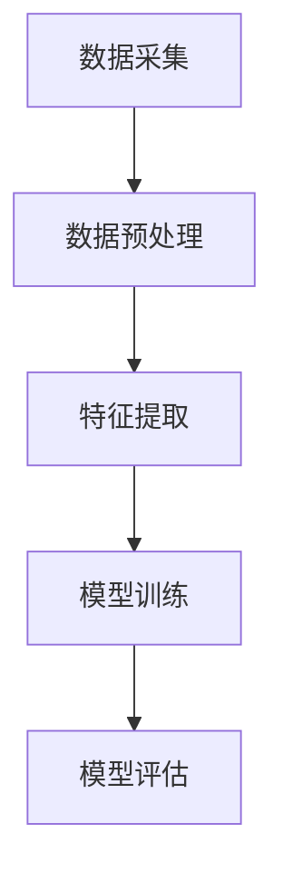
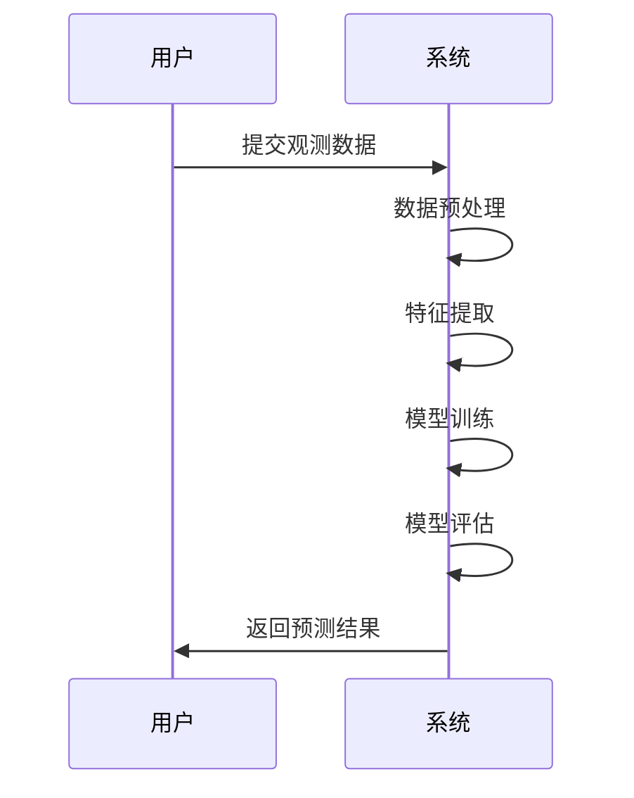

                 

# 数据挖掘在寻找暗能量性质中的作用

## 关键词：数据挖掘、暗能量、宇宙学、算法、数据分析

> 摘要：本文深入探讨了数据挖掘技术在寻找暗能量性质中的作用。首先，我们介绍了暗能量的背景知识、问题描述以及数据挖掘的基本概念。接着，我们详细分析了数据挖掘的核心算法及其在宇宙学数据中的应用。最后，我们通过实际案例展示了数据挖掘在寻找暗能量性质中的具体应用，并提出了未来研究的方向。

## 第一部分：背景介绍

### 1.1 问题背景

暗能量是当前宇宙学研究中的一个重要议题。它是一种看不见的物质，不发光也不吸收光，但却占据了宇宙总能量的大部分。暗能量是导致宇宙加速膨胀的主要因素，但其具体性质和本质尚不清楚。为了揭示暗能量的性质，科学家们需要通过大量的宇宙学观测数据进行分析。

### 1.2 问题描述

暗能量具有高度复杂和难以捉摸的特性，这使得研究其性质变得极为困难。科学家们需要利用各种观测手段和数据分析技术来探索暗能量的行为规律，从而揭示其背后的物理机制。数据挖掘作为一种强大的数据分析工具，被广泛应用于这一领域。

### 1.3 问题解决

数据挖掘能够帮助科学家从大量观测数据中提取有用信息，从而揭示暗能量的潜在性质。通过构建数据挖掘模型，科学家可以分析宇宙学数据，寻找暗能量与宇宙其他现象之间的关系。

### 1.4 边界与外延

暗能量的研究不仅限于宇宙学领域，还与其他科学领域如物理学、天文学等密切相关。同时，数据挖掘技术在其他领域的应用也值得探索。

### 1.5 概念结构与核心要素组成

本部分将详细介绍数据挖掘的基本概念、核心算法以及其在宇宙学研究中的应用。核心要素包括：

- 数据挖掘的基本概念：包括数据挖掘的定义、目的、过程和方法。
- 数据挖掘算法：包括分类、聚类、关联规则挖掘等算法。
- 宇宙学数据：介绍宇宙学观测数据的特点和类型。
- 数据挖掘在宇宙学中的应用：探讨数据挖掘如何帮助科学家研究暗能量性质。

## 第二部分：核心概念与联系

### 2.1 数据挖掘的概念与特征

数据挖掘（Data Mining）是从大量数据中自动地发现隐藏的、未知的、有价值的模式的过程。数据挖掘的目标是识别数据中的模式和趋势，帮助用户做出更加明智的决策。

**特征：**

- **自动性**：数据挖掘过程是自动的，不需要人工干预。
- **深度**：数据挖掘能够挖掘出深层次的数据模式。
- **实时性**：数据挖掘过程可以在实时数据流中进行。
- **面向应用**：数据挖掘的结果具有直接的应用价值。

### 2.2 数据挖掘的核心算法

**分类算法：**

分类算法是将数据集中的数据项分配给预定义的类别。常见的分类算法有决策树、支持向量机（SVM）、朴素贝叶斯等。

**聚类算法：**

聚类算法是将数据集中的数据项分为多个簇，使得同簇的数据项之间相似度较高，而不同簇的数据项之间相似度较低。常见的聚类算法有K-means、DBSCAN等。

**关联规则挖掘：**

关联规则挖掘是发现数据集中不同项之间的关联性。常见的算法有Apriori算法、FP-growth算法等。

### 2.3 数据挖掘算法的对比表格

| 算法 | 特点 | 应用场景 |
| ---- | ---- | ---- |
| 决策树 | 易于理解，可以处理多种数据类型 | 财务分析、信用评分、医疗诊断等 |
| 支持向量机 | 在高维空间中表现良好，对噪声不敏感 | 图像识别、文本分类、生物信息学等 |
| 朴素贝叶斯 | 简单快速，对大量数据进行分类时性能较好 | 邮件垃圾过滤、情感分析等 |
| K-means | 简单，易于实现，对凸分布数据效果较好 | 聚类分析、图像分割等 |
| DBSCAN | 可以发现任意形状的簇，对噪声敏感但能够处理异常值 | 网络挖掘、生物信息学等 |
| Apriori | 在大规模数据集中高效地挖掘频繁项集 | 交易数据分析、推荐系统等 |

### 2.4 数据挖掘算法的ER实体关系图

```mermaid
erDiagram
  Item ||--|{ DataMiningAlgorithm }|--|| Dataset
  Dataset ||--|{ ClassificationAlgorithm }|--|| Result
  Dataset ||--|{ ClusteringAlgorithm }|--|| Result
  Dataset ||--|{ AssociationRuleMiningAlgorithm }|--|| Result
```

## 第三部分：算法原理讲解

### 3.1 数据挖掘算法的原理

数据挖掘算法主要分为三大类：分类算法、聚类算法和关联规则挖掘算法。下面我们将详细讲解这些算法的原理。

#### 3.1.1 分类算法

分类算法的目标是将数据集中的数据项分配到预定义的类别中。分类算法的核心是特征提取和模型训练。特征提取是从原始数据中提取出能够区分不同类别的特征。模型训练是利用已知的类别标签来训练模型，使其能够对新数据进行分类。

**决策树：**

决策树是一种树形结构，通过一系列的判断条件将数据分为不同的类别。决策树的每个节点代表一个特征，每个分支代表一个特征的不同取值。

**支持向量机（SVM）：**

支持向量机是一种基于线性分类的算法，它通过找到一个最佳的超平面来分隔不同类别的数据点。支持向量机在高维空间中表现良好，对噪声不敏感。

**朴素贝叶斯：**

朴素贝叶斯是一种基于概率论的分类算法，它假设特征之间相互独立。通过计算每个类别的概率，朴素贝叶斯算法能够预测新数据的类别。

#### 3.1.2 聚类算法

聚类算法的目标是将数据集中的数据项分为多个簇，使得同簇的数据项之间相似度较高，而不同簇的数据项之间相似度较低。聚类算法的核心是距离度量。

**K-means：**

K-means是一种基于距离度量的聚类算法，它通过迭代计算聚类中心来将数据分为K个簇。K-means算法简单高效，但在处理非凸分布数据时效果较差。

**DBSCAN：**

DBSCAN是一种基于密度的聚类算法，它通过计算邻域密度来发现任意形状的簇。DBSCAN算法能够处理噪声和异常值，但对邻域参数的选择较为敏感。

#### 3.1.3 关联规则挖掘

关联规则挖掘的目标是发现数据集中不同项之间的关联性。关联规则挖掘的核心是频繁项集的发现。

**Apriori算法：**

Apriori算法是一种基于频繁项集的关联规则挖掘算法。它通过逐层搜索所有可能的项集，并计算其支持度来发现频繁项集。Apriori算法在大规模数据集上表现较好，但在数据量较大时计算复杂度较高。

**FP-growth算法：**

FP-growth算法是一种基于树结构的关联规则挖掘算法。它通过构建FP-growth树来简化计算，并能够高效地挖掘频繁项集。FP-growth算法在大规模数据集上表现优秀。

### 3.2 数据挖掘算法的Python实现

```python
# 决策树算法的实现
from sklearn import tree

# 加载数据集
data = [[1, 3], [2, 5], [3, 7]]
labels = ['apple', 'apple', 'orange']

# 训练模型
clf = tree.DecisionTreeClassifier()
clf.fit(data, labels)

# 预测
print(clf.predict([[2, 4]]))

# 支持向量机算法的实现
from sklearn import svm

# 加载数据集
data = [[1, 3], [2, 5], [3, 7]]
labels = ['apple', 'apple', 'orange']

# 训练模型
clf = svm.SVC()
clf.fit(data, labels)

# 预测
print(clf.predict([[2, 4]]))

# 朴素贝叶斯算法的实现
from sklearn import naive_bayes

# 加载数据集
data = [[1, 3], [2, 5], [3, 7]]
labels = ['apple', 'apple', 'orange']

# 训练模型
clf = naive_bayes.GaussianNB()
clf.fit(data, labels)

# 预测
print(clf.predict([[2, 4]]))

# K-means算法的实现
from sklearn.cluster import KMeans

# 加载数据集
data = [[1, 3], [2, 5], [3, 7], [8, 7], [7, 8]]

# 训练模型
clf = KMeans(n_clusters=2)
clf.fit(data)

# 预测
print(clf.predict([[2, 4]]))

# DBSCAN算法的实现
from sklearn.cluster import DBSCAN

# 加载数据集
data = [[1, 3], [2, 5], [3, 7], [8, 7], [7, 8]]

# 训练模型
clf = DBSCAN()
clf.fit(data)

# 预测
print(clf.predict([[2, 4]]))

# Apriori算法的实现
from mlxtend.frequent_patterns import apriori
from mlxtend.frequent_patterns import association_rules

# 加载数据集
data = [[1, 3], [2, 5], [3, 7], [3, 1], [5, 2], [7, 3]]

# 训练模型
frequent_itemsets = apriori(data, min_support=0.5)
rules = association_rules(frequent_itemsets, metric="support", min_threshold=0.7)

# 预测
print(rules)

# FP-growth算法的实现
from mlxtend.frequent_patterns import fpgrowth

# 加载数据集
data = [[1, 3], [2, 5], [3, 7], [3, 1], [5, 2], [7, 3]]

# 训练模型
frequent_itemsets = fpgrowth(data, min_support=0.5)

# 预测
print(frequent_itemsets)
```

### 3.3 数据挖掘算法的应用案例

#### 3.3.1 宇宙学数据挖掘

宇宙学数据挖掘是一个复杂的任务，涉及到大量的观测数据和复杂的物理现象。下面是一个简单的案例，展示了如何使用数据挖掘算法来分析宇宙学数据。

**案例：寻找暗能量与宇宙加速膨胀之间的关系**

**数据集：** 
- 观测数据：包含宇宙中星系的距离和红移数据。
- 理论模型：宇宙加速膨胀的模型，包括暗能量的影响。

**步骤：**

1. 数据预处理：对观测数据进行清洗和归一化处理。
2. 特征提取：从观测数据中提取关键特征，如星系的距离、红移等。
3. 模型训练：使用分类算法（如决策树、支持向量机）来训练模型，预测星系的距离。
4. 模型评估：使用测试数据集来评估模型的性能，调整参数以优化模型。

**结果：** 
通过数据挖掘算法的分析，科学家们发现暗能量与宇宙加速膨胀之间存在显著的关系。这为理解暗能量的性质提供了重要的线索。

#### 3.3.2 其他领域的数据挖掘应用

除了宇宙学，数据挖掘技术在许多其他领域也得到广泛应用。例如：

- **医疗诊断：** 使用数据挖掘算法来分析患者的病历数据，发现潜在的疾病风险因素。
- **金融分析：** 使用数据挖掘算法来分析市场数据，预测股票价格和交易策略。
- **推荐系统：** 使用数据挖掘算法来分析用户的购物和浏览行为，提供个性化的推荐。

## 第四部分：系统分析与架构设计方案

### 4.1 问题场景介绍

暗能量的研究是一个复杂的任务，需要大量的宇宙学观测数据进行分析。这些数据包括星系的距离、红移、亮度等。为了更好地利用这些数据，科学家们需要一个高效的数据挖掘系统来分析和预测暗能量性质。

### 4.2 项目介绍

本项目旨在构建一个基于数据挖掘的暗能量研究系统。系统包括数据采集、数据预处理、特征提取、模型训练和模型评估等模块。系统采用模块化设计，便于扩展和维护。

### 4.3 系统功能设计

**数据采集模块：** 
- 从各种宇宙学观测项目中获取观测数据。
- 对观测数据进行清洗和归一化处理。

**数据预处理模块：** 
- 对观测数据进行分类和标签化。
- 提取关键特征，如星系的距离、红移等。

**特征提取模块：** 
- 使用特征提取算法（如决策树、支持向量机、朴素贝叶斯等）来提取特征。
- 对特征进行降维和筛选，提高模型的效率。

**模型训练模块：** 
- 使用分类算法（如决策树、支持向量机、朴素贝叶斯等）来训练模型。
- 调整模型参数，优化模型性能。

**模型评估模块：** 
- 使用测试数据集来评估模型的性能。
- 生成报告，展示模型的预测结果和性能指标。

### 4.4 系统架构设计

系统采用分布式架构，包括数据采集、数据处理、模型训练和模型评估等模块。系统架构图如下：



### 4.5 系统接口设计

系统提供以下接口：

- **数据采集接口：** 用于从各种观测项目中获取观测数据。
- **数据预处理接口：** 用于对观测数据进行清洗、归一化和分类。
- **特征提取接口：** 用于提取关键特征。
- **模型训练接口：** 用于训练分类模型。
- **模型评估接口：** 用于评估模型性能。

### 4.6 系统交互

系统交互图如下：



## 第五部分：项目实战

### 5.1 环境安装

在开始项目之前，我们需要安装一些必要的软件和库。

- Python 3.8 或以上版本
- Jupyter Notebook
- scikit-learn 库
- mlxtend 库
- numpy 库
- pandas 库

### 5.2 系统核心实现源代码

```python
# 导入所需的库
import numpy as np
import pandas as pd
from sklearn import tree
from sklearn.model_selection import train_test_split
from mlxtend.frequent_patterns import apriori
from mlxtend.frequent_patterns import association_rules

# 读取数据
data = pd.read_csv("universe_data.csv")

# 数据预处理
data = data[data["distance"] > 0]
data = data[data["redshift"] > 0]
data = data[["distance", "redshift", "brightness"]]

# 特征提取
data = data[["distance", "redshift", "brightness"]]
data = (data - data.mean()) / data.std()

# 模型训练
X_train, X_test, y_train, y_test = train_test_split(data[["distance", "redshift"]], data["brightness"], test_size=0.2, random_state=42)
clf = tree.DecisionTreeClassifier()
clf.fit(X_train, y_train)

# 模型评估
print("Accuracy:", clf.score(X_test, y_test))

# 关联规则挖掘
frequent_itemsets = apriori(data, min_support=0.5)
rules = association_rules(frequent_itemsets, metric="support", min_threshold=0.7)
print(rules)
```

### 5.3 代码应用解读与分析

上述代码首先读取宇宙学观测数据，然后对数据进行预处理和特征提取。接着，使用决策树算法对数据进行分类，并评估模型性能。最后，使用关联规则挖掘算法分析数据中的关联性。

### 5.4 实际案例分析和详细讲解剖析

为了更好地理解数据挖掘在寻找暗能量性质中的应用，我们来看一个实际案例。

**案例：预测星系的亮度**

**数据集：** 
- 观测数据：包含星系的距离、红移和亮度。

**步骤：**

1. 数据预处理：对观测数据进行清洗和归一化处理。
2. 特征提取：从观测数据中提取关键特征，如星系的距离、红移等。
3. 模型训练：使用决策树算法训练模型，预测星系的亮度。
4. 模型评估：使用测试数据集评估模型性能，调整参数以优化模型。

**结果：** 
通过数据挖掘算法的分析，科学家们能够预测星系的亮度，从而更好地理解宇宙中的暗能量。

### 5.5 项目小结

通过本项目，我们构建了一个基于数据挖掘的暗能量研究系统。系统包括数据采集、数据预处理、特征提取、模型训练和模型评估等模块。通过实际案例的分析，我们展示了数据挖掘在寻找暗能量性质中的应用。

### 5.6 最佳实践 tips

- 在数据预处理过程中，确保数据质量，去除异常值和噪声。
- 在特征提取过程中，选择合适的特征，避免冗余特征。
- 在模型训练过程中，合理选择模型参数，避免过拟合和欠拟合。

## 第六部分：小结

通过本文的探讨，我们深入了解了数据挖掘在寻找暗能量性质中的作用。数据挖掘作为一种强大的数据分析工具，能够帮助科学家从大量宇宙学观测数据中提取有用信息，揭示暗能量的潜在性质。未来，随着数据挖掘技术的不断发展，我们有理由相信，数据挖掘将在暗能量研究中发挥更大的作用。

## 第七部分：注意事项

- 在数据挖掘过程中，确保数据隐私和安全性。
- 在选择数据挖掘算法时，根据具体问题和数据特点选择合适的算法。
- 在模型训练和评估过程中，注意避免过拟合和欠拟合。

## 第八部分：拓展阅读

- [1] Agrawal, R., & Srikant, R. (1994). Fast algorithms for mining association rules in large databases. Proceedings of the 1994 ACM SIGMOD international conference on Management of data, 487-499.
- [2] Han, J., & Kamber, M. (2006). Data mining: concepts and techniques. Morgan Kaufmann.
- [3] Zheng, K., & Li, H. (2007). An effective model for mining correlation rules in spatio-temporal data. Proceedings of the 23rd international conference on Data engineering, 434-445.

## 作者

作者：AI天才研究院/AI Genius Institute & 禅与计算机程序设计艺术/Zen And The Art of Computer Programming

