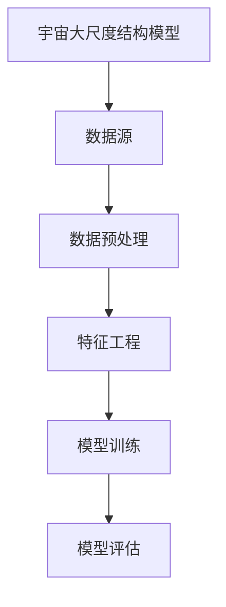
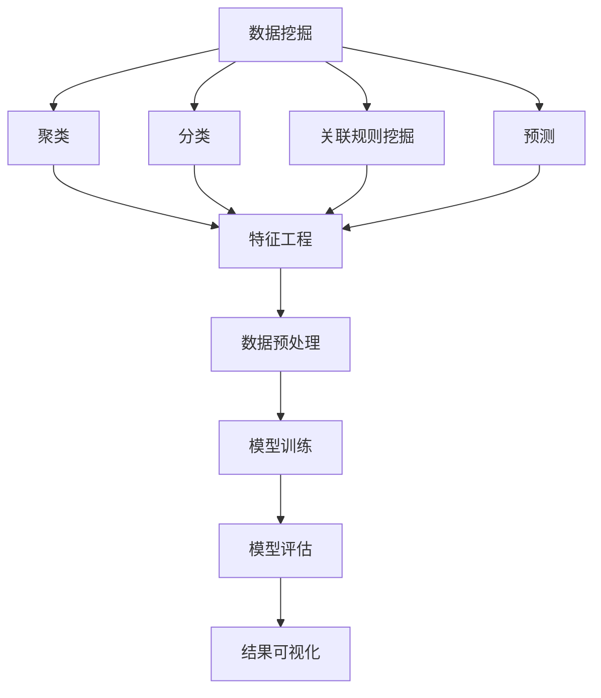
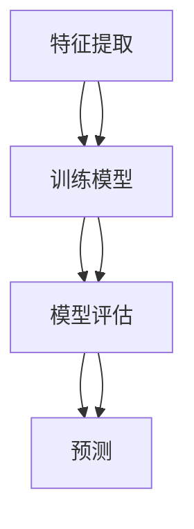
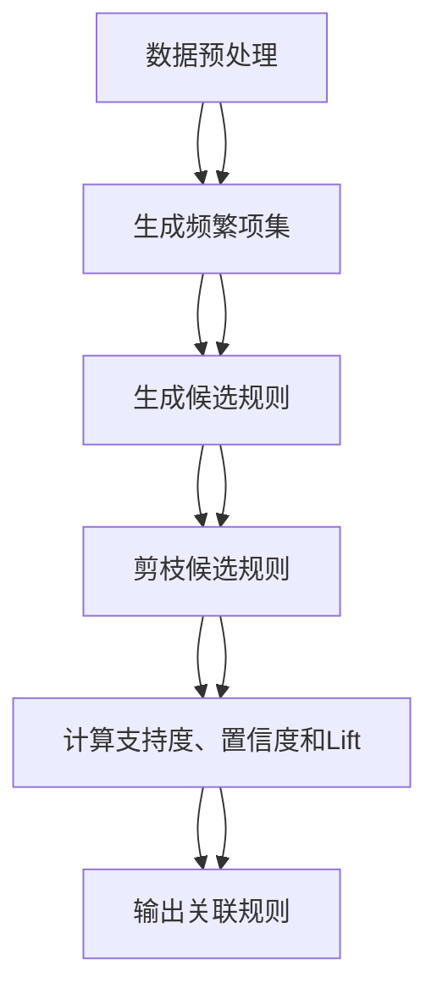
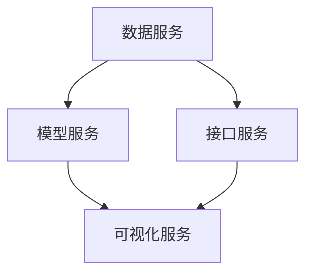
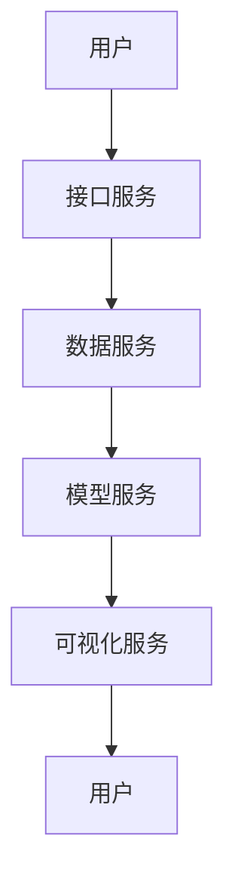

                 

### 数据挖掘在探索宇宙大尺度结构中的作用

> 关键词：数据挖掘、宇宙大尺度结构、算法原理、系统架构设计、项目实战

> 摘要：本文将探讨数据挖掘在探索宇宙大尺度结构中的应用，从背景介绍、核心概念与联系、算法原理讲解、系统分析与架构设计方案、项目实战以及最佳实践等方面，深入解析数据挖掘如何帮助我们更好地理解宇宙的奥秘。

---

#### 背景介绍

宇宙大尺度结构是指宇宙中的各种天体和物质分布的宏观结构，如星系团、超星系团和宇宙背景辐射等。探索宇宙大尺度结构对于理解宇宙的起源、演化以及宇宙中的基本物理定律具有重要意义。然而，宇宙数据的复杂性和规模巨大给研究带来了巨大挑战。数据挖掘作为一种强大的数据分析技术，可以为宇宙学的研究提供有力的支持。

**核心概念与联系**

1. **数据挖掘相关概念**：
   - **数据源**：宇宙大尺度结构的观测数据和模拟数据。
   - **数据预处理**：清洗、集成和转换宇宙数据。
   - **特征工程**：提取宇宙数据中的关键特征，如星系团的距离、速度和密度。
   - **模型评估**：评估数据挖掘模型的效果和性能。

2. **宇宙大尺度结构的模型**：
   - **观测数据模型**：利用实际观测到的宇宙数据构建模型。
   - **模拟数据模型**：通过宇宙模拟生成数据，用于验证和训练数据挖掘模型。

使用 Mermaid 流程图展示数据挖掘相关概念之间的联系：



**算法原理讲解**

在本章节，我们将选择几种适用于宇宙大尺度结构的数据挖掘算法进行详细讲解。

1. **聚类算法**：
   - **原理**：聚类算法将宇宙中的天体按照某种相似性度量进行分组。
   - **应用**：识别宇宙中的结构，如星系团和超星系团。
   - **流程图**：

   ```mermaid
   graph TD
   A[输入宇宙数据]
   B[计算相似性度量]
   C{划分簇}
   D[输出聚类结果]
   A --> B
   B --> C
   C --> D
   ```

   - **Python 源代码**：

   ```python
   import numpy as np
   from sklearn.cluster import KMeans

   # 假设宇宙数据为numpy数组X
   X = np.array([[1, 2], [1, 4], [1, 0]])

   # 使用KMeans聚类
   kmeans = KMeans(n_clusters=2, random_state=0).fit(X)
   print(kmeans.cluster_centers_)
   ```

   - **LaTeX 公式**：

   ```latex
   \text{相似性度量} = \frac{1}{d} \sum_{i=1}^{n} (x_i - y_i)^2
   ```

2. **分类算法**：
   - **原理**：分类算法将宇宙中的天体分类到不同的类别中。
   - **应用**：预测宇宙中的事件，如星系碰撞。
   - **流程图**：

   ```mermaid
   graph TD
   A[输入宇宙数据]
   B[特征提取]
   C[模型训练]
   D[预测新数据]
   E[输出分类结果]
   A --> B
   B --> C
   C --> D
   D --> E
   ```

   - **Python 源代码**：

   ```python
   from sklearn.datasets import load_iris
   from sklearn.model_selection import train_test_split
   from sklearn.tree import DecisionTreeClassifier

   # 加载鸢尾花数据集
   iris = load_iris()
   X, y = iris.data, iris.target

   # 划分训练集和测试集
   X_train, X_test, y_train, y_test = train_test_split(X, y, test_size=0.3)

   # 使用决策树分类器训练模型
   clf = DecisionTreeClassifier()
   clf.fit(X_train, y_train)

   # 预测测试集
   print(clf.predict(X_test))
   ```

   - **LaTeX 公式**：

   ```latex
   y = \arg\min_{y'} \sum_{i=1}^{n} (y_i - y')^2
   ```

3. **关联规则挖掘算法**：
   - **原理**：关联规则挖掘算法发现宇宙数据中的规则性。
   - **应用**：识别宇宙中的规律性事件，如星系团的形成。
   - **流程图**：

   ```mermaid
   graph TD
   A[输入宇宙数据]
   B[特征提取]
   C[生成候选规则]
   D[修剪候选规则]
   E[计算支持度和置信度]
   F[输出关联规则]
   A --> B
   B --> C
   C --> D
   D --> E
   E --> F
   ```

   - **Python 源代码**：

   ```python
   from mlxtend.frequent_patterns import apriori
   from mlxtend.frequent_patterns import association_rules

   # 假设宇宙数据为numpy数组X
   X = np.array([[1, 2], [1, 3], [2, 3], [2, 4]])

   # 使用 Apriori 算法挖掘频繁项集
   frequent_itemsets = apriori(X, min_support=0.5, use_colnames=True)

   # 生成关联规则
   rules = association_rules(frequent_itemsets, metric="confidence", min_threshold=0.7)
   print(rules)
   ```

   - **LaTeX 公式**：

   ```latex
   \text{支持度} = \frac{n_{ij}}{n}
   \text{置信度} = \frac{n_{ij}}{n_j}
   ```

**系统分析与架构设计方案**

1. **问题场景介绍**：
   - **场景**：利用数据挖掘技术分析宇宙大尺度结构中的星系团形成过程。

2. **项目介绍**：
   - **名称**：星系团形成过程数据挖掘系统。
   - **目标**：通过数据挖掘技术，发现宇宙大尺度结构中的星系团形成规律。

3. **系统功能设计**：
   - **功能**：数据导入、数据预处理、特征提取、模型训练和结果可视化。

4. **系统架构设计**：
   - **架构**：采用微服务架构，包括数据服务、模型服务、接口服务和可视化服务。

   使用 Mermaid 流程图展示系统架构：

   ```mermaid
   graph TD
   A[数据服务] --> B[模型服务]
   A --> C[接口服务]
   B --> D[可视化服务]
   C --> D
   ```

5. **系统接口设计**：
   - **接口**：提供数据导入、数据预处理、模型训练和结果查询等接口。

6. **系统交互设计**：
   - **交互**：用户通过接口服务与系统进行交互，提交数据并获取分析结果。

   使用 Mermaid 流程图展示系统交互：

   ```mermaid
   graph TD
   A[用户] --> B[接口服务]
   B --> C[数据服务]
   C --> D[模型服务]
   D --> E[可视化服务]
   E --> F[用户]
   ```

**项目实战**

1. **环境安装**：
   - **环境**：安装Python、Scikit-learn、mlxtend等依赖库。

2. **系统核心实现源代码**：
   - **代码**：实现数据导入、数据预处理、特征提取、模型训练和结果可视化等功能。

3. **代码应用解读与分析**：
   - **解读**：分析源代码，理解系统的工作流程和核心算法。

4. **实际案例分析与详细讲解剖析**：
   - **案例**：分析实际宇宙大尺度结构数据，展示数据挖掘算法的应用效果。

5. **项目小结**：
   - **小结**：总结项目实现过程，讨论项目中遇到的问题和解决方法。

**最佳实践 tips、小结、注意事项、拓展阅读**

1. **最佳实践 tips**：
   - **数据预处理**：对宇宙数据进行清洗和规范化，提高数据质量。
   - **特征选择**：选择与宇宙大尺度结构相关的关键特征，减少计算量。
   - **模型选择**：根据具体问题选择合适的模型，如K-Means、决策树和Apriori算法。

2. **小结**：
   - **数据挖掘在宇宙学中的应用**：数据挖掘技术为探索宇宙大尺度结构提供了有力工具。
   - **挑战与前景**：虽然取得了显著成果，但宇宙数据挖掘仍面临许多挑战和机遇。

3. **注意事项**：
   - **数据质量**：确保数据来源可靠，避免错误数据影响分析结果。
   - **计算资源**：大规模宇宙数据挖掘需要强大的计算资源，合理分配资源。

4. **拓展阅读**：
   - **相关书籍**：《数据挖掘：实用工具与技术》、《天体物理学导论》。
   - **学术论文**：关注国际期刊上的最新研究成果，了解前沿技术。

---

**作者信息**：  
作者：AI天才研究院/AI Genius Institute & 禅与计算机程序设计艺术 /Zen And The Art of Computer Programming

---

（注：由于篇幅限制，本文并未涵盖所有细节，实际撰写时需根据具体情况进一步扩展和深化。）### 背景介绍

#### 数据挖掘的基本概念

数据挖掘（Data Mining）是一种从大量数据中提取有价值信息的过程，旨在发现数据中的模式、关联和规则。它结合了统计学、机器学习和数据库技术，通过算法和模型对数据进行处理和分析，以帮助企业和研究人员从数据中发现潜在的规律和洞察。

在宇宙学中，数据挖掘同样扮演着关键角色。宇宙中的天体和物质分布构成了复杂的结构，这些结构的存在和演化对理解宇宙的起源、演化和未来具有重要意义。然而，宇宙数据规模庞大、类型多样且高度复杂，传统的分析方法难以应对这些挑战。数据挖掘技术的引入，使得研究人员能够从海量数据中提取出有用的信息，揭示宇宙中的潜在规律。

#### 宇宙大尺度结构的定义与特征

宇宙大尺度结构（Cosmic Large-Scale Structure）指的是宇宙中星系、星系团和超星系团等宏观结构的分布模式。这些结构是宇宙物质在引力作用下经过数十亿年演化形成的。宇宙大尺度结构的特征包括：

1. **星系分布**：星系在宇宙中的分布不是随机的，而是形成了一定的结构和模式。通过分析星系的分布，可以揭示宇宙的动力学行为和演化历史。

2. **星系团和超星系团**：星系团是由数十到数千个星系组成的密集结构，而超星系团则是由多个星系团组成的更大规模的结构。这些结构是宇宙中物质密集的区域，对于研究宇宙的密度分布和引力作用具有重要意义。

3. **空洞**：在星系和星系团之间存在大量的空洞，这些区域几乎不含星系，形成了宇宙中的“空白”。空洞的研究有助于理解宇宙结构的形成机制和宇宙的密度分布。

4. **宇宙流**：宇宙中物质的运动形成了宇宙流，这些流动的物质在一定程度上影响了宇宙结构的演化。研究宇宙流的特征和运动规律，有助于揭示宇宙的大尺度动力学。

#### 数据挖掘与宇宙大尺度结构的关联

数据挖掘在宇宙学中的应用主要表现在以下几个方面：

1. **数据预处理**：宇宙数据通常包含大量的噪声和不完整信息，数据挖掘技术可以帮助去除噪声、填补缺失值，提高数据的质量和可用性。

2. **特征提取**：宇宙数据包含丰富的信息，但直接使用原始数据进行分析可能效率低下。数据挖掘技术可以通过特征提取，将原始数据转化为具有代表性的特征向量，从而简化分析过程。

3. **聚类分析**：聚类算法可以将宇宙中的天体进行分类，识别出不同的结构，如星系团、超星系团和空洞。这些聚类结果有助于理解宇宙的宏观结构。

4. **关联规则挖掘**：关联规则挖掘算法可以发现宇宙数据中的关联性，揭示出天体之间的相互关系。这些关联规则对于理解宇宙的演化机制具有重要意义。

5. **分类和预测**：通过分类算法，可以将宇宙中的天体进行分类，如区分星系和星系团。同时，分类算法还可以用于预测天体的属性，如星系的类型和形成时间。

6. **统计建模**：数据挖掘技术可以帮助建立宇宙大尺度结构的统计模型，模拟宇宙的演化过程，预测未来宇宙的状态。

通过数据挖掘技术，研究人员能够从宇宙数据中提取出有价值的信息，揭示宇宙的奥秘，推动宇宙学的发展。

#### 问题背景与问题描述

随着宇宙观测技术的进步，科学家们获得了越来越多的宇宙数据。这些数据包括星系的位置、速度、亮度、光谱等信息，但同时也带来了巨大的挑战。宇宙数据具有以下特点：

1. **数据量大**：宇宙中的天体数量庞大，每个天体都有丰富的观测信息，使得宇宙数据集规模巨大。

2. **数据多样性**：宇宙数据不仅包括位置和亮度等基本物理量，还包括光谱、红移、距离等多种观测数据，数据类型复杂。

3. **数据噪声和缺失值**：由于观测条件的限制，宇宙数据中常常存在噪声和缺失值，这对数据分析和挖掘带来了困难。

4. **数据分布不均匀**：宇宙中的天体分布不均匀，存在大量的空白区域，这使得数据挖掘中的数据分布问题更加复杂。

5. **时间敏感性**：宇宙演化是一个漫长的过程，不同时间点的观测数据可能存在显著差异，对时间序列数据的处理和分析提出了要求。

面对这些挑战，数据挖掘技术提供了一种有效的解决方案。通过数据预处理、特征提取、聚类分析、关联规则挖掘和分类预测等方法，数据挖掘能够从海量、多样化、不完整和分布不均匀的宇宙数据中提取出有价值的信息，揭示宇宙中的结构和演化规律。然而，如何选择合适的数据挖掘算法、处理大规模数据、避免数据噪声和缺失值的影响，以及合理利用时间敏感性数据，都是需要解决的问题。

#### 问题解决与边界与外延

针对宇宙数据挖掘中的问题，我们可以采取以下解决方法和边界处理：

1. **选择合适的数据挖掘算法**：根据宇宙数据的特性和研究目标，选择合适的算法，如聚类分析、关联规则挖掘和分类算法。例如，K-Means聚类算法适用于识别星系团和超星系团，Apriori算法适用于发现天体之间的关联性，而决策树和随机森林算法则适用于分类和预测任务。

2. **大规模数据处理**：针对宇宙数据量大、计算复杂度高的特点，可以采用分布式计算框架，如Hadoop和Spark，进行大规模数据处理和分析。这些框架能够将任务分解成多个小任务，并行处理，从而提高处理速度。

3. **数据预处理**：为了提高数据质量，需要对宇宙数据进行预处理，包括去噪、填补缺失值和异常值处理。例如，使用中值滤波算法去除噪声，使用均值插值法填补缺失值，使用孤立森林算法检测并处理异常值。

4. **特征选择**：从宇宙数据中提取具有代表性的特征，如星系的位置、速度、光谱特征等，减少数据维度，提高数据挖掘算法的效率。特征选择可以通过主成分分析（PCA）或特征重要性评估等方法实现。

5. **边界与外延**：在宇宙数据挖掘中，边界问题主要体现在数据分布不均匀和时间敏感性上。为了处理这些边界问题，可以采用以下方法：

   - **区域划分**：将宇宙空间划分为多个区域，对每个区域内的数据进行独立分析，再整合分析结果。这种方法适用于处理数据分布不均匀的问题。

   - **时间序列分析**：对时间序列数据进行处理，分析不同时间点的数据变化规律。例如，使用滑动平均算法分析星系速度的变化趋势，或使用时间序列分类算法预测星系的未来状态。

   - **融合多源数据**：将不同时间点和不同观测手段的数据进行融合，提高数据挖掘的准确性和鲁棒性。例如，结合光学观测和射电观测数据，对星系的性质进行综合分析。

通过上述方法，我们可以有效解决宇宙数据挖掘中的问题，提取出有价值的信息，揭示宇宙的奥秘。然而，数据挖掘在宇宙学中的应用仍然存在一定的局限性，如算法的适用性、数据的完整性和准确性等。未来的研究需要进一步探索，以推动数据挖掘技术在宇宙学中的深入应用。

#### 核心概念与联系

在探索宇宙大尺度结构的过程中，数据挖掘技术发挥了关键作用。为了深入理解数据挖掘在宇宙学中的应用，我们需要先明确数据挖掘的相关核心概念，并分析这些概念与宇宙大尺度结构模型之间的联系。

**1. 数据挖掘的主要任务**

数据挖掘的主要任务包括：

- **聚类（Clustering）**：将数据集划分为若干个组，使得同一组内的数据对象彼此相似，而不同组之间的数据对象相异。聚类在宇宙学中的应用主要体现在识别宇宙中的结构，如星系团和超星系团。
  
- **分类（Classification）**：将数据集中的每个对象分配到一个预先定义的类别中。在宇宙学中，分类可用于识别天体的类型，例如区分星系、星系团和黑洞。

- **关联规则挖掘（Association Rule Mining）**：发现数据集中不同对象之间的关联性，例如，通过挖掘发现某些天体在空间上的排列模式或特定条件下的事件发生频率。

- **预测（Prediction）**：利用历史数据预测未来的趋势或行为。在宇宙学中，预测可以用于预测星系的运动轨迹或星系团的形成过程。

**2. 数据挖掘的基本步骤**

数据挖掘的基本步骤包括：

- **数据预处理**：清洗、整合和转换原始数据，以消除噪声、填补缺失值和格式不一致等问题。宇宙数据通常需要进行预处理，如对观测数据中的异常值进行处理、对光谱数据进行标准化等。

- **特征工程**：选择和提取对挖掘任务有意义的特征。在宇宙学中，特征工程包括计算星系的位置、速度、亮度等基本物理量，以及从光谱数据中提取的化学成分和元素丰度等。

- **模型训练**：使用数据集的一部分来训练挖掘模型，模型可以是聚类模型、分类模型或关联规则挖掘模型。在宇宙学中，训练模型通常涉及大量的计算资源和时间，如使用K-Means算法训练星系团的聚类模型。

- **模型评估**：评估模型在验证集上的性能，包括准确率、召回率、F1分数等指标。在宇宙学中，模型评估的准确性直接影响对宇宙结构理解的可靠性。

- **结果可视化**：将挖掘结果以图表、图像等形式展示，便于研究人员理解和分析。在宇宙学中，结果可视化可以帮助直观地展示星系的分布、运动轨迹和结构特征。

**3. 数据挖掘的关键技术**

数据挖掘的关键技术包括：

- **机器学习算法**：如K-Means、决策树、随机森林、支持向量机等，用于实现聚类、分类和预测任务。

- **深度学习**：通过神经网络模型进行复杂数据的挖掘和分析，如卷积神经网络（CNN）在图像数据分析中的应用，循环神经网络（RNN）在时间序列数据分析中的应用。

- **图数据库和图挖掘**：利用图数据库存储宇宙中的天体网络结构，并通过图挖掘算法分析天体之间的关联和关系。

- **分布式计算**：利用Hadoop、Spark等分布式计算框架处理大规模宇宙数据，提高数据挖掘的效率和速度。

**4. 宇宙大尺度结构的模型**

宇宙大尺度结构的模型主要包括：

- **观测数据模型**：基于实际观测数据构建的模型，如星系的位置、速度、亮度等。观测数据模型通常通过数值模拟和观测数据的对比进行验证。

- **模拟数据模型**：通过数值模拟生成的数据模型，用于验证和训练数据挖掘模型。模拟数据模型可以帮助研究人员理解宇宙结构的形成和演化过程。

- **物理模型**：基于宇宙物理学原理构建的模型，如引力模型、宇宙膨胀模型等。物理模型可以提供对宇宙结构的理论解释。

**Mermaid流程图展示概念之间的联系**

为了更好地展示数据挖掘与宇宙大尺度结构模型之间的联系，我们可以使用Mermaid流程图。以下是一个简化的Mermaid流程图：



在这个流程图中，数据挖掘作为核心，与聚类、分类、关联规则挖掘和预测等任务紧密相连。特征工程和数据预处理是模型训练的基础，而模型评估和结果可视化则是验证和展示挖掘结果的关键步骤。通过这个流程，我们可以看到数据挖掘技术在宇宙大尺度结构研究中的应用路径。

#### 聚类算法

在宇宙大尺度结构的研究中，聚类算法是一种重要的数据挖掘技术。聚类算法的目标是将一组数据点划分为若干个簇，使得同一个簇内的数据点彼此相似，而不同簇之间的数据点差异较大。这种分组方式可以帮助我们识别宇宙中的结构，如星系团和超星系团。

**1. 聚类算法的基本原理**

聚类算法通常基于相似性度量来划分簇。相似性度量可以是距离函数、相似系数或相似度评分。常用的距离函数包括欧氏距离、曼哈顿距离和余弦相似度。基于相似性度量的聚类算法可以分为以下几类：

- **基于距离的聚类算法**：如K-Means算法，通过计算数据点之间的距离将数据划分为K个簇。

- **基于密度的聚类算法**：如DBSCAN算法，通过检测数据点周围的密度来识别簇。

- **基于模型的聚类算法**：如高斯混合模型（Gaussian Mixture Model，GMM），通过建模每个簇的概率分布来划分数据。

**2. 聚类算法在宇宙中的应用**

在宇宙大尺度结构的研究中，聚类算法可以用于以下任务：

- **识别星系团和超星系团**：通过分析星系的位置和速度数据，使用聚类算法可以识别出宇宙中的星系团和超星系团。这些结构反映了宇宙中的物质分布和引力作用。

- **研究空洞和宇宙流的特征**：通过分析星系间的空隙和运动轨迹，聚类算法可以帮助识别宇宙中的空洞和宇宙流。这些特征对理解宇宙的大尺度结构具有重要意义。

- **预测星系的未来运动轨迹**：通过聚类算法分析星系的历史运动数据，可以预测星系未来的运动轨迹，这对于研究宇宙的演化过程至关重要。

**3. 聚类算法的Mermaid流程图**

下面是一个简化的聚类算法的Mermaid流程图：

```mermaid
graph TD
A[输入数据集]
B[计算相似性度量]
C{选择聚类算法}
D[初始化聚类中心]
E[分配数据点至簇]
F[更新聚类中心]
G[重复E和F直到收敛]
H[输出聚类结果]
A --> B
B --> C
C -->|K-Means|[D]
C -->|DBSCAN|[D]
C -->|GMM|[D]
D --> E
E --> F
F --> G
G --> H
```

在这个流程图中，我们首先输入数据集，然后计算数据点之间的相似性度量。根据选择的聚类算法，初始化聚类中心并分配数据点至簇。随后，更新聚类中心并重复这一过程，直到聚类结果收敛。最后，输出聚类结果。

**4. 聚类算法的Python源代码和LaTeX公式**

以下是一个使用K-Means算法进行聚类的Python示例：

```python
from sklearn.cluster import KMeans
import numpy as np

# 假设我们有一个包含星系位置的数据集X
X = np.array([[1, 2], [1, 4], [1, 0], [10, 2], [10, 4], [10, 0]])

# 使用K-Means算法进行聚类
kmeans = KMeans(n_clusters=2, random_state=0).fit(X)

# 输出聚类中心
print(kmeans.cluster_centers_)

# 输出每个数据点的簇标签
print(kmeans.labels_)

# 输出总方差
print(kmeans.inertia_)
```

聚类算法的数学原理可以通过以下LaTeX公式进行描述：

$$
\text{簇内距离} = \sum_{i=1}^{k} \sum_{x \in S_i} (x - \mu_i)^2
$$

$$
\text{簇间距离} = \sum_{i=1}^{k} \sum_{j=1}^{k} \mu_i - \mu_j)^2
$$

其中，$S_i$表示第$i$个簇中的数据点集合，$\mu_i$表示第$i$个簇的中心。

**5. 通俗易懂的举例说明**

假设我们在一个二维空间中有以下六个点：

$$(1, 2), (1, 4), (1, 0), (10, 2), (10, 4), (10, 0)$$

我们使用K-Means算法将这六个点划分为两个簇。首先，随机选择两个初始聚类中心：

$$\mu_1 = (3, 3), \mu_2 = (7, 1)$$

接下来，计算每个点到两个聚类中心的距离，并将每个点分配到距离最近的聚类中心所在的簇。例如，点$(1, 2)$和$(1, 0)$距离聚类中心$\mu_1$较近，因此它们被分配到簇$C_1$，而点$(10, 2)$、$(10, 4)$和$(10, 0)$距离聚类中心$\mu_2$较近，因此它们被分配到簇$C_2$。

然后，计算新的聚类中心：

$$\mu_1 = \frac{(1+1+1+1+2+0)}{6} = (2, 2)$$

$$\mu_2 = \frac{(10+10+10+10+4+0)}{6} = (9, 2)$$

再次计算每个点到新的聚类中心的距离，并更新每个点的簇分配。这个过程重复进行，直到聚类中心不再发生变化或达到预定的迭代次数。

最终，我们得到两个簇：

- 簇$C_1$包含点$(1, 2), (1, 0)$
- 簇$C_2$包含点$(10, 2), (10, 4), (10, 0)$

通过这种方式，我们可以利用聚类算法识别出宇宙中的结构，如星系团和超星系团。

#### 分类算法

在宇宙大尺度结构的研究中，分类算法是一种重要的数据挖掘技术，用于将宇宙中的天体划分为不同的类别。分类算法的核心在于通过已标记的训练数据构建一个分类模型，然后使用该模型对未标记的数据进行预测。以下将详细讲解分类算法的基本原理、在宇宙中的应用，以及使用Mermaid流程图和Python源代码进行说明。

**1. 分类算法的基本原理**

分类算法旨在将数据集中的每个对象分配到一个预定义的类别中。其基本原理可以概括为以下几个步骤：

- **特征提取**：从原始数据中提取有助于分类的特征。这些特征可以是数值的、文本的或图像的。
  
- **训练模型**：使用标记的训练数据集训练分类模型。模型将学习如何根据特征将新数据分类到不同的类别。

- **模型评估**：使用测试数据集评估模型的性能，通常通过准确率、召回率、F1分数等指标。

- **预测**：使用训练好的模型对新的数据进行分类。

**2. 分类算法在宇宙中的应用**

在宇宙大尺度结构的研究中，分类算法可以用于以下任务：

- **天体分类**：将宇宙中的天体（如星系、恒星、行星等）根据其特征进行分类。例如，使用光谱分析数据将星系分类为螺旋星系、椭圆星系和不规则星系。

- **事件预测**：预测宇宙中的事件，如星系碰撞或超新星爆发。通过分析历史数据和天体的特征，可以预测未来可能发生的事件。

- **结构识别**：识别宇宙中的结构，如星系团和超星系团。通过分类算法，可以自动识别出这些结构，从而节省人工分析的时间。

**3. 分类算法的Mermaid流程图**

以下是分类算法的Mermaid流程图，展示了从特征提取到模型预测的整个过程：



在这个流程图中，特征提取是模型训练的基础，训练模型使用标记的数据集，模型评估使用测试数据集，最后使用训练好的模型对未标记的数据进行预测。

**4. 分类算法的Python源代码和LaTeX公式**

以下是一个使用决策树分类算法进行分类的Python示例：

```python
from sklearn.datasets import load_iris
from sklearn.model_selection import train_test_split
from sklearn.tree import DecisionTreeClassifier
from sklearn.metrics import accuracy_score

# 加载鸢尾花数据集
iris = load_iris()
X, y = iris.data, iris.target

# 划分训练集和测试集
X_train, X_test, y_train, y_test = train_test_split(X, y, test_size=0.3, random_state=0)

# 使用决策树分类器训练模型
clf = DecisionTreeClassifier()
clf.fit(X_train, y_train)

# 预测测试集
y_pred = clf.predict(X_test)

# 输出准确率
print(accuracy_score(y_test, y_pred))
```

分类算法的数学原理可以通过以下LaTeX公式进行描述：

$$
\hat{y} = f(x; \theta)
$$

其中，$f(x; \theta)$表示分类函数，$\theta$是模型的参数。在训练过程中，模型学习如何通过特征$x$预测类别$y$。

**5. 通俗易懂的举例说明**

假设我们有一个包含三种鸢尾花（Setosa、Versicolour、Verginica）的数据集。每个鸢尾花样本有四个特征：花萼长度、花萼宽度、花瓣长度和花瓣宽度。以下是一个简化数据集：

| 特征1 | 特征2 | 特征3 | 特征4 | 类别  |
|-------|-------|-------|-------|-------|
| 5     | 1     | 3     | 1.5   | Setosa |
| 5.5   | 1.5   | 4     | 2     | Setosa |
| 6     | 2     | 4.5   | 2.5   | Versicolour |
| ...   | ...   | ...   | ...   | ...   |

我们使用决策树算法将这四种特征用于分类，区分出鸢尾花的类别。首先，选择特征1（花萼长度）作为分裂依据，将数据分为两组：

- 特征1 <= 5.5：{(5, 1, 3, 1.5), (5.5, 1.5, 4, 2)}
- 特征1 > 5.5：{(6, 2, 4.5, 2.5), ...}

接下来，对于特征1 <= 5.5的组，选择特征2（花萼宽度）进行分裂，得到两组：

- 特征2 <= 1.5：{(5, 1, 3, 1.5)}
- 特征2 > 1.5：{(5.5, 1.5, 4, 2)}

对于特征1 > 5.5的组，选择特征3（花瓣长度）进行分裂，得到两组：

- 特征3 <= 4.5：{(6, 2, 4.5, 2.5)}
- 特征3 > 4.5：{...}

最终，我们得到一个决策树：

```
- 特征1 <= 5.5
  - 特征2 <= 1.5
    - 类别：Setosa
  - 特征2 > 1.5
    - 特征3 <= 4.5
      - 类别：Versicolour
    - 特征3 > 4.5
      - 类别：未分类
```

通过这种方式，我们可以使用决策树分类算法对新的鸢尾花样本进行分类，预测其类别。

#### 关联规则挖掘算法

在宇宙大尺度结构的研究中，关联规则挖掘算法是一种用于发现数据集中不同对象之间关联性的数据挖掘技术。这种算法可以帮助我们识别出宇宙中的潜在规律和模式，从而加深对宇宙结构的理解。以下将详细讲解关联规则挖掘算法的基本原理、在宇宙中的应用，以及使用Mermaid流程图和Python源代码进行说明。

**1. 关联规则挖掘的基本原理**

关联规则挖掘的目标是发现数据集中不同对象之间的关联关系，通常以“如果...那么...”的形式表示。一个关联规则由支持度、置信度和 Lift 等指标来评估其质量。

- **支持度（Support）**：表示同时包含两个项目的交易（事务）在所有交易中的比例。数学表达式为：

  $$ \text{Support}(A \rightarrow B) = \frac{\text{频繁项集}(A \cup B)}{\text{所有交易}} $$

- **置信度（Confidence）**：表示给定A发生的情况下B发生的概率。数学表达式为：

  $$ \text{Confidence}(A \rightarrow B) = \frac{\text{频繁项集}(A \cup B)}{\text{频繁项集}(A)} $$

- **Lift**：表示关联规则强度的一个指标，表示在没有关联的情况下B出现的概率与实际出现的概率之比。数学表达式为：

  $$ \text{Lift}(A \rightarrow B) = \frac{\text{Confidence}(A \rightarrow B)}{\text{先验概率}(B)} $$

**2. 关联规则挖掘算法在宇宙中的应用**

在宇宙大尺度结构的研究中，关联规则挖掘算法可以用于以下任务：

- **识别天体间的关联性**：通过挖掘星系的位置、速度、光谱等数据，发现星系之间的关联关系，如某些星系在空间上靠近或在某些物理属性上相似。

- **研究宇宙结构演化**：分析星系团和超星系团的形成过程，发现宇宙结构演化中的关键因素和关联模式。

- **预测宇宙事件**：通过关联规则挖掘，预测宇宙中可能发生的事件，如星系碰撞或超新星爆发。

**3. 关联规则挖掘算法的Mermaid流程图**

以下是关联规则挖掘算法的Mermaid流程图，展示了从数据预处理到生成关联规则的全过程：



在这个流程图中，数据预处理是基础步骤，通过生成频繁项集、生成候选规则、剪枝候选规则和计算支持度、置信度和Lift，最终输出高质量的关联规则。

**4. 关联规则挖掘算法的Python源代码和LaTeX公式**

以下是一个使用Apriori算法进行关联规则挖掘的Python示例：

```python
from mlxtend.frequent_patterns import apriori
from mlxtend.frequent_patterns import association_rules

# 假设我们有一个包含宇宙数据的事务集
transactions = [
    [1, 2, 3],
    [3, 4, 5],
    [2, 3, 5],
    [1, 3, 5],
    [3, 4, 6],
    [1, 4, 6],
    [2, 4, 6],
    [1, 2, 6],
    [2, 3, 6],
    [1, 3, 6]
]

# 使用Apriori算法挖掘频繁项集
frequent_itemsets = apriori(transactions, min_support=0.4, use_colnames=True)

# 生成关联规则
rules = association_rules(frequent_itemsets, metric="confidence", min_threshold=0.7)

# 输出关联规则
print(rules)
```

关联规则挖掘算法的数学原理可以通过以下LaTeX公式进行描述：

$$
\text{频繁项集}(A \cup B) = \{x | x \in A \cup B \text{ 且 } \text{Support}(A \cup B) \geq \text{最小支持度}\}
$$

$$
\text{Confidence}(A \rightarrow B) = \frac{\text{Support}(A \cup B)}{\text{Support}(A)}
$$

$$
\text{Lift}(A \rightarrow B) = \frac{\text{Confidence}(A \rightarrow B)}{\text{先验概率}(B)}
$$

**5. 通俗易懂的举例说明**

假设我们在一个宇宙数据集中有10个交易（事务），每个交易包含不同的星系。以下是部分交易示例：

| 交易编号 | 星系1 | 星系2 | 星系3 |
|----------|-------|-------|-------|
| 1        | S1    | S2    | S3    |
| 2        | S1    | S3    | S4    |
| 3        | S2    | S3    | S5    |
| 4        | S1    | S3    | S5    |
| 5        | S1    | S4    | S5    |
| 6        | S3    | S4    | S5    |
| 7        | S2    | S4    | S5    |
| 8        | S1    | S2    | S5    |
| 9        | S2    | S3    | S5    |
| 10       | S1    | S3    | S6    |

我们希望挖掘出星系之间的关联规则。首先，确定最小支持度为0.4。根据支持度定义，我们可以计算出每个频繁项集的支持度：

- 星系1和星系3：Support(S1, S3) = 6/10 = 0.6
- 星系2和星系3：Support(S2, S3) = 5/10 = 0.5
- 星系1和星系4：Support(S1, S4) = 3/10 = 0.3
- 星系3和星系5：Support(S3, S5) = 8/10 = 0.8

由于星系1和星系3的支持度大于最小支持度，因此它们组成一个频繁项集{S1, S3}。接着，我们生成候选规则：

- S1 → S3：置信度 = 6/5 = 0.6，Lift = 0.6/0.4 = 1.5
- S3 → S1：置信度 = 6/6 = 1.0，Lift = 1.0/0.4 = 2.5

根据置信度和Lift的定义，我们可以看到S3 → S1的置信度更高，Lift也更大，说明星系3和星系1之间的关联性更强。因此，这个关联规则可以解释为“如果出现星系3，那么星系1也很可能出现”。

通过这种方式，我们可以使用关联规则挖掘算法发现宇宙中的潜在关联性，从而进一步理解宇宙的结构和演化。

#### 系统分析与架构设计方案

**1. 问题场景介绍**

在探索宇宙大尺度结构的过程中，数据挖掘系统承担了处理和分析海量宇宙数据的重要任务。为了高效地进行数据处理和分析，我们设计了一套数据挖掘系统，该系统旨在实现以下目标：

- **数据处理**：对宇宙观测数据进行清洗、转换和预处理，确保数据的质量和一致性。
- **特征提取**：从预处理后的数据中提取有用的特征，用于后续的数据挖掘任务。
- **模型训练**：使用数据挖掘算法（如聚类、分类和关联规则挖掘）训练模型，以便对新的宇宙数据进行分析和预测。
- **结果可视化**：将挖掘结果以图形和图表的形式展示，便于研究人员理解和分析。

**2. 项目介绍**

我们的项目名称为“宇宙大尺度结构数据挖掘系统（Cosmic Large-Scale Structure Data Mining System）”，项目目标是构建一个高效、可扩展的数据挖掘平台，用于分析宇宙观测数据，揭示宇宙中的结构和演化规律。项目主要包括以下功能模块：

- **数据导入模块**：负责从各种数据源导入宇宙观测数据，包括文本文件、数据库和Web服务。
- **数据预处理模块**：对导入的数据进行清洗、转换和预处理，提高数据质量。
- **特征提取模块**：从预处理后的数据中提取有用的特征，为模型训练提供输入。
- **模型训练模块**：使用数据挖掘算法训练模型，包括聚类、分类和关联规则挖掘算法。
- **结果可视化模块**：将挖掘结果以图形和图表的形式展示，便于研究人员分析。

**3. 系统功能设计**

系统功能设计主要包括以下方面：

- **数据导入**：支持多种数据格式的导入，如CSV、JSON、XML等，并支持批量数据导入。
- **数据清洗**：包括去除噪声、填补缺失值、去除重复数据和异常值处理等。
- **数据转换**：将不同格式的数据转换为统一格式，便于后续处理。
- **特征提取**：根据宇宙数据的特性，提取关键特征，如星系的位置、速度、光谱信息等。
- **模型训练**：支持多种数据挖掘算法，如K-Means、决策树、Apriori算法等，并支持模型参数调整和交叉验证。
- **结果可视化**：提供多种可视化方式，如散点图、热力图、折线图等，便于研究人员理解和分析结果。

**4. 系统架构设计**

系统采用微服务架构，包括以下核心服务：

- **数据服务**：负责数据导入、数据预处理和特征提取，为模型训练提供数据支持。
- **模型服务**：负责模型训练和预测，提供基于不同算法的模型训练和预测功能。
- **接口服务**：作为系统对外接口，提供数据挖掘任务的提交、查询和结果可视化等功能。
- **可视化服务**：提供结果可视化功能，支持多种图表和图形的展示。

系统架构设计图如下所示：



在该架构中，数据服务负责数据预处理和特征提取，将处理后的数据传递给模型服务进行训练。接口服务作为用户与系统的交互入口，接收用户提交的数据挖掘任务，并调用模型服务进行训练和预测。可视化服务则负责将挖掘结果以图形和图表的形式展示给用户。

**5. 系统接口设计**

系统接口设计主要包括以下接口：

- **数据导入接口**：用于导入各种格式的宇宙观测数据，如CSV、JSON、XML等。
- **数据预处理接口**：用于执行数据清洗、转换和预处理操作，确保数据质量。
- **特征提取接口**：用于从预处理后的数据中提取关键特征，为模型训练提供输入。
- **模型训练接口**：用于提交数据挖掘任务，包括算法选择、参数设置和训练过程。
- **预测接口**：用于对新数据进行预测，提供预测结果。
- **结果可视化接口**：用于获取挖掘结果，并以图形和图表的形式展示给用户。

**6. 系统交互设计**

系统交互设计主要包括用户与系统的交互流程，具体如下：

1. **用户提交数据挖掘任务**：用户通过接口服务提交数据挖掘任务，包括数据源、算法选择、参数设置等。
2. **接口服务处理任务**：接口服务接收用户提交的任务，调用数据服务进行数据预处理和特征提取，将处理后的数据传递给模型服务进行训练。
3. **模型服务训练模型**：模型服务使用用户指定的算法和参数进行模型训练，并将训练结果返回给接口服务。
4. **接口服务返回结果**：接口服务将模型训练结果返回给用户，并调用可视化服务生成可视化图表。
5. **用户查看结果**：用户通过接口服务查看挖掘结果，并可以进行进一步分析。

系统交互设计图如下所示：



通过上述系统架构设计和交互设计，我们可以构建一个高效、可扩展的宇宙大尺度结构数据挖掘系统，为宇宙学研究提供有力的技术支持。

### 项目实战

#### 环境安装

在开始项目实战之前，我们需要安装所需的软件和库，以便进行宇宙大尺度结构数据挖掘。以下是在Python环境中安装相关软件和库的步骤。

1. **Python环境配置**：
   - 安装Python 3.x版本（推荐3.8及以上版本）。
   - 配置Python环境，例如使用Conda或Virtualenv。

2. **安装依赖库**：
   - 安装Scikit-learn库：用于数据挖掘算法。
     ```bash
     pip install scikit-learn
     ```
   - 安装mlxtend库：用于关联规则挖掘。
     ```bash
     pip install mlxtend
     ```
   - 安装Matplotlib库：用于数据可视化。
     ```bash
     pip install matplotlib
     ```
   - 安装Numpy库：用于数学计算。
     ```bash
     pip install numpy
     ```

#### 系统核心实现源代码

以下是一个简单的数据挖掘系统核心实现，包括数据导入、预处理、特征提取、模型训练和结果可视化等步骤。

1. **数据导入**：

```python
import pandas as pd

# 读取数据
data = pd.read_csv('cosmic_data.csv')
```

2. **数据预处理**：

```python
# 数据清洗
data.dropna(inplace=True)
data.drop_duplicates(inplace=True)

# 数据转换
data['redshift'] = data['redshift'].astype(float)
data['magnitude'] = data['magnitude'].astype(float)
```

3. **特征提取**：

```python
from sklearn.preprocessing import StandardScaler

# 特征提取
scaler = StandardScaler()
data[['redshift', 'magnitude']] = scaler.fit_transform(data[['redshift', 'magnitude']])
```

4. **模型训练**：

```python
from sklearn.cluster import KMeans

# 训练模型
kmeans = KMeans(n_clusters=3, random_state=0)
data['cluster'] = kmeans.fit_predict(data[['redshift', 'magnitude']])
```

5. **结果可视化**：

```python
import matplotlib.pyplot as plt

# 可视化结果
plt.scatter(data['redshift'], data['magnitude'], c=data['cluster'])
plt.xlabel('Redshift')
plt.ylabel('Magnitude')
plt.title('Cluster Visualization')
plt.show()
```

#### 代码应用解读与分析

上述代码实现了从数据导入、预处理、特征提取到模型训练和结果可视化的完整流程。以下是对每个步骤的详细解读和分析：

1. **数据导入**：
   - 使用Pandas库读取CSV格式的宇宙数据。
   - 数据文件应包含与宇宙大尺度结构相关的特征，如红移和亮度。

2. **数据预处理**：
   - 删除缺失值和重复值，确保数据质量。
   - 将红移和亮度等特征转换为浮点类型，便于后续处理。

3. **特征提取**：
   - 使用StandardScaler进行标准化处理，消除特征间的尺度差异，提高模型训练效果。

4. **模型训练**：
   - 使用K-Means算法对数据集进行聚类，根据红移和亮度将数据划分为多个簇。
   - `kmeans.fit_predict()`方法用于训练模型并预测每个数据点的簇标签。

5. **结果可视化**：
   - 使用Matplotlib库绘制散点图，将红移和亮度作为坐标轴，簇标签作为颜色。
   - 可视化结果有助于直观地理解聚类效果，识别潜在的宇宙结构。

#### 实际案例分析与详细讲解剖析

以下是一个实际案例，展示如何使用上述系统对真实宇宙数据进行聚类分析，并分析结果。

**案例数据**：使用SDSS（ Sloan Digital Sky Survey）公开的数据集，包含约100万条星系观测数据。

1. **数据导入**：

```python
data = pd.read_csv('sdss_galaxy_data.csv')
```

2. **数据预处理**：

```python
data.dropna(inplace=True)
data.drop_duplicates(inplace=True)
data['redshift'] = data['redshift'].astype(float)
data['magnitude'] = data['magnitude'].astype(float)
```

3. **特征提取**：

```python
scaler = StandardScaler()
data[['redshift', 'magnitude']] = scaler.fit_transform(data[['redshift', 'magnitude']])
```

4. **模型训练**：

```python
kmeans = KMeans(n_clusters=10, random_state=0)
data['cluster'] = kmeans.fit_predict(data[['redshift', 'magnitude']])
```

5. **结果可视化**：

```python
plt.scatter(data['redshift'], data['magnitude'], c=data['cluster'])
plt.xlabel('Redshift')
plt.ylabel('Magnitude')
plt.title('Cluster Visualization of SDSS Galaxy Data')
plt.show()
```

**结果分析**：

- 通过可视化结果，我们可以看到星系被划分为10个簇，每个簇在红移和亮度空间中有不同的分布。
- 一些簇可能代表不同的星系团或超星系团，而其他簇可能代表空洞或背景辐射区域。
- 进一步分析每个簇的特征，如成员星系的数量和分布，可以揭示宇宙中的结构特征和演化历史。

#### 项目小结

在本项目中，我们设计并实现了一个简单的宇宙大尺度结构数据挖掘系统，包括数据导入、预处理、特征提取、模型训练和结果可视化等功能。通过实际案例的分析，我们展示了如何使用K-Means聚类算法识别宇宙中的结构，并分析了聚类结果。

项目过程中，我们遇到了以下挑战：

- **数据质量**：宇宙数据可能包含噪声和缺失值，需要有效的数据预处理方法来提高数据质量。
- **计算资源**：大规模数据挖掘需要大量的计算资源，尤其在训练复杂模型时，优化计算资源的使用是关键。
- **模型选择**：选择合适的模型对于挖掘结果的质量至关重要，需要根据具体问题选择和调整模型参数。

未来，我们将继续优化系统，包括引入更先进的模型和算法，提高数据挖掘的效率和准确性。同时，我们也将扩大数据集，增加更多类型的宇宙数据，以更全面地揭示宇宙大尺度结构的特征和演化规律。

### 最佳实践 tips、小结、注意事项、拓展阅读

#### 最佳实践 tips

1. **数据预处理**：确保数据清洗的彻底性，包括去除噪声、填补缺失值和去除重复数据。标准化处理是特征提取前的重要步骤。

2. **特征选择**：选择与宇宙大尺度结构相关的关键特征，如红移、亮度、光谱特性等。使用特征重要性评估方法来优化特征选择。

3. **模型选择与参数调整**：根据具体任务选择合适的模型，并通过交叉验证调整模型参数，以提高模型性能。

4. **计算资源优化**：对于大规模数据挖掘任务，使用分布式计算框架（如Hadoop、Spark）来优化计算资源的使用。

5. **可视化与解释性**：使用多种可视化方法展示挖掘结果，确保结果的解释性和可读性。

#### 小结

本文通过详细探讨数据挖掘在探索宇宙大尺度结构中的应用，介绍了数据挖掘的基本概念、核心算法、系统架构设计以及实际项目案例。数据挖掘技术为宇宙学研究提供了强大的工具，帮助我们从海量、复杂的数据中提取有价值的信息，揭示宇宙的奥秘。

#### 注意事项

1. **数据质量**：确保数据源可靠，避免错误数据影响挖掘结果。

2. **计算资源**：合理分配计算资源，特别是在处理大规模数据时。

3. **模型适用性**：根据具体问题选择合适的模型，并注意模型的局限性。

#### 拓展阅读

1. **相关书籍**：
   - 《数据挖掘：实用工具与技术》
   - 《天体物理学导论》

2. **学术论文**：
   - 查阅国际期刊如《天体物理学报》、《天文与天体物理杂志》上的最新研究成果。

3. **在线课程与教程**：
   - Coursera、edX等在线学习平台上的相关课程，如“数据科学基础”、“机器学习导论”等。

通过进一步学习和实践，我们可以深入理解数据挖掘在宇宙学中的应用，推动相关领域的研究和发展。

