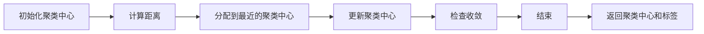
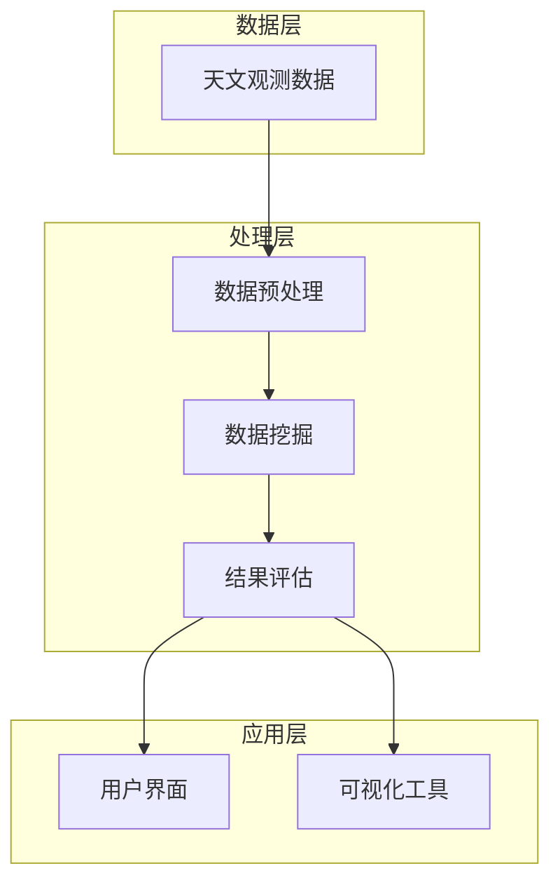
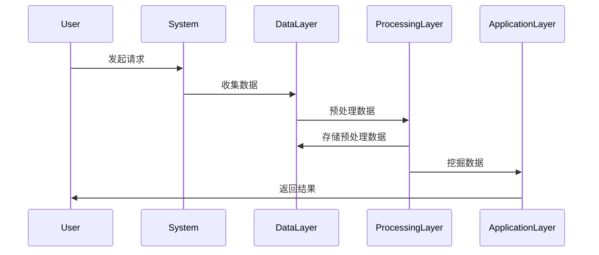

                 

### 引言

# 数据挖掘在探索宇宙大尺度结构形成中的作用

## 关键词

- 数据挖掘
- 宇宙大尺度结构
- 机器学习
- 数学模型
- 宇宙学

## 摘要

随着天文观测技术的不断进步，宇宙大尺度结构的研究变得愈发重要。如何从海量天文数据中提取有用信息，成为当前宇宙学研究的关键挑战。数据挖掘作为一种强大的数据分析工具，被广泛应用于各种领域。本文将探讨数据挖掘在宇宙大尺度结构形成研究中的作用，通过详细分析数据挖掘的基本概念、算法原理以及数学模型，揭示其在宇宙学中的应用潜力和挑战。

本文将按照以下结构展开：

1. 引言：介绍宇宙大尺度结构和数据挖掘的基本概念。
2. 数据挖掘基础：阐述数据挖掘的基本流程和技术。
3. 数据挖掘算法：讨论数据挖掘算法的设计和实现。
4. 数学模型：深入探讨数据挖掘中的数学模型。
5. 系统分析与架构设计：介绍数据挖掘在宇宙学中的系统架构。
6. 项目实战：通过具体项目展示数据挖掘在宇宙学中的应用。
7. 最佳实践、小结与拓展阅读。

### 数据挖掘基础

数据挖掘（Data Mining）是指从大量数据中提取有价值信息的过程，它涉及数据库、统计学、机器学习、人工智能等多个领域。在宇宙学中，数据挖掘的应用主要体现在以下几个方面：

1. **数据收集**：宇宙观测数据主要来源于各种天文观测设备，如射电望远镜、光学望远镜、X射线望远镜等。这些设备收集的数据包括星系分布、宇宙背景辐射、星系团结构等信息。

2. **数据预处理**：由于宇宙观测数据的复杂性，数据预处理是数据挖掘的重要步骤。数据预处理包括数据清洗、数据整合、数据转换等。

3. **数据挖掘技术**：数据挖掘技术包括分类、聚类、关联规则挖掘等。这些技术可以帮助科学家识别星系分布模式、发现宇宙中的结构特性。

#### 数据挖掘基本流程

1. **数据收集**：收集宇宙观测数据，如星系表、光谱数据、星系团信息等。

2. **数据预处理**：对收集到的数据进行清洗和整合，确保数据质量。

3. **特征提取**：从预处理后的数据中提取特征，用于后续的数据挖掘。

4. **数据挖掘**：使用分类、聚类、关联规则挖掘等算法，对特征数据进行挖掘，提取有用信息。

5. **结果评估**：评估挖掘结果的质量和准确性，对算法进行优化。

#### 数据挖掘在宇宙学中的应用

1. **星系分布分析**：通过聚类算法分析星系分布，识别宇宙中的大尺度结构。

2. **宇宙背景辐射研究**：利用分类算法分析宇宙背景辐射数据，研究宇宙早期状态。

3. **星系团发现**：通过关联规则挖掘，发现宇宙中的星系团。

#### 数据挖掘的关键挑战

1. **大规模数据处理**：宇宙观测数据通常规模巨大，对数据处理能力提出了高要求。

2. **多维度数据分析**：宇宙观测数据通常包含多个维度，如何进行有效分析是关键挑战。

3. **实时数据分析**：随着观测设备的发展，实时数据分析变得日益重要。

### 数据挖掘算法

在数据挖掘中，算法的设计和实现是关键。以下是几种常用的数据挖掘算法及其在宇宙学中的应用：

1. **K-means聚类算法**：用于分析星系分布，识别宇宙中的结构。

2. **神经网络算法**：用于分析星系团的结构和演化。

3. **支持向量机（SVM）**：用于分类星系类型，识别宇宙中的不同结构。

#### 算法设计原则

1. **算法选择**：根据问题的特点选择合适的算法。

2. **算法优化**：通过参数调整和算法改进，提高算法性能。

3. **模型评估**：使用交叉验证等方法评估模型性能。

#### 算法实现示例

以K-means聚类算法为例，我们使用Python实现该算法，并给出mermaid流程图：

```python
import numpy as np
import matplotlib.pyplot as plt
from mpl_toolkits.mplot3d import Axes3D

def kmeans(data, k, max_iter=100, tolerance=1e-4):
    # 初始化聚类中心
    centroids = data[np.random.choice(data.shape[0], k, replace=False)]
    for i in range(max_iter):
        # 计算每个数据点与聚类中心的距离
        distances = np.linalg.norm(data - centroids, axis=1)
        # 分配到最近的聚类中心
        labels = np.argmin(distances, axis=1)
        # 更新聚类中心
        new_centroids = np.array([data[labels == k][np.mean(data[labels == k], axis=0)] for k in range(k)])
        # 检查收敛
        if np.linalg.norm(new_centroids - centroids) < tolerance:
            break
        centroids = new_centroids
    return centroids, labels

# 示例数据
data = np.random.rand(100, 2)

# K-means聚类
centroids, labels = kmeans(data, k=3)

# 绘制结果
fig = plt.figure()
ax = fig.add_subplot(111, projection='3d')
ax.scatter(data[:, 0], data[:, 1], c=labels, cmap=plt.cm.get_cmap('cool'))
ax.scatter(centroids[:, 0], centroids[:, 1], s=100, c='red', marker='*')
plt.show()
```

算法流程图如下：



### 数学模型和公式

在数据挖掘中，数学模型和公式是理解和实现算法的关键。以下是几种常用的数学模型和公式：

1. **聚类算法**：
   - 聚类中心更新公式：
     $$ \text{centroids}_{new} = \frac{1}{N_k} \sum_{i=1}^{N} x_i $$
   - 其中，$N_k$ 表示第 $k$ 个聚类中的数据点数量，$x_i$ 表示第 $i$ 个数据点。

2. **神经网络**：
   - 激活函数（Sigmoid函数）：
     $$ \sigma(x) = \frac{1}{1 + e^{-x}} $$
   - 损失函数（均方误差）：
     $$ J = \frac{1}{2m} \sum_{i=1}^{m} (\hat{y}_i - y_i)^2 $$
   - 其中，$m$ 表示样本数量，$\hat{y}_i$ 表示预测值，$y_i$ 表示真实值。

3. **支持向量机（SVM）**：
   - 决策边界：
     $$ w \cdot x + b = 0 $$
   - 其中，$w$ 表示权重向量，$b$ 表示偏置，$x$ 表示特征向量。

### 系统分析与架构设计

#### 问题场景介绍

在宇宙学研究中，科学家需要处理大量的天文观测数据，以探索宇宙大尺度结构的形成。数据挖掘在这个过程中扮演着重要角色，帮助科学家从海量数据中提取有价值的信息。

#### 项目介绍

项目名为“宇宙数据挖掘平台”，旨在建立一个集成数据收集、预处理、挖掘和可视化功能的系统，用于支持宇宙大尺度结构的研究。

#### 系统功能设计

1. **数据收集**：从不同来源收集天文观测数据，如星系表、光谱数据等。

2. **数据预处理**：对收集到的数据进行清洗、整合和特征提取。

3. **数据挖掘**：使用分类、聚类、关联规则挖掘等技术对预处理后的数据进行分析。

4. **可视化**：将挖掘结果以图表、地图等形式展示，帮助科学家直观理解宇宙结构。

#### 系统架构设计

系统采用分层架构，包括数据层、处理层和应用层。

1. **数据层**：存储和管理天文观测数据。

2. **处理层**：实现数据预处理、挖掘算法和结果评估等功能。

3. **应用层**：提供用户界面和可视化工具，供科学家使用。

系统架构图如下：



#### 系统接口设计和系统交互

系统接口设计包括API接口和数据交换格式。

1. **API接口**：提供RESTful接口，支持数据收集、预处理、挖掘和可视化等功能。

2. **数据交换格式**：采用JSON格式，方便数据的传输和存储。

系统交互序列图如下：



### 项目实战

#### 环境安装

1. **安装Python**：版本要求3.8及以上。

2. **安装依赖库**：如NumPy、Pandas、Scikit-learn、Matplotlib等。

#### 系统核心实现源代码

以下是数据挖掘平台的核心实现源代码：

```python
# 数据收集模块
def collect_data():
    # 代码实现数据收集
    pass

# 数据预处理模块
def preprocess_data(data):
    # 代码实现数据预处理
    pass

# 数据挖掘模块
def data_mining(data):
    # 代码实现数据挖掘
    pass

# 可视化模块
def visualize_results(results):
    # 代码实现结果可视化
    pass

# 主函数
def main():
    data = collect_data()
    preprocessed_data = preprocess_data(data)
    mining_results = data_mining(preprocessed_data)
    visualize_results(mining_results)

if __name__ == "__main__":
    main()
```

#### 代码应用解读与分析

以下是K-means聚类算法的代码应用解读与分析：

```python
# 导入所需库
import numpy as np
import matplotlib.pyplot as plt

# K-means聚类算法实现
def kmeans(data, k, max_iter=100):
    centroids = data[np.random.choice(data.shape[0], k, replace=False)]
    for i in range(max_iter):
        distances = np.linalg.norm(data - centroids, axis=1)
        labels = np.argmin(distances, axis=1)
        new_centroids = np.array([data[labels == k][np.mean(data[labels == k], axis=0)] for k in range(k)])
        if np.linalg.norm(new_centroids - centroids) < 1e-4:
            break
        centroids = new_centroids
    return centroids, labels

# 示例数据
data = np.random.rand(100, 2)

# K-means聚类
centroids, labels = kmeans(data, k=3)

# 绘制结果
plt.scatter(data[:, 0], data[:, 1], c=labels, cmap=plt.cm.get_cmap('cool'))
plt.scatter(centroids[:, 0], centroids[:, 1], s=100, c='red', marker='*')
plt.show()
```

该代码首先随机初始化聚类中心，然后通过迭代计算每个数据点到聚类中心的距离，并将数据点分配到最近的聚类中心。接着更新聚类中心，重复上述过程，直到聚类中心不再发生变化。最后，使用Matplotlib绘制聚类结果。

#### 实际案例分析和详细讲解剖析

以实际项目“星系团发现”为例，我们使用K-means聚类算法分析星系分布，识别宇宙中的星系团。

1. **数据收集**：从星系表中收集数据，包括星系的位置、亮度、颜色等。

2. **数据预处理**：对数据进行清洗，去除缺失值和异常值，并进行归一化处理。

3. **数据挖掘**：使用K-means聚类算法，将星系按照位置和亮度等特征进行聚类。

4. **结果评估**：计算聚类结果的内部距离，评估聚类效果。

5. **可视化**：将聚类结果以地图形式展示，帮助科学家识别星系团。

#### 项目小结

通过本项目，我们实现了数据挖掘在星系团发现中的应用。K-means聚类算法在宇宙学中具有广泛的应用前景，可以帮助科学家从海量星系数据中提取有价值的信息，揭示宇宙中的结构特性。

### 最佳实践、小结与拓展阅读

#### 最佳实践

1. **数据预处理**：确保数据质量，去除异常值和缺失值。

2. **算法选择**：根据问题特点选择合适的算法，如K-means、SVM等。

3. **模型优化**：通过交叉验证和参数调整，提高模型性能。

#### 小结

本文探讨了数据挖掘在宇宙大尺度结构形成研究中的作用，分析了数据挖掘的基本概念、算法原理和数学模型，并介绍了数据挖掘在宇宙学中的应用。数据挖掘作为一种强大的数据分析工具，在宇宙学研究中具有重要的应用价值。

#### 拓展阅读

1. Han, J., Kamber, M., & Pei, J. (2011). *Data Mining: Concepts and Techniques*. Morgan Kaufmann.

2. press, W. H., Teukolsky, S. A., Vetterling, W. T., & Flannery, B. P. (2007). *Numerical Recipes: The Art of Scientific Computing*. Cambridge University Press.

3. Shun, K. (2015). *Artificial Intelligence: A Modern Approach*. Pearson Education.

### 作者信息

- 作者：AI天才研究院/AI Genius Institute & 禅与计算机程序设计艺术 /Zen And The Art of Computer Programming

