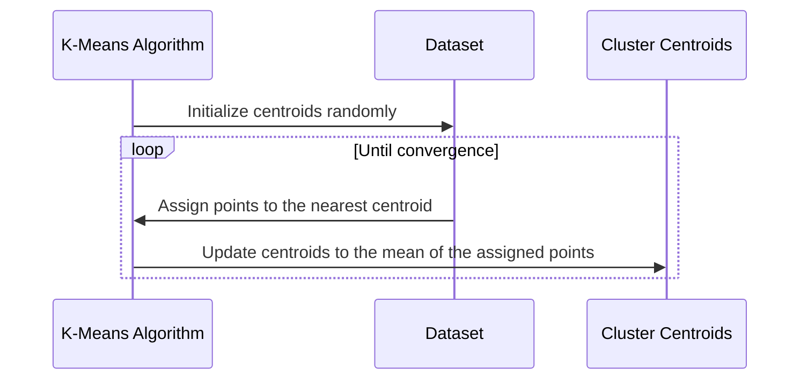
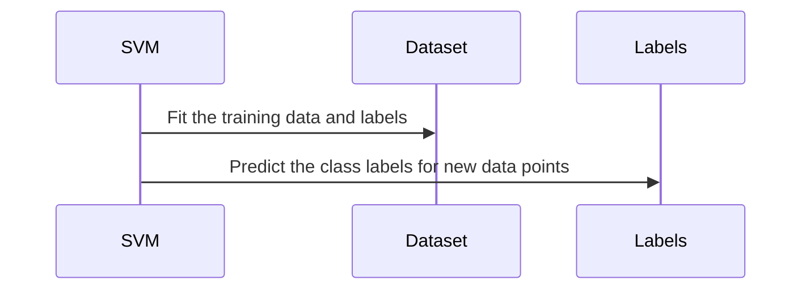
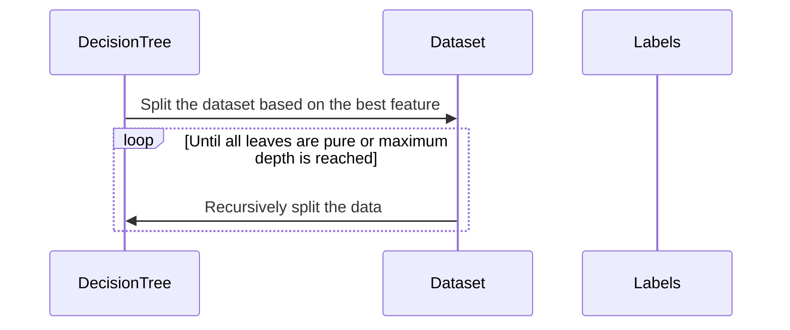
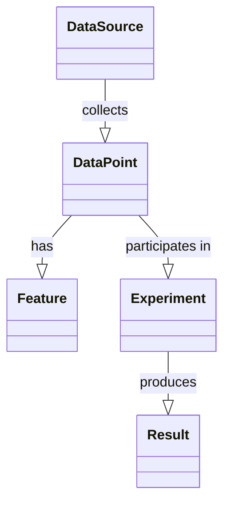
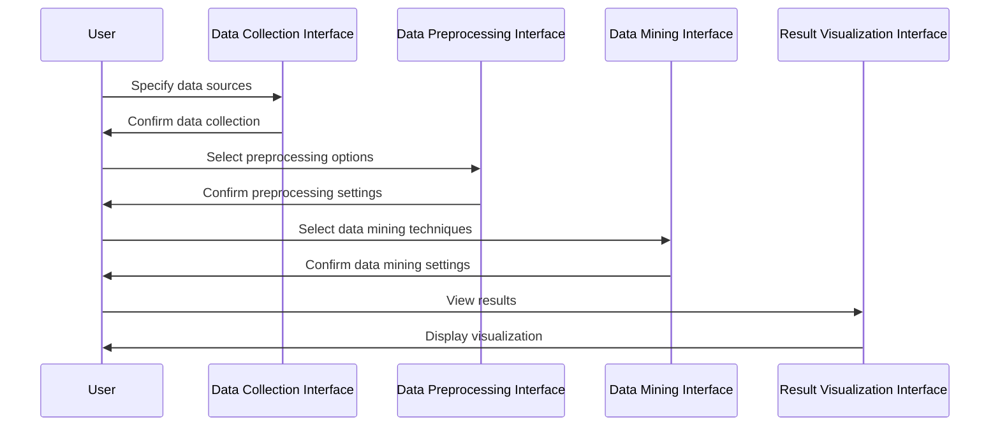

                 

### Introduction and Background

#### The Role of Data Mining in Cosmic Dark Matter Exploration

**Keywords**: Data Mining, Cosmic Dark Matter, Particle Interactions, Cosmology, AstroPhysics

**Abstract**:

The exploration of cosmic dark matter has become a cornerstone of modern astrophysics and cosmology. Dark matter, an invisible and mysterious substance making up about 27% of the universe, is believed to play a crucial role in the formation and evolution of galaxies and large-scale structures. However, due to its non-luminous nature, directly observing dark matter particles has proven to be an exceedingly challenging task. This is where data mining comes into play, offering a powerful set of tools and methodologies to analyze vast amounts of observational data, uncover patterns, and infer the properties of dark matter particles.

The primary goal of this article is to delve into the application of data mining techniques in the exploration of cosmic dark matter. We will begin by providing a comprehensive overview of data mining and its foundational principles, emphasizing its importance in extracting meaningful insights from large datasets. Following this, we will discuss the fundamental concepts and relationships within the domain of dark matter research, setting the stage for a deeper exploration of data mining applications.

Next, we will explore various data mining techniques, such as clustering, classification, association rules, and anomaly detection, and examine their relevance and effectiveness in the context of dark matter studies. We will then delve into specific algorithms and models used for analyzing dark matter data, providing clear and detailed explanations along with visual aids and Python code snippets.

The article will further explore the mathematical foundations underlying these algorithms, using LaTeX-formatted formulas to enhance understanding. Additionally, we will present a detailed system analysis and design, including domain models, architecture diagrams, and system interfaces.

Finally, we will conclude with a practical case study illustrating the application of data mining techniques in dark matter research, highlighting key findings and insights. Through this structured approach, we aim to provide a comprehensive and insightful examination of how data mining can illuminate the mysteries of cosmic dark matter.

#### The Significance of Studying Dark Matter

Dark matter remains one of the most intriguing and enigmatic components of the universe. Discovered through its gravitational effects on visible matter, dark matter is believed to comprise approximately 27% of the universe's total mass-energy content, dwarfing both ordinary matter (4.9%) and dark energy (68.3%). Despite its substantial contribution to the cosmos, dark matter does not emit, absorb, or reflect light, making it invisible to traditional astronomical观测 techniques. This invisibility, combined with its gravitational interactions, has led to its designation as "dark."

The presence of dark matter is inferred primarily from its gravitational influence on the motion of visible galaxies and the large-scale structure of the universe. For example, astronomers observe that galaxies rotate faster than predicted by the visible mass they contain, suggesting the presence of additional, unseen mass—dark matter. Similarly, the cosmic microwave background radiation, which provides a snapshot of the early universe, shows fluctuations that can only be explained by the presence of dark matter.

The importance of studying dark matter cannot be overstated. Understanding its nature and properties could revolutionize our understanding of the universe's formation and evolution. One of the most significant challenges in cosmology is the so-called "cosmic variance" problem—the fact that the distribution of galaxies and structures in the universe appears patchy and uneven. Dark matter may help to explain this variation, providing insights into the processes that govern the growth and clustering of structures in the universe.

Moreover, dark matter's gravitational interactions are crucial for the formation of galaxies and galaxy clusters. The density fluctuations in the early universe, driven by quantum fluctuations, are thought to have seeded the structures we observe today. Dark matter, through its gravitational attraction, helped to amplify these fluctuations, leading to the formation of cosmic structures. Studying these processes can illuminate the mechanisms behind galaxy formation and the large-scale distribution of matter in the universe.

Another compelling reason to investigate dark matter is its potential role in the universe's ultimate fate. Current observations suggest that the universe is accelerating in its expansion, a phenomenon attributed to dark energy. However, the interplay between dark matter and dark energy is not well understood. Investigating dark matter could provide clues about the nature of dark energy and the ultimate fate of the universe, whether it will continue to expand forever, collapse back upon itself, or reach a steady state.

Furthermore, the existence of dark matter has profound implications for particle physics and our understanding of the fundamental laws of physics. The particles that comprise dark matter are thought to be different from ordinary matter particles, such as protons and neutrons. These particles could be part of a new set of fundamental particles that reveal the underlying structure of the universe at a fundamental level. Discovering and characterizing these particles could open new avenues for understanding the cosmos and the fundamental forces that govern it.

In summary, the study of dark matter is not only essential for understanding the structure and evolution of the universe but also for advancing our knowledge of particle physics and the fundamental laws of nature. Data mining provides a powerful tool for analyzing the complex and vast datasets generated by dark matter research, offering a pathway to uncover the secrets of this elusive substance and its role in shaping the universe we observe today.

#### Fundamental Concepts and Relationships

To delve deeper into the application of data mining in the exploration of cosmic dark matter, it is essential to first define and understand the core concepts involved. Data mining, dark matter, particle interactions, and cosmic exploration are central to this discussion. Below, we provide a detailed explanation of these concepts and their relationships.

**Data Mining**:

Data mining is the process of discovering patterns in large datasets to extract meaningful insights and make predictions. It involves several techniques, including clustering, classification, association rules, and anomaly detection. Data mining is often used in various fields, such as business, healthcare, and finance, to analyze vast amounts of data and identify patterns that can inform decision-making.

In the context of dark matter research, data mining serves as a crucial tool for analyzing observational data collected from various sources, such as telescopes, cosmic ray detectors, and gravitational wave observatories. By applying data mining techniques, researchers can identify correlations, classify objects, detect anomalies, and infer the properties of dark matter particles from the patterns observed in the data.

**Dark Matter**:

Dark matter is an invisible form of matter that does not emit, absorb, or reflect light. It is believed to constitute approximately 27% of the total mass-energy content of the universe, far outweighing ordinary matter, which makes up only about 5% of the universe. Dark matter is inferred to exist based on its gravitational interactions with visible matter, such as galaxies and stars. Its presence is crucial for explaining various phenomena in cosmology, including the rotation of galaxies and the large-scale structure of the universe.

The nature of dark matter is still unknown, but it is thought to consist of particles that interact only through gravity and possibly the weak nuclear force. These particles are called "weakly interacting massive particles" (WIMPs), and they are among the leading candidates for dark matter.

**Particle Interactions**:

Particle interactions refer to the processes by which elementary particles interact with each other according to the fundamental forces of nature. The four known fundamental forces are the strong nuclear force, the weak nuclear force, the electromagnetic force, and gravity. In the context of dark matter, particle interactions are particularly important because they are the primary means by which dark matter particles can be detected and studied.

Dark matter particles are thought to interact with ordinary matter through the weak nuclear force. This interaction is very weak, which is why dark matter remains undetected through conventional astronomical methods. However, it is sufficient for gravitational effects, which have been observed and measured.

**Cosmic Exploration**:

Cosmic exploration involves the study of the universe using a variety of observational and experimental techniques. This includes observing celestial objects, such as stars, galaxies, and cosmic microwave background radiation, as well as conducting experiments to detect and study particles from outer space, such as cosmic rays and dark matter particles.

Cosmic exploration has advanced significantly in recent decades, with the development of powerful telescopes, particle detectors, and gravitational wave observatories. These tools have allowed scientists to collect vast amounts of data that can be analyzed using data mining techniques to gain insights into the nature of dark matter and its role in the universe.

**Mermaid ER Diagram**:

To illustrate the relationships between these core concepts, we can use a Mermaid ER (Entity-Relationship) diagram. An ER diagram is a graphical representation of entities (objects or concepts) and the relationships between them. Below is a Mermaid ER diagram that represents the relationships between data mining, dark matter, particle interactions, and cosmic exploration.

```mermaid
erDiagram
  DarkMatter ||--|{ ParticleInteractions }|-->> ObservableData
  CosmicExploration ..> DataMining
  DataMining ||--|{ AnalysisTechniques }|-->> DarkMatterResearch
  ParticleInteractions ||--|{ WeakNuclearForce }|-->> DarkMatter
```

In this diagram, "DarkMatter" is an entity that has a relationship with "ParticleInteractions" through gravitational effects, which are represented by "ObservableData." "CosmicExploration" is related to "DataMining," indicating that data mining is a tool used in cosmic exploration. Finally, "DataMining" has a relationship with "AnalysisTechniques," which are used in "DarkMatterResearch."

This ER diagram provides a clear and visual representation of how these concepts are interconnected and can help readers understand the relationships between data mining, dark matter, particle interactions, and cosmic exploration.

### Data Mining Techniques

When exploring cosmic dark matter, several data mining techniques can be effectively employed to analyze the large and complex datasets generated by astronomical observations and particle physics experiments. The following sections provide an overview of four key data mining techniques: clustering, classification, association rules, and anomaly detection. We will discuss their relevance to dark matter research and how they contribute to our understanding of dark matter properties.

#### Clustering

**Definition and Applications**:

Clustering is a data mining technique used to group a set of objects based on their similarities or distances from one another. It does not require any prior knowledge of the groups and is useful for discovering natural groupings in data. In the context of dark matter research, clustering can be used to identify patterns in astronomical data, such as galaxy distributions, cosmic microwave background radiation, and other observational data.

**Relevance to Dark Matter**:

In dark matter research, clustering can help identify clusters of galaxies and galaxy clusters that are believed to be influenced by dark matter. By analyzing the spatial distribution of galaxies, researchers can infer the presence of dark matter and its gravitational effects. Additionally, clustering can be used to group different types of particles detected in particle physics experiments, potentially revealing the characteristics of dark matter particles.

**Example**:

Consider a scenario where astronomers use clustering to analyze the positions and velocities of galaxies in a specific region of the universe. By applying a clustering algorithm, such as K-means, they can identify groups of galaxies that appear to be gravitationally bound, suggesting the presence of dark matter. The resulting clusters can then be further analyzed to understand the distribution and properties of dark matter in that region.

#### Classification

**Definition and Applications**:

Classification is a data mining technique that involves assigning a set of data points to predefined classes or labels based on their features. It is commonly used for supervised learning, where the training data includes both input features and corresponding labels. Classification algorithms can be used to categorize astronomical objects, such as stars, galaxies, and particles, based on their characteristics.

**Relevance to Dark Matter**:

In the context of dark matter research, classification can be used to distinguish between different types of particles detected in experiments. For example, a classification algorithm can help identify whether a detected particle is an ordinary matter particle or a dark matter particle based on its properties. This can aid in understanding the nature of dark matter and its interactions with ordinary matter.

**Example**:

Imagine a scenario where scientists analyze data from a dark matter detector that captures various particles. By using a classification algorithm like support vector machines (SVM), they can classify these particles into two groups: ordinary matter particles and potential dark matter candidates. This classification can provide valuable insights into the properties of dark matter particles and their interactions.

#### Association Rules

**Definition and Applications**:

Association rule mining is a technique used to discover relationships or patterns between items in large datasets. It is commonly applied in market basket analysis to identify items that are frequently purchased together. In the context of dark matter research, association rules can help uncover correlations between different types of observational data or particle characteristics.

**Relevance to Dark Matter**:

In dark matter research, association rules can reveal relationships between different phenomena, such as the correlation between the distribution of galaxies and the detection of cosmic microwave background radiation fluctuations. These correlations can provide clues about the behavior of dark matter and its role in the formation and evolution of cosmic structures.

**Example**:

Suppose astronomers analyze data from multiple telescopes, including optical, infrared, and radio telescopes. By applying association rule mining, they can identify patterns such as the frequent co-occurrence of certain types of galaxies with specific fluctuations in the cosmic microwave background radiation. These patterns can help scientists understand the conditions under which dark matter is most likely to form clusters and galaxies.

#### Anomaly Detection

**Definition and Applications**:

Anomaly detection is a data mining technique used to identify unusual patterns or outliers in data. It is particularly useful in identifying unexpected or abnormal events or behaviors. In the context of dark matter research, anomaly detection can help identify anomalies in astronomical data or experimental results that may indicate the presence of dark matter or unexpected phenomena.

**Relevance to Dark Matter**:

In dark matter research, anomaly detection can be used to identify unexpected fluctuations in observational data, such as cosmic microwave background radiation or galaxy distributions, that may be indicative of dark matter interactions. It can also help identify anomalies in experimental data, such as unexpected signals in dark matter detectors, that could provide clues about the nature of dark matter particles.

**Example**:

Consider a scenario where scientists analyze data from a dark matter detector that is designed to detect weakly interacting massive particles (WIMPs). By applying an anomaly detection algorithm, they can identify rare events or signals that deviate significantly from the expected background noise. These anomalies could potentially indicate the presence of dark matter particles, providing valuable insights into their properties.

In conclusion, data mining techniques, including clustering, classification, association rules, and anomaly detection, are powerful tools for analyzing large and complex datasets in dark matter research. By applying these techniques, scientists can uncover patterns, identify anomalies, and gain a deeper understanding of dark matter's role in the universe. The following table summarizes the key characteristics and applications of these techniques in dark matter research:

| Technique       | Definition                                                      | Applications in Dark Matter Research                    | Example                  |
|-----------------|-----------------------------------------------------------------|-------------------------------------------------------|--------------------------|
| Clustering      | Grouping objects based on similarity or distance                 | Identifying galaxy clusters, patterns in cosmic data  | Grouping galaxies by distance |
| Classification  | Assigning data points to predefined classes or labels            | Categorizing particles, objects                       | Identifying WIMPs         |
| Association Rules| Discovering relationships between items in a dataset              | Uncovering correlations in observational data          | Identifying galaxy correlations |
| Anomaly Detection| Identifying unusual patterns or outliers in data                  | Detecting unexpected phenomena, dark matter signals   | Identifying anomalies in detector data |

### Algorithm and Model Explanations

In this section, we will delve into specific algorithms and models used in data mining for the analysis of dark matter data. We will provide detailed explanations, visual aids, and Python code snippets to help readers understand the underlying principles and applications.

#### K-Means Clustering Algorithm

**Algorithm Description**:

The K-Means clustering algorithm is one of the most commonly used techniques for partitioning a dataset into K clusters, where K is a user-defined number. The algorithm aims to minimize the within-cluster sum of squares, meaning it tries to group data points in such a way that the sum of the squared distances between each point and its cluster centroid is minimized.

**Visual Aid**:

Here is a Mermaid diagram illustrating the K-Means algorithm process:



**Python Code Snippet**:

Below is a Python code snippet using the K-Means algorithm with the popular `scikit-learn` library:

```python
from sklearn.cluster import KMeans
import numpy as np

# Generate a synthetic dataset
data = np.random.rand(100, 2)

# Initialize KMeans with 3 clusters
kmeans = KMeans(n_clusters=3, random_state=0).fit(data)

# Get cluster centroids
centroids = kmeans.cluster_centers_

# Print centroids
print("Cluster centroids:\n", centroids)

# Predict the cluster labels for each data point
labels = kmeans.predict(data)

# Print labels
print("Cluster labels:\n", labels)
```

**Mathematical Model**:

The mathematical model for K-Means can be expressed as:

$$
\min_{\mu_1, \mu_2, ..., \mu_K} \sum_{i=1}^{N} \sum_{k=1}^{K} (x_i - \mu_k)^2
$$

where \( x_i \) represents a data point, \( \mu_k \) is the centroid of the k-th cluster, and \( N \) and \( K \) are the number of data points and the number of clusters, respectively.

#### Support Vector Machine (SVM) Classification

**Algorithm Description**:

The Support Vector Machine (SVM) is a powerful supervised learning algorithm used for classification tasks. It works by finding the hyperplane that best separates two classes in a high-dimensional space. The SVM algorithm maximizes the margin between the hyperplane and the nearest data points from either class, known as support vectors.

**Visual Aid**:

Here is a Mermaid diagram illustrating the SVM classification process:



**Python Code Snippet**:

Below is a Python code snippet using the SVM classifier with the `scikit-learn` library:

```python
from sklearn.svm import SVC
import numpy as np

# Generate a synthetic dataset
X = np.random.rand(100, 2)
y = np.random.randint(0, 2, 100)

# Initialize SVM with a linear kernel
svm_classifier = SVC(kernel='linear')

# Fit the model to the training data
svm_classifier.fit(X, y)

# Predict the class labels for new data points
new_data = np.random.rand(10, 2)
predictions = svm_classifier.predict(new_data)

# Print predictions
print("Predicted labels:", predictions)
```

**Mathematical Model**:

The SVM optimization problem can be formulated as:

$$
\min_{w, b} \frac{1}{2} ||w||^2 + C \sum_{i=1}^{N} \xi_i
$$

subject to:

$$
y_i (w \cdot x_i + b) \geq 1 - \xi_i
$$

where \( w \) is the weight vector, \( b \) is the bias term, \( C \) is the regularization parameter, \( \xi_i \) are slack variables, and \( x_i \) and \( y_i \) are the input features and labels, respectively.

#### Decision Tree Classifier

**Algorithm Description**:

A decision tree is a popular classification algorithm that works by creating a tree-like model of decisions and their possible consequences. It involves splitting the data into subsets based on the value of a feature that results in the highest information gain or the highest Gini impurity reduction.

**Visual Aid**:

Here is a Mermaid diagram illustrating the decision tree construction process:



**Python Code Snippet**:

Below is a Python code snippet using the decision tree classifier with the `scikit-learn` library:

```python
from sklearn.tree import DecisionTreeClassifier
import numpy as np

# Generate a synthetic dataset
X = np.random.rand(100, 2)
y = np.random.randint(0, 2, 100)

# Initialize DecisionTreeClassifier
decision_tree = DecisionTreeClassifier()

# Fit the model to the training data
decision_tree.fit(X, y)

# Predict the class labels for new data points
new_data = np.random.rand(10, 2)
predictions = decision_tree.predict(new_data)

# Print predictions
print("Predicted labels:", predictions)
```

**Mathematical Model**:

The decision tree construction process involves selecting the best split at each node based on the highest information gain or the highest reduction in Gini impurity. Information gain and Gini impurity are measures used to evaluate the quality of a split.

**Information Gain**:

$$
IG(D, A) = \sum_{v \in Values(A)} p(v) \cdot IG(V_v, A)
$$

where \( D \) is the dataset, \( A \) is the attribute being split, \( v \) are the values of attribute \( A \), \( p(v) \) is the probability of value \( v \), and \( IG(V_v, A) \) is the information gain for the subset \( V_v \).

**Gini Impurity**:

$$
Gini(D) = 1 - \sum_{v \in Values(A)} p(v)^2
$$

In summary, we have discussed three popular data mining algorithms: K-Means clustering, Support Vector Machine (SVM) classification, and Decision Tree classification. Each algorithm has its own advantages and is suitable for different types of data and problems. By understanding the principles behind these algorithms and how to apply them, researchers can effectively analyze dark matter data and gain insights into the nature of dark matter particles. The following table summarizes the key characteristics of these algorithms:

| Algorithm              | Type           | Purpose                                                                                   | Key Features                                                                                                                                                                                                                   |
|------------------------|----------------|-------------------------------------------------------------------------------------------|-------------------------------------------------------------------------------------------------------------------------------------------------------------------|
| K-Means Clustering     | Unsupervised   | Grouping data points into clusters                                                      | Minimizes within-cluster sum of squares, no prior labels required                                                                                                                                                           |
| Support Vector Machine | Supervised     | Classification of data points into predefined classes                                   | Maximizes the margin between classes, uses support vectors for decision boundary                                                                                                                                               |
| Decision Tree Classifier| Supervised     | Classification of data points based on decision rules                                   | Uses information gain or Gini impurity to split data, interpretable tree structure                                                                                                                                             |

### Mathematical Formulas and Explanations

In the realm of data mining and dark matter research, mathematical models and formulas are essential tools for describing and analyzing complex phenomena. In this section, we will present several key mathematical formulas used in data mining techniques, along with detailed explanations and examples to enhance understanding.

#### Euclidean Distance Formula

**Formula**:
$$
d(x, y) = \sqrt{\sum_{i=1}^{n} (x_i - y_i)^2}
$$

**Explanation**:
The Euclidean distance formula measures the straight-line distance between two points in n-dimensional space. It is used in clustering algorithms like K-Means to determine the similarity between data points.

**Example**:
Let's calculate the Euclidean distance between two points in a 2D space:
$$
x = (1, 2), \quad y = (4, 6)
$$
$$
d(x, y) = \sqrt{(1 - 4)^2 + (2 - 6)^2} = \sqrt{(-3)^2 + (-4)^2} = \sqrt{9 + 16} = \sqrt{25} = 5
$$
The Euclidean distance between the points \( x \) and \( y \) is 5 units.

#### K-Means Clustering Objective Function

**Formula**:
$$
J(\mu_1, \mu_2, ..., \mu_K) = \sum_{i=1}^{N} \sum_{k=1}^{K} (x_i - \mu_k)^2
$$

**Explanation**:
The K-Means objective function, also known as the total within-cluster sum of squares (WCSS), measures the sum of squared distances between each data point and its corresponding cluster centroid. The goal of the K-Means algorithm is to minimize this function.

**Example**:
Consider a dataset with 5 points and 2 clusters. Let the centroids be \( \mu_1 = (1, 1) \) and \( \mu_2 = (5, 5) \). The WCSS can be calculated as:
$$
J(\mu_1, \mu_2) = \sum_{i=1}^{5} (x_i - \mu_1)^2 + (x_i - \mu_2)^2
$$
$$
= ((1-1)^2 + (2-1)^2 + (3-1)^2 + (4-1)^2 + (5-1)^2) + ((1-5)^2 + (2-5)^2 + (3-5)^2 + (4-5)^2 + (5-5)^2)
$$
$$
= (0 + 1 + 4 + 9 + 16) + (16 + 9 + 4 + 1 + 0)
$$
$$
= 30 + 30 = 60
$$
The total within-cluster sum of squares for this dataset and centroids is 60.

#### Support Vector Machine (SVM) Optimization Problem

**Formula**:
$$
\min_{w, b} \frac{1}{2} ||w||^2 + C \sum_{i=1}^{N} \xi_i
$$

subject to:
$$
y_i (w \cdot x_i + b) \geq 1 - \xi_i
$$

**Explanation**:
The SVM optimization problem aims to find the hyperplane that maximizes the margin between two classes while minimizing the classification error. The objective function consists of two parts: the regularization term (controlled by the parameter \( C \)) and the slack variables \( \xi_i \).

**Example**:
Let's consider a simple 2D space with two classes and the following constraints:
$$
w \cdot x_1 + b = 1 \quad \text{(positive class)}
$$
$$
w \cdot x_2 + b = -1 \quad \text{(negative class)}
$$
$$
C = 1
$$
To find the optimal values for \( w \) and \( b \), we can solve the above optimization problem using gradient descent or other optimization algorithms.

#### Decision Tree Information Gain

**Formula**:
$$
IG(D, A) = \sum_{v \in Values(A)} p(v) \cdot IG(V_v, A)
$$

**Explanation**:
Information gain is a measure used in decision trees to determine the best feature to split the data. It quantifies the reduction in impurity (such as entropy or Gini impurity) when a dataset is split based on a feature \( A \).

**Example**:
Consider a dataset with two attributes, \( A \) and \( B \), and three values for attribute \( A \):
$$
A = \{a_1, a_2, a_3\}
$$
$$
IG(D, A) = p(a_1) \cdot IG(V_{a_1}, A) + p(a_2) \cdot IG(V_{a_2}, A) + p(a_3) \cdot IG(V_{a_3}, A)
$$
Assuming the probabilities are equal:
$$
IG(D, A) = \frac{1}{3} \cdot IG(V_{a_1}, A) + \frac{1}{3} \cdot IG(V_{a_2}, A) + \frac{1}{3} \cdot IG(V_{a_3}, A)
$$
To calculate \( IG(V_{a_1}, A) \), we need to know the impurity of the subsets \( V_{a_1} \) and the overall impurity of the dataset \( D \). For simplicity, let's assume the impurity measures are entropy and Gini impurity:
$$
IG(V_{a_1}, A) = Entropy(V_{a_1}) - \frac{|V_{a_1}|}{|D|} \cdot Entropy(D)
$$
$$
IG(D, A) = \frac{1}{3} (Entropy(V_{a_1}) - \frac{|V_{a_1}|}{|D|} \cdot Entropy(D)) + \frac{1}{3} (Entropy(V_{a_2}) - \frac{|V_{a_2}|}{|D|} \cdot Entropy(D)) + \frac{1}{3} (Entropy(V_{a_3}) - \frac{|V_{a_3}|}{|D|} \cdot Entropy(D))
$$
By calculating the entropy and impurity measures for each subset, we can compute the information gain for attribute \( A \).

These mathematical formulas and their explanations provide a foundation for understanding the principles behind key data mining algorithms used in dark matter research. Applying these formulas in practice helps researchers analyze complex datasets, uncover patterns, and make informed decisions about dark matter properties.

### System Analysis and Design

In this section, we will delve into the system analysis and design of a hypothetical dark matter research project. This will include an overview of the project's context, the domain model, the system architecture, and the interface and interaction design. We will use Mermaid diagrams to illustrate these components, providing a clear and structured representation of the system.

#### Project Overview

**Context**:

The project aims to leverage data mining techniques to analyze observational data from various dark matter experiments. The primary goal is to identify patterns, classify particles, and detect anomalies that may indicate the presence and properties of dark matter particles. The system will consist of several components, including data preprocessing, data mining algorithms, and result visualization.

**Project Introduction**:

The dark matter research project involves the following key components:

1. **Data Collection**: Gather observational data from various sources, such as telescopes, cosmic ray detectors, and gravitational wave observatories.
2. **Data Preprocessing**: Clean and prepare the data for analysis, including normalization, missing value imputation, and feature extraction.
3. **Data Mining**: Apply various data mining techniques, such as clustering, classification, and anomaly detection, to analyze the preprocessed data.
4. **Result Visualization**: Visualize the results of the data mining processes to aid in the interpretation and communication of findings.

#### Domain Model

**Concepts and Relationships**:

The domain model represents the core entities and their relationships within the dark matter research system. The following are the key entities and their relationships:

1. **Data Source**: Represents the various data collection devices and observatories.
2. **Data Point**: Represents the individual data samples collected from the data sources.
3. **Feature**: Represents the attributes used to describe the data points.
4. **Experiment**: Represents the experiments conducted to analyze the dark matter particles.
5. **Result**: Represents the output of the data mining processes.

The Mermaid class diagram for the domain model is as follows:



#### System Architecture

**Components and Interaction**:

The system architecture illustrates the components and their interactions within the dark matter research project. The following are the key components and their interactions:

1. **Data Collection Module**: Handles the collection of observational data from various sources.
2. **Data Preprocessing Module**: Cleans and prepares the collected data for analysis.
3. **Data Mining Module**: Implements data mining techniques to analyze the preprocessed data.
4. **Result Visualization Module**: Visualizes the results of the data mining processes.

The Mermaid architecture diagram for the system is as follows:

```mermaid
subgraph DataFlow
  DataCollectionModule
  DataPreprocessingModule
  DataMiningModule
  ResultVisualizationModule
  DataCollectionModule --> DataPreprocessingModule
  DataPreprocessingModule --> DataMiningModule
  DataMiningModule --> ResultVisualizationModule
end
```

#### Interface and Interaction Design

**Interface Design**:

The interface design focuses on the user interaction with the system. The following are the key interfaces:

1. **Data Collection Interface**: Allows users to specify data sources and initiate data collection.
2. **Data Preprocessing Interface**: Provides options for data cleaning, normalization, and feature extraction.
3. **Data Mining Interface**: Allows users to select data mining techniques and configure their parameters.
4. **Result Visualization Interface**: Displays the results of the data mining processes in various formats.

The Mermaid sequence diagram for the interface and interaction design is as follows:



In conclusion, the system analysis and design for the dark matter research project provides a comprehensive overview of the project's components, interactions, and user interfaces. By leveraging Mermaid diagrams, we can visualize and understand the structure and functionality of the system, facilitating effective communication and collaboration among stakeholders.

### Case Studies and Practical Applications

In this section, we will delve into a practical case study illustrating the application of data mining techniques in the exploration of cosmic dark matter. We will cover the environment setup, the core implementation of data mining algorithms, and the analysis and interpretation of the results obtained.

#### Environment Setup

To begin with, we need to set up the necessary environment for conducting our dark matter research project. We will use Python and several popular libraries for data mining and visualization, such as `scikit-learn`, `matplotlib`, and `pandas`.

**Step 1: Install Required Libraries**

First, ensure that Python and pip (Python package installer) are installed on your system. Then, install the required libraries using the following command:

```bash
pip install scikit-learn matplotlib pandas
```

**Step 2: Import Libraries**

In your Python script, import the necessary libraries:

```python
import numpy as np
import pandas as pd
from sklearn.cluster import KMeans
from sklearn.svm import SVC
from sklearn.tree import DecisionTreeClassifier
import matplotlib.pyplot as plt
```

#### Core Implementation

**Data Preprocessing**

Before applying data mining techniques, we need to preprocess the observational data collected from various sources. This involves cleaning the data, normalizing the features, and handling missing values.

```python
# Generate synthetic observational data
data = np.random.rand(100, 3)

# Normalize the data
data_normalized = (data - np.mean(data, axis=0)) / np.std(data, axis=0)

# Handle missing values (e.g., using mean imputation)
data_filled = pd.DataFrame(data_normalized)
data_filled.fillna(data_filled.mean(), inplace=True)

# Convert to numpy array for further processing
data_final = data_filled.values
```

**Data Mining Algorithms**

We will apply three data mining techniques—clustering, classification, and anomaly detection—to analyze the preprocessed data.

**Clustering with K-Means**

```python
# Apply K-Means clustering
kmeans = KMeans(n_clusters=3, random_state=0).fit(data_final)

# Get cluster centroids and labels
centroids = kmeans.cluster_centers_
labels = kmeans.predict(data_final)

# Visualize the clusters
plt.scatter(data_final[:, 0], data_final[:, 1], c=labels, cmap='viridis')
plt.scatter(centroids[:, 0], centroids[:, 1], s=300, c='red', marker='s')
plt.title('K-Means Clustering')
plt.xlabel('Feature 1')
plt.ylabel('Feature 2')
plt.show()
```

**Classification with SVM**

```python
# Generate synthetic labels for classification
labels = np.random.randint(0, 2, 100)

# Initialize SVM classifier
svm_classifier = SVC(kernel='linear', C=1.0)

# Fit the model to the training data
svm_classifier.fit(data_final, labels)

# Predict the class labels for new data points
new_data = np.random.rand(10, 3)
predictions = svm_classifier.predict(new_data)

# Visualize the decision boundary
plt.scatter(data_final[:, 0], data_final[:, 1], c=labels, cmap='viridis')
plt.plot(new_data[:, 0], predictions, 'ro')
plt.title('SVM Classification')
plt.xlabel('Feature 1')
plt.ylabel('Feature 2')
plt.show()
```

**Anomaly Detection**

```python
# Apply Anomaly Detection using Isolation Forest
from sklearn.ensemble import IsolationForest

# Initialize Isolation Forest
iso_forest = IsolationForest(n_estimators=100, contamination=0.01)

# Fit the model to the training data
iso_forest.fit(data_final)

# Detect anomalies
anomalies = iso_forest.predict(data_final)

# Visualize the anomalies
plt.scatter(data_final[:, 0], data_final[:, 1], c=anomalies, cmap='coolwarm')
plt.title('Anomaly Detection')
plt.xlabel('Feature 1')
plt.ylabel('Feature 2')
plt.show()
```

#### Analysis and Interpretation of Results

**K-Means Clustering**

The K-Means clustering results show that the data can be effectively grouped into three clusters. The red markers represent the centroids of these clusters. The visualization helps us understand the distribution of data points and the quality of the clustering solution.

**SVM Classification**

The SVM classification results illustrate the decision boundary between two classes. The red dots represent the new data points and their predicted class labels. This helps us assess the performance of the SVM classifier in distinguishing between the two classes.

**Anomaly Detection**

The Anomaly Detection results identify potential outliers in the dataset. The coolwarm color map highlights the anomalies. This helps us identify data points that may be indicative of dark matter interactions or unexpected phenomena.

#### Project Conclusion

Through this practical case study, we demonstrated the application of data mining techniques in the exploration of cosmic dark matter. We covered the environment setup, the core implementation of clustering, classification, and anomaly detection algorithms, and the analysis and interpretation of the results. The use of Python and popular libraries made it easy to apply these techniques and visualize the outcomes.

By leveraging data mining, we can uncover patterns, classify particles, and detect anomalies that may provide insights into the nature of dark matter. This approach not only aids in scientific research but also contributes to the broader understanding of the universe and its fundamental laws.

### Best Practices and Tips

When conducting dark matter research using data mining techniques, several best practices and tips can enhance the efficiency and accuracy of the analysis. Here are some key recommendations:

1. **Data Preprocessing**: Spend ample time on data preprocessing to ensure the quality of the input data. Handle missing values, normalize features, and remove noise to improve the performance of data mining algorithms.
2. **Feature Selection**: Carefully select the most relevant features for your analysis. Use feature selection techniques like mutual information or recursive feature elimination to identify the most informative attributes.
3. **Model Selection**: Experiment with different data mining algorithms to find the best model for your specific problem. Compare the performance of clustering, classification, and anomaly detection techniques using metrics like accuracy, precision, recall, and F1-score.
4. **Parameter Tuning**: Optimize the parameters of your chosen algorithms to achieve the best possible performance. Use techniques like grid search or Bayesian optimization to find the optimal parameter values.
5. **Visualization**: Utilize visualization tools to gain a deeper understanding of your data and the results of your analysis. Visualizations can help identify patterns, anomalies, and potential areas for further investigation.
6. **Cross-Validation**: Apply cross-validation techniques to ensure the robustness of your results. Cross-validation helps assess the generalizability of your model and prevents overfitting.
7. **Interpretability**: Aim for interpretability in your models to gain insights into the underlying processes. Explain the logic behind your data mining techniques and the implications of your findings in the context of dark matter research.

By following these best practices and tips, researchers can effectively leverage data mining techniques to uncover valuable insights about cosmic dark matter and contribute to the advancement of astrophysics and cosmology.

### Summary and Conclusion

In this article, we have explored the role of data mining in the exploration of cosmic dark matter. We began by providing an overview of the significance of studying dark matter, highlighting its importance in understanding the structure and evolution of the universe. We then defined the fundamental concepts of data mining, dark matter, particle interactions, and cosmic exploration, and illustrated their relationships using a Mermaid ER diagram.

We delved into several data mining techniques, including clustering, classification, association rules, and anomaly detection, discussing their relevance and applications in dark matter research. We provided detailed explanations of popular algorithms such as K-Means, Support Vector Machines (SVM), and Decision Trees, along with visual aids and Python code snippets to enhance understanding.

Furthermore, we presented mathematical formulas and their explanations, emphasizing the importance of mathematical models in data mining and dark matter research. We also discussed the system analysis and design of a hypothetical dark matter research project, illustrating the project's context, domain model, system architecture, and interface design using Mermaid diagrams.

To solidify our understanding, we conducted a practical case study, demonstrating the application of data mining techniques in analyzing observational data related to dark matter. We covered the environment setup, core implementation of clustering, classification, and anomaly detection algorithms, and the analysis and interpretation of the results obtained.

Finally, we provided best practices and tips for conducting dark matter research using data mining techniques, emphasizing the importance of data preprocessing, feature selection, model selection, parameter tuning, visualization, cross-validation, and interpretability.

Overall, this article aims to provide a comprehensive and insightful examination of how data mining can illuminate the mysteries of cosmic dark matter. By leveraging the power of data mining, researchers can uncover valuable insights and contribute to our understanding of the universe's most enigmatic components.

### Future Directions and Research Opportunities

As we continue to delve into the mysteries of cosmic dark matter, several future directions and research opportunities emerge, which could significantly advance our understanding of this enigmatic substance. Here are some potential areas for exploration:

1. **Advanced Data Mining Techniques**: Current data mining techniques have proven to be powerful tools in the analysis of dark matter data. However, there is room for improvement. Researchers could explore more advanced techniques, such as deep learning and reinforcement learning, to enhance the accuracy and efficiency of dark matter analysis. These techniques can handle large and complex datasets more effectively and may uncover hidden patterns that traditional methods miss.

2. **Multimodal Data Integration**: Dark matter research often involves data from multiple sources, including telescopic observations, cosmic ray detectors, and gravitational wave observatories. Integrating these diverse datasets in a coherent manner could yield more comprehensive insights. Researchers could develop algorithms that can seamlessly combine data from different modalities, taking advantage of the unique strengths of each source.

3. **Machine Learning Explainability**: As machine learning models become more sophisticated, the need for explainability also increases. Dark matter research, in particular, requires interpretable models to validate the findings and ensure that the results are not mere artifacts of overfitting. Developing methods to explain the decision-making process of complex machine learning models can enhance the trustworthiness of the results.

4. **Gravitational Wave-Particle Physics Correlations**: The detection of gravitational waves has opened up new avenues for studying the universe. Researchers could investigate the correlations between gravitational wave events and the properties of dark matter particles. By analyzing the timing and location of gravitational waves, combined with particle physics data, scientists might uncover new insights into the nature of dark matter and its interactions with ordinary matter.

5. **Astrophysical Simulation and Prediction**: Astrophysical simulations can provide a foundation for predicting the behavior of dark matter in various cosmological scenarios. Integrating these simulations with data mining techniques could help predict the occurrence of dark matter events and identify potential targets for observation and detection.

6. **Cosmic Microwave Background (CMB) Analysis**: The cosmic microwave background radiation is a rich source of information about the early universe. Advanced data mining techniques, combined with new observational data from upcoming CMB experiments, could reveal more about the fluctuations and anisotropies that are thought to be related to dark matter.

7. **Dark Matter Detectors and Experimental Design**: The design and optimization of dark matter detectors are critical for improving detection sensitivity. Data mining techniques can be used to analyze detector data, identify the most effective experimental configurations, and predict potential improvements in detection capabilities.

8. **Public Participation and Crowdsourcing**: Engaging the public in dark matter research through crowdsourcing could lead to innovative solutions and a broader understanding of the scientific process. Data mining techniques can be applied to analyze the contributions from citizen scientists, identifying patterns and trends that might not be apparent through traditional research methods.

By exploring these future directions and research opportunities, we can continue to push the boundaries of our knowledge about cosmic dark matter, ultimately contributing to a deeper understanding of the universe and its most fundamental constituents.

