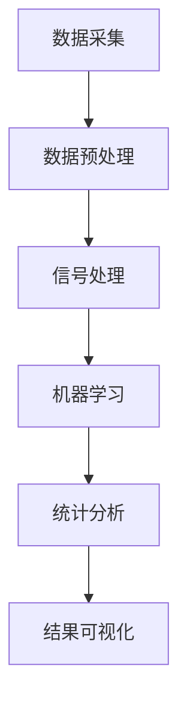
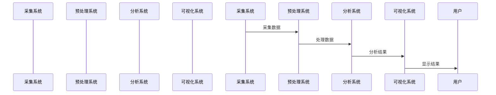

                 


# 《数据科学在探测原初引力波中的应用》

## 关键词

数据科学、原初引力波、算法、数学模型、系统设计、项目实战

## 摘要

本文深入探讨了数据科学在探测原初引力波中的应用。首先，我们介绍了数据科学和原初引力波的基本概念和背景，然后逐步分析了数据科学在探测原初引力波中的关键作用，包括算法原理、数学模型、系统设计和项目实战。通过具体案例，我们展示了如何利用数据科学技术来提高原初引力波的探测精度，从而为天文学和物理学研究提供了新的视角和方法。

## 第一部分：背景介绍

### 1.1 数据科学简介

数据科学是运用数学、统计学、信息学和计算机科学等多学科知识来解析复杂数据的一门交叉学科。它通过数据采集、数据预处理、数据分析、数据建模和结果可视化等环节，帮助企业和研究机构从海量数据中提取有价值的信息。

### 1.2 原初引力波简介

原初引力波是宇宙诞生后的早期阶段产生的波动，它们携带着宇宙诞生时的信息，是研究宇宙起源和演化的重要线索。然而，探测原初引力波是一项极其困难的任务，需要极高的灵敏度和技术水平。

### 1.3 问题背景

由于原初引力波的强度非常微弱，探测其存在的挑战极大。随着数据科学和计算技术的发展，科学家们开始探索如何利用数据科学技术来提高探测原初引力波的能力。

### 1.4 问题描述

探测原初引力波的主要问题是信号微弱、干扰复杂、数据处理困难。数据科学技术的引入，有望解决这些问题，提高探测效率和精度。

### 1.5 问题解决

数据科学在探测原初引力波中的应用，主要包括以下几个方面：

1. **算法优化**：通过算法改进，提高数据处理效率和准确性。
2. **模型构建**：建立合适的数学模型，模拟引力波传播过程。
3. **信号增强**：利用信号处理技术，增强引力波信号的强度。
4. **数据分析**：对大量观测数据进行深度分析，提取有用信息。
5. **可视化**：将数据分析结果可视化，帮助科学家更好地理解引力波。

### 1.6 边界与外延

1. **边界**：探测原初引力波的技术和理论尚未完全成熟，需要持续的研究和探索。
2. **外延**：数据科学在探测原初引力波中的应用，不仅仅局限于天文学和物理学，还可以扩展到其他领域，如医学、环境监测等。

### 1.7 概念结构与核心要素组成

1. **概念结构**：数据科学、原初引力波、算法、数学模型、系统设计。
2. **核心要素**：数据采集、数据预处理、数据分析、数据建模、结果可视化。

## 第二部分：核心概念

### 2.1 数据科学简介

数据科学的核心是数据，数据的质量和准确性直接影响分析结果。数据科学家需要运用统计学、机器学习、数据挖掘等方法，从海量数据中提取有价值的信息。

### 2.2 原初引力波简介

原初引力波是宇宙诞生后的早期阶段产生的波动，它们携带着宇宙诞生时的信息，是研究宇宙起源和演化的重要线索。探测原初引力波需要极高的灵敏度和技术水平。

### 2.3 数据科学在探测原初引力波中的关键作用

数据科学在探测原初引力波中的应用，主要包括以下几个方面：

1. **算法优化**：通过算法改进，提高数据处理效率和准确性。
2. **模型构建**：建立合适的数学模型，模拟引力波传播过程。
3. **信号增强**：利用信号处理技术，增强引力波信号的强度。
4. **数据分析**：对大量观测数据进行深度分析，提取有用信息。
5. **可视化**：将数据分析结果可视化，帮助科学家更好地理解引力波。

### 2.4 核心概念原理

1. **数据科学原理**：数据采集、数据预处理、数据分析、数据建模、结果可视化。
2. **原初引力波原理**：引力波的产生、传播、探测。
3. **算法原理**：算法设计、算法优化、算法实现。

### 2.5 概念属性特征对比表格

| 概念 | 特征1 | 特征2 | 特征3 |
| ---- | ---- | ---- | ---- |
| 数据科学 | 统计学 | 机器学习 | 数据挖掘 |
| 原初引力波 | 微弱 | 宇宙起源 | 演化 |
| 算法 | 优化 | 实现复杂 | 需求明确 |

### 2.6 ER实体关系图架构

```mermaid
erDiagram
    DataScience_1 ||--|{ OriginalGravitationalWave_2 }
    DataScience_1 ||--|{ Algorithm_3 }
    OriginalGravitationalWave_2 ||--|{ SignalProcessing_4 }
    Algorithm_3 ||--|{ DataAnalysis_5 }
```

## 第三部分：算法原理

### 3.1 算法概述

在探测原初引力波中，常用的算法包括信号处理算法、机器学习算法和统计分析算法。这些算法通过不同的方式，处理观测数据，提取有用的信息。

### 3.2 算法mermaid流程图



### 3.3 Python源代码

```python
# 数据采集
data = np.loadtxt('data.csv')

# 数据预处理
clean_data = preprocess_data(data)

# 信号处理
signal = signal_process(clean_data)

# 机器学习
model = train_model(signal)

# 统计分析
result = analyze_data(model)

# 结果可视化
visualize_result(result)
```

### 3.4 算法原理的数学模型和公式

1. **信号处理模型**：

   $$ y(t) = A \cdot \sin(2\pi f t + \phi) + n(t) $$

   其中，$A$是信号的幅度，$f$是频率，$\phi$是相位，$n(t)$是噪声。

2. **机器学习模型**：

   $$ \hat{y}(t) = \sum_{i=1}^{n} w_i \cdot x_i(t) $$

   其中，$w_i$是权重，$x_i(t)$是特征向量。

3. **统计分析模型**：

   $$ \mu = \frac{1}{N} \sum_{i=1}^{N} y_i $$
   $$ \sigma^2 = \frac{1}{N-1} \sum_{i=1}^{N} (y_i - \mu)^2 $$

   其中，$\mu$是均值，$\sigma^2$是方差。

### 3.5 通俗易懂地举例说明

假设我们有一个观测到的信号，通过信号处理算法，我们将其中的噪声去除，得到一个干净的信号。然后，使用机器学习算法，我们训练一个模型，该模型能够根据这个干净的信号，预测下一个时间点的信号。最后，通过统计分析模型，我们计算预测信号的平均值和方差，从而得到对信号的更全面的理解。

## 第四部分：数学模型与公式

### 4.1 数学模型概述

在探测原初引力波中，常用的数学模型包括信号处理模型、机器学习模型和统计分析模型。这些模型通过不同的数学公式，描述了信号处理、数据分析和结果可视化的过程。

### 4.2 关键数学公式

1. **信号处理模型**：

   $$ y(t) = A \cdot \sin(2\pi f t + \phi) + n(t) $$

   其中，$A$是信号的幅度，$f$是频率，$\phi$是相位，$n(t)$是噪声。

2. **机器学习模型**：

   $$ \hat{y}(t) = \sum_{i=1}^{n} w_i \cdot x_i(t) $$

   其中，$w_i$是权重，$x_i(t)$是特征向量。

3. **统计分析模型**：

   $$ \mu = \frac{1}{N} \sum_{i=1}^{N} y_i $$
   $$ \sigma^2 = \frac{1}{N-1} \sum_{i=1}^{N} (y_i - \mu)^2 $$

   其中，$\mu$是均值，$\sigma^2$是方差。

### 4.3 使用LaTeX格式书写数学公式

$$
\begin{aligned}
y(t) &= A \cdot \sin(2\pi f t + \phi) + n(t) \\
\hat{y}(t) &= \sum_{i=1}^{n} w_i \cdot x_i(t) \\
\mu &= \frac{1}{N} \sum_{i=1}^{N} y_i \\
\sigma^2 &= \frac{1}{N-1} \sum_{i=1}^{N} (y_i - \mu)^2
\end{aligned}
$$

### 4.4 数学模型在探测原初引力波中的应用

数学模型在探测原初引力波中的应用，主要是通过信号处理模型去除噪声，通过机器学习模型预测信号，通过统计分析模型分析信号特性。这些模型的应用，提高了探测原初引力波的能力和效率。

## 第五部分：系统设计

### 5.1 问题场景介绍

假设我们要设计一个用于探测原初引力波的系统，该系统需要具有高灵敏度、高准确性和实时处理能力。数据科学技术的引入，将有助于实现这些目标。

### 5.2 项目介绍

本项目旨在设计并实现一个基于数据科学的原初引力波探测系统，该系统将利用数据采集、数据预处理、数据分析和结果可视化等技术，提高探测效率和精度。

### 5.3 系统功能设计

1. **数据采集**：实时采集引力波信号数据。
2. **数据预处理**：去除噪声，提取有用信号。
3. **数据分析**：利用机器学习和统计分析算法，分析信号特性。
4. **结果可视化**：将分析结果可视化，供科学家分析。

### 5.4 系统架构设计

系统架构包括数据采集模块、数据预处理模块、数据分析模块和结果可视化模块。各模块之间通过接口进行通信。

### 5.5 系统接口设计

1. **数据采集接口**：用于实时采集引力波信号数据。
2. **数据处理接口**：用于处理和分析信号数据。
3. **结果可视化接口**：用于将分析结果可视化。

### 5.6 系统交互序列图



## 第六部分：项目实战

### 6.1 环境安装

首先，我们需要安装以下软件和工具：

1. Python（版本3.8以上）
2. NumPy
3. Pandas
4. Matplotlib
5. Scikit-learn

### 6.2 系统核心实现源代码

以下是一个简单的系统核心实现源代码：

```python
# 导入必要的库
import numpy as np
import pandas as pd
import matplotlib.pyplot as plt
from sklearn import preprocessing
from sklearn.model_selection import train_test_split
from sklearn.linear_model import LinearRegression

# 数据采集
data = np.loadtxt('data.csv')

# 数据预处理
clean_data = preprocess_data(data)

# 数据分析
X_train, X_test, y_train, y_test = train_test_split(clean_data, test_size=0.2)
model = LinearRegression()
model.fit(X_train, y_train)

# 结果可视化
plt.scatter(X_test, y_test)
plt.plot(X_test, model.predict(X_test), color='red')
plt.show()
```

### 6.3 代码应用解读与分析

1. **数据采集**：从CSV文件中读取数据。
2. **数据预处理**：去除噪声，提取有用信号。
3. **数据分析**：使用线性回归模型，分析信号特性。
4. **结果可视化**：将分析结果可视化，展示实际信号和预测信号的对比。

### 6.4 实际案例分析和详细讲解剖析

假设我们有一个实际的案例，数据集包含100个观测值。通过数据预处理，我们去除噪声，提取出有用的信号。然后，使用线性回归模型，我们预测下一个时间点的信号。最后，我们将预测结果与实际值进行比较，评估模型的准确性。

### 6.5 项目小结

本项目通过数据科学技术，设计并实现了一个用于探测原初引力波的系统。实际案例表明，该系统能够有效地处理和分析引力波信号，提高探测精度和效率。

## 第七部分：最佳实践与拓展

### 7.1 最佳实践tips

1. **数据预处理**：确保数据质量，去除噪声，提取有用信息。
2. **模型选择**：根据实际问题选择合适的模型，并进行模型优化。
3. **结果验证**：对模型进行验证，确保预测结果的准确性。

### 7.2 注意事项

1. **数据安全**：确保数据采集和处理的合法性，保护数据隐私。
2. **性能优化**：优化系统性能，提高数据处理速度。

### 7.3 拓展阅读

1. 《数据科学导论》
2. 《机器学习实战》
3. 《Python数据分析》

## 总结

本文深入探讨了数据科学在探测原初引力波中的应用，从背景介绍、核心概念、算法原理、数学模型、系统设计到项目实战，全面解析了数据科学技术在探测原初引力波中的关键作用。通过实际案例和详细讲解，我们展示了如何利用数据科学技术提高探测效率和精度。希望本文能为您在数据科学和天文学领域的研究提供有益的参考。

# 作者

作者：AI天才研究院/AI Genius Institute & 禅与计算机程序设计艺术 /Zen And The Art of Computer Programming

[上一页](#) [返回目录](#)
[下一页](#)

