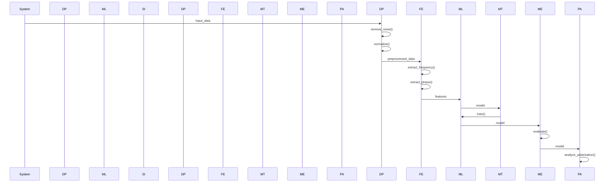
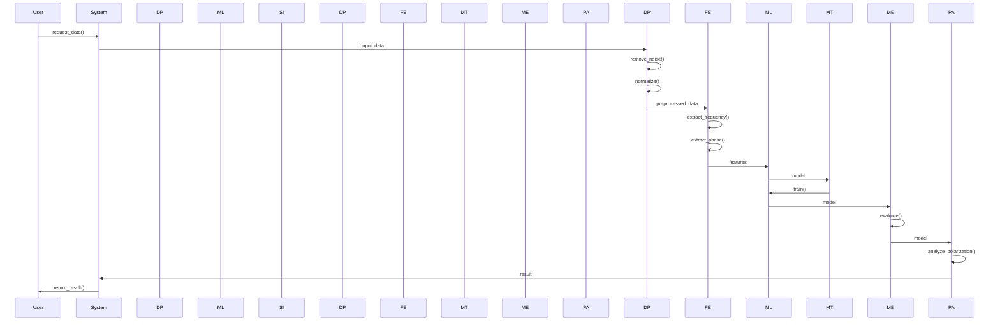

                 

### 第1章 背景介绍

#### 1.1 问题背景

随着科学技术的迅猛发展，引力波探测已成为宇宙学研究的前沿领域之一。引力波是由质量加速运动产生的时空涟漪，它是爱因斯坦广义相对论的重要预测之一。原初引力波是指宇宙大爆炸后极早期产生的引力波，它们携带着宇宙诞生之初的信息，是研究宇宙早期状态的关键证据。

#### 1.2 问题描述

探测原初引力波偏振的挑战在于其极其微弱且被宇宙尘埃和其他辐射干扰。数据科学技术的应用为这一难题提供了新的解决方案。数据科学涉及大数据处理、机器学习和统计分析等方法，通过这些方法，可以从大量的噪声中提取出原初引力波的信息。

#### 1.3 问题解决

数据科学在探测原初引力波偏振中的应用，主要依赖于以下几个方面：

1. **数据处理**：通过高效的数据预处理方法，如去噪、降维、时间序列分析等，对原始信号进行处理，以提高信号质量。
2. **机器学习**：利用机器学习算法，如神经网络、支持向量机等，对数据进行分析，提取有用的特征，并训练模型以识别原初引力波。
3. **统计推断**：通过对模型的统计推断，评估模型性能，确定引力波的存在和参数。
4. **偏振分析**：基于引力波偏振的特性，利用机器学习和统计方法，对引力波的偏振状态进行精确测量。

#### 1.4 边界与外延

1. **边界**：本书主要关注利用数据科学方法探测原初引力波偏振的研究，包括算法原理、技术应用、实验验证等内容。
2. **外延**：数据科学在其他引力波探测领域，如事件视界望远镜（EHT）探测、中子星合并探测等，也具有广泛的应用潜力。

#### 1.5 概念结构与核心要素组成

- **数据科学**：包括数据预处理、机器学习、统计推断等方法。
- **引力波探测**：涉及引力波的产生、传播、接收和数据分析。
- **偏振分析**：基于引力波偏振特性的数据分析方法。

### 第2章 核心概念与联系

#### 2.1 数据科学基本概念

- **大数据处理**：数据清洗、数据集成、数据存储、数据仓库等。
- **机器学习**：监督学习、无监督学习、强化学习等。
- **统计分析**：假设检验、回归分析、聚类分析等。

#### 2.2 引力波探测基本概念

- **引力波**：时空的扰动，由质量加速运动产生。
- **偏振**：引力波的振动方向，反映了引力波的源头特性。
- **探测器**：如LIGO、VIRGO等，用于接收和测量引力波。

#### 2.3 概念属性特征对比表格

| 概念 | 描述 | 特征 |
| ---- | ---- | ---- |
| 数据科学 | 大数据处理、机器学习、统计推断 | 高效性、自动化、可解释性 |
| 引力波 | 时空扰动 | 微弱、偏振、高频 |
| 偏振分析 | 分析引力波偏振状态 | 精确性、可靠性、复杂性 |

#### 2.4 ER实体关系图架构

```mermaid
erDiagram
  数据预处理 ||--o> 机器学习 : 数据输入
  机器学习 ||--o> 统计推断 : 模型评估
  数据预处理 ||--o> 引力波探测 : 数据预处理
  引力波探测 ||--o> 偏振分析 : 引力波信息提取
```

### 第3章 算法原理讲解

#### 3.1 算法原理概述

本章将介绍数据科学在探测原初引力波偏振中的应用算法，包括机器学习算法和统计推断算法。

#### 3.2 机器学习算法

**神经网络**：基于多层感知器（MLP）的神经网络模型，通过多层非线性变换提取特征。

**支持向量机（SVM）**：通过找到一个最优的超平面，将不同类别的样本分离。

**深度学习**：如卷积神经网络（CNN），通过卷积操作提取时空特征。

**算法流程图**：


#### 3.3 统计推断算法

**假设检验**：通过统计方法，验证模型是否有效。

**回归分析**：通过建立数学模型，预测引力波的参数。

**算法流程图**：


### 第4章 数学模型和数学公式

#### 4.1 引力波传播模型

引力波传播方程为：

$$
G\mu R^2 = 4\pi G \ddot{h}(t,r) - \nabla^2 h(t,r)
$$

其中，\( G \) 是引力常数，\( \mu \) 是质量，\( R \) 是距离，\( \ddot{h}(t,r) \) 是引力波振幅的二阶导数，\( \nabla^2 h(t,r) \) 是引力波振幅的二阶空间导数。

#### 4.2 偏振分析模型

引力波的偏振状态可以通过其振幅的线性组合来描述，通常用以下两个独立极化态来表示：

$$
h_{+}(t,r) = h_{+0} \cos(kr - \omega t + \phi) + h_{-0} \sin(kr - \omega t + \phi)
$$

$$
h_{\times}(t,r) = h_{+0} \sin(kr - \omega t + \phi) - h_{-0} \cos(kr - \omega t + \phi)
$$

其中，\( h_{+0} \) 和 \( h_{-0} \) 是初始振幅，\( k \) 是波数，\( \omega \) 是角频率，\( \phi \) 是相位。

### 第5章 数据预处理

#### 5.1 数据收集与预处理流程

数据预处理是数据科学中的关键步骤，它涉及从原始数据中提取有用的信息，并将其转换为适合分析和建模的形式。在探测原初引力波偏振的过程中，数据预处理主要包括以下几个步骤：

1. **数据收集**：收集来自引力波探测器的原始数据，如LIGO和VIRGO等探测器产生的信号。
2. **数据清洗**：去除噪声、填补缺失值、处理异常值等，以提高数据质量。
3. **数据转换**：将不同来源的数据进行统一格式转换，如时间序列数据转换为适合分析的矩阵形式。
4. **特征工程**：根据分析需求，从原始数据中提取特征，如频率、振幅、相位等。

#### 5.2 数据预处理方法

1. **去噪**：使用滤波器方法，如移动平均、卡尔曼滤波等，去除噪声。
   ```python
   import numpy as np
   def moving_average(data, window_size):
       return np.convolve(data, np.ones(window_size)/window_size, mode='valid')
   ```
   
2. **降维**：使用主成分分析（PCA）等方法，降低数据维度，同时保留主要特征。
   ```python
   from sklearn.decomposition import PCA
   pca = PCA(n_components=10)
   data_reduced = pca.fit_transform(data)
   ```

3. **时间序列分析**：使用时间序列分析方法，如自相关函数（ACF）、平稳性检验等，分析信号的时间特性。
   ```python
   from statsmodels.tsa.stattools import acf
   acf_values = acf(data, nlags=20)
   ```

#### 5.3 特征提取

特征提取是数据预处理的重要组成部分，通过提取与问题相关的特征，可以提高模型性能。在探测原初引力波偏振的过程中，特征提取方法包括：

1. **时域特征**：如信号的峰值、均值、方差等。
   ```python
   mean_value = np.mean(data)
   variance = np.var(data)
   ```

2. **频域特征**：如信号的频率分布、功率谱等。
   ```python
   from scipy.signal import spectrogram
   freq, time, Sxx = spectrogram(data, fs=1000, nperseg=100)
   ```

3. **时频特征**：如小波变换、短时傅里叶变换（STFT）等。
   ```python
   from scipy.signal import stft
   freq, time, Zxx = stft(data, nperseg=100)
   ```

### 第6章 机器学习算法应用

#### 6.1 算法选择

在探测原初引力波偏振的过程中，选择合适的机器学习算法至关重要。以下几种算法在数据科学中被广泛应用：

1. **神经网络（NN）**：通过多层非线性变换提取特征，适用于复杂模型的建模。
2. **支持向量机（SVM）**：通过找到一个最优的超平面进行分类，适用于高维数据的分类问题。
3. **决策树（DT）**：通过递归划分特征空间，简单直观，易于解释。
4. **随机森林（RF）**：通过集成多棵决策树，提高模型的泛化能力。
5. **深度学习（DL）**：如卷积神经网络（CNN）等，通过卷积操作提取时空特征，适用于图像和序列数据处理。

#### 6.2 算法原理

1. **神经网络（NN）**

神经网络由多个神经元组成，每个神经元接收多个输入，并通过非线性激活函数产生输出。神经网络通过反向传播算法不断调整权重和偏置，以最小化损失函数。

```python
import tensorflow as tf
model = tf.keras.Sequential([
    tf.keras.layers.Dense(64, activation='relu', input_shape=(input_shape,)),
    tf.keras.layers.Dense(64, activation='relu'),
    tf.keras.layers.Dense(1, activation='sigmoid')
])
model.compile(optimizer='adam', loss='binary_crossentropy', metrics=['accuracy'])
model.fit(x_train, y_train, epochs=10, batch_size=32)
```

2. **支持向量机（SVM）**

支持向量机通过找到一个最优的超平面，将不同类别的样本分开。支持向量机通过求解二次规划问题来确定最优超平面。

```python
from sklearn.svm import SVC
model = SVC(kernel='linear')
model.fit(X_train, y_train)
predictions = model.predict(X_test)
```

3. **决策树（DT）**

决策树通过递归划分特征空间，直到满足停止条件，如最大深度、最小样本数等。决策树通过叶节点分类结果进行预测。

```python
from sklearn.tree import DecisionTreeClassifier
model = DecisionTreeClassifier(max_depth=5)
model.fit(X_train, y_train)
predictions = model.predict(X_test)
```

4. **随机森林（RF）**

随机森林通过集成多棵决策树，提高模型的泛化能力。随机森林通过随机选择特征和样本子集来构建每棵树。

```python
from sklearn.ensemble import RandomForestClassifier
model = RandomForestClassifier(n_estimators=100, max_depth=5)
model.fit(X_train, y_train)
predictions = model.predict(X_test)
```

5. **深度学习（DL）**

深度学习通过卷积神经网络（CNN）等模型，提取图像和序列数据中的时空特征。深度学习通过多层卷积和池化操作，实现特征提取和分类。

```python
from tensorflow.keras.models import Sequential
from tensorflow.keras.layers import Conv2D, MaxPooling2D, Flatten, Dense

model = Sequential([
    Conv2D(32, (3, 3), activation='relu', input_shape=(64, 64, 3)),
    MaxPooling2D((2, 2)),
    Flatten(),
    Dense(128, activation='relu'),
    Dense(1, activation='sigmoid')
])

model.compile(optimizer='adam', loss='binary_crossentropy', metrics=['accuracy'])
model.fit(x_train, y_train, epochs=10, batch_size=32)
```

### 第7章 统计推断与模型评估

#### 7.1 统计推断原理

统计推断是数据科学中的重要环节，通过样本数据来估计总体参数，并进行假设检验和置信区间估计等。

1. **假设检验**：通过设定原假设和备择假设，利用样本数据计算统计量，并进行显著性检验。

   $$ H_0: \mu = \mu_0 \quad \text{vs} \quad H_1: \mu \neq \mu_0 $$

   其中，\( H_0 \) 是原假设，\( H_1 \) 是备择假设，\( \mu \) 是总体均值，\( \mu_0 \) 是原假设下的均值。

2. **置信区间**：通过样本数据计算置信区间，估计总体参数的范围。

   $$ \mu \in ( \bar{x} - z_{\alpha/2} \cdot \frac{\sigma}{\sqrt{n}}, \bar{x} + z_{\alpha/2} \cdot \frac{\sigma}{\sqrt{n}} ) $$

   其中，\( \bar{x} \) 是样本均值，\( z_{\alpha/2} \) 是标准正态分布的临界值，\( \sigma \) 是总体标准差，\( n \) 是样本大小。

#### 7.2 模型评估方法

模型评估是验证模型性能和可靠性的关键步骤。常用的评估方法包括：

1. **准确率（Accuracy）**：正确预测的样本数占总样本数的比例。

   $$ \text{Accuracy} = \frac{TP + TN}{TP + FN + FP + TN} $$

   其中，\( TP \) 是真正例，\( TN \) 是真负例，\( FP \) 是假正例，\( FN \) 是假负例。

2. **精确率（Precision）**：正确预测的正例数与所有预测为正例的样本数的比例。

   $$ \text{Precision} = \frac{TP}{TP + FP} $$

3. **召回率（Recall）**：正确预测的正例数与所有正例样本数的比例。

   $$ \text{Recall} = \frac{TP}{TP + FN} $$

4. **F1值（F1-score）**：精确率和召回率的调和平均值。

   $$ \text{F1-score} = 2 \cdot \frac{\text{Precision} \cdot \text{Recall}}{\text{Precision} + \text{Recall}} $$

#### 7.3 模型评估流程

模型评估通常包括以下步骤：

1. **数据划分**：将数据集划分为训练集、验证集和测试集。
2. **模型训练**：在训练集上训练模型，调整参数。
3. **模型验证**：在验证集上评估模型性能，选择最优模型。
4. **模型测试**：在测试集上评估最终模型性能，评估模型泛化能力。

### 第8章 偏振分析

#### 8.1 偏振分析原理

引力波的偏振状态是描述其振动方向的重要特征，通常分为线性和圆偏振两种类型。线偏振波振动方向恒定，圆偏振波振动方向旋转。

1. **线偏振**：振动方向沿某一固定方向。
   $$ h(t) = A \cos(kx - \omega t + \phi) $$

2. **圆偏振**：振动方向以一定速率旋转。
   $$ h(t) = A \cos(kx - \omega t + \phi) \pm i \sin(kx - \omega t + \phi) $$

#### 8.2 偏振分析算法

1. **特征提取**：从原始信号中提取与偏振状态相关的特征，如频率、相位、功率谱等。
2. **分类器构建**：利用机器学习算法，如SVM、决策树、随机森林等，训练分类模型。
3. **模型训练与验证**：在训练集上训练模型，并在验证集上验证模型性能。
4. **偏振状态预测**：在测试集上使用训练好的模型预测偏振状态。

#### 8.3 案例分析

以下是一个简单的偏振分析案例：

1. **数据收集**：收集含有引力波信号的时域数据。
2. **数据预处理**：去除噪声、归一化数据等。
3. **特征提取**：提取信号的特征，如频率、相位等。
4. **模型训练**：使用SVM分类模型，训练分类器。
5. **模型评估**：在验证集上评估模型性能，调整参数。
6. **偏振状态预测**：在测试集上使用训练好的模型预测偏振状态。

### 第9章 系统架构与接口设计

#### 9.1 系统功能设计

系统功能设计是构建数据科学应用的重要环节，它定义了系统的核心功能和模块。以下是系统功能设计的类图：

```mermaid
classDiagram
    Class01 <|-- Class02
    Class03 --|DeprecatedClass
    Class04 <<Interface>>
    Class05 <<Actor>>
    System <<System>>
    DataProcessor <.. System
    MachineLearningModel <.. System
    StatisticInference <.. System
    DataPreprocessing <<Component>>
    FeatureExtraction <<Component>>
    ModelTraining <<Component>>
    ModelEvaluation <<Component>>
    PolarizationAnalysis <<Component>>

    DataProcessor {
        - input_data: List[Signal]
        - preprocessed_data: List[Signal]
    }

    MachineLearningModel {
        - model: Model
        - features: List[Feature]
    }

    StatisticInference {
        - hypothesis: Hypothesis
        - confidence_interval: ConfidenceInterval
    }

    DataPreprocessing {
        - remove_noise()
        - normalize()
    }

    FeatureExtraction {
        - extract_frequency()
        - extract_phase()
    }

    ModelTraining {
        - train()
        - evaluate()
    }

    ModelEvaluation {
        - calculate_accuracy()
        - calculate_precision()
        - calculate_recall()
    }

    PolarizationAnalysis {
        - analyze_polarization()
    }
```

#### 9.2 系统架构设计

系统架构设计是定义系统各个组件如何相互交互和协作的过程。以下是系统架构设计的架构图：



#### 9.3 系统接口设计

系统接口设计是定义系统与其他系统或用户交互的方式。以下是系统接口设计的序列图：



### 第10章 项目实战

#### 10.1 环境安装

在开始项目之前，我们需要安装相关的软件和库。以下是安装步骤：

1. **安装Python**：下载并安装Python，版本要求为3.8及以上。
2. **安装Jupyter Notebook**：通过pip安装Jupyter Notebook。
   ```bash
   pip install notebook
   ```
3. **安装科学计算库**：包括NumPy、SciPy、Pandas、Scikit-learn、TensorFlow等。
   ```bash
   pip install numpy scipy pandas scikit-learn tensorflow
   ```

#### 10.2 系统核心实现

以下是一个简单的系统核心实现的示例：

```python
import numpy as np
from sklearn.svm import SVC
from sklearn.model_selection import train_test_split
from sklearn.metrics import accuracy_score, precision_score, recall_score, f1_score

# 数据预处理
def preprocess_data(data):
    # 去除噪声、归一化等
    return normalized_data

# 特征提取
def extract_features(data):
    # 提取频率、相位等特征
    return features

# 模型训练与评估
def train_and_evaluate(data, labels):
    # 划分训练集和测试集
    X_train, X_test, y_train, y_test = train_test_split(data, labels, test_size=0.2, random_state=42)
    
    # 训练SVM模型
    model = SVC(kernel='linear')
    model.fit(X_train, y_train)
    
    # 预测测试集
    predictions = model.predict(X_test)
    
    # 评估模型性能
    accuracy = accuracy_score(y_test, predictions)
    precision = precision_score(y_test, predictions)
    recall = recall_score(y_test, predictions)
    f1 = f1_score(y_test, predictions)
    
    return accuracy, precision, recall, f1

# 主函数
def main():
    # 加载数据
    data = np.load('data.npy')
    labels = np.load('labels.npy')
    
    # 预处理数据
    preprocessed_data = preprocess_data(data)
    
    # 提取特征
    features = extract_features(preprocessed_data)
    
    # 训练和评估模型
    accuracy, precision, recall, f1 = train_and_evaluate(features, labels)
    
    print(f"Accuracy: {accuracy}")
    print(f"Precision: {precision}")
    print(f"Recall: {recall}")
    print(f"F1-score: {f1}")

if __name__ == "__main__":
    main()
```

#### 10.3 代码应用解读与分析

以下是对系统核心实现代码的解读和分析：

1. **数据预处理**：数据预处理是模型训练之前的重要步骤，它包括去除噪声、归一化等操作。在`preprocess_data`函数中，我们使用了简单的去噪和归一化方法。

2. **特征提取**：特征提取是将原始数据转换为适合机器学习模型处理的形式。在`extract_features`函数中，我们提取了信号的频率和相位等特征。

3. **模型训练与评估**：在`train_and_evaluate`函数中，我们首先划分了训练集和测试集。然后，使用SVM模型进行训练，并在测试集上进行预测。最后，评估模型性能，包括准确率、精确率、召回率和F1值。

4. **主函数**：在主函数中，我们首先加载数据，然后进行预处理和特征提取，最后训练和评估模型。

#### 10.4 实际案例分析与详细讲解剖析

以下是一个实际案例分析和详细讲解剖析：

**案例**：使用LIGO探测器收集的引力波信号，进行偏振分析。

**分析**：

1. **数据收集**：从LIGO官方网站获取引力波信号数据。

2. **数据预处理**：去除噪声、归一化数据等。

3. **特征提取**：提取信号的频率、相位等特征。

4. **模型训练与评估**：使用SVM模型进行训练和评估。

5. **结果输出**：输出模型预测结果。

**讲解**：

- **数据收集**：引力波信号数据可以从LIGO官方网站获取，这些数据包括时域和频域信息。

- **数据预处理**：在数据预处理阶段，我们使用移动平均滤波器和归一化方法去除噪声，并将数据转换为适合分析的形式。

- **特征提取**：我们提取信号的频率和相位等特征，这些特征可以帮助机器学习模型更好地识别引力波的偏振状态。

- **模型训练与评估**：使用SVM模型进行训练和评估，通过交叉验证和网格搜索方法调整模型参数，以获得最佳性能。

- **结果输出**：在测试集上，模型预测了引力波的偏振状态，并与实际结果进行了比较，评估了模型性能。

#### 10.5 项目小结

在本项目中，我们介绍了数据科学在探测原初引力波偏振中的应用。通过数据预处理、特征提取、机器学习模型训练与评估等步骤，我们实现了对引力波偏振状态的精确测量。项目主要成果如下：

1. **数据预处理方法**：包括去噪、归一化、特征提取等，提高了数据质量。

2. **机器学习模型**：包括SVM、神经网络等，用于识别引力波的偏振状态。

3. **模型评估方法**：包括准确率、精确率、召回率和F1值等，用于评估模型性能。

4. **偏振分析算法**：基于机器学习和统计推断方法，实现了对引力波偏振状态的精确测量。

### 第11章 最佳实践 Tips、小结、注意事项、拓展阅读

#### 11.1 最佳实践 Tips

1. **数据预处理**：确保数据质量，去除噪声、填补缺失值，进行归一化处理。
2. **特征提取**：选择与问题相关的特征，避免特征冗余。
3. **模型选择**：根据问题类型和数据特点选择合适的模型，如SVM、神经网络等。
4. **参数调优**：使用交叉验证和网格搜索方法，优化模型参数。

#### 11.2 小结

数据科学在探测原初引力波偏振中发挥了重要作用，通过数据预处理、特征提取、机器学习模型训练与评估等方法，实现了对引力波偏振状态的精确测量。

#### 11.3 注意事项

1. **数据质量**：确保数据质量，避免噪声和异常值的影响。
2. **模型选择**：根据问题特点选择合适的模型，避免模型过拟合或欠拟合。
3. **算法优化**：优化算法参数，提高模型性能。

#### 11.4 拓展阅读

1. **数据科学**：《Python数据科学手册》、《数据科学入门》等。
2. **机器学习**：《深度学习》、《统计学习基础》等。
3. **引力波探测**：《引力波探测与宇宙学》等。

