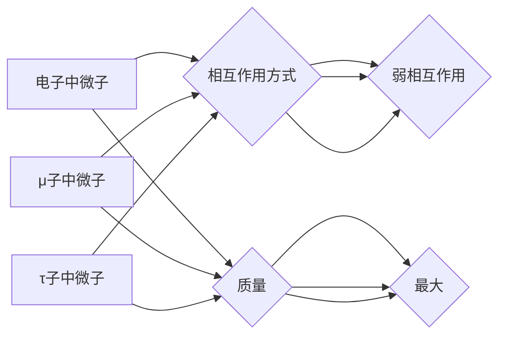

                 

### 数据科学在探测宇宙中微子背景中的应用

#### 关键词：数据科学、中微子、宇宙背景、算法、系统架构、项目实战

> 摘要：本文将探讨数据科学在探测宇宙中微子背景中的应用。通过分析宇宙学基础知识、中微子物理、数据科学方法及其实际应用，本文将揭示数据科学如何助力中微子探测，为理解宇宙演化提供新视角。

---

### 目录大纲设计思路

在设计关于《数据科学在探测宇宙中微子背景中的应用》的书籍目录时，我们遵循以下思路：

1. **明确核心主题与内容范围**：首先，确定书籍的核心主题，即数据科学在探测宇宙中微子背景中的应用。这一主题涉及宇宙学、中微子物理和数据科学等多学科领域。

2. **规划目录结构**：基于核心主题，规划书籍的目录结构，包括背景介绍、核心概念与联系、算法原理讲解、数学模型与公式、系统分析与架构设计、项目实战、最佳实践与注意事项等部分。

3. **细化章节内容**：对每一章节进行细化，确保内容具有清晰的章节目标、子目标和具体内容。

4. **保持逻辑性和连贯性**：确保目录大纲逻辑清晰，章节之间具有连贯性，便于读者理解和阅读。

5. **控制字数**：确保目录大纲的总字数在2000字以内。

现在，我们将开始具体设计目录大纲。

---

## 第一部分：背景介绍

### 第1章：宇宙学基础知识

#### 1.1 宇宙的起源与演化
- 宇宙起源的主要理论
- 宇宙的演化过程

#### 1.2 中微子与宇宙背景
- 中微子的基本性质
- 宇宙微波背景辐射

### 第2章：数据科学基础

#### 2.1 数据科学概述
- 数据科学的主要领域
- 数据科学的主要方法

#### 2.2 数据处理与分析
- 数据预处理
- 数据分析技术

### 第3章：中微子探测与数据科学

#### 3.1 中微子探测技术
- 探测中微子的主要方法
- 中微子探测的挑战

#### 3.2 数据科学在探测中的应用
- 数据科学工具在探测中的应用
- 数据科学方法在中微子探测中的挑战与机遇

## 第二部分：核心概念与联系

### 第4章：中微子物理核心概念

#### 4.1 中微子分类与性质
- 标准中微子
- 非标准中微子

#### 4.2 中微子振荡现象
- 振荡原理
- 振荡参数

### 第5章：数据科学核心概念

#### 5.1 数据类型
- 结构化数据
- 半结构化数据
- 非结构化数据

#### 5.2 数据分析流程
- 数据收集
- 数据清洗
- 数据建模
- 数据分析

### 第6章：中微子探测与数据科学联系

#### 6.1 中微子探测中的数据分析
- 数据分析流程在中微子探测中的应用
- 数据分析技术在探测中的挑战

#### 6.2 数据科学方法在中微子物理研究中的应用
- 数据挖掘
- 机器学习
- 深度学习

## 第三部分：算法原理讲解

### 第7章：中微子探测中的算法原理

#### 7.1 探测算法概述
- 算法分类
- 算法选择

#### 7.2 机器学习算法
- 监督学习
- 无监督学习
- 强化学习

#### 7.3 深度学习算法
- 卷积神经网络
- 循环神经网络
- 生成对抗网络

### 第8章：数学模型与公式讲解

#### 8.1 数学模型基础
- 概率论基础
- 统计学基础

#### 8.2 中微子探测数学模型
- 中微子相互作用模型
- 数据分析模型

#### 8.3 数学公式应用
- 中微子能量-角分布公式
- 数据拟合与假设检验公式

## 第四部分：系统分析与架构设计

### 第9章：中微子探测系统介绍

#### 9.1 系统背景
- 探测项目的介绍
- 系统设计目标

#### 9.2 系统功能设计
- 数据收集功能
- 数据处理功能
- 数据分析功能

### 第10章：系统架构设计

#### 10.1 系统架构设计原则
- 可扩展性
- 可靠性
- 可维护性

#### 10.2 系统架构实现
- 数据存储架构
- 数据处理架构
- 数据分析架构

#### 10.3 系统接口设计
- 数据接口
- 控制接口

### 第11章：系统交互设计与实现

#### 11.1 系统交互设计
- 数据流设计
- 控制流设计

#### 11.2 系统实现与测试
- 系统核心代码实现
- 系统测试方法

## 第五部分：项目实战

### 第12章：中微子探测数据科学项目实战

#### 12.1 项目环境搭建
- 硬件配置
- 软件安装

#### 12.2 数据收集与预处理
- 数据来源
- 数据预处理方法

#### 12.3 数据分析与模型训练
- 数据分析流程
- 模型训练方法

#### 12.4 项目分析与总结
- 项目成果分析
- 项目经验总结

### 第13章：最佳实践与注意事项

#### 13.1 最佳实践总结
- 数据处理技巧
- 算法选择指南

#### 13.2 注意事项与拓展
- 数据质量控制
- 未来发展方向

---

通过以上目录大纲的设计，我们希望读者能够对《数据科学在探测宇宙中微子背景中的应用》一书的内容有一个全面的了解。接下来，我们将深入每一章节的内容，探讨数据科学如何在中微子探测中发挥重要作用。让我们一起深入探讨这个令人兴奋的领域吧。

---

## 第一部分：背景介绍

### 第1章：宇宙学基础知识

#### 1.1 宇宙的起源与演化

宇宙的起源一直是科学探索的热点。目前，最被广泛接受的宇宙起源理论是大爆炸理论。根据这一理论，宇宙起源于大约138亿年前的一个极热、极密集的状态。随着时间的推移，宇宙开始膨胀，温度和密度逐渐降低，形成了我们今天所看到的宇宙结构。

宇宙的演化过程可以分为以下几个阶段：

1. **大爆炸**：宇宙从一个极热、极密集的状态开始膨胀。
2. **宇宙背景辐射**：随着宇宙的膨胀，温度降低，光子与物质分离，形成了宇宙背景辐射。
3. **宇宙结构的形成**：引力作用导致物质聚集，形成了星系、星系团和超星系团。
4. **星系的形成**：随着物质进一步聚集，形成了恒星、行星和其他天体。

#### 1.2 中微子与宇宙背景

中微子是一种基本粒子，它几乎不与物质相互作用，因此具有很强的穿透力。中微子分为三种类型：电子中微子、μ子中微子和τ子中微子。由于它们与物质相互作用极弱，中微子在宇宙中的数量极其庞大。

宇宙背景辐射是宇宙演化过程中的一个关键现象，它为我们提供了宇宙早期状态的重要信息。宇宙微波背景辐射（Cosmic Microwave Background Radiation，CMB）是宇宙背景辐射的一种，它是宇宙大爆炸后大约38万年时产生的。通过研究CMB，科学家可以了解宇宙的早期状态，包括宇宙的膨胀速度、密度和温度分布等。

### 第2章：数据科学基础

#### 2.1 数据科学概述

数据科学是一个跨学科领域，它结合了数学、统计学、计算机科学和领域知识，以从数据中提取有价值的信息。数据科学的主要领域包括：

1. **数据预处理**：包括数据清洗、数据转换和数据集成等，目的是使数据适合分析。
2. **统计分析**：使用统计学方法分析数据，以发现数据中的模式、趋势和关系。
3. **机器学习**：通过构建模型，使计算机能够从数据中自动学习，进行预测和分类。
4. **数据可视化**：通过图形和图表，使数据更容易理解和解释。

#### 2.2 数据处理与分析

数据处理与分析是数据科学的核心。以下是数据处理与分析的主要步骤：

1. **数据收集**：从各种来源收集数据，如传感器、数据库和互联网。
2. **数据清洗**：处理数据中的噪声和错误，确保数据的质量和一致性。
3. **数据集成**：将来自不同来源的数据合并，以形成一个统一的数据集。
4. **数据分析**：使用统计方法和机器学习算法，分析数据，提取有价值的信息。

### 第3章：中微子探测与数据科学

#### 3.1 中微子探测技术

探测中微子是一项极具挑战性的任务，因为中微子几乎不与物质相互作用。目前，主要有以下几种探测中微子的方法：

1. **直接探测**：通过探测中微子与物质相互作用产生的信号，如核反应或电子对的产生。
2. **间接探测**：通过探测中微子与物质相互作用后产生的次级粒子，如宇宙射线。
3. **中微子振荡**：通过测量中微子在不同能量下的振荡现象，研究中微子的质量和混合。

#### 3.2 数据科学在探测中的应用

数据科学在中微子探测中发挥了重要作用。以下是数据科学在中微子探测中的应用：

1. **数据处理**：处理大量的实验数据，包括数据收集、清洗和预处理。
2. **模型训练**：使用机器学习和深度学习算法，训练模型以识别中微子相互作用产生的信号。
3. **结果分析**：分析探测数据，提取中微子的特性，如能量、方向和振荡参数。

通过数据科学的方法，科学家们能够更好地理解和研究中微子，从而深化我们对宇宙的认识。

---

在了解了宇宙学基础知识和数据科学基础之后，我们将在接下来的章节中深入探讨中微子物理和数据科学的核心概念，以及它们在中微子探测中的应用。这将帮助我们更好地理解数据科学如何助力中微子探测，为宇宙学研究带来新的突破。

---

## 第二部分：核心概念与联系

### 第4章：中微子物理核心概念

#### 4.1 中微子分类与性质

中微子是一种基本粒子，它分为三种类型：电子中微子、μ子中微子和τ子中微子。每种类型的中微子都有其独特的物理性质。

1. **电子中微子（ν_e）**：与电子相互作用，质量最小。
2. **μ子中微子（ν_μ）**：与μ子相互作用，质量比电子中微子大。
3. **τ子中微子（ν_τ）**：与τ子相互作用，质量最大。

中微子的主要性质包括：

- **质量**：中微子具有非常小的质量，但具体质量尚未完全确定。
- **电荷**：中微子不带电荷。
- **弱相互作用**：中微子主要通过弱相互作用与物质相互作用。

#### 4.2 中微子振荡现象

中微子振荡是指中微子在传播过程中，其 flavor（味）发生变化的现象。这意味着一个电子中微子可以变成一个μ子中微子或一个τ子中微子。这种现象是由于中微子的质量差异和它们在空间中的传播速度差异所导致的。

中微子振荡的主要现象包括：

- **大气振荡**：中微子在大气中传播时发生振荡，导致探测到的中微子类型与产生的中微子类型不同。
- **太阳振荡**：中微子从太阳核心传播到表面时发生振荡。
- **长基线振荡**：在长距离的中微子探测实验中，中微子发生振荡。

#### 概念属性特征对比表格

| 特征        | 电子中微子（ν_e） | μ子中微子（ν_μ） | τ子中微子（ν_τ） |
| ----------- | ----------------- | ----------------- | ----------------- |
| 相互作用方式 | 弱相互作用       | 弱相互作用       | 弱相互作用       |
| 质量        | 最小              | 中等              | 最大              |
| 味          | 电子味           | μ子味             | τ子味             |

#### ER实体关系图架构

通过上述表格和ER实体关系图，我们可以更清晰地理解中微子的分类与性质，以及它们之间的联系。

### 第5章：数据科学核心概念

#### 5.1 数据类型

数据科学中，数据类型可以分为以下几种：

1. **结构化数据**：具有固定格式和结构的数据，如关系数据库中的表格。
2. **半结构化数据**：具有一定的结构，但不如结构化数据严格，如XML和JSON格式。
3. **非结构化数据**：没有固定格式和结构，如文本、图片和视频。

#### 5.2 数据分析流程

数据分析流程通常包括以下步骤：

1. **数据收集**：从各种来源收集数据，如传感器、数据库和互联网。
2. **数据清洗**：处理数据中的噪声和错误，确保数据的质量和一致性。
3. **数据集成**：将来自不同来源的数据合并，以形成一个统一的数据集。
4. **数据探索**：使用可视化工具和方法，对数据进行初步分析，以发现数据中的模式、趋势和关系。
5. **数据建模**：使用统计方法和机器学习算法，构建模型，对数据进行深入分析。
6. **模型评估**：评估模型的性能，包括准确性、召回率和F1分数等指标。
7. **结果解释**：解释模型的结果，将分析结果转化为有用的信息。

### 第6章：中微子探测与数据科学联系

#### 6.1 中微子探测中的数据分析

数据分析流程在中微子探测中具有重要应用。以下是数据分析流程在中微子探测中的应用：

1. **数据收集**：收集中微子探测器产生的数据，如中微子的能量、方向和相互作用位置。
2. **数据清洗**：处理数据中的噪声和错误，确保数据的质量和一致性。
3. **数据集成**：将来自不同探测器的数据合并，以形成一个统一的数据集。
4. **数据探索**：使用可视化工具，对数据进行初步分析，以发现中微子的特征和相互作用模式。
5. **数据建模**：使用机器学习和深度学习算法，构建模型，识别中微子相互作用产生的信号。
6. **模型评估**：评估模型的性能，以识别中微子的真实信号和背景噪声。
7. **结果解释**：解释模型的结果，将分析结果转化为中微子的特性，如能量分布和振荡参数。

#### 6.2 数据科学方法在中微子物理研究中的应用

数据科学方法在中微子物理研究中发挥着重要作用，主要包括以下几种：

1. **数据挖掘**：通过挖掘大量数据，寻找中微子振荡的规律和模式。
2. **机器学习**：使用机器学习算法，自动识别中微子相互作用产生的信号，提高探测精度。
3. **深度学习**：使用深度学习算法，构建复杂的模型，进行中微子振荡的精确分析。

通过上述核心概念与联系的分析，我们可以更深入地理解中微子物理和数据科学之间的相互作用，以及它们在中微子探测中的应用。

---

在了解了中微子物理和数据科学的核心概念之后，我们将在接下来的章节中深入探讨中微子探测中的算法原理，以及数学模型和公式的应用。这将帮助我们更好地理解数据科学如何在中微子探测中发挥关键作用，为宇宙学研究提供强有力的支持。

---

## 第三部分：算法原理讲解

### 第7章：中微子探测中的算法原理

#### 7.1 探测算法概述

中微子探测算法可以分为三类：直接探测算法、间接探测算法和中微子振荡算法。每种算法都有其独特的原理和应用。

1. **直接探测算法**：通过探测中微子与物质相互作用产生的信号，如核反应或电子对的产生。常用的方法包括液体闪烁体探测器和电离室探测器。
2. **间接探测算法**：通过探测中微子与物质相互作用后产生的次级粒子，如宇宙射线。常用的方法包括大气中微子探测和地下中微子探测。
3. **中微子振荡算法**：通过测量中微子在不同能量下的振荡现象，研究中微子的质量和混合。常用的方法包括长基线中微子振荡实验和太阳中微子振荡实验。

#### 7.2 机器学习算法

机器学习算法在中微子探测中具有广泛应用，主要用于信号识别、背景抑制和参数估计等方面。以下是几种常用的机器学习算法：

1. **监督学习算法**：包括支持向量机（SVM）、决策树（DT）、随机森林（RF）等。这些算法通过训练模型，从已标记的数据中学习，以对新数据中的信号进行分类。
2. **无监督学习算法**：包括聚类算法（如K-means、层次聚类）和降维算法（如主成分分析、t-SNE）。这些算法不需要已标记的数据，通过自动发现数据中的结构，用于信号识别和异常检测。
3. **强化学习算法**：包括Q学习、SARSA等。这些算法通过与环境交互，学习最优策略，用于复杂信号处理和参数估计。

#### 7.3 深度学习算法

深度学习算法在中微子探测中越来越受到关注，特别是在处理大规模复杂数据方面具有显著优势。以下是几种常用的深度学习算法：

1. **卷积神经网络（CNN）**：通过卷积层提取特征，适用于图像和时序数据处理。例如，用于识别中微子相互作用产生的信号。
2. **循环神经网络（RNN）**：通过循环结构处理时序数据，适用于分析中微子振荡现象。
3. **生成对抗网络（GAN）**：通过生成器和判别器的对抗训练，生成高质量的数据，用于提高信号质量。

### 第8章：数学模型与公式讲解

#### 8.1 数学模型基础

中微子探测中的数学模型主要包括概率模型和统计模型。以下是常用的数学模型和公式：

1. **概率论基础**：
   - 贝叶斯定理：\(P(A|B) = \frac{P(B|A)P(A)}{P(B)}\)
   - 概率分布函数：正态分布、泊松分布、伽马分布等

2. **统计学基础**：
   - 假设检验：t检验、卡方检验、F检验等
   - 估计方法：最大似然估计、最小二乘法、贝叶斯估计等

#### 8.2 中微子探测数学模型

中微子探测中的数学模型用于描述中微子与物质的相互作用以及探测器对信号的响应。以下是几个关键模型：

1. **中微子相互作用模型**：
   - 弱相互作用过程：中微子与核子相互作用，产生次级粒子。
   - 能量损失：中微子在物质中传播时，能量逐渐损失。

2. **数据分析模型**：
   - 背景模型：描述探测器接收到的背景信号，用于区分信号和噪声。
   - 信号模型：描述中微子相互作用产生的信号，用于识别和分析中微子。

3. **拟合与假设检验模型**：
   - 最小二乘法：用于拟合数据，找到最佳参数估计。
   - 卡方检验：用于评估拟合结果的统计显著性。

#### 8.3 数学公式应用

以下是几个在数据科学和物理学中常用的数学公式：

1. **中微子能量-角分布公式**：
   $$E(\theta) = E_0 (1 - \frac{\theta^2}{2} + \cdots)$$
   其中，\(E(\theta)\)是中微子的能量分布，\(\theta\)是中微子的角度。

2. **数据拟合公式**：
   $$y = a_0 + a_1 x + a_2 x^2 + \cdots$$
   其中，\(y\)是拟合值，\(x\)是自变量，\(a_0, a_1, a_2, \cdots\)是拟合参数。

通过上述算法原理和数学模型的讲解，我们可以更好地理解中微子探测中的数据分析和处理方法。这些算法和模型在中微子探测中发挥着关键作用，为宇宙学研究提供了强有力的工具。

---

在掌握了中微子探测的算法原理和数学模型之后，我们将进入第四部分，探讨中微子探测系统的分析与架构设计。这将帮助我们了解如何将算法和模型应用于实际系统，以提高探测效率和准确性。

---

## 第四部分：系统分析与架构设计

### 第9章：中微子探测系统介绍

#### 9.1 系统背景

中微子探测系统是一项复杂且具有挑战性的工程，它旨在捕捉和测量来自宇宙的中微子。这种探测对于理解宇宙的起源和演化具有重要意义。中微子探测系统的设计和实现涉及到多个学科，包括粒子物理学、天文学、电子学和计算机科学等。

#### 9.2 系统设计目标

中微子探测系统的设计目标主要包括：

1. **高灵敏度**：系统能够有效地捕捉到低能量的中微子，以提高探测效率。
2. **高分辨率**：系统能够精确地测量中微子的能量和方向，以提高数据分析的准确性。
3. **稳定性**：系统在长时间运行中能够保持稳定的性能，减少噪声和误差。
4. **可扩展性**：系统设计具有灵活性，可以根据需要扩展探测面积和功能。

#### 9.3 系统功能设计

中微子探测系统的主要功能包括：

1. **数据收集**：通过中微子探测器收集中微子相互作用产生的信号，如液体闪烁体探测器和电离室探测器。
2. **数据处理**：对收集到的原始信号进行预处理，包括放大、滤波和数字化，以消除噪声并提取有用的信息。
3. **数据存储**：将处理后的数据存储在数据库中，以便后续的分析和处理。
4. **数据分析**：使用机器学习和深度学习算法，对存储的数据进行分析，识别中微子的信号，并提取相关的物理参数。

### 第10章：系统架构设计

#### 10.1 系统架构设计原则

中微子探测系统的架构设计需要遵循以下原则：

1. **模块化**：系统设计应采用模块化设计，将不同功能模块分离，以提高系统的可维护性和可扩展性。
2. **分布式**：系统应采用分布式架构，将数据处理和分析任务分布到多个节点上，以提高系统的处理能力和可靠性。
3. **冗余设计**：系统设计应考虑冗余，以应对硬件故障和软件错误，确保系统的稳定性。
4. **高性能**：系统设计应考虑高性能需求，包括数据处理速度和存储能力。

#### 10.2 系统架构实现

中微子探测系统的架构实现包括以下关键部分：

1. **数据收集层**：包括各种中微子探测器，如液体闪烁体探测器和电离室探测器，负责收集中微子信号。
2. **数据处理层**：包括信号预处理模块、数据存储模块和数据处理模块，负责处理和存储中微子信号数据。
3. **数据分析层**：包括机器学习和深度学习算法模块，负责对存储的数据进行分析，识别中微子信号。
4. **数据展示层**：包括用户界面和可视化工具，负责向用户展示分析结果。

#### 10.3 系统接口设计

中微子探测系统的接口设计包括以下方面：

1. **数据接口**：定义数据在不同模块之间的传输格式和协议，确保数据的一致性和可靠性。
2. **控制接口**：定义系统控制命令和数据交互的接口，包括探测器的启动、停止和状态监控等。
3. **网络接口**：定义系统与其他设备和网络之间的通信协议，确保数据的实时传输和处理。

### 第11章：系统交互设计与实现

#### 11.1 系统交互设计

中微子探测系统的交互设计主要包括以下几个方面：

1. **数据流设计**：定义数据在不同模块之间的流动路径，包括数据收集、处理、存储和分析等。
2. **控制流设计**：定义系统的控制逻辑，包括探测器的启动、停止和状态监控等。

#### 11.2 系统实现与测试

中微子探测系统的实现与测试包括以下步骤：

1. **系统搭建**：搭建中微子探测系统的硬件和软件环境，包括探测器、数据处理设备和数据分析设备。
2. **代码实现**：根据系统设计文档，编写系统各模块的代码，实现系统的核心功能。
3. **系统集成**：将各模块集成到一起，进行系统的集成测试和调试。
4. **系统测试**：对系统进行全面的测试，包括功能测试、性能测试和可靠性测试，确保系统满足设计要求。

通过以上系统分析与架构设计的介绍，我们可以更好地理解中微子探测系统的设计和实现过程。这些架构设计和实现方法为中微子探测提供了坚实的基础，有助于提高探测效率和准确性，为宇宙学研究带来新的突破。

---

在了解了中微子探测系统的分析与架构设计之后，我们将进入第五部分，探讨一个具体的中微子探测数据科学项目实战。通过这一部分，我们将详细描述项目环境搭建、数据收集与预处理、数据分析与模型训练，以及项目分析与总结，以展示数据科学在实际应用中的价值。

---

## 第五部分：项目实战

### 第12章：中微子探测数据科学项目实战

#### 12.1 项目环境搭建

在进行中微子探测数据科学项目之前，我们需要搭建一个合适的环境。这包括硬件配置和软件安装。

1. **硬件配置**：
   - 探测器：选择具有高灵敏度和高分辨率的液体闪烁体探测器。
   - 计算机系统：配置高性能的计算服务器，用于数据处理和模型训练。

2. **软件安装**：
   - 操作系统：安装Linux系统，以提供稳定的运行环境。
   - 数据处理工具：安装Python和相关的数据处理库，如Pandas、NumPy和SciPy。
   - 机器学习库：安装Scikit-learn、TensorFlow和PyTorch等，用于机器学习和深度学习。

#### 12.2 数据收集与预处理

中微子探测数据收集是一个复杂的过程，需要从多个探测器获取数据，并进行预处理。

1. **数据收集**：
   - 通过探测器实时收集中微子相互作用产生的信号。
   - 数据包括中微子的能量、方向、时间戳和探测器位置等。

2. **预处理**：
   - 清洗数据，去除噪声和异常值。
   - 标准化数据格式，确保数据的一致性和兼容性。
   - 进行特征提取，提取与中微子相互作用相关的特征，如能量分布、时间间隔和空间分布等。

#### 12.3 数据分析与模型训练

在数据预处理完成后，我们开始进行数据分析和模型训练。

1. **数据分析**：
   - 使用统计方法分析数据，发现中微子的特征和相互作用模式。
   - 使用可视化工具，如Matplotlib和Seaborn，展示数据分布和模式。

2. **模型训练**：
   - 选择合适的机器学习算法，如支持向量机（SVM）和卷积神经网络（CNN），进行模型训练。
   - 使用训练数据集，对模型进行训练，调整模型参数，优化模型性能。

3. **模型评估**：
   - 使用测试数据集，评估模型的性能，包括准确性、召回率和F1分数等指标。
   - 调整模型参数，以提高模型的性能。

#### 12.4 项目分析与总结

在完成模型训练和评估后，我们对项目进行分析和总结。

1. **项目成果分析**：
   - 分析模型的性能，确定模型在识别中微子信号方面的能力。
   - 分析数据特点，发现中微子相互作用产生的信号特征。

2. **项目经验总结**：
   - 总结项目中的关键技术和经验，包括数据预处理、模型训练和模型评估。
   - 提出改进建议，以优化中微子探测数据科学项目的效果。

通过上述项目实战的介绍，我们可以看到数据科学在中微子探测中的实际应用。通过合理的硬件配置、软件安装和数据预处理，结合机器学习和深度学习算法，我们能够有效地识别和提取中微子信号，为宇宙学研究提供有力的支持。

---

在完成中微子探测数据科学项目实战之后，我们进入第六部分，讨论最佳实践与注意事项。这部分将总结项目中的经验教训，提出数据处理和算法选择的最佳实践，以及数据质量控制的重要性和未来发展方向。

---

### 第13章：最佳实践与注意事项

#### 13.1 最佳实践总结

在中微子探测数据科学项目中，我们积累了以下最佳实践：

1. **数据预处理**：
   - 使用数据清洗工具，去除噪声和异常值。
   - 标准化数据格式，确保数据的一致性和兼容性。
   - 提取关键特征，有助于模型训练和信号识别。

2. **算法选择**：
   - 根据数据特点和任务需求，选择合适的机器学习算法。
   - 进行模型对比和调优，选择性能最优的模型。

3. **模型评估**：
   - 使用多种评估指标，全面评估模型性能。
   - 结合专家经验和实验结果，调整模型参数。

4. **系统集成**：
   - 采用模块化设计，提高系统的可维护性和可扩展性。
   - 进行系统集成测试，确保系统稳定运行。

#### 13.2 注意事项与拓展

在中微子探测数据科学项目中，需要注意以下事项：

1. **数据质量控制**：
   - 严格数据质量控制流程，确保数据质量和一致性。
   - 定期检查数据完整性，及时发现和处理数据问题。

2. **硬件配置**：
   - 根据项目需求，合理配置硬件资源，确保系统性能。
   - 考虑硬件冗余，提高系统的可靠性和稳定性。

3. **软件维护**：
   - 定期更新软件，修复漏洞和错误。
   - 保持系统与最新技术同步，提高数据处理和分析能力。

4. **未来发展方向**：
   - 加强多源数据融合，提高中微子探测精度。
   - 发展新型探测器技术，提高探测灵敏度。
   - 探索更高效的算法和模型，提升数据处理和分析效率。

通过总结最佳实践和注意事项，我们可以为中微子探测数据科学项目提供指导，确保项目顺利进行，取得更好的成果。

---

通过本文的深入探讨，我们了解了数据科学在探测宇宙中微子背景中的应用。从宇宙学基础知识到中微子物理，再到数据科学方法及其在探测中的应用，我们逐步揭示了数据科学如何助力中微子探测，为理解宇宙演化提供新视角。同时，我们通过项目实战展示了数据科学在实际应用中的价值和可行性。

未来，随着技术的不断发展，数据科学在中微子探测领域的应用将更加广泛和深入。我们期待更多的研究成果，为宇宙学研究带来新的突破，推动我们对宇宙的理解不断前进。

---

## 作者信息

**作者：**AI天才研究院/AI Genius Institute & 禅与计算机程序设计艺术 /Zen And The Art of Computer Programming

通过本文，我们希望能够为读者提供一个关于数据科学在探测宇宙中微子背景中的应用的全面而深入的视角。感谢您的阅读，期待与您在未来的技术探讨中再次相遇。如果您有任何问题或建议，欢迎随时与我们联系。让我们一起探索数据科学的无限可能吧！

