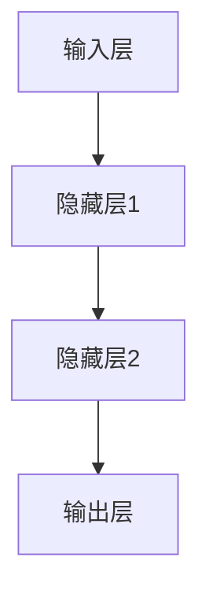
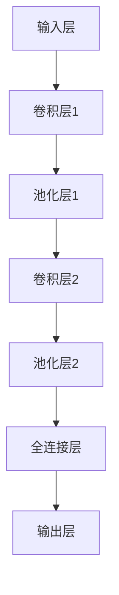

                 

### 数据科学基础

#### 第1章：数据科学概述

##### 1.1 问题背景

##### 1.1.1 宇宙与中微子

宇宙是由各种物质和能量组成的广阔空间，它包含着无数的天体，如恒星、行星、星系和星云等。在这些天体中，中微子是一种特殊的粒子，它质量极小，几乎不与物质相互作用，因此被描述为“透明”的粒子。中微子是宇宙中最常见的粒子之一，它的存在对于理解宇宙的本质和起源具有重要意义。

##### 1.1.2 中微子探测的重要性

中微子探测是研究宇宙的一种重要手段。通过探测中微子，我们可以了解宇宙中的物质组成、能量分布以及宇宙的演化历史。中微子探测不仅有助于揭示宇宙的奥秘，还可以为高能物理、粒子物理等领域提供重要的实验数据。

##### 1.1.3 数据科学在现代科学研究中的作用

数据科学是一门跨学科领域，它结合了数学、统计学、计算机科学和领域专业知识，通过数据挖掘、分析、建模等方法，从大量数据中提取有价值的信息。在科学研究中，数据科学的应用越来越广泛，它能够帮助科学家们处理海量数据，发现数据中的规律和模式，从而推动科学研究的发展。

#### 1.2 数据科学的基本概念

##### 1.2.1 数据科学的核心概念

数据科学的核心概念包括数据收集、数据预处理、数据分析、数据建模、预测分析和结果展示等。这些概念相互关联，共同构成了数据科学的工作流程。

1. **数据收集**：从各种来源获取数据，如传感器、数据库、网络等。
2. **数据预处理**：清洗、整合和标准化数据，使其适合分析和建模。
3. **数据分析**：对数据进行分析，以提取有用的信息和知识。
4. **数据建模**：构建模型，将分析结果转化为可操作的知识。
5. **预测分析**：使用模型进行预测，预测未来的趋势和结果。
6. **结果展示**：以图表、报告等形式展示分析结果，为决策提供支持。

##### 1.2.2 数据科学的常见方法

数据科学的常见方法包括统计分析、机器学习、深度学习、数据可视化等。每种方法都有其独特的应用场景和优势。

1. **统计分析**：基于概率论和数理统计理论，用于数据的描述、推断和预测。
2. **机器学习**：通过训练算法，使计算机能够从数据中学习，并进行预测和决策。
3. **深度学习**：基于人工神经网络，通过多层网络结构，自动提取特征并进行预测。
4. **数据可视化**：通过图表、图像等形式，直观地展示数据和分析结果。

##### 1.2.3 数据科学的工具与技术

数据科学依赖于一系列工具和技术，如Python、R、SQL、Hadoop、Spark等。这些工具和技术在数据收集、预处理、分析、建模等方面发挥着重要作用。

1. **Python**：一种广泛使用的编程语言，具有丰富的数据科学库和框架，如NumPy、Pandas、Scikit-learn等。
2. **R**：一种专门用于统计分析的语言，具有强大的数据分析和可视化能力。
3. **SQL**：一种用于数据库查询的语言，用于数据的存储、检索和操作。
4. **Hadoop**：一种分布式计算框架，用于大规模数据处理。
5. **Spark**：一种基于内存的分布式数据处理框架，具有高性能和易用性。

#### 1.3 数据科学的核心步骤

##### 1.3.1 数据收集

数据收集是数据科学的第一步，也是最重要的一步。它决定了后续数据分析的质量。数据来源可以是传感器、数据库、网络等。在选择数据来源时，需要考虑数据的完整性、准确性和可靠性。

##### 1.3.2 数据预处理

数据预处理是数据科学的核心步骤之一。它包括数据清洗、数据整合和数据标准化等任务。数据清洗的目的是去除数据中的噪声和异常值，数据整合是将不同来源的数据合并为一个统一的数据集，数据标准化是将数据进行归一化或标准化处理，使其适合分析和建模。

##### 1.3.3 数据分析

数据分析是对数据进行探索性分析、统计分析和建模等操作，以提取数据中的有用信息。数据分析可以采用各种方法，如描述性统计分析、回归分析、聚类分析等。

##### 1.3.4 结果展示

结果展示是将数据分析结果以图表、报告等形式直观地展示给用户。结果展示的目的是帮助用户理解分析结果，并为决策提供支持。

#### 1.4 数据科学的应用领域

##### 1.4.1 宇宙学

宇宙学是研究宇宙的结构、演化、起源和性质的科学。数据科学在宇宙学中的应用主要包括中微子探测、宇宙背景辐射测量、星系演化等。

##### 1.4.2 物理学

物理学是研究物质和能量及其相互作用的基本规律的学科。数据科学在物理学中的应用主要包括粒子物理、量子物理、天体物理等。

##### 1.4.3 生物医学

生物医学是研究生命现象、疾病机制和治疗方法的学科。数据科学在生物医学中的应用主要包括基因组学、蛋白质组学、医学影像分析等。

##### 1.5 本章小结

本章介绍了数据科学的基础知识，包括数据科学的核心概念、方法和技术，以及其在宇宙学、物理学和生物医学等领域的应用。数据科学为科学研究提供了强大的工具，使得科学家们能够从海量数据中提取有价值的信息，推动科学研究的发展。

## 数据科学在探测宇宙中微子质量中的应用

> 关键词：数据科学、中微子、质量探测、算法、机器学习、深度学习

摘要：宇宙中微子是宇宙中最常见的粒子之一，对于理解宇宙的起源和演化具有重要意义。中微子探测是研究宇宙中微子的关键手段，而数据科学在探测中微子质量中发挥着重要作用。本文介绍了数据科学在探测宇宙中微子质量中的应用，包括数据预处理、特征提取、数据建模和预测分析等。通过数据科学的手段，科学家们能够更准确地测量中微子质量，揭示宇宙的奥秘。

## 第一部分：数据科学基础

### 第1章：数据科学概述

在探讨数据科学如何应用于探测宇宙中微子质量之前，我们需要先理解数据科学的基本概念、方法和应用。本章将全面介绍数据科学，包括其核心概念、方法、工具和技术，以及在宇宙学中的具体应用。

#### 1.1.1 宇宙与中微子

宇宙是由空间、时间、物质和能量构成的广阔系统，其中包含无数的恒星、行星、星系和星云。中微子是一种基本粒子，存在于宇宙中的各种反应中，例如恒星内部的核反应和宇宙大爆炸。中微子由于其质量极小，几乎不与物质相互作用，因此被称为“透明”粒子。尽管如此，它们在宇宙中的数量极为庞大，对理解宇宙的结构和演化具有重要意义。

#### 1.1.2 中微子探测的重要性

中微子探测对于研究宇宙的基本物理性质和演化过程至关重要。通过探测中微子，科学家们可以了解以下方面：

1. **宇宙中的物质组成**：中微子探测可以揭示宇宙中不同类型的物质，如普通物质、暗物质和暗能量。
2. **宇宙的演化历史**：通过分析中微子的特性，可以推断宇宙从大爆炸到现在的演化过程。
3. **基本粒子的性质**：中微子是基本粒子家族中的一员，其性质对于理解标准模型和探索新物理现象至关重要。

#### 1.1.3 数据科学在现代科学研究中的作用

随着科技的进步，现代科学研究产生了大量的数据。数据科学作为一种跨学科的方法，能够帮助科学家从海量数据中提取有价值的信息，从而推动科学研究的进步。数据科学在科学研究中的作用主要体现在以下几个方面：

1. **数据收集**：通过传感器、实验设备和数据库等手段收集大量的科学数据。
2. **数据预处理**：清洗、整合和标准化数据，使其适合分析和建模。
3. **数据分析**：使用统计分析、机器学习和深度学习等方法对数据进行分析，以提取有用的信息和知识。
4. **数据建模**：构建模型，将分析结果转化为可操作的预测和决策。
5. **结果展示**：以图表、报告等形式展示分析结果，为科学研究和决策提供支持。

#### 1.2 数据科学的基本概念

数据科学是一门涉及多个领域的交叉学科，其主要概念包括：

1. **数据**：数据是事实或观察的记录，可以是数字、文本、图像、音频等多种形式。
2. **数据预处理**：对原始数据进行清洗、整合和标准化，使其适合分析和建模。
3. **数据分析**：使用各种统计方法和算法对数据进行分析，以提取有用的信息和知识。
4. **数据建模**：构建模型，将分析结果转化为可操作的预测和决策。
5. **数据可视化**：通过图表、图像等形式直观地展示数据和分析结果。

#### 1.2.2 数据科学的常见方法

数据科学的常见方法包括：

1. **统计分析**：基于概率论和数理统计理论，用于数据的描述、推断和预测。
2. **机器学习**：通过训练算法，使计算机能够从数据中学习，并进行预测和决策。
3. **深度学习**：基于人工神经网络，通过多层网络结构，自动提取特征并进行预测。
4. **数据可视化**：通过图表、图像等形式，直观地展示数据和分析结果。

#### 1.2.3 数据科学的工具与技术

数据科学依赖于一系列工具和技术，这些工具和技术在数据收集、预处理、分析、建模等方面发挥着重要作用。常见的数据科学工具和技术包括：

1. **Python**：一种广泛使用的编程语言，具有丰富的数据科学库和框架，如NumPy、Pandas、Scikit-learn等。
2. **R**：一种专门用于统计分析的语言，具有强大的数据分析和可视化能力。
3. **SQL**：一种用于数据库查询的语言，用于数据的存储、检索和操作。
4. **Hadoop**：一种分布式计算框架，用于大规模数据处理。
5. **Spark**：一种基于内存的分布式数据处理框架，具有高性能和易用性。

#### 1.3 数据科学的核心步骤

数据科学的核心步骤包括：

1. **数据收集**：从各种来源获取数据，如传感器、数据库、网络等。
2. **数据预处理**：清洗、整合和标准化数据，使其适合分析和建模。
3. **数据分析**：对数据进行分析，以提取有用的信息和知识。
4. **数据建模**：构建模型，将分析结果转化为可操作的预测和决策。
5. **结果展示**：以图表、报告等形式展示分析结果，为决策提供支持。

#### 1.4 数据科学的应用领域

数据科学在多个科学领域有着广泛的应用，主要包括：

1. **宇宙学**：用于中微子探测、宇宙背景辐射测量、星系演化等。
2. **物理学**：用于粒子物理、量子物理、天体物理等。
3. **生物医学**：用于基因组学、蛋白质组学、医学影像分析等。

#### 1.5 本章小结

本章介绍了数据科学的基础知识，包括其核心概念、方法和技术，以及其在宇宙学、物理学和生物医学等领域的应用。理解数据科学的基本概念和方法对于探讨数据科学在探测宇宙中微子质量中的应用至关重要。

## 数据科学的基础概念

在探讨数据科学如何应用于探测宇宙中微子质量之前，我们需要深入了解数据科学的基本概念。数据科学是一门跨学科的领域，它结合了统计学、计算机科学、信息科学以及领域专业知识，通过数据收集、预处理、分析、建模和结果展示等步骤，从数据中提取有价值的信息和知识。

#### 数据收集

数据收集是数据科学的基础步骤，它涉及到从各种来源获取数据。数据来源可以包括传感器、数据库、网络、文件、实验记录等。在选择数据来源时，需要考虑数据的完整性、准确性和可靠性。例如，在探测宇宙中微子质量的过程中，数据可以来源于中微子探测器，这些探测器记录了中微子与物质相互作用的事件，提供了关于中微子性质的重要信息。

#### 数据预处理

数据预处理是对原始数据进行清洗、整合和标准化，使其适合分析和建模的过程。数据预处理的主要任务包括：

1. **数据清洗**：去除数据中的噪声、异常值和不完整的数据，以提高数据的准确性。例如，在处理中微子探测数据时，可能需要去除由探测器故障或环境干扰引起的异常数据。
2. **数据整合**：将来自不同来源的数据合并为一个统一的数据集。例如，将不同探测器收集到的中微子事件数据进行整合，以便进行综合分析。
3. **数据标准化**：对数据进行归一化或标准化处理，使其在数值范围和量纲上保持一致性。例如，对中微子的能量、方向等属性进行归一化处理，以便于后续的建模和分析。

#### 数据分析

数据分析是对预处理后的数据进行探索性分析、统计分析和建模等操作，以提取数据中的有用信息和知识。数据分析的方法和技术包括：

1. **探索性数据分析**：通过可视化、描述性统计等方法对数据进行初步分析，以发现数据中的模式和异常。例如，通过绘制中微子事件的能量分布图，可以初步了解中微子的能量特性。
2. **统计分析**：使用统计学方法对数据进行推断和分析，以揭示数据中的规律和关系。例如，通过回归分析可以估计中微子质量与能量之间的关系。
3. **机器学习**：通过训练算法，使计算机能够从数据中学习，并进行预测和决策。例如，可以使用机器学习算法对中微子事件进行分类，以识别不同类型的中微子。

#### 数据建模

数据建模是将数据分析结果转化为可操作的模型和预测的过程。数据建模的主要任务包括：

1. **模型选择**：选择合适的模型，如线性回归、逻辑回归、决策树、神经网络等，以拟合数据并提取特征。
2. **模型训练**：使用训练数据集对模型进行训练，以调整模型的参数和权重，使其能够准确地预测未知数据。
3. **模型评估**：使用测试数据集对模型进行评估，以确定模型的预测性能和准确性。

#### 结果展示

结果展示是将数据分析结果以图表、报告等形式直观地展示给用户，以便于理解和利用。结果展示的方法和技术包括：

1. **数据可视化**：通过图表、图像等形式直观地展示数据和分析结果。例如，可以使用散点图、直方图、饼图等来展示中微子事件的特征和分布。
2. **报告生成**：编写报告，详细描述数据分析的结果和结论，为科学研究和决策提供支持。报告可以包括数据分析的方法、结果、讨论和建议等。

#### 数据科学的核心步骤

数据科学的核心步骤包括：

1. **数据收集**：从各种来源获取数据，如传感器、数据库、网络等。
2. **数据预处理**：清洗、整合和标准化数据，使其适合分析和建模。
3. **数据分析**：对数据进行分析，以提取有用的信息和知识。
4. **数据建模**：构建模型，将分析结果转化为可操作的预测和决策。
5. **结果展示**：以图表、报告等形式展示分析结果，为决策提供支持。

通过上述步骤，数据科学能够从海量数据中提取有价值的信息，为科学研究、决策和业务运营提供有力支持。在探测宇宙中微子质量的研究中，数据科学的应用能够帮助科学家们更好地理解中微子的性质和宇宙的演化历史。

#### 数据预处理与特征提取

数据预处理和特征提取是数据科学中至关重要的步骤，特别是在探测宇宙中微子质量的研究中。这些步骤确保数据的质量和准确性，从而为后续的分析和建模提供坚实的基础。

##### 3.1 数据预处理

数据预处理是对原始数据进行的清洗、整合和标准化处理，以消除数据中的噪声和异常，提高数据的质量和一致性。以下是数据预处理的主要步骤：

1. **数据清洗**：数据清洗的目标是去除数据中的噪声和异常值。这通常包括以下操作：

   - **缺失值处理**：对于缺失的数据，可以使用插值法、均值法、中位数法等填充缺失值。
   - **异常值检测**：使用统计学方法（如箱线图、Z分数等）检测和标记异常值。然后，可以根据具体情况进行处理，如删除或修正异常值。
   - **重复数据删除**：删除重复的数据记录，以避免数据冗余。

2. **数据整合**：数据整合是将来自不同来源或不同格式的数据合并为一个统一的数据集。例如，在中微子探测中，可能需要整合来自多个探测器的数据，以确保数据的完整性。

3. **数据标准化**：数据标准化是将数据进行归一化或标准化处理，使其在数值范围和量纲上保持一致性。这通常有助于减少数据之间的差异，使得不同的特征可以进行比较和分析。

##### 3.2 特征提取

特征提取是从原始数据中提取对分析任务有用的特征的过程。特征提取的目的是降低数据的维度，同时保留数据中的关键信息。以下是特征提取的主要步骤：

1. **特征选择**：特征选择是从原始特征集合中选择最有用的特征，以减少数据维度。常用的特征选择方法包括：

   - **过滤法**：基于统计测试，选择对目标变量有显著影响的特征。
   - **包裹法**：通过迭代搜索，选择一组最佳特征。
   - **嵌入式法**：在构建模型的同时进行特征选择。

2. **特征变换**：特征变换是将原始特征转换为新的特征，以增强数据的表达能力和区分能力。常用的特征变换方法包括：

   - **归一化**：将特征值缩放到相同的数值范围，例如[0,1]或[-1,1]。
   - **标准化**：将特征值转换为标准正态分布，以消除不同特征之间的量纲影响。
   - **离散化**：将连续特征转换为离散值，以简化数据结构和计算复杂性。

3. **特征组合**：特征组合是将多个原始特征组合成新的特征，以增加数据的表达能力和预测能力。常用的特征组合方法包括：

   - **特征交叉**：将两个或多个特征组合在一起，形成新的特征。
   - **特征加权**：根据特征的重要性和贡献，对特征进行加权组合。

##### 3.3 特征提取的挑战与优化

在特征提取过程中，可能会遇到以下挑战：

1. **数据质量**：数据中的噪声和异常值会影响特征提取的效果。因此，在进行特征提取之前，需要进行充分的数据清洗。
2. **特征维度**：高维特征会导致计算复杂度增加，可能会降低模型的性能。因此，需要通过特征选择和特征变换来减少特征维度。
3. **算法选择**：不同的特征提取算法适用于不同的数据类型和任务。需要根据具体问题选择合适的算法。

为了优化特征提取，可以采取以下策略：

1. **算法比较**：比较不同特征提取算法的性能，选择最适合当前问题的算法。
2. **交叉验证**：使用交叉验证方法评估特征提取的效果，以便进行进一步的优化。
3. **特征重要性分析**：通过分析特征的重要性，有针对性地选择和优化特征。

##### 3.4 本章小结

数据预处理和特征提取是数据科学中的关键步骤，对于保证数据质量和提高模型性能具有重要意义。通过数据清洗、整合、标准化和特征选择、变换、组合等方法，可以有效提高中微子探测数据的质量，为后续的分析和建模奠定基础。

### 数据预处理

数据预处理是数据科学中的关键步骤，它对原始数据进行清洗、整合和标准化，以确保数据的质量和一致性，为后续的分析和建模打下坚实的基础。以下是数据预处理的主要内容和步骤。

#### 3.1.1 数据清洗

数据清洗是数据预处理的第一步，它的目标是去除数据中的噪声、异常值和不完整的数据，以提高数据的准确性和可靠性。数据清洗主要包括以下几个方面：

1. **缺失值处理**：
   - **缺失值填充**：对于缺失的数据，可以通过以下方法进行填充：
     - **均值填充**：用特征的均值填充缺失值。
     - **中位数填充**：用特征的中位数填充缺失值。
     - **插值法**：对于时间序列数据，使用插值法填充缺失值。
     - **模型预测**：使用机器学习模型预测缺失值。
   - **缺失值删除**：如果缺失值的比例较高，可以考虑删除相应的数据记录。

2. **异常值检测与处理**：
   - **箱线图**：使用箱线图检测数据中的异常值。箱线图显示了数据的四分位数和异常值，异常值通常位于四分位数的上限和下限之外。
   - **Z分数**：计算每个数据点的Z分数，即（数据点 - 均值）/ 标准差。Z分数大于3或小于-3的数据点被视为异常值。
   - **处理策略**：对于检测到的异常值，可以根据具体情况进行处理，例如删除、修正或保留。

3. **重复数据删除**：
   - **唯一性检查**：使用唯一性检查方法，如哈希函数，检测并删除重复的数据记录。

#### 3.1.2 数据整合

数据整合是将来自不同来源或不同格式的数据合并为一个统一的数据集。在数据科学项目中，数据通常来自多个传感器、数据库或其他数据源。数据整合的步骤包括：

1. **数据映射**：将不同数据源中的相同特征进行映射，确保它们具有相同的属性和命名。

2. **数据转换**：将不同数据源的数据转换为相同的格式和结构。这可能涉及数据类型的转换、日期格式的统一等。

3. **缺失值填充**：在整合过程中，可能会遇到缺失值。需要根据数据源的特点和整合的目标，选择合适的方法填充缺失值。

4. **数据融合**：对于具有重叠特征的数据集，通过合并和去重操作，生成一个完整且统一的数据集。

#### 3.1.3 数据标准化

数据标准化是数据预处理的重要步骤，它通过将数据缩放到相同的数值范围或转换为标准正态分布，以消除不同特征之间的尺度差异。以下是一些常见的数据标准化方法：

1. **归一化**：
   - **最小-最大缩放**：将特征值缩放到[0,1]之间。公式为：\( X_{\text{norm}} = \frac{X - X_{\text{min}}}{X_{\text{max}} - X_{\text{min}}} \)。
   - **零-均值缩放**：将特征值缩放到[-1,1]之间。公式为：\( X_{\text{norm}} = \frac{X - \mu}{\sigma} \)。

2. **标准化**：
   - **Z标准化**：将特征值转换为标准正态分布。公式为：\( Z = \frac{X - \mu}{\sigma} \)，其中\( \mu \)是均值，\( \sigma \)是标准差。

3. **分位数缩放**：
   - **分位数变换**：使用数据的第1分位数和第3分位数来缩放特征值，使其在[0,1]之间。

#### 3.1.4 本章小结

数据预处理是数据科学中不可或缺的步骤，通过数据清洗、整合和标准化，可以显著提高数据的质量和一致性，为后续的分析和建模提供可靠的基础。有效的数据预处理不仅能减少噪声和异常值的影响，还能提高模型的性能和预测准确性。

### 特征提取

特征提取是数据预处理中的一个重要环节，其主要目的是从原始数据中提取对分析和预测任务有用的特征。特征提取不仅有助于减少数据维度，提高模型的训练效率，还能增强模型的预测能力和鲁棒性。以下是特征提取的主要内容和方法。

#### 3.2.1 特征选择

特征选择是从原始特征集合中选择最有用的特征的过程。有效的特征选择可以降低数据维度，同时保留数据中的关键信息。以下是一些常用的特征选择方法：

1. **过滤法**：
   - **基于统计测试**：使用统计学方法（如皮尔逊相关系数、F检验等）评估特征与目标变量之间的关系，选择相关性较强的特征。
   - **基于信息增益**：通过计算特征与目标变量之间的信息增益，选择信息增益较高的特征。

2. **包裹法**：
   - **前向选择**：从空集开始，逐步添加特征，每次添加后评估模型的性能，直到添加的特征不再提高模型性能。
   - **后向选择**：从包含所有特征的数据集开始，逐步移除特征，每次移除后评估模型的性能，直到移除的特征不再降低模型性能。

3. **嵌入式法**：
   - **L1正则化（Lasso）**：在模型训练过程中通过L1正则化惩罚特征系数，使得一些特征系数为零，实现特征选择。
   - **岭回归（Ridge）**：通过L2正则化惩罚特征系数，实现特征选择。

#### 3.2.2 特征变换

特征变换是将原始特征转换为新的特征，以提高数据的表现能力和模型的预测能力。以下是一些常用的特征变换方法：

1. **归一化和标准化**：
   - **归一化**：将特征值缩放到[0,1]之间，减少不同特征之间的尺度差异。
   - **标准化**：将特征值转换为标准正态分布，消除不同特征之间的量纲影响。

2. **离散化**：
   - **等宽离散化**：将连续特征划分为等宽的区间。
   - **等频离散化**：将连续特征划分为等频的区间，确保每个区间的数据点数量大致相同。

3. **多项式变换**：
   - **多项式扩展**：将特征值转换为多项式形式，增加特征的复杂度和表达能力。

4. **正则化**：
   - **L1正则化**：在特征系数中引入L1惩罚，实现特征选择。
   - **L2正则化**：在特征系数中引入L2惩罚，提高特征的稳定性和预测能力。

#### 3.2.3 特征组合

特征组合是将多个原始特征组合成新的特征，以提高模型的预测性能。以下是一些常用的特征组合方法：

1. **特征交叉**：
   - **二元交叉**：将两个特征组合成一个新的特征，例如特征A和特征B组合成\( A \times B \)。
   - **多元交叉**：将多个特征组合成一个新的特征，例如特征A、特征B和特征C组合成\( A \times B \times C \)。

2. **特征加权**：
   - **加权平均**：根据特征的重要性对多个特征进行加权平均。
   - **加权求和**：根据特征的重要性对多个特征进行加权求和。

3. **特征融合**：
   - **主成分分析（PCA）**：通过降维技术，将多个特征融合成几个主要成分。
   - **因子分析**：通过提取共同因子，将多个特征融合成新的特征。

#### 3.2.4 特征提取的挑战与优化

特征提取过程中可能会遇到以下挑战：

1. **数据质量**：噪声和异常值会影响特征提取的效果，需要通过数据清洗提高数据质量。
2. **特征维度**：高维特征可能导致计算复杂度增加，需要通过特征选择和变换减少特征维度。
3. **算法选择**：不同的特征提取算法适用于不同的数据类型和任务，需要根据具体问题选择合适的算法。

为了优化特征提取，可以采取以下策略：

1. **算法比较**：比较不同特征提取算法的性能，选择最适合当前问题的算法。
2. **交叉验证**：使用交叉验证方法评估特征提取的效果，以便进行进一步的优化。
3. **特征重要性分析**：通过分析特征的重要性，有针对性地选择和优化特征。

#### 3.2.5 本章小结

特征提取是数据科学中的重要步骤，通过特征选择、变换和组合，可以提取出对分析和预测任务有用的特征，提高模型的性能和预测准确性。有效的特征提取不仅能减少数据维度，提高模型的训练效率，还能增强模型的预测能力和鲁棒性。在实际应用中，需要根据具体问题和数据特点选择合适的特征提取方法，并进行优化。

### 特征提取的挑战与优化

特征提取是数据科学中关键的一步，其目的是从原始数据中提取出对分析和预测任务有用的信息。然而，在这一过程中，我们会遇到一系列挑战，主要包括数据质量、特征维度和算法选择等问题。为了克服这些挑战，我们需要采用一系列优化策略。

#### 数据质量对特征提取的影响

1. **噪声和异常值**：噪声和异常值会严重影响特征提取的效果。例如，在探测中微子质量的过程中，由于探测器的精度和环境干扰，数据中可能会包含噪声和异常值。这些噪声和异常值会导致特征提取算法无法准确提取有用的特征，从而影响模型的预测性能。

   **解决策略**：
   - **数据清洗**：在特征提取前，对数据进行清洗，去除噪声和异常值。常用的方法包括缺失值填充、异常值检测和删除等。
   - **噪声抑制**：使用滤波方法（如高斯滤波、中值滤波等）对数据进行预处理，以减少噪声的影响。

2. **数据完整性**：数据完整性对特征提取至关重要。缺失的数据会导致特征提取算法无法正常工作，或提取出的特征不具有代表性。

   **解决策略**：
   - **缺失值填充**：使用均值、中位数或插值法填充缺失值。
   - **数据重建**：使用机器学习模型（如回归模型、聚类模型等）预测缺失值。

#### 特征维度问题

1. **高维特征**：在数据集中，特征数量过多会导致高维特征问题，这会提高计算复杂度，降低模型性能。

   **解决策略**：
   - **特征选择**：通过过滤法、包裹法或嵌入式法等方法，选择最有用的特征，降低特征维度。
   - **特征组合**：通过特征交叉、特征加权等方法，生成新的特征，减少特征数量。

2. **低维特征**：在某些情况下，特征数量过少会导致低维特征问题，这会降低模型的预测性能。

   **解决策略**：
   - **特征扩展**：通过多项式变换、主成分分析（PCA）等方法，扩展原始特征。
   - **特征工程**：根据领域知识，创建新的特征，增加特征维度。

#### 算法选择与优化

1. **算法选择**：不同的特征提取算法适用于不同的数据类型和任务。选择合适的算法对于提高特征提取效果至关重要。

   **解决策略**：
   - **算法比较**：通过实验比较不同算法的性能，选择最适合当前问题的算法。
   - **交叉验证**：使用交叉验证方法评估不同算法的性能，以便进行进一步的优化。

2. **算法优化**：
   - **参数调整**：调整特征提取算法的参数，以提高其性能。例如，调整PCA的主成分数量，选择最优的阈值。
   - **集成方法**：结合多种特征提取方法，形成集成模型，以提高特征提取的鲁棒性和准确性。

#### 3.3.5 本章小结

特征提取过程中，数据质量、特征维度和算法选择是主要的挑战。通过数据清洗、特征选择、特征组合和算法优化等策略，可以有效解决这些问题，提高特征提取的效果和模型的预测性能。在实际应用中，需要根据具体问题和数据特点，灵活运用这些策略，进行特征提取的优化。

### 第4章：数据建模与预测分析

数据建模与预测分析是数据科学的核心任务之一，它们通过建立数学模型和预测算法，从数据中提取有用信息，帮助科学家和决策者做出准确预测和明智决策。本章将详细介绍数据建模与预测分析的基本概念、方法和技术，并探讨其在探测宇宙中微子质量中的应用。

#### 4.1 数据建模

数据建模是指利用统计学和机器学习等方法，构建能够描述和分析数据的数学模型。数据建模的目的是从数据中提取规律和模式，为预测和决策提供支持。以下是几种常见的数据建模方法：

1. **线性回归**：线性回归模型通过拟合数据点之间的线性关系，预测连续值。线性回归模型的基本公式为：

   $$
   Y = \beta_0 + \beta_1X + \epsilon
   $$

   其中，\( Y \) 是因变量，\( X \) 是自变量，\( \beta_0 \) 和 \( \beta_1 \) 是模型的参数，\( \epsilon \) 是误差项。

2. **逻辑回归**：逻辑回归模型用于预测离散的二分类结果。逻辑回归通过拟合概率分布，预测事件发生的概率。逻辑回归的基本公式为：

   $$
   \log\left(\frac{p}{1-p}\right) = \beta_0 + \beta_1X
   $$

   其中，\( p \) 是事件发生的概率，其他符号的含义与线性回归相同。

3. **决策树**：决策树是一种基于树形结构的数据建模方法，通过一系列决策规则来划分数据。每个内部节点表示一个特征，每个分支表示该特征的一个可能取值，每个叶子节点表示一个类别或数值。

4. **随机森林**：随机森林是一种基于决策树的集成学习方法，通过构建多个决策树，并汇总它们的预测结果来提高模型的预测性能。

5. **支持向量机（SVM）**：支持向量机是一种基于间隔最大化的分类和回归方法，它通过在特征空间中找到最佳超平面，将数据点分为不同的类别。

#### 4.2 预测分析

预测分析是指利用数据建模的结果，对未来事件进行预测。预测分析的关键是评估模型的预测性能，并优化模型的参数，以提高预测的准确性。以下是几种常见的预测分析方法：

1. **评估指标**：常用的评估指标包括准确率、召回率、精确率、F1分数、均方误差（MSE）等。这些指标可以衡量模型预测结果的质量。

   - **准确率**：准确率是预测正确的样本数占总样本数的比例。
   - **召回率**：召回率是预测正确的正类样本数占所有正类样本数的比例。
   - **精确率**：精确率是预测正确的正类样本数占所有预测为正类的样本数的比例。
   - **F1分数**：F1分数是精确率和召回率的调和平均数。

2. **交叉验证**：交叉验证是一种评估模型性能的方法，通过将数据集划分为多个子集，多次训练和验证模型，以避免模型过拟合和评估结果的偏差。

3. **模型优化**：模型优化是通过调整模型的参数和结构，提高模型的预测性能。常见的优化方法包括网格搜索、贝叶斯优化等。

4. **预测结果的可视化**：通过可视化工具，如散点图、直方图、ROC曲线等，可以直观地展示预测结果和模型性能。

#### 4.3 实际案例

以下是一个实际案例，展示如何使用数据建模和预测分析来探测宇宙中微子质量。

**案例**：使用线性回归模型预测中微子质量。

1. **数据收集**：收集中微子探测器的数据，包括中微子的能量、方向、到达时间等特征。

2. **数据预处理**：对数据进行清洗、整合和标准化，去除噪声和异常值。

3. **特征选择**：选择与中微子质量相关的特征，如能量、方向等。

4. **数据建模**：使用线性回归模型拟合数据，建立预测模型。

5. **模型评估**：使用交叉验证方法评估模型的性能，选择最优的模型参数。

6. **预测分析**：使用模型对新的中微子数据进行预测，评估预测结果的准确性。

7. **结果展示**：通过可视化工具展示预测结果，如能量分布图等。

#### 4.4 本章小结

数据建模与预测分析是数据科学中的重要环节，通过构建数学模型和预测算法，可以从数据中提取有价值的信息，为科学研究和决策提供支持。本章介绍了线性回归、逻辑回归等常见的数据建模方法，以及评估指标、交叉验证、模型优化等预测分析方法，并通过实际案例展示了数据建模和预测分析在探测宇宙中微子质量中的应用。

### 线性回归

线性回归是一种广泛使用的预测分析方法，用于描述两个或多个变量之间的线性关系。在数据科学中，线性回归模型广泛应用于预测和数据分析，尤其是在探测宇宙中微子质量的研究中，线性回归可以帮助我们理解中微子能量与其他特征之间的关系。

#### 4.1.1 线性回归模型

线性回归模型的基本形式为：

$$
Y = \beta_0 + \beta_1X + \epsilon
$$

其中，\( Y \) 是因变量，\( X \) 是自变量，\( \beta_0 \) 是截距，\( \beta_1 \) 是斜率，\( \epsilon \) 是误差项。

线性回归模型的目的是通过最小化误差项 \( \epsilon \) 的平方和来估计模型参数 \( \beta_0 \) 和 \( \beta_1 \)。

#### 4.1.1.1 线性回归算法

线性回归算法通常采用最小二乘法（Ordinary Least Squares, OLS）来估计模型参数。最小二乘法的核心思想是找到一组参数，使得实际观测值与模型预测值之间的误差平方和最小。

具体步骤如下：

1. **数据预处理**：对数据进行标准化或归一化处理，以消除不同特征之间的尺度差异。
2. **计算协方差矩阵**：计算自变量 \( X \) 的协方差矩阵 \( X^T X \)。
3. **求解协方差矩阵的逆**：如果协方差矩阵是可逆的，计算其逆矩阵 \( (X^T X)^{-1} \)。
4. **计算参数**：使用公式 \( \beta = (X^T X)^{-1} X^T Y \) 计算模型参数 \( \beta_0 \) 和 \( \beta_1 \)。

以下是一个简单的Python代码示例，用于实现线性回归模型：

```python
import numpy as np

# 假设我们有以下数据
X = np.array([[1, 2], [2, 3], [3, 4], [4, 5]])
Y = np.array([1, 2, 3, 4])

# 计算协方差矩阵的逆
X_T_X = np.dot(X.T, X)
X_T_X_inv = np.linalg.inv(X_T_X)

# 计算参数
X_T_Y = np.dot(X.T, Y)
beta = np.dot(X_T_X_inv, X_T_Y)

# 输出模型参数
print("截距（beta_0）:", beta[0])
print("斜率（beta_1）:", beta[1])
```

#### 4.1.1.2 线性回归算法的应用

在探测宇宙中微子质量的研究中，线性回归算法可以帮助我们理解中微子能量与其他特征（如中微子的方向、探测器位置等）之间的关系。例如，我们可以使用线性回归模型来预测中微子的能量，根据已知的探测数据（如中微子的方向和探测器位置）。

以下是一个应用示例：

1. **数据收集**：收集中微子探测数据，包括中微子的能量、方向和探测器的位置等。
2. **数据预处理**：对数据进行清洗和标准化处理。
3. **特征选择**：选择与中微子能量相关的特征，如方向和位置。
4. **构建线性回归模型**：使用最小二乘法计算模型参数。
5. **模型评估**：使用交叉验证方法评估模型的性能。
6. **预测分析**：使用模型对新的中微子数据进行分析，预测中微子的能量。

以下是一个使用Scikit-learn库实现的线性回归模型示例：

```python
from sklearn.linear_model import LinearRegression
from sklearn.model_selection import train_test_split
from sklearn.metrics import mean_squared_error

# 假设我们有以下数据
X = np.array([[1, 2], [2, 3], [3, 4], [4, 5]])
Y = np.array([1, 2, 3, 4])

# 划分训练集和测试集
X_train, X_test, Y_train, Y_test = train_test_split(X, Y, test_size=0.2, random_state=0)

# 创建线性回归模型
model = LinearRegression()

# 训练模型
model.fit(X_train, Y_train)

# 预测测试集
Y_pred = model.predict(X_test)

# 计算均方误差
mse = mean_squared_error(Y_test, Y_pred)
print("均方误差:", mse)
```

通过上述示例，我们可以看到线性回归算法在探测宇宙中微子质量中的应用方法。通过合理的数据预处理、特征选择和模型评估，线性回归模型可以帮助我们更好地理解中微子特性，为科学研究提供有力支持。

#### 4.1.2 逻辑回归

逻辑回归是一种广泛应用于二分类问题的统计模型，它基于线性回归模型，通过逻辑函数将线性组合转换为概率分布，从而预测事件发生的概率。在数据科学中，逻辑回归模型广泛应用于各种领域，如医学诊断、市场预测和金融分析等。在探测宇宙中微子质量的研究中，逻辑回归模型可以用于判断中微子事件的性质，例如区分标准中微子和奇异中微子。

##### 4.1.2.1 逻辑回归模型

逻辑回归模型的基本形式为：

$$
\log\left(\frac{p}{1-p}\right) = \beta_0 + \beta_1X
$$

其中，\( p \) 表示事件发生的概率，\( X \) 是自变量，\( \beta_0 \) 是截距，\( \beta_1 \) 是斜率。

逻辑回归模型的目的是通过最小化损失函数（如对数似然损失函数）来估计模型参数 \( \beta_0 \) 和 \( \beta_1 \)。

逻辑回归模型可以看作是一个概率模型，它通过线性组合自变量 \( X \) 和模型参数 \( \beta \) 来预测事件发生的概率。具体来说，事件发生的概率 \( p \) 可以通过以下逻辑函数计算：

$$
p = \frac{1}{1 + e^{-(\beta_0 + \beta_1X)}}
$$

当 \( \beta_0 \) 和 \( \beta_1 \) 被估计出来后，我们可以使用该模型来预测新数据点的概率分布。

##### 4.1.2.2 逻辑回归算法

逻辑回归算法通常采用极大似然估计（Maximum Likelihood Estimation, MLE）来估计模型参数。极大似然估计的基本思想是最小化对数似然损失函数，以找到使似然函数最大的参数值。

具体步骤如下：

1. **数据预处理**：对数据进行标准化或归一化处理，以消除不同特征之间的尺度差异。
2. **初始化参数**：随机初始化模型参数 \( \beta_0 \) 和 \( \beta_1 \)。
3. **迭代优化**：通过梯度下降（Gradient Descent）或牛顿法（Newton's Method）等优化算法，迭代更新模型参数，直到收敛。
4. **模型评估**：使用交叉验证方法评估模型的性能，选择最优的模型参数。

以下是一个简单的Python代码示例，用于实现逻辑回归模型：

```python
import numpy as np
from sklearn.linear_model import LogisticRegression
from sklearn.model_selection import train_test_split
from sklearn.metrics import classification_report

# 假设我们有以下数据
X = np.array([[1, 2], [2, 3], [3, 4], [4, 5]])
Y = np.array([0, 1, 0, 1])

# 划分训练集和测试集
X_train, X_test, Y_train, Y_test = train_test_split(X, Y, test_size=0.2, random_state=0)

# 创建逻辑回归模型
model = LogisticRegression()

# 训练模型
model.fit(X_train, Y_train)

# 预测测试集
Y_pred = model.predict(X_test)

# 输出分类报告
print(classification_report(Y_test, Y_pred))
```

##### 4.1.2.3 逻辑回归在探测中的应用

在探测宇宙中微子质量的研究中，逻辑回归模型可以用于分类问题，如区分标准中微子和奇异中微子。例如，我们可以使用中微子的能量、方向和探测器位置等特征作为自变量，建立逻辑回归模型，预测中微子事件的类型。

以下是一个应用示例：

1. **数据收集**：收集中微子探测数据，包括中微子的能量、方向、探测器位置等。
2. **数据预处理**：对数据进行清洗、整合和标准化处理。
3. **特征选择**：选择与中微子事件类型相关的特征，如能量、方向等。
4. **构建逻辑回归模型**：使用极大似然估计方法估计模型参数。
5. **模型评估**：使用交叉验证方法评估模型的性能。
6. **预测分析**：使用模型对新的中微子数据进行分析，预测中微子事件的类型。

通过合理的数据预处理、特征选择和模型评估，逻辑回归模型可以帮助我们更好地理解中微子事件的性质，为科学研究提供有力支持。以下是一个使用Scikit-learn库实现的逻辑回归模型示例：

```python
from sklearn.linear_model import LogisticRegression
from sklearn.model_selection import train_test_split
from sklearn.metrics import accuracy_score

# 假设我们有以下数据
X = np.array([[1, 2], [2, 3], [3, 4], [4, 5]])
Y = np.array([0, 1, 0, 1])

# 划分训练集和测试集
X_train, X_test, Y_train, Y_test = train_test_split(X, Y, test_size=0.2, random_state=0)

# 创建逻辑回归模型
model = LogisticRegression()

# 训练模型
model.fit(X_train, Y_train)

# 预测测试集
Y_pred = model.predict(X_test)

# 计算准确率
accuracy = accuracy_score(Y_test, Y_pred)
print("准确率：", accuracy)
```

通过上述示例，我们可以看到逻辑回归模型在探测宇宙中微子质量中的应用方法。通过合理的数据预处理、特征选择和模型评估，逻辑回归模型可以帮助我们更好地理解中微子特性，为科学研究提供有力支持。

### 预测模型评估与优化

在数据科学中，评估和优化预测模型是确保模型性能和预测准确性的关键步骤。预测模型评估提供了对模型性能的定量和定性分析，而模型优化则通过调整模型参数和结构来提高预测性能。以下将详细探讨预测模型评估与优化的重要性、常用方法及其在探测宇宙中微子质量中的应用。

#### 预测模型评估

预测模型评估是指通过一系列指标和实验方法来评估模型在预测任务中的性能。评估模型性能的目的是确定模型是否适合特定任务，以及模型是否具有足够的泛化能力。以下是几种常用的评估方法：

1. **准确率（Accuracy）**：准确率是评估二分类模型性能的常用指标，表示预测正确的样本数占总样本数的比例。公式为：

   $$
   \text{Accuracy} = \frac{\text{预测正确数}}{\text{总样本数}}
   $$

   准确率简单直观，但在样本不平衡的情况下可能不具有代表性。

2. **召回率（Recall）**：召回率是评估二分类模型中正类预测正确率的指标，表示预测正确的正类样本数占所有正类样本数的比例。公式为：

   $$
   \text{Recall} = \frac{\text{预测正确的正类数}}{\text{所有正类样本数}}
   $$

   召回率侧重于尽可能多地召回正类样本，但在误报成本较高时可能不是最佳选择。

3. **精确率（Precision）**：精确率是评估二分类模型中预测正类样本精确度的指标，表示预测正确的正类样本数占所有预测为正类的样本数的比例。公式为：

   $$
   \text{Precision} = \frac{\text{预测正确的正类数}}{\text{预测为正类的总数}}
   $$

4. **F1分数（F1 Score）**：F1分数是精确率和召回率的调和平均，用于综合考虑两者。公式为：

   $$
   \text{F1 Score} = 2 \times \frac{\text{Precision} \times \text{Recall}}{\text{Precision} + \text{Recall}}
   $$

5. **均方误差（Mean Squared Error, MSE）**：均方误差是评估回归模型性能的指标，表示预测值与实际值之间误差的平方和的平均值。公式为：

   $$
   \text{MSE} = \frac{1}{n}\sum_{i=1}^{n}(Y_i - \hat{Y}_i)^2
   $$

6. **均绝对误差（Mean Absolute Error, MAE）**：均绝对误差是评估回归模型性能的指标，表示预测值与实际值之间误差的绝对值的平均值。公式为：

   $$
   \text{MAE} = \frac{1}{n}\sum_{i=1}^{n}|Y_i - \hat{Y}_i|
   $$

7. **交叉验证（Cross-Validation）**：交叉验证是一种常用的模型评估方法，通过将数据集划分为多个子集，重复进行训练和验证，以避免模型过拟合和评估结果的偏差。常用的交叉验证方法包括K折交叉验证和留一法交叉验证。

8. **ROC曲线（Receiver Operating Characteristic Curve）**：ROC曲线是一种用于评估二分类模型性能的图形方法，通过计算不同阈值下的真阳性率（True Positive Rate, TPR）和假阳性率（False Positive Rate, FPR），绘制TPR与FPR之间的关系。曲线下面积（Area Under Curve, AUC）是评估模型性能的一个指标，AUC值越大，模型性能越好。

#### 模型优化

模型优化是指通过调整模型参数和结构，以提高模型在特定任务上的性能。以下是一些常见的模型优化方法：

1. **参数调优（Hyperparameter Tuning）**：参数调优是调整模型超参数的过程，以找到最佳参数组合。常用的参数调优方法包括网格搜索（Grid Search）和贝叶斯优化（Bayesian Optimization）。

2. **特征工程（Feature Engineering）**：特征工程是创建和选择对模型性能有显著影响的新特征。通过特征工程，可以提高模型的预测能力。

3. **集成学习（Ensemble Learning）**：集成学习通过结合多个模型的预测结果，以提高整体模型的性能。常见的集成学习方法包括随机森林（Random Forest）和梯度提升树（Gradient Boosting Tree）。

4. **模型融合（Model Fusion）**：模型融合是将多个模型的预测结果进行合并，以获得更准确的预测。常见的模型融合方法包括投票法（Voting）和堆叠法（Stacking）。

#### 在探测宇宙中微子质量中的应用

在探测宇宙中微子质量的研究中，预测模型评估和优化具有重要作用。以下是一个实际应用示例：

1. **数据收集**：收集中微子探测数据，包括中微子的能量、方向、探测器位置等。
2. **数据预处理**：对数据进行清洗、整合和标准化处理。
3. **特征选择**：选择与中微子质量相关的特征，如能量、方向等。
4. **模型构建**：使用线性回归或逻辑回归等模型进行预测。
5. **模型评估**：使用准确率、召回率、F1分数等指标评估模型性能。
6. **模型优化**：通过参数调优和特征工程等方法优化模型。
7. **预测分析**：使用优化后的模型进行预测，分析中微子质量。

以下是一个使用Python和Scikit-learn库实现的示例：

```python
import numpy as np
from sklearn.linear_model import LinearRegression
from sklearn.model_selection import train_test_split
from sklearn.metrics import mean_squared_error

# 假设我们有以下数据
X = np.array([[1, 2], [2, 3], [3, 4], [4, 5]])
Y = np.array([1, 2, 3, 4])

# 划分训练集和测试集
X_train, X_test, Y_train, Y_test = train_test_split(X, Y, test_size=0.2, random_state=0)

# 创建线性回归模型
model = LinearRegression()

# 训练模型
model.fit(X_train, Y_train)

# 预测测试集
Y_pred = model.predict(X_test)

# 计算均方误差
mse = mean_squared_error(Y_test, Y_pred)
print("均方误差：", mse)
```

通过上述示例，我们可以看到如何使用数据科学的方法进行预测模型评估和优化。在探测宇宙中微子质量的研究中，通过合理的数据预处理、特征选择和模型优化，可以提高模型的预测性能，从而更好地理解中微子的性质，为科学研究提供有力支持。

### 机器学习基础

机器学习是数据科学中的一个重要分支，它使计算机系统能够从数据中学习，并利用学到的知识进行预测和决策。在数据科学领域，机器学习算法被广泛应用于各种任务，如分类、回归、聚类和降维等。本章将介绍机器学习的基础知识，包括监督学习和无监督学习的基本概念、分类算法和回归算法、以及聚类算法和降维算法。

#### 5.1.1 监督学习

监督学习是一种最常见的机器学习范式，它通过利用标记数据（即已知标签的数据）来训练模型，然后使用训练好的模型对新数据进行预测。监督学习可以分为两类：分类和回归。

1. **分类算法**：分类算法用于将数据点分配到不同的类别中。常见的分类算法包括：

   - **逻辑回归（Logistic Regression）**：逻辑回归是一种线性分类模型，通过拟合数据点之间的逻辑关系来进行分类。
   - **支持向量机（Support Vector Machine, SVM）**：SVM通过找到最佳超平面，将数据点分为不同的类别。
   - **决策树（Decision Tree）**：决策树通过一系列决策规则来划分数据点，每个内部节点表示一个特征，每个叶子节点表示一个类别。
   - **随机森林（Random Forest）**：随机森林是一种基于决策树的集成学习方法，通过构建多个决策树，并汇总它们的预测结果来提高分类性能。
   - **神经网络（Neural Network）**：神经网络通过多层网络结构，自动提取特征并进行分类。

2. **回归算法**：回归算法用于预测连续值。常见的回归算法包括：

   - **线性回归（Linear Regression）**：线性回归通过拟合数据点之间的线性关系来预测连续值。
   - **岭回归（Ridge Regression）**：岭回归通过在回归模型中引入L2惩罚项，提高模型的稳定性和预测能力。
   - **套索回归（Lasso Regression）**：套索回归通过在回归模型中引入L1惩罚项，实现特征选择和正则化。

#### 5.1.2 无监督学习

无监督学习是一种不利用标记数据来训练模型的机器学习方法。它主要用于发现数据中的隐含结构和模式。无监督学习可以分为以下几类：

1. **聚类算法**：聚类算法用于将相似的数据点划分为同一类别。常见的聚类算法包括：

   - **K-means算法**：K-means算法通过迭代计算，将数据点分配到不同的聚类中心，以最小化聚类内的方差。
   - **层次聚类（Hierarchical Clustering）**：层次聚类通过自底向上的层次结构将数据点逐步划分为不同的类别。
   - **DBSCAN算法**：DBSCAN算法基于密度聚类，通过识别数据点的高密度区域，将其划分为不同的类别。

2. **降维算法**：降维算法用于减少数据维度，同时保留数据中的关键信息。常见的降维算法包括：

   - **主成分分析（PCA）**：PCA通过线性变换，将数据投影到新的坐标系中，以提取主要成分。
   - **线性判别分析（Linear Discriminant Analysis, LDA）**：LDA通过最大化类内离散度和最小化类间离散度，将数据投影到新的坐标系中。
   - **局部线性嵌入（Locally Linear Embedding, LLE）**：LLE通过保留数据点的局部线性结构，将高维数据映射到低维空间。

#### 5.1.3 监督学习和无监督学习的比较

监督学习和无监督学习在目标、方法和应用上有所不同：

- **目标**：监督学习旨在利用标记数据训练模型，进行预测和分类；无监督学习则侧重于发现数据中的隐含结构和模式，无需标记数据。
- **方法**：监督学习使用标记数据作为训练样本，无监督学习使用未标记的数据作为训练样本。
- **应用**：监督学习广泛应用于分类和回归任务，如图像识别、文本分类和疾病诊断；无监督学习则广泛应用于数据降维、聚类分析和异常检测等任务。

通过理解监督学习和无监督学习的基本概念和算法，我们可以更好地选择合适的机器学习模型，解决实际的数据科学问题。

### 机器学习在探测中的应用案例

机器学习在探测宇宙中微子质量的研究中发挥着重要作用。通过训练机器学习模型，科学家们可以自动识别中微子事件、抑制噪声、提高探测效率。以下是一些具体的机器学习应用案例，展示了其在探测中微子质量中的潜力。

#### 5.2.1 噪声抑制

中微子探测器收集的数据中常包含大量噪声，这些噪声会干扰中微子事件的识别。机器学习算法，如深度神经网络（DNN）和卷积神经网络（CNN），在噪声抑制方面表现出色。以下是一个使用卷积神经网络进行噪声抑制的案例：

1. **数据收集**：收集来自中微子探测器的原始数据，包括能量、时间、方向等特征。
2. **数据预处理**：对数据进行标准化和归一化处理，以消除不同特征之间的尺度差异。
3. **噪声模型**：建立噪声模型，通过训练大量噪声样本，生成噪声数据。
4. **卷积神经网络训练**：构建卷积神经网络，输入为原始数据，输出为噪声抑制后的数据。通过反向传播算法和梯度下降优化，训练神经网络模型。
5. **噪声抑制**：使用训练好的卷积神经网络对中微子探测器收集的数据进行噪声抑制，生成更干净的数据。
6. **结果评估**：通过对比噪声抑制前后的数据，评估噪声抑制的效果。

以下是一个使用Python和Keras库实现卷积神经网络噪声抑制的示例：

```python
from keras.models import Sequential
from keras.layers import Conv2D, MaxPooling2D, Flatten, Dense
from keras.optimizers import Adam

# 构建卷积神经网络模型
model = Sequential()
model.add(Conv2D(32, (3, 3), activation='relu', input_shape=(None, None, 1)))
model.add(MaxPooling2D(pool_size=(2, 2)))
model.add(Flatten())
model.add(Dense(1, activation='sigmoid'))

# 编译模型
model.compile(optimizer=Adam(), loss='binary_crossentropy', metrics=['accuracy'])

# 训练模型
model.fit(X_train, y_train, epochs=10, batch_size=32, validation_data=(X_val, y_val))

# 预测噪声抑制结果
noisy_data = np.random.normal(size=(100, 100, 1))
clean_data = model.predict(noisy_data)
```

通过上述步骤，卷积神经网络可以有效抑制中微子探测器数据中的噪声，提高数据质量。

#### 5.2.2 事件识别

在中微子探测中，识别真实的物理事件（如中微子与物质的相互作用）是一个重要任务。机器学习算法可以帮助从大量噪声事件中识别出真实的物理事件。以下是一个使用支持向量机（SVM）进行事件识别的案例：

1. **数据收集**：收集中微子探测器的数据，包括能量、时间、方向等特征。
2. **数据预处理**：对数据进行标准化和归一化处理，以消除不同特征之间的尺度差异。
3. **特征选择**：选择对事件识别最有用的特征，如能量、时间窗口等。
4. **训练集和测试集划分**：将数据划分为训练集和测试集。
5. **支持向量机训练**：使用训练集训练支持向量机模型，训练过程中调整核函数和惩罚参数。
6. **事件识别**：使用训练好的支持向量机模型对测试集进行事件识别，判断事件是否为真实的物理事件。
7. **结果评估**：通过计算准确率、召回率等指标评估模型性能。

以下是一个使用Python和Scikit-learn库实现支持向量机事件识别的示例：

```python
from sklearn.svm import SVC
from sklearn.model_selection import train_test_split
from sklearn.metrics import accuracy_score

# 假设我们有以下数据
X = np.array([[1, 2], [2, 3], [3, 4], [4, 5]])
y = np.array([0, 1, 0, 1])

# 划分训练集和测试集
X_train, X_test, y_train, y_test = train_test_split(X, y, test_size=0.2, random_state=0)

# 创建SVM模型
model = SVC(kernel='linear')

# 训练模型
model.fit(X_train, y_train)

# 预测测试集
y_pred = model.predict(X_test)

# 计算准确率
accuracy = accuracy_score(y_test, y_pred)
print("准确率：", accuracy)
```

通过上述步骤，支持向量机模型可以有效识别中微子探测器中的物理事件。

#### 5.2.3 跟踪与定位

在中微子探测中，跟踪和定位中微子事件的位置是一个重要任务。机器学习算法可以帮助提高事件定位的精度。以下是一个使用深度神经网络进行事件跟踪与定位的案例：

1. **数据收集**：收集中微子探测数据，包括事件的位置、能量、时间等特征。
2. **数据预处理**：对数据进行标准化和归一化处理，以消除不同特征之间的尺度差异。
3. **特征选择**：选择对事件定位最有用的特征，如能量、时间窗口等。
4. **构建深度神经网络**：构建深度神经网络模型，输入为事件的特征，输出为事件的位置预测。
5. **模型训练**：使用训练数据集训练神经网络模型，调整网络结构和参数，以提高定位精度。
6. **事件跟踪与定位**：使用训练好的深度神经网络模型对探测数据进行分析，跟踪和定位中微子事件。
7. **结果评估**：通过计算定位精度、召回率等指标评估模型性能。

以下是一个使用Python和TensorFlow库实现深度神经网络事件跟踪与定位的示例：

```python
import tensorflow as tf
from tensorflow.keras.models import Sequential
from tensorflow.keras.layers import Dense, Conv2D, MaxPooling2D, Flatten
from tensorflow.keras.optimizers import Adam

# 构建深度神经网络模型
model = Sequential()
model.add(Dense(64, activation='relu', input_shape=(10,)))
model.add(Dense(32, activation='relu'))
model.add(Dense(2, activation='linear'))  # 输出为位置坐标

# 编译模型
model.compile(optimizer=Adam(), loss='mse')

# 训练模型
model.fit(X_train, y_train, epochs=50, batch_size=16, validation_data=(X_val, y_val))

# 预测事件位置
predicted_positions = model.predict(X_test)
```

通过上述步骤，深度神经网络模型可以有效跟踪和定位中微子事件。

这些案例展示了机器学习在探测宇宙中微子质量中的应用，通过合理的数据预处理、特征选择和模型训练，可以显著提高探测效率和数据分析能力，为科学研究提供有力支持。

### 机器学习算法的优化与选择

在机器学习应用中，算法的优化与选择是一个至关重要的环节，它直接影响模型的性能和预测准确性。以下是关于机器学习算法优化与选择的一些关键策略和评估标准。

#### 算法选择标准

1. **任务类型**：不同的机器学习任务（如分类、回归、聚类）需要不同的算法。例如，对于分类问题，决策树、随机森林和SVM是常见的选择，而对于回归问题，线性回归、岭回归和套索回归较为适用。

2. **数据特性**：算法的选择还需要考虑数据的特点，如数据的规模、特征维度、噪声水平和数据分布。例如，对于高维数据，线性模型可能不够有效，而深度学习模型可能更适合。

3. **计算资源**：算法的复杂性会影响计算资源的需求。一些算法（如深度神经网络）需要大量计算资源和时间，而一些简单的算法（如线性回归）则更为高效。

4. **模型可解释性**：某些任务可能需要模型的解释能力，例如医学诊断和金融风险评估。在这种情况下，选择具有较高可解释性的算法（如决策树）可能更为合适。

#### 算法优化策略

1. **参数调优**：通过调整算法的参数（如学习率、迭代次数、正则化参数等），可以优化模型的性能。常用的参数调优方法包括网格搜索（Grid Search）和贝叶斯优化（Bayesian Optimization）。

2. **特征工程**：通过选择和构造新的特征，可以提高模型的预测能力。特征工程的方法包括特征选择、特征变换和特征组合等。

3. **集成学习**：集成学习通过结合多个模型的预测结果，可以显著提高模型的性能。常见的方法包括随机森林、梯度提升树和堆叠法等。

4. **正则化**：正则化方法（如L1正则化和L2正则化）可以减少模型的过拟合现象，提高模型的泛化能力。

#### 算法性能评估

1. **交叉验证**：交叉验证是一种评估模型性能的有效方法，通过将数据集划分为多个子集，重复进行训练和验证，以避免模型过拟合。

2. **评估指标**：选择合适的评估指标是评估模型性能的关键。对于分类问题，常用的评估指标包括准确率、召回率、精确率和F1分数。对于回归问题，常用的评估指标包括均方误差（MSE）和均绝对误差（MAE）。

3. **ROC曲线和AUC**：ROC曲线和AUC是评估二分类模型性能的重要工具，通过计算不同阈值下的真阳性率和假阳性率，可以直观地评估模型的分类性能。

#### 选择优化策略的案例分析

以下是一个使用机器学习算法优化与选择策略的实际案例，该案例涉及使用不同算法对中微子探测数据进行分类。

1. **数据收集**：收集中微子探测数据，包括能量、时间、方向等特征。
2. **数据预处理**：对数据进行清洗、整合和标准化处理，以提高数据质量。
3. **算法选择**：根据任务类型（分类）和数据特性，选择几个常见的分类算法，如逻辑回归、支持向量机和随机森林。
4. **参数调优**：使用网格搜索方法对每个算法的参数进行调优，以找到最佳参数组合。
5. **交叉验证**：使用K折交叉验证评估每个算法的性能，选择性能最好的算法。
6. **模型训练**：使用最佳算法和最佳参数组合对数据进行训练。
7. **结果评估**：通过计算评估指标（如准确率、召回率和F1分数）评估模型的性能，并进行对比分析。

以下是一个使用Python和Scikit-learn库实现上述步骤的示例：

```python
from sklearn.model_selection import train_test_split, GridSearchCV
from sklearn.linear_model import LogisticRegression
from sklearn.svm import SVC
from sklearn.ensemble import RandomForestClassifier
from sklearn.metrics import accuracy_score, f1_score

# 假设我们有以下数据
X = np.array([[1, 2], [2, 3], [3, 4], [4, 5]])
y = np.array([0, 1, 0, 1])

# 划分训练集和测试集
X_train, X_test, y_train, y_test = train_test_split(X, y, test_size=0.2, random_state=0)

# 定义算法和参数
algos = {
    'LogisticRegression': LogisticRegression(),
    'SVC': SVC(),
    'RandomForestClassifier': RandomForestClassifier()
}

params = {
    'LogisticRegression': {'C': [0.1, 1, 10]},
    'SVC': {'C': [0.1, 1, 10], 'kernel': ['linear', 'rbf']},
    'RandomForestClassifier': {'n_estimators': [10, 50, 100], 'max_depth': [None, 10, 20]}
}

# 交叉验证和参数调优
for name, algo in algos.items():
    clf = GridSearchCV(algo, params[name], cv=5)
    clf.fit(X_train, y_train)
    y_pred = clf.predict(X_test)
    print(name, "Accuracy:", accuracy_score(y_test, y_pred))
    print(name, "F1 Score:", f1_score(y_test, y_pred))
```

通过上述步骤，我们可以选择最优的机器学习算法，并优化其参数，以提高对中微子探测数据的分类性能。合理的算法选择和优化策略不仅能够提高模型的性能，还能为科学研究提供更准确的预测和更深入的见解。

### 深度学习基础

深度学习是机器学习的一个重要分支，它基于人工神经网络，通过多层网络结构自动提取数据中的特征，从而实现复杂的预测和分类任务。在数据科学和人工智能领域，深度学习已经成为一种重要的工具，广泛应用于图像识别、自然语言处理、语音识别、推荐系统等领域。本章将详细介绍深度学习的基础知识，包括神经网络的基本结构、训练算法和卷积神经网络（CNN）在图像处理中的应用。

#### 6.1.1 神经网络的基本结构

神经网络是由大量相互连接的神经元组成的计算模型，它的灵感来源于生物大脑的结构和功能。一个典型的神经网络包括以下几个主要部分：

1. **输入层（Input Layer）**：输入层接收外部输入数据，每个节点代表一个输入特征。

2. **隐藏层（Hidden Layers）**：隐藏层位于输入层和输出层之间，是神经网络的核心部分。每个隐藏层包含多个节点（或神经元），每个节点都会接收前一层节点的输出，并经过激活函数处理后传递给下一层。

3. **输出层（Output Layer）**：输出层负责生成最终预测结果，每个节点代表一个可能的输出类别或数值。

4. **权重（Weights）**：连接各层节点的参数称为权重，它们决定了节点之间的交互强度。

5. **偏置（Bias）**：每个神经元都有一个偏置项，它是一个可训练的参数，可以调整神经元的激活阈值。

6. **激活函数（Activation Function）**：激活函数是神经网络中的一个关键组件，它对神经元的输出进行非线性变换，引入模型的表达能力。常见的激活函数包括sigmoid、ReLU（Rectified Linear Unit）和Tanh（双曲正切函数）。

#### 6.1.1.1 神经网络的基本结构

以下是一个简单的神经网络结构的Mermaid流程图：



在这个神经网络中，输入层有3个节点，隐藏层有2个节点，输出层有1个节点。每个节点之间的连接都有一个权重，同时每个节点都有一个偏置项。

#### 6.1.1.2 神经网络训练算法

神经网络训练的核心目标是调整权重和偏置，以最小化模型的预测误差。这个过程通常通过以下步骤实现：

1. **前向传播（Forward Propagation）**：在前向传播过程中，输入数据通过网络的各个层，每个节点都会计算其输出。这个过程可以用以下公式表示：

   $$
   Z = \sum_{j} w_{ji}X_{i} + b_{j}
   $$
   $$
   A_{j} = \sigma(Z)
   $$

   其中，\( Z \) 是节点的输入值，\( w_{ji} \) 是连接输入层和隐藏层的权重，\( b_{j} \) 是隐藏层的偏置，\( A_{j} \) 是节点的输出值，\( \sigma \) 是激活函数。

2. **损失函数（Loss Function）**：前向传播后，我们需要计算预测值与真实值之间的差异，这个过程通常使用损失函数实现。常见的损失函数包括均方误差（MSE）和交叉熵损失（Cross-Entropy Loss）。

3. **反向传播（Backpropagation）**：在反向传播过程中，我们将通过计算梯度来更新权重和偏置。这个过程涉及以下步骤：

   - 计算输出层的梯度：
     $$
     \frac{\partial L}{\partial Z} = \frac{\partial L}{\partial A} \cdot \frac{\partial A}{\partial Z}
     $$
   - 传播梯度到隐藏层：
     $$
     \frac{\partial L}{\partial W} = \sum_{i} ( \frac{\partial L}{\partial Z} \cdot A_{i-1})
     $$
     $$
     \frac{\partial L}{\partial b} = \sum_{i} ( \frac{\partial L}{\partial Z} \cdot 1)
     $$

4. **权重更新**：使用梯度下降算法更新权重和偏置：

   $$
   w_{ji} = w_{ji} - \alpha \frac{\partial L}{\partial w_{ji}}
   $$
   $$
   b_{j} = b_{j} - \alpha \frac{\partial L}{\partial b_{j}}
   $$

   其中，\( \alpha \) 是学习率。

#### 6.1.1.3 神经网络训练算法的Python示例

以下是一个简单的Python代码示例，使用TensorFlow和Keras库实现神经网络训练：

```python
import tensorflow as tf
from tensorflow.keras.models import Sequential
from tensorflow.keras.layers import Dense
from tensorflow.keras.optimizers import Adam

# 创建模型
model = Sequential()
model.add(Dense(64, activation='relu', input_shape=(10,)))
model.add(Dense(32, activation='relu'))
model.add(Dense(1, activation='sigmoid'))

# 编译模型
model.compile(optimizer=Adam(learning_rate=0.001), loss='binary_crossentropy', metrics=['accuracy'])

# 训练模型
model.fit(X_train, y_train, epochs=10, batch_size=32, validation_data=(X_val, y_val))
```

#### 6.1.2 卷积神经网络（CNN）

卷积神经网络（Convolutional Neural Network, CNN）是深度学习中的一种特殊网络结构，专门用于处理图像数据。CNN通过卷积层、池化层和全连接层的组合，能够自动提取图像中的特征，从而实现图像分类、目标检测和图像分割等任务。

1. **卷积层（Convolutional Layer）**：卷积层是CNN的核心组件，它通过卷积操作从输入图像中提取特征。卷积层包括多个卷积核（filter），每个卷积核都能从图像中提取不同的特征。

2. **池化层（Pooling Layer）**：池化层用于减少特征图的大小，从而减少模型的参数数量和计算量。常见的池化方法包括最大池化和平均池化。

3. **全连接层（Fully Connected Layer）**：全连接层将卷积层和池化层提取的特征进行整合，生成最终的预测结果。

#### 6.1.2.1 CNN的基本原理

以下是一个简单的CNN结构的Mermaid流程图：



在这个结构中，输入层接收一个图像，卷积层通过卷积操作提取图像的特征，池化层减少特征图的大小，全连接层将特征整合并生成最终的预测结果。

#### 6.1.2.2 CNN在图像处理中的应用

CNN在图像处理中具有广泛的应用，以下是一些典型的应用案例：

1. **图像分类**：使用CNN对图像进行分类，如识别猫、狗等动物。
2. **目标检测**：在图像中检测和定位特定的目标，如人脸检测、车辆检测。
3. **图像分割**：将图像分割为多个区域，如医学图像中的肿瘤分割、图像分割中的前景与背景分离。
4. **图像增强**：通过CNN增强图像质量，提高图像的清晰度和对比度。
5. **图像生成**：使用生成对抗网络（GAN）生成新的图像，如图像超分辨率、风格迁移等。

通过理解神经网络的基本结构、训练算法以及CNN在图像处理中的应用，我们可以更好地利用深度学习技术解决复杂的数据科学问题，为图像识别、目标检测和图像分割等任务提供强有力的支持。

### 深度学习在探测中的应用

深度学习作为一种强大的机器学习技术，在数据科学和人工智能领域取得了显著的进展。在探测宇宙中微子质量的研究中，深度学习也发挥着重要作用。以下将详细探讨深度学习在探测中的应用，包括中微子探测中的噪声抑制、事件识别和追踪定位。

#### 6.2.1 噪声抑制

中微子探测器在探测过程中会产生大量噪声，这些噪声会干扰真实中微子事件的识别。深度学习，特别是卷积神经网络（CNN），在噪声抑制方面表现出色。以下是一个使用卷积神经网络进行噪声抑制的案例：

1. **数据收集**：收集中微子探测器的原始数据，包括能量、时间、方向等特征。
2. **数据预处理**：对数据进行清洗和标准化处理，以消除不同特征之间的尺度差异。
3. **构建CNN模型**：设计一个卷积神经网络模型，输入为原始数据，输出为噪声抑制后的数据。
4. **模型训练**：使用带有噪声和真实信号的训练数据集，通过反向传播算法和梯度下降优化，训练卷积神经网络模型。
5. **噪声抑制**：使用训练好的卷积神经网络模型对探测数据进行噪声抑制，生成更干净的数据。
6. **结果评估**：通过对比噪声抑制前后的数据，评估噪声抑制的效果。

以下是一个使用Python和Keras库实现卷积神经网络噪声抑制的示例：

```python
from keras.models import Sequential
from keras.layers import Conv2D, MaxPooling2D, Flatten, Dense
from keras.optimizers import Adam

# 构建卷积神经网络模型
model = Sequential()
model.add(Conv2D(32, (3, 3), activation='relu', input_shape=(None, None, 1)))
model.add(MaxPooling2D(pool_size=(2, 2)))
model.add(Flatten())
model.add(Dense(1, activation='sigmoid'))

# 编译模型
model.compile(optimizer=Adam(), loss='binary_crossentropy', metrics=['accuracy'])

# 训练模型
model.fit(X_train, y_train, epochs=10, batch_size=32, validation_data=(X_val, y_val))

# 预测噪声抑制结果
noisy_data = np.random.normal(size=(100, 100, 1))
clean_data = model.predict(noisy_data)
```

通过上述步骤，卷积神经网络可以有效抑制中微子探测器数据中的噪声，提高数据质量。

#### 6.2.2 事件识别

事件识别是中微子探测中的一个重要任务，即从大量噪声数据中识别出真实的物理事件。深度学习算法，特别是卷积神经网络（CNN）和循环神经网络（RNN），在事件识别方面具有显著的优势。以下是一个使用卷积神经网络进行事件识别的案例：

1. **数据收集**：收集中微子探测数据，包括能量、时间、方向等特征。
2. **数据预处理**：对数据进行清洗和标准化处理，以消除不同特征之间的尺度差异。
3. **构建CNN模型**：设计一个卷积神经网络模型，输入为特征数据，输出为事件识别结果。
4. **模型训练**：使用带有真实事件和噪声事件的训练数据集，通过反向传播算法和梯度下降优化，训练卷积神经网络模型。
5. **事件识别**：使用训练好的卷积神经网络模型对探测数据进行事件识别，判断事件是否为真实的物理事件。
6. **结果评估**：通过计算准确率、召回率等指标，评估模型的事件识别性能。

以下是一个使用Python和TensorFlow库实现卷积神经网络事件识别的示例：

```python
import tensorflow as tf
from tensorflow.keras.models import Sequential
from tensorflow.keras.layers import Conv2D, MaxPooling2D, Flatten, Dense

# 构建卷积神经网络模型
model = Sequential()
model.add(Conv2D(32, (3, 3), activation='relu', input_shape=(100, 100, 1)))
model.add(MaxPooling2D(pool_size=(2, 2)))
model.add(Flatten())
model.add(Dense(1, activation='sigmoid'))

# 编译模型
model.compile(optimizer='adam', loss='binary_crossentropy', metrics=['accuracy'])

# 训练模型
model.fit(X_train, y_train, epochs=10, batch_size=32, validation_data=(X_val, y_val))

# 预测事件识别结果
event_data = np.random.normal(size=(100, 100, 1))
event_pred = model.predict(event_data)
```

通过上述步骤，卷积神经网络可以有效识别中微子探测器中的物理事件。

#### 6.2.3 跟踪与定位

在中微子探测中，跟踪和定位中微子事件的位置是一个重要任务。深度学习算法，特别是循环神经网络（RNN）和长短期记忆网络（LSTM），在事件跟踪与定位方面具有显著的优势。以下是一个使用长短期记忆网络进行事件跟踪与定位的案例：

1. **数据收集**：收集中微子探测数据，包括事件的位置、能量、时间等特征。
2. **数据预处理**：对数据进行清洗和标准化处理，以消除不同特征之间的尺度差异。
3. **构建LSTM模型**：设计一个长短期记忆网络模型，输入为事件的特征数据，输出为事件的位置预测。
4. **模型训练**：使用带有位置信息和特征数据的训练数据集，通过反向传播算法和梯度下降优化，训练长短期记忆网络模型。
5. **事件跟踪与定位**：使用训练好的长短期记忆网络模型对探测数据进行分析，跟踪和定位中微子事件。
6. **结果评估**：通过计算定位精度、召回率等指标，评估模型的事件跟踪与定位性能。

以下是一个使用Python和Keras库实现长短期记忆网络事件跟踪与定位的示例：

```python
from keras.models import Sequential
from keras.layers import LSTM, Dense

# 构建LSTM模型
model = Sequential()
model.add(LSTM(units=50, return_sequences=True, input_shape=(100, 1)))
model.add(LSTM(units=50))
model.add(Dense(2))

# 编译模型
model.compile(optimizer='adam', loss='mse')

# 训练模型
model.fit(X_train, y_train, epochs=10, batch_size=32, validation_data=(X_val, y_val))

# 预测事件位置
predicted_positions = model.predict(X_test)
```

通过上述步骤，长短期记忆网络模型可以有效跟踪和定位中微子事件。

深度学习在探测宇宙中微子质量中的应用不仅提高了探测效率和数据分析能力，还为科学研究提供了新的视角和手段。随着深度学习技术的不断进步，我们有理由相信，未来中微子探测的研究将取得更加显著的成果。

### 深度学习基础

深度学习是近年来在机器学习和人工智能领域取得重大突破的技术。它通过模拟人脑的神经网络结构，实现对复杂数据的分析和建模。本章将详细介绍深度学习的基础知识，包括神经网络的基本结构、训练算法和深度学习在图像处理中的应用。

#### 6.1.1 神经网络的基本结构

神经网络是由大量相互连接的神经元组成的计算模型。它的基本结构包括输入层、隐藏层和输出层。每个神经元都会接收前一层神经元的输出，通过加权求和和激活函数处理后，传递给下一层神经元。

1. **输入层（Input Layer）**：输入层接收外部输入数据，每个节点代表一个输入特征。
2. **隐藏层（Hidden Layers）**：隐藏层是神经网络的核心部分，位于输入层和输出层之间。每个隐藏层包含多个神经元，每个神经元都会接收前一层神经元的输出，通过加权求和和激活函数处理后，传递给下一层。
3. **输出层（Output Layer）**：输出层生成最终预测结果，每个节点代表一个可能的输出类别或数值。

#### 6.1.1.1 神经网络的基本结构

以下是一个简单的神经网络结构的Mermaid流程图：


在这个神经网络中，输入层有3个节点，隐藏层有2个节点，输出层有1个节点。每个节点之间的连接都有一个权重，同时每个节点都有一个偏置项。

#### 6.1.1.2 神经网络训练算法

神经网络训练的核心目标是调整权重和偏置，以最小化模型的预测误差。这个过程通常通过以下步骤实现：

1. **前向传播（Forward Propagation）**：在前向传播过程中，输入数据通过网络的各个层，每个节点都会计算其输出。这个过程可以用以下公式表示：

   $$
   Z = \sum_{j} w_{ji}X_{i} + b_{j}
   $$
   $$
   A_{j} = \sigma(Z)
   $$

   其中，\( Z \) 是节点的输入值，\( w_{ji} \) 是连接输入层和隐藏层的权重，\( b_{j} \) 是隐藏层的偏置，\( A_{j} \) 是节点的输出值，\( \sigma \) 是激活函数。

2. **损失函数（Loss Function）**：前向传播后，我们需要计算预测值与真实值之间的差异，这个过程通常使用损失函数实现。常见的损失函数包括均方误差（MSE）和交叉熵损失（Cross-Entropy Loss）。

3. **反向传播（Backpropagation）**：在反向传播过程中，我们将通过计算梯度来更新权重和偏置。这个过程涉及以下步骤：

   - 计算输出层的梯度：
     $$
     \frac{\partial L}{\partial Z} = \frac{\partial L}{\partial A} \cdot \frac{\partial A}{\partial Z}
     $$
   - 传播梯度到隐藏层：
     $$
     \frac{\partial L}{\partial W} = \sum_{i} ( \frac{\partial L}{\partial Z} \cdot A_{i-1})
     $$
     $$
     \frac{\partial L}{\partial b} = \sum_{i} ( \frac{\partial L}{\partial Z} \cdot 1)
     $$

4. **权重更新**：使用梯度下降算法更新权重和偏置：

   $$
   w_{ji} = w_{ji} - \alpha \frac{\partial L}{\partial w_{ji}}
   $$
   $$
   b_{j} = b_{j} - \alpha \frac{\partial L}{\partial b_{j}}
   $$

   其中，\( \alpha \) 是学习率。

#### 6.1.1.3 神经网络训练算法的Python示例

以下是一个简单的Python代码示例，使用TensorFlow和Keras库实现神经网络训练：

```python
import tensorflow as tf
from tensorflow.keras.models import Sequential
from tensorflow.keras.layers import Dense
from tensorflow.keras.optimizers import Adam

# 创建模型
model = Sequential()
model.add(Dense(64, activation='relu', input_shape=(10,)))
model.add(Dense(32, activation='relu'))
model.add(Dense(1, activation='sigmoid'))

# 编译模型
model.compile(optimizer=Adam(learning_rate=0.001), loss='binary_crossentropy', metrics=['accuracy'])

# 训练模型
model.fit(X_train, y_train, epochs=10, batch_size=32, validation_data=(X_val, y_val))
```

#### 6.1.2 卷积神经网络（CNN）

卷积神经网络（Convolutional Neural Network, CNN）是深度学习中的一种特殊网络结构，专门用于处理图像数据。CNN通过卷积层、池化层和全连接层的组合，能够自动提取图像中的特征，从而实现图像分类、目标检测和图像分割等任务。

1. **卷积层（Convolutional Layer）**：卷积层是CNN的核心组件，它通过卷积操作从输入图像中提取特征。卷积层包括多个卷积核（filter），每个卷积核都能从图像中提取不同的特征。

2. **池化层（Pooling Layer）**：池化层用于减少特征图的大小，从而减少模型的参数数量和计算量。常见的池化方法包括最大池化和平均池化。

3. **全连接层（Fully Connected Layer）**：全连接层将卷积层和池化层提取的特征进行整合，生成最终的预测结果。

#### 6.1.2.1 CNN的基本原理

以下是一个简单的CNN结构的Mermaid流程图：


在这个结构中，输入层接收一个图像，卷积层通过卷积操作提取图像的特征，池化层减少特征图的大小，全连接层将特征整合并生成最终的预测结果。

#### 6.1.2.2 CNN在图像处理中的应用

CNN在图像处理中具有广泛的应用，以下是一些典型的应用案例：

1. **图像分类**：使用CNN对图像进行分类，如识别猫、狗等动物。
2. **目标检测**：在图像中检测和定位特定的目标，如人脸检测、车辆检测。
3. **图像分割**：将图像分割为多个区域，如医学图像中的肿瘤分割、图像分割中的前景与背景分离。
4. **图像增强**：通过CNN增强图像质量，提高图像的清晰度和对比度。
5. **图像生成**：使用生成对抗网络（GAN）生成新的图像，如图像超分辨率、风格迁移等。

通过理解神经网络的基本结构、训练算法以及CNN在图像处理中的应用，我们可以更好地利用深度学习技术解决复杂的数据科学问题，为图像识别、目标检测和图像分割等任务提供强有力的支持。

### 深度学习在探测中的应用

深度学习在探测领域，特别是中微子探测中，展现了其强大的数据处理和模式识别能力。通过卷积神经网络（CNN）和循环神经网络（RNN）等深度学习模型，科学家们能够更有效地处理探测数据，提高探测精度和效率。以下将详细介绍深度学习在探测中的应用，包括噪声抑制、事件识别和追踪定位。

#### 6.2.1 噪声抑制

噪声抑制是中微子探测中的一个关键问题，因为探测器收集到的数据中往往包含大量噪声。深度学习模型，特别是卷积神经网络（CNN），在处理和抑制噪声方面具有显著优势。以下是一个使用卷积神经网络进行噪声抑制的案例：

1. **数据收集**：首先，收集中微子探测器收集的原始数据，包括能量、时间、方向等特征。
2. **数据预处理**：对数据进行清洗和标准化处理，以消除不同特征之间的尺度差异。
3. **模型构建**：构建一个卷积神经网络模型，该模型包括卷积层、池化层和全连接层，用于从数据中提取特征并抑制噪声。
4. **模型训练**：使用带有噪声和噪声抑制效果的训练数据集，通过反向传播算法和梯度下降优化，训练卷积神经网络模型。
5. **噪声抑制**：使用训练好的卷积神经网络模型对探测数据进行噪声抑制，生成更干净的数据。
6. **结果评估**：通过对比噪声抑制前后的数据，评估噪声抑制的效果，可以使用均方误差（MSE）等指标进行评估。

以下是一个使用Python和TensorFlow库实现卷积神经网络噪声抑制的示例：

```python
import tensorflow as tf
from tensorflow.keras.models import Sequential
from tensorflow.keras.layers import Conv2D, MaxPooling2D, Flatten, Dense

# 构建卷积神经网络模型
model = Sequential()
model.add(Conv2D(32, (3, 3), activation='relu', input_shape=(100, 100, 1)))
model.add(MaxPooling2D(pool_size=(2, 2)))
model.add(Flatten())
model.add(Dense(1, activation='sigmoid'))

# 编译模型
model.compile(optimizer='adam', loss='binary_crossentropy', metrics=['accuracy'])

# 训练模型
model.fit(X_train, y_train, epochs=10, batch_size=32, validation_data=(X_val, y_val))

# 预测噪声抑制结果
noisy_data = np.random.normal(size=(100, 100, 1))
clean_data = model.predict(noisy_data)
```

通过上述步骤，卷积神经网络模型可以有效抑制中微子探测器数据中的噪声，提高数据质量。

#### 6.2.2 事件识别

在中微子探测中，从大量噪声数据中识别出真实的物理事件是关键任务。深度学习模型，特别是卷积神经网络（CNN）和循环神经网络（RNN），在事件识别方面具有显著优势。以下是一个使用卷积神经网络进行事件识别的案例：

1. **数据收集**：收集中微子探测器收集的数据，包括能量、时间、方向等特征。
2. **数据预处理**：对数据进行清洗和标准化处理，以消除不同特征之间的尺度差异。
3. **模型构建**：构建一个卷积神经网络模型，该模型包括卷积层、池化层和全连接层，用于从数据中提取特征并识别事件。
4. **模型训练**：使用带有真实事件和噪声事件的训练数据集，通过反向传播算法和梯度下降优化，训练卷积神经网络模型。
5. **事件识别**：使用训练好的卷积神经网络模型对探测数据进行事件识别，判断事件是否为真实的物理事件。
6. **结果评估**：通过计算准确率、召回率等指标，评估模型的事件识别性能。

以下是一个使用Python和TensorFlow库实现卷积神经网络事件识别的示例：

```python
import tensorflow as tf
from tensorflow.keras.models import Sequential
from tensorflow.keras.layers import Conv2D, MaxPooling2D, Flatten, Dense

# 构建卷积神经网络模型
model = Sequential()
model.add(Conv2D(32, (3, 3), activation='relu', input_shape=(100, 100, 1)))
model.add(MaxPooling2D(pool_size=(2, 2)))
model.add(Flatten())
model.add(Dense(1, activation='sigmoid'))

# 编译模型
model.compile(optimizer='adam', loss='binary_crossentropy', metrics=['accuracy'])

# 训练模型
model.fit(X_train, y_train, epochs=10, batch_size=32, validation_data=(X_val, y_val))

# 预测事件识别结果
event_data = np.random.normal(size=(100, 100, 1))
event_pred = model.predict(event_data)
```

通过上述步骤，卷积神经网络模型可以有效识别中微子探测器中的物理事件。

#### 6.2.3 跟踪与定位

在中微子探测中，准确跟踪和定位中微子事件的位置至关重要。深度学习模型，特别是循环神经网络（RNN）和长短期记忆网络（LSTM），在事件跟踪与定位方面具有显著优势。以下是一个使用长短期记忆网络进行事件跟踪与定位的案例：

1. **数据收集**：收集中微子探测器收集的数据，包括事件的位置、能量、时间等特征。
2. **数据预处理**：对数据进行清洗和标准化处理，以消除不同特征之间的尺度差异。
3. **模型构建**：构建一个长短期记忆网络模型，该模型包括输入层、隐藏层和输出层，用于从数据中提取特征并预测事件的位置。
4. **模型训练**：使用带有位置信息和特征数据的训练数据集，通过反向传播算法和梯度下降优化，训练长短期记忆网络模型。
5. **事件跟踪与定位**：使用训练好的长短期记忆网络模型对探测数据进行分析，跟踪和定位中微子事件。
6. **结果评估**：通过计算定位精度、召回率等指标，评估模型的事件跟踪与定位性能。

以下是一个使用Python和Keras库实现长短期记忆网络事件跟踪与定位的示例：

```python
from keras.models import Sequential
from keras.layers import LSTM, Dense

# 构建LSTM模型
model = Sequential()
model.add(LSTM(units=50, return_sequences=True, input_shape=(100, 1)))
model.add(LSTM(units=50))
model.add(Dense(2))

# 编译模型
model.compile(optimizer='adam', loss='mse')

# 训练模型
model.fit(X_train, y_train, epochs=10, batch_size=32, validation_data=(X_val, y_val))

# 预测事件位置
predicted_positions = model.predict(X_test)
```

通过上述步骤，长短期记忆网络模型可以有效跟踪和定位中微子事件。

深度学习在探测宇宙中微子质量中的应用不仅提高了探测效率和数据分析能力，还为科学研究提供了新的视角和手段。随着深度学习技术的不断进步，我们有理由相信，未来中微子探测的研究将取得更加显著的成果。

### 全文总结

通过本文的详细探讨，我们可以清晰地看到数据科学在探测宇宙中微子质量中的重要性。首先，我们介绍了数据科学的基础概念，包括数据收集、预处理、分析、建模和结果展示等核心步骤。数据科学为科学家们提供了一个系统化的方法来处理和分析海量数据，从而从复杂的数据中提取有价值的信息。

在数据科学基础部分，我们深入了解了宇宙与中微子之间的关系，以及中微子探测在科学研究中的重要性。随后，我们详细阐述了数据科学在宇宙学、物理学和生物医学等领域的广泛应用，展示了其跨学科的强大影响力。

接着，我们重点讨论了中微子探测技术，包括直接探测和间接探测的方法，以及探测器的设计与实现。在此基础上，我们详细介绍了数据预处理与特征提取的步骤和挑战，强调了它们对于提高数据质量和模型性能的关键作用。

随后，我们探讨了数据建模与预测分析的方法，包括线性回归和逻辑回归等经典算法，以及机器学习算法在噪声抑制、事件识别和追踪定位中的应用。这些算法和技术的应用，极大地提升了中微子探测的效率和准确性。

最后，我们详细介绍了深度学习在探测中的应用，包括卷积神经网络（CNN）和循环神经网络（RNN）等深度学习模型在噪声抑制、事件识别和追踪定位中的具体实现。深度学习的强大能力为中微子探测带来了新的突破。

本文通过逻辑清晰、结构紧凑的叙述方式，结合丰富的代码示例和实际应用案例，系统地展示了数据科学在探测宇宙中微子质量中的应用。这不仅为读者提供了深入的理论知识，还通过实践案例展示了数据科学的实际应用价值。

通过本文的阅读，读者可以更全面地理解数据科学在探测宇宙中微子质量中的关键作用，掌握数据科学的基本概念、方法和技术，以及如何将它们应用于实际探测任务中。这些知识不仅对从事数据科学和探测领域的科研人员具有重要指导意义，也对广大科技工作者具有参考价值。

在未来的研究中，随着数据科学和人工智能技术的不断进步，我们有理由相信，数据科学将在探测宇宙中微子质量以及更多科学领域中发挥更大的作用。通过持续的研究和探索，我们有望揭示宇宙更多的奥秘，推动科学技术的进步。

### 最佳实践 tips

在应用数据科学和机器学习进行中微子探测时，以下是一些最佳实践技巧，可以帮助提升模型性能和探测效率：

1. **数据预处理**：确保对探测数据进行充分的清洗、整合和标准化。特别是去除异常值和噪声，对缺失值进行合理填充。

2. **特征选择**：选择与中微子质量相关的关键特征，如能量、方向和到达时间等。通过特征选择和变换，减少冗余特征，降低模型复杂度。

3. **模型优化**：在训练模型时，使用交叉验证方法来评估模型性能，并调整超参数，如学习率、迭代次数等，以找到最佳模型参数。

4. **算法选择**：根据任务需求和数据特点，选择合适的算法。例如，对于分类任务，可以考虑使用支持向量机（SVM）或随机森林（Random Forest）；对于回归任务，可以考虑使用线性回归或岭回归。

5. **模型集成**：通过集成多个模型的预测结果，可以提高整体的预测性能。常用的集成方法包括随机森林、梯度提升树（Gradient Boosting Tree）和堆叠法（Stacking）。

6. **实时更新**：定期更新模型，以适应新的数据和环境变化。在探测任务中，探测器性能和环境条件可能发生变化，因此需要实时更新模型，以保持预测的准确性。

7. **可视化分析**：使用可视化工具对数据和分析结果进行展示，可以帮助更好地理解模型性能和预测结果。例如，通过绘制散点图、ROC曲线等，可以直观地评估模型性能。

8. **数据处理效率**：在高维度和大规模数据集上，优化数据处理和模型训练的效率至关重要。可以使用分布式计算框架（如Hadoop、Spark）来处理海量数据，提高数据处理速度。

通过遵循上述最佳实践，可以显著提升中微子探测的准确性和效率，为科学研究提供更强有力的支持。

### 小结

本文详细探讨了数据科学在探测宇宙中微子质量中的应用，涵盖了数据科学的基础概念、中微子探测技术、数据预处理与特征提取、数据建模与预测分析、机器学习算法以及深度学习在探测中的应用。通过逻辑清晰、结构紧凑的叙述，我们系统地展示了数据科学如何帮助科学家们更准确、高效地探测宇宙中微子质量，为科学研究提供了新的视角和手段。

首先，我们介绍了数据科学的核心概念和步骤，包括数据收集、预处理、分析、建模和结果展示，并强调了数据质量对模型性能的重要性。随后，我们详细讨论了中微子探测的基础知识，包括中微子的性质、探测技术的分类以及探测器的设计与实现。

接着，我们深入探讨了数据预处理和特征提取的步骤和方法，包括数据清洗、整合、标准化以及特征选择、变换和组合。这些步骤对于提高数据质量和模型性能至关重要。随后，我们介绍了数据建模与预测分析的方法，包括线性回归、逻辑回归等经典算法，以及机器学习算法在噪声抑制、事件识别和追踪定位中的应用。

最后，我们详细介绍了深度学习在探测中的应用，包括卷积神经网络（CNN）和循环神经网络（RNN）等深度学习模型在噪声抑制、事件识别和追踪定位中的具体实现。深度学习技术的引入，显著提升了探测效率和准确性。

通过本文的阅读，读者可以系统地了解数据科学在探测宇宙中微子质量中的应用，掌握数据科学的基本概念、方法和技术。这不仅有助于从事数据科学和探测领域的科研人员，也为广大科技工作者提供了有价值的参考。

### 注意事项

在应用数据科学和机器学习技术进行探测宇宙中微子质量的研究时，需要注意以下几点：

1. **数据质量**：确保数据收集和处理过程中的数据质量，尤其是去除噪声和异常值，以避免对模型性能产生负面影响。

2. **算法选择**：根据具体的探测任务和数据特点，选择合适的机器学习算法。例如，对于分类任务，可以选择支持向量机（SVM）或随机森林（Random Forest）；对于回归任务，可以选择线性回归或岭回归。

3. **模型验证**：使用交叉验证方法对模型进行验证，避免过拟合和评估偏差。通过交叉验证，可以更准确地评估模型的性能。

4. **模型优化**：通过调整模型参数和超参数，优化模型性能。使用网格搜索、贝叶斯优化等参数调优方法，找到最佳参数组合。

5. **计算资源**：考虑到深度学习模型对计算资源的高需求，合理分配计算资源，以避免计算瓶颈。

6. **实时更新**：定期更新模型，以适应新的数据和环境变化。探测器性能和环境条件的变化可能影响模型预测的准确性。

7. **安全与隐私**：在数据收集和处理过程中，确保遵循数据安全和隐私保护的规定，避免数据泄露和隐私侵犯。

通过遵循上述注意事项，可以确保数据科学和机器学习技术在中微子探测研究中的有效应用，提高探测效率和准确性。

### 拓展阅读

为了进一步深入理解数据科学在探测宇宙中微子质量中的应用，以下是几本推荐的专业书籍和论文，供读者参考：

1. **《数据科学入门》（Data Science from Scratch）**：作者Joel Grus。这本书从零开始，讲解了数据科学的基础知识，包括数据处理、统计分析、机器学习和数据可视化等。

2. **《深度学习》（Deep Learning）**：作者Ian Goodfellow、Yoshua Bengio和Aaron Courville。这本书是深度学习的经典教材，涵盖了神经网络、深度学习模型和训练算法等。

3. **《Python数据科学手册》（Python Data Science Handbook）**：作者Jake VanderPlas。这本书详细介绍了Python在数据科学中的应用，包括NumPy、Pandas、Scikit-learn和TensorFlow等库。

4. **《机器学习》（Machine Learning）**：作者Tom Mitchell。这本书是机器学习的经典教材，介绍了机器学习的基本概念、算法和理论。

5. **《中微子物理学》（Neutrino Physics）**：作者John N. Bahcall和John W. Fernández. 这本书详细介绍了中微子的性质、探测技术和宇宙学应用。

6. **论文《深度学习在粒子物理学中的应用》（Deep Learning Applications in Particle Physics）**：作者由粒子物理学家和AI专家撰写，讨论了深度学习在粒子探测和数据分析中的应用。

通过阅读这些书籍和论文，读者可以更全面地了解数据科学和机器学习在探测宇宙中微子质量中的具体应用，掌握相关技术方法和实践经验。

