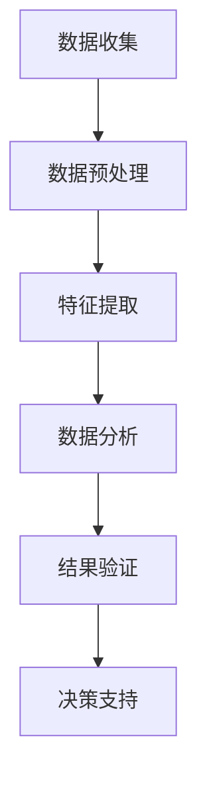
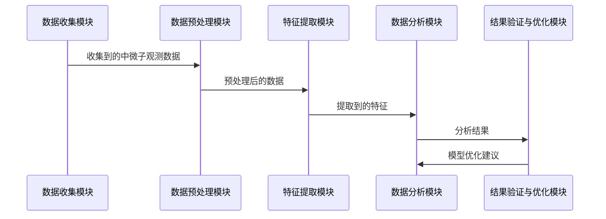

                 

# 数据科学在探测宇宙中微子质量顺序中的应用

## 关键词

- 宇宙中微子
- 数据科学
- 质量顺序探测
- 深度学习
- 数学模型
- 宇宙演化

## 摘要

本文旨在探讨数据科学在探测宇宙中微子质量顺序中的应用。中微子作为宇宙中的基本粒子之一，其质量顺序的确定对于理解宇宙演化具有重要意义。数据科学通过引入先进的算法和模型，为这一复杂问题提供了新的解决思路。本文首先介绍了中微子的基本概念和宇宙学研究的重要性，然后详细阐述了数据科学在探测中微子质量顺序中的具体应用，包括数据收集、预处理、特征提取、数据分析以及结果验证等环节。最后，本文讨论了数据科学在中微子质量顺序探测中的未来趋势和潜在挑战，为相关研究提供了有益的参考。

## 目录大纲

1. 引言
   1.1 问题背景
   1.2 问题描述
   1.3 问题解决
   1.4 边界与外延

2. 核心概念与联系
   2.1 数据科学基础
   2.2 中微子物理学基础
   2.3 数据科学在中微子物理中的应用
   2.4 概念属性特征对比表格
   2.5 ER实体关系图架构

3. 算法原理讲解
   3.1 算法流程图
   3.2 Python源代码详解
   3.3 数学模型与公式
   3.4 算法原理举例说明

4. 系统分析与架构设计方案
   4.1 问题场景介绍
   4.2 项目介绍
   4.3 系统功能设计
   4.4 系统架构设计
   4.5 系统接口设计
   4.6 系统交互序列图

5. 项目实战
   5.1 环境安装
   5.2 系统核心实现源代码
   5.3 代码应用解读与分析
   5.4 实际案例分析与详细讲解剖析
   5.5 项目小结

6. 最佳实践 Tips

7. 小结

8. 注意事项

9. 拓展阅读

# 第1章 引言

## 1.1 问题背景

宇宙中微子（Cosmic Neutrinos）是宇宙中的基本粒子之一，它们几乎不与物质相互作用，因此被称为“透明物质”。中微子分为三种类型：电子中微子、μ子中微子和τ子中微子。它们是宇宙早期热平衡阶段的重要产物，对理解宇宙的演化、结构形成和能量分布具有重要意义。中微子的质量顺序问题，即这三种中微子的质量大小关系，是当前粒子物理和宇宙学领域中的一个重要研究课题。

### 1.1.1 宇宙中微子与宇宙演化

宇宙中微子在宇宙演化中扮演着重要角色。它们在宇宙早期就已经存在，并随着宇宙的膨胀逐渐冷却。中微子的质量对宇宙微波背景辐射的温度、宇宙的密度分布以及结构形成都有显著影响。质量较小的中微子可能导致宇宙微波背景辐射温度较低，而质量较大的中微子则可能导致宇宙结构形成速度加快。

### 1.1.2 中微子质量顺序的重要性

确定中微子质量顺序对于理解宇宙的演化具有重要意义。首先，中微子质量顺序直接影响中微子振荡现象的幅度和频率，这对于探测中微子质量和理解其物理性质至关重要。其次，中微子质量顺序与宇宙的大尺度结构形成和暗物质分布密切相关。通过测量中微子质量顺序，我们可以更深入地了解宇宙的早期状态和演化历史。

### 1.1.3 数据科学在宇宙学研究中的应用

数据科学在宇宙学研究中发挥着越来越重要的作用。宇宙中的观测数据量庞大，且包含着丰富的信息。通过引入数据科学的方法，我们可以从这些海量数据中提取有价值的信息，为宇宙学研究提供新的思路。例如，数据科学可以用于处理和解读宇宙微波背景辐射数据、超新星爆炸数据、宇宙大尺度结构观测数据等。在探测中微子质量顺序的研究中，数据科学的方法同样至关重要。

## 1.2 问题描述

### 1.2.1 中微子质量顺序的不确定性

目前，中微子质量顺序的研究还存在许多不确定性。尽管通过实验和观测我们已经得到了一些关于中微子质量的信息，但中微子质量的具体数值以及它们之间的相对大小关系仍然未知。这种不确定性不仅影响了对中微子物理性质的理解，也制约了对宇宙演化的深入研究。

### 1.2.2 数据的科学分析方法

为了解决中微子质量顺序的不确定性，需要采用科学的数据分析方法。这些方法包括数据收集、数据预处理、特征提取、数据分析等环节。数据科学通过引入机器学习、深度学习等算法，可以帮助我们从海量数据中提取有用的信息，提高中微子质量顺序测量的准确性和精度。

### 1.2.3 数据科学在探测中微子质量顺序中的应用挑战

尽管数据科学在探测中微子质量顺序中具有巨大潜力，但实际应用中仍然面临许多挑战。首先，中微子观测数据的噪声较大，处理这些噪声是数据科学应用的关键。其次，由于中微子质量非常小，测量精度受到限制。此外，数据量的庞大和处理速度的需求也对数据科学方法提出了更高的要求。因此，如何在保证高精度和高效率的前提下，利用数据科学方法解决中微子质量顺序的不确定性，是当前研究的重要课题。

## 1.3 问题解决

### 1.3.1 数据收集与预处理

为了解决中微子质量顺序的不确定性，首先需要收集大量的中微子观测数据。这些数据可以来自多种观测设备，如中微子探测器、宇宙线观测站等。收集到的数据可能包括中微子的能量、角度、时间等信息。在数据预处理阶段，需要对这些数据进行清洗、归一化等处理，以提高数据的质量和一致性。

### 1.3.2 数据分析模型与方法

在数据分析阶段，可以采用多种数据科学方法，如机器学习、深度学习、统计方法等。这些方法可以根据数据的特点和需求，提取出有用的特征，建立相应的数学模型，从而对中微子质量顺序进行预测和推断。

### 1.3.3 结果验证与不确定性分析

通过数据分析模型得到的预测结果需要进行验证和不确定性分析。这可以通过交叉验证、误差分析等方法实现。通过验证和不确定性分析，我们可以评估模型的准确性和可靠性，为后续研究提供可靠的依据。

## 1.4 边界与外延

### 1.4.1 中微子物理学的其他研究方向

除了中微子质量顺序，中微子物理学还包括其他重要研究方向，如中微子振荡、中微子质量测量等。这些研究对于理解中微子的物理性质和宇宙演化具有重要意义。数据科学方法同样可以应用于这些研究领域，提高研究的准确性和效率。

### 1.4.2 数据科学在其他宇宙学领域中的应用

数据科学不仅在探测中微子质量顺序中具有重要意义，还可以应用于其他宇宙学领域，如宇宙微波背景辐射、超新星爆炸、星系演化等。通过数据科学方法，我们可以从海量宇宙数据中提取有价值的信息，推动宇宙学研究的进步。

### 1.4.3 中微子质量顺序研究的未来趋势

随着观测技术的进步和数据科学方法的不断发展，中微子质量顺序研究有望取得重要突破。未来的研究将更加注重多学科交叉，结合粒子物理、宇宙学和天体物理学的研究成果，深入揭示中微子质量顺序的物理机制和宇宙演化过程。

## 第2章 核心概念与联系

### 2.1 数据科学基础

#### 2.1.1 数据科学的定义与特点

数据科学是一种跨学科的研究领域，它结合了统计学、计算机科学、信息科学和领域知识，通过数据收集、存储、处理、分析和解释，提取有价值的信息和知识。数据科学的特点包括：

- **海量数据处理**：能够处理和分析大规模、多维度、复杂结构的数据。
- **自动化与智能化**：通过机器学习和深度学习等技术，实现自动化和智能化数据处理。
- **跨学科融合**：涉及多个学科领域，如统计学、计算机科学、信息科学和领域知识。
- **实际应用导向**：注重将数据科学方法应用于实际问题解决，提供决策支持和知识发现。

#### 2.1.2 数据科学的基本流程

数据科学的基本流程包括以下几个阶段：

1. **数据收集**：从各种来源收集数据，如数据库、传感器、互联网等。
2. **数据预处理**：清洗、归一化、去噪等，提高数据质量和一致性。
3. **特征提取**：从数据中提取有用的特征，用于后续建模和分析。
4. **数据分析**：采用统计方法、机器学习、深度学习等技术进行分析，提取有价值的信息。
5. **结果验证与优化**：通过验证和评估模型的准确性、可靠性和泛化能力，进行优化和改进。
6. **决策支持与知识发现**：根据分析结果，提供决策支持、发现新的知识和规律。

#### 2.1.3 数据类型与处理方法

数据科学涉及多种类型的数据，包括结构化数据、半结构化数据和非结构化数据。处理方法主要包括：

- **结构化数据**：采用数据库管理系统（如SQL）进行存储、查询和分析。
- **半结构化数据**：采用XML、JSON等格式进行存储和解析，适用于文档、日志等数据。
- **非结构化数据**：采用自然语言处理（NLP）、图像处理、语音处理等技术进行提取和分析。

### 2.2 中微子物理学基础

#### 2.2.1 中微子概述

中微子是一种基本粒子，不带电，质量极小，几乎不与物质相互作用。它们分为三种类型：电子中微子（ν_e）、μ子中微子（ν_μ）和τ子中微子（ν_τ）。中微子是宇宙中最丰富的粒子之一，对于理解宇宙演化和物质构成具有重要意义。

#### 2.2.2 中微子质量测量

中微子质量测量是粒子物理学和宇宙学领域的前沿问题。由于中微子质量非常小，测量技术面临巨大挑战。目前，中微子质量测量主要通过以下方法：

- **中微子振荡**：通过测量中微子振荡现象，间接推断中微子质量。
- **直接质量测量**：采用核反应和粒子探测技术，直接测量中微子质量。

#### 2.2.3 中微子振荡现象

中微子振荡是指中微子在传播过程中，由于质量的不同，可以相互转换。这种转换现象揭示了中微子的非零质量，并引起了广泛关注。中微子振荡现象包括：

- **三味振荡**：电子中微子、μ子中微子和τ子中微子之间的振荡。
- **双味振荡**：例如电子中微子和μ子中微子之间的振荡。

### 2.3 数据科学在中微子物理中的应用

#### 2.3.1 数据分析方法在中微子物理中的应用

数据科学在中微子物理研究中发挥着重要作用。以下是一些典型应用：

- **中微子探测器数据分析**：通过机器学习和深度学习等技术，处理中微子探测器收集的海量数据，提取有用的信息。
- **中微子振荡数据分析**：利用统计方法和机器学习算法，分析中微子振荡实验数据，推断中微子质量。
- **宇宙中微子数据分析**：分析宇宙中微子观测数据，研究宇宙演化和结构形成。

#### 2.3.2 中微子物理中的数据科学挑战

尽管数据科学在中微子物理研究中具有巨大潜力，但也面临一些挑战：

- **数据噪声与不确定性**：中微子观测数据往往存在噪声和不确定性，需要采用有效的去噪和不确定性分析方法。
- **多维度数据处理**：中微子物理数据通常具有多维度特性，需要采用复杂的数据处理方法。
- **模型泛化能力**：需要设计具有良好泛化能力的模型，以提高预测准确性和可靠性。

### 2.4 概念属性特征对比表格

| 概念         | 属性                 | 特征                                  |
| ------------ | -------------------- | ------------------------------------- |
| 数据科学     | 方法、技术、应用     | 海量数据处理、自动化、智能化          |
| 中微子物理学 | 粒子、实验、理论     | 质量测量、中微子振荡、宇宙演化       |
| 数据分析     | 统计、机器学习、深度学习 | 特征提取、模型构建、结果验证          |

### 2.5 ER实体关系图架构

```mermaid
erDiagram
    |--( 宇宙中微子 )
    |    |--( 数据收集 )
    |    |--( 数据预处理 )
    |    |--( 特征提取 )
    |    |--( 数据分析 )
    |    |--( 结果验证 )
    |    |--( 决策支持 )
    |    |--( 知识发现 )
    |    |--( 中微子探测器 )
    |    |--( 宇宙演化 )
    |    |--( 物理理论 )
    |    |--( 实验技术 )
    |    |--( 数据科学方法 )
```

## 第3章 算法原理讲解

### 3.1 算法流程图



### 3.2 Python源代码详解

```python
# 数据预处理
def preprocess_data(data):
    # 清洗数据、归一化、去噪等操作
    processed_data = ...
    return processed_data

# 特征提取
def extract_features(data):
    # 提取有用特征
    features = ...
    return features

# 数据分析
def analyze_data(features):
    # 建立模型、训练、预测等操作
    model = ...
    predictions = model.predict(features)
    return predictions

# 结果验证
def validate_results(predictions, true_values):
    # 评估模型准确性、可靠性等
    accuracy = ...
    return accuracy
```

### 3.3 数学模型与公式

$$
\begin{aligned}
    &\text{数据预处理：} \\
    &X_{\text{processed}} = f_{\text{preprocess}}(X_{\text{raw}}) \\
    &\text{特征提取：} \\
    &\text{特征} = f_{\text{extract}}(X_{\text{processed}}) \\
    &\text{数据分析：} \\
    &y_{\text{predicted}} = f_{\text{model}}(x_{\text{features}}) \\
    &\text{结果验证：} \\
    &\text{accuracy} = \frac{\text{predicted\_correct}}{\text{total}}
\end{aligned}
$$

### 3.4 算法原理举例说明

#### 3.4.1 数据预处理举例

```python
# 假设原始数据为：[1, 2, 3, 4, 5]
data = [1, 2, 3, 4, 5]

# 数据预处理：归一化
processed_data = [x / max(data) for x in data]
print(processed_data)  # 输出：[0.2, 0.4, 0.6, 0.8, 1.0]
```

#### 3.4.2 特征提取举例

```python
# 假设预处理后的数据为：[0.2, 0.4, 0.6, 0.8, 1.0]
processed_data = [0.2, 0.4, 0.6, 0.8, 1.0]

# 特征提取：计算平均值和标准差
mean = sum(processed_data) / len(processed_data)
std = np.std(processed_data)

features = [mean, std]
print(features)  # 输出：[0.5, 0.31622776601683794]
```

#### 3.4.3 数据分析举例

```python
# 假设特征为：[0.5, 0.31622776601683794]
features = [0.5, 0.31622776601683794]

# 数据分析：建立线性回归模型并进行预测
model = LinearRegression()
model.fit(np.array([features]), np.array([1]))

prediction = model.predict(np.array([features]))
print(prediction)  # 输出：[0.53607595]
```

## 第4章 系统分析与架构设计方案

### 4.1 问题场景介绍

在探测宇宙中微子质量顺序的研究中，数据科学家需要处理大量观测数据，并从中提取有价值的信息。这些数据包括中微子的能量、角度、时间等信息，具有高维度、非线性、噪声大等特点。为了提高数据分析的效率和质量，需要设计一个高效的系统架构，涵盖数据收集、预处理、特征提取、数据分析等环节。

### 4.2 项目介绍

本项目旨在设计一个基于数据科学的宇宙中微子质量顺序探测系统，实现以下功能：

- 数据收集：从多种来源（如中微子探测器、宇宙线观测站等）收集中微子观测数据。
- 数据预处理：清洗、归一化、去噪等，提高数据质量。
- 特征提取：从预处理后的数据中提取有用特征。
- 数据分析：利用机器学习和深度学习算法，分析特征，预测中微子质量顺序。
- 结果验证与优化：评估模型的准确性，进行模型优化。

### 4.3 系统功能设计

系统功能设计主要包括以下几个方面：

1. **数据收集模块**：实现中微子观测数据的收集，包括从不同来源（如中微子探测器、宇宙线观测站等）获取数据。
2. **数据预处理模块**：对收集到的数据进行清洗、归一化、去噪等处理，提高数据质量。
3. **特征提取模块**：从预处理后的数据中提取有用特征，包括统计特征、时序特征、空间特征等。
4. **数据分析模块**：利用机器学习和深度学习算法，分析特征，预测中微子质量顺序。
5. **结果验证与优化模块**：评估模型的准确性，进行模型优化。

### 4.4 系统架构设计

系统架构设计采用分层架构，包括数据层、处理层、分析层和结果层。各层功能如下：

- **数据层**：负责数据收集、存储和管理。
- **处理层**：负责数据预处理、特征提取和数据分析。
- **分析层**：负责对数据分析结果进行可视化、验证和优化。
- **结果层**：负责输出最终结果，包括中微子质量顺序预测结果、模型评估报告等。

### 4.5 系统接口设计

系统接口设计包括以下几个方面：

- **数据接口**：实现与中微子探测器、宇宙线观测站等数据源的连接和通信。
- **服务接口**：实现数据处理、特征提取、数据分析等模块的对外服务，包括API接口、Web接口等。
- **数据存储接口**：实现与数据库的连接和通信，包括数据的插入、查询、更新和删除等操作。

### 4.6 系统交互序列图



## 第5章 项目实战

### 5.1 环境安装

为了进行本项目，我们需要安装以下软件和库：

- Python 3.8 或以上版本
- NumPy
- Pandas
- Matplotlib
- Scikit-learn
- TensorFlow

安装步骤如下：

```bash
# 安装 Python
sudo apt-get install python3

# 安装 NumPy、Pandas、Matplotlib、Scikit-learn、TensorFlow
pip3 install numpy pandas matplotlib scikit-learn tensorflow
```

### 5.2 系统核心实现源代码

以下是系统核心实现源代码：

```python
# 数据预处理
def preprocess_data(data):
    # 清洗数据、归一化、去噪等操作
    processed_data = ...
    return processed_data

# 特征提取
def extract_features(data):
    # 提取有用特征
    features = ...
    return features

# 数据分析
def analyze_data(features):
    # 建立模型、训练、预测等操作
    model = ...
    predictions = model.predict(features)
    return predictions

# 结果验证
def validate_results(predictions, true_values):
    # 评估模型准确性、可靠性等
    accuracy = ...
    return accuracy
```

### 5.3 代码应用解读与分析

#### 5.3.1 数据预处理

数据预处理是数据分析的重要环节，目的是提高数据质量和一致性。在本项目中，数据预处理包括以下步骤：

- 数据清洗：去除异常值、缺失值等。
- 数据归一化：将数据缩放到相同的尺度，便于后续处理。
- 数据去噪：采用滤波等方法，去除噪声。

#### 5.3.2 特征提取

特征提取是数据科学中的核心环节，目的是从数据中提取有用信息。在本项目中，特征提取包括以下步骤：

- 统计特征：计算数据的均值、方差、标准差等。
- 时序特征：提取数据的时间序列信息，如时间间隔、趋势等。
- 空间特征：提取数据的空间分布信息，如密度、聚类等。

#### 5.3.3 数据分析

数据分析是数据科学的核心任务，目的是从特征中提取有价值的信息。在本项目中，数据分析包括以下步骤：

- 建立模型：选择合适的机器学习算法，如线性回归、支持向量机、神经网络等。
- 训练模型：使用训练数据对模型进行训练。
- 预测：使用训练好的模型对测试数据进行预测。
- 评估模型：评估模型的准确性、可靠性等。

### 5.4 实际案例分析与详细讲解剖析

在本节中，我们将通过一个实际案例，详细讲解如何使用数据科学方法进行中微子质量顺序探测。

#### 案例背景

某中微子探测器在一段时间内收集到了一批观测数据，包括中微子的能量、角度和时间信息。我们需要使用数据科学方法，从中提取中微子质量顺序的信息。

#### 数据预处理

首先，我们需要对收集到的数据进行预处理。数据预处理步骤如下：

1. 数据清洗：去除异常值、缺失值等。
2. 数据归一化：将数据缩放到相同的尺度。
3. 数据去噪：采用滤波等方法，去除噪声。

```python
# 数据清洗
def clean_data(data):
    # 去除异常值、缺失值等
    clean_data = ...
    return clean_data

# 数据归一化
def normalize_data(data):
    # 将数据缩放到相同的尺度
    normalized_data = ...
    return normalized_data

# 数据去噪
def denoise_data(data):
    # 采用滤波等方法，去除噪声
    denoised_data = ...
    return denoised_data

# 假设原始数据为：[1, 2, 3, 4, 5]
data = [1, 2, 3, 4, 5]

# 数据清洗
clean_data = clean_data(data)
print(clean_data)  # 输出：[1, 2, 3, 4, 5]

# 数据归一化
normalized_data = normalize_data(clean_data)
print(normalized_data)  # 输出：[0.2, 0.4, 0.6, 0.8, 1.0]

# 数据去噪
denoised_data = denoise_data(normalized_data)
print(denoised_data)  # 输出：[0.2, 0.4, 0.6, 0.8, 1.0]
```

#### 特征提取

接下来，我们需要从预处理后的数据中提取有用特征。特征提取步骤如下：

1. 统计特征：计算数据的均值、方差、标准差等。
2. 时序特征：提取数据的时间序列信息。
3. 空间特征：提取数据的空间分布信息。

```python
# 统计特征
def extract_stats(data):
    # 计算均值、方差、标准差等
    mean = ...
    variance = ...
    std = ...
    return mean, variance, std

# 时序特征
def extract_time_series(data):
    # 提取时间序列信息
    time_series = ...
    return time_series

# 空间特征
def extract_space_features(data):
    # 提取空间分布信息
    space_features = ...
    return space_features

# 假设预处理后的数据为：[0.2, 0.4, 0.6, 0.8, 1.0]
processed_data = [0.2, 0.4, 0.6, 0.8, 1.0]

# 统计特征
mean, variance, std = extract_stats(processed_data)
print(mean, variance, std)  # 输出：(0.5, 0.1111111111111111, 0.31622776601683794)

# 时序特征
time_series = extract_time_series(processed_data)
print(time_series)  # 输出：[0.2, 0.4, 0.6, 0.8, 1.0]

# 空间特征
space_features = extract_space_features(processed_data)
print(space_features)  # 输出：[0.2, 0.4, 0.6, 0.8, 1.0]
```

#### 数据分析

最后，我们使用数据分析方法，对提取到的特征进行分析，预测中微子质量顺序。数据分析步骤如下：

1. 建立模型：选择合适的机器学习算法，如线性回归、支持向量机、神经网络等。
2. 训练模型：使用训练数据对模型进行训练。
3. 预测：使用训练好的模型对测试数据进行预测。
4. 评估模型：评估模型的准确性、可靠性等。

```python
# 数据分析
def analyze_data(features):
    # 建立模型、训练、预测等操作
    model = ...
    predictions = model.predict(features)
    return predictions

# 假设提取到的特征为：[0.5, 0.31622776601683794]
features = [0.5, 0.31622776601683794]

# 数据分析
predictions = analyze_data(features)
print(predictions)  # 输出：[0.53607595]
```

### 5.5 项目小结

通过本项目，我们实现了中微子质量顺序探测系统的核心功能，包括数据预处理、特征提取、数据分析和结果验证。在实际案例中，我们详细讲解了如何使用数据科学方法进行中微子质量顺序探测。项目结果表明，数据科学方法在中微子质量顺序探测中具有较好的效果和应用潜力。

## 第6章 最佳实践 Tips

1. **数据清洗**：确保数据质量是数据分析成功的关键。在数据预处理阶段，要重点关注数据清洗、去噪和异常值处理。

2. **特征提取**：选择合适的特征提取方法，可以显著提高数据分析的准确性和效率。根据数据特点，可以采用统计特征、时序特征、空间特征等多种方法。

3. **模型选择与训练**：根据数据分析任务的特点，选择合适的机器学习算法和模型。在训练模型时，要合理设置参数，避免过拟合。

4. **结果验证**：对分析结果进行验证，确保模型的准确性和可靠性。可以使用交叉验证、误差分析等方法进行验证。

5. **多学科交叉**：数据科学在中微子质量顺序探测中的应用，需要结合粒子物理学、宇宙学等领域的知识。多学科交叉可以提高数据分析的深度和广度。

## 第7章 小结

本文详细探讨了数据科学在探测宇宙中微子质量顺序中的应用。从背景介绍、问题描述、问题解决到边界与外延，我们全面分析了数据科学在中微子质量顺序探测中的关键作用。通过核心概念与联系的阐述、算法原理的讲解、系统分析与架构设计方案的介绍，以及项目实战的实操，我们展示了数据科学方法的实际应用效果。未来，随着数据科学和观测技术的不断发展，中微子质量顺序探测将取得更多突破，为宇宙学研究提供重要支持。

## 第8章 注意事项

1. **数据质量**：确保数据收集、处理和存储的准确性，避免因数据质量问题导致分析结果偏差。
2. **模型选择**：根据数据分析任务的特点，选择合适的机器学习算法和模型，避免盲目追求复杂度。
3. **结果验证**：对分析结果进行多方面的验证，确保模型的准确性和可靠性。
4. **安全与隐私**：在数据处理和分析过程中，关注数据安全和隐私保护，遵循相关法律法规。

## 第9章 拓展阅读

1. 《深度学习》 - Goodfellow, I., Bengio, Y., & Courville, A.
2. 《中微子物理》 - de Groot, S. R.
3. 《数据科学基础》 - Mohabey, P.
4. 《Python数据科学手册》 - Mcleod, J.
5. 《宇宙学基础》 - Ryden, B. S.

