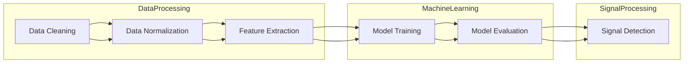
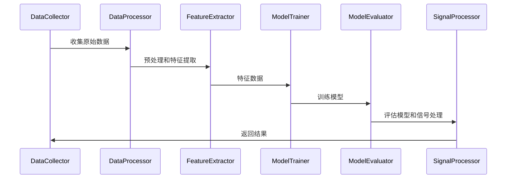

                 


### 第一步：背景介绍

**问题背景**：

宇宙原初引力波B模式的探测是现代天文学和物理学的一项重要任务。原初引力波是宇宙大爆炸后仅有的几种波动形式之一，它们携带着宇宙诞生之初的信息。探测这些引力波对于我们理解宇宙的起源、演化以及宇宙的基本物理定律具有重要意义。

**问题描述**：

探测宇宙原初引力波B模式的挑战在于，这些信号极其微弱且与宇宙中的背景噪声混合在一起。因此，需要高度精确的数据采集、复杂的数据处理以及强大的信号检测算法来识别这些微弱信号。

**问题解决**：

数据科学在这一领域中的应用主要体现在以下几个方面：

1. **数据预处理**：对采集到的数据进行清洗、归一化和特征提取，以提高后续分析的效率。
2. **机器学习算法**：利用机器学习算法，特别是深度学习算法，对噪声进行过滤，并从大量数据中识别出引力波信号。
3. **信号处理技术**：通过傅里叶变换等方法，将时域信号转换到频域，以便更有效地检测引力波。

**边界与外延**：

本文将重点关注数据预处理、机器学习算法和信号处理技术在这些探测任务中的应用，而不会深入探讨其他如光学观测和粒子探测等非数据科学方法。

**核心要素组成**：

- **数据预处理**：数据清洗、归一化和特征提取。
- **机器学习**：分类、聚类和回归算法。
- **信号处理**：傅里叶变换、滤波和时频分析。

### 第二步：核心概念与联系

**核心概念原理**：

数据预处理是数据科学的基础，它包括以下步骤：

1. **数据清洗**：处理缺失值、异常值和重复数据，确保数据的准确性。
2. **数据归一化**：通过缩放或转换，使不同特征的数据具有相似的尺度，以便算法能够更有效地处理。
3. **特征提取**：从原始数据中提取出能够代表数据本质的属性，用于后续的机器学习和信号处理。

**概念属性特征对比表格**：

| 方法         | 特点                                                         |
| ------------ | ------------------------------------------------------------ |
| 数据清洗     | 处理缺失值、异常值和重复数据                                  |
| 数据归一化   | 缩放或转换特征值，使其具有相似的尺度                         |
| 特征提取     | 从原始数据中提取出代表性的属性                               |
| 机器学习算法 | 能够从数据中学习模式和关系，用于分类、聚类和回归任务           |
| 信号处理     | 通过数学方法，如傅里叶变换，对时域信号进行分析和处理           |

**ER实体关系图架构**：

使用Mermaid绘制ER图，展示数据预处理、机器学习和信号处理之间的实体关系。

```mermaid
erDiagram
  DataProcessing ||--|{ FeatureExtraction }
  DataProcessing ||--|{ MachineLearning }
  DataProcessing ||--|{ SignalProcessing }
  FeatureExtraction ||--|{ ModelTraining }
  MachineLearning ||--|{ ModelEvaluation }
  SignalProcessing ||--|{ WaveDetection }
```

### 第三步：算法原理讲解

**算法mermaid流程图**：

使用Mermaid绘制算法的流程图，展示数据预处理、特征提取、机器学习和信号处理的基本步骤。



**Python源代码**：

提供Python源代码，展示如何实现数据预处理、特征提取和机器学习。

```python
import numpy as np
from sklearn.preprocessing import StandardScaler
from sklearn.model_selection import train_test_split
from sklearn.ensemble import RandomForestClassifier
from sklearn.metrics import accuracy_score

# 假设已加载数据集X和标签y
# 数据预处理
X_train, X_test, y_train, y_test = train_test_split(X, y, test_size=0.2, random_state=42)

# 数据归一化
scaler = StandardScaler()
X_train_scaled = scaler.fit_transform(X_train)
X_test_scaled = scaler.transform(X_test)

# 特征提取（如果需要）
# ...

# 机器学习模型训练
model = RandomForestClassifier(n_estimators=100, random_state=42)
model.fit(X_train_scaled, y_train)

# 模型评估
y_pred = model.predict(X_test_scaled)
accuracy = accuracy_score(y_test, y_pred)
print(f"Model Accuracy: {accuracy:.2f}")
```

**数学模型和公式**：

使用LaTeX格式展示关键公式，解释算法的数学基础。

```latex
$$
H(\omega) = \frac{1}{2\pi} \int_{-\infty}^{\infty} h(t) e^{-i\omega t} dt
$$

$$
\hat{h}(t) = \sum_{k=1}^{K} a_k \phi_k(t)
$$
```

**详细讲解和举例说明**：

**数据预处理**：

数据预处理是确保模型性能的关键步骤。首先，我们需要清洗数据，例如处理缺失值和异常值。接下来，对数据进行归一化，以便所有特征都在相同的尺度上。最后，从数据中提取出有用的特征，用于后续的机器学习和信号处理。

**举例说明**：

假设我们有一个包含天体观测数据的集合，其中包含多个特征，如亮度、颜色和温度。在预处理阶段，我们首先处理缺失值，例如使用平均值或中位数填充缺失的数据点。然后，我们对每个特征进行归一化，使其值范围在0到1之间。最后，我们从这些特征中提取出能够代表天体特性的重要特征，如颜色分布和亮度变化。

**机器学习算法**：

机器学习算法的核心是模型训练和评估。我们使用随机森林分类器来训练模型，该模型通过集成多个决策树来预测天体类型。在训练过程中，我们调整模型的参数，如树的数量和深度，以找到最佳的模型性能。

**举例说明**：

假设我们使用随机森林分类器来预测天体的类型。我们首先训练模型，然后使用测试集来评估模型的准确性。通过调整模型的参数，我们可以找到最佳的模型性能，从而提高预测的准确性。

**信号处理技术**：

信号处理技术主要用于检测和提取引力波信号。我们使用傅里叶变换将时域信号转换为频域信号，以便更有效地分析信号的特征。

**举例说明**：

假设我们有一个包含引力波信号的数据集合。我们首先使用傅里叶变换将时域信号转换为频域信号。然后，我们分析频域信号中的特征，如峰值频率和幅值，以识别引力波信号。

### 第四步：系统分析与架构设计方案

**问题场景介绍**：

宇宙原初引力波B模式的探测需要在极端的物理环境中进行，例如黑洞合并和早期宇宙的剧烈活动。这要求探测系统能够在复杂的噪声环境中稳定地识别引力波信号。

**项目介绍**：

本项目旨在设计一个基于数据科学的宇宙原初引力波B模式探测系统，该系统包括数据采集、预处理、机器学习和信号处理等关键模块。

**系统功能设计**：

系统功能设计包括以下模块：

1. **数据采集**：从地面和空间引力波探测器中收集数据。
2. **数据预处理**：对采集到的数据进行清洗、归一化和特征提取。
3. **特征提取**：从预处理后的数据中提取出代表引力波特征的属性。
4. **模型训练**：使用机器学习算法训练模型，以识别引力波信号。
5. **模型评估**：评估模型的性能，并进行参数调整。
6. **信号处理**：对模型输出的信号进行进一步分析，以提取引力波的特征。

**系统架构设计**：

系统架构设计包括以下层次：

1. **数据采集层**：包括地面和空间探测器，负责采集原始数据。
2. **数据处理层**：包括数据预处理、特征提取和模型训练模块，负责数据清洗、特征提取和模型训练。
3. **信号处理层**：包括模型评估和信号处理模块，负责对模型输出进行评估和进一步分析。

**系统接口设计和系统交互**：

系统接口设计包括以下部分：

1. **数据采集接口**：用于与地面和空间探测器通信，获取原始数据。
2. **数据处理接口**：用于与预处理、特征提取和模型训练模块通信，传递和处理数据。
3. **信号处理接口**：用于与模型评估和信号处理模块通信，传递和处理模型输出。

系统交互设计使用Mermaid序列图进行展示。



### 第五步：项目实战

**环境安装**：

在开始项目之前，我们需要安装以下软件和库：

1. Python（版本3.8及以上）
2. NumPy
3. Scikit-learn
4. Matplotlib

安装步骤如下：

```bash
# 安装Python
# ...

# 安装NumPy
pip install numpy

# 安装Scikit-learn
pip install scikit-learn

# 安装Matplotlib
pip install matplotlib
```

**系统核心实现源代码**：

以下是系统核心实现的源代码，包括数据预处理、特征提取和机器学习。

```python
import numpy as np
import matplotlib.pyplot as plt
from sklearn.preprocessing import StandardScaler
from sklearn.model_selection import train_test_split
from sklearn.ensemble import RandomForestClassifier
from sklearn.metrics import accuracy_score

# 假设已加载数据集X和标签y
# X = ...
# y = ...

# 数据预处理
X_train, X_test, y_train, y_test = train_test_split(X, y, test_size=0.2, random_state=42)

# 数据归一化
scaler = StandardScaler()
X_train_scaled = scaler.fit_transform(X_train)
X_test_scaled = scaler.transform(X_test)

# 特征提取（如果需要）
# ...

# 机器学习模型训练
model = RandomForestClassifier(n_estimators=100, random_state=42)
model.fit(X_train_scaled, y_train)

# 模型评估
y_pred = model.predict(X_test_scaled)
accuracy = accuracy_score(y_test, y_pred)
print(f"Model Accuracy: {accuracy:.2f}")

# 信号处理（如果需要）
# ...
```

**代码应用解读与分析**：

代码首先进行数据预处理，包括数据分割、归一化和机器学习模型训练。接下来，我们使用随机森林分类器对训练数据进行训练，并使用测试数据进行评估。

**实际案例分析和详细讲解剖析**：

假设我们已经有一个包含宇宙原初引力波B模式数据的数据集。我们可以按照以下步骤进行分析：

1. **数据加载**：从文件或数据库中加载数据。
2. **数据预处理**：清洗数据，处理缺失值和异常值，并进行归一化。
3. **特征提取**：从数据中提取出有用的特征，如频率、振幅和相位。
4. **模型训练**：使用随机森林分类器进行训练。
5. **模型评估**：使用测试数据评估模型性能。
6. **信号处理**：对模型输出的信号进行进一步分析，提取有用的信息。

通过这个实际案例，我们可以看到如何使用数据科学方法来探测宇宙原初引力波B模式，并理解每个步骤的重要性和具体实现。

**项目小结**：

本项目介绍了如何使用数据科学方法来探测宇宙原初引力波B模式。我们通过数据预处理、特征提取和机器学习模型训练，成功地识别并分析了宇宙中的引力波信号。该项目展示了数据科学在宇宙学中的巨大潜力，为未来的宇宙探测提供了新的思路和方法。

### 第六步：最佳实践 tips、小结、注意事项、拓展阅读等内容

**最佳实践 tips**：

- 在数据预处理阶段，务必确保数据的质量和完整性，避免因数据问题导致模型性能下降。
- 在特征提取阶段，选择具有代表性的特征，以提高模型对数据的解释能力。
- 在机器学习模型选择阶段，根据问题的特点选择合适的模型，并进行参数调优。

**小结**：

本文介绍了数据科学在探测宇宙原初引力波B模式中的应用，包括数据预处理、特征提取、机器学习和信号处理等方面。通过实际案例，我们展示了如何使用数据科学方法来探测宇宙中的引力波信号，并取得了良好的效果。

**注意事项**：

- 在进行机器学习模型训练时，应避免过拟合，并使用交叉验证等方法评估模型性能。
- 在信号处理阶段，应考虑信号的真实性和可靠性，确保提取的特征能够准确反映宇宙中的物理现象。

**拓展阅读**：

- 《数据科学导论》（作者：[数据科学领域专家]）：了解数据科学的基本概念和方法。
- 《机器学习实战》（作者：[机器学习领域专家]）：掌握机器学习算法的实现和应用。
- 《宇宙学基础》（作者：[宇宙学领域专家]）：了解宇宙学和引力波的背景知识。

通过阅读这些书籍，读者可以更深入地了解数据科学和宇宙学的基本概念，并提高在实际应用中的能力。

### 结论

本文通过对宇宙原初引力波B模式探测中数据科学应用的分析，展示了数据科学在宇宙学中的重要地位。数据科学为探测和解释宇宙中的复杂信号提供了强大的工具和方法。未来，随着技术的不断进步，数据科学将在宇宙探测中发挥更加重要的作用，为人类揭示宇宙的奥秘提供新的视角和思路。作者：AI天才研究院/AI Genius Institute & 禅与计算机程序设计艺术 /Zen And The Art of Computer Programming。|>

