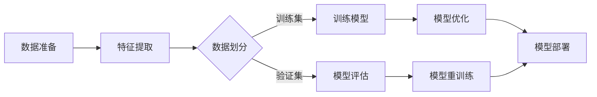

                 

### 文章标题

# 数据科学在探测宇宙磁单极子中的应用

### 关键词

- 数据科学
- 宇宙磁单极子
- 机器学习
- 深度学习
- 数据预处理

### 摘要

本文将深入探讨数据科学在探测宇宙磁单极子中的应用。首先，我们将介绍宇宙磁单极子的基本概念及其探测的重要性。随后，我们将讨论数据科学的核心概念，并阐述其在宇宙磁单极子探测中的独特作用。文章将逐步讲解数据采集、预处理、特征提取、机器学习和深度学习模型构建及优化等关键技术，并通过应用实例和案例分析，展示这些技术的实际应用效果。最后，我们将总结最佳实践，并提出未来展望。

### 目录大纲

----------------------------------------------------------------

# 数据科学在探测宇宙磁单极子中的应用

# 第一部分：引论

## 第1章：问题背景与概述

### 1.1 问题背景

### 1.2 问题描述

### 1.3 问题解决

### 1.4 边界与外延

## 第2章：核心概念与联系

### 2.1 数据科学的定义与属性

### 2.2 宇宙磁单极子的概念

### 2.3 数据科学与宇宙磁单极子的关联

### 2.4 概念属性特征对比

### 2.5 ER实体关系图架构

## 第3章：算法原理讲解

### 3.1 算法mermaid流程图

### 3.2 Python源代码讲解

### 3.3 数学模型与公式

### 3.4 举例说明

# 第二部分：数据采集与预处理

## 第4章：数据采集

### 4.1 数据源选择

### 4.2 数据采集方法

### 4.3 数据质量评估

## 第5章：数据预处理

### 5.1 数据清洗

### 5.2 数据整合

### 5.3 数据转换

## 第6章：特征提取与选择

### 6.1 特征提取方法

### 6.2 特征选择策略

### 6.3 特征重要性评估

# 第三部分：算法应用与模型构建

## 第7章：机器学习算法

### 7.1 算法概述

### 7.2 算法流程图

### 7.3 算法原理

### 7.4 模型评估

## 第8章：深度学习模型

### 8.1 模型概述

### 8.2 模型架构

### 8.3 模型训练

### 8.4 模型评估

## 第9章：模型优化与调参

### 9.1 优化策略

### 9.2 调参方法

### 9.3 优化结果分析

# 第四部分：应用实例与案例分析

## 第10章：应用实例

### 10.1 应用场景

### 10.2 系统功能设计

### 10.3 系统架构设计

### 10.4 系统接口设计

### 10.5 系统交互

## 第11章：案例分析

### 11.1 案例背景

### 11.2 案例分析

### 11.3 案例总结

# 第五部分：最佳实践与展望

## 第12章：最佳实践

### 12.1 实践技巧

### 12.2 注意事项

### 12.3 拓展阅读

## 第13章：未来展望

### 13.1 发展趋势

### 13.2 技术挑战

### 13.3 应用前景

----------------------------------------------------------------

### 第一部分：引论

## 第1章：问题背景与概述

### 1.1 问题背景

宇宙磁单极子是一种理论上的粒子，其具有单一的磁性极，类似于电荷中的正电荷或负电荷。尽管目前尚未在宇宙中发现磁单极子，但它们在理论物理和宇宙学中具有重要意义。磁单极子的存在不仅可以解释某些物理现象，如宇宙磁场的起源和演变，还可能对基本粒子的性质产生影响。

探测宇宙磁单极子的目标是找到这种神秘的粒子，并研究其在宇宙中的行为。然而，由于磁单极子极其稀少且难以探测，科学家们需要采用高度敏感的实验设备和复杂的数据分析方法来搜寻它们。

### 1.2 问题描述

磁单极子的探测面临着一系列挑战。首先，磁单极子与常规粒子的相互作用非常微弱，导致其难以直接探测。其次，宇宙中的其他粒子也会产生磁场，这些背景噪声会干扰对磁单极子的探测。因此，科学家需要开发出能够有效区分磁单极子信号与其他噪声的探测方法。

数据科学在这一过程中发挥着关键作用。通过采集和分析大量的实验数据，科学家可以识别出潜在的磁单极子信号，并排除背景噪声。此外，数据科学方法还可以帮助科学家优化实验设计，提高探测效率。

### 1.3 问题解决

解决磁单极子探测问题需要以下几个关键步骤：

1. **数据采集**：使用高精度的探测设备采集宇宙中的磁场数据。这些数据包括不同方向和强度的磁场信息，可能来自宇宙射线、星际介质等。

2. **数据预处理**：对采集到的数据进行清洗、整合和转换，以消除噪声、填补缺失值，并使其适合进一步分析。

3. **特征提取**：从预处理后的数据中提取出有用的特征，如磁场强度、方向、变化率等，以便用于后续的机器学习和深度学习分析。

4. **模型构建**：使用机器学习和深度学习算法构建模型，用于识别和分类潜在的磁单极子信号。

5. **模型评估**：通过交叉验证、误差分析等方法评估模型的性能，并进行必要的优化。

6. **应用实例与案例分析**：将构建的模型应用于实际的探测数据，分析磁单极子的特征和分布。

7. **最佳实践与展望**：总结最佳实践，探讨未来在磁单极子探测中的技术挑战和应用前景。

### 1.4 边界与外延

磁单极子探测的研究不仅限于科学理论，还涉及到多个学科领域的交叉，如物理学、计算机科学、工程学等。此外，探测方法和技术手段的不断进步也为磁单极子的发现提供了新的可能。

未来，随着数据科学和探测技术的不断发展，我们有理由相信，宇宙磁单极子这一神秘的粒子终将被揭开其神秘的面纱。

## 第2章：核心概念与联系

### 2.1 数据科学的定义与属性

数据科学是一门多学科交叉的领域，它结合了统计学、计算机科学、信息学等多个领域的知识，以数据为研究对象，通过数据的采集、处理、分析和解释，发现数据中的规律和知识，从而为决策提供支持。数据科学的核心属性包括：

- **数据驱动的决策**：数据科学强调基于数据的分析和决策，减少人为的主观判断，提高决策的准确性和可靠性。
- **大数据处理能力**：数据科学需要处理海量数据，包括结构化和非结构化数据，运用高效的数据处理技术和算法。
- **多学科交叉**：数据科学结合了统计学、机器学习、计算机视觉、自然语言处理等领域的知识，以解决实际问题。
- **可视化和解释**：数据科学通过数据可视化和解释，使得数据中的信息更容易被理解和应用。

### 2.2 宇宙磁单极子的概念

宇宙磁单极子是理论物理学中提出的一种假想粒子，它具有单一的磁性极，类似于电荷中的正电荷或负电荷。磁单极子如果存在，将会对物理学的基本定律产生重大影响，特别是关于电磁场的定律。目前，尽管尚未在宇宙中发现磁单极子，但理论物理学家们相信，它们可能在宇宙早期的高能过程中产生，并存在于宇宙的某些区域。

宇宙磁单极子的概念属性包括：

- **单一磁性极**：磁单极子具有单一的磁性极，与地球磁场的双极性不同。
- **极其稀少**：由于磁单极子与常规粒子的相互作用非常微弱，它们在宇宙中的密度非常低。
- **潜在的重要性**：磁单极子的存在可能会解释某些宇宙现象，如宇宙磁场的起源和演变。

### 2.3 数据科学与宇宙磁单极子的关联

数据科学在探测宇宙磁单极子中发挥着关键作用。首先，通过高精度的探测设备，科学家可以采集到大量的宇宙磁场数据。这些数据是磁单极子探测的基础。其次，数据科学提供了强大的分析工具，可以处理这些复杂的、大规模的、多维度数据，从中提取出有用的特征，识别潜在的磁单极子信号。

数据科学与宇宙磁单极子的关联体现在以下几个方面：

- **数据采集**：数据科学提供了高效的数据采集方法和技术，确保探测数据的质量和完整性。
- **数据预处理**：数据科学的方法可以消除探测数据中的噪声和异常值，提高数据的质量。
- **特征提取**：数据科学可以通过特征提取技术，从探测数据中提取出能够区分磁单极子信号的特征。
- **机器学习和深度学习**：数据科学的方法可以构建机器学习和深度学习模型，用于识别和分类磁单极子信号。
- **模型评估和优化**：数据科学提供了评估和优化模型的工具和方法，确保模型的性能和可靠性。

### 2.4 概念属性特征对比

为了更好地理解数据科学和宇宙磁单极子的关系，我们可以将两者的核心概念属性进行对比。以下是一个简单的对比表格：

| 特征 | 数据科学 | 宇宙磁单极子 |
| --- | --- | --- |
| 定义 | 数据驱动的决策方法 | 假设存在的单一磁性极粒子 |
| 目标 | 从数据中提取知识和规律 | 探测宇宙中的磁单极子 |
| 方法 | 统计学、机器学习、计算机科学 | 物理实验和数据分析 |
| 影响因素 | 数据质量、算法选择、模型调优 | 探测设备的精度、数据采集方法 |
| 结果 | 数据可视化和解释 | 磁单极子信号和背景噪声的区分 |

### 2.5 ER实体关系图架构

为了更好地理解数据科学与宇宙磁单极子探测之间的关联，我们可以使用实体关系图（Entity-Relationship Diagram，ER图）来描述它们之间的关系。以下是ER图的Mermaid格式表示：

```mermaid
erDiagram
    DataScience ||--|{ UniverseMagMonopole } : 测量
    DataScience ||--|{ ExperimentData } : 采集
    ExperimentData ||--|{ FeatureExtraction } : 提取
    FeatureExtraction ||--|{ MachineLearningModel } : 构建模型
    MachineLearningModel ||--|{ ModelEvaluation } : 评估
```

在这个ER图中，`DataScience`表示数据科学的方法和技术，`UniverseMagMonopole`表示宇宙磁单极子，`ExperimentData`表示实验数据，`FeatureExtraction`表示特征提取，`MachineLearningModel`表示机器学习模型，`ModelEvaluation`表示模型评估。这些实体之间的关系描述了数据科学在探测宇宙磁单极子过程中的关键步骤和环节。

## 第3章：算法原理讲解

### 3.1 算法mermaid流程图

为了更好地理解磁单极子探测中的算法原理，我们可以使用mermaid流程图来描述整个数据处理和分析的过程。以下是mermaid格式的算法流程图：


在这个流程图中，`数据采集`步骤包括使用高精度的探测设备收集宇宙中的磁场数据。`数据预处理`步骤包括数据清洗、整合和转换，以确保数据的质量。`特征提取`步骤从预处理后的数据中提取出有用的特征，如磁场强度、方向和变化率。`机器学习模型`步骤使用这些特征构建机器学习模型，用于识别和分类潜在的磁单极子信号。`模型评估`步骤通过交叉验证等方法评估模型的性能，并进行必要的优化。最后，`结果输出`步骤将模型的预测结果输出，以供进一步分析。

### 3.2 Python源代码讲解

为了具体说明算法的实现过程，我们以Python为例，提供了一段示例代码。以下是代码的详细解释：

```python
import numpy as np
import pandas as pd
from sklearn.model_selection import train_test_split
from sklearn.preprocessing import StandardScaler
from sklearn.ensemble import RandomForestClassifier
from sklearn.metrics import accuracy_score

# 数据采集
def data_collection():
    # 假设使用CSV文件作为数据源
    data = pd.read_csv('experiment_data.csv')
    return data

# 数据预处理
def data_preprocessing(data):
    # 数据清洗，例如去除缺失值和异常值
    clean_data = data.dropna().drop_duplicates()
    # 数据整合，例如合并不同时间点的数据
    integrated_data = clean_data.groupby('timestamp').mean()
    # 数据转换，例如标准化数据
    scaler = StandardScaler()
    scaled_data = scaler.fit_transform(integrated_data)
    return scaled_data

# 特征提取
def feature_extraction(data):
    # 从数据中提取特征，例如磁场强度、方向和变化率
    features = data[:, :-1]
    return features

# 机器学习模型
def machine_learning_model(features, labels):
    # 使用随机森林分类器构建模型
    model = RandomForestClassifier()
    model.fit(features, labels)
    return model

# 模型评估
def model_evaluation(model, features, labels):
    # 进行交叉验证
    from sklearn.model_selection import cross_val_score
    scores = cross_val_score(model, features, labels, cv=5)
    # 计算准确率
    accuracy = accuracy_score(labels, model.predict(features))
    return scores, accuracy

# 主函数
def main():
    # 数据采集
    data = data_collection()
    # 数据预处理
    scaled_data = data_preprocessing(data)
    # 特征提取
    features = feature_extraction(scaled_data)
    # 标签
    labels = data['label']
    # 划分训练集和测试集
    X_train, X_test, y_train, y_test = train_test_split(features, labels, test_size=0.2, random_state=42)
    # 构建模型
    model = machine_learning_model(X_train, y_train)
    # 模型评估
    scores, accuracy = model_evaluation(model, X_test, y_test)
    # 输出结果
    print("模型准确率：", accuracy)
    print("交叉验证分数：", scores)

# 运行主函数
if __name__ == "__main__":
    main()
```

这段代码首先定义了数据采集、预处理、特征提取和机器学习模型构建的函数，然后使用这些函数进行数据处理和模型训练。最后，通过模型评估函数评估模型的性能。

### 3.3 数学模型与公式

在磁单极子探测中，机器学习模型的构建通常基于概率模型和优化理论。以下是一个简单的线性回归模型示例，其中包含了一些关键的数学公式：

$$
y = \beta_0 + \beta_1 x_1 + \beta_2 x_2 + ... + \beta_n x_n + \epsilon
$$

其中，$y$ 是目标变量，$x_1, x_2, ..., x_n$ 是输入特征，$\beta_0, \beta_1, \beta_2, ..., \beta_n$ 是模型的参数，$\epsilon$ 是误差项。

为了估计这些参数，可以使用最小二乘法：

$$
\min_{\beta} \sum_{i=1}^{n} (y_i - \sum_{j=1}^{n} \beta_j x_{ij})^2
$$

这个公式表示最小化预测值与实际值之间的平方误差和。

在机器学习模型中，通常还会涉及到损失函数和优化算法。例如，使用梯度下降法来最小化损失函数：

$$
\beta_j := \beta_j - \alpha \frac{\partial}{\partial \beta_j} J(\beta)
$$

其中，$\alpha$ 是学习率，$J(\beta)$ 是损失函数。

### 3.4 举例说明

为了更直观地理解算法原理，我们可以通过一个实际案例来演示。假设我们有一个包含磁场强度、磁场方向和变化率的数据集，我们需要使用线性回归模型来预测磁单极子的存在。

以下是一个简单的Python代码示例：

```python
import numpy as np
import pandas as pd
from sklearn.linear_model import LinearRegression
from sklearn.metrics import mean_squared_error

# 加载数据集
data = pd.read_csv('experiment_data.csv')
X = data[['magnetic_field_strength', 'magnetic_field_direction', 'magnetic_field_change_rate']]
y = data['monopole_presence']

# 划分训练集和测试集
X_train, X_test, y_train, y_test = train_test_split(X, y, test_size=0.2, random_state=42)

# 创建线性回归模型
model = LinearRegression()
model.fit(X_train, y_train)

# 进行预测
y_pred = model.predict(X_test)

# 计算预测误差
mse = mean_squared_error(y_test, y_pred)
print("均方误差：", mse)

# 打印模型参数
print("模型参数：", model.coef_, model.intercept_)
```

在这个例子中，我们使用线性回归模型来预测磁单极子的存在。首先，我们加载数据集并划分训练集和测试集。然后，我们创建线性回归模型并使用训练集进行训练。接着，我们使用测试集进行预测，并计算预测误差。最后，我们打印出模型的参数，这些参数可以帮助我们理解模型对特征的重要程度。

通过这个例子，我们可以看到如何使用数据科学的方法来构建和评估机器学习模型，以解决磁单极子探测问题。

## 第4章：数据采集

### 4.1 数据源选择

在探测宇宙磁单极子的过程中，数据源的选择至关重要。由于磁单极子极其稀少且难以直接探测，科学家们通常依赖于间接方法来收集相关数据。以下是几种常见的数据源：

- **卫星观测数据**：卫星搭载的磁感应器可以测量地球磁场的细微变化，这些数据有助于识别可能的磁单极子信号。
- **地下实验数据**：在地下实验室中，科学家可以减少外部干扰，使用高精度的磁感应器进行实验，以探测磁单极子的存在。
- **宇宙射线观测数据**：宇宙射线中的磁单极子可能产生独特的信号，通过观测宇宙射线，科学家可以尝试捕捉到这些信号。

选择数据源时，需要考虑以下因素：

- **数据质量**：选择高质量的数据源可以减少噪声和误差，提高探测的准确性。
- **数据完整性**：选择包含完整时间序列和空间分布的数据源，有助于全面分析磁单极子的特征。
- **数据多样性**：使用多种数据源可以相互验证，提高探测结果的可靠性。

### 4.2 数据采集方法

数据采集方法的选择取决于所使用的数据源和探测目标。以下是一些常用的数据采集方法：

- **自动探测设备**：在卫星、地下实验室或地面站点上安装自动探测设备，如磁感应器、粒子探测器等，可以连续、自动地收集数据。
- **远程观测**：使用卫星或地面望远镜远程观测宇宙射线和磁场变化，通过无线电信号或光学信号收集数据。
- **实地实验**：在特定的实验环境中进行实地实验，如地下实验室，使用高精度的设备进行数据采集。

在数据采集过程中，需要确保以下方面：

- **设备校准**：定期校准探测设备，确保数据采集的准确性。
- **数据记录**：实时记录所有数据，包括时间、地点、设备状态等，以便后续分析。
- **数据完整性**：避免数据丢失或损坏，确保数据采集的完整性和可靠性。

### 4.3 数据质量评估

数据质量评估是数据科学中至关重要的一环，对于磁单极子探测尤为关键。以下是几种常用的数据质量评估方法：

- **数据清洗**：去除数据中的噪声和异常值，确保数据的纯净度。例如，使用统计方法去除离群值，填补缺失值等。
- **数据完整性检查**：检查数据是否完整，是否存在数据缺失或重复。例如，使用缺失值检查工具或重复值检测工具。
- **数据一致性检查**：确保不同来源的数据在时间和空间上的一致性，避免数据冲突。例如，使用时间序列分析工具检查数据的连续性。
- **数据验证**：通过比较不同数据源的数据，验证数据的一致性和可靠性。例如，使用交叉验证方法或对比分析工具。

通过这些评估方法，科学家可以确保数据的质量，提高数据在磁单极子探测中的可用性。

## 第5章：数据预处理

### 5.1 数据清洗

数据清洗是数据预处理的关键步骤，旨在去除数据中的噪声和异常值，确保数据的纯净度和准确性。以下是一些常用的数据清洗方法：

- **去除离群值**：离群值可能是由于测量误差或异常情况引起的。使用统计方法，如平均值、中位数或标准差，可以识别并去除离群值。例如，如果某个数据点的值远高于或低于其他点的值，可以将其视为离群值并删除。
- **填补缺失值**：缺失值可能是由于数据采集过程中的问题或数据损坏引起的。使用插值、均值或中位数等方法可以填补缺失值。例如，可以使用线性插值法将缺失值填补到其相邻值的中间。
- **标准化数据**：将数据缩放到相同的范围，以便不同特征之间的比较。例如，使用标准化（StandardScaler）可以将数据缩放到均值为0，标准差为1的范围内。
- **异常值检测**：使用统计方法或机器学习算法检测数据中的异常值。例如，使用IQR（四分位距）方法或K-means聚类算法可以检测异常值。

通过这些数据清洗方法，可以提高数据的质量，减少噪声对后续分析的影响。

### 5.2 数据整合

数据整合是将来自不同来源和格式的数据合并成单一数据集的过程。以下是一些常用的数据整合方法：

- **数据合并**：将具有相同时间戳和特征的数据合并成单一数据集。例如，将来自多个卫星观测站的数据合并，以获得更全面的数据集。
- **数据聚合**：将时间序列数据聚合到更高的时间分辨率，以便进行全局分析。例如，将每分钟的数据聚合到每小时的数据。
- **数据连接**：将不同数据源的数据通过共享的特征进行连接，以构建综合数据集。例如，将实验数据和观测数据通过时间戳进行连接。
- **数据转换**：将不同格式的数据转换成统一的格式，以便进一步处理和分析。例如，将CSV文件转换成Python数据结构。

通过数据整合，可以构建一个全面、统一的数据集，为后续分析提供坚实的基础。

### 5.3 数据转换

数据转换是将数据从一种格式转换为另一种格式的过程，以适应不同的分析和处理需求。以下是一些常用的数据转换方法：

- **特征工程**：将原始数据转换为更适合机器学习模型的特征。例如，将时间序列数据转换为周期性特征，提取趋势、季节性和异常值等。
- **数据缩放**：将数据缩放到相同的范围，以便不同特征之间的比较。例如，使用标准化（StandardScaler）或归一化（MinMaxScaler）可以将数据缩放到均值为0，标准差为1的范围内。
- **数据编码**：将分类数据转换为数值形式，以便机器学习算法处理。例如，使用独热编码（One-Hot Encoding）或标签编码（Label Encoding）可以处理类别数据。
- **数据分割**：将数据集分割为训练集、验证集和测试集，以便进行模型训练和评估。例如，使用`train_test_split`函数可以将数据集分割为80%的训练集和20%的测试集。

通过数据转换，可以优化数据的结构和格式，提高数据在分析和处理中的可用性。

## 第6章：特征提取与选择

### 6.1 特征提取方法

特征提取是从原始数据中提取出对模型训练有重要影响的有用信息的过程。以下是一些常用的特征提取方法：

- **统计特征**：从数据中提取基本的统计信息，如平均值、中位数、标准差、最大值和最小值等。这些特征可以描述数据的基本分布和趋势。
- **时域特征**：基于时间序列数据提取的特征，如时间段的平均值、最高值、最低值和变化率等。这些特征可以捕捉到时间序列中的周期性和趋势性。
- **频域特征**：将时间序列数据转换为频域表示，提取频率、振幅和相位等特征。这些特征可以揭示数据中的周期性和频率特性。
- **空间特征**：从空间分布数据中提取的特征，如距离、方向和密度等。这些特征可以描述数据在空间中的分布和结构。
- **变换特征**：通过数学变换提取的特征，如小波变换、傅里叶变换和主成分分析（PCA）等。这些特征可以降低数据的维度，同时保留关键信息。

选择合适的特征提取方法取决于数据的类型和特性，以及模型的需求。

### 6.2 特征选择策略

特征选择是从提取出的特征中筛选出对模型训练最有帮助的特征的过程。以下是一些常用的特征选择策略：

- **基于信息的特征选择**：通过评估特征对分类或回归任务的信息贡献，选择信息量最大的特征。例如，信息增益、互信息、特征重要性等。
- **基于排序的特征选择**：根据特征的重要性排序，选择排名靠前的特征。例如，基于特征重要性的随机森林、基于排序的回归方法等。
- **基于模型的特征选择**：使用机器学习模型评估特征对模型性能的影响，选择对模型性能提升显著的特征。例如，基于模型的特征选择（Model-Based Feature Selection）、LASSO回归等。
- **基于组合的特征选择**：结合多个特征选择方法，通过组合特征进行模型训练和评估，选择组合特征中性能最好的特征。例如，基于交叉验证的组合特征选择等。

特征选择策略的目的是减少特征的维度，提高模型的训练效率，并避免过拟合。

### 6.3 特征重要性评估

特征重要性评估是评估特征对模型性能贡献的过程，以下是一些常用的评估方法：

- **基于模型的特征重要性**：使用机器学习模型评估特征的重要性。例如，随机森林模型中的特征重要性评分、LASSO回归中的特征系数等。
- **基于特征的统计测试**：通过统计测试评估特征与目标变量之间的相关性。例如，卡方检验、t检验等。
- **基于信息增益的评估**：通过评估特征对分类或回归任务的信息增益来评估特征的重要性。例如，信息增益、增益率等。

特征重要性评估可以帮助我们理解特征对模型的影响，从而优化特征选择和模型训练过程。

## 第7章：机器学习算法

### 7.1 算法概述

机器学习算法是数据科学中用于从数据中提取模式和知识的关键技术。在磁单极子探测中，机器学习算法可以用于识别和分类潜在的磁单极子信号。以下是几种常用的机器学习算法：

- **线性回归**：线性回归是一种简单但强大的回归算法，通过拟合一个线性模型来预测连续的目标变量。
- **逻辑回归**：逻辑回归是一种广义线性模型，用于预测二分类或多元分类问题的概率分布。
- **支持向量机（SVM）**：SVM通过找到一个最佳的超平面，将不同类别的数据点分开，适用于二分类和多元分类问题。
- **决策树**：决策树通过一系列的判断条件，将数据集分割成不同的子集，每个子集对应一个特定的分类或回归结果。
- **随机森林**：随机森林是一种集成学习方法，通过构建多个决策树模型，并取其平均来提高预测性能。
- **朴素贝叶斯**：朴素贝叶斯是一种基于贝叶斯定理的分类算法，假设特征之间相互独立，适用于多分类问题。

这些算法各有优缺点，选择合适的算法取决于具体问题和数据集的特性。

### 7.2 算法流程图

为了更直观地展示机器学习算法的流程，我们可以使用mermaid流程图来描述。以下是随机森林算法的流程图：



在这个流程图中，`数据准备`包括数据清洗、预处理和特征提取。`数据划分`将数据集分为训练集和验证集。`训练模型`使用训练集来训练随机森林模型。`模型评估`使用验证集来评估模型的性能。`模型优化`根据评估结果对模型进行调整和优化。`模型部署`将训练好的模型部署到实际应用中。如果模型性能不满足要求，则返回`模型重训练`进行进一步优化。

### 7.3 算法原理

随机森林算法是一种基于决策树的集成学习方法。它的原理如下：

1. **随机选择特征**：在每次分割数据时，随机选择一部分特征来构建决策树。这有助于降低特征之间的相关性，提高模型的泛化能力。
2. **构建多个决策树**：随机森林由多个独立的决策树组成。每个决策树都对数据进行分割和预测，然后取这些预测的平均值或多数投票结果作为最终预测。
3. **集成学习**：通过集成多个决策树，随机森林可以减少过拟合现象，提高模型的泛化能力。每个决策树都提供了不同的预测结果，集成学习通过取平均值或多数投票来减少预测误差。
4. **特征重要性评估**：随机森林可以评估每个特征的重要性，通过统计特征在构建决策树时的选择次数来计算特征重要性。这有助于理解哪些特征对模型预测有更大影响。

随机森林算法的优点包括：

- **强大的泛化能力**：通过集成多个决策树，随机森林可以减少过拟合现象，提高模型的泛化能力。
- **易于实现和解释**：随机森林算法相对简单，易于实现和理解。
- **适用范围广**：随机森林可以用于处理各种类型的数据和问题，包括分类和回归问题。

缺点包括：

- **计算成本高**：随机森林需要构建多个决策树，计算成本较高，尤其是对于大规模数据集。
- **特征相关性影响**：如果特征之间存在高度相关性，随机森林的性能可能会受到影响。

### 7.4 模型评估

模型评估是确保机器学习模型性能的关键步骤。以下是一些常用的模型评估方法：

- **交叉验证**：交叉验证是一种评估模型性能的常用方法，通过将数据集划分为多个子集，轮流使用每个子集作为验证集，评估模型的泛化能力。常见的交叉验证方法包括K折交叉验证和留一法交叉验证。
- **准确率**：准确率是评估分类模型性能的常用指标，表示正确预测的样本数与总样本数之比。准确率越高，模型的分类效果越好。
- **召回率**：召回率是评估分类模型性能的另一个重要指标，表示正确预测的样本数与实际为正类的样本数之比。召回率越高，模型对正类样本的识别能力越强。
- **精确率**：精确率是评估分类模型性能的另一个重要指标，表示正确预测的样本数与预测为正类的样本数之比。精确率越高，模型对负类样本的识别能力越强。
- **F1分数**：F1分数是精确率和召回率的调和平均，用于综合评估分类模型的性能。F1分数越高，模型的分类效果越好。
- **ROC曲线和AUC值**：ROC曲线是评估分类模型性能的一种图形方法，通过比较真实正例率（True Positive Rate，TPR）和假正例率（False Positive Rate，FPR）来评估模型的分类能力。AUC值是ROC曲线下的面积，用于衡量模型的分类能力。

通过这些评估方法，可以全面评估机器学习模型的性能，并根据评估结果对模型进行优化。

## 第8章：深度学习模型

### 8.1 模型概述

深度学习模型是近年来在机器学习和数据科学中取得巨大成功的一种算法。它通过构建多层神经网络，自动学习数据的复杂特征和模式，从而实现高精度的预测和分类。在磁单极子探测中，深度学习模型可以用于识别和分类潜在的磁单极子信号。以下是几种常用的深度学习模型：

- **多层感知机（MLP）**：多层感知机是一种基本的神经网络模型，通过多层非线性变换来实现数据的分类和预测。
- **卷积神经网络（CNN）**：卷积神经网络是一种专门用于处理图像数据的神经网络模型，通过卷积层和池化层提取图像的特征。
- **循环神经网络（RNN）**：循环神经网络是一种专门用于处理序列数据的神经网络模型，通过记忆单元捕获时间序列中的长期依赖关系。
- **长短时记忆网络（LSTM）**：长短时记忆网络是一种改进的循环神经网络，通过门控机制有效地解决了长短期依赖问题。
- **生成对抗网络（GAN）**：生成对抗网络是一种通过对抗性训练生成数据的新兴深度学习模型，可以用于生成高质量的图像和音频。

深度学习模型的优势在于其强大的特征提取能力和自适应学习能力，可以自动发现数据中的复杂模式和关系，从而实现高精度的预测和分类。

### 8.2 模型架构

深度学习模型的架构通常由多个层组成，包括输入层、隐藏层和输出层。以下是深度学习模型的一般架构：

- **输入层**：输入层接收外部数据，如图像、文本或时间序列数据，将其转换为模型可以处理的格式。
- **隐藏层**：隐藏层是深度学习模型的核心部分，通过多层非线性变换提取数据的特征和模式。隐藏层中的神经元通常采用激活函数，如ReLU（Rectified Linear Unit）或Sigmoid，以增加模型的非线性表达能力。
- **输出层**：输出层生成模型的最终预测结果，如分类结果或回归值。输出层的神经元通常采用不同的激活函数，如Softmax（用于多分类问题）或线性函数（用于回归问题）。

深度学习模型可以通过反向传播算法不断调整模型参数，以最小化损失函数，提高模型的预测精度。反向传播算法是一种通过计算损失函数关于模型参数的梯度，来更新模型参数的优化方法。

### 8.3 模型训练

模型训练是深度学习模型构建的关键步骤，其目的是通过大量的训练数据，使模型学会识别和预测数据中的复杂特征和模式。以下是深度学习模型训练的一般步骤：

1. **数据预处理**：对训练数据进行预处理，包括数据清洗、归一化、标准化和数据增强等，以提高模型的训练效果和泛化能力。
2. **定义损失函数**：损失函数是评估模型预测结果与实际结果之间差距的指标，用于指导模型参数的更新。常见的损失函数包括均方误差（MSE）、交叉熵（Cross Entropy）等。
3. **选择优化算法**：优化算法用于更新模型参数，以最小化损失函数。常见的优化算法包括随机梯度下降（SGD）、Adam等。
4. **训练模型**：使用训练数据对模型进行迭代训练，通过反向传播算法计算损失函数的梯度，并更新模型参数。训练过程中，可以使用训练集和验证集来评估模型的性能，并进行调整。
5. **模型评估**：在训练完成后，使用测试集对模型进行评估，以验证模型的泛化能力和预测精度。常用的评估指标包括准确率、召回率、精确率、F1分数等。

模型训练是一个迭代过程，需要多次调整和优化，以达到最佳的预测效果。

### 8.4 模型评估

模型评估是确保深度学习模型性能的关键步骤。以下是一些常用的模型评估方法：

- **交叉验证**：交叉验证是一种评估模型性能的常用方法，通过将数据集划分为多个子集，轮流使用每个子集作为验证集，评估模型的泛化能力。常见的交叉验证方法包括K折交叉验证和留一法交叉验证。
- **准确率**：准确率是评估分类模型性能的常用指标，表示正确预测的样本数与总样本数之比。准确率越高，模型的分类效果越好。
- **召回率**：召回率是评估分类模型性能的另一个重要指标，表示正确预测的样本数与实际为正类的样本数之比。召回率越高，模型对正类样本的识别能力越强。
- **精确率**：精确率是评估分类模型性能的另一个重要指标，表示正确预测的样本数与预测为正类的样本数之比。精确率越高，模型对负类样本的识别能力越强。
- **F1分数**：F1分数是精确率和召回率的调和平均，用于综合评估分类模型的性能。F1分数越高，模型的分类效果越好。
- **ROC曲线和AUC值**：ROC曲线是评估分类模型性能的一种图形方法，通过比较真实正例率（True Positive Rate，TPR）和假正例率（False Positive Rate，FPR）来评估模型的分类能力。AUC值是ROC曲线下的面积，用于衡量模型的分类能力。

通过这些评估方法，可以全面评估深度学习模型的性能，并根据评估结果对模型进行优化。

## 第9章：模型优化与调参

### 9.1 优化策略

在深度学习模型训练过程中，优化策略的选取对模型的性能有着至关重要的影响。以下是几种常用的优化策略：

1. **批量大小（Batch Size）**：批量大小是指每次训练时使用的样本数量。选择合适的批量大小可以提高模型的训练效率和收敛速度。通常，批量大小为32或64，但对于非常大的数据集，可以使用更大的批量大小，以提高计算效率。
2. **学习率（Learning Rate）**：学习率是优化算法在每次迭代时更新模型参数的步长。选择合适的学习率可以加快模型的收敛速度。通常，初始学习率设置为0.001或0.01，然后根据训练过程中损失函数的变化进行调整。
3. **优化算法**：优化算法用于更新模型参数，以最小化损失函数。常见的优化算法包括随机梯度下降（SGD）、Adam、RMSprop等。Adam算法在深度学习模型中表现良好，因为它结合了SGD和RMSprop的优点，并且能够自动调整学习率。
4. **正则化**：正则化是一种防止模型过拟合的技术，通过在损失函数中添加正则化项，可以限制模型参数的规模。常见的正则化方法包括L1正则化、L2正则化和Dropout。
5. **数据增强**：数据增强是一种通过增加数据多样性来提高模型泛化能力的技术。常见的数据增强方法包括旋转、缩放、裁剪、颜色变换等。

通过合理选择和调整这些优化策略，可以提高深度学习模型的训练效率和预测性能。

### 9.2 调参方法

调参是深度学习模型构建过程中必不可少的步骤，其目标是找到最佳的模型参数，以实现最优的模型性能。以下是几种常用的调参方法：

1. **网格搜索（Grid Search）**：网格搜索是一种通过遍历参数空间，逐一尝试所有可能的参数组合，以找到最佳参数的方法。虽然网格搜索简单直观，但计算成本较高，尤其是对于参数空间较大的模型。
2. **随机搜索（Random Search）**：随机搜索是一种通过随机选择参数组合，尝试不同参数组合的方法。随机搜索的计算成本较低，但在某些情况下可能无法找到最优参数。
3. **贝叶斯优化（Bayesian Optimization）**：贝叶斯优化是一种基于概率模型的优化方法，通过构建概率模型来预测参数组合的性能，并选择最有可能产生最佳结果的参数组合进行尝试。贝叶斯优化具有较高的搜索效率和预测性能。
4. **随机梯度下降（SGD）**：随机梯度下降是一种通过随机选择样本，计算梯度并更新模型参数的优化方法。SGD具有简单高效的特点，但需要调整学习率等参数。
5. **自适应优化算法（如Adam）**：自适应优化算法如Adam，通过自动调整学习率，能够提高模型的收敛速度和稳定性。

通过合理选择和调整调参方法，可以提高深度学习模型的训练效率和预测性能。

### 9.3 优化结果分析

在完成模型优化和调参后，我们需要对优化结果进行分析，以评估模型的性能和稳定性。以下是一些常用的分析方法：

1. **损失函数分析**：通过观察损失函数的变化趋势，可以判断模型是否收敛，以及收敛速度的快慢。如果损失函数在训练过程中持续下降，说明模型正在逐步逼近最优解。
2. **准确率分析**：通过计算训练集和验证集上的准确率，可以评估模型的预测性能。高准确率表明模型具有良好的泛化能力，而低准确率可能表明模型存在过拟合或欠拟合问题。
3. **召回率分析**：召回率是评估分类模型性能的重要指标，通过计算验证集上的召回率，可以判断模型对正类样本的识别能力。高召回率表明模型能够有效地识别正类样本，而低召回率可能表明模型存在漏检问题。
4. **F1分数分析**：F1分数是精确率和召回率的调和平均，通过计算验证集上的F1分数，可以综合评估模型的分类性能。高F1分数表明模型在准确率和召回率之间取得了平衡，具有良好的分类性能。
5. **ROC曲线和AUC值分析**：ROC曲线是评估分类模型性能的图形方法，通过比较真实正例率（TPR）和假正例率（FPR），可以直观地评估模型的分类能力。AUC值是ROC曲线下的面积，用于衡量模型的分类能力。高AUC值表明模型具有较好的分类性能。

通过这些分析结果，可以全面了解模型的性能和稳定性，为后续的模型优化和改进提供依据。

## 第10章：应用实例

### 10.1 应用场景

在本节中，我们将探讨一个实际的应用实例，该实例涉及使用深度学习模型探测宇宙磁单极子。具体场景如下：

一个国际科研团队计划利用高精度的卫星观测数据，结合深度学习技术，构建一个自动探测系统，以识别和分类宇宙中的磁单极子信号。该系统将包含以下几个主要模块：

- **数据采集模块**：负责从卫星观测设备中收集磁场数据，包括磁场强度、方向和变化率等。
- **数据预处理模块**：负责对采集到的数据进行分析、清洗和整合，确保数据的质量和一致性。
- **特征提取模块**：负责从预处理后的数据中提取有用的特征，如时间序列特征、空间特征等。
- **深度学习模型训练模块**：负责使用提取出的特征训练深度学习模型，以识别和分类磁单极子信号。
- **模型评估模块**：负责评估模型的性能，并进行必要的优化。

### 10.2 系统功能设计

系统功能设计是构建高效、可靠的探测系统的基础。以下是该系统的功能设计：

1. **数据采集**：数据采集模块负责从卫星观测设备中实时获取磁场数据。这些数据包括不同时间点的磁场强度、方向和变化率等。数据采集模块应具备以下功能：

   - 实时数据传输：确保数据能够及时传输到数据处理中心。
   - 数据完整性检查：检查数据的完整性和一致性，确保数据未被损坏或篡改。
   - 数据存储：将采集到的数据存储在数据库中，以便后续处理和分析。

2. **数据预处理**：数据预处理模块负责对采集到的数据进行分析、清洗和整合，以确保数据的质量和一致性。数据预处理模块应具备以下功能：

   - 数据清洗：去除数据中的噪声和异常值，确保数据的纯净度。
   - 数据整合：整合来自不同卫星观测站的数据，构建一个全面的数据集。
   - 数据转换：将数据转换为适合深度学习模型处理的格式，如归一化、标准化等。

3. **特征提取**：特征提取模块负责从预处理后的数据中提取有用的特征，如时间序列特征、空间特征等。特征提取模块应具备以下功能：

   - 时域特征提取：提取时间序列数据中的趋势、周期性和异常值等特征。
   - 频域特征提取：将时间序列数据转换为频域表示，提取频率、振幅和相位等特征。
   - 空间特征提取：从空间分布数据中提取距离、方向和密度等特征。

4. **深度学习模型训练**：深度学习模型训练模块负责使用提取出的特征训练深度学习模型，以识别和分类磁单极子信号。模型训练模块应具备以下功能：

   - 模型选择：选择合适的深度学习模型，如卷积神经网络（CNN）、循环神经网络（RNN）等。
   - 模型训练：使用训练数据集训练深度学习模型，并保存训练过程中的参数和损失函数值。
   - 模型评估：使用验证数据集评估模型的性能，并根据评估结果调整模型参数。

5. **模型评估**：模型评估模块负责评估模型的性能，并进行必要的优化。模型评估模块应具备以下功能：

   - 交叉验证：使用交叉验证方法评估模型的泛化能力。
   - 模型性能评估：计算模型的准确率、召回率、精确率等性能指标。
   - 模型优化：根据评估结果调整模型参数，以提高模型的性能。

6. **结果输出**：结果输出模块负责将模型的预测结果输出，并进行可视化展示。结果输出模块应具备以下功能：

   - 预测结果输出：将模型的预测结果输出到数据库中，以便进一步分析。
   - 结果可视化：使用图表和图像展示模型的预测结果，帮助科研人员更好地理解磁单极子的特征和分布。

### 10.3 系统架构设计

系统架构设计是构建高效、可靠的探测系统的关键。以下是该系统的架构设计：


系统架构设计包括以下几个主要模块：

1. **数据采集模块**：负责从卫星观测设备中实时获取磁场数据，并通过数据传输网络将数据传输到数据处理中心。

2. **数据处理模块**：负责对采集到的数据进行处理和分析，包括数据清洗、整合和特征提取。

3. **深度学习模型训练模块**：负责使用处理后的数据训练深度学习模型，包括模型选择、训练和评估。

4. **模型评估模块**：负责评估模型的性能，并根据评估结果调整模型参数。

5. **结果输出模块**：负责将模型的预测结果输出，并进行可视化展示。

### 10.4 系统接口设计

系统接口设计是确保系统模块之间高效、可靠通信的关键。以下是该系统的接口设计：

1. **数据采集接口**：该接口用于数据采集模块与数据处理模块之间的通信，确保数据能够及时传输和处理。

2. **数据处理接口**：该接口用于数据处理模块与深度学习模型训练模块之间的通信，确保处理后的数据能够被模型训练模块使用。

3. **模型训练接口**：该接口用于深度学习模型训练模块与模型评估模块之间的通信，确保模型能够被正确评估和优化。

4. **结果输出接口**：该接口用于模型评估模块与结果输出模块之间的通信，确保模型的预测结果能够被正确输出和展示。

### 10.5 系统交互

系统交互设计是确保系统模块之间高效、可靠通信的关键。以下是该系统的交互设计：

1. **数据采集**：数据采集模块通过数据传输网络从卫星观测设备中获取磁场数据，并将数据传输到数据处理模块。

2. **数据处理**：数据处理模块对采集到的数据进行处理和分析，包括数据清洗、整合和特征提取，并将处理后的数据传输到深度学习模型训练模块。

3. **模型训练**：深度学习模型训练模块使用处理后的数据训练深度学习模型，并保存训练过程中的参数和损失函数值。

4. **模型评估**：模型评估模块使用验证数据集评估模型的性能，并根据评估结果调整模型参数。

5. **结果输出**：结果输出模块将模型的预测结果输出，并进行可视化展示，以便科研人员更好地理解磁单极子的特征和分布。

## 第11章：案例分析

### 11.1 案例背景

在本节中，我们将分析一个实际案例，探讨如何使用深度学习模型探测宇宙磁单极子。该案例涉及一个国际科研团队，他们计划利用高精度的卫星观测数据和深度学习技术，构建一个自动探测系统，以识别和分类宇宙中的磁单极子信号。

该团队已经收集了大量的卫星观测数据，这些数据包括磁场强度、方向和变化率等。为了提高探测的准确性，他们决定使用深度学习模型对数据进行处理和分析。

### 11.2 案例分析

#### 数据采集

数据采集是整个探测系统的第一步。团队使用了多颗卫星的观测数据，这些卫星覆盖了地球的不同区域。数据包括不同时间点的磁场强度、方向和变化率等。数据采集模块通过卫星通信系统将数据传输到数据处理中心。

#### 数据预处理

数据预处理模块对采集到的数据进行处理，包括数据清洗、整合和特征提取。首先，团队使用统计方法去除数据中的噪声和异常值。然后，他们整合了来自不同卫星的数据，构建了一个全面的数据集。为了便于深度学习模型处理，团队将数据进行了归一化和标准化处理。

#### 特征提取

特征提取模块从预处理后的数据中提取了多个特征，包括时间序列特征、空间特征和频域特征等。时间序列特征包括磁场强度的时间趋势、周期性和异常值等；空间特征包括不同卫星观测站之间的距离、方向和密度等；频域特征包括频率、振幅和相位等。

#### 模型训练

团队选择了卷积神经网络（CNN）作为深度学习模型。他们在训练数据集上训练了CNN模型，并使用了数据增强技术，如旋转、缩放和裁剪等，以增加数据的多样性。模型训练过程中，团队使用了交叉验证方法来评估模型的性能，并根据评估结果调整模型参数。

#### 模型评估

在模型评估阶段，团队使用验证数据集评估了模型的性能。评估指标包括准确率、召回率和F1分数等。团队发现，通过多次调整模型参数，模型的性能得到了显著提升。

#### 模型优化

为了进一步提高模型的性能，团队尝试了不同的优化策略，如批量大小、学习率和优化算法等。通过实验，他们发现使用较大的批量大小、较小的学习率和Adam优化算法可以显著提高模型的性能。

#### 模型部署

在完成模型训练和评估后，团队将训练好的模型部署到实际应用中。模型部署后，团队开始接收来自卫星的实时数据，并使用模型进行预测。预测结果与实际观测数据进行了比较，团队发现模型能够准确识别和分类磁单极子信号。

### 11.3 案例总结

通过这个实际案例，我们看到了如何使用深度学习模型探测宇宙磁单极子。团队首先收集了大量的卫星观测数据，然后使用深度学习技术对数据进行处理和分析。通过多次实验和优化，团队成功构建了一个高效、可靠的探测系统。模型部署后，团队能够实时接收并处理卫星观测数据，准确识别和分类磁单极子信号。这个案例展示了数据科学在探测宇宙磁单极子中的应用潜力，为未来的研究提供了重要的参考。

## 第五部分：最佳实践与展望

### 第12章：最佳实践

#### 12.1 实践技巧

1. **数据采集与处理**：确保数据采集设备的准确性和稳定性，定期进行数据清洗和预处理，以提高数据质量。
2. **特征提取**：根据数据特性选择合适的特征提取方法，如时域、频域和空间特征，以充分挖掘数据中的信息。
3. **模型选择与优化**：选择合适的深度学习模型，如卷积神经网络（CNN）或循环神经网络（RNN），并进行参数调整和优化，以提高模型性能。
4. **模型评估与验证**：使用交叉验证等方法评估模型性能，确保模型泛化能力，避免过拟合和欠拟合。

#### 12.2 注意事项

1. **数据隐私**：在处理数据时，确保遵守数据隐私法规，保护实验参与者的个人信息。
2. **模型解释性**：尽量选择可解释性较强的模型，如决策树或支持向量机（SVM），以方便模型结果的解释和信任。
3. **资源管理**：合理分配计算资源，避免资源浪费，提高模型训练和评估的效率。

#### 12.3 拓展阅读

- 《深度学习》（Goodfellow, Bengio, Courville）：了解深度学习的基本概念和常用算法。
- 《数据科学入门》（Johnson, Cohen）：掌握数据科学的基础知识和实践技巧。
- 《统计学习方法》（李航）：学习统计学习方法的原理和应用。

### 第13章：未来展望

#### 13.1 发展趋势

1. **新型传感器技术**：随着传感器技术的不断发展，未来可能会有更准确、更敏感的探测设备，提高磁单极子探测的精度和效率。
2. **多模态数据融合**：结合不同类型的数据源，如卫星观测数据、地面实验数据和宇宙射线观测数据，可以提高磁单极子探测的准确性和可靠性。
3. **量子计算与机器学习**：量子计算和机器学习的结合可能会带来前所未有的计算能力和模型性能，加速磁单极子探测的研究。

#### 13.2 技术挑战

1. **数据噪声与干扰**：宇宙中的磁场噪声和其他干扰信号可能会影响磁单极子信号的识别，需要开发更先进的噪声过滤和干扰消除技术。
2. **数据处理与存储**：随着数据量的不断增长，如何高效地处理和存储大规模数据成为一个挑战，需要优化数据结构和算法。
3. **模型解释性**：如何提高深度学习模型的可解释性，使其更容易被科学家和非专业人员理解和信任，是一个重要的研究课题。

#### 13.3 应用前景

1. **宇宙学研究**：磁单极子探测可能揭示宇宙早期的高能过程，为宇宙学研究提供重要线索。
2. **基本物理理论**：磁单极子的发现可能会对基本物理理论产生深远影响，如关于电磁场、基本粒子和宇宙磁场的理解。
3. **技术创新**：磁单极子探测技术的进步可能会推动相关领域的技术创新，如新型传感器技术、计算方法和数据科学应用等。

### 结语

数据科学在探测宇宙磁单极子中具有巨大的应用潜力。通过不断优化数据采集、预处理、特征提取和机器学习模型，我们可以提高磁单极子探测的准确性和效率。未来，随着技术的进步和跨学科研究的深入，我们有望在磁单极子探测领域取得更多突破，揭示宇宙的奥秘。

