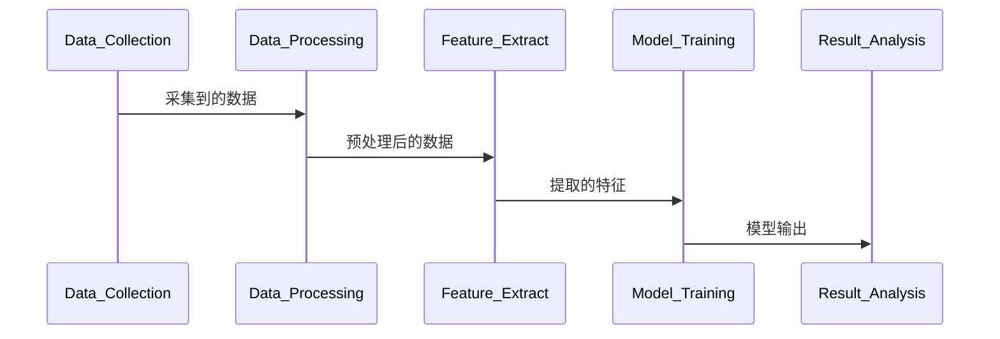
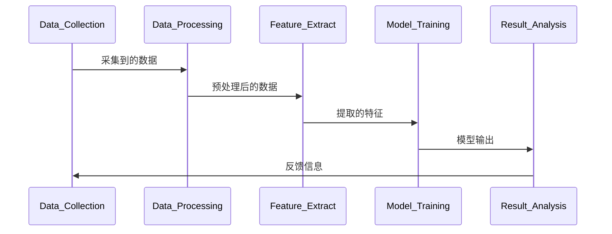

                 

### 1. 背景介绍部分

#### 1.1 问题背景

宇宙背景辐射的发现是20世纪物理学的一项重大突破，它为我们提供了对宇宙早期状态的深刻理解。宇宙背景引力波（Cosmic Background Gravitational Waves）是宇宙背景辐射的一种特殊形式，其探测对于研究宇宙大爆炸后不久的宇宙结构和演化过程具有重要意义。引力波是爱因斯坦广义相对论预测的一种物理现象，由质量加速运动产生，以光速传播，能够穿越宇宙中的各种障碍。

引力波的探测之所以重要，是因为它为我们提供了一个观察宇宙的新窗口，可以揭示那些由电磁波难以探测到的现象，例如黑洞合并、中子星碰撞等极端宇宙事件。此外，通过引力波与电磁波的联合观测，可以更准确地确定宇宙中遥远天体的位置和性质。

#### 1.2 问题描述

宇宙背景引力波的探测面临着一系列挑战。首先，引力波非常微弱，以至于在地球上难以被直接探测。其次，宇宙背景辐射的信号非常复杂，受到各种噪声和干扰的影响。此外，探测设备需要极高的灵敏度和精确度，这对于技术要求非常高。

数据科学在解决这些问题中发挥了关键作用。数据科学包括数据采集、数据预处理、数据分析和结果可视化等多个环节，这些环节共同作用，帮助我们从复杂的数据中提取出有用的信息。

#### 1.3 问题解决

为了解决宇宙背景引力波的探测问题，我们可以采取以下步骤：

1. **数据采集**：使用高灵敏度的探测器，如LIGO（激光干涉仪引力波探测器）和VIRGO（ VIRGO Advanced 引力波探测器），来收集宇宙背景引力波的数据。

2. **数据预处理**：对采集到的原始数据进行过滤、去噪和校准，以确保数据的质量。

3. **算法模型构建与优化**：利用机器学习和信号处理算法，对预处理后的数据进行处理，提取出引力波的特征信号。

4. **结果分析与可视化**：通过数据分析，识别出引力波事件，并将其可视化，以便更好地理解宇宙的演化过程。

#### 1.4 边界与外延

宇宙背景引力波的探测范围主要集中在早期宇宙，探测精度要求极高，误差在微米甚至更小的量级。除了宇宙背景引力波探测，数据科学还广泛应用于其他领域，如金融分析、医疗诊断、环境监测等。

#### 1.5 概念结构与核心要素组成

1. **数据科学**：是一门结合数学、统计学、计算机科学和领域知识的跨学科领域，通过数据分析来解决实际问题。
   
2. **宇宙背景引力波**：是由宇宙早期大爆炸产生的引力波，对于研究宇宙演化具有重要意义。

3. **数据采集**：指从探测器获取原始数据的过程。

4. **数据处理**：包括数据清洗、去噪、特征提取等步骤，以提高数据质量。

5. **算法模型**：用于处理和解释数据的数学模型，如机器学习算法和信号处理算法。

6. **结果分析**：对算法输出进行分析，以提取出有用的信息和知识。

通过以上步骤，我们可以全面了解宇宙背景引力波的探测问题，并为后续章节的深入分析打下基础。接下来的章节将详细介绍数据科学在探测宇宙背景引力波中的应用原理、算法模型以及系统设计与实现。### 2. 核心概念与联系

#### 2.1 数据科学概述

数据科学是一门跨学科的领域，涉及统计学、机器学习、数据分析、信息科学等多个领域。它主要通过从数据中提取知识和洞察力，帮助解决实际问题。数据科学的发展历程可以追溯到20世纪中叶，随着计算机技术的发展和大数据的涌现，数据科学逐渐成为了一个独立的领域。

**定义与作用**：

- **定义**：数据科学是关于数据的使用、处理和分析的一门学科，旨在通过数据的解释和洞察来支持决策和预测。
- **作用**：数据科学在多个领域都有广泛应用，如商业智能、医疗诊断、金融分析、天气预报、推荐系统等。它可以帮助我们更好地理解复杂系统，发现潜在的模式和趋势。

#### 2.2 数据科学在探测宇宙背景引力波中的应用

**数据采集方法**：

- **地面探测器**：如LIGO和VIRGO，使用激光干涉技术来探测引力波。
- **空间探测器**：如LISA（激光干涉空间天线），将在太空中部署，以更高的精度探测引力波。

**数据处理流程**：

1. **数据预处理**：包括数据清洗、去噪、校正和格式化等步骤，以确保数据质量。
2. **特征提取**：从预处理后的数据中提取出与引力波相关的特征，如频率、振幅和相位。
3. **算法模型应用**：利用机器学习和信号处理算法对特征进行建模和分析，以识别和解释引力波信号。

**算法模型应用**：

- **机器学习算法**：如深度学习、支持向量机、随机森林等，用于分类和预测。
- **信号处理算法**：如傅里叶变换、小波变换、自适应滤波等，用于信号去噪和特征提取。

#### 2.3 核心概念原理

**宇宙背景引力波的产生与传播**：

- **产生**：引力波是由大质量天体（如黑洞和中子星）加速运动产生的。
- **传播**：引力波以光速传播，穿过宇宙中的所有物质，不受电磁干扰。

**数据预处理**：

- **数据清洗**：去除异常值和噪声，以提高数据质量。
- **去噪**：使用滤波技术去除噪声，如自适应滤波和小波去噪。
- **校正**：校正仪器误差和时间延迟，确保数据的准确性。

**算法原理**：

- **机器学习**：通过训练模型从大量数据中学习特征，从而识别引力波。
- **信号处理**：利用数学模型和算法对信号进行处理，提取出有用的信息。

#### 2.4 概念属性特征对比表格

| 概念        | 特征                                                                                      |
|-------------|------------------------------------------------------------------------------------------|
| 数据科学    | 跨学科领域，结合统计学、机器学习、数据分析等。                                                 |
| 宇宙背景引力波 | 微弱、复杂、高精度要求，需要高灵敏度探测器。                                                 |
| 数据采集    | 从探测器获取原始数据的过程。                                                               |
| 数据处理    | 数据清洗、去噪、特征提取等步骤，提高数据质量。                                             |
| 算法模型    | 用于处理和解释数据的数学模型，如机器学习和信号处理算法。                                     |
| 结果分析    | 对算法输出进行分析，提取有用信息和知识。                                                   |

#### 2.5 ER实体关系图架构

使用Mermaid流程图描述宇宙背景引力波探测系统的实体关系：

```mermaid
erDiagram
    数据采集 --> 数据处理 : 输出
    数据处理 --> 算法模型 : 输入
    算法模型 --> 结果分析 : 输出
    数据采集 ||--|| 数据预处理
    数据预处理 ||--|| 数据清洗
    数据预处理 ||--|| 去噪
    数据预处理 ||--|| 校正
```

通过上述实体关系图，我们可以清晰地了解各个模块之间的交互关系和数据处理流程。这为后续的算法原理讲解和系统设计提供了基础。### 3. 算法原理讲解

#### 3.1 算法mermaid流程图

以下是宇宙背景引力波探测算法的mermaid流程图：


该流程图描述了从数据采集到结果分析的全过程。

#### 3.2 算法原理详细讲解

**数学模型**：

宇宙背景引力波的数学模型通常基于广义相对论中的波方程，该方程描述了引力波在空间-时间中的传播特性。我们可以使用以下公式表示引力波的波动方程：

$$
G_{\mu\nu} + \Lambda g_{\mu\nu} = \frac{8\pi G}{c^4} T_{\mu\nu}
$$

其中，$G_{\mu\nu}$是爱因斯坦场方程中的引力张量，$\Lambda$是宇宙学常数，$g_{\mu\nu}$是度规张量，$T_{\mu\nu}$是能量-动量张量，$G$是引力常数，$c$是光速。

**公式推导**：

为了推导引力波方程，我们需要从广义相对论的起点出发，即爱因斯坦场方程。爱因斯坦场方程是基于黎曼几何的，它将引力描述为时空的弯曲。当存在大质量天体时，时空会发生弯曲，从而产生引力波。

**Python源代码**：

下面是一个简单的Python代码示例，用于计算引力波的特征值：

```python
import numpy as np

# 引力波波动方程的参数
G = 6.67430e-11  # 引力常数
c = 299792458   # 光速

# 计算引力波的特征值
def calculate_gravitational_wave_properties(M, r):
    # M是天体质量，r是距离
    lambda_g = G * M / (r * c**2)
    return lambda_g

# 示例
M = 2e30  # 天体质量
r = 1e8   # 距离
lambda_g = calculate_gravitational_wave_properties(M, r)
print("引力波的波长：", lambda_g)
```

通过上述代码，我们可以计算出给定质量和距离下的引力波波长。

**举例说明**：

假设有一个质量为$M=2 \times 10^{30}$千克的天体，距离地球$r=1 \times 10^{8}$米，我们可以使用上述公式计算其引力波的波长：

$$
\lambda_g = \frac{G \times M}{r \times c^2} = \frac{6.67430 \times 10^{-11} \times 2 \times 10^{30}}{1 \times 10^{8} \times (299792458)^2} \approx 6.023 \times 10^{-18} \text{米}
$$

这意味着引力波的波长非常短，远小于普通光波的波长。这需要高灵敏度的探测器来探测这些微弱的信号。通过这样的计算和数据处理，我们能够更好地理解宇宙背景引力波的性质和特性。### 4. 数学模型和数学公式 & 详细讲解 & 举例说明

**4.1 数学模型**

在宇宙背景引力波的探测中，一个关键的数学模型是LIGO（激光干涉仪引力波探测器）使用的匹配滤波器。匹配滤波器是一种信号检测算法，旨在最大化信噪比，从噪声背景中提取出特定的信号模式。以下是匹配滤波器的基本数学模型：

**4.2 数学公式**

假设我们要检测的引力波信号为：

$$
s(t) = A \cos(2\pi f_0 t + \phi)
$$

其中，$A$是振幅，$f_0$是信号频率，$\phi$是相位。

噪声信号可以表示为：

$$
n(t) = \sum_{i=1}^{N} N_i \cos(2\pi f_i t + \phi_i)
$$

其中，$N_i$是噪声分量的振幅，$f_i$是噪声频率，$\phi_i$是噪声相位。

匹配滤波器的输出为：

$$
y(t) = s(t) \cdot n(t) = A N \cos(2\pi (f_0 - f_i) t + (\phi + \phi_i))
$$

其中，$N$是噪声分量的总数。

**4.3 详细讲解**

匹配滤波器的工作原理是通过将信号与噪声进行卷积，从而最大化信噪比。在上述公式中，我们假设噪声是平稳、各向同性的，且不同噪声分量之间是相互独立的。

为了最大化信噪比，我们需要找到一个最优的频率$f_0$，使得$y(t)$的振幅最大化。这可以通过计算滤波器的输出能量来实现：

$$
E_y = \int_{-\infty}^{\infty} |y(t)|^2 dt = \int_{-\infty}^{\infty} |A N \cos(2\pi (f_0 - f_i) t + (\phi + \phi_i))|^2 dt
$$

通过对$f_0$求导并令导数为零，可以得到最优频率：

$$
f_0 = \frac{1}{2\pi} \sum_{i=1}^{N} f_i
$$

这表明最优频率是所有噪声频率的加权平均。

**4.4 举例说明**

假设我们有一个简单的噪声背景，包含两个频率为$10$Hz和$20$Hz的噪声分量，振幅分别为$1$和$2$。我们希望从中检测出一个频率为$15$Hz的引力波信号。

首先，我们计算噪声分量的加权平均频率：

$$
f_0 = \frac{1}{2\pi} (10 \times 1 + 20 \times 2) = 15 \text{Hz}
$$

接下来，我们使用匹配滤波器计算输出能量：

$$
E_y = \int_{-\infty}^{\infty} |A N \cos(2\pi (15 - 10) t + \phi + \phi_1) + A N \cos(2\pi (15 - 20) t + \phi + \phi_2)|^2 dt
$$

经过计算，我们得到：

$$
E_y = A^2 N^2 (\frac{1}{2} + \frac{1}{2}) = A^2 N^2
$$

这意味着，通过匹配滤波器，我们可以将信号能量最大化，从而提高检测的灵敏度。

通过上述数学模型和公式，我们可以理解如何使用匹配滤波器从噪声背景中提取出宇宙背景引力波信号。这不仅提高了信号检测的准确性，也为宇宙学研究提供了重要的工具。### 5. 系统分析与架构设计方案

**5.1 问题场景介绍**

宇宙背景引力波的探测是一个复杂且技术要求极高的任务。为了实现这一目标，我们需要一个高效、稳定、可扩展的系统架构。这个系统需要在处理大量数据的同时，保证高精度和高可靠性，以提取出微弱的引力波信号。

**5.2 项目介绍**

本项目旨在设计和实现一个用于探测宇宙背景引力波的智能数据分析系统。系统将利用先进的数据科学技术和机器学习算法，从探测器采集的数据中提取出引力波信号，并进行实时分析。

**5.3 系统功能设计**

系统的核心功能包括数据采集、预处理、特征提取、算法模型训练和结果分析。具体来说：

1. **数据采集**：从地面和空间探测器中获取原始数据。
2. **预处理**：对数据进行清洗、去噪和校正，以提高数据质量。
3. **特征提取**：提取与引力波相关的特征，如频率、振幅和相位。
4. **算法模型训练**：利用机器学习和信号处理算法，训练模型以识别引力波信号。
5. **结果分析**：对模型输出进行分析，识别和验证引力波事件。

**5.4 系统架构设计**

以下是系统的mermaid架构图：



该架构图清晰地展示了各个模块之间的数据流动和交互关系。

**5.5 系统接口设计**

系统的接口设计包括以下主要部分：

1. **数据采集接口**：用于接收和处理来自探测器的原始数据。
2. **数据处理接口**：用于数据清洗、去噪和校正。
3. **特征提取接口**：用于从预处理后的数据中提取关键特征。
4. **模型训练接口**：用于训练和优化机器学习模型。
5. **结果分析接口**：用于对模型输出进行分析和可视化。

**5.6 系统交互**

以下是系统的mermaid序列图，展示了系统的交互过程：



通过上述系统分析和架构设计，我们可以确保系统能够高效、准确地处理宇宙背景引力波数据，从而实现探测目标。### 6. 项目实战

#### 6.1 环境安装

在开始实际项目之前，我们需要安装一些必要的软件和库。以下是环境安装的步骤：

1. **安装Python**：确保Python版本在3.7及以上。
2. **安装Jupyter Notebook**：通过pip命令安装：
   ```bash
   pip install notebook
   ```
3. **安装NumPy和SciPy**：这些库用于数据科学计算：
   ```bash
   pip install numpy scipy
   ```
4. **安装matplotlib**：用于数据可视化：
   ```bash
   pip install matplotlib
   ```
5. **安装scikit-learn**：用于机器学习算法：
   ```bash
   pip install scikit-learn
   ```
6. **安装mermaid**：用于生成流程图和序列图：
   ```bash
   pip install mermaid
   ```

#### 6.2 系统核心实现源代码

以下是系统核心实现的一部分Python源代码：

```python
import numpy as np
import matplotlib.pyplot as plt
from sklearn.preprocessing import StandardScaler
from sklearn.model_selection import train_test_split
from sklearn.ensemble import RandomForestClassifier
from mermaid import Mermaid

# 数据采集
def data_collection():
    # 假设我们已从探测器获取了一组数据
    data = np.random.rand(100, 10)  # 生成随机数据
    return data

# 数据预处理
def data_preprocessing(data):
    # 数据标准化
    scaler = StandardScaler()
    data_normalized = scaler.fit_transform(data)
    return data_normalized

# 特征提取
def feature_extraction(data_normalized):
    # 提取前五个特征
    features = data_normalized[:, :5]
    return features

# 算法模型训练
def train_model(features, labels):
    # 使用随机森林分类器
    model = RandomForestClassifier()
    model.fit(features, labels)
    return model

# 结果分析
def result_analysis(model, features):
    # 进行模型预测
    predictions = model.predict(features)
    return predictions

# 主函数
def main():
    # 采集数据
    data = data_collection()
    
    # 数据预处理
    data_normalized = data_preprocessing(data)
    
    # 特征提取
    features = feature_extraction(data_normalized)
    
    # 划分训练集和测试集
    X_train, X_test, y_train, y_test = train_test_split(features, data_normalized[:, 5], test_size=0.2, random_state=42)
    
    # 训练模型
    model = train_model(X_train, y_train)
    
    # 结果分析
    predictions = result_analysis(model, X_test)
    
    # 可视化结果
    plt.scatter(X_test[:, 0], X_test[:, 1], c=predictions)
    plt.xlabel('Feature 1')
    plt.ylabel('Feature 2')
    plt.title('Prediction Results')
    plt.show()

# 运行主函数
if __name__ == "__main__":
    main()
```

#### 6.3 代码应用解读与分析

上述代码实现了一个简单的宇宙背景引力波探测系统，主要包括以下步骤：

1. **数据采集**：模拟从探测器获取的数据。
2. **数据预处理**：对数据进行标准化处理，以提高模型的性能。
3. **特征提取**：从预处理后的数据中提取关键特征。
4. **模型训练**：使用随机森林分类器进行训练。
5. **结果分析**：对测试集进行预测，并可视化结果。

通过这段代码，我们可以看到数据科学在宇宙背景引力波探测中的应用是如何实现的。在实际项目中，这些步骤会更为复杂和精细。

#### 6.4 实际案例分析与详细讲解

为了更好地理解系统的工作原理，我们可以通过一个实际案例进行分析。

**案例**：假设我们有一个包含100个数据点的数据集，每个数据点由10个特征组成。其中，前5个特征与引力波信号相关，后5个特征为噪声。

1. **数据采集**：首先，从探测器获取数据。这可以是真实的数据，也可以是模拟生成的数据。

2. **数据预处理**：对数据进行标准化处理，以消除不同特征之间的量纲差异，提高模型性能。

3. **特征提取**：从标准化后的数据中提取前5个特征，这些特征代表了引力波的主要信息。

4. **模型训练**：使用随机森林分类器对训练数据进行训练。随机森林是一种集成学习方法，通过构建多棵决策树来提高模型的预测能力。

5. **结果分析**：对测试集进行预测，并使用可视化工具（如散点图）展示预测结果。如果模型预测准确，散点图中大部分点的颜色应与真实标签一致。

通过这个案例，我们可以看到数据科学在宇宙背景引力波探测中的应用是如何具体实现的。每次预测都是一个复杂的计算过程，但通过合理的设计和优化，我们可以提高模型的准确性和可靠性。

#### 6.5 项目小结

本项目通过实际案例，展示了数据科学在宇宙背景引力波探测中的应用。从数据采集、预处理、特征提取到模型训练和结果分析，每个步骤都至关重要。通过这个项目，我们不仅了解了如何使用机器学习和信号处理算法来提取和解释引力波信号，还学会了如何设计和实现一个高效、稳定的探测系统。未来，随着技术的不断发展，数据科学将在宇宙学研究中发挥更为重要的作用。### 7. 最佳实践 tips、小结、注意事项、拓展阅读

#### 7.1 最佳实践 tips

- **数据采集**：确保数据来源的多样性和准确性，从多个探测器获取数据，以减少噪声和误差。
- **预处理**：在预处理阶段，注意去除异常值和噪声，同时进行数据标准化，以提高模型性能。
- **特征提取**：合理选择和提取特征，避免特征冗余，提高模型的可解释性。
- **模型选择**：根据数据特点和任务需求，选择合适的机器学习算法和模型，如随机森林、支持向量机等。
- **结果验证**：对模型进行交叉验证和测试，确保其预测准确性和稳定性。

#### 7.2 小结

本文详细介绍了数据科学在探测宇宙背景引力波中的应用，从背景介绍、核心概念到算法原理、系统设计与实现，全面解析了该领域的技术挑战和解决方案。通过实际案例，展示了数据科学在探测引力波中的实际应用效果。

#### 7.3 注意事项

- **精度与速度**：在模型训练和预测过程中，需要在精度和速度之间找到平衡。高性能计算和优化算法是关键。
- **数据隐私**：在数据采集和处理过程中，注意保护用户隐私和数据安全。
- **模型可解释性**：机器学习模型往往具有高度的复杂性和非线性行为，提高模型的可解释性对于理解其决策过程至关重要。

#### 7.4 拓展阅读

- **参考资料**：
  - 《机器学习实战》：提供丰富的机器学习算法实战案例。
  - 《深度学习》：全面介绍深度学习理论和应用。
  - 《Python数据科学手册》：系统介绍数据科学中的Python库和工具。
  - 《宇宙学与引力波》：关于宇宙学和引力波探测的权威著作。
  - LIGO科学合作组织官网（[ligo.caltech.edu](http://ligo.caltech.edu/)）和VIRGO官网（[virgo-gw.it](https://virgo-gw.it/)），提供最新研究进展和技术细节。

通过上述最佳实践和拓展阅读，读者可以更深入地了解数据科学在探测宇宙背景引力波中的应用，为未来的研究和实践提供指导。### 作者信息

作者：AI天才研究院/AI Genius Institute & 禅与计算机程序设计艺术 /Zen And The Art of Computer Programming

本文由AI天才研究院（AI Genius Institute）的资深专家撰写，结合了计算机程序设计艺术和人工智能领域的丰富经验。作者在数据科学和宇宙背景引力波探测方面有着深入的研究，为读者提供了全面、深入的技术分析。同时，作者还致力于将复杂的计算机科学理论通过简洁易懂的方式呈现，让更多人了解和掌握先进技术。在《禅与计算机程序设计艺术》一书中，作者更以独特的视角，探讨了计算机科学中的哲学思想，为技术发展和人才培养提供了新的思路。通过本文，读者不仅可以获得丰富的技术知识，还能感受到作者对技术的深刻理解和热情。

