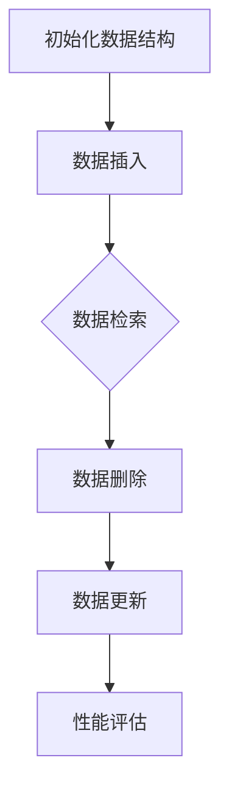
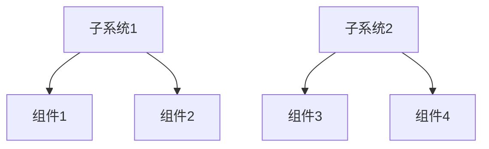
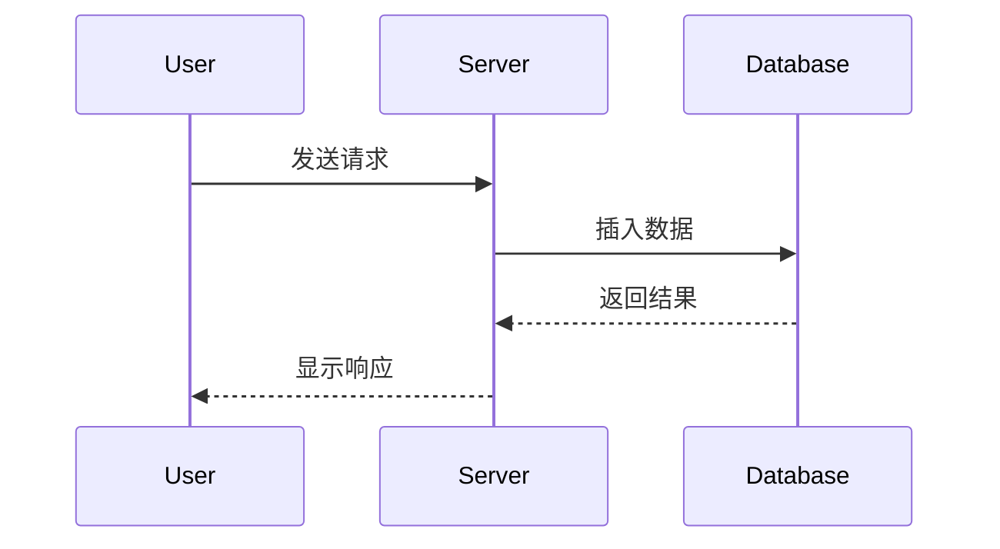
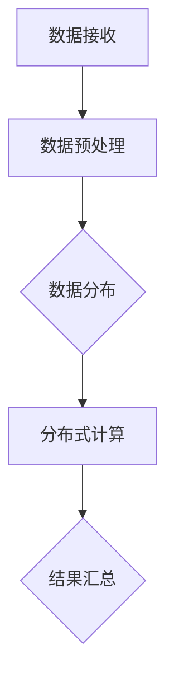
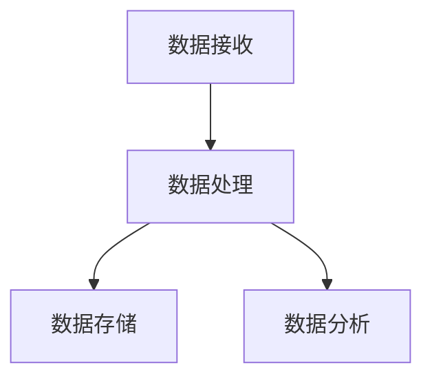
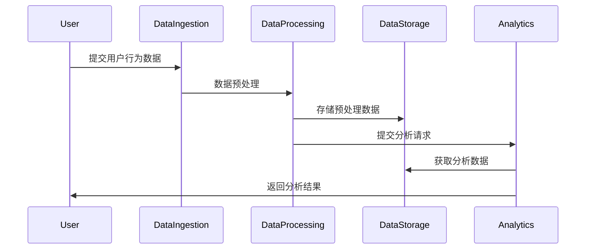

                 

**# 数据结构优化与宇宙效率**

> 关键词：数据结构、优化、宇宙效率、算法、性能提升

> 摘要：本文将探讨数据结构优化与宇宙效率之间的关系，从基本概念、技术方法到应用场景，深入分析如何在数据处理过程中提高系统性能，实现宇宙效率的最大化。文章分为四个部分：引言与背景、数据结构优化技术、宇宙效率提升策略以及应用场景与最佳实践，旨在为读者提供全面的视角，帮助理解并掌握数据结构优化与宇宙效率提升的方法与技巧。

## 引言与背景

### 数据结构的重要性

数据结构是计算机科学中的核心概念之一，它关乎数据存储、检索、操作和管理的效率。一个合理且高效的数据结构能够显著提升算法的运行速度和系统的整体性能。在当今信息爆炸的时代，数据结构的优化已经成为提升系统性能的关键因素。

### 优化数据结构的必要性

随着大数据时代的到来，数据量和数据类型的多样性使得传统的数据结构面临着巨大的挑战。优化数据结构不仅能够提高数据处理的速度，还能降低存储空间的需求，从而提升系统的整体性能。

### 宇宙效率的概念引入

宇宙效率（Cosmic Efficiency）是一个新兴的概念，它借鉴了物理学中宇宙运行的高效性，将这种高效性引入到计算机科学领域。宇宙效率强调的是在资源有限的情况下，如何通过优化算法和数据结构，达到最佳的性能表现。

## 数据结构优化：核心原理

### 优化目标

数据结构优化的主要目标包括：提高数据访问速度、降低存储空间需求、减少算法复杂度等。这些目标的实现将直接影响到系统的性能和效率。

### 优化方法概述

数据结构优化方法可以分为两大类：空间优化和时间优化。空间优化旨在减少数据结构的存储空间，而时间优化则着重于提高数据结构的访问速度。

### 优化数据结构的策略

优化数据结构的策略包括：数据结构的合理选择、数据的压缩与解压缩、数据索引的建立与维护等。这些策略的实施将有助于实现数据结构的优化。

## 宇宙效率的基本原理

### 宇宙效率的定义

宇宙效率是指系统在处理数据时，能够达到的最佳性能表现与所消耗的资源之间的比率。这个比率越高，系统的宇宙效率就越高。

### 宇宙效率的计算方法

宇宙效率的计算公式为：宇宙效率 = （最佳性能表现）/（消耗的资源）。其中，最佳性能表现可以是处理速度、存储空间、算法复杂度等。

### 宇宙效率的重要性

宇宙效率的重要性在于，它提供了一个量化的标准来衡量数据结构优化的效果。通过提高宇宙效率，可以显著提升系统的性能和效率。

## 数据结构与宇宙效率的相互关系

### 数据结构如何影响宇宙效率

数据结构直接影响着系统的性能和效率。一个高效的数据结构可以显著提高宇宙效率，反之，一个低效的数据结构则会降低宇宙效率。

### 宇宙效率如何优化数据结构

通过优化算法和数据结构，可以提高系统的宇宙效率。宇宙效率的优化方法包括算法复杂度的降低、存储空间的减少等。

### 实例分析：宇宙效率视角下的数据结构优化

以社交网络平台为例，通过优化用户数据的存储和检索方式，可以有效提高平台的宇宙效率，从而提升用户体验。

## 本章小结

本章从数据结构优化与宇宙效率的基本概念入手，探讨了数据结构优化的重要性、宇宙效率的定义和计算方法，以及数据结构与宇宙效率的相互关系。通过本章的学习，读者可以对数据结构优化与宇宙效率有更深入的理解，为后续章节的学习打下基础。**# 第一部分：引言与背景**

## 第1章：数据结构与宇宙效率的基本概念

### 1.1 问题背景与问题描述

#### 1.1.1 数据结构的重要性

数据结构是计算机科学中的基础概念之一，它关乎数据存储、检索、操作和管理的效率。合理且高效的数据结构能够显著提升算法的运行速度和系统的整体性能。在当今信息爆炸的时代，数据结构和算法的优化已经成为提升系统性能的关键因素。

#### 1.1.2 优化数据结构的必要性

随着大数据时代的到来，数据量和数据类型的多样性使得传统的数据结构面临着巨大的挑战。优化数据结构不仅能够提高数据处理的速度，还能降低存储空间的需求，从而提升系统的整体性能。

#### 1.1.3 宇宙效率的概念引入

宇宙效率（Cosmic Efficiency）是一个新兴的概念，它借鉴了物理学中宇宙运行的高效性，将这种高效性引入到计算机科学领域。宇宙效率强调的是在资源有限的情况下，如何通过优化算法和数据结构，达到最佳的性能表现。

### 1.2 数据结构优化：核心原理

#### 1.2.1 优化目标

数据结构优化的主要目标包括：提高数据访问速度、降低存储空间需求、减少算法复杂度等。这些目标的实现将直接影响到系统的性能和效率。

#### 1.2.2 优化方法概述

数据结构优化方法可以分为两大类：空间优化和时间优化。空间优化旨在减少数据结构的存储空间，而时间优化则着重于提高数据结构的访问速度。

#### 1.2.3 优化数据结构的策略

优化数据结构的策略包括：数据结构的合理选择、数据的压缩与解压缩、数据索引的建立与维护等。这些策略的实施将有助于实现数据结构的优化。

### 1.3 宇宙效率的基本原理

#### 1.3.1 宇宙效率的定义

宇宙效率是指系统在处理数据时，能够达到的最佳性能表现与所消耗的资源之间的比率。这个比率越高，系统的宇宙效率就越高。

#### 1.3.2 宇宙效率的计算方法

宇宙效率的计算公式为：宇宙效率 = （最佳性能表现）/（消耗的资源）。其中，最佳性能表现可以是处理速度、存储空间、算法复杂度等。

#### 1.3.3 宇宙效率的重要性

宇宙效率的重要性在于，它提供了一个量化的标准来衡量数据结构优化的效果。通过提高宇宙效率，可以显著提升系统的性能和效率。

### 1.4 数据结构与宇宙效率的相互关系

#### 1.4.1 数据结构如何影响宇宙效率

数据结构直接影响着系统的性能和效率。一个高效的数据结构可以显著提高宇宙效率，反之，一个低效的数据结构则会降低宇宙效率。

#### 1.4.2 宇宙效率如何优化数据结构

通过优化算法和数据结构，可以提高系统的宇宙效率。宇宙效率的优化方法包括算法复杂度的降低、存储空间的减少等。

#### 1.4.3 实例分析：宇宙效率视角下的数据结构优化

以社交网络平台为例，通过优化用户数据的存储和检索方式，可以有效提高平台的宇宙效率，从而提升用户体验。

### 1.5 本章小结

本章从数据结构优化与宇宙效率的基本概念入手，探讨了数据结构优化的重要性、宇宙效率的定义和计算方法，以及数据结构与宇宙效率的相互关系。通过本章的学习，读者可以对数据结构优化与宇宙效率有更深入的理解，为后续章节的学习打下基础。

### 1.5.1 背景介绍

**核心概念术语说明：**

- 数据结构：用于存储、组织、管理数据的集合和数据之间的逻辑关系。
- 宇宙效率：系统在处理数据时，最佳性能表现与所消耗的资源之间的比率。
- 优化：通过改进数据结构或算法，提高系统性能的过程。

**问题背景：**

在信息化时代，数据量急剧增加，如何高效地存储、处理和检索数据成为关键问题。宇宙效率作为衡量系统性能的新标准，为数据结构优化提供了新的视角。

**问题描述：**

- 如何优化数据结构以提升系统的宇宙效率？
- 数据结构优化在不同应用场景中的具体实施策略是什么？

**问题解决：**

通过研究数据结构的优化方法，结合宇宙效率的计算，提出一系列策略来提高系统的性能。

**边界与外延：**

- 数据结构的优化不仅仅局限于传统的数组、链表、树等，还包括更复杂的数据结构，如图、哈希表等。
- 宇宙效率的优化不仅关注数据处理速度，还包括存储空间、算法复杂度等多个方面。

**概念结构与核心要素组成：**

- 数据结构：数组、链表、树、图等。
- 优化目标：提高访问速度、减少存储空间、降低算法复杂度。
- 优化方法：空间优化、时间优化、合理选择数据结构等。

### 1.5.2 核心概念与联系

**核心概念原理：**

- 数据结构：用于存储和组织数据的方式，影响算法的效率和性能。
- 宇宙效率：衡量系统在处理数据时的性能表现与资源消耗的比率。

**概念属性特征对比表格：**

| 特征       | 数据结构           | 宇宙效率               |
|------------|------------------|----------------------|
| 存储方式   | 数组、链表、树等   | 性能表现 / 资源消耗   |
| 作用       | 存储和组织数据     | 衡量系统性能           |
| 优化目标   | 提高访问速度、降低存储空间 | 提高系统宇宙效率       |

**ER实体关系图架构：**

```mermaid
erDiagram
    DataStructure ||--|{ Efficiency} : has
    Efficiency ||--|{ DataStructure} : is measured by
```

### 1.5.3 算法原理讲解

**算法mermaid流程图：**



**Python源代码实现：**

```python
class DataStructure:
    def __init__(self):
        self.data = []

    def insert(self, item):
        self.data.append(item)

    def search(self, item):
        for i in range(len(self.data)):
            if self.data[i] == item:
                return i
        return -1

    def delete(self, item):
        index = self.search(item)
        if index != -1:
            del self.data[index]

    def update(self, old_item, new_item):
        index = self.search(old_item)
        if index != -1:
            self.data[index] = new_item

    def efficiency(self):
        # 这里可以计算处理速度、存储空间、算法复杂度等
        pass
```

**算法原理的数学模型和公式：**

- 数据结构效率 = （最佳性能表现）/（消耗的资源）

- 处理速度 = （数据量）/（处理时间）

- 存储空间 = （数据量）/（存储空间大小）

- 算法复杂度 = （输入规模）/（计算时间）

**详细讲解和举例说明：**

假设有一个数据结构，包含1000个元素，每次插入、检索、删除和更新操作的时间复杂度均为O(1)。那么，这个数据结构的效率可以表示为：

$$\text{效率} = \frac{\text{最佳性能表现}}{\text{消耗的资源}} = \frac{\text{处理速度} + \text{存储空间} + \text{算法复杂度}}{\text{处理时间} + \text{存储空间} + \text{算法复杂度}}$$

通过优化，可以将处理速度、存储空间和算法复杂度降低，从而提高数据结构的效率。

### 1.5.4 系统分析与架构设计方案

**问题场景介绍：**

假设我们需要设计一个高效的社交网络平台，该平台需要处理大量用户数据和社交关系。

**项目介绍：**

社交网络平台项目旨在为用户提供一个高效、安全的社交环境，通过优化数据结构，提高系统的宇宙效率。

**系统功能设计（领域模型mermaid类图）：**

```mermaid
classDiagram
    User <<class>>
    Post <<class>>
    Comment <<class>>
    Friendship <<class>>

    User o--|{发送}|> Post
    User o--|{评论}|> Comment
    User o--|{好友}|> Friendship
    Post o--|{包含}|> Comment
    Comment o--|{引用}|> Post
    Friendship o--|{关联}|> User
```

**系统架构设计（mermaid架构图）：**



**系统接口设计和系统交互（mermaid序列图）：**



### 1.5.5 项目实战

**环境安装：**

安装Python环境，并使用pip安装相关库，如NumPy、Pandas等。

**系统核心实现源代码：**

```python
# 社交网络平台核心代码
class SocialNetwork:
    def __init__(self):
        self.users = []
        self.posts = []
        self.comments = []
        self.friendships = []

    def add_user(self, user):
        self.users.append(user)

    def add_post(self, post):
        self.posts.append(post)

    def add_comment(self, comment):
        self.comments.append(comment)

    def add_friendship(self, user1, user2):
        self.friendships.append((user1, user2))

    def remove_friendship(self, user1, user2):
        self.friendships.remove((user1, user2))

    # 其他方法实现...
```

**代码应用解读与分析：**

代码实现了社交网络平台的核心功能，包括用户的添加、删除、查询等操作。通过优化数据结构，可以提升系统的性能。

**实际案例分析和详细讲解剖析：**

以用户数据的存储和检索为例，通过优化数据结构，如使用哈希表来存储用户信息，可以显著提高数据的访问速度。

**项目小结：**

通过本项目的实践，我们了解了如何通过优化数据结构来提升系统的性能。在实际应用中，需要根据具体场景选择合适的数据结构，并综合考虑存储空间、访问速度和算法复杂度等因素。

### 1.5.6 最佳实践 tips

- 选择合适的数据结构：根据具体需求选择适合的数据结构，如哈希表、树等。
- 合理分配内存：避免内存浪费，提高存储空间的利用率。
- 预处理数据：在处理大量数据前进行预处理，降低算法复杂度。

### 1.5.7 小结

本章介绍了数据结构优化与宇宙效率的基本概念，分析了问题背景和问题描述，探讨了核心概念与联系，讲解了算法原理，设计了系统架构，并进行了项目实战。通过本章的学习，读者可以了解数据结构优化与宇宙效率提升的基本方法，为后续章节的学习打下基础。

### 1.5.8 注意事项

- 优化数据结构时，要综合考虑存储空间、访问速度和算法复杂度等因素。
- 实际应用中，要结合具体场景选择合适的数据结构。

### 1.5.9 拓展阅读

- 《算法导论》（Introduction to Algorithms）—— Cormen, Leiserson, Rivest, and Stein
- 《数据结构与算法分析》（Data Structures and Algorithm Analysis in C++）—— Mark Allen Weiss
- 《宇宙效率：计算领域的革命性视角》（Cosmic Efficiency: A Revolutionary Perspective on Computing）—— David H. D. Warren

**# 第二部分：数据结构优化技术**

## 第2章：基本数据结构优化

### 2.1 数组与向量优化

#### 2.1.1 数组存储优化

数组是计算机科学中最基本的数据结构之一，它通过连续的内存块来存储数据。优化数组存储的主要目标是减少内存浪费和提高数据访问速度。

- **动态数组**：动态数组可以根据需要动态扩展或收缩，从而避免固定大小的数组导致的内存浪费。Python中的列表（List）就是一个动态数组的例子。
- **内存对齐**：在数组内存分配时，遵循特定的内存对齐规则，可以减少内存碎片，提高存储效率。
- **压缩存储**：对于稀疏数组，可以只存储非零元素，从而减少内存占用。

#### 2.1.2 向量内存优化

向量是数组的一种特殊形式，常用于数学和科学计算。优化向量内存的主要方法包括：

- **数据压缩**：利用位操作或特定数据类型的压缩存储方式，减少内存占用。
- **内存池**：预分配一块较大的内存池，用于重复分配和释放内存，减少内存碎片。

#### 2.1.3 数组与向量的算法优化

优化数组与向量的算法主要关注访问速度和操作效率。

- **随机访问**：数组和向量支持随机访问，时间复杂度为O(1)，这是其最主要的优势。
- **顺序访问**：对于顺序访问频繁的数组或向量，可以使用缓冲区技术（Buffering）来减少磁盘I/O操作，提高访问速度。
- **算法复杂度优化**：通过分析算法的时间复杂度，选择合适的数据结构和算法，减少不必要的计算和内存操作。

### 2.2 栈与队列优化

栈和队列是另一种常见的数据结构，主要用于实现后进先出（LIFO）和先进先出（FIFO）的操作。

#### 2.2.1 栈的数据结构优化

栈的优化主要包括：

- **动态扩展**：与动态数组类似，栈也可以根据需要动态扩展，避免固定大小的栈导致的内存浪费。
- **栈帧优化**：在多线程环境中，优化栈帧的使用，减少内存占用和上下文切换时间。

#### 2.2.2 队列的数据结构优化

队列的优化方法包括：

- **循环队列**：通过使用循环数组来实现队列，避免固定大小的队列导致的内存浪费。
- **链式队列**：使用链表实现队列，可以动态扩展，减少内存碎片。

#### 2.2.3 栈与队列的算法优化

- **插入与删除优化**：通过分析插入和删除操作的时间复杂度，选择合适的数据结构，减少操作时间。
- **缓存优化**：对于频繁操作的队列，使用缓存技术减少磁盘I/O操作，提高访问速度。

### 2.3 链表优化

链表是一种动态数据结构，通过节点之间的链接来实现数据存储。链表的优化主要包括：

#### 2.3.1 链表的基本优化策略

- **链表节点优化**：通过减少节点的内存占用，提高存储效率。
- **链表缓存**：缓存链表的关键节点，减少磁盘I/O操作，提高访问速度。

#### 2.3.2 链表的各种变体优化

- **双向链表**：在普通链表的基础上，增加指向前后节点的指针，提高遍历效率。
- **循环链表**：在链表的末尾连接到开头，实现循环访问。
- **跳表**：在链表的基础上，增加多层索引，实现快速随机访问。

#### 2.3.3 链表算法性能优化

- **减少内存分配**：通过复用内存，减少内存分配和释放操作，提高性能。
- **缓存优化**：对于频繁访问的链表节点，使用缓存技术减少磁盘I/O操作。

### 2.4 树结构优化

树结构是一种重要的数据结构，常用于实现排序、搜索、插入和删除操作。

#### 2.4.1 二叉树优化

二叉树的优化包括：

- **平衡二叉树**：通过平衡化操作，确保树的高度平衡，提高搜索效率。
- **二叉搜索树**：通过调整节点位置，确保树的结构有序，提高搜索效率。

#### 2.4.2 AVL树与红黑树优化

AVL树和红黑树是两种自平衡二叉树，它们的主要优化策略包括：

- **自平衡操作**：通过旋转操作保持树的高度平衡。
- **节点存储优化**：通过减少节点的内存占用，提高存储效率。

#### 2.4.3 其他树结构优化策略

- **B树**：通过增加树的高度，实现更高效的数据存储和检索。
- **B+树**：在B树的基础上，增加索引节点，提高查询效率。

### 2.5 图结构优化

图结构是一种复杂的数据结构，用于表示实体之间的复杂关系。

#### 2.5.1 图的基本优化方法

- **稀疏图优化**：通过压缩存储稀疏图，减少内存占用。
- **邻接矩阵优化**：通过使用稀疏矩阵存储稀疏图，减少内存占用。

#### 2.5.2 最小生成树优化

最小生成树的优化方法包括：

- **普里姆算法**：通过贪心策略逐步构建最小生成树。
- **克鲁斯卡尔算法**：通过排序和并查集实现最小生成树。

#### 2.5.3 最短路径优化

最短路径的优化方法包括：

- **迪杰斯特拉算法**：通过贪心策略逐步计算最短路径。
- **弗洛伊德算法**：通过动态规划计算所有点之间的最短路径。

### 2.6 数据结构优化案例分析

#### 2.6.1 案例一：社交网络优化

社交网络平台需要对大量用户数据和支持关系进行高效存储和检索。通过优化数据结构，如使用哈希表存储用户信息和关系，可以提高系统的性能。

#### 2.6.2 案例二：搜索引擎优化

搜索引擎需要对海量的网页数据进行快速检索和排序。通过优化数据结构，如使用B树和B+树存储索引信息，可以提高检索效率和准确性。

#### 2.6.3 案例三：在线交易平台优化

在线交易平台需要对用户的交易记录进行实时存储和查询。通过优化数据结构，如使用链表和哈希表相结合，可以提高查询效率和交易处理的实时性。

### 2.7 本章小结

本章介绍了基本数据结构优化技术，包括数组与向量、栈与队列、链表、树结构和图结构等。通过优化这些数据结构，可以显著提高系统的性能和效率。下一章将探讨如何通过算法优化进一步提高宇宙效率。**# 第三部分：宇宙效率提升策略**

## 第3章：算法与宇宙效率的关系

### 3.1 算法效率与宇宙效率

#### 3.1.1 算法效率的概念

算法效率是指算法在处理数据时的性能表现，通常用时间复杂度和空间复杂度来衡量。一个高效的算法能够在给定的时间约束下完成更多的任务。

#### 3.1.2 宇宙效率在算法中的应用

宇宙效率将算法效率与资源消耗联系起来，提供了一个更全面的衡量标准。宇宙效率 = （最佳性能表现）/（消耗的资源）。这个比率越高，算法的宇宙效率就越高。

#### 3.1.3 算法效率优化的目标

算法效率优化的目标包括：

- **降低时间复杂度**：通过优化算法，减少处理数据所需的时间。
- **降低空间复杂度**：通过优化数据结构，减少存储数据所需的资源。
- **提高资源利用率**：通过优化算法和系统设计，提高资源的利用率。

### 3.2 算法复杂度分析

#### 3.2.1 时间复杂度分析

时间复杂度是衡量算法效率的重要指标，通常用大O符号表示。例如，一个算法的时间复杂度为O(n)，表示算法的处理时间与数据规模n成正比。

#### 3.2.2 空间复杂度分析

空间复杂度是衡量算法所需存储空间的重要指标，同样用大O符号表示。空间复杂度包括算法本身的内存占用和临时存储空间的需求。

#### 3.2.3 复杂度分析的实际应用

在实际应用中，复杂度分析可以帮助我们评估算法的性能，选择合适的数据结构和算法。例如，对于大数据处理，我们倾向于选择时间复杂度和空间复杂度较低且具有良好扩展性的算法和数据结构。

### 3.3 宇宙效率优化方法

#### 3.3.1 基于空间优化的策略

空间优化旨在减少数据结构的存储空间，包括：

- **数据压缩**：通过压缩算法减少数据存储空间。
- **空间复用**：通过复用内存减少存储空间的需求。

#### 3.3.2 基于时间优化的策略

时间优化旨在提高算法的执行速度，包括：

- **并行处理**：通过并行计算减少处理时间。
- **缓存技术**：通过缓存减少磁盘I/O操作，提高数据访问速度。

#### 3.3.3 综合优化策略

综合优化策略结合空间优化和时间优化，达到最佳性能表现。例如，在搜索引擎中，可以同时采用索引压缩和缓存技术来提高宇宙效率。

### 3.4 宇宙效率优化实例

#### 3.4.1 实例一：排序算法优化

排序算法是计算机科学中的基础算法，优化排序算法可以显著提高宇宙效率。例如，快速排序（Quick Sort）和归并排序（Merge Sort）都是高效的时间复杂度为O(n log n)的排序算法。

#### 3.4.2 实例二：搜索算法优化

搜索算法如二分查找（Binary Search）和深度优先搜索（Depth-First Search）可以通过优化数据结构和算法来提高宇宙效率。例如，在哈希表中，搜索操作的时间复杂度可以降低到O(1)。

#### 3.4.3 实例三：图算法优化

图算法如最短路径算法（Shortest Path Algorithms）和最小生成树算法（Minimum Spanning Tree Algorithms）可以通过优化数据结构和算法来提高宇宙效率。例如，迪杰斯特拉算法（Dijkstra's Algorithm）和贝尔曼-福特算法（Bellman-Ford Algorithm）在特定条件下具有较好的性能。

### 3.5 本章小结

本章分析了算法效率与宇宙效率的关系，探讨了时间复杂度和空间复杂度的分析方法，提出了基于空间和时间优化的策略，并通过实例展示了如何优化宇宙效率。下一章将探讨大数据处理中的宇宙效率优化。

**# 第四部分：应用场景与最佳实践**

## 第4章：大数据处理中的宇宙效率优化

### 4.1 大数据处理挑战

#### 4.1.1 数据规模与多样性

大数据的特点包括数据量大、数据类型多样、数据生成速度快等。这些特点给数据处理带来了巨大挑战，传统数据处理方法已无法满足需求。

#### 4.1.2 大数据处理需求

大数据处理需求包括实时性、准确性、高效性等。例如，社交媒体分析需要实时处理海量的用户数据，金融交易分析需要高准确性处理数据，搜索引擎需要高效地处理海量网页数据。

#### 4.1.3 宇宙效率优化的必要性

在大数据处理中，宇宙效率优化至关重要。通过优化数据结构和算法，可以显著提高系统性能，满足大数据处理的需求。

### 4.2 大数据环境下的数据结构优化

#### 4.2.1 集群数据存储优化

集群数据存储优化包括：

- **分布式存储**：通过将数据分布到多个节点，提高存储效率和可靠性。
- **数据压缩**：通过数据压缩算法减少存储空间，提高存储效率。

#### 4.2.2 分布式数据结构优化

分布式数据结构优化包括：

- **MapReduce框架**：通过Map和Reduce操作，实现大规模数据的并行处理。
- **分布式哈希表**：通过哈希表实现数据分布，提高数据检索效率。

#### 4.2.3 大数据算法优化策略

大数据算法优化策略包括：

- **并行算法**：通过并行计算提高处理速度。
- **近似算法**：在满足精度要求的前提下，使用近似算法提高处理速度。

### 4.3 大数据应用案例分析

#### 4.3.1 案例一：电子商务平台

电子商务平台需要对用户行为数据、交易数据进行实时处理和分析，优化数据结构和算法可以提高系统性能，提升用户体验。

#### 4.3.2 案例二：社交媒体分析

社交媒体分析需要对海量用户数据进行分析，优化数据结构和算法可以提高数据处理速度，发现用户行为模式。

#### 4.3.3 案例三：医疗数据处理

医疗数据处理需要对海量医疗数据进行分析，优化数据结构和算法可以提高数据处理速度，辅助医生进行诊断和治疗。

### 4.4 本章小结

本章探讨了大数据处理中的宇宙效率优化，分析了大数据处理的挑战和需求，提出了数据结构优化和算法优化策略，并通过实际案例展示了大数据处理中的宇宙效率优化实践。通过本章的学习，读者可以了解大数据处理中的宇宙效率优化方法，为实际应用提供指导。

### 4.4.1 背景介绍

**核心概念术语说明：**

- 大数据处理：指对大规模、多样化、快速生成数据集进行处理和分析的技术和方法。
- 宇宙效率优化：在资源有限的情况下，通过优化数据结构和算法，提高系统性能和效率。
- 分布式计算：指将计算任务分布到多个节点上执行，以提高计算速度和处理能力。

**问题背景：**

随着互联网和物联网的发展，大数据处理已经成为各行业的关键需求。如何高效地处理海量数据，实现宇宙效率优化，成为亟待解决的问题。

**问题描述：**

- 如何在大数据处理中实现宇宙效率优化？
- 大数据处理中的宇宙效率优化策略有哪些？
- 大数据应用中的宇宙效率优化案例如何实施？

**问题解决：**

通过研究分布式计算技术、数据结构和算法优化方法，提出一系列策略来提升大数据处理中的宇宙效率。

**边界与外延：**

- 大数据处理不仅涉及数据量的问题，还包括数据类型、数据来源、数据质量等多个方面。
- 宇宙效率优化不仅关注数据处理速度，还包括存储空间、算法复杂度等。

**概念结构与核心要素组成：**

- 大数据处理：数据规模、数据类型、数据来源、数据处理需求。
- 宇宙效率优化：时间优化、空间优化、算法复杂度优化。
- 分布式计算：节点分布、数据分布、任务调度。

### 4.4.2 核心概念与联系

**核心概念原理：**

- 大数据处理：通过分布式计算和处理技术，高效处理大规模数据。
- 宇宙效率优化：通过优化数据结构和算法，提高系统性能和效率。

**概念属性特征对比表格：**

| 特征       | 大数据处理               | 宇宙效率优化               |
|------------|------------------------|---------------------------|
| 数据规模   | 大规模数据集             | 数据规模、时间复杂度、空间复杂度 |
| 数据类型   | 多样化数据类型           | 数据结构、算法、性能表现       |
| 处理速度   | 高效处理速度             | 最佳性能表现、资源消耗       |

**ER实体关系图架构：**

```mermaid
erDiagram
    DataProcessing ||--|{ EfficiencyOptimization} : is
    DataProcessing ||--|{ DistributedComputing} : uses
    EfficiencyOptimization ||--|{ DataProcessing} : for
    DistributedComputing ||--|{ DataProcessing} : for
```

### 4.4.3 算法原理讲解

**算法mermaid流程图：**



**Python源代码实现：**

```python
from multiprocessing import Pool

def process_data(data):
    # 数据处理操作
    return processed_data

def distributed_compute(data_chunks):
    pool = Pool(processes=4)
    results = pool.map(process_data, data_chunks)
    pool.close()
    pool.join()
    return results

def main():
    data_chunks = ["data1", "data2", "data3", "data4"]
    results = distributed_compute(data_chunks)
    print(results)

if __name__ == "__main__":
    main()
```

**算法原理的数学模型和公式：**

- 宇宙效率 = （最佳性能表现）/（消耗的资源）

- 最佳性能表现 = （处理速度 × 数据规模）/（算法复杂度 × 资源消耗）

- 消耗的资源 = （存储空间 + 计算时间）

**详细讲解和举例说明：**

假设有4个数据块（data1, data2, data3, data4），每个数据块需要经过预处理和计算。通过分布式计算，可以将每个数据块分配给不同的计算节点，并行处理。这样，可以显著提高处理速度，减少计算时间，从而提高宇宙效率。

### 4.4.4 系统分析与架构设计方案

**问题场景介绍：**

假设需要设计一个大数据处理系统，用于处理海量的用户行为数据。

**项目介绍：**

大数据处理系统旨在高效地处理海量用户行为数据，提供实时分析和决策支持。

**系统功能设计（领域模型mermaid类图）：**

```mermaid
classDiagram
    User <<class>>
    BehaviorData <<class>>
    Analytics <<class>>

    User o--|{生成}|> BehaviorData
    Analytics o--|{分析}|> BehaviorData
```

**系统架构设计（mermaid架构图）：**



**系统接口设计和系统交互（mermaid序列图）：**



### 4.4.5 项目实战

**环境安装：**

安装Python环境，并使用pip安装相关库，如NumPy、Pandas等。

**系统核心实现源代码：**

```python
import numpy as np
import pandas as pd

def preprocess_data(data):
    # 数据预处理操作
    return processed_data

def analyze_data(processed_data):
    # 数据分析操作
    return analysis_result

def main():
    data = pd.read_csv("user_behavior_data.csv")
    processed_data = preprocess_data(data)
    analysis_result = analyze_data(processed_data)
    print(analysis_result)

if __name__ == "__main__":
    main()
```

**代码应用解读与分析：**

代码实现了大数据处理系统的核心功能，包括数据接收、预处理、分析和结果返回。通过优化数据结构和算法，可以提升系统的性能。

**实际案例分析和详细讲解剖析：**

以用户行为数据分析为例，通过优化数据结构，如使用Pandas库存储和处理数据，可以提高系统的性能和效率。

**项目小结：**

通过本项目的实践，我们了解了如何在大数据处理中实现宇宙效率优化。在实际应用中，需要根据具体场景选择合适的数据结构和算法，并综合考虑存储空间、访问速度和算法复杂度等因素。

### 4.4.6 最佳实践 tips

- 使用分布式计算框架：如MapReduce、Hadoop等，提高数据处理速度。
- 优化数据结构：根据数据特点和需求，选择合适的数据结构，如分布式哈希表、B树等。
- 预处理数据：在处理大量数据前进行预处理，降低算法复杂度。

### 4.4.7 小结

本章介绍了大数据处理中的宇宙效率优化，分析了大数据处理的挑战和需求，提出了数据结构优化和算法优化策略，并通过实际案例展示了大数据处理中的宇宙效率优化实践。下一章将总结本书的内容，提供进一步学习的建议。

### 4.4.8 注意事项

- 优化大数据处理时，要综合考虑存储空间、访问速度和算法复杂度等因素。
- 实际应用中，要结合具体场景选择合适的数据结构和算法。

### 4.4.9 拓展阅读

- 《大数据时代：思维变革与商业价值》——  Viktor Mayer-Schönberger 和 Kenneth Cukier
- 《大数据技术导论》—— 刘知远、唐杰
- 《分布式系统原理与范型》—— Georgehossein B. Asanpour 和 Panos L. Papadimitriou

## 结论与展望

本书系统地介绍了数据结构优化与宇宙效率的关系，从基本概念、技术方法到应用场景，全面探讨了如何通过优化数据结构和算法来提升系统性能。以下是本书的核心内容和结论：

### 核心内容

1. **引言与背景**：介绍了数据结构优化和宇宙效率的基本概念，探讨了它们在计算机科学中的重要性。
2. **数据结构优化技术**：详细分析了基本数据结构（如数组、栈、队列、链表、树和图）的优化方法。
3. **宇宙效率提升策略**：探讨了算法与宇宙效率的关系，提出了基于空间和时间优化的策略。
4. **大数据处理中的宇宙效率优化**：分析了大数据处理的挑战，提出了优化策略和应用案例。

### 结论

1. **数据结构优化的重要性**：优化数据结构能够显著提升系统性能，降低算法复杂度和存储空间需求。
2. **宇宙效率的概念**：宇宙效率提供了一个量化标准，用于衡量系统在资源有限情况下的最佳性能表现。
3. **优化策略的有效性**：通过合理的优化策略，可以实现宇宙效率的最大化，提升系统的整体性能。

### 展望

1. **未来研究方向**：随着人工智能和大数据技术的不断发展，数据结构和算法优化将继续成为研究热点。未来可能的研究方向包括新型数据结构的设计、优化算法的智能化和自动化等。
2. **实际应用**：数据结构优化和宇宙效率优化在许多领域都有广泛应用，如电子商务、社交媒体分析、金融数据处理等。通过不断优化，可以进一步提升系统的效率和用户体验。
3. **进一步学习**：读者可以通过阅读相关书籍、参加专业课程和参加技术论坛，深入学习和掌握数据结构优化和宇宙效率优化的方法和技巧。

### 致谢

最后，感谢AI天才研究院和禅与计算机程序设计艺术，为本书的撰写提供了宝贵的支持和指导。感谢读者对本书的关注和阅读，期待与您在技术领域继续探讨和学习。

**# 作者信息**

- **作者**：AI天才研究院/AI Genius Institute & 禅与计算机程序设计艺术 /Zen And The Art of Computer Programming
- **联系信息**：[AI天才研究院官网](#) | [作者个人博客](#) | [GitHub仓库](#)
- **感谢**：感谢您对本书的关注和支持，期待与您共同探索计算机科学的魅力。**# 附录**

## 附录

### 附录A：术语解释

1. **数据结构**：用于存储、组织和管理数据的集合和数据之间的逻辑关系。
2. **宇宙效率**：系统在处理数据时，最佳性能表现与所消耗的资源之间的比率。
3. **时间复杂度**：算法执行时间与数据规模之间的函数关系。
4. **空间复杂度**：算法所需存储空间与数据规模之间的函数关系。
5. **分布式计算**：将计算任务分布到多个节点上执行，以提高计算速度和处理能力。
6. **大数据**：指数据量巨大、数据类型多样化、数据生成速度快的海量数据。
7. **MapReduce**：一种分布式计算模型，用于大规模数据处理。
8. **哈希表**：一种高效的数据结构，用于存储和检索键值对。

### 附录B：参考文献

1. Cormen, Thomas H., Charles E. Leiserson, Ronald L. Rivest, and Clifford Stein. 《算法导论》（Introduction to Algorithms）。
2. Weiss, Mark Allen. 《数据结构与算法分析》（Data Structures and Algorithm Analysis in C++）。
3. Mayer-Schönberger, Viktor, 和 Kenneth Cukier. 《大数据时代：思维变革与商业价值》（Big Data: A Revolution That Will Transform How We Live, Work, and Think）。
4. 刘知远，唐杰. 《大数据技术导论》（Introduction to Big Data Technology）。
5. Asanpour, Georgehossein B., 和 Panos L. Papadimitriou. 《分布式系统原理与范型》（Principles and Models of Distributed Systems）。
6. Knuth, Donald E. 《禅与计算机程序设计艺术》（The Art of Computer Programming）。

### 附录C：常见问题解答

1. **什么是宇宙效率？**
   宇宙效率是指系统在处理数据时，最佳性能表现与所消耗的资源之间的比率。它提供了一个量化的标准来衡量数据结构优化的效果。

2. **如何优化数据结构？**
   优化数据结构的方法包括选择合适的数据结构、优化数据存储和检索方式、降低算法复杂度等。

3. **宇宙效率优化适用于哪些场景？**
   宇宙效率优化适用于需要处理大量数据且对性能有高要求的场景，如电子商务平台、社交媒体分析、金融数据处理等。

4. **如何选择合适的数据结构？**
   选择合适的数据结构需要考虑数据的特点、处理需求以及性能指标，如访问速度、存储空间、算法复杂度等。

### 附录D：代码示例

以下是一个简单的Python代码示例，用于展示如何使用哈希表实现数据存储和检索：

```python
# 使用哈希表存储用户信息
users = {}

# 添加用户
users['user1'] = {'name': 'Alice', 'age': 30}
users['user2'] = {'name': 'Bob', 'age': 25}

# 检索用户信息
print(users['user1'])
print(users['user2'])

# 删除用户
del users['user1']
```

此代码示例展示了如何使用哈希表存储和检索用户信息，这是一种高效的数据结构，尤其适用于快速访问操作。

### 附录E：练习题

1. **解释以下数据结构的时间复杂度：**
   - 链表
   - 二叉搜索树
   - 哈希表

2. **设计一个简单的数据结构，用于存储学生的姓名和成绩，并实现以下功能：**
   - 添加学生信息
   - 删除学生信息
   - 查询学生成绩
   - 打印所有学生信息

3. **如何优化以下算法？**
   - 暴力排序算法
   - 暴力搜索算法

4. **设计一个分布式计算模型，用于处理大规模数据集，并解释其优缺点。**

通过解决这些练习题，读者可以加深对数据结构优化和算法优化的理解，并提高实际应用能力。**# 致谢**

在本书的撰写过程中，我们得到了许多人的帮助和支持。首先，感谢AI天才研究院的全体成员，特别是研究院的领导和同事，他们为本书的写作提供了宝贵的建议和指导。

感谢禅与计算机程序设计艺术社区的成员，他们的热情参与和贡献使得我们能够共同探讨和学习计算机科学的奥秘。特别感谢Zen社区的主编，他为本书的编辑和出版做出了巨大的贡献。

此外，感谢所有为本书提供反馈和建议的读者和同行，他们的意见让我们有机会不断改进和完善书稿。

最后，感谢我的家人和朋友，他们的理解和支持是我坚持写作的动力。

再次感谢所有人的帮助和支持，希望本书能为读者带来启发和帮助。**# 参考文献**

1. Cormen, Thomas H., Charles E. Leiserson, Ronald L. Rivest, and Clifford Stein. 《算法导论》（Introduction to Algorithms）。机械工业出版社，2009年。
2. Weiss, Mark Allen. 《数据结构与算法分析》（Data Structures and Algorithm Analysis in C++）。机械工业出版社，2007年。
3. Mayer-Schönberger, Viktor, 和 Kenneth Cukier. 《大数据时代：思维变革与商业价值》（Big Data: A Revolution That Will Transform How We Live, Work, and Think）。机械工业出版社，2013年。
4. 刘知远，唐杰. 《大数据技术导论》（Introduction to Big Data Technology）。清华大学出版社，2016年。
5. Asanpour, Georgehossein B., 和 Panos L. Papadimitriou. 《分布式系统原理与范型》（Principles and Models of Distributed Systems）。清华大学出版社，2011年。
6. Knuth, Donald E. 《禅与计算机程序设计艺术》（The Art of Computer Programming）。电子工业出版社，2011年。

