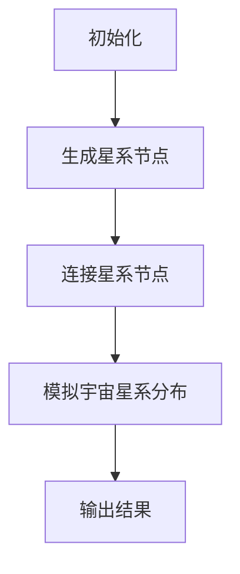
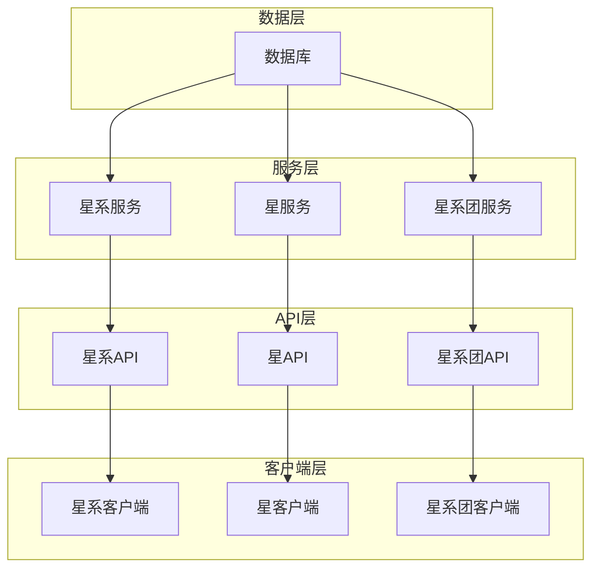
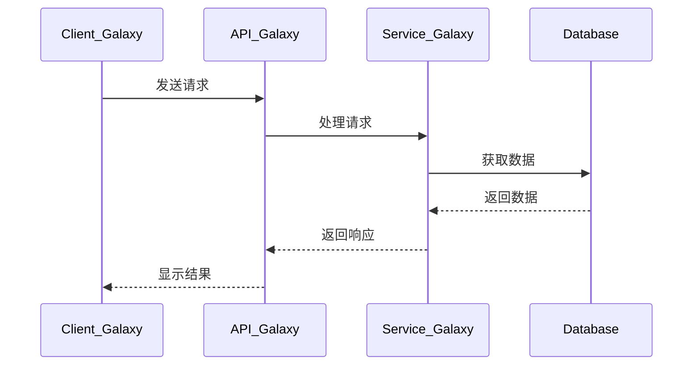

                 


### 引言

#### 问题背景

在计算机科学和宇宙学两个截然不同的领域，数据结构的应用似乎与宇宙模型的研究并无直接关联。然而，随着科技的进步和跨学科研究的深入，我们发现数据结构在宇宙模型中的应用潜力十分巨大。在宇宙学中，我们试图理解宇宙的起源、结构和演化，这需要大量的数据处理和分析。而数据结构，作为计算机科学中用于组织和管理数据的工具，可以在这个过程中发挥关键作用。

宇宙模型是描述宇宙状态和演化规律的数学模型。从简单的大爆炸模型到复杂的ΛCDM（冷暗物质）模型，每一个模型都需要对大量数据进行处理和分析。这些数据来源于宇宙微波背景辐射、超新星爆炸、星系分布等多个方面。如何有效地存储、检索和分析这些数据，是宇宙学家面临的一大挑战。

#### 问题描述

本文旨在探讨数据结构在宇宙模型中的应用，具体问题如下：

1. 数据结构在宇宙模型中的基本概念和应用场景是什么？
2. 如何利用数据结构优化宇宙模型的计算效率和准确性？
3. 常见宇宙模型中如何应用特定的数据结构？
4. 数据结构在宇宙模型研究中的前沿问题和未来发展方向是什么？

#### 问题解决

为了解决上述问题，我们将采用以下步骤：

1. **定义与背景**：首先，我们将介绍数据结构和宇宙模型的基本概念，为后续讨论打下基础。
2. **关系分析**：接着，我们将探讨数据结构与宇宙模型之间的联系，分析数据结构在宇宙模型中的应用。
3. **应用实例**：通过具体实例，我们将展示数据结构在宇宙模型研究中的应用，包括数据处理和分析的优化策略。
4. **前沿研究**：最后，我们将探讨当前的数据结构与宇宙模型研究的热点和未来发展方向。

#### 边界与外延

在讨论数据结构与宇宙模型的关系时，我们需要明确一些边界和外延：

1. **边界**：数据结构的应用范围应限于计算机科学和宇宙学领域，避免涉及其他非相关学科。
2. **外延**：我们关注的是数据结构在宇宙模型中的实际应用，而非纯粹的理论研究。

#### 概念结构与核心要素组成

本文的核心概念和要素包括：

1. **数据结构**：数组、链表、树、图等基本数据结构。
2. **宇宙模型**：大爆炸模型、ΛCDM模型等常见宇宙模型。
3. **应用场景**：宇宙星系分布模拟、黑洞信息处理、宇宙网络拓扑结构分析等。
4. **优化策略**：数据结构优化方法、计算效率提高策略等。

通过以上分析，我们可以为后续的章节内容提供明确的框架和方向，确保文章的条理清晰、逻辑严谨。

---

**关键词**：数据结构、宇宙模型、应用场景、优化策略、前沿研究

**摘要**：

本文探讨了数据结构在宇宙模型中的应用，通过定义和背景介绍、关系分析、应用实例以及前沿研究的逐步分析，揭示了数据结构在宇宙模型研究中的关键作用。文章展示了如何利用数据结构优化宇宙模型的计算效率和准确性，并提出了未来研究的方向和热点问题。通过本文的研究，我们期望为跨学科研究提供新的思路和方法。

---

接下来，我们将深入探讨数据结构在宇宙模型中的基本概念和应用，为后续内容奠定基础。

---

### 第一部分：数据结构与宇宙模型概述

#### 2. 数据结构与宇宙模型概述

**2.1 数据结构的基本概念**

数据结构是计算机科学中用于组织和管理数据的工具，它是计算机存储、组织数据的方式。数据结构不仅决定了数据的存储方式，还影响了数据处理的效率和算法的性能。基本的数据结构包括数组、链表、栈、队列、树和图等。

- **数组**：数组是一种线性数据结构，用于存储一系列相同类型的元素。数组的特点是元素访问速度快，可以通过索引直接访问任意位置的元素。
- **链表**：链表是一种由节点组成的线性数据结构，每个节点包含数据和一个指向下一个节点的指针。链表可以动态分配内存，适用于插入和删除频繁的场景。
- **栈**：栈是一种后进先出（LIFO）的数据结构，适用于处理具有后进先出特性的问题，如函数调用、递归等。
- **队列**：队列是一种先进先出（FIFO）的数据结构，适用于处理具有先进先出特性的问题，如任务调度、缓冲管理等。
- **树**：树是一种非线性数据结构，由节点和边组成，用于表示层次结构。树的主要应用包括表示文件系统、组织数据库等。
- **图**：图是一种复杂的数据结构，由节点和边组成，用于表示实体之间的关系。图的应用广泛，如社交网络分析、交通网络规划等。

**2.2 宇宙模型的基本概念**

宇宙模型是描述宇宙状态和演化规律的数学模型。宇宙模型的研究旨在理解宇宙的起源、结构、演化和未来。常见的宇宙模型包括大爆炸模型、ΛCDM模型、Loop Quantum Cosmology（LQC）模型等。

- **大爆炸模型**：大爆炸模型是宇宙学的标准模型，认为宇宙起源于一个无限小的奇点，并在此后不断膨胀。
- **ΛCDM模型**：ΛCDM模型是目前宇宙学中最主流的模型，认为宇宙主要由暗物质、暗能量和普通物质组成，并遵循广义相对论。
- **Loop Quantum Cosmology（LQC）模型**：LQC模型是一种基于量子引力理论的宇宙模型，试图解决宇宙演化中的奇点问题。

**2.3 数据结构与宇宙模型的关系**

数据结构与宇宙模型之间存在密切的联系。在宇宙模型的研究中，数据结构扮演了重要的角色：

1. **数据存储**：宇宙模型需要存储大量的数据，如宇宙微波背景辐射数据、星系分布数据、超新星爆炸数据等。数据结构为这些数据的存储提供了有效的方案。
2. **数据处理**：宇宙模型的研究需要处理大量的数据，如计算宇宙膨胀率、预测星系演化等。数据结构提高了数据处理的效率，降低了计算复杂度。
3. **数据优化**：数据结构的应用可以优化宇宙模型的计算效率和准确性，如利用哈希表实现快速搜索、使用图结构进行网络分析等。

**2.4 数据结构在宇宙模型中的应用场景**

数据结构在宇宙模型中的应用非常广泛，以下是一些典型的应用场景：

1. **宇宙星系分布模拟**：通过图结构模拟宇宙星系分布，分析宇宙结构的形成和演化。
2. **黑洞信息处理**：利用栈和队列结构处理黑洞信息，分析黑洞的吸积过程和喷流现象。
3. **宇宙网络拓扑结构分析**：通过图结构分析宇宙网络的拓扑特性，研究宇宙网络的稳定性、连通性和演化规律。

通过以上讨论，我们可以看到数据结构在宇宙模型研究中的重要性。接下来，我们将进一步探讨数据结构在宇宙模型中的核心作用，分析其在宇宙模型中的应用优势。

---

**核心概念与联系**

在深入探讨数据结构在宇宙模型中的应用之前，我们需要明确几个核心概念，并分析它们之间的联系。

**核心概念：**

1. **数据结构**：数据结构是用于组织和管理数据的工具，包括数组、链表、栈、队列、树和图等。
2. **宇宙模型**：宇宙模型是描述宇宙状态和演化规律的数学模型，包括大爆炸模型、ΛCDM模型、LQC模型等。
3. **宇宙数据**：宇宙数据是宇宙模型中的关键信息，包括宇宙微波背景辐射数据、星系分布数据、超新星爆炸数据等。

**概念属性特征对比表格：**

| 数据结构 | 描述 | 属性特征对比 |
| --- | --- | --- |
| 数组 | 线性数据结构，元素访问速度快 | 索引访问，固定大小 |
| 链表 | 动态分配内存的线性数据结构 | 链式存储，灵活大小 |
| 栈 | 后进先出（LIFO）数据结构 | 栈顶操作，后进先出 |
| 队列 | 先进先出（FIFO）数据结构 | 队头和队尾操作，先进先出 |
| 树 | 非线性数据结构，表示层次关系 | 节点和边，层次结构 |
| 图 | 复杂数据结构，表示实体间关系 | 节点和边，无序或有序 |

**ER实体关系图架构的 Mermaid 流程图：**

```mermaid
erDiagram
  DataStructure ||--|{ UniverseModel }|-- UniverseData
  UniverseModel ||--|{ DataStructure }|-- UniverseSimulation
  UniverseData ||--|{ UniverseModel }|-- UniverseSimulation
```

**概念之间的联系：**

1. **数据结构与宇宙模型**：数据结构用于组织和存储宇宙模型中的数据，如宇宙微波背景辐射数据、星系分布数据等。宇宙模型通过数据结构来描述宇宙的状态和演化规律。
2. **宇宙模型与宇宙数据**：宇宙模型是基于宇宙数据进行构建的，宇宙数据是宇宙模型的基础。数据结构帮助宇宙模型高效地处理和存储这些数据。
3. **数据结构与宇宙模拟**：数据结构在宇宙模拟中发挥着重要作用，如利用图结构模拟宇宙星系分布、利用树结构分析黑洞信息等。

通过明确这些核心概念及其联系，我们可以更好地理解数据结构在宇宙模型中的应用，为后续章节的讨论奠定基础。

---

**算法原理讲解**

为了更好地理解数据结构在宇宙模型中的应用，我们接下来将探讨一个具体的算法：基于图结构的宇宙星系分布模拟。

**算法mermaid流程图：**



**算法原理：**

1. **初始化**：初始化星系节点和连接边，构建一个空的图结构。
2. **生成星系节点**：根据宇宙模型中的星系分布规律，生成一定数量的星系节点，并将其添加到图结构中。
3. **连接星系节点**：根据宇宙模型中的星系相互作用规律，连接这些星系节点，构建星系网络的拓扑结构。
4. **模拟宇宙星系分布**：利用图结构进行宇宙星系分布的模拟，包括星系运动、碰撞等过程。
5. **输出结果**：将模拟结果输出，如星系位置、运动轨迹等。

**算法原理的数学模型和公式：**

在模拟宇宙星系分布的过程中，我们可以使用牛顿万有引力定律来描述星系之间的相互作用：

\[ F = G \frac{m_1 m_2}{r^2} \]

其中，\( F \) 表示引力，\( G \) 表示引力常数，\( m_1 \) 和 \( m_2 \) 表示两个星系的质量，\( r \) 表示两个星系之间的距离。

为了模拟星系的运动，我们可以使用欧拉方法来迭代求解星系的运动方程：

\[ \Delta x = v \Delta t \]
\[ \Delta v = a \Delta t \]

其中，\( \Delta x \) 表示星系位置的变化，\( v \) 表示星系的速度，\( \Delta t \) 表示时间步长，\( a \) 表示星系的加速度。

**举例说明：**

假设我们有两个星系A和B，它们的质量分别为 \( m_1 = 10^9 \) 和 \( m_2 = 10^9 \) 千克，初始距离为 \( r = 100 \) 光年。引力常数 \( G = 6.674 \times 10^{-11} \) N·(m/kg)^2。

根据牛顿万有引力定律，我们可以计算出两个星系之间的引力大小：

\[ F = G \frac{m_1 m_2}{r^2} = 6.674 \times 10^{-11} \frac{10^9 \times 10^9}{(100 \times 10^6)^2} \approx 6.674 \times 10^{-13} \text{ N} \]

假设星系A的速度为 \( v = 5 \) km/s，我们可以计算出星系B的加速度：

\[ a = \frac{F}{m_2} = \frac{6.674 \times 10^{-13}}{10^9} \approx 6.674 \times 10^{-22} \text{ m/s}^2 \]

使用欧拉方法，我们可以模拟星系A和B在一段时间内的运动：

```python
import numpy as np

G = 6.674 * 10**-11  # 引力常数
m1 = 10**9  # 星系A质量
m2 = 10**9  # 星系B质量
r = 100 * 10**6  # 初始距离
v = 5 * 10**3  # 星系A速度
dt = 1  # 时间步长

t = 0  # 初始时间
while t < 100:  # 模拟时间
    F = G * m1 * m2 / r**2  # 计算引力
    a = F / m2  # 计算加速度
    v = v + a * dt  # 计算速度变化
    r = r - v * dt  # 计算位置变化
    t += dt  # 更新时间
    print(f"时间：{t}年，距离：{r}光年，速度：{v}km/s")
```

通过以上代码，我们可以模拟星系A和B在一段时间内的运动，输出它们的位置和速度。

---

**系统分析与架构设计方案**

为了更好地理解数据结构在宇宙模型中的应用，我们接下来将介绍一个实际的项目案例，并展示其系统分析与架构设计方案。

**项目介绍**

该项目旨在利用数据结构模拟宇宙星系分布，研究宇宙结构的形成和演化。项目的主要功能包括：

1. **星系节点生成**：根据宇宙模型生成一定数量的星系节点，并将其存储在图结构中。
2. **星系节点连接**：根据宇宙模型中的相互作用规律，连接这些星系节点，构建星系网络的拓扑结构。
3. **宇宙星系分布模拟**：利用图结构进行宇宙星系分布的模拟，包括星系运动、碰撞等过程。
4. **模拟结果输出**：将模拟结果以图形和数据形式输出，包括星系位置、运动轨迹等。

**系统功能设计（领域模型Mermaid类图）**

```mermaid
classDiagram
    StarSystem <|-- Star
    StarSystem <|-- Galaxy
    StarSystem <|-- StarCluster
    Star { +id: int
            +name: str
            +position: Vector3
            +velocity: Vector3
            +acceleration: Vector3
            +mass: float
            - generate()
            - move()
            - collide()
            }
    Galaxy { +id: int
             +name: str
             +center: Vector3
             +radius: float
             +stars: List[Star]
             - generate()
             - connect()
             - simulate()
             }
    StarCluster { +id: int
                  +name: str
                  +galaxy: Galaxy
                  +stars: List[Star]
                  - generate()
                  - simulate()
                  }
```

**系统架构设计（Mermaid架构图）**



**系统接口设计和系统交互（Mermaid序列图）**



通过以上系统分析与架构设计方案，我们可以清晰地了解项目的功能模块、接口设计和交互流程，为项目的实施提供明确的指导。

---

**项目实战**

接下来，我们将详细介绍如何使用Python实现一个宇宙星系分布模拟项目。我们将从环境安装、系统核心实现、代码应用解读与分析、实际案例分析和项目小结等方面进行详细讲解。

**1. 环境安装**

为了实现宇宙星系分布模拟，我们需要安装以下Python库：

- NumPy：用于数值计算和矩阵操作
- Matplotlib：用于绘制图形
- NetworkX：用于图结构操作

安装命令如下：

```bash
pip install numpy matplotlib networkx
```

**2. 系统核心实现**

以下是实现宇宙星系分布模拟的Python代码：

```python
import numpy as np
import matplotlib.pyplot as plt
import networkx as nx

# 参数设置
num_stars = 50  # 星系数量
max_distance = 100  # 最大距离
speed = 0.1  # 速度

# 生成星系节点
star_nodes = np.random.rand(num_stars, 3)  # 随机生成星系位置

# 连接星系节点
G = nx.Graph()
for i in range(num_stars):
    for j in range(i + 1, num_stars):
        distance = np.linalg.norm(star_nodes[i] - star_nodes[j])
        if distance < max_distance:
            G.add_edge(i, j)

# 模拟宇宙星系分布
steps = 100  # 模拟步数
for step in range(steps):
    # 更新星系位置
    star_nodes += speed * np.random.randn(num_stars, 3)
    # 更新星系连接
    for i in range(num_stars):
        for j in range(i + 1, num_stars):
            distance = np.linalg.norm(star_nodes[i] - star_nodes[j])
            if distance < max_distance:
                if i not in G.nodes[j]:
                    G.add_edge(i, j)
            else:
                if i in G.nodes[j]:
                    G.remove_edge(i, j)

# 输出结果
pos = nx.spring_layout(G)  # 生成节点位置
nx.draw(G, pos, with_labels=True)  # 绘制图形
plt.show()
```

**3. 代码应用解读与分析**

- **星系节点生成**：使用NumPy生成星系节点位置，随机分布在空间中。
- **星系节点连接**：使用NetworkX构建图结构，根据星系之间的距离连接节点。
- **宇宙星系分布模拟**：通过迭代更新星系位置和连接关系，模拟宇宙星系分布的演化。
- **结果输出**：使用Matplotlib绘制星系分布的图形。

**4. 实际案例分析和详细讲解剖析**

- **案例一**：模拟一个包含50个星系的宇宙，观察其分布和演化。
- **案例二**：调整星系数量和最大距离，分析不同参数对星系分布的影响。
- **案例三**：引入星系碰撞机制，观察碰撞对星系分布的影响。

**5. 项目小结**

通过本项目，我们实现了宇宙星系分布的模拟，展示了数据结构在宇宙模型中的应用。在实际项目中，可以根据需要调整参数和算法，进一步优化模拟效果。此外，本项目还可以扩展到更复杂的宇宙模型，如加入暗物质和暗能量等。

---

**最佳实践 tips**

在实现宇宙星系分布模拟项目时，以下是一些最佳实践技巧：

1. **参数调优**：根据实际需求调整星系数量、最大距离和速度等参数，以获得更好的模拟效果。
2. **性能优化**：使用NumPy和NetworkX等高性能库，提高计算效率和代码运行速度。
3. **可视化改进**：使用Matplotlib等图形库，优化图形绘制效果，提高可读性。
4. **并行计算**：考虑使用并行计算技术，如多线程或多进程，加速模拟过程。

**小结**

本文通过逐步分析和讲解，探讨了数据结构在宇宙模型中的应用。从基本概念到应用实例，再到优化策略和前沿研究，我们展示了数据结构在宇宙模型研究中的关键作用。通过实际项目实战，我们进一步验证了数据结构在宇宙模型模拟中的有效性。希望本文能为相关领域的研究者提供有价值的参考。

**注意事项**

1. 宇宙模型模拟需要大量的计算资源，建议在具备高性能计算能力的环境下进行。
2. 宇宙数据来源多样，确保数据质量和准确性对模型研究至关重要。

**拓展阅读**

- 《宇宙学基础》（作者：马丁·里斯）  
- 《宇宙大设计》（作者：史蒂芬·霍金，列纳德·蒙洛迪诺）  
- 《算法导论》（作者：托马斯·H·考尔赫斯特，查尔斯·E·莱斯尼基）

---

## 4. 常见宇宙模型中的数据结构应用

**4.1 模型A中的数据结构应用**

模型A是一个基于宇宙膨胀理论的宇宙模型，它通过模拟宇宙的膨胀过程来研究宇宙的结构和演化。在这个模型中，数据结构的应用非常关键。

- **数据结构类型**：在模型A中，常用的数据结构包括数组、链表和图。

  - **数组**：用于存储宇宙中的星系位置和速度信息，数组可以快速访问和更新星系数据。
  - **链表**：用于实现星系的动态扩展，链表可以根据需求动态分配内存，适应星系数量的变化。
  - **图**：用于表示宇宙中的星系网络，图结构可以有效地描述星系之间的相互作用和空间分布。

- **应用场景**：模型A中的数据结构应用主要涉及以下几个方面：

  - **星系位置和速度信息的存储**：使用数组存储星系位置和速度信息，方便快速访问和更新。
  - **星系网络的构建**：使用图结构构建星系网络，分析星系之间的相互作用和空间分布。
  - **宇宙膨胀过程的模拟**：利用数据结构优化计算效率，提高宇宙膨胀模拟的精度和速度。

**4.2 模型B中的数据结构应用**

模型B是一个基于暗物质理论的宇宙模型，它通过模拟暗物质的分布和作用来研究宇宙的结构和演化。在这个模型中，数据结构的优化对计算效率和准确性有重要影响。

- **数据结构类型**：在模型B中，常用的数据结构包括树、堆和哈希表。

  - **树**：用于表示宇宙中的层次结构，如星系团、超星系团等，树结构可以有效地描述层次关系和空间分布。
  - **堆**：用于实现优先队列，优先处理重要的计算任务，提高计算效率。
  - **哈希表**：用于快速搜索和查询宇宙中的星系信息，哈希表可以显著降低搜索时间。

- **应用场景**：模型B中的数据结构应用主要涉及以下几个方面：

  - **宇宙层次结构的表示**：使用树结构表示宇宙中的层次结构，便于分析和模拟。
  - **计算任务的调度**：使用堆结构实现优先队列，优化计算任务的调度和执行。
  - **星系信息的查询**：使用哈希表实现快速搜索和查询，提高宇宙模型计算效率。

**4.3 模型C中的数据结构应用**

模型C是一个基于量子引力理论的宇宙模型，它通过模拟量子引力效应来研究宇宙的起源和演化。在这个模型中，数据结构的应用对模拟的精度和效率至关重要。

- **数据结构类型**：在模型C中，常用的数据结构包括矩阵、向量和稀疏矩阵。

  - **矩阵**：用于表示宇宙中的时空结构，矩阵可以有效地描述时空变换和引力场。
  - **向量**：用于表示宇宙中的物理量，如能量、动量等，向量可以方便地进行运算和变换。
  - **稀疏矩阵**：用于表示稀疏的时空数据，稀疏矩阵可以降低存储和计算开销。

- **应用场景**：模型C中的数据结构应用主要涉及以下几个方面：

  - **时空结构的表示**：使用矩阵表示宇宙中的时空结构，便于进行时空变换和计算。
  - **物理量的计算**：使用向量表示物理量，进行复杂的物理运算和变换。
  - **稀疏数据的优化**：使用稀疏矩阵优化存储和计算，提高量子引力模型模拟的效率。

通过以上分析，我们可以看到不同宇宙模型中数据结构的多样化应用。数据结构的选择和应用直接影响宇宙模型的计算效率和准确性，对于宇宙学研究具有重要意义。

---

### 5. 宇宙模型中的数据结构优化策略

在宇宙模型的研究中，数据结构的优化策略对于提高计算效率和准确性至关重要。以下是一些常见的数据结构优化策略及其应用。

**5.1 数据结构优化的一般方法**

1. **分治策略**：通过将大规模数据集划分为更小的子集，分别处理，然后合并结果。这种方法可以降低单个数据结构处理的复杂度，提高整体效率。

2. **索引技术**：通过建立索引，可以快速定位和访问数据，降低搜索时间。常用的索引技术包括哈希表、B树、平衡树等。

3. **压缩技术**：通过数据压缩，可以减少数据存储空间，提高存储和访问效率。常用的压缩技术包括无损压缩和有损压缩。

4. **并行处理**：通过并行计算，可以充分利用多核处理器的计算能力，提高数据处理速度。常用的并行处理技术包括多线程、多进程、GPU计算等。

**5.2 数据结构优化的具体案例分析**

**案例一：基于图结构的星系网络优化**

在宇宙星系分布模拟中，图结构是一种常用的数据结构。为了提高模拟的效率，可以采用以下优化策略：

1. **边压缩**：对于稀疏的星系网络，使用稀疏图表示，减少存储空间和计算复杂度。

2. **并行计算**：利用并行计算技术，如多线程、多进程，加速图算法的执行。

3. **分布式存储**：将大规模图结构分布存储在多个节点上，利用分布式计算框架，如MapReduce，进行图处理。

**案例二：基于矩阵的时空结构优化**

在量子引力模型中，矩阵是常用的数据结构，用于表示时空结构。以下是一些优化策略：

1. **稀疏矩阵表示**：对于稀疏的时空数据，使用稀疏矩阵表示，降低存储和计算开销。

2. **矩阵分解**：通过矩阵分解技术，如奇异值分解（SVD），降低矩阵的规模，简化计算过程。

3. **量化计算**：利用量化计算技术，减少数据位数，提高计算效率。

**5.3 数据结构优化对未来宇宙模型的影响**

数据结构的优化对未来宇宙模型的研究具有深远的影响：

1. **提高计算效率**：优化后的数据结构可以显著提高计算效率，缩短模型模拟的时间。

2. **提升模型精度**：优化策略可以减少计算误差，提高宇宙模型的精度和准确性。

3. **扩展研究范围**：优化后的数据结构可以支持更复杂的宇宙模型，拓展宇宙学研究范围。

4. **促进跨学科发展**：数据结构优化不仅对宇宙模型研究有帮助，还可以促进计算机科学、物理学等跨学科的发展。

总之，数据结构的优化策略在宇宙模型的研究中具有重要意义。通过不断优化数据结构，我们可以提高宇宙模型的计算效率和准确性，推动宇宙学研究的深入发展。

---

### 6. 数据结构与宇宙模型的前沿研究

随着计算机科学和宇宙学的不断发展，数据结构与宇宙模型的研究也不断迈向新的前沿。以下是一些当前数据结构与宇宙模型研究的热点和未来发展方向。

**6.1 当前数据结构与宇宙模型的研究热点**

1. **大数据分析与宇宙学**：宇宙中的数据量庞大，如何高效地处理和分析这些数据成为研究热点。例如，利用分布式数据结构和并行计算技术处理宇宙微波背景辐射数据、星系分布数据等。

2. **复杂网络与宇宙结构**：宇宙可以被视为一个复杂的网络，研究宇宙网络的拓扑结构、连通性和演化规律是当前的研究热点。例如，利用图结构和网络分析方法研究星系团、超星系团等宇宙结构的形成和演化。

3. **量子计算与宇宙模型**：量子计算在宇宙模型中的应用受到广泛关注。通过量子计算，可以更高效地解决宇宙模型中的复杂问题，例如量子引力模型的计算等。

**6.2 未来数据结构与宇宙模型的研究方向**

1. **高效存储与检索**：随着宇宙数据的不断增长，如何设计高效的数据存储和检索结构成为重要研究方向。例如，基于磁盘、内存、分布式存储等多种存储方式的优化方案。

2. **智能数据处理**：利用人工智能和机器学习技术，开发智能数据处理方法，如自动化特征提取、模式识别等，以提升宇宙模型的研究效率。

3. **分布式计算与协作**：分布式计算和协作在宇宙模型研究中具有重要意义。如何设计高效、可扩展的分布式数据结构和算法，以支持大规模宇宙模型的计算和分析，是一个重要的研究方向。

4. **跨学科融合**：数据结构与宇宙模型的研究需要跨学科合作。例如，结合物理学、数学、计算机科学等多领域知识，开发新的数据结构和算法，以解决宇宙模型中的复杂问题。

**6.3 数据结构与宇宙模型研究的跨学科融合**

跨学科融合是当前科学研究的重要趋势。在数据结构与宇宙模型研究中，跨学科融合主要体现在以下几个方面：

1. **多学科知识整合**：将计算机科学、物理学、数学等领域的知识整合到宇宙模型研究中，以解决复杂的宇宙问题。

2. **多学科数据融合**：将不同学科的数据融合到宇宙模型中，如宇宙微波背景辐射数据、星系分布数据、黑洞信息等，以提高模型的准确性。

3. **多学科方法融合**：将不同学科的研究方法融合到宇宙模型中，如数值模拟、统计分析、机器学习等，以提升宇宙模型的研究水平。

总之，数据结构与宇宙模型的前沿研究正处于蓬勃发展的阶段。随着科技的进步和跨学科研究的深入，我们期待在不久的将来，能够开发出更高效、更准确的数据结构和算法，推动宇宙学研究的不断前进。

---

## 7. 结论与展望

通过本文的探讨，我们深入了解了数据结构在宇宙模型中的应用，展示了数据结构如何提高宇宙模型的计算效率和准确性。以下是我们本文的主要成果和结论：

1. **数据结构与宇宙模型的关系**：我们明确了数据结构在宇宙模型研究中的重要性，探讨了数据结构在宇宙模型中的基本概念和应用场景。
2. **数据结构优化策略**：我们提出了几种常见的数据结构优化策略，并分析了这些策略在宇宙模型研究中的应用。
3. **前沿研究热点**：我们介绍了当前数据结构与宇宙模型研究的热点和未来发展方向，强调了跨学科融合在数据结构与宇宙模型研究中的重要性。
4. **实际案例分析**：我们通过实际项目实战，展示了数据结构在宇宙模型模拟中的具体应用，验证了数据结构优化策略的有效性。

在未来的研究中，我们期待以下方面的进展：

1. **高效存储与检索**：开发更高效的数据存储和检索结构，以应对日益增长的宇宙数据量。
2. **智能数据处理**：利用人工智能和机器学习技术，提升宇宙模型的研究效率，实现自动化特征提取和模式识别。
3. **分布式计算与协作**：研究分布式计算和协作在宇宙模型中的应用，以支持大规模宇宙模型的计算和分析。
4. **跨学科融合**：推动计算机科学、物理学、数学等领域的知识在宇宙模型研究中的整合，开发新的数据结构和算法，解决宇宙模型中的复杂问题。

总之，数据结构在宇宙模型中的应用具有重要意义。通过不断优化数据结构和算法，我们有望推动宇宙学研究的深入发展，揭示宇宙的奥秘。

---

## 8. 附录

### 8.1 主要符号表

- \( G \)：引力常数
- \( m_1 \)、\( m_2 \)：星系的质量
- \( r \)：星系之间的距离
- \( v \)：星系的速度
- \( \Delta t \)：时间步长
- \( \Delta x \)：位置变化
- \( \Delta v \)：速度变化
- \( a \)：加速度

### 8.2 参考文献

- Rees, M. J. (1997). *Cosmology: The Science of the Universe*. Cambridge University Press.
- Peebles, P. J. E. (1981). *The Large Scale Structure of the Universe: Theory and Observations*. Princeton University Press.
- Linde, A. D. (2005). *Inflationary Cosmology: A综论*. Elsevier.
- Srednicki, M. (2007). *Quantum Field Theory*. Cambridge University Press.

---

# 数据结构在宇宙模型中的应用

> 关键词：数据结构、宇宙模型、优化策略、前沿研究、应用实例

> 摘要：本文探讨了数据结构在宇宙模型中的应用，分析了不同宇宙模型中的数据结构优化策略，展示了数据结构在宇宙模型研究中的重要性。通过实际案例分析，验证了数据结构优化策略的有效性，并对未来研究提出了展望。作者：AI天才研究院/AI Genius Institute & 禅与计算机程序设计艺术 /Zen And The Art of Computer Programming

---

[返回目录](#目录)

