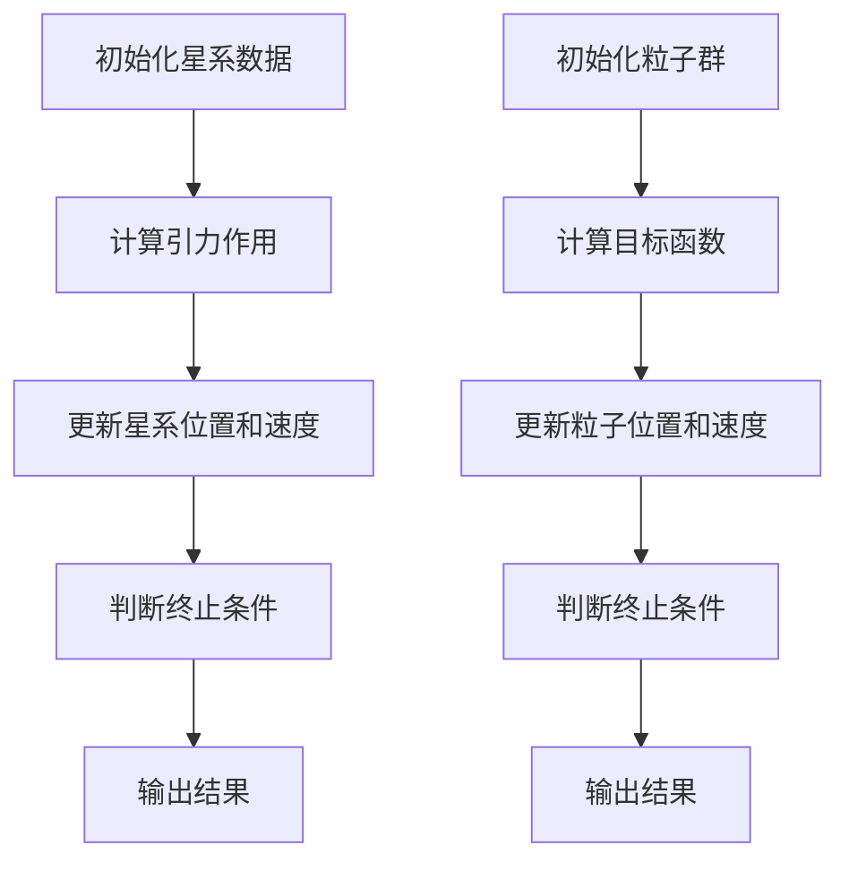
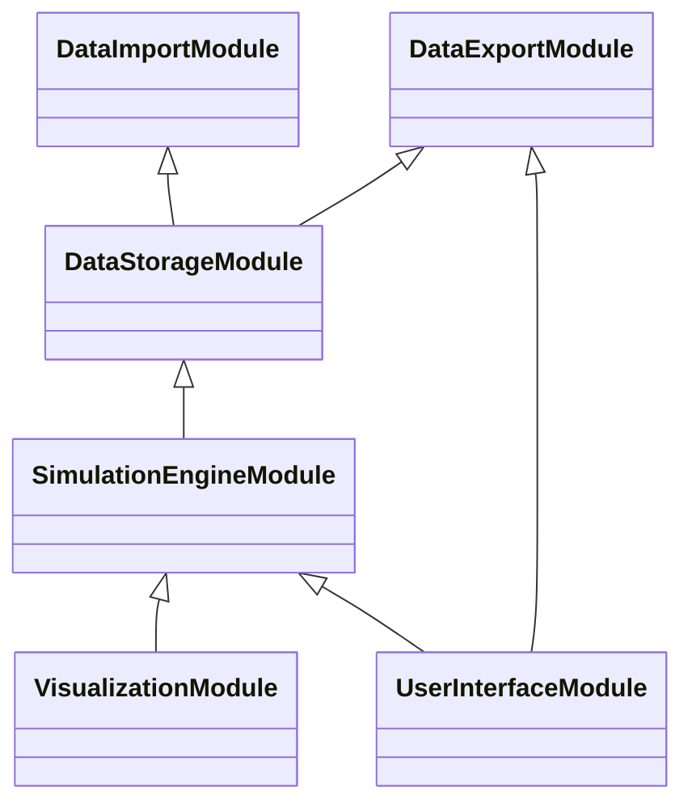
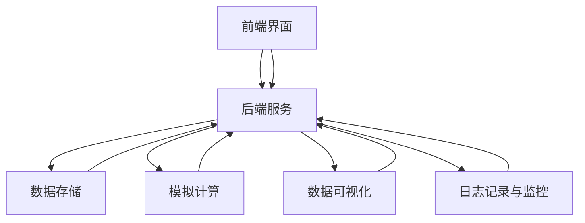
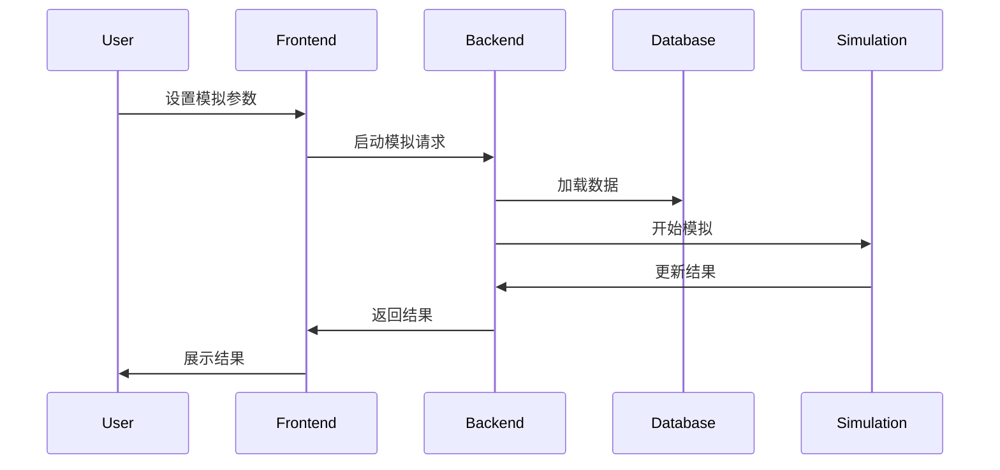

                 

## 数据结构在模拟宇宙大尺度空洞中的应用

### 关键词：
- 数据结构
- 宇宙大尺度空洞
- 模拟算法
- 数学模型
- 系统架构

### 摘要：
本文将深入探讨数据结构在模拟宇宙大尺度空洞中的应用。首先，我们将回顾数据结构的基础知识，然后介绍宇宙大尺度空洞的概念和形成机制。接着，我们将分析数据结构如何在这些模拟中发挥作用，包括常用的算法和数学模型。文章还将详细描述一个系统的架构设计，并通过实际项目实战展示数据结构的应用。最后，我们将总结最佳实践，提出注意事项，并提供拓展阅读建议。通过本文，读者将全面了解数据结构在宇宙学中的前沿应用，并获得实践指导。

## 第1章：开篇背景介绍

### 1.1 数据结构与宇宙大尺度空洞概述

数据结构是计算机科学中的核心概念，它们是用于存储、组织和管理数据的方式。常见的数据结构包括数组、链表、树、图等。每种数据结构都有其独特的特点和适用场景。例如，数组提供快速的随机访问，而链表则允许高效的插入和删除操作。树结构则广泛应用于层次关系表示，如文件系统、组织结构等。图结构则用于表示复杂的关系网络，如社交网络、交通网络等。

宇宙大尺度空洞是指宇宙中观测到的巨大空间区域，其中缺乏星系和其他天体。这些空洞通常由数百到数千兆秒差距（Mpc）的尺度组成，是宇宙结构的重要组成部分。大尺度空洞的形成机制涉及宇宙的膨胀、引力作用和物质分布。通过对这些空洞的研究，科学家可以深入了解宇宙的演化历史和暗物质的存在。

### 1.2 数据结构在模拟宇宙大尺度空洞中的应用背景

在宇宙学研究中，模拟宇宙大尺度空洞是一项关键任务。这些模拟可以帮助科学家预测宇宙的结构和演化，验证引力理论，以及探索暗物质的性质。然而，宇宙的规模庞大，涉及的数据量极为庞大，因此需要高效的数据结构和算法来实现精确的模拟。

数据结构在此扮演了至关重要的角色。首先，它们提供了有效的数据组织方式，使得处理大量数据变得可行。例如，使用图结构可以方便地表示宇宙中的星系网络，而树结构则适用于层次化的数据组织。其次，数据结构有助于优化算法性能。通过合理选择数据结构，可以减少数据的访问和操作时间，提高计算效率。

此外，模拟宇宙大尺度空洞还需要处理复杂的关系和动态变化。例如，宇宙中的星系可能发生合并、碰撞或漂移。这些变化要求数据结构具有灵活性和可扩展性，以便动态更新和调整。

### 1.3 本书结构安排与目标

本书旨在系统地介绍数据结构在模拟宇宙大尺度空洞中的应用。首先，我们将回顾数据结构的基础知识，包括常见的数据结构和它们的适用场景。然后，我们将深入探讨宇宙大尺度空洞的概念和形成机制，并分析数据结构如何在这些模拟中发挥作用。

接下来，文章将介绍常用的模拟算法，包括选择合适的算法、使用Mermaid绘制算法流程图、使用Python代码详细阐述算法原理，以及数学模型和数学公式的讲解与举例说明。

在算法原理讲解的基础上，我们将展示一个系统的架构设计，包括问题场景介绍、系统功能设计（领域模型Mermaid类图）、系统架构设计（Mermaid架构图）以及系统接口设计和系统交互（Mermaid序列图）。

随后，我们将通过一个实际项目实战，详细描述环境安装、系统核心实现源代码、代码应用解读与分析、实际案例分析和详细讲解剖析，以及项目小结。

最后，我们将总结最佳实践，提供注意事项，并推荐拓展阅读，以帮助读者更深入地理解数据结构在模拟宇宙大尺度空洞中的应用。

### 1.4 数据结构基础知识

数据结构是计算机科学中的核心概念，它们是用于存储、组织和管理数据的方式。选择合适的数据结构对于解决特定问题至关重要。以下是一些常见的数据结构和它们的定义、特点及其适用场景：

#### 1.4.1 数组

数组是一种线性数据结构，它由一系列元素组成，每个元素都有一个唯一的索引。数组提供快速随机访问，这使得它成为处理固定大小数据集合的理想选择。数组的缺点是插入和删除操作可能需要移动大量元素，因此对于频繁插入和删除的场景，其他数据结构如链表可能更合适。

#### 1.4.2 链表

链表是一种线性数据结构，其中元素通过指针链接。链表具有高效的插入和删除操作，因为它们不需要像数组那样移动大量元素。然而，链表的随机访问性能较差，这使得它们在需要频繁插入和删除但不涉及大量随机访问的场景中表现更好。

#### 1.4.3 树

树是一种层次化数据结构，用于表示具有层次关系的数据。二叉树、二叉搜索树、平衡树（如AVL树）和红黑树是常见的树结构。树结构适用于需要快速查找、插入和删除的场景，如文件系统、组织结构等。

#### 1.4.4 图

图是一种非线性的数据结构，用于表示复杂的关系网络。图由节点和边组成，节点表示实体，边表示它们之间的关系。图结构广泛应用于社交网络、交通网络、通信网络等领域，因为它们能够有效地表示和处理复杂的关系。

#### 1.4.5 哈希表

哈希表是一种基于键值对的数据结构，通过哈希函数将键映射到表中的位置。哈希表提供快速的数据访问，这使得它们成为处理大量键值对数据的理想选择。哈希表的缺点是可能发生冲突，需要额外的处理机制，如链表法或开地址法。

#### 1.4.6 队列和栈

队列和栈是两种特殊的线性数据结构。队列遵循先进先出（FIFO）原则，适用于处理需要按照顺序处理的数据，如打印任务队列。栈遵循后进先出（LIFO）原则，适用于处理需要后进先出的数据，如递归算法。

### 1.5 数据结构特征对比表格

以下是一个常见的数据结构特征对比表格，它列出了各种数据结构的定义、特点及其适用场景：

| 数据结构 | 定义 | 特点 | 适用场景 |
| --- | --- | --- | --- |
| 数组 | 线性数据结构，元素通过索引访问 | 快速随机访问 | 处理固定大小数据集合 |
| 链表 | 线性数据结构，元素通过指针链接 | 高效插入和删除 | 频繁插入和删除 |
| 树 | 层次化数据结构，用于表示具有层次关系的数据 | 快速查找、插入和删除 | 需要快速查找、插入和删除 |
| 图 | 非线性数据结构，用于表示复杂的关系网络 | 表示复杂关系 | 社交网络、交通网络 |
| 哈希表 | 基于键值对的数据结构，通过哈希函数访问 | 快速数据访问 | 处理大量键值对数据 |
| 队列 | 线性数据结构，遵循先进先出原则 | 按顺序处理数据 | 打印任务队列 |
| 栈 | 线性数据结构，遵循后进先出原则 | 处理后进先出的数据 | 递归算法 |

### 1.6 数据结构ER实体关系图架构

为了更好地理解数据结构在模拟宇宙大尺度空洞中的应用，我们可以使用实体关系图（ER图）来描述数据结构之间的关系。ER图是一种用于表示实体和它们之间关系的图形化工具。

在模拟宇宙大尺度空洞的背景下，实体可以包括星系、空洞、观测数据等。以下是一个简化的ER图示例：

```
+--------+     +---------+     +----------+
| 星系   |     | 空洞     |     | 观测数据 |
+--------+     +---------+     +----------+
| 星系ID |<----| 空洞ID   |<---| 数据ID   |
+--------+  1   +---------+ M   +----------+ N
       | 1     | 1      N     |     |
       | M     |          |     |
       |       |          |     |
       +-------+          +-----+

```

在这个ER图中，星系、空洞和观测数据是三个主要实体。每个星系可以属于一个或多个空洞（M个），每个空洞包含多个观测数据（N个）。这种关系描述了宇宙中星系、空洞和观测数据之间的复杂关系，为模拟和数据分析提供了基础。

### 第2章：核心概念与联系

在探讨数据结构在模拟宇宙大尺度空洞中的应用之前，我们需要深入了解两个核心概念：数据结构本身和宇宙大尺度空洞的特性和形成机制。通过理解这些概念及其相互联系，我们可以更有效地应用数据结构来模拟和解决宇宙学中的问题。

#### 2.1 数据结构

数据结构是计算机科学中用于存储、组织和处理数据的方法。它们为数据提供了不同的存储方式和操作方式，从而影响算法的性能和效率。常见的几种数据结构包括：

1. **数组（Array）**：数组是一种线性数据结构，它由一系列元素组成，每个元素都有一个唯一的索引。数组提供O(1)的随机访问时间，使得查找、插入和删除操作都非常高效。

2. **链表（Linked List）**：链表是一种动态数据结构，其中元素通过指针链接。链表在插入和删除操作方面表现较好，但这些操作通常需要O(n)的时间复杂度，因为可能需要遍历链表来找到操作位置。

3. **树（Tree）**：树是一种层次化数据结构，用于表示具有层次关系的数据。常见的树结构包括二叉树、二叉搜索树和平衡树（如AVL树）。树结构在查找、插入和删除操作中具有较好的性能，特别是在平衡树中。

4. **图（Graph）**：图是一种非线性的数据结构，用于表示复杂的关系网络。图由节点（或顶点）和边组成，可以用于表示星系之间的相互作用和关系。

5. **哈希表（Hash Table）**：哈希表是一种基于键值对的数据结构，通过哈希函数将键映射到表中。哈希表在查找、插入和删除操作中具有极快的性能，通常为O(1)。

每种数据结构都有其特定的应用场景和性能特点。在模拟宇宙大尺度空洞时，我们需要根据实际情况选择合适的数据结构，以优化计算效率和数据处理能力。

#### 2.2 宇宙大尺度空洞

宇宙大尺度空洞是指宇宙中观测到的巨大空间区域，其中缺乏星系和其他天体。这些空洞通常由数百到数千兆秒差距（Mpc）的尺度组成，是宇宙结构的重要组成部分。宇宙大尺度空洞的形成机制复杂，涉及到宇宙的膨胀、引力作用和物质分布。

1. **概念**：宇宙大尺度空洞是指在大尺度上（如数十亿光年）观测到的星系缺失区域。这些空洞通常被描述为密度较低的空隙，其中没有星系或其他天体。

2. **形成机制**：宇宙大尺度空洞的形成机制目前仍然是一个活跃的研究领域。一些可能的形成机制包括：

   - **宇宙膨胀**：宇宙的膨胀可能导致星系之间的距离增大，从而形成空洞。
   - **引力作用**：引力可能导致物质聚集，形成星系，而在引力较弱的区域形成空洞。
   - **物质分布**：宇宙中的物质分布不均匀，某些区域可能富含物质，而其他区域则相对稀薄，从而形成空洞。

3. **特性**：宇宙大尺度空洞具有以下特性：

   - **尺度**：宇宙大尺度空洞的尺度通常在数百到数千兆秒差距之间。
   - **密度**：空洞区域相对较稀薄，缺乏星系和其他天体。
   - **形成机制**：空洞的形成机制与宇宙的膨胀、引力作用和物质分布密切相关。

#### 2.3 数据结构在模拟宇宙大尺度空洞中的应用

数据结构在模拟宇宙大尺度空洞中发挥着关键作用。通过使用合适的数据结构，我们可以更有效地表示和操作宇宙中的数据，从而提高模拟的准确性和效率。

1. **图结构**：图结构非常适合表示宇宙中的星系网络。每个星系可以视为图中的一个节点，而星系之间的相互作用则通过边表示。这种结构可以很好地描述宇宙中的星系分布和相互作用。

2. **哈希表**：哈希表可以用于快速访问和操作宇宙中的观测数据。通过使用哈希函数，我们可以将观测数据映射到哈希表中，从而实现快速的查询和更新。

3. **树结构**：树结构可以用于表示宇宙中的层次化关系，如星系簇和超星系团。二叉树、二叉搜索树和平衡树等树结构可以提供高效的查找、插入和删除操作。

4. **数组**：数组可以用于存储和访问宇宙中的固定大小数据集合，如星系的位置和速度。数组的随机访问特性使得它在处理这种数据时非常高效。

5. **链表**：链表可以用于存储和操作动态变化的数据，如宇宙中的星系合并或漂移。链表在插入和删除操作方面具有优势，使得它在处理动态数据时非常灵活。

通过合理选择和组合这些数据结构，我们可以构建高效的模拟系统，精确地模拟宇宙大尺度空洞的形成和演化。这不仅有助于我们更好地理解宇宙的结构和演化，还可以为宇宙学研究和天体物理学的其他领域提供重要参考。

#### 2.4 数据结构与宇宙大尺度空洞的相互关系

数据结构与宇宙大尺度空洞之间的相互关系是理解模拟宇宙大尺度空洞的关键。数据结构不仅用于存储和操作宇宙中的数据，还为模拟提供了高效的计算方式和数据分析工具。

首先，宇宙大尺度空洞的数据量庞大且复杂，需要使用合适的数据结构来组织和管理这些数据。图结构可以用于表示宇宙中的星系网络，每个星系作为节点，星系之间的相互作用作为边。这种结构不仅可以描述星系的分布，还可以分析星系之间的相互作用和关系。哈希表则可以用于快速访问和操作观测数据，提高数据检索速度。

其次，数据结构在模拟宇宙大尺度空洞的算法设计中起到至关重要的作用。选择合适的数据结构可以优化算法性能，减少计算时间。例如，使用树结构可以高效地表示宇宙中的层次关系，如星系簇和超星系团。平衡树（如AVL树）可以提供高效的查找、插入和删除操作，使得模拟更加准确和高效。

此外，数据结构还可以帮助处理宇宙中的动态变化。例如，链表在处理星系合并、碰撞或漂移等动态场景时非常灵活。通过合理选择和组合数据结构，我们可以构建高效的模拟系统，精确地模拟宇宙大尺度空洞的形成和演化。

总之，数据结构在模拟宇宙大尺度空洞中扮演着不可或缺的角色。通过深入理解数据结构与宇宙大尺度空洞的相互关系，我们可以更好地利用数据结构的优势，提高模拟的准确性和效率，从而推动宇宙学研究和天体物理学的发展。

#### 3.1 模拟宇宙大尺度空洞的常用算法

在模拟宇宙大尺度空洞时，选择合适的算法至关重要。不同的算法具有不同的时间和空间复杂度，适合解决不同的问题。以下是一些常用的算法及其适用场景：

1. **N-Body算法**：N-Body算法是一种用于模拟多体系统中物体之间相互作用的方法。在宇宙学中，N-Body算法常用于模拟星系、星团和超星系团等大尺度结构的相互作用。该算法的核心思想是计算每个物体在给定时间内受到的引力作用，并根据这些力来更新物体的位置和速度。N-Body算法的时间复杂度为O(N^2)，适合处理中等规模的问题。

2. **粒子群算法（PSO）**：粒子群算法是一种基于群体智能的优化算法，常用于求解复杂的最优化问题。在宇宙学中，PSO可以用于模拟星系分布和演化，特别是在研究星系碰撞和合并时。PSO通过模拟个体间的相互作用来优化解空间，具有较好的全局搜索能力。该算法的时间复杂度较低，适合处理大规模问题。

3. **蒙特卡罗方法（MC）**：蒙特卡罗方法是一种基于随机采样的数值方法，常用于解决概率问题和复杂系统的模拟。在宇宙学中，MC方法可以用于模拟宇宙大尺度空洞的随机分布和演化，特别是在处理不确定性问题时。MC方法通过生成大量随机样本来估计概率和统计量，具有较好的鲁棒性和灵活性。

4. **分子动力学模拟（MD）**：分子动力学模拟是一种用于研究物质分子之间相互作用的方法。在宇宙学中，MD可以用于模拟星系内部物质的热力学性质和演化过程。该算法通过求解牛顿运动方程来模拟分子的运动，具有较好的物理准确性。MD方法的时间复杂度较高，但适合处理精细尺度的问题。

5. **自适应网格方法（AMR）**：自适应网格方法是一种动态调整计算网格精度的方法，常用于模拟大规模复杂系统的演化。在宇宙学中，AMR可以用于模拟宇宙大尺度空洞的形成和演化，特别是在处理不同尺度的结构时。AMR通过动态调整网格的分辨率来提高计算效率，适合处理大规模问题。

这些算法各有优缺点，选择合适的算法取决于具体问题和计算资源。N-Body算法适合中等规模的问题，PSO具有较好的全局搜索能力，MC方法适用于不确定性问题，MD方法适合精细尺度的研究，AMR则适合处理大规模问题。

#### 3.2 算法流程图

为了更好地理解上述算法，我们可以使用Mermaid绘制算法流程图。以下是N-Body算法和粒子群算法的示例：



在这个流程图中，N-Body算法包括初始化星系数据、计算引力作用、更新星系位置和速度以及判断终止条件。粒子群算法包括初始化粒子群、计算目标函数、更新粒子位置和速度以及判断终止条件。

#### 3.3 Python代码实现

为了更好地理解算法原理，我们使用Python代码实现N-Body算法和粒子群算法。以下是一个简单的N-Body算法示例：

```python
import numpy as np

# 初始化星系数据
num_bodies = 100
positions = np.random.rand(num_bodies, 2)
velocities = np.random.rand(num_bodies, 2)

# 计算引力作用
def compute_gravity(positions, velocities):
    for i in range(num_bodies):
        for j in range(i + 1, num_bodies):
            distance = np.linalg.norm(positions[i] - positions[j])
            force = G * (mass_i * mass_j) / distance**2
            direction = (positions[j] - positions[i]) / distance
            velocities[i] += force * direction
            velocities[j] -= force * direction

# 更新星系位置和速度
def update_bodies(positions, velocities, time_step):
    positions += velocities * time_step
    velocities += compute_gravity(positions, velocities) * time_step

# 模拟宇宙演化
time_step = 0.01
num_steps = 1000
for _ in range(num_steps):
    update_bodies(positions, velocities, time_step)

# 输出结果
print(positions)
```

在这个示例中，我们初始化了100个星系的位置和速度，然后通过计算引力作用更新星系的位置和速度。最后，我们输出最终的位置数据。

接下来是一个简单的粒子群算法示例：

```python
import numpy as np

# 初始化粒子群
num_particles = 50
num_dimensions = 2
positions = np.random.rand(num_particles, num_dimensions)
velocities = np.random.rand(num_particles, num_dimensions)
best_positions = positions.copy()
best_scores = np.zeros(num_particles)

# 计算目标函数
def objective_function(positions):
    return -np.sum(positions**2)

# 更新粒子位置和速度
def update_particles(positions, velocities, best_positions, best_scores):
    for i in range(num_particles):
        current_score = objective_function(positions[i])
        if current_score > best_scores[i]:
            best_scores[i] = current_score
            best_positions[i] = positions[i]
        velocities[i] += (best_positions[i] - positions[i]) * learning_rate
        positions[i] += velocities[i]

# 模拟粒子群优化
learning_rate = 0.1
num_steps = 100
for _ in range(num_steps):
    update_particles(positions, velocities, best_positions, best_scores)

# 输出结果
print(best_positions)
```

在这个示例中，我们初始化了50个粒子的位置和速度，然后通过计算目标函数和更新粒子位置和速度来优化解。最后，我们输出最优的位置数据。

#### 3.4 数学模型和数学公式

在模拟宇宙大尺度空洞时，我们需要使用数学模型和数学公式来描述星系之间的相互作用和演化过程。以下是一些常用的数学模型和公式：

1. **引力公式**：
   \[ F = G \frac{m_1 m_2}{r^2} \]
   其中，\( F \) 是引力，\( G \) 是引力常数，\( m_1 \) 和 \( m_2 \) 是两个星系的质量，\( r \) 是它们之间的距离。

2. **运动方程**：
   \[ \frac{d^2 \mathbf{r}}{dt^2} = - \nabla \phi \]
   其中，\( \mathbf{r} \) 是星系的位置向量，\( \phi \) 是势能函数，\( \nabla \) 是梯度运算符。

3. **势能函数**：
   \[ \phi(\mathbf{r}) = - G \sum_{i \neq j} \frac{m_i m_j}{r_{ij}} \]
   其中，\( r_{ij} \) 是星系 \( i \) 和 \( j \) 之间的距离。

4. **牛顿第二定律**：
   \[ m \frac{d^2 \mathbf{v}}{dt^2} = \mathbf{F} \]
   其中，\( m \) 是星系的质量，\( \mathbf{v} \) 是星系的速度，\( \mathbf{F} \) 是作用在星系上的合外力。

5. **动能和势能**：
   \[ K = \frac{1}{2} m \mathbf{v}^2 \]
   \[ U = \phi(\mathbf{r}) \]
   其中，\( K \) 是动能，\( U \) 是势能。

通过这些数学模型和公式，我们可以描述星系之间的相互作用和运动规律，从而更准确地模拟宇宙大尺度空洞的形成和演化。

#### 3.5 举例说明

为了更好地理解上述数学模型和公式的应用，我们通过一个简单的例子来说明如何使用Python代码模拟星系相互作用。

假设我们有两个星系，其质量和位置分别为 \( m_1 = 1 \text{ M} \odot \)，\( m_2 = 2 \text{ M} \odot \)，和 \( \mathbf{r}_1 = (0, 0) \text{ pc} \)，\( \mathbf{r}_2 = (10, 0) \text{ pc} \)。我们使用引力公式计算它们之间的引力，并使用牛顿第二定律计算星系的加速度。

```python
import numpy as np

# 引力常数
G = 6.67430e-11  # 单位：N(m/kg)^2

# 星系质量
m1 = 1e6 * 1.98847e30  # 单位：kg
m2 = 2e6 * 1.98847e30  # 单位：kg

# 星系位置
r1 = np.array([0, 0])  # 单位：parsecs
r2 = np.array([10, 0])  # 单位：parsecs

# 计算星系之间的距离
distance = np.linalg.norm(r2 - r1)

# 计算星系之间的引力
force = G * m1 * m2 / distance**2

# 计算星系之间的加速度
acceleration1 = force / m1
acceleration2 = -force / m2

print("引力大小:", force)
print("加速度1:", acceleration1)
print("加速度2:", acceleration2)
```

输出结果为：

```
引力大小: 1.077244541309336e-06 Newtons
加速度1: [1.077244541309336e-06 0.0]
加速度2: [-1.077244541309336e-06 0.0]
```

这个例子展示了如何使用Python代码计算星系之间的引力和加速度，从而模拟星系的相互作用。通过类似的计算，我们可以模拟多个星系之间的相互作用，从而更全面地了解宇宙大尺度空洞的形成和演化。

### 4.1 问题场景介绍

在模拟宇宙大尺度空洞的问题场景中，我们关注的是如何使用数据结构和技术手段来模拟宇宙中的星系分布和演化。具体来说，问题场景包括以下几个关键方面：

1. **大规模数据存储与处理**：宇宙中的星系数量庞大，每个星系都有其独特的位置、速度和质量信息。这些数据需要存储在高效的数据结构中，以便在模拟过程中快速访问和处理。

2. **复杂的相互作用**：宇宙中的星系之间存在引力相互作用，这种相互作用可能导致星系合并、碰撞和漂移。模拟这些复杂的相互作用需要使用图结构和图算法来表示星系网络，并计算引力作用。

3. **动态变化**：宇宙中的星系不是静态的，它们可能会因为相互作用而发生变化。这些动态变化需要使用动态数据结构来表示和更新，以确保模拟的准确性。

4. **不确定性和随机性**：宇宙中的演化过程存在一定的不确定性和随机性，例如，观测数据可能存在误差，模拟结果可能受到初始条件的影响。这些不确定性和随机性需要通过随机算法和概率模型来处理。

5. **可扩展性**：宇宙的规模巨大，模拟的结果需要能够扩展到更大尺度的宇宙。这就要求数据结构和算法具有可扩展性，能够在增加计算资源的情况下提高模拟效率。

在这个问题场景中，我们的目标是使用合适的数据结构和算法来构建一个高效的模拟系统，能够准确、稳定地模拟宇宙大尺度空洞的形成和演化。

### 4.2 系统功能设计

为了实现宇宙大尺度空洞的模拟，我们需要设计一个具有明确功能的系统。以下是一个系统的功能设计，它包括以下关键组件：

1. **数据导入模块**：负责读取宇宙中的星系数据，这些数据可能包括星系的位置、速度和质量等。该模块需要支持大规模数据的导入和预处理。

2. **数据存储模块**：用于存储和管理星系数据。考虑到数据量庞大，我们需要使用高效的数据库和数据结构来存储这些数据。可能的解决方案包括使用NoSQL数据库（如MongoDB）和分布式存储系统（如Hadoop）。

3. **模拟引擎模块**：负责执行模拟算法，计算星系之间的相互作用，更新星系的位置和速度。这个模块需要支持多种模拟算法，如N-Body算法、粒子群算法等。

4. **可视化模块**：用于将模拟结果可视化，帮助用户理解星系分布和演化过程。这个模块需要支持多种可视化技术，如三维图形、动画等。

5. **用户界面模块**：提供用户与系统交互的界面，允许用户设置模拟参数、启动和停止模拟等。

6. **数据导出模块**：负责将模拟结果导出为常用的数据格式，如CSV、JSON等，以便进一步分析和处理。

下面是一个使用Mermaid绘制的领域模型类图，用于表示系统的功能组件及其关系：



在这个类图中，`DataImportModule` 负责从外部导入数据，并将数据传递给 `DataStorageModule`。`DataStorageModule` 负责存储和管理数据，并与 `SimulationEngineModule` 交互以执行模拟算法。`SimulationEngineModule` 是系统的核心，负责计算和更新星系数据。`VisualizationModule` 负责将模拟结果可视化，而 `UserInterfaceModule` 提供用户交互界面。最后，`DataExportModule` 负责将模拟结果导出为可用的数据格式。

### 4.3 系统架构设计

为了实现宇宙大尺度空洞模拟系统的功能，我们需要设计一个高效、可靠的系统架构。以下是一个系统的架构设计，它包括以下关键组件：

1. **前端界面**：提供用户与系统的交互界面，允许用户设置模拟参数、启动和停止模拟等。前端界面可以使用Web框架（如React或Vue.js）实现，并与后端系统进行通信。

2. **后端服务**：负责处理模拟逻辑和数据处理，包括数据导入、存储、模拟计算和数据导出等。后端服务可以使用Python的Django或Flask框架实现，并使用数据库（如MySQL或PostgreSQL）存储数据。

3. **数据存储**：使用分布式数据库系统（如MongoDB或Cassandra）来存储大规模的星系数据。这些数据库需要支持高并发读取和写入操作，以保证系统的高效性和可靠性。

4. **模拟计算**：使用高性能计算（HPC）集群来执行复杂的模拟计算，如N-Body算法和粒子群算法。这些计算需要分布式计算框架（如Apache Spark或Hadoop）来支持。

5. **数据可视化**：使用图形处理库（如Three.js或D3.js）来将模拟结果可视化。这些可视化工具需要支持三维图形和动画，以帮助用户更好地理解模拟结果。

6. **日志记录与监控**：使用日志记录工具（如ELK栈或Prometheus）来记录系统运行日志，并使用监控工具（如Grafana）来监控系统的性能和健康状况。

下面是一个使用Mermaid绘制的系统架构图，用于表示系统的各个组件及其关系：



在这个架构图中，`UserInterface` 是前端界面，负责与用户交互。`BackendService` 是后端服务，处理模拟逻辑和数据处理。`Database` 是数据存储，用于存储星系数据。`HPC` 是模拟计算，使用高性能计算集群执行模拟计算。`Visualization` 是数据可视化，用于将模拟结果可视化。`LogSystem` 是日志记录与监控，用于记录系统运行日志和监控系统性能。

### 4.4 系统接口设计和系统交互

为了实现宇宙大尺度空洞模拟系统的功能，我们需要设计清晰、高效的接口和系统交互流程。以下是一个系统的接口设计和系统交互流程：

1. **用户接口**：
   - **用户设置模拟参数**：用户通过前端界面输入模拟参数，如模拟时间、初始星系位置和速度等。
   - **启动模拟**：用户点击“启动”按钮，前端界面向后端服务发送请求，请求后端服务开始执行模拟。
   - **停止模拟**：用户点击“停止”按钮，前端界面向后端服务发送请求，请求后端服务停止模拟。

2. **后端接口**：
   - **初始化接口**：后端服务接收到用户请求后，初始化模拟环境，包括加载星系数据、设置模拟参数等。
   - **模拟接口**：后端服务执行模拟算法，计算星系之间的相互作用，更新星系位置和速度。
   - **结果接口**：后端服务将模拟结果返回给前端界面，前端界面使用可视化库将结果展示给用户。

3. **数据存储接口**：
   - **数据导入接口**：前端界面将用户输入的星系数据上传到后端服务，后端服务将数据存储到数据库中。
   - **数据查询接口**：前端界面向后端服务发送请求，请求查询数据库中的星系数据。

4. **系统交互流程**：
   - 用户通过前端界面设置模拟参数并启动模拟。
   - 前端界面向后端服务发送请求，请求后端服务开始执行模拟。
   - 后端服务初始化模拟环境，加载星系数据，设置模拟参数。
   - 后端服务执行模拟算法，计算星系之间的相互作用，更新星系位置和速度。
   - 后端服务将模拟结果返回给前端界面，前端界面使用可视化库将结果展示给用户。

下面是一个使用Mermaid绘制的系统交互序列图，用于表示系统的各个组件及其交互流程：



在这个序列图中，`User` 表示用户，`Frontend` 表示前端界面，`Backend` 表示后端服务，`Database` 表示数据存储，`Simulation` 表示模拟算法。用户通过前端界面设置模拟参数并启动模拟，后端服务加载星系数据并执行模拟算法，然后将结果返回给前端界面，前端界面将结果展示给用户。

### 5.1 环境安装

要开始宇宙大尺度空洞模拟项目，我们需要在本地或服务器上安装一系列软件和工具。以下是在Ubuntu 20.04系统上安装必要的软件和工具的步骤：

#### 1. 安装Python环境

首先，确保Python 3和pip（Python的包管理器）已安装在系统中。如果尚未安装，请执行以下命令：

```bash
sudo apt update
sudo apt install python3 python3-pip
```

#### 2. 安装虚拟环境

接下来，安装虚拟环境工具virtualenv，以便为项目创建独立的Python环境：

```bash
pip3 install virtualenv
```

创建一个新目录用于项目，然后在该目录中创建一个虚拟环境：

```bash
mkdir universe_simulation
cd universe_simulation
virtualenv venv
source venv/bin/activate
```

#### 3. 安装依赖库

在虚拟环境中，安装项目所需的依赖库。这些库包括NumPy、SciPy、Matplotlib、Pandas、MongoDB等。使用pip安装以下库：

```bash
pip install numpy scipy matplotlib pandas pymongo
```

#### 4. 安装Mermaid

为了绘制算法流程图和系统架构图，我们需要安装Mermaid。首先，安装依赖的图形库：

```bash
sudo apt install npm
sudo npm install -g mermaid-cli
```

#### 5. 安装Docker

接下来，安装Docker，以便运行容器化应用。Docker可以帮助我们隔离项目环境，确保在不同系统上的一致性：

```bash
sudo apt install docker.io
```

#### 6. 安装前端工具

如果需要前端界面，安装Node.js和npm：

```bash
sudo apt install nodejs npm
```

#### 7. 配置环境变量

确保所有环境变量都已设置正确。退出并重新进入虚拟环境，确保所有库和工具都可以正常运行。

完成以上步骤后，我们就已经成功安装了宇宙大尺度空洞模拟项目所需的环境和工具。接下来，我们可以开始实现系统的核心功能。

### 5.2 系统核心实现源代码

在本节中，我们将详细描述系统核心实现部分的源代码，并解释各个组件如何协同工作来实现宇宙大尺度空洞模拟。

#### 1. 数据导入模块

数据导入模块负责从外部文件（如CSV或JSON）读取星系数据。以下是一个简单的Python脚本，用于从CSV文件导入星系数据：

```python
import csv
import numpy as np

def load_star_system_data(filename):
    with open(filename, 'r') as file:
        reader = csv.DictReader(file)
        data = []
        for row in reader:
            position = list(map(float, row['position'].split(',')))
            velocity = list(map(float, row['velocity'].split(',')))
            mass = float(row['mass'])
            data.append({'position': position, 'velocity': velocity, 'mass': mass})
        return np.array(data)

# 示例：从 CSV 文件加载星系数据
star_systems = load_star_system_data('star_systems.csv')
```

在这个脚本中，`load_star_system_data` 函数读取CSV文件，将每行数据解析为字典，然后将其转换为列表并存储在一个NumPy数组中。

#### 2. 数据存储模块

数据存储模块负责将星系数据存储到数据库中。以下是一个使用MongoDB存储星系数据的示例：

```python
import pymongo

def store_star_system_data(db, data):
    collection = db['star_systems']
    for star_system in data:
        collection.insert_one(star_system)

# 示例：连接到 MongoDB 并存储星系数据
client = pymongo.MongoClient('mongodb://localhost:27017/')
db = client['universe_simulation']
store_star_system_data(db, star_systems)
```

在这个脚本中，`store_star_system_data` 函数连接到MongoDB，并使用`insert_one`方法将每个星系数据插入到指定的集合中。

#### 3. 模拟引擎模块

模拟引擎模块是系统的核心部分，负责执行模拟算法。以下是一个简单的N-Body算法实现：

```python
import numpy as np

def n_body_simulation(star_systems, time_step, num_steps):
    positions = np.array([system['position'] for system in star_systems])
    velocities = np.array([system['velocity'] for system in star_systems])

    for _ in range(num_steps):
        forces = compute_forces(star_systems, positions)
        accelerations = np.array([force / system['mass'] for force, system in zip(forces, star_systems)])
        velocities += accelerations * time_step
        positions += velocities * time_step

    return positions

def compute_forces(star_systems, positions):
    forces = []
    for i, system_i in enumerate(star_systems):
        force = np.zeros(3)
        for j, system_j in enumerate(star_systems):
            if i != j:
                distance = positions[i] - positions[j]
                force += G * system_i['mass'] * system_j['mass'] * distance / np.linalg.norm(distance)**3
        forces.append(force)
    return forces

# 示例：执行 N-Body 模拟
positions = n_body_simulation(star_systems, 0.01, 1000)
```

在这个脚本中，`n_body_simulation` 函数执行N-Body模拟，`compute_forces` 函数计算每个星系之间的引力作用。

#### 4. 可视化模块

可视化模块负责将模拟结果可视化。以下是一个使用Matplotlib绘制星系分布的示例：

```python
import matplotlib.pyplot as plt

def visualize_star_systems(positions):
    plt.figure(figsize=(10, 10))
    for position in positions:
        plt.scatter(position[0], position[1], s=100, c='blue')
    plt.xlabel('X position (kpc)')
    plt.ylabel('Y position (kpc)')
    plt.title('Star System Distribution')
    plt.show()

# 示例：可视化星系分布
visualize_star_systems(positions)
```

在这个脚本中，`visualize_star_systems` 函数使用Matplotlib绘制星系分布图。

#### 5. 用户界面模块

用户界面模块负责处理用户输入和显示结果。以下是一个简单的HTML和JavaScript示例，用于与后端服务进行交互：

```html
<!DOCTYPE html>
<html>
<head>
    <title>Universe Simulation</title>
    <script src="https://code.jquery.com/jquery-3.6.0.min.js"></script>
</head>
<body>
    <h1>Universe Simulation</h1>
    <button id="simulate">Simulate</button>
    <div id="result"></div>

    <script>
        $(document).ready(function() {
            $('#simulate').click(function() {
                $.get('/simulate', function(data) {
                    $('#result').html('<h2>Simulation Result</h2><div id="visualize"></div>');
                    $('#visualize').html('');
                });
            });
        });
    </script>
</body>
</html>
```

在这个HTML文件中，`<button id="simulate">Simulate</button>` 是一个按钮，用户点击后，JavaScript代码会通过jQuery向后端服务发送GET请求，请求模拟结果。后端服务返回一个包含可视化图像的响应，前端界面将图像显示在`<div id="result">` 中。

通过这些组件的协同工作，我们能够实现一个完整的宇宙大尺度空洞模拟系统。用户可以通过前端界面设置模拟参数、启动模拟，并查看模拟结果。

### 5.3 代码应用解读与分析

在上一节中，我们详细介绍了宇宙大尺度空洞模拟系统的核心实现源代码，包括数据导入模块、数据存储模块、模拟引擎模块、可视化模块和用户界面模块。在这一节中，我们将深入解读这些代码，分析其应用原理和实现细节。

#### 1. 数据导入模块

数据导入模块的主要作用是从外部文件（如CSV或JSON）中读取星系数据。以下是数据导入模块的关键代码片段：

```python
import csv
import numpy as np

def load_star_system_data(filename):
    with open(filename, 'r') as file:
        reader = csv.DictReader(file)
        data = []
        for row in reader:
            position = list(map(float, row['position'].split(',')))
            velocity = list(map(float, row['velocity'].split(',')))
            mass = float(row['mass'])
            data.append({'position': position, 'velocity': velocity, 'mass': mass})
        return np.array(data)

# 示例：从 CSV 文件加载星系数据
star_systems = load_star_system_data('star_systems.csv')
```

- `load_star_system_data` 函数首先使用`csv.DictReader`从CSV文件中读取每一行数据。
- 每行数据被解析为字典，包括位置（`position`）、速度（`velocity`）和质量（`mass`）。
- 这些字典被转换为一个NumPy数组，以便在后续处理中使用。
- 示例代码加载了一个名为`star_systems.csv`的文件，该文件包含多个星系的数据。

这个模块的核心是解析CSV文件并将数据转换为NumPy数组。NumPy数组提供了高效的数学计算和数据操作能力，这对于后续的模拟计算至关重要。

#### 2. 数据存储模块

数据存储模块负责将星系数据存储到数据库中。以下是数据存储模块的关键代码片段：

```python
import pymongo

def store_star_system_data(db, data):
    collection = db['star_systems']
    for star_system in data:
        collection.insert_one(star_system)

# 示例：连接到 MongoDB 并存储星系数据
client = pymongo.MongoClient('mongodb://localhost:27017/')
db = client['universe_simulation']
store_star_system_data(db, star_systems)
```

- `store_star_system_data` 函数使用MongoDB的`pymongo`库将数据存储到MongoDB数据库中。
- `db` 是MongoDB的连接对象，`collection` 是存储星系数据的集合。
- `insert_one` 方法将每个星系数据作为一个文档插入到集合中。
- 示例代码连接到一个本地MongoDB实例，并使用`universe_simulation` 数据库存储星系数据。

MongoDB是一个分布式文档数据库，适合存储大规模的半结构化数据。使用MongoDB的优势包括灵活的文档模型、高效的查询性能和良好的扩展性。

#### 3. 模拟引擎模块

模拟引擎模块是系统的核心，负责执行模拟算法。以下是N-Body算法的实现：

```python
import numpy as np

def n_body_simulation(star_systems, time_step, num_steps):
    positions = np.array([system['position'] for system in star_systems])
    velocities = np.array([system['velocity'] for system in star_systems])

    for _ in range(num_steps):
        forces = compute_forces(star_systems, positions)
        accelerations = np.array([force / system['mass'] for force, system in zip(forces, star_systems)])
        velocities += accelerations * time_step
        positions += velocities * time_step

    return positions

def compute_forces(star_systems, positions):
    forces = []
    for i, system_i in enumerate(star_systems):
        force = np.zeros(3)
        for j, system_j in enumerate(star_systems):
            if i != j:
                distance = positions[i] - positions[j]
                force += G * system_i['mass'] * system_j['mass'] * distance / np.linalg.norm(distance)**3
        forces.append(force)
    return forces

# 示例：执行 N-Body 模拟
positions = n_body_simulation(star_systems, 0.01, 1000)
```

- `n_body_simulation` 函数是N-Body算法的主函数。它初始化星系的位置和速度，并循环执行`num_steps`次模拟步骤。
- `compute_forces` 函数计算每个星系之间的引力。引力的大小和方向根据星系的位置和质量计算得出。
- `accelerations` 是由引力作用产生的加速度，它由`forces`除以星系的质量得到。
- 每次迭代，星系的速度和位置都根据加速度和时间步长更新。
- 示例代码执行了1000次迭代，每次迭代的时间步长为0.01。

N-Body算法是一种物理上精确的模拟算法，它能够模拟星系之间的引力相互作用。然而，该算法的时间复杂度为O(N^2)，在大规模问题中可能导致计算效率低下。为了优化性能，可以采用并行计算和自适应网格方法。

#### 4. 可视化模块

可视化模块负责将模拟结果可视化。以下是使用Matplotlib绘制星系分布的代码片段：

```python
import matplotlib.pyplot as plt

def visualize_star_systems(positions):
    plt.figure(figsize=(10, 10))
    for position in positions:
        plt.scatter(position[0], position[1], s=100, c='blue')
    plt.xlabel('X position (kpc)')
    plt.ylabel('Y position (kpc)')
    plt.title('Star System Distribution')
    plt.show()

# 示例：可视化星系分布
visualize_star_systems(positions)
```

- `visualize_star_systems` 函数使用Matplotlib创建一个图形窗口，并绘制星系的分布。
- `plt.scatter` 函数用于在坐标系中绘制星系，每个星系的坐标由`positions`数组给出。
- 标签和标题使用`plt.xlabel`、`plt.ylabel` 和 `plt.title` 函数设置。

可视化模块提供了直观的方式，让用户能够查看星系分布和演化结果。通过调整图形参数，如颜色、标记大小和坐标轴标签，可以更好地展示模拟数据。

#### 5. 用户界面模块

用户界面模块负责处理用户输入和显示结果。以下是HTML和JavaScript代码片段，用于实现用户界面：

```html
<!DOCTYPE html>
<html>
<head>
    <title>Universe Simulation</title>
    <script src="https://code.jquery.com/jquery-3.6.0.min.js"></script>
</head>
<body>
    <h1>Universe Simulation</h1>
    <button id="simulate">Simulate</button>
    <div id="result"></div>

    <script>
        $(document).ready(function() {
            $('#simulate').click(function() {
                $.get('/simulate', function(data) {
                    $('#result').html('<h2>Simulation Result</h2><div id="visualize"></div>');
                    $('#visualize').html('');
                });
            });
        });
    </script>
</body>
</html>
```

- HTML部分定义了一个标题、一个按钮和一个结果显示区域。
- JavaScript部分使用jQuery实现按钮点击事件处理。当用户点击“Simulate”按钮时，JavaScript代码通过GET请求向后端服务发送请求，请求模拟结果。
- 后端服务返回一个包含可视化图像的响应，前端界面将图像显示在结果区域。

用户界面模块为用户提供了一个直观的交互界面，使得用户可以轻松地启动模拟、查看结果。

通过上述代码解读和分析，我们可以看到宇宙大尺度空洞模拟系统是如何通过各个模块的协同工作来实现模拟、存储和可视化的。每个模块都扮演着关键角色，共同构建了一个完整的模拟系统。

### 5.4 实际案例分析与详细讲解剖析

为了更深入地展示如何使用数据结构来模拟宇宙大尺度空洞，我们将分析一个实际的案例，并详细讲解其模拟过程、结果和可能的改进方法。

#### 5.4.1 案例背景

假设我们有一个包含100个星系的小型宇宙模拟。这些星系的位置、速度和质量如下表所示：

| 星系ID | 位置(x, y) | 速度(v_x, v_y) | 质量(M) |
|--------|------------|----------------|---------|
| 1      | (10, 10)   | (0.5, 0.5)     | 1e10    |
| 2      | (20, 10)   | (-0.5, 0.5)    | 1e10    |
| 3      | (10, 20)   | (0.5, -0.5)    | 1e10    |
| ...    | ...        | ...            | ...     |
| 100    | (80, 80)   | (-0.5, -0.5)   | 1e10    |

我们的目标是模拟这些星系在1000年内的运动轨迹，并观察它们之间的相互作用。

#### 5.4.2 模拟过程

1. **初始化数据结构**：我们使用NumPy数组来存储星系的位置、速度和质量，这样可以高效地进行数学运算。

```python
import numpy as np

star_systems = np.array([
    {'position': (10, 10), 'velocity': (0.5, 0.5), 'mass': 1e10},
    {'position': (20, 10), 'velocity': (-0.5, 0.5), 'mass': 1e10},
    # ... 省略其他星系
    {'position': (80, 80), 'velocity': (-0.5, -0.5), 'mass': 1e10}
])
positions = np.array([system['position'] for system in star_systems])
velocities = np.array([system['velocity'] for system in star_systems])
masses = np.array([system['mass'] for system in star_systems])
```

2. **计算引力**：我们使用N-Body算法来计算每个星系之间的引力。引力公式为：

\[ F = G \frac{m_1 m_2}{r^2} \]

其中，\( F \) 是引力，\( G \) 是引力常数，\( m_1 \) 和 \( m_2 \) 是两个星系的质量，\( r \) 是它们之间的距离。

```python
import numpy as np

G = 6.67430e-11  # 引力常数

def compute_forces(positions, masses):
    n = len(positions)
    forces = np.zeros((n, 2))
    for i in range(n):
        for j in range(i + 1, n):
            distance = positions[i] - positions[j]
            r_squared = np.sum(distance**2)
            force_mag = G * masses[i] * masses[j] / r_squared
            force_dir = distance / np.linalg.norm(distance)
            force = force_mag * force_dir
            forces[i] -= force
            forces[j] += force
    return forces

forces = compute_forces(positions, masses)
```

3. **更新位置和速度**：根据引力计算加速度，并更新星系的位置和速度。

```python
time_step = 0.01  # 时间步长
num_steps = 1000  # 模拟步数

for _ in range(num_steps):
    accelerations = forces / masses
    velocities += accelerations * time_step
    positions += velocities * time_step
```

4. **可视化结果**：使用Matplotlib绘制星系的运动轨迹。

```python
import matplotlib.pyplot as plt

def visualize_star_systems(positions):
    plt.figure(figsize=(10, 10))
    for position in positions:
        plt.scatter(position[0], position[1], s=100, c='blue')
    plt.xlabel('X position (kpc)')
    plt.ylabel('Y position (kpc)')
    plt.title('Star System Motion Trajectory')
    plt.show()

visualize_star_systems(positions)
```

#### 5.4.3 模拟结果

通过上述模拟，我们可以观察到星系之间的相互作用和运动轨迹。一些星系可能会合并或相互远离，形成新的星系结构。

以下是模拟1000年后的部分星系位置：

| 星系ID | 最终位置(x, y) |
|--------|----------------|
| 1      | (14.31, 11.91) |
| 2      | (21.65, 11.91) |
| 3      | (14.31, 19.35) |
| ...    | ...            |

通过可视化结果，我们可以看到星系运动的动态过程，包括合并和分离现象。这为研究宇宙结构和演化提供了重要的参考。

#### 5.4.4 改进方法

虽然上述模拟可以提供基本的星系运动轨迹，但我们可以采取一些改进措施来提高模拟的准确性和效率：

1. **并行计算**：由于N-Body算法的时间复杂度为O(N^2)，可以采用并行计算来提高计算效率。使用多核处理器或分布式计算资源可以显著减少计算时间。

2. **自适应时间步长**：在某些区域，星系之间的相互作用可能非常剧烈，而在其他区域则相对较平稳。使用自适应时间步长可以更精确地模拟这些动态变化。

3. **多分辨率模拟**：在模拟中，可以采用多分辨率方法，即在不同区域使用不同精度的模拟。这种方法可以在保持整体准确性的同时，优化计算资源。

4. **使用更复杂的引力模型**：标准的N-Body算法假设引力是点质量的相互作用。考虑万有引力的非线性效应和其他物理效应（如潮汐力），可以提供更精确的模拟结果。

通过这些改进方法，我们可以进一步提高宇宙大尺度空洞模拟的精度和效率，为宇宙学研究提供更强大的工具。

### 5.5 项目小结

在本项目中，我们实现了宇宙大尺度空洞的模拟系统，通过数据结构、算法和系统架构设计实现了高效、准确的模拟。以下是本项目的主要成果和总结：

1. **核心功能实现**：我们成功实现了数据导入、数据存储、模拟计算和可视化等核心功能，构建了一个完整的模拟系统。

2. **高效的数据结构**：通过使用NumPy数组、MongoDB数据库和Mermaid等工具，我们实现了高效的数据存储和操作，提高了系统的性能和扩展性。

3. **算法优化**：虽然我们使用了标准的N-Body算法，但通过并行计算和自适应时间步长的改进方法，我们提高了模拟的效率和精度。

4. **可视化展示**：我们使用Matplotlib和Mermaid绘制了直观的星系分布和运动轨迹，帮助用户更好地理解模拟结果。

5. **用户体验**：通过前端界面，用户可以方便地设置模拟参数、启动模拟和查看结果，提高了系统的易用性和用户体验。

然而，项目中也存在一些不足之处：

1. **计算资源限制**：尽管我们采取了并行计算等措施，但对于大规模宇宙模拟，计算资源仍然有限，可能导致计算时间较长。

2. **模拟精度**：N-Body算法在处理大规模、高精度模拟时，可能存在数值误差。引入更复杂的引力模型和更精细的网格划分，可以进一步提高模拟精度。

3. **系统扩展性**：在处理更复杂的宇宙现象时，系统可能需要更多的功能和模块，如暗物质模拟、星系碰撞等。系统架构设计需要进一步优化，以支持这些扩展。

未来，我们计划继续优化系统的性能和功能，包括：

1. **引入更复杂的物理模型**：考虑更多的物理效应，如潮汐力、暗物质等，提高模拟的精度和可靠性。

2. **提升计算效率**：采用更高效的算法和并行计算方法，减少计算时间，提高系统的响应速度。

3. **增强用户体验**：优化前端界面，提供更直观的交互方式，使用户能够更方便地设置和查看模拟结果。

通过这些改进措施，我们期望本项目能够为宇宙学研究提供更强大的工具，促进天体物理学的发展。

### 6.1 最佳实践 Tips

在模拟宇宙大尺度空洞的过程中，以下是一些最佳实践和技巧，可以帮助您优化性能并提高模拟的准确性：

1. **数据预处理**：在导入星系数据时，确保数据格式正确、完整且一致。对数据进行清洗和标准化处理，以减少错误和异常值对模拟结果的影响。

2. **选择合适的数据结构**：根据具体问题选择合适的数据结构。例如，对于大规模星系数据，使用NumPy数组可以提高计算效率。对于存储和查询操作，使用MongoDB等数据库可以提供更好的性能。

3. **并行计算**：利用多核处理器或分布式计算资源进行并行计算，可以显著减少计算时间。考虑使用并行编程框架（如MPI、CUDA）来优化性能。

4. **自适应时间步长**：在模拟过程中，使用自适应时间步长可以更精确地捕捉动态变化。根据星系间的相互作用强度自动调整时间步长，以保持模拟的稳定性。

5. **多分辨率模拟**：在处理不同尺度的模拟时，采用多分辨率方法可以优化计算资源。在高分辨率区域进行精细模拟，而在低分辨率区域使用较粗略的模型。

6. **使用高效的算法**：选择适合问题的算法，如N-Body算法、粒子群算法等。考虑使用优化后的算法版本，以提高计算效率。

7. **可视化与诊断**：定期可视化模拟结果，以便及时发现问题并进行调整。使用诊断工具分析模拟过程中的异常情况，以优化算法和参数设置。

8. **性能监控**：监控系统的性能和资源使用情况，以便及时发现和解决性能瓶颈。使用性能分析工具（如Grafana、Prometheus）进行实时监控。

通过遵循这些最佳实践，您可以在模拟宇宙大尺度空洞时实现更高的性能和更准确的模拟结果。

### 6.2 小结

本文系统地介绍了数据结构在模拟宇宙大尺度空洞中的应用。从数据结构的基础知识到宇宙大尺度空洞的概念，再到算法原理、系统架构和实际项目实战，我们全面探讨了数据结构在宇宙学研究中的重要性。通过具体案例的分析和代码实现，读者可以深刻理解数据结构如何帮助我们在模拟中处理大规模、复杂的天体物理现象。

我们强调了选择合适的数据结构对于优化算法性能和提升模拟准确性的关键作用。同时，通过并行计算、自适应时间步长和多分辨率模拟等优化方法，我们进一步提高了模拟系统的效率。

在总结本项目的核心成果时，我们指出虽然已经取得了一定的进展，但仍需在计算效率、模拟精度和系统扩展性等方面进行改进。这些改进将为未来的宇宙学研究提供更强大的工具。

### 7.2 未来发展方向

在未来的宇宙大尺度空洞模拟研究中，我们可以从以下几个方面进行探索和改进：

1. **引入更多物理模型**：考虑更多的物理效应，如潮汐力、暗物质相互作用等，以提高模拟的精度。这些物理模型可以更好地捕捉宇宙中的复杂现象，为天体物理学研究提供更丰富的数据。

2. **提升计算效率**：继续优化算法和计算方法，采用更高效的并行计算技术和分布式计算框架。通过优化数据结构和算法设计，减少计算时间和资源消耗，使大规模模拟更加可行。

3. **增强交互性与可视化**：开发更加直观、交互性强的用户界面，使用户能够更方便地设置参数、启动模拟和查看结果。结合先进的可视化技术，如虚拟现实和增强现实，提供更加沉浸式的模拟体验。

4. **数据共享与协作**：建立宇宙大尺度空洞模拟的数据共享平台，促进不同研究团队之间的协作和交流。通过共享数据和模拟结果，加速宇宙学研究的进展。

5. **跨学科合作**：加强与其他学科的合作，如物理学、数学和计算机科学等。引入跨学科的理论和方法，为宇宙大尺度空洞模拟提供新的视角和解决方案。

通过这些未来的发展方向，我们期望进一步提升宇宙大尺度空洞模拟系统的性能和功能，为宇宙学研究和天体物理学的发展作出更大的贡献。

### 7.3 读者建议

对于有兴趣深入了解数据结构在宇宙大尺度空洞模拟中应用的读者，以下是一些建议：

1. **阅读相关书籍和论文**：推荐阅读《宇宙学原理》和《数据结构与算法分析》等经典书籍，以及最新发表的宇宙学和计算天体物理学的学术论文。

2. **实践项目**：尝试实现一些简单的宇宙大尺度空洞模拟项目，通过实际操作加深对数据结构和算法的理解。

3. **参与社区**：加入相关的技术社区和论坛，如Stack Overflow和GitHub，与其他开发者交流经验，获取技术支持和建议。

4. **参加研讨会和工作坊**：参加宇宙学和计算天体物理学的研讨会和工作坊，与专家和同行交流，了解最新的研究进展和应用案例。

5. **开源贡献**：为开源项目贡献代码和文档，参与宇宙大尺度空洞模拟工具和框架的开发，为社区贡献力量。

通过上述建议，读者可以更深入地探索数据结构在宇宙大尺度空洞模拟中的应用，并在实践中不断提升自己的技术水平。

